# 基础 121

### 1、面向对象编程有哪些特征？

##### 1、抽象

抽象就是对同一个目标的共有的**属性、特征、方法、功能、行为**等进行抽取并归纳总结，它是一种将复杂实现简化为模型的过程，它关注的是对象的行为，而不用关注具体的实现细节。

在面向对象编程中，抽象主要是通过**抽象类和接口**来实现的：

- 抽象类是不能被实例化的，他会包含一些抽象方法和具体实现的方法。
- 接口则是一种特殊的抽象类型，一般仅包含抽象方法的声明，在Java 8+中可以包含默认方法和静态方法实现。

抽象可以在不知道具体实现的情况下编程，提高了代码的灵活性和扩展性。

##### 2、封装（Encapsulation）

封装就是指隐藏对象的属性和实现细节，将对象的数据、属性、行为、方法等组合到一个单一的单元中，并通过访问修饰符控制成员属性的访问和修改权限，再通过特定公开的方法（比如：getter和setter方法）暴露给外面访问。

比如以下代码：

```java
private String name = "Java面试题";

public String getName() {
    return name;
}
```

name属性被private封装起来，外面只能通过对象的getName才能访问。

##### 3、继承（Inheritance）

继承是一种实现代码重用的机制，允许一个类继承另外一个类的成员和方法，使得子类也能具有父类相同的行为。

继承是通过`extends`关键字实现的：

```java
public class Dog extends Animal {
    
    @Override
    void eat() {
        System.out.println("狗吃饭")
    }
}
```


> Java类之间只能实现单继承，接口之间可以多继承。

##### 4、多态（Polymorphism）

多态即【多种形态】，指同一个行为在不同的情况下有多种不同的表现形式或形态，主要体现为同一个接口或父类的引用指向不同的实现对象，并能够在运行时动态决定调用的具体实现，这使得程序具有更好的灵活性和可扩展性。

比如下面的代码：

```java
Animal animal = new Dog();
animal.eat();   // 狗吃饭
```

通过父类引用变量指向子类时，当调用父类的方法时，它实际上会根据实际对象的类型，去调用子类中的方法，所以输出的是狗吃饭，而不是动物吃饭。

### 2、JDK与JRE的区别是什么？

#### JDK

JDK全称：Java Development Kit，是整个Java的核心，包含了Java运行环境（JRE）和一系列Java开发工具完整的包。

#### JRE

JRE全称：Java Runtime Environment，是Java程序的运行环境，包含JVM、Java核心类库等。

JRE只能用来运行Java应用程序，不能用于编译开发，它是JDK的子集。

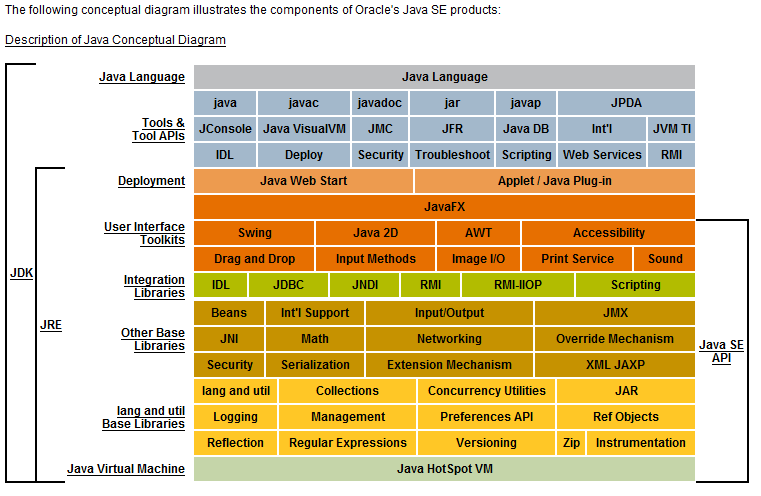

安装完JDK后，就会有JRE目录，JRE属于JDK的子集。

### 3、如何编译和运行Java文件？

1、使用**javac**命令来编译.java文件

> javac Test.java

运行之后会生成Test.class文件

2、使用java命令来运行

> java Test

### 4、Java中的关键字有哪些？

##### Java中的关键字：

| 关键字       | 含义                           |
| ------------ | ------------------------------ |
| package      | 指定包名                       |
| import       | 引用类                         |
| class        | 定义类                         |
| interface    | 定义接口                       |
| abstract     | 抽象类或者抽象方法             |
| new          | 创建对象                       |
| this         | 实例本身                       |
| super        | 引用父类                       |
| void         | 无返回                         |
| byte         | 字节型                         |
| char         | 字符型                         |
| int          | 整型                           |
| short        | 短整型                         |
| long         | 长整型                         |
| float        | 单精度浮点数                   |
| double       | 双精度浮点数                   |
| boolean      | 布尔型                         |
| enum         | 枚举型                         |
| strictfp     | 精确浮点                       |
| extends      | 继承类                         |
| implements   | 实现接口                       |
| private      | 私有权限，本类中可用           |
| protected    | 保护权限，本包、本类和子类可用 |
| public       | 公开权限，可挎包用             |
| final        | 类不可继承，方法不可重写、常量 |
| static       | 静态属性                       |
| synchronized | 线程同步                       |
| if           | 如果                           |
| else         | 或者                           |
| for          | for循环                        |
| do           | do while循环                   |
| while        | do while循环                   |
| switch       | switch case分支                |
| case         | switch case分支                |
| default      | switch case分支                |
| break        | 结束循环                       |
| continue     | 继续循环                       |
| return       | 返回                           |
| try          | 异常代码捕获                   |
| catch        | 异常处理                       |
| finally      | 最后处理                       |
| throw        | 手动抛出一个异常               |
| throws       | 声明要抛出的异常               |
| instanceof   | 判断是否xx类的实例             |
| volatile     | 线程可见                       |
| transient    | 不用序列化                     |
| native       | 非Java实现方法                 |
| assert       | 断言                           |
| var          | 任意类型，JDK10增加            |

| 保留关键字 |      |
| ---------- | ---- |
| goto       | 跳转 |
| const      | 常量 |

| 特殊关键字 |      |
| ---------- | ---- |
| true       | 真   |
| false      | 假   |
| null       | 空值 |

### 5、Java标识符命名规则是怎样的？

（1）标识符只能由字母（a-z, A-Z）、数字（0-9）、下划线（_）和美元符号（$）组成；

（2）标识符不能以数字开头；

（3）标识符不能使用Java关键字；

（4）标识符区分大小写；

### 6、Java类命名规范是怎样的？

类名首字母大写，后面每个单词首字母大写，符合**UpperCamelCase**大驼峰式风格，如：

- Order
- OrderDetail
- OrderMonthSummary

但一般像这种众所周知的缩写例外：DO、BO、DTO、VO、AO、PO、UID等。

### 7、Java方法命名规范是怎样的？

方法名首字母小写，后面每个单词首字母大写，符合**小驼峰式**，如：

- println
- indexOf
- saveOrderInfo

### 8、Java变量命名规范是怎样的？

变量包括方法参数名、成员变量、局部变量。

变量首字母小写，后面每个单词首字母大写，符合LowerCamelCase小驼峰式风格，如：

- amount
- orderPrice
- orderStockInfo

### 9、Java常量命名规范是怎样的？

常量名全部大写，单词间用下划线（_）隔开，如：

- MAX_LIMIT
- MAX_LOOP_COUNT
- ALIPAY_PAY_URL

### 10、Java常量和变量的区别？

##### Java常量和变量的主要区别在于：

常量是一个固定的值，赋值后是不能被改变的；

变量是一个不固定的值，赋值后是可以随时被改变的；

### 11、Java怎么定义一个常量？

Java使用`final`关键字来定义一个常量，如：

```java
final int MAX_COUNT = 100;
```

也可以加修饰范围，以及静态关键字，如：

```java
private static final int MAX_COUNT = 100;
```

### 12、Java常量有几种类型？

##### Java常量有三种类型：

1、静态常量（类中）

2、成员常量（类中）

3、局部常量（类方法中）

### 13、Java有哪几种基本数据类型？

##### Java有4类8种数据类型，它们分别是：

###### 1、整型

byte、short、int、long

###### 2、浮点型

float、double

###### 3、字符型

char

###### 4、布尔型

boolean

### 14、什么是枚举类型？

Java中的枚举是一种特殊的数据类型，用于定义一组常量，枚举使用`enum`进行定义，并且可以包含零个或多个枚举常量，多个用逗号分开。

枚举常量实际上是枚举类的静态实例，编译器会为每个枚举常量生成一个私有构造函数，用于创建枚举常量的实例。枚举常量在内存中只有一个实例，确保唯一性。

> 枚举类型可以用来表示一组固定的值，例如星期几、月份、颜色等，它提供了一种更简洁、可读性更高的方式来表示一组相关的常量。

以下是一个使用枚举的示例，表示一周的星期几：

```java
enum Day {
    MONDAY,
    TUESDAY,
    WEDNESDAY,
    THURSDAY,
    FRIDAY,
    SATURDAY,
    SUNDAY
}
```

上面`Day`就是一个枚举类，它定义了七个枚举常量，分别代表一周的每一天。

每个常量还可以添加多个字段，比如我添加一个中文名称字段：

```java
public class Test {

    public static void main(String[] args) {
        Day today = Day.MONDAY;
        System.out.println("Today is " + today);
        System.out.println("Today is " + today.getChineseName());
    }

    enum Day {
        MONDAY("星期一"),
        TUESDAY("星期二"),
        WEDNESDAY("星期三"),
        THURSDAY("星期四"),
        FRIDAY("星期五"),
        SATURDAY("星期六"),
        SUNDAY("星期日");

        private String chineseName;

        Day(String chineseName) {
            this.chineseName = chineseName;
        }

        public String getChineseName() {
            return chineseName;
        }
    }
}
```

输出结果：

```
Today is MONDAY
Today is 星期一
```

### 15、枚举和类的区别？

Java中枚举和类之间的区别：

|          | 枚举                     | 类                                 |
| -------- | ------------------------ | ---------------------------------- |
| 定义方式 | 使用`enum`关键字进行声明 | 使用`class`关键字进行声明          |
| 继承关系 | 不能继承                 | 可以继承其他类                     |
| 实例化   | 枚举常量是枚举类型的实例 | 可以创建类的实例对象               |
| 可修改性 | 枚举常量是不可修改的     | 类的属性和状态可以被修改           |
| 字段     | 可以有自己的字段         | 可以有自己的字段                   |
| 方法     | 可以有自己的方法         | 可以有自己的方法                   |
| 唯一性   | 每个枚举常量是唯一的     | 可以创建多个类的实例对象           |
| 比较     | 使用“==”进行比较         | 可以通过重写`equals()`方法进行比较 |
| 用途     | 表示一组相关的常量       | 封装数据和行为，实现复杂的功能     |

### 16、枚举可以修改吗？

枚举中的常量是不可以修改的，一旦枚举常量被定义，它们的值就是固定的，不能在运行时进行修改，枚举常量是在编译时就确定了的。

比如下面的枚举类型：

```java
enum Day {
        MONDAY("星期一"),
        TUESDAY("星期二"),
        WEDNESDAY("星期三"),
        THURSDAY("星期四"),
        FRIDAY("星期五"),
        SATURDAY("星期六"),
        SUNDAY("星期日");

        private String chineseName;

        Day(String chineseName) {
            this.chineseName = chineseName;
        }

        public String getChineseName() {
            return chineseName;
        }
    }
```

在程序运行期间，这些枚举常量不能删除，也不能添加新的枚举常量，它们的值也不能修改。

但是，枚举常量的字段的值是可以修改的，比如上面的枚举中的chineseName字段，添加一个set方法：

```java
public void setChineseName(String chineseName) {
    this.chineseName = chineseName;
}
```

测试一下：

```java
public static void main(String[] args) {
    Day today = Day.MONDAY;
    Day.MONDAY.setChineseName("礼拜一");
    System.out.println("Today is " + today);
    System.out.println("Today is " + today.getChineseName());
}
```

输出结果：

```
Today is MONDAY
TOday is 礼拜一
```

但是在开发中不建议这样做，一般建议把字段定义为`final`类型，这样就不能修改了。

### 17、枚举命名规范是怎样的？

枚举就是特殊的常量类，命名和类一样。

##### 阿里开发手册推荐：

- 枚举以*Enum命名；
- 枚举字段名称全大写，单词之间使用下划线分隔；

命名示例：

> 状态枚举：StatusEnum
>
> 枚举字段：SUCCESS / FAILED / PROCESS...

### 18、==和equals比较有什么区别？

**==**

（1）如果比较的对象是基本数据类型，则比较的是数值是否相同；

（2）如果比较的对象是引用数据类型，则比较的是对象的地址是否相同。

**equals**

equals是Object类提供的方法，接收Object参数类型，如源码所示：

```java
public boolean equals(Object obj) {
    return (this == obj);
}
```

即用来比较两个对象是否相等，默认比较的是对象的地址，不能用于比较基本数据类型，但可以是包装类型，所以，如果要比较两个对象的值是否相等，一般需要重写equals和hashCode方法。

比如常用的String、Date、Integer等类都重写了equals和hashCode方法，使其比较的是存储对象的内容是否相等，而不是堆内存地址。

### 19、字符串比较是用equals还是==？为什么？

如String类源码所示，它已经重写了equals方法：


String中的equals方法是先用==比较是否同一个对象，然后再比较内容是否相同。

**所以如果要比较字符串对象的内容是否相等就用equals方法，而要比较字符串的内存地址是否相等就用==比较，不过实际情况都是比较字符串内容而不会是比较内存地址。**

如下面的示例：

```java
public static void main(String[] args) {
    String str1 = new String("java面试题");
    String str2 = new String("java面试题");

    // 两个不同字符串对象==比较，返回false
    System.out.println(str1 == str2);

    // 两个字符串内容相同equals比较，返回true
    System.out.println(str1.equals(str2));
}
```

输出结果：

```
false
true
```

### 20、Java支持xx≠null不等于写法吗？

不支持，正常的不等于写法是：`!=`

### 21、public、private、protected、默认的区别？

具体区别如下表所示：

| 作用域       | 当前类 | 当前包 | 子孙类 | 其他包 |
| ------------ | ------ | ------ | ------ | ------ |
| public       | √      | √      | √      | √      |
| protected    | √      | √      | √      |        |
| 默认（不写） | √      | √      |        |        |
| private      | √      |        |        |        |

不写为默认作用域，比如以下用来修饰成员变量：

```java
public class User {
    String name;
}
```

这个默认没有关键字，不用写。

### 22、this和super有什么区别？

##### this：代表当前对象本身：

- this(...)：调用本类的构造方法；
- this.成员变量：调用当前对象的成员变量，包括从父类继承的；
- this.成员方法(...)：调用当前对象的成员方法，包括从父类继承的；

##### super：代表当前对象的父类：

- super(...)：调用父类的构造方法；
- super.成员变量：调用父类的成员变量；
- super.成员方法(...)：调用父类的成员方法；

### 23、Java中的运算符都有那些？

Java中运算符有以下几类：

| 运算符     | 示例                                                     |
| ---------- | -------------------------------------------------------- |
| 算术运算符 | +   -   *   /   %   ++   -                               |
| 关系运算符 | ==   !=   >   <   >=   <=                                |
| 位运算符   | &   ^   ~ >>   <<   >>>                                  |
| 逻辑运算符 | &&   \|\|   !                                            |
| 赋值运算符 | =   +=   -=   *=   /=   (%)=   <<=   >>=   &=   ^=   \|= |
| 三目运算符 | ? :                                                      |

优先级从高到低排列：

| 类别     | 操作符                                                 | 关联性   |
| -------- | ------------------------------------------------------ | -------- |
| 后缀     | ()   []   .                                            | 左到右   |
| 一元     | i++   i-                                               | 从左到右 |
| 一元     | ++i   --i   +   -   ~   !                              | 从右到左 |
| 乘性     | *   /   %                                              | 左到右   |
| 加性     | +   -                                                  | 左到右   |
| 移位     | >>   >>>   <<                                          | 左到右   |
| 关系     | >   >=   <   <=                                        | 左到右   |
| 相等     | ==   !=                                                | 左到右   |
| 按位与   | &                                                      | 左到右   |
| 按位异或 | ^                                                      | 左到右   |
| 按位或   | \|                                                     | 左到右   |
| 逻辑与   | &&                                                     | 左到右   |
| 逻辑或   | \|\|                                                   | 左到右   |
| 条件     | ? :                                                    | 从右到左 |
| 赋值     | =   +=   -=   *=   /=   %=   >>=   <<=   &=   ^=   \|= | 从右到左 |
| 逗号     | ,                                                      | 左到右   |

### 24、`s1 = s1 + 1`和`s1 += 1`的区别？

如果s1原有数据类型小于int类型，则s1 = s1 + 1会发生编译异常，如下面的程序所示：


因为s1为short类型，而数字1默认为int类型，所以计算的结果则为int类型，它不能自动转换为比它更小的类型，所以会发生编译异常。

解决办法就是使用类型强制转换：

```java
public static void main(String[] args) throws Exception {
    short s1 = 1;
    s1 = (short) (s1 + 1);
    System.out.println(s1);    // s1 = 2
}
```

使用s1 += 1则不会有任何问题，因为s1 += 1支持`隐式强制类型转换`，涉及到表达式类型自动提升，会自动提升为计算结果的数据类型，如以下程序：

```java
public static void main(String[] args) throws Exception {
    short s1 = 1;
    s1 += 1;
    System.out.println(s1);   // s1 = 2
}
```

### 25、`short s1 = 1; s1 += 1;`有错吗？

没错，可以正常编译，如下图所示：

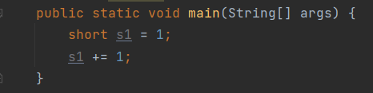

因为s1 += 1;相当于s1 = (short) (s1 + 1)，其中有隐式强制类型转换。

### 26、`short s1 = 1; s1 = s1 + 1;`有错吗？

有错，如下图所示：


因为1是int类型，因此s1 + 1运算结果也是int类型，需要强制转换类型才能赋值给short型。


### 27、`float n = 1.8`有错吗？

答案：**有错！！！**

数字1.8默认是双精度数（double），将双精度型（double）赋值给单精度型浮点型（float）属于向下转型（down-casting），会产生编译错误：


因此，需要强制类型转换：

> float n = (float) 1.8;

或者写成这种形式：

> float f = 1.8F;

F即表示float类型。

### 28、`i++`和`++i`的区别？

`i++`是先取值后再自增，`++i`是先自增后再取值，来看下面这段程序就明白了：

```java
public static void main(String[] args) {
    int i = 1;
    int j = i++ + 1;
    System.out.println(j);   // j = 2

    i = 1;
    int k = ++i + 1;
    System.out.println(k);    // k =3
}
```

程序解读：

- i++先取值再自增，所以 j = 1 + 1 = 2
- ++i先自增再取值，所以 k = 2 +1 = 3

### 29、`while`和`do while`有啥区别？

`while`和`do while`都是循环语句，不同的是，`while`是先判断条件再执行循环，而`do while`是先执行循环再判断条件：

```java
public static void main(String[] args) {
    int i = 0;
    while (i < 5) {
        System.out.println("i = " + ++i);
    }

    i = 0;
    do {
        System.out.println("i = " + ++i);
    } while (i < 5);
}
```

所以说，在同样条件下，如果初始条件不成立，do while是会多执行一次的。

### 30、如何跳出Java中的循环？

###### 可以使用以下关键字：

| 关键字   | 说明                   |
| -------- | ---------------------- |
| continue | 跳出当前本次循环       |
| break    | 跳出整个循环           |
| return   | 跳出整个循环及当前方法 |

### 31、如何跳出Java中的多层嵌套循环？

可以在最外面的循环语句前定义一个标号，然后在最里层循环体中使用`break`标号语句跳出嵌套循环。

如以下程序所示：

```java
public static void main(String[] args) {
    breakPrint:
    for (int i = 0; i < 100; i++) {
        for (int j = 0; j < 100; j++) {
            System.out.println("i=" + i + ", j=" + j);
            if (j == 66) {
                break breakPrint;
            }
        }
    }
}
```

输出结果如下：


可以看到，i只输出到0，证明多层循环被全部跳出了。

### 32、`&`和`&&`的区别？

> 逻辑判断推荐使用&&，位运算则需要使用&

&和&&都可以用作逻辑与的运算符，表示逻辑与（and），当运算符两边的表达式的结果都为true时，整个运算结果才为true，否则，只要有一方为false，则结果为false。

&&还具有短路的功能，即如果第一个表达式为false，则不再计算第二个表达式。

&还可以用作位运算符，当&操作符两边的表达式不是boolean类型时，&表示按位与操作，我们通常使用0x0f来与一个整数进行&运算，来获取该整数的最低4个bit位，例如，0x31 & 0x0f 的结果为0x01。

### 33、Java怎么进行数组初始化？

方法一：

```java
// 一维数组
int[] arr = new int[5];

// 二维数组
int[][] arr = new int[3][4];
```

方法二：

```java
// 一维数组
int[] arr = {1, 2, 3, 4, 5};
```

方法三：

```java
int[] arr = new int[]{1, 2, 3, 4, 5};
```

### 34、数组有没有length方法？Sring呢？

数组没有length()方法，但是有length属性，String有length()方法。

使用示例如下：

```java
public static void main(String[] args) {
    String str = "Java";
    String[] languages = new String[]{"java", "PHP", "GO"};
    System.out.println(str.length());
    System.out.println(languages.length);
}
```

结果输出：


### 35、怎么理解值传递和引用传递？

**值传递**：传递的是基本类型参数的字面量值的拷贝，方法对参数的修改不会影响之前参数的值。

**引用传递**：传递的是该引用的对象在堆中地址值的拷贝，而不是拷贝整个对象本身，方法对参数的修改会直接影响参数之前的值。

### 36、Java到底是值传递还是引用传递？

网上很多争议，这里解读下：

> **Java中只有值传递：**
>
> - ****对于基本数据类型，传递的是它们的实际值的副本；
> - 对于引用类型，传递的是对象的引用的值的副本，即对象的内存地址，而不是对象本身。
>
> 值传递传递的是数据的拷贝，而不是数据本身，引用类型的传递虽然可以修改引用对象的内容，但不能修改引用本身（引用类型和内存地址），所以，引用传递其实就是值传递的一种形式。

所以，严格来说，Java中只有值传递。

### 37、Java中的注释有哪些写法？

1、单行注释

```java
private int id;   // 这是ID
```

2、块注释

```java
private int id;  /* 这是ID */
```

3、文档注释

```java
/**
* 这是ID
*/
private int id;
```

### 38、Java中的构造方法是什么？

构造方法是构造类的主要方法，Java中的每个类都必须要有构造方法，构造方法名和类名相同，没有返回类型， new一个对象的时候就会调用指定的构造方法，如图：

```java
public class Test {
    private int id;

    public Test() {
        this.id = 100;
    }
}
```

如果只有一个默认的构造方法，不需要赋值初始化，则可以省略，比如：

```java
public class Test {
    
    private int id;

    public int getId() {
        return id;
    }

    public void setId(int id) {
        this.id = id;
    }
}
```

### 39、Java一个类可以有多少个构造方法？

一个类**至少要有一个**构造方法，也可以**有多个**构造方法，即构造方法重载，方法参数数量或者类型不同，如代码所示：

```java
public class Test {
    
    private int id;

    public Test() {
        this.id = 100;
    }

    public Test(int id) {
        this.id = id;
    }
}
```

如果没有显式地创建构造方法，Java编译器也会为该类提供一个默认构造方法。

### 40、`static`关键字有什么用？

static代表“**静态**”的意思，可以用来修饰：

- 静态内部类（静态内部类可以不依赖外部类实例对象而被实例化，而内部类需要在外部类实例化后才能被实例化）
- 静态方法（静态方法属于类方法，不需要实例化对象就能调用）
- 静态变量（静态变量属于类，不需要实例化对象就能调用）
- 静态代码块（静态代码块只会在类被加载时执行且执行一次）

使用实例如下：

```java
public class Test {
    static {
        System.out.println("静态代码块");
    }

    // 静态内部类
    static class Test2 {

    }

    // 静态变量
    private static int id = 0;

    // 静态方法
    public static void staticMethod() {

    }
}
```

### 41、`static`变量和普通变量地区别？

##### 1、所属目标不同

静态变量属于类的变量，普通变量属于对象的变量。

##### 2、存储区域不同

静态变量存储在方法区地静态区，普通变量存储在堆区。

> 另外：JDK7及以上，静态变量存储在其对应的Class对象中，而Class对象和其他普通对象一样，都存储在堆中的。

##### 3、加载时间不同

静态变量是随着类的加载而加载，随着类的消失而消失；

普通变量随着对象的加载而加载，随着对象的消失而消失。

##### 4、调用方式不同

静态变量只能通过类名、对象调用，普通变量只能通过对象调用。

### 42、`static`可以修饰局部变量吗？

static不能修饰局部变量，可以是内部类、全局成员变量、方法、代码块。

### 43、在`static`方法中可不可使用`this`或`super`，为什么？

在`static`方法中不可以使用`this`和`super`关键字：


因为this和super代表的是实例化后的操作对象，而static属于类级别，无法指向任何实例。

### 44、final关键字有哪些用法？

final关键字的用法如下表：

| 修饰类型 | 说明                                 |
| -------- | ------------------------------------ |
| 修饰类   | 表示该类不能被继承                   |
| 修饰方法 | 表示该方法不能被重写                 |
| 修饰变量 | 表示常量，只能复赋值一次，不能被修改 |

### 45、final、finally、finalize有什么区别？

#### final

final是修饰符：

- 如果修饰类，此类就不能被继承；
- 如果修饰方法，此方法就不能被重写；
- 如果修饰变量，此变量就不能再被改变；

#### finally

finally是try-catch-finally最后的一部分，表示不论发生任何情况都会执行的部分，finally部分可以省略，但如果finally部分存在，则一定会执行finally里面的代码（发生Error错误等非程序性异常除外）。

#### finalize

finalize是Object类的一个方法，在垃圾收集器执行的时候会自动调用被回收对象的此方法，一般不建议主动使用。

### 46、Java支持多继承吗？

Java类与类之间不支持多继承，只能单继承：


Java接口与接口之间支持多继承：


### 47、Java类可以实现多个接口吗？

可以的，一个类可以实现多个接口：


### 48、重载和重写有什么区别？

##### 方法重写

是父类与子类之间多态性的一种表现，即子类可以覆盖从父类继承的方法，重写的方法一般使用@Override标识，比如以下示例：

```java
@Override
public String toString() {
    return this.getName() + ...
}
```

这里是重写了Object祖先类的toString方法。

##### 方法重载

是一个类中方法多态性的一种表现，即一个类中可以有多个同名的方法，方法的参数类型不同，或者参数个数不同，返回类型可以相同也可以不同，比如以下实例：

```java
public Connection connection(String host) {
    ...
}

public Connection connection(String host, int port) {
    ...
}
```

同一个方法名，可以有多个不同的连接参数创建连接，这是很常见的方法重载方式。

### 49、构造器可以被重写和重载吗？

一个类的构造器只属于当前类，它不能被继承，所以它不能被重写。

一个类里面可以有多个构造器，所以它可以被重载。

### 50、私有方法能被重载或者重写吗？

##### 使用private修饰的私有方法，只可以重载，不能被子类重写。

因为private该作用域就只能在当前类中可见，子类见都见不到，别谈重写，重写至少需要protected及以上的作用域。

### 51、静态方法能被重载或者重写吗？

**静态方法可以被重载**，一个类可以存在多个同名但不同参数的static方法。

**静态方法不可以被重写**，如果子类也定义了相同的，会被子类同名的静态变量，静态方法所隐藏。

### 52、静态方法可以被继承吗？

（1）父类的静态属性、静态方法可以被子类继承；

（2）如果子类也定义了相同的静态属性、方法，那父类中的定义就会被子类同名的静态变量，静态方法所隐藏。

### 53、Java异常有哪些分类？

下面是Java异常类的组织结构，红色区域的异常类表示是程序需要显示捕捉或者抛出的。


##### Throwable

Throwable是Java异常的顶级类，所有的异常都继承于这个类。

Error，Exception是异常类的两个大分类。

##### Error

Error是非程序异常，即程序不能捕获的异常，一般是编译或者系统性的错误，如OutOfMemorry内存溢出异常等。

##### Exception

Exception是程序异常类，由程序内部产生，Exception又分为运行时异常、非运行时异常。

##### 运行时异常

运行时异常的特点是Java编译器不会检查它，也就是说，当程序中可能出现这类异常，即使没有用try-catch语句捕获它，也没有用throws子句声明抛出它，也会编译通过，运行时异常可处理或者不处理。

常见的运行时异常如NullPointException、ArrayIndexOutOfBoundsException等。

##### 非运行时异常

非运行时异常是程序必须进行处理的异常，捕获或者抛出，如果不处理程序就不能编译通过。如常见的IOException、ClassNotFoundException等。

### 54、`Error`和`Exception`有什么区别？

`Error`和`Exception`都属于异常总父类Throwable的子类：


**Error**表示系统级的错误和程序不必处理的异常，它是一种严重的非程序性的错误，比如内存溢出错误，它不能由程序控制和处理。

**Exception**则表示程序性异常，可以由程序进行定义、控制和处理。

### 55、Java中常见的异常有哪些？

##### 1、NullPointerException

空指针异常，操作一个null对象的方法或属性时会抛出这个异常。

##### 2、OutOfMemoryError

内存溢出异常，这不是程序能控制的，是指要分配的对象的内存超出了当前最大的堆内存，需要调整堆内存大小（-Xmx）以及优化程序。

##### 3、IOException

IO，即：input，output，我们在读写磁盘文件、网络内容的时候经常会发生的一种异常，这种异常是受检查异常，需要进行手工捕获。

如文件读写会抛出IOException：

```java
public int read() throws IOException
public void write(int b) throws IOException
```

##### 4、FileNotFoundException

文件找不到异常，如果文件不存在就会抛出这种异常。

如定义输入输出文件流，文件不存在会报错：

```java
public FileInputStream(File file) throws FileNotFoundException
public FileOutputstream(File file) throws FileNotFoundException
```

FileNotFoundException其实是IOException的子类，同样是受检查异常，需要进行手工捕获。

##### 5、ClassNotFoundException

类找不到异常，这是在加载类的时候抛出来的，即在类路径下不能加载指定的类。

看一个示例：

```java
public static <T> Class<T> getExistingClass(ClassLoader classLoader, String className) {
    try {
        return (Class<T>) Class.forName(className, true, classLoader);
    } catch (ClassNotFoundException e) {
        return null;
    }
}
```

它是受检查异常，需要进行手工捕获。

##### 6、ClassCastException

类转换异常，将一个不是该类的实例转换成这个类就会抛出这个异常。

如将一个数字强制转换成字符串就会报这个异常：

```java
Object x = new Integer(0);
System.out.println((String)x);
```

这是运行时异常，不需要手工捕获。

##### 7、NoSuchMethodException

没有这个方法异常，一般发生在反射调用方法的时候，如：

```java
public Method getMethod(String name, Class<?>...parameterTypes) throws NoSuchMethodException, SecurityException {
    checkMemberAccess(Member.PUBLIC, Reflection.getCallerClass(), true);
    Method method = getMethod0(name, parameterTypes, true);
    if (method == null) {
        throw new NoSuchMethodException(getName() + "." + name + argumentTypesToString(parameterTypes));
    }
    return method;
}
```

它是受检查异常，需要进行手工捕获。

##### 8、IndexOutOfBoundsException

索引越界异常，当操作一个字符串或者数组的时候经常遇到的异常。


如图所示，它是运行时异常，不需要手工捕获。

##### 9、ArithmeticException

算术异常，发生在数字的算术运算时的异常，如一个数字除以0就会报这个错。

```java
double n = 3 / 0;
```

这个异常虽然是运行时异常，可以手工捕获抛出自定义的异常，如：

```java
public static TimeStamp from(Instant instant) {
    try {
        TimeStamp stamp = new TimeStamp(instant.getEpochSecond() * MILLIS_PER_SECOND);
        stamp.nanos = instant.getNano();
        return stamp;
    } catch (ArithmeticException ex) {
        throw new IllegaArgumentException(ex);
    }
}
```

##### 10、SQLException

SQL异常，发生在操作数据库时的异常。

如下面的获取连接：

```java
public Connection getConnection() throws SQLException {
    if (getUser() == null) {
        return DriverManager.getConnection(url);
    } else {
        return DriverManager.getConnection(url, getUser(), getPassword());
    }
}
```

又或者时获取下一条记录的时候：

```java
boolean next() throws SQLException;
```

它是受检查异常，需要进行手工捕获。

### 56、Java中常见的运行时异常有哪些？

常见的运行时异常（RuntimeException）主要有：

| 异常                      | 说明             |
| ------------------------- | ---------------- |
| NullPointerException      | 空指针异常       |
| IndexOutOfBoundsException | 数组越界异常     |
| ClassCastException        | 类型强制转换异常 |
| ArithmeticException       | 算术异常         |
| SecurityException         | 违背安全原则异常 |

更多可以查看RuntimeException运行时异常类的子异常。

### 57、运行时异常与受检查异常有什么区别？

##### 运行时异常

指RuntimeException异常类及其子类，表示在程序运行时才可能发生的异常，编译器编译时不用检查，方法可以不用主动catch，也可以不用throws声明抛出运行时异常。

##### 受检查异常

指非RuntimeException类型的异常，即编译器在编译时就会检查的异常，方法需要主动catch或者用throws声明所用的受检查异常，不然会出现编译错误。

------

空指针异常是运行时异常：


在程序中可以不用声明，也不用捕获。

IO异常是受检查异常：


在程序中必须声明或者捕获。

### 58、什么时候会发生空指针异常？

当一个变量的值为null时，在Java里面表示一个不存在的空对象，没有实际内容，没有给它分配内存，null也是对象成员变量的默认值。

所以，一个对象如果没有进行初始化操作，这时候，如果你调用这个对象的方法或者变量，就会出现空指针异常。如下面示例会发生空指针异常：

```java
Object object = null;
String string = object.toString();
```


从类结构图来看，空指针它是属于运行时异常`RuntimeException`的子类，他不是捕获型的，只有在程序运行时才可能报出来，而且会造成程序中断。

### 59、你知道有哪些避免空指针的方法？

下面说几个空指针的几个最常见的案例及解决之道。

##### 1、字符串比较，常量放前面

```java
if(status.equals(SUCCESS)) {

}
```

这个时候status可能为null造成空指针异常，应该把常量放前面，就能避免空指针异常。

```java
if(SUCCESS.equals(status)) {

}
```

这个应该在各种开发规范里面都会提到，也是最基础的。

##### 2、初始化默认值

在对象初始化的时候给它一个默认值或者默认构造实现，如：

```java
User user = new User();
String name = StringUtils.EMPTY;
```

##### 3、返回空集合

在返回一个集合的话，默认会是null，统一规范返回一个空集合。

举个List例子，如：

```java
public List getUserList() {
    List list = userMapper.getUserList();
    return list == null ? new ArrayList() : list;
}
```

这样接收方就不用担心空指针异常了，也不会影响业务。

##### 4、断言

断言是用来检查程序的安全性的，在使用之前进行检查条件，如果不符合条件就报异常，符合就继续。

Java中自带的断言关键字，assert，如：

```java
assert name == null : "名称不能为空";
```

输出：

```java
Exception in thread "main" java.lang.AssertionError: 名称不正确
```

不过默认是不启动断言检查的，需要带上JVM参数：-enableassertions才能生效。

Java中这个用的很少，建议使用Spring中的，更强大，更方便好用。

Spring中的用法：

```java
Assert.notNull(name, "名称不能为空");
```

##### 5、Optional

Optional是JDK 8 新增的新特性，再也不用 `!=null`来判断了，这个在一个对象里面的多个子对象连续判断的时候非常有用。

> 这里大概介绍5种，其实还有更多，如何避免空指针，一是要注意代码编写规范，二是要提高代码素养。

### 60、`throw`和`throws`的区别？

`throw`用在方法中，用来主动抛出一个异常，`throws`则是用在方法声明中，声明方法可能会抛出的异常。

来看Object#wait方法的使用示例：

 

两个不一定要同时使用，如果方法中抛出的是RuntimeException及其子异常，则方法可以不用throws声明，否则需要强制声明，比如下面的示例：

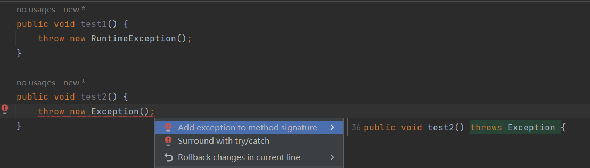

test1方法正常编译，而test2方法抛出的不是RuntimeException类型，又没有使用throws声明抛出，所以会报编译错误：

正确修改后：

```java
public void test1() {
    throw new RuntimeException("发生异常");
}

public void test2() throws Exception {
    throw new Exception("发生异常");
}
```

### 61、`try-catch-finally`中哪个部分可以省略？

`try-catch-finally`其中`catch`和`finally`都可以被省略，但是不能同时省略，也就是说有`try`的时候，必须后面跟一个`catch`或者`finally`。

如果是资源处理类型，并且实现了AutoCloseable接口，把定义它放在try(...)中，然后方法上再加上throws异常，是可以省略catch和finally的，只需要try即可，比如：

```java
private void test() throws Exception {
    try (InputStream is = new FileInputStream("")) {
        ...
    }
}
```

### 62、Java可以一次`catch`多个异常吗？

Java 7开始可以一次catch多个异常，比如：

```java
public static void mian(String[] args) throws Exception {
    try {
        System.out.println("java面试题");
    } catch (SecurityException | NullPointerException | NoClassDefFoundError e) {

    }
}
```

### 63、使用`try-catch`会影响性能吗？

一般情况下，`try-catch`块的执行时间很短，它不会对性能产生显著的影响，但是在极端情况下，try-catch块的使用可能会对性能产生影响。比如在代码中频繁地抛出和捕获异常，尤其是在高并发的情况下，`try-catch`块的性能可能会成为瓶颈。在这种情况下，可以使用其他方式处理异常，如：**条件判断**，以提高代码的性能。

来自阿里巴巴《Java开发手册》中的异常规范：

> 异常设计的初衷是解决程序运行中的各种意外情况，且异常的处理效率比条件判断方式要低很多，所以：
>
> （1）可以通过预检查的方式规避异常，而不是依赖try-catch来处理。
>
> （2）异常捕获后不要用来做流程控制，条件控制。

### 64、`int`和`Integer`有什么区别？

##### 最主要的几点区别：

（1）int是一种基本数据类型，Integer则是int的包装类型。

（2）int的默认值是0，而Integer属于Java类，所以它的默认值是null。

（3）int可以直接使用，而Integer属于Java类，所以它需要经过实例化才能使用。

（4）Integer属于Java类，所以它的使用范围更广，比如泛型，int则不行。

### 65、什么是包装类型？有什么用？

#### 什么是包装类型

Java设计当初就提供了8种基本数据类型及对应的8种包装数据类型。我们知道Java是一种面向对象编程的高级语言，所以包装类型正是为了解决基本数据类型无法面向对象编程所提供的。

下面是基本数据类型与对应的包装类型。

| 基本数据类型 | 包装类型  |
| ------------ | --------- |
| byte         | Byte      |
| boolean      | Boolean   |
| short        | Short     |
| char         | Character |
| int          | Integer   |
| long         | Long      |
| float        | Float     |
| double       | Double    |

下面是包装类型的继承结构图。


从以上图表可以对基本类型和包装类型有一个全面的了解。

##### 包装类应用场景

###### 1、集合类泛型只能是包装类；

```java
// 编译报错
List<int> list1 = new ArrayList<>();

// 正常
List<Integer> list2 = new ArrayList<>();
```

###### 2、成员变量不能有默认值；

```java
private int status;
```

基本数据类型的成员变量都有默认值，如以上代码status默认值为0，如果定义中0代表失败，那样就会有问题，这样只能使用包装类Integer，它的默认值为null，所以就不会有默认值影响。

###### 3、方法参数允许定义空值；

```java
private static void test1(int status) {
    System.out.println(status);
}
```

看以上代码，方法参数定义的是基本数据类型int，所以必须得传一个数字过来，不能传null，很多场合我们希望是能传递null的，所以这种场合包装类比较合适。

### 66、什么是自动装箱、拆箱？

##### 自动装箱、拆箱

Java 5增加了自动装箱、拆箱机制，提供基本数据类型和包装类型的相互转换操作。

##### 自动装箱

自动装箱即自动将基本数据类型转换成包装类型，在Java 5之前，要将基本数据类型转换成包装类型只能这样做，看下面的代码：

```java
public static void main(String[] args) {
    Integer i1 = new Integer(8);   // 此种方式，Java9已标识废除
    Integer i2 = Integer.valueOf(8);

    // 自动装箱
    Integer i3 = 8;
}
```

第3种方法也正是自动装箱功能，其实自动装箱的原理就是调用包装类的`valueOf`方法，如第2个方法中的Integer.valueOf()方法。

> 另外，第一种构造器方法也不推荐使用了，已经标为废弃了。

##### 自动拆箱

自动拆箱即自动将包装类型转换成基本数据类型，与自动装箱相反，有装就有拆，很好理解，看下面的例子，

```java
public static void main(String[] args) {
    Integer i1 = new Integer(8);
    Integer i2 = Integer.valueOf(8);

    // 自动装箱
    Integer i3 = 8;

    // 自动拆箱
    int i4 = i3;
    int i5 = i3.intValue();
}
```

把i3赋值给i4就是实现的自动拆箱功能，自动拆箱的原理就是调用包装类的`xxValue`方法，如i5中的Integer的`intValue`方法。

> 自动装箱、拆箱不只是体现在以上的例子，在方法接收参数、对象设置参数时都能自动装箱拆箱。

### 67、你怎么理解Java中的强制类型转换？

强制类型转换我们再清楚不过了，即强制显示的把一个数据类型转换为另外一种数据类型。

如以下示例：

```java
short s = 199;
int i = s;   // 199

double d = 10.24;
long l1 = (long)d; // 10
```

以上的转换结果都在我们的预期之内，属于正常的转换和丢失精度的情况，下面的例子就一样属于数据溢出的情况：

```java
int ii = 300;
byte b = (byte)ii;
```

300已经超出了byte类型表示的范围，所以会转换成一个毫无意义的数字。

### 68、你怎么理解Java中的自动类型转换？

**自动类型转换**：是指数字表示范围小的数据类型可以自动转换成范围大的数据类型。

如：

```java
long l = 100;

int i = 200;
long ll = i;
```

具体自动转换如下图所示。

 

实线表示自动转换时不会造成数据丢失，虚线则可能会出现数据丢失问题。

**自动转换也要小心数据溢出问题，看下面的例子。**

```java
int count = 100000000;
int price = 1999;
long totalPrice = count * price;
```

编译没任何问题，但结果却输出的是负数，这是因为两个int相乘得到的结果是int，相乘的结果超出了int的代表范围。这种情况，一般把第一个数据转换成范围大的数据类型再和其他的数据进行运算。

```java
int count = 100000000;
int price = 1999;
long totalPrice = (long)count * price;
```

另外，向下转换时可以直接将int常量字面量赋值给byte、short、char等数据类型，而不需要强制转换，只要该常量值不超过该类型的表示范围都能自动转换。

### 69、你怎么理解Java中的类型提升？

##### 类型提升

所谓类型提升就是指在多种不同数据类型的表达式中，类型会自动向范围表示大的值的数据类型提升。

如下面的示例：

```java
long count = 100000000;
int price = 1999;
long totalPrice = price * count;
```

price为int型，count为long型，运算结果自动向上提升为long型，运算结果正常，没有出现溢出的情况。

### 70、怎么理解Java中的多态机制？

多态，即”**多种状态**“的意思，在Java中有以下几种情形。

##### 一、方法多态

- **方法重写**：是父类与子类之间多态性的一种表现，即子类可以覆盖从父类继承的方法；
- **方法重载**：是一个类中方法多态性的一种表现，即一个类中可以有多个同名的方法，方法的参数类型不同，或者参数个数不同，返回类型可以相同也可以不同。

##### 二、对象多态

- **接口和实现类**：接口可以有多种不同的实现形式；
- **抽象类和实现类**：抽象类和实现类可以有多种不同的形式；

### 71、Java如何获取用户的输入？

可以通过Scanner类来获取用户的输入，即：

java.util.Scanner。

基本语法：

```java
Scanner sc = new Scanner(System.in);
```

然后通过next()或者nextLine()方法获取输入的字符串，比如以下示例：

```java
public static void main(String[] args) {
    Scanner scanner = new Scanner(System.in);
    String text = scanner.nextLine();
    System.out.println(text);
}
```


先输入一行文字再换行，结果正常输出。

### 72、`switch`是否能用在`long`上？

长整型（long）在目前所有的版本中都是不支持的：


在开发工具中会出现编译错误，并提示可用的类型。

### 73、`switch`是否能用在`String`上？

从Java 7开始，是可以用在字符串（String）上的，来看使用示例：

```java
public static void mian(String[] args) {
    String str = "Java";
    switch (str) {
        case "C++":
            System.out.println(0);
            break;
        case "Java":
            System.out.println(1);
            break;
        default:
            System.out.println(2);
    }
}
```

程序输出：1

### 74、`switch case`支持哪几种数据类型？

java中`switch case`语句用来判断一个变量与一系列值中某个值是否相等，每个值称为一个分支。

##### 语法格式如下：

```java
switch(expression) {
    case value:
        // 语句
        break;  // 可选
    case value:
        // 语句
        break;  // 可选
    // 你可以有任意数量的case语句
    default:   // 可选
        // 语句
}
```

###### 这里的`expression`都支持那些类型呢？

- 基本数据类型：byte、short、char、int
- 包装数据类型：Byte、Short、Character、Integer
- 枚举类型：Enum
- 字符串类型：String（JDK 7+开始支持）

基本数据类型和字符串很简单不用说，下面举一个使用包装类型和枚举的，其实也不难，注意只能用在switch块里面。

```java
// 使用包装类型
Integer value = 5;
switch (value) {
    case 3:
        System.out.println("3");
        break;
    case 5:
        System.out.println("5");
        break;
    default:
        System.out.println("default");
}

// 使用枚举类型
Status status = Status.PROCESSING;
switch (status) {
    case OPEN:
        System.out.println("open");
        break;
    case PROCESSING:
        System.out.println("processing");
        break;
    case CLOSE:
        System.out.println("close");
        break;
    default:
        System.out.println("default");
}
```

以下为官网的介绍文档。

> https://docs.oracle.com/javase/tutorial/java/nutsandbolts/switch.html

**使用switch case语句也有以下几点需要注意。**

1、case里面必须跟break，不然程序会一个个case执行下去，直到最后一个break的case或者default出现；

2、case条件里面只能是常量或者字面常量；

3、default语句可有可无，最多只能有一个；

### 75、String属于基础的数据类型吗？

String是字符串类，属于Java中的“**类**”，它不属于基础数据类型。


### 76、String类的常用方法都有哪些？

String类常用的方法有：

| 方法        | 说明                     |
| ----------- | ------------------------ |
| equals      | 比较值是否相同           |
| indexOf     | 返回指定字符的索引       |
| charAt      | 返回指定索引处的字符     |
| replace     | 字符串替换               |
| trim        | 去除字符串两端空白       |
| split       | 分割字符串成数组         |
| getBytes    | 获取字符串的byte类型数组 |
| length      | 获取字符串长度           |
| toLowerCase | 转成小写字母             |
| toUpperCase | 转成大写字母             |
| subString   | 截取字符串               |

### 77、String字符串如何进行反转？

（1）最快的方法是借助StringBuilder或者StringBuffer中的reverse方法。

（2）借助字符串的charAt方法，从后到前遍历字符串，然后填充起来。

（3）借助Collections.reverse(List...)方法，先把字符串转为List然后再反转。

（4）借助其他第三方工具类，比如CollectionUtils工具类等。

### 78、String字符串如何实现编码转换？

先通过getBytes方法获取字节数组，再使用带编码的String构造器。

如代码所示，把字符串转换成UTF-8：

```java
public static void main(String[] args) throws UnsupportedEncodingException {
        String text1 = "java面试题";
        String text2 = new String(text1.getBytes(), "UTF-8");
        System.out.println(text1);
        System.out.println(text2);
    }
```

结果输出：

> java面试题
>
> java面试题

### 79、String与byte[]之间如何转换？

String > byte[]通过String类的getBytes方法：


byte[] > String通过各种String构造器：


### 80、String.trim()方法有什么用？

String.trim()用于去掉字符串**首尾**的空白字符，如下面的示例程序：

```java
public static void main(String[] args) {
        String text = "   java面试题   ";
        System.out.println(text.trim());
    }
```

输出结果：

 

它不能去除中间的空白字符。

### 81、字符串分割有哪些方式？

（1）使用字符串自身的split方法；

（2）使用JDK的StringTokenizer工具类；

（3）使用Spring/Apache commons-long等工具包中的工具类；

（4）自己可以利用indexOf方法写一个分割工具类；

### 82、字符串工具类isEmpty和isBlank的区别？

isEmpty和isBlank到底有啥区别？

##### 1、isEmpty

判断字符串是否为空字符串，只要有一个任意字符（包括空白字符）就不为空。

来看isEmpty的方法源码：

```java
public static boolean isEmpty(CharSequence cs) {
    return cs == null || cs.length() == 0;
}
```

看到没，这个方法只判断了是为null或者长度为0。

意味着，如果用户输入“ ”等空白字符，这个方法就不通过了，结果就是不为空了。

如验证输入以下内容：

| 输入内容     | 是否为空 |
| ------------ | -------- |
| "  "         | 否       |
| ""           | 是       |
| "Java面试题" | 否       |

##### 2、isBlank

判断字符串是否为空字符串，全部空字符也为空。

来看isBlank的方法源码：

```java
public static boolean isBlank(CharSequence cs) {
    int strLen = length(cs);
    if (strLen == 0) {
        return true;
    } else {
        for(int i = 0; i < strLen; ++i) {
            if (!Charracter.isWhitespace(cs.charAt(i))) {
                return false;
            }
        }
        return true;
    }
}
```

第7行，只要有一个字符不为空字符就返回false，也就是说，如果全部都为空白字符就返回true，也就是全部空白字符也为空。

如验证输入以下内容：

| 输入内容     | 是否为空 |
| ------------ | -------- |
| "   "        | 是       |
| ""           | 是       |
| "java面试题" | 否       |

这时候，如果用户输入"   "等空白字符，这个方法也返回空了，这也是大部分业务场景下我们期望出现的结果。

##### isEmpty和isBlank怎么选？

------

很明显，我们要判断一个字符串为空，绝大部分情况下“空白字符”也要为空的，严谨来说肯定要用isBlank，虽然isEmpty也可以，但如果在最前端的接口不被拦截掉，请求到了后端的服务、数据库，就可能会造成压力，甚至是系统异常，这是完全可以避免的。

但万事也没有绝对，如果你的程序可以接受任意字符，包括“空白字符”，那就要选择isEmpty，isBlank会拦截所有空白字符，就达不到要求。

与之相对应的一般还有isNotEmpty和isNotBlank，这都是对工具类的封装。

### 83、StringBuffer 和 StringBuilder的区别？

先看看StringBuffer和StringBuilder的类结构吧：

 

其实很简单，就是继承了一个抽象的字符串父类：`AbstractStringBuilder`。下面我们再来看看它们的三个区别。

##### 区别1：线程安全

StringBuffer：线程安全，StringBuilder：线程不安全。因为StringBuffer的所有公开方法都是synchronized修饰的，而StringBuilder并没有synchronized修饰。

###### StringBuffer代码片段：

```java
@Override
public synchronized StringBuffer append(String str) {
    toStringCache = null;
    super.append(str);
    return this;
}
```

##### 区别2：缓冲区

###### StringBuffer代码片段：

```java
private transient char[] toStringCache;

@Override
public syncronized String toString() {
    if (toStringCache == null) {
        toStringCache == Arrays.copyOfRange(value, 0, count);
    }
    return new String(toStringCache, true);
}
```

###### StringBuilder代码片段：

```java 
@Override
public String toString() {
    // Create a copy, don't share the array
    return new String(value, 0, count);
}
```

可以看出，StringBuffer每次获取toString都会直接使用缓存区的toStringCache值来构造一个字符串。

而StringBuilder则每次都需要复制一次字符数组，再构造一个字符串。

所以，缓冲区也是对StringBuffer的一个优化吧，不过StringBuffer的这个toString方法仍然是同步的。

##### 区别3：性能

既然StringBuffer是线程安全的，他的所有公开方法都是同步的，StringBuilder是没有方法加锁同步的，所以毫无疑问，StringBuilder的性能要远大于StringBuffer。

#### 总结

------

所以，StringBuffer适用于在多线程操作同一个StringBuffer的场景，如果是单线程场合StringBuilder更适合。

### 84、StringBuilder，StringBuffer默认容量大小？

 

 

默认都是16个字符。

 

扩容大小都是为原来的2倍 + 2个字符。

### 85、Java中的main方法有什么用？

main方法是Java程序的入口方法，在执行Java应用程序的时候会首先查找main方法，比如启动一个Spring Boot应用程序，就必须要有一个包含main方法的主类，如下所示：

```java
public static void main(String[] args) {
    SpringApplication.run(Application.class, args);
}
```

### 86、怎么向main方法传递参数？

通过一个String数组：

```java
public static main(String[] args) {
    for (int i = 0; i < args.length; i++) {
        System.out.println("args[" + i + "]=" + args[i]);
    }
}
```

命令传递方式：

> java         面试题        酷酷酷酷

在开发工具中也可以传递：

 

输出结果：

> args[0]=java
> args[1]=面试题
> args[2]=酷酷酷酷

### 87、不用main方法如何运行一个类？

不行，没有main方法不能运行Java类，main方法是Java程序的入口。

> java 7之前，可以通过使用静态初始化运行Java类，Java7+就行不通了。

### 88、Java所有类的祖先类是哪个？

Java所有类的祖先类是**java.lang.Object**类，Java中每个类都是由它拓展而来，也会继承它的所有方法。

### 89、Object类有哪些常用的方法？

Object类所有方法如下：

 

### 90、普通类和抽象类有什么区别？

##### 普通类和抽象类有什么区别：

（1）抽象类必须用abstract关键字标识，普通类则不用；

（2）抽象类可以包含abstract标识的抽象方法，抽象方法不用在抽象类中实现，普通类则不能包含抽象方法；

（3）抽象类是设计子类继承用的，不能直接通过new实例化，只能通过子类继承来实例化，或者通过匿名内部类进行实例化，普通类可以直接new实例化。

------

抽象类示例代码：

```java
public abstract class AbstractAccessLog {
    protected abstract void log(Log log) {
        
    }
}
```

### 91、静态内部类和普通内部类有什么区别？

先来看下面的示例程序，Test类中分别创建一个静态内部类和普通内部类：

```java
public class Test {
    public static class StaticInnerClass {
        
    }
    
    public class InnerClass {
        
    }
}
```

然后在其它类中进行实例化：

```java
class InnerClassTest {
    public void test() {
        // 静态内部类
        Test.StaticInnerClass staticInnerClass = new Test.StaticInnerClass();
        
        // 普通内部类
        Test.InnerClass innerClass1 = new Test.InnerClass();
        Test.InnerClass innerClass2 = new Test().new InnerClass();
    }
}
```

编译结果出来：

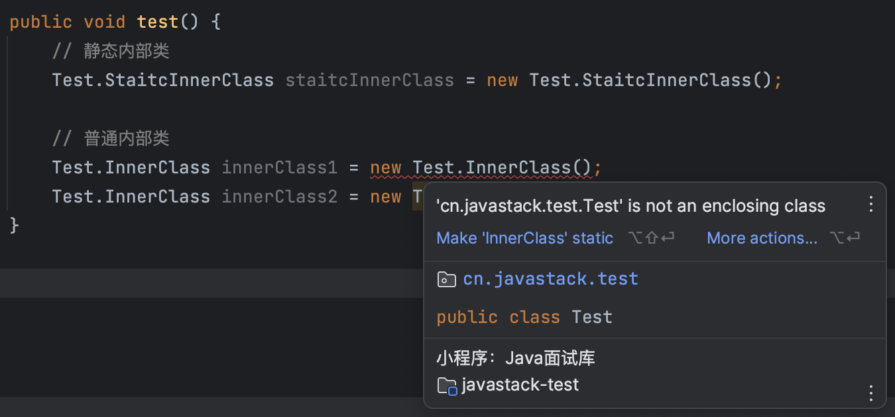

所以，静态内部类可以不依赖于外部类实例被实例化，而普通的内部类需要在外部类实例化后才能实例化。

### 92、静态方法可以直接调用非静态方法吗？

静态方法不可以直接调用非静态方法，静态方法调用非静态方法，需要先将对象实例化才能调用。

来看下面的示例：

```java
public static void main(String[] args) throws Exception {
    test();
}

public void test() {
    
}
```

 

修改后：

```java
public static void main(String[] args) throws Exception {
    new Test().test();
}
```

### 93、静态变量和实例变量有什么区别？

**静态变量**，即被static修饰的变量，它属于类，但不属于类的任何一个对象，一个类不管创建多少个对象，静态变量在内存中有且仅有一个拷贝，静态变量可以实现让多个对象共享内存。

**实例变量**，它属于某一对象实例，需要通过一个类的对象实例才能访问它。

```java
// 实例变量
private int id = 100;

// 静态变量
private static long maxId = 999;
```

### 94、内部类可以访问其他外部类的成员吗？

可以的，内部类可以访问创建它的外部类对象的成员，包括私有成员，来看下面的程序：

```java
public class Test {
    private int id = 100;
    
    public class InnerClass {
        /**
        * 访问外部类的私有成员
        */
        private void print() {
            System.out.println(id);
        }
        
        public static void main(String[] args) {
            Test.InnerClass innerClass = new Test().new InnerClass();
            innerClass.print();
        }
    }
}
```

结果输出：100

### 95、接口和抽象类有什么区别？

##### 区别1：

首先抽象类是一个“类”，而接口只是一个“接口”，两者的概念和应用场景不一样，这也是抽象类和接口的主要区别。

##### 区别2：

即使在Java 8中接口也能实现方法了，但却不能写构造方法，而在抽象类是可以写构造方法的，意味着抽象类是参与类的实例化过程的，而接口则不是。

##### 区别3：

抽象类可以有自己的各种成员变量，并且可以通过自己的非抽象方法进行改变，而接口中的变量默认全是`public static final`修饰的，意味着都是常量，并且不能被自己和外部修改。

##### 区别4：

接口可以实现多继承，而抽象类只能单继承。

下面我举两个例子：

```java
public class HashMap<K, V> extends AbstractMap<K, V> implements Map<K, V>, Cloneable, Serializable {
    ...
}
```

```java
public interface Connection extends Wrapper, AutoCloseable {
    ...
}
```

类与类只能单继承，而类与接口，接口与接口可以多继承。

 

Java8中的接口和抽象类的区别除了接口中可以写实现方法之外这点变化，其他的还是保持不变的。

既然接口可以写方法实现了，那么抽象类的存在貌似弱化了，因为类只能是单继承，耦合性不好，而接口可以多实现，可以灵活扩展，也不会增加类的耦合性。

### 96、抽象类必须要有抽象方法吗？

不需要，抽象类不一定非要有抽象方法，如以下示例代码：

```java
public abstract class User {
    public String getUserName () {
        return "java面试题";
    }
}
```

抽象类没有抽象方法也可以正常运行。

### 97、抽象类能使用final修饰吗？

**abstract**不能和**final**一起使用。

定义抽象类就是让其它类继承的，如果把一个类定义为final则表示该类就不能被继承，这样彼此就会产生矛盾，所以final不能修饰抽象类。

如果这样定义，在开发工具中也会提示编译错误：

 

抽象方法也是一样的道理，抽象方法也不能和final一起使用。

### 98、抽象类是否可以继承具体类？

抽象类可以继承普通类，也可以继承抽象类，来看Spring中的应用。

抽象类继承抽象类：

```java
public abstract class AbstractBeanFactoryAwareAdvisingPostProcessor extends AbstractAdvisingBeanPostProcessor implements BeanFactoryAware {
    ...
}
```

抽象类继承普通类：

```java
public abstract class AbstractAutoProxyCreator extends ProxyProcessorSupport implements SmartInstantiationAwareBeanPostProcessor, BeanFactoryAware {
    ...
}
```

### 99、抽象类是否可以实现接口？

抽象类可以实现接口，来看一个Spring中的应用：

```java
public abstract class AbstractBeanFactoryAwareAdvisingPostProcessor extends AbstractAdvisingBeanPostProcessor implements BeanFactoryAware {
    ...
}
```

### 100、如何判断一个对象是某类、接口的实例？

使用**instanceOf**关键字，比如有以下测试类：

> User：用户基类
>
> PrivateUser：私人用户子类，继承User类

判断方式如下：

```java
public static void main(String[] args) {
    PrivateUser privateUser = new PrivateUser();
    
    // true
    boolean result1 = privateUser instanceOf PrivateUser;
    
    // false
    boolean result2 = privateUser instanceOf User;
}
```

### 101、如何判断两个类或者接口之间的派生关系？

使用类的**isAssignableFrom**方法，如果当前类与指定类是否相同，或者当前类是指定类的基类或接口，则返回true，否则返回false。

比如有以下测试类：

> User：用户基类
>
> PrivateUser：私人用户子类，继承User类

判断方式如下：

```java
public static void main(String[] args) {
    // true
    boolean result1 = User.class.isAssignableFrom(PrivateUser.class);
    
    // false 
    boolean result1 = PrivateUser.class.isAssignableFrom(User.class);
}
```

User是PrivateUser的父类，所以返回true，反过来则是false。

### 102、Java创建对象，除了new关键字，你还知道哪些？

> 这里介绍创建对象的6种方式

假设有个女朋友类：

```java
@Data
@NoArgsConstructor
@AllArgsConstructor
class GirlFriend {
    private String name;
}
```

注解使用的是Lombok框架注解，方便快速开发。

##### 方法1：new一个对象

没对象就new一个吧，没错，使用new关键字，这也是Java创建对象最简单直接的方式了。

示例代码：

```java
@Test
public void girlFriend1() {
    GirlFriend girlFriend = new GirlFriend("new一个对象");
    System.out.println(girlFriend);
}
```

输出结果：

> GirlFriend(name=new一个对象)

##### 方法2：克隆一个对象

朋友有女朋友，你没有，如果可以，把别人的女朋友克隆一个吧？

让女朋友类先实现Cloneable接口，并且实现其clone()方法：

```java
@Data
@NoArgsConstructor
@AllArgsConstructor
class GirlFriend implements Cloneable {
    private String name;
    
    @Override
    protected Object clone() throws CloneNotSupportedException {
        return super.clone();
    }
}
```

> 注意：这里演示默认使用的是浅拷贝，即只可隆基本类型的字段，引用类型的需要再重写clone()方法手动赋下引用字段的值。

现在克隆一个对象，示例代码：

```java
@Test
public void girlFriend2() throws CloneNotSupportedException {
    GirlFriend girlFriend1 = new GirlFriend("克隆一个对象");
    GirlFriend girlFriend2 = （GirlFriend）girlFriend1.clone();
    System.out.println(girlFriend2);
}
```

> GirlFriend(name=克隆一个对象)

使用克隆的好处就是可以快速创建一个和原对象值一样的对象，对象的字段值一样，但是两个不同的引用。

##### 方法3：类派发一个对象（反射）

直接使用女朋友类派发一个吧：

```java
@Test
public void girlFriend3() throws InstantiationException {
    GirlFriend girlFriend = GirlFriend.class.newInstance();
    girlFriend.setName("类派发一个对象");
    System.out.println(girlFriend);
}
```

输出结果：

> GirlFriend(name=类派发一个对象)

##### 方法4：动态加载一个对象（反射）

知道女朋友类在哪里（类全路径），但却没有被加载，那就反射一个对象吧：

```java
@Test
public void girlFriend4() throws InstantiationException {
    GirlFriend girlFriend = (GirlFriend) Class.forName("cn.com.slq.GirlFriend").newInstance();
    girlFriend.setName("反射一个对象");
    System.out.println(girlFriend);
}
```

输出结果：

> GirlFriend(name=反射一个对象)

##### 方法5：构造一个对象（反射）

知道女朋友类的构造，就可以调用构造器构造一个对象：

```java
@Test
public void girlFriend5() throws NoSuchMethodException {
    GirlFriend girlFriend = GirlFriend.class.getConstructor().newInstance();
    girlFriend.setName("构造一个对象");
    System.out.println(girlFriend);
    
}
```

输出结果：

> GirlFriend(name=构造一个对象)

##### 方法6：反序列化一个对象

这个和克隆的作用类似，加入以前序列化（保存）了一个女朋友在磁盘上，现在就可以反序列化出来。

首先让女朋友可序列化，实现Serializable接口：

```java
@Data
@NoArgsConstructor
@AllArgsCOnstructor
class GirlFriend implements Cloneable, Serializable {
    private static final long serialVersionUID = 1L;
    
    private String name;
    
    @Override
    protected Object clone() throws CloneNotSupportedException {
        return super.clone();
    }
}
```

序列化/反序列化对象示例代码：

```java 
@Test
public void girlFriend6() throws IOException, ClassNotFoundException {
    GirlFriend girlFriend1 = new GirlFriend("反序列化一个对象");
    
    //序列化一个女朋友
    ObjectOutputStream objectOutputStream = new ObjectOutputStream(new FileOutputStream("gf.obj"));
    ObjectOutputStream.writeObject(girlFriend1);
    ObjectOutputStream.close();
    
    // 反序列化出来
    ObjectInputStream objectInputStream = new ObjectInputStream(new FileInputStream("gf.obj"));
    GirlFriend girlFriend2 = (GirlFriend) objectInputStream.readObject();
    ObjectInputStream.close();
    
    System.out.println(girlFriend2);
}
```

输出结果：

> GirlFriend(name=反序列化一个对象)

### 103、Java怎么生成随机数？

##### 1、Math.random

它只能生成伪随机浮点数（double），需要进行转换才能生成其他类型的随机数，它是线程安全的。

##### 2、java.util.Random

它提供了许多随机数生成选项，包括不同类型的随机数和种子设置，线程安全，但是多线程并发使用同一个实例性能不佳，它适用于并发量不高的或者单线程环境。

##### 3、java.util.concurrent.ThreadLocalRandom

它也提供了各种随机数生成选项，是多线程环境下的首选，每个线程都有自己的生成器，无需同步操作。

------

另外，推荐使用一些第三方开源工具包，没有必要重复造轮子，比如Apache的commons-lang3开发工具包中的两个工具类：

- RandomUtils
- RandomStringUtils

### 104、equals和hashCode的区别和联系？

关于**hashCode**和**equals**方法是有一些常规协定：

1、两个对象用equals()比较返回true，那么两个对象的hashCode()方法必须返回相同的结果。所以，如果重写equals()方法，则必须重写hashCode()方法，如果不重写，在Java中（比如：HashMap）会产生逻辑错误。

2、两个对象用equals()比较返回false，不要求hashCode()方法也一定返回不同的值，避免hash冲突，以提高哈希表性能。

举个例子：

> 可以把`equals`比喻为判断两本书的内容是否完全相同，而`hashCOde`就像是每本书的ISBN号。

如果两本书内容完全一样（`equals`返回`true`），那么它们的ISBN（`hashCode`的值）也应该是一样的。这样，在图书馆（类似HashMap）中就能根据ISBN快速找到相应的书。

如果两本书内容不完全一样（`equals`返回false），理论上它们的ISBN（`hashCode`的值）应该是不一样的，如果ISBN一样（`hashCode`的值），说明冲突了（`hashCode`冲突），但不影响根据ISBN来找书，只是会慢一点。

### 105、两个对象的equals方法相等，hashCode方法也会相等吗？

答案：**不一定，但是，严格意义上必须相等！！！**

> 根据Java通用约定：
>
> 两个对象equals相等，则它们的hashCode必须相等，反过来则不需要相同。

也就是说，重写了一个类的equals方法之后，必须要重写其hashCode方法，不然会出现各种潜在的问题或危害。

### 106、两个对象的hashCode方法相等，equals方法也会相等吗？

答案：**不一定。**

> 根据Java通用约定：
>
> 两个对象equals相等，则它们的hashCode必须相等，反过来则不需要相同。

因为对象的hashCode可能存在冲突的情况，即多个对象对应同一个hashCode，这在Java规范中是允许的，但是如果重写了equals方法，比较的则是对象的值，这时两个对象equals比较就可能不相同。

### 107、为什么重写equals就要重写hashCode？

**如果只重写了对象的equals方法而没有重写hashCode方法的话，就会造成对象equals相等而hashCode不相等。**

而Hash*相关的集合都是基于Hash表来实现的，比如HashMap的底层数据结构就是以数组+链表为基础的，其中的关键是数组索引下标的处理，数组的索引下标是根据传入的元素hashCode方法来决定的

**在hashCode相等的情况下：**

- 如果数组索引位置上已经有值了，值相等则进行覆盖，若不相等则加入到对应的链表中；
- 如果数组索引位置上没有值，则直接插入；

所以，如果多个equals相等的对象，而它们的hashCode不相等，它们就会不断插入到数组中，而不会进行覆盖，由此会带来Hash*相关的集合不能正常工作。

> 注意事项：
>
> 重写equals就要重写hashCode是Java编程的共识和规范。

### 108、Math.round(1.5)等于多少？


答案：2。

因为在数轴上取值时，中间值（0.5）向右取整，所以正0.5是往上取整。

### 109、Math.round(-1.5)等于多少？


答案：-1。

因为在数轴上取值时，中间值（0.5）向右取整，所以正0.5是往上取整，负0.5是直接舍弃。

### 110、什么是泛型？

JDK1.5开始引入泛型，泛型提供了编译时类型安全检测机制，可以在编译时检测到非法的类型。

泛型的本质就是参数化类型，可以用在类、接口和方法的创建中，分别称为泛型类、泛型接口、泛型方法。

如：集合类支持泛型，如果添加不符合的元素类型则会编译报错：

 

如上代码指定了泛型为String类型，添加其他类型的就会编译报错。

### 111、Java泛型中的T、R、K、V、E是什么？

常用的泛型含义如下表所示：

| 泛型 | 说明               |
| ---- | ------------------ |
| T    | Type（类型）       |
| R    | Result（结果）     |
| K    | Key（键）          |
| V    | Value（值）        |
| E    | Element（元素）    |
| N    | Number（数字）     |
| ?    | 通配符，不确定类型 |

### 112、Java有没有goto关键字？

goto是Java中的保留字，在目前版本的Java中还没有被使用，保留关键字不能用作任何标识符。

 

### 113、Java中有没有指针的概念？

Java中并没有指针的概念，指针是C和C++里面的概念，在Java中，指针已经被其他语法所取代，学习起来更加轻松。

### 114、Java中的classpath环境变量作用？

class = class + path，即Java源文件编译后的.class文件的路径。

设置classpath环境变量的作用是用于指定类的搜索路径，JVM在运行时就是通过classpath环境变量来寻找.class类文件，所以一般建议把当前应用程序的目录（.）设置为classpath环境变量。

### 115、怎么设置classpath环境变量？

Linux设置CLASSPATH环境变量：

> export CLASSPATH = .

查看classpath：

> echo $CLASSPATH

一般使用命令行编译运行需要指定classpath，在开发工具中classpath不用自己指定，由工具指定编译后的目录，它会自动搜索，如在IDEA中指定：

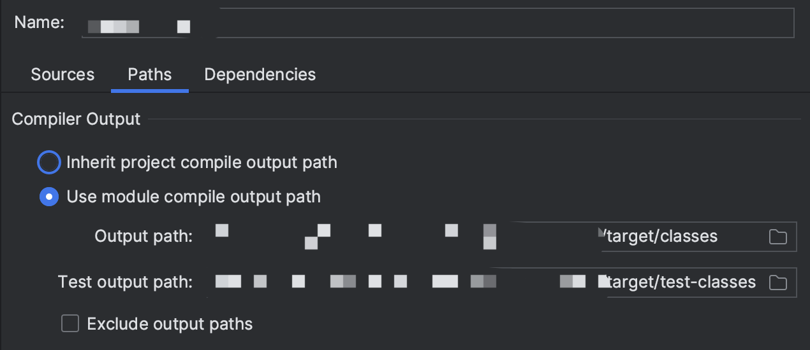 

### 116、判断两个数字是否相等

以下代码的输出结果是？

```java
public class Test {
    public static void main(String[] args) {
        Integer n1 = 123;
        Integer n2 = 123;
        System.out.println(n1 == n2);
        
        Integer n3 = 128;
        Integer n4 = 128;
        System.out.println(n3 == n4);
    }
}
```

答案如下：

> true
>
> false

### 117、Java怎么获取当前系统时间戳？

在Java中可以使用以下方式来获取系统时间戳。

##### 1、使用System类（最常用）

```java
long timestamp = System.currentTimeMillis();
```

这也是最常用的获取时间戳的方法。

##### 2、使用Date类

```java
Date date = new Date();
long timestamp = date.getTime();
```

##### 3、使用Calendar类

```java
Calendar calendar = Calendar.getInstance();
long timestamp = calendar.getTimeInMillis();
```

##### 4、使用Instant类（Java8+）

这是在Java8+版本中引入的新的日期时间API，这个`Instant.now()`方法返回当前的时间戳，然后使用`toEpochMilli()`方法将时间戳转换为毫秒数。

> 以上几种方法都可以得到当前系统的时间戳，大家可以根据需要选择合适的方式来获取时间戳。
>
> 推荐使用第1、4种方法，第一种无疑是最常用的，如果是Java8+，也可以考虑使用第四种Instant类，它可以获得比第一种更强大的时间单位转换等功能。

### 118、Java怎么统计一段代码的耗时？

1、使用System.currentTimeMillis()方法获取当前时间，前后再相减就是总耗时：

```java
@Test
public void jdkWasteTime() throws InterruptedException {
    long start System.currentTimeMillis();
    Thread.sleep(3000);
    System.out.println("耗时：%dms."， System.currentTimeMillis() - start);
}
```

2、使用**StopWatch**工具类，这个在Spring/Apache commons-lang3包中都有定义，来看一个简单的使用commons-lang3包中的StopWatch使用例子：

```java
// 创建一个StopWatch实例并开始计时
StopWatch sw = StopWatch.createStarted();

 // 休眠1秒
Thread.sleep(1000);

// 1002ms
System.out.println("耗时：%dms.\n", sw.getTime());
```

# 集合 87

### 1、说说常见的集合有哪些？

**Java所有集合框架的顶级接口有两大类：**

**Collection接口和Map接口。**

Collection接口的子接口包括List接口和Set接口；

- List接口的实现类主要有：ArrayList、LinkedList、Stack、Vector...
- Set接口的实现类主要有：HashSet、TreeSet、LinkedHashSet...

Map接口的实现类主要有：

- HashMap
- TreeMap
- HashTable
- ConcurrentHashMap
- ...

### 2、常用的并发集合有哪些？

常用的并发集合有：

- ConcurrentHashMap
- ConcurrentLinkedQueue
- ConcurrentLinkedDeque
- CopyOnWriteArrayList
- CopyOnWriteArraySet
- ...

并发集合位于java.util.concurrent包下，JDK1.5之后才有的。

### 3、那些集合类可对元素随机访问？

随机访问接口：java.util.RandomAccess

 

它是List集合使用的标记接口，表示它们可以支持快速的随机访问，该接口的主要目的是允许算法在随机或顺序访问列表是改变其行为，已提供良好的性能。

实现了该接口的常用List集合如类结构图所示：

 

如ArrayList源码所示：

 

实现了该接口的集合，推荐使用`for (int i = 0, n = list.size(); i < n; i++)`方式替代`for (Iterator i = list.iterator(); i.hasNext();)`，前者要比后者遍历快。

### 4、Comparable和Comparator接口的区别？

Comparable是排序接口，如类实现了Comparable接口，并实现其排序方法，就表示该类支持排序，相当于是一个内部排序器。

假如User类实现了Comparable接口：

```java
Collections.sort(userList);
```

Comparator是比较器接口，可以新建多个Comparator接口的实现类实现自定义排序，相当于一个外部排序器。

```java
Collections.sort(userList, new Comparator<User>() {
    ...
})
```

### 5、Collection和Collections的区别？

Collection是一个集合接口，是Set、List集合类的一个顶级接口：


Collection则是集合类的一个工具类，提供了一系列静态方法，用于对集合中元素进行排序、搜索以及线程安全等各种操作。 

### 6、Enumeration和Iterator接口的区别？

##### Enumeration和Iterator接口的区别：

（1）Enumeration只能读取集合的数据，而不能删除，Iterator可以读取、删除数据，如它们的方法所示：


（2）Iterator支持fail-fast错误机制，而Enumeration不支持；

（3）在Java集合框架中，Iterator接口已经取代了Enumeration接口：


### 7、集合使用泛型有什么优点？

##### 集合使用泛型的几个优点：

1、强制集合只能容纳指定类型的对象，避免了在运行时出现ClassCastException类转换异常，因为添加了不是指定类型的元素时，在编译期间就会报错；

2、代码更整洁，使用时不需要显式转换和instanceOf操作符，取出来的就是指定类型的对象；

3、优化了JVM运行时环境，因为它不会产生类型检查的字节码指令；

### 8、List、Set、Map之间的区别是什么？

List、Set、Map的区别主要体现在数据结构、元素是否有序、元素是否可重复、键值是否为null等。

三个接口的区别如下面思维导图所示：


### 9、描述一下常用的Collection集合的类结构？

如下图所示，我列出了常用的Collection集合接口和实现类：

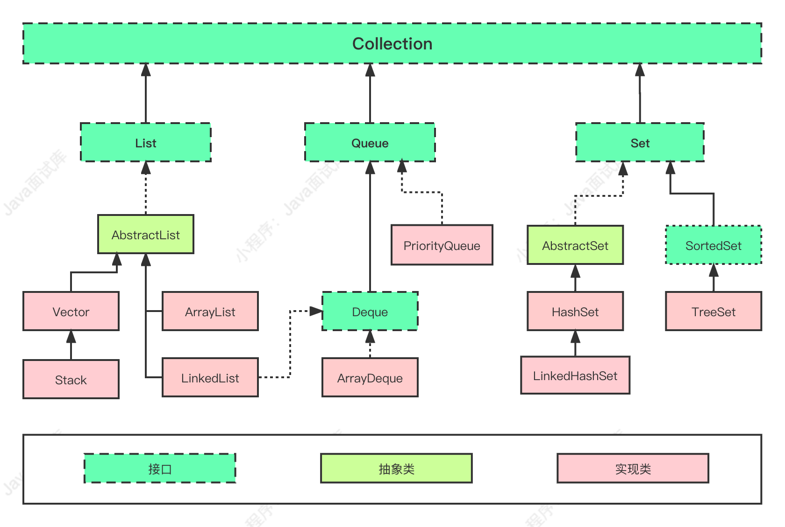

### 10、描述一下常用的Map集合的类结构？

如下图所示，我列出了常用的Map集合和实现类：


### 11、为什么Map接口不继承Collection接口？

因为Map继承Collection毫无意义，Collection集合中定义的是一组对象，而Map提供的是包含key-value键值对形式的集合，而不是”**一组对象**“的概念，所以它不适用Collection的定义。

### 12、常用的线程安全的Map有哪些？

下面来总结下线程安全的Map。

##### 1、Hashtable

> private Map<String, Object> map = new Hashtable<>();

来看看Hashtable的源码

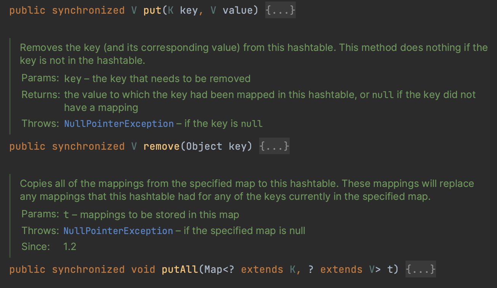

Hashtable中的所有关键方法都被synchronized关键字修饰，说明它们是方法级别阻塞的，它们占用共享资源锁，所以导致同时只能一个线程操作，不能同时执行，所以这种同步的集合效率非常低，一般不建议使用这个集合。

##### 2、SynchronizedMap

> private Map<String, Object> map = Collections.synchronizedMap(new HashMap<String, Object>());

这种是直接使用工具类里面的方法创建SynchronizedMap，把传入进行的HashMap对象进行了包装同步而已，来看看它的源码：


这个同步方式实现也比较简单，看出SynchronizedMap的实现方式是加了个对象锁，每次对HashMap的操作都要先获取这个mutex的对象锁才能进入，所以性能也不会比Hashtable好到哪里去，也不建议使用。

##### 3、ConcurrentHashMap - 推荐

> private Map<String, Object> map = new ConcurrentHashMap<>();

### 13、HashMap与Hashtable的区别？

HashMap和Hashtable是Java开发程序员必须要掌握的。

##### 1、线程安全

Hashtable是线程安全的，HashMap不是线程安全的。

来看下Hashtable的源码，Hashtable所有的元素操作都是synchronized修饰的，而HashMap并没有。

```java
public synchronized V put(K key, V value);
public synchronized V get(Object key);
```

##### 2、性能优劣

既然Hashtable是线程安全的，每个方法都要阻塞其他线程，所以Hashtable性能较差，HashMap性能较好，使用更广。

如果要线程安全又要保证性能，建议使用JUC包下的ConcurrentHashMap。

##### 3、NULL

Hashtable是不允许键或值为null的，HashMap的键值则都可以为null。

为什么Hashtable是不允许KEY和VALUE为null，而HashMap则可以？

##### Hashtable put方法逻辑：

```java
public synchronized V put(K key, V value) {
    // Make sure the value is not null
    if (value == null) {
        throw new NullPointerException();
    }
    
    // Makes sure the key is not already in the hashtable.
    Entry<?, ?> tab[] = table;
    int hash = key.hashCode();
    ...
}
```

HashMap hash方法逻辑：

```java
static final int hash(Object key) {
    int h;
    return (key == null) ? 0 : (h = key.hashCode()) ^ (h >>> 16);
}
```

可以看出Hashtable key为null会直接抛出空指针异常，value为null手动抛出空指针异常，而HashMap的逻辑对null作了特殊处理。

##### 4、实现方式

Hashtable的继承源码：

```java
public class Hashtable<K, V> extends Dictionary<K, V> implements Map<K, V>, Cloneable, java.io.Serializable
```

HashMap的继承源码：

```java
public class HashMap<K, V> extends AbstractMap<K, V> implements Map<K, V>, Cloneable, Serializable
```

可以看出两者继承的类不一样，Hashtable继承了Dictionary类，而HashMap继承的是AbstractMap类。

Dictionary是JDK1.0添加的，貌似没人用过这个。

##### 5、容量扩容

HashMap的初始容量为：16，Hashtable初始容量为：11，两者的负载因子默认都是：0.75。

```java

```

当现有容量大于容量 * 负载因子时，HashMap扩容规则为当前容量翻倍，Hashtable扩容规则为当前容量翻倍 + 1。

##### 6、迭代器

HashMap中的Iterator迭代器是fail-fast的，而Hashtable的Enumerator不是fail-fast的。

所以，当其他线程改变了HashMap的结构，如：增加、删除元素，将会抛出ConcurrentModificationException异常，而Hashtable则不会。

###### 可以来看下这个区别的演示：

```java
public static void main(String[] args) {
    Map<String, String> hashtable = new Hashtable<>();
    hashtable.put("t1", "1");
    hashtable.put("t2", "2");
    hashtable.put("t3", "3");
    
    Enumeration<Map.Entry<String, String>> iterator1 = (Enumeration<Map.Entry<String, String>>) hashtable.entrySet().iterator();
    hashtable.remove(iterator1.nextElement().getKey());
    while (iterator1.hasMoreElements()) {
        System.out.println(iterator1.nextElement());
    }
    
    Map<String, String> hashMap = new HashMap<>();
    hashMap.put("h1", "1");
    hashMap.put("h2", "2");
    hashMap.put("h3", "3");
    
    Iterator<Map.Entry<String, String>> iterator2 = hashMap.entrySet().iterator();
    hashMap.remove(iterator2.next().getKey());
    while (iterator2.hasNext()) {
        System.out.println(iterator2.next());
    }
}
```

输出信息：

```
t2=2
t1=1
Exception in rhread "main" java.util.ConcurrentModificationException
at java.util.HashMap$HashIterator.nextNode(HashMap.java:1442)
at java.util.HashMap$EntryIterator.next(HashMap.java:1476)
at java.util.HashMap$EntryIterator.next(HashMap.java:1474)
at cn.javastack.Test.main(Test.java:37)

```

### 14、HashMap和TreeMap怎么选？

对于一般的K-V键值对存储和操作，HashMap是Map接口最优的选择。

如果需要对Map中的K-V进行排序，TreeMap则是最优的选择，因为HashMap本身不能支持排序。

### 15、HashMap的数据结构是什么？


JDK 1.7：数组 + 链表

JDK 1.8：数组 + 链表 + 红黑树

### 16、HashMap键可以使用对象吗？

HashMap键是可以使用对象的，如源码所示：


K-V是泛型，所以，它们可以是任意类型。

使用对象作为Key时，需要重写equals和hashCode方法，这是正确使用HashMap的基础，避免因hashCode问题导致集合出现混乱等问题。

### 17、HashMap键可以使用可变对象吗？

可以，但需要保证该对象的属性发生改变时，不会改变对象的hashCode值，如果hashCode的值发生了改变，可能HashMap再也匹配不到之前那个原始对象了。。。

### 18、HashMap在JDK 8中有哪些改变？

##### HashMap在JDK8中的改变：

（1）在JDK8中，如果某个链表的长度 >= 8，并且数组容量 >= 64，那么链表将转换为红黑树。（桶的数量必须 >= 64，小于64的时候只会扩容）

（2）当发生hash碰撞时，JDK7会在链表的头部插入，而JDK8会在链表的尾部插入；

（3）在JDK8中，Entry类被Node类替代：


### 19、JDK 8 HashMap为啥要引入红黑树？

当HashMap的key冲突过多时，比如我们使用了不好的hash算法，导致key冲突率极高，我们都知道链表的查找性能很差，**所以引入红黑树就是为了优化HashMap集合的查询性能。**


### 20、JDK 8 HashMap为什么引入红黑树，而不是AVL树？

> 在JDK 1.8中，HashMap内部使用了**红黑树来优化哈希桶中链表过长**的情况。

为什么没有选择AVL树？这是因为红黑树相对于AVL树，具有以下几个优点。

##### 1、红黑树插入和删除性能相对较好

红黑树的插入和删除操作相对于AVL树而言，红黑树的平衡调整次数较少，能够更快地完成旋转操作，相对于AVL树而言，性能更优。

但是在查询操作比较频繁地情况下，AVL树的查询性能更好，因为AVL树是更加严格的平衡树，所以查询时需要比较的次数更少。

##### 2、红黑树实现更加简单

相对于AVL树而言，红黑树的实现更加简单，不需要维护节点的平衡因子，代码实现也更加简洁。

##### 3、红黑树占用空间更少

由于AVL树需要维护节点的平衡因子，高度差会比较小，这会导致空间浪费，而红黑树不需要维护节点的平衡因子，所以高度差相对较小，占用的空间也更少。

### 21、JDK 8 HashMap什么情况会用红黑树？


如果HashMap某个链表的长度 >= 8，并且扩容后的数组长度 >= 64，就会将链表转换为红黑树，如源码所示：

```java

```


# 多线程 166

### 1、进程和线程的区别？

##### 进程

进程是系统中正在运行的一个应用程序，应用程序启动运行就会形成一个进程。

**进程是系统分配资源的最小单位**，每个进程都拥有独立的地址空间。

##### 线程

线程运行于进程之中，一个进程可以有多个线程同时并发运行。

**线程是操作系统调度的最小单位**，每个线程都有独立的虚拟机栈，线程之间运行互相不影响。

-----

下面是进程和线程的详细对比表格：

| 特点         | 进程                                     | 线程                                           |
| ------------ | ---------------------------------------- | ---------------------------------------------- |
| 定义         | 是操作系统资源分配的基本单位             | 是进程内的执行单位                             |
| 独立性       | 相互独立，各进程有自己的地址空间和数据栈 | 依赖于所属进程，共享进程的地址空间和数据栈     |
| 资源开销     | 较大，每个进程有独立的内存和系统资源     | 较小，多个线程共享相同的进程资源               |
| 切换开销     | 较大，进程切换需要保存和加载整个上下文   | 较小，线程切换只需保存和加载部分上下文         |
| 通信机制     | 通信复杂，进程间通信需要使用 IPC 机制    | 通信简单，线程间共享进程内存，直接读写变量即可 |
| 创建销毁开销 | 较大，进程创建销毁需要较多的时间和资源   | 较小，线程的创建销毁相对快速                   |
| 同步与互斥   | 同步与互斥较为复杂，需要使用信号量等机制 | 同步与互斥较为简单，可以使用锁等同步机制       |
| 适用场景     | 适用于需要高度隔离和安全性的任务         | 适用于需要高效利用资源和提高响应速度的任务     |

### 2、进程之间怎么进行通信？

在Java 中，进程之间可以通过不同的通信方式来进行交互和数据传递，下面是一些常用的Java 进程间通信方案：

##### 1、网络通信

利用 Socket 编程进行进程间的网络通信,;a可以使用 TCP 或 UDPa协议。一个进程作为服务器，监听指定端口，另一个进程作为客户端连接该端口，通过 Socket 进行数据交换。

##### 2、进程间共享文件

可以使用文件作为通信的媒介，在一个进程将数据写入文件后，另一个进程读取文件中的数据。这种方式相对简单，但效率较低，适用于数据量不大的情况。

##### 3、管道(Pipe)

在 Java 中，可以使用 PipedlnputStream 和PipedOutputStream 或者 PipedReader 和PipedWriter 来实现进程间的管道通信。一个进程的输出流连接到另一个进程的输入流，数据从输出流流向输入流。

##### 4、共享内存

可以使用共享内存来实现进程间的通信，Java 中可以使用`Java Native Interface（JNI）`来调用C/C++的共享内存库，实现共享内存的读写。

##### 5、消息队列

Java 中可以使用消息队列实现进程间的异步通信，常用的消息队列工具有 Apache Kafka、RabbitMQ 等。进程可以将消息发送到队列中另一个进程从队列中接收消息。

##### 6、JavaRMl（远程方法调用）

Java RMl 允许一个Java 进程调用另一个Java进程中的方法，实现远程通信。这需要定义共享接口和服务，以允许远程访问方法。

##### 7、Java NIO(非阻塞I/O)

使用 Java NlO 的 Channel 和 Selector，可以实现非阻塞的进程间通信，可以在同一个线程中处理多个通道的数据。

##### 8、分布式框架

使用分布式框架，如：Dubbo、Spring Cloud 或者其他 RPC 框架，可以在不同的机器上运行多个Java 进程，并通过框架提供的接口进行通信和数据处理。

> 选择哪种通信方案取决于具体的场景和需求。

### 3、线程之间怎么进行通信？

##### 有以下几种方式：

1、 synchronized + wait, notify, notifyAll

2、ReentrantLock + Condition

3、CountDownLatch

4、CyclicBarrier

5、Semaphore

6、join/ yield

7、BlockingQueue

8、LockSupport

9、Exchange

...

### 4、什么是原子性？

原子性指的是一个或者多个操作，要么全部执行，要么就全部都不执行，在执行的过程中不被其他操作中断或干扰。

在并发编程中，原子性是一个非常重要的概念因为多线程或并发环境下，多个线程可能同时访问和修改同一个变量，如果操作不是原子性的，可能会导致数据不一致或竞态条件。

### 5、Java中的基本数据类型的读取和赋值是原子性的吗？

除了long 和 double，其他的基本数据类型的读取和赋值操作都是原子性的。

如下面的代码：

```java
int x = 100; // 原子性
inty = x; // 非原子性
x++; // 非原子性
x = x + 1; // 非原子性
```

只有语句1是原子性的，其他的3个语句都不是原子性操作，因为它们都包含两个及以上的操作它们都先要去读取×变量的值再将计算后×的新值写入到主内存中，几个操作合起来就不是原子性操作了。

### 6、long、double读写是原子性的吗？

long/double 的读写操作不是原子性的，但可以通过 volatile 修饰实现原子性。


> 注意：volatile修饰的i++，i--操作不具有原子性。

### 7、++、i--操作是原子性的吗？

i++、i--操作不是原子性的，i++和i-操作是自增和自减操作符，用于增加或减少变量的值。

这些操作分为两个步骤：

1、读取当前变量的值。

2、将变量的值增加或减少1。

在多线程环境中，如果多个线程同时对同一个变量进行自增或自减操作，可能会导致竞态条件。

如下图所示:


假设变量i的初始值为0，有两个线程同时执行i++操作，那么可能会发生以下情况：

- 线程1：读取的值为0；
- 线程2：读取的值为 0；
- 线程1：将i增加 1，i现在的值为1；
- 线程2：将i增加1，i现在的值为1（原本期望的是2)

这种情况下，虽然有两个线程对i进行了自增操作，但最终i的值只增加了 1，而不是期望的 2。

这就是因为i++操作并不是原子性的，它分成了两个独立的步骤，这些操作可能被其他线程干扰，从而导致结果不正确。

### 8、什么是可见性？

在 Java 并发编程中，如果多个线程对成员变量进行修改，默认在没有volatile 关键字的修饰的情况下，乡线程之间修改的结果是互不相见的，如下图所示：


线程 B 修改的 inflag 最新的结果值对线程 A 是不可见的，所以，可见性指的是多个线程操作一个共享变量时，其中一个线程对变量进行修改后其他线程可以立即看到最新修改的结果。

### 9、怎么保证可见性？

保证可见性有两种方法：

1)使用 volatile 关键字修饰成员变量；

2）使用 synchronized 关键字或者锁（Lock）修饰的代码；

3）将变量声明为 final

> final 可以确保变量在初始化后不会再被修改保证了可见性。但是，它是有条件的可见性，如果使用不当，会出现 this 引l用逃逸的情况，导致访问了未正确初始化的值，更多细节参考《final可以保证可见性吗？》面试题。

4）使用其他并发工具类，如:CountDownLatch、CyclicBarrier、Semaphore等，它们都能实现线程间的可见性。

### 10、final可以保证可见性吗？

是的，`final`关键字可以保证可见性a（**有条件**)。

当一个变量被声明为`final`时，可以确保该变量在初始化之后不会被再次修改，所以其他线程读取该变量时，一定能够看到最终的值，保证了可见性。

> ##### 需要注意的是：
>
> final 变量的可见性仅在初始化完成之后，如果是一个引l用类型的final 变量，当「this引用在构造函数中通过某种方式逃逸并被其他线程访问，可能会导致`final`字段的不可见性。这种情况下一其他线程可能在构造函数没有完全执行结束之前就访问了对象的状态，因此不能保证`final`字段的初始化对其他线程是可见的。

如下面的示例：

```java
public class EscapeExample {
    private final int value;
    public EscapeExample() {
        // 在构造函数中，this引用逃逸到了其他线程
        new Thread(() -> {
            // 这里可能在EscapeExampLe对象的构造函数还没有执行完毕之前就被调用
            int tempValue = getValue();
            System.out.println("Value:+ tempValue);
                               }).start();
            // 模拟构造函数执行耗时
        try {
            Thread.sleep(100);
        } catch (InterruptedException e){
            e.printstackTrace();
        }
        value= 42；//此时对final字段进行赋值
    }
                
    public int getvalue() {
        return value;
    }
                   
    public static void main(String[] args) {
        EscapeExample example = new EscapeExample();
        System.out.println("Final Value: " + example.getValue());
    }
}
```

输出结果：

> Value: 0
>
> Final Value: 42

在这个示例中，`EscapeExample`类包含一个`final`字段`value`，它可以在被其他线程访问。然后在构造函数中，启动了一个新线程，该线程将尝试在`EscapeExample`对象的构造函数还没有执行完毕之前获取`value`字段的值。

由于线程调度的不确定性，新线程可能在构造函数执行之前就开始执行，导致它读取到`value`字段的默认值（0），而不是构造函数中赋予的值（42），这就是是final字段的不可见性问题。

为了避免这种问题，应该避免在构造函数中将`this`引用逃逸到其他线程，或者采取其他线程安全的构造对象的方式。在多线程环境下，需要谨慎处理对象的构造和初始化，以确保对象的状态对其他线程是可见的。

### 11、编程实现成员变量可见性的例子

##### 示例1：

```java
public class Test {
    private static volatile int n1 = 0;
    public static void main(String[] args) throws InterruptedException {
        test1();
    }
    private static void test1() {
        new Thread(() -> {
            try {
                Thread.sleep(1000);
            } catch (InterruptedException e) {
                e.printStackTrace();
            }n1:1;
        }).start();
        while (n1 == 0) {
        }
        System.out.println("stop");
    }
}
```

这个例子加了volatile，所以程序正确退出输出 stop。

##### 示例2：

```java
public class Test {
    private static int n2 = 0;
    public static void main(String[] args) throws InterruptedException {
        test2();
    }
    private static void test2() {
        new Thread(() -> {
            try {
                Thread.sleep(100e);
            } catch (InterruptedException e) {
                e.printStackTrace();
            }
            n2 = 1;
        }).start();
        while (n2 == θ) {
            System.out.println(n2);
        }
        System.out.println("stop");
    }
}
```

这个例子没有加 volatile，程序也正常退出，输出一堆O并也正常输出了 stop，这是为什么呢？

##### 没有加volatile为什么也有可见性？

看起来是很诡异的问题，问题是在 while 里面加了一行 System.输出问题，打开 println 方法源码看一下：


这个 println 方法里面加了 synchronized 同步块，正是因为这个 synchronized 同步块，因为它具有可见性，所以保证了里面变量×的可见性，这个诡异的问题也就解开了。

> 而如果去掉 while 循环里面加 System..输出语句，线程对变量 n2 的修改对主线程就不可见了，程序普会一直循环，不会输出任何结果。

### 12、什么是有序性？

比如以下示例代码：

```java
public void clear(){
    Node<K,V>[] tab;
    modcount++;
    if ((tab = table) != null && size > 0) {
        size = 0;
        for (int i = 0; i < tab.length; ++i)
            tab[i] = null;
    }
}
```

程序的执行顺序必须**按照代码的先后顺序一行一行来执行**，执行过程中不会发生代码指令重排序，这就是指有序性。

### 13、为什么要使用多线程？

##### 因为多线程有以下几个优势：

----

（1）充分利用多核CPU

多线程可以真正充分利用和发挥多核CPU的优势，同时独立完成N 个任务而不互相干扰。

（2）提高运行效率

可以把一个任务拆分成多个子线程去运行，从而提高程序的运行效率。

（3）防止阻塞

多线程同时处理一个任务，就算一个线程处理阻塞了，也不会影响整个任务。

### 14、创建线程有哪几种方式？

##### 1、继承Thread 类

```java
public class MyThread extends Thread {
    @override
    public void run(） {
        System.out.println(Thread.currentThread().getName());
        for (intt i =0; i< 100; i++）{
            System.out.println(i);
        }
    }
}                     
```

##### 2、实现Runnable接口

```java
public class MyRunnable implements Runnable {
    @Override
    pubiic void run(） {
        for (int i = 0; i< 10; i++) {
            System.out.println(i);
        }
    }
}
```

或者也可以是：

```java
public static void main(String[] args） {
    Thread thread=new Thread(new Runnable(） {
        @Override
        public void run(）{
            for（int i = 0; i < 10; i++）{
                System.out.println(i);
            }
        }
    });
    thread.start();
}
```

或者也可以是：

```java
public static void main(String[] args） {
    Thread thread=newThread((）->{
        for （int i = 0; i< 10; i++）{
            System.out.println(i);
        }
    });
	thread.start();
}
```

##### 3、实现Callable 接口

```java
classMyCallable implements Callable {
    @0verride
    public String call() throws Exception {
        System.out.println("Mycallable.call");
        return "abc";
    }
}

public class Test {
    public static void main(String[] args) throws ExecutionException, InterruptedException {
        MyCallable myCallable = new MyCallable();
        FutureTask<String> futureTask = new FutureTask<>(myCallable);
        Thread thread - new Thread(futureTask, "callableThread");
        thread.start();
        String str = futureTask.get();
        System.out.println(str);
    }
}
```

这种方式是异步的、可返回结果。

-----

底层的创建线程的方法就以上 3 种，其他至于匿名内部类、线程池、Future、Lambda 表达式等创建线程的方式的底层都是基于以上 3 种方式。

比如通过线程池创建：

```java
public static void main(String[] args) {
    ExecutorService es = Executors.newFixedThreadPool(5);
    for (int i = 0; i< 5; i++) {
        es.submit(() ->{
            for (int j = 0; j < 10; j++) {
                System.out.println(Thread.currentThread().getName() + j);
            }
        });
    }
    es.shutdown();
}
```

### 15、什么是守护线程？

与用户线程对应的就是守护线程，守护线程就是守护用户的线程，当用户线程全部执行完结束之后，守护线程才会跟着结束。也就是守护线程必须伴随着用户线程，如果一个应用内只存在一个守护线程，没有用户线程，守护线程自然会退出。

如下图所示：


在 Thread 线程类中有一个 daemon 成员变量，代表线程是否守护线程，默认为 false 用户线程，通过 setDaemon方法可以将线程设置为守护线程。

### 16、程实现一个守护线程的例子

如下面的示例：

```java
public class Test {
    public static void execute(）{
        for (int i = θ; ; i++) {
            try {
                Thread.sleep(1000);
            } catch (InterruptedException ex) {
            }
            System.out.println(i);
        }
    }
	public static void main(String[] args) throws IoException {
        Thread thread = new Thread(() -> execute());
        thread.setDaemon(true);
        thread.start();
        
        System.in.read();
    }
}
```

##### 代码说明：

（1）这里的用户线程是指 main 方法当前的主线程，主线程通过 System.in.read( 来阻塞程序，只有在用户输入任何一个字符回车后，主线程才会退出；

（2）创建一个简单的线程，把一个线程设置 daemon 为 true 即表示守护线程，守护线程每隔一秒打印i的值，守护线程守护的是用户主线程，直到主线程输入任何一个字符退出后，守护线程也就会跟就退出不再打印。

运行上面的程序，随便输入一个字符回车，因为用户线程退出了，所以守护线程也就跟着退出了，守护线程停止打印，如下图所示：


> ##### 需要注意的是：
>
> setDaemon方法必须设置在线程 start 方法启动之前，不然会抛出异常。

### 17、线程的状态有哪几种？怎么流转的？、

下图是一个线程的生命周期状态流转图，很清楚的描绘了一个线程从创建到终止的过程：


**NEW**：毫无疑问表示的是刚创建的线程，还没有开始启动。

**RUNNABLE**：表示线程已经触发 startO 方式调用，线程处于就绪（ready）状态，等CPU正式调度时才会处于运行中（running）状态，RUNNABLE 状态它是这两种状态笼统。

**BLOCKED**：表示线程阻塞，等待获取锁，如碰到 synchronized、lock 等关键字等占用临界区的情况，一旦获取到锁就进行 RUNNABLE 状态继续运行。

**WAITING**：表示线程处于无限制等待状态，等待一个特殊的事件来重新唤醒，如通过WaitO 方法进行等待的线程等待一个 notifyO 或者 notifyAllO 方法，通过 join( 方法进行等待的线程等待目标线程运行结束而唤醒，一旦通过相关事件唤醒线程，线程就进入了 RUNNABLE 状态继续运行。

**TIMED_WAITING**：表示线程进入了一个有时限的等待，如 sleep(3000)，等待3秒后线程重新进行 RUNNABLE 状态继续运行。

**TERMINATED**：表示线程执行完毕后，进行终止状态。

> ##### 需要注意的是：
>
> 线程一旦通过 start 方法启动后，它就再也不能回到初始 NEW 状态，线程终止后也不能再回到 RUNNABLE 状态。

### 18、线程的优先级有什么用？

在操作系统中，线程可以划分优先级，优先级较高的线程得到CPU资源比较多，也就是CPU 优先执行优先级较高的线程对象中的任务，但是不能保证一定优先级高就会先执行。

Java 线程优先级分为1～10个等级，数字越大优先级越高，默认优先级大小为 5，超出范围则抛出`java.lang.IllegalArgumentException`异常。

### 19、我们常说的JUC是指什么？

JUC是**java.util.concurrent**并发线程包的简称：


这是JDK 1.5 新增的处理Java 多线程并发编程的工具包，其中包含了许多线程安全的并发类。

### 20、++是线程安全的吗？

i++不是线程安全的，来看下面的示例，验证下i++到底是不是线程安全的。

##### 1000个线程，每个线程对共享变量count进行1000次++操作。

```java
static int count = 0; 
static CountDownlatch cdl = new CountDownLatch(100e);

public static void main(String[] args) throws Exception {
    CountRunnable countRunnable = new CountRunnable();
    for (int i = 0; i < 1000; i++) { 
        new Thread(countRunnable).start();
    }
    cdl.await();
    System.out.println(count);
}

static class CountRunnable implements Runnable {
    private void count() {
        for (int i = 0; i < 1000; i++) {
            count++;
        }
    }
    
    @Override
    public void run() {
        count();
        cdl.countDown();
    }
}
```

上面的例子我们期望的结果应该是1000000，但运行N 遍，你会发现总是不为1000000，至少你现在知道了i++操作它不是线程安全的了。

先来看JIMM模型中对共享变量的读写原理吧。


每个线程都有自己的工作内存，每个线程需要对共享变量操作时必须先把共享变量从主内存load 到自己的工作内存，等完成对共享变量的操作时再 save 到主内存。

问题就出在这了，如果一个线程运算完后还没刷到主内存，此时这个共享变量的值被另外一个线程从主内存读取到了，这个时候读取的数据就是脏数据了，它会覆盖其他线程计算完的值。。。

**这也是经典的内存不可见问题，那么把count加上volatile让内存可见是否能解决这个问题呢？**答案是：不能。因为 volatile 只能保证可见性，不能保证原子性。多个线程同时读取这个共享变量的值，就算保证其他线程修改的可见性，也不能保证线程之间读取到同样的值然后相互覆盖对方的值的情况。

##### 解决方案

说了这么多，对于i++这种线程不安全问题有没有其他解决方案呢？当然有，请参考以下几种解决方案。

1、对i++操作的方法加同步锁，同时只能有一个线程执行i++操作；

2、使用支持原子性操作的类，如`java.util.concurrent.atomic.AtomicInteger`它使用的是CAS 算法，效率优于第1种；

### 21、怎么让3个线程按顺序执行？

比如说有T1、T2、T3 三个线程，怎么让 3个线程按顺序执行，T2 在T1执行完后执行，T3 在T2 执行完后执行。

---

##### 有以下几种常用的解决方案：

（1）使用线程的join 方法；

（2）使用对象的 wait 方法；

（3）使用重入锁 Condition 的 await 方法；

（4）使用 Executors.newSingleThreadExecutorO 创建一个单线程的线程池；

等等...

### 22、编程实现让3个线程按顺序执行

用 Java 编程实现让 3 个线程按顺序执行。

> 创建T1、T2、T3 三个线程，让 3 个线程按顺序执行，T2 在 T1执行完后执行，T3 在T2 执行完后执行。

----

示例代码：

```java
public class ExecuteOrderly {
    public static void main(String[] args) throws InterruptedException {
        Thread t1 = new Thread(() -> {
            try {
                Thread.sleep(2000);
            }catch (InterruptedException e){
                e.printStackTrace();
            }
            System.out.println("T1 执行完成...");
        });
        
        Thread t2 = new Thread(() -> {
            try {
                Thread.sleep(1000);
            } catch (InterruptedException e) {
                e.printstackTrace();
            }
            System.out.println("T2 执行完成...");
        });
        
        Thread t3 = new Thread(() -> {
            System.out.println("T3 执行完成...")；
        });
        
        t1.start();
        t1.join();
        
        t2.start();
        t2.join();
        
        t3.start();
    }
}
```

##### 输出结果：


原理就是使用线程的join(方法进行阻塞，具体原理请看并发编程中的《join 方法有什么用？什么原理？》面试题。

### 23、join方法有什么用？什么原理？

##### join

------

join 是线程 Thread 类的方法，官方的说明是：

> Waits for this thread to die.

等待这个线程结束，也就是说当前线程等待这个线程结束后再继续执行，下面来看这个示例就明白了。

##### join 原理

----

下面是 join 方法的源码：

```java
public final synchronized void join(long millis)throws InterruptedException {
    long base = System.currentTimeMillis();
    long now = 0;
    if (millis <0) {
        throw new IllegalArgumentException("timeout value is negative");
    }
    if (millis == 0) {
        while (isAlive(））{
            wait(0);
        } 
	}else {
        while (isAlive()) {
            long delay = millis - now;
            if (delay <= θ) {
                break;
            }
            wait(delay);
            now = System.currentTimeMillis() - base;
        }
    }
}
```

可以看出它是利用 wait 方法来实现的，上面的例子当 main 方法主线程调用线程的时候，main 方法获取到了 t的对象锁，而t调用自身 wait 方法进行阻塞，只要当结束或者到时间后才会退出，接着唤醒主线程继续执行。milis 为主线程等待线程最长执行多久，0为永久直到线程执行结束。

### 24、编程实现一个线程join等待的例子

如以下示例代码：

```java
public static void main(String[] args) throws Exception {
    System.out.println("start");
    Thread t = new Thread(() -> {
        for (int i = 0; i < 5; i++) {
            System.out.println(i);
            try {
                Thread.sleep(500);
            } catch (InterruptedException e) {
                e.printstackTrace();
            }
        }
    });
    t.start();
    t.join();
    
    System.out.println("end");
}
```

结果输出：

> start
>
> 0
>
> 1
>
> 2
>
> 3
>
> 4
>
> end

线程t 开始后，接着加入 t.join( 方法，t 线程里面程序在主线程 end 输出之前全部执行完了，说明 t,join( 阻塞了主线程直到t 线程执行完毕，如果没有 t.join0，end 可能会在 0～5 之间输出。

### 25、如何让一个线程休眠？

线程休眠是Java 开发经常会用到的一个手段，就是让当前线程睡一会儿，睡醒之后再继续运行。

##### 来看下面的休眠程序：

```java
Thread.sleep(87000000);
```

你知道休眠多久吗？

再把上面的稍微改装下：

```java
Thread.sleep(24 * 60 * 60 * 1000 + 10 * 60 * 1000);
```

现在你估计大概能知道休眠多久了，但还是很茫然，很无助，不写注释，谁知道休眠多久？单位还是毫秒。。

其实就是休眠 24小时10 分钟，何必整这么麻烦呢？

##### 优雅又简单的方式来了：

```java
TimeUnit.DAYs.sleep(1);
TimeUnit.MINUTES.sleep(10);
或者
TimeUnit.HOURS.sleep(24);
TimeUnit.MINUTES.sleep(10);
```

使用`java.util.concurrent.TimeUnit`类就可以优雅的搞定，不需要过多的单位运算及修饰，是不是很优雅，很简单？

上面演示了 HOURS、MINUTES，还有更多的枚举可以用。

##### 来看下TimeUnit的详细方法和枚举值：


其实 TimeUnit 还可以用来做时间单位转换，TimeUnit 提供了各种丰富的时间单位转换方法。

我们随便来看一个枚举值：

```java
MINUTES {
    public long toNanos(long d){
        return x(d, C4/co, MAx/(C4/ce)); 
    }
    public long toMicros(long d) { 
        return x(d, C4/C1, MAx/(C4/C1)); 
    }
    public long toMillis(long d) { 
        return x(d, C4/C2, MAx/(C4/c2)); 
    }
    public long toseconds(long d) { 
        return x(d, C4/C3, MAX/(C4/c3)); 
    }
    public long toMinutes(long d) { 
        return d; }
    public long toHours(long d){
        return d/(c5/C4); 
    }
    public long toDays(long d){
        return d/(c6/C4);
    }
    public long convert(long d, TimeUnit u) { 
        return u.toMinutes(d); 
    }
    int excessNanos(long d, long m) { 
        return 0; 
    }
```

可以很方便的把分钟转换成各种单位的值。

##### 再来看一下TimeUnit休眠的原理：

```java
public void sleep(long timeout) throws InterruptedException {
    if (timeout >0){
        long ms = toMillis(timeout);
        int ns = excessNanos(timeout, ms);
        Thread.sleep(ms, ns);
    }
```

其实 TimeUnit 的休眠就是调用了 Thread.sleep 休眠方法，哈哈，只是把 Thread.sleep 封装了，这样，用起来很简单方便，也提高了可读性。

### 26、启动一个线程是用start还是run方法？

##### 答：使用start方法。

因为当用 startO 开始一个线程后，线程就进入就绪状态，使线程所代表的虚拟处理机处于可运行状态，这意味着它可以由 JVM 调度并执行。如果调用run(方法，表示在当前线程同步执行的逻辑，并不是启动该线程异步执行。

### 27、一个线程多次调用start会发生什么？

如以下示例代码：


输出结果：


很显明，多次调用 start 方法会抛出异常：

> java.lang.llegalThreadStateException

因为第一次 start后，线程的状态就从 New 变成其他状态了，就不能再次启动了。

### 28、start和run方法有什么区别？

首先要知道实现多线程最基本的两种方式：

1、继承`java.lang.Thread`类；

2、实现`java.lang.Runnable`接口；

其中 Thread 类也是实现了 Runnable 接口，而 Runnable 接口定义了唯一的一个 runO 方法，所以基于 Thread 和 Runnable 创建多线程都需要实现 run0 方法，是多线程真正运行的主方法。

```java
@FunctionalInterface
 public interface Runnable {
     public abstract void run();
 }
```

而 start( 方法则是Thread 类的方法，用来异步启动一个线程，然后主线程立刻返回。该启动的线程不会马上运行，会放到等待队列中等待 CPU 调度，只有线程真正被 CPU 调度时才会调用 run() 方法执行。

所以 start()方法只是标识线程为就绪状态的一个附加方法，以下 start()方法的源码，其中 start()是一个本地 native 方法。

```java
public synchronized void start() {
    if (threadstatus i = 0)
        throw new IllegalThreadstateException();
    group.add(this);
    
    boolean started = false;
    try {
        starte();
        started = true;
    }finally {
        try {
            if (!started) {
                group.threadstartFailed(this);
            }
        }catch (Throwable ignore){
            /* do nothing. If starto threw a Throwable then
            it will be passed up the call stack */
        }
    }
}
```

请注意，start0 方法被标识为 synchronized 的，即为了防止被多次启动的一个同步操作。

**那么你会问了，为什么要有两个方法，直接用一个runO方法不就行了吗！？**还真不行，如果直接调用run( 方法，那就等于调用了一个普通的同步方法，达不到多线程运行的异步执行，来看下面的例子。

```java
public static void main(string[] args) {
    Thread thread = new Thread(() -> {
        try {
            Thread.sleep(3000);
        } catch (InterruptedException e) {
            e.printstackTrace();
        }
        System.out.println("Java面试题");
    });
    
    long start = System.currentTimemillis();
    thread.start();
    System.out.printin(system.currentTimeMillis() - start);
    
    start = System.currentTimeMillis();
    thread.run();
    System.out.println(system.currentTimeMillis() - start);
}
```

程序输出：

> 0
>
> Java面试题
>
> 3000
>
> Java面试题

从程序输出结果可以看出，启动 start 方法前后只用了 0 毫秒，而启动 run 方法则阻塞了 3000 毫秒等程序执行完再继续执行，这就是同步与异步的一个最重要的区别。

### 29、sleep和wait方法有什么区别？

sleep(休眠)和 wait(等待)方法是 Java 多线程中常用的两个方法，它们有什么区别及一些该注意的地方有哪些呢？下面给大家一一分解。

##### 区别1：使用限制

使用 sleep 方法可以让让当前线程休眠，时间一到当前线程继续往下执行，在任何地方都能使用，但需要捕获 InterruptedException 异常。

```java
try {
    Thread.sleep(3000L);
} catch (Interruptedexception e) {
    e.printStackTrace();
}
```

而使用 wait 方法则必须放在 synchronized 块里面，同样需要捕获 InterruptedException 异常，并且需要获取对象的锁。

```java
synchronized (lock) {
    try flock.wait();
} catch (InterruptedException e) {
    e.printstackTrace();
}
```

而且 wait 还需要额外的方法 notify/ notifyAll 进行唤醒，它们同样需要放在 synchronized 块里面，且获取对象的锁。。

```java
synchronized (lock) {
    // 随机唤醒
    lock.notify();
    
    //唤醒全部
    lock.notifyAll();
}
```

当然也可以使用带时间的 wait(long millis) 方法，时间一到，无需其他线程唤醒，也会重新竞争获取对象的锁继续执行。

##### 区别2：使用场景

sleep一般用于当前线程休眠，或者轮循暂停操作，wait则多用于多线程之间的通信。

##### 区别3：所属类

sleep 是 Thread 类的静态本地方法，wait 则是 Object 类的本地方法。

> java.lang.Thread#sleep

```java
public static native void sleep(long millis) throws InterruptedException;
```

> java.lang.Object#wait 

```java
ublic final native void wait(long timeout) throws InterruptedException;
```

##### 为什么要这样设计呢？

因为 sleep 是让当前线程休眠，不涉及到对象类，也不需要获得对象的锁，所以是线程类的方法。wait是让获得对象锁的线程实现等待,前提是要获得对象的锁，所以是类的方法。

##### 区别4：释放锁

```java
bject lock = new object();
synchronized (lock) {
    try {
        lock.wait(3000L);
        Thread.sleep(2000L);
    } catch (Interruptedexception e) {
        e.printstackTrace();
    }
}
```

如上代码所示，wait 可以释放当前线程对 lock 对象锁的持有，而 sleep 则不会。

##### 区别5：线程切换

sleep 会让出 CPU 执行时间且强制上下文切换，而 wait 则不会强制进行上下文切换。

相反，wait 会使当前线程进入等待状态，释放对象的监视器锁，并允许其他线程获得该锁并继续执行。等待状态的线程只有在其他线程调用相同对象上的notify 或notifyAll 方法时才会被唤醒，然后才能继续执行。

### 30、Thread.yield方法有什么用？

我们知道 start() 方法是启动线程，让线程变成就绪状态等待 CPU 调度后执行。

那 yield()方法是干什么用的呢？来看下源码。

```java
public static native void yield();
```

yield 即“谦让"，也是 Thread 类的方法。它让掉当前线程CPU 的时间片，使正在运行中的线程重新变成就绪状态，并重新竞争 CPU 的调度权。它可能会获取到，也有可能被其他线程获取到。

yield一般很少使用，如果一定要用它的话，一句话解释就是：

> yield 方法可以很好的控制多线程，如执行某项复杂的任务时，如果担心占用资源过多，可以在完成某个重要的工作后使用 yield 方法让掉当前CPU的调度权，等下次获取到再继续执行，这样不但能完成自己的重要工作，也能给其他线程一些运行的机会，避免一个线程长时间占有 CPU 资源。

### 31、yield和 sleep有什么区别？

##### yield和sleep的相同点：

1） yield 和 sleep 都能暂停当前线程；

2）yield 和 sleep 在暂停过程中，如已经持有锁，则都不会释放锁资源；

##### yield 和 sleep 的不同点：

1）sleep 可以指定具体休眠的时间，而 yield 则依赖 CPU 的时间片划分；

2）yield 不能被中断，而 sleep 则可以接受中断；

### 32、编程实现一个线程谦让（yield）的例子

下面是一个线程谦让（yield）的使用示例：

```java
public static void main(string[] args) {
    Runnable runnable = () -> {
        for (int i = 0; i <= 100; i++) { 
            System.out.println(Thread.currentThread().getName() ++1);;
            if (i % 20 == 0) {
                Thread.yield();
            }
        }
    };
    
    new Thread(runnable, "强哥").start();
    new Thread(runnable, "小蜜").start();
}
```

这个示例每当执行完 20 个之后就让出 CPU，每次谦让后就会马上获取到调度权继续执行。

##### 运行以上程序，可以有以下两种结果。

结果1：强哥让出了CPU 资源，小蜜成功上位。

> 强哥-----29
>
> 强哥-----30
>
> 小蜜-----26
>
> 强哥-----31

结果2：强哥让出了CPU 资源，强哥继续运行。

> 强哥-----28
>
> 强哥-----29
>
> 强哥-----30
>
> 强哥-----31

而如果我们把两个线程加上线程优先级，那输出的结果又不一样。

```java
thread1.setPriority(Thread.MIN_PRIoRITY);
thread2.setPriority(Thread.MAX_PRIORITY);
```

因为给小蜜加了最高优先权，强哥加了最低优先权，即使强哥先启动，那小蜜还是有很大的概率比强哥先会输出完的，大家可以试一下。

### 33、怎么理解Java中的线程中断？

在之前的《如何优雅地终止一个线程？》面试题中，我详细说明了stop 终止线程的坏处及如何优雅地终止线程，那么还有别的可以终止线程的方法吗？

答案是肯定的，它就是我们今天要分享的---**线程中断**。

下面的这断代码大家应该再熟悉不过了：

```java
try {
    Thread.sleep(1000);
} catch (Interruptedexception e) {
    e.printstackTrace();
}
```

线程休眠需要捕获或者抛出线程中断异常，也就是你在睡觉的时候突然有个人冲进来把你吵醒了，此时线程被打断后，代码会继续运行或者抛出异常结束运行，但这并不是我们需要的中断线程的作用。

线程中断即线程运行过程中被其他线程给打断了，我们来看下线程中断最重要的 3个方法，它们都是来自Thread 类！

##### 1、 java.lang.Thread#interrupt

中断目标线程，给目标线程发一个中断信号，线程被打上中断标记。

##### 2、 java.lang.Thread#islnterrupted()

判断目标线程是否被中断，不会清除中断标记。

##### 3、 java.lang.Thread#interrupted

判断目标线程是否被中断，会清除中断标记。

> 具体使用可以参考线程中断的编程实战面试题。

### 34、编程实现一个线程中断的例子

我们来实例演示下线程中断如何用！

##### 示例1 (中断失败)

```java
private static void test1() {
    Thread thread = new Thread(() -> {
        while (true) {
            Thread.yield();
        }
    });
    thread.start(); 
    thread.interrupt();
}
```

请问示例1中的线程会被中断吗？答案：不会，因为虽然给线程发出了中断信号，但程序中并没有响应中断信号的逻辑，所以程序不会有任何反应。

##### 示例2:(中断成功)

```java
private static void test2() {
    Thread thread = new Thread(() -> {
        while (true) {
            Thread.yield();
            
            //购应中断
            if (Thread.currentThread().isInterrupted()) {
                System.out.println("Java技术栈线程被中断，程序退出。 ");
                return;
            }
        }
    });
    thread.start();
    thread.interrupt();
}
```

我们给示例2加上了响应中断的逻辑，程序接收到中断信号打印出信息后返回退出。

##### 示例3 (中断失败)

```java
private static void test3() throws InterruptedException {
    Thread thread = new Thread(() -> {
        while (true) {
            //购应中断
            if (Thread.currentThread().isInterrupted()) {
                System.out.printin("Java技术栈线程被中断，程序退出。");
                return;
            }
            
            try {
                Thread.sleep(300e);
            } catch (InterruptedException e) {
                System.out.println("Java技术栈线程休眠被中断，程序退出。");
            }
        }
    });
    thread.start();
    Thread.sleep(2000);
    thread.interrupt();
}
```

示例3 sleep( 方法被中断，并输出了Java技术栈线程休眠被中断，程序退出。程序继续运行...为什么呢？

来看 sleep 的源码：


可以看出sleep( 方法被中断后会清除中断标记，所以循环会继续运行。

##### 示例4 (中断成功)

```java
private static void test4() throws InterruptedException {
    Thread thread = new Thread(() -> {
        while (true) {
            //购应中断
            if (Thread.currentThread().isInterrupted()) {
                System.out.println("Java技术栈线程被中断，程序退出。");
                return;
            }

        
            try {
                Thread.sleep(3000);
            } catch (InterruptedException e) {
                System.out.println("Java技术栈线程休眠被中断，程序退出。");
                Thread.currentThread().interrupt();
            }
        }
    });
	thread.start();
    Thread.sleep(2000);
    thread.interrupt();
}
```

示例4全部信息输出并正常退出，只是在 sleep()方法被中断并清除标记后手动重新中断当前线程，然后程序接收中断信号返回退出。

### 35、线程中断与stop的区别？

线程的stop是由系统强制终止线程，而线程中断则是给目标线程发送一个中断信号：

- 如果目标线程没有接收中断信号，则线程不会有任何反应；

- 如果目标线程接收了中断信号，则是否结束线程或者执行其他逻辑则由目标线程决定；

### 36、你怎么理解多线程分组？

和Dubbo的服务分组一样，Java 可以对相同性质的线程进行分组，来看下线程类Thread的所有构造方法，如下图所示：


如图所示，带有 ThreadGroup 的所有线程构造方法都可以定义线程组的。

线程组使用java.lang.ThreadGroup 类定义，它有两个构造方法，第二个构造方法允许线程组有父类线程组，也就是说一个线程组可以多个子线程组。

```java
java.lang.ThreadGroup#ThreadGroup(java.lang.String) java.lang.ThreadGroup#ThreadGroup(java.lang.ThreadGroup, java.lang.String)
```


线程组中比较有用的几个方法：

> //获取当前线程组内的运行线程数
>
> java.lang.ThreadGroup#activeCount 
>
> //中断线程组内的所有线程
>
> java.lang.ThreadGroup#interrupt
>
> //使用 System.out打印出所有线程信息
>
> java.lang.ThreadGroup#list()

线程组还能统一设置组内所有线程的最高优先级，线程单独设置的优先级不会高于线程组设置的最大优先级。

另外，线程组中有一个 stop 方法用来终止组内所有的线程，但这个方法和 Thread 中的 stop 方法一样会带来很多问题，所以它们两个现在都已经被废弃了，官方也是不建议使用了，建议使用线程中断功能进行优雅终止线程。

### 37、编程实现一个线程分组的例子

如下面的示例代码：

```java
public static void main(string[] args) {
    Runnable runnable =（) ->{
        System.out.println("Java技术栈线程线程组名称：" + Thread.currentThread()·getThreadGroup());
        System.out.println（"Java技术栈线程线程名称："+Thread.currentThread()·getName());
        try {
            Thread.sleep(3000);
        } catch (InterruptedException e) {
            e.printstackTrace();
        }
    };
    
    ThreadGroup userGroup = new ThreadGroup("user");
    userGroup.SetMaxPriority(Thread.MIN_PRIoRITY);
    
    Thread userTask1 = new Thread(userGroup, runnable,,"user-taski");
    Thread userTask2 = new Thread(userGroup, runnable,,"user-task2");
    
    userTaski.start();
    userTask2.start();
    
    System.out.println("Java技术栈线程线程组活跃线程数："+userGroup.activeCount());
    userGroup.list();
}
```

程序输出以下结果：

> Java技术栈线程线程组名称：java.lang.ThreadGroup[name=user,maxpri=1]
>
> Java技术栈线程线程名称：user-task1
>
> Java技术栈线程线程组活跃线程数：2
>
> Java技术栈线程线程组名称：java.lang.ThreadGroup[name=user,maxpri=1]
>
> Java技术栈线程线程名称：user-task2
>
> java.lang.ThreadGroup[name=user,maxpri=1]
>
> Thread[user-task1,1,user]
>
> Thread[user-task2,1,user]

### 38、你怎么理解 wait、notify、notifyAll？

wait, notify, notifyAll 是多线程之间通信最重要的 3 个方法：

- **wait**：让持有该对象锁的线程等待；
- **notify**：唤醒任何一个处于waiting 状态的线程；
- **notifyAll**：唤醒所有处于 waiting 状态的线程；

它们 3 个的关系是，调用对象的 wait 方法使线程暂停运行，通过 notify/ notifyAll方法唤醒调用 wait 暂时的线程，这样就实现了线程之间的通信。

### 39、wait、notify、notifyAll它们并不是Thread类中的方法，而是Object类中的，为什么呢？

因为每个对象都有监视锁，每个线程要操作某个对象，当然是要获取某个对象的锁了，而不是线程的锁，所以wait/notify/notifyAll 它们都是 Object 类的方法：


如图所示，wait 带时间表示最大超时时间，过了时间还不唤醒就会自动唤醒线程重新竞争对象锁。

### 40、使用wait,notify,notifyAll有什么要注意的吗？

下面我总结了几个重要的注意事项：

（1）调用对象的 wait, notify, notifyAll 方法需要拥有对象的监视器锁，即它们只能在同步方法（块）中使用；

（2）调用 wait 方法会使用线程暂停并让出CPU 资源，同时释放持有的对象的锁；

（3）多线程使用 notify 容易发生死锁，一般使用 notifyAll；

### 41、编程实现一个线程wait等待的例子

如下面的使用示例：

```java
public static void main(string[] args) {
    object lock = new object();
    Thread t1 = new Thread(() -> {
        synchronized (lock) {
        	for (int i = 0; i < 20; i++) {
                System.out.print(1);
                if (i == 10) {
                    try {
                        lock.wait();    
                    } catch (InterruptedException e) {
                        e.printstackTrace();
                    }
                }
            }
        }
    });
    Thread t2 = new Thread(() -> {
        synchronized (lock) {
            try {
                Thread.sleep(500e);
            } catch (Interruptedexception e) {
                e.printstackTrace();
            }
            System.out.print("Java技术栈");
            lock.notifyAll();
        }
    }）；
                           
	t1.start();
	t2.start();
}
```

上面的例子结合 wait/ notifyAll 来演示了它们的相互作用，线程t1首先输出`012345678910`，5秒后继续输出`Java技术栈111213141516171819`。

### 42、线程池中的线程抛出了异常，如何处理？

在实际开发中，我们常常会用到线程池，但任务一旦提交到线程池之后，如果发生异常之后，怎么处理？怎么获取到异常信息？

##### 方案1：

-----

在线程具体的处理逻辑中使用 try-catch 异常块包装一下，然后使用log.error 输出即可，有需要还可以做对应的异常处理。

##### 方案2：

------

如果嫌try-catch 太麻烦的话，可以构建一个自定义的 ThreadFactory 线程工厂，然后设置Thread 线程的`Thread.setDefaultUncaughtExceptionHandler`方法捕获异常。

示例代码如下：

```java
@Restcontroller
@slf4j
public class Test fpublic static void main(string[] args) throws InterruptedException {
    ThreadFactory factory = (Runnable r) -> {
        Thread t = new Thread(r);
        t.setDefaultuncaughtExceptionHandler((Thread thread1, Throwable e) -> {
            System.out.println("error..." + e.getMessage());
        });
        return t;
    };
    
    ExecutorService executorservice = new ThreadPoolexecutor(10,10,0,TimeUnit.MILLISECONDS,new LinkedBlockingQueue(100),factory);
    executorservice.execute(new task());
}

class task implements Runnable {
    @override
    public void run() {
        int i =1 / 0;
    }
}
```

### 43、同步和异步的区别？


##### 同步：Synchronous

同步是阻塞执行的，即从程序调用方法开始，一旦调用就必须等待方法执行完返回，程序才能继续执行下面的代码。

一般正常的程序都是同步执行的，即程序后面的逻辑必须等前面所有的逻辑执行完才能被执行，比如，付款时必须先判断余额够不够，账户是否正常等。

> ##### 举个同步例子：
>
> 你去银行ATM 取钱，你必须等到ATM吐完钱，你拿到钱，取完卡后你才能离开。

##### 异步：Asynchronous

异步是非阻塞执行的，则不会关心方法执行的过程，触发要调用的方法就继续执行下面的操作，不会像同步那样阻塞直要到方法完成才继续，比如账号注册成功发邮件、消息推送等，不需要阻塞就能继续去执行别的逻辑。

> ##### 举个异步例子：
>
> 你这次要取钱，数量较大，你直接电话或者APP预约银行说你要取多少万现金，这段时间银行会为你准备钱，而这与你都没什么关系，然后你只要按预定的时候去取就行了，对你于而言，你们是触发了一个异步动作而已。


### 44、什么是死锁？

死锁如下图所示：


死锁指多个线程相互占用对方的资源的锁，而又相互等对方释放锁，此时若无外力干预，这些线程则一直处理阻塞的假死状态，形成死锁。

### 45、怎么避免死锁？

##### （1）按顺序加锁

上个例子线程间加锁的顺序各不一致，导致死锁，如果每个线程都按同一个的加锁顺序这样就不会出现死锁。

##### （2）获取锁时限

每个获取锁的时候加上个时限，如果超过某个时间就放弃获取锁之类的。

##### （3）死锁检测

按线程间获取锁的关系检测线程间是否发生死锁，如果发生死锁就执行一定的策略，如终断线程或回滚操作等。

### 46、什么是活锁？

活锁这个概念大家应该很少有人听说或理解它的概念，而在多线程中这确实存在。

活锁恰恰与死锁相反，死锁是大家都拿不到资源都占用着对方的资源，而活锁是拿到资源却又相互释放不执行。当多线程中出现了相互谦让，都主动将资源释放给别的线程使用，这样这个资源在多个线程之间跳动而又得不到执行，这就是活锁。

### 47、什么是无锁？

**无锁**，即没有对资源进行锁定，即所有的线程都能访问并修改同一个资源，但同时只有一个线程能修改成功。

无锁典型的特点就是一个修改操作在一个循环内进行，线程会不断的尝试修改共享资源，如果没有冲突就修改成功并退出否则就会继续下一次循环尝试。所以，如果有多个线程修改同一个值必定会有一个线程能修改成功，而其他修改失败的线程会不断重试直到修改成功。之前的文章我介绍过JDK的CAS原理及应用即是无锁的实现。

可以看出，无锁是一种非常良好的设计，它不会出现线程出现的跳跃性问题，锁使用不当肯定会出现系统性能问题，虽然无锁无法全面代替有锁，但无锁在某些场合下是非常高效的。

### 48、什么是线程饥饿？

我们知道多线程执行中有线程优先级这个东西，优先级高的线程能够插队并优先执行，这样如果优先级高的线程一直抢占优先级低线程的资源，导致低优先级线程无法得到执行，**这就是饥饿**。

当然还有一种饥饿的情况，一个线程一直占着一个资源不放而导致其他线程得不到执行，与死锁不同的是饥饿在以后一段时间内还是能够得到执行的，如那个占用资源的线程结束了并释放了资源。

### 49、编程实现一个多线程死锁的例子

用 Java 编程实现一个多线程死锁的例子。

------

下面是一个多线程死锁的例子：

```java
public class Test {
    private static object lock1 = new object();
    private static object lock2 = new object();
    
    public static void main(string[] args) {
        new Thread(() -> {
            synchronized (lock1) {
            	System.out.println("thread1 get lockl");
                try {
                    Thread.sleep(1000);
                } catch (InterruptedException e) {
                    e.printstackTrace();
                }
                synchronized (lock2) {
                    System.out.println("thread1 get lock2");
                }
                System.out.println("thread1 end");
            }
        }).start();
        
        new Thread(() -> {
            synchronized (lock2) {
                System.out.println("thread2 get lock2");
                try {
                    Thread.sleep(1000);
                } catch (Interruptedexception e) {
                    e.printstacktrace();
                }
                synchronized (lock1) {
                    System.out.println("thread2 get lock1");
                }
                System.out.printin("thread2 end");
            }
        }).start();
    }
}
```

##### 输出结果：

thread1 get lock1

thread2 get lock2

两个线程相互得到锁1，锁2，然后线程1等待线程2释放锁2，线程2等待线程1释放锁1，两个线程互相等待对方释放锁，这样形成死锁。

### 50、Atomiclnteger的底层实现是怎样的？

Atomiclnteger 它是 int 类型的原子性操作类，它的底层实现就是 CAS 算法，CAS 算法的底层实现就是 sun.misc.Unsafe 这个类。

> 具体可以看 CAS 相关的面试题。

### 51、什么是CAS？

##### CAS：Compare and Swap，即比较再交换。

CAS 它是一种乐观锁算法，CAS有3个操作数：

- 旧的预期值 A
- 内存值V
- 要修改的新结果值 B

当预期值A 和内存值V相同时，将内存值V修改为结果值B，否则什么也不做，继续循环直到匹配成功为止，具体如下图所示：


> JDK 5 之前，Java 语言是靠 synchronized 关键字保证同步的，这是一种独占锁，也是悲观锁。
>
> JDK 5 增加了并发包 java.util.concurrent.*，其下面的类使用 CAS 算法实现了区别于 synchronouse 同步锁的一种乐观锁。

### 52、CAS有什么缺点？

##### CAS 有以下几个缺点：

（1）CAS 是基于比较再交换，如果失败循环次数过多，导致CPU 的消耗就比较大；

（2）只能保证一个变量的原子操作，无法同时多个变量的原子操作，比如：一次修改3个变量的值，要么全部成功，要么全部失败；

（3）会出现 ABA 问题。

### 53、CAS底层使用了哪个操作类？

CAS 都会调用 sun.misc.Unsafe 这个类进行操作，我们随便看个 CAS 所调用到的 Unsafe 类的方法，如

`java.util.concurrent.atomic.Atomiclnteger`类的一个方法：


所以，底层操作就是Unsafe 类，它是不安全的，在应用程序中不建议开发者自行使用。

### 54、CAS在JDK中有哪些应用？

CAS 在 JDK 原子类中有大量应用， 如： java.util.concurrent.atomic 中的 AtomicXXX：


它们都是CAS 乐观锁的实现和应用。

### 55、用伪代码写一个CAS算法的核心

假如有变量×，内存值V，I旧的预期值 A，要修改的新值B，用伪代码写了 CAS 算法的核心

-----

CAS的核心就是循环比较内存值与预期I旧值是否相等，相等再更新为新值，不相等则继续自循环。CAS 它是一种乐观锁算法，CAS有3个操作数：

- 旧的预期值 A
- 内存值V
- 修改的新结果值 B

##### 下面是伪代码，仅供参考：

```java
X = 0
while (true) {
    if (A = V) {
        X = B;
        break;
    }
}
```

### 56、多线程情况下，进行数字累加（count++）要注意什么？

要注意给累加方法加同步锁，不然会出现变量可见性问题，变量值被其他线程覆盖出现不一致的情况。

有以下几个解决方案：

（1）累加方法加 synchronized/ Lock 同步锁；

（2）使用 Atomiclnteger/ AtomicLong 原子类；

##### （3）使用LongAdder原子类（推荐使用）；

### 57、有了Atomiclnteger，为什么JDK又搞出了LongAdder？

我们都知道在 JDK 5 中搞出了 Atomiclnteger、AtomicLong 等原子类，这也是在 JDK 8 之前普遍用的原子性操作类，来看下AtomicLong 的累加源码：


大家都知道这些原子类都是通过CAS 算法实现的乐观锁，通过旧值和现有的值不断循环比对，直到比对成功才修改成功结束循环。

这样就会有一个问题，如果并发数很高的话，就会造成过多的没有必要的“**循环**”，这势必会影响CPU的性能。

所以，JDK 8 又搞出来了一个 **LongAdder**，它也在 Atomic 原子包下：


### 58、AtomicXXX和LongAdder，推荐用哪个？

除了 Atomiclnteger、AtomicLong，其实在 JDK 8 中更建议使用 **LongAdder** 进行原子性操作，性能更好，如果你使用的还是JDK 7-，那当我没说，即使如此，也不能找借口不知道，毕竟JDK8是现在的主流应用版本了。

##### 阿里巴巴最新的Java开发手册是这么定义的：

 

### 59、LongAdder为什么性能更好？原理是什么？

来分析下 LongAdder 类的源码：


在 LongAdder 中维护了一个 Cell数组，当 Cell它不为空时，size 是 2的次幂大小，每个 Cell数组里面都有一个初始值为0的long 变量，用来存储每个 Cell 的值：


然后其中的 sum 方法用来对 Cell 数组进行求和再加上 base 基础值进行返回：


##### 关于 base 基础值：

LongAdder 并不会一开始就创建Cell数组，其本身也会维护一个 base 基础值，当 CAS 更新失败时才进行创建或者扩容。

##### 来看下AtomicXXX和 LongAdder更新对比图：


Cell数组相当于一个分段的概念，把 AtomicXXX 中的一个值分成了多个值来进行管理，当CAS 更新失败时不再当前循环重试，而是尝试获取其他的资源锁，这样就降低了对于 AtomicXxX 中的单个资源的竞争，所以 LongAdder 的性能更高。

### 60、LongAdder性能那么好，那有没有什么缺点呢？

LongAdder虽然带来了良好的性能，但代价肯定也是有的，**它既然维护了Cell数组，也就意味着要占用更多的内存空间。**

> 以空间换时间，也是值得的。

### 61、LongAccumulator是什么？

LongAccumulator 类在 JDK 8+ 中的 atomic 包中：


LongAccumulator 可以理解为 LongAdder 的增强版，它的功能要比 LongAdder 要更强大，或者说，LongAdder 只是LongAccumulator的一个实现而已。

比如：LongAdder 只能进行数字的简单加减（只能是 1），而 LongAccumulator 提供了自定义的函数式接口，可以根据规则进行累加，不管是加减多少，或者是乘除多少，或者取最大值，想怎么弄，规则自己定。

如源码所示：


这个类也是 JDK 1.8 中新加的，与 LongAdder 不同的是，它的构造器提供了两个参数：

- LongBinaryOperator：函数式接口参数；
- identity：初始值；


LongBinaryOperator 函数式接口方法需要两个 long 值（左值+右值），并最终返回一个 long 值。

### 62、LongAccumulator和 LongAdder怎么选？

LongAccumulator 有一个初始值，并且提供了一个自定义规则的函数式接口参数，功能要比LongAdder 更强大，可以理解为LongAdder 是 LongAccumulator 的一个实现，或者是 LongAccumulator 是 LongAdder 的增加版。

##### 一句话总结就是：

在低更新争用下，这两个类具有相似的特征，但是在高争用情况下，该类的预期吞吐量显著提高，代价是空间消耗增加。简单递增、递减 1用 LongAdder 就够了，复杂的累积运算用 LongAccumulator。

### 63、编程：使用LongAccumulator实现一个LongAdder

> 用 LongAccumulator 来实现 LongAdder 同样的功能。

##### 定义一个累加规则的LongAccumulator：

```java 
private static LongAccumulator longAccumulatorAdd = new LongAcumulator((left, right) -> left + right, 0);
```

##### 使用 LongAccumulator 进行累加：

```java
private static final int MAX_PooL_SIZE = 10;

private static void add(LongAccumulator longAccumulator, long number) throws InterruptedException {
    long start = System.currentTimeMillis();Executorservice es = Executors.newFixedThreadPool(MAx_PooL_SIzE);
    for (int i = 0; i < MAX_POOL_SIzE; i++) {
        es.execute(() -> {
            for (int j = 0; j < MAX_LOOP_SIzE; j++) {
                longAccumulator.accumulate(number);
            }
        });
    }
    es.shutdown();
    es.aWaitTermination(5, TimeUnit.MINUTES);
    System.out.printf("LongAccumulator %s*%s +%s 结果：%s，耗时：%sms.\n",
                      MAX_POOL_SIZE,
                      MAX_LOOP_SIZE,
                      number,
                      longAccumulator.get(),
                      (System.currentTimeMillis() - start));
    longAccumulator.reset();
}
```

##### 测试一下：

```java
public static void main(string[] args) throws InterruptedException {
    // 和LongAdder一致
    add(longAccumulatorAdd, 1);
    
    // 每次累加2
    add(longAccumulatorAdd, 2);
}
```

第一次调用方法实现了和 LongAdder一样的功能，第二次调用方法是每次累加 2，这个是LongAdder 所办不到的。

##### 输出结果：


### 64、编程：使用LongAccumulator实现求最大值

> 实现一个自定义规则的运算，求所有值的最大值。

定义一个取最大值规则的LongAccumulator：

```java
ivate static LongAccumulator longAccumulatorMax = new LongAccumulator(Long::max, 50);
```

这里使用了方法引用，这也是Java 8 引进的新语法。

##### 使用LongAccumulator进行取最大值：

```java
private static final int MAx_PoOL_sIZE = 10;

private static void max(LongAccumulator longAccumulator) throws Interruptedexception {
    long start = System.currentTimeMillis();
    ExecutorService es = Executors.newFixedThreadPool(MAx_PooL_SIZE);
    for (int i = 0; i < MAx_POOL_SIzE; i++) {
        int finall = i;
        es.execute(() ->{ 
            longAccumulator.accumulate(finall * 10);
        });
    }
    es.shutdown();
    es.awaitTermination(5, TimeUnit.MINUTES);
    System.out.printf("LongAccumulator 求最大值结果：%s， 耗时：%sms.\n",
                      longAccumulator.get(),(System.currentTimeMillis() - start));
    longAccumulator.reset();
}
```

##### 测试一下：

```java
public static void main(string[] args) throws Interruptedexception {
    // 和LongAdder一致
    add(longAccumulatorAdd, 1);
    // 每次累加2
    10add(longAccumulatorAdd, 2);
    // 求最大值
    max(longAccumulatorMax);
}
```

初始值为 50，循环中的最大值应该是 9＊10=90，来看下测试结果：


没毛病，结果输出正常。

当然，求最大值远远不会用到这个类，这里只是演示下这个自定义规则而已，你可以求乘积，更复杂的判断运算等其他自定义规则的运算，有了自定义规则，那它所能实现的功能远比LongAdder 要强大，并且其性能也是旗鼓相当的。

### 65、阻塞和非阻塞的区别？

**阻塞**：Blocking，如果一个线程占用了一个对象的锁而没有释放，其他的线程想要继续执行就只能等它释放锁，这时候就造成阻塞了，比如用 synchronized 修饰的方法就是阻塞的。

**非阻塞**：Non-Blocking，就是没有阻塞，所有线程都没有锁定任何对象，都可以自由运行，不相互阻塞运行，比如 CAS 乐观锁就是非阻塞的。

### 66、并发和并行的区别？

**并发**：Concurrency，即一段时间内多个任务在执行，但它们不一定同时在被CPU 在调度执行，它们可能是交替在运行，也有可能是串行运行的。

**并行**：Parallelism，这个就是多个任务在被 CPU 同时调度执行，可以理解为并发里面有一部分任务真正在并行执行。

> 单核CPU 不会有并行操作，因为一个 CPU一次只能执行一条指令，并行操作只存在于多核CPU中。

### 67、为什么不推荐使用stop停止线程？

我们的系统肯定有些线程为了保证业务需要是要常驻后台的，一般它们不会自己终止，需要我们通过手动来终止它们。

我们知道启动一个线程是 start 方法，自然有一个对应的终止线程的 stop 方法，通过 stop 方法可以很快速、方便地终止一个线程，我们来看看stop 的源代码：


通过注解 @Deprecated 看出 stop 方法被标为废弃的方法，JDK 在以后的版本中可能被移除，不建议大家使用这种 APl。

##### 那为什么这么好的一个方法怎么不推荐使用，还要标注为废弃呢？

假设有这样的一个业务场景，一个线程正在处理一个复杂的业务流程，突然间线程被调用 stop 而意外终止，这个业务数据还有可能是一致的吗？这样是肯定会出问题的，stop 会释放锁并强制终止线程，造成执行一半的线程终止，带来的后果也是可想而知的，这就是为什么 JDK 不推荐使用 stop 终止线程的方法的原因，因为它很暴力会带来数据不一致性的问题。

正因为 stop 方法太过暴力，所以一般不推荐使用，除非你非常清楚你自己的业务场景，用 stop 终止不会给你的业务带来影响。

### 68、如何优雅地终止一个线程？

##### 如何优雅地终止一个线程呢？看看下面的程序：

```java
public class TaskThread extends Thread {
    
    private static volatile boolean stop = false;
    @override
    public void run() {
        while (lstop) {
            // ...
        }
    }
    
    public static void main(string[] args) throws InterruptedException {
        TaskThread thread = new TaskThread();
        thread.start();
        TimeUnit.SECONDS.sleep(3);
        stop = true;
    }
}
```

其实也不难，只需要添加一个 volatile 变量，判断这个变量在某个值的时候就退出循环，这时候每个循环为一个整合不被强行终止就不会影响单个业务的执行结果。

##### 另外，使用线程中断功能也能优雅的终止一个线程，具体请查看线程中断相关面试题。

怎么理解Java 中的线程中断？

### 69、什么是重入锁（ReentrantLock)？

重入锁（ReentrantLock）是一种高级的同步机制，用于控制多个线程对共享资源的访问，它允许同一个线程多次获得同一个锁,从而实现锁的重入特性，所以叫做重入锁。

在 Java 中，重入锁的实现由`java.util.concurrent.locks.ReentrantLock`类提供的，它是 JDK 1.5 添加的一种颗粒度更小的锁，它完全可以替代 synchronized 关键字来实现它的所有功能，而且 ReentrantLock 锁的灵活度要远远大于 synchronized 关键字。


从类结构图看出，ReentrantLock 实现了 Lock 接口，ReentrantLock 只是 Lock 接口的一个实现而已。

> java.util.concurrent.locks.Lock

它们都是java.util.concurrent 包里面的内容（俗称 JUC、并发包），也都是 JDK 1.5 开始加入的。

### 70、重入锁有哪些重要的方法？

下面这几个方法都是Lock 接口中定义的：


##### （1）lock()

获取锁，有以下三种情况：

- 空闲：直接获取锁并返回，同时设置锁持有者数量为：1；

- 前线程持有锁：直接获取锁并返回，同时锁持有者数量递增1；
- 其他线程持有锁：当前线程会休眠等待，直至获取锁为止；

##### （2）locklnterruptibly()

获取锁，逻辑和lock()方法一样，但这个方法在获取锁过程中能响应中断。

##### （3) tryLock()

从关键字字面理解，这是在尝试获取锁，获取成功返回：true，获取失败返回：false,这个方法不会等待，有以下三种情况：

- 锁空闲：直接获取锁并返回：true，同时设置锁持有者数量为：1；
- 前线程持有锁：直接获取锁并返回：true，同时锁持有者数量递增1；
- 其他线程持有锁：获取锁失败，返回：false；

##### （4）tryLock(long timeout, TimeUnit unit)

逻辑和 tryLock( 差不多，只是这个方法是带时间的。

##### （5）unlock()

释放锁，每次锁持有者数量递减 1，直到0 为止。所以，现在知道为什么 lock 多少次，就要对应 unlock 多少次了吧。

##### （6）newCondition

返回一个这个锁的 Condition 实例，可以实现 synchronized 关键字类似 wait/ notify 实现多线程通信的功能，不过这个比 wait/notify 要更灵活，更强大！

### 71、重入锁怎么用？

重入锁一般指的是 ReentrantLock，其大概的用法如下：

```java
class x {
    private final Reentrantlock lock = new Reentrantlock();
    
    public void m() {
        lock.lock();
        // block until condition holds
        try {
            // ... method body
        }finally {
            lock.unlock()
        }
    }
}
```

加锁和释放锁都在方法里面进行，可以自由控制，比 synchronized 更灵活，更方便。

### 72、重入锁你怎么理解“重入"？

##### 为什么叫重入锁呢？

ReentrantLock，我们把它拆开来看就明了了。

Re-Entrant-Lock：即表示可重新反复进入的锁，但仅限于当前线程；

```java
public void m() {
    lock.1ock();
    lock.lock();
    try {
        // ... method body
    } finally {
        lock.unlock();
        lock.unlock();
    }
}
```

如示例代码所示，当前线程可以反复加锁，但也需要释放同样加锁次数的锁，即重入了多少次，就要释放多少次，不然也会导入锁不被释放。

试想一下，如果不设计成可重入锁，那自己如果反复给自己加锁，不是会把自己加死锁了吗？所以，到现在，重入锁的概念大概应该清楚了吧？

### 73、重入锁最多可重入多少次？

如 ReentrantLock 类注释所示：


该锁支持同一线程最多 2147483647个递归锁，也就是最大的可重入次数，超过此限制将导致锁定方法抛出Error错误。

### 74、重入锁使用需要注意什么？

##### 需要注意以下事项，否则导致死锁：

（1）释放锁的操作必须在finally块里面，不然如果程序发生异常，就会导致锁不能被释放；

（2）取多少次锁，就必须释放多少次锁，每lock 一次就需要 unlock一次；

### 75、synchronized是重入锁吗？怎么实现的？

##### synchronized是重入锁吗？

-----

你可能会说，不是，因为 ReentrantLock 既然是重入锁，根据推理，相反，那 synchronized 肯定就不是重入锁，如果你这样以为，那你就完全错了。

##### 答案是：yes。

为什么？

来看下面的例子：

```java
public synchronized void operation() {
    add();
}

public synchronized void add() {
}
```

operation 方法调用了 add 方法，两个方法都是用 synchronized 修饰的，synchronized 锁的只是该对象，而不是方法，所以，add(方法可以成功获取当前线程operation(方法已经获取到的锁。

##### 如果synchronized 不设计成为重入锁，operation 不就永远不能调用 add 方法了吗！！

##### synchronized是怎么实现可重入的呢？

-----------------------

每个synchronized锁都与一个监视器（Monitor）关联，该监视器包含一个计数器和一个所有者线程的引l用：

- 线程第一次获取锁时，计数器+1
- 同一个线程再次获取同一个锁，计数器再次+1
- 当线程释放锁时，计数器-1

计数器记录了该线程获取锁的总次数，只有当计数器清0时，锁才被该线程完全释放。

### 76、synchronized与ReentrantLock的区别？

synchronized 与 ReentrantLock 的区别如下：

（1） synchronized 是依赖于 JVM 实现的， ReentrantLock 是 JDK 自身实现的；

（2）synchronized 的使用简单，可以自动释放锁，而 ReentrantLock 需要手动释放锁；

（3）ReentrantLock 锁的细粒度要比 synchronized 小；

（4）ReentrantLock 支持公平锁，synchronized 只能是非公平锁；

（5）ReentrantLock 提供了一个 Condition（条件）类，锁要更灵活；

### 77、synchronized同步锁有哪几种用法？

我们都知道 synchronized 是线程安全同步用的，大部分程序可能只会用到同步方法上面。其实synchronized 可以用到更多的场合，R哥列举了以下几个用法。

##### 1、同步普通方法

------

这个也是我们用得最多的，只要涉及线程安全，上来就给方法来个同步锁。这种方法使用虽然最简单，但是只能作用在单例上面，如果不是单例，同步方法锁将失效。

```java
private synchronized void synchronizedMethod() {
    System.out.printin("synchronizedMethod");
    try {
        Thread.sleep(2000);
    } catch (Interruptedexception e) {
        e.printstackTrace();
    }
}
```

此时，同一个实例只有一个线程能获取锁进入这个方法。

##### 2、同步静态方法

-----

同步静态方法，不管你有多少个类实例，同时只有一个线程能获取锁进入这个方法。

```java
private synchronized static void synchronizedstaticMethod() {
    System.out.println("synchronizedstaticMethod");
    try {
        Thread.sleep(2000);
    }catch (Interruptedexception e) {
        e.printstackTrace();
    }
}
```

同步静态方法是类级别的锁，一旦任何一个线程进入这个方法，其他所有线程将无法访问这个类的任何同步类锁的方法。

##### 3、同步类

----

下面提供了两种同步类的方法，锁住效果和同步静态方法一样，都是类级别的锁，同时只有一个线程能访问带有同步类锁的方法。

```java
private void synchronizedclass() { 
    synchronized (Testsynchronized.class) { 
        System.out.printin("synchronizedclass");
        try {
            Thread.sleep(2000);
        } catch (InterruptedException e) {
            e.printstackTrace();
        }
    }
}

private void synchronizedGetclass() {
    synchronized (this.getclass()) {
        System.out.println("synchronizedGetclass");
        try {
            Thread.sleep(2000);
        } catch (InterruptedException e) {
            e.printstackTrace()；
        }
    }
}
```

这里的两种用法是同步块的用法，这里表示只有获取到这个类锁才能进入这个代码块。

##### 4、同步this 实例

------

这也是同步块的用法，表示锁住整个当前对象实例，只有获取到这个实例的锁才能进入这个方法。

```java
private void synchronizedthis() {
    synchronized (this) { 
        System.out.println("synchronizedthis");
        try {
            Thread.sleep(2000);
        } catch (Interruptedexception e) {
            e.printstackTrace();
        }
    }
}
```

用法和同步普通方法锁一样，都是锁住整个当前实例。

##### 5、同步对象实例

-----

这也是同步块的用法，和上面的锁住当前实例一样，这里表示锁住整个LOCK 对象实例，只有获取到这个LOCK实例的锁才能进入这个方法。

```java
private void synchronizedinstance() {
    synchronized (LocK) {
        System.out.println("synchronizedInstance");
        try {
            Thread.sleep(2000);
        } catch (Interruptedexception e) {
            e.printstackTrace();
        }
    }
}
```

另外，类锁与实例锁不相互阻塞，但相同的类锁，相同的当前实例锁，相同的对象锁会相互阻塞。

### 78、synchronized 锁的是什么？

synchronized 锁的是什么，这要看它修饰的对象是什么。

##### 1、修饰普通方法

锁的是当前实例对象，只能有一个线程能进入含有该对象锁的方法。

##### 2、修饰静态方法

锁的是当前类的 Class 对象，只能有一个线程能进入含有该 Class 对象锁的方法。

##### 3、修饰代码块

锁的是针对 synchonized 括号里配置的对象，可以是实例对象，也可以是Class 对象。

-------

具体用法可以参考《 synchronized 同步锁有哪几种用法？》面试题。

### 79、synchronized关键字的底层实现原理？

synchronized 关键字是通过一个 monitor 监视器锁对象来实现的，每个对象都会关联一个 monitor 对象，monitor 对象里面有一个从0 开始的计数器和一个指定持有锁线程的owner 指针，线程要对某个对象加锁，则必须获得这个对象关联的 monitor 对象锁。

如线程 A 加锁具体流程如下：

- 如果 synchronized 代码块对象中的 monitor 计数器为 0，则加锁成功，monitor 对象的owner 变量指向该对象，并把计数器+1，如果同一个线程反复使用 synchronized 获取同一个对象的锁（重入），对应的 monitor 对象计数器会累加；
- 果 synchronized 代码块对象中的 monitor 计数器>= 1，则加锁失败，线程阻塞并等待直到 monitor 对象的计数器为 0，再重新获取锁；
- 退出一个 synchronized 块，对应对象的 monitor 对象的计数器会-1，直到为 0，monitor 对象的 owner 变量值为 null，释放了所有持有的对象锁。

具体是通过**monitorenter**和 **monitorexit** 这两个字节码指令来实现的，它们位于同步块的开始和结束处：

- 当线程执行到每个**monitorenter**指令时，先要获得对应monitor对象锁，才能继续执行后面的代码，计数器+1，其他线程无法获取锁，除非锁被释放；
- 线程执行到每个 **monitorexit** 指令时，计数器-1，当计数器为0时，则释放了 monitor 对象锁，其他线程才能获得锁。

比如我们有这个测试类：

```java
public class Test {
    private static final object LocK = new object(); 
    public static void main(string[] args) throws Exception {
        synchronized (LocK) {
            System.out.println("test");
        }
    }
}
```

来看下字节码：


我们可以看到在 synchronized 关键字开始和结束有 MONITORENTER 和 MONITOREXIT 指令。

### 80、synchronized可以保证原子性吗？怎么实现的？

可以的，synchronized 关键字可以保证一段代码在同一时刻只能被一个线程执行，在未释放锁之前，其他线程无法再次获取锁，那么这个操作就不会被打断，所以能保证原子性。

### 81、synchronized可以保证可见性吗？怎么实现的？

可以的，`synchronized`可以保证多线程环境下的可见性，当一个线程获取了某个对象的锁，进入了`synchronized`代码块中，它不仅会获得对共享资源的访问权，还会将本地线程工作内存中的变量刷新到主内存中，从而使得其他线程能够看到最新的值。

当一个线程进入`synchronized`代码块时，它会执行以下操作：

1、**清空工作内存（加锁前）**：清空工作内存中的共享变量值，确保共享变量可以读取主内存中最新的值。

2、**从主内存中读取值（加锁前）**：从主内存中读取共享变量的最新值，将其加载到线程的工作内存中。

3、**执行代码块（加锁后）**：在线程获取锁成功后，线程可以安全地执行synchronized代码块内的操作，其它线程无法获取主内存中的共享变量的值。

4、**刷新主内存（解锁前）**：在线程退出`synchronized`代码块前，会将工作内存中修改过的变量值刷新回主内存，确保其他线程能够看到更新后的值。

所以，`synchronized`不仅保证了互斥性，还保证了进入和退出`synchronized`代码块时的内存可见性，这使得多线程环境下的共享变量能够正确地被读取和更新。

### 82、synchronized可以保证有序性吗？怎么实现的？

是的，synchronized 可以保证一定程度的有序性，当一个线程进入一个synchronized块时，它会先获得锁，然后执行块内的操作，在线程释放锁之前，其他线程无法获取相同的锁，这就让多线程并发执行变成了单线程顺序执行，从而确保了代码执行的有序性。

> ##### 需要注意的是：
>
> 这里说的`synchronized`保证有序性是指代码按单线程顺序执行，而不是指执行指令的有序性，`synchronized`并不能禁止指令重排序。

### 83、Java对synchronized锁进行了哪些优化？

JDK 1.6 对 synchronized 关键字做了各种的优化，包括不限于以下优化：

- 锁粗化
- 锁消除
- 锁升级

经过这些锁优化后，synchronized 关键字实现同步也已经不像以前那么慢了。

### 84、什么是读写锁？

读写锁，即：锁分离，读操作和写操作分离。

读写锁接口：ReadWriteLock，读写锁实现类：ReentrantReadWriteLock。


读写锁维护一个读锁（readLock）和一个写锁（writeLock），它是一个读写分离锁，一个资源它可以同时允许多个线程的读操作（共享锁），或者只能有一个线程的写操作（独占锁），但是不能同时读写，读线程和写线程互斥。

> 读写锁保证线程安全性，读多写少的场景并发性也得到了提升。

| 锁   | 读锁     | 写锁     |
| ---- | -------- | -------- |
| 读锁 | 可访问   | 不可访问 |
| 写锁 | 不可访问 | 不可访问 |

### 85、有没有比ReadWriteLock读写锁更快的锁？

有的，在JDK 8 中可以使用：StampedLock，它还支持乐观读，即可以支持同时有多个读线程和一个写线程，读多写少的场景性能要更好，但它不能够完全代替ReadWriteLock，功能上它只是ReadWriteLock的一个子集而已。

##### 需要注意的是：

（1）StampedLock 不是重入锁；

（2）StampedLock 不支持条件变量；

（3）使用 StampedLock 不要中断线程，否则会导致 CPU 升到 100 %；

### 86、公平锁和非公平锁的区别？

JDK 1.5 并发包中 ReentrantLock 的创建可以指定构造函数的 boolean 类型来得到公平锁或非公平锁，关于两者区别，Java 并发编程实践里面有解释：

**公平锁**：Threads acquire a fair lock in the order in which they requested it 

**非公平锁**：a nonfair lock permits barging: threads requesting a lock can jump ahead of the queue of waiting threads if the lock happens to be available when it is requested.

**公平锁**就是很公平，在并发环境中，每个线程在获取锁时会先查看此锁维护的等待队列，如果为空，或者当前线程是等待队列的第一个，就占有锁，否则就会加入到等待队列中，以后会按照 FIFO 的规则从队列中取到自己

**非公平锁**比较粗鲁，上来就直接尝试占有锁，如果尝试失败，就再采用类似公平锁那种方式

### 87、有哪些锁优化的方式？

##### 锁优化的方法有以下几种：

##### 1、减少锁持有时间

能锁代码块，就不锁方法，能锁小方法，就不锁大方法，把不用加锁的代码尽量提出去，避免长时间占用锁。

##### 2、减小锁粒度

将一个大锁变为多个小锁，从而降低锁竞争，大大增加并行度。

比如，ConcurrentHashMap 之前的设计，就拆分了 **16** 个 Segment，每次线程只对其一个 Segment 加锁。

##### 3、锁分离

参考：什么是读写锁？

##### 4、锁粗化

参考：1什么是锁粗化？

##### 5、锁消除

参考：什么是锁消除？

### 88、什么是自旋锁？

锁膨胀后，为了避免线程真实地在操作系统层面挂起，虚拟机还会做最后的努力一一自旋锁。

当前线程暂时获取不到锁，但是如果简单粗暴地将这个线程挂起是一种得不偿失的操作，因此虚拟机会让当前线程**做几个空循环，在经过若干次循环后，如果可以得到锁，那么就顺利进入临界区。**

### 89、什么是锁消除？

锁消除是一种更彻底的锁优化方式，它涉及的一项关键技术：**逃逸分析**，JVM 在JIT 编译时，通过检测并去除不可能存在共享资源竞争的锁，即去除没有意义的锁，如下面的示例：

```java
public String[] createvectorstrings() {
    Vector<string> vector = new Vector<>();
    for (int i = 0; i< 100; i++) {
        vector.add(Integer.tostring(i);
	}
    return vector.toArray(new String[]{});
}
```

由于vector 只在方法 createVectorStrings 中使用，所以它只是一个局部变量，局部变量是在线程栈上分配的，属于线程私有变量，因此不可能被其他线程访问。所以，在这种情况下，Vector内部所有加锁同步都是没有必要的，虚拟机检测到这种情况就会将这些无用的锁操作去除。

> 通过锁消除，可以节省毫无意义的请求锁时间。

### 90、什么是锁粗化？

我们都知道，为了保证多线程的并发性能，每个线程持有锁的时间要尽可能短，虽然单次的同步操作的时间可能很短，但是，如果短时间内进行高频次的加锁与解锁操作，就可能会占用不少系统资源。

JVM 优化了 synchronized 的性能，锁粗化就是其中一种优化方式。**如果 JVM 检测到多次连续的加锁、解锁操作，就会进行锁粗化，把它们合并成一个更大范围的锁操作，以降低短时间内大量锁操作带来的性能损耗。**

##### 比如下面的一个示例：

```java
for (int i = 0; ik 1000; i++) {
    synchronized (LocK){
 	// ...
    }
}
```

在一个 for 循环里面，如果使用 synchronized 循环加锁，锁粗化就会把 synchronized 移到循环外面：

```java
synchronized (Lock) {
    for (int i = 0; i < 100e; i++) {
	// ...
    }
}
```

这样就只要加一次锁即可，也不会影响程序的正常运行。

### 91、什么是锁升级？锁升级的过程是怎样的？

在 JDK 1.6 之前，synchronized 还是一个重量级锁，效率比较低下，JDK 1.6 之后，JVM 对 synchronized 锁进行了优化，引I入了偏向锁和轻量级锁，自此锁的状态就有了以下四种，锁级别从低到高分别是：

- 无锁
- 偏向锁(JDK 1.6+)
- 轻量级锁(JDK1.6+)
- 重量级锁

初始为无锁状态，然后随着锁竞争情况逐渐对锁进行升级，锁升级过程如下所示：


锁升级的过程是不可逆的，即不能对锁进行降级。

### 92、什么是偏向锁？

**偏向锁**是一种针对加锁操作的优化手段。

从锁升级的过程可以知道，对象默认为无锁状态，如果一个线程获得了对象锁，那么就进入偏向锁模式，并且执行完同步块之后也不会自动释放偏向锁（当其他线程尝试获取锁，持有偏向锁的线程才会释放偏向锁），当这个线程再次请求锁时，无须再做重复加锁、释放锁操作，这样就节省了大量锁操作，提高了锁性能。

对于没有锁竞争的场合，偏向锁有比较好的性能，因为多次加锁操作极有可能是同一个线程；而对于锁竞争比较激烈的场合，偏向锁效果就不行了，因为每次都可能是不同的线程来加锁。

### 93、什么是轻量级锁？

**轻量级锁**是一种针对加锁操作的优化手段。

升级轻量级锁的两种情况：

- VM关闭了偏向锁模式；
- 个线程竞争偏向锁，导致偏向锁升级为轻量级锁；

主要说下第二种情况，如果线程获取偏向锁失败，那么虚拟机并不会立即挂起线程，即不会阻塞线程，而是将偏向锁升级为轻量级锁，为什么称为轻量级锁，因为它不会阻塞线程，其他线程会通过自旋的形式尝试获取锁，从而提高了锁性能。

### 94、什么是重量级锁？

如果锁竞争十分严重，在获取轻量级锁时，当某个线程达到了最大自旋次数（默认为10次），为了避免带来过多无效的自旋，JVM就会将轻量级锁升级为**重量级锁**，其他的线程尝试获取锁时，就会真的将自己在操作系统层面挂起，等待被唤醒。

重量级锁完全是由操作系统进行控制的，是依赖操作系统的 MutexLock（互斥锁）实现的，由操作系统来负责线程间的调度和状态变换，比如，操作系统可能会频繁地切换线程运行状态，挂起和唤醒线程等，这都会消耗大量的系统资源。

> JDK 1.6 之前， synchronized 只有重量级锁，这也是为什么 JDK 1.6 之前 synchronized 锁性能差的原因。

### 95、谈谈多线程中的ExecutorService接口？

ExecutorService 即 Java 线程池接口：

>  java.util.concurrent.ExecutorService


### 96、谈谈多线程中的ThreadPoolExecutor类？

ThreadPoolExecutor是线程池接口的一个实现类，核心构造器如下：


具体参数含义可以参考面试题：创建一个线程池有哪些核心参数？

### 97、什么是线程池？

很简单，简单看名字就知道，和连接池的概念一样，线程池它是一个装有线程的池子，我们可以把要执行的多个线程交给线程池来处理，通过维护一定数量的线程池来达到多个线程的复用，而不用反复创建线程，节省系统资源。

### 98、使用线程池有什么好处？

我们知道不用线程池的话，可以通过new Thread(xxRunnable).start(）的方式来创建并运行一个线程，线程少的话这不会是问题，而真实环境可能会开启多个线程让系统达到最高效率，然而，当线程数达到一定数量就可能会造成以下问题：

- 耗尽系统的 CPU 和内存资源；
- 造成GC频繁收集和停顿；

因为每次创建和销毁一个线程都是要消耗系统资源的，如果为每个任务都创建线程这无疑是一个很大的性能瓶颈。所以，有了线程池，线程池中的线程复用极大节省了系统资源，当线程一段时间不再有任务处理时它也会自动销毁，而不会长驻内存。

### 99、创建一个线程池有哪些核心参数？

线程池构造的所有参数如下面所示：


参考解释：

| 参数名          | 说明                                                         |
| --------------- | ------------------------------------------------------------ |
| corePoolSize    | 核心线程数大小，即最小的线程池大小                           |
| maximumPoolSize | 最大线程池大小                                               |
| keepAliveTime   | 空余线程存活时间，超过 corePoolSize 的空余线程超过存活时间后才销毁 |
| unit            | 销毁时间单位                                                 |
| workQueue       | 工作队列，存储等待执行的线程                                 |
| threadFactory   | 创建线程的工厂                                               |
| handler         | 拒绝策略                                                     |

### 100、线程池的工作流程是怎样的？

线程池工作流程如下图所示：


（1）如果线程池中的线程小于核心线程数**corePoolSize**时，则创建新线程直接执行任务。

（2）如果线程池中的线程大于核心线程数**corePoolSize** 时，则暂时把任务存储到工作队列 **workQueue** 中等待执行。

（3）如果工作队列 **workQueue** 也满时：

- 当线程数小于最大线程池数**maximumPoolSize**时，由创建新线程来处理；
- 线程数大于等于最大线程池数**maximumPoolSize**时，则执行拒绝策略；

### 101、如果把线程池corePoolSize设置为0，会出现什么情况？

> 如果把线程池corePoolSize 设置为O，会出现什么情况？

我们来从源码来分析下，看看究竟！

以下是JDK21线程池类**ThreadPoolExecutor#execute**方法源码：

```java
ublic void execute(Runnable command) {
    //检查传入的任务是否为空，如果为空则抛出NuLLPointerException
    if (command == null)
        throw new NullpointerException();
    
    //获取当前线程池的控制状态
    int c = ctl.get();
    //步骤1：如果当前运行的线程数少于核心线程数
    if (workercountof(c) < corePoolsize) {
        //尝试添加一个新的工作线程来执行提交的任务
        //如果添加成功，则直接返回
        if (addworker(command, true))
            return;
        //再次获取线程池的控制状态，以应对并发变化
        C = ctl.get();
    }
    
    //步骤2
    //步骤2.1：如果线程池处于运行状态并且任务能够成功加入队列
    if (isRunning(c) && workqueue.offer(command)) {
        //再次检查线程池的状态，确认线程池仍然处于运行状态
        int recheck = ctl.get();
        
        //2.2如果线程池不再运行，并且任务能够从队列中移除，则拒绝任务
        if (lisRunning(recheck) && remove(command))
            reject(command);
        
        //2.3如果当前线程池没有运行的线程
        else if (workercountof(recheck) == 0)
            //尝试添加一个新的非核心工作线程（faLse表示非核心线程）
            addworker(null, false);
    }
    //步骤3
    else {
        //3.1尝试添加一个新的非核心工作线程来执行任务
        if (laddworker(command, false))
            //3.2如果添加失败，说明线程池已关闭或达到饱和状态，因此拒绝任务
            reject(command);
    }
}
```

> 我检查了 JDK 8 和JDK 17 两个主版本源码，这块的处理逻辑也是一样的。

从源码可以看到，如果往线程池提交任务的时候，当corePoolSize=O时，代码正常情况下会执行到**步骤2**。

##### 步骤2.1：

此时，如果线程池处于运行状态，并且任务能够成功加入队列，说明线程池不为空，线程正常执行任务。

##### 步骤2.3：

此时，如果当前线程池没有运行的线程，**则尝试添加一个新的非核心工作线程**，即任务会先进入队列排队再由线程获取任务执行。

##### 步骤3.1：

此时，说明队列满了无法加入任务，**尝试添加一个新的非核心工作线程来执行任务**，如果添加失败，说明线程池已关闭或达到饱和状态，因此拒绝任务。

> ##### 扩展知识点：
>
> 这个逻辑在JDK6之前略有不同，**在JDK6之前，当corePoolSize=O的时候，先将这个任务放到阻塞队列中，只有等队列满了才创建线程来执行**，而JDK 6+是直接创建一个非核心线程，再放在队列中来执行，很显示，JDK 6 这个优化动作减小了内存溢出的可能性。
>
> 光说 JDK 6 和JDK 8 这两个版本，对线程池的重构就很大，现在主流的版本都是JDK 8+，这个了解一下就好。

### 102、线程池ExecutorService和Executors的区别？

ExecutorService 是线程池接口，而 Executors 是 JDK 提供创建内置线程池的工具类：

```java
Executorservice es = Executors.newFixedThreadPool(3);
```

一般建议使用手动new的方式创建，以免默认的阻塞队列塞满导致内存溢出。

### 103、Java里面有哪些内置的线程池？

Executors 是创建线程池的工厂类，它提供了几种常用的线程池工厂方法，而不必我们去手工构造：


##### 1、newFixedThreadPool

```java
public static Executorservice newFixedThreadPool(int nThreads) {
    return new ThreadPoolExecutor(nThreads, nThreads,0L, TimeUnit.MILLISECONDS,new LinkedBlockingQueue<Runnable>();
}
```

固定线程池，核心线程数和最大线程数固定相等，而空闲存活时间为0毫秒，说明线程永远存活，工作队列为LinkedBlockingQueue 阻塞队列，最大为 Integer 最大值，待执行线程过多容易造成内存溢出。

当执行任务时，如果线程都很忙，就会丢到工作队列等有空闲线程时再执行，队列满就执行默认的拒绝策略。

##### 2、newCachedThreadPool

```java
public static Executorservice newcachedThreadpool() {
    return new ThreadPoolExecutor(e, Integer.MAx_vALUE,60L, TimeUnit.sEcONDS,new Synchronousqueue<Runnable>());
}
```

缓冲线程池，从构造看核心线程数为0，最大线程数为Integer 最大值，所有空闲线程在60秒后销毁。

它使用的是SynchronousQueue 直接提交队列，意味着每个新任务都会有线程来执行，如果线程池有可用线程则执行任务，没有的话就创建一个来执行，线程池中的线程数不确定，一般建议执行速度较快较小的线程，不然这个最大线程池边界过大容易造成内存溢出。

##### 3、newSingleThreadExecutor

```java
public static Executorservice newsingleThreadExecutor() {return new FinalizableDelegatedExecutorservice(new ThreadPoolExecutor(1, 1,0L, TimeUnit.MILLISECONDS,new LinkedBlockingQueue<Runnable>()));
}
```

单线程线程池，核心线程数和最大线程数均为1，空闲线程存活0，线程永远存活，每次只执行一个线程，多余的先存储到工作队列，一个一个执行，保证了线程的顺序执行。

##### 4、newScheduledThreadPool

```java
public static ScheduledExecutorService newScheduledThreadPool(int corePoolsize) {
    return new ScheduledThreadPoolExecutor(corePoolsize);
}
```

调度线程池，即按一定的周期执行任务，即定时任务，对 ScheduledThreadPoolExecutor 进行了包装而已，另外还有对应的newSingleThreadScheduledExecutor 单个调度线程池的创建方法。

##### 5、newWorkStealingPool (JDK 8+)

```java
public static Executorservice newiorkstealingpool(int parallelism) {
    return new ForkJoinPool(parallelism,ForkJoinPool.defaultForkJoinWorkerThreadFactory,null, true);
}
```

Fork/Join线程池，使用的是ForkJoinPool框架构造的线程池，具体见Fork/Join相关面试题。

### 104、为什么阿里不让用Executors创建线程池？

因为 newSingleThreadExecutor 和 newFixedThreadPool 这两个线程池在`workQueue`参数使用了`new LinkedBlockingQueue<Runnable>()`阻塞队列，如源码所示：

```java
public static Executorservice newFixedThreadPool(int nThreads) {
    return new ThreadPoolExecutor(nthreads, nThreads,OL, TimeUnit.MILLISECONDS,new LinkedBlockingQueue<Runnable>());
}
```

LinkedBlockingQueue 的最大容量为 Integer 的最大值，所以它理论上可以无限添加待运行的任务到线程池队列，如果提交到线程池的任务过多，可能就会导致内存泄漏。

### 105、线程池的拒绝策略有哪几种？

##### 最常用的有以下四种：

##### 1、AbortPolicy

简单粗暴，直接抛出拒绝异常，这也是默认的拒绝策略。 

##### 2、 CallerRunsPolicy

如果线程池未关闭，则会在调用者线程中直接执行新任务，这会导致主线程提交线程性能变慢。

##### 3、DiscardPolicy

从方法看没做任务操作，即表示不处理新任务，即丢弃。

##### 4、DiscardOldestPolicy

如果线程池已满，它将丢弃队列中最老的任务，并将新的任务请求加入队列。

### 106、如何提交一个线程到线程池？

比如先随便定义一个固定大小的线程池：

```java
ExecutorService es = Executors.newFixedThreadPool(3);
```

然后提交一个线程：

```java
//有返回结果
es.submit(xxRunnble);
//无返回结果
es.execute(xxRunnble);
```

### 107、线程池submit和execute有什么区别？

如源码所示：


##### 1、返回值：

submit() 方法具有返回值，返回 Future 对象，可以通过 Future 对象检查任务的执行状态和获取任务执行的结果；

execute() 方法没有返回值，无法获取任务执行结果。

##### 2、异常处理

submit() 方法可以通过 Future 对象获取任务抛出的异常，但却不会打印出来。

execute() 方法无法获取具体的异常信息，但出现异常会打印出来。

##### 3、任务类型

submit() 方法可以提交 Callable 和 Runnable 类型的任务。

execute() 方法只能提交 Runnable 类型的任务。

### 108、如何查看线程池的运行状态？

在实际开发过程中，在线程池使用过程中可能会遇到各方面的故障，如线程池阻塞，无法提交新任务等。

如果你想监控某一个线程池的执行状态，线程池执行类ThreadPoolExecutort也给出了相关的API能实时获取线程池的当前活动线程数、正在排队中的线程数、已经执行完成的线程数、总线程数等。

> 总线程数=排队线程数+活动线程数+执行完成的线程数。

下面给出一个线程池使用示例，及教你获取线程池状态。

```java
private static ExecutorService es = new ThreadPoolExecutor(50, 100, 0L, TimeUnit.MILLIsEcoNDS,new LinkedBlockingQueue<Runnable>(1eeee));
public static void main(String[] args) throws Exception {
    for (int i = e; i < 100000; i++) {
        es.execute(() -> {
            System.out.print(1);
            try {
                Thread.sleep(1000);
            }catch (InterruptedException e) {
                e.printstackTrace();
            }
        });
    }
    
    ThreadPoolExecutor tpe = ((ThreadPoolExecutor) es);
    
    while (true) {
        System.out.println();
        
        int queuesize = tpe.getqueue().size();
        System.out.println("当前排队线程数: " + queuesize); 
        
        int activecount = tpe.getActivecount();
        System.out.println("当前活动线程数："+activecount);
        
        long completedTaskcount = tpe.getcompletedTaskcount();
        System.out.printin("执行完成线程数:" + completedTaskcount); 
        
        long taskcount = tpe.getTaskcount();
        System.out.printin("总线程数："+ taskcount);
        
        Thread.sleep(3000);
    }
}
```

线程池提交了100000个任务，但同时只有50个线程在执行工作，我们每陋3秒来获取当前线程池的运行状态。

第一次程序输出：

> 当前排队线程数：99950
>
> 当前活动线程数：50
>
> 执行完成线程数：0
>
> 总线程数（排队线程数+活动线程数+执行完成线程数）：100000

第二次程序输出：

> 前排队线程数：99800
>
> 当前活动线程数：50
>
> 执行完成线程数：150
>
> 总线程数（排队线程数+活动线程数+执行完成线程数）：100000

活动线程数和总线程数是不变的，排队中的线程数和执行完成的线程数不断在变化，直到所有任务执行完毕，最后输出：

> 前排队线程数：0
>
> 当前活动线程数：0
>
> 执行完成线程数：100000
>
> 总线程数（排队线程数+活动线程数+执行完成线程数）：100000

这样，你了解了这些API的使用方法，你想监控线程池的状态就非常方便了。

### 109、如何设置线程池的大小？

配置线程池可以从以下几个方面考虑：

- 任务是CPU密集型IO 密集型或者混合型
- 任务执行的优先级
- 任务执行的时间长短
- 任务依赖性，是否依赖其他系统资源

（1）CPU 密集型配置尽可能少的线程，比如 n+1个线程；

（2）IO 密集型可以配置较多的线程，如 2n 个线程；

（3）混合型可以考虑拆分成IO 密集型任务和 CPU密集型任务；

CPU个数（n）可以通过以下代码来获取：

```java
Runtime.getRuntime().availableProcessors()
```

建议使用有界队列，防止内存溢出风险。

### 110、如何关闭线程池？

##### 线程池的 shutdown方法：

不再接受新的任务，之前提交的任务等执行结束再关闭线程池。

##### 线程池的 shutdownNow方法：

不再接受新的任务，试图停止池中的任务再关闭线程池，返回所有未处理的线程列表。

### 111、谈谈多线程中的CompletionService接口？

CompletionService 是 Java 并发包下的接口：

> java.util.concurrent.CompletionService

CompletionService，即完成服务，是对 ExecutorService 的增强。

它的好处是，不用像 ExecutorService 线程池一样拿到 Future 集合一个个阻塞获取结果（这样可能中间的线程已经完成，但也要等前面的线程阻塞完成获取结果），CompletionService 提供的 take 方法就能取到已经完成任务的结果。

### 112、谈谈多线程中的ExecutorCompletionService类？

ExecutorCompletionService 是 CompletionService 接口唯一的实现类。

来看使用示例：

```java
Executorservice es = Executors.newFixedThreadPool(10); 
Completionservice<string> cs = new Executorcompletionservice<>(es);
cs.submit(() -> {
// ...
});
String result = cs.take().get();
```

其实底层结合的是 ExecutorService +阻塞队列（BlockingQueue）完成的：


### 113、CompletionService用完需要关闭吗？怎么关闭？

CompletionService 是对线程池 ExecutorService 的包装：

```java
Executorservice es = Executors.newFixedThreadPool(10);
Completionservice<String> cs = new Executorcompletionservice<>(es);
```

用完需要关闭 CompletionService 对应的线程池，即调用线程池ExecutorService 的API 关闭即可。

### 114、Java实现异步编程有什么方案？

##### 一般有以下两种方案：

（1）使用Future/FutureTask

（2）使用 CompletableFuture (JDK 8+)

### 115、谈谈多线程中的CompletableFuture类？

CompletableFuture是Java 8新增的并发包下的类：

> java.util.concurrent.CompletableFuture

它实现了 Future、CompletionStage 接口，扩展了 Future 的功能，是对 Future 的补充，以此提供了非常强大的异步编程功能，简化了 Java 异步编程的复杂性。

### 116、谈谈多线程中的CompletionStage接口？

CompletionStage 是 Java 8 新增的并发包下的接口 :

>  java.util.concurrent.CompletionStage 

用于异步执行中的阶段处理，同时在Java 8中新增了 CompletableFuture 实现类，可以很方便的支持异步编程，唯一实现了`CompletionStage`接口的类。

### 117、AQS是什么？

AQS的全称：AbstractQueuedSynchronizer，即抽象队列同步器，这个类在java.util.concurrent.locks 包下面：


AQS 是一个用来构建锁和同步器的框架，也是JUC的基石，比如常见的ReentrantLock，Semaphore,ReentrantReadWriteLock，SynchronousQueue 等等，如下图所示：


它们都是基于 AQS 实现的，如果JDK 提供的线程同步类不能满足要求，也可以使用 AQS 实现自己自定义的线程同步类。

### 118、AQS的底层原理是什么？

> ##### AQS的核心思想是：
>
> - 果共享资源空闲，则将当前请求资源的线程设置为有效的工作线程，并且将共享资源设置为锁定状态。
> - 果共享资源被占用，则使用线程阻塞等待以及被唤醒时锁分配的机制，AQS 是用CLH队列锁实现这个机制的，即将暂时获取不到锁的线程加入到队列中。

AQS 使用一个volatile成员变量（state）来表示同步状态，通过内置的 FIFO队列来完成获取资源线程的排队工作，AQS使用CAS 对该同步状态进行原子操作实现对其值的修改。

##### 如ReentrantLock使用AQS的原理图如下：


AQS 定义了两种资源获取方式：

- **共享**：可以允许多个线程同时执行；
- **独占**：只能有一个线程执行，分为公平锁和非公平锁;

AQS 底层使用了模板方法模式，线程等待队列的维护 AQS 已经实现好了，自定义同步器在实现时只需要实现共享资源 state 的获取与释放方式即可。

### 119、Fork Join框架有什么用？

Fork/Join 框架是Java7提供的并行执行任务框架，其核心思想是将大任务分解成小任务，然后小任务又可以继续分解，然后每个小任务分别计算出结果再合并起来，最后将汇总的结果作为大任务结果。

Fork/oin的思想和 MapReduce 的思想非常类似，对于任务的分割，要求各个子任务之间相互独立，能够并行独立地执行任务，互相之间不影响。

### 120、ForkJoin框架的运行流程？

Fork/Join的运行流程图如下：


我们可以通过 Fork/oin 单词字面上的意思去理解这个框架，Fork 是叉子分叉的意思，即将大任务分解成并行的小任务，Join 是连接结合的意思，即将所有并行的小任务的执行结果汇总起来。

### 121、Fork Join框架底层什么机制？

ForkJoin 采用了**工作窃取（work-stealing）**算法，若一个工作线程的任务队列为空没有任务执行时，便从其他工作线程中获取任务主动执行。

如下图所示：


为了实现工作窃取，在工作线程中维护了双端队列，被窃取任务的线程从队列尾部获取任务，窃取任务的线程从队列头部获取任务。这种机制充分利用线程进行并行计算，减少了线程竞争。但是当队列中只存在一个任务了时，两个线程去取反而会造成资源浪费。

### 122、Fork Join框架核心类有哪些？

Fork/Join 框架主要由子任务、任务调度两部分组成，其类层次图如下所示：


##### ForkJoinPool

ForkJoinPool 是ForkJoin 框架中的任务调度器，和 ThreadPoolExecutor一样实现了自己的线程池，提供了三种调度子任务的方法：

- xecute：异步执行指定任务，无返回结果；
- voke、invokeAll：异步执行指定任务，等待完成才返回结果；
- ubmit：异步执行指定任务，并立即返回一个Future 对象；

##### ForkJoinTask

Fork/小oin 框架中的实际的执行任务类，有以下两种实现，一般继承这两种实现类即可。

- RecursiveAction：用于无结果返回的子任务；
- RecursiveTask：用于有结果返回的子任务；

### 123、使用ForkJoin框架有什么需要注意的？

##### 使用Fork/Join时的注意事项！！！

1、如果任务拆解的很深，系统内的线程数量堆积，导致系统性能严重下降；

2、如果函数的调用栈很深，会导致栈内存溢出；

### 124、编程实现使用ForkJoin框架的例子

实现一个Fork/Join小例子，从1+2+..10亿，每个任务只能处理1000个数相加，超过1000个的自动分解成小任务并行处理；并展示了通过不使用 Fork/小oin 和使用时的时间损耗对比。

----

如下面的示例代码：

```java
import java.util.concurrent.ForkjoinPool;
import java.util.concurrent.RecursiveTask;
public class ForkjoinTask extends RecursiveTask<Long> {
    private static final long MAx = 1000000000L;
    private static final long THRESHOLD = 1000L;
    private long start;
    private long end;
    
    public Forkjointask(long start, long end) {
        this.start = start;
        this.end = end;
    }
    
    public static void main(string[] args) {
        test();
        System.out.println("--");
        testForkjoin();
    }
    
    private static void test() { 
        System.out.printin("test");
        long start = System.currentTimeMillis();
        Long sum = 0L;
        for (long i = OL; i <= MAx; i++) {
            sum += i;
        }
        System.out.println(sum);
        System.out.printin(System.currentTimeMillis() - start + "ms");
    }
    
    private static void testForkjoin() {
        System.out.println("testForkJoin");
        long start = System.currentTimeMillis();
        ForkJoinPool forkJoinPool = new ForkJoinPool();
        Long sum = forkJoinPool.invoke(new ForkJoinTask(1, MAX));
        System.out.println(sum);
        System.out.println(System.currentTimeMillis() - start + "ms");
    }
    
    @override
    protected Long compute() {
        long sum = 0;
        if (end - start <= THRESHOLD) {
            for (long i = start; i <= end; i++) {
                sum += i;
            }
            return sum;
        } else {
            long mid = (start + end) / 2;
            
            ForkjoinTask taskl = new ForkJoinTask(start, mid);
            task1.fork();
            
            ForkJoinTask task2 = new ForkjoinTask(mid + 1, end);
            task2.fork();
            
            return taski.join() + task2.join();
        }
    }
}
```

这里需要计算结果，所以任务继承的是RecursiveTask 类。

ForkJoinTask 需要实现compute 方法，在这个方法里首先需要判断任务是否小于等于阈值1000，如果是就直接执行任务。否则分割成两个子任务，每个子任务在调用fork 方法时，又会进入compute 方法，看看当前子任务是否需要继续分割成孙任务，如果不需要继续分割，则执行当前子任务并返回结果。

使用join方法会阻塞并等待子任务执行完并得到其结果。

程序输出：

> test
>
> 508800000500000000
>
> 4992m
>
> -----------------------
>
> testForkJoin
>
> 500000000500000000
>
> 508ms

从结果看出，并行的时间损耗明显要少于串行的，这就是并行任务的好处。

### 125、ThreadLocal有什么用？

ThreadLocal可以理解成线程本地变量，一般多个线程（Thread）对一个变量操作时，它操作的是同一个对象，也存在线程安全的问题，而使用 ThreadLocal 设置和获取的变量则是和当前线程绑定的，当前线程对 ThreadLocal 变量的操作不会影响其他线程的 ThreadLocal 变量。

### 126、ThreadLocal的底层实现是怎样的？

ThreadLocal 内部是靠 ThreadLocalMap 类来实现的：


每个线程会维护一个 ThreadLocalMap 对象，然后由 ThreadLocalMap 对象实现不同 ThreadLocal 变量的存储,ThreadLocalMap 维护了一个 Entryl』] table 数组（初始容量 16），ThreadLocal 对象则作为 Entry 中的 Key，Value 则为实际变量的值。

如下图所示：


所以，ThreadLocal 对象并不存储变量，而是由每个线程中持有的 ThreadLocalMap 变量存储的，ThreadLocal 对象只是作为绑定的弱引用对象 Entry 的Key，线程结束，对应的 Key 就会被回收。

### 127、ThreadLocal中的Key为什么要设计为弱引用？

Key 设计为弱引引用，是为了当线程结束后，其引用的 TheadLocal 对象能被JVM 及时回收。

若 Key 设计为强引用，Key 的引用依然指向 TheadLocal 对象，所以会造成引用的对象无法被回收，从而造成内存泄漏。

### 128、ThreadLocal为什么会导致内存溢出？

> ##### 使用ThreadLocal需要注意的是：
>
> 如果线程过多，或者每个线程执行周期过长，可能会导致内存泄露的风险。

因为 ThreadLocal 内部实际是靠 ThreadLocalMap.Entry 类来实现的， ThreadLocalMap.Entry 继承了WeakReference<ThreadLocal<?>>，如下面的图所示:


Entry 的 Key 是 ThreadLocal 对象的弱引用，所以没有引用的 Key 会在 JVM 垃圾回收的时候回收掉，而 Key 对应的 Value 则不会被回收，这样就会导致无效Value 对象越来越多，从而内存溢出。

### 129、ThreadLocal怎么避免内存溢出？

ThreadLocal 使用完后必须加上remove 方法移除：


因为 ThreadLocal 的 get/set/remove 方法都会清除线程 ThreadLocalMap 里所有 key 为 null 的 value， 从而会加快内存的释放，避免内存溢出。

> ThreadLocal 应用比较广泛，如果不是滥用，利是大于弊的。

### 130、编程实现ThreadLocal的使用例子

> 使用 ThreadLocal 编程示例，变量类型为 User，并初始化为 tom,12 岁，启动 3 个线程，每个线程循环 3 次，休眠 1秒，主线程再输出。

参考实现示例如下：

```java
public class Test {
    @Data
    @AllArgsconstructor
    static class User {
        private string username;
        private int age;
    }
    
    private static ThreadlocalkUser> tl = Threadlocal.withinitial(() -> new User("tom", 12));
    static class TestThread extends Thread {
        @override
        public void run() {
            for (int i = 0; i< 3; i++) {
                User user = tl.get();
                user.setusername(Thread.currentThread().getName());user.setAge(i);
                tl.set(user);
                System.out.println(tl.get());
            }
        }
    }

    public static void main(string[] args) throws InterruptedException {
        for (int i = 0; i < 3; i++) {
            new Testthread().start();
            Thread.sleep(1000);
            System.out.println(Thread.currentThread() getName() + tl.get());
        }
    }
}
```

输出结果如下：

> Test.User(username=Thread-0, age=0)
>
> Test.User(username=Thread-0, age=1)
>
>  Test.User(username=Thread-0, age=2)
>
> mainTest.User(username=tom, age=12)
>
> Test.User(username=Thread-1, age=0)
>
> Test.User(username=Thread-1, age=1)
>
> Test.User(username=Thread-1, age=2)
>
>  mainTest.User(username=tom, age=12)
>
> Test.User(username=Thread-2, age=0)
>
> Test.User(username=Thread-2, age=1)
>
> Test.User(username=Thread-2, age=2)
>
> mainTest.User(username=tom, age=12)

从结果可见每个线程使用的是各自线程的变量副本，并没有影响其他线程和主线程，实现了线程隔离的效果。

### 131、volatile关键字有什么用？

volatile 是 Java 中的一一个关键字，只能用于修饰一个成员变量，如：

> private volatile int balance;

##### volatile关键字的作用是：

（1）保证成员变量在多个线程中的可见性；

（2）确保变量不会被重排序，保证了有序性；

正确使用volatile必须依赖以下条件：

（1）对变量的写操作不依赖当前变量的值；

（2）该变量没有包含在其他变量的不变式中；

> 第 1个条件就说明了volatile 不是原子性的操作，不能使用 n++类似的计数器，它不是线程安全的。

### 132、volatile有哪些应用场景？

##### 1、状态的改变

> 有些场景肯定会有状态的改变，完成一个主线程的停止等。

如下面的程序所示：

```java
public class Test {
    
    private static volatile boolean isstop = false;
    
    public static void stopit() {
        isstop = true;
    }
    
    public static void main(string[] args) throws Interruptedexception {
        new Threadi().start();
        while (lisstop) {
        }
        System.out.printin("stop");
    }
    
    static class Thread1 extends Thread {
        @Override
        public void run() {
            try {
                Thread.sleep(3000);
            } catch (Interruptedexception e) {
                e.printstackTrace();
            }
            stopit();
        }
    }
}
```

首先开启了一个无限循环的主线程，判断变量isStop 变量是否为 true，如果 true 的话就退出程序，否则就一直循环，所以这个 isStop 的值是别的线程改变的。

上面这段程序如果不加 volatile 的话会一直卡在循环，此时的线程拿到的值永远为 false，加了volatile 三秒后就输出 stop,所以这段程序很好的解释了可见性的特点。

##### 2、读多写少的情况

> 假设这样一种场景，有N个线程在读取变量的值，只有一个线程写变量的值，这时候就能保证读线程的可见性，又能保证写线程的线程安全问题。

像 n++不是原子类的操作，其实可以通过 synchronized 对写方法锁住，再用 volatile 修饰变量，这样就保证了读线程对变量的可见性，又保证了变量的原子性。

如下面的程序所示：

```java
public class Test {
    private static volatile int n = 0; 
    
    public static synchronized void add() {
        n++;
    }
    
    public static void main(string[] args) throws InterruptedException {
        new Threadi().start();
        while (n <100) {
        }
        System.out.printin("stop");
    }
    
    static class Thread1 extends Thread {
        @Override
        public void run() {
            try {
                Thread.sleep(3000);
            } catch (Interruptedexception e) {
                e.printstackTrace();
            }
            for (int i = 0; i< 200; i++) {
                add();
            }
        }
    }
}
```

如果 n 不加volatile，程序将一直循环，不能输出 stop，也就是此时的线程拿到的值永远为 O。当然不加 volatile，对获取 n的方法进行 synchronized 修饰也是能及时获取最新值的，但是性能会远低于 volatile。

> 以上仅为示例，像 n++操作建议使用性能更好的Atomic 包中的原子类。

### 133、volatile可以保证原子性吗？怎么实现的？

volatile关键字不可以保证原子性，如下图所示：

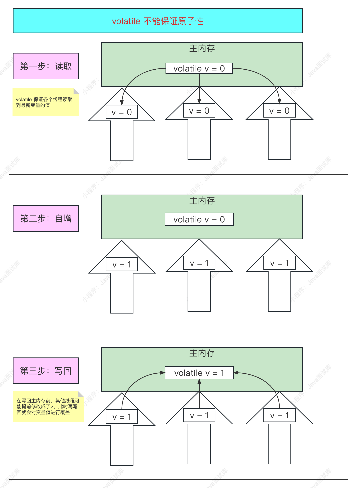

所以，volatile 不能保证原子性，只能保证可见性。

### 134、volatile可以保证可见性吗？怎么实现的？

volatile可以保证可见性，其原理主要是通过**内存屏障和禁止指令重排序**来实现的：

- **写一个volatile变量时**：JVM会在写操作前后加入一条Store 屏障指令，把该线程对应的工作内存中的共享变量的值刷新到主内存；
- **读一个volatile变量时**：JVM会在读操作前加入一条Load屏障指令，把该线程对应的工作内存的变量置为无效，然后从主内存中读取共享变量最新的值；

### 135、volatile可以保证有序性吗？怎么实现的？

可以的，`volatile`关键字可以一定程度上保证有序性，尤其是在**禁止指令重排序**方面，参考《 volatile 可以防止指令重排序吗？怎么实现的？》面试题。

但是，`volatile`关键字并不能解决所有的并发及顺序问题，在某些情况下，仍需要使用更强的同步机制，如`synchronized`关键字或`Lock`锁等，以确保程序的正确性。

### 136、volatile可以代替synchronized使用吗？为什么？

在可见性方面，volatile 可以代替 synchronized，但它并不能完全代替 synchronized，因为有以下几点原因：

（1）volatile 不能代替 synchronized 原子性的特点；

（2）volatile 只能修饰成员变量，不能代替 synchronized 来修饰方法、代码块来实现同步性；

（3）volatile 不能像 synchronized 一样当锁使用，volatile 不会像 synchronized 一样阻塞程序；

### 137、CountDownLatch有什么用？

CountDownLatch 见名思义，即倒计数器，是多线程并发控制中非常有用的线程并发控制类，它可以设置一个倒计数器数量，并控制另外一个线程等待，直到倒计数器归0再继续执行。


如该类注释所示，在调用countDown 方法让计数器归0 之前，await 的方法会一直阻塞。

> 具体用法可以参考另一道 CountDownLatch 编程题。

### 138、编程实现一个CountDownLatch的使用示例

##### 比如有下面一道题：

> 阻塞N个线程执行完后，主线再往下执行，并统计所有线程的总耗时。

当然我们可以通过join 的形式完成这道题，但如果我说统计 100 个、1000 个线程呢？难道要写 1000 个join 等待吗？这显然是不现实的，这时可以使用 CountDownLatch 类来实现。

废话少说，我们来做一个例子看看上面的题怎么实现：

```java
public class Test {
    public static void main(string[] args) throws InterruptedException {
        CountDownLatch cdl = new CountDownLatch(100);
        long start = System.currentTimeMillis();
        for (int i = 0; i < 100; i++) {
            new Thread(() -> {
                try {
                    Thread.sleep(500);
                }catch (Interruptedexception e){
                    e.printstackTrace();
                } finally {
                    cdl.countDown();
                }
            }).start();
        }
        cdl.await();
        System.out.println(cdl.getcount());
        System.out.printin(String.format("耗时: %sms", System.currentTimeMillis() - start));
    }
}
```

输出结果：

> 0
>
> 耗时：521ms


首先通过new CountDownLatch(10o)约定了倒计时器的数量，在这里也是线程的数量，每个线程执行完后再对倒计时器-1。countDown 方法即是对倒计时器－1，这个方法需要放在finally 中，一定要保证在每个线程中得到释放，不然子线程如果因为某种原因报错倒计时器永远不会清0，则会导报主线程会一直等待。

await 方法即是主线程阻塞等待倒计器归O后再继续往下执行，当然 await方法也可以带时间进去，等待多久时间后不管倒计时器有没有归0 主线程继续往下执行。

如上面的例子所示，我们输出了倒计时器最后的数字0，表示倒计时器归0了，也输出了从开始到结束所花费的时间。从这个例子可以完全理解倒计时器的含义，这个工具类在实际开发经常有用到，也很好用。

### 139、CyclicBarrier有什么用？

CyclicBarrier 和CountDownLatch 的功能有点相反，它是一个可循环使用的屏障，称为：循环栅栏。

CyclicBarrier 可以让一组线程到达一个屏障（栅栏）时，这一组线程同时被阻塞，当最后一个线程到达屏障时，屏障才会开门，所有被屏障拦截的线程才会继续运行。

##### CyclicBarrier有两个构造方法：

```java
public CyclicBarrier(int parties, Runnable barrierAction) {
    if (parties <= e) throw new IllegalArgumentException();
    this.parties = parties;
    this.count = parties;
    this.barriercommand = barrierAction;
}

public cyclicBarrier(int parties) {
    this(parties, null);
}
```

##### 参数说明：

- **parities**：表示屏障拦截的线程数量，每个线程调用await 方法告诉CyclicBarrier该线程已经到达屏障，然后当前线程被阻塞；

- **barrierAction**：屏障被打开时要执行的回调线程，它在被阻塞的线程继续运行前才运行；

> 具体用法可以参考另一道 CyclicBarrier 编程题。

### 140、编程实现一个CyclicBarrier的使用示例

##### 比如有下面一道题：

> 让5个线程同时执行，当每个线程都执行了某段代码后再继续往下执行，如果5个线程有一个线程还未执行该段代码，否则其他线程一直等待。

从上面的题目，我们来看下面的例子：

```java
public class Test {
    public static void main(string[] args) {
        long start = System.currentTimeMillis();
        CyclicBarrier cyclicBarrier = new CyclicBarrier(5, () -> { 
            System.out.println(String.format("时t: %sms", System.currentTimeMillis() - start)); 
            System.out.println("cyclicBarrier finished.");
        });
        for (int i = 0; i < 10; i++) {
            new Thread(() -> {
                try {
                    Thread.sleep(3000);
                    cyclicBarrier.await();
                    System.out.println(Thread.currentThread().getName());
                } catch (Exception e) {
                    e.printstacktrace();
                }
            }).start();
        }
    }
}
```

输出结果：

> 耗时：3015ms 
>
> CyclicBarrier finished.
>
> Thread-2
>
> 耗时：3021ms 
>
> CyclicBarrier finished.
>
> Thread-9
>
> Thread-0
>
> Thread-1
>
> Thread-4
>
> Thread-3
>
> Thread-7
>
> Thread-5
>
> Thread-8
>
> Thread-6


首先CyclicBarrier 构造方法接受 5个线程数和线程聚齐时的回调线程，就是当 5个线程都调用了 await 方法，这 5个线程才继续往下执行，执行前先运行到齐时的回调线程。

从例子输出的结果可以看出 CyclicBarrier finished.先运行的，说明 5 个线程都执行完后运行了回调线程，再输出了每个线程名称，我们控制10个线程来阻塞等待，而循环栅栏只有5个，说明它是可以循环利用的，每到齐5个线程阻塞的线程就继续执行。

> ##### 需要注意的是，await方法会抛出异常：
>
> - 一个是中断异常InterruptedException，即其他线程中断了这个线程；
> - 一个是 BrokenBarrierException，如果 1个线程被打断出现 InterruptedException，其他等待在循环栅栏外面的线程就会出现 BrokenBarrierException。因为一个线程被打断了，即打破了循环栅栏的完整性，导致线程不能到齐其他线程永远不能继续执行，这个异常也就避免了线程永远等待的情况。

### 141、CountDownLatch与CyclicBarrier的区别？

##### CountDownLatch：

计数器：计数器只能使用一次。

等待：一个线程或多个等待另外n 个线程完成之后才能执行。

##### CyclicBarrier：

计数器：计数器可以重置 (通过 reset 方法)。

等待：n个线程相互等待，任何一个线程完成之前，所有的线程都必须等待。

### 142、Semaphore有什么用？

Semaphore 叫做信号量，它是用来控制同时访问资源的线程数量，即对线程限流，通过协调各个线程来保证合理的公共资源的访问，特别是公共资源有限的应用场景。

##### Semaphore有两个构造方法：

```java
public Semaphore(int permits) {
    sync = new Nonfairsync(permits); 
}

public Semaphore(int permits, boolean fair) {
    sync = fair ? new Fairsync(permits) : new Nonfairsync(permits);
}
```

参数说明：

- permits：许可通行的线程数量；
- fair：是否公平锁（先进先出），默认为非公平锁；

Semaphore 获取许可和释放许可原理如下图：


### 143、编程实现一个Semaphore的使用示例

如下面的示例：

```java
public class Test {
    public static void main(string[] args) {
        Semaphore semaphore = new Semaphore(2);
        long start = System.currentTimeMillis();
        for (int i = 0; i < 5; i++) {
            new Thread(() -> {
                try {
                    semaphore.acquire();13System.out.printin(Thread.currentThread() ·getName() +"获取许可耗时: "+ (system.currentTimeMillis() - start));
                    TimeUnit.SECoNDs ,sleep(3);
                } catch (InterruptedException e) {
                    e.printstackTrace();
                } finally {
                    System.out.printin(Thread.currentThread() -getName() + " 释放许可");
                    semaphore.release();
                }
            }).start();
        }
    }
}
```

通过Semaphore 构造了2个许可线程，然后开启了5个线程同时执行，然后每个线程需要获取Semaphore许可才能执行，执行时休眠 3 秒模拟阻塞获取许可的场景，每个线程执行完后需要在 finally 主动释放许可，不然会造成其他线程一直阻塞，除非被中断。

输出结果：

> Thread-0获取许可耗时：6
>
> Thread-1获取许可耗时：6
>
> Thread-0 释放许可
>
> Thread-1释放许可
>
> Thread-2获取许可耗时：3034
>
> Thread-3获取许可耗时：3034
>
> Thread-3 释放许可
>
> Thread-2 释放许可
>
> Thread-4获取许可耗时：6037
>
> Thread-4 释放许可

从输出结果可以看到是有序执行的，释放两个许可，才能继续执行后续两个线程。

### 144、Exchanger有什么用？

Exchanger是一个用于线程之间协作的工具类，它可以支持两个线程之间交换彼此的数据。比如第一个线程执行exchange方法，它会一直等待第二个线程也执行 exchange，当两个线程都到同步点，就可以交换数据了。

Exchanger 提供了两个公开方法：


（1）只带泛型V（交换的数据对象）的交换方法，线程一直阻塞，直到其他任意线程和它交换数据，或者被线程中断。

（2）另外一个带时间的交换方法，如果超过设置时间还没有线程和它交换数据，就会抛出`TimeoutException`异常。

### 145、编程实现两个线程彼此交换数据的例子

##### 简单数据交换

来一个两个线程正常数据交换的简单示例：

```java
private static void test1() {
    Exchanger exchanger = new Exchanger();
    new Thread(() -> {
        try{
            object data ="-公众号Java技术栈AAA";
            System.out.println(Thread.currentThread() -getName() + data);
            //开始交换数据
            data = exchanger.exchange(data);
            System.out.println(Thread.currentThread() .getName() + data);
        } catch (InterruptedException e) {
            e.printstackTrace();
        }
    }).start();
    
    new Thread(() -> {
        try {
            Object data ="-公众号Java技术栈BBB"; 
            System.out.printin(Thread.currentThread()-getName() + data);
            //开始交换数据
            data = exchanger.exchange(data);
            System.out.printin(Thread.currentThread().getName() + data);
        } catch (InterruptedException e) {
            e.printstackTrace();
        }
    }).start();
}
```

##### 这段代码的逻辑：

1、创建并启动两个线程；

2、进行数据交换前先打印出自己线程的数据；

3、进行数据交换；

4、打印数据交换之后的数据；

##### 输出结果：


从结果可以看出，线程0、1分别先打印出A、B，数据交换之后，打印出了B、A，数据交换正常！

##### 超时数据交换

上面演示了两个线程的正常交换，下面再来一个带超时的示例：

```java
rivate static void test2() {
    Exchanger exchanger = new Exchanger();
    
    new Thread(() -> {
        try {
            object data="-公众号Java技术栈AAA";
            System.out.printin(Thread.currentThread() getName() + data);
            
            //开始交换数据
            data = exchanger.exchange(data, 3000L, TimeUnit.MILLISECONDS);
            System.out.println(Thread.currentThread() .getName() + data) ;
        } catch (Exception e) {
            e.printstackTrace();
        }
    }).start();
}
```

现在只启动了一个线程，并且设置了超时时间 3 秒。

##### 输出结果：


首先线程输出了自己的数据，然后3秒后，并没有其他线程和它交换数据，所以抛出了超时异常，最后线程结束运行。

##### 中断数据交换

线程开始交换数据后，会一直阻塞直到其他任意线程和它交换数据，或者被中断、超时，上面演示了超时，下面这个示例演示一下中断。

```java
private static void test3() { 
    Exchanger exchanger = new Exchanger();
    
    new Thread(() -> {
        try {
            Object data = "-公众号Java技术栈AAA";
            System.out.println(Thread.currentThread() ·getName() + data);
            //开始交换数据
            data = exchanger.exchange(data);
            System.out.printin(Thread.currentThread() -getName() + data);
        } catch (Exception e) {
            e.printstackTrace();
        }
    }).start();
}
```

结果输出：


默认情况下不带超时设置会一直阻塞运行中..

现在我再加入一段中断的逻辑：

```java
private static void test3() throws InterruptedException {
    Exchanger exchanger = new Exchanger();
    
    Thread thread = new Thread(() -> {
        try {
            Object data = "-公众号Java技术栈AAA";
            System.out.printin(Thread.currentThread() -getName() + data);
            //开始交换数据
            data = exchanger.exchange(data);
            System.out.printin(Thread.currentThread() -getName() + data);
        } catch (Exception e) {
            e.printstackTrace();
        }
    });
    thread.start();
    
    //线程中断
    Thread.sleep(3000L);
    thread.interrupt();
}
```

主线程休眠 3 秒后，中断该线程。

输出结果：


输出结果3秒后，线程被中断了，抛出了中断异常，线程也停止阻塞，最后线程结束运行。

##### 两两数据交换

另外需要知道是，Exchanger只能用于两个线程之间的数据交换，一个线程开启数据交换之后，会阻塞直到其他任意线程同样开启数据交换达到交换点。

最后来个示例，开启10个线程，看它们是怎么两两交换的：

```java
private static void test4() { 
    Exchanger exchanger = new Exchanger();
    
    for (int i = 1; i <= 10; i++) {
        Integer data = i;
        new Thread(() -> {
            try {
                Object exchange = exchanger.exchange(data);
                System.out.printin(Thread.currentThread() .getName() + "" + exchange);
            } catch (InterruptedException e) {
                e.printstackTrace();
            }
        },"Java技术栈"+ i).start();
	}
}
```

输出结果：


可以看到，10个线程，都两两交换彼此的数据了。

> 这篇介绍了线程之间的数据交换器Exchanger 类的使用，Exchanger 只能用于多个线程中的两个线程两两交换数据，如果没有对应的线程交换就会一直阻塞，可设置超时，可以中断。

### 146、LockSupport有什么用？

LockSupport 是JDK 中用来实现线程阻塞（park）和唤醒（unpark）的工具类，提供的方法如下图所示：


它可以很方便的使线程进行阻塞、唤醒，而不用担心阻塞和唤醒操作的顺序，但要注意连续多次唤醒和一次唤醒是一样的效果。

> 具体用法可以参考另一道 LockSupport 编程题。

### 147、LockSupport和wait-notify-notifyAll有什么区别？

它们都可以用来阻塞唤醒线程，区别如下：

（1） wait, notify, notifyAll是 Object 类的方法，LockSupport 是单独的线程工具类；

（2）wait, notify, notifyAll 需要使用 synchronized 关键字获取对象的锁才能阻塞线程，而 LockSupport 则不需要加锁，它可以在线程任意地方阻塞；

（3）notify只能随机唤醒一个阻塞的线程，notifyAll唤醒所有阻塞的线程，而 LockSupport 可以指定线程进行唤醒。

### 148、编程实现一个LockSupport阻塞唤醒线程的使用示例

如下面的使用示例：

```java
public class Test {public static void main(string[] args) {
    Thread thread1 = new Thread(() -> {
        System.out.println("thread1 start...");
        Locksupport.park();
        System.out.println("thread1 end...");
    });
    thread1.start();
    
    Thread thread2 = new Thread(() -> {
        System.out.printin("thread2 start...");
        try {
            TimeUnit.SECONDs.sleep(3);
        } catch (Interruptedexception e) {
            throw new RuntimeException(e);
        }
        Locksupport.unpark(thread1); 
        System.out.println("thread2 唤醒了 thread1");
    });
    thread2.start();
}
```

输出结果：

> thread1 start...
>
> thread2 start..
>
> thread2 唤醒了 thread1
>
> thread1 end...

thread1阻塞后，在 thread2 休眠3 秒后再唤醒 thread1后才继续执行。

### 149、Java中原子操作的类有哪些？

JDK 原子类包（java.util.concurrent.atomic）中的 Atomic*类都是原子操作设计的类，比如：

- AtomicBoolean：原子布尔类型类；
- Atomiclnteger：原子整形类；
- AtomicLong：原子长整形类；
- AtomicReference：原子引用类型类；
- ....

更多可以看 atomic 原子包，如该包目录结构所示：


### 150、什么是ABA问题？

CAS 需要在操作值的时候，检查值有没有变化，如果没有变化则更新，如果一个值原来是A变成了B，后来又变成了A，那么使用CAS 进行检测时会发现发的值没有发生变化，其实 A 中间是经过变过的，这就是所谓的ABA 问题。

如下面的 CAS 流程图所示：


### 151、怎么解决ABA问题？

解决 ABA 问题有以下 3 种参考方案：

##### （1）使用CAS+版本

号每次数据更新的时候追加版本号（+1)，如：A—B一A一>1A—2B—3A，然后CAS 再比较的时候，不仅要比较原来的值，还要比较版本号是否有改动，这样就解决了ABA 问题了。 

##### （2) AtomicMarkableReference

AtomicMarkableReference 是Java 并发包中提供的一个类，它可以在原子性的基础上给引l用对象打标记，用来解决一些ABA 问题，但并不能完全解决所有的 ABA 问题，因为它仍然存在一些限制。它可以通过标记来检测ABA问题，如果一个线程在修改引用对象时同时修改了标记，另一个线程就可以通过检查标记来判断对象是否被修改过。但是，**如果一个线程修改了引用对象，然后又将它改回原来的值，这个过程对于标记是没有影响的，因此另一个线程无法通过检查标记来判断对象是否被修改过。**

##### （3) 使用 AtomicStampedReference

从 JDK 1.5 开始，Atomic 包提供了一个 **AtomicStampedReference** 类来解决 ABA 的问题， AtomicStampedReference 是一个带有时间戳的对象引用，它在 AtomicMarkableReference 的基础上增加了一个版本号来解决 ABA 问题，即每次修改时都会更新版本号，从而确保不会出现ABA 问题。

### 152、什么是Happens-Before原则？

Happens-Before 原则用来指定两个操作之间的执行顺序，由于这两个操作可以在一个线程之内，也可以在不同线程之间，因此，JMM 通过 Happens-Before 原则来保证跨线程的内存可见性。

> 比如：如果线程A 是对变量进行写操作，而线程B 是对变量进行读操作，如果线程 A 的操作是 Happens-Before 线程 B的操作，那么线程A 写操作之后的数据对线程B 也是可见的。

两个操作之间存在 Happens-Before 关系，并不意味着一定要按照 Happens-Before 原则制定的顺序来执行，如果重排序之后的执行结果与按照 Happens-Before 关系来执行的结果一致，那么这种重排序是正常的。

### 153、Happens-Before 原则有哪些?

Happens-Before 八大原则如下表：

| 原则 | 名称              | 描述                                                         |
| ---- | ----------------- | ------------------------------------------------------------ |
| 1    | 程序次序规则      | 同一个线程内的操作，按照程序代码的先后顺序执行。             |
| 2    | volatile 变量规则 | 对一个 volatile 变量的写操作 Happens-Before 于后续对该变量的读操作。 |
| 3    | 传递性规则        | 如果操作 A Happens-Before 操作 B，操作 B Happens-Before 操作 C，那么操作 A Happens-Before 操作 C。 |
| 4    | 锁定规则          | 对一个锁的解锁 Happens-Before 于后续对同一个锁的加锁。       |
| 5    | 线程启动规则      | Thread 对象的 start() 方法 Happens-Before 新线程的所有操作。 |
| 6    | 线程终止规则      | 线程中的所有操作 Happens-Before 于其他线程检测到该线程已经终止。 |
| 7    | 中断规则          | 一个线程调用另一个线程的 interruptO 方法 Happens-Before 后者检测到中断信号。 |
| 8    | 终结器规则        | 一个对象的构造函数 Happens-Before 于该对象的 finalize( 方法。在该对象被GC回收之前，finalize( 方法会被调用。 |

> 注意：这里提到的原则仅是一些常见的 Happens-Before 原则，而不是全部。

### 154、Java并发容器，你知道几个？

并发容器在JUC 并发包中，比如有以下常用的几个：

- ConcurrentHashMap

- CopyOnWriteArrayList
- CopyOnWriteArraySet
- ConcurrentLinkedQueue
- ConcurrentLinkedDeque
- ConcurrentSkipListMap
- ConcurrentSkipListSet
- ArrayBlockingQueue
- LinkedBlockingQueue
- LinkedBlockingDeque
- PriorityBlockingQueue
- SynchronousQueue
- LinkedTransferQueue
- DelayQueue
- ....

### 155、什么是协程？

协程是比线程还要小的执行单元，它是对线程的更一步的分割，由于线程是操作系统中的最小执行单元，所以，协程必须也是基于线程来实现的，协程的所有生命周期都是在某一个线程中来完成的。

### 156、有了多线程，为什么还要搞出协程？

协程也叫纤程，在Java 中叫做虚拟线程（Java 19+开始支持），有了多线程，为什么要虚拟线程，那是因为线程之间的切换成本比较高，而协程在这方面却很轻便，协程可以进一步提高系统的并行能力。

##### 说说Java为什么搞出虚拟线程：

虚拟线程是JDK 19 开始支持的，它是Java 实现的轻量级线程，虚拟线程避免了上下文切换的额外耗费，兼顾了多线程的优点，简化了高并发程序的复杂，可以有效减少编写、维护和观察高吞吐量并发应用程序的工作量。

### 157、Java支持协程吗？


JDK 19+开始支持协程，在Java 里面叫 Virtual Threads，即虚拟线程。

虚拟线程，我们来看看是什么鬼：

> 虚拟线程是一种成本低廉、轻量级的用户模式的线程实现，它可以充分利用可用硬件，大幅减少编写、维护和监测高并发应用的工作量。

**低成本+轻量级+用户态**，这一看就是**协程**的定义了。。

我们都知道使用线程是要十分注意的，因为线程的创建、销毁都十分消耗系统资源，所以有了线程池，但这还不够，因为线程的数量是有限的，线程会阻塞操作系统线程，无法尽可能的提高吞吐量。因为使用线程的成本很高，所以才会有了虚拟线程，它是用户态线程，成本是相当低廉的，调度也完全由用户进行控制（JDK中的调度器），它同样可以进行阻塞，但不用阻塞操作系统线程，充分提高了硬件利用率，高并发也上了一个量级，从而实现了高吞吐量。

------

虚拟线程创建方式：

虚拟线程是`java.lang.Thread`的一个实现，可以使用`java.lang.Thread.Builder`接口创建，如下所示：

```java
Thread thread = Thread.ofvirtual()
    .name("javastack")
    .unstarted(runnable);
```

也可能会通过一个线程工厂类进行创建：

```java
ThreadFactory factory = Thread.ofvirtual().factory();
```

并且，可以通过 Thread.isVirtual0 方法判断是否虚拟线程。

虚拟线程运行的载体必须是线程，同一个线程中可以运行多个虚拟线程实例。

### 158、Java支持协程的框架有哪些？

支持 Java 协程的主流框架有：

- kilim
- Quasar
- ea-async

另外，Java 19+开始支持虚拟线程了，也就是协程。

### 159、SimpleDateFormat是线程安全的吗？为什么？以及怎么解决？

大家都说 SimpleDateFormat 不是线程安全的，到底哪里不安全呢？

来看 SimpleDateFormat 类的源码注释：


说的很清楚，**SimpleDateFormat 不是线程安全的**，多线程下需要为每个线程创建不同的实例。

不安全的原因是因为使用了 Calendar 这个全局变量：


在日期格式化的时候：


这个 time 就会出现多线程并发设置安全问题，比如 A 线程在执行设置的时候，刚好被 B 线程抢先设置了，这样时间不就错乱了。

-----

其实在阿里巴巴 Java 开发手册中也规范的很清楚：


##### 解决方法：

其实在阿里巴巴 Java 开发手册中也给出了答案，再总结下：

（1）尽量使用局部变量；

（2）如果要使用全局变量，则需要加锁格式化操作；

（3）使用 ThreadLocal 进行线程隔离；

### 160、parallelStream的底层实现是什么？

parallelStream 背后的秘密其实就是：ForkJoin


结果输出：

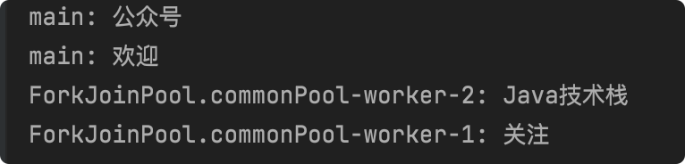

看到没，底层就是 ForkJoin 线程池，ForkJoinPool 和主线程都参与了并行任务。

### 161、parallelStream有没有遇到什么坑？

比如会引发以下问题：

- 事务不共享;
- 不能访问主线程本地变量;
- 线程安全性

欢迎大家补充...

### 162、parallelStream是线程安全的吗？

不是，parallelstream 会引起线程安全问题，所以要注意不要使用线程不安全的集合或者类。

### 163、parallelStream默认启动了多少线程？

parallelStream 使用了 ForkJoin 框架，其默认线程数即当前服务器的 CPU 可用核心数，如源码所示：


### 164、parallelStream如何修改默认线程数？

##### 1、全局设置

```java
System.setProperty("java.util.concurrent.ForkjoinPool.common.parallelism", "100");
```

或者：

```xml
-Djava.util.concurrent.ForkjoinPool.common.parallelism=8
```

##### 2、自定义ForkJoinPool

```java
ForkJoinPool myPool = new ForkJoinPool(100);
myPool.submit(() ->
	list.parallelstream().forEach(...);
).get();
```

### 165、parallelStream和 stream 的区别？

下面用一张表格总结下：

| 对比         | parallelStream | stream   |
| ------------ | -------------- | -------- |
| 执行顺序     | 并行执行       | 顺序执行 |
| 执行方式     | 异步           | 同步     |
| 线程安全问题 | 存在           | 不存在   |

### 166、parallelStream和 stream哪个快？

这个没有绝对答案，使用 parallelstream 处理耗时的数据肯定要更快，但 stream 处理简单的操作也未必比 parallelstream 慢。

# IO 67

### 1、什么是IO？

Java 中的 I/O 主要是指使用 Java 进行输入、输出操作，包括但不限于以下几种：

- 磁盘文件读写
- 网络数据读写
- 内存数据读写

Java 中的 I/O 操作核心库在java.io 和java.nio 包下面，它们提供了全面的 IO 操作接口和实现类，IO 读写是以“**流**"为基础进行输入输出的，当程序读写数据时，就会开启一个通向来源对象（读）的流，以及通用目标对象（写）的流，数据在输入和输出介质中“**流**"动，所以叫“**流**"。

### 2、什么是BIO？

BlO就是指IO，即传统的Blocking IO，即同步并阻塞的IO，相关类在java.io包下面。

BlO 也是JDK 1.4之前的唯一选择，依赖于 ServerSocket实现，服务器实现模式为一个请求对应一个线程，如果线程数不够连接，则会等待空余线程或者拒绝连接，如下图所示:


所以 BIO 在高并发情况下效率是很低的，也不可靠，一般只应用于连接数比较小且固定架构的应用，但 API 也比较容易使用。

### 3、什么是NIO？

NIO 就是指 JDK 1.4 推出来的 Non-Blocking IO，即同步非阻塞的IO，相关类在java.nio 包下面。

NIO 提供了高速的 IO 操作，它加入了 Buffer、Channel、Selector 等概念，它是基于事件驱动的，采用了 Reactor 模式，它使用一个线程管理所有的 Socket 通道，即客户端发送的连接请求都会注册到多路复用器上，多路复用器轮询到连接有IO 请求时才启动一个线程进行处理。

NIO会将连接放到一个数组中，然后再不断主动的查看数组中的连接有没有数据发过来，一般只适用于连接数目较大但连接时间短的应用，如聊天应用等。

如下图所示：


### 4、什么是AIO？

AIO 指的是 NIO 2.0，JDK 1.7 开始推出，它是异步非阻塞的 IO。

NIO 虽然是非阻塞的，但是它的IO 操作还是同步的。AIO 引I入了异步通道的概念，客户端的连接请求和发送数据的请求使用不同的线程来处理，它不是当IO准备好时才通知线程（NIO），而是当IO 操作完成后才通知服务端程序启动线程去处理，相同于一个回调，·般适用于连接数较多且连接时间长的应用。

### 5、你怎么理解IO、BIO、NIO、AIO？

| 对比项   | BIO (IO) | NIO                   | AIO        |
| -------- | -------- | --------------------- | ---------- |
| JDK      | AlI      | JDK 1.4+              | JDK 1.7+   |
| IO模型   | 同步阻塞 | 同步非阻塞 (多路复用) | 异步非阻塞 |
| 线程数   | 1:1      | 1:N                   | O:N        |
| 编程难度 | 简单     | 复杂                  | 复杂       |
| 可靠性   | 差       | 好                    | 好         |
| 吞吐量   | 低       | 高                    | 高         |

### 6、你怎么理解同步IO和异步IO？

同步IO 和异步IO是指在计算机系统中进行数据读写时，应用程序和操作系统之间的不同通信方式。

**同步IO（Synchronous IO）**是指在读写数据时，应用程序必须等待操作系统完成数据读写操作后才能继续执行下一步操作。这种方式简单易用，但因为必须等待数据读写完成，所以当遇到瓶颈时会造成系统性能下降。

**异步IO（Asynchronous Io）**是指在读写数据时，应用程序不必等待操作系统完成数据读写操作，可以继续执行其他任务。在数据读写完成后，操作系统会通知应用程序，以便应用程序进行后续处理。这种方式能够提高系统的并行能力和吞吐量，但实现起来相对复杂。

------

Java 中的 BIO、NIO 是同步的，AIO（NIO 2.0） 是异步的。

### 7、你怎么理解阻塞10和非阻塞IO？

阻塞IO 和非阻塞IO 是指在计算机系统中进行数据读写时，应用程序是否等待读写操作完成的方式。

**阻塞IO（BlockingIO）**是指当应用程序请求读写操作时，应用程序必须等待操作完成才能继续执行其他操作。这种方式简单易用，但性能很差，当读写操作长时间不能完成，应用程序就会被阻塞，不能继续执行其他任务。

**非阻塞IO（Non-blocking IO）**是指当应用程序请求读写操作时，如果读写操作不能立即完成，应用程序不会等待，而是直接返回并继续执行其他任务。这种方式能够提高系统的并行能力和吞吐量，但实现起来相对复杂。

------

Java 中的 BIO是阻塞的，NIO 和 AIO（NIO 2.0）是非阻塞的。

### 8、IO中的输入流和输出流有什么区别？

**输入流**：是从数据源读取数据的流，例如从文件、网络套接字等读取数据。

**输出流**：是将数据写入数据目的地的流，例如写入文件、网络套接字等。

### 9、常用的10类有哪些？

如下图所示：


Java 提供的所有流类位于java.io 包中，都分别继承自以下四种抽象流类：

##### InputStream

-----

继承自InputStream 的流都是用于向程序中输入数据的，且数据单位都是字节（8位）。

##### OutputStream

-----

继承自OutputStream 的流都是程序用于向外输出数据的，且数据单位都是字节（8位）。

##### Reader

------

继承自Reader的流都是用于向程序中输入数据的，且数据单位都是字符（16位）。

##### Writer

----

继承自Writer的流都是程序用于向外输出数据的，且数据单位都是字符（16位）。

### 10、为什么需要NIO？用IO和线程池不行吗？

> ##### 面试官问：
>
> 为什么要用NIO？用IO 和线程池不行吗？比如，我搞一个最大为 1000 大小的线程池？

不行，因为I0是同步并阻塞的，就算搞1000个线程的线程池，如果这1000个线程只是连接了，但并不发送数据，然后造成阻塞，然后这个线程池就不能接受别的请求了，这不是影响了后面的线程吗？

所以，如果是用户量和连接量小的应用，用IO怎么搞都无所谓，但如果用户量和连接量多，同时连接几万、几十万这样，不可能一直加线程处理的，服务器早就崩了。

### 11、IO有哪三大件组成？它们之间的关系是怎样的？

NIO 的三大件：Channel、Buffer、Selector，如下图所示：


##### Channel (通道)

----

1)） Channel 可以同时进行读写；

2）Channel 可以实现异步读写数据；

3）Channel 可以从 Buffer 读取数据，也可以写数据到 Buffer；

##### Selector (选择器)

-----

1）Selector 通过检测多个注册的 Channel 上是否有事件发生，如果有事件发生，便获取事件然后进行相应的处理，这样就可以只用一个单线程去管理多个 Channel，也就是管理多个连接和请求。

2）只有在连接真正有读写事件发生时，才会进行读写，并且不需要为每个连接都创建一个线程，也不用去维护多个线程，避免了多线程之间的上下文切换成本，这样就大大地减少了系统的开销。

##### Buffer(缓冲区)

----

缓冲区本质上是一个可以读写数据的内存块，Channel 提供从文件、网络读取数据的渠道，但是读取或写入的数据都必须经由 Buffer。

-------

##### NIO 三大件之间的关系：

1）Selector 对应一个线程，一个线程对应多个 Channel，Selector 会根据不同的 Event（事件）在各个 Channel 上切换，程序切换到哪个 Channel 是由 Event 决定的。

2）每个 Channel都会对应一个 Buffer，Buffer 就是一个内存块，底层对应一个数组。

3）数据的读取写入通过Buffer，Buffer 既可以读，也可以写。

### 12、NlO与Netty有什么关系？

Netty 是一个基于 NIO 的网络通信框架，可以说 NIO 是 Netty 的基础。

Netty 诞生的主要目的是为了简化网络编程，提高编程效率。Netty 封装了NIO 中的繁琐细节，并且提供了很多高级特性，如简单的事件驱动、高效的内存管理等，让开发者可以更专注于实际的业务逻辑实现。

### 13、NIO是如何实现多路复用的？

在 NIO中，多路复用是通过使用Selector实现的，Selector允许一个线程同时处理多个通道的I/O事件。

下面是 NIO 实现多路复用的简单流程：

- 建一个 Selector 对象。
- 将需要处理的通道注册到 Selector 中，并设置感兴趣的事件（比如：读、写、连接）。
- 调用 Selector 的 select() 方法，阻塞地等待就绪的通道。
- 通过调用 selectedKeys()方法获取已经就绪的通道。
- 遍历就绪的通道，处理相应的I/O 事件。
- 关闭处理完毕的通道，以及 Selector 对象。

### 14、NlO中的Scatter和Gather分别是什么？

NIO 中的 scatter 和 gather 指的在多个缓冲区上实现的I/O 操作，比如从通道中读取数据到多个缓冲区，或从多个缓冲区中写入数据到通道。

**scatter（分散）**：指的是从通道中读取数据并写下到多个缓冲区，该过程可以理解为数据分散。


**gather（聚集）**：指的是从多个缓冲区中读取数据并写入到同一个通道，该过程可以理解为数据聚焦。


scatter和gather经常用于需要将传输的数据分开处理的场合，比如，传输一个由消息头和消息体组成的消息，就可以将消息头和消息体内容分散到不同的 Buffer 中，这样可以很方便灵活的处理。

### 15、为什么不建议使用Java原生NIO？

主要有以下几点：

1、JavaNIO类库设计很复杂，非常难用，学习成本很高；

2、需要熟练掌握Java 多线程和网络编程，才能编写高质量的NIO应用；

3、Java NIO 可能还存在着性能 bug...

##### 主要还是因为Netty的出现，要比Java原生NIO要更好用、更易用、高性能。

### 16、什么是比特(Bit)、字节(Byte)、字符(Char)？

##### Bit

----

Bit是最小的二进制单位，是计算机的操作部分，取值0 或者1。

##### Byte

-----

Byte是计算机操作数据的最小单位，由8位Bit组成，取值范围-128～127。

##### Char

-----

Char是用户可读写的最小单位，在Java里面由16位Bit组成，取值范围0～65535。

### 17、Java有哪几种类型的流？

##### 按数据流向分：

- **输入流**：程序可以从中读取数据的流；
- **输出流**：程序能向其中写入数据的流；

-----

##### 按数据传输单位分：

- **字节流**：以字节为单位传输数据的流；
- **字符流**：以字符为单位传输数据的流；

------

##### 按功能分：

- **节点流**：用于直接操作目标设备的流；
- **过滤流**：是对一个已存在的流的封装，提供了强大且灵活的读写功能；

### 18、字节流和字符流的区别？

##### 字节流

----

1）字节流在操作的时候不会用到缓冲区；

2）字节流可用于处理任何类型的对象，包括二进制对象；

3）字节流处理单元为1个字节，分别为字节和字节数组，不能处理 Unicode 字符;

> InputStream 是所有字节输入流的祖先，而 OutputStream 是所有字节输出流的祖先。

##### 字符流

---

1）而字符流在操作的时候会用到缓冲区；

2）而字符流只能处理字符或者字符串；

3）字符流处理的单元为 2 个字节的 Unicode 字符，分别为字符、字符数组或字符串。

> Reader 是所有读取字符串输入流的祖先，而 Writer 是所有输出字符串的祖先。

-----

在硬盘上的所有文件都是以字节形式存在的（图片，声音，视频），而字符值在内存中才会形成，所以字符流是由Java 虚拟机将字节转化为 2个字节的Unicode字符为单位的字符而成的。

### 19、字节流怎么转换成字符流？

##### 字节输入流转换成字符输入流：

可以通过 InputStreamReader 类实现，这个类的构造函数可以传入一个 InputStream 对象。

##### 字节输出流转换成字符输出流：

可以通过 OutputStreamWriter 类实现，这个类的构造函数可以传入一个 OutputStream对象。

### 20、InputStream和Reader有什么区别？

InputStream 和 Reader 是Java 中两种不同类型的输入流，主要区别如下。

##### 1）数据类型

InputStream 读取的是字节数据，而 Reader 读取的是字符数据。

##### 2）字符编码

InputStream 只能读取字节数据，仅支持最基本的AsCll 编码，也不能对字符进行编码。

Reader 支持更多的字符集，例如 UTF-8，UTF-16 等，也可以在读取字符数据时指定字符编码，这使得它更适合处理文本数据。

##### 3）使用场景

InputStream 适用于读取非文本数据，例如二进制文件（图像，音频，视频），而 Reader 适用于读取文本数据。

总之，当需要读取字节数据时，使用InputStream 比较好，当需要读取字符数据时，使用 Reader 适宜。

### 21、BufferedReader和Reader有什么区别？

Reader 是 Java 中字符输入流的一个抽象父类，而 BufferedReader 是 Reader 的子类。

##### 两者最大的区别在于：

1）Reader 不能实例化使用，而 BuferedReader 可以实例化使用。

2）BufferedReader 使用缓冲区读取字符数据，BufferedReader 提供了读取一行数据的方法`readLine()`，它可以一次读取大量的字符，而 Reader 每次只能读取一个字符。

3）由于BufferedReader 使用缓冲区，它的读取效率比Reader高。所以，如果需要读取大量的字符数据，并且希望读取的效率较高，可以使用 BufferedReader。

### 22、PrintStream和PrintWriter的区别？

1）PrintWriter可以接收一个Writer流，PrintStream不能；

2）PrintStream 可以自动flush，而PrintWriter默认不能自动flush；

3）PrintWriter 不包含用于写入原始字节的方法，因此程序应该使用未编码的字节流；

### 23、FileWriter和BufferedWriter的区别？

主要区别如下：

1）网上很多答案都说 FileWriter 没有缓冲区，其实是误导性的。FileWriter 也是有缓冲区的，如果使用的 Writer 类的 write 方法，大小为 1024个字节，而如果使用的是 StreamEncoder 类的 write 方法，缓冲区为 8192个字节，并且它们都不支持修改；而BufferedWriter默认缓冲区大小为 8192个字节，并且支持自定义。

2）BufferedWriter 的效率要比 FileWriter 高不少，因为 FileWriter 每调用一次 write 方法就会调用一次 OutputStreamWriter#write 方法并进行一次转码，而 BufferedWriter 只有在缓冲区满了才会调用 OutputStreamWriter#write 方法并进行一次转码，这就是BufferedWriter 高效的原因。

### 24、FileWriter和BufferedWriter怎么选？

如果只是一次性写入文件，使用哪个效率都没啥影响。

如果需要多次写入文件，应使用 BufferedWriter，性能更好，它可以避免频繁执行 OutputStreamWriter 的 write 方法而导致转码影响性能。

### 25、PrintStream是什么流？

PrintStream 即打印流，它是一种过滤流，它继承了FilterOutputStream 过滤流类：


PrintStream 打印流为其他输出流添加了额外的功能，能够方便地打印各种形式的数据，PrintStream 只负责输出数据，不负责数据的输入。

> PrintStream 可以自动 flush，PrintStream 永远不会抛出 IOException。

### 26、PrintWriter是什么流？

PrintWriter 是 PrintStream 的扩展，它继承了 Writer 类，并实现了 PrintStream 类中的所有打印方法，它不包含用于写入原始字节的方法，因此程序应该使用未编码的字节流。


> PrintWriter 默认不能自动 flush，PrintWriter 永远不会抛出 IOException。

### 27、System.out是什么流？

如下图所示：


System.out 使用的是 PrintStream 打印流，System.err 也是一样的。

```java
public static final Printstream err = null;
```

### 28、什么是Filter流？

Filter 流是一种IO 流，叫过滤流，也叫包装流，是一种过滤字节或字符的数据流。它的主要作用是用来对已存在的流增加一些额外的功能，基本IO流只能读取字节或者字符，而过滤流可以读取整数值、双精度值、给目标文件增加行号等等。

### 29、Filter流可以分为哪几类？

Filter 流可以分为字节过滤流和字符过滤流：

- 字节过滤流类： FilterlnputStream 和 FilterOutputStream；
- 字符过滤流类：FilterReader 和 FilterWriter；

### 30、Filter流有哪些常用的实现类？

比如有以下几个常用的 FilterlnputStream 实现类：

| 类                    | 功能                                                        |
| --------------------- | ----------------------------------------------------------- |
| LineNumberlnputStream | 给目标文件增加行号，已标识废除，被LineNumberReader 代替     |
| DatalnputStream       | 可以读取 Java 基本数据类型的数据，如 readlnt、areadFloat 等 |
| BufferedlnputStream   | 字节缓冲输入流，可以提高IO 效率                             |

### 31、缓冲区和缓存有什么区别？

这两个完全是不同的概念。

计算机中的缓存（Cache）通常是指高速缓存存储器，是为了加快CPU和主存之间的数据传输速度而设置的一级存储器，它的作用是将CPU频繁访问的数据保存在本地，以避免因为内存访问速度慢而影响系统性能。另外，还有浏览器缓存、内存数据缓存（比如:Redis）、各种形式的缓存等等。

缓冲区（Buffer）则是一种IO 中的临时存储区，在数据传输过程中起到缓冲作用，以确保不会因为传输速率不匹配而导致数据丢失或错误。例如，当快速生成的数据要写入磁盘时，可以先写入缓冲区，等待磁盘准备好后再进行数据输出。

所以，缓存是为了提高系统性能而设置的，而缓冲区则是IO 中为了确保数据传输的正确性和顺序而设置的。

### 32、什么是缓冲流？

缓冲流是一种特殊的流，它对读写操作进行了缓存，以提高读写性能。缓存流可以在读写操作时缓存数据，并在缓存满后一次性写入或读取数据，从而减少系统I/O次数，提高读写性能。

缓冲流提供了一个缓冲区，缓冲流读取到数据后不会马上输出到目标流，而是等缓冲到指定大小的数据后再一次性写出去，默认的输入/输出缓冲区大小为8192个字节。

### 33、缓冲流有什么优势？

##### 缓冲流的优势：

- 高了流的工作效率；
- 如果是写入到磁盘，可以减少磁盘的读取次数，降低磁盘损耗；

### 34、缓冲流可以分为哪几类？

缓冲流可以分为字节缓冲流和字符缓冲流：

- 字节缓冲流类： BufferedlnputStream 和 BufferedOutputStream ;

- 字符缓冲流类：日BufferedReader 和 BufferedWriter；

### 35、什么是回退流？

回退输入流是一种可以回退已经读取字节的输入流，对于一个正常输入流来说，都是采用从头到尾的顺序读取的，而回退流（回退输入流）则是Java 中输入流的一种特殊操作，它可以使读取的字节或字符回到输入流的缓冲区，以便下一次读取可以重新获取相同的数据。

### 36、回退流分为哪几类？

回退流同样分为字节流和字符流，回退流的实现类是 PushbacklnputStream 和 PushbackReader 类，使用时，需要先创建一个回退流对象，然后使用unread 方法在输入流的缓冲区中回退数据。

**PushbacklnputStream**：将读取的数据返回到输入流的缓冲区中，以便以后读取。

**PushbackReader**：将读取的数据返回到输入流的缓冲区中，以便以后读取。与 PushbacklnputStream 不同的是，PushbackReader可以处理字符，而不是字节。

如下面的示例：

```java
PushbackInputstream in = new PushbackInputstream(new FileInputstream("input.txt"));
int data = in.read();
if (data == '') {
    in.unread(data);
}
```

如果读取到的数据是“."，则使用unread( 方法将数据回退到输入流的缓冲区中，以便下一次读取可以重新获取它。

### 37、IO流中的flush是指什么？

flush 即冲刷方法，它是定义在OutputStream 和Writer这两个输出流类里面的方法，它的主要功能是把缓冲区的数据强制写入到目标对象，缓冲区的默认大小是8192字节。

### 38、IO流中的close和flush的区别？

1）**flush 是强制刷新缓冲区**，缓冲区的默认大小是 8192 字节，当达到 8192 个字节后就会自动 flush，而如果小于 8192个字节，流不会触发自动 flush 操作。**close 是关闭流**，close 默认会进行一次 flush 操作；

2）flush 之后，流还可以接着写入，而 close 之后，流就不能再写入了;

### 39、所有IO流都需要flush操作吗？

不是的，flush 它是定义在 OutputStream 和 Writer 这两个输出流类里面的方法，所以，flush 操作只涉及 IO 输出流，不涉及 IO 输入流，只有当这些IO 输出流中的实现类使用了缓冲区，才需要flush 操作，然后数据从缓冲区冲刷到目标的。

### 40、IO流关闭之前，一定要flush操作吗？

使用 close 关闭流之前不需要 flush 操作，因为 close 关闭流会自动刷新（flush）一次，如缓冲流的 close 方法源码所示：


### 41、IO 流关闭之前，什么时候需要flush 操作？

> 一般的开发规范，建议 close 关闭流之前都进行一次 flush 操作。

来看以下两点：

1）有的流实现类默认没有开启自动 flush，比如：PrintWriter。

2）缓冲流虽然 close 时会自动 flush，但有时候时候忘记 close 关闭流，这就导致部分数据丢失。

### 42、怎么反复读取输入流中的内容？

在Java中，流（IO）通常是一次性的，读取完毕后无法再次读取，如果需要反复读取流中的内容，可以有以下两种方法。

##### 1、把流中的数据缓存起来

将内容缓存到一个可重复读取的数据结构中以实现多次读取，比如以下示例：

```java
byte[] bytes = XxInputstream.readAllBytes();
```

##### 2、标记重置

在读取前标记初始位置，读取完之后再重置到初始位置，比如以下示例：

> xxInputstream.mark(0);
>
> // 第一次读取 
>
> ....
>
> // 重置
>
> xxInputstream.reset():
>
> // 第二次读取
>
> ...

### 43、Java序列化是什么？

Java 序列化技术是将对象转变成一串由二进制字节组成的数组，可以通过将二进制数据保存到磁盘或者传输网络，磁盘或者网络接收者可以在对象的属类的模板上来反序列化类的对象，达到对象持久化的目的，如下图所示：


我们的对象并不只是存在内存中，还需要传输网络，或者保存起来下次再加载出来用，所以需要Java 序列化技术。

### 44、Java有哪两种序列化方式？

在 Java 中有两种实现序列化的方式，**Serializable** 和 **Externalizable**，可能大部分人只知道 Serializable 而不知道 Externalizable。

> ##### 这两种序列化方式的区别是：
>
> 实现了 Serializable 接口的对象的属性是自动序列化的，实现 Extermalizable 的对象的属性则需要手动序列化，即通过 writeExternal和 readExternal 方法手动进行。
>
> 具体见 Serializable 和 Externalizable 的编程题。

### 45、序列化ID（serialVersionUID）的作用是？

serialVersionUID 是 Java 序列化的一个版本标识符，在进行 Java 序列化和反序列化时，Java 虚拟机会检查序列化类的版本是否与反序列化类的版本匹配。

Java 中的序列化机制就是通过判断原始序列化对象和当前类的 serialVersionUID 变量的值来验证版本是否一致的，如果一致，则反序列化成功，如果不一致，则反序列化失败，抛出序列化运行时异常（InvalidClassException）。

### 46、序列化ID（serialVersionUID）格式是怎样的？怎么生成？

序列化 ID 定义格式如下：

```java
@Serial 
private static final long serialVersionU1D = 6697450461076091955L;
```

可以手动生成，也可以在开发工具中一键生成，JDK 14+建议添加 @Serial 注解标识，但不是必须的。

### 47、序列化ID（serialVersionUID）一定要显示声明吗？

强烈建议显示声明 serialVersionUID 变量并赋值，但不是必须的。

如果不显示声明 serialVersionUID，JVM 将会根据算法自动生成一个 serialVersionUID 变量以作序列化版本比较用。

### 48、序列化ID（serialVersionUID）默认生成的有什么问题？

可能存在以下问题：

1）如果类被修改，则默认生成的 serialVersionUID 值可能会被再次更改，因此可能导致反序列化失败。

2）默认生成的 serialVersionUID 计算对类详细信息十分敏感，而类详细信息可能会根据编译器的实现而有所不同，因此可能导致反序列化失败。

所以，为避免这些问题，建议在任何实现 Serializable 接口的类中显式声明一个 serialVersionUID 字段。

### 49、序列化ID（serialVersionUID）一定要唯一吗？

序列化 ID（serialVersionUID）值不一定要唯一，多个类可以使用相同的 serialVersionUID 值，因为这个值只是用于标识某个类的版本，而不是用于标识具体的某个类，类与类之间是隔离的。

比如，我们在项目中经常看到这样写：

```java
private static final long serialversionuiD = 1L;
```

这样是没问题的，可以正常序列化/反序列化。

### 50、同一个类的不同对象可以有不同的serialVersionUID值吗？

不可以，serialVersionUID 是类的静态字段，所以它是与类相关联的，而不是与类的各个实例对象相关联的。

serialVersionUID 用作可序列化类的版本标识符，并在反序列化期间用于验证序列化对象的发送方和接收方是否已为该对象加载与序列化兼容的类，单个类只有一个 serialVersionUID，无论该类存在多少个实例对象，所以反序列化时，同一类的不同对象的serialVersionUID值必须相同，不然不同的就会反序列化失败。

### 51、序列化ID（serialVersionUID）可以修改吗？什么时候需要？

##### 需要修改serialVersionUID的情况如下：

1. **添加或删除类中的字段**：当在类中添加或删除字段时，可能会影响序列化的结构，因此需要更新 serialVersionUID。
2. **修改字段的类型**：当修改字段的类型时，可能会影响序列化的结构，因此需要更新 serialVersionUID。
3. **修改类的继承关系**：当修改类的继承关系时，可能会影响序列化的结构，因此需要更新 serialVersionUID。
4. 以上不是必须的，具体看业务需要，来看**《阿里巴巴的Java 开发手册》**中定义：


如果类只是删除、新增字段，则可以兼容，不需要修改 serialIVersionUID 字段的值，只是多出来的字段会丢失值而已，当然。而如果修改，则直接会导致反序列化失败。

如果修改了类的结构，比如修改了字段的类型，比如从 int 修改为了 String，则会反序列化失败，此时最好是修改 serialVersionUID 字段的值，避免反序列化混乱。

### 52、序列化中的@Serial注解的作用？

@Serial 注解是 Java14 中引I入了一个新注解：


它用于标识某个类的某个成员变量、方法是否是序列化机制的一部分，这个注解纯粹是为了更好地进行编译时类型检查，类似于@Override 注解。

相关的方法和成员变量如下所示：


这也是为什么在 JDK 14+建议添加 @Serial 注解标识的原因。

注意，这个注解不是添加在要序列化的对象的普通变量和方法上，如：

```java
@Serial
private int id = 0;
```

它们是序列化的对象变量，和序列化机制本身没有关系，所以会提示它不是序列化机制的一部分：


### 53、编程：基于Externalizable序列化和反序列化一个对象

##### 1、类实现 Externalizable 序列化接口

要基于 Externalizable 接口序列化一个对象，这个对象所在类就必须实现 Java 序列化的接口：

> java.io.Externalizable

```java
public class User implements Externalizable { 
    private static final long serialversionUID = 1L;
    public User() {
    }
    private string username;
    private transient string id;
    public String getusername() {
        return username;
    }
    public void setusername(string username) {
        1this.username =username;
    }
    public String getid() {
        return id;
    }
    public void setid(string id) {
        this.id = id;
    }
    @override
    public void writeExternal(objectoutput objectoutput) throws IoException {
        objectoutput.writeobject(id);
    }
    @override
    public void readExternal(objectInput objectInput) throws IOException, ClassNotFoundException {
        id = (string) objectinput.readobject();
    }
}
```

##### 2、序列化/反序列化

```java
public class ExternalizableTest {
    public static void main(string[] args) throws Exception {
        User user = new user();
        user.setusername("Java技术栈");
        user.setid("javastack");
        Objectoutput objectoutput = new objectoutputstream(new Fileoutputstream(new File("javastack")));
        objectoutput.writeobject(user);
        objectinput objectInput = new objectInputstream(new Fileinputstream(new File("javastack")));
        user = (User) objectInput.readobject();
        System.out.printin(user.getusername());
        System.out.printin(user.getid());
        objectoutput.close();objectinput.close();
    }
}
```

输出结果：

> null 
>
> javastack

因为 User 类只手动序列化了 id， usermame 没有序列化所以为 null。

> User中的id 被 transient 修饰了，为什么还能序列化出来？
>
> 那是因为 User 实现了接口 Externalizable，而不是 Serializable， transient 只作用于 Serializable 接口。

### 54、编程：基于Serializable序列化和反序列化一个对象

##### 1、类实现Serializable序列化接口

要基于 Serializable 接口序列化一个对象，这个对象所在类就必须实现 Java 序列化的接口：

>  java.io.Serializable

```java
public class User implements Serializable {
    private static final long serialversionU1D = -8475669200846811112L;
    private string username;
    private string address;
    public string getusername() {
        return username;
    }
    public void setusername(string username) {
        this.username = username;
    }
    public String getAddress() {
        return address;
    }
    public void setAddress(string address) {
        this.address = address;
    }
    @override
    public string tostring() {
        return "user{" + 
            "username='\'" + username + '\'' +
            "address='" + address + "\'" + 
            '}';
    }
}           
```

##### 2、序列化/反序列化

可以借助 commons-lang3 工具包里面的类实现对象的序列化及反序列化，你没有必要自己写。

```java
public class Test {
    public static void main(string[] args) {
        User user = new User();
        user.setusername("Java");
        user.setAddress("china");
        byte[] bytes = Serializationutils.serialize(user);
        User u = Serializationutils.deserialize(bytes);
        system.out.println(u);
    }
}
```

输出：

> User{username='Java', address='china'}

上例通过序列化对象字节到内存然后反序列化，当然里面也提供了序列化磁盘然后再反序列化的方法，原理都是一样的，只是目标地不一样。

----

SerializationUtils 工具类序列化/反序列化方法源码如下：

```java
public static byte[] serialize(final serializable obj) {
    final ByteArrayoutputstream baos = new ByteArrayoutputstream(512);
    serialize(obj, baos);
    return baos.toByteArray();
}
public static void serialize(final serializable obj, final outputstream outputstream) {
    Validate.notNull(outputstream, "outputstream");
    try (objectoutputstream out = new objectoutputstream(outputstream)) {
        out.writeobject(obj);
    } catch (final IoException ex) {
        throw new SerializationException(ex);
    }
}

public static <T> T deserialize(final byte[] objectData) {
    Validate.notNull(objectData, "objectData");
    return deserialize(new ByteArrayInputstream(objectData));
}

public static <T> I deserialize(final Inputstream inputstream) {
    Validate.notNull(inputstream, "inputstream");
    try (objectinputstream in = new objectinputstream(inputstream)) {
        @suppressWarnings("unchecked")
        final T obj = (T) in.readobject();
        return obj;
    } catch (final ClassNotFoundException | IOException ex) {
        throw new SerializationException(ex);
    }
}
```

让你知道，如果不用工具类，序列化和反序列化就得这么写。

### 55、transient关键字有什么用？

##### transient关键字的作用及注意事项：

1）transient修饰的变量不能被序列化；

2）transient 只能用来修饰普通成员变量；

3）transient 只作用于实现 Serializable 接口；

4）不管有没有 transient 修饰，静态变量都不能被序列化；

### 56、怎么控制类中的某些变量不被序列化？

实现 **Serializable** 接口，用 **transient** 关键字修饰的变量不会被序列化。

如下面的使用示例：

> private transient String address;

具体见编程题：编程实现一个序列化对象部分数据的例子。

### 57、编程实现一个序列化对象部分数据的例子

> 给定一个用户类，只有用户名和 ID 成员变量，要求只序列化和反序列化用户名，ID 不需要序列化。

只序列化部分对象数据，关键是使用 transient 关键字修饰不需要序列化的成员变量。

要序列化的用户类：

```java
public class User implements Serializable {
    private static final long serialversionuID = 1L; 
    private string username; 
    private transient string id; 
    public String getusername() {
        return username;
    }
    public void setusername(string username) {
        this.username = username;
    }
    public string getid() {
        return id;
    }
    public void setid(string id) {
        this.id = id;
    }
}
```

测试程序：

```java
public class TransientTest {
    public static void main(string[] args) throws Exception {
        User user = new User();
        user.setusername("Java技术栈");
        user.setid("javastack");
        
        System.out.println("\n序列化之前");
        System.out.printin("username: " + user.getusername());
        System.out.printin("id: " + user.getid());
        
        objectoutputstream os = new objectoutputstream(new Fileoutputstream("d:/user.txt"));
        os.writeobject(user);
        os.flush();
        os.close();
        
        objectinputstream is = new objectInputstream(new FileInputstream("d:/user.txt"));
        user = (User) is.readobject();
        is.close();
        
        System.out.println("\n序列化之后");
        System.out.println("username: " + user.getusername());
        System.out.println("id: " + user.getid());
    }
}
```

输出结果：

> 序列化之前
>
> username：Java技术栈
>
> id: javastack
>
> 
>
> 序列化之后
>
> username: Java技术栈
>
> id: null

上面的示例在 id 字段上加了 transient 关键字修饰，反序列化出来之后值为 null，说明了被 transient 修饰的变量不能被序列化。

### 58、序列化一个对象时，有哪些要注意的？

> ##### 序列化注意事项：
>
> - 序列化对象必须实现序列化接口；
>
> - 序列化对象里面的属性是对象的话也要实现序列化接口；
>
> - 类的对象序列化后，类的序列化ID 不能修改，不然反序列化失败；
>
> - 类的对象序列化后，类的成员变量类型不能修改，不然反序列化失败；
>
> - 类的对象序列化后，类的属性有增加或者删除不会影响序列化，只是值会丢失；
>
> - 如果父类序列化了，子类会继承父类的序列化，子类无需添加序列化接口；
>
> - 如果父类没有序列化，子类序列化了，子类中的属性能正常序列化，但父类的属性会丢失，不能序列化；
>
> - 用 Java 序列化的二进制字节数据只能由 Java 反序列化，不能被其他语言反序列化。如果要进行前后端或者不同语言之间的交互-般需要将对象转变成JSON/XML 通用格式的数据，再恢复原来的对象；

### 59、静态变量能不能被序列化？

> 静态变量能被序列化吗？

那么，到底静态变量能被序列化吗？废话少说，先动手测试下吧！

要序列化的用户类:

```java
public class User implements Serializable {
    private static final long serialversionuID = 1L; 
    public static string username;
    private transient string id;
    public string getusername() {
        return username;
    }
    public string getid() {
        return id;
    }
    public void setid(string id) {
        this.id = id;
    }
}
```

测试程序：

```java
public class TransientstaticTest {
    public static void main(string[] args) throws Exception {
        User user = new User();
        user.username ="Java技术栈1";
        user.setid("javastack");
        
        System.out.println（"\n序列化之前"）;
        System.out.println("username: " + user.getusername());
        system.out.println("id: " + user.getid());
        
        objectoutputstream os = new objectoutputstream(new Fileoutputstream("d:/user.txt"));
        os.writeobject(user);
        os.flush();
        os.close();
        
        //在反序列化出来之前，改变静态变量的值
        user.username ="Java技术栈2";
        objectInputstream is = new objectinputstream(new FileInputstream("d:/user.txt"));
        user = (user) is.readobject();
        is.close();
        System.out.println("\n序列化之后");
        System.out.printin("username:" + user.getusername());
        System.out.println("id: " + user.getid());
    }
}
```

输出结果：

> 列化之前
>
> username：Java技术栈1 
>
> id: javastack
>
> 
>
> 序列化之后
>
> username：Java技术栈2
>
> id: null

上面把 usermame 改为了 public static，并在反序列化出来之前改变了静态变量的值，结果可以看出序列化之后的值并非序列化进去时的值。

由以上结果分析可知，静态变量不能被序列化，读取出来的是 usermame 在 VM 内存中存储的值。

### 60、读写文本文件时如何处理字符编码？

InputStream 只能读取字节数据，仅支持最基本的AsCll编码，也不能对字符进行编码。

如果需要处理编码问题时，建议使用 Reader，Reader 支持更多的字符集，例如UTF-8，UTF-16 等，也可以在读取字符数据时指定字符编码，如下面的示例:

```java
BfferedReader reader = new BufferedReader(new InputstreamReader(new FileInputstream(fileName), "UTF-s")));
```

### 61、Java如何高效率读写大文件？

在 Java 中读写大文件最常见的方法是使用 InputStream 和 OutputStream，如果文件非常大，可以使用一些更高效的方法，比如以下常用的方法：

（1）使用 BufferedlnputStream 和 BufferedOutputStream，以及 BufferedReader 和 BufferedWriter， 它们都是缓冲流，可以提高读写速度。

（2）使用 NIO，Java NIO 的 FileChannel 可以对文件进行快速的读写操作，它的速度比传统的 IO 方式要快。

（3）使用 RandomAccessFile，这个类可以从文件的任意位置读写数据，可以提高读写速度。

（4）分块读写，读写大文件时，可以分块读写，这样可以减少内存的使用。每种方法都有各自的优点和缺点，可以根据需求选择合适的方法。

### 62、Java有哪些自动创建文件方式？

在Java中，以下IO流可以自动创建文件：

- FileOutputStream
- FileWriter
- Printwriter
- ...

### 63、java有哪几种写文件的方式？

##### Java 有以下几种写文件的方式:

##### （1）FileOutputStream

使用该类可以向文件写入字节数据，该类是一个低级别的写文件方法，不能写入文本。

##### （2）BufferedOutputStream

BufferedOutputStream 是字节输出流，与 FileOutputStream 不同的是，它自带了缓冲区的功能，因此性能更好。

##### （3）PrintWriter

使用该类可以向文件写入文本数据，是一种高级别的写文件方法，方便快捷。

##### （4）BufferedWriter

使用该类可以以缓冲的方式向文件写入文本数据，该类提供了一种高效的写文件方式。

##### （5) FileWriter

使用该类可以向文件写入文本数据，是一种比较简单的写文件方式。

##### （6) **Files**

Java NIO 包中的 Files 类可以方便地进行文件读写操作。

### 64、Java有哪几种文件拷贝的方式？

##### 主要有以下几种方式：

1、利用java.io 库，通过 FilelnputStream 的 read 读取文件，FileOutputStream 的 write 写入文件；

 2、利用 java.nio 库，通过 FileChannel 的 transferTo/ transferFrom 写入文件。

3、使用 Java 自带的工具类：


4、可以使用 Apache 的 IO 工具包下的 IOUtils 工具类。

### 65、编程实现一个读写文件的示例

在 Java 中，可以使用IO 包中的类读写文件。

如下面的示例，读取文件并将其内容写入另一个文件中：

```java
public class Test {
    public static void main(string[] args) {
        String fileName = "java.txt";
        String content ="小程序：Java面试库";
        
        //写文件
        try (Filewriter filewriter = new Filewriter(fileName)) {
            Bufferedwriter bufferedwriter = new Bufferedwriter(filewriter);
            bufferedwriter.write(content);
            bufferedwriter.flush();
        }catch (Exception e){
            System.out.printin("写文件出错");
        }
        //读取文件
        StringBuilder filecontent = new StringBuilder();
        try (FileReader fileReader = new FileReader(fileName)) {
            BufferedReader bufferedReader = new BufferedReader(fileReader);
            String line;
            while ((line = bufferedReader.readLine()) != null) {
                fileContent.append(line);
                filecontent.append("\n");
            }
        }catch (Exception e) {
            System.out.println("读取文件出错");
        }
        System.out.println("文件内客: " + filecontent);
    }
}                  
```

输出结果：


### 66、编程实现一个复制文件的示例

如下面的示例，使用 BufferedReader 和 BufferedWriter 来实现文件的复制。

```java
public class Test {public static void main(string[] args) {
    String sourcefile = "java.txt";
    String targetfile = "java2.txt";
    
    try (BufferedReader br = new BufferedReader(new FileReader(sourceFile));
         Bufferedwriter bw = new Bufferedwriter(new Filewriter(targetFile))) {
        string line;
        while ((line = br.readLine()) I= null) {
            bw.write(line);
            bw.newLine();
        }catch (IoException e){
            e.printstackTrace();
        }
    }
}
```

也可以使用 apache/ commons-io 工具包中的 IOutils.copy*方法快速复制。

### 67、编程比较两个文件的内容是否相等

示例代码如下：

```java
public class Test {
    public static void main(string[] args) throws Exception {
        // JDK原生实现
        byte[] file1 = Files.readAllBytes(Paths.get("java.txt"));
        byte[] file2 = Files.readAllBytes(Paths.get("java2.txt"));
        boolean isEquals1 = Arrays.equals(filel, file2);
        System.out.printf("两个文件内客是否相等：%s\n"， isEquals1);
        
        //使用IoutiLs工具类
        boolean isEquals2 = Ioutils.contentEquals(new FileInputstream("java.txt"), new FileInputstream("java2.txt"));
        System.out.printf("两个文件内客是否相等：%s"， isEquals2);
    }
}
```

# JVM 131

### 1、Java为什么能一次编写，处处运行？

Java 是一种特殊的高级语言，Java 程序的运行过程必须经过**先编译、后解释** 两个步骤。

Java 源文件（java）需要先编译为字节码文件（.class），然后再由Java 虚拟机（JVM）解释执行，JVM 就作为这个转换器，可以让同一个字节码文件在不同系统平台上运行，从而实现了“**一次编译，到处运行**”的效果。

### 2、JVM 是什么？

JVM是Java Virtual Machine（Java虚拟机）的缩写。

Java 语言的一个非常重要的特点就是与平台的无关性，即跨平台，而使用虚拟机是实现这一特点的关键。

一般的高级语言如果要在不同的平台上运行，至少需要编译成不同的目标代码。而有了Java 虚拟机屏蔽了与具体平台相关的信息，使得 Java 语言在不同平台上运行时不需要重新编译。

### 3、JVM由哪些组件组成的？

JVM主要由以下几个部分组成：

- **Class Loader（类加载器）**：负责将编译后的.class 类加载到JVM 中，并在运行时解析这些类。
- **Execution Engine（执行引擎）**：执行引引擎包含解释器和即时编译器，它负责执行加载到JVM 中的字节码指令。
- **Runtime Data Area（运行时数据区）**：运行时数据区包括方法区、堆、Java 栈、本地方法栈和程序计数器等几个部分，它们负责存储程序运行时所需的数据。
- **Native MethodInterface（本地方法接口）**：本地方法接口允许Java 程序调用本地方法。
- **Java Native Interface（Java 本地接口）**：Java 本地接口允许本地方法调用Java 程序。

### 4、常用的JVM参数有哪些？

参数格式为：-XX:+参数或者-XX:-参数，“+"表示开启，“-"表示关闭，如下图所示：


以下是一些常用的 JVM 参数：


### 5、HotSpot是什么？

HotSpot 是目前使用最广泛的 JVM 实现之一，也是 Oracle JDK 和 OpenJDK 中默认的 JVM 实现。

HotSpot 是由 Sun 公司开发的一款 Java 虚拟机，它是一种基于即时编译(Just-In-Time,JIT) 技术的 JVM 实现，具有高性能和优化能力。

### 6、JVM内存区域分类哪些？

我们知道的JVM内存区域有：堆和栈，这是一种泛的分法，也是按运行时区域的一种分法，堆是所有线程共享的一块区域，而栈是线程隔离的，每个线程互不共享。


##### 线程不共享区域

----

每个线程的数据区域包括程序计数器、虚拟机栈和本地方法栈，它们都是在新线程创建时才创建的。

##### 程序计数器（ProgramCounterRerister)

程序计数器区域一块内存较小的区域，它用于存储线程的每个执行指令，每个线程都有自己的程序计数器，此区域不会有内存溢出的情况。

##### 虚拟机栈（VMStack)

虚拟机栈描述的是Java方法执行的内存模型，每个方法被执行的时候都会同时创建一个栈帧（Stack Frame）用于存储局部变量表、操作数栈、动态链接、方法出口等信息。每一个方法被调用直至执行完成的过程就对应着一个栈帧在虚拟机栈中从入栈到出栈的过程。

##### 本地方法栈(NativeMethodStack)

本地方法栈用于支持本地方法（native标识的方法，即非Java语言实现的方法）。

虚拟机栈和本地方法栈，当线程请求分配的栈容量超过JVM允许的最大容量时抛出StackOverflowError异常。线程不共享区域如下图绿色背景所示。


##### 线程共享区域

-----

线程共享区域包含：堆和方法区。

##### 堆(Heap)

堆是最常处理的区域，它存储在 JVM 启动时创建的数组和对象，JVM 垃圾收集也主要是在堆上面工作。

如果实际所需的堆超过了自动内存管理系统能提供的最大容量时抛出 OutOfMemoryError 异常。

##### 方法区（Method Area)

方法区是可供各条线程共享的运行时内存区域。存储了每一个类的结构信息，例如运行时常量池（Runtime Constant Pool）、字段和方法数据、构造函数和普通方法的字节码内容、还包括一些在类、实例、接口初始化时用到的特殊方法。

当创建类和接口时，如果构造运行时常量池所需的内存空间超过了方法区所能提供的最大内存空间后就会抛出OutOfMemoryError

##### 运行时常量池（Runtime ConstantPool)

运行时常量池是方法区的一部分，每一个运行时常量池都分配在JVM的方法区中，在类和接口被加载到JVM后，对应的运行时常量池就被创建。运行时常量池是每一个类或接口的常量池（Constant_Pool）的运行时表现形式，它包括了若干种常量：编译器可知的数值字面量到必须运行期解析后才能获得的方法或字段的引用。

如果方法区的内存空间不能满足内存分配请求，那 Java 虚拟机将抛出一个 OutOfMemoryError 异常。


栈包含Frames，当调用方法时，Frame 被推送到堆栈。一个 Frame 包含局部变量数组、操作数栈、常量池引l用。

### 7、什么是Java内存模型？

Java 内存模型，即：**Java Memory Model**，简称：**JMM**，规定了**所有的变量都存储在主内存**中，每条**线程还有自己的工作内存**，线程的工作内存中保存了该线程中是用到的变量的主内存副本拷贝，**线程对变量的所有操作都必须在工作内存中进行，而不能直接读写主内存**。

不同的线程之间也**无法直接访问对方工作内存中的变量**，线程间变量的传递均需要自己的工作内存和主存之间进行数据同步进行。


> 注意：图中描述的本地内存就是指工作内存。

### 8、Java内存模型和JVM内存模型的区别？

##### Java内存模型与JVM内存模型不是同一个概念。

JVM 内存模型是从运行时数据区的结构的角度描述的概念，而 Java 内存模型是从主内存和线程私有内存角度的描述。

##### 从以下两张图可以看出：Java内存模型：


##### JVM内存模型：


### 9、Java8中的内存结构有什么变化？

> Java8（Hotspot）移除了永久代，新增了元空间（Metaspace）。

Java 7及以前版本的 Hotspot 方法区位于永久代，同时，永久代和堆虽然是相互隔离的，但它们使用的物理内存是连续的。


而Java 8中的方法区存在于元空间中，同时，元空间不再与堆连续，而且是存在于本地内存（Native memory）。

### 10、Java8中的永久代为什么被移除了？

##### Java 8（Hotspot）移除了永久代，新增了元空间（Metaspace）。

##### 有2点原因：

1）永久代用来存储类的元数据和常量池等信息，使用的是虚拟机内存，很容易造成内存 OutOfMemoryError 异常。而元空间直接使用本地内存，默认情况下元空间是可以无限使用本地内存的，只要本地内存足够就避免了出现OutOfMemoryError异常。

2）因为 JRockit 中并没有永久代，移除永久代可以促进 HotSpot JVM 与 JRockit VM 的融合。

### 11、堆和栈区别是什么？


栈内存用来存储基本类型的变量和对象的引l用，堆内存用来存储 Java 中的对象。


栈内存归属于单个线程，每个线程都会有一个栈内存，其存储的变量只能在其所属线程中可见，即栈内存可以理解成线程的私有内存。

堆内存中的对象对所有线程可见，堆内存中的对象可以被所有线程访问。

### 12、Java中有哪几类常量池？

Java 中有 3 类常量池，它们分别是：

- cass 常量池
- 运行时常量池
- 字符串常量池

------

##### 1、class 常量池

Class 文件常量池，即静态常量池（**Constant Pool**），每一个字节码文件（.class）都会有一个Class 文件常量池。

我们可以使用以下命令查看：

> javap -v Test.class


如图，命令列出了 Test.class 文件中的 class 常量池，常量池中有字面量和符号引用等，JVM 能根据这个常量池找到要执行的类名、方法名、参数类型、字面量等类型。

##### 2、运行时常量池

运行时常量池，即：**Runtime Constant Pool**，每一个字节码文件（.class）在加载时都会对应一个运行时常量池。JVM 在运行时，会加载 class 常量池中的常量（除字符串常量）到运行时常量池中，而字符串常量会加载到字符串常量池中，class常量池中符号引用会被转化为直接引用，即真实的内存地址。

##### 3、字符串常量池

字符串常量池，即：**StringTable**，其实就是一个哈希表，它是Java 中一种特殊的运行时常量池，主要存储所有的字符串字面量和字符串对象。

每个VM只有一个字符串常量池，字符串单独划分的目的是为了提高字符串的重用性，降低内存开销。

### 13、常量池存储在哪些内存区域？

不同的JDK 版本，各个常量池存储的内存区域不同。

| 常量池       | JDK 6                      | JDK 7  | JDK 8  |
| ------------ | -------------------------- | ------ | ------ |
| class常量池  | 永久代                     | 永久代 | 元空间 |
| 运行时常量池 | 永久代                     | 永久代 | 元空间 |
| 字符串常量池 | 永久代        运行时常量池 | 堆     | 堆     |

如图所示：


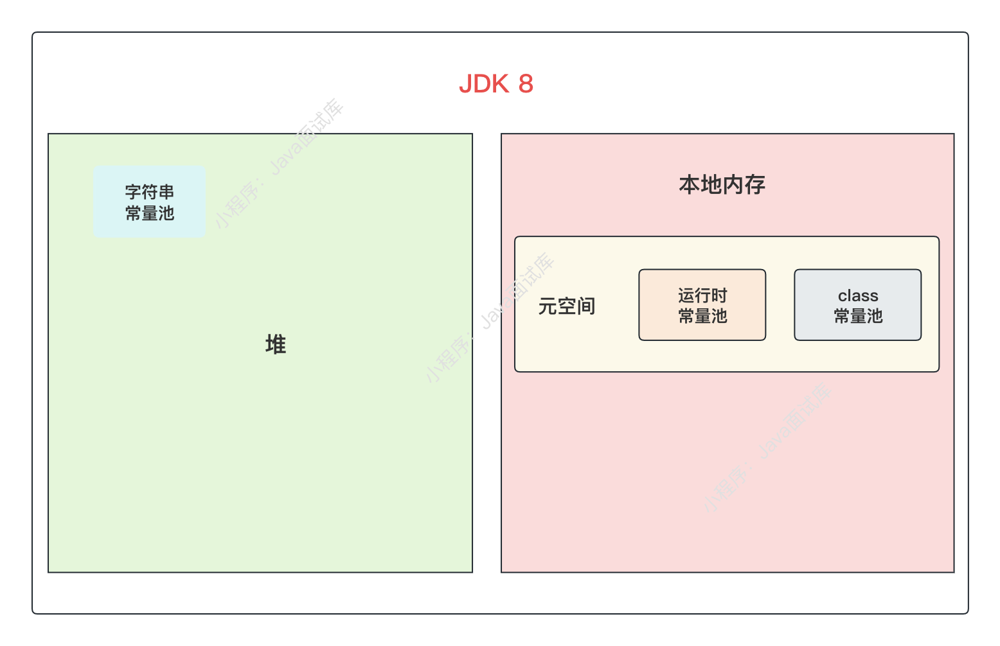

### 14、运行时常量池和字符串常量池的区别？

##### 运行时常量池和字符串常量池的区别：

1、运行时常量池只是一个统称，字符串常量池也是一种特殊的运行时常量池，VM 运行时，基础类型的常量（除了字符串常量)会加载到运行时常量池中，字符串常量会单独加载到字符串常量池中。

2、在Java7之前，字符串常量池属于运行时常量池的一部分，Java 7开始，字符串常量池划到了堆中。

3、运行时常量池存储的信息更多，包括类信息、属性信息、方法信息、基础类型常量池（如：int、long）等，而字符串常量池只保存字符串常量,

4、运行时常量池每个 class 都会对应一份，而字符串常量池是全局唯一的，每个JVM 只有一份。

### 15、JVM哪块内存区域不会发生内存溢出？

##### 程序计数器（ProgramCounterRerister）不会内存溢出。

程序计数器区域一块内存较小的区域，它用于存储线程的每个执行指令，每个线程都有自己的程序计数器，此区域不会有内存溢出的情况。

### 16、JVM从GC角度看，堆的分区情况？

##### JVM从GC角度看，堆可分为：

- 新生代：Eden 区和 Survivor 区(from 区和 to 区，或者 S0, S1)
- 老年代 (Old)
- 永久代 (Java 8+为元空间，并且和堆不连续)


### 17、为什么堆要分新生代和老年代？而不是一个老年代就行？

因为堆中的大部分对象都是朝生夕死的，GC的成本很高，分为多个区以存储不同生命周期的对象，这样就可以使用针对性的GC算法和收集器，以提高 GC 性能。

### 18、为什么新生代要分成Eden和Survivor两个区？

因为新生代 Eden 区的绝大部分对象的生命周期都很短，为了避免对象过早的进入老年代，以引发老年代频繁 FullGC，所以分成Eden 区和 Survivor 区，Survivor 区则作为 Eden 区和老年代之间的一个缓冲区。

### 19、为什么新生代Survivor区又分为两个区？一个不行吗？

新生代Survivor区又分为两个区，这样是为了解决内存碎片问题。

假如只有一个 Survivor 区的流程如下:

1）新对象创建在 Eden 区中；

2）Eden 区满了就会触发一次 Minor GC，Eden 区中的存活对象就会被移动到 Survivor 区，此时 Eden 区和 Survivor 区各有一些存活对象；

3）Eden 再次满了触发 Minor GC，Survivor 区在经过垃圾回收后，Eden 区中的存活对象如果再次移动到 Survivor 区，它们所占有的内存就是不连续的，就会导致内存碎片化。

因为有了 S1区，复制算法可以保证 Eden 和 S0 两区中的存活对象一起复制到 S1区中是连续的内存空间，然后清空Eden 和 S0区，直到 S1被移动老年代，这样始终就会有一块 Survivor 是空置的，保证整个复制过程不会产生碎片。

### 20、新生代各分区的默认比例是怎样的？

新生代Eden区和 Survivor区（S0,S1）的默认比例是：8:1:1

- Eden 区占用 80%
- S0区占用10%
- S1区占用10%

### 21、哪些情况下存活对象会进入老年代？

##### 存活对象进入老年代的情况：

- nor GC 之后，如果另外一块 Survivor 区不够空间存放存活对象，则把这些对象直接移入老年代；
- 每触发一个 Minor GC，对象的年龄+1，当到达 16 次 Minor GC 的时候就会被移到老年代，也就是成功躲过了默认的 15 次Minor GC，可以通过-XX:MaxTenuringThreshold 参数设置；
- urvivor区中的一批对象如果超过了当前区域空间的50%，大于等于这批对象年龄的对象就直接进入老年代；
- 超过指定字节的大对象直接进入老年代，可以通过-XX:PretenureSizeThreshold 参数设置；

### 22、什么情况下会发生栈内存溢出？

因为栈是线程私有的，它的生命周期与线程相同，每个方法在执行的时候都会创建一个栈帧，用来存储局部变量表，操作数栈，动态链接，方法出口等信息，如果线程请求的栈深度大于虚拟机所允许的最大深度，将抛出**StackOverflowError**栈内存溢出异常，一般在方法递归调用时会造成栈内存溢出。

可以通过 JVM 参数**-Xss** 来调整栈内存的大小。

### 23、对象都是在堆上分配的吗？

不一定，满足特定条件时，它们可以在 **虚拟机栈**上分配内存。

JVM通过逃逸分析，分析出新对象的使用范围，就可能将对象在栈上进行分配。栈分配可以快速地在栈帧上创建和销毁对象，不用再将对象分配到堆空间，可以有效地减少JVM 垃圾回收的压力。

### 24、什么是直接内存？

直接内存（**Direct Memory**）就是指：**Java 堆外内存**，直接内存并不是虚拟机运行时数据区的一部分，也不是Java 虚拟机规范中定义的内存区域，与Java 堆内存不同的是，直接内存不受Java 堆大小的限制，因此在需要处理大量数据时，使用直接内存可以提高性能。

### 25、直接内存有什么用？

直接内存的好处就是为了能直接分配和释放内存，避免了在Java 堆和 native 堆中来回复制数据，通常用于处理IO 操作、网络传输和高性能计算等场景，可显著提高性能。

但需要注意的是，直接内存的分配和释放比较耗费资源，因此需要谨慎使用，如果使用不当，直接内存也会出现OutOfMemoryError 异常。

### 26、怎样访问直接内存？

在JDK 1.4 中新加入了 NIO（New Input/Output）类，引I入了一种基于通道（Channel）与缓冲区（Buffer）的I/O方式，它可以使用 native 函数库直接分配堆外内存。

直接内存的访问具体可以通过 Java NIO 库中的 **ByteBuffer** 对象来访问，先使用 **ByteBuffer.allocateDirect** 方法可以分配直接内存，然后使用**ByteBuffer.put和ByteBuffer.get** 等方法来读取和写入直接内存中的数据。

示例代码：

```java
public static void main(string[] args) {
    //分配直接缓冲区，大小为1024字节
    ByteBuffer directBuffer = ByteBuffer.allocateDirect(1024);
    //写入数据到直接缓冲区
    directBuffer.put((byte) 123);
    //切换为读模式
    directBuffer.flip();
    //从直接缓冲区读取数据
    byte value = directBuffer.get();
    //读取的值：123
    System.out.println（"读取的值："+value);
}
```

### 27、程实现一个读写直接内存的示例

如下面的示例，从直接内存读写一个字符串：

```java
public class Test {
    public static void main(string[] args) throws Exception {
        // 分配直接内存
        ByteBuffer buffer = ByteBuffer.allocateDirect(1024);
        
        // 获取直接内存的地址
        long address = ((DirectBuffer) buffer).address();
        
        // 写入数据
        buffer.put("小程序：Java面试题".getBytes(Standardcharsets.UTF_8));
        
        //从直接内存中读取数据
        buffer.flip();
        byte[] bytes = new byte[buffer.remaining()];
        buffer.get(bytes);
        System.out.println(new String(bytes));
        
        //释放直接内存
        Cleaner cleaner = ((DirectBuffer) buffer).cleaner();
        if (cleaner |= null){
            cleaner.clean();
        }
    }
}
```

输出结果：


### 28、JVM是怎么加载字节码文件的？

.class 字节码加载流程如下:


##### 1、加载：

JVM 读取指定的.class 文件，并将其转换为JVM内部格式的字节码。

##### 2、链接：

- 2.1验证：JVM 检查字节码是否符合规范及安全要求，以确保它不会危害JVM的健康运行。

- 2.2准备：JVM为静态变量分配内存，并将其初始化为默认值，以准备类的静态变量使用。

- 2.3 解析：JVM 将符号引用转换为直接引用，即将类、接口、字段和方法的名称解析为 JVM 内部的引I用地址。

##### 3、初始化：

JVM将执行类构造函数，初始化静态变量并执行静态代码块。

### 29、什么是类加载器？

类加载器（ClassLoader） 用来加载 .class 类到 Java 虚拟机中，Java 所有的类加载器都是 java.lang.ClassLoader 类的一个实例，类加载器可以从本地文件系统、网络或其他来源加载类，并且可以根据需要创建类的多个实例。

Java中的每个类都由类加载器加载，并且在Java应用程序运行时，类加载器会动态加载和卸载类。

##### 一般来说，Java虚拟机使用Java类的方式如下：

（1）Java 源程序（java 文件）在经过Java 编译器编译之后，被转换成Java 字节代码（.class 文件）。

（2）类加载器负责读取.class 类字节代码，并转换成java.lang.Class 类的一个实例。

### 30、类加载器（ClassLoader）有哪些方法？

下面是Java 类加载器（ClassLoader）的常用方法：

| 方法名称                                            | v                               |
| --------------------------------------------------- | ------------------------------- |
| loadClass(String name)                              | 通过指定的类名加载类。          |
| findClass(String name)                              | 查找并加载指定名称的类。        |
| defineClass(String name, byte[] b, int off int len) | 将类的字节码转换为 Class 对象。 |
| resolveClass(Class<?> c)                            | 链接指定的 Class 对象。         |
| getParent()                                         | 返回该类加载器的父加载器。      |
| getResource(String name)                            | 获取指定名称的资源。            |
| getResources(String name)                           | 获取指定名称的所有资源。        |
| getSystemClassLoader()返回系统类加载器。            | 返回系统类加载器。              |

### 31、类加载器的分类及作用？

##### 从虚拟机层面讲分为两大类型的类加载器：

- ootstrapClassloader，即启动类加载器（C++实现），它是虚拟机的一部分；
- 其他类型类加载器（Java 实现）在虚拟机外部，并全部继承 ClassLoader 类。

-----

##### 从细分的角度讲会分为以下三大类加载器：


##### 1、 Bootstrap ClassLoader

启动类加载器，完全由JVM 控制加载，外面访问不到这个类加载器，即不能被Java 程序引用。它主要负责加载JVM 自身的工作类，即java/lib目录和-X:bootclasspath参数指定的目录的类库。从上图看虽然 Bootstrap ClassLoader 是最顶层的类加载器，也是ExtClassLoader 的父类加载器，但是不能被程序引用。

##### 2、Extension ClassLoader

扩展类加载器，由 Java 实现，即 ExtClassLoader 实现类，它主要负责加载java/lib/ext 目录和系统环境变量java.ext.dirs指定目录所有类库。

##### 3、 Application ClassLoader

应用程序类加载器，由 Java 实现，即 AppClassLoader 实现类，它的父类是 ExtClassLoader，它主要负责加载classpath 目录上的类库。

如果没有自定义 ClassLoader，它就是程序中默认的 ClassLoader，即可以通过ClassLoader.getSystemClassLoader()获取当前系统的类加载器。

### 32、什么时候会用到自定义类加载器？

标准Java 类加载器只能加载本地正常的.class 类，如果有特殊需求，就需要自定义类加载器，比如以下几种情况：

- 载网络上的类；
- 载加密的类；
- 加载动态生成的类；
- 隔离多个应用程序的类；

### 33、编程输出当前类加载器及所有父类加载器

来看下面的例子：

```java
public static void main(string[] args) throws Exception {
    ClassLoader C = ClassLoader.getSystemclassLoader();
    System.out.println(c);
    while ((c = c.getparent()) != null) {
        System.out.println(c);
    }
}
```

输出结果：


程序首先输出了程序默认的类加载器AppClassLoader，然后再输出了其父类加载器ExtClassLoader。

### 34、编程实现一个自定义的类加载器

> 编程实现一个自定义的类加载器，加载自定义目录下 c:/test/com/testjdk/Key.class 这个类。

读取自定义目录的类：

```java
@Tostring
public class Key {
    private String key = "111111";
}
```

自定义ClassLoader：

```java
public class CustomclassLoader extends ClassLoader {
    private String classPath;
    public CustomclassLoader(string classPath) {
        this.classPath = classPath;
    }
    
    @override
    protected class<?> findclass(string name) throws ClassNotFoundException {
        try {
            String fileName = name.replaceAll("\\.", "/");
            File file = new File(classPath + fileName + ".class");
            if (lfile.exists()) {
                return super.findclass(name);
            }
            byte[] bytes = Files.readAllBytes(file.toPath());
            return defineclass(name, bytes, 0, bytes.length);
        }catch (IoException e){
            throw new ClassNotFoundException(name, e);
        }
    }
        
    public static void main(string[] args) throws Exception {
        String classpath = "c:/test/";
        CustomclassLoader loader = new CustomclassLoader(classPath);
        Class<?> clazz = loader.loadclass("cn.javastack.test.Key");
        Key key = (Key) clazz.newInstance();
        System.out.println(key);
    }
}
```

自定义类加载器正常加载到类，程序最后输出：111111

### 35、什么是双亲委派模型？

双亲委派模型是Java 中的一种类加载机制，保证Java 类的安全性和稳定性。

##### 双亲委派模型的主要思想：

双亲委派模式要求所有类加载器，除了顶层的Bootstrap类加载器之外都要有自己的父类加载器。


当一个类加载器收到类加载请求时，它首先会将该请求委派给父类加载器进行处理，如果父类加载器无法找到相应的类，才会由子类加载器来尝试加载。这种层层向上委派的机制能够确保Java 类不会被重复加载，也能够防止恶意类的加载，提高了Java应用的安全性和稳定性。

### 36、Class.forName和ClassLoader的区别？

Class.forName() 和 ClassLoader 都可以用于动态加载类。

Class.forName(是一个静态方法，用于加载并返回指定名称的类，它在加载类的同时执行类的静态代码块，默认情况下，Class.forName(使用调用者的类加载器加载类。

ClassLoader是一个抽象类，它是用于加载类的基类，可以通过继承ClassLoader类并实现其中的方法来创建自定义类加载器。

> ##### 最重要的一个区别是：
>
> Class.forName除了将类的.class 文件加载到JVM 中之外，还可以对类进行初始化。ClassLoader只是将.class文件加载到JVM中，不会进行初始化。

 ### 37、ClassLoader中的defineClass,findClass,loadClass的区别？

defineClass 和findClass 通常是由自定义类加载器实现，而loadClass 则是由Java的默认类加载器实现的。

- defineClass 方法负责将字节码转换为一个Class对象。

- findClass 方法用于根据名称或位置加载.class 文件字节码。

- loadClass 方法是Java 类加载的主要方法，默认的双亲委派机制就实现在这个方法中。

> ##### ClassLoader这几个方法的执行顺序是：
>
> loadClass → findClass → defineClass
>
> 自定义类加载器时，除非需要打破双亲委派机制，否则不建议重写loadClass 方法，因为如果类加载失败loadClass 方法会调用 findClass 方法继续加载。

### 38、什么是类卸载？什么情况下会卸载？

类卸载**（Class Unloading）**是指在 Java 虚拟机中卸载不再需要的类，可以有效释放类占用的内存空间。类的卸载过程通常发生在垃圾回收过程中，Java 虚拟机会自动监测并卸载一些不再需要的类，当一个类不再被任何对象引用时，该类就会被卸载。

因为，当一个Java 应用程序长时间运行时，可能会加载大量的类，如果不及时卸载不再需要的类，就会占用大量的内存空间，导致应用程序运行缓慢或崩溃。

> 类卸载是自动执行的，如果需要手动触发类卸载，可以通过Java 虚拟机的诊断和调试接口（JVMTI）来实现。但要特别小心，如果误操作可能会导致应用程序崩溃。

### 39、解释执行和编译执行的区别？

解释执行和编译执行是两种不同的程序执行方式：

**解释执行**：即每次逐行解释字节码为本地机器码并执行。

**编译执行**：即IT即时编译，将热点代码动态编译成本地机器码并缓存起来，从而提高程序的执行效率。

### 40、解释执行和编译执行哪个更快？

通常情况下，**编译执行要比解释执行更快**，因为以下几点：

（1）编译执行后的程序不需要再次解释，可以直接就可以被计算机执行，而解释执行需要在每次执行之前解释代码。

（2）编译执行可以在编译时进行优化和调整，使编译后的程序能够更好地利用计算机硬件的性能，从而提高程序的执行效率。

### 41、Java是解释执行还是编译执行？

##### Java既可以解释执行，也可以编译执行，具体取决于程序的执行环境和编译器。

（1）当 Java 程序运行在 JVM 中时，程序会被先编译成字节码，然后由JVM 在运行时解释执行字节码。这种方式被称为解释执行。

（2）VM 也可以使用 JIT(Just-In-Time)技术将字节码动态编译成本地机器码，从而提高程序的执行效率，这种方式被称为 JIT 编译执行。

此外，对于需要更高执行效率的应用场景，也可以使用 AOT(Ahead-Of-Time)技术将Java 程序编译成本地机器码，从而避免了解释执行和JIT编译执行过程中的性能损耗。

### 42、什么是热点探测技术？

热点探测技术是一种用于检测应用程序中热点代码的技术，热点代码是指应用程序中被频繁执行的代码块，优化热点代码可以提高程序的性能。

### 43、热点探测技术都有哪些？HotSpot用的是哪种？

热点探测技术主要包括以下几种：

- **基于采样的热点探测技术**：通过周期性地采样应用程序的执行堆栈，统计每个函数被调用的次数和执行时间，并识别出热点代码。

- **基于计数器的热点探测技术**：通过对代码块执行的次数和执行时间进行计数，并将其与预定义的阈值进行比较，从而判断哪些代码块是热点代码。

- **基于静态分析的热点探测技术**：在编译阶段对源代码进行分析，找出热点代码，并将其标记为即时编译的优化目标。

Hotspot JVM 使用的是信"**基于计数器**”的热点探测技术，Hotspot 使用了**方法调用计数器**（Method InvocationCounter）和**回边计数器**（Back EdgeCounter）来统计方法调用和循环执行的次数，以判断哪些代码块是热点代码，并将其进行即时编译和优化。

### 44、什么是JIT？

JIT 全称为 **Just-In-Time**，即：**即时编译**。

JIT是一种在运行时将代码编译成机器码的技术，与传统的预先编译器（AOT）不同，即时编译（JIT）代码是在程序运行时编译成机器码的，而不是预先编译为机器码。

### 45、JIT为什么能够提升程序性能？

Java 程序编译执行过程 :

> Java 源代码（java）->编译成字节码（.class）->逐条编译为机器码->执行

Java 虚拟机最开始是通过解释器进行解释执行的，JVM 需要逐条将字节码编译成机器码，当虚拟机发现某个方法或者代码块的运行特别频繁时，反复多次编译就会影响性能。

所以，JVM引I入了JIT即时编译技术，JIT会把频繁执行的代码认定为“**热点代码**”，然后对热点代码进行优化，即将这些代码编译成与本地平台相关的机器码并保存起来，避免重复编译。所以，川T即时编译可以用来提高程序的执行速度，以实现程序更高效的执行。

### 46、为什么JIT只对热点代码进行即时编译？

主要有以下两个原因：

##### (1）热点代码占用了程序的大部分运行时间

在大多数情况下，一个程序的大部分运行时间可能都花费在热点代码上，而其他代码往往只会被执行一次或几次。所以，优化热点代码的执行效率可以极大地提高整个程序的性能。

##### (2）消耗大量的CPU和内存资源

即时编译需要在运行时对代码进行分析、优化和编译，这需要消耗大量的CPU 和内存资源。所以，如果对所有代码进行即时编译，必然会导致程序运行性能下降。

所以，JIT编译器只对热点代码进行即时编译，以在保证性能的同时，尽量减少对其他代码的影响。

### 47、HotSpot都支持哪些JIT编译器？

HotSpot JVM 支持以下两种 JIT 编译器:

##### 1、C1编译器

它是一种基于方法的编译器，使用轻量级的编译策略来快速编译和优化字节码，以加速程序的启动时间。该编译器通常用于客户端应用程序，因为客户端应用程序需要快速启动和响应。

##### 2、C2编译器

它是一种基于模块的编译器，使用全面的编译策略来对热点代码进行优化，以提高程序的运行速度。该编译器通常用于服务器应用程序，因为服务器应用程序需要高性能和可伸缩性。

> HotSpotVM中的JIT编译器可以根据应用程序的实际运行情况进行动态切换，以达到最佳的性能优化效果。默认情况下，HotSpotJVM 会使用 C2 编译器来编译热点代码，但是可以通过启动参数来指定使用不同的编译器。

### 48、什么是AOT？

AOT 全称为**Ahead-Of-Time**，即：**预先编译**。

AOT将源代码的编译过程提前到程序运行之前，在程序运行之前，将源代码编译为机器码，从而减少了程序启动时间，并且能够生成更快、更节省资源的可执行文件。

### 49、AIT和AOT的区别？

JIT 和 AOT 是两种不同的代码编译技术:

- JIT全称为：Just-in-time，即时编译（动态编译），即边运行边编译。
- AOT全称为：Ahead OfTime，预先编译，即运行前编译。

##### 主要区别在于编译发生的时间和优化方式：

JIT是在程序运行时将代码编译成机器码的技术。当程序被执行时，IT编译器会将程序的字节码编译成本地机器码，从而提高程序的执行速度。川T编译器通常只编译程序中的热点代码，这样可以提高程序的性能，同时减少编译时间和内存占用。

AOT是在程序部署时将代码编译成机器码的技术。在 AOT中，程序的源代码会被编译成本地机器码，然后打包成可执行文件，部署到目标计算机上。与IT不同，AOT编译器可以对整个程序进行编译，因此程序启动时不需要进行额外的编译步骤，从而提高了程序的启动速度。

### 50、JIT和AOT怎么选择？

选择 JIT (Just-In-Time) 还是 AOT (Ahead-Of-Time) 取决于具体的应用场景和需求:

##### 1）执行时间vs 启动时间

JIT 技术适合长时间运行的应用程序，因为 JIT 编译器可以根据程序的实际运行情况进行动态优化，从而提高程序的执行效率。

而AOT技术适合需要快速启动并运行的应用程序，因为AOT编译器可以将程序的源代码编译成本地机器码，从而减少启动时间。

##### 2）程序的大小

AOT编译的程序通常比川IT编译的程序更大，因为它们包含了编译后的本地机器码和其他必要的信息。如果程序的大小对应用的性能有影响，可以考虑使用川IT 编译技术。

##### 3）程序的复杂度

如果程序非常复杂，其中包含大量的代码和依赖关系，使用AOT 技术可能会更容易，因为 AOT 编译器可以在编译时进行全局优化，从而避免了川IT编译器在运行时进行的多次优化。

##### 4）开发效率&运行效率

AOT技术可以提高程序的运行效率，但在编译时需要较长的时间。如果开发者更注重开发效率，可以使用JIT技术，因为它可以快速编译并运行代码。

-------

总之，川IT编译技术适用于需要动态加载代码的情况，而AOT 编译技术适用于需要快速启动并运行的情况。

在实际应用中，选择使用JIT 还是 AOT 取决于具体的应用场景和需求，比如要考虑到程序的性能、大小、复杂度以及开发效率等方面，从而选择适合自己应用的编译技术。

### 51、Java内存模型定义了哪几种原子操作？

Java 内存模型中定义了 8 种原子操作。

| 原子操作 | 描述                                                         |
| -------- | ------------------------------------------------------------ |
| lock     | 作用于主内存，把一个变量标记为一条线程独占状态。             |
| unlock   | 作用于主内存，解除对某个主内存地址的锁定。                   |
| read     | 作用于主内存，从主内存中读取一个变量的值到线程的工作内存中，以便随后的load 操作使用。 |
| load     | 作用于工作内存，它把 read 操作从主内存中得到的变量值放入工作内存的变量副本中。 |
| use      | 作用于工作内存，它把工作内存中的一个变量值传递给执行引擎。   |
| assign   | 作用于工作内存，它把一个从执行引擎接收到的值赋给工作内存的变量。 |
| store    | 作用于工作内存，它把工作内存中的一个变量的值传送到主内存中，以便随后的 write 的操作。 |
| write    | 作用于主内存，它把 store 操作从工作内存中的一个变量的值传送到主内存的变量中。 |

Java内存模型中的原子操作是建立在底层硬件支持的基础上，可以确保在多线程环境下，对于被多个线程访问的共享变量的操作具有原子性和可见性，从而保证了多线程程序的正确性和可靠性。

### 52、什么是指令重排序？

Java为了优化程序性能，代码在实际运行时，代码指令可能并不是严格按照代码语句的顺序执行的，即只要程序的最终结果与它顺序化情况的结果相等，那么指令的执行顺序可以与代码逻辑顺序不一致，这个过程就叫做**指令重排序**。

大多数现代处理器都会采用将指令乱序执行的方法，在条件允许的情况下，直接执行后面的指令，通过乱序执行的技术处理器可以大大优化程序性能，提高执行效率。

### 53、指令重排序分为哪几种？过程是怎样的？

##### 指令重排序主要分为以下三种：

1）编译器重排序：JVM 中进行完成的。

2）指令级并行重排序。

3）处理器重排序：CPU 中进行完成的。

##### 源代码到最终执行的指令序列过程图：


> 重排序需要遵守happens-before规则。

### 54、怎么避免指令重排序？

##### 避免指令重排序常用方法：

（1）可以使用volatile 关键字来保证指令执行的有序性，使用volatile关键字可以将变量的写入操作和读取操作插入内存屏障，这样可以防止指令重排序。

（2）Java 中还有一些并发工具，比如 Atomic 原子类、ConcurrentHashMap 并发类等，它们也可以确保关键指令不被重排序，以保证多线程并发执行的正确性。

### 55、synchronized可以防止指令重排序吗？怎么实现的？

synchronized 可以保证一定程度上的有序性，也可以防止一定程度上的指令重排序，**但并不能完全阻止所有的指令重排序**。比如，同步块内/外的代码肯定是不会相互乱排的，但同步块里面的代码是避免不了指令重排序的。

虽然`synchronized`不能完全阻止指令重排序，但它不会影响线程执行的结果（根据 **as-if-serial** 语义），也不会影响锁的获取与释放，在获取锁之前和释放锁之后会进行内存屏障操作，从而保证了多线程执行的有序性。

### 56、volatile可以防止指令重排序吗？怎么实现的？

volatile 可以保证有序性，这里指的是**禁止指令重排序**，其原理主要是通过编译器在生成字节码时，在指令序列中添加“**内存屏障**”来禁止指令重排序的。

内存屏障类型说明:

| 内存屏障   | 作用位置            | 描述                                                         |
| ---------- | ------------------- | ------------------------------------------------------------ |
| StoreStore | volatile写操作之前  | 禁止写和写的重排序，确保之前的写入操作对这次 volatile 写操作可见 |
| StoreLoad  | volatile 写操作之后 | 禁止写和读的重排序，确保这次 volatile 写操作对后续的读操作可见 |
| LoadLoad   | volatile 读操作之后 | 禁止读和读的重排序，确保不会把后续的读操作重新排序到这次volatile 读之前 |
| LoadStore  | volatile读操作之后  | 禁止读和写的重排序，确保不会把后续的写操作重新排序到这次 volatile 读之前 |

如下图示例所示：


volatile重排序规则如下表所示：

| 是否能重排序 | 第二个操作 | 第二个操作 | 第二个操作 |
| ------------ | ---------- | ---------- | ---------- |
| 第一个操作   | 普通读和写 | volatile读 | volatile写 |
| 普通读/写    | YES        | YES        | NO         |
| volatile读   | NO         | NO         | NO         |
| volatile写   | YES        | NO         | NO         |

### 57、什么是as-if-serial语义？

**as-if-serial** 语义是Java 内存模型（Java Memory Model，JMM）中的一个重要原则，它规定了在多线程环境下，虚拟机如何处理指令重排序和优化，以保证程序的执行结果与串行执行的结果一致。

换句话说，**as-if-serial** 语义是指，不管编译器和处理器等如何优化指令重排序，但必须确保程序的执行结果和单线程程序的执行结果一致，避免了多线程环境中的不确定性。

所以，编译器和处理器等都必须遵守`as-if-serial`语义，不能对存在数据依赖关系的操作做重排序。

### 58、内存屏障是什么？有哪些类型？

**内存屏障** 也叫内存栅栏，是一种CPU指令，它的作用是确保多线程程序中的数据一致性和可见性，避免了多线程访问共享变量时可能发生的数据竞争和死锁等问题，是实现多线程程序中同步和协作的重要手段。内存屏障可以分为以下两种类型：

- **读屏障（Load Barrier）**：用于确保一个线程读取的变量值是最新的，即在该屏障之前发生的所有写操作已经对其他线程可见。
- **屏障（Store Barrier）**：用于确保一个线程对共享变量的修改对其他线程可见，即在该屏障之后的所有读操作都可以看到最新的变量值。

### 59、GC是什么？为什么需要GC？

GC 是垃圾回收（**Garbage Collection**）的缩写，它是一种内存自动管理技术，用于在程序运行时自动识别和回收不再使用的内存资源，防止内存泄漏和程序崩溃等问题。

**为什么需要GC？**

传统的手动内存管理方式，程序员需要显式地分配和释放内存资源，容易出现内存泄漏、越界访问等问题，同时也增加了程序员的负担和出错概率。

而使用 GC 技术，可以使内存管理自动化，减轻程序员的负担，提高程序的稳定性和安全性。

### 60、什么是Young GC?

##### Young GC，即年轻代的GC，等同于 Minor GC。

### 61、什么是MinorGC?

**Minor GC**（也称为 **Young GC**）是指对新生代（包括 Eden 和 Survivor 区）进行垃圾回收的过程。在Minor GC 过程中，垃圾回收器会清除不再使用的对象，将存活的对象移动到 Survivor 区或者年老代中。

在这个区的对象生存期短，往往发生 GC 的频率较高，回收速度比较快，一般采用复制回收算法。

### 62、什么是FullGC?

Full GC（**Full Garbage Collection**）指的是对整个Java 堆（包括新生代和年老代）、方法区（永久代、元空间）进行垃圾回收的过程。在Full GC 过程中，垃圾回收器会清除不再使用的对象，并将堆中的内存空间进行整理和压缩，以便更好地利用内存空间。

相比 Minor GC 和 Major GC，Full GC 的代价通常更高，因为它需要对整个 Java 堆进行垃圾回收，可能需要暂停应用程序的运行，导致较长的停顿时间。因此，在实际应用中，我们应该尽量避免 Full GC 的触发，并通过合理的内存管理和优化来减少 Full GC 的频率和代价。

### 63、什么时候会触发MinorGC？

新创建的对象在新生代 Eden 区中进行分配，如果 Eden 区内存空间满了，就会触发一次 Minor GC/ Young GC：

- **如果 Survivor 区充足**：将 Eden 区中不再使用的对象会被清除掉，而存活的对象会被复制到 Survivor区中；
- **如果 Survivor 区不足**：将 Survivor 区中不再使用的对象会被清除掉，而存活的对象会被复制到另一个Survivor 区或者老年代中。

因为新生代中的对象生命周期较短，因此会更频繁地进行回收。在实际应用中，可以通过调整新生代的大小和 Survivor 区的比例，以及合理分配内存空间等方式来优化 Minor GC 的性能和效率。

### 64、什么时候会触发FullGC？

##### 触发FullGC的几种情形：

- 手动调用了 System.gc( 方法时（慎用)
- inor GC 之后，如果大量对象仍然存活而导致两块 Survivor 空间不够用了，就会转移到老年代，此时如果老年代也不够用了就会触发FullGC；
- 老年代最大可用连续空间〈历代老年代对象的平均大小时，会触发Full GC；
- 达到了收集器设置的阈值，比如 CMS 老年代触发FuIIGC的使用比例默认是 92（%)
- 当元空间不足时 (JDK 1.7-为永久代不足)

### 65、一次完整的GC流程是怎样的？

内存区域不够用了，就会引发 GC。

对象的正常GC流程：

1. 新对象 -> Eden 区;
2. Eden 区满了之后，触发 Minor GC，Eden, SO 中的存活对象-> Survivor S1区;
3. 清空 Eden 区和 S0 区;
4. 4.Eden 区再次满了之后，触发 Minor GC，Eden, S1存活对象->S0 区，SO 和 S1 区这样角色反复互换;
5. Minor GC 之后，如果 Survivor 区不够空间存放存活对象，则把这些对象直接移入老年代；

### 66、什么是GC停顿？为什么要停顿？

GC 停顿，全称：**Stop The World**，是由于需要暂停应用程序线程来进行垃圾回收操作，导致应用程序线程无法继续运行，从而出现一段时间的停顿现象。

##### GC停顿通常分为以下两种：

- Minor GC停顿：发生在新生代垃圾回收时，此时VM 会暂停应用程序的执行，对新生代进行垃圾回收；
- ull GC 停顿：发生在老年代垃圾回收时，此时JVM 会暂停应用程序的执行，对整个堆进行垃圾回收；

停顿是必须的，因为只有暂停所有用户线程，这样才能保证系统不会产生新的垃圾，在 GC 标记回收对象时，可以保证对象的的有效性，否则会产生错标和漏洞问题。

###  67、如何减少长时间的GC停顿？

长时间的GC停顿可能会对应用程序的性能和用户体验造成很大的影响，因此需要通过以下几种方式来尽量减少长时间的GC停顿。

##### 1）选择合适的垃圾收集器

针对不同的应用场景，选择合适的垃圾收集器可以提高垃圾回收的效率，减少长时间的GC停顿。

> 例如，G1垃圾收集器适用于大内存、高并发的应用场景，可以在多个小区域上分步执行 GC 过程，减少了垃圾回收暂停时间，从而避免了应用线程等待垃圾回收的时间。

##### 2）增加内存

当堆内存过小时，垃圾回收的频率会增加，导致长时间的 GC 停顿。因此，适当地增加堆内存大小可以有效减少 GC 的频率，降低长时间的 GC 停顿。

##### 3）避免过多的对象创建

避免过多的对象创建，可以减少 GC 的频率，从而降低长时间的 GC 停顿。

> 例如，可以通过对象池、字符串缓存等技术来复用对象，减少对象的创建。

##### 4）分批处理

将任务拆分成多个小任务进行处理，每个小任务的处理时间尽量不要超过一个 Minor GC 的时间。这样可以将 GC停顿的时间分散到多个小任务中，从而降低长时间的 GC 停顿。

##### 5）使用并发GC

如CMS 和G1，可以在垃圾回收过程中和应用程序同时运行，减少了垃圾回收对应用程序的影响，从而可以减少长时间的 GC 停顿。

### 68、JVM如何判断一个对象可被回收?

##### 判断对象是否存活一般有两种方式：

##### 1）引用计数

参考面试题：《你怎么理解 GC 引用计数算法？》

##### 2）可达性分析算法

参考面试题:《你怎么理解GC可达性分析算法？》

但引用计数方法无法解决对象之间相互循环引用的问题，所以Java 中使用了“可达性分析”的方式。

### 69、什么是GCRoots？

GC Roots 是垃圾回收的根节点，是进行垃圾回收时，被视为存活对象的特殊对象。当一个对象不再被引用时，垃圾回收器可以将其回收，但是为了确定哪些对象可以被回收，垃圾回收器必须确定哪些对象是存活的，而 GC Roots 对象就是起始点，从这些根对象开始遍历可以到达的所有存活对象。


在上面的示例中，有一个 Thread 1的线程和三个对象（A、B、C），线程1和对象A都是 GC Roots，都是垃圾回收算法的起点。对象 B和 对象C 都可以通过对象 A 访问，因此它们可以被视为存活对象。

### 70、GC Roots包括哪些类型的对象？

GC Roots 包括以下几种类型的对象：

- 前正在执行的线程；
- 态对象，包括静态变量和静态代码块中的对象；
- NI（Java Native Interface）引l用，即在本地代码中创建的对象；
- 当前调用方法的局部变量和输入参数；
- 被引用的对象，即垃圾回收器已知道的其他存活对象；
- 拟机内部的一些特殊对象，如基本类的类对象和一些常驻的异常对象，如 OutOfMemoryError。

确定 GC Roots 可以帮助垃圾回收器识别哪些对象可以被回收，从而释放内存并提高应用程序的性能。

### 71、Java对象头包含哪些信息？

Java 对象头是一个对象在堆内存中的元数据，它包含了一些关于对象的重要信息，包括以下内容：

| 信息      | 描述                                                         |
| --------- | ------------------------------------------------------------ |
| Mark Word | 包括对象状态、锁状态、GC状态等信息                           |
| 类型指针  | 指向对象的类元数据的指针                                     |
| 数组长度  | 如果对象是一个数组，它会包含一个数组长度，表示数组的大小     |
| 对齐填充  | JVM 要求对象在内存中的起始地址必须是8字节的整数倍，因此需要填充一些无用的字节来满足这个要求。 |

不同的 JVM 实现可能会略有不同，但是以上信息都是Java 对象头的常见组成部分。

### 72、Java设计对象头的目的是什么？

Java 对象头的设计是为了支持JVM 的高效内存管理和便于垃圾回收，它提供了重要的元数据信息，以支持 Java 程序在运行时对对象的动态分配、释放和垃圾回收等操作。

### 73、常用的垃圾收集器有哪些？

常用的垃圾收集器如下表所示：

| 收集器       | 启用                    | 分类       | 使用区域       | 算法          |
| ------------ | ----------------------- | ---------- | -------------- | ------------- |
| Serial       | -XX:+UseSerialGC        | 串行       | 新生代         | 复制算法      |
| Serial Old   | -XX:+UseSerialOldGC     | 串行       | 老年代         | 标记-整理算法 |
| ParNew       | -XX:+UseParNewGC        | 并行       | 新生代         | 复制算法      |
| Parallel     | -XX:+UseParallelGC      | 并行       | 新生代         | 复制算法      |
| Paraller Old | -XX:+UseParallelOldGC   | 并行       | 老年代         | 标记-整理算法 |
| CMS          | -XX:+UseConcMarkSweepGC | 并发       | 老年代         | 标记-清除算法 |
| G1           | -XX:+UseG1GC            | 并发、并行 | 新生代、老年代 | 标记-整理算法 |
| ZGC          | -XX:+UseZGC             | 并发、并行 | 新生代、老年代 | 标记-整理算法 |

> 需要注意的是：
>
> 1、CMS 在 JDK 11 中已经标识废弃，在 JDK 14 中正式删除了。
>
> 2、G1 在JDK 7 引进，在JDK 9 转正并设置为默认的垃圾收集器。
>
> 3、ZGC 在JDK 11 引|进，在JDK 15 中转正。

### 74、JVM中的默认垃圾收集器是？

JVM默认的垃圾收集器：

- JDK 7: Parallel Scavenge + Serial Old
- JDK 8 及 JDK 7u40 之后的版本：Parallel Scavenge + Parallel Old 
- JDK9+：G1收集器

可以使用下面命令查看：

> java -XX:+PrintCommandLineFlags -version


比如，这里可以看到 JDK 8 中的-XX:+UseParallelGC。

### 75、什么是CMS垃圾收集器？

CMS 全称：Concurrent Mark Sweep，是一款优秀的老年代“**并发**"垃圾收集器，它使用的是标记清除（Mark-Sweep）算法，并可以多线程并发标记和清除。

CMS 收集器回收时，用户线程并不会完全停止，而可以与用户线程并发执行，以减少 GC 停顿时间。所以，CMS 可有效地降低垃圾回收时的暂停时间，适用于对垃圾回收暂停时间有较高要求的应用场景。

### 76、CMS垃圾收集器的适用场景？

CMS 垃圾收集器适用于以下场景。

##### 1）应用程序需要快速响应用户请求，并且具有大量的内存

由于CMS 垃圾收集器采用并发标记和清除的方式，可以避免在垃圾回收过程中对应用程序造成较长时间的暂停，从而提高应用程序的响应速度。

##### 2）应用程序具有大量的中老年代对象

CMS 适用于大对象的回收，可以避免进行 Full GC，从而减少了对应用程序的影响。

##### 3）应用程序的垃圾产生速度较慢

CMS 垃圾收集器在垃圾产生速度较慢的情况下，可以在短时间内完成垃圾回收，从而减少了对应用程序的影响。

##### 4）应用程序的垃圾回收暂停时间要求较高

CMS 可以在垃圾回收过程中和应用程序同时运行，从而大大减少了垃圾回收对应用程序的影响，满足了对垃圾回收暂停时间要求较高的应用场景。

> 总之，CMS垃圾收集器适用于需要快速响应用户请求、具有大量的中老年代对象、垃圾产生速度较慢、对垃圾回收暂停时间要求较高的应用程序。

### 77、CMS垃圾收集器有什么优缺点？

##### CMS 优点：

1.支持并发收集，充分利用了硬件资源，提高了系统的垃圾回收效率；

2.低停顿，特别是对垃圾回收暂停时间要求较高的应用场景；

##### CMS 缺点：

1. 并发收集会抢占 CPU 资源，影响吞吐量；
2. 只能回收老年代，无法回收新生代垃圾；
3. 无法处理浮动垃圾；
4. 产生大量内存碎片；

### 78、CMS收集器触发GC的条件？

CMS 垃圾收集器有前台收集器（**foreground collector**）和后台收集器（**background collector**）两种收集器，它们分别用于处理不同类型的垃圾回收任务。

**foreground collector**

- 新生代没有足够的空间分配对象；
- 老年代没有足够的连续、剩余空间分配对象；

##### background collector

CMS后台有一个后台线程，每隔CMSWaitDuration（默认 2s）时间去判断是否应该回收，参考`-XX:UseCMSInitiatingOccupancyonly` 和`-XX:CMSInitiatingOccupancyFraction` 参数。

### 79、CMS垃圾回收的过程是怎样的？

CMS垃圾收集器主要分为以下几个阶段。

##### 1）初始标记阶

段暂停应用程序（STW），标记出所有根对象直接引用的对象。

##### 2）并发标记阶段

启动多个线程对堆内存中的对象进行标记，标记结束后会生成一个标记记录表，记录所有需要回收的对象。

##### 3）重新标记阶

段暂停应用程序（STW），重新标记所有被修改过的对象和在并发标记阶段遗漏的对象。

##### 4）并发清除阶

段启动多个线程清理垃圾，同时清理并发标记阶段产生的黑色对象中不再被引用的对象。

### 80、CMS垃圾收集器能处理浮动垃圾吗？为什么？

##### CMS垃圾收集器不能处理浮动垃圾。

1）因为CMS 垃圾收集器使用的是并发标记和清理算法，无法在并发清理阶段识别浮动垃圾，所以它无法直接处理浮动垃圾。

2）因为CMS 收集器就是为了追求低停顿时间为目标而设计的，所以不能在一次回收工作中浪费太多时间，只能在下一次的回收时处理。

### 81、CMS回收停顿了几次，为什么？

CMS 垃圾回收一共停顿了两次，分别是初始标记和重新标记阶段。

- 第一次是为了标记GC 开始时的root对象；
- 第二次是为了标记并发标记时又变更的部分；

具体参考面试题：《CMS 垃圾回收的过程是怎样的?》

### 82、CMS垃圾收集器为什么会被废弃?

因为 CMS 存在内存碎片、无法处理浮动垃圾、影响程序稳定性等问题，JDK 9 已经宣布将 CMS 垃圾收集器废弃了，JDK 11中已彻底删除，推荐使用 G1垃圾收集器。

> G1垃圾收集器采用基于 Region 的内存布局方式，具有更好的内存碎片整理能力，同时支持增量更新，可以更好地处理浮动垃圾问题，而且 G1垃圾收集器可以动态调整垃圾回收的时间，避免长时间的GC 停顿，从而提高了垃圾回收的效率和稳定性。因此，CMS 垃圾收集器已经被官方废弃，不再被推荐使用。

另外，CMS 是一种高度可配置的复杂算法，代码过于复杂，不好维护，如下表所示：


| GC 算法       | JVM参数 (约数) |
| ------------- | -------------- |
| Common to all | 50             |
| Parallel      | 6              |
| CMS           | 72             |
| G1            | 26             |
| ZGC           | 8              |

从JVM 参数就能看得出来，废弃是可能是为了加速新功能的开发。

### 83、MS垃圾收集器废弃后有什么替代方案？

有以下三种替代方案：

1）切换到G1GC算法（JDK7+）

2）切换到 Z GC 算法 (JDK 11+)

3）JDK 11 之前的版本可以继续使用 CMS GC (JDK 11+ 已经彻底彻底)

### 84、怎么启用CMS收集器？有哪些设置参数？

CMS 设置参数如下表所示。

| 参数                               | 说明                                                         |
| ---------------------------------- | ------------------------------------------------------------ |
| -XX:+UseConcMarkSweepGC            | 启用 CMS                                                     |
| -XX:ConcGCThreads                  | 设置并发的 GC 线程数                                         |
| -XX:+UseCMSCompactAtFullCollection | FulIGC 做压缩整理，以减少碎片                                |
| -XX:CMSFullGCsBeforeCompaction     | FulIGC 压缩频次，默认是O，每次 FulIGC 后都会压缩一次         |
| -XX:CMSInitiatingOccupancyFraction | 老年代触发 FulIGC的使用比例，默认是 92（%)                   |
| -XX:+UseCMSInitiatingOccupancyOnly | 仅用设定的回收阈值（-XX:CMSInitiatingOccupancyFraction 设定的值），如果不指定，则仅在第一次使用设定值，后续会自动调整 |
| -XX:+CMSScavengeBeforeRemark       | 在 GC前执行一次 Minor GC，用于减少老年代对年轻代的引用，降低标记阶段时的开销 |
| -XX:+CMSParallellnitialMarkEnabled | 初始标记时以多线程执行，缩短停顿时间                         |
| -XX:+CMSParallelRemarkEnable       | 重新标记时以多线程执行，缩短停顿时间                         |

### 85、什么是G1垃圾收集器？

G1：**Garbage-First**，即垃圾优先，它是一种高效、可预测和可扩展的垃圾收集器，既能高概率满足 GC 低停顿时间，又兼具高吞吐量。它将Java 堆划分为多个区域，根据垃圾占用情况进行优先回收，从而实现更高效的垃圾回收。

G1 收集器的历史：

- 2012-JDK 7u4 官方加入支持；
- 2019 - JDK 9 默认(宣布废弃 CMS 垃圾回收器)

### 86、有了CMS收集器，为什么又搞出了G1？

CMS 收集器是以牺牲吞吐量换低停顿时间的，虽然低停顿，但是牺牲了系统性能，还存在很多问题。

G1收集器的出现，目标就是在延迟可控的情况下，解决CMS 中的问题，再尽可能获得高吞吐量，打造成一款全功能收集器。

### 87、G1垃圾收集器的适用场景？

G1垃圾收集器的适用场景：

1）大内存（>= 6G）、多处理器（>=4核）的服务端应用；

2）应用程序对GC停顿时间比较敏感，希望更低的停顿时间；

3）可用来替换 CMS 垃圾收集器；

### 88、G1垃圾收集器有什么优缺点？

##### G1优点：

- G1在回收期间可以有多个 GC 线程同时工作，充分利用CPU多核能力缩短停顿时间。
- G1回收的部分动作可以和用户线程并发运行，不需要停顿；
- G1可预测垃圾回收的停顿时间，用户可以指定最大停顿时间；
- G1使用的是“**标记+整理+复制**”算法，空间整合，不会产生内存碎片；
- G1可以同时兼顾年轻代和老年代；

##### G1缺点：

- G1内存占用和系统执行负载较高（需要维护卡表记录新生代和老年代的引用关系）;
- G1对于小内存表现不佳；

### 89、G1收集器对于堆是怎么划分的？

Java 堆区域的传统的划分参考：《JVM 从 GC 角度看，堆的分区情况？》

G1 收集器则不按传统这样分，而是将整个堆划分成约 2048 个大小相同的独立 Region 区域：


- 每个 Region 的大小相同；
- 每个Region 大小在 1~32 MB 之间，且为 2 的次幂，即 1MB,2MB,4MB,8MB,16MB,32MB，可以通过-XX :G1HeapRegionSize 设定；
- 内存的回收是以 Region 为单位的；
- 每个Region 都可以作为一个 Eden、Survivor、老年代，虽然保留了新生代和老年代，但都是不连续的Region 的集合，新生代和老年代也不是物理隔离的了；

G1还新增了一个Humongous 内存区域（H），用来存放大对象（超过1.5个Region）。

### 90、G1收集器为什么重新划分了堆?

G1 收集器之所以重新划分了 Java 堆，是因为它要解决传统的垃圾收集器存在的一些问题。

##### 1）容易产生内存碎片

在传统的垃圾收集器中，堆中的对象分配和释放是不连续的，容易产生内存碎片，影响垃圾回收的效率。

> 重新划分堆，可以更有效的避免内存碎片。

##### 2）垃圾回收时暂停时间较长

在进行垃圾回收时，为了保证一致性，需要暂停所有的应用程序线程，这个过程需要的时间比较长，可能会导致应用程序出现停顿，影响用户体验。

> 重新划分堆，可以增加更多的垃圾收集线程，让垃圾收集彻底并行化。

### 91、G1收集器是怎么处理大对象的？

具体参考面试题:《 G1 收集器为什么新增Humongous 区域？有什么用？》

### 92、G1收集器为什么新增Humongous区域？有什么用？

我们知道，如果一个**生命周期短的大对象**进入老年代，就会导致年老代的碎片化问题，从而影响垃圾回收效率。

所以 G1特别为这种对象划分了一个 **Humongous** 区域（H），如果一个 H 区域装不下，则用连续的 H 区域存储,从而更好地控制垃圾回收的范围和粒度，避免年老代碎片化的问题。

Humongous 区域是一种特殊的区域，它可以容纳比较大的对象。在 G1垃圾收集器中，如果有一个比较大的对象需要分配内存，G1垃圾收集器会首先查找 Humongous 区域，如果能够满足，则将对象分配在 Humongous 区域中，否则再尝试在 Java 堆中的其他区域中分配内存。

### 93、G1垃圾回收的过程是怎样的？

G1 回收过程可分为 4 个步骤。

##### 1）初始标记（Initial Marking)

暂停所有的其他线程（STW），一般不会超过1秒钟，标记 GC Roots 能直接引用的对象。

##### 2）并发标记（Concurrent Marking)

并发扫描Java 堆中的存活对象，将它们进行标记。

此阶段，应用程序可以并发地执行，不会被垃圾回收过程所影响。

##### 3）最终标记（Final Marking）

暂停所有的其他线程（STW），一般不会超过1秒钟，重新修正并发标记阶段用户线程运行导致变化的对象记录，对所有的存活对象进行最终的标记。

##### 4）筛选回收(Live Data Counting and Evacuation)

找出所有的垃圾对象，并将它们从 Java 堆中删除。同时，G1垃圾收集器会将存活对象进行压缩和整理，从而使 Java堆中的碎片最小化。

因为涉及存活对象的移动，所以这里也会暂停所有的其他线程（STW）。这个过程可能会发生多次停顿，每次停顿的时间都会根据堆中的垃圾量而不同。

### 94、G1回收停顿了几次，为什么？

G1垃圾回收时至少停顿了3次，分别是以下三个阶段：

- **初始标记**：为了标记GC开始时的root对象（1次）；
- **最终标记**：为了标记并发标记时又变更的部分（1次）;
- **筛选回收**：为了在回收旧空间时移动存活的对象（多次）;

前两次一般不会超过1秒钟，最后的回收停顿的时间根据堆中的垃圾量而不同。

具体可参考面试题：《G1垃圾回收的过程是怎样的?》

### 95、怎么启用G1收集器？有哪些设置参数？

##### 使用 G1 收集器的方式：

- ava 7/8：使用-XX:+UseG1GC 参数设置；
- ava 9+：默认 G1，无需设置；

##### 设置参数：

| 参数                               | 说明                                                         |
| ---------------------------------- | ------------------------------------------------------------ |
| -XX:G1HeapRegionSize               | 设置每个Region 的大小，值为 2 的次幂，1～32M之间，根据最小的堆大小划分出约 2048 个区域，默认是堆内存的1/2000 |
| -XX:MaxGCPauseMillis               | 设置期望达到的最大 GC 停顿时间指标，默认值是 200ms           |
| -XX:ParallelGCThread               | 设置停顿时的 GC 线程数，最多可设置为 8 个                    |
| -XX:ConcGCThreads                  | 设置并发标记的线程数                                         |
| -XX:InitiatingHeapOccupancyPercent | 设置触发并发 GC 周期的堆占用比率阈值，默认值是 45（%）       |

### 96、CMS和G1收集器的区别?

##### 1）使用范围

CMS 是老年代收集器，可以配合 Serial 和 ParNew 新生代收集器一起使用。

G1是新生代和老年代收集器，不需要结合其他收集器使用。

##### 2）停顿时间

CMS 是以最小停顿时间为目标的收集器。

G1可预测垃圾回收的停顿时间，用户可以指定最大停顿时间;

##### 3）垃圾碎片

CMS 使用的是“**标记-清除**”回收算法，很容易产生内存碎片。

G1 使用的是“**标记-整理+复制**”算法，空间整合，不会产生内存碎片。

##### 4）回收过程

CMS：初始标记>并发标记>重新标记>**并发清除**

G1：初始标记>并发标记>最终标记>**筛选回收**

##### 5）浮动垃圾

CMS 会产生浮动垃圾，本轮回收无法清除。

G1不会产生浮动垃圾。

### 97、CMS和G1收集器怎么选？

##### Java 7-版本:

G1不太完善，建议使用CMS。

##### Java8、9、10版本:

内存够大（>=8G），建议优先使用 G1;

CPU 够足，内存有限，考虑使用 CMS;

##### Java11+版本:

CMS 已标识移除，不建议使用了，建议G1。

### 98、什么是ZGC垃圾收集器？

Z Garbage Collector （**ZGC**）是一款由 Oracle 开发的高性能、低停顿时间的垃圾收集器，它诞生的目的是将垃圾回收暂停时间最小化，适用于需要实时性和高响应性能的应用场景。

ZGC 垃圾收集器的历史:

- JDK 11 中首次实验性引入；
- JDK 15 中正式转正生产可用；

### 99、ZGC垃圾收集器的适用场景？

##### ZGC垃圾收集器的适用场景：

1）对延迟敏感的应用，要求极低的延迟时间，比如实时性要求高的应用，如金融交易系统、在线游戏、实时数据处理等，需要保证尽可能低的停顿时间。

2）需要支持上 100GB+以及 TB 级别的超大内存，ZGC 可以高效地管理 TB 级别的堆内存。

### 100、ZGC垃圾收集器有什么优缺点？

ZGC垃圾收集器是一种专注于实现极低停顿时间的垃圾回收器，它在一些方面具有优势，但也存在一些限制和缺点。

##### 优点：

- **低延迟**：ZGC的主要优势是其极低的停顿时间，它可以在几毫秒的时间范围内完成垃圾回收；
- **大内存堆**：ZGC 非常适用于大堆内存，它可以有效地管理多 GB 甚至 TB 级别的堆内存。

##### 缺点：

- **吞吐量**：相对于一些吞吐量优化的垃圾回收器（如G1），ZGC的吞吐量可能会稍低一些；
- **分代回收**：ZGC没有分代了，每次回收都需要全堆扫描，可能导致一些对象没有及时回收；
- **浮动垃圾**：执行时间大于停顿时间，会产生大量无法回收的浮动垃圾。

### 101、ZGC收集器对于堆是怎么划分的？

ZGC和G1一样，使用了一种分区的内存布局，它将整个堆划分为多个区域（Regions），分别是:

- **小型 Region（Small Region）**：容量固定为 2MB，用于存储小于 256KB 的小对象。
- **中型 Region（Medium Region）**：容量固定为 32MB，用于存储大于等于 256KB 且小于 4MB 的对象。
- **大型 Region （Large Region）**：容量不固定，对象大小为 2 的整数倍，可以动态创建和销毁，用于放置 4MB 及以上的大对象。

和 G1不同的是，ZGC 没有按固定的新生代和老年代划分，每个区域都可以用于存储不同代的对象，每个区域既可以存储新生代对象，也可以存储老年代对象，这样的设计使得ZGC能够更灵活地适应不同应用程序的内存需求，同时支持高效的并发垃圾回收。

所以，在 ZGC 垃圾收集器中，已经没有新生代、老年代的分代概念了。

ZGC 的堆划分图如下:


堆划分解读：

- 当对象<256KB 时，对象分配在小区域；
- 当对象>= 256KB 并且<4MB 时，对象分配在中区域；
- 当对象>= 4MB 时，对象分配在大区域；

> ZGC对于不同区域的回收策略也是不同的，小区域会优先回收，中大区域则尽量不回收。

### 102、ZGC垃圾回收的过程是怎样的？

ZGC 的垃圾回收主要分为以下五个阶段：

##### 1）初始标记

从 GC Roots 出发，找出并标记 GC Roots 直接引l用的对象存放到活跃对象集合中。

这个过程暂会停所有其他线程（STW），暂停时间和GC Roots 的数量成正比，停顿时间不会随着堆的大小或者活跃对象的大小而增加。

##### 2）并发标记

并发扫描Java 堆中的存活对象，将它们进行标记。

此阶段，应用程序可以并发地执行，不会被垃圾回收过程所影响。

##### 3）再标记

这个阶段主要是处理并发标记中漏标的对象，还会对非强引用（软引|用，弱引用、虚引用）进行并行标记。

这个阶段需要STW，但是需要标记的对象少，耗时很短。

##### 4）初始转移

初始转移阶段，先扫描 GC Roots 直接引用的活跃对象，然后再将它们复制到新的内存，之前的内存空间可以回收了。

这个过程需要 STW，暂时时间跟 GC Roots 数量成正比。

##### 5）重映射

在对象转移过程中，对象的地址就会发生变化，这个阶段就是修正旧对象的所有引用。

### 103、ZGC回收停顿了几次，为什么？

ZGC垃圾回收时停顿了3次，分别是以下三个阶段：

- 初始标记：为了标记GC开始时的Root对象（1次）；
- 再标记：为了处理并发标记中漏标的对象（1次）；
- 初始转移：为了转移存活对象到新的内存（1次）;

前两次一般耗时很短，最后的转移时间根据堆中的垃圾量而不同。

具体可参考面试题：《ZGC 垃圾回收的过程是怎样的？》

##### ### 104、怎么启用ZGC收集器？有哪些设置参数？

##### 使用 ZGC 收集器的方式：

- 需要JDK 11+；
- 使用-XX:+UseZGC 参数设置；

##### 常用的 JVM 设置参数：

| 参数                     | 说明                                                         |
| ------------------------ | ------------------------------------------------------------ |
| -XX:ZProactive           | 设置是否启用主动回收，默认开启。                             |
| -XX:ZUncommit            | 设置是否在垃圾回收过程中释放未使用的内存，默认开启。         |
| -XX:ZUncommitDelay       | 设置内存在指定的时间内未使用的时间再释放，单位秒，默认 300秒。 |
| -XX:ZCollectionlnterval  | 设置垃圾回收的的最小时间间隔，单位秒。                       |
| -XX:ZMarkStackSpaceLimit | 设置指定为标记堆栈分配的最大字节数，默认 8G。                |

### 105、ZGC和G1收集器的区别？

G1 和 ZGC 的主要区别：

| 对比项       | G1                                  | ZGC                                   |
| ------------ | ----------------------------------- | ------------------------------------- |
| 吞吐量与延迟 | 吞吐量和低延迟平衡                  | 极低的停顿时间，吞吐量有影响          |
| 内存布局     | 大小相同的 Regions 分新生代和老年代 | 大小不同的 Regions 不分新生代和老年代 |
| 垃圾收集方式 | 分代回收                            | 分区回收                              |
| 停顿时间     | 可预测的停顿时间                    | 极低的停顿时间                        |
| 内存管理     | GB 级别                             | TB 级别(16 TB)                        |
| 内存利用率   | 中                                  | 较高                                  |

### 106、ZGC和G1收集器怎么选？

1、JDK15 之前，ZGC尚未转正，所以，**JDK15之前的版本推荐使用G1**，不建议使用ZGC。

2、JDK 15+版本：

- 如果应用程序对**低延迟、超大内存** 有非常高的要求，特别是要求在**几毫秒** 甚至更短的时间内完成垃圾回收，以及上TB 的内存，**ZGC**是更好的选择，它专注于最小化停顿时间，但会牺牲一点吞吐量。
- 如果应用程序需要在**高吞吐量和较低延迟之间取得平衡**，**G1**是更好的选择，它可以在一定程度上提供低延迟的垃圾回收，同时仍具有相对较高的吞吐量。

一般推荐使用 G1，这也是 JDK 默认的，除非对低延迟特别敏感才考虑使用 ZGC。

没有最好的垃圾收集器，只有最合适的，选择用哪个垃圾收集器，应该结合自己的系统，在真实环境中进行测试和调优，以获得最佳的性能和响应性，再作出选择。

### 107、常用的垃圾回收算法有哪些？

##### 常用的垃圾回收算法有：

- 引用计数法
- 标记-清除算法
- 标记整理（压缩）算法
- 复制算法
- 分代算法

目前主流的 JVM （HotSpot）采用的是分代收集算法。

### 108、你怎么理解GC引用计数算法？

每个对象都有一个引用计数属性，每当新增一个引用时计数+1，每当释放一个引用时计数-1，当引引用计数为0时表示该对象可以回收。

最大的缺点就是无法解决循环引用的问题，另外就是浪费CPU资源，影响性能，因为每次引用都需要计算引用数，即使内存够用的情况。

### 109、你怎么理解GC可达性分析算法？

可达性分析算法通过分析对象之间的引用关系来判断对象是否可达，从GC Roots 开始向下搜索，如果在“GC Roots"和一个对象之间没有可达路径，则称该对象是不可达的。

不过要注意的是，被判定为不可达的对象不一定就会成为可回收对象。被判定为不可达的对象要成为可回收对象必须至少经历两次标记过程，如果在这两次标记过程中仍然没有逃脱成为可回收对象的可能性，则基本上就真的成为可回收对象了。

### 110、你怎么理解GC复制算法？

复制算法，即把内存空间拆分成两块（比如：新生代的划分规则），每次垃圾回收时，将存活的对象从一块空间移动到另一块空间，然后再清理第一块的空间：


两块空间可以彼此交换角色，并且保证同时有一块空间是空闲的，这样复制算法就避免了产生内存碎片。

缺点就是浪费空间，没有得到充分利用。

### 111、你怎么理解GC标记清除算法？

标记清除算法，即分为两个阶段：

- **标记阶段**：从根节点开始标记所有已经引用的对象；
- **清除阶段**：直接清理未被标记的对象；


可以看到标记清除算法的缺点：

1.标记和清除都需要遍历所有的对象，并且标记阶段还需要暂停用户线程，所以效率不是很高；

2.清理后内存碎片化严重，内存不连续。

### 112、你怎么理解GC标记整理算法？

标记整理（压缩）算法，是对标记清理算法的改进，也分为两个阶段：

- **标记阶段**：从根节点开始标记所有已经引用的对象；
- **整理阶段**：先将标记的存活的对象先压缩到内存的一端，然后再到清理边界外所有内存；


标记整理算法解决了标记清除算法内存碎片化的问题，但移动对象也会存在一点性能损耗。

### 113、你怎么理解GC分代算法？

所谓的分代算法，就是将Java 堆按对象存活周期的长短按不同区域存储，再根据各个年代的特点选择合适自己的回收算法，所以垃圾回收没有最好的算法，只有最合适的算法。

**新生代**：对象存活相对较少，所以使用复制算法是最快的。

**老年代**：存在大量存活对象，内存空间又较大，所以不适合直接使用复制算法，适合使用标记清除算法、标记整理算法，再结合复制算法混合使用。

### 114、System.gc有什么用？

System.gc()是Java 中的一个方法，调用时，JVM会尝试触发垃圾回收器运行，并尽可能回收未被使用的内存，具体是否回收内存取决于垃圾回收器的实现和当前VM的内存使用情况。

### 115、为什么不建议手动调用System.gc？

不建议手动调用 System.gc0 方法的原因如下：

- 可能会降低程序的性能，因为它可能会导致不必要的垃圾回收和资源浪费；
- 可能会导致一些不可预知的问题，比如死锁、资源争用等问题。

总之，建议使用JVM 自动垃圾回收机制，合理优化 JVM 垃圾回收，让JVM 在需要时自动回收内存，而不是过度依赖手动调用System.gc( 方法，否则会适得其反。

### 116、什么时候需要手动调用System.gc？

JVM 垃圾回收是自动进行的，不建议使用 System.gc()方法手动触发。

但是，在某些特殊情况下是可以使用 System.gc( 方法的，例如在执行长时间运行的任务后，或在大量使用内存后，这时可以调用System.gc(方法建议垃圾回收器运行，用来帮助释放不再使用的内存，提高程序的性能。

### 117、System.gcO和Runtime.gcO的作用？有什么区别？

它们的作用是运行垃圾回收器，让JVM尽可能的回收未使用的对象，以便能快速地重用这些对象当前占用的内存。

System.gc() : 


Runtime.gc0 :


##### System.gcO会调用Runtime.gcO，前者是静态方法，后者是native方法。

### 118、什么是三色标记法？回收流程呢？

三色标记法是一种垃圾回收算法，它是一种非常高效的标记-清除（Mark-Sweep）垃圾回收算法，也是垃圾回收器的核心算法之一。三色标记法的核心思想是将所有可达对象分为三类：**白色、灰色和黑色**。

（1）初始时，所有对象都是**白色**的，表示它们尚未被扫描。

（2）然后，从根对象出发，遍历所有可达对象，将它们标记为**灰色**，表示它们已经被扫描过，但它们引用的对象还未扫描。

（3）接着，遍历灰色对象集合，将自身对象标记为**黑色**，将其直接引用的对象标记为**灰色**

（4）重复步骤 3，直到灰色的对象集合变为空，所有可达对象都被标记为 **黑色**，表示它们已经被扫描过并且不再引用其他未扫描的对象。

（5）最后，清理掉所有未被标记的**白色**对象，以释放它们所占用的内存。

### 119、什么是浮动垃圾？

在垃圾回收并发清理阶段，用户线程也还在交替运行并产生新的垃圾，而新的垃圾在本次GC又无法进行清除，只能等到下次 GC时才能清除，这就是浮动垃圾。

### 120、什么是内存泄漏？

Java的垃圾回收机制可以自动回收不再使用的内存，但是，由于某些原因，某些对象没有被及时释放，如不再使用的对象无法被回收，这就会使系统内存越来越少，从而导致内存泄漏。

为了理解这个定义，我们需要了解对象在内存中的状态，下图说明了什么是未引用的，什么是引用的对象。


从图中可以看出，有被引用的对象和未被引用的对象。

未引用的对象将被垃圾收集器回收，而被引用的对象将不会被垃圾收集回收。

未引用的对象肯定是未使用的，因为没有其他对象引用它。但是，未使用的对象并不是全部未被引用，其中一些被引用，这是内存泄漏的来源。

因此，编写 Java 程序时，需要注意避免内存泄漏的情况，以保证程序的正常运行。

### 121、Java中会存在内存泄漏吗？

会的，Java 中也会存在内存泄漏问题，这也是Java 编程语言的一个弊端。

### 122、为什么会发生内存泄漏？

内存泄漏的原因可能有多种，以下是一些常见的内存泄漏原因。

##### （1）对象没有被及时的释放

当一个对象在程序中不再被使用时，如果没有得到及时的释放，就会导致该对象所占用的内存没有被释放，从而发生内存泄漏。

##### （2）循环引用

当两个或多个对象相互引用时，如果它们之间没有断开引用关系，就会导致这些对象所占用的内存没有被释放。

##### （3）没有正确的关闭资源

在使用一些需要手动关闭的资源时，比如数据库连接、文件等，如果没有在使用完毕后正确的关闭这些资源，就会导致这些资源所占用的内存没有被释放。

等等。。。

-------

来来看一个对象没有被及时释放的示例，如下图所示，对象 A引用了对象B，看看为什么会发生内存泄漏。


A 的生命周期（t1－t4）比B 的（t2－t3）长得多，当应用中不再使用B 时，A 仍然有一个 B 的引用，这样垃圾收集器就不能从内存中删除 B。这就可能会导致内存不足的问题，因为如果 A 同时为更多的对象做同样的事情，那么会有很多像 B 这样的对象没有收集并占用内存空间。B 也可能拥有一堆其他对象的引用，

B引用的对象也不会被收集，所有这些未使用的对象将消耗宝贵的内存空间。

### 123、如何防止内存泄漏？

以下是防止内存泄漏的一些快速实用技巧！

##### （1）及时释放对象引用

当一个对象不再需要时，可以将其引用设置为null，以便让垃圾回收器回收这个对象。

##### （2）使用try-finally块释放资源

当使用需要手动释放的资源（如文件、数据库连接等）时，应该使用 try-finally块，确保在使用完资源后将其释放，以避免资源泄漏。

##### （3）避免匿名内部类持有外部类引用

当使用匿名内部类时，应该避免让它持有外部类的引用，以免导致外部类无法被回收。

##### （4）避免长时间持有对象锁

当使用同步锁时，应该避免长时间持有对象锁，以避免导致其他线程无法访问该对象。

##### （5）使用弱引用或软引用

当需要缓存对象时，应该使用弱引用或软引用来引用这些对象，以避免这些对象被缓存而无法被回收。

##### （6）使用内存分析工具

使用内存分析工具，可以快速定位内存泄漏问题，并且可以帮助优化内存使用。

### 124、一个线程00M后，其他线程还能运行吗？

答案是：**还能继续运行**。

当JVM 中一个线程发生 OOM（内存溢出）异常后，它占据的内存资源会被全部释放掉，所以不会影响JVM其他线程的运行，但是会受 GC 回收的影响。

### 125、JVM调优的目标是什么？如何选择？

JVM调优比较重要的几个指标：

- **存占用**：应用程序正常运行所占用的内存大小
- **延迟时间**：由于垃圾回收而造成的应用程序的停顿时间
- **吞吐量**：应用程序运行时间占 JVM运行总时间的比值

和著名的分布式系统CAP 定理一样，JVM调优的指标也不可能同时满足，也只能满足其二，如果选择了其中的任意两个，必然会会以牺牲另一个为代价。

所以引I出了JVM调优的目标，**即使用较小的内存占用来获得较低的延迟时间或者较高的吞吐量。**

如何选择JVM调优目标，需要根据我们系统的实际情况来进行判断:

##### 1、获得较低的延迟时间

对于注重用户体验的应用程序，其关注的重点是延迟时间，因为 JVM 在垃圾回收时时会进行 STW（Stop The World），这时JVM将暂停所有用户线程，应用程序可能就会有卡顿，那么获得较低的延迟时间则是JVM的重点调优目标。

##### 2、获得较高的吞吐量

对于一些后台系统来说，其关注的重点可能并不是延迟，而是在单位时间内能尽可能多的处理任务，那么获得较高的吞吐量则是JVM的重点调优目标。

### 126、常用的JVM调优命令有哪些？

常用的JVM调优命令如下面所示：

- **jps**：用于显示所有JVM 虚拟机进程；
- **jstack**：用于查看JVM 虚拟机当前时刻的线程快照；
- **jinfo**：用于实时查看和调整虚拟机运行参数；
- **jmap**：用于生成 heap dump 文件；
- **jhat**：用于与jmap 命令搭配使用，分析jmap 生成的 dump 文件；
- **jstat**：用于监视 JVM 虚拟机运行时状态信息的命令，它可以显示出虚拟机进程中的类装载、内存、垃圾收集、JIT编译等运行数据；

### 127、常用的JVM问题定位工具有哪些？

常用的 JVM 问题定位工具有以下几种。

##### 1、jstack (JVM 自带)

jstack 可以打印出 Java 进程中所有线程的堆栈信息，从而帮助开发人员快速定位线程死锁和线程阻塞等问题。

##### 2、jmap (JVM 自带)

jmap 可以打印出Java 进程中的内存使用情况，包括堆内存、非堆内存、永久代等区域的使用情况，帮助开发人员快速定位内存泄漏和内存溢出等问题。

##### 3、jstat (JVM 自带)

jstat 可以实时监控Java进程中的堆内存、非堆内存、GC情况等信息，帮助开发人员了解Java进程的运行状态。

##### 4、VisualVM

VisualVM 是一款开源的 JVM 监控和调优工具，可以监控 Java 进程的内存使用情况、线程状态、GC 情况等信息，并提供一些工具帮助开发人员进行调优和问题定位。

##### 5、JProfiler

JProfiler 是一款商业化的 JVM 监控和调优工具，提供了强大的性能分析和调优功能，可以帮助开发人员快速发现Java 应用程序中的性能瓶颈和内存泄漏问题等。

##### 6、Eclipse Memory Analyzer

Eclipse Memory Analyzer 是一款开源的内存分析工具，可以帮助开发人员分析 Java 应用程序中的内存泄漏问题，提供了一些强大的分析工具，如重复对象分析、泄漏报告等。

### 128、常用的主流JVM虚拟机都有哪些？

以下是常用的主流JVM虚拟机及其特点：

| JVM                | 特点                                                         |
| ------------------ | ------------------------------------------------------------ |
| Oracle HotSpot JVM | JDK 内置虚拟机，提供了强大的性能和可靠性，支持即时编译和垃圾回收等高级特性。 |
| OpenJDK JVM        | 开源免费，与 Oracle HotSpot JVM 基本一致，同时支持 C++和 Java 编写的混合代码。 |
| IBM J9 JVM         | IBM 开发的一个高度模块化的JVM，支持大规模应用程序和多语言集成，采用优化的即时编译和垃圾回收算法，提供了高性能和稳定性。 |
| Azul Zing JVM      | 支持大规模应用程序和多语言集成，采用垃圾回收和即时编译的优化算法，提供了极高的性能和稳定性。 |
| JRockit JVM        | 支持大规模应用程序和多语言集成，采用优化的垃圾回收和即时编译算法，提供了高性能和可靠性。目前已经和 HotSpot JVM 合并，将JRockit JVM 的优秀特性整合到 HotSpot 中了。 |

### 129、JVM对频繁调用的方法做了哪些优化？

JVM 对频繁调用的方法做了以下两种优化。

##### （1）内联优化

内联优化是指在运行时将方法的调用处直接替换成方法体，从而避免了方法调用的开销。

当一个方法被频繁调用时，JVM会将该方法标记为“**热点方法**"，并对其进行内联优化。JVM通过静态分析、代码透视和逃逸分析等技术，确定哪些方法适合进行内联优化，从而提高程序的性能。

##### （2）缓存优化

缓存优化是指将方法的计算结果缓存起来，避免重复计算。

当一个方法的计算结果对于相同的参数值是不变的时，JVM 会对该方法进行缓存优化。JVM 通过将计算结果缓存在方法调用点附近的缓存区中，避免了重复计算的开销，提高了程序的性能。

### 130、什么是热点代码？

Java 中的热点代码（HotSpot Code）是指在应用程序的执行期间被频繁调用的代码段，这些代码段主要有以下两种：

- 被频繁调用的方法
- 频繁执行的循环体

主要是因为它们在应用程序的执行期间，会被反复调用，所以需要优化。

JVM 中有一个热点编译器，它会对这些频繁调用的代码段进行即时编译（Just-In-Time Compilation，JIT），将其编译成本地机器代码，以提高程序的性能。这种编译方式相比传统的静态编译，在程序运行时才对代码进行编译，因此可以根据实际的运行情况来优化程序的性能。

> 热点代码的识别和编译是一个动态的过程，Java 虚拟机会根据应用程序的实际执行情况来动态地调整编译策略和优化方式，从而实现最优的性能。

### 131、GraalVM是什么技术？

GraalVM 是一个由 Oracle 开发的全栈通用虚拟机，拥有高性能、跨语言交互等逆天特性，不仅支持了 Java、Scala、Groovy、Kotlin 等基于 JVM 的语言，以及 C、C++ 等基于 LLVM 的语言，还支持其他像 JavaScript、Ruby、Python 和 R 语言等，可提高多种语言的运行速度和吞吐量。


##### GraalVM有以下几个特性。

- 加高效快速的运行代码

- 与大多数编程语言直接交互

- 使用 Graal SDK 嵌入多语言

- ##### 创建预编译的原生镜像

- 供一系列工具来监视、调试和配置所有代码

##### 重点来看下原生镜像功能：

> $ javac Helloworld.java
>
> $ time java Helloworld
>
> user 0.070s
>
> $ native-image Helloworld
>
> $ time ./helloworld
>
> user 0.005s

GraalVM 可以预编译成原生镜像，从而极大提速了启动时间，并能减少JVM 应用的内存占用。


# 进阶 127

### 1、0.1 + 0.2 == 0.3正确吗？为什么？

不正确，结果为：false。

示例代码：


输出结果：

> 0.1 + 0.2 = 0.30000000000000004
>
> 0.1 + 0.2 == 0.3 ? false

因为在计算机浮点数表示中，由于精度限制，涉及小数的计算可能出现精度误差。这这种情况下，0.1和0.2的二进制表示的精度损失导致它们相加的结果与理论上的0.3略有偏差。

所以，Java中浮点数运算会存在精度丢失，不能直接运算，建议使用：**BigDecimal**。

### 2、为什么byte取值范围为-128~127？

Java设计byte类型为1个字节，1个字节占8位，即8bit，这是常识。

另外，计算机系统中是用补码来存储的，首位为0表示正数，首位为1表示负数，所以有以下结论：

- 最大的补码用二进制表示为：01111111 = 127
- 最小的补码用二进制表示为：10000000 = -128

这种设计使得`byte`类型能够在-128到127的范围内表示256个不同的值，正好是2的8次方，符合1字节（8位）的存储容量。

关于补码、原码、反码的计算原理可以自行补下基础。

##### Byte类的源码：


7是最高位，总共8bit，可以看出byte占1个字节，即8 / 8 = 1。

##### Integer源码：


31是最高位，总共32bit，可以看出int占4个字节，即32 / 8 = 4。

> 其他Short、Long的设计原理也一样。

### 3、2 * 8 最有效率的计算方法是什么？

答案：2<<3

左移3位相当于乘以2的3次方，右移相当于除以2的3次方，因为位运算CPU是直接支持的，效率是最高的。

示例代码如下：


### 4、一个“.java”源文件的类有什么限制？

我说几个常见的限制：

1、一个`.java`文件中可以有多个类，但最多只能有一个公共类（`public`类）。

2、如果`.java`文件包含一个公共类，文件名必须与公共类的名称相匹配，并且文件名的大小写也必须一致。比如，如果一个公共类命名为`UserService`，那么源文件必须命名为`UserService.java`。

3、一个文件中只能有一个包声明，如果类是某个包的一部分，包声明应该是源文件中的第一条语句，注释除外。

示例代码：


### 5、String是可变的吗？为什么？

Java中的String类是不可变的，来看下String类的源码。


可以看出String类是final类型的，String不能被继承。

其值value也就是对字符数组的封装，即char[]，其值被定义成private final的，说明不能通过外界修改，即不可变，任何对String的修改操作都会导致创建一个新的String对象，而不是更改原有的对象。

JDK 9有所变化，参考面试题：Java 9之后，String底层为什么使用byte[]，而不是char[]？

示例代码：

```java
public static void main(String[] args) {
    String s1 ="hello";
    String s2 = s1.toUpperCase();
    
    System.out.println(s1);   // 输出“hello”
    System.out.println(s2);   // 输出“HELLO”
}
```

在这个示例中，`s1.roUpperCase()`并没有改变`s1`指向的字符串内容。相反，它创建了一个新的`String`对象`s2`，其中包含了转换为大写字母后的内容，原始字符串`"hello"`保持不变。

String在Java中设计是不可变的，主要是基于**安全性、线程安全、性能优化**等考虑，频繁的字符串修改操作可能会导致较大的性能开销。

### 6、String类可以被继承吗？

String类是final修饰的，所以它不能被继承。


如果继承`String`类将导致编译错误：

```java
// 编译错误：无法从最终String进行继承
public class MyString extends String {
    // 实现细节
}
```

String类的实例一旦创建，气质就不能被改变，如果需要对字符串进行修改，实际上是创建了一个新的字符串对象。

### 7、String真的是不可变的吗？

##### String真的“不可变”吗？

来看下面这个例子：

```java
public static void main(String[] args) {
    String str = "Python";
    System.out.println(str);  // Python
    
    str = "Java";
    System.out.println(str);   // Java
    
    str = str.substring(1);
    System.out.println(str);   // ava
}
```

##### 你有可能会问：str不是由Python变成Java了吗？然后通过substring方法变成Java了吗？

这其实是初学者的一个误区，从上面看String的结构可以得知字符串是由字符数组构成的，str只是一个引用而已，第一次引用了“Python”，后面变成了“Java”，而substring也是用Arrays.copyOfRange方法重新复制字符数组构造了一个新的字符串。

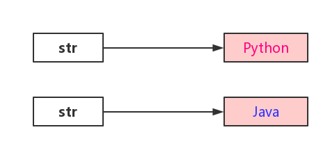

所以说，这里的字符串并不是可变，只是变更了字符串引用。

##### String真的真的真的“不可变”吗？

上面的例子肯定是不可变的，下面这个就尴尬了。

```java
public static void mian(String[] args) throws Exception {
    String str = "Hello Python";
    System.out.println(str);  // Hello Python
    
    Field field = String.class.getDeclaredField("value");
    field.setAccessible(true);
    
    char[] value = (char[]) field.get(str);
    value[6] = "J";
    value[7] = "a";
    value[8] = "v";
    value[9] = "a";
    value[10] = "!";
    value[11] = "!";
    System.out.println(str);  // Hello Java!!
}
```

通过反射，我们改变了底层的字符数组的值，实现了字符串的“不可变”性，这是一种骚操作，不建议这么使用，违反了Java对String类的不可变设计原则，会造成一些安全问题。

> 注意，以上反射私有成员在Java 9+中默认不开放。

### 8、String有没有长度限制？是多少？

String是**有长度限制**的。

##### 编译期间

---

根据虚拟机规范：


编译期间，字符串额最大长度不能超越65535个字节，即编译期间的string字符串的最大长度为65534个字节， 不然就会编译报错。

##### 运行期间

---


运行期间，String最大长度就要看Integer.MAX_VALUE的值了， 即：2^31 - 1个字节。

>  不管怎样，String的最大长度都不能超过虚拟机当前最大内存设置。

### 9、String的底层实现是怎样的？

##### JDK 6

String背后是由char数组构成的，在JDK 6中，String包含三个字段：char value[]，int offset，int count，意思很简单。

substring被调用时，它会创建一个新的字符串，但字符串的值还指向堆中同样的字符数组。它们的区别只是数量和下标引用不一样，如图所示。


JDK6中的部分源码可以说明这个问题。

```java
String(int offset, int count, char value[]) {
    this.value = value;
    this.offset = offset;
    this.count = count;
}

public String substring(int beginIndex, int endIndex) {
    // check boundary
    return new String(offset + beginIndex, endIndex - deginIndex, value);
}
```

##### 会有什么问题？

如果一个很长的字符串，但是每次使用substring()，你只需要很小的一部分。这将会导致性能问题，因为只需要一小部分，却引用了整个字符数组内容。

对于JDK 6，解决方案是使用以下内容：

```java
x = x.substring(x, y) + "";
```

##### JDK 7+

JDK 6这种问题在JDK 7+中已经改善了，JDK 7+中实际是重新创建了一个字符数组，如图：


JDK7中的部分源码：

```java
// JDK 7
public String(char value[], int offset, int count) {
    // check boundary
    this.value = Array.copyOfRange(value, offset, offset + count);
}

public String substring(int beginIndex, int endIndex) {
    // check boundary
    int subLen = endIndex - beginIndex;
    return new String(value, beginIndex, subLen);
}
```

对于JDK的这种差异，我们知道就好，现在应该都是JDK 7及8了吧，其实对于小字符串的操作性能也是可以忽略不计的。

##### JDK 9+

Java 9之后，String底层采用的是byte[]数组和编码标识来识别，这里以目前最新的Java 17为示例：

```java
public final class String implements java.io.Seriaizable, comparable<String>, CharSequence, Constable, ConstantDesc {
    @Stable
    private final byte[] value;
    ...
} 
```

### 10、为什么不能用+拼接字符串？

通过多个表达式完成一个字符串拼接操作。

```java
private void test1() {
    String www = "www";
    String str = www;
    str += "javastack";
    str += "com";
}
```

字节码如下：


观察下，`NEW java/lang/StringBuilder`出现了两次，是因为我们在代码中拼接了两次，也就是说每一次拼接操作都会创建一次`StringBuilder`。

如果我们是在一个循环中进行字符串拼接，那是不是一次拼接就要创建一个`StringBuilder`？

频繁创建对象是有性能开销的，这也是为什么我们常说的字符串不能用`+`拼接，而要用那两个`sb`拼接了。

##### 什么时候可以用`+`

直接将三个字面量的字符串拼接成一个字符串。

```java
private static void test2() {
    String str = "slq1893." + "github." + "io";
}
```

字节码如下：


从字节码看出，没有任何创建`StringBuilder`的指令，直接从常量池进行取出一个完整的字符串：sql1893.github.io。很明显，这是Java编译器对代码进行了优化。

所以，通过这个示例告诉你，在这种情况下是可以用号`+`进行字符串拼接的。

这个示例可以演变成我们实际工作当中的某个SQL语句拼接的案例，如：

```java
String sql = "select name, sex, age, address" + " from t_user" + "where age > 18";
```

别说这样不行，这样是行的。

但你要是换成这样就不行了。

```java
String sql = "select name, sex, age, address";
sql += "from t_user";
sql += "where age > 18";
```

这样又回到创建多个`StringBuilder`的时候了。

也就是说，在一个表达式中完成字符串拼接是可以用`+`号完成的，因为编译器已经做了优化。

##### 小结以下

你只需要记住这两点：

1、在循环和多个表达式中不能`+`，频繁创建`sb`性能影响；

2、在单个表达式中可以用`+`，编译器直接做了优化；

### 11、字符串拼接+和concat的区别？

+和concat都可以用来拼接字符串，但在使用上有什么区别呢，先来看看这个例子。


concat源码：

　

##### 可以得出以下结论：

1、+可以是字符串或者数字及其他基本类型数据，而concat只能接收字符串。

2、+左右可以为null，concat为会空指针。

3、如果拼接空字符串，concat会稍快，在速度上两者可以忽略不计，如果拼接更多字符串建议用StringBuilder。

4、从字节码来看+号编译后就是使用了StringBuilder来拼接，所以一行+++的语句就会创建一个StringBuilder，多条+++语句就会创建多个，所以为什么建议用StringBuilder的原因。

### 12、字符串在JDK内部是用的什么编码存储？

在JDK 9之前，字符串在JDK内部存储的编码是：UTF-16，每个字符固定占用2个字节。

但这样存储英文肯定是一种浪费，所以在JDK9中对这块进行了优化。

JDK 9中的String类内部使用`byte[]`加上一个编码标记`coder`存储字符串，字符串在包含仅**Latin-1**字符时使用一个字节字符的**LATIN1**编码存储，从而减少内存占用，而包含**Unicode**字符时则使用两个字节/字符的**UTF-16**编码。

### 13、Java 9之后，String底层为什么使用byte[]，而不是char[]？

Java 8及之前使用的是char[]，char[]会占用两个字节，如果只存储`ISO-88591`之类的字符就会造成空间浪费。

Java 9+使用了压缩字符串，底层使用的是byte[]，默认值占用一个字节，如果是`ISO-8859-1`编码外的字符，则会有一个字段进行标识。

```java
@Native static final byte LATIN1 = 0;
@Native static final byte UTF16 = 1;
```

##### coder的作用：

- 变量为latin1（ISO-8859-1）时（值为：0）时，会为其分配一个字节大小的空间；
- 变量为UTF-16（值为：1）时，会为其分配两个字节大小的空间；

也就是说，它是通过coder来识别一个字符在byte[]数组中占用一个字节还是两个字节的。

> 压缩字符串默认情况下是开启的，可以设置JVM参数：-XX:-CompactStrings进行关闭。

### 14、设计自定义异常，是继承`Exception`还是`RuntimeException`？为什么？

> 在设计自定义异常时，不要使用继承Throwable的方式，它是所有错误和异常的基类，包括了Error和Exception。
>
> 应该使用Exception或者RuntimeException来继承，以便更好地表达异常地含义。
>
> 具体继承哪个，这个没有绝对的答案，完全看业务功能需要。

##### 一般自定义异常会这样设计：

##### 1、如果自定义异常是由程序逻辑错误或者参数非法等导致的

此时应该继承RuntimeException。

因为RuntimeException是不受检查异常，不用显式使用throws语句或者捕获异常处理，这样做可以全局拦截处理异常，不用再每一层方法调用中捕获或throws处理。

##### 2、如果自定义异常是由于外部因素或者系统错误等导致的

此时应该继承Exception。

继承Exception的自定义异常必须显式使用throws语句捕获异常处理，这样做可以让调用者知道该方法可能抛出的异常，并且在必要的时候做出相应的处理。

### 15、为什么不建议捕获异常用来做业务流程控制？

先来看阿里的Java开发手册：


阿里巴巴禁止使用异常捕获用来做流程控制，条件控制。

因为异常设计的初衷是解决运行中的各种意外情况，且异常的处理效率比条件判断方式要低很多。

##### 除此之外还需要考虑以下几点：

1、如果将异常用于正常的业务流程控制，系统的代码可读性会变差。

2、创建和处理异常的过程会消耗更多的系统资源，如果频繁地在业务流程中引发和捕获异常，可能会对性能产生负面影响。

3、如果使用异常作为正常的控制流程，可能会覆盖或忽略真正的异常，使得真正的问题更难被发现和调试。

### 16、main方法可以被继承吗？

Java中的**main方法是可以被子类继承的**，因为它本质上是类的一个静态方法，静态方法可以被继承。

假设有一个父类`Parent`，它有一个`main`方法：

```java
public clsss Parent {
    public static void main(String[] args) {
        System.out.println("java面试题");
    }
}
```

现在有一个子类`Child`继承自`Parent`：

```java
public class Child extends Parent {
    
}
```

如果你运行`Child`类，也会正常运行和输出结果，它实际上运行的是继承自`Parent`类的`main`方法。

### 17、main方法可以被重写和重载吗？

**main方法可以重载**，但是JVM将始终调用原始的方法，而永远不会调用重载的main方法。

示例代码：

```java
public class Test {
    // 
    public static void main(String[] args) {
        System.out.println("主 main 方法");
        main("重载的 main 方法");
    }
    
    // 重载的main方法
    public static void main(String arg) {
        System.out.println(arg);
    }
}
```

##### main方法不能重写！！！

因为main方法是静态方法，静态方法是属于类的，而不是属于类的实例的，所以静态方法在Java中不能被重写，只能被隐藏。

### 18、main方法能同步吗？

是的，`main`方法可以被同步。

在Java中，`main`方法本质上是一个静态方法，而静态方法可以被同步，同步一个静态方法标识对该类的Class对象加锁，可以防止多个线程同时执行类中的任何静态同步方法。

示例代码：

```java
public static synchronized void main(String[] args) {
    System.out.println("同步的main方法开始执行");
    // 模拟一些长时间运行的操作
    try {
        Thread.sleep(1000);  // 让当前线程暂停1秒钟
    } catch (InterruptedException e) {
        Thread.currentThread().interrupt(); // 重新设置中断状态
    }
    
    System.out.println("同步的main方法执行结束");
}
```

> ##### 需要注意的是：
>
> 以上代码只是为了说明`main`方法可以被同步，在实际开发中并不推荐这样做，因为`main`方法是程序的入口，用于启动应用程序，它不会被线程并发访问。

如果`main`方法执行了很长时间的操作，需要同步来防止并发执行，那么更好的做法是在`main`方法内同步特定的代码块，或者在其他更合适的地方进行同步，而不是直接同步整个`main`方法。	

### 19、main方法能不能改为非静态？

不能改为非静态，main方法必须声明为静态的，这样JVM才可以调用main方法而无需实例化他的类。

如果从main方法去掉**static**这个声明，示例代码：

```java
public clsaa Test {
    public void main(String[] args) {
        System.out.println("java面试题");
    }
}
```

虽然编译依然可以成功，但在运行时会导致程序出错：

> 错误：main方法不是类 cn.slq.test.Test 中的static，请将main方法定义为：
>
> public static void main(String[] args) 

### 20、main方法为什么是静态的？

main方法一定是静态的，主要的好处是**它允许JVM在不创建类实例的情况下直接调用该方法**，如果main方法是非静态的，那么在调用main方法时JVM就得实例化它的类。

这种设计简化了程序的启动过程，还有助于避免与对象状态和生命周期相关的复杂性，确保应用程序有一个清晰、一致的入口点。

### 21、main方法必须是public static void？

Java的`main`方法必须是`public static void`，原因如下。

----

##### 为什么是public？

`main`方法必须是公开的，因为它将由JVM调用，JVM通过调用类的`main`方法启动一个Java程序，如果`main`方法不是公开的，JVM将无法访问和执行它。

----

##### 为什么是static？

`main`方法是静态的，因为当调用`main`方法时，没有创建任何类的实例。

如果`main`方法不是静态的，那么JVM就必须首先创建类的实例，然后再调用`main`方法，这是不可能的，因为`main`方法是程序的入口点，必须在创建任何其他对象之前执行。

---

##### 为什么是void？

程序的结束通常是由系统或者用户决定的，而不是`main`方法决定的，所以，`main`方法不需要返回任何值。

所以，当我们编写一个Java程序时，必须包含`public static void main(String[] args)`方法，这样JVM才能找到程序的入口点，并开始执行程序。

### 22、Java语法糖是什么意思？

##### 什么是语法糖？

语法糖（）是一种编程术语，指的是在编程语言中添加的某些语法，这些语法对语言的功能行没有影响，目的是为了让开发者能够写出更加清晰和简洁的代码。

Java作为一种与平台无关的高级语言，当然也含有语法糖，这些语法糖并不被虚拟机所支持，在编译成字节码阶段就自动转换成简单常用语法。

##### 语法糖的好处：

1、语法糖让代码更简洁，更易于理解，提升了代码可读性。

2、简化的语法减少了代码编写的复杂度，从而降低了出错的机会。

3、语法糖在编译时会被转换，不影响运行时环境，保证了向后兼容性。

##### 语法糖案例

##### 1、增强型for循环

Java 5引入的增强型for循环，这是一种简化数组和集合遍历的语法糖。

```java
for (String element : array) {
    System.out.println(element);
}
```

这比传统的for循环语法更简洁，但实际上在编译时会被转换成使用迭代器或索引的形式。

##### 2、自动装箱与拆箱

Java 5 同样引入了自动装箱与拆箱机制，允许基本数据类型和它们的包装类之间自动转换。

```java
// 自动装箱，编译器会转换为Integer x = Integer.valueOf(10);
Integer x = 10;

// 自动拆箱，编译器会转换为int y = x.intValue();
int y = x;
```

在处理基本数据类型和它们的包装类时更加便捷。

##### 3、泛型

泛型是Java 5添加的另一个功能，它允许在编译时提供更加严格的类型检查，并消除代码中的类型转换。

```java
List<String> list = new ArrayList<>();
```

泛型的引入减少了大量的类型转换代码，但在编译时，泛型信息会被擦除，转换成原始类型。

##### 4、Lambda表达式

Java 8引入的Lambda表达式，提供了一种简洁的方式来编写代码。

```java
Runnable r = () -> System.out.println("java面试题");
```

使用Lambda表达式可以使代码更简洁，更易读，它们在编译后会被转换成匿名类。

##### 5、try-with-resources

这是Java 7引入的一个语法糖，用于简化资源管理，特别是在处理`java.lang.AutoCloseable`类型的资源时。

```java
try (BufferedReader br = new BufferedReader(new FileReader(path))) {
 	return br.readLine();   
}
```

资源`BufferedReader`会在try语句块结束时自动关闭，避免了显式关闭资源的需要。

等等，还有许多语法糖。。。

### 23、try里面return，finally还会执行吗？

1、不管try有没有return，finally都会执行。

2、在try中return，在finally执行前后把结果保存起来，即使在finally中有修改也以try中保存的值为准，但如果是引用类型，修改的属性会以finally修改后的为准。

3、如果try/finally都有return，直接返回finally中的return。

示例代码：

```java
public int testTryFinally () {
    try {
        // 这里的return语句会先执行，但返回的值会在finally执行后再返回
        return 10;
    } finally {
        // 这里的代码在return之后执行
        System.out.println("finally块被执行");
    }
    // 这里不会执行到
}
```

### 24、try-catch写在循环里面好还是外面好？

面试官：

> try-catch到底写在循环里面好，还是外面好？

这个问题，我相信大部分人都会答错。

##### 到底写在哪里好？

----

很多人会说当然写在循环外面好，也有一部分人说些在循环里面好， 其实这两种回答都不完全对，我们来分析两者的弊端。

##### try-catch写在循环外面的弊端：

```java
try {
    for (...) {
        // 处理逻辑
    } catch (Exception e) {
        ...
    }
}
```

如果try-catch写在循环外面，一条数据处理异常，循环结束，会导致真个任务的结束，严重影响系统效率。

##### try-catch写在循环里面的弊端：

```java
for () {
    try {
        // 处理逻辑
    } catch (Exception e) {
        ...
    }
}
```

因为异常处理会影响效率，如果try-catch写在循环里面，会造成过多的、没有必要的循环异常处理，会严重影响系统效率。

这一点阿里巴巴的《Java开发手册》异常处理中也有相关提及：


这里提到了异常的处理效率，确实相对较低，如果循环中写try-catch，异常不发生或者少发生就还好，如果异常发生较多，系统效率肯定会降低。

所以，不管写在哪里，这个要看实际情况，要结合具体业务在做出具体的选择的，并不是绝对的写在哪里就一定好或者不好。

##### 应用场景

-----

下面我总结一下两者的应用场景

##### try-catch适合写在循环外面的场景：

（1）一条数据处理异常，需要停止后面的数据处理；

（2）不能接受任意数据处理异常， 如在事务方法中，需要整体成功或者失败，这时一条数据处理异常，就需要停止循环后面的数据处理，同时需要回滚循环中所有已处理过的数据；

##### try-catch适合写在循环里面的场景：

（1）一条数据处理异常，不能影响其他数据的处理；

（2）能接受少部分的数据处理异常，而不影响整体数据处理；

如果是连接超时异常类，如果要写在循环里面，可以设置在超过N条连接超时后强制退出循环，一方面排除了网络波动，服务可能真的出现故障，这时可以避免过多没有必要的请求超时，待服务恢复后再重试；

##### 总结

---

目前没有规范说一定要写在哪里比较好，try-catch写在循环里面或者外面都可以，上面分析了两者的弊端和应用场景，我们也可以根据实际业务场景作出选择。

### 25、`void`和`Void`有什么区别？

##### void

void用于无返回值的方法定义，当你定义一个方法时，如果这个方法不需要返回任何值，就可以使用`void`作为方法的返回类型。

示例代码：

```java
public void println() {
    System.out.println("这是一个void方法，不返回任何值。");
}
```

##### Void

Void是`java.lang`包中的一个类，它是一个泛型占位符，在泛型代码中，特别是在使用泛型方法或泛型类时，如果需要标识没有任何类型，可以使用`Void`类型，一般用于指示某些操作没有返回值，特别是在使用泛型回调、Future或者反射时较为常见。

Void是一个无用类，不能创建`Void`类的实例。

以下是`Void`类的源码：

```java
public final class Void {
    @SuppressWarnings("unchecked")
    public static final Class<void> TYPE = (Class<void>) Class.getPrimitiveClass("void");
    
    private void() {}
}
```

示例代码：

```java
public Future<Void> testAsyncOperation() {
    CompletableFuture<Void> future = new CompletableFuture<>();
    
    // 异步操作完成后完成future
    return future;
}
```

### 26、Java常用的元注解有哪些？

JDK 5开始提供了4个元注解，用来定义自定义注解的注解，它们分别是：

##### @Target

指定注解使用的目标范围（类、方法、字段等），其参考值类的定义：java.lang.annotation.ElementType

##### @Documented

指定被标注的注解会包含在`javadoc`中。

##### @Retention

指定注解的生命周期（源码、class文件、运行时），其参考值见类的定义：java.lang.annatation.RetentionPolicy

##### @Inherited

指定子类可以继承父类的注解，只能是类上的注解，方法和字段的注解不能继承。即如果父类上的注解是`@Inherited`修饰的就能被子类继承。

---

##### JDK 8又提供了以下两个元注解：

##### @Native

指定字段是一个常量，其值引用native code。

##### @Repeatable

注解上可以使用重复注解，即可以在一个地方可以重复使用同一个注解，像Spring中的包扫描注解就是用了这个。

了解了JDK对注解的定义，所以想要自定义一个注解就以`@interface`开始吧。

### 27、Java金额计算怎么避免精度丢失？

##### 经典的精度丢失问题

Java中的类型float、double用来做计算会有精度丢失问题，下面来看下面的示例。

```java
public static void main(String[] args) {
    test1();
    test2();
}

private static void test1() {
    double totalAmount = 0.09;
    double feeAmount = 0.02;
    double tradAmout = totalAmout - feeAmount;
    System.out.rintln(tradeAmount);
}
```

上面的程序输出结果是多少？

0.07？非也！

正确的结果是：

> 0.0699999999999999

为什么是这样？

浮点数可能丢失精度，浮点十进制数通常没有完全相同的二进制的表示形式，这是CPU所采用的浮点数据表示形式的副作用。为此，可能会有一些精度丢失，并且一些浮点运算可能会产生未知的结果。

浮点运算很少是精确的，只要是超过精度能表示的范围就会产生误差。所以，在使用float、double作精确运算的时候一定要特别小心，除非能容忍精度丢失，不然产生的误差也是会造成双方对账不一致的结果。

##### 怎么解决

> float和double只能用来做科学计算或者是工程计算，在商业计算中我们要用java.math.BigDecimal。

BigDecimal适合更精度的运算，也提供了丰富的操作符类型，小数位控制，四舍五入规则等。

不过，使用BigDecimal不当也有精度丢失的情况，如double的构造方法：

```java
BigDecimal(double val)
```

再来看这个示例：

```java
private static void test2() {
    double totalAmout = 0.09;
    double feeAmount = 0.02;
    BigDecimal tradeAmount = new BigDecimal(totalAmount).subtract(new BigDevimal(feeAmount));
    System.out.println(tradeAmount);
}
```

输出：

> 0.0699999999999999962529972918900966760702431201934814453125

这个精度更恐怖了。。。

所以，一定要使用String的构造方法：

```java
BigDecimal(String val)
```

```java
private static void test3() {
    double totalAmout = 0.09;
    double feeAmount = 0.02;
    BigDecimal tradeAmount = new BigDecimal(String.valueOf(totalAmount))
        .subtract(new BigDecimal(String.valueOf(feeAmount)));
    System.out.println(tradeAmount);
}
```

##### 总结

1、金额运算尽量使用BigDecimal(String val)进行运算。

2、数据库存储金额，一般有整型和浮点型两种存储方式。如果有汇率转换的，建议使用浮点数decimal进行存储，可以灵活的控制精度，decimal直接对应Java类型BigDecimal。当然，用整数存储分这种形式也可以，转账的时候单位为元而如果忘了转换分为元，那就悲剧了。

### 28、Java中的>>和>>>是什么语法？有什么区别？

在Java中有三种移位操作：

- 有符号左移（`<<`）
- 有符号右移（`>>`）
- 无符号右移（`>>>`）

这些移位操作，用于将操作数的二进制表示向左或右移动指定位数。

##### 1、有符号左移（`<<`）

对于左移操作，Java只提供了一个运算符：`<<`。

当你对一个数值进行左移操作时，右侧空出的位总是用0填充，这与该数值是正数还是负数无关。所以，左移操作本质上是无符号的，所以不需要另一个专门的无符号左移（`<<<`）运算符。

示例代码：

```java
public static void main() {
    int positive = 4;  // 二进制表示：0000 0100
    int negative = -4;  // 二进制表示：1111 1100（补码形式）
    
    // 输出 8（0000 1000）
    System.out.println(positive << 1);
    
    // 输出 -8（1111 1000）
    System.out.println(negative << 1);
}
```

##### 2、有符号右移（`>>`）

`>>`是有符号右移运算符，对于正数和负数，右侧移出的位将被丢弃，而左侧空出的位将根据原始数字的符号位填充，即正数用0填充，负数用1填充。

```java
public static void main(String[] args) {
    // 二进制表示：0000 0100
    int positive = 4;
    
    // 二进制表示：1111 1100（补码形式）
    int negative = -4;
    
    // 输出2（0000 0010）
    System.out.println(positive >> 1);
    
    // 输出-2（1111 1110）
    System.out.println(negative >> 1);
}
```

##### 3、无符号右移（`>>>`）

`>>>`是无符号右移运算符，和有符号右移（`>>`）不同的是，即无论正数还是负数，右侧移出的位将被丢弃，左侧空出的位总是用0填充。

示例代码：

```java
public static void main(String[] args) {
    // 二进制表示：0000 0100
    int positive = 4;
    
    // 二进制表示：1111 1100（补码形式）
    int negative = -4;
    
    // 输出2（0000 0010）
    System.out.println(positive >>> 1);
    
    // 输出214783646（0111 1111 1111 1111 1111 1111 1111 1110）
    System.out.println(negative >>> 1);
}
```

##### 为什么是2147483646？

在32位二进制中，-4的补码表示是`0111 1111 1111 1111 1111 1111 1111 1110`，无符号右移一位（>>> 1）意味着所有位向右移动一位，最左边空出的位用0填充，所以是`0111 1111 1111 1111 1111 1111 1111 1110`，即2147483646。

----

无符号右移运算符在处理二进制数据时非常有用，尤其是在需要忽略符号位，仅对位进行操作时。它常用于位操作任务中，如编写低级网络协议、加密算法进行位级数据操作等场景。

### 29、Java类初始化顺序是怎样的？

##### 示例1：测试单类的初始化顺序

```java
public class ClassInitOrderTest {
    public static String staticField = "static field";
    
    static {
        System.out.println(staticField);
        System.out.println("static block");
    }
    
    private String field = "member field";
    
    {
        System.out.println(field);
        System.out.println("non-static block");
    }
    
    public ClassInitOrderTest() {
        System.out.println("constructor");
    }
    
    public static void main(String[] args) {
        new ClassInitOrderTest();
    }
}
```

程序输出：

> static field
>
> static block
>
> member field
>
> non-static block
>
> constructor

可以得出以下结论，单类的初始化顺序为：

> 静态变量 > 静态初始块 > 成员变量 > 非静态初始块 > 构造器

##### 示例2：测试类继承的初始化顺序

```java
class Parent {
    private static String parentStaticField = "parent static field";
    
    static {
        System.out.println(parentStaticField);
        System.out.println("parent static block");
    }
    
    private String parentField = "parent member field";
    
    {
        System.out.println(parentField);
        System.out.println("parent non-static block");
    }
    
    public Parent() {
        System.out.println("parent constructor");
    }
}


public class Child extends Parent {
    private static String childStaticField = "child static field";
    
    static {
        System.out.println(childStaticField);
        System.out.println("child static block");
    }
    
    private String childField = "child member field";
    
    {
        System.out.println(childField);
        System.out.println("child non-static block");
    }
    
    public Child() {
        System.out.println("child constructor");
    }
    
    public static void main(String[] args) {
        new Child();
    }
}
```

程序输出：

> parent static field
>
> parent static block
>
> child static field
>
> child static block
>
> parent member field
>
> parent non-static block
>
> parent constructor
>
> child member field
>
> child non-static block
>
> child constructor

可以得出以下结论，单类的初始化顺序为：

> 父类静态变量 > 父类静态初始块 > 子类静态变量 > 子类静态初始块 > 父类成员变量 > 父类非静态初始块 > 父类构造器 > 子类成员变量 > 子类非静态初始块 > 子类构造器

##### 示例3：测试成员变量、初始块的初始化顺序

从上面两个例子可以看出，父类的静态变量和静态初始块肯定是先于子类加载的。但同一个类中的静态变量与静态初始块之间，成员变量与初始块之间的顺序一定是变量先于初始块吗？继续！

```java
public class TestOrder {
    private static A a = new A();
    
    static {
        System.out.println("static block");
    }
    
    private static B b = new B();
    
    public static void main(String[] args) {
        new TestOrder();
    }
}

class A {
    public A() {
        System.out.println("static field A");
    }
}

class B {
    public B() {
        System.out.println("static field B");
    }
}
```

程序输出：

> static field A
>
> static block
>
> static field B

可以得出以下结论，单类的初始化顺序为：

> 静态变量A > 静态初始块 > 静态变量B

所以，它们的在类中的顺序就决定了它们的初始化顺序，而不是变量一定会优先于初始块。

### 30、为什么成员变量命名不建议用isXXX？

首先我们来看阿里巴巴的《Java开发手册》关于`isXXX`是怎么定义的吧：

> 【强制】POJO类中布尔类型变量都不要加is前缀，否则部分框架解析会引起序列化错误。
>
> 反例：定义为基本数据类型Boolean isDeleted的属性，他的方法也是isDeleted()，RPC框架在反向解析的时候，“误以为”对应的属性名称是deleted，导致属性获取不到，进而抛出异常。

上面的规范很容易理解吧，就是如果使用`isXXX`这种命名形式会引起潜在的异常。

##### 我们再来看一段IDE生成的getter/setter代码：

```java
public class Staff {
    private String name;
    
    private boolean graduated;
    
    private boolean isMarried;
    
    public String getName() {
        return name;
    }
    
    public void setName(String name) {
        this.name = name;
    }
    
    public boolean isGraduated() {
        return graduated;
    }
    
    public void setGraduated(boolean graduated) {
        this.graduated = graduated;
    }
    
    public boolean isMarried() {
        return isMarried;
    }
    
    public void setMarried(boolean married) {
        isMarried = married;
    }
    
}
```

变量`isMarried`生成的getter/setter方法是：isMarried/setMarried，有些框架就会去找对应的`married`变量，然后就找不到了。。。

再看变量`graduated`，因为都是boolean变量，所有生成的逻辑和`isMarried`一样，根据上述规范，它不会产生找不着值得情况，这也是为什么不建议使用`isXXX`的命名形式。

### 31、hashCode有什么用？

hashCode是根据对象的地址算出来的一个int数字，即对象的哈希值，代表了该对象在内存中的物理存储位置。

Object顶级类提供了一个hashCode()方法，

```java
public native int hashCode();
```

根据协定，所有类在重写equals方法时必须重写hashCode()方法，不然会导致潜在的程序危害。

hashCode主要用于优化基于哈希表的数据结构的性能，如`HashMap`、`HashSet`和`HashTable`，具有相同内容的对象应该返回相同的hashCode值，通过hashCode，哈希表能够快速定位键或对象的存储位置，这使得查找、插入和删除操作非常高效。

### 32、hashCode和identityHashCode的区别？

identityHashCode是System类里面提供的本地方法：

```java
@IntrinsicCandidate
public static native int identityHashCode(Object x);
```

hashCode方法可以被重写，hashCode()方法返回的是重写后的值。

##### identityHashCode和hashCode的区别是：

identityHashCode会返回对象的原始hashCode，而不管对象是否重写了hashCode方法。

---

测试代码：

```java
public class Test {
    public static void main(String[] args) {
        String str1 = new String("abc");
        String str2 = new String("abc");
        
        System.out.println("str1 hashCode:" + str1.hashCode());
        System.out.println("str2 hashCode:" + str2.hashCode());
        System.out.println("str1 identityHashCode:" + System.identityHashCode(str1));
        System.out.println("str2 identityHashCode:" + System.identityHashCOde(str2));
        
        User user = new User("test", 1);
        System.out.println("user hashCode:" + user.hashCode());
        System.out.println("user identityHashCode:" + System.identityHashCode(user));
    }
    
    static class User {
        private String name;
        private int age;
        
        public User(String name, int age) {
            this.name = name;
            this.age = age;
        }
    }
}
```

输出结果：

> str1 hashCode:96354
>
> str2 hashCode:96354
>
> str1 identityHashCode:83954662
>
> str2 identityHashCode:1751075886
>
> user hashCode:777874839
>
> user identityHashCode:777874839

结果分析：

1、str1和str2的hashCode是相同的，是因为String类重写了hashCode方法，它根据String的值来确定hashCode的值，所以只要值一样，hashCode就会一样。

2、str1和str2的identityHashCode不一样，虽然String重写了hashCode方法，identityHashCode永远返回根据对象物理内存地址产生的hash值，所以每个String对象的物理地址不一样，identityHashCode也会不一样。

3、User对象没重写hashCode方法，所以hashCode和identityHashCode返回的值一样。

### 33、什么是hash冲突？

这个要先了解下Java通用约定。

> ##### 根据Java通用约定：
>
> 两个对象equals相等， 则它们的hashCode必须相等，反过来则不需要相同。

所以，如果两个对象同时对应一个hashCode，equals却并不相等，但在Hash相关的集合中，使用是hashCode来决定数组索引位置的，如果hash值相同，equals不同，多个hash值相同的不同对象就会对应同一个索引位置，此时就会出现传说中的hash冲突。

### 34、编程实现一个hash冲突的例子

下面使用**HaahMap**来编程实现一个hash冲突的例子：

```java
public class Test {
    public static class InnerClass {
        public int id;
        
        public int getId() {
        	return id;    
        }
        
        public InnerClass(int id) {
            this.id = id;
        }
        
        @Override
        public boolean equals(Object obj) {
            return ((InnerClass) obj).getId() == this.getId();
        }
        
        @Override
        public int hashCode() {
            return 1;
        }
    }
    
    
    public static void main(String[] args) throws Exception {
        Map<InnerClass, Integer> map = new HashMap<>();
        for (int i = 0; i < 20; ++i) {
            InnerClass innerClass = new InnerClass(i);
            map.put(innerClass, i);
        }
    } 
}
```

InnerClass类重写了equals和hashCode方法，但是使用的是同一个hash值1，以模拟hash冲突的场景，然后循环创建作为key放入到HashMap中，调试结果如下：


当for循环8次put后，数组实际元素长度为8，但hash始终为1，即hash冲突了。

此时链表长度达到8，数组默认容量 < 64时只会扩容，所以此时还不会转红黑树，链表一旦达到8就会继续扩容直到数组容量>= 64：

> 链表长度 - 数组容量的变化：8  - 16， 9 - 32， 10 -64

然后继续调试，当链表达到了10，此时数组长度 >= 64位长度，此时链表会转换为红黑树：


### 35、Java中的断言（assert）是什么？

在Java中，断言（assert）关键字是从JDK4引入的，断言是为了方便调试程序。

为了避免和老版本的Java代码中使用了`assert`关键字导致错误，Java在执行的时候默认是不启动断言检查的（这个时候，所有的断言语句都将忽略！），如果要开启断言检查，则需要用开关`-anbaleassertions`或`-ea`来开启。

断言的语法很简单，有两种写法：

##### 1、assert<boolean表达式>

- 如果为<boolean表达式>true，则程序继续执行。
- 如果为false，则程序抛出AssertionError，并终止执行。

##### 2、assert<boolean表达式>：<错误信息表达式>

- 如果<boolean表达式>为true，则程序继续执行。
- 如果为false，则程序抛出java.lang.AssertionError，并输入<错误信息表达式>。

### 36、IntegerCache类有什么用？

IntegerCache是JDK1.5版本中添加的一项新特性，把-128~127的数字缓存起来了，用于提升性能和节省内存。

所以-128~127这个范围内的自动装箱的数字都会从缓存中获取，返回同一个数字，同时这也会给我们开发带来预想不到的陷阱，需要注意！

如IntegerCache的源码，先把-128~high放在缓存中：

```java
private static class IntegerCache {
    static final int low = -128;
    static final int high;
    static final Integer[] cache;
    static Integer[] archivedCache;
    
    static {
        int h = 127;
        String integerCacheHighPropValue = VM.getSaveProperty("java.lang.IntegerCache.high");
        if (integerCacheGighPropValue != null) {
            try {
             h = Math.max(parseInt(integerCacheHighPropValue), 127);
             h = Math.min(h, Integer.MAX_VALUE - (-low) -1);
            } catch (NumberFormatException nfe) {
                
            }
        }
        high = h;
        
        CDS.initializeFromArchive(IntegerCache.class);
        int size =(high - low) + 1;
        if (archivedCache == null ll size > archivedcache.length) {
            Integer[] c = new Integer[size];
            int j = low;
            for(int i = θ; i < c.length; i++) {
                c[i] = new Integer(j++);
            }
            archivedcache = c;
        }
        cache = archivedcache;
        assert IntegerCache.high >= 127;
    }
    private IntegerCache() {}
}
```

从源码里面我们可以看到最小边界是：-128，最大边界可以通过-XX:AutoBoxCacheMax 进行配置，但也不能大于Integer.MAX_VALUE 最大值。

再来看Integer.valueOf的源码，先从缓存中获取，获取不到再 new个返回:

```java
@IntrinsicCandidate
public static Integer valueof(int i) {
    if （i >= IntegerCache.low && i <= IntegerCache.high)
        return IntegerCache.cache[i + (-IntegerCache.low)];
    return new Integer(i);
}
```

再看下面的构造器源码，new Integer 并没有使用缓存，所以我们通过 **new Integer(1）**这样写就不会从缓存中获取,也没有陷阱。

```java
@Deprecated(since="9", forRemoval = true)
public Integer(int value){
    this.value = value;
}
 @Deprecated(since="9", forRemoval = true)
public Integer(String s) throws NumberFormatException {
    this.value = parseInt(s, 10);
}
```

> 这种缓存行为不仅用于 Integer 类，而且还用于 Long,Short,Byte,Character，大家可以去这些类里面查看XxxCache的类和valueOf方法源码，原理大致相同，但它们的边界略有一二，也不能进行最大边界的配置。

**关于Integer，-128～127会有缓存，对比这个范围的数值的对象是个玩，这个在阿里巴巴规范中也有提及。**

### 37、char类型可以存储中文汉字吗？

char 类型可以存储中文汉字。

因为 Java 中使用的编码是Unicode，一个 char 类型占 2个字节（16 Bit），而一个中文也是占 2个字节，所以存放一个中文是没问题的。

示例代码：

```java
public static void main(String[] args) throws Exception {
    //使用单引/号将中文字符赋值给char类型的变量
    char ch ='中';
    //输出：中
    System.out.println(ch);
}
```

### 38、Java中的一个汉字占几个字节？

在Java 中，一个汉字所占的字节数**取决于所使用的字符编码**，不同的编码方式会有不同的字节表示。

下面是一些常见编码下汉字所占的字节数：

##### GBK:

在GBK编码中，一个汉字通常占用 **2个字节**。

##### UTF-8:

在UTF-8 编码中，一个汉字占用 **3个字节**。UTF-8 是一种可变长度的字符编码方式，对于 ASCII字符占用1个字节，对于大多数汉字占用 3个字节，对于Unicode 扩展区的字符可能占用 4个字节。

##### UTF-16:

在UTF-16 编码中，一个汉字占用 **2个字节**。

### 39、Java中的一个字符占几个字节？

Java 中的 char 字符类型，占用 2个字节。

更多基本数据类型的字节大小见这张表格：

| 数据类型 | 字节大小       | 默认值   | 包装类    |
| -------- | -------------- | -------- | --------- |
| byte     | 1              | 0        | Byte      |
| short    | 2              | 0        | Short     |
| int      | 4              | 0        | Integer   |
| long     | 8              | 0L       | Long      |
| float    | 4              | 0.0f     | Float     |
| double   | 8              | 0.0d     | Double    |
| char     | 2              | '\u0000' | Character |
| boolean  | 1/8（一个bit） | false    | Boolean   |

### 40、为什么Java不支持类多继承？

Java 是一种简单面向对象解释型的语言，多继承会使设计复杂化，并且会带来各种问题。Java 不支持类的多继承是一个设计选择，**目的是为了减少复杂性和歧义性，提高代码的清晰度和可维护性。**

##### 比如多重继承带来的钻石问题：


在这个例子中，类B 和C 都继承了抽象类 A，并且进行了方法实现，如果D 通过多继承继承了B 和C，那么 D 应该继承 B 的还是C 的方法？

这就陷入了矛盾，这就是钻石形继承问题产生的歧义，所以Java 类不支持多继承。

##### Java 中的解决方案：

为了解决这个问题，Java 在设计时选择了禁止类的多继承，转而支持接口的多继承。

接口可以被任意数量的类实现，这提供了多继承的某些好处，但避免了钻石问题，因为接口只能声明方法不能提供方法的实现。这样，即使一个类实现了多个接口，那些接口中相同的方法也必须由该类来提供具体的实现，从而避免了歧义。

此外，从 Java 8开始，接口可以包含默认方法（带有实现的方法）。为了避免与类多继承相同的问题，Java对于默认方法也有明确的规则：**如果一个类继承的多个接口中存在签名相同的默认方法，那么该类必须覆盖这个方法以解决冲突。**

### 41、ava支持运算符重载吗？为什么？

与C++不同，Java 不支持运算符重载。

> 运算符重载是指允许开发人员重新定义运算符（例如+、-、*、／等）的行为，使其能够适用于自定义的数据类型。

Java 之父在设计Java 语言时考虑了许多因素，其中之一就是尽量保持语言的**简洁性，一致性和易于理解。**

##### 运算符重载的缺点：

1、运算符重载可能会导致代码变得晦涩难懂，因为同一个运算符在不同的上下文中可能会有不同的行为，从而增加理解代码的难度。

2、运算符重载还可能导致混淆和错误，因为它会使代码的行为变得不确定。

所以，Java 不支持运算符重载，Java 鼓励开发者使用明确的方法来执行操作，以提高代码的可读性和可维护性。

### 42、动态代理都用到了哪些技术？

##### 1、Java 内置动态代理

利用`java.lang.reflect.Proxy`类和`java.lang·reflect.InvocationHandler` 接口，主要用于接口的动态代理,通过`Proxy.newProxyInstance`方法，可以在运行时动态创建实现指定接口的代理实例，` InvocationHandler`是实际处理代理方法调用的地方。

##### 2、CGLIB

CGLIB 能够在运行时动态增强类的方法，广泛用于 Spring 框架中进行 AOP 编程，它通过继承方式动态生成被代理对象的子类，适用于代理类，而非接口。

##### 3、反射

需要通过反射动态调用被代理对象的方法。

### 43、ava反射机制有什么用？

##### 反射介绍

---

Java 的反射机制（reflection）是指在程序的运行状态中，可以构造任意一个类的对象，可以了解任意一个对象所属的类，可以了解任意一个类的成员变量和方法，可以调用任意一个对象的属性和方法，而不需要在编译时知道具体的类。

这种动态获取程序信息以及动态调用对象的功能称为Java 语言的反射机制，反射被视为动态语言的关键。

##### 反射示例

----

##### 1、运行时类信息获取

通过反射，可以在运行时获取任意一个对象所属的类的信息，包括类名、方法信息、字段信息、构造函数信息等。

示例代码：

```java
public static void main(String[] args) throws Exception {
    Class<?> clazz = Class.forName("java.util.ArrayList");
    Method[] methods = clazz.getDeclaredMethods();
    for (Method method : methods) {
        System.out.println(method.getName());
    }
}
```

##### 2、运行时实例化对象

反射允许在运行时动态创建对象实例，即使在编译时不知道类名，这在处理动态加载或插件化架构时特别有用，比如：SPI机制。

示例代码：

```java
public static void main(string[] args) throws Exception {
    Class<?> clazz = Class.forName("java.util.ArrayList");
    List<String> list = (ArrayList<string>) clazz.newInstance();
    list.add("java");
    list.add（"面试题");
    System.out.println(list);
}
```

##### 3、运行时方法调用

可以通过反射调用对象的方法，即使这些方法在编译时未知或不可访问。

示例代码：

```java
public static void main(string[] args) throws Exception {
    //运行时实例化对象
    Class<?> clazz = Class.forName("java.util.ArrayList");
    List<string> list = (Arraylist<string>) clazz.newInstance();
    //运行时方法调用
    Method method = clazz.getMethod("add", object.class);
    method.invoke(list,"公众号");
    method.invoke(list,"Java技术栈");
    System.out.println(list);
}
```

##### 4、运行时访问和修改字段

反射允许访问和修改对象的私有字段，这在某些特殊情况下非常有用，但应谨慎使用以避免破坏封装性。

示例代码：

```java
public static void main(String[] args) throws Exception {
    //运行时实例化对象
    Class<?> clazz = Class.forName("java.util.ArrayList");
    List<string> list = (ArrayList<string>) clazz.newInstance();
    //运行时访问和修改字段
    Field field = clazz.getDeclaredField("size");
    field.setAccessible（true);
    //让私有字段可访问
    int size = field.getint(list);
    System.out.println(size);
}
```

### 44、Java反射机制的优缺点？

尽管 Java 反射提供了极大的灵活性和动态性，但它的使用也伴随着一些缺点和潜在风险，以下是Java 反射机制的主要优缺点。

##### 反射的优点

##### 1、灵活性

反射提供了极大的灵活性，允许在运行时动态创建对象、调用方法、访问字段，这在编写通用框架或需要大量动态性的应用程序时非常有用。

##### 2、解耦

反射有助于解耦代码组件，使得程序的各个部分可以独立开发和使用，降低了模块间的依赖。

##### 3、调试和测试

反射可以用于调试和测试目的，比如在测试代码中访问和修改私有成员，无需修改原始代码的可见性。

------

##### 反射的缺点

##### 1、性能开销

反射操作的性能比直接代码调用慢，因为它需要进行额外的处理，如类型检查和方法调用解析，所以反射操作可能导致性能下降，特别是在密集调用的情况下。

##### 2、安全风险

- 由于反射涉及的类型是在运行时确定的，编译器无法对反射代码进行类型检查，这可能导致运行时错误而这些错误在编译时是不可见的。

- 反射可以用于访问和修改类的私有成员，这可能会破坏封装性原则，增加安全风险，不当使用可能导致代码难以理解和维护。

##### 3、代码的可读性和可维护性

过度使用反射可能会使代码难以理解和维护，因为反射代码通常比直接代码调用更抽象和复杂。

----

Java 反射机制是一个双刃剑，它提供了强大的灵活性和动态性，但也带来了性能和安全性的挑战。

在使用反射时，应该权衡它的优缺点，并在确实需要动态性的情况下谨慎使用，以保持代码的清晰、高效和安全。

### 45、Java反射机制Class类有哪些常用方法？

Class类的常用方法如下：

| 方法名称                | 描述                                                         |
| ----------------------- | ------------------------------------------------------------ |
| getName                 | 返回类的完全限定名。                                         |
| getSuperclass           | 返回该类的父类的class 对象。                                 |
| getlnterfaces           | 返回该类实现的接口的class 对象数组。                         |
| getModifiers            | 返回类或成员的修饰符。                                       |
| getFields               | 返回类或接口的所有公共字段的勺Field 对象数组。               |
| getDeclaredFields       | 返回类或接口声明的所有字段的Field 对象数组，包括私有和受保护的，但不包括继承的字段。 |
| getMethods              | 返回类或接口的所有公共方法的勺Method 对象数组，包括继承的方法。 |
| getDeclaredMethods      | 返回类或接口声明的所有方法的』Method对象数组，包括私有和受保护的，但不包括继承的方法。 |
| getConstructors         | 返回类的所有公共构造函数的constructor 对象数组。             |
| getDeclaredConstructors | 返回类声明的所有构造函数的Constructor对象数组，包括私有和受保护的。 |
| getField                | 返回指定公共成员字段的 Field对象。                           |
| getDeclaredField        | 返回指定声明字段的勺Field 对象，包括私有和受保护的。         |
| getMethod               | 返回指定公共成员方法的Method 对象。                          |
| getDeclaredMethod       | 返回指定声明方法的Method 对象，包括私有和受保护的。          |
| getConstructor          | 返回指定公共构造函数的Constructor 对象。                     |
| getDeclaredConstructor  | 返回指定声明构造函数的对象，包括私有和受保护的。             |
| newlnstance             | 创建此Class对象所表示的类的新实例。                          |
| islnterface             | 判断此Class对象是否表示一个接口类型。                        |
| isArray                 | 判断此Class对象是否表示一个数组类型。                        |
| isPrimitive             | 判断此Class对象是否表示一个基本类型。                        |

### 46、Java反射可以访问私有方法吗？

是的，Java 反射可以访问私有方法。

通过反射可以绕过Java 的访问控制检查，访问一个类的私有成员，包括私有方法，这在某些特殊情况下非常有用，比如需要动态访问对象内部属性和方法时。

##### 访问私有方法：

- Class.getDeclaredMethod(String name, Class[] parameterTypes)

- Class.getDeclaredMethods()

  然后调用 Method 的 setAccessible(true)方法。

  示例代码：

```java
public static void main(String[] args) throws Exception {
    // 获取 User 的CLass 对象
    Class<?> clazz = Class.forName("User");
    // 创建User的实例
    User user = (User) clazz.newInstance();
    // 获取私有方法对象
    Method buildNameMethod = clazz.getDeclaredMethod("buildName");
    //设置私有方法为可访问
    buildNameMethod.setAccessible(true);
    //调用私有方法
    buildNameMethod.invoke(user);
}
```

### 47、Java反射可以访问私有变量吗？

可以的。

访问私有变量：

- Class.getDeclaredField(String name)
- Class.getDeclaredFields0 

然后调用 Field 的 setAccessible(true) 方法。

示例代码：

```java
public static void main(String[] args) throws Exception {
    //运行时实例化对象
    Class<?> clazz = Class.forName("java.util.Arraylist");
    List<String> list = (ArrayList<String>) clazz.newInstance();
    //运行时访问和修改字段
    Field field = clazz.getDeclaredField("size");
    field.setAccessible(true)；
    // 让私有字段可访问
    int size = field.getInt(list);
    System.out.println(size);
}
```

> 需要注意的是，使用这种方式访问私有成员需要非常谨慎，因为它破坏了封装性，增加了代码的复杂性和维护难度。

### 48、ava反射可以访问父类的成员吗？

可以的，先获取到父类：getClass).getSuperclass()，再根据相关方法去获取父类的成员。

示例代码：

```java
public static void main(String[] args) throws Exception {
    Childclass child = new Childclass();
    //获取父类的 CLass 对象
    Class<?> parentclass = child.getclass().getSuperclass();
    //访问父类的私有字段
    Field field = parentclass.getDeclaredField("privateField");
    field.setAccessible(true);
    String fieldvalue = (String) field.get(child);
    System.out.println("父类的私有字段值："+fieldvalue);
    //访问父类的私有方法
    Method method = parentClass.getDeclaredMethod("privateMethod");
    method.setAccessible(true);
    method.invoke(child);
}
```

### 49、Java反射可以访问父类的私有方法吗？

可以的。

先获取到父类：getClass(.getSuperclass()

##### 访问私有方法：

- Class.getDeclaredMethod(String name, Class[] parameterTypes)
- Class.getDeclaredMethods()

然后调用 Method 的 setAccessible(true)方法。

示例代码：

```java
public static void main(String[] args) throws Exception {
    //创建子类的实例
    Childclass child = new Childclass();
    //获取父类ParentcLass的CLass对象
    Class<?> parentclass = child.getClass().getSuperclass();
    //获取父类的私有方法
    privateMethodMethod method = parentClass.getDeclaredMethod("privateMethod");
    //设置私有方法为可访问
    method.setAccessible(true);
    //调用私有方法
    method.invoke(child);
}
```

### 50、Java反射可以访问父类的私有变量吗？

可以的。

先获取到父类：getClassO.getSuperclass()

##### 访问私有变量：

- Class.getDeclaredField(String name)
- Class.getDeclaredFields0

然后调用 Field 的 setAccessible(true) 方法。

示例代码：

```java
public static void main(String[] args) throws Exception {
    //创建子类的实例
    Childclass child = new Childclass();
    //获取父类 ParentcLass 的 CLass 对象
    Class<?> parentclass = child.getclass().getsuperclass();
    //获取父类的私有字段
    privateFieLdField field = parentclass.getDeclaredField("privateField");
    //设置私有字段为可访问
    field.setAccessible(true);
    //获取私有字段的值
    String value = (String) field.get(child);
    System.out.println("获取到的父类私有变量的值为：: " + value);
}
```

### 51、Java反射有没有性能影响？

使用反射是会有一点性能和效率上的影响。

但比起它所带来的好处和便利性，以及应用程序本身所带来的性能问题，**反射影响的损耗只是微乎其微，基本可以忽略不计**，而且现在主流的 Java 框架都在大量使用反射。

### 52、Java反射到底慢在哪？

Java 反射的性能开销主要体现在以下几个方面：

##### 1、运行时类型检查

反射调用涉及到运行时类型检查，反射需要在运行时动态解析类和成员的信息，这包括查找类、方法、字段等。与编译时直接绑定相比，这种动态查找增加了额外的时间开销。

##### 2、访问控制检查

反射调用涉及到更多的安全和访问控制检查，如检查是否允许访问私有或受保护的成员。这些检查在直接调用时通常不需要或在编译时就完成了。

##### 3、使用反射 API 的开销

使用反射涉及创建Method吴子Field、Constructor等反射对象，这些对象的创建和使用本身就比直接调用方法或访问字段更耗时。

##### 4、内存消耗

反射操作通常会产生更多的临时对象（如Method、Field 对象等），这些对象占用内存并最终需要由垃圾回收器处理，从而增加了内存管理的负担。

### 53、怎么在运行时动态生成一个类？

##### 一、Java 官方方法

1、Java Compiler APl，通过 Java Compiler APl，可以在应用程序运行期间动态编译 Java 源代码，生成类，并立即加载和使用这些类。

2、另外，使用Java 的动态代理机制也可以在运行时动态创建接口的实现类，一般用于代理设计模式或者 AOP 实现中。

##### 二、第三方类库

第三方比较常见且强大的是使用字节码操作库，如 **ASM、CGLIB、Javassist**，这些库可以在运行时动态生成和修改类或者增强类的功能。

### 54、String str="S";创建了几个对象？

> String str = "S";

这行代码一共创建了几个对象？

----

##### 这个题要分为两种情况：

1、如果字符串常量池中，已经创建："S"，此时创建了0个对象。

2、如果字符串常量池中，没有创建：“S"，此时在常量池中创建了1个对象。

### 55、new String（"S"）创建了几个对象？

> String s = new String("S");

这行代码一共创建了几个对象？

---

##### 这个题要分为两种情况：

1、如果字符串常量池中，已经创建："S"，此时只会在堆内存创建1个字符串对象。

2、如果字符串常量池中，没有创建：“S"，则会创建2个对象，一个在堆内存，一个在常量池。

### 56、判断两个字符串是否相等（1）

以下代码的输出结果是？

```java
public static void main(String[] args) {
    String str1 ="Java面试题"; 
    String str2 = "Java面试题";
    System.out.println(str1 == str2);
    System.out.println(strl.equals(str2));
}
```

##### 输出结果：

> true
>
> true

因为两者都指向常量池的同一个对象，不管怎么比较都会相等。

### 57、判断两个字符串是否相等（2）

以下代码的输出结果是？

```java
public static void main(String[] args) {
    String str1 = "Java面试题";
    String str2 = new String("Java面试题");
    System.out.println(str1 == str2);
    System.out.println(strl.equals(str2));
}
```

##### 输出结果：

> false
>
> true

因为两者为不同的两个对象，第一个对象在常量池，第二个对象在堆中创建的是常量池的副本。

### 58、判断两个字符串是否相等（3）

以下代码的输出结果是？

```java
public static void main(String[] args) {
    String str1 = "Java面试题";
    String str2 = "Java" +"面试" + "题";
    System.out.println(str1 == str2);
    System.out.println(strl.equals(str2));
}
```

##### 输出结果：

> true
>
> true

str1 指向常量池；

str2 由于常量优化机制，三个字符串常量相加本身就是常量；

因为 str1 常量已创建，所以 str2 无需创建，两者都指向常量池的同一个对象，不管怎么比较都会相等。

### 59、判断两个字符串是否相等（4）

以下代码的输出结果是？

```java
public static void main(String[] args) {
    String str1 ="Java面试题";
    String str2 = "Java";
    String str3 = str2 +"面试题";
    System.out.println(str1 == str3);
    System.out.println(strl.equals(str3));
}
```

##### 输出结果：

> false
>
> true

因为两者为不同的两个对象，第一个对象在常量池，第三个对象在堆中创建。

str1 指向常量池；

str3 在堆中创建了一个新对象，因为是变量和字符串相加，并没有常量优化机制，底层会调用 StringBuilder 拼接并形成一个新的字符串。

### 60、String.intern0方法有什么用？

**String.intern()方法设计的初衷就是**：重用字符串对象，以便节省内存。

##### JDK 1.6：

先判断字符串常量池中当前字符串是否存在：

- **如果不存在**：将当前字符串复制到字符串常量池，并返回字符串常量池中字符串的引用；
- **如果存在**：不会改变字符串常量池已存在的引|用，并返回字符串常量池中的字符串引用；

##### JDK 1.7+：

先判断字符串常量池中当前字符串是否存在：

- **如果不存在：不会再将当前字符串复制到字符串常量池，而是将当前字符串的引I用复制到字符串常量池**，并返回字符串常量池中字符串的引用；
- **如果存在**：不会改变字符串常量池已存在的引用，并返回字符串常量池中的字符串引用；

### 61、判断字符串intern是否相等（1)

以下代码的输出结果是？

```java
public static void main(String[] args) {
    String str1 ="Java面试题";
    String str2 = new String("Java") + new String("面试题");
    System.out.println(str1 == str2.intern());
}
```

**输出结果**：true

因为”Java面试题“已经创建并存在 str1，所以 str2.intern 返回的是字符串常量池中已存在的字符串 str1 的引l用，两者指向的是同一个字符串对象。

### 62、判断字符串intern是否相等（2）

以下代码的输出结果是？

```java
public static void main(String[] args) {
    String str1 = new String("Java") + new String("面试题");
    System.out.println(str1 -- str1.intern());
}
```

---

##### 输出结果： 

##### JDK 1.6: false。

因为字符串常量池中不存在时，先将当前字符串复制到字符串常量池，并返回字符串常量池中字符串的引用，所以两者是两个引用。

##### JDK 1.7+: true。

因为字符串常量池中不存在该字符串时，不会再将当前字符串复制到字符串常量池，而是将当前堆中的字符串的引用复制到字符串常量池，并返回字符串常量池中字符串的引用，所以两者是同一个引用。

### 63、对象比较是用equals还是==？为什么？

两个都可以，看情况使用。

> ==比较的是两个对象的 内存地址 是否相同，而 equals 方法比较的是两个对象的内容（如：成员变量）是否相同。

所以，如果比要基于两个对象的内容判断对象是否相同，应该使用并重写 equals 方法，而如果要比较两个对象（内存地址)是否完全相同，即同一个对象，需要使用 == 运算符。

> 如果要比较对象的内容是否相等，建议使用 JDK 自带的 ○bjects.equals 方法，它会先用 == 比较是否同一个对象，再比较对象的内容是否相等。

Objects.equals 源码如下 :

```java
public static boolean equals(object a, Object b) {
    return (a == b) ll (a != null && a.equals(b));
}
```

### 64、为什么不建议用equals判断对象相等？

Java 行业中 **并没有不建议** 使用 equals 方法判断对象相等的规范，相反，在比较对象内容是否相等时，equals 还是比较对象是否相等的标准实现方法。

> **为什么会有这样的问题？**
>
> 这是因为 equals 方法是要由开发人员自己实现的，由于每个人的技术水平差异，如果没有正确实现 equals 方法，可能会导致对象相等比较时的结果不正确。
>
> 所以，为了保证对象比较的正确性，需要确保要比较对象的类正确实现了 equals 方法。

### 65、程比较两个对象的内容是否相等？

> 比如有两个User对象，如何比较它们的内容是否相等？

比较两个对象内容是否相等，需要重写User类的equals方法和hashCode 方法，下面是示例代码。

```java
public class User {
    private String name;
    private int age;
    public User(string name, int age) {
        this.name = name;
        this.age = age;
    }
    @override
    public boolean equals(object obj) {
        if (obj == this）{
            return true;
        }
        if (!(obj instanceof User)) {
            return false;
        }
        User user = (user) obj;
        return objects.equals(this.name, user.name)
            && objects.equals(this.age, user.age);
    }
    @override
    public int hashcode() {
        return objects.hash(this.name, this.age);
    }
}
```

两个对象在比较时，可以使用 equals 方法，或者是 Objects.equals 方法。

### 66、Java有哪几种级别的引用？

为了使程序能更加灵活地控制对象的生命周期，从 JDK1.2 版本开始，JDK 把对象的引用级别分为了以下四种。

##### 这4种级别由高到低依次为：

- 强引|用(StrongReference)
- 软引|用(SoftReference)
- 弱引l用(WeakReference)
- 虚引|用(PhantomReference)

##### 下面通过一张表格来说明它们的回收时间、用途：

| 引用类型 | 回收时间           | 用途         |
| -------- | ------------------ | ------------ |
| 强引用   | 不在作用域可能回收 | 普通对象引用 |
| 软引用   | 内存不足时回收     | 缓存对象     |
| 弱引用   | 垃圾回收时回收     | 缓存对象     |
| 虚引用   | 不确定             | 跟踪垃圾回收 |

不管这些东西平时有没有用到，我们都必须了解这些机制，这对个人的知识面及拓展是非常有帮助的。

### 67、你怎么理解强引用？

强引用（Strong Reference）是Java 中最基本的引l用类型，也是我们在日常开发中最常见的引l用形式，如以下代码：

```java
object obj = new object();
```

当我们像这样创建一个对象时，它就是强引l用，这里的`obj`就是对`Object`实例的强引用。

只要强引用还存在，垃圾回收器就不会回收被引用的对象，即使程序可能已经不再需要这个对象，也不会回收，这可能导致内存泄露。

### 68、你怎么理解软引用？

软引l用（Sof Reference）是 Java 中的一种引l用类型，它提供了一种灵活的内存敏感的缓存机制。

软引用的主要特点是，**它允许对象在 JVM 内存不足时被垃圾回收器回收**，从而避免了`outofMemoryError`异常的发生。

如果一个对象只有软引用：

- 内存空间足够情况下，垃圾回收器就不会回收它。
- 果内存空间不够了，就会对这些只有软引用的对象进行回收。

所以软引用一般用来实现一些内存敏感的缓存，只要内存空间足够，对象就会保持不被回收掉。

### 69、你怎么理解弱引用？

弱引l用（Weak Reference）是Java 中的一种引l用类型，它比软引l用还要弱，在垃圾回收机制的角度看，它允许一个对象拥有更灵活的回收策略。

弱引用的对象具有更短暂的生命周期，在垃圾回收器线程扫描它所管辖的内存区域的过程中，一旦发现了只具有弱引用的对象，不管当前内存空间是否足够，都会进行回收。

> 由于垃圾回收器线程优先级很低，弱引用的对象也不一定会被很快回收。

弱引用可以用来实现一些规范化映射，如：WeakHashMap，当key不再被引引用时可以自动被回收。

### 70、你怎么理解虚引用？

虚引l用（Phantom Reference）是Java 中四种引l用类型之一，它是最弱的一种引l用关系。

虚引用，顾名思义就是形同虚设，虚引用不决定对象的生命周期，如果一个对象仅持有虚引用，那么它就和没有任何引用一样，在任何时候都可能被垃圾回收器回收。

**虚引引用主要用来跟踪对象被垃圾回收器回收的活动**，虚引用必须和引l用队列（ReferenceQueue）联合使用，当垃圾回收器准备回收一个对象时，如果发现它还有虚引用，就会在回收对象的内存之前，把这个虚引用加入到与之关联的引用队列中。

### 71、怎么实现一个强引用？

如代码所示：

```java
// 创建一个成员变量（强引用）
private object obj = new object();
public static void main(string[] args) {
    //创建一个局部变量（强引用)
    Object object = new object();
    // object 变量现在持有一个对 object实例的强引l用
    //只要object引l用存在，垃圾回收器就不会回收object实例
    //使用对象...
}
//当方法执行结束，局部变量object失去作用域，其强引用也随之消失
```

这就是强引用，object 持有了这个对象的存储地址的引用。

对于成员变量，当一个对象实例被垃圾回收器回收时，其内部的所有成员变量也会随之失去引用，如果这些成员变量没有在其他地方被引用，它们会被垃圾回收。

如果是局部变量，只要这个局部变量还在作用域内，垃圾回收器就不会回收这个对象。但是，一旦局部变量失去作用域，比如方法执行结束，局部变量就会从栈中移除，相应的强引用也随之消失。

### 72、怎么实现一个软引用？

软引用的实现类：

> java.lang.ref.SoftReference

创建软引用的示例如下：

```java
public static void main(string[] args) throws InterruptedException {
    //创建一个强引用对象
    object object = new object();
    //创建一个软引用。指向上面创建的对象
    SoftReference<object> softReference = new SoftReference<>(object);
    //清除强引用，确保这个对象只被虚引用所引用
    object = null;
    //强制进行垃圾回收
    System.gc();
    //休眠几秒，等待垃圾回收器回收
    Thread.sleep(3ea0);
    //在需要的时候通过软引用获取对象
    object data = softReference.get();
    if （data l= null) {
        System.out.println("对象还在："+ data);
    } else {
        System.out.println("对象已被垃圾回收器回收");
    }
}
```

输出结果：

> 对象还在： java.lang.Object@37f8bb67

因为内存足够，所以软引用没有被回收，该软引|用对象就可以继续被程序使用。

### 73、怎么实现一个弱引用？

弱引用的实现类：

> java.lang.ref.WeakReference

示例代码：

```java
public static void main(string[] args) {
    // 创建一个对象
    String original = new string("Java面试题");
    
    // 创建一个指向对象的弱引用
    WeakReference<String> WeakRef = new WeakReference<>(original);
    
    // 去除强引用
    original = null;
    
    // 在下一次垃圾回收时，只被弱引用指向的对象就会被回收
    System·gc();// 提示JvM进行垃圾回收，但不保证立即发生
    
    // 尝试通过弱引用获取对象
    if (weakRef.get() != null) {
        System.out.println("对象还未被回收："+weakRef.get());
    } else {
        System.out.printin("对象已被垃圾回收");
    }
}
```

输出结果：

> 对象已被垃圾回收

因为弱引用是不管内存够不够，垃圾收集器工作时就会立即回收，所以示例中的对象立即被回收了。

### 74、怎么实现一个虚引用？

虚引用的实现类：

> java.lang.ref.ReferenceQueue

示例代码：

```java
public static void main(string[] args) throws Interruptedexception {
    //创建一个引用队列
    ReferenceQueue<object> referenceQueue = new ReferenceQueue<>();
    //创建一个对象
    object object = new object();
    //创建一个虚引用，来引用这个对象，并与引用队列关联 
    PhantomReference<object> phantomReference = new PhantomReference<>(object, referenceQueue);
    //清除强引用，确保这个对象只被虚引用所引用
    object = null;
    //强制进行垃圾回收
    System.gc();
    //休眠几秒，等待垃圾回收器回收
    Thread.sleep(3000);
    //检查引用队列，看是否可以取出虚引用
    System.out.println("虚引l用是否存在："+ (referencequeue.poll() != null));
}
```

输出结果：

> 虚引用是否存在：true

这里的引用队列是必须的，当对象回收时会放入其中，它最大的作用是跟踪对象的回收。

### 75、一个类的静态块是否可能被加载多次？

不可能，只加载一次，**JVM保证静态块只会执行一次**，静态块是在类加载过程的初始化阶段执行的，它用于初始化类变量和执行类级别的初始化代码。

一旦类被初始化，它的静态块就不会再次执行，**除非类被卸载并重新加载**，但在Java 应用程序运行期间，类的卸载和重新加载很少会用到。

示例代码：

```java
public class Test {
    static {
        System.out.println("静态块执行");
    }
    public static void main(string[] args) {
        //静态块在此之前已经执行了，且仅执行一次
    }
}
```

在上面的示例中，无论你创建多少次`Test`的实例，或者调用多少次`Test`的静态方法，静态块中的代码只在类`Test`第一次被加载到 JVM 时执行一次。

### 76、可以自定义一个java.lang.String吗？

可以自定义一个，不会报错，但它也不会被编译和加载。

因为 Java.lang.String 它在 java/lib 目录下，所以当应用类加载器去 classpath 加载时会去委托父类加载器,这时最顶层类加载器会发现自己之前已经加载过，所以这次不再加载，所以自定义的这个java.lang.String 不能被类加载器加载并使用。

原理可以看面试题：JVM 双亲委派模型。

### 77、什么是伪共享？有什么解决方案？

##### 什么是伪共享

伪共享是多线程程序中的一种性能问题，发生在多个线程访问并更新相互独立的变量时，而这些变量恰好位于同一个 CPU 缓存行中。

现代CPU为了提高内存访问速度，不是直接从主内存中逐字节读取数据，而是以块（缓存行，一般为64字节）的形式加载数据到CPU 缓存中。当多个线程修改同一个缓存行中的不同变量时，即使这些变量彼此独立，每个线程的修改也会使得整个缓存行在多个CPU核心间无效，导致频繁的缓存同步，从而降低了程序的执行效率。

> **伪共享的典型场景：**
>
> 假设有两个线程，线程A和线程B，它们分别更新两个独立的变量，这两个变量恰好位于同一个缓存行中。
>
> 线程A更新变量时，会将包含该变量的缓存行加载到它所在CPU核心的缓存中。
>
> 当线程B更新另一个变量时，由于这两个变量位于同一个缓存行，线程B的操作会导致线程A的缓存行失效，即使它们操作的是不同的变量。
>
> **这种无谓的缓存失效和同步被称为伪共享。**

##### 解决方案

Java 8 中已经提供了官方的解决方案，Java 8 中新增了一个注解：`@sun.misc.Contended`。

加上这个注解的类会自动补齐缓存行：

```java
@sun.misc.Contended
public final static class Volatilelong {
    public volatile long value = 0L;
    //public Long p1, p2, p3, p4, p5, p6;
}
```

需要注意的是，此注解默认是无效的，需要在VM 启动时设置-XX:-RestrictContended才会生效。

### 78、Objectobj=newObject）占用几个字节？

在Java中，**无论是32位还是64位JVM，对象头都需要按8宇节对齐**。

此外，**Java虚拟机还会将整个对象的大小调整为8字节的倍数**，这可能包括在对象末尾添加填充字节（Padding），这种填充确保了对象数组中的每个元素都保持适当的对齐，从而使得JVM 能够有效地访问这些对象。

以 64位操作系统为例。

##### 开启指针压缩：

> markword 8 字节 + classpointer 4 字节 + Padding 4字节 = 16 字节

##### 未开启指针压缩：

>  markword 8 字节 + classpointer 8 字节 +Padding 0 字节 = 16 字节

### 79、为什么一个对象的字节大小为8的整数倍？

一个对象在Java 中占用的内存大小为8 的整数倍，这样做的目的是因为**内存对齐**的要求，为了使字节数据对齐，**以空间为代价进行更快地内存访问，从而提升运行效率**。

内存对齐是计算机系统为了提高内存访问速度而采用的一种优化策略，这种策略不仅适用于Java，还适用于许多其他编程语言和系统。如果字节数据未对齐，处理器还需要在内存加载后进行一些调整才能访问。比如在 64 位JVM 上, 一个空的`object`实例的对象头占用 12 字节（开启了指针压缩），为了满足 8字节对齐的要求，VM会在对象末尾添加4字节的填充，使得整个对象的大小成为16字节。

### 80、对象不再使用时，需要赋值为null吗？

##### 一般情况下是没必要手动赋值为null，垃圾回收器会自动处理：

##### 1、局部变量

在方法执行完毕后，这个局部变量的作用域就结束了。此时，如果没有其他引用指向这个对象，它就会自动变成垃圾回收的候选对象。

##### 2、自动垃圾回收

Java 的垃圾回收机制可以检测到哪些对象不再被引用，并自动回收这些对象占用的内存。所以，在许多情况下，**不需要显式地将对象设置为`null`来触发垃圾回收。**

-----

##### 可能需要赋值为null的情况（不建议！）

##### 1、长生命周期的对象持有短生命周期的对象引用

如果一个长生命周期的对象持有对短生命周期对象的引用，那么即使这些短生命周期的对象不再需要，它们也不会被垃圾回收，因为仍然存在对它们的引用。在这种情况下，如果确定某个短生命周期的引用不再需要，将其赋值为`null`可以帮助垃圾回收器回收这些不再使用的对象。

##### 2、内存敏感的大对象

对于占用大量内存的对象，如果你知道它们不再被需要，将它们赋值为`null`可以更快地释放内存，尤其是在内存敏感的应用中。

-----

总之，在大多数情况下，应该让Java 的垃圾回收机制来管理内存，只有在确实需要时才考虑将对象显式设置为`null`，频繁地将对象设置为勺`null`还会增加阅读和维护成本。

### 81、如何实现对象克隆？

可以有以下两种方法：

1、实现Java 中的Cloneable接口，然后重写其clone(方法。

```java
public class Person implements Cloneable {
    private string name;
    private int age;
    
    public Person(string name, int age) {
        this.name = name;
        this.age = age;
    }
    
    public String getName() {
        return name;
    }
    
    public int getAge(){
        return age;
    }
    
    @override
    public Person clone() throws CloneNotsupportedException {
        return (Person) super.clone();
    }
}

public class Test {
    public static void main(string[] args) throws CloneNotsupportedException {
        Person person1 = new Person("张三", 20);
        Person person2 = personl.clone();
        //faLse，克隆出的对象和原始对象不是同一个对象
        System.out.println(personl == person2);
    }
}
```

2、实现序列化接口，先序列化对象，再反序列化对象。

> 具体见 IO 相关面试题。

### 82、对象克隆浅拷贝和深拷贝的区别？

##### 浅拷贝

---

拷贝对象时仅仅**只拷贝对象本身和基本类型变量**，而不拷贝引用类型变量（拷贝的只是对象的引用，还是同一个对象）。

示例代码：

```java
@Data
public class ShallowCopyTest implements Cloneable {
    private string name = "浅拷贝";
    private int[] data; 
    
    public shallowcopyTest(int[] data) {
        this.data = data;
    }
    @overrideprotected object clone() throws CloneNotsupportedException {
        //默认行为是浅拷贝
        return super.clone();
    }
}
```

##### 深拷贝

---

拷贝对象时**不仅拷贝对象本身、还有全部变量**（包括引用类型变量，拷贝后是不同的对象）

示例代码：

```java
@Data 
public class DeepcopyTest implements Cloneable {
    private String name ="深拷贝";
    private int[] data;
    public DeepcopyTest(int[] data) {
        this.data = data;
    }
    @Override
    protected object clone() throws CloneNotsupportedException {
        DeepcopyTest copy = (DeepcopyTest) super.clone();
        
        //复制数组，实现深拷贝
        copy.data = this.data.clone();
        return copy;
    }
} 
```

##### 测试一下

----

```java
public static void main(string[] args) throws CloneNotsupportedException {
    //测试浅拷贝
    int[] data1 = {1, 2, 3};
    ShallowCopyTest shallowCopyTestl = new ShallowcopyTest(data1);
    ShallowCopyTest shallowCopyTest2 = (ShallowCopyTest) shallowCopyTest1.clone();
    shallowCopyTest1.getData()[2] = 222;
    System.out.println("shallowcopyTest1 is " + shallowcopyTest1);
    System.out.println("shallowcopyTest2 is " + shallowcopyTest2);
    //测试浅拷贝
    int[] data2 = {1, 2, 3};
    DeepCopyTest deepCopyTest1 = new DeepCopyTest(data2);
    DeepcopyTest deepcopyTest2 = (DeepCopyTest) deepCopyTest1.clone();
    deepcopyTest1.getData()[2] = 666;
    System.out.println("deepcopyTest1 is " + deepcopyTest1);
    System.out.println("deepcopyTest2 is " + deepcopyTest2);
}
```

输出结果：

> shallowCopyTest1 is ShallowCopyTest(name=浅拷贝, data=[1, 2, 222])
>
> shallowCopyTest2 is ShallowCopyTest(name=浅拷贝, data=[1, 2, 222])
>
> deepCopyTest1 is DeepCopyTest(name=深拷贝, data=[1, 2, 666])
>
> deepCopyTest2 is DeepCopyTest(name=深拷贝, data=[1, 2, 3])

浅拷贝默认只拷贝了基本数据类型，当改变某个对象数组的数据时，因为数组是引用类型，所以，所有对象的数组内容都一起发生变化。

深拷贝不但默认拷贝了基本数据类型，还手动复制了数组，相当于每个对象拥有了不同的数组实例，当改变其中某个对象数组的数据时，只有该对象数组受影响。其他对象保持独立，并不受影响。

### 83、什么是宏变量和宏替换？

```java
public static void main(string[] args) {
    String hw = "hello world";
    String hello = "hello";
    final string finalworld2 = "hello";
    final string finalworld3 = hello;
    final string finalworld4 = "he" + "llo";
    
    String hw1 = hello + " world";
    string hw2 = finalworld2 + " world";
    String hw3 = finalworld3 + " world";
    String hw4 = finalworld4 + " world";
    System.out.println(hw == hw1);
    System.out.println(hw == hw2);
    System.out.println(hw == hw3);
    System.out.println(hw == hw4);
}
```

程序输出：

> false
>
> true
>
> false
>
> true

同样是字符串 “hello"，为什么用 final 定义的，且个进行== 操作却是 true 有一个是 false，而没用 final 的却是 false？

##### 首先来理解下宏变量：

Java 中，一个用final定义的变量，不管它是类型的变量，只要用final定义了并同时指定了初始值，并且这个初始值是在编译时就被确定下来的，那么这个final变量就是一个宏变量。编译器会把程序所有用到该变量的地方直接替换成该变量的值，也就是说编译器能对宏变量进行宏替换。

如：

```java
final string a = "hello";
final string b = a;
final string c = getHello();
```

a 在编译期间就能确定下来，而 b、c 不行，所以 a 是宏变量，b、c不是。

所以，再回到上面的程序，finalWorld2 和 finalWorld4 是 final 定义的，也是在编译期间能确定下来的，所以它能被宏替换，编译器就会让 finalWorld2 和 finalWorld4 指向字符串池中缓存的字符串“hello world"，所以它们就是同一个对象。

### 84、什么是逃逸分析？

##### 什么是逃逸分析？

---

关于 Java 逃逸分析的定义:逃逸分析（Escape Analysis）简单来讲就是，Java Hotspot 虚拟机可以分析新创建对象的使用范围，并决定是否在Java 堆上分配内存的一项技术。

逃逸分析的JVM参数如下：

- 启逃逸分析：-XX:+DoEscapeAnalysis
- 闭逃逸分析：-XX:-DoEscapeAnalysis
- 示分析结果：-XX:+PrintEscapeAnalysis

逃逸分析技术在Java SE6u23+开始支持，并默认设置为启用状态，可以不用额外加这个参数。

##### 逃逸分析算法

----

Java Hotspot 编译器实现下面论文中描述的逃逸算法：

> [Choi99] Jong-Deok Choi, Manish Gupta, Mauricio Seffano,
>
> ​				Vugranam c. Sreedhar, Sam Midkiff,
>
> ​				"Escape Analysis for Java", Procedings of ACM SIGPLAN
>
> ​				OPSLA Conference, November 1, 1999

根据 Jong-Deok Choi, Manish Gupta, Mauricio Seffano,Vugranam C. Sreedhar, Sam Midkiff 等大牛在论文**《Escape Analysis for Java》**中描述的算法进行逃逸分析的。

该算法引入了连通图，用连通图来构建对象和对象引用之间的可达性关系，并在次基础上，提出一种组合数据流分析法。

由于算法是上下文相关和流敏感的，并且模拟了对象任意层次的嵌套关系，所以分析精度较高，只是运行时间和内存消耗相对较大。

##### 对象逃逸状态

----

我们了解了Java 中的逃逸分析技术，再来了解下一个对象的逃逸状态。

##### 1、全局逃逸（GlobalEscape)

即一个对象的作用范围逃出了当前方法或者当前线程，有以下几种场景：

- 对象是一个静态变量
- 对象是一个已经发生逃逸的对象
- 对象作为当前方法的返回值

##### 2、参数逃逸（ArgEscape)

即一个对象被作为方法参数传递或者被参数引用，但在调用过程中不会发生全局逃逸，这个状态是通过被调方法的字节码确定的。

##### 3、没有逃逸

即方法中的对象没有发生逃逸。

##### 逃逸分析优化

-----

针对上面第三点，当一个对象没有逃逸时，可以得到以下几个虚拟机的优化。

##### 1、锁消除

我们知道线程同步锁是非常牺牲性能的，当编译器确定当前对象只有当前线程使用，那么就会移除该对象的同步锁。

例如，StringBuffer和Vector 都是用 synchronized修饰线程安全的，但大部分情况下，它们都只是在当前线程中用到，这样编译器就会优化移除掉这些锁操作。

锁消除的JVM参数如下：

- 开启锁消除：-XX:+EliminateLocks
- 关闭锁消除：-XX:-EliminateLocks

锁消除在JDK8 中都是默认开启的，并且锁消除都要建立在逃逸分析的基础上。

##### 2、标量替换

首先要明白标量和聚合量，基础类型和对象的引用可以理解为标量，它们不能被进一步分解。而能被进一步分解的量就是聚合量，比如：对象。

对象是聚合量，它又可以被进一步分解成标量，将其成员变量分解为分散的变量，这就叫做标量替换。

这样，如果一个对象没有发生逃逸，那压根就不用创建它，只会在栈或者寄存器上创建它用到的成员标量，节省了内存空间，也提升了应用程序性能。

标量替换的 JVM 参数如下:

- 开启标量替换：-XX:+EliminateAllocations
- 关闭标量替换：-XX:-EliminateAllocations
- 显示标量替换详情：-XX:+PrintEliminateAllocations

标量替换同样在JDK8中都是默认开启的，并且都要建立在逃逸分析的基础上。

##### 3、栈上分配

当对象没有发生逃逸时，该对象就可以通过标量替换分解成成员标量分配在栈内存中，和方法的生命周期一致，随着栈帧出栈时销毁，减少了GC压力，提高了应用程序性能。

#### 总结

逃逸分析讲完了，总结了不少时间，我们也应该大概知道逃逸分析是为了优化JVM内存和提升程序性能的。

我们知道这点后，在平时开发过程中就要可尽可能的控制变量的作用范围了，变量范围越小越好，让虚拟机尽可能有优化的空间。

简单举一个例子吧，如：

```java
return sb;
```

可以改为：

```java
return sb.toString();
```

这是一种优化案例，把 StringBuilder 变量控制在了当前方法之内，没有逃出当前方法作用域。

### 85、native关键字有什么用？

Java 中的 native 关键字用来修饰方法：


native 关键字在Java 中用于声明一个方法是本地方法，即这个方法的实现不是用 Java 编写的，而是用其他编程语言（比如 C或C++）实现的。

因为 Java 不能直接访问操作系统及硬件底层的，需要通过 native 关键字来实现对底层的控制，这就需要更底层的语言的支持了，这个就是 native 的作用了。

比如你现在要使用某个底层的功能，但Java 不支持，这时候就可以定义一个 native 方法，用C语言去实现了。

### 86、native能和abstract一起使用吗？

不能，**native 不能和 abstract 一起使用**，因为 native 方法在底层是有实现的，而 abstract 就是一个抽象（并没有实现），所以两者冲突，不能一起使用。

如果将`native`和`abstract`起使用将导致编译错误：

```java
public abstract class Test {
    //下面的声明会导致编译错误
    public native abstract void test();
}
```

### 87、怎么实现一个native方法？

##### 1、写一个自定义的native方法然后编译

```java
public class Test {
    //声明 native 方法 
    public native void helloNative();
    //加载包含native方法实现的本地库
    static {
        System.loadLibrary("hello");
    }
    public static void main(string[] args) {
        new Test().helloNative();
    }
}
```

在 Java 中使用`System.loadLibrary()`方法主动加载该动态链接库文件，这个自定义的 native 方法就可以在 Java 中被访问了。

2、用javah 生成一个.h文件

使用`javac`编译Java 类，然后使用`javah`来生成包含本地方法声明的C/C++头文件，这个头文件将作为编写本地代码的基础。

> 输译Java类
>
> javac Test.java
>
> 生成头文件
>
> javah -jni Test

##### 3、编写本地代码

写一个.cpp 文件实现 native 导出方法，需要包含上面的.h 文件，注意其中又包含了 JDK 带的jnih 文件，最后将该.cpp 文件编译成动态链接库文件。

### 88、Unsafe类有什么用？

Unsafe 类，即：**sun.misc.Unsafe**，它是CAS 的核心操作类，其内部方法操作可像C语言中的指针一样直接操作内存数据。

```java
public final class Unsafe fstatic {
    static {
    Reflection.registerMethodsToFilter(Unsafe.class, Set.of("getUnsafe"));
    }
    private Unsafe() {}
    ...
}
```

Unsafe 提供了一些底层、不安全的操作，这些操作是由本地语言（如 C/C++）实现的，包括直接内存访问、线程调度、同步机制等，所以`Unsafe`类功能非常强大，但同时也非常危险，因为使用不当能会导致JVM 崩溃。

所以，Unsafe 是不安全的，使用 Unsafe 类会加大出错的几率，所以官方是不建议使用的。

另外，Unsafe 类也是 final +私有构造的，不允许继承+外部实例化，所有方法也都是 native 的。

### 89、怎么查看一个Java类的字节码？

在我们工作、学习、以及研究 JVM 过程当中，不可避免的要查看Java 字节码，通过查看字节码可以了解一个类的编译结果，也能通过编译器层面来分析一个类的性能。

字节码文件是不能直接打开的，下面教大家几种简单的方法如何查看Java 字节码。

##### 1、使用javap命令查看字节码

命令格式如下:

> javap -c xxx.class

JDK 提供的了，不解释，来，演示操作一把：

> $ javap -c Test.class
>
> Compiled from "Test.java"
>
> public class com.test.Test {
>
> ​	public com.test.Test();
>
> ​		Code:
>
> ​			0: aload_0
>
> ​			1: invokespecial #8         // Method java/Lang/object."<init>":()v
>
> ​			4: return
>
> ​	public static void main(java.lang.String[]);
>
> ​		Code:
>
> ​			0: return
>
> }

如上所示，可以看到 Test 类的的字节码。

2、Intellij IDEA 中查看字节码

Intellij IDEA 直接集成了一个工具菜单，可以直接查看字节码，打开`ByteCode`插件窗口方法如下：

> View -> Show bytecode


如图所示，可以看到 String 类的的字节码。

是不是很方便？

如果看不到这个菜单，那可能你当前的类没有编译，需要你编译一下。

不会用Intellj IDEA 的可以关注公众号：Java技术栈，在后台回复：IDEA，可以获取栈长整理的历史教程，都是无废话干货。

想当初从 Eclipse 转 IDEA 数次都失败，现在早习惯了，说实话写代码是真智能，基友搭配，效率翻倍。

##### 3、Eclipse 中查看字节码

在 Eclipse 中查看字节码稍显麻烦，需要安装插件，并打开插件窗口，安装和使用方式如下：


**Name**: bytecode

**Location**: http://andrei.gmxhome.de/eclipse

安装完后需要重启 Eclipse 才能生效。

Eclipse 打开`ByteCode`插件窗口:

> Window-> Show View -> Other -> Java -> Bytecode


如图所示，可以看到 String 类的的字节码。

### 90、StringJoiner有什么用?

你只会用 StringBuilder/ StringBuffer 拼接字符串？

那你就OUT了！！

如果需要拼接分隔符的字符串，建议使用Java 8 中的这款拼接神器：StringJoiner，你值得拥有。

##### StringJoiner基本使用

---

字面上理解就是用来拼接字符串的，一般需要分隔符进行拼接，如：

> hello, guys, Java面试题

这种三段式由"”分隔的字符串，在Java 8之前要使用 StringBuilder/ StringBuffer 进行拼接，如：

```java
tringBuilder sb = new StringBuilder();
sb.append("hello");
sb.append(",");
sb.append("guys");
sb.append(",");
sb.append("Java面试题");
String str = sb.tostring();
```

都是相同的分隔符逗号，这样拼接显然过于傻瓜式，如果要拼接的字符串非常多，代码会十分难看，写完感觉要崩溃。

然而Java 8之后有了 StringJoiner，这件事件就变得更简单，分隔符这种全部一次性交给 StringJoiner 即可。

##### StringJoiner基本使用示例：

```java
 public static void main(String[] args) {
     StringJoiner stringJoiner = new StringJoiner(",");
     stringJoiner.add("hello");
     stringJoiner.add("guys");
     stringJoiner.add("Java面试题");
     System.out.println(stringJoiner.toString());
 }                                 
```

输出：

> hello,guys,Java面试题

可以看到，这样写十分的干净清爽，也省去了许多没有必要的分隔符拼接操作，代码更优雅、只是可读性没SB 直接拼接那么直观。

##### StringJoiner就这么简单？

No!!!

StringJoiner 还有其他几种用法，下面的篇幅栈长会带大家解读一下。

##### StringJoiner详细介绍

----

StringJoiner 的类结构图：


它的父类就是Object，这些成员变量和方法都有什么用呢？

##### 成员变量：

- prefix：拼接后的字符串前缀
- delimiter：拼接时的字符串分隔符
- suffix：拼接后的字符串后缀
- value：拼接后的值
- emptyValue：空值的情况，value为 null 时返回

##### 构造方法：


提供了两个构造方法，一个必须带分隔符，另一个必须带分隔符、前缀、后缀，可以看了`emptyValue`默认为前缀+后缀组成。

##### 公开方法：

- etEmptyValue：设置空值
- toString：转换成 String
- add：添加字符串
- erge：从另一个 StringJoiner 合并
- length：长度（包括前缀后缀)

##### 流式 API

----

我们重点看下 add 方法源码：


可以看到内部其实就是用的 StringBuilder 进行封装的，首次创建会先拼接前缀，后续先添加分隔符，再添加字符串。

其实 String 底层也是用的 StringBuilder，具体可以关注公众号Java技术栈在 Java 核心技术系列专栏中进行阅读。

另外一点，add 方法就是返回 StringJoiner 本身，所以可以像 StringBuilder/ StringBuffer 一样进行流式处理。

如上面的示例一行代码搞定：

```java
 public static void main(String[] args) {
     StringJoiner stringJoiner = new StringJoiner(",").add("hello").add("guys").add("Java面试题");
     System.out.println(stringJoiner.toString());
 }
```

##### 前后缀拼接

----

在示例中需要指定前后缀：

```java
public static void main(String[] args) { 
    StringJoiner stringJoiner = new StringJoiner(",", "[", "]");
    stringJoiner.add("hello");
    stringJoiner.add("guys");
    stringJoiner.add("Java面试题");
    System.out.println(stringJoiner.toString());
}
```

输出：

> [hello,guys,Java面试题]

如上所示，前后都带中括号进行了包装。

#### 空值处理

----

没有拼接任何字符串的几个空值处理场景。

##### 输出空白字符串：

```java
public static void main(String[] args) {
    StringJoiner stringJoiner = new StringJoiner(",");
    System.out.println(stringJoiner.toString());
}
```

##### 输出前后缀：

```java
public static void main(String[] args) {
    StringJoiner stringJoiner = new StringJoiner(",", "[", "]");
}
```

##### 输出：

> []

##### 输出指定字符串：

通过`setEmptyValue`进行设置。

```java
public static void main(String[] args) {
    StringJoiner stringJoiner = new StringJoiner(",", "[", "]");
    stringJoiner.setEmptyValue("void");
    System.out.println(stringJoiner.toString());
}
```

输出：

> void

##### String.join()

StringjoinO 这是针对 StringJoiner 又封装了一层的 APl，同样出自 Java 8，可以传入动态参数或者迭代器。

- ava.lang.String#join(java.lang.CharSequence, java.lang.CharSequence..)
- ava.lang.String#join(java.lang.CharSequence, java.lang.lterable<? extends java.lang.CharSequence>)

源码如下：


看源码，这两个方法只能进行简单的拼接操作，不能添加前后缀、空值设置处理等。

来个示例：

```java
ublic static void main(String[] args) {
    String str = String.join(","，"hello"，"guys"，"Java面试题");
    System.out.println(str);
}
```

可以看到，简单处理这样使用更简便。

##### 总结

---

今天介绍了 StringJoiner、StringBuilder、String.join( 之间的关系及使用。在使用拼间多个相同的分隔符时,使用 StringJoiner，简单处理使用 Stringjoin()也能完成。

针对不同的场景使用不同的APl，这才是最佳最优雅的处理方式，不要只会使用 StringBuilder!

###91、Java8都新增了哪些新特性?

##### Java8中添加的新特性，比如：

- Lambda 表达式
- stream 流
- 函数式接口
- 接口默认方法和静态方法
- Optional 类
- 重复注解
- ...

这个在面试库都能找到相应的面试知识点，还有一些新特性这里也一并讲下。

##### BASE64

---

base64编码解码已经被加入到了jdk8中了。

```java
import java.nio.charset.Standardcharsets;
import java.util.Base64;
public class Base64Test {
    public static void main(String[] args) {
        String text = "hello javastack";
        String encoded = Base64.getEncoder() 								.encodeToString(text.getBytes(StandardCharsets.UTF_8));
        System.out.println(encoded);
        String decoded = new String(Base64.getDecoder().decode(encoded), 		Standardcharsets.UTF_8);
        System.out.println(decoded);
    }
}
```

##### Date/Time API(JSR 310)

新的时间、日期。

```java
Clock clock = Clock.systemUTc();
System.out.println(clock.instant()); 
System.out.println(clock.millis());
```

输出：

> 2017-09-06T07:26:18.541Z
>
> 1504682778593

可以代替`System.currentTimeMillis()`方法。

另外，可以看下LocalDate、LocalTime、LocalDateTime、Duration的用法。

##### Nashorn JavaScript引擎

-----

可以运行js代码的引擎。

```java
ScriptEngineManager manager - new ScriptEngineManager(); 
ScriptEngine engine = manager.getEngineByName("JavaScript");

System.out.println(engine.getclass() ·getName());
System.out.println("Result:" + engine.eval("function f() { return 10; J; f() * 24;"));
```

输出：

> jdk.nashorn.api.scripting.NashornScriptEngine
>
> Result:240.0

##### JVM内存取消永久代

---

JDK8使用了Metaspace（JEP 122）替换永久代（PermGen space）。参数使用-XX:MetaSpaceSize和-XX:MaxMetaspaceSize代替原来的-XX:PermSize和-XX:MaxPermSize。

还有一些别的新特性，个人觉得某些新特性用处不是很大。

### 92、Lambda表达式是什么?

Lambda 表达式是Java 8 引l入的一个重要特性，它提供了一种简洁的方式来表示可传递的匿名方法（或函数）。

Lambda 表达式主要用于编写简洁的代码块，尤其是在需要使用函数式接口的地方，如在集合的操作或者线程运行时。一个函数式接口是只有一个抽象方法的接口，这使得Lambda 表达式与之非常契合。

##### 一行执行语句的写法：

> (parameters) -> expression

如果有多行执行语句，可以加上{}

> (parameters) -> { statements; }

如：

```java
public int add(int x, int y) {
    return x + y;
}
```

转换成 Lambda 表达式有以下几种写法：

```java
//指定参数类型及return
(int x,int y)-> { return x + y;}
//指定参数类型，，不指定return
(int x,int y)-> x + y;
//不指定参数类型和return，编译器会自动推断
(x，y)-> x + y
```

### 93、Lambda表达式的用途有哪些？

##### 1、只有一个抽象方法的函数式接口

Lambda 表达式的目标类型是函数式接口，下面拿创建线程来举例，用Lambda 表达式可以有以下几种写法。

```java
public static void main(String[] args) {
    new Thread(new Runnable() {
        @overridepublic void run(){
            System.out.println("t1");
        }
        }).start();
    Runnable runnable = () -> System.out.println("t2");
    new Thread(runnable).start();
    new Thread(() -> System.out.println("t3")).start();
    new Thread(() -> run("t4")).start();
    new Thread(()->{
        String str = "t5";
        System.out.println(str);
    }).start();
    private static void run(String str) {
        System.out.println(str);
    }
}
```

最后输出：

> t1
>
> t2
>
> t3
>
> t4
>
> t5

##### 2、集合批量操作

下面打印list 集合的两种写法是等价的。

```java
ist<String> list = Arrays.asList("a","b","c");
for(String str : list){
    System.out.println(str);
    list.forEach((e) -> System.out.println(e));
}
```

##### 3、流操作

下面是流查询list集合中等于"a"的数量。

```java
list.stream().filter((e) -> "a".equals(e)).count();
```

等等。

### 94、写一个Lambda表达式的使用示例

##### 示例1

可以写一个创建简单的线程示例：

```java
public static void main(String[] args) {
    //使用Lambda表达式创建 
    RunnabLeRunnable task=（）->System.out.println("这是通过Lambda 表达式创建的线程"）;
    Thread thread = new Thread(task);
    thread.start();
}
```

或者直接这样写：

```java
public static void main(String[] args) {
    //使用Lambda 表达式创建 
    RunnabLeThread thread= new Thread(（）-> System.out.println("这是通过 Lambda 表达式创建的线程"));
    thread.start();
}
```

##### 示例 2

假设我们有一个字符串列表，我们想要按照字符串的长度进行排序。

```java
public static void main(String[] args) {
    //创建一个字符串列表
    List<String> names = Arrays.asList("Alice", "Bob", "Charlie", "Dave");
    //使用Lambda表达式和CoLLections.sort方法对列表进行排序
    //这里的Lambda 表达式（s1,s2）->s1.Length(）－s2.Length(）实现了 Comparator 接口的 compare 方法
    Collections.sort(names, (s1, s2) -> s1.length() - s2.length());
    //打印排序后的列表
    System.out.println(names);
}
```

输出结果：

> [Bob, Dave, Alice, Charlie] 

### 95、Optional类有什么用?

##### Optional 是什么

`Optional`是Java 8 引l入的一个新特性类，其位于`java.util`包中，主要目的是提供一种更优雅的方式来处理可能为`null`的情况，从而减少空指针异常的风险。

在 Java 8 之前，一般通过显式判断 `null` 来防止空指针，Optional 类通过封装可能为 null 的值提供了一种更好的解决方案。

##### Optional常用方法

----

##### of

```java
public static <T> Optional<T> of(T value) {
    return new Optional<>(value);
}
```

为 value 创建一个 Optional 对象，如果 value 为空则 会报出 NullPointerException 异常。

##### ofNullable

```java
public static <T> Optional<T> ofNullable(T value) {
    return value == null ? empty() : of(value);
}
```

为 value 创建一个 Optional 对象，但可以允许 value 为 null 值。

##### isPresent

```java
public boolean isPresent() {
    return value != null;
}
```

判断当前 value 是否为 null 如果不为 null 则返回 true， 否则 false。

##### ifPresent

如果不为 null 值就执行函数式接口的内容。

```java
public void ifPresent(Consumer<? super T> consumer) {
    if (value != null)
        consumer.accept(value);
}
```

##### get

```java
public T get() {
    if (value == null) {
        throw new NoSuchElementException("No value present");
    }
    return value;
}
```

返回当前的值，如果为空则报异常。

##### orElse

返回当前值，如果为 null 则返回 other。

```java
public I orElse(T other) {
    return value != null ? value : other;
}
```

##### orElseGet

orElseGet 和 orElse 类似，只是 orElseGet 支持函数式接口来生成 other 值。

```java
public T orElseGet(Supplier<? extends T> other) {
    return value != null ? value : other.get();
}
```

##### orElseThrow

如果有值则返回，没有则用函数式接口抛出生成的异常。

```java
public <X extends Throwable> T orElseThrow(Supplier<? extends X> exceptionSupplier) throws X {
    if (value != null) {
        return value;
    } else {
        throw exceptionSupplier.get();
    }
}
```

##### 示例代码

User 类：

```java
@Data
@NoArgsConstructor
@AllArgsConstructor
public class User {
    private Stringgname;
    private int age;
}
```

测试类：

```java
public class Test {
    
    public static void main(String[] args) {
        testof();
        testNullable();
    }
    private static void testof() {
        try {
            User user1 = new User();
            Optional<User> useroptional1 = Optional.of(user1);
            if (useroptional1.isPresent()) {
                System.out.println("user is not null");
            }
            
            User user2 = null;
            Optional<User> userOptional2 = Optional.of(user2); //NuLLPointerException
            if (user0ptional2.isPresent()）{
                System.out.println("user is not null");
            }
         }catch (Exception e) {
            e.printStackTrace();
         }
         System.out.println();
    }
    private static void testNullable() {
        User user = null;
        User john = new User("john", 18);
        User dick = new User("dick", 12);
        System.out.println(Optional.ofNullable(user).orElse(john));
        System.out.println(Optional.ofNullable(john) -get());
        System.out.println(Optional.ofNullable(dick) .orElse(john));
        System.out.println(Optional.ofNullable(user).orElseGet(() -> john));
        System.out.println();
    }
}
```

`optional`在JDK 8 中有大量使用，比如像 Stream 流中，在 Spring 中也可以用 Optional 来代替`@Autowired(required = false)`的情况。

### 96、Stream（流）是什么?

Stream 流是Java 8引l入的一个重要新特性，它提供了一种高效且易于使用的处理数据集合的方式。

Stream 流可以对数据集合执行复杂的操作，如**过滤、转换、聚合**等，Stream API 通过提供一系列的中间操作和终端操作，使得数据处理更加直观和声明式，极大地提升了编码效率和可读性。

**Stream 不存储数据**，它只是在原有数据结构（如集合）的基础上，提供了一系列的操作管道。**Stream 的遍历是一次性的**，一旦遍历过或被终端操作消费后，就不能再次使用。

以下举了流的一些常用的用法：

```java
public class StreamTest {
    public static void main(String[] args) {
        System.out.println("过滤－找出年纪大于18岁的人");
        List<User> list = initList();
        list.stream().filter((User user)) -> user.getAge() > 18).collect(Collectors.tolist()).forEach(System.out::println);
        System.out.println();
        
        System.out.println("最大值－找出最大年纪的人");
        list = initlist();
        Optional<User> max = list.stream().max((u1, u2) -> u1.getAge() - u2.getAge());
        System.out.println(max.get());
        System.out.println();
        
        System.out.println("映射-规纳－求所有人的年纪总和"）;
        list = initlist();
        Optional<Integer> reduce = list.stream().map(User::getAge).reduce(Integer::sum);
        System.out.println(reduce.get());
        System.out.println();
                           
        System.out.println("分组-按年纪分组");
        list = initlist();
        Map<Integer, List<User>> userMap = list.stream().collect(Collectors.groupingBy(User::getAge));
        MapUtils.verbosePrint(System.out, null, userMap);
        System.out.println();
                           
        System.out.println("创建-去重-统计");
        Stream<User> userstream = Stream.of(new User("u1", 1), new User("u2", 21), new User("u2", 21));
        System.out.println(userStream.distinct().count());
        System.out.println();
    }
    public staticList<User>initlist() {
        List<User>list =newArrayList<>();
        list.add(new User("oaby", 23));
        list.add(new User("tom", 11));
        list.add(newUser("john",16));
        list.add(neww User("jennis", 26));
        list.add(new User("tin", 26));
        list.add(new User("army", 26));
        list.add(new User("mack", 19));
        list.add（neww User("jobs", 65));
        list.add(new User("jordan", 23));
        return list;  
    }
}
```

输出结果：

> 过滤－找出年纪大于18岁的人
>
> User [username=oaby, age=23]
>
> User [username=jennis, age=26]
>
> User [username=tin, age=26]
>
> User [username=army, age=26]
>
> User [username=mack, age=19]
>
> User [username=jobs, age=65]
>
> User [username=jordan, age=23]
>
> 
>
> 最大值－找出最大年纪的人
>
> User [username=jobs, age=65]
>
> 
>
> 映射-规纳－求所有人的年纪总和
>
> 235
>
> 分组－按年纪分组
>
> {
>
> ​	16 = [User [username=john, age=16]]
>
> ​	65 = [User [username=jobs, age=65]]
>
> ​	19 = [User [username=mack, age=19]]
>
> ​	23 = [User [username=oaby, age=23], User [username=jordan, age=23]]
>
> ​	26 = [User [username=jennis, age=26], User [username=tin, age=26], User [username=army, age=26]]
>
> ​	11 = [User [username=tom, age=11]]
>
> }
>
> 创建-去重－统计
>
> 2

可以看出流操作数据集合很强大吧，但需要注意的是流只能执行一次，再次使用需要重要打开。

### 97、Stream（流）分为哪几类？

流分为顺序流及并行流，顺序流即每个指令按顺序执行，并行流即集合里面的操作并行执行。

```java
List<Integer> numbers = Arrays.aslist(1, 2, 3);
//顺序流 
numbers.stream().forEach(n -> System.out.print(n));
//并行流
numbers.parallelstream().forEach(n -> System.out.print(n));
```

以上例子，顺序流总是输出`123`，而并行流则每次结果都不一定，并行流使用了ForkJoinPool 分而治之，所以明白了ForkJoinPool原理的同学就知道并行流的真面目了。

### 98、Stream中的map和flatMap方法的区别？

如图所示：


在 Java 8 Stream（流）接口中有 8个特别有意思的方法，其实就是分为两大类：

- map
- flatMap

##### map

map方法的作用：

> 对流中的每个元素进行转换

比如现在有一个 List<String>集合：

```java
private static List<String> LIST = Arrays.asList("https://", "slq1893", ".", "github", ".", "io");
```

我想让每个元素后面都加上“—"：

```java
private static void map() {
    List<String> maplist = LIST.stream().map(e -> e.concat("---")).collect(Collectors.tolist());
    mapList.forEach(System.out::print);
    System.out.println("\nmap list size:" + maplist.size());
    System.out.println();
}
```

（1）先把 List 转换为 Stream；

（2）调用 Stream.map 方法对 Stream 中的每个元素再封装操作一遍；

（3）把 Stream<Stream>转换为 List；

输出结果：

> map list=
>
> https://—slq1893—----github—.---io—
>
> map list size: 6

结果符合预期。

---

如果 List 中的元素都是整数型：

```java
private static List<String> NUMBERS_LIST = Arrays.asList("22", "19", "89", "90");
```

那么就可以 直接使用内置的 mapToXxx 方法，这里以 mapToLong 演示：

```java
private static void mapTolong() {
    System.out.println("=====map to long list====");
    List<Long> longList = NUMBERs_LIST.stream() .mapToLong(Long::valueOf) .boxed().collect(Collectors.toList());
    longList.forEach(System.out::println);
    System.out.println("map to long list size: " + longlist.size());
    System.out.println();
}
```

（1）先把 List 转换为 Stream;

（2）调用 Stream.mapToLong 方法把流转换为 LongStream 类型;

（3）调用 LongStream.boxed 方法收集为 Stream<Long>类型;

（4）把 Stream<Long>转换为 List;

输出结果:

> =map to long list=
>
> 22
>
> 19
>
> 89
>
> 90map to long list size: 4

当然这个使用 map 也能实现，但使用 mapToXxx 可以将原始流（Stream）转换为XxxStream：


XxxStream 可以有更多基于整数型的功能，比如快速对元素进行汇总（sum）、求最大数（max）、最小数(min）等等，如果要涉及到元素计算，使用 mapToXxx 会更香。

如源码所示：

```java
<R> Stream<R> map(Function<? super T, ? extends R> mapper);
LongStream mapToLong(ToLongFunction<? super T> mapper);
```

map 和 mapToXxx 的返回类型是不一样的。

##### flatMap

---

flatMap方法的作用：

> flat是平铺的意思，flatMap 即对流中每个元素进行平铺后，形成多个流合在一起

比如现在有3个字符串数组：

```java
String[] arrl = {"https://", "slq1893", ".","github"， "."，""io"};
String[］arr2={"github"，":"，"Java面试题"};
String[] arr3 = {"作者"，":"，"SLQ1893"};
```

现在直接转换为 Stream：

```java
System.out.println("=====arrays list=====");
List<String[]> list = Stream.of(arr1, arr2, arr3).collect(collectors.tolist());
list.forEach(System.out::print);
System.out.println("\narrays list size: " + list.size());
System.out.println();
```

结果输出：

> arrays list=[Ljava.lang.String;@21b8d17c[Ljava.lang.String;@6433a2[Ljava.lang.String;@ 5910e440
>
> arrays list size: 3

没错，是3个数组元素。

再来看使用 flatMap 方法的效果：

```java
System.out.printin("=---flatmap list==--=");
List<String> mapList = list.stream().flatMap(Arrays::stream) .collect(Collectors.tolist()); 
mapList.forEach(System.out: :print); 
System.out.println("\nflatmap list size: " + maplist.size()); System.out.println();
```

结果输出：

> flatmap list=
>
> https://slq1893.github.io网站:Java面试题:SLQ1893
>
> flatmap list size: 12

元素大小变成了 12，把3个数组流中的元素全部平铺合到一个流中了，然后流中总共为12个元素。

这里我用的数组类型，如果是多个List<String>类型也是可以的，其底层也是数组，只要能将元素转换成流都是可以的。

##### 总结

----

map 是对流元素进行转换，flatMap 是对流中的元素（数组）进行平铺后合并，即对流中的每个元素平铺后又转换成为了 Stream 流。

来看下两个方法的源码：

```java
<R> Stream<R> map(Function<? super T, ? extends R> mapper);
<R> Stream<R> flatMap(Function<? super T, ? extends Stream<? extends R>> mapper);
```

其参数是不一样的，map 前、后的每个元素都是 R 类型，flatMap 前、后的每个元素由原来的 R 类型都变成了 Stream 类型。

##### 再小小总结下：

> map 适用于对每个元素进行简单的转换，flatMap 适用于对数组流进行平铺后合并，两个方法的应用场景不一样。

### 99、Stream中的map、peek、foreach 方法的区别？

##### peek和 map 有什么区别？

map 和 peek 都是 Stream 提供的流处理方法。

首先看peek的使用源码注释：

> This method exists mainly to support debugging, where you want to see the elements as they flow past a certain point in a pipeline:

翻译：

> 这个方法主要用于支持 debug 调试，当你想看处于某个特定点的流元素时。

如：

```java
@Test 
public void peekTest1() {
    Stream.of("one", "two", "three", "four").filter(e ->e.length() > 3)
        .peek(e -> System.out.println("Filtered value: " + e))
        .map(String: :toUpperCase)
        .peek(e -> System.out.println("Mapped value: " + e))
        .collect(collectors.tolist());
}
```

输出结果：

>  Filtered value: threeMapped value: THREE Filtered value: fourMapped value: FOUR

先后输出 filter、map 之后的流元素，实际工作中如果想看某个过程的结果，可以派上用场。

##### 再来分别看下map和peek的方法参数：


可以看到，map 接收 Function 函数式接口参数（接收一个参数，返回一个参数），peek 接收 Consumer函数式接口参数（接收一个参数，无返回）。

不理解的话来看下面的示例：

假如有以下 List:

```java
private List<String> languageList = new Arraylist<String>() {{
    add("java");
    add("python");
    add("c++");
    add("php");
    add("go");
}
```

peek 方法中的函数式接口参数不能有返回值：


意味着它不能像 map一样处理流中的元素然后形成新流：


peek 不能修改流中的元素，只能对元素进行打印输出或者其他外部处理操作。

但流元素如果是引l用类型,peek 却可以达到 map 的效果：

```java
private List<User> userList = new Arraylist<User>() {{
    add(new User("张三"));
    add(new User("李四"));
    add(new User("王五"));
    add(new User("赵六"));
}}
@Test 
public void peekTest3() {
    userList.stream()11.peek(user -> user.setName("peek: " + user.getName()))
        .forEach(System.out::println);
}
```

输出结果：

```java
SteamPeekTest.User(name=peek: 张三)
SteamPeekTest.User(name=peek: 李四) 
SteamPeekTest.User(name=peek: 王五)
SteamPeekTest.User(name=peek: 赵六)
```

虽然不能有返回值形成新的流，但却可以修改引用类型字段的值。因为是引用类型，使用 peek 就没必要 set之后还要进行 return 了。

```java
List<Menu> children = all.stream().filter(...).map(
    (m）->{m.setchildlist(getchildrens(m, all));
          return m;
         }
    ).collect(collectors.tolist());
```

修改为：

```java
List<Menu> children = all.stream().filter(...).peek(
    m -> m.setchildlist(getchildrens(m, all))
).collect(collectors.tolist());
```

是不是优雅多了？

##### peek和 foreach 有什么区别？

---

如 foreach 的源码：


和 peek一样也是接收 Consumer 参数，不同是 foreach 没有返回参数，意味着 foreach 会中断流操作，只能用来遍历，不能再进行后续的流处理。

----

根据文中的示例，大家应该都搞清楚了 map、peek、foreach 的区别和用法了，现在再来总结下：

- map：用于对流中的每个元素进行映射处理，然后再形成新的流；
- peek：用于 debug 调试流中间结果，不能形成新的流，但能修改引l用类型字段的值；
- foreach：用于遍历，会中断流操作;

### 100、怎么创建一个Stream流？

今天来分享下在 Java 8 中创建 Stream 的 10 种方式，我就整理了 10 种，其实还有更多，仅供大家参考学习下。

##### 1、Stream.of 可变参数

````java
Stream<String> stream1 = Stream.of("A", "B", "c"); System.out.println("stream1:" + stream1.collect(joining()));
````

程序输出：

> stream1:ABC

##### 2、Stream.of 数组

````java
String[] values = new String[]f"A", "B", "c"}; 
Stream<String> stream2 = Stream.of(values); 
System.out.println("stream2:" + stream2.collect(joining()));
````

程序输出：

> stream2:ABC

看 Stream.of 源码，上面这两种方式其实就是第三种方式的包装版。

```java
public static<T> Stream<T> of(T... values) {
    return Arrays.stream(values);
}
```

我们直接使用源码中的方式也是一样的。

##### 3、Arrays.stream

```java
String[] values = new String[]f"A", "B", "c"};
Stream<String> stream3 = Arrays.stream(values);
System.out.println("stream3:" + stream3.collect(joining()));
```

程序输出：

> stream3:ABC

##### 4、List

```java
ist<String> list = Arrays.asList("A", "B","C");
Stream<String> stream4 = list.stream();
System.out.println("stream4:" + stream4.collect(joining()));
```

程序输出：

>  stream4:ABC

##### 5、Set

```java
Set<String> set = new Hashset<>(Arrays.asList("A", "B", "c"));
Stream<String> stream5 = set.stream();
System.out.println("stream5:" + stream5.collect(joining()));
```

程序输出：

> stream5:ABC

##### 6、 Map

```java
Map<String, String> map = new HashMap<>();
map.put("1", "A");
map.put("2", "B");
map.put("3", ""C");
Stream<String> stream6 = map.values().stream();
System.out.println("stream6:" + stream6.collect(joining()));
```

程序输出：

> stream6:ABC

##### 7、 Stream.iterate

```java
Stream<String> stream7 = Stream.iterate("A", e -> String.value0f((char) (e.charAt(θ) + 1))).limit(3);
System.out.println("stream7:" + stream7.collect(joining()));
```

程序输出：

> stream7:ABC

8. ##### Pattern

```java
String value = "A B C";
Stream<String> stream8 = Pattern.compile("\\w").splitAsStream(value);
System.out.println("stream8:" + stream8.collect(joining()));
```

程序输出：

> stream8:ABC

##### 9、 Files.lines

```java
try {
    Stream<String> stream9 = Files.lines(Paths.get("d:/data.txt"));
    System.out.println("stream9:" + stream9.collect(joining()));
} catch (I0Exception e) {
    e.printStackTrace();
}
```

data.txt文件内容如下：

> A
>
> B
>
> C

程序输出：

> stream9:ABC

##### 10、 Stream.generate

```java
Stream<String> stream10 = Stream.generate(() -> "A").limit(3); System.out.println("stream1e:" + stream10.collect(joining()));
```

程序输出：

> stream10:AAA

### 101、接口是否可以继承接口？

接口可以继承接口，而且支持多重继承，这样做可以实现接口的分层和组织，当一个接口继承了另一个接口时，它将继承父接口的所有抽象方法。

接口的继承使用extends关键字，示例代码如下：

```java
interfaceInterfaceA {
    void methodA();
}
 interface InterfaceB{
 	void methodB();
}
interface CombinedInterface extends InterfaceA,InterfaceB {
	void combinedMethod();
}
```

在这个例子中，`CombinedInterface`同时继承了`InterfaceA`和`InterfaceB`，因此任何实现`CombinedInterface`的类都需要实现`methodA`、`methodB`以及`combinedMethod`这三个方法。我们再来看JDK中的实现：

```java
public interface Descriptor extends Serializable, Cloneable {
    ...
}
```

接口继承接口是Java接口多继承特性的一个重要方面，它为设计灵活且强大的API提供了基础。

### 102、接口里面可以写方法实现吗？

最近也面试一些Java 程序员，不乏工作 4、5年经验的，当我问他一些Java 8 的新特性时大多却答不上来。

##### 比如下面这道题：

**R哥**：接口里面可以写方法吗?

**小A**：当然可以啊，默认就是抽象方法。

**R哥**：那接口里面可以写实现方法吗？

**小A**：不可以，所有方法必须是抽象的。

**R哥**：你确定吗?

**小A**：确定.

小A看起来对我的问题有点怀疑人生，心里肯定估摸着，我不会在给他埋了什么坑吧。然后他还是仔细再想了一下，最后还是斩钉截铁的告诉我：**接口里面只能写抽象方法，不能写实现方法。**

##### R哥：接口里面是可以写实现方法的，Java8开始就可以了，你用过Java8吗？

**小A**：好吧，看来是我学艺不精，Java 8有了解一点，比如那个Lambda表达式，但实际项目中也没怎么用。

通过和小A的交流，我也看到了许多开发者的问题，虽然开发版本用的是Java 8，但实际用的还是 Java 8 之前的最基础的语法，对 Java 8 新增的特性一无所知。

### 103、接口默认方法和静态方法是什么？

Java8开始接口里面是可以有方法实现的，可以在接口中添加默认方法和静态方法。

默认方法用`default`修饰，只能用在接口中静态方法用`static`修饰，这个我们不陌生了。并且接口中的默认方法、静态方法可以同时有多个。

在接口中写实现方法一点也不稀奇，像这样的用法，从Java8到Java14已是遍地开花，到处都可以看到接口默认方法和静态方法的身影。

比如我们来看下在JDKAPI中`java.util.Map`关于接口默认方法和静态方法的应用。

```java
public interface Map<K,V> {
    // 接口默认方法
    default boolean remove(object key, Object value) {
        Object curValue = get(key);
        if (!objects.equals(curValue, value) || 
            (curValue == null && !containsKey(key))) {
            return false;
        }
        remove(key);
        return true;
    }
    ...
    // 接口静态方法
    public static <K extends Comparable<? super K>, V> Comparateor<Map.Entity<K, V>> comparingByKey() {
		return (Comparator<Map.Entry<K，V>> & Serializable)
            (c1,c2)-> c1.getKey().compareTo(c2.getKey());
     }
     ....
}
```

### 104、接口为什么新增了默认方法和静态方法？

##### Java8中的接口为什么新增了默认方法？

举一个很现实的例子：

我们的接口老早就写好了，后面因为各种业务问题，避免不了要修改接口。

在 Java 8 之前，比如要在一个接口中添加一个抽象方法，那所有的接口实现类都要去实现这个方法，不然就会编译错误，而某些实现类根本就不需要实现这个方法也被迫要写一个空实现，改动会非常大。

所以，接口默认方法就是为了解决这个问题，只要在一个接口添加了一个默认方法，所有的实现类就自动继承，不需要改动任何实现类，也不会影响业务，爽歪歪。

另外，接口默认方法可以被接口实现类重写。

------

##### Java8中的接口为什么新增了静态方法？

接口静态方法和默认方法类似，只是接口静态方法不可以被接口实现类重写。

接口静态方法只可以直接通过静态方法所在的`接口名`.`静态方法名`来调用。

### 105、接口默认方法有哪些注意的问题？

因为接口默认方法可以被继承并重写，如果继承的多个接口都存在相同的默认方法，那就存在冲突问题。

下面我会列举3个冲突示例场景。

##### 冲突一

来看下面这段程序：

```java
interface People {
    default void eat(){
        System.out.println("人吃饭");
    }
}

interface Man {
    default void eat(){
        System.out.printin("男人吃饭");
    }
}

interface Boy extends Man, People {
    
}
```

Boy 同时继承了 People 和 Man，此时在 IDEA 编辑器中就会报错：


这就是接口多继承带来的冲突问题，Boy 不知道该继承谁的，这显然也是个问题，IDEA 也会提示，需要重写这个方法才能解决问题：

```java
interface Boy extends Man, People {
    @Override
    default void eat() {
        System.out.println("男孩吃饭");
    }
}
```

在方法里面还能直接调用指定父接口的默认方法，比如：

```java
interface Boy extends Man, People {
    @overridedefault void eat() {
        People.super.eat();
        Man.super.eat();
        System.out.println("男孩吃饭");
    }
}
```

再加个实现类测试一下：

```java
static class Student implements Boy {
    public static void main(string[] args) { 
        Student student = new Student();student.eat();
        student.eat();
    }
}
```

输出：

> 人吃饭
>
> 男人吃饭
>
> 男孩吃饭

嗯，很强大！

##### 冲突二

我们再换一种写法，把 Man 继承 People，然后 Man 重写 People 中的默认方法。


此时，编辑器不报错了，而People 的默认方法置灰了，提示没有被用到。

再运行一下上面的示例，输出：

> 男人吃饭

因为 Man 继承 People，Man 又重定了默认方法。很显然，这个时候，Boy知道该继承谁的默认方法了。

##### 冲突三

在 Man 接口中新增一个方法：say，然后在 Boy 接口中新增一个默认方法：say。


这时候，Man中的抽象方法居然被忽略了，IDEA都提示说没用到，这显然是默认方法优先于抽象方法。

### 106、方法引用是什么？

##### 什么是方法引用

-----

自 Java 8引l入，方法引用是一种简化 lambda 表达式的写法，使你能够以更简洁的方式引用已存在的方法。方法引用可以指向静态方法、实例方法、构造函数以及特定类型的实例方法。

方法引l用是只需要使用方法的名字，而具体调用交给函数式接口，需要和Lambda 表达式配合使用。

代码示例：

```java
List<string> list = Arrays.asList("a","b","c");
list.foreach(str -> System.out.print(str));
list.forEach(System.out::print);
```

上面两种写法是等价的。

##### 示例代码

------

往 User 类添加方法引用方法：

```java
public static User create(Supplier<User> supplier){
    return supplier.get();
}
public static void updateusername(User user){
    user.setusername(user.getusername() + " updated.");
    public void updateAge()fthis.setAge(this.getAge() + 10);
}
public void changeAge(User user){
    user.setAge(user.getAge() + 10);
}
```

方法引用测试：

```java
public static void main(string[] args) {
    List<User> list = initlist();
    //1、构造器方法引用
    User newuser = User.create(user::new);
    newUser.setAge(1);newUser.setusername("new");
    System.out.println(newuser) ;
    //2、类静态方法引用
    list.forEach(user::updateUsername);
    //3、类普通方法引用
    list.forEach(User::updateAge);
    //4、实例方法引用
    User user = new User();
    list.forEach(user::changeAge);
    list.forEach(System.out::println);
}
private static List<User> initlist() {
    List<User> list = new ArrayList<>();
    list.add(new User("oaby", 23));
    list.add(new user("tom", 11));
    list.add(new User("john", 16));
    list.add(new User("jennis", 26));
    list.add(new User("tin", 26));
    list.add(new User("army", 26));
    list.add(new User("mack", 19));
    list.add(new User("jobs", 65));
    list.add(new User("jordan", 23));
    return list;
}
```

输出结果：

> User [username=new, age=1]
>
> User [usernane=oaby updated., age=43]
>
> User [username=tom updated., age=31]
>
> User [username=john updated., age=36]
>
> User [username=jennis updated., age=46]
>
> User [username=tin updated., age=46]
>
> User [username=army updated., age=46]
>
> User [username=mack updated., age=39]
>
> User [username=jobs updated., age=85]
>
> User [username=jordan updated., age=43]

可以看出方法引l用都生效了，username和age 都相应更新了。

### 107、方法引用分为哪几类？

##### 1、构造器方法引用

格式：`Class::new`，调用默认构造器

##### 2、类静态方法引用

格式：`Class::static_method`

##### 3、类普通方法引用

格式：`Class::method`

##### 4、实例方法引用

格式：`instance::method`

### 108、函数式接口是什么？

##### 什么是函数式接口

----

Java 8引l入了函数式接口（Functional Interface）的概念，函数式接口是只包含一个抽象方法的接口，它可以很优雅的配合Lambda 表达式使用，使得实例化函数式接口变得更加简单和直观。

先来看看传统的创建线程是怎么写的

```java
Thread t1 = new Thread(new Runnable() {
    @overridepublic void run() { 
        System.out.printin("t1");
    }
});
tl.start();
```

再来看看使用了函数式接口是怎么写的

```java
hread t2 = new Thread(() -> System.out.println("t2");
t2.start()
```

Runnable接口直接可以使用Lambda表达式来编写，这是因为Runnable接口是一个函数式接口，来看看Runnable的源码。

```java
@Functionalinterface
public interface Runnable { 
    public abstract void run();
}
```

发现该接口加上了函数式接口的定义注解：`@FunctionalInterface`，表明该接口是一个函数式接口。

```java
@Documented
@Retention(RetentionPolicy.RUNTIME)
@Target(ElementType.TYPE)
public @interface Functionalinterface {
}
```

在 JDK 8+中，除了 Runnbale 接口，还有像 Comparator、Callable 等接口都加上了该注解定义为函数式接口。

##### 函数式接口规范

------

1、@Functionallnterface 标识为一个函数式接口只能用在只有一个抽象方法的接口上。

2、接口中的静态方法、默认方法、覆盖了 Object 类的方法都不算抽象方法。

3、@Functionallnterface 注解不是必须的，如果该接口只有一个抽象方法可以不写，它默认就符合函数式接口，但建议都写上该注解，编译器会检查该接口是否符合函数式接口的规范。

##### 举例说明

-------

正确的函数式接口。

```java
@Functionalinterface
public interface CalcInterface<N, V> {
    V operation(N nl, N n2);
}
```

加了几个符合函数式的方法也没事，编译器也不会报错。

```java
@Functionalinterfac
epublic interface Calcinterface<N, V> {
    V operation(N nl, N n2);
    public boolean equals(object object);
    public default void defaultMethod() {
    }
     public static void staticMethod() {
     }
}
```

这个没用@Functionallnterface函数式接口，有两个抽象方法，不能用于Lambda表达式。

```java
public interface CalcInterface<N, V> {
    V operation(N nl, N n2);
    V operation2(N nl, N n2);
}
```

这个有两个抽象方法的用@Functionallinterface注解的函数式接口编译会报错。

```java
@Functionalinterface 
public interface Calcinterface<N, V> {
    V operation(N nl, N n2);
    V operation2(N n1, N n2);
}
```

这个没有一个抽象方法，编译报错。

```java
public interface CalcInterface<N, V> {
    
}
```

### 109、函数式接口分为哪几类？

Java在`java.util.function`包中提供了一系列标准的函数式接口，这些接口可以分为以下几个类别。

##### 1、消费者（Consumer)

消费者接口表示接受单个输入参数并且不返回结果的操作，它的主要目的是对参数执行一些操作。

- `Consumer<T>`：接受一个输入参数，无返回值。
- `Biconsumer<T，U>`：接受两个输入参数，无返回值。

##### 2、供应者(Supplier)

供应者接口代表一个结果的供应源，不接受参数，返回一个结果。

- `Supplier<T>`：无参数，返回一个结果。

##### 3、函数(Function)

函数接口代表接受一个参数并产生结果的函数。

- `Function<T，R>`：接受一个输入参数，返回一个结果。
- `BiFunction<T，U，R>`：接受两个输入参数，返回一个结果。
- `Unaryoperator<T>`：接受一个参数，类型与结果类型相同。

- `BinaryOperator<T>`：接受两个相同类型的参数，返回一个同类型的结果。

#### 4、断言(Predicate)

断言接口代表一个参数的谓词（布尔值函数）。

- `Predicate<T>`：接受一个输入参数，返回一个布尔值结果。
- `BiPredicate<T，u>`：接受两个输入参数，返回一个布尔值结果。

##### 5、其他

除了上述主要类别外，java.util.function 包还包括了一些其他实用的函数式接口，如：

- `ToIntFunction<T>`、`ToLongFunction<T>`、`ToDoubleFunction<T>`：分别将对象转换为基本类型`int`、`long`和`double`。

- `IntFunction<R>`、`LongFunction<R>`、`DoubleFunction<R>`：接受一个基本类型的参数，返回泛型类型的结果。

--------

##### 示例代码：

来演示几个 JDK 8 提供的几个内置的函数式接口，用在了许多API的地方，都可以拿来用，可以满足大部分应用。

```java
public static void main(string[] args) {
    //Consumer<T》－T作为输入，执行某种动作但没有返回值
    Consumer<string> con = (x) -> {
        system.out.println(x);
    }
    con.accept("hello world");
    
    //suppLier<T>－没有任何输入，返回T
    Supplier<string> supp = () -> {
        return "supplier";
    }
     System.out.println(supp.get());
    //Predicate<T>-T作为输入，返回的booLean值作为输出
    Predicate<string> pre = (x) -> {
        System.out.print(x);
        return x.startswith("op");
    }
    System.out.println(": " + pre.test("op, hello World"));
    
    //Function<T，R>-T作为输入，返回的R作为输出
    Function<string, String> function = (x) -> {
        System.out.print(x + ": ");
        return "Function";
    }
    System.out.println(function.apply("hello world"));
    
    //Binaryoperator<T》-两个T作为输入，返回一个T作为输出，对于“reduce”操作很有用
    Binaryoperator<string> bina = (x, y) -> {
        System.out.print(x + "+ y);
		return "Binaryoperator";
	}
	System.out.println("" + bina.apply("hello ", "world"));
}
```

输出结果：

> hello world
>
> Supplier
>
> op, hello World: true
>
> hello world: Function
>
> hello world BinaryOperator

### 110、编程实现一个自定义函数式接口，并运用该函数式接口

##### 1、自定义一个函数式接口

```java
@Functionalinterface 
public interface CalcInterface<N, V> {
    V operation(N nl, N n2);
}
```

这里只有一个抽象方法，按规范@FunctionalInterface注解可以不用写。

##### 2、新建一个引用函数式接口的类

```java
public static class Numberoperation<N extends Number, V extends Number> {
    private N nl;
    private N n2; 

    public Numberoperation(N n1, N n2) {
        this.nl = n1;
        this.n2 = n2;
    }
    public V calc(calcInterface<N, V> ci) {
        V v = ci.operation(nl, n2);
        return V;
    }
}
```

##### 3、测试函数式接口

```java
public static void main(string[] args) { 
    Numberoperation<Integer, Integer> np = new Numberoperation(13, 10);
    Calcinterface<Integer, Integer> addoperl = (n1, n2) -> nl + n2;
    Calcinterface<Integer, Integer> multioperl = (nl, n2) -> n1 * n2;
    System.out.println(np.calc(addoperl));
    System.out.println(np.calc(multioper1));
    System.out.printin(np.calc((n1, n2) -> n1 + n2));
    System.out.printin(np.calc((n1, n2) -> n1 * n2));
}
```

最后输出：

> 23
>
> 130
>
> 23
>
> 130

### 111、Java中的3个双引号是什么语法？

3 个双引号是指**文本块**，它是一个多行字符串，它可以避免使用大多数转义符号，自动以可预测的方式格式化字符串，并让开发人员在需要时可以控制格式。

文本块最早准备在 JDK 12 添加的，但最终撤消了，然后在JDK 13 中作为预览特性进行了添加，然后又在 JDK 14 中再次预览，在 JDK 15 中,文本块终于转正，暂不再做进一步的更改。

使用示例

--------

来看下这个 HTML 语言示例你就懂了:

##### 不使用Text Blocks：：

```java
String html1 = "<html>\n" +
			   "  <body>\n" +
			   "  	<p>Hi，Java面试题</p>\n" +
    		   "    <p>欢迎关注，分享更多干货</p>\n" + 
    		   "  </body>\n" +
               "</html>\n";
```

##### 使用 Text Blocks:

```java
String html2 ="""
    <html>
        <body>
            <p>Hi，Java面试题</p>
            <p>欢迎关注，分享更多干货</p>
        </body>
    </html>""";
```

文本块需要用三个双引号包起来，熟悉 Python 的都知道，三个双引号表示多行注释，没想到Java 竟然用作了多行字符串...

再来看下字节码：


看到了吧？文本块编译后会自动添加换行符，和原始的拼接写法编译结果一致，再也不用再拼接字符串了。

##### 详细介绍

------

其实文本块的作用远不止换行符这么简单，下面我详细介绍下。

##### 1、Line terminators (换行符)

如上面介绍，编译期自动增加换行符可以用来增强用非 Java 语言编写的代码的字符串的可读性，比如我们经常要拼接 HTML、XML、SQL 语言代码等，代码非常难看。

> """
>
> Java
>
> line 2
>
> line 3
>
> """

就等同于：

> "line 1\nline 2\nline 3\n"

或者：

> "line 1\n" + 
>
> "line 2\n" +
>
> "line 3\n"

如果最后一行不需要换行，可以这么写：

> """
>
> line 1
>
> line 2
>
> line 3"""

还可以定义一个空的文本块：

> String empty = """
>
> """;

一个空字符串也需要两行代码，所以这个方式是不推荐使用的。

##### 2、Incidental white space (空格编排)

继续看上面那段代码：


注意这根线没有，线前面有一排空格，意味着是不会被编译进去的，只是用来缩进格式化方便阅读，所以我叫它空格编排。如果“"在最后单独占一排，则以它左对齐，否则以最靠左的一列左对齐。


另外，Java 15 中新增了［string·stripIndent 实例方法，可以直接删除每一行的开头和结尾空白字符。

##### 3、Escape sequences (转义字符)

如下面代码所示:


我在代码中又增加了`\s`、`\n`、`\t`之类的转义字符，可以直接拿来用，双引号也不需要转义。

结果输出：

> <html>
>
> <body>
>
> <p>Hi,"java面试题"</p>
>
> <p>欢迎关注，\分享"更多"干货</p>
>
> </body>
>
> </html>

实际工作中可能出现的 SQL语句的拼写就有救了！

##### 不使用TextBlocks:

```java
String query = "SELECT \"EMP_ID\", \"LAST_NAME\" FROM \"EMPLOYEE_TB\"\n" "WHERE \"CITY\" = 'INDIANAPOLIS"\n" +"ORDER BY \"EMP_ID\", \"LAST_NAME\";\n";
```

##### 使用TextBlocks:

```java
String query =SELECT "EMP_ID", "LAST_NAME" FROM "EMPLOYEE_TB"WHERE "CITY" = 'INDIANAPOLIS'ORDER BY "EMP_ID", "LAST_NAME";
""";
```

当然，拼接 SQL 要注意别造成 SQL 注入漏洞了，这里只是介绍使用。

另外，Java 15 新增了一个`string.translateEscapes`转义方法，可以直接对字符串内容进行转义。

##### 4、格式化参数

Java 15 之前格式化字符串中的参数需要使用`String.format`静态方法，感觉不是很方便，而在 Java 15 中新增了直接格式化字符串的方法：


对上面的 SQL 语句进行扩展下，参数使用占位符进行格式化：

```java
String query = """
    SELECT "EMP_ID", "LAST_NAME" FROM "EMPLOYEE_TB"
    WHERE "CITY" = '%s' AND author = '%s'
    ORDER BY "EMP_ID", "LAST_NAME";
	""";
System.out.printin(query.formatted("sz", "SLQ1893"));
```

结果输出：

> SELECT "EMP_ID", "LAST_NAME" FROM "EMPLOYEE_TB"
>
> WHERE "CITY" ='sz' AND author = 'SLQ1893'
>
> ORDER BY "EMP_ID", "LAST_NAME";

直接使用字符串对象的formatted实例方法感觉更方便了！

### 112、@Deprecated注解的作用？

这是 JDK 自带的注解：


被此注解标识的元素，表示不建议使用，建议使用其他方式替代，并且在后续的版本中也不再更新，并且有可能被移除。如果使用了此注解标识的元素，在IDE 中会有划线警告提示，比如我们常用的Date 类：

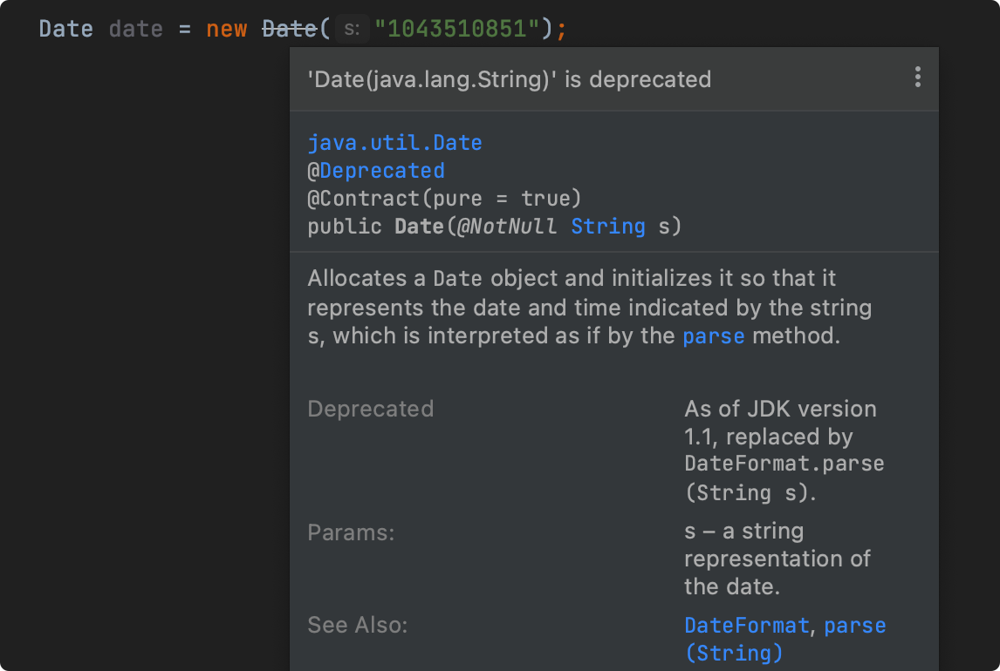

这个构造方法已经标识@Deprecated 注解了，不建议使用了，建议使用见 See Also部分。

### 113、@Repeatable注解有什么用？

##### 什么是重复注解

---

下面是JDK8中的重复注解（`java.lang annotation.Repeatable`）定义的源码。

```java
@Documented 
@Retention(RetentionPolicy.RUNTIME)
@Target(ElementType.ANNOTATION_TYPE)
public @interface Repeatable {
    Class<? extends Annotation> value();
}
```

重复注解，即一个注解可以在一个类、方法或者字段上同时使用多次，如Spring 中可以使用多个扫描组件来扫描多个包的注解。

```java
@componentscan 
@componentscan 
public class Configuration{
    
}
```

##### ComponentScan

```java
@Retention(RetentionPolicy.RUNTIME)
@Target(ElementType.TYPE)
@Documented 
@Repeatable(componentscans.class)
public @interface Componentscan {
}
```

##### ComponentScans

```java
@Retention(RetentionPolicy.RUNTIME)
@Target(ElementType.TYPE)
@Documented@Repeatable(componentscans.class)
public @interface Componentscan {
    ....
}
```

##### 重复注解实现

----

下面来演示下重复注解的实现。

```java
public static void main(string[] args) {
    for (Token token : UserToken.class.getAnnotationsByType(Token.class)) { 
        System.out.println(token.value());
    }
}
@Target(ElementType. TYPE)
@Retention(RetentionPolicy.RUNTIME) 
public @interface Tokens {
    Token[] value();
}
@Target(ElementType.TYPE)
@Retention(RetentionPolicy.RUNTIME)
@Repeatable(Tokens.class)
public @interface Token {
    String value();
}
@Token("666666")
@Token("888888")
public interface UserToken {
}
```

输出结果：

> 666666
>
> 888888

### 114、@Repeatable注解在哪里有用到？

如 Spring 中可以使用多个扫描组件来扫描多个包的注解。

```java
@componentscan
@componentscan 
public class Mainconfig {
}
```

##### @ComponentScan 源码：

```java
@Retention(RetentionPolicy.RUNTIME)
@Target(ElementType.TYPE)
@Documented@Repeatable(componentscans.class) 
public @interface Componentscan {
	...
}
```

##### @ComponentScans 源码：

```java
@Retention(RetentionPolicy.RUNTIME)
@Target(ElementType.TYPE)
@Documented 
public @interface Componentscans {
    Componentscan[] value();
}
```

### 115、OracleJDK和OpenJDK有啥区别？

##### 1、开源性质

- OpenJDK 是开源的，它是一个由 OpenJDK 社区维护的开源项目。
- Oracle JDK是Oracle 官方的，是闭源的，有条件免费使用，也含有商业服务，这对于需要长期支持和企业级服务的商业用户来说可能更具优势。

##### 2、授权协议不同

OpenJDK 采用 GPL V2 协议， 而 Oracle JDK 则采用 JRL 等多个协议。

##### 3、功能不同

OpenJDK 一般只包含最精简的 JDK，但随着 Oracle 对 JDK 的策略变化，特别是从 JDK 11 开始，Oracle JDK 和 OpenJDK 之间的差异已经变得非常小了。

##### 4、性能和兼容性

早期，Oracle JDK 因包含一些专有优化而被认为在某些情况下性能更优。但自从 Oracle JDK 和 OpenJDK 在 JDK 11 及以后版本中趋于一致以来，OpenJDK 和 Oracle JDK 在性能上没有区别。

另外，OpenJDK 和 Oracle JDK 在大多数情况下是互相兼容的，相互迁移不会引发太多兼容性问题。

### 116、JDK实现定时任务有哪些方式？

是的，不用任何框架，用我们朴素的Java 编程语言就能实现定时任务。

#### 1、sleep

----

这也是我们最常用的 sleep休眠大法，不只是当作休眠用严我们还可以利用它很轻松的能实现一个简单的定时任务。

##### 实现逻辑：

新开一个线程，添加一个for/while 死循环，然后在死循环里面添加一个sleep 休眠逻辑，让程序每隔N秒休眠再执行一次，这样就达到了一个简单定时任务的效果。

##### 实现代码如下：

```java
/**
* 休眠实现定时任务
*/
private static void sleepTask() {
    newThread((）->{
        while （true) {
            System.out.println("hi，欢迎关注：Java");
            try {
            // 每隔3秒执行一次
                Thread.sleep(3000);
            } catch(InterruptedException e) {
                e.printStackTrace();
            }
        }
    }).start();
}
```

这种方式比较傻瓜化了，只能按固定频率运行不能指定具体运行的时间。

##### 2、Timer

来看下 JDK 自带的java.util.Timer 类：


JDK1.3就内置了 java.util.Timer 类，可以用来调度 java.util.TimerTask 任务。


几个重要的方法：

- schedule：开始调度任务，提供了几个包装方法；
- cancle：终止任务调度，取消当前调度的所有任务，正在运行的任务不受影响；
- purge：从任务队列中移除所有已取消的任务；

另外，java.util.TimerTask 就是实现了 Runnable接口，具体任务逻辑则是在 run 方法里去实现。


##### 实现代码如下：

```java
private static void timerTask() throws InterruptedException {
    Timer timer = new Timer();
    
    TimerTask timerTask = new TimerTask() {
        @Override
        public void run() {
            System.out.println("hi, 欢迎关注： Java技术栈");
        }
    }
    // 第一次任务延迟时间
    long delay = 2000;
    // 任务执行频率
    long period = 3 * 1000;20
    // 开始调度
    timer.schedule(timerTask, delay, period);
    // 指定首次运行时间
    // timer.schedule(timerTask, Dateutils.addseconds(new Date(), 5), period);
    Thread.sleep(20000);
    
    // 终止并移除任务
    timer.cancel();
    timer.purge();
}
```

这种实现方式比较简单，可以指定首次执行的延迟时间、首次执行的具体日期时间，以及执行频率，能满足日常需要。另外，需要注意的是，Timer是线程安全的，因为背后是单线程在执行所有任务。

##### Timer也会有一些缺陷：

- Timer 是单线程的，假如有任务 A,B,C，任务 A 如果执行时间比较长，那么就会影响任务 B,C 的启动和执行时间，如果 B,C执行时间也比较长，那就会相互影响；
- Timer 不会捕获异常，如果A,B,C 任何一个任务在执行过程中发生异常，就会导致 Tmer 整个定时任务停止工作；
- mer是基于绝对时间调度的，而不是基于相对时间，所以它对系统时间的改变非常敏感；

所以，如果在使用 Timer 的过程中要注意这些缺陷，虽然可以用，但不推荐。

##### 3、ScheduledExecutorService

-----

因 Timer 有一些缺陷，所以不太建议使用 Timer，推荐使用 ScheduledExecutorService :


ScheduledExecutorService 即是Timer的替代者，JDK1.5 并发包引l入，是基于线程池设计的定时任务类：

> java.util.concurrent.Executors.newScheduledThreadPool


上了线程池，每个调度任务都会分配到线程池中的某一个线程去执行，任务就是并发调度执行的，任务之间互不影响。几个重要的调度方法：


- chedule：只执行一次调度；
- heduleAtFixedRate：按固定频率调度，如果执行时间过长，下一次调度会延迟，不会同时执行；
- cheduleWithFixedDelay：延迟调度，上一次执行完再加上延迟时间后执行；

另外，可以看出，任务是支持 Runnable 和 Callable 调度的。

##### 实现代码如下：

```java
public static void pooltask() {
    ScheduledExecutorservice pool = Executors.newscheduledThreadPool(10) ;
    pool.scheduleAtFixedRate(() -> {
        System.out.println("hi， 欢迎关注： Java技术栈");
    }, 2000, 3000, TimeUnit.MILLIsECONDS);
}
```

这是一个按固定频率调度的任务，创建了 10个核心线程数，首次执行延迟 2秒，后续每3秒执行一次。

这种方式简单、好用，避免了使用Timer带来的各种问题，推荐使用这种实现方式。

### 117、Java事件机制包含哪三部分？

Java 事件机制包括三个部分：事件对象、事件监听器、事件源。

##### 1、事件对象

一般继承自`java.util.Eventobject`类，封装了事件源对象及跟事件相关的信息。

##### 2、事件监听器

实现`java.util.EventListener`接口，注册在事件源上，当事件源的属性或状态改变时，取得相应的监听器调用其内部的回调方法。

##### 3、事件源

事件发生的地方，由于事件源的某项属性或状态发生了改变，导致某项事件发生。

### 118、Java中的UUID是什么？

UUID 全称：**Universally Unique Identifier**，即通用唯一识别码。

UUID是由一组**32位数的16进制数字**所构成，UUID理论上的总数为16^32=2^128，约等于3.4×10^38，也就是说若每纳秒产生1兆个 UUID，要花100亿年才会将所有UUID 用完。

UUID 的标准型式包含32个16进制数字，以连字号分为五段，形式为**8-4-4-4-12**的32个字符，如：d52fe3fb-3b50-4ef9-8bbe-ad7208343dee。

UUID 的目的是让分布式系统中的所有元素都能有一个唯一的标识符，而不需要通过中央协调来确保其唯一性。

示例代码：

```java
public static void main(string[] args) {
    //生成随机
    UUIDUUID uuid = UUID.randomUUID();
    //打印 UUID
    System.out.println(uuid);
}
```

> 市面上也有不少批量生成 UUID 在线网站。

### 119、Java日期格式中YYYY与yyyy的区别？

如 JDK 所描述：

> https://docs.oracle.com/javase/8/docs/api/java/text/SimpleDateFormat.html

| Letter | Date or Time Component                         | Presentation       | Examples                                |
| ------ | ---------------------------------------------- | ------------------ | --------------------------------------- |
| G      | Era designator                                 | Text               | AD                                      |
| y      | Year                                           | Year               | 1996 ; 96                               |
| Y      | Week year                                      | Year               | 2009; 09                                |
| M      | Month in year (context sensitive)              | Month              | July ; Jul ; 07                         |
| L      | Month in year (standalone form)                | Month              | July ; Jul ; 07                         |
| w      | Week in year                                   | Number             | 27                                      |
| W      | Week in month                                  | Number             | 2                                       |
| D      | Day in year                                    | Number             | 189                                     |
| d      | Day in month                                   | Number             | 10                                      |
| F      | Day of week in month                           | Number             | 2                                       |
| E      | Day name in week                               | Text               | Tuesday ; Tue                           |
| u      | Day number of week (1 = Monday, ., 7 = Sunday) | Number             | 1                                       |
| a      | Am/pm marker                                   | Text               | PM                                      |
| H      | Hour in day (0-23)                             | Number             | 0                                       |
| k      | Hour in day (1-24)                             | Number             | 24                                      |
| K      | Hour in am/pm (0-11)                           | Number             | 0                                       |
| h      | Hour in am/pm (1-12)                           | Number             | 12                                      |
| m      | Minute in hour                                 | Number             | 30                                      |
| s      | Second in minute                               | Number             | 55                                      |
| S      | Millisecond                                    | Number             | 978                                     |
| z      | Time zone                                      | General time zone  | Pacific Standard Time ; PST ; GMT-08:00 |
| Z      | Time zone                                      | RFC 822 time zone  | -0800                                   |
| X      | Time zone                                      | ISO 8601 time zone | -08 ;-0800 ; -08:00                     |

**y：**年，当天所在的年份

**Y：**Week year，当天所在周的年份，一周从周日开始，周六结束，只要本周跨年，那么这周就会算入到下一年。

示例代码：

```java
 public static void main(string[] args) throws Exception {
     SimpleDateFormat formatwithyYY = new SimpleDateFormat("vYYY-MM-dd");
     SimpleDateFormat formatwithYyyy = new SimpleDateFormat("yyyy-MM-dd");
     Date date = new SimpleDateFormat("yyyy-MM-dd").parse("2022-12-26");
     //输出：使用YYYY:2023-12-26
     System.out.printin("使用 yY: " + formatwithyyy.format(date));
     //输出：使用yyyy:2022-12-26
     System.out.println("使用 yyyy: " + formatwithyyyy.format(date));
 }
```

> 这里有个坑！！！
>
> 一般情况下要用 yyyy，而不是YYYY，这几年很多程序员因为用了YYYY 而出现系统漏洞，记得吸取教训l。

### 120、Java 中的 SPI机制是什么？

SPI全称：**ServiceProvider Interface**

SPI 它是Java 为服务提供者和服务加载器之间提供的一种**松耦合的连接机制**，它允许服务提供者通过配置文件来注册服务，而服务使用者可以通过SPI机制动态加载这些服务，而不需要知道服务提供者的具体实现类。


这种机制广泛应用于Java 中的很多库和框架中，比如**JDBC驱动的加载，日志框架、以及 Dubbo、Sentinel等**，都可以看到SPI 机制的应用，SPI 机制可以提高 Java 应用的可扩展性和灵活性。

### 121、SPI机制的实现流程是怎样的？

SPI机制的使用流程如下：

1、定义 SPI接口标准，服务提供者实现服务接口。

2、在`META-INF/services`目录下创建一个以服务接口全路径命名的文件。

3、在这个文件中列出实现该服务接口的具体实现类的全路径名称。

4、服务使用者通过`java.util.Serviceloader`类加载这个服务接口、加载配置文件并实例化所有列出的实现类。

------

拿 JDBC 为例，看它是怎么实现 SPl 机制的，它提供了一个`java.sql.Driver`接口，而接口的实现则需要各个数据库厂商实现，也就是在各个数据库驱动包的`META-INF/services/java.sql.Driver`文件中指定的。

如 MySQL 驱动包所示：


当调用DriverManager·getConnection 方法获取连接时，DriverManager 类内部会使用ServiceLoader 类来加载java.sql.Driver服务的实现：


加载完后，后面再负责驱动实现类的实例化。

### 122、为什么说SPI打破了双亲委派机制？

先说说双亲委派模型，双亲委派模型是类加载器的一个特性，当一个类加载器试图加载一个类时，它首先会委托给其父类加载器去尝试加载这个类，**只有在所有父类加载器不能加载时，它自己才会去加载这个类**，确保了类加载的唯一性和安全性。

如 ServiceLoader源码所示：

```java
@caller5ensitive
public static <s> Serviceloader<s> load(class<s> service) {
    Classloader cl = Thread.currentThread() .getcontextclassloader();
    return new Serviceloader<>(Reflection.getcallerclass(), service, cl);
}
```

它默认就使用当前线程上下文类加载器去加载实现类的，也就是应用类加载器。

原则上，**一个类以及这个类依赖的类应该由相同的类加载器加载**，但因为 SPI的特殊性，一些 SPI 接口，如java.sql.Driver它是由引导类加载器加载的，实现类必须依赖SPI接口，理应也由引导类加载器加载，**但引导类加载器无法加载实现类，所以不得不由应用类加载器加载，所以它就打破了双亲委派模型的规则**。

总的来说，SPI 机制的实现依赖于Java 类加载器，而类加载器自身遵循双亲委派模型，但 SPI 机制本身并不需要遵循双亲委派模型，这是由Java 类加载器底层机制决定的。

### 123、SPI接口与API接口的区别？

这两个虽然都是接口，但使用场景却截然不同：

- **APl（Application Programming Interface）**：它主要面向最终用户或开发者，它提供了一套明确的HTTP定义来实现特定的功能，强调易用性和稳定性。
- **SPl（ServiceProviderInterface）**：它则是一种服务发现机制，它允许开发者扩展和替换框架中的部分功能，更侧重于内部实现的扩展性和可替换性。

直白点说，**API 用于构建应用程序，而SPI用于框架或库的扩展开发**，API是更大维度的东西，它的内部实现可能包含SPI机制，但反过来则不大可能。

### 124、JNDI是什么？有什么用？

JNDl：**Java Naming and DirectoryInterface**，即：**Java命名和目录接口**，它专为Java应用程序提供命名和目录功能。JNDI 架构图：


如图，JNDI包含以下两部分：

##### 1、JNDI API：

Java 应用程序即是通过JNDI API来访问各种命名和目录服务的。

##### 2、JNDISPI(服务提供接口)

Java 应用程序通过 JNDI SPI 插入各种命名和目录服务的，然后通过 JNDI API 进行访问。

比如，没用JINDI 之前，你可能要在Java 代码中写死一些JDBC 的数据库配置，有了 JINDI，就可以把数据源定义一种资源，然后通过名称进行查找，示例代码如下：

```java
Connection conn = null;
try {
    Context ctx = new Initialcontext();
    Datasource ds = (Datasource) ctx.lookup("java:MysqlDatasource");
    conn = ds.getconnection();
    ...
} catch(Exception e) {
    
}finally {
    ...
}
```

当然，数据源及配置现在都是 Spring 进行管理了，这里只是介绍 JNDI 的一种用法。

##### 说白了，JNDI就是JaVa的一套规范，相当于把某个资源进行注册，再根据资源名称来查找定位资源。

-------

要使用JNDI，必须要有一个JDNI类，以及1个或者多个服务提供者（SPI），比如，在JDK 中就包含以下几个服务提供者：

- 量级目录访问协议(LDAP)
- 用对象请求代理体系结构（CORBA)
- 用对象服务命名服务(COS)
- Java 远程方法调用 (RMI)
- 域名服务 (DNS)

这里的`LDAP`协议正是频频爆漏洞的根源（如：Log4j2），攻击者屡试不爽。

### 125、LocalDateTime和Date 的区别?

LocalDateTime 是 JDK 8 中新增的时期时间类:

- LocalDateTime (日期时间)

- LocalDate (日期)
- ocalTime (时间)

最大的区别就是 Date 默认值打印可读性差：

```java
public static void main(string[] args) {
    Date date = new Date();
    LocalDateTime localDateTime = LocalDateTime.now();
    System.out.printin("小程序：Java面试库 "+ date);
    System.out.println("小程序: Java面试库 " + localDateTime);
}
```


LocalDateTime默认打印出来可读性好多了吧。

另外就是，LocalDateTime 更强，更灵活，功能上不输 Date，和 Date 的 SimpleDateFormat相比，LocalDateTime 的DateTimeFormatter是线程安全的。

```java
DateTimeFormatter dateTimeFormatter = DateTimeFormatter.ofPattern("yyyy-MM-dd H:mm:ss"); 
LocalDateTime localDateTime = LocalDateTime.now();
String datestring = localDateTime.format(dateTimeFormatter)
```

### 126、你怎么理解Java模块化？

传统的Java开发中，代码是以类和包的形式组织的，但随着应用程序变得越来越复杂，类和包的层次结构变得庞大且难以维护。

Java 9引l入了新功能：**模块系统（Jigsaw）**，旨在提供一种更好的方式来组织、管理和复用代码，模块化允许开发者将包划分为更小的单元（即模块），从而提供了更好的代码组织和模块化边界。

模块是包的集合，模块可以包含多个包，如图所示：


模块，可用于控制包的暴露方式及访问权限。

##### 模块之间，及和包、类的层级关系如下：


### 127、为什么要引入模块化？

来看 Java 9 之前的版本的 JDK 目录， 以 JDK 8 为例：


JDK 包的目录都是以 jar 包存在的，并且所有包都能外开放。

##### JDK8-会存在以下问题：

- DK包臃肿，就算不用那个jar 包也会被打包其中，比如：swing/小wt 等，万年用不到；
- 所有包都能对外公开，不方便控制包的使用权限，开发者会误用其中的API，比如：BASE64相关的类；
- ...

所以，JDK引入了模块化的功能。

来看 Java 9+ 模块化后的 JDK 目录，以 JDK 17 为例：


JDK 包的目录都是以模块（module）存在的，JDK 17中一共有 70 个模块，有些模块默认是公开的，而有些模块是需要导入的。

在 JDK 9 之前，Java 的运行时类库（Runtime Library）是由一个庞大的 rtjar 承载的，模块化后的 JDK 运行环境得到大大缩减：

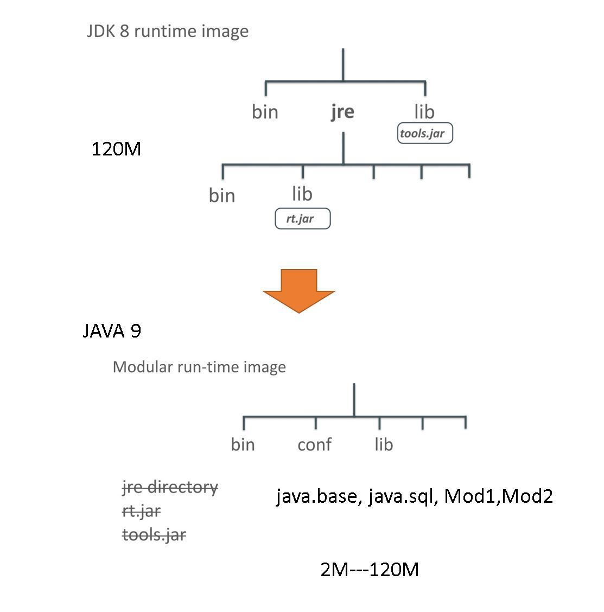

##### 模块化的优势：

1、模块化使应用变得极简，不用再依赖不需要的JDK内部包，可以自行导入使用。

2、模块化的安全性和权限控制更好，我们可以灵活控制各个模块包的暴露权限。

3、模块化可以帮助我们更好地管理项目依赖，做到包的最小引入。

4、模块化可以提供更清晰的模块化边界，松耦合变得非常容易。