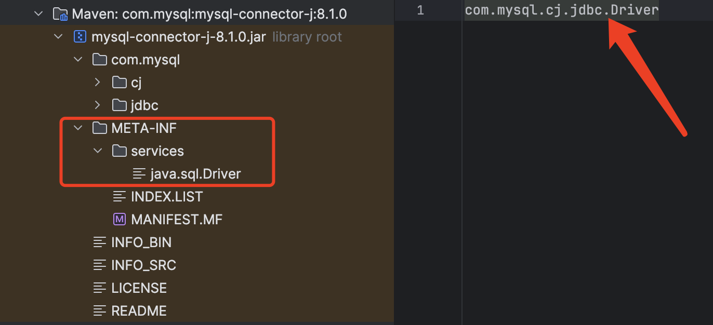

# 基础 121

### 1、面向对象编程有哪些特征？

##### 1、抽象

抽象就是对同一个目标的共有的**属性、特征、方法、功能、行为**等进行抽取并归纳总结，它是一种将复杂实现简化为模型的过程，它关注的是对象的行为，而不用关注具体的实现细节。

在面向对象编程中，抽象主要是通过**抽象类和接口**来实现的：

- 抽象类是不能被实例化的，他会包含一些抽象方法和具体实现的方法。
- 接口则是一种特殊的抽象类型，一般仅包含抽象方法的声明，在Java 8+中可以包含默认方法和静态方法实现。

抽象可以在不知道具体实现的情况下编程，提高了代码的灵活性和扩展性。

##### 2、封装（Encapsulation）

封装就是指隐藏对象的属性和实现细节，将对象的数据、属性、行为、方法等组合到一个单一的单元中，并通过访问修饰符控制成员属性的访问和修改权限，再通过特定公开的方法（比如：getter和setter方法）暴露给外面访问。

比如以下代码：

```java
private String name = "Java面试题";

public String getName() {
    return name;
}
```

name属性被private封装起来，外面只能通过对象的getName才能访问。

##### 3、继承（Inheritance）

继承是一种实现代码重用的机制，允许一个类继承另外一个类的成员和方法，使得子类也能具有父类相同的行为。

继承是通过`extends`关键字实现的：

```java
public class Dog extends Animal {
    
    @Override
    void eat() {
        System.out.println("狗吃饭")
    }
}
```


> Java类之间只能实现单继承，接口之间可以多继承。

##### 4、多态（Polymorphism）

多态即【多种形态】，指同一个行为在不同的情况下有多种不同的表现形式或形态，主要体现为同一个接口或父类的引用指向不同的实现对象，并能够在运行时动态决定调用的具体实现，这使得程序具有更好的灵活性和可扩展性。

比如下面的代码：

```java
Animal animal = new Dog();
animal.eat();   // 狗吃饭
```

通过父类引用变量指向子类时，当调用父类的方法时，它实际上会根据实际对象的类型，去调用子类中的方法，所以输出的是狗吃饭，而不是动物吃饭。

### 2、JDK与JRE的区别是什么？

#### JDK

JDK全称：Java Development Kit，是整个Java的核心，包含了Java运行环境（JRE）和一系列Java开发工具完整的包。

#### JRE

JRE全称：Java Runtime Environment，是Java程序的运行环境，包含JVM、Java核心类库等。

JRE只能用来运行Java应用程序，不能用于编译开发，它是JDK的子集。


安装完JDK后，就会有JRE目录，JRE属于JDK的子集。

### 3、如何编译和运行Java文件？

1、使用**javac**命令来编译.java文件

> javac Test.java

运行之后会生成Test.class文件

2、使用java命令来运行

> java Test

### 4、Java中的关键字有哪些？

##### Java中的关键字：

| 关键字       | 含义                           |
| ------------ | ------------------------------ |
| package      | 指定包名                       |
| import       | 引用类                         |
| class        | 定义类                         |
| interface    | 定义接口                       |
| abstract     | 抽象类或者抽象方法             |
| new          | 创建对象                       |
| this         | 实例本身                       |
| super        | 引用父类                       |
| void         | 无返回                         |
| byte         | 字节型                         |
| char         | 字符型                         |
| int          | 整型                           |
| short        | 短整型                         |
| long         | 长整型                         |
| float        | 单精度浮点数                   |
| double       | 双精度浮点数                   |
| boolean      | 布尔型                         |
| enum         | 枚举型                         |
| strictfp     | 精确浮点                       |
| extends      | 继承类                         |
| implements   | 实现接口                       |
| private      | 私有权限，本类中可用           |
| protected    | 保护权限，本包、本类和子类可用 |
| public       | 公开权限，可挎包用             |
| final        | 类不可继承，方法不可重写、常量 |
| static       | 静态属性                       |
| synchronized | 线程同步                       |
| if           | 如果                           |
| else         | 或者                           |
| for          | for循环                        |
| do           | do while循环                   |
| while        | do while循环                   |
| switch       | switch case分支                |
| case         | switch case分支                |
| default      | switch case分支                |
| break        | 结束循环                       |
| continue     | 继续循环                       |
| return       | 返回                           |
| try          | 异常代码捕获                   |
| catch        | 异常处理                       |
| finally      | 最后处理                       |
| throw        | 手动抛出一个异常               |
| throws       | 声明要抛出的异常               |
| instanceof   | 判断是否xx类的实例             |
| volatile     | 线程可见                       |
| transient    | 不用序列化                     |
| native       | 非Java实现方法                 |
| assert       | 断言                           |
| var          | 任意类型，JDK10增加            |

| 保留关键字 |      |
| ---------- | ---- |
| goto       | 跳转 |
| const      | 常量 |

| 特殊关键字 |      |
| ---------- | ---- |
| true       | 真   |
| false      | 假   |
| null       | 空值 |

### 5、Java标识符命名规则是怎样的？

（1）标识符只能由字母（a-z, A-Z）、数字（0-9）、下划线（_）和美元符号（$）组成；

（2）标识符不能以数字开头；

（3）标识符不能使用Java关键字；

（4）标识符区分大小写；

### 6、Java类命名规范是怎样的？

类名首字母大写，后面每个单词首字母大写，符合**UpperCamelCase**大驼峰式风格，如：

- Order
- OrderDetail
- OrderMonthSummary

但一般像这种众所周知的缩写例外：DO、BO、DTO、VO、AO、PO、UID等。

### 7、Java方法命名规范是怎样的？

方法名首字母小写，后面每个单词首字母大写，符合**小驼峰式**，如：

- println
- indexOf
- saveOrderInfo

### 8、Java变量命名规范是怎样的？

变量包括方法参数名、成员变量、局部变量。

变量首字母小写，后面每个单词首字母大写，符合LowerCamelCase小驼峰式风格，如：

- amount
- orderPrice
- orderStockInfo

### 9、Java常量命名规范是怎样的？

常量名全部大写，单词间用下划线（_）隔开，如：

- MAX_LIMIT
- MAX_LOOP_COUNT
- ALIPAY_PAY_URL

### 10、Java常量和变量的区别？

##### Java常量和变量的主要区别在于：

常量是一个固定的值，赋值后是不能被改变的；

变量是一个不固定的值，赋值后是可以随时被改变的；

### 11、Java怎么定义一个常量？

Java使用`final`关键字来定义一个常量，如：

```java
final int MAX_COUNT = 100;
```

也可以加修饰范围，以及静态关键字，如：

```java
private static final int MAX_COUNT = 100;
```

### 12、Java常量有几种类型？

##### Java常量有三种类型：

1、静态常量（类中）

2、成员常量（类中）

3、局部常量（类方法中）

### 13、Java有哪几种基本数据类型？

##### Java有4类8种数据类型，它们分别是：

###### 1、整型

byte、short、int、long

###### 2、浮点型

float、double

###### 3、字符型

char

###### 4、布尔型

boolean

### 14、什么是枚举类型？

Java中的枚举是一种特殊的数据类型，用于定义一组常量，枚举使用`enum`进行定义，并且可以包含零个或多个枚举常量，多个用逗号分开。

枚举常量实际上是枚举类的静态实例，编译器会为每个枚举常量生成一个私有构造函数，用于创建枚举常量的实例。枚举常量在内存中只有一个实例，确保唯一性。

> 枚举类型可以用来表示一组固定的值，例如星期几、月份、颜色等，它提供了一种更简洁、可读性更高的方式来表示一组相关的常量。

以下是一个使用枚举的示例，表示一周的星期几：

```java
enum Day {
    MONDAY,
    TUESDAY,
    WEDNESDAY,
    THURSDAY,
    FRIDAY,
    SATURDAY,
    SUNDAY
}
```

上面`Day`就是一个枚举类，它定义了七个枚举常量，分别代表一周的每一天。

每个常量还可以添加多个字段，比如我添加一个中文名称字段：

```java
public class Test {

    public static void main(String[] args) {
        Day today = Day.MONDAY;
        System.out.println("Today is " + today);
        System.out.println("Today is " + today.getChineseName());
    }

    enum Day {
        MONDAY("星期一"),
        TUESDAY("星期二"),
        WEDNESDAY("星期三"),
        THURSDAY("星期四"),
        FRIDAY("星期五"),
        SATURDAY("星期六"),
        SUNDAY("星期日");

        private String chineseName;

        Day(String chineseName) {
            this.chineseName = chineseName;
        }

        public String getChineseName() {
            return chineseName;
        }
    }
}
```

输出结果：

```
Today is MONDAY
Today is 星期一
```

### 15、枚举和类的区别？

Java中枚举和类之间的区别：

|          | 枚举                     | 类                                 |
| -------- | ------------------------ | ---------------------------------- |
| 定义方式 | 使用`enum`关键字进行声明 | 使用`class`关键字进行声明          |
| 继承关系 | 不能继承                 | 可以继承其他类                     |
| 实例化   | 枚举常量是枚举类型的实例 | 可以创建类的实例对象               |
| 可修改性 | 枚举常量是不可修改的     | 类的属性和状态可以被修改           |
| 字段     | 可以有自己的字段         | 可以有自己的字段                   |
| 方法     | 可以有自己的方法         | 可以有自己的方法                   |
| 唯一性   | 每个枚举常量是唯一的     | 可以创建多个类的实例对象           |
| 比较     | 使用“==”进行比较         | 可以通过重写`equals()`方法进行比较 |
| 用途     | 表示一组相关的常量       | 封装数据和行为，实现复杂的功能     |

### 16、枚举可以修改吗？

枚举中的常量是不可以修改的，一旦枚举常量被定义，它们的值就是固定的，不能在运行时进行修改，枚举常量是在编译时就确定了的。

比如下面的枚举类型：

```java
enum Day {
        MONDAY("星期一"),
        TUESDAY("星期二"),
        WEDNESDAY("星期三"),
        THURSDAY("星期四"),
        FRIDAY("星期五"),
        SATURDAY("星期六"),
        SUNDAY("星期日");

        private String chineseName;

        Day(String chineseName) {
            this.chineseName = chineseName;
        }

        public String getChineseName() {
            return chineseName;
        }
    }
```

在程序运行期间，这些枚举常量不能删除，也不能添加新的枚举常量，它们的值也不能修改。

但是，枚举常量的字段的值是可以修改的，比如上面的枚举中的chineseName字段，添加一个set方法：

```java
public void setChineseName(String chineseName) {
    this.chineseName = chineseName;
}
```

测试一下：

```java
public static void main(String[] args) {
    Day today = Day.MONDAY;
    Day.MONDAY.setChineseName("礼拜一");
    System.out.println("Today is " + today);
    System.out.println("Today is " + today.getChineseName());
}
```

输出结果：

```
Today is MONDAY
TOday is 礼拜一
```

但是在开发中不建议这样做，一般建议把字段定义为`final`类型，这样就不能修改了。

### 17、枚举命名规范是怎样的？

枚举就是特殊的常量类，命名和类一样。

##### 阿里开发手册推荐：

- 枚举以*Enum命名；
- 枚举字段名称全大写，单词之间使用下划线分隔；

命名示例：

> 状态枚举：StatusEnum
>
> 枚举字段：SUCCESS / FAILED / PROCESS...

### 18、==和equals比较有什么区别？

**==**

（1）如果比较的对象是基本数据类型，则比较的是数值是否相同；

（2）如果比较的对象是引用数据类型，则比较的是对象的地址是否相同。

**equals**

equals是Object类提供的方法，接收Object参数类型，如源码所示：

```java
public boolean equals(Object obj) {
    return (this == obj);
}
```

即用来比较两个对象是否相等，默认比较的是对象的地址，不能用于比较基本数据类型，但可以是包装类型，所以，如果要比较两个对象的值是否相等，一般需要重写equals和hashCode方法。

比如常用的String、Date、Integer等类都重写了equals和hashCode方法，使其比较的是存储对象的内容是否相等，而不是堆内存地址。

### 19、字符串比较是用equals还是==？为什么？

如String类源码所示，它已经重写了equals方法：


String中的equals方法是先用==比较是否同一个对象，然后再比较内容是否相同。

**所以如果要比较字符串对象的内容是否相等就用equals方法，而要比较字符串的内存地址是否相等就用==比较，不过实际情况都是比较字符串内容而不会是比较内存地址。**

如下面的示例：

```java
public static void main(String[] args) {
    String str1 = new String("java面试题");
    String str2 = new String("java面试题");

    // 两个不同字符串对象==比较，返回false
    System.out.println(str1 == str2);

    // 两个字符串内容相同equals比较，返回true
    System.out.println(str1.equals(str2));
}
```

输出结果：

```
false
true
```

### 20、Java支持xx≠null不等于写法吗？

不支持，正常的不等于写法是：`!=`

### 21、public、private、protected、默认的区别？

具体区别如下表所示：

| 作用域       | 当前类 | 当前包 | 子孙类 | 其他包 |
| ------------ | ------ | ------ | ------ | ------ |
| public       | √      | √      | √      | √      |
| protected    | √      | √      | √      |        |
| 默认（不写） | √      | √      |        |        |
| private      | √      |        |        |        |

不写为默认作用域，比如以下用来修饰成员变量：

```java
public class User {
    String name;
}
```

这个默认没有关键字，不用写。

### 22、this和super有什么区别？

##### this：代表当前对象本身：

- this(...)：调用本类的构造方法；
- this.成员变量：调用当前对象的成员变量，包括从父类继承的；
- this.成员方法(...)：调用当前对象的成员方法，包括从父类继承的；

##### super：代表当前对象的父类：

- super(...)：调用父类的构造方法；
- super.成员变量：调用父类的成员变量；
- super.成员方法(...)：调用父类的成员方法；

### 23、Java中的运算符都有那些？

Java中运算符有以下几类：

| 运算符     | 示例                                                     |
| ---------- | -------------------------------------------------------- |
| 算术运算符 | +   -   *   /   %   ++   -                               |
| 关系运算符 | ==   !=   >   <   >=   <=                                |
| 位运算符   | &   ^   ~ >>   <<   >>>                                  |
| 逻辑运算符 | &&   \|\|   !                                            |
| 赋值运算符 | =   +=   -=   *=   /=   (%)=   <<=   >>=   &=   ^=   \|= |
| 三目运算符 | ? :                                                      |

优先级从高到低排列：

| 类别     | 操作符                                                 | 关联性   |
| -------- | ------------------------------------------------------ | -------- |
| 后缀     | ()   []   .                                            | 左到右   |
| 一元     | i++   i-                                               | 从左到右 |
| 一元     | ++i   --i   +   -   ~   !                              | 从右到左 |
| 乘性     | *   /   %                                              | 左到右   |
| 加性     | +   -                                                  | 左到右   |
| 移位     | >>   >>>   <<                                          | 左到右   |
| 关系     | >   >=   <   <=                                        | 左到右   |
| 相等     | ==   !=                                                | 左到右   |
| 按位与   | &                                                      | 左到右   |
| 按位异或 | ^                                                      | 左到右   |
| 按位或   | \|                                                     | 左到右   |
| 逻辑与   | &&                                                     | 左到右   |
| 逻辑或   | \|\|                                                   | 左到右   |
| 条件     | ? :                                                    | 从右到左 |
| 赋值     | =   +=   -=   *=   /=   %=   >>=   <<=   &=   ^=   \|= | 从右到左 |
| 逗号     | ,                                                      | 左到右   |

### 24、`s1 = s1 + 1`和`s1 += 1`的区别？

如果s1原有数据类型小于int类型，则s1 = s1 + 1会发生编译异常，如下面的程序所示：


因为s1为short类型，而数字1默认为int类型，所以计算的结果则为int类型，它不能自动转换为比它更小的类型，所以会发生编译异常。

解决办法就是使用类型强制转换：

```java
public static void main(String[] args) throws Exception {
    short s1 = 1;
    s1 = (short) (s1 + 1);
    System.out.println(s1);    // s1 = 2
}
```

使用s1 += 1则不会有任何问题，因为s1 += 1支持`隐式强制类型转换`，涉及到表达式类型自动提升，会自动提升为计算结果的数据类型，如以下程序：

```java
public static void main(String[] args) throws Exception {
    short s1 = 1;
    s1 += 1;
    System.out.println(s1);   // s1 = 2
}
```

### 25、`short s1 = 1; s1 += 1;`有错吗？

没错，可以正常编译，如下图所示：


因为s1 += 1;相当于s1 = (short) (s1 + 1)，其中有隐式强制类型转换。

### 26、`short s1 = 1; s1 = s1 + 1;`有错吗？

有错，如下图所示：


因为1是int类型，因此s1 + 1运算结果也是int类型，需要强制转换类型才能赋值给short型。


### 27、`float n = 1.8`有错吗？

答案：**有错！！！**

数字1.8默认是双精度数（double），将双精度型（double）赋值给单精度型浮点型（float）属于向下转型（down-casting），会产生编译错误：


因此，需要强制类型转换：

> float n = (float) 1.8;

或者写成这种形式：

> float f = 1.8F;

F即表示float类型。

### 28、`i++`和`++i`的区别？

`i++`是先取值后再自增，`++i`是先自增后再取值，来看下面这段程序就明白了：

```java
public static void main(String[] args) {
    int i = 1;
    int j = i++ + 1;
    System.out.println(j);   // j = 2

    i = 1;
    int k = ++i + 1;
    System.out.println(k);    // k =3
}
```

程序解读：

- i++先取值再自增，所以 j = 1 + 1 = 2
- ++i先自增再取值，所以 k = 2 +1 = 3

### 29、`while`和`do while`有啥区别？

`while`和`do while`都是循环语句，不同的是，`while`是先判断条件再执行循环，而`do while`是先执行循环再判断条件：

```java
public static void main(String[] args) {
    int i = 0;
    while (i < 5) {
        System.out.println("i = " + ++i);
    }

    i = 0;
    do {
        System.out.println("i = " + ++i);
    } while (i < 5);
}
```

所以说，在同样条件下，如果初始条件不成立，do while是会多执行一次的。

### 30、如何跳出Java中的循环？

###### 可以使用以下关键字：

| 关键字   | 说明                   |
| -------- | ---------------------- |
| continue | 跳出当前本次循环       |
| break    | 跳出整个循环           |
| return   | 跳出整个循环及当前方法 |

### 31、如何跳出Java中的多层嵌套循环？

可以在最外面的循环语句前定义一个标号，然后在最里层循环体中使用`break`标号语句跳出嵌套循环。

如以下程序所示：

```java
public static void main(String[] args) {
    breakPrint:
    for (int i = 0; i < 100; i++) {
        for (int j = 0; j < 100; j++) {
            System.out.println("i=" + i + ", j=" + j);
            if (j == 66) {
                break breakPrint;
            }
        }
    }
}
```

输出结果如下：


可以看到，i只输出到0，证明多层循环被全部跳出了。

### 32、`&`和`&&`的区别？

> 逻辑判断推荐使用&&，位运算则需要使用&

&和&&都可以用作逻辑与的运算符，表示逻辑与（and），当运算符两边的表达式的结果都为true时，整个运算结果才为true，否则，只要有一方为false，则结果为false。

&&还具有短路的功能，即如果第一个表达式为false，则不再计算第二个表达式。

&还可以用作位运算符，当&操作符两边的表达式不是boolean类型时，&表示按位与操作，我们通常使用0x0f来与一个整数进行&运算，来获取该整数的最低4个bit位，例如，0x31 & 0x0f 的结果为0x01。

### 33、Java怎么进行数组初始化？

方法一：

```java
// 一维数组
int[] arr = new int[5];

// 二维数组
int[][] arr = new int[3][4];
```

方法二：

```java
// 一维数组
int[] arr = {1, 2, 3, 4, 5};
```

方法三：

```java
int[] arr = new int[]{1, 2, 3, 4, 5};
```

### 34、数组有没有length方法？Sring呢？

数组没有length()方法，但是有length属性，String有length()方法。

使用示例如下：

```java
public static void main(String[] args) {
    String str = "Java";
    String[] languages = new String[]{"java", "PHP", "GO"};
    System.out.println(str.length());
    System.out.println(languages.length);
}
```

结果输出：


### 35、怎么理解值传递和引用传递？

**值传递**：传递的是基本类型参数的字面量值的拷贝，方法对参数的修改不会影响之前参数的值。

**引用传递**：传递的是该引用的对象在堆中地址值的拷贝，而不是拷贝整个对象本身，方法对参数的修改会直接影响参数之前的值。

### 36、Java到底是值传递还是引用传递？

网上很多争议，这里解读下：

> **Java中只有值传递：**
>
> - ****对于基本数据类型，传递的是它们的实际值的副本；
> - 对于引用类型，传递的是对象的引用的值的副本，即对象的内存地址，而不是对象本身。
>
> 值传递传递的是数据的拷贝，而不是数据本身，引用类型的传递虽然可以修改引用对象的内容，但不能修改引用本身（引用类型和内存地址），所以，引用传递其实就是值传递的一种形式。

所以，严格来说，Java中只有值传递。

### 37、Java中的注释有哪些写法？

1、单行注释

```java
private int id;   // 这是ID
```

2、块注释

```java
private int id;  /* 这是ID */
```

3、文档注释

```java
/**
* 这是ID
*/
private int id;
```

### 38、Java中的构造方法是什么？

构造方法是构造类的主要方法，Java中的每个类都必须要有构造方法，构造方法名和类名相同，没有返回类型， new一个对象的时候就会调用指定的构造方法，如图：

```java
public class Test {
    private int id;

    public Test() {
        this.id = 100;
    }
}
```

如果只有一个默认的构造方法，不需要赋值初始化，则可以省略，比如：

```java
public class Test {
    
    private int id;

    public int getId() {
        return id;
    }

    public void setId(int id) {
        this.id = id;
    }
}
```

### 39、Java一个类可以有多少个构造方法？

一个类**至少要有一个**构造方法，也可以**有多个**构造方法，即构造方法重载，方法参数数量或者类型不同，如代码所示：

```java
public class Test {
    
    private int id;

    public Test() {
        this.id = 100;
    }

    public Test(int id) {
        this.id = id;
    }
}
```

如果没有显式地创建构造方法，Java编译器也会为该类提供一个默认构造方法。

### 40、`static`关键字有什么用？

static代表“**静态**”的意思，可以用来修饰：

- 静态内部类（静态内部类可以不依赖外部类实例对象而被实例化，而内部类需要在外部类实例化后才能被实例化）
- 静态方法（静态方法属于类方法，不需要实例化对象就能调用）
- 静态变量（静态变量属于类，不需要实例化对象就能调用）
- 静态代码块（静态代码块只会在类被加载时执行且执行一次）

使用实例如下：

```java
public class Test {
    static {
        System.out.println("静态代码块");
    }

    // 静态内部类
    static class Test2 {

    }

    // 静态变量
    private static int id = 0;

    // 静态方法
    public static void staticMethod() {

    }
}
```

### 41、`static`变量和普通变量地区别？

##### 1、所属目标不同

静态变量属于类的变量，普通变量属于对象的变量。

##### 2、存储区域不同

静态变量存储在方法区地静态区，普通变量存储在堆区。

> 另外：JDK7及以上，静态变量存储在其对应的Class对象中，而Class对象和其他普通对象一样，都存储在堆中的。

##### 3、加载时间不同

静态变量是随着类的加载而加载，随着类的消失而消失；

普通变量随着对象的加载而加载，随着对象的消失而消失。

##### 4、调用方式不同

静态变量只能通过类名、对象调用，普通变量只能通过对象调用。

### 42、`static`可以修饰局部变量吗？

static不能修饰局部变量，可以是内部类、全局成员变量、方法、代码块。

### 43、在`static`方法中可不可使用`this`或`super`，为什么？

在`static`方法中不可以使用`this`和`super`关键字：


因为this和super代表的是实例化后的操作对象，而static属于类级别，无法指向任何实例。

### 44、final关键字有哪些用法？

final关键字的用法如下表：

| 修饰类型 | 说明                                 |
| -------- | ------------------------------------ |
| 修饰类   | 表示该类不能被继承                   |
| 修饰方法 | 表示该方法不能被重写                 |
| 修饰变量 | 表示常量，只能复赋值一次，不能被修改 |

### 45、final、finally、finalize有什么区别？

#### final

final是修饰符：

- 如果修饰类，此类就不能被继承；
- 如果修饰方法，此方法就不能被重写；
- 如果修饰变量，此变量就不能再被改变；

#### finally

finally是try-catch-finally最后的一部分，表示不论发生任何情况都会执行的部分，finally部分可以省略，但如果finally部分存在，则一定会执行finally里面的代码（发生Error错误等非程序性异常除外）。

#### finalize

finalize是Object类的一个方法，在垃圾收集器执行的时候会自动调用被回收对象的此方法，一般不建议主动使用。

### 46、Java支持多继承吗？

Java类与类之间不支持多继承，只能单继承：


Java接口与接口之间支持多继承：


### 47、Java类可以实现多个接口吗？

可以的，一个类可以实现多个接口：


### 48、重载和重写有什么区别？

##### 方法重写

是父类与子类之间多态性的一种表现，即子类可以覆盖从父类继承的方法，重写的方法一般使用@Override标识，比如以下示例：

```java
@Override
public String toString() {
    return this.getName() + ...
}
```

这里是重写了Object祖先类的toString方法。

##### 方法重载

是一个类中方法多态性的一种表现，即一个类中可以有多个同名的方法，方法的参数类型不同，或者参数个数不同，返回类型可以相同也可以不同，比如以下实例：

```java
public Connection connection(String host) {
    ...
}

public Connection connection(String host, int port) {
    ...
}
```

同一个方法名，可以有多个不同的连接参数创建连接，这是很常见的方法重载方式。

### 49、构造器可以被重写和重载吗？

一个类的构造器只属于当前类，它不能被继承，所以它不能被重写。

一个类里面可以有多个构造器，所以它可以被重载。

### 50、私有方法能被重载或者重写吗？

##### 使用private修饰的私有方法，只可以重载，不能被子类重写。

因为private该作用域就只能在当前类中可见，子类见都见不到，别谈重写，重写至少需要protected及以上的作用域。

### 51、静态方法能被重载或者重写吗？

**静态方法可以被重载**，一个类可以存在多个同名但不同参数的static方法。

**静态方法不可以被重写**，如果子类也定义了相同的，会被子类同名的静态变量，静态方法所隐藏。

### 52、静态方法可以被继承吗？

（1）父类的静态属性、静态方法可以被子类继承；

（2）如果子类也定义了相同的静态属性、方法，那父类中的定义就会被子类同名的静态变量，静态方法所隐藏。

### 53、Java异常有哪些分类？

下面是Java异常类的组织结构，红色区域的异常类表示是程序需要显示捕捉或者抛出的。


##### Throwable

Throwable是Java异常的顶级类，所有的异常都继承于这个类。

Error，Exception是异常类的两个大分类。

##### Error

Error是非程序异常，即程序不能捕获的异常，一般是编译或者系统性的错误，如OutOfMemorry内存溢出异常等。

##### Exception

Exception是程序异常类，由程序内部产生，Exception又分为运行时异常、非运行时异常。

##### 运行时异常

运行时异常的特点是Java编译器不会检查它，也就是说，当程序中可能出现这类异常，即使没有用try-catch语句捕获它，也没有用throws子句声明抛出它，也会编译通过，运行时异常可处理或者不处理。

常见的运行时异常如NullPointException、ArrayIndexOutOfBoundsException等。

##### 非运行时异常

非运行时异常是程序必须进行处理的异常，捕获或者抛出，如果不处理程序就不能编译通过。如常见的IOException、ClassNotFoundException等。

### 54、`Error`和`Exception`有什么区别？

`Error`和`Exception`都属于异常总父类Throwable的子类：


**Error**表示系统级的错误和程序不必处理的异常，它是一种严重的非程序性的错误，比如内存溢出错误，它不能由程序控制和处理。

**Exception**则表示程序性异常，可以由程序进行定义、控制和处理。

### 55、Java中常见的异常有哪些？

##### 1、NullPointerException

空指针异常，操作一个null对象的方法或属性时会抛出这个异常。

##### 2、OutOfMemoryError

内存溢出异常，这不是程序能控制的，是指要分配的对象的内存超出了当前最大的堆内存，需要调整堆内存大小（-Xmx）以及优化程序。

##### 3、IOException

IO，即：input，output，我们在读写磁盘文件、网络内容的时候经常会发生的一种异常，这种异常是受检查异常，需要进行手工捕获。

如文件读写会抛出IOException：

```java
public int read() throws IOException
public void write(int b) throws IOException
```

##### 4、FileNotFoundException

文件找不到异常，如果文件不存在就会抛出这种异常。

如定义输入输出文件流，文件不存在会报错：

```java
public FileInputStream(File file) throws FileNotFoundException
public FileOutputstream(File file) throws FileNotFoundException
```

FileNotFoundException其实是IOException的子类，同样是受检查异常，需要进行手工捕获。

##### 5、ClassNotFoundException

类找不到异常，这是在加载类的时候抛出来的，即在类路径下不能加载指定的类。

看一个示例：

```java
public static <T> Class<T> getExistingClass(ClassLoader classLoader, String className) {
    try {
        return (Class<T>) Class.forName(className, true, classLoader);
    } catch (ClassNotFoundException e) {
        return null;
    }
}
```

它是受检查异常，需要进行手工捕获。

##### 6、ClassCastException

类转换异常，将一个不是该类的实例转换成这个类就会抛出这个异常。

如将一个数字强制转换成字符串就会报这个异常：

```java
Object x = new Integer(0);
System.out.println((String)x);
```

这是运行时异常，不需要手工捕获。

##### 7、NoSuchMethodException

没有这个方法异常，一般发生在反射调用方法的时候，如：

```java
public Method getMethod(String name, Class<?>...parameterTypes) throws NoSuchMethodException, SecurityException {
    checkMemberAccess(Member.PUBLIC, Reflection.getCallerClass(), true);
    Method method = getMethod0(name, parameterTypes, true);
    if (method == null) {
        throw new NoSuchMethodException(getName() + "." + name + argumentTypesToString(parameterTypes));
    }
    return method;
}
```

它是受检查异常，需要进行手工捕获。

##### 8、IndexOutOfBoundsException

索引越界异常，当操作一个字符串或者数组的时候经常遇到的异常。


如图所示，它是运行时异常，不需要手工捕获。

##### 9、ArithmeticException

算术异常，发生在数字的算术运算时的异常，如一个数字除以0就会报这个错。

```java
double n = 3 / 0;
```

这个异常虽然是运行时异常，可以手工捕获抛出自定义的异常，如：

```java
public static TimeStamp from(Instant instant) {
    try {
        TimeStamp stamp = new TimeStamp(instant.getEpochSecond() * MILLIS_PER_SECOND);
        stamp.nanos = instant.getNano();
        return stamp;
    } catch (ArithmeticException ex) {
        throw new IllegaArgumentException(ex);
    }
}
```

##### 10、SQLException

SQL异常，发生在操作数据库时的异常。

如下面的获取连接：

```java
public Connection getConnection() throws SQLException {
    if (getUser() == null) {
        return DriverManager.getConnection(url);
    } else {
        return DriverManager.getConnection(url, getUser(), getPassword());
    }
}
```

又或者时获取下一条记录的时候：

```java
boolean next() throws SQLException;
```

它是受检查异常，需要进行手工捕获。

### 56、Java中常见的运行时异常有哪些？

常见的运行时异常（RuntimeException）主要有：

| 异常                      | 说明             |
| ------------------------- | ---------------- |
| NullPointerException      | 空指针异常       |
| IndexOutOfBoundsException | 数组越界异常     |
| ClassCastException        | 类型强制转换异常 |
| ArithmeticException       | 算术异常         |
| SecurityException         | 违背安全原则异常 |

更多可以查看RuntimeException运行时异常类的子异常。

### 57、运行时异常与受检查异常有什么区别？

##### 运行时异常

指RuntimeException异常类及其子类，表示在程序运行时才可能发生的异常，编译器编译时不用检查，方法可以不用主动catch，也可以不用throws声明抛出运行时异常。

##### 受检查异常

指非RuntimeException类型的异常，即编译器在编译时就会检查的异常，方法需要主动catch或者用throws声明所用的受检查异常，不然会出现编译错误。

------

空指针异常是运行时异常：


在程序中可以不用声明，也不用捕获。

IO异常是受检查异常：


在程序中必须声明或者捕获。

### 58、什么时候会发生空指针异常？

当一个变量的值为null时，在Java里面表示一个不存在的空对象，没有实际内容，没有给它分配内存，null也是对象成员变量的默认值。

所以，一个对象如果没有进行初始化操作，这时候，如果你调用这个对象的方法或者变量，就会出现空指针异常。如下面示例会发生空指针异常：

```java
Object object = null;
String string = object.toString();
```


从类结构图来看，空指针它是属于运行时异常`RuntimeException`的子类，他不是捕获型的，只有在程序运行时才可能报出来，而且会造成程序中断。

### 59、你知道有哪些避免空指针的方法？

下面说几个空指针的几个最常见的案例及解决之道。

##### 1、字符串比较，常量放前面

```java
if(status.equals(SUCCESS)) {

}
```

这个时候status可能为null造成空指针异常，应该把常量放前面，就能避免空指针异常。

```java
if(SUCCESS.equals(status)) {

}
```

这个应该在各种开发规范里面都会提到，也是最基础的。

##### 2、初始化默认值

在对象初始化的时候给它一个默认值或者默认构造实现，如：

```java
User user = new User();
String name = StringUtils.EMPTY;
```

##### 3、返回空集合

在返回一个集合的话，默认会是null，统一规范返回一个空集合。

举个List例子，如：

```java
public List getUserList() {
    List list = userMapper.getUserList();
    return list == null ? new ArrayList() : list;
}
```

这样接收方就不用担心空指针异常了，也不会影响业务。

##### 4、断言

断言是用来检查程序的安全性的，在使用之前进行检查条件，如果不符合条件就报异常，符合就继续。

Java中自带的断言关键字，assert，如：

```java
assert name == null : "名称不能为空";
```

输出：

```java
Exception in thread "main" java.lang.AssertionError: 名称不正确
```

不过默认是不启动断言检查的，需要带上JVM参数：-enableassertions才能生效。

Java中这个用的很少，建议使用Spring中的，更强大，更方便好用。

Spring中的用法：

```java
Assert.notNull(name, "名称不能为空");
```

##### 5、Optional

Optional是JDK 8 新增的新特性，再也不用 `!=null`来判断了，这个在一个对象里面的多个子对象连续判断的时候非常有用。

> 这里大概介绍5种，其实还有更多，如何避免空指针，一是要注意代码编写规范，二是要提高代码素养。

### 60、`throw`和`throws`的区别？

`throw`用在方法中，用来主动抛出一个异常，`throws`则是用在方法声明中，声明方法可能会抛出的异常。

来看Object#wait方法的使用示例：

 

两个不一定要同时使用，如果方法中抛出的是RuntimeException及其子异常，则方法可以不用throws声明，否则需要强制声明，比如下面的示例：


test1方法正常编译，而test2方法抛出的不是RuntimeException类型，又没有使用throws声明抛出，所以会报编译错误：

正确修改后：

```java
public void test1() {
    throw new RuntimeException("发生异常");
}

public void test2() throws Exception {
    throw new Exception("发生异常");
}
```

### 61、`try-catch-finally`中哪个部分可以省略？

`try-catch-finally`其中`catch`和`finally`都可以被省略，但是不能同时省略，也就是说有`try`的时候，必须后面跟一个`catch`或者`finally`。

如果是资源处理类型，并且实现了AutoCloseable接口，把定义它放在try(...)中，然后方法上再加上throws异常，是可以省略catch和finally的，只需要try即可，比如：

```java
private void test() throws Exception {
    try (InputStream is = new FileInputStream("")) {
        ...
    }
}
```

### 62、Java可以一次`catch`多个异常吗？

Java 7开始可以一次catch多个异常，比如：

```java
public static void mian(String[] args) throws Exception {
    try {
        System.out.println("java面试题");
    } catch (SecurityException | NullPointerException | NoClassDefFoundError e) {

    }
}
```

### 63、使用`try-catch`会影响性能吗？

一般情况下，`try-catch`块的执行时间很短，它不会对性能产生显著的影响，但是在极端情况下，try-catch块的使用可能会对性能产生影响。比如在代码中频繁地抛出和捕获异常，尤其是在高并发的情况下，`try-catch`块的性能可能会成为瓶颈。在这种情况下，可以使用其他方式处理异常，如：**条件判断**，以提高代码的性能。

来自阿里巴巴《Java开发手册》中的异常规范：

> 异常设计的初衷是解决程序运行中的各种意外情况，且异常的处理效率比条件判断方式要低很多，所以：
>
> （1）可以通过预检查的方式规避异常，而不是依赖try-catch来处理。
>
> （2）异常捕获后不要用来做流程控制，条件控制。

### 64、`int`和`Integer`有什么区别？

##### 最主要的几点区别：

（1）int是一种基本数据类型，Integer则是int的包装类型。

（2）int的默认值是0，而Integer属于Java类，所以它的默认值是null。

（3）int可以直接使用，而Integer属于Java类，所以它需要经过实例化才能使用。

（4）Integer属于Java类，所以它的使用范围更广，比如泛型，int则不行。

### 65、什么是包装类型？有什么用？

#### 什么是包装类型

Java设计当初就提供了8种基本数据类型及对应的8种包装数据类型。我们知道Java是一种面向对象编程的高级语言，所以包装类型正是为了解决基本数据类型无法面向对象编程所提供的。

下面是基本数据类型与对应的包装类型。

| 基本数据类型 | 包装类型  |
| ------------ | --------- |
| byte         | Byte      |
| boolean      | Boolean   |
| short        | Short     |
| char         | Character |
| int          | Integer   |
| long         | Long      |
| float        | Float     |
| double       | Double    |

下面是包装类型的继承结构图。


从以上图表可以对基本类型和包装类型有一个全面的了解。

##### 包装类应用场景

###### 1、集合类泛型只能是包装类；

```java
// 编译报错
List<int> list1 = new ArrayList<>();

// 正常
List<Integer> list2 = new ArrayList<>();
```

###### 2、成员变量不能有默认值；

```java
private int status;
```

基本数据类型的成员变量都有默认值，如以上代码status默认值为0，如果定义中0代表失败，那样就会有问题，这样只能使用包装类Integer，它的默认值为null，所以就不会有默认值影响。

###### 3、方法参数允许定义空值；

```java
private static void test1(int status) {
    System.out.println(status);
}
```

看以上代码，方法参数定义的是基本数据类型int，所以必须得传一个数字过来，不能传null，很多场合我们希望是能传递null的，所以这种场合包装类比较合适。

### 66、什么是自动装箱、拆箱？

##### 自动装箱、拆箱

Java 5增加了自动装箱、拆箱机制，提供基本数据类型和包装类型的相互转换操作。

##### 自动装箱

自动装箱即自动将基本数据类型转换成包装类型，在Java 5之前，要将基本数据类型转换成包装类型只能这样做，看下面的代码：

```java
public static void main(String[] args) {
    Integer i1 = new Integer(8);   // 此种方式，Java9已标识废除
    Integer i2 = Integer.valueOf(8);

    // 自动装箱
    Integer i3 = 8;
}
```

第3种方法也正是自动装箱功能，其实自动装箱的原理就是调用包装类的`valueOf`方法，如第2个方法中的Integer.valueOf()方法。

> 另外，第一种构造器方法也不推荐使用了，已经标为废弃了。

##### 自动拆箱

自动拆箱即自动将包装类型转换成基本数据类型，与自动装箱相反，有装就有拆，很好理解，看下面的例子，

```java
public static void main(String[] args) {
    Integer i1 = new Integer(8);
    Integer i2 = Integer.valueOf(8);

    // 自动装箱
    Integer i3 = 8;

    // 自动拆箱
    int i4 = i3;
    int i5 = i3.intValue();
}
```

把i3赋值给i4就是实现的自动拆箱功能，自动拆箱的原理就是调用包装类的`xxValue`方法，如i5中的Integer的`intValue`方法。

> 自动装箱、拆箱不只是体现在以上的例子，在方法接收参数、对象设置参数时都能自动装箱拆箱。

### 67、你怎么理解Java中的强制类型转换？

强制类型转换我们再清楚不过了，即强制显示的把一个数据类型转换为另外一种数据类型。

如以下示例：

```java
short s = 199;
int i = s;   // 199

double d = 10.24;
long l1 = (long)d; // 10
```

以上的转换结果都在我们的预期之内，属于正常的转换和丢失精度的情况，下面的例子就一样属于数据溢出的情况：

```java
int ii = 300;
byte b = (byte)ii;
```

300已经超出了byte类型表示的范围，所以会转换成一个毫无意义的数字。

### 68、你怎么理解Java中的自动类型转换？

**自动类型转换**：是指数字表示范围小的数据类型可以自动转换成范围大的数据类型。

如：

```java
long l = 100;

int i = 200;
long ll = i;
```

具体自动转换如下图所示。

 

实线表示自动转换时不会造成数据丢失，虚线则可能会出现数据丢失问题。

**自动转换也要小心数据溢出问题，看下面的例子。**

```java
int count = 100000000;
int price = 1999;
long totalPrice = count * price;
```

编译没任何问题，但结果却输出的是负数，这是因为两个int相乘得到的结果是int，相乘的结果超出了int的代表范围。这种情况，一般把第一个数据转换成范围大的数据类型再和其他的数据进行运算。

```java
int count = 100000000;
int price = 1999;
long totalPrice = (long)count * price;
```

另外，向下转换时可以直接将int常量字面量赋值给byte、short、char等数据类型，而不需要强制转换，只要该常量值不超过该类型的表示范围都能自动转换。

### 69、你怎么理解Java中的类型提升？

##### 类型提升

所谓类型提升就是指在多种不同数据类型的表达式中，类型会自动向范围表示大的值的数据类型提升。

如下面的示例：

```java
long count = 100000000;
int price = 1999;
long totalPrice = price * count;
```

price为int型，count为long型，运算结果自动向上提升为long型，运算结果正常，没有出现溢出的情况。

### 70、怎么理解Java中的多态机制？

多态，即”**多种状态**“的意思，在Java中有以下几种情形。

##### 一、方法多态

- **方法重写**：是父类与子类之间多态性的一种表现，即子类可以覆盖从父类继承的方法；
- **方法重载**：是一个类中方法多态性的一种表现，即一个类中可以有多个同名的方法，方法的参数类型不同，或者参数个数不同，返回类型可以相同也可以不同。

##### 二、对象多态

- **接口和实现类**：接口可以有多种不同的实现形式；
- **抽象类和实现类**：抽象类和实现类可以有多种不同的形式；

### 71、Java如何获取用户的输入？

可以通过Scanner类来获取用户的输入，即：

java.util.Scanner。

基本语法：

```java
Scanner sc = new Scanner(System.in);
```

然后通过next()或者nextLine()方法获取输入的字符串，比如以下示例：

```java
public static void main(String[] args) {
    Scanner scanner = new Scanner(System.in);
    String text = scanner.nextLine();
    System.out.println(text);
}
```


先输入一行文字再换行，结果正常输出。

### 72、`switch`是否能用在`long`上？

长整型（long）在目前所有的版本中都是不支持的：


在开发工具中会出现编译错误，并提示可用的类型。

### 73、`switch`是否能用在`String`上？

从Java 7开始，是可以用在字符串（String）上的，来看使用示例：

```java
public static void mian(String[] args) {
    String str = "Java";
    switch (str) {
        case "C++":
            System.out.println(0);
            break;
        case "Java":
            System.out.println(1);
            break;
        default:
            System.out.println(2);
    }
}
```

程序输出：1

### 74、`switch case`支持哪几种数据类型？

java中`switch case`语句用来判断一个变量与一系列值中某个值是否相等，每个值称为一个分支。

##### 语法格式如下：

```java
switch(expression) {
    case value:
        // 语句
        break;  // 可选
    case value:
        // 语句
        break;  // 可选
    // 你可以有任意数量的case语句
    default:   // 可选
        // 语句
}
```

###### 这里的`expression`都支持那些类型呢？

- 基本数据类型：byte、short、char、int
- 包装数据类型：Byte、Short、Character、Integer
- 枚举类型：Enum
- 字符串类型：String（JDK 7+开始支持）

基本数据类型和字符串很简单不用说，下面举一个使用包装类型和枚举的，其实也不难，注意只能用在switch块里面。

```java
// 使用包装类型
Integer value = 5;
switch (value) {
    case 3:
        System.out.println("3");
        break;
    case 5:
        System.out.println("5");
        break;
    default:
        System.out.println("default");
}

// 使用枚举类型
Status status = Status.PROCESSING;
switch (status) {
    case OPEN:
        System.out.println("open");
        break;
    case PROCESSING:
        System.out.println("processing");
        break;
    case CLOSE:
        System.out.println("close");
        break;
    default:
        System.out.println("default");
}
```

以下为官网的介绍文档。

> https://docs.oracle.com/javase/tutorial/java/nutsandbolts/switch.html

**使用switch case语句也有以下几点需要注意。**

1、case里面必须跟break，不然程序会一个个case执行下去，直到最后一个break的case或者default出现；

2、case条件里面只能是常量或者字面常量；

3、default语句可有可无，最多只能有一个；

### 75、String属于基础的数据类型吗？

String是字符串类，属于Java中的“**类**”，它不属于基础数据类型。


### 76、String类的常用方法都有哪些？

String类常用的方法有：

| 方法        | 说明                     |
| ----------- | ------------------------ |
| equals      | 比较值是否相同           |
| indexOf     | 返回指定字符的索引       |
| charAt      | 返回指定索引处的字符     |
| replace     | 字符串替换               |
| trim        | 去除字符串两端空白       |
| split       | 分割字符串成数组         |
| getBytes    | 获取字符串的byte类型数组 |
| length      | 获取字符串长度           |
| toLowerCase | 转成小写字母             |
| toUpperCase | 转成大写字母             |
| subString   | 截取字符串               |

### 77、String字符串如何进行反转？

（1）最快的方法是借助StringBuilder或者StringBuffer中的reverse方法。

（2）借助字符串的charAt方法，从后到前遍历字符串，然后填充起来。

（3）借助Collections.reverse(List...)方法，先把字符串转为List然后再反转。

（4）借助其他第三方工具类，比如CollectionUtils工具类等。

### 78、String字符串如何实现编码转换？

先通过getBytes方法获取字节数组，再使用带编码的String构造器。

如代码所示，把字符串转换成UTF-8：

```java
public static void main(String[] args) throws UnsupportedEncodingException {
        String text1 = "java面试题";
        String text2 = new String(text1.getBytes(), "UTF-8");
        System.out.println(text1);
        System.out.println(text2);
    }
```

结果输出：

> java面试题
>
> java面试题

### 79、String与byte[]之间如何转换？

String > byte[]通过String类的getBytes方法：


byte[] > String通过各种String构造器：


### 80、String.trim()方法有什么用？

String.trim()用于去掉字符串**首尾**的空白字符，如下面的示例程序：

```java
public static void main(String[] args) {
        String text = "   java面试题   ";
        System.out.println(text.trim());
    }
```

输出结果：

 

它不能去除中间的空白字符。

### 81、字符串分割有哪些方式？

（1）使用字符串自身的split方法；

（2）使用JDK的StringTokenizer工具类；

（3）使用Spring/Apache commons-long等工具包中的工具类；

（4）自己可以利用indexOf方法写一个分割工具类；

### 82、字符串工具类isEmpty和isBlank的区别？

isEmpty和isBlank到底有啥区别？

##### 1、isEmpty

判断字符串是否为空字符串，只要有一个任意字符（包括空白字符）就不为空。

来看isEmpty的方法源码：

```java
public static boolean isEmpty(CharSequence cs) {
    return cs == null || cs.length() == 0;
}
```

看到没，这个方法只判断了是为null或者长度为0。

意味着，如果用户输入“ ”等空白字符，这个方法就不通过了，结果就是不为空了。

如验证输入以下内容：

| 输入内容     | 是否为空 |
| ------------ | -------- |
| "  "         | 否       |
| ""           | 是       |
| "Java面试题" | 否       |

##### 2、isBlank

判断字符串是否为空字符串，全部空字符也为空。

来看isBlank的方法源码：

```java
public static boolean isBlank(CharSequence cs) {
    int strLen = length(cs);
    if (strLen == 0) {
        return true;
    } else {
        for(int i = 0; i < strLen; ++i) {
            if (!Charracter.isWhitespace(cs.charAt(i))) {
                return false;
            }
        }
        return true;
    }
}
```

第7行，只要有一个字符不为空字符就返回false，也就是说，如果全部都为空白字符就返回true，也就是全部空白字符也为空。

如验证输入以下内容：

| 输入内容     | 是否为空 |
| ------------ | -------- |
| "   "        | 是       |
| ""           | 是       |
| "java面试题" | 否       |

这时候，如果用户输入"   "等空白字符，这个方法也返回空了，这也是大部分业务场景下我们期望出现的结果。

##### isEmpty和isBlank怎么选？

------

很明显，我们要判断一个字符串为空，绝大部分情况下“空白字符”也要为空的，严谨来说肯定要用isBlank，虽然isEmpty也可以，但如果在最前端的接口不被拦截掉，请求到了后端的服务、数据库，就可能会造成压力，甚至是系统异常，这是完全可以避免的。

但万事也没有绝对，如果你的程序可以接受任意字符，包括“空白字符”，那就要选择isEmpty，isBlank会拦截所有空白字符，就达不到要求。

与之相对应的一般还有isNotEmpty和isNotBlank，这都是对工具类的封装。

### 83、StringBuffer 和 StringBuilder的区别？

先看看StringBuffer和StringBuilder的类结构吧：

 

其实很简单，就是继承了一个抽象的字符串父类：`AbstractStringBuilder`。下面我们再来看看它们的三个区别。

##### 区别1：线程安全

StringBuffer：线程安全，StringBuilder：线程不安全。因为StringBuffer的所有公开方法都是synchronized修饰的，而StringBuilder并没有synchronized修饰。

###### StringBuffer代码片段：

```java
@Override
public synchronized StringBuffer append(String str) {
    toStringCache = null;
    super.append(str);
    return this;
}
```

##### 区别2：缓冲区

###### StringBuffer代码片段：

```java
private transient char[] toStringCache;

@Override
public syncronized String toString() {
    if (toStringCache == null) {
        toStringCache == Arrays.copyOfRange(value, 0, count);
    }
    return new String(toStringCache, true);
}
```

###### StringBuilder代码片段：

```java 
@Override
public String toString() {
    // Create a copy, don't share the array
    return new String(value, 0, count);
}
```

可以看出，StringBuffer每次获取toString都会直接使用缓存区的toStringCache值来构造一个字符串。

而StringBuilder则每次都需要复制一次字符数组，再构造一个字符串。

所以，缓冲区也是对StringBuffer的一个优化吧，不过StringBuffer的这个toString方法仍然是同步的。

##### 区别3：性能

既然StringBuffer是线程安全的，他的所有公开方法都是同步的，StringBuilder是没有方法加锁同步的，所以毫无疑问，StringBuilder的性能要远大于StringBuffer。

#### 总结

------

所以，StringBuffer适用于在多线程操作同一个StringBuffer的场景，如果是单线程场合StringBuilder更适合。

### 84、StringBuilder，StringBuffer默认容量大小？

 

 

默认都是16个字符。

 

扩容大小都是为原来的2倍 + 2个字符。

### 85、Java中的main方法有什么用？

main方法是Java程序的入口方法，在执行Java应用程序的时候会首先查找main方法，比如启动一个Spring Boot应用程序，就必须要有一个包含main方法的主类，如下所示：

```java
public static void main(String[] args) {
    SpringApplication.run(Application.class, args);
}
```

### 86、怎么向main方法传递参数？

通过一个String数组：

```java
public static main(String[] args) {
    for (int i = 0; i < args.length; i++) {
        System.out.println("args[" + i + "]=" + args[i]);
    }
}
```

命令传递方式：

> java         面试题        酷酷酷酷

在开发工具中也可以传递：

 

输出结果：

> args[0]=java
> args[1]=面试题
> args[2]=酷酷酷酷

### 87、不用main方法如何运行一个类？

不行，没有main方法不能运行Java类，main方法是Java程序的入口。

> java 7之前，可以通过使用静态初始化运行Java类，Java7+就行不通了。

### 88、Java所有类的祖先类是哪个？

Java所有类的祖先类是**java.lang.Object**类，Java中每个类都是由它拓展而来，也会继承它的所有方法。

### 89、Object类有哪些常用的方法？

Object类所有方法如下：

 

### 90、普通类和抽象类有什么区别？

##### 普通类和抽象类有什么区别：

（1）抽象类必须用abstract关键字标识，普通类则不用；

（2）抽象类可以包含abstract标识的抽象方法，抽象方法不用在抽象类中实现，普通类则不能包含抽象方法；

（3）抽象类是设计子类继承用的，不能直接通过new实例化，只能通过子类继承来实例化，或者通过匿名内部类进行实例化，普通类可以直接new实例化。

------

抽象类示例代码：

```java
public abstract class AbstractAccessLog {
    protected abstract void log(Log log) {
        
    }
}
```

### 91、静态内部类和普通内部类有什么区别？

先来看下面的示例程序，Test类中分别创建一个静态内部类和普通内部类：

```java
public class Test {
    public static class StaticInnerClass {
        
    }
    
    public class InnerClass {
        
    }
}
```

然后在其它类中进行实例化：

```java
class InnerClassTest {
    public void test() {
        // 静态内部类
        Test.StaticInnerClass staticInnerClass = new Test.StaticInnerClass();
        
        // 普通内部类
        Test.InnerClass innerClass1 = new Test.InnerClass();
        Test.InnerClass innerClass2 = new Test().new InnerClass();
    }
}
```

编译结果出来：


所以，静态内部类可以不依赖于外部类实例被实例化，而普通的内部类需要在外部类实例化后才能实例化。

### 92、静态方法可以直接调用非静态方法吗？

静态方法不可以直接调用非静态方法，静态方法调用非静态方法，需要先将对象实例化才能调用。

来看下面的示例：

```java
public static void main(String[] args) throws Exception {
    test();
}

public void test() {
    
}
```

 

修改后：

```java
public static void main(String[] args) throws Exception {
    new Test().test();
}
```

### 93、静态变量和实例变量有什么区别？

**静态变量**，即被static修饰的变量，它属于类，但不属于类的任何一个对象，一个类不管创建多少个对象，静态变量在内存中有且仅有一个拷贝，静态变量可以实现让多个对象共享内存。

**实例变量**，它属于某一对象实例，需要通过一个类的对象实例才能访问它。

```java
// 实例变量
private int id = 100;

// 静态变量
private static long maxId = 999;
```

### 94、内部类可以访问其他外部类的成员吗？

可以的，内部类可以访问创建它的外部类对象的成员，包括私有成员，来看下面的程序：

```java
public class Test {
    private int id = 100;
    
    public class InnerClass {
        /**
        * 访问外部类的私有成员
        */
        private void print() {
            System.out.println(id);
        }
        
        public static void main(String[] args) {
            Test.InnerClass innerClass = new Test().new InnerClass();
            innerClass.print();
        }
    }
}
```

结果输出：100

### 95、接口和抽象类有什么区别？

##### 区别1：

首先抽象类是一个“类”，而接口只是一个“接口”，两者的概念和应用场景不一样，这也是抽象类和接口的主要区别。

##### 区别2：

即使在Java 8中接口也能实现方法了，但却不能写构造方法，而在抽象类是可以写构造方法的，意味着抽象类是参与类的实例化过程的，而接口则不是。

##### 区别3：

抽象类可以有自己的各种成员变量，并且可以通过自己的非抽象方法进行改变，而接口中的变量默认全是`public static final`修饰的，意味着都是常量，并且不能被自己和外部修改。

##### 区别4：

接口可以实现多继承，而抽象类只能单继承。

下面我举两个例子：

```java
public class HashMap<K, V> extends AbstractMap<K, V> implements Map<K, V>, Cloneable, Serializable {
    ...
}
```

```java
public interface Connection extends Wrapper, AutoCloseable {
    ...
}
```

类与类只能单继承，而类与接口，接口与接口可以多继承。

 

Java8中的接口和抽象类的区别除了接口中可以写实现方法之外这点变化，其他的还是保持不变的。

既然接口可以写方法实现了，那么抽象类的存在貌似弱化了，因为类只能是单继承，耦合性不好，而接口可以多实现，可以灵活扩展，也不会增加类的耦合性。

### 96、抽象类必须要有抽象方法吗？

不需要，抽象类不一定非要有抽象方法，如以下示例代码：

```java
public abstract class User {
    public String getUserName () {
        return "java面试题";
    }
}
```

抽象类没有抽象方法也可以正常运行。

### 97、抽象类能使用final修饰吗？

**abstract**不能和**final**一起使用。

定义抽象类就是让其它类继承的，如果把一个类定义为final则表示该类就不能被继承，这样彼此就会产生矛盾，所以final不能修饰抽象类。

如果这样定义，在开发工具中也会提示编译错误：

 

抽象方法也是一样的道理，抽象方法也不能和final一起使用。

### 98、抽象类是否可以继承具体类？

抽象类可以继承普通类，也可以继承抽象类，来看Spring中的应用。

抽象类继承抽象类：

```java
public abstract class AbstractBeanFactoryAwareAdvisingPostProcessor extends AbstractAdvisingBeanPostProcessor implements BeanFactoryAware {
    ...
}
```

抽象类继承普通类：

```java
public abstract class AbstractAutoProxyCreator extends ProxyProcessorSupport implements SmartInstantiationAwareBeanPostProcessor, BeanFactoryAware {
    ...
}
```

### 99、抽象类是否可以实现接口？

抽象类可以实现接口，来看一个Spring中的应用：

```java
public abstract class AbstractBeanFactoryAwareAdvisingPostProcessor extends AbstractAdvisingBeanPostProcessor implements BeanFactoryAware {
    ...
}
```

### 100、如何判断一个对象是某类、接口的实例？

使用**instanceOf**关键字，比如有以下测试类：

> User：用户基类
>
> PrivateUser：私人用户子类，继承User类

判断方式如下：

```java
public static void main(String[] args) {
    PrivateUser privateUser = new PrivateUser();
    
    // true
    boolean result1 = privateUser instanceOf PrivateUser;
    
    // false
    boolean result2 = privateUser instanceOf User;
}
```

### 101、如何判断两个类或者接口之间的派生关系？

使用类的**isAssignableFrom**方法，如果当前类与指定类是否相同，或者当前类是指定类的基类或接口，则返回true，否则返回false。

比如有以下测试类：

> User：用户基类
>
> PrivateUser：私人用户子类，继承User类

判断方式如下：

```java
public static void main(String[] args) {
    // true
    boolean result1 = User.class.isAssignableFrom(PrivateUser.class);
    
    // false 
    boolean result1 = PrivateUser.class.isAssignableFrom(User.class);
}
```

User是PrivateUser的父类，所以返回true，反过来则是false。

### 102、Java创建对象，除了new关键字，你还知道哪些？

> 这里介绍创建对象的6种方式

假设有个女朋友类：

```java
@Data
@NoArgsConstructor
@AllArgsConstructor
class GirlFriend {
    private String name;
}
```

注解使用的是Lombok框架注解，方便快速开发。

##### 方法1：new一个对象

没对象就new一个吧，没错，使用new关键字，这也是Java创建对象最简单直接的方式了。

示例代码：

```java
@Test
public void girlFriend1() {
    GirlFriend girlFriend = new GirlFriend("new一个对象");
    System.out.println(girlFriend);
}
```

输出结果：

> GirlFriend(name=new一个对象)

##### 方法2：克隆一个对象

朋友有女朋友，你没有，如果可以，把别人的女朋友克隆一个吧？

让女朋友类先实现Cloneable接口，并且实现其clone()方法：

```java
@Data
@NoArgsConstructor
@AllArgsConstructor
class GirlFriend implements Cloneable {
    private String name;
    
    @Override
    protected Object clone() throws CloneNotSupportedException {
        return super.clone();
    }
}
```

> 注意：这里演示默认使用的是浅拷贝，即只可隆基本类型的字段，引用类型的需要再重写clone()方法手动赋下引用字段的值。

现在克隆一个对象，示例代码：

```java
@Test
public void girlFriend2() throws CloneNotSupportedException {
    GirlFriend girlFriend1 = new GirlFriend("克隆一个对象");
    GirlFriend girlFriend2 = （GirlFriend）girlFriend1.clone();
    System.out.println(girlFriend2);
}
```

> GirlFriend(name=克隆一个对象)

使用克隆的好处就是可以快速创建一个和原对象值一样的对象，对象的字段值一样，但是两个不同的引用。

##### 方法3：类派发一个对象（反射）

直接使用女朋友类派发一个吧：

```java
@Test
public void girlFriend3() throws InstantiationException {
    GirlFriend girlFriend = GirlFriend.class.newInstance();
    girlFriend.setName("类派发一个对象");
    System.out.println(girlFriend);
}
```

输出结果：

> GirlFriend(name=类派发一个对象)

##### 方法4：动态加载一个对象（反射）

知道女朋友类在哪里（类全路径），但却没有被加载，那就反射一个对象吧：

```java
@Test
public void girlFriend4() throws InstantiationException {
    GirlFriend girlFriend = (GirlFriend) Class.forName("cn.com.slq.GirlFriend").newInstance();
    girlFriend.setName("反射一个对象");
    System.out.println(girlFriend);
}
```

输出结果：

> GirlFriend(name=反射一个对象)

##### 方法5：构造一个对象（反射）

知道女朋友类的构造，就可以调用构造器构造一个对象：

```java
@Test
public void girlFriend5() throws NoSuchMethodException {
    GirlFriend girlFriend = GirlFriend.class.getConstructor().newInstance();
    girlFriend.setName("构造一个对象");
    System.out.println(girlFriend);
    
}
```

输出结果：

> GirlFriend(name=构造一个对象)

##### 方法6：反序列化一个对象

这个和克隆的作用类似，加入以前序列化（保存）了一个女朋友在磁盘上，现在就可以反序列化出来。

首先让女朋友可序列化，实现Serializable接口：

```java
@Data
@NoArgsConstructor
@AllArgsCOnstructor
class GirlFriend implements Cloneable, Serializable {
    private static final long serialVersionUID = 1L;
    
    private String name;
    
    @Override
    protected Object clone() throws CloneNotSupportedException {
        return super.clone();
    }
}
```

序列化/反序列化对象示例代码：

```java 
@Test
public void girlFriend6() throws IOException, ClassNotFoundException {
    GirlFriend girlFriend1 = new GirlFriend("反序列化一个对象");
    
    //序列化一个女朋友
    ObjectOutputStream objectOutputStream = new ObjectOutputStream(new FileOutputStream("gf.obj"));
    ObjectOutputStream.writeObject(girlFriend1);
    ObjectOutputStream.close();
    
    // 反序列化出来
    ObjectInputStream objectInputStream = new ObjectInputStream(new FileInputStream("gf.obj"));
    GirlFriend girlFriend2 = (GirlFriend) objectInputStream.readObject();
    ObjectInputStream.close();
    
    System.out.println(girlFriend2);
}
```

输出结果：

> GirlFriend(name=反序列化一个对象)

### 103、Java怎么生成随机数？

##### 1、Math.random

它只能生成伪随机浮点数（double），需要进行转换才能生成其他类型的随机数，它是线程安全的。

##### 2、java.util.Random

它提供了许多随机数生成选项，包括不同类型的随机数和种子设置，线程安全，但是多线程并发使用同一个实例性能不佳，它适用于并发量不高的或者单线程环境。

##### 3、java.util.concurrent.ThreadLocalRandom

它也提供了各种随机数生成选项，是多线程环境下的首选，每个线程都有自己的生成器，无需同步操作。

------

另外，推荐使用一些第三方开源工具包，没有必要重复造轮子，比如Apache的commons-lang3开发工具包中的两个工具类：

- RandomUtils
- RandomStringUtils

### 104、equals和hashCode的区别和联系？

关于**hashCode**和**equals**方法是有一些常规协定：

1、两个对象用equals()比较返回true，那么两个对象的hashCode()方法必须返回相同的结果。所以，如果重写equals()方法，则必须重写hashCode()方法，如果不重写，在Java中（比如：HashMap）会产生逻辑错误。

2、两个对象用equals()比较返回false，不要求hashCode()方法也一定返回不同的值，避免hash冲突，以提高哈希表性能。

举个例子：

> 可以把`equals`比喻为判断两本书的内容是否完全相同，而`hashCOde`就像是每本书的ISBN号。

如果两本书内容完全一样（`equals`返回`true`），那么它们的ISBN（`hashCode`的值）也应该是一样的。这样，在图书馆（类似HashMap）中就能根据ISBN快速找到相应的书。

如果两本书内容不完全一样（`equals`返回false），理论上它们的ISBN（`hashCode`的值）应该是不一样的，如果ISBN一样（`hashCode`的值），说明冲突了（`hashCode`冲突），但不影响根据ISBN来找书，只是会慢一点。

### 105、两个对象的equals方法相等，hashCode方法也会相等吗？

答案：**不一定，但是，严格意义上必须相等！！！**

> 根据Java通用约定：
>
> 两个对象equals相等，则它们的hashCode必须相等，反过来则不需要相同。

也就是说，重写了一个类的equals方法之后，必须要重写其hashCode方法，不然会出现各种潜在的问题或危害。

### 106、两个对象的hashCode方法相等，equals方法也会相等吗？

答案：**不一定。**

> 根据Java通用约定：
>
> 两个对象equals相等，则它们的hashCode必须相等，反过来则不需要相同。

因为对象的hashCode可能存在冲突的情况，即多个对象对应同一个hashCode，这在Java规范中是允许的，但是如果重写了equals方法，比较的则是对象的值，这时两个对象equals比较就可能不相同。

### 107、为什么重写equals就要重写hashCode？

**如果只重写了对象的equals方法而没有重写hashCode方法的话，就会造成对象equals相等而hashCode不相等。**

而Hash*相关的集合都是基于Hash表来实现的，比如HashMap的底层数据结构就是以数组+链表为基础的，其中的关键是数组索引下标的处理，数组的索引下标是根据传入的元素hashCode方法来决定的

**在hashCode相等的情况下：**

- 如果数组索引位置上已经有值了，值相等则进行覆盖，若不相等则加入到对应的链表中；
- 如果数组索引位置上没有值，则直接插入；

所以，如果多个equals相等的对象，而它们的hashCode不相等，它们就会不断插入到数组中，而不会进行覆盖，由此会带来Hash*相关的集合不能正常工作。

> 注意事项：
>
> 重写equals就要重写hashCode是Java编程的共识和规范。

### 108、Math.round(1.5)等于多少？


答案：2。

因为在数轴上取值时，中间值（0.5）向右取整，所以正0.5是往上取整。

### 109、Math.round(-1.5)等于多少？


答案：-1。

因为在数轴上取值时，中间值（0.5）向右取整，所以正0.5是往上取整，负0.5是直接舍弃。

### 110、什么是泛型？

JDK1.5开始引入泛型，泛型提供了编译时类型安全检测机制，可以在编译时检测到非法的类型。

泛型的本质就是参数化类型，可以用在类、接口和方法的创建中，分别称为泛型类、泛型接口、泛型方法。

如：集合类支持泛型，如果添加不符合的元素类型则会编译报错：

 

如上代码指定了泛型为String类型，添加其他类型的就会编译报错。

### 111、Java泛型中的T、R、K、V、E是什么？

常用的泛型含义如下表所示：

| 泛型 | 说明               |
| ---- | ------------------ |
| T    | Type（类型）       |
| R    | Result（结果）     |
| K    | Key（键）          |
| V    | Value（值）        |
| E    | Element（元素）    |
| N    | Number（数字）     |
| ?    | 通配符，不确定类型 |

### 112、Java有没有goto关键字？

goto是Java中的保留字，在目前版本的Java中还没有被使用，保留关键字不能用作任何标识符。

 

### 113、Java中有没有指针的概念？

Java中并没有指针的概念，指针是C和C++里面的概念，在Java中，指针已经被其他语法所取代，学习起来更加轻松。

### 114、Java中的classpath环境变量作用？

class = class + path，即Java源文件编译后的.class文件的路径。

设置classpath环境变量的作用是用于指定类的搜索路径，JVM在运行时就是通过classpath环境变量来寻找.class类文件，所以一般建议把当前应用程序的目录（.）设置为classpath环境变量。

### 115、怎么设置classpath环境变量？

Linux设置CLASSPATH环境变量：

> export CLASSPATH = .

查看classpath：

> echo $CLASSPATH

一般使用命令行编译运行需要指定classpath，在开发工具中classpath不用自己指定，由工具指定编译后的目录，它会自动搜索，如在IDEA中指定：

 

### 116、判断两个数字是否相等

以下代码的输出结果是？

```java
public class Test {
    public static void main(String[] args) {
        Integer n1 = 123;
        Integer n2 = 123;
        System.out.println(n1 == n2);
        
        Integer n3 = 128;
        Integer n4 = 128;
        System.out.println(n3 == n4);
    }
}
```

答案如下：

> true
>
> false

### 117、Java怎么获取当前系统时间戳？

在Java中可以使用以下方式来获取系统时间戳。

##### 1、使用System类（最常用）

```java
long timestamp = System.currentTimeMillis();
```

这也是最常用的获取时间戳的方法。

##### 2、使用Date类

```java
Date date = new Date();
long timestamp = date.getTime();
```

##### 3、使用Calendar类

```java
Calendar calendar = Calendar.getInstance();
long timestamp = calendar.getTimeInMillis();
```

##### 4、使用Instant类（Java8+）

这是在Java8+版本中引入的新的日期时间API，这个`Instant.now()`方法返回当前的时间戳，然后使用`toEpochMilli()`方法将时间戳转换为毫秒数。

> 以上几种方法都可以得到当前系统的时间戳，大家可以根据需要选择合适的方式来获取时间戳。
>
> 推荐使用第1、4种方法，第一种无疑是最常用的，如果是Java8+，也可以考虑使用第四种Instant类，它可以获得比第一种更强大的时间单位转换等功能。

### 118、Java怎么统计一段代码的耗时？

1、使用System.currentTimeMillis()方法获取当前时间，前后再相减就是总耗时：

```java
@Test
public void jdkWasteTime() throws InterruptedException {
    long start System.currentTimeMillis();
    Thread.sleep(3000);
    System.out.println("耗时：%dms."， System.currentTimeMillis() - start);
}
```

2、使用**StopWatch**工具类，这个在Spring/Apache commons-lang3包中都有定义，来看一个简单的使用commons-lang3包中的StopWatch使用例子：

```java
// 创建一个StopWatch实例并开始计时
StopWatch sw = StopWatch.createStarted();

 // 休眠1秒
Thread.sleep(1000);

// 1002ms
System.out.println("耗时：%dms.\n", sw.getTime());
```

# 集合 87

### 1、说说常见的集合有哪些？

**Java所有集合框架的顶级接口有两大类：**

**Collection接口和Map接口。**

Collection接口的子接口包括List接口和Set接口；

- List接口的实现类主要有：ArrayList、LinkedList、Stack、Vector...
- Set接口的实现类主要有：HashSet、TreeSet、LinkedHashSet...

Map接口的实现类主要有：

- HashMap
- TreeMap
- HashTable
- ConcurrentHashMap
- ...

### 2、常用的并发集合有哪些？

常用的并发集合有：

- ConcurrentHashMap
- ConcurrentLinkedQueue
- ConcurrentLinkedDeque
- CopyOnWriteArrayList
- CopyOnWriteArraySet
- ...

并发集合位于java.util.concurrent包下，JDK1.5之后才有的。

### 3、那些集合类可对元素随机访问？

随机访问接口：java.util.RandomAccess

 

它是List集合使用的标记接口，表示它们可以支持快速的随机访问，该接口的主要目的是允许算法在随机或顺序访问列表是改变其行为，已提供良好的性能。

实现了该接口的常用List集合如类结构图所示：

 

如ArrayList源码所示：

 

实现了该接口的集合，推荐使用`for (int i = 0, n = list.size(); i < n; i++)`方式替代`for (Iterator i = list.iterator(); i.hasNext();)`，前者要比后者遍历快。

### 4、Comparable和Comparator接口的区别？

Comparable是排序接口，如类实现了Comparable接口，并实现其排序方法，就表示该类支持排序，相当于是一个内部排序器。

假如User类实现了Comparable接口：

```java
Collections.sort(userList);
```

Comparator是比较器接口，可以新建多个Comparator接口的实现类实现自定义排序，相当于一个外部排序器。

```java
Collections.sort(userList, new Comparator<User>() {
    ...
})
```

### 5、Collection和Collections的区别？

Collection是一个集合接口，是Set、List集合类的一个顶级接口：


Collection则是集合类的一个工具类，提供了一系列静态方法，用于对集合中元素进行排序、搜索以及线程安全等各种操作。 

### 6、Enumeration和Iterator接口的区别？

##### Enumeration和Iterator接口的区别：

（1）Enumeration只能读取集合的数据，而不能删除，Iterator可以读取、删除数据，如它们的方法所示：


（2）Iterator支持fail-fast错误机制，而Enumeration不支持；

（3）在Java集合框架中，Iterator接口已经取代了Enumeration接口：


### 7、集合使用泛型有什么优点？

##### 集合使用泛型的几个优点：

1、强制集合只能容纳指定类型的对象，避免了在运行时出现ClassCastException类转换异常，因为添加了不是指定类型的元素时，在编译期间就会报错；

2、代码更整洁，使用时不需要显式转换和instanceOf操作符，取出来的就是指定类型的对象；

3、优化了JVM运行时环境，因为它不会产生类型检查的字节码指令；

### 8、List、Set、Map之间的区别是什么？

List、Set、Map的区别主要体现在数据结构、元素是否有序、元素是否可重复、键值是否为null等。

三个接口的区别如下面思维导图所示：


### 9、描述一下常用的Collection集合的类结构？

如下图所示，我列出了常用的Collection集合接口和实现类：


### 10、描述一下常用的Map集合的类结构？

如下图所示，我列出了常用的Map集合和实现类：


### 11、为什么Map接口不继承Collection接口？

因为Map继承Collection毫无意义，Collection集合中定义的是一组对象，而Map提供的是包含key-value键值对形式的集合，而不是”**一组对象**“的概念，所以它不适用Collection的定义。

### 12、常用的线程安全的Map有哪些？

下面来总结下线程安全的Map。

##### 1、Hashtable

> private Map<String, Object> map = new Hashtable<>();

来看看Hashtable的源码


Hashtable中的所有关键方法都被synchronized关键字修饰，说明它们是方法级别阻塞的，它们占用共享资源锁，所以导致同时只能一个线程操作，不能同时执行，所以这种同步的集合效率非常低，一般不建议使用这个集合。

##### 2、SynchronizedMap

> private Map<String, Object> map = Collections.synchronizedMap(new HashMap<String, Object>());

这种是直接使用工具类里面的方法创建SynchronizedMap，把传入进行的HashMap对象进行了包装同步而已，来看看它的源码：


这个同步方式实现也比较简单，看出SynchronizedMap的实现方式是加了个对象锁，每次对HashMap的操作都要先获取这个mutex的对象锁才能进入，所以性能也不会比Hashtable好到哪里去，也不建议使用。

##### 3、ConcurrentHashMap - 推荐

> private Map<String, Object> map = new ConcurrentHashMap<>();

### 13、HashMap与Hashtable的区别？

HashMap和Hashtable是Java开发程序员必须要掌握的。

##### 1、线程安全

Hashtable是线程安全的，HashMap不是线程安全的。

来看下Hashtable的源码，Hashtable所有的元素操作都是synchronized修饰的，而HashMap并没有。

```java
public synchronized V put(K key, V value);
public synchronized V get(Object key);
```

##### 2、性能优劣

既然Hashtable是线程安全的，每个方法都要阻塞其他线程，所以Hashtable性能较差，HashMap性能较好，使用更广。

如果要线程安全又要保证性能，建议使用JUC包下的ConcurrentHashMap。

##### 3、NULL

Hashtable是不允许键或值为null的，HashMap的键值则都可以为null。

为什么Hashtable是不允许KEY和VALUE为null，而HashMap则可以？

##### Hashtable put方法逻辑：

```java
public synchronized V put(K key, V value) {
    // Make sure the value is not null
    if (value == null) {
        throw new NullPointerException();
    }
    
    // Makes sure the key is not already in the hashtable.
    Entry<?, ?> tab[] = table;
    int hash = key.hashCode();
    ...
}
```

HashMap hash方法逻辑：

```java
static final int hash(Object key) {
    int h;
    return (key == null) ? 0 : (h = key.hashCode()) ^ (h >>> 16);
}
```

可以看出Hashtable key为null会直接抛出空指针异常，value为null手动抛出空指针异常，而HashMap的逻辑对null作了特殊处理。

##### 4、实现方式

Hashtable的继承源码：

```java
public class Hashtable<K, V> extends Dictionary<K, V> implements Map<K, V>, Cloneable, java.io.Serializable
```

HashMap的继承源码：

```java
public class HashMap<K, V> extends AbstractMap<K, V> implements Map<K, V>, Cloneable, Serializable
```

可以看出两者继承的类不一样，Hashtable继承了Dictionary类，而HashMap继承的是AbstractMap类。

Dictionary是JDK1.0添加的，貌似没人用过这个。

##### 5、容量扩容

HashMap的初始容量为：16，Hashtable初始容量为：11，两者的负载因子默认都是：0.75。

```java

```

当现有容量大于容量 * 负载因子时，HashMap扩容规则为当前容量翻倍，Hashtable扩容规则为当前容量翻倍 + 1。

##### 6、迭代器

HashMap中的Iterator迭代器是fail-fast的，而Hashtable的Enumerator不是fail-fast的。

所以，当其他线程改变了HashMap的结构，如：增加、删除元素，将会抛出ConcurrentModificationException异常，而Hashtable则不会。

###### 可以来看下这个区别的演示：

```java
public static void main(String[] args) {
    Map<String, String> hashtable = new Hashtable<>();
    hashtable.put("t1", "1");
    hashtable.put("t2", "2");
    hashtable.put("t3", "3");
    
    Enumeration<Map.Entry<String, String>> iterator1 = (Enumeration<Map.Entry<String, String>>) hashtable.entrySet().iterator();
    hashtable.remove(iterator1.nextElement().getKey());
    while (iterator1.hasMoreElements()) {
        System.out.println(iterator1.nextElement());
    }
    
    Map<String, String> hashMap = new HashMap<>();
    hashMap.put("h1", "1");
    hashMap.put("h2", "2");
    hashMap.put("h3", "3");
    
    Iterator<Map.Entry<String, String>> iterator2 = hashMap.entrySet().iterator();
    hashMap.remove(iterator2.next().getKey());
    while (iterator2.hasNext()) {
        System.out.println(iterator2.next());
    }
}
```

输出信息：

```
t2=2
t1=1
Exception in rhread "main" java.util.ConcurrentModificationException
at java.util.HashMap$HashIterator.nextNode(HashMap.java:1442)
at java.util.HashMap$EntryIterator.next(HashMap.java:1476)
at java.util.HashMap$EntryIterator.next(HashMap.java:1474)
at cn.javastack.Test.main(Test.java:37)

```

### 14、HashMap和TreeMap怎么选？

对于一般的K-V键值对存储和操作，HashMap是Map接口最优的选择。

如果需要对Map中的K-V进行排序，TreeMap则是最优的选择，因为HashMap本身不能支持排序。

### 15、HashMap的数据结构是什么？


JDK 1.7：数组 + 链表

JDK 1.8：数组 + 链表 + 红黑树

### 16、HashMap键可以使用对象吗？

HashMap键是可以使用对象的，如源码所示：


K-V是泛型，所以，它们可以是任意类型。

使用对象作为Key时，需要重写equals和hashCode方法，这是正确使用HashMap的基础，避免因hashCode问题导致集合出现混乱等问题。

### 17、HashMap键可以使用可变对象吗？

可以，但需要保证该对象的属性发生改变时，不会改变对象的hashCode值，如果hashCode的值发生了改变，可能HashMap再也匹配不到之前那个原始对象了。。。

### 18、HashMap在JDK 8中有哪些改变？

##### HashMap在JDK8中的改变：

（1）在JDK8中，如果某个链表的长度 >= 8，并且数组容量 >= 64，那么链表将转换为红黑树。（桶的数量必须 >= 64，小于64的时候只会扩容）

（2）当发生hash碰撞时，JDK7会在链表的头部插入，而JDK8会在链表的尾部插入；

（3）在JDK8中，Entry类被Node类替代：


### 19、JDK 8 HashMap为啥要引入红黑树？

当HashMap的key冲突过多时，比如我们使用了不好的hash算法，导致key冲突率极高，我们都知道链表的查找性能很差，**所以引入红黑树就是为了优化HashMap集合的查询性能。**


### 20、JDK 8 HashMap为什么引入红黑树，而不是AVL树？

> 在JDK 1.8中，HashMap内部使用了**红黑树来优化哈希桶中链表过长**的情况。

为什么没有选择AVL树？这是因为红黑树相对于AVL树，具有以下几个优点。

##### 1、红黑树插入和删除性能相对较好

红黑树的插入和删除操作相对于AVL树而言，红黑树的平衡调整次数较少，能够更快地完成旋转操作，相对于AVL树而言，性能更优。

但是在查询操作比较频繁地情况下，AVL树的查询性能更好，因为AVL树是更加严格的平衡树，所以查询时需要比较的次数更少。

##### 2、红黑树实现更加简单

相对于AVL树而言，红黑树的实现更加简单，不需要维护节点的平衡因子，代码实现也更加简洁。

##### 3、红黑树占用空间更少

由于AVL树需要维护节点的平衡因子，高度差会比较小，这会导致空间浪费，而红黑树不需要维护节点的平衡因子，所以高度差相对较小，占用的空间也更少。

### 21、JDK 8 HashMap什么情况会用红黑树？


如果HashMap某个链表的长度 >= 8，并且扩容后的数组长度 >= 64，就会将链表转换为红黑树，如源码所示：

```java

```


# 多线程 166

# IO 67

# JVM 131

### 1、Java为什么能一次编写，处处运行？

Java 是一种特殊的高级语言，Java 程序的运行过程必须经过**先编译、后解释** 两个步骤。

Java 源文件（java）需要先编译为字节码文件（.class），然后再由Java 虚拟机（JVM）解释执行，JVM 就作为这个转换器，可以让同一个字节码文件在不同系统平台上运行，从而实现了“**一次编译，到处运行**”的效果。

### 2、JVM 是什么？

JVM是Java Virtual Machine（Java虚拟机）的缩写。

Java 语言的一个非常重要的特点就是与平台的无关性，即跨平台，而使用虚拟机是实现这一特点的关键。

一般的高级语言如果要在不同的平台上运行，至少需要编译成不同的目标代码。而有了Java 虚拟机屏蔽了与具体平台相关的信息，使得 Java 语言在不同平台上运行时不需要重新编译。

### 3、JVM由哪些组件组成的？

JVM主要由以下几个部分组成：

- **Class Loader（类加载器）**：负责将编译后的.class 类加载到JVM 中，并在运行时解析这些类。
- **Execution Engine（执行引擎）**：执行引引擎包含解释器和即时编译器，它负责执行加载到JVM 中的字节码指令。
- **Runtime Data Area（运行时数据区）**：运行时数据区包括方法区、堆、Java 栈、本地方法栈和程序计数器等几个部分，它们负责存储程序运行时所需的数据。
- **Native MethodInterface（本地方法接口）**：本地方法接口允许Java 程序调用本地方法。
- **Java Native Interface（Java 本地接口）**：Java 本地接口允许本地方法调用Java 程序。

### 4、常用的JVM参数有哪些？

参数格式为：-XX:+参数或者-XX:-参数，“+"表示开启，“-"表示关闭，如下图所示：


以下是一些常用的 JVM 参数：


### 5、HotSpot是什么？

HotSpot 是目前使用最广泛的 JVM 实现之一，也是 Oracle JDK 和 OpenJDK 中默认的 JVM 实现。

HotSpot 是由 Sun 公司开发的一款 Java 虚拟机，它是一种基于即时编译(Just-In-Time,JIT) 技术的 JVM 实现，具有高性能和优化能力。

### 6、JVM内存区域分类哪些？

我们知道的JVM内存区域有：堆和栈，这是一种泛的分法，也是按运行时区域的一种分法，堆是所有线程共享的一块区域，而栈是线程隔离的，每个线程互不共享。


##### 线程不共享区域

----

每个线程的数据区域包括程序计数器、虚拟机栈和本地方法栈，它们都是在新线程创建时才创建的。

##### 程序计数器（ProgramCounterRerister)

程序计数器区域一块内存较小的区域，它用于存储线程的每个执行指令，每个线程都有自己的程序计数器，此区域不会有内存溢出的情况。

##### 虚拟机栈（VMStack)

虚拟机栈描述的是Java方法执行的内存模型，每个方法被执行的时候都会同时创建一个栈帧（Stack Frame）用于存储局部变量表、操作数栈、动态链接、方法出口等信息。每一个方法被调用直至执行完成的过程就对应着一个栈帧在虚拟机栈中从入栈到出栈的过程。

##### 本地方法栈(NativeMethodStack)

本地方法栈用于支持本地方法（native标识的方法，即非Java语言实现的方法）。

虚拟机栈和本地方法栈，当线程请求分配的栈容量超过JVM允许的最大容量时抛出StackOverflowError异常。线程不共享区域如下图绿色背景所示。


##### 线程共享区域

-----

线程共享区域包含：堆和方法区。

##### 堆(Heap)

堆是最常处理的区域，它存储在 JVM 启动时创建的数组和对象，JVM 垃圾收集也主要是在堆上面工作。

如果实际所需的堆超过了自动内存管理系统能提供的最大容量时抛出 OutOfMemoryError 异常。

##### 方法区（Method Area)

方法区是可供各条线程共享的运行时内存区域。存储了每一个类的结构信息，例如运行时常量池（Runtime Constant Pool）、字段和方法数据、构造函数和普通方法的字节码内容、还包括一些在类、实例、接口初始化时用到的特殊方法。

当创建类和接口时，如果构造运行时常量池所需的内存空间超过了方法区所能提供的最大内存空间后就会抛出OutOfMemoryError

##### 运行时常量池（Runtime ConstantPool)

运行时常量池是方法区的一部分，每一个运行时常量池都分配在JVM的方法区中，在类和接口被加载到JVM后，对应的运行时常量池就被创建。运行时常量池是每一个类或接口的常量池（Constant_Pool）的运行时表现形式，它包括了若干种常量：编译器可知的数值字面量到必须运行期解析后才能获得的方法或字段的引用。

如果方法区的内存空间不能满足内存分配请求，那 Java 虚拟机将抛出一个 OutOfMemoryError 异常。


栈包含Frames，当调用方法时，Frame 被推送到堆栈。一个 Frame 包含局部变量数组、操作数栈、常量池引l用。

### 7、什么是Java内存模型？

Java 内存模型，即：**Java Memory Model**，简称：**JMM**，规定了**所有的变量都存储在主内存**中，每条**线程还有自己的工作内存**，线程的工作内存中保存了该线程中是用到的变量的主内存副本拷贝，**线程对变量的所有操作都必须在工作内存中进行，而不能直接读写主内存**。

不同的线程之间也**无法直接访问对方工作内存中的变量**，线程间变量的传递均需要自己的工作内存和主存之间进行数据同步进行。


> 注意：图中描述的本地内存就是指工作内存。

### 8、Java内存模型和JVM内存模型的区别？

##### Java内存模型与JVM内存模型不是同一个概念。

JVM 内存模型是从运行时数据区的结构的角度描述的概念，而 Java 内存模型是从主内存和线程私有内存角度的描述。

##### 从以下两张图可以看出：Java内存模型：


##### JVM内存模型：


### 9、Java8中的内存结构有什么变化？

> Java8（Hotspot）移除了永久代，新增了元空间（Metaspace）。

Java 7及以前版本的 Hotspot 方法区位于永久代，同时，永久代和堆虽然是相互隔离的，但它们使用的物理内存是连续的。


而Java 8中的方法区存在于元空间中，同时，元空间不再与堆连续，而且是存在于本地内存（Native memory）。

### 10、Java8中的永久代为什么被移除了？

##### Java 8（Hotspot）移除了永久代，新增了元空间（Metaspace）。

##### 有2点原因：

1）永久代用来存储类的元数据和常量池等信息，使用的是虚拟机内存，很容易造成内存 OutOfMemoryError 异常。而元空间直接使用本地内存，默认情况下元空间是可以无限使用本地内存的，只要本地内存足够就避免了出现OutOfMemoryError异常。

2）因为 JRockit 中并没有永久代，移除永久代可以促进 HotSpot JVM 与 JRockit VM 的融合。

### 11、堆和栈区别是什么？


栈内存用来存储基本类型的变量和对象的引l用，堆内存用来存储 Java 中的对象。


栈内存归属于单个线程，每个线程都会有一个栈内存，其存储的变量只能在其所属线程中可见，即栈内存可以理解成线程的私有内存。

堆内存中的对象对所有线程可见，堆内存中的对象可以被所有线程访问。

### 12、Java中有哪几类常量池？

Java 中有 3 类常量池，它们分别是：

- cass 常量池
- 运行时常量池
- 字符串常量池

------

##### 1、class 常量池

Class 文件常量池，即静态常量池（**Constant Pool**），每一个字节码文件（.class）都会有一个Class 文件常量池。

我们可以使用以下命令查看：

> javap -v Test.class


如图，命令列出了 Test.class 文件中的 class 常量池，常量池中有字面量和符号引用等，JVM 能根据这个常量池找到要执行的类名、方法名、参数类型、字面量等类型。

##### 2、运行时常量池

运行时常量池，即：**Runtime Constant Pool**，每一个字节码文件（.class）在加载时都会对应一个运行时常量池。JVM 在运行时，会加载 class 常量池中的常量（除字符串常量）到运行时常量池中，而字符串常量会加载到字符串常量池中，class常量池中符号引用会被转化为直接引用，即真实的内存地址。

##### 3、字符串常量池

字符串常量池，即：**StringTable**，其实就是一个哈希表，它是Java 中一种特殊的运行时常量池，主要存储所有的字符串字面量和字符串对象。

每个VM只有一个字符串常量池，字符串单独划分的目的是为了提高字符串的重用性，降低内存开销。

### 13、常量池存储在哪些内存区域？

不同的JDK 版本，各个常量池存储的内存区域不同。

| 常量池       | JDK 6                      | JDK 7  | JDK 8  |
| ------------ | -------------------------- | ------ | ------ |
| class常量池  | 永久代                     | 永久代 | 元空间 |
| 运行时常量池 | 永久代                     | 永久代 | 元空间 |
| 字符串常量池 | 永久代        运行时常量池 | 堆     | 堆     |

如图所示：


### 14、运行时常量池和字符串常量池的区别？

##### 运行时常量池和字符串常量池的区别：

1、运行时常量池只是一个统称，字符串常量池也是一种特殊的运行时常量池，VM 运行时，基础类型的常量（除了字符串常量)会加载到运行时常量池中，字符串常量会单独加载到字符串常量池中。

2、在Java7之前，字符串常量池属于运行时常量池的一部分，Java 7开始，字符串常量池划到了堆中。

3、运行时常量池存储的信息更多，包括类信息、属性信息、方法信息、基础类型常量池（如：int、long）等，而字符串常量池只保存字符串常量,

4、运行时常量池每个 class 都会对应一份，而字符串常量池是全局唯一的，每个JVM 只有一份。

### 15、JVM哪块内存区域不会发生内存溢出？

##### 程序计数器（ProgramCounterRerister）不会内存溢出。

程序计数器区域一块内存较小的区域，它用于存储线程的每个执行指令，每个线程都有自己的程序计数器，此区域不会有内存溢出的情况。

### 16、JVM从GC角度看，堆的分区情况？

##### JVM从GC角度看，堆可分为：

- 新生代：Eden 区和 Survivor 区(from 区和 to 区，或者 S0, S1)
- 老年代 (Old)
- 永久代 (Java 8+为元空间，并且和堆不连续)


### 17、为什么堆要分新生代和老年代？而不是一个老年代就行？

因为堆中的大部分对象都是朝生夕死的，GC的成本很高，分为多个区以存储不同生命周期的对象，这样就可以使用针对性的GC算法和收集器，以提高 GC 性能。

### 18、为什么新生代要分成Eden和Survivor两个区？

因为新生代 Eden 区的绝大部分对象的生命周期都很短，为了避免对象过早的进入老年代，以引发老年代频繁 FullGC，所以分成Eden 区和 Survivor 区，Survivor 区则作为 Eden 区和老年代之间的一个缓冲区。

### 19、为什么新生代Survivor区又分为两个区？一个不行吗？

新生代Survivor区又分为两个区，这样是为了解决内存碎片问题。

假如只有一个 Survivor 区的流程如下:

1）新对象创建在 Eden 区中；

2）Eden 区满了就会触发一次 Minor GC，Eden 区中的存活对象就会被移动到 Survivor 区，此时 Eden 区和 Survivor 区各有一些存活对象；

3）Eden 再次满了触发 Minor GC，Survivor 区在经过垃圾回收后，Eden 区中的存活对象如果再次移动到 Survivor 区，它们所占有的内存就是不连续的，就会导致内存碎片化。

因为有了 S1区，复制算法可以保证 Eden 和 S0 两区中的存活对象一起复制到 S1区中是连续的内存空间，然后清空Eden 和 S0区，直到 S1被移动老年代，这样始终就会有一块 Survivor 是空置的，保证整个复制过程不会产生碎片。

### 20、新生代各分区的默认比例是怎样的？

新生代Eden区和 Survivor区（S0,S1）的默认比例是：8:1:1

- Eden 区占用 80%
- S0区占用10%
- S1区占用10%

### 21、哪些情况下存活对象会进入老年代？

##### 存活对象进入老年代的情况：

- nor GC 之后，如果另外一块 Survivor 区不够空间存放存活对象，则把这些对象直接移入老年代；
- 每触发一个 Minor GC，对象的年龄+1，当到达 16 次 Minor GC 的时候就会被移到老年代，也就是成功躲过了默认的 15 次Minor GC，可以通过-XX:MaxTenuringThreshold 参数设置；
- urvivor区中的一批对象如果超过了当前区域空间的50%，大于等于这批对象年龄的对象就直接进入老年代；
- 超过指定字节的大对象直接进入老年代，可以通过-XX:PretenureSizeThreshold 参数设置；

### 22、什么情况下会发生栈内存溢出？

因为栈是线程私有的，它的生命周期与线程相同，每个方法在执行的时候都会创建一个栈帧，用来存储局部变量表，操作数栈，动态链接，方法出口等信息，如果线程请求的栈深度大于虚拟机所允许的最大深度，将抛出**StackOverflowError**栈内存溢出异常，一般在方法递归调用时会造成栈内存溢出。

可以通过 JVM 参数**-Xss** 来调整栈内存的大小。

### 23、对象都是在堆上分配的吗？

不一定，满足特定条件时，它们可以在 **虚拟机栈**上分配内存。

JVM通过逃逸分析，分析出新对象的使用范围，就可能将对象在栈上进行分配。栈分配可以快速地在栈帧上创建和销毁对象，不用再将对象分配到堆空间，可以有效地减少JVM 垃圾回收的压力。

### 24、什么是直接内存？

直接内存（**Direct Memory**）就是指：**Java 堆外内存**，直接内存并不是虚拟机运行时数据区的一部分，也不是Java 虚拟机规范中定义的内存区域，与Java 堆内存不同的是，直接内存不受Java 堆大小的限制，因此在需要处理大量数据时，使用直接内存可以提高性能。

### 25、直接内存有什么用？

直接内存的好处就是为了能直接分配和释放内存，避免了在Java 堆和 native 堆中来回复制数据，通常用于处理IO 操作、网络传输和高性能计算等场景，可显著提高性能。

但需要注意的是，直接内存的分配和释放比较耗费资源，因此需要谨慎使用，如果使用不当，直接内存也会出现OutOfMemoryError 异常。

### 26、怎样访问直接内存？

在JDK 1.4 中新加入了 NIO（New Input/Output）类，引I入了一种基于通道（Channel）与缓冲区（Buffer）的I/O方式，它可以使用 native 函数库直接分配堆外内存。

直接内存的访问具体可以通过 Java NIO 库中的 **ByteBuffer** 对象来访问，先使用 **ByteBuffer.allocateDirect** 方法可以分配直接内存，然后使用**ByteBuffer.put和ByteBuffer.get** 等方法来读取和写入直接内存中的数据。

示例代码：

```java
public static void main(string[] args) {
    //分配直接缓冲区，大小为1024字节
    ByteBuffer directBuffer = ByteBuffer.allocateDirect(1024);
    //写入数据到直接缓冲区
    directBuffer.put((byte) 123);
    //切换为读模式
    directBuffer.flip();
    //从直接缓冲区读取数据
    byte value = directBuffer.get();
    //读取的值：123
    System.out.println（"读取的值："+value);
}
```

### 27、程实现一个读写直接内存的示例

如下面的示例，从直接内存读写一个字符串：


# 进阶 127

### 1、0.1 + 0.2 == 0.3正确吗？为什么？

不正确，结果为：false。

示例代码：


输出结果：

> 0.1 + 0.2 = 0.30000000000000004
>
> 0.1 + 0.2 == 0.3 ? false

因为在计算机浮点数表示中，由于精度限制，涉及小数的计算可能出现精度误差。这这种情况下，0.1和0.2的二进制表示的精度损失导致它们相加的结果与理论上的0.3略有偏差。

所以，Java中浮点数运算会存在精度丢失，不能直接运算，建议使用：**BigDecimal**。

### 2、为什么byte取值范围为-128~127？

Java设计byte类型为1个字节，1个字节占8位，即8bit，这是常识。

另外，计算机系统中是用补码来存储的，首位为0表示正数，首位为1表示负数，所以有以下结论：

- 最大的补码用二进制表示为：01111111 = 127
- 最小的补码用二进制表示为：10000000 = -128

这种设计使得`byte`类型能够在-128到127的范围内表示256个不同的值，正好是2的8次方，符合1字节（8位）的存储容量。

关于补码、原码、反码的计算原理可以自行补下基础。

##### Byte类的源码：


7是最高位，总共8bit，可以看出byte占1个字节，即8 / 8 = 1。

##### Integer源码：


31是最高位，总共32bit，可以看出int占4个字节，即32 / 8 = 4。

> 其他Short、Long的设计原理也一样。

### 3、2 * 8 最有效率的计算方法是什么？

答案：2<<3

左移3位相当于乘以2的3次方，右移相当于除以2的3次方，因为位运算CPU是直接支持的，效率是最高的。

示例代码如下：


### 4、一个“.java”源文件的类有什么限制？

我说几个常见的限制：

1、一个`.java`文件中可以有多个类，但最多只能有一个公共类（`public`类）。

2、如果`.java`文件包含一个公共类，文件名必须与公共类的名称相匹配，并且文件名的大小写也必须一致。比如，如果一个公共类命名为`UserService`，那么源文件必须命名为`UserService.java`。

3、一个文件中只能有一个包声明，如果类是某个包的一部分，包声明应该是源文件中的第一条语句，注释除外。

示例代码：


### 5、String是可变的吗？为什么？

Java中的String类是不可变的，来看下String类的源码。


可以看出String类是final类型的，String不能被继承。

其值value也就是对字符数组的封装，即char[]，其值被定义成private final的，说明不能通过外界修改，即不可变，任何对String的修改操作都会导致创建一个新的String对象，而不是更改原有的对象。

JDK 9有所变化，参考面试题：Java 9之后，String底层为什么使用byte[]，而不是char[]？

示例代码：

```java
public static void main(String[] args) {
    String s1 ="hello";
    String s2 = s1.toUpperCase();
    
    System.out.println(s1);   // 输出“hello”
    System.out.println(s2);   // 输出“HELLO”
}
```

在这个示例中，`s1.roUpperCase()`并没有改变`s1`指向的字符串内容。相反，它创建了一个新的`String`对象`s2`，其中包含了转换为大写字母后的内容，原始字符串`"hello"`保持不变。

String在Java中设计是不可变的，主要是基于**安全性、线程安全、性能优化**等考虑，频繁的字符串修改操作可能会导致较大的性能开销。

### 6、String类可以被继承吗？

String类是final修饰的，所以它不能被继承。


如果继承`String`类将导致编译错误：

```java
// 编译错误：无法从最终String进行继承
public class MyString extends String {
    // 实现细节
}
```

String类的实例一旦创建，气质就不能被改变，如果需要对字符串进行修改，实际上是创建了一个新的字符串对象。

### 7、String真的是不可变的吗？

##### String真的“不可变”吗？

来看下面这个例子：

```java
public static void main(String[] args) {
    String str = "Python";
    System.out.println(str);  // Python
    
    str = "Java";
    System.out.println(str);   // Java
    
    str = str.substring(1);
    System.out.println(str);   // ava
}
```

##### 你有可能会问：str不是由Python变成Java了吗？然后通过substring方法变成Java了吗？

这其实是初学者的一个误区，从上面看String的结构可以得知字符串是由字符数组构成的，str只是一个引用而已，第一次引用了“Python”，后面变成了“Java”，而substring也是用Arrays.copyOfRange方法重新复制字符数组构造了一个新的字符串。


所以说，这里的字符串并不是可变，只是变更了字符串引用。

##### String真的真的真的“不可变”吗？

上面的例子肯定是不可变的，下面这个就尴尬了。

```java
public static void mian(String[] args) throws Exception {
    String str = "Hello Python";
    System.out.println(str);  // Hello Python
    
    Field field = String.class.getDeclaredField("value");
    field.setAccessible(true);
    
    char[] value = (char[]) field.get(str);
    value[6] = "J";
    value[7] = "a";
    value[8] = "v";
    value[9] = "a";
    value[10] = "!";
    value[11] = "!";
    System.out.println(str);  // Hello Java!!
}
```

通过反射，我们改变了底层的字符数组的值，实现了字符串的“不可变”性，这是一种骚操作，不建议这么使用，违反了Java对String类的不可变设计原则，会造成一些安全问题。

> 注意，以上反射私有成员在Java 9+中默认不开放。

### 8、String有没有长度限制？是多少？

String是**有长度限制**的。

##### 编译期间

---

根据虚拟机规范：


编译期间，字符串额最大长度不能超越65535个字节，即编译期间的string字符串的最大长度为65534个字节， 不然就会编译报错。

##### 运行期间

---


运行期间，String最大长度就要看Integer.MAX_VALUE的值了， 即：2^31 - 1个字节。

>  不管怎样，String的最大长度都不能超过虚拟机当前最大内存设置。

### 9、String的底层实现是怎样的？

##### JDK 6

String背后是由char数组构成的，在JDK 6中，String包含三个字段：char value[]，int offset，int count，意思很简单。

substring被调用时，它会创建一个新的字符串，但字符串的值还指向堆中同样的字符数组。它们的区别只是数量和下标引用不一样，如图所示。


JDK6中的部分源码可以说明这个问题。

```java
String(int offset, int count, char value[]) {
    this.value = value;
    this.offset = offset;
    this.count = count;
}

public String substring(int beginIndex, int endIndex) {
    // check boundary
    return new String(offset + beginIndex, endIndex - deginIndex, value);
}
```

##### 会有什么问题？

如果一个很长的字符串，但是每次使用substring()，你只需要很小的一部分。这将会导致性能问题，因为只需要一小部分，却引用了整个字符数组内容。

对于JDK 6，解决方案是使用以下内容：

```java
x = x.substring(x, y) + "";
```

##### JDK 7+

JDK 6这种问题在JDK 7+中已经改善了，JDK 7+中实际是重新创建了一个字符数组，如图：


JDK7中的部分源码：

```java
// JDK 7
public String(char value[], int offset, int count) {
    // check boundary
    this.value = Array.copyOfRange(value, offset, offset + count);
}

public String substring(int beginIndex, int endIndex) {
    // check boundary
    int subLen = endIndex - beginIndex;
    return new String(value, beginIndex, subLen);
}
```

对于JDK的这种差异，我们知道就好，现在应该都是JDK 7及8了吧，其实对于小字符串的操作性能也是可以忽略不计的。

##### JDK 9+

Java 9之后，String底层采用的是byte[]数组和编码标识来识别，这里以目前最新的Java 17为示例：

```java
public final class String implements java.io.Seriaizable, comparable<String>, CharSequence, Constable, ConstantDesc {
    @Stable
    private final byte[] value;
    ...
} 
```

### 10、为什么不能用+拼接字符串？

通过多个表达式完成一个字符串拼接操作。

```java
private void test1() {
    String www = "www";
    String str = www;
    str += "javastack";
    str += "com";
}
```

字节码如下：


观察下，`NEW java/lang/StringBuilder`出现了两次，是因为我们在代码中拼接了两次，也就是说每一次拼接操作都会创建一次`StringBuilder`。

如果我们是在一个循环中进行字符串拼接，那是不是一次拼接就要创建一个`StringBuilder`？

频繁创建对象是有性能开销的，这也是为什么我们常说的字符串不能用`+`拼接，而要用那两个`sb`拼接了。

##### 什么时候可以用`+`

直接将三个字面量的字符串拼接成一个字符串。

```java
private static void test2() {
    String str = "slq1893." + "github." + "io";
}
```

字节码如下：


从字节码看出，没有任何创建`StringBuilder`的指令，直接从常量池进行取出一个完整的字符串：sql1893.github.io。很明显，这是Java编译器对代码进行了优化。

所以，通过这个示例告诉你，在这种情况下是可以用号`+`进行字符串拼接的。

这个示例可以演变成我们实际工作当中的某个SQL语句拼接的案例，如：

```java
String sql = "select name, sex, age, address" + " from t_user" + "where age > 18";
```

别说这样不行，这样是行的。

但你要是换成这样就不行了。

```java
String sql = "select name, sex, age, address";
sql += "from t_user";
sql += "where age > 18";
```

这样又回到创建多个`StringBuilder`的时候了。

也就是说，在一个表达式中完成字符串拼接是可以用`+`号完成的，因为编译器已经做了优化。

##### 小结以下

你只需要记住这两点：

1、在循环和多个表达式中不能`+`，频繁创建`sb`性能影响；

2、在单个表达式中可以用`+`，编译器直接做了优化；

### 11、字符串拼接+和concat的区别？

+和concat都可以用来拼接字符串，但在使用上有什么区别呢，先来看看这个例子。


concat源码：

　

##### 可以得出以下结论：

1、+可以是字符串或者数字及其他基本类型数据，而concat只能接收字符串。

2、+左右可以为null，concat为会空指针。

3、如果拼接空字符串，concat会稍快，在速度上两者可以忽略不计，如果拼接更多字符串建议用StringBuilder。

4、从字节码来看+号编译后就是使用了StringBuilder来拼接，所以一行+++的语句就会创建一个StringBuilder，多条+++语句就会创建多个，所以为什么建议用StringBuilder的原因。

### 12、字符串在JDK内部是用的什么编码存储？

在JDK 9之前，字符串在JDK内部存储的编码是：UTF-16，每个字符固定占用2个字节。

但这样存储英文肯定是一种浪费，所以在JDK9中对这块进行了优化。

JDK 9中的String类内部使用`byte[]`加上一个编码标记`coder`存储字符串，字符串在包含仅**Latin-1**字符时使用一个字节字符的**LATIN1**编码存储，从而减少内存占用，而包含**Unicode**字符时则使用两个字节/字符的**UTF-16**编码。

### 13、Java 9之后，String底层为什么使用byte[]，而不是char[]？

Java 8及之前使用的是char[]，char[]会占用两个字节，如果只存储`ISO-88591`之类的字符就会造成空间浪费。

Java 9+使用了压缩字符串，底层使用的是byte[]，默认值占用一个字节，如果是`ISO-8859-1`编码外的字符，则会有一个字段进行标识。

```java
@Native static final byte LATIN1 = 0;
@Native static final byte UTF16 = 1;
```

##### coder的作用：

- 变量为latin1（ISO-8859-1）时（值为：0）时，会为其分配一个字节大小的空间；
- 变量为UTF-16（值为：1）时，会为其分配两个字节大小的空间；

也就是说，它是通过coder来识别一个字符在byte[]数组中占用一个字节还是两个字节的。

> 压缩字符串默认情况下是开启的，可以设置JVM参数：-XX:-CompactStrings进行关闭。

### 14、设计自定义异常，是继承`Exception`还是`RuntimeException`？为什么？

> 在设计自定义异常时，不要使用继承Throwable的方式，它是所有错误和异常的基类，包括了Error和Exception。
>
> 应该使用Exception或者RuntimeException来继承，以便更好地表达异常地含义。
>
> 具体继承哪个，这个没有绝对的答案，完全看业务功能需要。

##### 一般自定义异常会这样设计：

##### 1、如果自定义异常是由程序逻辑错误或者参数非法等导致的

此时应该继承RuntimeException。

因为RuntimeException是不受检查异常，不用显式使用throws语句或者捕获异常处理，这样做可以全局拦截处理异常，不用再每一层方法调用中捕获或throws处理。

##### 2、如果自定义异常是由于外部因素或者系统错误等导致的

此时应该继承Exception。

继承Exception的自定义异常必须显式使用throws语句捕获异常处理，这样做可以让调用者知道该方法可能抛出的异常，并且在必要的时候做出相应的处理。

### 15、为什么不建议捕获异常用来做业务流程控制？

先来看阿里的Java开发手册：


阿里巴巴禁止使用异常捕获用来做流程控制，条件控制。

因为异常设计的初衷是解决运行中的各种意外情况，且异常的处理效率比条件判断方式要低很多。

##### 除此之外还需要考虑以下几点：

1、如果将异常用于正常的业务流程控制，系统的代码可读性会变差。

2、创建和处理异常的过程会消耗更多的系统资源，如果频繁地在业务流程中引发和捕获异常，可能会对性能产生负面影响。

3、如果使用异常作为正常的控制流程，可能会覆盖或忽略真正的异常，使得真正的问题更难被发现和调试。

### 16、main方法可以被继承吗？

Java中的**main方法是可以被子类继承的**，因为它本质上是类的一个静态方法，静态方法可以被继承。

假设有一个父类`Parent`，它有一个`main`方法：

```java
public clsss Parent {
    public static void main(String[] args) {
        System.out.println("java面试题");
    }
}
```

现在有一个子类`Child`继承自`Parent`：

```java
public class Child extends Parent {
    
}
```

如果你运行`Child`类，也会正常运行和输出结果，它实际上运行的是继承自`Parent`类的`main`方法。

### 17、main方法可以被重写和重载吗？

**main方法可以重载**，但是JVM将始终调用原始的方法，而永远不会调用重载的main方法。

示例代码：

```java
public class Test {
    // 
    public static void main(String[] args) {
        System.out.println("主 main 方法");
        main("重载的 main 方法");
    }
    
    // 重载的main方法
    public static void main(String arg) {
        System.out.println(arg);
    }
}
```

##### main方法不能重写！！！

因为main方法是静态方法，静态方法是属于类的，而不是属于类的实例的，所以静态方法在Java中不能被重写，只能被隐藏。

### 18、main方法能同步吗？

是的，`main`方法可以被同步。

在Java中，`main`方法本质上是一个静态方法，而静态方法可以被同步，同步一个静态方法标识对该类的Class对象加锁，可以防止多个线程同时执行类中的任何静态同步方法。

示例代码：

```java
public static synchronized void main(String[] args) {
    System.out.println("同步的main方法开始执行");
    // 模拟一些长时间运行的操作
    try {
        Thread.sleep(1000);  // 让当前线程暂停1秒钟
    } catch (InterruptedException e) {
        Thread.currentThread().interrupt(); // 重新设置中断状态
    }
    
    System.out.println("同步的main方法执行结束");
}
```

> ##### 需要注意的是：
>
> 以上代码只是为了说明`main`方法可以被同步，在实际开发中并不推荐这样做，因为`main`方法是程序的入口，用于启动应用程序，它不会被线程并发访问。

如果`main`方法执行了很长时间的操作，需要同步来防止并发执行，那么更好的做法是在`main`方法内同步特定的代码块，或者在其他更合适的地方进行同步，而不是直接同步整个`main`方法。	

### 19、main方法能不能改为非静态？

不能改为非静态，main方法必须声明为静态的，这样JVM才可以调用main方法而无需实例化他的类。

如果从main方法去掉**static**这个声明，示例代码：

```java
public clsaa Test {
    public void main(String[] args) {
        System.out.println("java面试题");
    }
}
```

虽然编译依然可以成功，但在运行时会导致程序出错：

> 错误：main方法不是类 cn.slq.test.Test 中的static，请将main方法定义为：
>
> public static void main(String[] args) 

### 20、main方法为什么是静态的？

main方法一定是静态的，主要的好处是**它允许JVM在不创建类实例的情况下直接调用该方法**，如果main方法是非静态的，那么在调用main方法时JVM就得实例化它的类。

这种设计简化了程序的启动过程，还有助于避免与对象状态和生命周期相关的复杂性，确保应用程序有一个清晰、一致的入口点。

### 21、main方法必须是public static void？

Java的`main`方法必须是`public static void`，原因如下。

----

##### 为什么是public？

`main`方法必须是公开的，因为它将由JVM调用，JVM通过调用类的`main`方法启动一个Java程序，如果`main`方法不是公开的，JVM将无法访问和执行它。

----

##### 为什么是static？

`main`方法是静态的，因为当调用`main`方法时，没有创建任何类的实例。

如果`main`方法不是静态的，那么JVM就必须首先创建类的实例，然后再调用`main`方法，这是不可能的，因为`main`方法是程序的入口点，必须在创建任何其他对象之前执行。

---

##### 为什么是void？

程序的结束通常是由系统或者用户决定的，而不是`main`方法决定的，所以，`main`方法不需要返回任何值。

所以，当我们编写一个Java程序时，必须包含`public static void main(String[] args)`方法，这样JVM才能找到程序的入口点，并开始执行程序。

### 22、Java语法糖是什么意思？

##### 什么是语法糖？

语法糖（）是一种编程术语，指的是在编程语言中添加的某些语法，这些语法对语言的功能行没有影响，目的是为了让开发者能够写出更加清晰和简洁的代码。

Java作为一种与平台无关的高级语言，当然也含有语法糖，这些语法糖并不被虚拟机所支持，在编译成字节码阶段就自动转换成简单常用语法。

##### 语法糖的好处：

1、语法糖让代码更简洁，更易于理解，提升了代码可读性。

2、简化的语法减少了代码编写的复杂度，从而降低了出错的机会。

3、语法糖在编译时会被转换，不影响运行时环境，保证了向后兼容性。

##### 语法糖案例

##### 1、增强型for循环

Java 5引入的增强型for循环，这是一种简化数组和集合遍历的语法糖。

```java
for (String element : array) {
    System.out.println(element);
}
```

这比传统的for循环语法更简洁，但实际上在编译时会被转换成使用迭代器或索引的形式。

##### 2、自动装箱与拆箱

Java 5 同样引入了自动装箱与拆箱机制，允许基本数据类型和它们的包装类之间自动转换。

```java
// 自动装箱，编译器会转换为Integer x = Integer.valueOf(10);
Integer x = 10;

// 自动拆箱，编译器会转换为int y = x.intValue();
int y = x;
```

在处理基本数据类型和它们的包装类时更加便捷。

##### 3、泛型

泛型是Java 5添加的另一个功能，它允许在编译时提供更加严格的类型检查，并消除代码中的类型转换。

```java
List<String> list = new ArrayList<>();
```

泛型的引入减少了大量的类型转换代码，但在编译时，泛型信息会被擦除，转换成原始类型。

##### 4、Lambda表达式

Java 8引入的Lambda表达式，提供了一种简洁的方式来编写代码。

```java
Runnable r = () -> System.out.println("java面试题");
```

使用Lambda表达式可以使代码更简洁，更易读，它们在编译后会被转换成匿名类。

##### 5、try-with-resources

这是Java 7引入的一个语法糖，用于简化资源管理，特别是在处理`java.lang.AutoCloseable`类型的资源时。

```java
try (BufferedReader br = new BufferedReader(new FileReader(path))) {
 	return br.readLine();   
}
```

资源`BufferedReader`会在try语句块结束时自动关闭，避免了显式关闭资源的需要。

等等，还有许多语法糖。。。

### 23、try里面return，finally还会执行吗？

1、不管try有没有return，finally都会执行。

2、在try中return，在finally执行前后把结果保存起来，即使在finally中有修改也以try中保存的值为准，但如果是引用类型，修改的属性会以finally修改后的为准。

3、如果try/finally都有return，直接返回finally中的return。

示例代码：

```java
public int testTryFinally () {
    try {
        // 这里的return语句会先执行，但返回的值会在finally执行后再返回
        return 10;
    } finally {
        // 这里的代码在return之后执行
        System.out.println("finally块被执行");
    }
    // 这里不会执行到
}
```

### 24、try-catch写在循环里面好还是外面好？

面试官：

> try-catch到底写在循环里面好，还是外面好？

这个问题，我相信大部分人都会答错。

##### 到底写在哪里好？

----

很多人会说当然写在循环外面好，也有一部分人说些在循环里面好， 其实这两种回答都不完全对，我们来分析两者的弊端。

##### try-catch写在循环外面的弊端：

```java
try {
    for (...) {
        // 处理逻辑
    } catch (Exception e) {
        ...
    }
}
```

如果try-catch写在循环外面，一条数据处理异常，循环结束，会导致真个任务的结束，严重影响系统效率。

##### try-catch写在循环里面的弊端：

```java
for () {
    try {
        // 处理逻辑
    } catch (Exception e) {
        ...
    }
}
```

因为异常处理会影响效率，如果try-catch写在循环里面，会造成过多的、没有必要的循环异常处理，会严重影响系统效率。

这一点阿里巴巴的《Java开发手册》异常处理中也有相关提及：


这里提到了异常的处理效率，确实相对较低，如果循环中写try-catch，异常不发生或者少发生就还好，如果异常发生较多，系统效率肯定会降低。

所以，不管写在哪里，这个要看实际情况，要结合具体业务在做出具体的选择的，并不是绝对的写在哪里就一定好或者不好。

##### 应用场景

-----

下面我总结一下两者的应用场景

##### try-catch适合写在循环外面的场景：

（1）一条数据处理异常，需要停止后面的数据处理；

（2）不能接受任意数据处理异常， 如在事务方法中，需要整体成功或者失败，这时一条数据处理异常，就需要停止循环后面的数据处理，同时需要回滚循环中所有已处理过的数据；

##### try-catch适合写在循环里面的场景：

（1）一条数据处理异常，不能影响其他数据的处理；

（2）能接受少部分的数据处理异常，而不影响整体数据处理；

如果是连接超时异常类，如果要写在循环里面，可以设置在超过N条连接超时后强制退出循环，一方面排除了网络波动，服务可能真的出现故障，这时可以避免过多没有必要的请求超时，待服务恢复后再重试；

##### 总结

---

目前没有规范说一定要写在哪里比较好，try-catch写在循环里面或者外面都可以，上面分析了两者的弊端和应用场景，我们也可以根据实际业务场景作出选择。

### 25、`void`和`Void`有什么区别？

##### void

void用于无返回值的方法定义，当你定义一个方法时，如果这个方法不需要返回任何值，就可以使用`void`作为方法的返回类型。

示例代码：

```java
public void println() {
    System.out.println("这是一个void方法，不返回任何值。");
}
```

##### Void

Void是`java.lang`包中的一个类，它是一个泛型占位符，在泛型代码中，特别是在使用泛型方法或泛型类时，如果需要标识没有任何类型，可以使用`Void`类型，一般用于指示某些操作没有返回值，特别是在使用泛型回调、Future或者反射时较为常见。

Void是一个无用类，不能创建`Void`类的实例。

以下是`Void`类的源码：

```java
public final class Void {
    @SuppressWarnings("unchecked")
    public static final Class<void> TYPE = (Class<void>) Class.getPrimitiveClass("void");
    
    private void() {}
}
```

示例代码：

```java
public Future<Void> testAsyncOperation() {
    CompletableFuture<Void> future = new CompletableFuture<>();
    
    // 异步操作完成后完成future
    return future;
}
```

### 26、Java常用的元注解有哪些？

JDK 5开始提供了4个元注解，用来定义自定义注解的注解，它们分别是：

##### @Target

指定注解使用的目标范围（类、方法、字段等），其参考值类的定义：java.lang.annotation.ElementType

##### @Documented

指定被标注的注解会包含在`javadoc`中。

##### @Retention

指定注解的生命周期（源码、class文件、运行时），其参考值见类的定义：java.lang.annatation.RetentionPolicy

##### @Inherited

指定子类可以继承父类的注解，只能是类上的注解，方法和字段的注解不能继承。即如果父类上的注解是`@Inherited`修饰的就能被子类继承。

---

##### JDK 8又提供了以下两个元注解：

##### @Native

指定字段是一个常量，其值引用native code。

##### @Repeatable

注解上可以使用重复注解，即可以在一个地方可以重复使用同一个注解，像Spring中的包扫描注解就是用了这个。

了解了JDK对注解的定义，所以想要自定义一个注解就以`@interface`开始吧。

### 27、Java金额计算怎么避免精度丢失？

##### 经典的精度丢失问题

Java中的类型float、double用来做计算会有精度丢失问题，下面来看下面的示例。

```java
public static void main(String[] args) {
    test1();
    test2();
}

private static void test1() {
    double totalAmount = 0.09;
    double feeAmount = 0.02;
    double tradAmout = totalAmout - feeAmount;
    System.out.rintln(tradeAmount);
}
```

上面的程序输出结果是多少？

0.07？非也！

正确的结果是：

> 0.0699999999999999

为什么是这样？

浮点数可能丢失精度，浮点十进制数通常没有完全相同的二进制的表示形式，这是CPU所采用的浮点数据表示形式的副作用。为此，可能会有一些精度丢失，并且一些浮点运算可能会产生未知的结果。

浮点运算很少是精确的，只要是超过精度能表示的范围就会产生误差。所以，在使用float、double作精确运算的时候一定要特别小心，除非能容忍精度丢失，不然产生的误差也是会造成双方对账不一致的结果。

##### 怎么解决

> float和double只能用来做科学计算或者是工程计算，在商业计算中我们要用java.math.BigDecimal。

BigDecimal适合更精度的运算，也提供了丰富的操作符类型，小数位控制，四舍五入规则等。

不过，使用BigDecimal不当也有精度丢失的情况，如double的构造方法：

```java
BigDecimal(double val)
```

再来看这个示例：

```java
private static void test2() {
    double totalAmout = 0.09;
    double feeAmount = 0.02;
    BigDecimal tradeAmount = new BigDecimal(totalAmount).subtract(new BigDevimal(feeAmount));
    System.out.println(tradeAmount);
}
```

输出：

> 0.0699999999999999962529972918900966760702431201934814453125

这个精度更恐怖了。。。

所以，一定要使用String的构造方法：

```java
BigDecimal(String val)
```

```java
private static void test3() {
    double totalAmout = 0.09;
    double feeAmount = 0.02;
    BigDecimal tradeAmount = new BigDecimal(String.valueOf(totalAmount))
        .subtract(new BigDecimal(String.valueOf(feeAmount)));
    System.out.println(tradeAmount);
}
```

##### 总结

1、金额运算尽量使用BigDecimal(String val)进行运算。

2、数据库存储金额，一般有整型和浮点型两种存储方式。如果有汇率转换的，建议使用浮点数decimal进行存储，可以灵活的控制精度，decimal直接对应Java类型BigDecimal。当然，用整数存储分这种形式也可以，转账的时候单位为元而如果忘了转换分为元，那就悲剧了。

### 28、Java中的>>和>>>是什么语法？有什么区别？

在Java中有三种移位操作：

- 有符号左移（`<<`）
- 有符号右移（`>>`）
- 无符号右移（`>>>`）

这些移位操作，用于将操作数的二进制表示向左或右移动指定位数。

##### 1、有符号左移（`<<`）

对于左移操作，Java只提供了一个运算符：`<<`。

当你对一个数值进行左移操作时，右侧空出的位总是用0填充，这与该数值是正数还是负数无关。所以，左移操作本质上是无符号的，所以不需要另一个专门的无符号左移（`<<<`）运算符。

示例代码：

```java
public static void main() {
    int positive = 4;  // 二进制表示：0000 0100
    int negative = -4;  // 二进制表示：1111 1100（补码形式）
    
    // 输出 8（0000 1000）
    System.out.println(positive << 1);
    
    // 输出 -8（1111 1000）
    System.out.println(negative << 1);
}
```

##### 2、有符号右移（`>>`）

`>>`是有符号右移运算符，对于正数和负数，右侧移出的位将被丢弃，而左侧空出的位将根据原始数字的符号位填充，即正数用0填充，负数用1填充。

```java
public static void main(String[] args) {
    // 二进制表示：0000 0100
    int positive = 4;
    
    // 二进制表示：1111 1100（补码形式）
    int negative = -4;
    
    // 输出2（0000 0010）
    System.out.println(positive >> 1);
    
    // 输出-2（1111 1110）
    System.out.println(negative >> 1);
}
```

##### 3、无符号右移（`>>>`）

`>>>`是无符号右移运算符，和有符号右移（`>>`）不同的是，即无论正数还是负数，右侧移出的位将被丢弃，左侧空出的位总是用0填充。

示例代码：

```java
public static void main(String[] args) {
    // 二进制表示：0000 0100
    int positive = 4;
    
    // 二进制表示：1111 1100（补码形式）
    int negative = -4;
    
    // 输出2（0000 0010）
    System.out.println(positive >>> 1);
    
    // 输出214783646（0111 1111 1111 1111 1111 1111 1111 1110）
    System.out.println(negative >>> 1);
}
```

##### 为什么是2147483646？

在32位二进制中，-4的补码表示是`0111 1111 1111 1111 1111 1111 1111 1110`，无符号右移一位（>>> 1）意味着所有位向右移动一位，最左边空出的位用0填充，所以是`0111 1111 1111 1111 1111 1111 1111 1110`，即2147483646。

----

无符号右移运算符在处理二进制数据时非常有用，尤其是在需要忽略符号位，仅对位进行操作时。它常用于位操作任务中，如编写低级网络协议、加密算法进行位级数据操作等场景。

### 29、Java类初始化顺序是怎样的？

##### 示例1：测试单类的初始化顺序

```java
public class ClassInitOrderTest {
    public static String staticField = "static field";
    
    static {
        System.out.println(staticField);
        System.out.println("static block");
    }
    
    private String field = "member field";
    
    {
        System.out.println(field);
        System.out.println("non-static block");
    }
    
    public ClassInitOrderTest() {
        System.out.println("constructor");
    }
    
    public static void main(String[] args) {
        new ClassInitOrderTest();
    }
}
```

程序输出：

> static field
>
> static block
>
> member field
>
> non-static block
>
> constructor

可以得出以下结论，单类的初始化顺序为：

> 静态变量 > 静态初始块 > 成员变量 > 非静态初始块 > 构造器

##### 示例2：测试类继承的初始化顺序

```java
class Parent {
    private static String parentStaticField = "parent static field";
    
    static {
        System.out.println(parentStaticField);
        System.out.println("parent static block");
    }
    
    private String parentField = "parent member field";
    
    {
        System.out.println(parentField);
        System.out.println("parent non-static block");
    }
    
    public Parent() {
        System.out.println("parent constructor");
    }
}


public class Child extends Parent {
    private static String childStaticField = "child static field";
    
    static {
        System.out.println(childStaticField);
        System.out.println("child static block");
    }
    
    private String childField = "child member field";
    
    {
        System.out.println(childField);
        System.out.println("child non-static block");
    }
    
    public Child() {
        System.out.println("child constructor");
    }
    
    public static void main(String[] args) {
        new Child();
    }
}
```

程序输出：

> parent static field
>
> parent static block
>
> child static field
>
> child static block
>
> parent member field
>
> parent non-static block
>
> parent constructor
>
> child member field
>
> child non-static block
>
> child constructor

可以得出以下结论，单类的初始化顺序为：

> 父类静态变量 > 父类静态初始块 > 子类静态变量 > 子类静态初始块 > 父类成员变量 > 父类非静态初始块 > 父类构造器 > 子类成员变量 > 子类非静态初始块 > 子类构造器

##### 示例3：测试成员变量、初始块的初始化顺序

从上面两个例子可以看出，父类的静态变量和静态初始块肯定是先于子类加载的。但同一个类中的静态变量与静态初始块之间，成员变量与初始块之间的顺序一定是变量先于初始块吗？继续！

```java
public class TestOrder {
    private static A a = new A();
    
    static {
        System.out.println("static block");
    }
    
    private static B b = new B();
    
    public static void main(String[] args) {
        new TestOrder();
    }
}

class A {
    public A() {
        System.out.println("static field A");
    }
}

class B {
    public B() {
        System.out.println("static field B");
    }
}
```

程序输出：

> static field A
>
> static block
>
> static field B

可以得出以下结论，单类的初始化顺序为：

> 静态变量A > 静态初始块 > 静态变量B

所以，它们的在类中的顺序就决定了它们的初始化顺序，而不是变量一定会优先于初始块。

### 30、为什么成员变量命名不建议用isXXX？

首先我们来看阿里巴巴的《Java开发手册》关于`isXXX`是怎么定义的吧：

> 【强制】POJO类中布尔类型变量都不要加is前缀，否则部分框架解析会引起序列化错误。
>
> 反例：定义为基本数据类型Boolean isDeleted的属性，他的方法也是isDeleted()，RPC框架在反向解析的时候，“误以为”对应的属性名称是deleted，导致属性获取不到，进而抛出异常。

上面的规范很容易理解吧，就是如果使用`isXXX`这种命名形式会引起潜在的异常。

##### 我们再来看一段IDE生成的getter/setter代码：

```java
public class Staff {
    private String name;
    
    private boolean graduated;
    
    private boolean isMarried;
    
    public String getName() {
        return name;
    }
    
    public void setName(String name) {
        this.name = name;
    }
    
    public boolean isGraduated() {
        return graduated;
    }
    
    public void setGraduated(boolean graduated) {
        this.graduated = graduated;
    }
    
    public boolean isMarried() {
        return isMarried;
    }
    
    public void setMarried(boolean married) {
        isMarried = married;
    }
    
}
```

变量`isMarried`生成的getter/setter方法是：isMarried/setMarried，有些框架就会去找对应的`married`变量，然后就找不到了。。。

再看变量`graduated`，因为都是boolean变量，所有生成的逻辑和`isMarried`一样，根据上述规范，它不会产生找不着值得情况，这也是为什么不建议使用`isXXX`的命名形式。

### 31、hashCode有什么用？

hashCode是根据对象的地址算出来的一个int数字，即对象的哈希值，代表了该对象在内存中的物理存储位置。

Object顶级类提供了一个hashCode()方法，

```java
public native int hashCode();
```

根据协定，所有类在重写equals方法时必须重写hashCode()方法，不然会导致潜在的程序危害。

hashCode主要用于优化基于哈希表的数据结构的性能，如`HashMap`、`HashSet`和`HashTable`，具有相同内容的对象应该返回相同的hashCode值，通过hashCode，哈希表能够快速定位键或对象的存储位置，这使得查找、插入和删除操作非常高效。

### 32、hashCode和identityHashCode的区别？

identityHashCode是System类里面提供的本地方法：

```java
@IntrinsicCandidate
public static native int identityHashCode(Object x);
```

hashCode方法可以被重写，hashCode()方法返回的是重写后的值。

##### identityHashCode和hashCode的区别是：

identityHashCode会返回对象的原始hashCode，而不管对象是否重写了hashCode方法。

---

测试代码：

```java
public class Test {
    public static void main(String[] args) {
        String str1 = new String("abc");
        String str2 = new String("abc");
        
        System.out.println("str1 hashCode:" + str1.hashCode());
        System.out.println("str2 hashCode:" + str2.hashCode());
        System.out.println("str1 identityHashCode:" + System.identityHashCode(str1));
        System.out.println("str2 identityHashCode:" + System.identityHashCOde(str2));
        
        User user = new User("test", 1);
        System.out.println("user hashCode:" + user.hashCode());
        System.out.println("user identityHashCode:" + System.identityHashCode(user));
    }
    
    static class User {
        private String name;
        private int age;
        
        public User(String name, int age) {
            this.name = name;
            this.age = age;
        }
    }
}
```

输出结果：

> str1 hashCode:96354
>
> str2 hashCode:96354
>
> str1 identityHashCode:83954662
>
> str2 identityHashCode:1751075886
>
> user hashCode:777874839
>
> user identityHashCode:777874839

结果分析：

1、str1和str2的hashCode是相同的，是因为String类重写了hashCode方法，它根据String的值来确定hashCode的值，所以只要值一样，hashCode就会一样。

2、str1和str2的identityHashCode不一样，虽然String重写了hashCode方法，identityHashCode永远返回根据对象物理内存地址产生的hash值，所以每个String对象的物理地址不一样，identityHashCode也会不一样。

3、User对象没重写hashCode方法，所以hashCode和identityHashCode返回的值一样。

### 33、什么是hash冲突？

这个要先了解下Java通用约定。

> ##### 根据Java通用约定：
>
> 两个对象equals相等， 则它们的hashCode必须相等，反过来则不需要相同。

所以，如果两个对象同时对应一个hashCode，equals却并不相等，但在Hash相关的集合中，使用是hashCode来决定数组索引位置的，如果hash值相同，equals不同，多个hash值相同的不同对象就会对应同一个索引位置，此时就会出现传说中的hash冲突。

### 34、编程实现一个hash冲突的例子

下面使用**HaahMap**来编程实现一个hash冲突的例子：

```java
public class Test {
    public static class InnerClass {
        public int id;
        
        public int getId() {
        	return id;    
        }
        
        public InnerClass(int id) {
            this.id = id;
        }
        
        @Override
        public boolean equals(Object obj) {
            return ((InnerClass) obj).getId() == this.getId();
        }
        
        @Override
        public int hashCode() {
            return 1;
        }
    }
    
    
    public static void main(String[] args) throws Exception {
        Map<InnerClass, Integer> map = new HashMap<>();
        for (int i = 0; i < 20; ++i) {
            InnerClass innerClass = new InnerClass(i);
            map.put(innerClass, i);
        }
    } 
}
```

InnerClass类重写了equals和hashCode方法，但是使用的是同一个hash值1，以模拟hash冲突的场景，然后循环创建作为key放入到HashMap中，调试结果如下：


当for循环8次put后，数组实际元素长度为8，但hash始终为1，即hash冲突了。

此时链表长度达到8，数组默认容量 < 64时只会扩容，所以此时还不会转红黑树，链表一旦达到8就会继续扩容直到数组容量>= 64：

> 链表长度 - 数组容量的变化：8  - 16， 9 - 32， 10 -64

然后继续调试，当链表达到了10，此时数组长度 >= 64位长度，此时链表会转换为红黑树：


### 35、Java中的断言（assert）是什么？

在Java中，断言（assert）关键字是从JDK4引入的，断言是为了方便调试程序。

为了避免和老版本的Java代码中使用了`assert`关键字导致错误，Java在执行的时候默认是不启动断言检查的（这个时候，所有的断言语句都将忽略！），如果要开启断言检查，则需要用开关`-anbaleassertions`或`-ea`来开启。

断言的语法很简单，有两种写法：

##### 1、assert<boolean表达式>

- 如果为<boolean表达式>true，则程序继续执行。
- 如果为false，则程序抛出AssertionError，并终止执行。

##### 2、assert<boolean表达式>：<错误信息表达式>

- 如果<boolean表达式>为true，则程序继续执行。
- 如果为false，则程序抛出java.lang.AssertionError，并输入<错误信息表达式>。

### 36、IntegerCache类有什么用？

IntegerCache是JDK1.5版本中添加的一项新特性，把-128~127的数字缓存起来了，用于提升性能和节省内存。

所以-128~127这个范围内的自动装箱的数字都会从缓存中获取，返回同一个数字，同时这也会给我们开发带来预想不到的陷阱，需要注意！

如IntegerCache的源码，先把-128~high放在缓存中：

```java
private static class IntegerCache {
    static final int low = -128;
    static final int high;
    static final Integer[] cache;
    static Integer[] archivedCache;
    
    static {
        int h = 127;
        String integerCacheHighPropValue = VM.getSaveProperty("java.lang.IntegerCache.high");
        if (integerCacheGighPropValue != null) {
            try {
             h = Math.max(parseInt(integerCacheHighPropValue), 127);
             h = Math.min(h, Integer.MAX_VALUE - (-low) -1);
            } catch (NumberFormatException nfe) {
                
            }
        }
        high = h;
        
        CDS.initializeFromArchive(IntegerCache.class);
        int size =(high - low) + 1;
        if (archivedCache == null ll size > archivedcache.length) {
            Integer[] c = new Integer[size];
            int j = low;
            for(int i = θ; i < c.length; i++) {
                c[i] = new Integer(j++);
            }
            archivedcache = c;
        }
        cache = archivedcache;
        assert IntegerCache.high >= 127;
    }
    private IntegerCache() {}
}
```

从源码里面我们可以看到最小边界是：-128，最大边界可以通过-XX:AutoBoxCacheMax 进行配置，但也不能大于Integer.MAX_VALUE 最大值。

再来看Integer.valueOf的源码，先从缓存中获取，获取不到再 new个返回:

```java
@IntrinsicCandidate
public static Integer valueof(int i) {
    if （i >= IntegerCache.low && i <= IntegerCache.high)
        return IntegerCache.cache[i + (-IntegerCache.low)];
    return new Integer(i);
}
```

再看下面的构造器源码，new Integer 并没有使用缓存，所以我们通过 **new Integer(1）**这样写就不会从缓存中获取,也没有陷阱。

```java
@Deprecated(since="9", forRemoval = true)
public Integer(int value){
    this.value = value;
}
 @Deprecated(since="9", forRemoval = true)
public Integer(String s) throws NumberFormatException {
    this.value = parseInt(s, 10);
}
```

> 这种缓存行为不仅用于 Integer 类，而且还用于 Long,Short,Byte,Character，大家可以去这些类里面查看XxxCache的类和valueOf方法源码，原理大致相同，但它们的边界略有一二，也不能进行最大边界的配置。

**关于Integer，-128～127会有缓存，对比这个范围的数值的对象是个玩，这个在阿里巴巴规范中也有提及。**

### 37、char类型可以存储中文汉字吗？

char 类型可以存储中文汉字。

因为 Java 中使用的编码是Unicode，一个 char 类型占 2个字节（16 Bit），而一个中文也是占 2个字节，所以存放一个中文是没问题的。

示例代码：

```java
public static void main(String[] args) throws Exception {
    //使用单引/号将中文字符赋值给char类型的变量
    char ch ='中';
    //输出：中
    System.out.println(ch);
}
```

### 38、Java中的一个汉字占几个字节？

在Java 中，一个汉字所占的字节数**取决于所使用的字符编码**，不同的编码方式会有不同的字节表示。

下面是一些常见编码下汉字所占的字节数：

##### GBK:

在GBK编码中，一个汉字通常占用 **2个字节**。

##### UTF-8:

在UTF-8 编码中，一个汉字占用 **3个字节**。UTF-8 是一种可变长度的字符编码方式，对于 ASCII字符占用1个字节，对于大多数汉字占用 3个字节，对于Unicode 扩展区的字符可能占用 4个字节。

##### UTF-16:

在UTF-16 编码中，一个汉字占用 **2个字节**。

### 39、Java中的一个字符占几个字节？

Java 中的 char 字符类型，占用 2个字节。

更多基本数据类型的字节大小见这张表格：

| 数据类型 | 字节大小       | 默认值   | 包装类    |
| -------- | -------------- | -------- | --------- |
| byte     | 1              | 0        | Byte      |
| short    | 2              | 0        | Short     |
| int      | 4              | 0        | Integer   |
| long     | 8              | 0L       | Long      |
| float    | 4              | 0.0f     | Float     |
| double   | 8              | 0.0d     | Double    |
| char     | 2              | '\u0000' | Character |
| boolean  | 1/8（一个bit） | false    | Boolean   |

### 40、为什么Java不支持类多继承？

Java 是一种简单面向对象解释型的语言，多继承会使设计复杂化，并且会带来各种问题。Java 不支持类的多继承是一个设计选择，**目的是为了减少复杂性和歧义性，提高代码的清晰度和可维护性。**

##### 比如多重继承带来的钻石问题：


在这个例子中，类B 和C 都继承了抽象类 A，并且进行了方法实现，如果D 通过多继承继承了B 和C，那么 D 应该继承 B 的还是C 的方法？

这就陷入了矛盾，这就是钻石形继承问题产生的歧义，所以Java 类不支持多继承。

##### Java 中的解决方案：

为了解决这个问题，Java 在设计时选择了禁止类的多继承，转而支持接口的多继承。

接口可以被任意数量的类实现，这提供了多继承的某些好处，但避免了钻石问题，因为接口只能声明方法不能提供方法的实现。这样，即使一个类实现了多个接口，那些接口中相同的方法也必须由该类来提供具体的实现，从而避免了歧义。

此外，从 Java 8开始，接口可以包含默认方法（带有实现的方法）。为了避免与类多继承相同的问题，Java对于默认方法也有明确的规则：**如果一个类继承的多个接口中存在签名相同的默认方法，那么该类必须覆盖这个方法以解决冲突。**

### 41、ava支持运算符重载吗？为什么？

与C++不同，Java 不支持运算符重载。

> 运算符重载是指允许开发人员重新定义运算符（例如+、-、*、／等）的行为，使其能够适用于自定义的数据类型。

Java 之父在设计Java 语言时考虑了许多因素，其中之一就是尽量保持语言的**简洁性，一致性和易于理解。**

##### 运算符重载的缺点：

1、运算符重载可能会导致代码变得晦涩难懂，因为同一个运算符在不同的上下文中可能会有不同的行为，从而增加理解代码的难度。

2、运算符重载还可能导致混淆和错误，因为它会使代码的行为变得不确定。

所以，Java 不支持运算符重载，Java 鼓励开发者使用明确的方法来执行操作，以提高代码的可读性和可维护性。

### 42、动态代理都用到了哪些技术？

##### 1、Java 内置动态代理

利用`java.lang.reflect.Proxy`类和`java.lang·reflect.InvocationHandler` 接口，主要用于接口的动态代理,通过`Proxy.newProxyInstance`方法，可以在运行时动态创建实现指定接口的代理实例，` InvocationHandler`是实际处理代理方法调用的地方。

##### 2、CGLIB

CGLIB 能够在运行时动态增强类的方法，广泛用于 Spring 框架中进行 AOP 编程，它通过继承方式动态生成被代理对象的子类，适用于代理类，而非接口。

##### 3、反射

需要通过反射动态调用被代理对象的方法。

### 43、ava反射机制有什么用？

##### 反射介绍

---

Java 的反射机制（reflection）是指在程序的运行状态中，可以构造任意一个类的对象，可以了解任意一个对象所属的类，可以了解任意一个类的成员变量和方法，可以调用任意一个对象的属性和方法，而不需要在编译时知道具体的类。

这种动态获取程序信息以及动态调用对象的功能称为Java 语言的反射机制，反射被视为动态语言的关键。

##### 反射示例

----

##### 1、运行时类信息获取

通过反射，可以在运行时获取任意一个对象所属的类的信息，包括类名、方法信息、字段信息、构造函数信息等。

示例代码：

```java
public static void main(String[] args) throws Exception {
    Class<?> clazz = Class.forName("java.util.ArrayList");
    Method[] methods = clazz.getDeclaredMethods();
    for (Method method : methods) {
        System.out.println(method.getName());
    }
}
```

##### 2、运行时实例化对象

反射允许在运行时动态创建对象实例，即使在编译时不知道类名，这在处理动态加载或插件化架构时特别有用，比如：SPI机制。

示例代码：

```java
public static void main(string[] args) throws Exception {
    Class<?> clazz = Class.forName("java.util.ArrayList");
    List<String> list = (ArrayList<string>) clazz.newInstance();
    list.add("java");
    list.add（"面试题");
    System.out.println(list);
}
```

##### 3、运行时方法调用

可以通过反射调用对象的方法，即使这些方法在编译时未知或不可访问。

示例代码：

```java
public static void main(string[] args) throws Exception {
    //运行时实例化对象
    Class<?> clazz = Class.forName("java.util.ArrayList");
    List<string> list = (Arraylist<string>) clazz.newInstance();
    //运行时方法调用
    Method method = clazz.getMethod("add", object.class);
    method.invoke(list,"公众号");
    method.invoke(list,"Java技术栈");
    System.out.println(list);
}
```

##### 4、运行时访问和修改字段

反射允许访问和修改对象的私有字段，这在某些特殊情况下非常有用，但应谨慎使用以避免破坏封装性。

示例代码：

```java
public static void main(String[] args) throws Exception {
    //运行时实例化对象
    Class<?> clazz = Class.forName("java.util.ArrayList");
    List<string> list = (ArrayList<string>) clazz.newInstance();
    //运行时访问和修改字段
    Field field = clazz.getDeclaredField("size");
    field.setAccessible（true);
    //让私有字段可访问
    int size = field.getint(list);
    System.out.println(size);
}
```

### 44、Java反射机制的优缺点？

尽管 Java 反射提供了极大的灵活性和动态性，但它的使用也伴随着一些缺点和潜在风险，以下是Java 反射机制的主要优缺点。

##### 反射的优点

##### 1、灵活性

反射提供了极大的灵活性，允许在运行时动态创建对象、调用方法、访问字段，这在编写通用框架或需要大量动态性的应用程序时非常有用。

##### 2、解耦

反射有助于解耦代码组件，使得程序的各个部分可以独立开发和使用，降低了模块间的依赖。

##### 3、调试和测试

反射可以用于调试和测试目的，比如在测试代码中访问和修改私有成员，无需修改原始代码的可见性。

------

##### 反射的缺点

##### 1、性能开销

反射操作的性能比直接代码调用慢，因为它需要进行额外的处理，如类型检查和方法调用解析，所以反射操作可能导致性能下降，特别是在密集调用的情况下。

##### 2、安全风险

- 由于反射涉及的类型是在运行时确定的，编译器无法对反射代码进行类型检查，这可能导致运行时错误而这些错误在编译时是不可见的。

- 反射可以用于访问和修改类的私有成员，这可能会破坏封装性原则，增加安全风险，不当使用可能导致代码难以理解和维护。

##### 3、代码的可读性和可维护性

过度使用反射可能会使代码难以理解和维护，因为反射代码通常比直接代码调用更抽象和复杂。

----

Java 反射机制是一个双刃剑，它提供了强大的灵活性和动态性，但也带来了性能和安全性的挑战。

在使用反射时，应该权衡它的优缺点，并在确实需要动态性的情况下谨慎使用，以保持代码的清晰、高效和安全。

### 45、Java反射机制Class类有哪些常用方法？

Class类的常用方法如下：

| 方法名称                | 描述                                                         |
| ----------------------- | ------------------------------------------------------------ |
| getName                 | 返回类的完全限定名。                                         |
| getSuperclass           | 返回该类的父类的class 对象。                                 |
| getlnterfaces           | 返回该类实现的接口的class 对象数组。                         |
| getModifiers            | 返回类或成员的修饰符。                                       |
| getFields               | 返回类或接口的所有公共字段的勺Field 对象数组。               |
| getDeclaredFields       | 返回类或接口声明的所有字段的Field 对象数组，包括私有和受保护的，但不包括继承的字段。 |
| getMethods              | 返回类或接口的所有公共方法的勺Method 对象数组，包括继承的方法。 |
| getDeclaredMethods      | 返回类或接口声明的所有方法的』Method对象数组，包括私有和受保护的，但不包括继承的方法。 |
| getConstructors         | 返回类的所有公共构造函数的constructor 对象数组。             |
| getDeclaredConstructors | 返回类声明的所有构造函数的Constructor对象数组，包括私有和受保护的。 |
| getField                | 返回指定公共成员字段的 Field对象。                           |
| getDeclaredField        | 返回指定声明字段的勺Field 对象，包括私有和受保护的。         |
| getMethod               | 返回指定公共成员方法的Method 对象。                          |
| getDeclaredMethod       | 返回指定声明方法的Method 对象，包括私有和受保护的。          |
| getConstructor          | 返回指定公共构造函数的Constructor 对象。                     |
| getDeclaredConstructor  | 返回指定声明构造函数的对象，包括私有和受保护的。             |
| newlnstance             | 创建此Class对象所表示的类的新实例。                          |
| islnterface             | 判断此Class对象是否表示一个接口类型。                        |
| isArray                 | 判断此Class对象是否表示一个数组类型。                        |
| isPrimitive             | 判断此Class对象是否表示一个基本类型。                        |

### 46、Java反射可以访问私有方法吗？

是的，Java 反射可以访问私有方法。

通过反射可以绕过Java 的访问控制检查，访问一个类的私有成员，包括私有方法，这在某些特殊情况下非常有用，比如需要动态访问对象内部属性和方法时。

##### 访问私有方法：

- Class.getDeclaredMethod(String name, Class[] parameterTypes)

- Class.getDeclaredMethods()

  然后调用 Method 的 setAccessible(true)方法。

  示例代码：

```java
public static void main(String[] args) throws Exception {
    // 获取 User 的CLass 对象
    Class<?> clazz = Class.forName("User");
    // 创建User的实例
    User user = (User) clazz.newInstance();
    // 获取私有方法对象
    Method buildNameMethod = clazz.getDeclaredMethod("buildName");
    //设置私有方法为可访问
    buildNameMethod.setAccessible(true);
    //调用私有方法
    buildNameMethod.invoke(user);
}
```

### 47、Java反射可以访问私有变量吗？

可以的。

访问私有变量：

- Class.getDeclaredField(String name)
- Class.getDeclaredFields0 

然后调用 Field 的 setAccessible(true) 方法。

示例代码：

```java
public static void main(String[] args) throws Exception {
    //运行时实例化对象
    Class<?> clazz = Class.forName("java.util.Arraylist");
    List<String> list = (ArrayList<String>) clazz.newInstance();
    //运行时访问和修改字段
    Field field = clazz.getDeclaredField("size");
    field.setAccessible(true)；
    // 让私有字段可访问
    int size = field.getInt(list);
    System.out.println(size);
}
```

> 需要注意的是，使用这种方式访问私有成员需要非常谨慎，因为它破坏了封装性，增加了代码的复杂性和维护难度。

### 48、ava反射可以访问父类的成员吗？

可以的，先获取到父类：getClass).getSuperclass()，再根据相关方法去获取父类的成员。

示例代码：

```java
public static void main(String[] args) throws Exception {
    Childclass child = new Childclass();
    //获取父类的 CLass 对象
    Class<?> parentclass = child.getclass().getSuperclass();
    //访问父类的私有字段
    Field field = parentclass.getDeclaredField("privateField");
    field.setAccessible(true);
    String fieldvalue = (String) field.get(child);
    System.out.println("父类的私有字段值："+fieldvalue);
    //访问父类的私有方法
    Method method = parentClass.getDeclaredMethod("privateMethod");
    method.setAccessible(true);
    method.invoke(child);
}
```

### 49、Java反射可以访问父类的私有方法吗？

可以的。

先获取到父类：getClass(.getSuperclass()

##### 访问私有方法：

- Class.getDeclaredMethod(String name, Class[] parameterTypes)
- Class.getDeclaredMethods()

然后调用 Method 的 setAccessible(true)方法。

示例代码：

```java
public static void main(String[] args) throws Exception {
    //创建子类的实例
    Childclass child = new Childclass();
    //获取父类ParentcLass的CLass对象
    Class<?> parentclass = child.getClass().getSuperclass();
    //获取父类的私有方法
    privateMethodMethod method = parentClass.getDeclaredMethod("privateMethod");
    //设置私有方法为可访问
    method.setAccessible(true);
    //调用私有方法
    method.invoke(child);
}
```

### 50、Java反射可以访问父类的私有变量吗？

可以的。

先获取到父类：getClassO.getSuperclass()

##### 访问私有变量：

- Class.getDeclaredField(String name)
- Class.getDeclaredFields0

然后调用 Field 的 setAccessible(true) 方法。

示例代码：

```java
public static void main(String[] args) throws Exception {
    //创建子类的实例
    Childclass child = new Childclass();
    //获取父类 ParentcLass 的 CLass 对象
    Class<?> parentclass = child.getclass().getsuperclass();
    //获取父类的私有字段
    privateFieLdField field = parentclass.getDeclaredField("privateField");
    //设置私有字段为可访问
    field.setAccessible(true);
    //获取私有字段的值
    String value = (String) field.get(child);
    System.out.println("获取到的父类私有变量的值为：: " + value);
}
```

### 51、Java反射有没有性能影响？

使用反射是会有一点性能和效率上的影响。

但比起它所带来的好处和便利性，以及应用程序本身所带来的性能问题，**反射影响的损耗只是微乎其微，基本可以忽略不计**，而且现在主流的 Java 框架都在大量使用反射。

### 52、Java反射到底慢在哪？

Java 反射的性能开销主要体现在以下几个方面：

##### 1、运行时类型检查

反射调用涉及到运行时类型检查，反射需要在运行时动态解析类和成员的信息，这包括查找类、方法、字段等。与编译时直接绑定相比，这种动态查找增加了额外的时间开销。

##### 2、访问控制检查

反射调用涉及到更多的安全和访问控制检查，如检查是否允许访问私有或受保护的成员。这些检查在直接调用时通常不需要或在编译时就完成了。

##### 3、使用反射 API 的开销

使用反射涉及创建Method吴子Field、Constructor等反射对象，这些对象的创建和使用本身就比直接调用方法或访问字段更耗时。

##### 4、内存消耗

反射操作通常会产生更多的临时对象（如Method、Field 对象等），这些对象占用内存并最终需要由垃圾回收器处理，从而增加了内存管理的负担。

### 53、怎么在运行时动态生成一个类？

##### 一、Java 官方方法

1、Java Compiler APl，通过 Java Compiler APl，可以在应用程序运行期间动态编译 Java 源代码，生成类，并立即加载和使用这些类。

2、另外，使用Java 的动态代理机制也可以在运行时动态创建接口的实现类，一般用于代理设计模式或者 AOP 实现中。

##### 二、第三方类库

第三方比较常见且强大的是使用字节码操作库，如 **ASM、CGLIB、Javassist**，这些库可以在运行时动态生成和修改类或者增强类的功能。

### 54、String str="S";创建了几个对象？

> String str = "S";

这行代码一共创建了几个对象？

----

##### 这个题要分为两种情况：

1、如果字符串常量池中，已经创建："S"，此时创建了0个对象。

2、如果字符串常量池中，没有创建：“S"，此时在常量池中创建了1个对象。

### 55、new String（"S"）创建了几个对象？

> String s = new String("S");

这行代码一共创建了几个对象？

---

##### 这个题要分为两种情况：

1、如果字符串常量池中，已经创建："S"，此时只会在堆内存创建1个字符串对象。

2、如果字符串常量池中，没有创建：“S"，则会创建2个对象，一个在堆内存，一个在常量池。

### 56、判断两个字符串是否相等（1）

以下代码的输出结果是？

```java
public static void main(String[] args) {
    String str1 ="Java面试题"; 
    String str2 = "Java面试题";
    System.out.println(str1 == str2);
    System.out.println(strl.equals(str2));
}
```

##### 输出结果：

> true
>
> true

因为两者都指向常量池的同一个对象，不管怎么比较都会相等。

### 57、判断两个字符串是否相等（2）

以下代码的输出结果是？

```java
public static void main(String[] args) {
    String str1 = "Java面试题";
    String str2 = new String("Java面试题");
    System.out.println(str1 == str2);
    System.out.println(strl.equals(str2));
}
```

##### 输出结果：

> false
>
> true

因为两者为不同的两个对象，第一个对象在常量池，第二个对象在堆中创建的是常量池的副本。

### 58、判断两个字符串是否相等（3）

以下代码的输出结果是？

```java
public static void main(String[] args) {
    String str1 = "Java面试题";
    String str2 = "Java" +"面试" + "题";
    System.out.println(str1 == str2);
    System.out.println(strl.equals(str2));
}
```

##### 输出结果：

> true
>
> true

str1 指向常量池；

str2 由于常量优化机制，三个字符串常量相加本身就是常量；

因为 str1 常量已创建，所以 str2 无需创建，两者都指向常量池的同一个对象，不管怎么比较都会相等。

### 59、判断两个字符串是否相等（4）

以下代码的输出结果是？

```java
public static void main(String[] args) {
    String str1 ="Java面试题";
    String str2 = "Java";
    String str3 = str2 +"面试题";
    System.out.println(str1 == str3);
    System.out.println(strl.equals(str3));
}
```

##### 输出结果：

> false
>
> true

因为两者为不同的两个对象，第一个对象在常量池，第三个对象在堆中创建。

str1 指向常量池；

str3 在堆中创建了一个新对象，因为是变量和字符串相加，并没有常量优化机制，底层会调用 StringBuilder 拼接并形成一个新的字符串。

### 60、String.intern0方法有什么用？

**String.intern()方法设计的初衷就是**：重用字符串对象，以便节省内存。

##### JDK 1.6：

先判断字符串常量池中当前字符串是否存在：

- **如果不存在**：将当前字符串复制到字符串常量池，并返回字符串常量池中字符串的引用；
- **如果存在**：不会改变字符串常量池已存在的引|用，并返回字符串常量池中的字符串引用；

##### JDK 1.7+：

先判断字符串常量池中当前字符串是否存在：

- **如果不存在：不会再将当前字符串复制到字符串常量池，而是将当前字符串的引I用复制到字符串常量池**，并返回字符串常量池中字符串的引用；
- **如果存在**：不会改变字符串常量池已存在的引用，并返回字符串常量池中的字符串引用；

### 61、判断字符串intern是否相等（1)

以下代码的输出结果是？

```java
public static void main(String[] args) {
    String str1 ="Java面试题";
    String str2 = new String("Java") + new String("面试题");
    System.out.println(str1 == str2.intern());
}
```

**输出结果**：true

因为”Java面试题“已经创建并存在 str1，所以 str2.intern 返回的是字符串常量池中已存在的字符串 str1 的引l用，两者指向的是同一个字符串对象。

### 62、判断字符串intern是否相等（2）

以下代码的输出结果是？

```java
public static void main(String[] args) {
    String str1 = new String("Java") + new String("面试题");
    System.out.println(str1 -- str1.intern());
}
```

---

##### 输出结果： 

##### JDK 1.6: false。

因为字符串常量池中不存在时，先将当前字符串复制到字符串常量池，并返回字符串常量池中字符串的引用，所以两者是两个引用。

##### JDK 1.7+: true。

因为字符串常量池中不存在该字符串时，不会再将当前字符串复制到字符串常量池，而是将当前堆中的字符串的引用复制到字符串常量池，并返回字符串常量池中字符串的引用，所以两者是同一个引用。

### 63、对象比较是用equals还是==？为什么？

两个都可以，看情况使用。

> ==比较的是两个对象的 内存地址 是否相同，而 equals 方法比较的是两个对象的内容（如：成员变量）是否相同。

所以，如果比要基于两个对象的内容判断对象是否相同，应该使用并重写 equals 方法，而如果要比较两个对象（内存地址)是否完全相同，即同一个对象，需要使用 == 运算符。

> 如果要比较对象的内容是否相等，建议使用 JDK 自带的 ○bjects.equals 方法，它会先用 == 比较是否同一个对象，再比较对象的内容是否相等。

Objects.equals 源码如下 :

```java
public static boolean equals(object a, Object b) {
    return (a == b) ll (a != null && a.equals(b));
}
```

### 64、为什么不建议用equals判断对象相等？

Java 行业中 **并没有不建议** 使用 equals 方法判断对象相等的规范，相反，在比较对象内容是否相等时，equals 还是比较对象是否相等的标准实现方法。

> **为什么会有这样的问题？**
>
> 这是因为 equals 方法是要由开发人员自己实现的，由于每个人的技术水平差异，如果没有正确实现 equals 方法，可能会导致对象相等比较时的结果不正确。
>
> 所以，为了保证对象比较的正确性，需要确保要比较对象的类正确实现了 equals 方法。

### 65、程比较两个对象的内容是否相等？

> 比如有两个User对象，如何比较它们的内容是否相等？

比较两个对象内容是否相等，需要重写User类的equals方法和hashCode 方法，下面是示例代码。

```java
public class User {
    private String name;
    private int age;
    public User(string name, int age) {
        this.name = name;
        this.age = age;
    }
    @override
    public boolean equals(object obj) {
        if (obj == this）{
            return true;
        }
        if (!(obj instanceof User)) {
            return false;
        }
        User user = (user) obj;
        return objects.equals(this.name, user.name)
            && objects.equals(this.age, user.age);
    }
    @override
    public int hashcode() {
        return objects.hash(this.name, this.age);
    }
}
```

两个对象在比较时，可以使用 equals 方法，或者是 Objects.equals 方法。

### 66、Java有哪几种级别的引用？

为了使程序能更加灵活地控制对象的生命周期，从 JDK1.2 版本开始，JDK 把对象的引用级别分为了以下四种。

##### 这4种级别由高到低依次为：

- 强引|用(StrongReference)
- 软引|用(SoftReference)
- 弱引l用(WeakReference)
- 虚引|用(PhantomReference)

##### 下面通过一张表格来说明它们的回收时间、用途：

| 引用类型 | 回收时间           | 用途         |
| -------- | ------------------ | ------------ |
| 强引用   | 不在作用域可能回收 | 普通对象引用 |
| 软引用   | 内存不足时回收     | 缓存对象     |
| 弱引用   | 垃圾回收时回收     | 缓存对象     |
| 虚引用   | 不确定             | 跟踪垃圾回收 |

不管这些东西平时有没有用到，我们都必须了解这些机制，这对个人的知识面及拓展是非常有帮助的。

### 67、你怎么理解强引用？

强引用（Strong Reference）是Java 中最基本的引l用类型，也是我们在日常开发中最常见的引l用形式，如以下代码：

```java
object obj = new object();
```

当我们像这样创建一个对象时，它就是强引l用，这里的`obj`就是对`Object`实例的强引用。

只要强引用还存在，垃圾回收器就不会回收被引用的对象，即使程序可能已经不再需要这个对象，也不会回收，这可能导致内存泄露。

### 68、你怎么理解软引用？

软引l用（Sof Reference）是 Java 中的一种引l用类型，它提供了一种灵活的内存敏感的缓存机制。

软引用的主要特点是，**它允许对象在 JVM 内存不足时被垃圾回收器回收**，从而避免了`outofMemoryError`异常的发生。

如果一个对象只有软引用：

- 内存空间足够情况下，垃圾回收器就不会回收它。
- 果内存空间不够了，就会对这些只有软引用的对象进行回收。

所以软引用一般用来实现一些内存敏感的缓存，只要内存空间足够，对象就会保持不被回收掉。

### 69、你怎么理解弱引用？

弱引l用（Weak Reference）是Java 中的一种引l用类型，它比软引l用还要弱，在垃圾回收机制的角度看，它允许一个对象拥有更灵活的回收策略。

弱引用的对象具有更短暂的生命周期，在垃圾回收器线程扫描它所管辖的内存区域的过程中，一旦发现了只具有弱引用的对象，不管当前内存空间是否足够，都会进行回收。

> 由于垃圾回收器线程优先级很低，弱引用的对象也不一定会被很快回收。

弱引用可以用来实现一些规范化映射，如：WeakHashMap，当key不再被引引用时可以自动被回收。

### 70、你怎么理解虚引用？

虚引l用（Phantom Reference）是Java 中四种引l用类型之一，它是最弱的一种引l用关系。

虚引用，顾名思义就是形同虚设，虚引用不决定对象的生命周期，如果一个对象仅持有虚引用，那么它就和没有任何引用一样，在任何时候都可能被垃圾回收器回收。

**虚引引用主要用来跟踪对象被垃圾回收器回收的活动**，虚引用必须和引l用队列（ReferenceQueue）联合使用，当垃圾回收器准备回收一个对象时，如果发现它还有虚引用，就会在回收对象的内存之前，把这个虚引用加入到与之关联的引用队列中。

### 71、怎么实现一个强引用？

如代码所示：

```java
// 创建一个成员变量（强引用）
private object obj = new object();
public static void main(string[] args) {
    //创建一个局部变量（强引用)
    Object object = new object();
    // object 变量现在持有一个对 object实例的强引l用
    //只要object引l用存在，垃圾回收器就不会回收object实例
    //使用对象...
}
//当方法执行结束，局部变量object失去作用域，其强引用也随之消失
```

这就是强引用，object 持有了这个对象的存储地址的引用。

对于成员变量，当一个对象实例被垃圾回收器回收时，其内部的所有成员变量也会随之失去引用，如果这些成员变量没有在其他地方被引用，它们会被垃圾回收。

如果是局部变量，只要这个局部变量还在作用域内，垃圾回收器就不会回收这个对象。但是，一旦局部变量失去作用域，比如方法执行结束，局部变量就会从栈中移除，相应的强引用也随之消失。

### 72、怎么实现一个软引用？

软引用的实现类：

> java.lang.ref.SoftReference

创建软引用的示例如下：

```java
public static void main(string[] args) throws InterruptedException {
    //创建一个强引用对象
    object object = new object();
    //创建一个软引用。指向上面创建的对象
    SoftReference<object> softReference = new SoftReference<>(object);
    //清除强引用，确保这个对象只被虚引用所引用
    object = null;
    //强制进行垃圾回收
    System.gc();
    //休眠几秒，等待垃圾回收器回收
    Thread.sleep(3ea0);
    //在需要的时候通过软引用获取对象
    object data = softReference.get();
    if （data l= null) {
        System.out.println("对象还在："+ data);
    } else {
        System.out.println("对象已被垃圾回收器回收");
    }
}
```

输出结果：

> 对象还在： java.lang.Object@37f8bb67

因为内存足够，所以软引用没有被回收，该软引|用对象就可以继续被程序使用。

### 73、怎么实现一个弱引用？

弱引用的实现类：

> java.lang.ref.WeakReference

示例代码：

```java
public static void main(string[] args) {
    // 创建一个对象
    String original = new string("Java面试题");
    
    // 创建一个指向对象的弱引用
    WeakReference<String> WeakRef = new WeakReference<>(original);
    
    // 去除强引用
    original = null;
    
    // 在下一次垃圾回收时，只被弱引用指向的对象就会被回收
    System·gc();// 提示JvM进行垃圾回收，但不保证立即发生
    
    // 尝试通过弱引用获取对象
    if (weakRef.get() != null) {
        System.out.println("对象还未被回收："+weakRef.get());
    } else {
        System.out.printin("对象已被垃圾回收");
    }
}
```

输出结果：

> 对象已被垃圾回收

因为弱引用是不管内存够不够，垃圾收集器工作时就会立即回收，所以示例中的对象立即被回收了。

### 74、怎么实现一个虚引用？

虚引用的实现类：

> java.lang.ref.ReferenceQueue

示例代码：

```java
public static void main(string[] args) throws Interruptedexception {
    //创建一个引用队列
    ReferenceQueue<object> referenceQueue = new ReferenceQueue<>();
    //创建一个对象
    object object = new object();
    //创建一个虚引用，来引用这个对象，并与引用队列关联 
    PhantomReference<object> phantomReference = new PhantomReference<>(object, referenceQueue);
    //清除强引用，确保这个对象只被虚引用所引用
    object = null;
    //强制进行垃圾回收
    System.gc();
    //休眠几秒，等待垃圾回收器回收
    Thread.sleep(3000);
    //检查引用队列，看是否可以取出虚引用
    System.out.println("虚引l用是否存在："+ (referencequeue.poll() != null));
}
```

输出结果：

> 虚引用是否存在：true

这里的引用队列是必须的，当对象回收时会放入其中，它最大的作用是跟踪对象的回收。

### 75、一个类的静态块是否可能被加载多次？

不可能，只加载一次，**JVM保证静态块只会执行一次**，静态块是在类加载过程的初始化阶段执行的，它用于初始化类变量和执行类级别的初始化代码。

一旦类被初始化，它的静态块就不会再次执行，**除非类被卸载并重新加载**，但在Java 应用程序运行期间，类的卸载和重新加载很少会用到。

示例代码：

```java
public class Test {
    static {
        System.out.println("静态块执行");
    }
    public static void main(string[] args) {
        //静态块在此之前已经执行了，且仅执行一次
    }
}
```

在上面的示例中，无论你创建多少次`Test`的实例，或者调用多少次`Test`的静态方法，静态块中的代码只在类`Test`第一次被加载到 JVM 时执行一次。

### 76、可以自定义一个java.lang.String吗？

可以自定义一个，不会报错，但它也不会被编译和加载。

因为 Java.lang.String 它在 java/lib 目录下，所以当应用类加载器去 classpath 加载时会去委托父类加载器,这时最顶层类加载器会发现自己之前已经加载过，所以这次不再加载，所以自定义的这个java.lang.String 不能被类加载器加载并使用。

原理可以看面试题：JVM 双亲委派模型。

### 77、什么是伪共享？有什么解决方案？

##### 什么是伪共享

伪共享是多线程程序中的一种性能问题，发生在多个线程访问并更新相互独立的变量时，而这些变量恰好位于同一个 CPU 缓存行中。

现代CPU为了提高内存访问速度，不是直接从主内存中逐字节读取数据，而是以块（缓存行，一般为64字节）的形式加载数据到CPU 缓存中。当多个线程修改同一个缓存行中的不同变量时，即使这些变量彼此独立，每个线程的修改也会使得整个缓存行在多个CPU核心间无效，导致频繁的缓存同步，从而降低了程序的执行效率。

> **伪共享的典型场景：**
>
> 假设有两个线程，线程A和线程B，它们分别更新两个独立的变量，这两个变量恰好位于同一个缓存行中。
>
> 线程A更新变量时，会将包含该变量的缓存行加载到它所在CPU核心的缓存中。
>
> 当线程B更新另一个变量时，由于这两个变量位于同一个缓存行，线程B的操作会导致线程A的缓存行失效，即使它们操作的是不同的变量。
>
> **这种无谓的缓存失效和同步被称为伪共享。**

##### 解决方案

Java 8 中已经提供了官方的解决方案，Java 8 中新增了一个注解：`@sun.misc.Contended`。

加上这个注解的类会自动补齐缓存行：

```java
@sun.misc.Contended
public final static class Volatilelong {
    public volatile long value = 0L;
    //public Long p1, p2, p3, p4, p5, p6;
}
```

需要注意的是，此注解默认是无效的，需要在VM 启动时设置-XX:-RestrictContended才会生效。

### 78、Objectobj=newObject）占用几个字节？

在Java中，**无论是32位还是64位JVM，对象头都需要按8宇节对齐**。

此外，**Java虚拟机还会将整个对象的大小调整为8字节的倍数**，这可能包括在对象末尾添加填充字节（Padding），这种填充确保了对象数组中的每个元素都保持适当的对齐，从而使得JVM 能够有效地访问这些对象。

以 64位操作系统为例。

##### 开启指针压缩：

> markword 8 字节 + classpointer 4 字节 + Padding 4字节 = 16 字节

##### 未开启指针压缩：

>  markword 8 字节 + classpointer 8 字节 +Padding 0 字节 = 16 字节

### 79、为什么一个对象的字节大小为8的整数倍？

一个对象在Java 中占用的内存大小为8 的整数倍，这样做的目的是因为**内存对齐**的要求，为了使字节数据对齐，**以空间为代价进行更快地内存访问，从而提升运行效率**。

内存对齐是计算机系统为了提高内存访问速度而采用的一种优化策略，这种策略不仅适用于Java，还适用于许多其他编程语言和系统。如果字节数据未对齐，处理器还需要在内存加载后进行一些调整才能访问。比如在 64 位JVM 上, 一个空的`object`实例的对象头占用 12 字节（开启了指针压缩），为了满足 8字节对齐的要求，VM会在对象末尾添加4字节的填充，使得整个对象的大小成为16字节。

### 80、对象不再使用时，需要赋值为null吗？

##### 一般情况下是没必要手动赋值为null，垃圾回收器会自动处理：

##### 1、局部变量

在方法执行完毕后，这个局部变量的作用域就结束了。此时，如果没有其他引用指向这个对象，它就会自动变成垃圾回收的候选对象。

##### 2、自动垃圾回收

Java 的垃圾回收机制可以检测到哪些对象不再被引用，并自动回收这些对象占用的内存。所以，在许多情况下，**不需要显式地将对象设置为`null`来触发垃圾回收。**

-----

##### 可能需要赋值为null的情况（不建议！）

##### 1、长生命周期的对象持有短生命周期的对象引用

如果一个长生命周期的对象持有对短生命周期对象的引用，那么即使这些短生命周期的对象不再需要，它们也不会被垃圾回收，因为仍然存在对它们的引用。在这种情况下，如果确定某个短生命周期的引用不再需要，将其赋值为`null`可以帮助垃圾回收器回收这些不再使用的对象。

##### 2、内存敏感的大对象

对于占用大量内存的对象，如果你知道它们不再被需要，将它们赋值为`null`可以更快地释放内存，尤其是在内存敏感的应用中。

-----

总之，在大多数情况下，应该让Java 的垃圾回收机制来管理内存，只有在确实需要时才考虑将对象显式设置为`null`，频繁地将对象设置为勺`null`还会增加阅读和维护成本。

### 81、如何实现对象克隆？

可以有以下两种方法：

1、实现Java 中的Cloneable接口，然后重写其clone(方法。

```java
public class Person implements Cloneable {
    private string name;
    private int age;
    
    public Person(string name, int age) {
        this.name = name;
        this.age = age;
    }
    
    public String getName() {
        return name;
    }
    
    public int getAge(){
        return age;
    }
    
    @override
    public Person clone() throws CloneNotsupportedException {
        return (Person) super.clone();
    }
}

public class Test {
    public static void main(string[] args) throws CloneNotsupportedException {
        Person person1 = new Person("张三", 20);
        Person person2 = personl.clone();
        //faLse，克隆出的对象和原始对象不是同一个对象
        System.out.println(personl == person2);
    }
}
```

2、实现序列化接口，先序列化对象，再反序列化对象。

> 具体见 IO 相关面试题。

### 82、对象克隆浅拷贝和深拷贝的区别？

##### 浅拷贝

---

拷贝对象时仅仅**只拷贝对象本身和基本类型变量**，而不拷贝引用类型变量（拷贝的只是对象的引用，还是同一个对象）。

示例代码：

```java
@Data
public class ShallowCopyTest implements Cloneable {
    private string name = "浅拷贝";
    private int[] data; 
    
    public shallowcopyTest(int[] data) {
        this.data = data;
    }
    @overrideprotected object clone() throws CloneNotsupportedException {
        //默认行为是浅拷贝
        return super.clone();
    }
}
```

##### 深拷贝

---

拷贝对象时**不仅拷贝对象本身、还有全部变量**（包括引用类型变量，拷贝后是不同的对象）

示例代码：

```java
@Data 
public class DeepcopyTest implements Cloneable {
    private String name ="深拷贝";
    private int[] data;
    public DeepcopyTest(int[] data) {
        this.data = data;
    }
    @Override
    protected object clone() throws CloneNotsupportedException {
        DeepcopyTest copy = (DeepcopyTest) super.clone();
        
        //复制数组，实现深拷贝
        copy.data = this.data.clone();
        return copy;
    }
} 
```

##### 测试一下

----

```java
public static void main(string[] args) throws CloneNotsupportedException {
    //测试浅拷贝
    int[] data1 = {1, 2, 3};
    ShallowCopyTest shallowCopyTestl = new ShallowcopyTest(data1);
    ShallowCopyTest shallowCopyTest2 = (ShallowCopyTest) shallowCopyTest1.clone();
    shallowCopyTest1.getData()[2] = 222;
    System.out.println("shallowcopyTest1 is " + shallowcopyTest1);
    System.out.println("shallowcopyTest2 is " + shallowcopyTest2);
    //测试浅拷贝
    int[] data2 = {1, 2, 3};
    DeepCopyTest deepCopyTest1 = new DeepCopyTest(data2);
    DeepcopyTest deepcopyTest2 = (DeepCopyTest) deepCopyTest1.clone();
    deepcopyTest1.getData()[2] = 666;
    System.out.println("deepcopyTest1 is " + deepcopyTest1);
    System.out.println("deepcopyTest2 is " + deepcopyTest2);
}
```

输出结果：

> shallowCopyTest1 is ShallowCopyTest(name=浅拷贝, data=[1, 2, 222])
>
> shallowCopyTest2 is ShallowCopyTest(name=浅拷贝, data=[1, 2, 222])
>
> deepCopyTest1 is DeepCopyTest(name=深拷贝, data=[1, 2, 666])
>
> deepCopyTest2 is DeepCopyTest(name=深拷贝, data=[1, 2, 3])

浅拷贝默认只拷贝了基本数据类型，当改变某个对象数组的数据时，因为数组是引用类型，所以，所有对象的数组内容都一起发生变化。

深拷贝不但默认拷贝了基本数据类型，还手动复制了数组，相当于每个对象拥有了不同的数组实例，当改变其中某个对象数组的数据时，只有该对象数组受影响。其他对象保持独立，并不受影响。

### 83、什么是宏变量和宏替换？

```java
public static void main(string[] args) {
    String hw = "hello world";
    String hello = "hello";
    final string finalworld2 = "hello";
    final string finalworld3 = hello;
    final string finalworld4 = "he" + "llo";
    
    String hw1 = hello + " world";
    string hw2 = finalworld2 + " world";
    String hw3 = finalworld3 + " world";
    String hw4 = finalworld4 + " world";
    System.out.println(hw == hw1);
    System.out.println(hw == hw2);
    System.out.println(hw == hw3);
    System.out.println(hw == hw4);
}
```

程序输出：

> false
>
> true
>
> false
>
> true

同样是字符串 “hello"，为什么用 final 定义的，且个进行== 操作却是 true 有一个是 false，而没用 final 的却是 false？

##### 首先来理解下宏变量：

Java 中，一个用final定义的变量，不管它是类型的变量，只要用final定义了并同时指定了初始值，并且这个初始值是在编译时就被确定下来的，那么这个final变量就是一个宏变量。编译器会把程序所有用到该变量的地方直接替换成该变量的值，也就是说编译器能对宏变量进行宏替换。

如：

```java
final string a = "hello";
final string b = a;
final string c = getHello();
```

a 在编译期间就能确定下来，而 b、c 不行，所以 a 是宏变量，b、c不是。

所以，再回到上面的程序，finalWorld2 和 finalWorld4 是 final 定义的，也是在编译期间能确定下来的，所以它能被宏替换，编译器就会让 finalWorld2 和 finalWorld4 指向字符串池中缓存的字符串“hello world"，所以它们就是同一个对象。

### 84、什么是逃逸分析？

##### 什么是逃逸分析？

---

关于 Java 逃逸分析的定义:逃逸分析（Escape Analysis）简单来讲就是，Java Hotspot 虚拟机可以分析新创建对象的使用范围，并决定是否在Java 堆上分配内存的一项技术。

逃逸分析的JVM参数如下：

- 启逃逸分析：-XX:+DoEscapeAnalysis
- 闭逃逸分析：-XX:-DoEscapeAnalysis
- 示分析结果：-XX:+PrintEscapeAnalysis

逃逸分析技术在Java SE6u23+开始支持，并默认设置为启用状态，可以不用额外加这个参数。

##### 逃逸分析算法

----

Java Hotspot 编译器实现下面论文中描述的逃逸算法：

> [Choi99] Jong-Deok Choi, Manish Gupta, Mauricio Seffano,
>
> ​				Vugranam c. Sreedhar, Sam Midkiff,
>
> ​				"Escape Analysis for Java", Procedings of ACM SIGPLAN
>
> ​				OPSLA Conference, November 1, 1999

根据 Jong-Deok Choi, Manish Gupta, Mauricio Seffano,Vugranam C. Sreedhar, Sam Midkiff 等大牛在论文**《Escape Analysis for Java》**中描述的算法进行逃逸分析的。

该算法引入了连通图，用连通图来构建对象和对象引用之间的可达性关系，并在次基础上，提出一种组合数据流分析法。

由于算法是上下文相关和流敏感的，并且模拟了对象任意层次的嵌套关系，所以分析精度较高，只是运行时间和内存消耗相对较大。

##### 对象逃逸状态

----

我们了解了Java 中的逃逸分析技术，再来了解下一个对象的逃逸状态。

##### 1、全局逃逸（GlobalEscape)

即一个对象的作用范围逃出了当前方法或者当前线程，有以下几种场景：

- 对象是一个静态变量
- 对象是一个已经发生逃逸的对象
- 对象作为当前方法的返回值

##### 2、参数逃逸（ArgEscape)

即一个对象被作为方法参数传递或者被参数引用，但在调用过程中不会发生全局逃逸，这个状态是通过被调方法的字节码确定的。

##### 3、没有逃逸

即方法中的对象没有发生逃逸。

##### 逃逸分析优化

-----

针对上面第三点，当一个对象没有逃逸时，可以得到以下几个虚拟机的优化。

##### 1、锁消除

我们知道线程同步锁是非常牺牲性能的，当编译器确定当前对象只有当前线程使用，那么就会移除该对象的同步锁。

例如，StringBuffer和Vector 都是用 synchronized修饰线程安全的，但大部分情况下，它们都只是在当前线程中用到，这样编译器就会优化移除掉这些锁操作。

锁消除的JVM参数如下：

- 开启锁消除：-XX:+EliminateLocks
- 关闭锁消除：-XX:-EliminateLocks

锁消除在JDK8 中都是默认开启的，并且锁消除都要建立在逃逸分析的基础上。

##### 2、标量替换

首先要明白标量和聚合量，基础类型和对象的引用可以理解为标量，它们不能被进一步分解。而能被进一步分解的量就是聚合量，比如：对象。

对象是聚合量，它又可以被进一步分解成标量，将其成员变量分解为分散的变量，这就叫做标量替换。

这样，如果一个对象没有发生逃逸，那压根就不用创建它，只会在栈或者寄存器上创建它用到的成员标量，节省了内存空间，也提升了应用程序性能。

标量替换的 JVM 参数如下:

- 开启标量替换：-XX:+EliminateAllocations
- 关闭标量替换：-XX:-EliminateAllocations
- 显示标量替换详情：-XX:+PrintEliminateAllocations

标量替换同样在JDK8中都是默认开启的，并且都要建立在逃逸分析的基础上。

##### 3、栈上分配

当对象没有发生逃逸时，该对象就可以通过标量替换分解成成员标量分配在栈内存中，和方法的生命周期一致，随着栈帧出栈时销毁，减少了GC压力，提高了应用程序性能。

#### 总结

逃逸分析讲完了，总结了不少时间，我们也应该大概知道逃逸分析是为了优化JVM内存和提升程序性能的。

我们知道这点后，在平时开发过程中就要可尽可能的控制变量的作用范围了，变量范围越小越好，让虚拟机尽可能有优化的空间。

简单举一个例子吧，如：

```java
return sb;
```

可以改为：

```java
return sb.toString();
```

这是一种优化案例，把 StringBuilder 变量控制在了当前方法之内，没有逃出当前方法作用域。

### 85、native关键字有什么用？

Java 中的 native 关键字用来修饰方法：


native 关键字在Java 中用于声明一个方法是本地方法，即这个方法的实现不是用 Java 编写的，而是用其他编程语言（比如 C或C++）实现的。

因为 Java 不能直接访问操作系统及硬件底层的，需要通过 native 关键字来实现对底层的控制，这就需要更底层的语言的支持了，这个就是 native 的作用了。

比如你现在要使用某个底层的功能，但Java 不支持，这时候就可以定义一个 native 方法，用C语言去实现了。

### 86、native能和abstract一起使用吗？

不能，**native 不能和 abstract 一起使用**，因为 native 方法在底层是有实现的，而 abstract 就是一个抽象（并没有实现），所以两者冲突，不能一起使用。

如果将`native`和`abstract`起使用将导致编译错误：

```java
public abstract class Test {
    //下面的声明会导致编译错误
    public native abstract void test();
}
```

### 87、怎么实现一个native方法？

##### 1、写一个自定义的native方法然后编译

```java
public class Test {
    //声明 native 方法 
    public native void helloNative();
    //加载包含native方法实现的本地库
    static {
        System.loadLibrary("hello");
    }
    public static void main(string[] args) {
        new Test().helloNative();
    }
}
```

在 Java 中使用`System.loadLibrary()`方法主动加载该动态链接库文件，这个自定义的 native 方法就可以在 Java 中被访问了。

2、用javah 生成一个.h文件

使用`javac`编译Java 类，然后使用`javah`来生成包含本地方法声明的C/C++头文件，这个头文件将作为编写本地代码的基础。

> 输译Java类
>
> javac Test.java
>
> 生成头文件
>
> javah -jni Test

##### 3、编写本地代码

写一个.cpp 文件实现 native 导出方法，需要包含上面的.h 文件，注意其中又包含了 JDK 带的jnih 文件，最后将该.cpp 文件编译成动态链接库文件。

### 88、Unsafe类有什么用？

Unsafe 类，即：**sun.misc.Unsafe**，它是CAS 的核心操作类，其内部方法操作可像C语言中的指针一样直接操作内存数据。

```java
public final class Unsafe fstatic {
    static {
    Reflection.registerMethodsToFilter(Unsafe.class, Set.of("getUnsafe"));
    }
    private Unsafe() {}
    ...
}
```

Unsafe 提供了一些底层、不安全的操作，这些操作是由本地语言（如 C/C++）实现的，包括直接内存访问、线程调度、同步机制等，所以`Unsafe`类功能非常强大，但同时也非常危险，因为使用不当能会导致JVM 崩溃。

所以，Unsafe 是不安全的，使用 Unsafe 类会加大出错的几率，所以官方是不建议使用的。

另外，Unsafe 类也是 final +私有构造的，不允许继承+外部实例化，所有方法也都是 native 的。

### 89、怎么查看一个Java类的字节码？

在我们工作、学习、以及研究 JVM 过程当中，不可避免的要查看Java 字节码，通过查看字节码可以了解一个类的编译结果，也能通过编译器层面来分析一个类的性能。

字节码文件是不能直接打开的，下面教大家几种简单的方法如何查看Java 字节码。

##### 1、使用javap命令查看字节码

命令格式如下:

> javap -c xxx.class

JDK 提供的了，不解释，来，演示操作一把：

> $ javap -c Test.class
>
> Compiled from "Test.java"
>
> public class com.test.Test {
>
> ​	public com.test.Test();
>
> ​		Code:
>
> ​			0: aload_0
>
> ​			1: invokespecial #8         // Method java/Lang/object."<init>":()v
>
> ​			4: return
>
> ​	public static void main(java.lang.String[]);
>
> ​		Code:
>
> ​			0: return
>
> }

如上所示，可以看到 Test 类的的字节码。

2、Intellij IDEA 中查看字节码

Intellij IDEA 直接集成了一个工具菜单，可以直接查看字节码，打开`ByteCode`插件窗口方法如下：

> View -> Show bytecode


如图所示，可以看到 String 类的的字节码。

是不是很方便？

如果看不到这个菜单，那可能你当前的类没有编译，需要你编译一下。

不会用Intellj IDEA 的可以关注公众号：Java技术栈，在后台回复：IDEA，可以获取栈长整理的历史教程，都是无废话干货。

想当初从 Eclipse 转 IDEA 数次都失败，现在早习惯了，说实话写代码是真智能，基友搭配，效率翻倍。

##### 3、Eclipse 中查看字节码

在 Eclipse 中查看字节码稍显麻烦，需要安装插件，并打开插件窗口，安装和使用方式如下：


**Name**: bytecode

**Location**: http://andrei.gmxhome.de/eclipse

安装完后需要重启 Eclipse 才能生效。

Eclipse 打开`ByteCode`插件窗口:

> Window-> Show View -> Other -> Java -> Bytecode


如图所示，可以看到 String 类的的字节码。

### 90、StringJoiner有什么用?

你只会用 StringBuilder/ StringBuffer 拼接字符串？

那你就OUT了！！

如果需要拼接分隔符的字符串，建议使用Java 8 中的这款拼接神器：StringJoiner，你值得拥有。

##### StringJoiner基本使用

---

字面上理解就是用来拼接字符串的，一般需要分隔符进行拼接，如：

> hello, guys, Java面试题

这种三段式由"”分隔的字符串，在Java 8之前要使用 StringBuilder/ StringBuffer 进行拼接，如：

```java
tringBuilder sb = new StringBuilder();
sb.append("hello");
sb.append(",");
sb.append("guys");
sb.append(",");
sb.append("Java面试题");
String str = sb.tostring();
```

都是相同的分隔符逗号，这样拼接显然过于傻瓜式，如果要拼接的字符串非常多，代码会十分难看，写完感觉要崩溃。

然而Java 8之后有了 StringJoiner，这件事件就变得更简单，分隔符这种全部一次性交给 StringJoiner 即可。

##### StringJoiner基本使用示例：

```java
 public static void main(String[] args) {
     StringJoiner stringJoiner = new StringJoiner(",");
     stringJoiner.add("hello");
     stringJoiner.add("guys");
     stringJoiner.add("Java面试题");
     System.out.println(stringJoiner.toString());
 }                                 
```

输出：

> hello,guys,Java面试题

可以看到，这样写十分的干净清爽，也省去了许多没有必要的分隔符拼接操作，代码更优雅、只是可读性没SB 直接拼接那么直观。

##### StringJoiner就这么简单？

No!!!

StringJoiner 还有其他几种用法，下面的篇幅栈长会带大家解读一下。

##### StringJoiner详细介绍

----

StringJoiner 的类结构图：


它的父类就是Object，这些成员变量和方法都有什么用呢？

##### 成员变量：

- prefix：拼接后的字符串前缀
- delimiter：拼接时的字符串分隔符
- suffix：拼接后的字符串后缀
- value：拼接后的值
- emptyValue：空值的情况，value为 null 时返回

##### 构造方法：


提供了两个构造方法，一个必须带分隔符，另一个必须带分隔符、前缀、后缀，可以看了`emptyValue`默认为前缀+后缀组成。

##### 公开方法：

- etEmptyValue：设置空值
- toString：转换成 String
- add：添加字符串
- erge：从另一个 StringJoiner 合并
- length：长度（包括前缀后缀)

##### 流式 API

----

我们重点看下 add 方法源码：


可以看到内部其实就是用的 StringBuilder 进行封装的，首次创建会先拼接前缀，后续先添加分隔符，再添加字符串。

其实 String 底层也是用的 StringBuilder，具体可以关注公众号Java技术栈在 Java 核心技术系列专栏中进行阅读。

另外一点，add 方法就是返回 StringJoiner 本身，所以可以像 StringBuilder/ StringBuffer 一样进行流式处理。

如上面的示例一行代码搞定：

```java
 public static void main(String[] args) {
     StringJoiner stringJoiner = new StringJoiner(",").add("hello").add("guys").add("Java面试题");
     System.out.println(stringJoiner.toString());
 }
```

##### 前后缀拼接

----

在示例中需要指定前后缀：

```java
public static void main(String[] args) { 
    StringJoiner stringJoiner = new StringJoiner(",", "[", "]");
    stringJoiner.add("hello");
    stringJoiner.add("guys");
    stringJoiner.add("Java面试题");
    System.out.println(stringJoiner.toString());
}
```

输出：

> [hello,guys,Java面试题]

如上所示，前后都带中括号进行了包装。

#### 空值处理

----

没有拼接任何字符串的几个空值处理场景。

##### 输出空白字符串：

```java
public static void main(String[] args) {
    StringJoiner stringJoiner = new StringJoiner(",");
    System.out.println(stringJoiner.toString());
}
```

##### 输出前后缀：

```java
public static void main(String[] args) {
    StringJoiner stringJoiner = new StringJoiner(",", "[", "]");
}
```

##### 输出：

> []

##### 输出指定字符串：

通过`setEmptyValue`进行设置。

```java
public static void main(String[] args) {
    StringJoiner stringJoiner = new StringJoiner(",", "[", "]");
    stringJoiner.setEmptyValue("void");
    System.out.println(stringJoiner.toString());
}
```

输出：

> void

##### String.join()

StringjoinO 这是针对 StringJoiner 又封装了一层的 APl，同样出自 Java 8，可以传入动态参数或者迭代器。

- ava.lang.String#join(java.lang.CharSequence, java.lang.CharSequence..)
- ava.lang.String#join(java.lang.CharSequence, java.lang.lterable<? extends java.lang.CharSequence>)

源码如下：


看源码，这两个方法只能进行简单的拼接操作，不能添加前后缀、空值设置处理等。

来个示例：

```java
ublic static void main(String[] args) {
    String str = String.join(","，"hello"，"guys"，"Java面试题");
    System.out.println(str);
}
```

可以看到，简单处理这样使用更简便。

##### 总结

---

今天介绍了 StringJoiner、StringBuilder、String.join( 之间的关系及使用。在使用拼间多个相同的分隔符时,使用 StringJoiner，简单处理使用 Stringjoin()也能完成。

针对不同的场景使用不同的APl，这才是最佳最优雅的处理方式，不要只会使用 StringBuilder!

###91、Java8都新增了哪些新特性?

##### Java8中添加的新特性，比如：

- Lambda 表达式
- stream 流
- 函数式接口
- 接口默认方法和静态方法
- Optional 类
- 重复注解
- ...

这个在面试库都能找到相应的面试知识点，还有一些新特性这里也一并讲下。

##### BASE64

---

base64编码解码已经被加入到了jdk8中了。

```java
import java.nio.charset.Standardcharsets;
import java.util.Base64;
public class Base64Test {
    public static void main(String[] args) {
        String text = "hello javastack";
        String encoded = Base64.getEncoder() 								.encodeToString(text.getBytes(StandardCharsets.UTF_8));
        System.out.println(encoded);
        String decoded = new String(Base64.getDecoder().decode(encoded), 		Standardcharsets.UTF_8);
        System.out.println(decoded);
    }
}
```

##### Date/Time API(JSR 310)

新的时间、日期。

```java
Clock clock = Clock.systemUTc();
System.out.println(clock.instant()); 
System.out.println(clock.millis());
```

输出：

> 2017-09-06T07:26:18.541Z
>
> 1504682778593

可以代替`System.currentTimeMillis()`方法。

另外，可以看下LocalDate、LocalTime、LocalDateTime、Duration的用法。

##### Nashorn JavaScript引擎

-----

可以运行js代码的引擎。

```java
ScriptEngineManager manager - new ScriptEngineManager(); 
ScriptEngine engine = manager.getEngineByName("JavaScript");

System.out.println(engine.getclass() ·getName());
System.out.println("Result:" + engine.eval("function f() { return 10; J; f() * 24;"));
```

输出：

> jdk.nashorn.api.scripting.NashornScriptEngine
>
> Result:240.0

##### JVM内存取消永久代

---

JDK8使用了Metaspace（JEP 122）替换永久代（PermGen space）。参数使用-XX:MetaSpaceSize和-XX:MaxMetaspaceSize代替原来的-XX:PermSize和-XX:MaxPermSize。

还有一些别的新特性，个人觉得某些新特性用处不是很大。

### 92、Lambda表达式是什么?

Lambda 表达式是Java 8 引l入的一个重要特性，它提供了一种简洁的方式来表示可传递的匿名方法（或函数）。

Lambda 表达式主要用于编写简洁的代码块，尤其是在需要使用函数式接口的地方，如在集合的操作或者线程运行时。一个函数式接口是只有一个抽象方法的接口，这使得Lambda 表达式与之非常契合。

##### 一行执行语句的写法：

> (parameters) -> expression

如果有多行执行语句，可以加上{}

> (parameters) -> { statements; }

如：

```java
public int add(int x, int y) {
    return x + y;
}
```

转换成 Lambda 表达式有以下几种写法：

```java
//指定参数类型及return
(int x,int y)-> { return x + y;}
//指定参数类型，，不指定return
(int x,int y)-> x + y;
//不指定参数类型和return，编译器会自动推断
(x，y)-> x + y
```

### 93、Lambda表达式的用途有哪些？

##### 1、只有一个抽象方法的函数式接口

Lambda 表达式的目标类型是函数式接口，下面拿创建线程来举例，用Lambda 表达式可以有以下几种写法。

```java
public static void main(String[] args) {
    new Thread(new Runnable() {
        @overridepublic void run(){
            System.out.println("t1");
        }
        }).start();
    Runnable runnable = () -> System.out.println("t2");
    new Thread(runnable).start();
    new Thread(() -> System.out.println("t3")).start();
    new Thread(() -> run("t4")).start();
    new Thread(()->{
        String str = "t5";
        System.out.println(str);
    }).start();
    private static void run(String str) {
        System.out.println(str);
    }
}
```

最后输出：

> t1
>
> t2
>
> t3
>
> t4
>
> t5

##### 2、集合批量操作

下面打印list 集合的两种写法是等价的。

```java
ist<String> list = Arrays.asList("a","b","c");
for(String str : list){
    System.out.println(str);
    list.forEach((e) -> System.out.println(e));
}
```

##### 3、流操作

下面是流查询list集合中等于"a"的数量。

```java
list.stream().filter((e) -> "a".equals(e)).count();
```

等等。

### 94、写一个Lambda表达式的使用示例

##### 示例1

可以写一个创建简单的线程示例：

```java
public static void main(String[] args) {
    //使用Lambda表达式创建 
    RunnabLeRunnable task=（）->System.out.println("这是通过Lambda 表达式创建的线程"）;
    Thread thread = new Thread(task);
    thread.start();
}
```

或者直接这样写：

```java
public static void main(String[] args) {
    //使用Lambda 表达式创建 
    RunnabLeThread thread= new Thread(（）-> System.out.println("这是通过 Lambda 表达式创建的线程"));
    thread.start();
}
```

##### 示例 2

假设我们有一个字符串列表，我们想要按照字符串的长度进行排序。

```java
public static void main(String[] args) {
    //创建一个字符串列表
    List<String> names = Arrays.asList("Alice", "Bob", "Charlie", "Dave");
    //使用Lambda表达式和CoLLections.sort方法对列表进行排序
    //这里的Lambda 表达式（s1,s2）->s1.Length(）－s2.Length(）实现了 Comparator 接口的 compare 方法
    Collections.sort(names, (s1, s2) -> s1.length() - s2.length());
    //打印排序后的列表
    System.out.println(names);
}
```

输出结果：

> [Bob, Dave, Alice, Charlie] 

### 95、Optional类有什么用?

##### Optional 是什么

`Optional`是Java 8 引l入的一个新特性类，其位于`java.util`包中，主要目的是提供一种更优雅的方式来处理可能为`null`的情况，从而减少空指针异常的风险。

在 Java 8 之前，一般通过显式判断 `null` 来防止空指针，Optional 类通过封装可能为 null 的值提供了一种更好的解决方案。

##### Optional常用方法

----

##### of

```java
public static <T> Optional<T> of(T value) {
    return new Optional<>(value);
}
```

为 value 创建一个 Optional 对象，如果 value 为空则 会报出 NullPointerException 异常。

##### ofNullable

```java
public static <T> Optional<T> ofNullable(T value) {
    return value == null ? empty() : of(value);
}
```

为 value 创建一个 Optional 对象，但可以允许 value 为 null 值。

##### isPresent

```java
public boolean isPresent() {
    return value != null;
}
```

判断当前 value 是否为 null 如果不为 null 则返回 true， 否则 false。

##### ifPresent

如果不为 null 值就执行函数式接口的内容。

```java
public void ifPresent(Consumer<? super T> consumer) {
    if (value != null)
        consumer.accept(value);
}
```

##### get

```java
public T get() {
    if (value == null) {
        throw new NoSuchElementException("No value present");
    }
    return value;
}
```

返回当前的值，如果为空则报异常。

##### orElse

返回当前值，如果为 null 则返回 other。

```java
public I orElse(T other) {
    return value != null ? value : other;
}
```

##### orElseGet

orElseGet 和 orElse 类似，只是 orElseGet 支持函数式接口来生成 other 值。

```java
public T orElseGet(Supplier<? extends T> other) {
    return value != null ? value : other.get();
}
```

##### orElseThrow

如果有值则返回，没有则用函数式接口抛出生成的异常。

```java
public <X extends Throwable> T orElseThrow(Supplier<? extends X> exceptionSupplier) throws X {
    if (value != null) {
        return value;
    } else {
        throw exceptionSupplier.get();
    }
}
```

##### 示例代码

User 类：

```java
@Data
@NoArgsConstructor
@AllArgsConstructor
public class User {
    private Stringgname;
    private int age;
}
```

测试类：

```java
public class Test {
    
    public static void main(String[] args) {
        testof();
        testNullable();
    }
    private static void testof() {
        try {
            User user1 = new User();
            Optional<User> useroptional1 = Optional.of(user1);
            if (useroptional1.isPresent()) {
                System.out.println("user is not null");
            }
            
            User user2 = null;
            Optional<User> userOptional2 = Optional.of(user2); //NuLLPointerException
            if (user0ptional2.isPresent()）{
                System.out.println("user is not null");
            }
         }catch (Exception e) {
            e.printStackTrace();
         }
         System.out.println();
    }
    private static void testNullable() {
        User user = null;
        User john = new User("john", 18);
        User dick = new User("dick", 12);
        System.out.println(Optional.ofNullable(user).orElse(john));
        System.out.println(Optional.ofNullable(john) -get());
        System.out.println(Optional.ofNullable(dick) .orElse(john));
        System.out.println(Optional.ofNullable(user).orElseGet(() -> john));
        System.out.println();
    }
}
```

`optional`在JDK 8 中有大量使用，比如像 Stream 流中，在 Spring 中也可以用 Optional 来代替`@Autowired(required = false)`的情况。

### 96、Stream（流）是什么?

Stream 流是Java 8引l入的一个重要新特性，它提供了一种高效且易于使用的处理数据集合的方式。

Stream 流可以对数据集合执行复杂的操作，如**过滤、转换、聚合**等，Stream API 通过提供一系列的中间操作和终端操作，使得数据处理更加直观和声明式，极大地提升了编码效率和可读性。

**Stream 不存储数据**，它只是在原有数据结构（如集合）的基础上，提供了一系列的操作管道。**Stream 的遍历是一次性的**，一旦遍历过或被终端操作消费后，就不能再次使用。

以下举了流的一些常用的用法：

```java
public class StreamTest {
    public static void main(String[] args) {
        System.out.println("过滤－找出年纪大于18岁的人");
        List<User> list = initList();
        list.stream().filter((User user)) -> user.getAge() > 18).collect(Collectors.tolist()).forEach(System.out::println);
        System.out.println();
        
        System.out.println("最大值－找出最大年纪的人");
        list = initlist();
        Optional<User> max = list.stream().max((u1, u2) -> u1.getAge() - u2.getAge());
        System.out.println(max.get());
        System.out.println();
        
        System.out.println("映射-规纳－求所有人的年纪总和"）;
        list = initlist();
        Optional<Integer> reduce = list.stream().map(User::getAge).reduce(Integer::sum);
        System.out.println(reduce.get());
        System.out.println();
                           
        System.out.println("分组-按年纪分组");
        list = initlist();
        Map<Integer, List<User>> userMap = list.stream().collect(Collectors.groupingBy(User::getAge));
        MapUtils.verbosePrint(System.out, null, userMap);
        System.out.println();
                           
        System.out.println("创建-去重-统计");
        Stream<User> userstream = Stream.of(new User("u1", 1), new User("u2", 21), new User("u2", 21));
        System.out.println(userStream.distinct().count());
        System.out.println();
    }
    public staticList<User>initlist() {
        List<User>list =newArrayList<>();
        list.add(new User("oaby", 23));
        list.add(new User("tom", 11));
        list.add(newUser("john",16));
        list.add(neww User("jennis", 26));
        list.add(new User("tin", 26));
        list.add(new User("army", 26));
        list.add(new User("mack", 19));
        list.add（neww User("jobs", 65));
        list.add(new User("jordan", 23));
        return list;  
    }
}
```

输出结果：

> 过滤－找出年纪大于18岁的人
>
> User [username=oaby, age=23]
>
> User [username=jennis, age=26]
>
> User [username=tin, age=26]
>
> User [username=army, age=26]
>
> User [username=mack, age=19]
>
> User [username=jobs, age=65]
>
> User [username=jordan, age=23]
>
> 
>
> 最大值－找出最大年纪的人
>
> User [username=jobs, age=65]
>
> 
>
> 映射-规纳－求所有人的年纪总和
>
> 235
>
> 分组－按年纪分组
>
> {
>
> ​	16 = [User [username=john, age=16]]
>
> ​	65 = [User [username=jobs, age=65]]
>
> ​	19 = [User [username=mack, age=19]]
>
> ​	23 = [User [username=oaby, age=23], User [username=jordan, age=23]]
>
> ​	26 = [User [username=jennis, age=26], User [username=tin, age=26], User [username=army, age=26]]
>
> ​	11 = [User [username=tom, age=11]]
>
> }
>
> 创建-去重－统计
>
> 2

可以看出流操作数据集合很强大吧，但需要注意的是流只能执行一次，再次使用需要重要打开。

### 97、Stream（流）分为哪几类？

流分为顺序流及并行流，顺序流即每个指令按顺序执行，并行流即集合里面的操作并行执行。

```java
List<Integer> numbers = Arrays.aslist(1, 2, 3);
//顺序流 
numbers.stream().forEach(n -> System.out.print(n));
//并行流
numbers.parallelstream().forEach(n -> System.out.print(n));
```

以上例子，顺序流总是输出`123`，而并行流则每次结果都不一定，并行流使用了ForkJoinPool 分而治之，所以明白了ForkJoinPool原理的同学就知道并行流的真面目了。

### 98、Stream中的map和flatMap方法的区别？

如图所示：


在 Java 8 Stream（流）接口中有 8个特别有意思的方法，其实就是分为两大类：

- map
- flatMap

##### map

map方法的作用：

> 对流中的每个元素进行转换

比如现在有一个 List<String>集合：

```java
private static List<String> LIST = Arrays.asList("https://", "slq1893", ".", "github", ".", "io");
```

我想让每个元素后面都加上“—"：

```java
private static void map() {
    List<String> maplist = LIST.stream().map(e -> e.concat("---")).collect(Collectors.tolist());
    mapList.forEach(System.out::print);
    System.out.println("\nmap list size:" + maplist.size());
    System.out.println();
}
```

（1）先把 List 转换为 Stream；

（2）调用 Stream.map 方法对 Stream 中的每个元素再封装操作一遍；

（3）把 Stream<Stream>转换为 List；

输出结果：

> map list=
>
> https://—slq1893—----github—.---io—
>
> map list size: 6

结果符合预期。

---

如果 List 中的元素都是整数型：

```java
private static List<String> NUMBERS_LIST = Arrays.asList("22", "19", "89", "90");
```

那么就可以 直接使用内置的 mapToXxx 方法，这里以 mapToLong 演示：

```java
private static void mapTolong() {
    System.out.println("=====map to long list====");
    List<Long> longList = NUMBERs_LIST.stream() .mapToLong(Long::valueOf) .boxed().collect(Collectors.toList());
    longList.forEach(System.out::println);
    System.out.println("map to long list size: " + longlist.size());
    System.out.println();
}
```

（1）先把 List 转换为 Stream;

（2）调用 Stream.mapToLong 方法把流转换为 LongStream 类型;

（3）调用 LongStream.boxed 方法收集为 Stream<Long>类型;

（4）把 Stream<Long>转换为 List;

输出结果:

> =map to long list=
>
> 22
>
> 19
>
> 89
>
> 90map to long list size: 4

当然这个使用 map 也能实现，但使用 mapToXxx 可以将原始流（Stream）转换为XxxStream：


XxxStream 可以有更多基于整数型的功能，比如快速对元素进行汇总（sum）、求最大数（max）、最小数(min）等等，如果要涉及到元素计算，使用 mapToXxx 会更香。

如源码所示：

```java
<R> Stream<R> map(Function<? super T, ? extends R> mapper);
LongStream mapToLong(ToLongFunction<? super T> mapper);
```

map 和 mapToXxx 的返回类型是不一样的。

##### flatMap

---

flatMap方法的作用：

> flat是平铺的意思，flatMap 即对流中每个元素进行平铺后，形成多个流合在一起

比如现在有3个字符串数组：

```java
String[] arrl = {"https://", "slq1893", ".","github"， "."，""io"};
String[］arr2={"github"，":"，"Java面试题"};
String[] arr3 = {"作者"，":"，"SLQ1893"};
```

现在直接转换为 Stream：

```java
System.out.println("=====arrays list=====");
List<String[]> list = Stream.of(arr1, arr2, arr3).collect(collectors.tolist());
list.forEach(System.out::print);
System.out.println("\narrays list size: " + list.size());
System.out.println();
```

结果输出：

> arrays list=[Ljava.lang.String;@21b8d17c[Ljava.lang.String;@6433a2[Ljava.lang.String;@ 5910e440
>
> arrays list size: 3

没错，是3个数组元素。

再来看使用 flatMap 方法的效果：

```java
System.out.printin("=---flatmap list==--=");
List<String> mapList = list.stream().flatMap(Arrays::stream) .collect(Collectors.tolist()); 
mapList.forEach(System.out: :print); 
System.out.println("\nflatmap list size: " + maplist.size()); System.out.println();
```

结果输出：

> flatmap list=
>
> https://slq1893.github.io网站:Java面试题:SLQ1893
>
> flatmap list size: 12

元素大小变成了 12，把3个数组流中的元素全部平铺合到一个流中了，然后流中总共为12个元素。

这里我用的数组类型，如果是多个List<String>类型也是可以的，其底层也是数组，只要能将元素转换成流都是可以的。

##### 总结

----

map 是对流元素进行转换，flatMap 是对流中的元素（数组）进行平铺后合并，即对流中的每个元素平铺后又转换成为了 Stream 流。

来看下两个方法的源码：

```java
<R> Stream<R> map(Function<? super T, ? extends R> mapper);
<R> Stream<R> flatMap(Function<? super T, ? extends Stream<? extends R>> mapper);
```

其参数是不一样的，map 前、后的每个元素都是 R 类型，flatMap 前、后的每个元素由原来的 R 类型都变成了 Stream 类型。

##### 再小小总结下：

> map 适用于对每个元素进行简单的转换，flatMap 适用于对数组流进行平铺后合并，两个方法的应用场景不一样。

### 99、Stream中的map、peek、foreach 方法的区别？

##### peek和 map 有什么区别？

map 和 peek 都是 Stream 提供的流处理方法。

首先看peek的使用源码注释：

> This method exists mainly to support debugging, where you want to see the elements as they flow past a certain point in a pipeline:

翻译：

> 这个方法主要用于支持 debug 调试，当你想看处于某个特定点的流元素时。

如：

```java
@Test 
public void peekTest1() {
    Stream.of("one", "two", "three", "four").filter(e ->e.length() > 3)
        .peek(e -> System.out.println("Filtered value: " + e))
        .map(String: :toUpperCase)
        .peek(e -> System.out.println("Mapped value: " + e))
        .collect(collectors.tolist());
}
```

输出结果：

>  Filtered value: threeMapped value: THREE Filtered value: fourMapped value: FOUR

先后输出 filter、map 之后的流元素，实际工作中如果想看某个过程的结果，可以派上用场。

##### 再来分别看下map和peek的方法参数：


可以看到，map 接收 Function 函数式接口参数（接收一个参数，返回一个参数），peek 接收 Consumer函数式接口参数（接收一个参数，无返回）。

不理解的话来看下面的示例：

假如有以下 List:

```java
private List<String> languageList = new Arraylist<String>() {{
    add("java");
    add("python");
    add("c++");
    add("php");
    add("go");
}
```

peek 方法中的函数式接口参数不能有返回值：


意味着它不能像 map一样处理流中的元素然后形成新流：


peek 不能修改流中的元素，只能对元素进行打印输出或者其他外部处理操作。

但流元素如果是引l用类型,peek 却可以达到 map 的效果：

```java
private List<User> userList = new Arraylist<User>() {{
    add(new User("张三"));
    add(new User("李四"));
    add(new User("王五"));
    add(new User("赵六"));
}}
@Test 
public void peekTest3() {
    userList.stream()11.peek(user -> user.setName("peek: " + user.getName()))
        .forEach(System.out::println);
}
```

输出结果：

```java
SteamPeekTest.User(name=peek: 张三)
SteamPeekTest.User(name=peek: 李四) 
SteamPeekTest.User(name=peek: 王五)
SteamPeekTest.User(name=peek: 赵六)
```

虽然不能有返回值形成新的流，但却可以修改引用类型字段的值。因为是引用类型，使用 peek 就没必要 set之后还要进行 return 了。

```java
List<Menu> children = all.stream().filter(...).map(
    (m）->{m.setchildlist(getchildrens(m, all));
          return m;
         }
    ).collect(collectors.tolist());
```

修改为：

```java
List<Menu> children = all.stream().filter(...).peek(
    m -> m.setchildlist(getchildrens(m, all))
).collect(collectors.tolist());
```

是不是优雅多了？

##### peek和 foreach 有什么区别？

---

如 foreach 的源码：


和 peek一样也是接收 Consumer 参数，不同是 foreach 没有返回参数，意味着 foreach 会中断流操作，只能用来遍历，不能再进行后续的流处理。

----

根据文中的示例，大家应该都搞清楚了 map、peek、foreach 的区别和用法了，现在再来总结下：

- map：用于对流中的每个元素进行映射处理，然后再形成新的流；
- peek：用于 debug 调试流中间结果，不能形成新的流，但能修改引l用类型字段的值；
- foreach：用于遍历，会中断流操作;

### 100、怎么创建一个Stream流？

今天来分享下在 Java 8 中创建 Stream 的 10 种方式，我就整理了 10 种，其实还有更多，仅供大家参考学习下。

##### 1、Stream.of 可变参数

````java
Stream<String> stream1 = Stream.of("A", "B", "c"); System.out.println("stream1:" + stream1.collect(joining()));
````

程序输出：

> stream1:ABC

##### 2、Stream.of 数组

````java
String[] values = new String[]f"A", "B", "c"}; 
Stream<String> stream2 = Stream.of(values); 
System.out.println("stream2:" + stream2.collect(joining()));
````

程序输出：

> stream2:ABC

看 Stream.of 源码，上面这两种方式其实就是第三种方式的包装版。

```java
public static<T> Stream<T> of(T... values) {
    return Arrays.stream(values);
}
```

我们直接使用源码中的方式也是一样的。

##### 3、Arrays.stream

```java
String[] values = new String[]f"A", "B", "c"};
Stream<String> stream3 = Arrays.stream(values);
System.out.println("stream3:" + stream3.collect(joining()));
```

程序输出：

> stream3:ABC

##### 4、List

```java
ist<String> list = Arrays.asList("A", "B","C");
Stream<String> stream4 = list.stream();
System.out.println("stream4:" + stream4.collect(joining()));
```

程序输出：

>  stream4:ABC

##### 5、Set

```java
Set<String> set = new Hashset<>(Arrays.asList("A", "B", "c"));
Stream<String> stream5 = set.stream();
System.out.println("stream5:" + stream5.collect(joining()));
```

程序输出：

> stream5:ABC

##### 6、 Map

```java
Map<String, String> map = new HashMap<>();
map.put("1", "A");
map.put("2", "B");
map.put("3", ""C");
Stream<String> stream6 = map.values().stream();
System.out.println("stream6:" + stream6.collect(joining()));
```

程序输出：

> stream6:ABC

##### 7、 Stream.iterate

```java
Stream<String> stream7 = Stream.iterate("A", e -> String.value0f((char) (e.charAt(θ) + 1))).limit(3);
System.out.println("stream7:" + stream7.collect(joining()));
```

程序输出：

> stream7:ABC

8. ##### Pattern

```java
String value = "A B C";
Stream<String> stream8 = Pattern.compile("\\w").splitAsStream(value);
System.out.println("stream8:" + stream8.collect(joining()));
```

程序输出：

> stream8:ABC

##### 9、 Files.lines

```java
try {
    Stream<String> stream9 = Files.lines(Paths.get("d:/data.txt"));
    System.out.println("stream9:" + stream9.collect(joining()));
} catch (I0Exception e) {
    e.printStackTrace();
}
```

data.txt文件内容如下：

> A
>
> B
>
> C

程序输出：

> stream9:ABC

##### 10、 Stream.generate

```java
Stream<String> stream10 = Stream.generate(() -> "A").limit(3); System.out.println("stream1e:" + stream10.collect(joining()));
```

程序输出：

> stream10:AAA

### 101、接口是否可以继承接口？

接口可以继承接口，而且支持多重继承，这样做可以实现接口的分层和组织，当一个接口继承了另一个接口时，它将继承父接口的所有抽象方法。

接口的继承使用extends关键字，示例代码如下：

```java
interfaceInterfaceA {
    void methodA();
}
 interface InterfaceB{
 	void methodB();
}
interface CombinedInterface extends InterfaceA,InterfaceB {
	void combinedMethod();
}
```

在这个例子中，`CombinedInterface`同时继承了`InterfaceA`和`InterfaceB`，因此任何实现`CombinedInterface`的类都需要实现`methodA`、`methodB`以及`combinedMethod`这三个方法。我们再来看JDK中的实现：

```java
public interface Descriptor extends Serializable, Cloneable {
    ...
}
```

接口继承接口是Java接口多继承特性的一个重要方面，它为设计灵活且强大的API提供了基础。

### 102、接口里面可以写方法实现吗？

最近也面试一些Java 程序员，不乏工作 4、5年经验的，当我问他一些Java 8 的新特性时大多却答不上来。

##### 比如下面这道题：

**R哥**：接口里面可以写方法吗?

**小A**：当然可以啊，默认就是抽象方法。

**R哥**：那接口里面可以写实现方法吗？

**小A**：不可以，所有方法必须是抽象的。

**R哥**：你确定吗?

**小A**：确定.

小A看起来对我的问题有点怀疑人生，心里肯定估摸着，我不会在给他埋了什么坑吧。然后他还是仔细再想了一下，最后还是斩钉截铁的告诉我：**接口里面只能写抽象方法，不能写实现方法。**

##### R哥：接口里面是可以写实现方法的，Java8开始就可以了，你用过Java8吗？

**小A**：好吧，看来是我学艺不精，Java 8有了解一点，比如那个Lambda表达式，但实际项目中也没怎么用。

通过和小A的交流，我也看到了许多开发者的问题，虽然开发版本用的是Java 8，但实际用的还是 Java 8 之前的最基础的语法，对 Java 8 新增的特性一无所知。

### 103、接口默认方法和静态方法是什么？

Java8开始接口里面是可以有方法实现的，可以在接口中添加默认方法和静态方法。

默认方法用`default`修饰，只能用在接口中静态方法用`static`修饰，这个我们不陌生了。并且接口中的默认方法、静态方法可以同时有多个。

在接口中写实现方法一点也不稀奇，像这样的用法，从Java8到Java14已是遍地开花，到处都可以看到接口默认方法和静态方法的身影。

比如我们来看下在JDKAPI中`java.util.Map`关于接口默认方法和静态方法的应用。

```java
public interface Map<K,V> {
    // 接口默认方法
    default boolean remove(object key, Object value) {
        Object curValue = get(key);
        if (!objects.equals(curValue, value) || 
            (curValue == null && !containsKey(key))) {
            return false;
        }
        remove(key);
        return true;
    }
    ...
    // 接口静态方法
    public static <K extends Comparable<? super K>, V> Comparateor<Map.Entity<K, V>> comparingByKey() {
		return (Comparator<Map.Entry<K，V>> & Serializable)
            (c1,c2)-> c1.getKey().compareTo(c2.getKey());
     }
     ....
}
```

### 104、接口为什么新增了默认方法和静态方法？

##### Java8中的接口为什么新增了默认方法？

举一个很现实的例子：

我们的接口老早就写好了，后面因为各种业务问题，避免不了要修改接口。

在 Java 8 之前，比如要在一个接口中添加一个抽象方法，那所有的接口实现类都要去实现这个方法，不然就会编译错误，而某些实现类根本就不需要实现这个方法也被迫要写一个空实现，改动会非常大。

所以，接口默认方法就是为了解决这个问题，只要在一个接口添加了一个默认方法，所有的实现类就自动继承，不需要改动任何实现类，也不会影响业务，爽歪歪。

另外，接口默认方法可以被接口实现类重写。

------

##### Java8中的接口为什么新增了静态方法？

接口静态方法和默认方法类似，只是接口静态方法不可以被接口实现类重写。

接口静态方法只可以直接通过静态方法所在的`接口名`.`静态方法名`来调用。

### 105、接口默认方法有哪些注意的问题？

因为接口默认方法可以被继承并重写，如果继承的多个接口都存在相同的默认方法，那就存在冲突问题。

下面我会列举3个冲突示例场景。

##### 冲突一

来看下面这段程序：

```java
interface People {
    default void eat(){
        System.out.println("人吃饭");
    }
}

interface Man {
    default void eat(){
        System.out.printin("男人吃饭");
    }
}

interface Boy extends Man, People {
    
}
```

Boy 同时继承了 People 和 Man，此时在 IDEA 编辑器中就会报错：


这就是接口多继承带来的冲突问题，Boy 不知道该继承谁的，这显然也是个问题，IDEA 也会提示，需要重写这个方法才能解决问题：

```java
interface Boy extends Man, People {
    @Override
    default void eat() {
        System.out.println("男孩吃饭");
    }
}
```

在方法里面还能直接调用指定父接口的默认方法，比如：

```java
interface Boy extends Man, People {
    @overridedefault void eat() {
        People.super.eat();
        Man.super.eat();
        System.out.println("男孩吃饭");
    }
}
```

再加个实现类测试一下：

```java
static class Student implements Boy {
    public static void main(string[] args) { 
        Student student = new Student();student.eat();
        student.eat();
    }
}
```

输出：

> 人吃饭
>
> 男人吃饭
>
> 男孩吃饭

嗯，很强大！

##### 冲突二

我们再换一种写法，把 Man 继承 People，然后 Man 重写 People 中的默认方法。


此时，编辑器不报错了，而People 的默认方法置灰了，提示没有被用到。

再运行一下上面的示例，输出：

> 男人吃饭

因为 Man 继承 People，Man 又重定了默认方法。很显然，这个时候，Boy知道该继承谁的默认方法了。

##### 冲突三

在 Man 接口中新增一个方法：say，然后在 Boy 接口中新增一个默认方法：say。


这时候，Man中的抽象方法居然被忽略了，IDEA都提示说没用到，这显然是默认方法优先于抽象方法。

### 106、方法引用是什么？

##### 什么是方法引用

-----

自 Java 8引l入，方法引用是一种简化 lambda 表达式的写法，使你能够以更简洁的方式引用已存在的方法。方法引用可以指向静态方法、实例方法、构造函数以及特定类型的实例方法。

方法引l用是只需要使用方法的名字，而具体调用交给函数式接口，需要和Lambda 表达式配合使用。

代码示例：

```java
List<string> list = Arrays.asList("a","b","c");
list.foreach(str -> System.out.print(str));
list.forEach(System.out::print);
```

上面两种写法是等价的。

##### 示例代码

------

往 User 类添加方法引用方法：

```java
public static User create(Supplier<User> supplier){
    return supplier.get();
}
public static void updateusername(User user){
    user.setusername(user.getusername() + " updated.");
    public void updateAge()fthis.setAge(this.getAge() + 10);
}
public void changeAge(User user){
    user.setAge(user.getAge() + 10);
}
```

方法引用测试：

```java
public static void main(string[] args) {
    List<User> list = initlist();
    //1、构造器方法引用
    User newuser = User.create(user::new);
    newUser.setAge(1);newUser.setusername("new");
    System.out.println(newuser) ;
    //2、类静态方法引用
    list.forEach(user::updateUsername);
    //3、类普通方法引用
    list.forEach(User::updateAge);
    //4、实例方法引用
    User user = new User();
    list.forEach(user::changeAge);
    list.forEach(System.out::println);
}
private static List<User> initlist() {
    List<User> list = new ArrayList<>();
    list.add(new User("oaby", 23));
    list.add(new user("tom", 11));
    list.add(new User("john", 16));
    list.add(new User("jennis", 26));
    list.add(new User("tin", 26));
    list.add(new User("army", 26));
    list.add(new User("mack", 19));
    list.add(new User("jobs", 65));
    list.add(new User("jordan", 23));
    return list;
}
```

输出结果：

> User [username=new, age=1]
>
> User [usernane=oaby updated., age=43]
>
> User [username=tom updated., age=31]
>
> User [username=john updated., age=36]
>
> User [username=jennis updated., age=46]
>
> User [username=tin updated., age=46]
>
> User [username=army updated., age=46]
>
> User [username=mack updated., age=39]
>
> User [username=jobs updated., age=85]
>
> User [username=jordan updated., age=43]

可以看出方法引l用都生效了，username和age 都相应更新了。

### 107、方法引用分为哪几类？

##### 1、构造器方法引用

格式：`Class::new`，调用默认构造器

##### 2、类静态方法引用

格式：`Class::static_method`

##### 3、类普通方法引用

格式：`Class::method`

##### 4、实例方法引用

格式：`instance::method`

### 108、函数式接口是什么？

##### 什么是函数式接口

----

Java 8引l入了函数式接口（Functional Interface）的概念，函数式接口是只包含一个抽象方法的接口，它可以很优雅的配合Lambda 表达式使用，使得实例化函数式接口变得更加简单和直观。

先来看看传统的创建线程是怎么写的

```java
Thread t1 = new Thread(new Runnable() {
    @overridepublic void run() { 
        System.out.printin("t1");
    }
});
tl.start();
```

再来看看使用了函数式接口是怎么写的

```java
hread t2 = new Thread(() -> System.out.println("t2");
t2.start()
```

Runnable接口直接可以使用Lambda表达式来编写，这是因为Runnable接口是一个函数式接口，来看看Runnable的源码。

```java
@Functionalinterface
public interface Runnable { 
    public abstract void run();
}
```

发现该接口加上了函数式接口的定义注解：`@FunctionalInterface`，表明该接口是一个函数式接口。

```java
@Documented
@Retention(RetentionPolicy.RUNTIME)
@Target(ElementType.TYPE)
public @interface Functionalinterface {
}
```

在 JDK 8+中，除了 Runnbale 接口，还有像 Comparator、Callable 等接口都加上了该注解定义为函数式接口。

##### 函数式接口规范

------

1、@Functionallnterface 标识为一个函数式接口只能用在只有一个抽象方法的接口上。

2、接口中的静态方法、默认方法、覆盖了 Object 类的方法都不算抽象方法。

3、@Functionallnterface 注解不是必须的，如果该接口只有一个抽象方法可以不写，它默认就符合函数式接口，但建议都写上该注解，编译器会检查该接口是否符合函数式接口的规范。

##### 举例说明

-------

正确的函数式接口。

```java
@Functionalinterface
public interface CalcInterface<N, V> {
    V operation(N nl, N n2);
}
```

加了几个符合函数式的方法也没事，编译器也不会报错。

```java
@Functionalinterfac
epublic interface Calcinterface<N, V> {
    V operation(N nl, N n2);
    public boolean equals(object object);
    public default void defaultMethod() {
    }
     public static void staticMethod() {
     }
}
```

这个没用@Functionallnterface函数式接口，有两个抽象方法，不能用于Lambda表达式。

```java
public interface CalcInterface<N, V> {
    V operation(N nl, N n2);
    V operation2(N nl, N n2);
}
```

这个有两个抽象方法的用@Functionallinterface注解的函数式接口编译会报错。

```java
@Functionalinterface 
public interface Calcinterface<N, V> {
    V operation(N nl, N n2);
    V operation2(N n1, N n2);
}
```

这个没有一个抽象方法，编译报错。

```java
public interface CalcInterface<N, V> {
    
}
```

### 109、函数式接口分为哪几类？

Java在`java.util.function`包中提供了一系列标准的函数式接口，这些接口可以分为以下几个类别。

##### 1、消费者（Consumer)

消费者接口表示接受单个输入参数并且不返回结果的操作，它的主要目的是对参数执行一些操作。

- `Consumer<T>`：接受一个输入参数，无返回值。
- `Biconsumer<T，U>`：接受两个输入参数，无返回值。

##### 2、供应者(Supplier)

供应者接口代表一个结果的供应源，不接受参数，返回一个结果。

- `Supplier<T>`：无参数，返回一个结果。

##### 3、函数(Function)

函数接口代表接受一个参数并产生结果的函数。

- `Function<T，R>`：接受一个输入参数，返回一个结果。
- `BiFunction<T，U，R>`：接受两个输入参数，返回一个结果。
- `Unaryoperator<T>`：接受一个参数，类型与结果类型相同。

- `BinaryOperator<T>`：接受两个相同类型的参数，返回一个同类型的结果。

#### 4、断言(Predicate)

断言接口代表一个参数的谓词（布尔值函数）。

- `Predicate<T>`：接受一个输入参数，返回一个布尔值结果。
- `BiPredicate<T，u>`：接受两个输入参数，返回一个布尔值结果。

##### 5、其他

除了上述主要类别外，java.util.function 包还包括了一些其他实用的函数式接口，如：

- `ToIntFunction<T>`、`ToLongFunction<T>`、`ToDoubleFunction<T>`：分别将对象转换为基本类型`int`、`long`和`double`。

- `IntFunction<R>`、`LongFunction<R>`、`DoubleFunction<R>`：接受一个基本类型的参数，返回泛型类型的结果。

--------

##### 示例代码：

来演示几个 JDK 8 提供的几个内置的函数式接口，用在了许多API的地方，都可以拿来用，可以满足大部分应用。

```java
public static void main(string[] args) {
    //Consumer<T》－T作为输入，执行某种动作但没有返回值
    Consumer<string> con = (x) -> {
        system.out.println(x);
    }
    con.accept("hello world");
    
    //suppLier<T>－没有任何输入，返回T
    Supplier<string> supp = () -> {
        return "supplier";
    }
     System.out.println(supp.get());
    //Predicate<T>-T作为输入，返回的booLean值作为输出
    Predicate<string> pre = (x) -> {
        System.out.print(x);
        return x.startswith("op");
    }
    System.out.println(": " + pre.test("op, hello World"));
    
    //Function<T，R>-T作为输入，返回的R作为输出
    Function<string, String> function = (x) -> {
        System.out.print(x + ": ");
        return "Function";
    }
    System.out.println(function.apply("hello world"));
    
    //Binaryoperator<T》-两个T作为输入，返回一个T作为输出，对于“reduce”操作很有用
    Binaryoperator<string> bina = (x, y) -> {
        System.out.print(x + "+ y);
		return "Binaryoperator";
	}
	System.out.println("" + bina.apply("hello ", "world"));
}
```

输出结果：

> hello world
>
> Supplier
>
> op, hello World: true
>
> hello world: Function
>
> hello world BinaryOperator

### 110、编程实现一个自定义函数式接口，并运用该函数式接口

##### 1、自定义一个函数式接口

```java
@Functionalinterface 
public interface CalcInterface<N, V> {
    V operation(N nl, N n2);
}
```

这里只有一个抽象方法，按规范@FunctionalInterface注解可以不用写。

##### 2、新建一个引用函数式接口的类

```java
public static class Numberoperation<N extends Number, V extends Number> {
    private N nl;
    private N n2; 

    public Numberoperation(N n1, N n2) {
        this.nl = n1;
        this.n2 = n2;
    }
    public V calc(calcInterface<N, V> ci) {
        V v = ci.operation(nl, n2);
        return V;
    }
}
```

##### 3、测试函数式接口

```java
public static void main(string[] args) { 
    Numberoperation<Integer, Integer> np = new Numberoperation(13, 10);
    Calcinterface<Integer, Integer> addoperl = (n1, n2) -> nl + n2;
    Calcinterface<Integer, Integer> multioperl = (nl, n2) -> n1 * n2;
    System.out.println(np.calc(addoperl));
    System.out.println(np.calc(multioper1));
    System.out.printin(np.calc((n1, n2) -> n1 + n2));
    System.out.printin(np.calc((n1, n2) -> n1 * n2));
}
```

最后输出：

> 23
>
> 130
>
> 23
>
> 130

### 111、Java中的3个双引号是什么语法？

3 个双引号是指**文本块**，它是一个多行字符串，它可以避免使用大多数转义符号，自动以可预测的方式格式化字符串，并让开发人员在需要时可以控制格式。

文本块最早准备在 JDK 12 添加的，但最终撤消了，然后在JDK 13 中作为预览特性进行了添加，然后又在 JDK 14 中再次预览，在 JDK 15 中,文本块终于转正，暂不再做进一步的更改。

使用示例

--------

来看下这个 HTML 语言示例你就懂了:

##### 不使用Text Blocks：：

```java
String html1 = "<html>\n" +
			   "  <body>\n" +
			   "  	<p>Hi，Java面试题</p>\n" +
    		   "    <p>欢迎关注，分享更多干货</p>\n" + 
    		   "  </body>\n" +
               "</html>\n";
```

##### 使用 Text Blocks:

```java
String html2 ="""
    <html>
        <body>
            <p>Hi，Java面试题</p>
            <p>欢迎关注，分享更多干货</p>
        </body>
    </html>""";
```

文本块需要用三个双引号包起来，熟悉 Python 的都知道，三个双引号表示多行注释，没想到Java 竟然用作了多行字符串...

再来看下字节码：


看到了吧？文本块编译后会自动添加换行符，和原始的拼接写法编译结果一致，再也不用再拼接字符串了。

##### 详细介绍

------

其实文本块的作用远不止换行符这么简单，下面我详细介绍下。

##### 1、Line terminators (换行符)

如上面介绍，编译期自动增加换行符可以用来增强用非 Java 语言编写的代码的字符串的可读性，比如我们经常要拼接 HTML、XML、SQL 语言代码等，代码非常难看。

> """
>
> Java
>
> line 2
>
> line 3
>
> """

就等同于：

> "line 1\nline 2\nline 3\n"

或者：

> "line 1\n" + 
>
> "line 2\n" +
>
> "line 3\n"

如果最后一行不需要换行，可以这么写：

> """
>
> line 1
>
> line 2
>
> line 3"""

还可以定义一个空的文本块：

> String empty = """
>
> """;

一个空字符串也需要两行代码，所以这个方式是不推荐使用的。

##### 2、Incidental white space (空格编排)

继续看上面那段代码：


注意这根线没有，线前面有一排空格，意味着是不会被编译进去的，只是用来缩进格式化方便阅读，所以我叫它空格编排。如果“"在最后单独占一排，则以它左对齐，否则以最靠左的一列左对齐。


另外，Java 15 中新增了［string·stripIndent 实例方法，可以直接删除每一行的开头和结尾空白字符。

##### 3、Escape sequences (转义字符)

如下面代码所示:


我在代码中又增加了`\s`、`\n`、`\t`之类的转义字符，可以直接拿来用，双引号也不需要转义。

结果输出：

> <html>
>
> <body>
>
> <p>Hi,"java面试题"</p>
>
> <p>欢迎关注，\分享"更多"干货</p>
>
> </body>
>
> </html>

实际工作中可能出现的 SQL语句的拼写就有救了！

##### 不使用TextBlocks:

```java
String query = "SELECT \"EMP_ID\", \"LAST_NAME\" FROM \"EMPLOYEE_TB\"\n" "WHERE \"CITY\" = 'INDIANAPOLIS"\n" +"ORDER BY \"EMP_ID\", \"LAST_NAME\";\n";
```

##### 使用TextBlocks:

```java
String query =SELECT "EMP_ID", "LAST_NAME" FROM "EMPLOYEE_TB"WHERE "CITY" = 'INDIANAPOLIS'ORDER BY "EMP_ID", "LAST_NAME";
""";
```

当然，拼接 SQL 要注意别造成 SQL 注入漏洞了，这里只是介绍使用。

另外，Java 15 新增了一个`string.translateEscapes`转义方法，可以直接对字符串内容进行转义。

##### 4、格式化参数

Java 15 之前格式化字符串中的参数需要使用`String.format`静态方法，感觉不是很方便，而在 Java 15 中新增了直接格式化字符串的方法：


对上面的 SQL 语句进行扩展下，参数使用占位符进行格式化：

```java
String query = """
    SELECT "EMP_ID", "LAST_NAME" FROM "EMPLOYEE_TB"
    WHERE "CITY" = '%s' AND author = '%s'
    ORDER BY "EMP_ID", "LAST_NAME";
	""";
System.out.printin(query.formatted("sz", "SLQ1893"));
```

结果输出：

> SELECT "EMP_ID", "LAST_NAME" FROM "EMPLOYEE_TB"
>
> WHERE "CITY" ='sz' AND author = 'SLQ1893'
>
> ORDER BY "EMP_ID", "LAST_NAME";

直接使用字符串对象的formatted实例方法感觉更方便了！

### 112、@Deprecated注解的作用？

这是 JDK 自带的注解：


被此注解标识的元素，表示不建议使用，建议使用其他方式替代，并且在后续的版本中也不再更新，并且有可能被移除。如果使用了此注解标识的元素，在IDE 中会有划线警告提示，比如我们常用的Date 类：


这个构造方法已经标识@Deprecated 注解了，不建议使用了，建议使用见 See Also部分。

### 113、@Repeatable注解有什么用？

##### 什么是重复注解

---

下面是JDK8中的重复注解（`java.lang annotation.Repeatable`）定义的源码。

```java
@Documented 
@Retention(RetentionPolicy.RUNTIME)
@Target(ElementType.ANNOTATION_TYPE)
public @interface Repeatable {
    Class<? extends Annotation> value();
}
```

重复注解，即一个注解可以在一个类、方法或者字段上同时使用多次，如Spring 中可以使用多个扫描组件来扫描多个包的注解。

```java
@componentscan 
@componentscan 
public class Configuration{
    
}
```

##### ComponentScan

```java
@Retention(RetentionPolicy.RUNTIME)
@Target(ElementType.TYPE)
@Documented 
@Repeatable(componentscans.class)
public @interface Componentscan {
}
```

##### ComponentScans

```java
@Retention(RetentionPolicy.RUNTIME)
@Target(ElementType.TYPE)
@Documented@Repeatable(componentscans.class)
public @interface Componentscan {
    ....
}
```

##### 重复注解实现

----

下面来演示下重复注解的实现。

```java
public static void main(string[] args) {
    for (Token token : UserToken.class.getAnnotationsByType(Token.class)) { 
        System.out.println(token.value());
    }
}
@Target(ElementType. TYPE)
@Retention(RetentionPolicy.RUNTIME) 
public @interface Tokens {
    Token[] value();
}
@Target(ElementType.TYPE)
@Retention(RetentionPolicy.RUNTIME)
@Repeatable(Tokens.class)
public @interface Token {
    String value();
}
@Token("666666")
@Token("888888")
public interface UserToken {
}
```

输出结果：

> 666666
>
> 888888

### 114、@Repeatable注解在哪里有用到？

如 Spring 中可以使用多个扫描组件来扫描多个包的注解。

```java
@componentscan
@componentscan 
public class Mainconfig {
}
```

##### @ComponentScan 源码：

```java
@Retention(RetentionPolicy.RUNTIME)
@Target(ElementType.TYPE)
@Documented@Repeatable(componentscans.class) 
public @interface Componentscan {
	...
}
```

##### @ComponentScans 源码：

```java
@Retention(RetentionPolicy.RUNTIME)
@Target(ElementType.TYPE)
@Documented 
public @interface Componentscans {
    Componentscan[] value();
}
```

### 115、OracleJDK和OpenJDK有啥区别？

##### 1、开源性质

- OpenJDK 是开源的，它是一个由 OpenJDK 社区维护的开源项目。
- Oracle JDK是Oracle 官方的，是闭源的，有条件免费使用，也含有商业服务，这对于需要长期支持和企业级服务的商业用户来说可能更具优势。

##### 2、授权协议不同

OpenJDK 采用 GPL V2 协议， 而 Oracle JDK 则采用 JRL 等多个协议。

##### 3、功能不同

OpenJDK 一般只包含最精简的 JDK，但随着 Oracle 对 JDK 的策略变化，特别是从 JDK 11 开始，Oracle JDK 和 OpenJDK 之间的差异已经变得非常小了。

##### 4、性能和兼容性

早期，Oracle JDK 因包含一些专有优化而被认为在某些情况下性能更优。但自从 Oracle JDK 和 OpenJDK 在 JDK 11 及以后版本中趋于一致以来，OpenJDK 和 Oracle JDK 在性能上没有区别。

另外，OpenJDK 和 Oracle JDK 在大多数情况下是互相兼容的，相互迁移不会引发太多兼容性问题。

### 116、JDK实现定时任务有哪些方式？

是的，不用任何框架，用我们朴素的Java 编程语言就能实现定时任务。

#### 1、sleep

----

这也是我们最常用的 sleep休眠大法，不只是当作休眠用严我们还可以利用它很轻松的能实现一个简单的定时任务。

##### 实现逻辑：

新开一个线程，添加一个for/while 死循环，然后在死循环里面添加一个sleep 休眠逻辑，让程序每隔N秒休眠再执行一次，这样就达到了一个简单定时任务的效果。

##### 实现代码如下：

```java
/**
* 休眠实现定时任务
*/
private static void sleepTask() {
    newThread((）->{
        while （true) {
            System.out.println("hi，欢迎关注：Java");
            try {
            // 每隔3秒执行一次
                Thread.sleep(3000);
            } catch(InterruptedException e) {
                e.printStackTrace();
            }
        }
    }).start();
}
```

这种方式比较傻瓜化了，只能按固定频率运行不能指定具体运行的时间。

##### 2、Timer

来看下 JDK 自带的java.util.Timer 类：


JDK1.3就内置了 java.util.Timer 类，可以用来调度 java.util.TimerTask 任务。


几个重要的方法：

- schedule：开始调度任务，提供了几个包装方法；
- cancle：终止任务调度，取消当前调度的所有任务，正在运行的任务不受影响；
- purge：从任务队列中移除所有已取消的任务；

另外，java.util.TimerTask 就是实现了 Runnable接口，具体任务逻辑则是在 run 方法里去实现。


##### 实现代码如下：

```java
private static void timerTask() throws InterruptedException {
    Timer timer = new Timer();
    
    TimerTask timerTask = new TimerTask() {
        @Override
        public void run() {
            System.out.println("hi, 欢迎关注： Java技术栈");
        }
    }
    // 第一次任务延迟时间
    long delay = 2000;
    // 任务执行频率
    long period = 3 * 1000;20
    // 开始调度
    timer.schedule(timerTask, delay, period);
    // 指定首次运行时间
    // timer.schedule(timerTask, Dateutils.addseconds(new Date(), 5), period);
    Thread.sleep(20000);
    
    // 终止并移除任务
    timer.cancel();
    timer.purge();
}
```

这种实现方式比较简单，可以指定首次执行的延迟时间、首次执行的具体日期时间，以及执行频率，能满足日常需要。另外，需要注意的是，Timer是线程安全的，因为背后是单线程在执行所有任务。

##### Timer也会有一些缺陷：

- Timer 是单线程的，假如有任务 A,B,C，任务 A 如果执行时间比较长，那么就会影响任务 B,C 的启动和执行时间，如果 B,C执行时间也比较长，那就会相互影响；
- Timer 不会捕获异常，如果A,B,C 任何一个任务在执行过程中发生异常，就会导致 Tmer 整个定时任务停止工作；
- mer是基于绝对时间调度的，而不是基于相对时间，所以它对系统时间的改变非常敏感；

所以，如果在使用 Timer 的过程中要注意这些缺陷，虽然可以用，但不推荐。

##### 3、ScheduledExecutorService

-----

因 Timer 有一些缺陷，所以不太建议使用 Timer，推荐使用 ScheduledExecutorService :


ScheduledExecutorService 即是Timer的替代者，JDK1.5 并发包引l入，是基于线程池设计的定时任务类：

> java.util.concurrent.Executors.newScheduledThreadPool


上了线程池，每个调度任务都会分配到线程池中的某一个线程去执行，任务就是并发调度执行的，任务之间互不影响。几个重要的调度方法：


- chedule：只执行一次调度；
- heduleAtFixedRate：按固定频率调度，如果执行时间过长，下一次调度会延迟，不会同时执行；
- cheduleWithFixedDelay：延迟调度，上一次执行完再加上延迟时间后执行；

另外，可以看出，任务是支持 Runnable 和 Callable 调度的。

##### 实现代码如下：

```java
public static void pooltask() {
    ScheduledExecutorservice pool = Executors.newscheduledThreadPool(10) ;
    pool.scheduleAtFixedRate(() -> {
        System.out.println("hi， 欢迎关注： Java技术栈");
    }, 2000, 3000, TimeUnit.MILLIsECONDS);
}
```

这是一个按固定频率调度的任务，创建了 10个核心线程数，首次执行延迟 2秒，后续每3秒执行一次。

这种方式简单、好用，避免了使用Timer带来的各种问题，推荐使用这种实现方式。

### 117、Java事件机制包含哪三部分？

Java 事件机制包括三个部分：事件对象、事件监听器、事件源。

##### 1、事件对象

一般继承自`java.util.Eventobject`类，封装了事件源对象及跟事件相关的信息。

##### 2、事件监听器

实现`java.util.EventListener`接口，注册在事件源上，当事件源的属性或状态改变时，取得相应的监听器调用其内部的回调方法。

##### 3、事件源

事件发生的地方，由于事件源的某项属性或状态发生了改变，导致某项事件发生。

### 118、Java中的UUID是什么？

UUID 全称：**Universally Unique Identifier**，即通用唯一识别码。

UUID是由一组**32位数的16进制数字**所构成，UUID理论上的总数为16^32=2^128，约等于3.4×10^38，也就是说若每纳秒产生1兆个 UUID，要花100亿年才会将所有UUID 用完。

UUID 的标准型式包含32个16进制数字，以连字号分为五段，形式为**8-4-4-4-12**的32个字符，如：d52fe3fb-3b50-4ef9-8bbe-ad7208343dee。

UUID 的目的是让分布式系统中的所有元素都能有一个唯一的标识符，而不需要通过中央协调来确保其唯一性。

示例代码：

```java
public static void main(string[] args) {
    //生成随机
    UUIDUUID uuid = UUID.randomUUID();
    //打印 UUID
    System.out.println(uuid);
}
```

> 市面上也有不少批量生成 UUID 在线网站。

### 119、Java日期格式中YYYY与yyyy的区别？

如 JDK 所描述：

> https://docs.oracle.com/javase/8/docs/api/java/text/SimpleDateFormat.html

| Letter | Date or Time Component                         | Presentation       | Examples                                |
| ------ | ---------------------------------------------- | ------------------ | --------------------------------------- |
| G      | Era designator                                 | Text               | AD                                      |
| y      | Year                                           | Year               | 1996 ; 96                               |
| Y      | Week year                                      | Year               | 2009; 09                                |
| M      | Month in year (context sensitive)              | Month              | July ; Jul ; 07                         |
| L      | Month in year (standalone form)                | Month              | July ; Jul ; 07                         |
| w      | Week in year                                   | Number             | 27                                      |
| W      | Week in month                                  | Number             | 2                                       |
| D      | Day in year                                    | Number             | 189                                     |
| d      | Day in month                                   | Number             | 10                                      |
| F      | Day of week in month                           | Number             | 2                                       |
| E      | Day name in week                               | Text               | Tuesday ; Tue                           |
| u      | Day number of week (1 = Monday, ., 7 = Sunday) | Number             | 1                                       |
| a      | Am/pm marker                                   | Text               | PM                                      |
| H      | Hour in day (0-23)                             | Number             | 0                                       |
| k      | Hour in day (1-24)                             | Number             | 24                                      |
| K      | Hour in am/pm (0-11)                           | Number             | 0                                       |
| h      | Hour in am/pm (1-12)                           | Number             | 12                                      |
| m      | Minute in hour                                 | Number             | 30                                      |
| s      | Second in minute                               | Number             | 55                                      |
| S      | Millisecond                                    | Number             | 978                                     |
| z      | Time zone                                      | General time zone  | Pacific Standard Time ; PST ; GMT-08:00 |
| Z      | Time zone                                      | RFC 822 time zone  | -0800                                   |
| X      | Time zone                                      | ISO 8601 time zone | -08 ;-0800 ; -08:00                     |

**y：**年，当天所在的年份

**Y：**Week year，当天所在周的年份，一周从周日开始，周六结束，只要本周跨年，那么这周就会算入到下一年。

示例代码：

```java
 public static void main(string[] args) throws Exception {
     SimpleDateFormat formatwithyYY = new SimpleDateFormat("vYYY-MM-dd");
     SimpleDateFormat formatwithYyyy = new SimpleDateFormat("yyyy-MM-dd");
     Date date = new SimpleDateFormat("yyyy-MM-dd").parse("2022-12-26");
     //输出：使用YYYY:2023-12-26
     System.out.printin("使用 yY: " + formatwithyyy.format(date));
     //输出：使用yyyy:2022-12-26
     System.out.println("使用 yyyy: " + formatwithyyyy.format(date));
 }
```

> 这里有个坑！！！
>
> 一般情况下要用 yyyy，而不是YYYY，这几年很多程序员因为用了YYYY 而出现系统漏洞，记得吸取教训l。

### 120、Java 中的 SPI机制是什么？

SPI全称：**ServiceProvider Interface**

SPI 它是Java 为服务提供者和服务加载器之间提供的一种**松耦合的连接机制**，它允许服务提供者通过配置文件来注册服务，而服务使用者可以通过SPI机制动态加载这些服务，而不需要知道服务提供者的具体实现类。


这种机制广泛应用于Java 中的很多库和框架中，比如**JDBC驱动的加载，日志框架、以及 Dubbo、Sentinel等**，都可以看到SPI 机制的应用，SPI 机制可以提高 Java 应用的可扩展性和灵活性。

### 121、SPI机制的实现流程是怎样的？

SPI机制的使用流程如下：

1、定义 SPI接口标准，服务提供者实现服务接口。

2、在`META-INF/services`目录下创建一个以服务接口全路径命名的文件。

3、在这个文件中列出实现该服务接口的具体实现类的全路径名称。

4、服务使用者通过`java.util.Serviceloader`类加载这个服务接口、加载配置文件并实例化所有列出的实现类。

------

拿 JDBC 为例，看它是怎么实现 SPl 机制的，它提供了一个`java.sql.Driver`接口，而接口的实现则需要各个数据库厂商实现，也就是在各个数据库驱动包的`META-INF/services/java.sql.Driver`文件中指定的。

如 MySQL 驱动包所示：



当调用DriverManager·getConnection 方法获取连接时，DriverManager 类内部会使用ServiceLoader 类来加载java.sql.Driver服务的实现：


加载完后，后面再负责驱动实现类的实例化。

### 122、为什么说SPI打破了双亲委派机制？

先说说双亲委派模型，双亲委派模型是类加载器的一个特性，当一个类加载器试图加载一个类时，它首先会委托给其父类加载器去尝试加载这个类，**只有在所有父类加载器不能加载时，它自己才会去加载这个类**，确保了类加载的唯一性和安全性。

如 ServiceLoader源码所示：

```java
@caller5ensitive
public static <s> Serviceloader<s> load(class<s> service) {
    Classloader cl = Thread.currentThread() .getcontextclassloader();
    return new Serviceloader<>(Reflection.getcallerclass(), service, cl);
}
```

它默认就使用当前线程上下文类加载器去加载实现类的，也就是应用类加载器。

原则上，**一个类以及这个类依赖的类应该由相同的类加载器加载**，但因为 SPI的特殊性，一些 SPI 接口，如java.sql.Driver它是由引导类加载器加载的，实现类必须依赖SPI接口，理应也由引导类加载器加载，**但引导类加载器无法加载实现类，所以不得不由应用类加载器加载，所以它就打破了双亲委派模型的规则**。

总的来说，SPI 机制的实现依赖于Java 类加载器，而类加载器自身遵循双亲委派模型，但 SPI 机制本身并不需要遵循双亲委派模型，这是由Java 类加载器底层机制决定的。

### 123、SPI接口与API接口的区别？

这两个虽然都是接口，但使用场景却截然不同：

- **APl（Application Programming Interface）**：它主要面向最终用户或开发者，它提供了一套明确的HTTP定义来实现特定的功能，强调易用性和稳定性。
- **SPl（ServiceProviderInterface）**：它则是一种服务发现机制，它允许开发者扩展和替换框架中的部分功能，更侧重于内部实现的扩展性和可替换性。

直白点说，**API 用于构建应用程序，而SPI用于框架或库的扩展开发**，API是更大维度的东西，它的内部实现可能包含SPI机制，但反过来则不大可能。

### 124、JNDI是什么？有什么用？

JNDl：**Java Naming and DirectoryInterface**，即：**Java命名和目录接口**，它专为Java应用程序提供命名和目录功能。JNDI 架构图：


如图，JNDI包含以下两部分：

##### 1、JNDI API：

Java 应用程序即是通过JNDI API来访问各种命名和目录服务的。

##### 2、JNDISPI(服务提供接口)

Java 应用程序通过 JNDI SPI 插入各种命名和目录服务的，然后通过 JNDI API 进行访问。

比如，没用JINDI 之前，你可能要在Java 代码中写死一些JDBC 的数据库配置，有了 JINDI，就可以把数据源定义一种资源，然后通过名称进行查找，示例代码如下：

```java
Connection conn = null;
try {
    Context ctx = new Initialcontext();
    Datasource ds = (Datasource) ctx.lookup("java:MysqlDatasource");
    conn = ds.getconnection();
    ...
} catch(Exception e) {
    
}finally {
    ...
}
```

当然，数据源及配置现在都是 Spring 进行管理了，这里只是介绍 JNDI 的一种用法。

##### 说白了，JNDI就是JaVa的一套规范，相当于把某个资源进行注册，再根据资源名称来查找定位资源。

-------

要使用JNDI，必须要有一个JDNI类，以及1个或者多个服务提供者（SPI），比如，在JDK 中就包含以下几个服务提供者：

- 量级目录访问协议(LDAP)
- 用对象请求代理体系结构（CORBA)
- 用对象服务命名服务(COS)
- Java 远程方法调用 (RMI)
- 域名服务 (DNS)

这里的`LDAP`协议正是频频爆漏洞的根源（如：Log4j2），攻击者屡试不爽。

### 125、LocalDateTime和Date 的区别?

LocalDateTime 是 JDK 8 中新增的时期时间类:

- LocalDateTime (日期时间)

- LocalDate (日期)
- ocalTime (时间)

最大的区别就是 Date 默认值打印可读性差：

```java
public static void main(string[] args) {
    Date date = new Date();
    LocalDateTime localDateTime = LocalDateTime.now();
    System.out.printin("小程序：Java面试库 "+ date);
    System.out.println("小程序: Java面试库 " + localDateTime);
}
```


LocalDateTime默认打印出来可读性好多了吧。

另外就是，LocalDateTime 更强，更灵活，功能上不输 Date，和 Date 的 SimpleDateFormat相比，LocalDateTime 的DateTimeFormatter是线程安全的。

```java
DateTimeFormatter dateTimeFormatter = DateTimeFormatter.ofPattern("yyyy-MM-dd H:mm:ss"); 
LocalDateTime localDateTime = LocalDateTime.now();
String datestring = localDateTime.format(dateTimeFormatter)
```

### 126、你怎么理解Java模块化？

传统的Java开发中，代码是以类和包的形式组织的，但随着应用程序变得越来越复杂，类和包的层次结构变得庞大且难以维护。

Java 9引l入了新功能：**模块系统（Jigsaw）**，旨在提供一种更好的方式来组织、管理和复用代码，模块化允许开发者将包划分为更小的单元（即模块），从而提供了更好的代码组织和模块化边界。

模块是包的集合，模块可以包含多个包，如图所示：


模块，可用于控制包的暴露方式及访问权限。

##### 模块之间，及和包、类的层级关系如下：


### 127、为什么要引入模块化？

来看 Java 9 之前的版本的 JDK 目录， 以 JDK 8 为例：


JDK 包的目录都是以 jar 包存在的，并且所有包都能外开放。

##### JDK8-会存在以下问题：

- DK包臃肿，就算不用那个jar 包也会被打包其中，比如：swing/小wt 等，万年用不到；
- 所有包都能对外公开，不方便控制包的使用权限，开发者会误用其中的API，比如：BASE64相关的类；
- ...

所以，JDK引入了模块化的功能。

来看 Java 9+ 模块化后的 JDK 目录，以 JDK 17 为例：


JDK 包的目录都是以模块（module）存在的，JDK 17中一共有 70 个模块，有些模块默认是公开的，而有些模块是需要导入的。

在 JDK 9 之前，Java 的运行时类库（Runtime Library）是由一个庞大的 rtjar 承载的，模块化后的 JDK 运行环境得到大大缩减：


##### 模块化的优势：

1、模块化使应用变得极简，不用再依赖不需要的JDK内部包，可以自行导入使用。

2、模块化的安全性和权限控制更好，我们可以灵活控制各个模块包的暴露权限。

3、模块化可以帮助我们更好地管理项目依赖，做到包的最小引入。

4、模块化可以提供更清晰的模块化边界，松耦合变得非常容易。