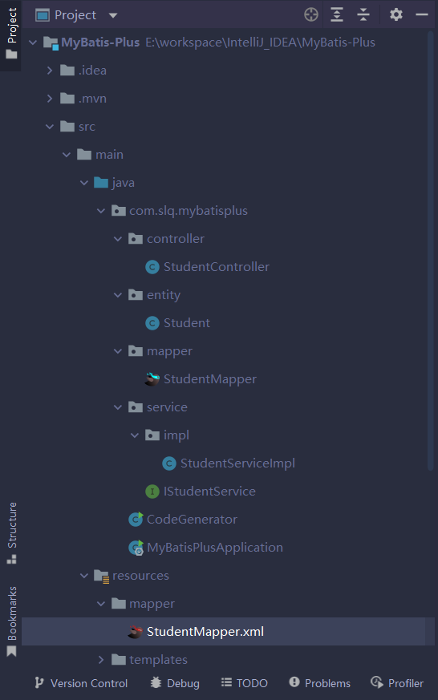

# MyBatis-Plus

> Mybatis的增强工具
> 
> 只做增强不做改变，为简化开发、提高效率而生

?> 官网：[MyBatis-Plus](https://baomidou.com/)

!> 本文中的示例使用的是本文写作时MyBatis-Plus的最新版本，为 `3.5.2`。

## 快速入门

?> <b>特性</b>

- **无侵入**：只做增强不做改变，引入它不会对现有工程产生影响，如丝般顺滑
- **损耗小**：启动即会自动注入基本 CURD，性能基本无损耗，直接面向对象操作
- **强大的 CRUD 操作**：内置通用 Mapper、通用 Service，仅仅通过少量配置即可实现单表大部分 CRUD 操作，更有强大的条件构造器，满足各类使用需求
- **支持 Lambda 形式调用**：通过 Lambda 表达式，方便的编写各类查询条件，无需再担心字段写错
- **支持主键自动生成**：支持多达 4 种主键策略（内含分布式唯一 ID 生成器 - Sequence），可自由配置，完美解决主键问题
- **支持 ActiveRecord 模式**：支持 ActiveRecord 形式调用，实体类只需继承 Model 类即可进行强大的 CRUD 操作
- **支持自定义全局通用操作**：支持全局通用方法注入（ Write once, use anywhere ）
- **内置代码生成器**：采用代码或者 Maven 插件可快速生成 Mapper 、 Model 、 Service 、 Controller 层代码，支持模板引擎，更有超多自定义配置等您来使用
- **内置分页插件**：基于 MyBatis 物理分页，开发者无需关心具体操作，配置好插件之后，写分页等同于普通 List 查询
- **分页插件支持多种数据库**：支持 MySQL、MariaDB、Oracle、DB2、H2、HSQL、SQLite、Postgre、SQLServer 等多种数据库
- **内置性能分析插件**：可输出 SQL 语句以及其执行时间，建议开发测试时启用该功能，能快速揪出慢查询
- **内置全局拦截插件**：提供全表 delete 、 update 操作智能分析阻断，也可自定义拦截规则，预防误操作


?> <b>支持数据库</b>

- MySQL，Oracle，DB2，H2，HSQL，SQLite，PostgreSQL，SQLServer，Phoenix，Gauss ，ClickHouse，Sybase，OceanBase，Firebird，Cubrid，Goldilocks，csiidb
- 达梦数据库，虚谷数据库，人大金仓数据库，南大通用(华库)数据库，南大通用数据库，神通数据库，瀚高数据库


### 安装

> MyBatis-Plus 3.0版本基于JDK8，提供了`lambda`形式的调用，因此您的JDK版本必须大于8。

- Spring Boot工程
```maven
<dependency>
    <groupId>com.baomidou</groupId>
    <artifactId>mybatis-plus-boot-starter</artifactId>
    <version>最新版本</version>
</dependency>
```

- Spring工程
```maven
<dependency>
    <groupId>com.baomidou</groupId>
    <artifactId>mybatis-plus</artifactId>
    <version>最新版本</version>
</dependency>
```

!> 引入MyBatis-Plus依赖之后就不要再次引入MyBatis或MyBatis-Spring依赖了，以避免因版本差异导致的问题。

### 配置

- Spring Boot工程

配置`MapperScan`注解
```java
@SpringBootApplication
@MapperScan("com.slq.mybatisplus.mapper")
public class MyBatisPlusApplication {
    public static void main(String[] args) {
        SpringApplication.run(MyBatisPlusApplication.class, args);
    }
}
```

- Spring工程

配置`MapperScan`注解
```xml
<bean class="org.mybatis.spring.mapper.MapperScannerConfigurer">
    <property name="basePackage" value="com.baomidou.mybatisplus.samples.quickstart.mapper"/>
</bean>
```
调整 SqlSessionFactory 为 MyBatis-Plus 的 SqlSessionFactory
```xml
<bean id="sqlSessionFactory" class="com.baomidou.mybatisplus.extension.spring.MybatisSqlSessionFactoryBean">
    <property name="dataSource" ref="dataSource"/>
</bean>
```

### 注解

- `@TableName`

表名注解，标识实体类对应的数据库表名
```java
@TableName("sys_user")
public class User {
    private Long id;
    private String name;
    private Integer age;
    private String email;
}
```

- `@TableId`

主键注解，使用在实体类主键字段上
```java
@TableName("sys_user")
public class User {
    @TableId
    private Long id;
    private String name;
    private Integer age;
    private String email;
}
```

| 属性  | 类型   | 必须指定 | 默认值      | 描述         |
| ----- | ------ | -------- | ----------- | ------------ |
| value | String | 否       | ""          | 主键字段名   |
| type  | Enum   | 否       | IdType.NONE | 指定主键类型 |

- `IdType`

指定主键类型，是`TableId`注解`type`属性的值

| 值            | 描述                                                         |
| ------------- | ------------------------------------------------------------ |
| AUTO          | 数据库 ID 自增                                               |
| NONE          | 无状态，该类型为未设置主键类型（注解里等于跟随全局，全局里约等于 INPUT） |
| INPUT         | insert 前自行 set 主键值                                     |
| ASSIGN_ID     | 分配 ID(主键类型为 Number(Long 和 Integer)或 String)(since 3.3.0),使用接口`IdentifierGenerator`的方法`nextId`(默认实现类为`DefaultIdentifierGenerator`雪花算法) |
| ASSIGN_UUID   | 分配 UUID,主键类型为 String(since 3.3.0),使用接口`IdentifierGenerator`的方法`nextUUID`(默认 default 方法) |
| ID_WORKER     | 分布式全局唯一 ID 长整型类型(please use `ASSIGN_ID`)         |
| UUID          | 32 位 UUID 字符串(please use `ASSIGN_UUID`)                  |
| ID_WORKER_STR | 分布式全局唯一 ID 字符串类型(please use `ASSIGN_ID`)         |

- `TableField`

非主键字段注解
```java
@TableName("sys_user")
public class User {
    @TableId
    private Long id;
    @TableField("nickname")
    private String name;
    private Integer age;
    private String email;
}
```

| 属性             | 类型                         | 必须指定 | 默认值                   | 描述                                                         |
| ---------------- | ---------------------------- | -------- | ------------------------ | ------------------------------------------------------------ |
| value            | String                       | 否       | ""                       | 数据库字段名                                                 |
| exist            | boolean                      | 否       | true                     | 是否为数据库表字段                                           |
| condition        | String                       | 否       | ""                       | 字段 `where` 实体查询比较条件，有值设置则按设置的值为准，没有则为默认全局的 `%s=#{%s}`，[参考(opens new window)](https://github.com/baomidou/mybatis-plus/blob/3.0/mybatis-plus-annotation/src/main/java/com/baomidou/mybatisplus/annotation/SqlCondition.java) |
| update           | String                       | 否       | ""                       | 字段 `update set` 部分注入，例如：当在version字段上注解`update="%s+1"` 表示更新时会 `set version=version+1` （该属性优先级高于 `el` 属性） |
| insertStrategy   | Enum                         | 否       | FieldStrategy.DEFAULT    | 举例：NOT_NULL `insert into table_a(<if test="columnProperty != null">column</if>) values (<if test="columnProperty != null">#{columnProperty}</if>)` |
| updateStrategy   | Enum                         | 否       | FieldStrategy.DEFAULT    | 举例：IGNORED `update table_a set column=#{columnProperty}`  |
| whereStrategy    | Enum                         | 否       | FieldStrategy.DEFAULT    | 举例：NOT_EMPTY `where <if test="columnProperty != null and columnProperty!=''">column=#{columnProperty}</if>` |
| fill             | Enum                         | 否       | FieldFill.DEFAULT        | 字段自动填充策略                                             |
| select           | boolean                      | 否       | true                     | 是否进行 select 查询                                         |
| keepGlobalFormat | boolean                      | 否       | false                    | 是否保持使用全局的 format 进行处理                           |
| jdbcType         | JdbcType                     | 否       | JdbcType.UNDEFINED       | JDBC 类型 (该默认值不代表会按照该值生效)                     |
| typeHandler      | Class<? extends TypeHandler> | 否       | UnknownTypeHandler.class | 类型处理器 (该默认值不代表会按照该值生效)                    |
| numericScale     | String                       | 否       | ""                       | 指定小数点后保留的位数                                       |

- `FieldStrategy`

| 值        | 描述                                                        |
| --------- | ----------------------------------------------------------- |
| IGNORED   | 忽略判断                                                    |
| NOT_NULL  | 非 NULL 判断                                                |
| NOT_EMPTY | 非空判断(只对字符串类型字段,其他类型字段依然为非 NULL 判断) |
| DEFAULT   | 追随全局配置                                                |
| NEVER     | 不加入SQL                                                   |

- `FieldFill`

| 值            | 描述                 |
| ------------- | -------------------- |
| DEFAULT       | 默认不处理           |
| INSERT        | 插入时填充字段       |
| UPDATE        | 更新时填充字段       |
| INSERT_UPDATE | 插入和更新时填充字段 |

- `@Version`

乐观锁注解、标注`@Version`在字段上

- `EnumValue`

普通枚举类注解，使用在枚举字段上

- `@TableLogic`

表字段逻辑处理注解（逻辑删除）

| 属性   | 类型   | 必须指定 | 默认值 | 描述         |
| ------ | ------ | -------- | ------ | ------------ |
| value  | String | 否       | ""     | 逻辑未删除值 |
| delval | String | 否       | ""     | 逻辑删除值   |

- `@KeySequence`

序列主键策略

| 属性  | 类型   | 必须指定 | 默认值     | 描述                                                         |
| ----- | ------ | -------- | ---------- | ------------------------------------------------------------ |
| value | String | 否       | ""         | 序列名                                                       |
| clazz | Class  | 否       | Long.class | id 的类型, 可以指定 String.class，这样返回的 Sequence 值是字符串"1" |

- `InterceptorIgnore`

`value` 值为 `1` | `yes` | `on` 视为忽略，例如 `@InterceptorIgnore(tenantLine = "1")`
`value` 值为 `0` | `false` | `off` | `空值不变` 视为正常执行。

- `@OrderBy`

内置 SQL 默认指定排序，优先级低于 wrapper 条件查询 

| 属性   | 类型    | 必须指定 | 默认值          | 描述           |
| ------ | ------- | -------- | --------------- | -------------- |
| isDesc | boolean | 否       | true            | 是否倒序查询   |
| sort   | short   | 否       | Short.MAX_VALUE | 数字越小越靠前 |

### 快速测试

- 添加测试依赖

  ```maven
  <dependency>
      <groupId>com.baomidou</groupId>
      <artifactId>mybatis-plus-boot-starter-test</artifactId>
      <version>最新版本</version>
  </dependency>
  ```

- 编写测试用例

  通过 `@MybatisPlusTest` 可快速编写 Mapper 对应的测试类，实现快速测试代码 。

  ```java
  @MybatisPlusTest
  public class MybatisPlusSampleTest {
  
      @Autowired
      private UserMapper userMapper;
  
      @Test
      void testInsert() {
          User user = new User("mark", 23, "test6@baomidou.com");
          userMapper.insert(user);
          System.out.println(user.getId());
      }
  }
  ```


## 核心功能

### 代码生成器（新）

!> MyBatis-Plus代码生成器可以帮助我们完成编写entiry、mapper、service、impl、controller层代码的重复性工作，还可以自定义模板，实现单表增删改查、分页、多删等代码的生成，让程序员有更多的时间专注于实际业务。

?> <b>安装</b>
```maven
<!--mybatis-plus-generator依赖-->
<dependency>
    <groupId>com.baomidou</groupId>
    <artifactId>mybatis-plus-generator</artifactId>
    <version>最新版本</version>
</dependency>

<!--Velocity引擎模板依赖-->
<dependency>
	<groupId>org.apache.velocity</groupId>
	<artifactId>velocity</artifactId>
	<version>1.7</version>
</dependency>

<!--若开启 swagger 模式，还需导入如下依赖-->
<dependency>
    <groupId>io.springfox</groupId>
    <artifactId>springfox-swagger2</artifactId>
    <version>2.9.2</version>
</dependency>
<dependency>
    <groupId>io.springfox</groupId>
    <artifactId>springfox-swagger-ui</artifactId>
    <version>2.9.2</version>
</dependency>
```
?> <b>快速生成</b>
```java
/**
 * @author SLQ1893
 * @create 2022-10-18 11:06
 * @Description 代码生成器工具类
 */
public class CodeGenerator {
    public static void main(String[] args) {
        FastAutoGenerator.create("jdbc:mysql://localhost:3306/mybatis-plus?useSSL=false&useUnicode=true&characterEncoding=utf-8&serverTimezone=Asia/Shanghai&rewriteBatchedStatement=true", "root", "root")
                .globalConfig(builder -> {
                    builder.author("SLQ1893") // 设置作者
                            .enableSwagger() // 开启 swagger 模式
                            .fileOverride() // 覆盖已生成文件
                            .outputDir("E:\\workspace\\IntelliJ_IDEA\\MyBatis-Plus\\src\\main\\java"); // 指定输出目录
                })
                .packageConfig(builder -> {
                    builder.parent("com.slq.mybatisplus") // 设置父包名
                            .moduleName(null) // 设置父包模块名
                            .pathInfo(Collections.singletonMap(OutputFile.xml, "E:\\workspace\\IntelliJ_IDEA\\MyBatis-Plus\\src\\main\\resources\\mapper")); // 设置mapperXml生成路径
                })
                .strategyConfig(builder -> {
                    builder.addInclude(Arrays.asList("t_student")) // 设置需要生成的表名
                            .addTablePrefix("t_", "c_"); // 设置过滤表前缀
                })
                // 默认使用Velocity引擎模板，也可使用Freemarker引擎模板
//                .templateEngine(new FreemarkerTemplateEngine())
                .execute();
    }
}
```
复制以上代码到您的IDE中，修改相关配置就可以run了。我的项目目录结构如下：




### CRUD接口


### 条件构造器


### 主键策略


### 自定义ID生成器


## 扩展


## 插件