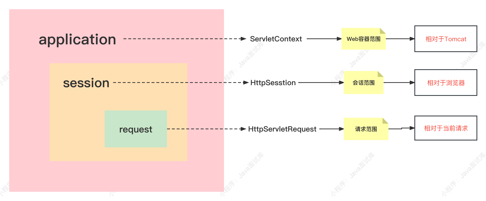
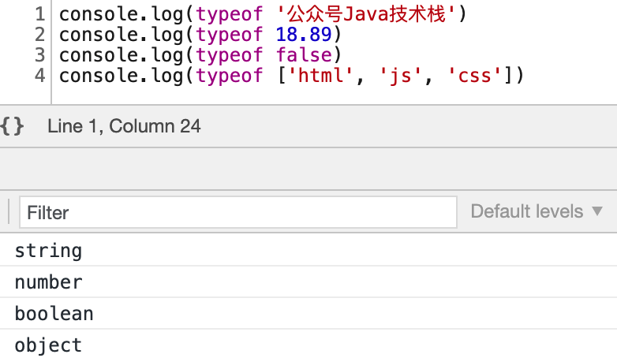

# WEB 44

### 1、HTML、CSS、JavaScript之间的关系？

##### 网页开发语言三剑客：HTML + CSS + JavaScript

HTML语言定义了网页的内容，CSS定义了网页的布局和样式，JavaScript定义了网页的行为和动作。

### 2、H5是什么？

HTML诞生于1990年，HTML4在1997年成为互联网网页标准。

H5 = HTML5（**HyperText Markup Language5**）是下一代HTML标准，2014年10月由万维网联盟（W3C）完成标准制定，H5在之前HTML4的基础上进行了一系列的改进，H5的语法特征也更加明显。

### 3、H5的诞生是为了解决什么问题？

HTML5将视频、音频、图像、动画以及与设备的交互都进行了规范，设计的目的就是为了在各种移动设备上支持多媒体运行。

### 4、H5和HTML的区别？

##### 1、文档声明

HTML：

```html
<!DOCTYPE HTML PUBLIC "-//w3c//DTD HTML 4.01//EN" "http://www.w3.org/TR/xhtml4/strict.dtd">
<!DOCTYPE html PUBLIC "-//w3c//DTD XHTML 1.0 Strict//EN"
"http://www.w3.org/TR/xhtml1/DTD/xhtml1-strict.dtd">
```

HTML5：

```html5
<!DOCTYPE html>
```

H5更简洁易懂。

##### 2、结构语义

HTML没有体现结构语义化的标签，如：

```html
<div id="site">java面试题</div>
```

HTML5添加了许多具有语义化的标签，如：

```html
<article>
<aside>
<audio>
<bdi>
...
```

##### 3、绘图

HTML5可以使用`<canvas>`元素在网页上简单绘制图像。

##### 4、音视频

HTML只能使用Flash播放器支持音频和视频。

HTML5使用`<audio>`和`<video>`元素来支持音频和视频，这也是其最大的区别。

### 5、Servlet是什么？

Servlet，全称Java Servlet，是Sun公司制定的一种用来扩展Web服务器端功能的组件规范，也就是Java编写的服务器端程序，可用于实现HTTP接口或者生成动态Web内容。

Servlet是运行在Web服务器中的Java类，它可以接收来自客户端浏览器的HTTP请求，并生成相应的HTTP响应结果。

Servlet可以与JavaServer Pages（JSP）、JavaServer Faces（JSF）等技术一起使用，来实现Web应用的开发。

### 6、Servlet的生命周期是怎样的？

Servlet生命周期可被定义为从创建直到销毁的整个过程。

##### 以下是Servlet遵循的过程：

- Servlet构造初始化。
- Servlet初始化后调用**init()**方法。
- Servlet调用**service()**方法来处理客户端的请求。
- Servlet销毁前调用**destroy()**方法。
- 最后，Servlet是由JVM的垃圾回收器进行垃圾回收的。


### 7、Servlet有哪些核心的方法？

##### 1、init

服务器装入Servlet时执行，在Servlet的生命周期中，仅执行一次。

##### 2、service

每收到一个请求时，service()方法就被调用。

##### 3、doGet

接收GET请求。

##### 4、doPost

接收POST请求。

##### 5、destroy

服务器停止且卸装Servlet时执行该方法，在Servlet的生命周期中，仅执行一次。

##### 6、getServletConfig

该方法返回一个ServletConfig对象，该对象用来返回初始化参数和ServletContext（Servlet的环境信息）。

##### 7、getServletInfo

它提供有关Servlet的信息，如作者、版本、版权等。

### 8、Servlet有哪几种作用域？

Servlet中的三大作用域如下图所示：



### 9、Servlet是线程安全的吗？

##### Servlet不是线程安全的！！！

尽量别定义全局类型的变量，要把变量分别定义在doGet()和doPost()等方法内。

### 10、Servlet支持异步处理吗？

Servlet3开始支持，来看使用示例：


访问localhost:8080/test

页面首先输出

```java
servlet started.
servlet end.
```

过了5秒后再输出

```java
hello servlet3.
```

可以看出servlet立马返回了，但没有关闭响应流，只是把response响应传给了线程，线程再继续输出，我们可以将比较费资源消耗时间的程序放到异步去做，这样很大程度上节省了servlet资源。

SpringMVC3.2开始也加入了servlet3异步处理这个特性，有兴趣的同学可以研究下。

从上面的servlet注解也可以看出来，servlet3完全解放了web.xml配置，通过注解可以完全代替web.xml配置。

### 11、Servlet是单例还是多例？

在Servlet规范中，对于Servlet单例与多例定义如下：

> "Deloyment Descriptor", controls how the servlet container provides instances of the servlet. For a servlet not hosted in a distributed environment(the default), the servlet container must use only one instance per servlet declaration. However, for a servlet implementing the SingleThreadModel interface, the servlet container may instantiate multiple instances to handle a heavy request load and serialize requests to particular instance.

上面规范提到，如果一个Servlet没有被部署在分布式的环境中，一版web.xml中声明的一个Servlet只对应一个实例。

而如果一个Servlet实现了SingleThreadModel接口，就会被初始化多个实例。

### 12、Servlet中的请求和响应对象，是单例还是多例？

在Web服务器运行期间，每个Servlet只会创建一个实例对象，它是单例的。

然而，针对每个HTTP请求，Web服务器都会调用所请求Servlet实例的service方法，然后重新创建一个HttpServletRequest对象和一个HttpServletResponse对象，所以它们是多例的。

### 13、Servlet一次请求的流程是怎样的？

具体如下图所示：


（1）首先浏览器向Web服务器发送了一个HTTP请求。

（2）Web服务器根据收到的请求，创建目标Servlet实例对象并调用init方法初始化。

（3）Web服务器创建一个HttpServletRequest和HttpServletResponse对象。

（4）调用service方法处理请求消息，并将请求对象（HttpServletRequest）和响应对象（HttpServletResponse）作为参数传递进去，然后读取HttpServletRequest请求信息，并将处理后的响应数据写入到HttpServletResponse对象中。

（5）service方法处理完后返回。

（6）读取响应信息。

### 14、Servlet和JSP有什么区别？

##### 主要有以下4点区别：

（1）JSP是Servlet的扩展，JSP编译后是“Servlet”类，所以本质上就是Servlet；

（2）Servlet是在Java代码中嵌入HTML代码，JSP是在HTML代码中嵌入Java代码；

（3）Servlet可用入接收和处理客户端请求，JSP仅适用于页面内容展示；

（4）Servlet偏重于业务逻辑，而JSP偏重于视图；

### 15、JSP是什么？

JSP全称Java Server Pages，它使用JSP标签在HTML网页中插入Java代码，是一种动态网页开发技术。

### 16、JSP有哪些内置对象？

##### JSP一共有9个内置对象：

（1）request：获取客户端请求的信息

（2）response：向客户端发出响应

（3）session：保存客户端会话信息

（4）out：管理客户端输出

（5）application：表示整个应用环境信息

（6）config：表示Servlet Config信息

（7）exception：表示页面中发生的异常信息

（8）pagecontext：表示当前JSP页面上下文信息

（9）page：表示当前JSP页面本身

### 17、JSP有哪些基本动作？

##### JSP一个有以下6种基本动作：

（1）include：引入一个文件

（2）forward：转发请求

（3）useBean：创建bean实例

（4）setProperty：设置JavaBean的属性

（5）getProperty：获得JavaBean的属性

（6）plugin：插入Java Applet或JavaBean

### 18、JSP有哪几种作用域？

JSP有以下4种作用域：

（1）page：表示当前页面对象

（2）request：表示当前请求对象

（3）session：表示当前会话对象

（4）application：表示当前应用对象

### 19、JSP有哪些常用指令？

##### JSP常用的指令有3种：

（1）page：定义页面的一些属性

（2）include：引入一个静态的JSP页面

（3）taglib：引入一个标签库

### 20、forward和redirect的区别？

##### 主要有以下4点区别：

（1）forward是请求转发，而redirect是请求重定向；

（2）forward url在地址栏不会发生改变，redirect则会发生改变；

（3）forward可以共享request里的数据，redirect则不能；

（4）forward比redirect效率更高；

### 21、如何实现隐藏的表单域？

在form表单中定义一个hidden类型输入框。

代码如下：

```html
<input type="hidden" name="java" value="java面试题">
```

表单隐藏域只是肉眼不可见，但可以通过检查看到网页源码，所以并不能保证数据安全性。

### 22、什么是AJAX？它的作用是什么？

AJAX是一种用于创建快速动态网页的技术，它可以在浏览器与服务器之间实现异步数据交互，不需要刷新整个页面即可更新部分页面内容。

AJAX的主要作用如下：

##### （1）网页局部刷新

在传统的Web应用中，每次进行数据交互都需要刷新整个页面，用户体验不佳。而AJAX可以实现局部刷新，只更新页面的一部分内容，从而提高了用户的体验。

##### （2）提高页面响应速度

AJAX可以异步地发送请求和接收响应，不会阻塞页面的其他操作，可以大大提高页面响应速度。

##### （3）提高用户交互性

通过AJAX，可以实现实时数据的获取和呈现，从而提高用户交互性。

##### （4）减轻服务器压力

通过AJAX，可以实现动态加载数据，不需要每次请求整个页面，减轻服务器的负担。

### 23、AJAX应用和传统Web应用有什么不同？

传统的Web应用通过浏览器向服务器发送请求，服务器返回完整的HTML页面，**每次与服务器交互都需要刷新整个页面，用户体检较差**。AJAX应用则可以通过**异步请求**与服务器交互，**只更新部分页面内容**，不需要刷新整个页面，可以提高用户体验。

AJAX应用与传统Web应用的主要区别：

##### 异步请求：

传统的Web应用通过同步请求与服务器交互，需要等待服务器返回完整的HTML页面。而AJAX应用可以通过异步请求与服务器交互，只更新部分页面内容，不需要刷新整个页面，可以提高用户体验。

##### 数据交互：

传统的Web应用主要使用表单来向服务器传递数据，而AJAX应用则可以使用JSON格式来传递数据，提高了数据交互的效率和灵活性。

##### 安全性：

由于AJAX应用可以直接向服务器发送异步请求，因此需要注意安全性问题，防止恶意攻击。

### 24、AJAX的工作原理是什么？

AJAX的工作原理：

- 浏览器端使用JavaScript（XHR，即XMLHttpRequest对象）向服务器发送异步请求；
- 服务器接收到请求后，处理请求并生成所需要的数据；
- 服务器将生成的数据以XML、JSON或HTML等格式返回给浏览器；
- 浏览器接收到服务器返回的数据后，使用JavaScript处理并更新部分网页内容。

### 25、怎么优化Web前端的性能？

一般网站优化都是优化后台，如接口的响应时间、SQL优化、后台代码性能优化、服务器优化等。高并发情况下，对前端web优化也是非常重要的。

下面说说几种常见的优化措施：

##### 1、HTML CSS JS位置

一般需要将CSS放页面最上面，即HEAD部分，而将JS代码放页面底部。因为页面需要加载为CSS才进行渲染，而JS如果不是在页面加载之前就执行就要放到页面最底部，一面在页面展示之前因JS过多加载而影响页面渲染速度。

##### 2、引用文件位置

有一些插件需要引用到远程的图片、CSS、JS、图标等，如果远程的资源连接网速不佳，如国外的某些资源，会造成网页阻塞，同样也会造成页面展示问题，尽量能把引用远程的资源能本地化。

##### 3、减少后台请求

每个请求都是耗费资源影响系统性能的，所以，能减少后台请求就减少。如，尽量的将同一个资源（图片、JS、CSS等）合并成一个文件，页面只要请求一次即可，这样就节省了很多http连接的开销及往返的时间损耗。

另外一方面，如果是关于抽奖、摇一摇、秒杀等功能，可以限制发往后台的频率，如前端操作10次才往后端发一次请求，这样从前端就做到了后台的流量控制，把流量控制到访问的最外层是最好的，尽量不要让请求落到底层。

##### 4、压缩传输

http压缩可以对纯文本可以压缩至原内容的40%，从而节省了60%的数据传输，GZIP是一种常用的压缩编码。因此，对文本类型的资源如CSS、JS、HTML启用GZIP压缩加速http传输速度。

##### 5、减少cookie传输

cookie会包含在每次请求和响应中，如果cookie过多会影响http响应速度，所以高并发情况下尽量控制cookie的传输量，nginx对cookie传输默认是做了限制的。另外，像CSS、JS、图片等静态资源可以启用单独域名，禁用cookie对静态资源的传输，这样就能大大提高效率。

##### 6、浏览器缓存

高并发情况下，可以将一些不怎么变动的东西缓存到浏览器cache中，或者一些活动内容可以提前将内容在客户端缓存起来，以免活动开始大量请求涌入服务器。

##### 7、CDN

之前的文章有讲过CDN的概念，它就是一个静态内容分发网络，本质就是静态资源的缓存，可以将静态资源放到CDN上，这样，用户就能离自己最近的地方获取到资源，大大提高了用户访问速度。

##### 8、反向代理

常用的反向代理nginx除了负载均衡功能，他也可以通过配置缓存功能来加速请求响应速度，当用户第一次访问的时候静态资源就可以被缓存到反向代理服务器上，这样其他用户的请求就能直接从反向代理服务器直接获取返回，这样也起到了静态资源缓存的作用。

### 26、什么是MVC？分别代表什么？

##### MVC是指：

- M：业务模型（Model）
- V：用户界面（View）
- C：控制器（Controller）

使用MVC模式的目的是将M和V的实现代码分离，从而使同一个程序可以使用不同的表现形式。

其中，View的定义比较清晰，就是用户界面。

### 27、你知道的MVC框架有哪些？

我知道的有以下几款：

- Struts / Struts2
- Spring MVC（国内主流）
- JSF
- JFinal
- Grails
- Play
- ...

### 28、拦截器和过滤器的区别？

##### 有几点最主要的区别：

（1）过滤器是Servlet容器的组件，所以需要依赖Servlet容器；拦截器则是在具体的框架中实现，如：Spring MVC，不用依赖servlet容器；

（2）过滤器拦截的是web.xml配置的Servlet请求，而拦截器则是Spring中配置的请求；

（3）拦截器可以无缝使用Spring IOC，而过滤器则不能；

（4）过滤器的执行顺序要早于拦截器，返回要晚于拦截器；

### 29、Cookie和Session的区别？

##### 主要有以下5点区别：

（1）Cookie保存在客户端浏览器中，而Session保存在服务器端；

（2）Cookie只能通过保存在客户端浏览器中实现，而Session可以通过Tomcat、Redis、数据库等各种第三方实现；

（3）Cookie中保存的数据不安全，Cookie可以被篡和伪造改以进行各种欺骗攻击；而Session中的数据是保存在服务端的，安全可靠；

（4）Session过多会影响服务器性能，而Cookie则不会；

（5）Cookie单个大小限制是：4K，而Session则受内存等存储媒介限制；

### 30、Session一定要依赖Cookie吗？如果Cookie被禁用，Session还能保持吗？

##### 答案：不一定。

因为Session不是一定要依赖Cookie，如果Cookie被禁用，可以两种解决方案：

##### （1）可以使用URL重写技术来维护Session会话

如常用的urlrewriter框架，可以重写URL，可以在每次的HTTP请求URL中携带用来标识Session参数jsessionid，如：

> http://www.slq.com/hello;jsessionid=xxx

（2）使用表单隐藏字段来存储和传递Session参数jsessionid

### 31、什么是跨域？

跨域是指在浏览器中，Web应用程序从一个域名的网页去请求另一个域名的资源时，浏览器会阻止这个跨域请求，这种请求被称为跨域请求。

跨域请求的产生是由于浏览器的同源策略，即浏览器限制了来自不同源的网页之间的交互，从而保障了Web应用程序的安全性。

跨域的严格一点来说就是只要**协议，主机名，端口**有任何一个的不同，就被当作是跨域。

下面是一个跨域的例子：

| 主机名       | 协议 | 页面       |
| ------------ | ---- | ---------- |
| www.slq.com  | http | index.html |
| test.slq.com | http | test.html  |

在上面的例子中，因为主机名不同，当http://www.slq.com/index.html页面中通过AJAX请求访问http://test.slq.com/test.html时，就会产生跨域请求。

### 32、为什么会出现跨域的情况？

现实工作开发中经常会有跨域的情况，因为公司会有很多项目，也会有很多子域名名，各个项目或者网站之间需要相互调用对方的资源，这样就避免不了跨域请求。

### 33、跨域有哪些解决方案？

##### 实现跨域有以下几种方案：

- 服务器端运行跨域设置CORS等于*；
- 在单个接口使用注解@CrossOrigin设置跨域；
- 使用jsonp设置跨域；
- nginx设置Access-Control-Ofigin*

### 34、Web项目开发要注意哪些安全问题？怎么防范？

Web开发需要注意以下安全问题：

- SQL注入攻击
- 跨站脚本攻击（XSS）
- 跨站请求伪造（CSRF）
- 会话固定攻击
- 文件上传漏洞

### 35、什么是SQL注入攻击？

SQL注入即通过WEB表单域插入非法SQL命令，当服务器端构造SQL时采用拼接形式，非法SQL与正常SQL一并构造并在数据库中执行。

简单的SQL注入的例子：

> 例1：test123456 or 1=1;

加上or 1=1，如果没有防止SQL注入，这样攻击者就能成功登录。

> 例2：test123456',drop table xxx-

这样会删除一个表，-后面的就是注释

### 36、怎么防御SQL注入攻击？

##### 常见的防御手段：

##### 1、禁止采用SQL拼接的形式

这也是最重要的一点，要采用参数化的形式。

如Mybatis参数占位符要使用##，它会给参数默认带上单引号，所有输入的字符当作一个参数来处理，而不是命令，不要使用$$，它不会带单引号有SQL注入的风险。

##### 2、过滤或转义特殊字符

特殊字符包括如：单引号、杠等，或者使用正则表达式过滤如：drop table、delete...、update...等危害数据库安全的请求，前后端都要采用措施。

##### 3、数据库用户权利最小化

不要使用最大权限的管理员进行连接，为每个应用使用独立的所在库的账号进行连接，这样使权利最小化。

##### 4、发生异常不要使用错误回显

即显示默认的服务器500错误，把代码及表名信息直白显示在网页上，这样攻击者就能通过恶意操作使网页出现500错误从而看到数据库表名等内部信息。

##### 5、加密存储敏感信息

用户敏感信息如省份证、手机号、邮箱、卡号等一定要加密存储，而且要妥善保密密钥。

### 37、什么是XSS攻击？

XSS全称为：**Cross Site Script**，即跨站点脚本攻击。

XSS攻击时最为普遍且中招率最多的web攻击方式，一般攻击者通过在网页而已植入攻击脚本来篡改网页，在用户浏览网页时就能执行恶意的操作，像html、css、img都有可能被攻击。

像前不久微信貌似就中招，好像是在朋友圈发送一个带有脚本的链接，然后通过点击该链接就会弹出一个提示，虽然没有造成什么影响，但这是XSS攻击最鲜明的特点。

---

##### XSS现在主要分为以下两种攻击类型：

##### 1、反射型漏洞

这种类型攻击者一般通过在网页中嵌入含有恶意攻击脚本的链接，或者通过发送带脚本的链接给受害者，这个脚本链接是攻击者自己的服务器，用户通过点击该链接就能达到攻击的目的。

如：

```html
http://www.slq.com/p=<script src=...  />
```

这样受害者的网页就潜入了这段脚本，受害者通过点击链接触发攻击脚本。

新浪微博曾经就出现过一次较为严重的XSS攻击事件，攻击者通过发送一个带有链接的微博诱导用户点击，通过点击脚本链接大量用户自动发送某些不良信息和死信并自动关注攻击者的微博账号，这是典型的反射性漏洞。

这次新浪微博事件显然是一次推广营销而已，并没有严重影响新浪的服务，然而现实中攻击者可以通过窃取用户cookie获取用户名密码等重要信息来伪造用户交易、窃取用户的财产等影响用户财产安全的恶意行为。

##### 2、存储型漏洞

这种类型是影响最为广泛的且危害网站安全自身的攻击方式，攻击者通过上传恶意脚本到网站服务器或保存到数据库中，恶意脚本就会包含在网页中，这样会导致所以浏览该网页的用户有中招的可能。

这种攻击类型一般常见在博客、论坛等网站中。

### 38、怎么防御XSS攻击？

常见的防御手段：

##### 1、危险字符过滤

即对用户输入的危险字符进行转义，如>转义为“&gt”，<转译为"&lt"，如果被转义有误解，可以对<script src=...这种类型的<才进行转义，这样就能避免大部分的XSS攻击。

##### 2、使用http only的cookie

httpOnly由微软在IE中提出，禁止用户在浏览器中通过脚本访问带有httpOnly的cookie。

有了这个特性，如果是用户敏感信息保存在cookie中的，可以通过在cookie加下httpOnly属性避免XSS攻击cookie造成用户信息泄露。

### 39、什么是CSRF攻击？

CSRF全称：**Cross Site Request forgery**，即跨站点请求伪造攻击。

攻击者通过跨站点进行伪造用户的请求进行合法的非法操作，其攻击手法是通过窃取用户Cookie或服务器Session获取用户身份，在用户不知情的情况下在攻击者服务器模拟伪造用户真实的请求。

### 40、怎么防御CSRF攻击？

##### 常见的防御手段：

既然是跨站点攻击，所以防御的手段无非是识别请求的来源是否合法。

##### 1、检查referer

referer是http header的请求头属性，标识了请求的来源地址，通过检查这个属性可以判断请求地址是否合法域名。很多网站的防盗链功能就是这麽做的，如果不是本站的域名请求就拒绝其链接，或者返回一个允许在外站显示的公共图片。

##### 2、检查表单token

在跳转到每个表单时，每次都随机生成一个不固定的token值用于回传验证，所以如果是用户正常提交的话肯定会包含这个值，而这个值不存在cookie中攻击者拿不到这个值，自然提交的请求是不合法的。

如果不适用cookie的前提下也可以设置cookie为httpOnly禁止脚本获取到cookie信息。

##### 3、检查验证码

使用验证码，简单粗暴，判断请求的验证码是否但用户体验会非常差，用户不希望所有的操作都要输入验证码，所以，不是非常重要的环节建议不要使用验证码。

### 41、什么是会话固定攻击？

##### 什么是会话固定攻击？

会话固定攻击（session fixation attack）是利用应用系统在服务器的会话ID固定不变机制，借助他人用相同得会话ID获取认证和授权，然后利用该会话ID劫持他人的会话以成功冒充他人，造成会话固定攻击。

##### 看下面Session Fixation攻击的一个简单例子：


##### 整个攻击流程是：

1、攻击者Attacker能正常访问该应用网站；

2、应用网站服务器返回一个会话ID给他；

3、攻击者Attacker用该会话ID构造一个该网站链接发给受害者Victim；

4-5、受害者Victim点击该链接，携带攻击者的会话ID和用户名密码正常登录了该网站，会话成功建立；

6、攻击者Attacker用该会话ID成功冒充并劫持了受害者Victim的会话。

##### 攻击分析

攻击的整个过程，会话ID是没变过的，所以导致此漏洞。

### 42、怎么防御会话固定攻击？

##### 1、登录重建会话

Session ID使用一次即作废，每次登录后都重置会话ID，并生成一个新的会话ID，这样攻击者就无法用自己的会话ID来劫持会话。

核心代码如下：

```java
// 会话失效
session.invalidate();

// 会话重建
session = request.getSession(true);
```

或者定期更换Session ID，可以增加攻击者的攻击成本，降低攻击的可能性。

##### 2、禁用客户端访问Cookie

此方法也避免了配合XSS攻击获取Cookie中的会话信息以达成会话固定攻击，在Http响应头中启用httpOnly属性，或者在Tomcat容器中配置。

##### 3、不使用Cookie保存Session ID

可以使用其他方式保存Session ID，比如将Session ID存储在服务器端的缓存或者数据库中。

### 43、什么是文件上传漏洞？

文件上传漏洞是指攻击者通过某种方式绕过了应用程序的文件上传机制，成功上传恶意文件到服务器上。

这种漏洞通常发生在Web应用程序中，攻击者通过上传恶意文件，可以在服务器上执行任意代码，例如在服务器上创建Web Shell、下载恶意软件等，从而控制服务器或者窃取敏感数据。

文件上传漏洞通常是由于应用程序对上传文件的类型、大小、后缀等没有进行充分的校验，或者上传的文件名可以被恶意构造而导致的。攻击者可以通过在上传文件名中添加可执行文件的后缀、使用压缩文件、通过修改文件格式等方式绕过文件上传校验，上传包含恶意代码的文件到服务器上，从而达到控制服务器的目的。

### 44、怎么防御文件上传漏洞？

防御文件上传漏洞可以采取以下措施：

- 对上传的文件进行类型、大小、后缀等校验；、
- 对上传的文件进行安全扫描；
- 限制上传的文件权限；
- 避免上传文件直接被执行；
- 做好服务器安全加固；
- 定期更新漏洞库和安全补丁；
- 使用第三方文件上传工具，比如Apache Commons FileUpload，这些工具通常会实现文件上传的安全性检查，避免常见的文件上传漏洞。

# JavaScript 56

### 1、JavaScript是什么？

JavaScript简称：JS，是一种轻量级的网页脚本语言，在浏览器段执行，解释运行，不需要进行编译，可以插入到网页中控制网页的行为和动作。

### 2、JavaScript和Java的区别？

##### 两门语言没有任何关联，你可以理解为：周杰伦和周杰的区别，它俩只是名字很像而已。

JavaScript是一门网页脚本语言，在浏览器端运行；

Java是一门后端高级编程语言，在Java虚拟机中运行；

### 3、JavaScript和TypeScript的区别？

TypeScript是一种由微软开发的开源、跨平台的编程语言。

TypeScript是JavaScript的超集，是JavaScript语言的一种扩展语言，它最终也会被编译为JavaScript代码。

### 4、JavaScript和ECMAScript的区别？

ECMAScript是一种由Ecma国际通过ECMA-262标准化的脚本程序设计语言标准，JavaScript脚本语言则是基于ECMAScript标准的一种实现。

### 5、JavaScript和ES6的区别？

ES6全称为：ECMAScript 2015，或者：ECMAScript 6.0，于2015年正式发布，是JavaScript的下一个版本的规范标准，ES6极大的增加了语言的可用性。

### 6、ES6现在完全代替ES5吗？

目前还不能，如图所示：


数据来源：https://caniuse.com/es6


虽然现在大部分浏览器都支持ES6，并且主流的最新版本都支持的不错了，但不一定所有浏览器都完美支持，完全代替ES5还是有风险的。

### 7、JavaScript由哪三部分组成？

##### JavaScript由以下3部分组成：

##### 1、ECMAScript（核心）

它是JavaScript的核心，规定了语言的组成部分。

##### 2、DOM（文档对象模型）

通过DOM提供的API可以完成对页面节点的操作。

##### 3、BOM（浏览器对象模型）

通过BOM可以访问和操作当前窗口的浏览器对象模型。

### 8、JavaScript文件是什么扩展名？

##### JavaScript文件的扩展名是.js

在网页项目中会一个专门的文件夹存储JavaScript文件，如script

### 9、JavaScript文件怎么进行引入？

同样使用script标签，即可以编写JavaScript代码，还可以引入外部JavaScript文件。


### 10、JavaScript代码怎么进行定义？

JavaScript语言需要使用script标签进行定义，可以写在HTML的head或者body体内。

比如，打开网页时弹出一个提示：


### 11、JavaScript支持那些基本数据类型？

JavaScript支持的基本数据类型：

| 名称      | 数据类型 | 描述                                             |
| --------- | -------- | ------------------------------------------------ |
| String    | 字符串   | 表示文本数据，用引号（单引号或双引号）括起来     |
| Number    | 数字     | 表示数值数据，包括整数和浮点数                   |
| Boolean   | 布尔值   | 表示逻辑值，只有两个可能的值：`true`和`false`    |
| Null      | 空值     | 表示空或无值                                     |
| Undefined | 未定义   | 表示未定义的值                                   |
| Object    | 对象     | 表示复杂数据类型，可以包含多个键值对             |
| Array     | 数组     | 表示有序集合，包含多个元素                       |
| Symbpl    | 符号     | 表示唯一的标识符，用于创建对象属性的键，ES6+支持 |

### 12、JavaScript支持哪些引用数据类型？

##### JavaScript支持3种引用数据类型：

1、对象（Object）

2、数组（Array）

3、函数（Function）

### 13、JavaScript有哪些不含值的数据类型？

##### JavaScript有2种不含值的数据类型：

1、null（空）

2、undefined（未定义）

### 14、JavaScript有哪几种声明变量的方式？

##### 有以下3种定义方式：

|          | var    | let    | const  |
| -------- | ------ | ------ | ------ |
| 作用域   | 函数级 | 块级   | 块级   |
| 变量提升 | 存在   | 不存在 | 不存在 |
| 修改值   | 可以   | 可以   | 不可以 |

其中，let和const是ES6才开始支持的。

### 15、JavaScript中 == 和 === 的区别？

== 只比较值是否相等，=== 比较值和类型是否都相等；


显然===要更严格。

### 16、JavaScript中的NaN是指什么？

**NaN**全称为：Not a Number，表示不是数字类型，即错误的数字类型，在非数字之间进行运算、或者进行非数字转换都会返回NaN。


### 17、JavaScript变量可以赋值为null吗？

JavaScript中变量可以赋值为null：

> var param = null;

这一点和Java相同，表示一个变量不再指向任何对象的地址，可以用来主动释放一个变量的引用对象。

### 18、JavaScript中的undefined是指什么？

**undefined**是所有未赋值变量的默认值，表示变量未声明过、或者声明过但并未赋过值。

如：

> var param;
>
> console.log(typeof param);

输出：

> undefined

### 19、JavaScript中null和undefined的区别？

两者的值相同，但类型不同，如下所示：


### 20、JavaScript怎么判断变量的数据类型？

可以使用typeof关键字来判断一个变量的数据类型。



如上，输出了不同变量的数据类型。

### 21、JavaScript怎么判断数组和日期类型？

Array和Date使用typeof判断时，返回的都是object类型。

这两种数据类型可以使用**constructor**的方式进行判断。


### 22、JavaScript可以改变变量的数据类型吗？

可以的，JavaScript中的一个变量可以有不同的数据类型：


### 23、JavaScript字符串和数字怎么互相转换？

可以使用String和Number函数互相转换：


非数字进行转换会返回：NaN

### 24、JavaScript如何处理JSON数据？

JavaScript提供了两个处理JSON数据的方法：

| 方法             | 作用                        |
| ---------------- | --------------------------- |
| JSON.parse()     | 将JSON字符串转换为对象      |
| JSON.stringify() | 将对象/数组转换为JSON字符串 |

来演示一下：


### 25、JavaScript怎么定义一个对象？

创建一个对象可以有以下两种方法。

##### 1、使用new Object方式


##### 2、直接定义时赋值


可以看出，JavaScript对象其实就是一个name:value JSON格式的集合。

### 26、JavaScript如何遍历一个对象？

使用for...in...即可：


### 27、JavaScript如何动态添加删除对象的属性？

添加、修改对象的属性使用obj.xx = xx，删除对象的属性使用delete obj.xx。

如下面示例：


### 28、JavaScript如何定义一个数组？

创建一个数组可以有以下三种方法。

##### 1、使用new Array下标的方式


##### 2、使用new Array构造器的方式


##### 3、直接定义时赋值


### 29、JavaScript数组有哪些增删方法？

##### 主要有以下几个方法：

| 方法    | 作用               |
| ------- | ------------------ |
| push    | 尾部添加           |
| unshift | 头部添加           |
| pop     | 尾部删除           |
| shift   | 头部删除           |
| splice  | 指定位置添加、删除 |

### 30、JavaScript如何遍历一个数组？

1、普通的for循环


2、for...in...循环


3、for...of...（ES6）


4、forEach


### 31、JavaScript如何截取一个数组？

可以使用slice方法：


slice不会改变原数组。

### 32、JavaScript如何把数组转字符串？

使用数组的join方法：


### 33、JavaScript数组怎么同时删除并添加元素？

可以使用splie方法：


### 34、JavaScript如何对数组进行反转？

可以使用reverse方法：


### 35、JavaScript怎么定义一个函数？

JavaScript使用**function**关键字定义函数：

```javascript
function add(num1, num2) {
    return num1 + num2;
}
```

函数既可以是申明，也可以赋值为一个变量：

```javascript
var add = function(num1, num2) {
    return num1 + num2;
}
```

使用方式和Java一样，如：add(99, 18)

ES6中支持定义箭头函数：

> const add = (num1, num2) => num1 + num2;

### 36、JavaScript回调函数是什么？

回调函数也是一个正常的函数，但不会马上执行，可以通过变量的方式传给另一个函数，在该函数执行回调的时候再执行。


### 37、JavaScript自调用函数是什么？

自调用函数是指函数加载时会自动调用自己的函数。

使用方式如下：


### 38、JavaScript有this的概念吗？

JavaScript也有this的概念，但和Java不同的是，JavaScript中的this表示的范围更广。

JavaScript中的this可以是全局对象、当前对象或者任意对象，取决于函数的调用方式。

### 39、JavaScript有that的概念吗？

##### JavaScript中没有that，只用this。

that一般是this的复制重命名而已，为了解决this的跨作用域问题。

### 40、JavaScript如何获取外层的this？

JavaScript中的this表示的范围很广，同一个函数中的this在不同的调用方式下，不一定代表同一个对象，如果想在某些情况一直可以使用当前的this，可以使用事先变量复制的方式：

> let that = this;

用的时候使用that就可以了。

that是一种约定俗成的复制this重命名的用法，相当于复制当前的this对象，在超出该this作用域的时候可以再拿来使用，防止this在不同场景中出现的冲突问题。

如下所示：


如果不使用that，循环体内是无法获取外层的this对象的。

### 41、JavaScript如何处理异常？

JavaScript异常处理用法和Java类似：

```javascript
try {
    
} catch(err) {
    
} finally {
    
}
```

JavaScript处理异常时会提供一个err对错，err对象包含**name**（错误名）和**message**（错误消息）两个属性。

### 42、JavaScript有哪些弹框模式？

##### 1、提示弹框

> window.alert('我是一个提示弹框')


##### 2、确认弹框

> window.alert('我是一个确认弹框')


##### 3、输入弹框

> window.alert('我是一个输入弹框')


以上window都可以省略。

### 43、JavaScript获取页面元素有哪些方法？

#####  主要有以下几种方法：

| 获取方法                         | 获取对象                       |
| -------------------------------- | ------------------------------ |
| document.getElementById()        | 获取指定元素id的第一个对象     |
| document.getElementByName()      | 获取所有指定名称的对象集合     |
| document.getElementByTagName()   | 获取所有指定标签名的对象集合   |
| document.getElementByClassName() | 获取所有指定样式类名的对象集合 |

### 44、JavaScript怎么获取当前网页的URL？

获取当前网页全路径：

> window.location.href

获取当前网页资源路径：

> window.location.pathname

测试效果如下：


### 45、JavaScript void(0)的作用？

void代表没有返回值，void(0)表示没有什么效果：

```html
<a href="javascript:void(0)">单击没有什么反应</a>
```

可以用来代替：#，防止页面刷新或者跳转：

```html
<a href="#">点击时会刷新页面或者回到页面顶部</a>
```

### 46、JavaScript如何重定向到另一个页面？

改变当前的window.location.href即可：

> window.location.href = "http://www.slq.com/article/2024/spring-boot-3.2-released";

### 47、JavaScript如何延时执行任务？

使用setTimeout函数：


单位：毫秒。

### 48、JavaScript如何定时执行任务？

使用setInterval函数：


单位：毫秒。

### 49、JavaScript闭包是指什么？

闭包就是能够读取其他函数内部变量的函数，当一个内部函数被其外部函数之外的变量引用时，就形成了一个闭包。

下面是一个简单的闭包：


### 50、JavaScript闭包的作用是？

##### 闭包的作用主要有两点：

1、闭包可以读取其他函数内部变量；

2、闭包可以让外部函数的私有变量值一直保存在内存中；

### 51、JavaScript闭包的用途是？

JavaScript中，如果一个对象不再被引用，那么这个对象就会被GC回收，否则这个对象一直会保存在内存中。

所以，如果需要在一个模块中定义一些变量，并希望这些变量一直保存在内存中，又不会污染全局变量时，就可以用闭包来定义这个模块。


如上所示，调用3次say方法，count的值一直在累加并一直保存在内存中。

### 52、JavaScript怎么实现模块化编程？

使用export/import关键字，ES6开始支持。

date_utils.js

```javascript
var getDateBetween = function(startDate, endDate) {
    ...
}
    
export {
	getDateBetween    
}
```

引入使用：

```javascript
import { getDateBetween } from 'date_utils.js';
...
var days = getDateBewteen(...)
```

### 53、JavaScript会有内存泄露问题吗？

JavaScript是自动内存管理，也会出现很多内存泄露的情况。

### 54、JavaScript会进行垃圾回收吗？

JavaScript会进行垃圾回收，它是自动管理内存的，不需要我们手动释放，当对象不再被引用或者对象不能从根上访问到时，这个对象就会被垃圾回收掉。

### 55、JavaScript有哪些垃圾回收方法？

##### 现在各浏览器主流的两种垃圾回收方法：

1、引用计数

2、标记清除

### 56、JavaScript如何分析内存泄露问题？

可以借助Chrome浏览器的Memory模块：

