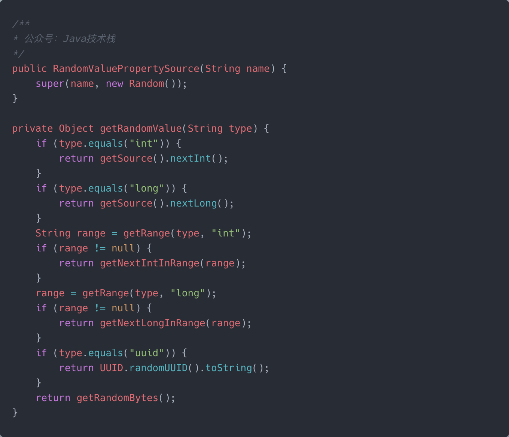
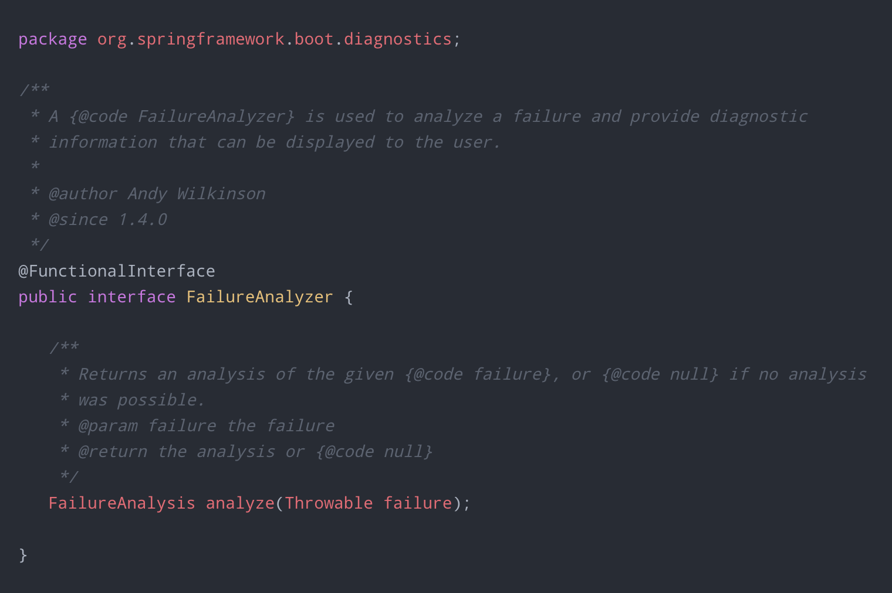
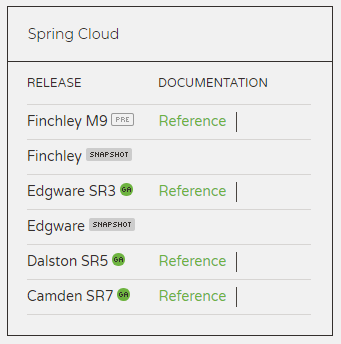
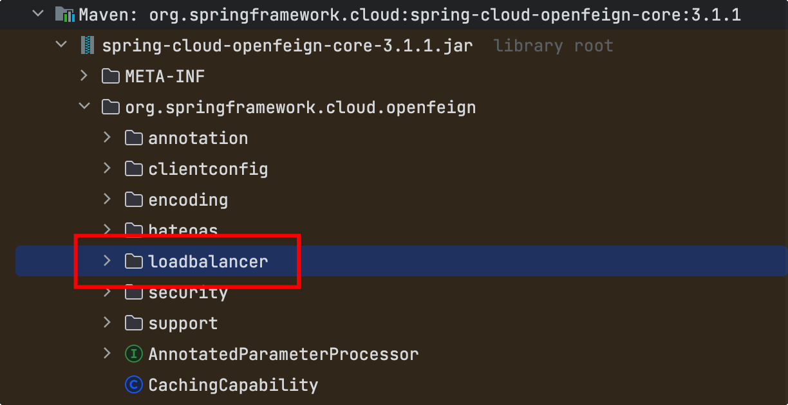
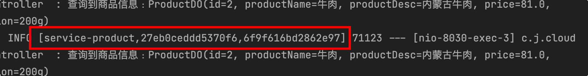
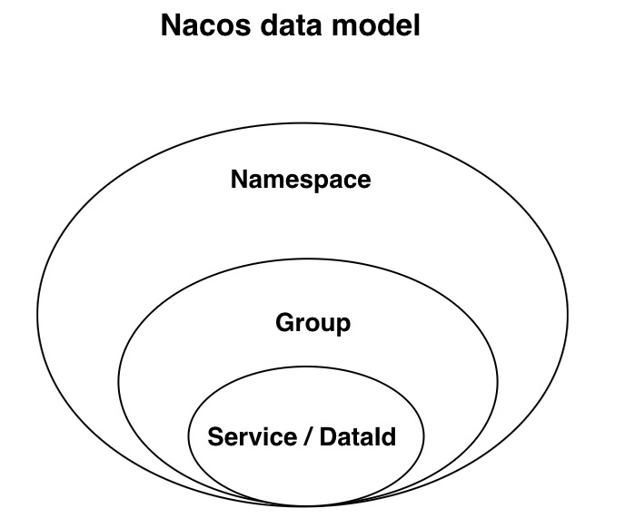
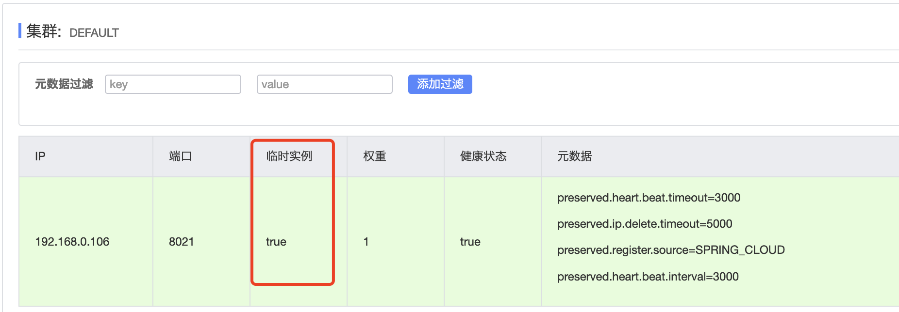
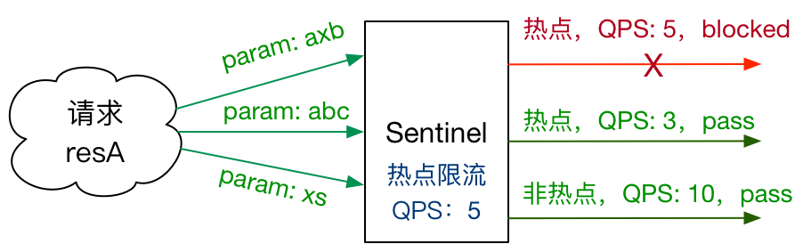
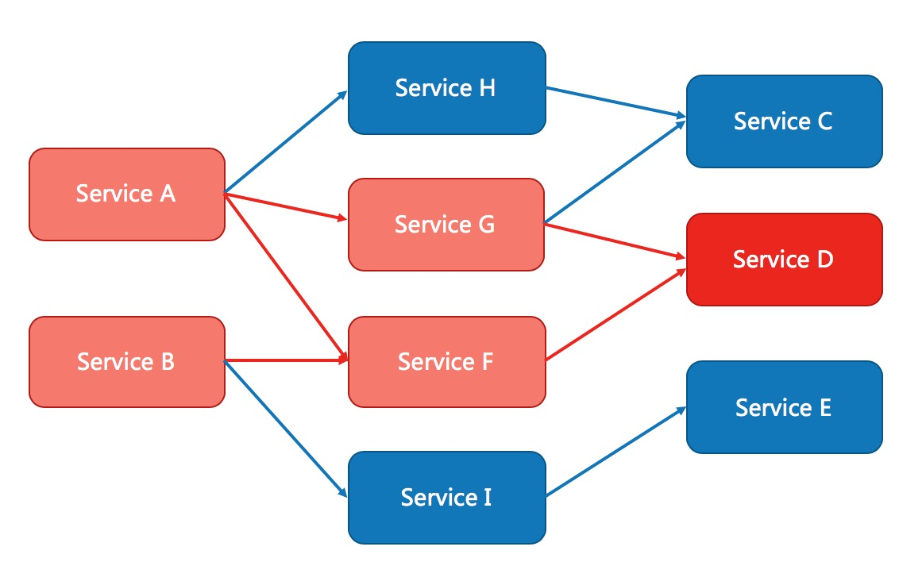

# Spring 88

### 1、Spring框架是什么？

Spring框架是一个开源的Java EE框架，它是目前最流行的企业级开发框架之一。

Spring框架是由Rod Johnson于2002年创建的，皆在提供一种简单、灵活、易于扩展的开发模式，帮助开发人员快速搭建企业级应用。

Spring使用基本的Java Bean来完成以前只可能由EJB完成的事情，Spring的用途不仅限于服务器端的开发，从简单性、可测试性和松耦合的角度而言，任何Java应用都可以从Spring中受益。

### 2、Spring常用的注解有哪些？

Spring中常用的注解如下表所示：

| 注解              | 作用                                                     |
| ----------------- | -------------------------------------------------------- |
| @Autowired        | 自动装配Bean对象，可以用在字段、方法和构造函数上。       |
| @Component        | 将类定义为Spring Bean，并由Spring托管。                  |
| @Controller       | 声明类为Spring MVC控制器。                               |
| @Service          | 声明类为业务逻辑组件。                                   |
| @Repository       | 声明类为数据访问组件。                                   |
| @Configuration    | 声明类为Spring配置类，用于定义Bean。                     |
| @Bean             | 在Spring配置类中定义Bean。                               |
| @Value            | 注入属性值或外部配置文件中的值。                         |
| @Qualifier        | 当存在多个相同类型的Bean时，使用该注解指定要注入的Bean。 |
| @Scope            | 指定Bean的作用域。                                       |
| @PostConstruct    | 在Bean的初始化方法中执行。                               |
| @PreDestroy       | 在Bean的销毁方法中执行。                                 |
| @RequestMapping   | 映射URL到控制器方法。                                    |
| @PathVariable     | 将URL中的占位符映射到方法参数中。                        |
| @RequestParam     | 将自定义的请求参数映射到方法参数中。                     |
| @ResponseBody     | 在HTTP Body中输出数据。                                  |
| @ExceptionHandler | 定义异常处理方法。                                       |

等等。。。

### 3、Spring框架的好处有哪些？

Spring框架的优点如下：

##### 1、轻量级

Spring框架设计得非常轻量，而且模块化的设计方式让开发人员可以根据自己的需求选择需要的模块，避免了不必要的冗余和复杂性。

##### 2、IOC容器

Spring框架通过IOC容器管理Bean，可以将Bean的创建和依赖关系的管理交由Spring容器负责，从而简化了开发人员的工作。

##### 3、面向切面编程（AOP）

Spring框架提供了AOP支持，可以在程序运行期间动态地对方法进行增强，实现了横切关注点的解耦，从而提高了代码的可维护性和可扩展性。

##### 4、事务管理

Spring框架提供了强大的事务管理支持，可以通过声明式事务管理和编程式事务管理来实现，让开发人员可以轻松地管理事务。

##### 5、高度集成性

Spring框架可以与其他框架无缝集成，例如Struts、Hibernate、MyBatis等，让开发人员可以更加方便地使用这些框架，提高开发效率和应用程序的可扩展性。

##### 6、松耦合

Spring框架采用松耦合的设计方式，使得应用程序中的各个模块可以独立开发、测试和部署，提高了系统的可维护性和可扩展性。

##### 7、易于测试

Spring框架采用面向接口的编程方式，可以很方便地进行单元测试和集成测试，提高了测试的效率和质量。

### 4、Spring由哪些主要模块组成？

Spring框架是一个轻量级的集成式开发框架，可以和任何一种框架集成在一起使用，可以说是一个大的全家桶。

Spring从 1.x 发展到现在的 6.x 可以说是越来越强大，下面来看看Spring都包含哪些核心的模块吧。


Spring框架由多个模块组成，每个模块都提供了不同的功能，开发人员可以根据自己的需要选择使用。

##### 以下是Spring框架的主要模块：

##### 1、Spring Core：

Spring Core模块时Spring框架的核心，提供了IOC（Inversion of Control，控制反转）和DI（Dependency Injection，依赖注入）功能。

Spring Core可以将Bean的创建和依赖关系的管理交由Spring容器负责，从而简化了开发工作。

##### 2、Spring AOP：

Spring AOP（Aspect-Orented Programming，面向切面编程）模块时Spring框架的AOP实现，提供了面向编程的支持，让开发人员可以将与业务逻辑无关的横切关注点进行封装和复用，从而提高了代码的可维护性和扩展性。

##### 3、Spring MVC：

Spring MVC模块是Spring框架的Web框架，提供了基于MVC设计模式的支持，让开发人员可以轻松地开发Web应用程序。

##### 4、Spring DAO：

Spring DAO（Data Access Object，数据访问对象）模块是Spring框架的数据访问模块，提供了对JDBC、ORM（Object-Relational Mapping，对象关系映射）等技术的支持，让开发人员可以方便地进行数据访问。

**5、Spring ORM：**

Spring ORM模块是Spring框架地ORM模块，提供了对Hibernate、JPA（Java Persistence API）、MyBatis等ORM框架的支持，让开发人员可以方便地进行对象关系映射操作。

##### 6、Spring Test：

Spring Test模块是Spring框架的测试模块，提供了对JUnit、TestNG等测试框架的支持，让开发人员可以方便地进行单元测试和集成测试。

------

除了以上主要模块外，Spring还提供了很多其他的模块，例如Spring Security（安全模块）、Spring Integration（集成模块）、Spring Batch（批处理模块）等，大家可以根据具体的需求选择需要的模块。

### 5、Spring IOC容器是什么？

##### Spring IOC（Inversion of Control）即控制反转：

指的是将创建对象的控制权进行转移，由Spring IOC进行负责创建对象，装配对象，配置对象，管理对象（通过依赖注入DI）之间的依赖关系，并且管理这些对象的整个生命周期。

### 6、Spring IOC的好处有哪些？

使用IOC的一些好处如下：

##### （1）降低组件之间的耦合度

Spring IOC通过将组件之间的依赖关系交给容器管理，从而减少组件之间的耦合度，是的组件更加独立、可重用和可维护。

##### （2）管理对象的生命周期

Spring IOC容器负责管理应用中的对象生命周期，包括对象的创建、初始化、销毁等过程，使得对象的生命周期更加可控，也更加符合业务需求。

##### （3）提高代码的可测试性

通过Spring IOC，我们可以轻松地将对象替换成Mock对象或者其他测试用的对象，从而提高了代码的可测试性。

##### （4）提高代码的可维护性

Spring IOC使得应用程序的组件之间的依赖关系变得清楚明了，容易理解和维护，降低了代码的复杂度。

##### （5）方便实现切面编程

Spring AOP基于Spring IOC实现，使得切面逻辑可以很方便的插入到应用程序中的各个位置，从而实现代码的解耦和功能的复用。

### 7、Spring中的BeanFactory是什么？

BeanFactory是Spring框架中最基本的接口，也是Spring容器的底层接口之一，负责管理Bean的生命周期、配置元信息、依赖关系、AOP、事件等，它是Spring的核心组件之一。

##### BeanFactory的主要作用如下：

- 加载Bean的定义文件，并创建Bean实例；
- 负责Bean的生命周期，包括初始化、装配、销毁等操作；
- 实现依赖注入和AOP等高级功能；
- 提供基础的事件和异常处理机制；

### 8、Spring中的ApplicationContext是什么？

Spring中的ApplicationContext是Spring框架的核心容器，是管理Bean的高级容器。他可以读取配置文件、管理Bean的生命周期、装配Bean之间的关系，并提供了许多企业级应用所需要的服务，如JNDI、EJB集成、远程访问等。

ApplicationContext提供了许多高级特性，如：事件传播、国际化支持、Bean生命周期的控制等。

##### 具体定义可以参考官网定义：

> The `ApplicationContext` is the central interface within a Spring application for providing configurationinformation to the application. It is read-only at run time, but can be reloaded if necessary and supported by the application. A number of classes implement the `ApplicationContext` interface, allowing for a variety of configuration options and types of applications.

The `ApplicationContext` provides:

- Bean factory methods for accessing application components.
- The ability to load file resources in a generic fashion.
- The ability to publish events to registered listeners.
- The ability to resolve messages to support internationalization.
- Inheritance from a parent context.

### 9、Spring常用的ApplicationContext有哪些？

Spring中常用的ApplicationContext有以下几种：

| ApplicationContext                 | 描述                                                         |
| ---------------------------------- | ------------------------------------------------------------ |
| ClassPathXmlApplicationContext     | 从类路径下的XML文件中加载上下文                              |
| FileSystemXmlApplicationCOntext    | 从文件系统中的XML文件中加载上下文                            |
| AnnotationConfigApplicationContext | 根据注解创建上下文                                           |
| WebApplicationContext              | 用于Web应用程序的上下文                                      |
| XmlWebApplicationContext           | 用于Web应用程序的XML上下文                                   |
| StaticApplicationContext           | 不依赖于外部资源的ApplicationContext实现                     |
| GenericApplicationContext          | 可以集成任何BeanFactory或ApplicationContext实现              |
| GenericXmlApplicationContext       | 从XML你文件中加载上下文定义，并可以集成任何BeanFactory或ApplicationContext实现 |

。。。

### 10、Spring中的BeanFactory和ApplicationContext的区别？

BeanFactory和ApplicationContext都是Spring容器的核心接口，但是在实现和功能上有所不同同。

- BeanFactory是Spring的基础Bean工厂，是Spring框架中最基本的接口，提供了最简单的容器的实现，是Spring框架的底层容器，负责创建Bean、装配Bean、管理Bean的生命周期等基本功能。
- ApplicationContext是BeanFactory的子接口，提供了更多的企业级功能，如：国际化支持、Bean生命周期控制、事件传播、AOP等高级功能。在加载配置文件时，ApplicationContext会预先实例化所有单例Bean，提供更快的访问和响应速度。

与ApplicationContext相比，BeanFactory是一种更加基础的容器实现，它提供了最基本的IOC功能，而ApplicationContext则提供了更多的企业级高级功能。

| BeanFactory                | ApplicationContext       |
| -------------------------- | ------------------------ |
| 它使用懒加载               | 它使用即时加载           |
| 它使用语法显示提供资源对象 | 它自己创建和管理资源对象 |
| 不支持国际化               | 支持国际化               |
| 不支持基于依赖的注解       | 支持基于依赖的注解       |

### 11、Spring获取ApplicationContext的方法？

##### 1、直接注入

```java
@Resource
private ApplicationContext ctx;
```

##### 2、实现ApplicationContextAware接口（推荐）

```java
@Component
public class SpringContextHolder implements ApplicationContextAware {
    public static ApplicationContext applicationContext;
    
    @Override
    public void setApplicationContext(ApplicationContext applicationContext) {
        SpringContextHtolder.applicationContext = applicationContext;
    }
    
    public static Object getBean(String beanName) {
        return (Object) applicationContext.getBean(beanName);
    }
}
```

##### 3、继承WebApplicationObjectSupport、ApplicationObjectSupport

继承加强耦合性，不推荐。

##### 4、WebApplicationContextUtils工具类

```java
ApplicationContext ctx = WebApplicationContextUtils.getWebApplicationContext(request.getSession().getServletContext());
```

##### 5、从当前线程绑定获取

```java
ApplicationContext ctx = ContextLoader.getCurrentWebApplicationContext();
```

### 12、Spring依赖注入是什么？

##### Spring（Dependency Injection，DI）即依赖注入：

它即不用自己手动创建对象、设置对象的关系，这一切都由Spring IOC完成对象创建及Spring DI完成依赖注入管理，从而达到对象的构建、组装和管理的目的。

依赖注入可以帮助开发人员将应用程序的配置和业务逻辑分离，从而使得应用程序更加灵活、易于扩展和维护。通过将对象之间的依赖关系交付给Spring容器管理，可以使得对象的创建和销毁、属性的设置、以及对象之间的协作变得更加简单和自动化。

### 13、Spring依赖注入有哪几种方式？

在Spring中，依赖注入有以下几种方式：

##### （1）构造器注入

通过构造函数进行依赖注入，通过构造函数来初始化对象，构造函数的参数就是需要注入的依赖对象。

##### （2）Setter方法注入

通过Setter方法进行依赖注入，Spring容器在实例化Bean后，会调用对应的Setter方法为属性赋值。

##### （3）字段注入

通过相关注解或XML配置文件将依赖注入到类的字段中，在字段上添加注解或XML配置文件中进行配置即可。

### 14、Spring可以注入null和空字符串吗？

可以的，比如在使用@Autowired注解注入的时候，可以通过required参数指定要注入的对象不一定必须存在。

```java
@Autowired(required = false)
private User user;
```

默认为true，表示注入的对象不能为空，否则抛出异常。

> 这个开关只是控制是否可为null，那么空字符串肯定是可以的。

### 15、Spring Bean支持哪几种作用域？

Spring Bean支持的几种作用域：

| 作用域                | 描述                                                         |
| --------------------- | ------------------------------------------------------------ |
| **singleton（默认）** | 单例作用域，每个IOC容器中只存在一个实例。                    |
| prototype             | 多例作用域，每次请求都会创建一个新的实例。                   |
| request               | 请求作用域，每次HTTP请求都会创建一个新的实例， 该实例仅在当前HTTP请求内有效。 |
| session               | 会话作用域，每次HTTP会话后会创建一个新的实例，该实例仅在当前HTTP会话内有效。 |
| application           | 应用作用域，每个Web应用程序都有一个唯一的实例，该势力在整个Web应用程序的生命周期内有效。 |

### 16、Spring Bean生命周期是怎样的？

Spring Bean容器的生命周期如下：

1、Spring容器根据配置中的Bean定义中实例化Bean。

2、Spring使用依赖注入填充所有属性，如Bean中所定义的配置。

3、如果Bean实现BeanNameAware接口，则工厂通过传递Bean的ID来调用setBeanName()。

4、如果Bean实现BeanFactoryAware接口，工厂通过传递自身的实例来调用setBeanFactory()。

5、如果存在与Bean关联的任何BeanPostProcessors，则调用postProcessBeforeInitialization方法。

6、如果为Bean指定了init方法，那么将调用它。

7、如果存在与Bean关联的任何BeanPostProcessors，则将调用postProcessAfterInitialzation()方法。

8、如果Bean实现DisposableBean接口，当Spring容器关闭时，会调用destroy()。

9、如果为Bean指定了destroy方法（的destroy-method属性），那么将调用它。

### 17、Spring Bean默认是单例还是多例？

Spring Bean默认是单例的，即每次从容器中获取该Bean时，都会返回同一个实例。

> 如果需要每次获取该Bean时都返回一个新的实例，可以将该Bean的作用域设置为prototype。

### 18、Spring Bean为什么默认为单例？

##### 主要有以下几个原因：

（1）减少对象的创建和销毁；从而提高应用程序的性能，也能降低资源消耗；

（2）可以确保对象状态的一致性和可控性；

### 19、Spring Bean怎么配置为多例模式？

在Spring中，默认情况下，**Bean是单例模式**，即每个Bean只会被创建一次并保存在容器中。如果需要将Bean配置为多例模式，可以使用**@Scope**注解来实现：

```java
@Bean
@Scope("prototype")
public User user() {
    return new User();
}
```

或者也可以直接定义在类上：

```java
@Component
@Scope("prototype")
public class User {
    ...
}
```

### 20、Spring Bean是线程安全的吗？

Spring Bean不是线程安全的，因为Spring Bean是默认单例的，即在整个应用程序中只有一个Bean实例，如果多线程同时使用一个Bean实例，就可能产生线程安全问题。

为了确保多线程安全，需要采用一些技术手段来保护Bean实例，例如：

- 使用线程安全的数据结构；
- 使用synchronized关键字；
- ...

### 21、Spring Bean怎么设置为默认Bean？

可以在定义@Bean的方法上，或者@Component组件的类上加上@Primary注解，表示是主要的bean，即默认bean，这样在使用@Autowired注解按类型注入时，如果出现多个相同类型的Bean注入时不会报错。

使用示例如下：

```java
@Primary
@Bean
public User user1 {
    return new User();
}

@Bean
public User user2 {
    return new User();
}
```

### 22、Spring怎么防止相同类型Bean注入异常？

> 当有多个相同类型的Bean可以注入时，Spring默认使用**byType**自动装配机制，如果存在多个符合条件的Bean，则会抛出**NoUniqueBeanDefinitionException**异常。

##### 为了避免这种情况，可以使用以下方法：

1、使用@Autowired注解时，需要结合@Qualifier注解指定名称；

2、使用@Primary注解设置一个主要（默认）Bean。

3、使用@Resource注解代替@Autowired，它可以单独指定Bean的class、名称。

### 23、Spring如何在Bean初始化时进行操作？

##### 1、@PostConstruct注解

通过Java提供的@PostConstruct注解：

```java
public class User {
    @PostConstruct
    public void init() {
        ...
    }
}
```

##### 2、InitializingBean接口

通过实现Spring提供的InitializingBean接口，并重写其afterPropertiesSet方法：

```java
public class User implements InitializingBean {
    ...
        
        @Override
        public void afterPropertiesSet() throws Exception {
        ...
    }
}
```

##### 3、initMethod方法

##### 通过在Bean配置上指定initMethod方法：

```java
@Bean(initMethod = "init")
public User user() {
    return new User();
}
```

初始化顺序是：

> 类构造器 > @PostConstruct > InitializingBean > initMethod

### 24、Spring如何在Bean销毁时进行操作？

##### 1、@PreDestroy注解

通过Java提供的@PreDestroy注解：

```java
public class User {
    @ProDestroy
    public void destroy() {
        ...
    }
}
```

##### 2、DisposableBean接口

通过实现Spring提供的DisposableBean接口，并重写其destroy方法；

```java
public class User implements DisposableBean {
    ...
        @Override
        public void destroy() throws Exception {
        ...
    }
}
```

### 3、destroyMethod方法

通过在Bean配置上指定destroyMethod方法：

```java
@Bean(destroyMethod = "destroy")
public User user() {
    return new User();
}
```

------

##### 销毁顺序是：

> @PreDestroy > DisposableBean > destroyMethod

### 25、Spring中@Component、@Service、@Repository、@Controller的区别？

在Spring中，@Component、@Service、@Repostory、@Controller注解都用于标记类，表明这些类的作用和用途。

它们的作用和区别如下：

##### @Component注解

@Component是最普通的Spring组件，可以标记任何类为Spring组件，它将被Spring自动扫描并注册为Bean。

##### @Service注解

@Service用于标记业务逻辑组件，用于实现应用程序的业务逻辑，它将被Spring自动扫描并注册为Bean。

##### @Repository注解

@Repository用于标记数据访问组件，如DAO类，它将被Spring自动扫描并注册为Bean，并且会转换DAO类中的异常，是它们成为Spring DataAccessException层次结构的一部分。

##### @Controller注解

@Controller用于标记Spring MVC控制器，用于处理HTTP请求和响应。

> **@Service、@Repository、@Controller**这三个注解其实上是**@Component**注解的一个变种，它组合了**@Component**注解，可用于标识不同的MVC层或者实现更多的功能。

### 26、Spring中的@Bean与@Component注解的区别？

@Bean用在方法上，用于手动创建一个实例，@Component用于类上，用于自动扫描自动生成一个实例。

@Bean注解使用示例：

```java
@Bean
public User user() {
    User user = new User();
    ...
        return user;
}
```

@Component注解使用示例：

```java
@Component
public class User {
    ...
}
```

@Bean手动创建方式更灵活，这两个注解一般都会结合使用。

### 27、Spring中的@Bean与@Component注解用在同一个类上，会怎么样？容器中有几个Bean？

正常情况下，Spring容器里面只可能有一个唯一名字的Bean的，如果名字相同的情况下，就要看下面这个参数决定了。

在Spring Boot中可以通过以下参数控制是否覆盖：

> spring.main.allow-bean-definition-overriding=true

即是否允许Bean覆盖，不允许情况下会抛出异常，如果允许，则谁覆盖谁要看Spring容器Bean的初始化的顺序了。

##### 默认为true，即允许覆盖，容器中只有一个Bean。

### 28、Spring中的@Autowired注解有什么用？

Spring中的@Autowired注解可以用于自动装配Bean，当在一个对象中声明了一个字段、方法或构造函数时，使用@Autowired注解，可以让Spring容器自动将符合条件的Bean注入到指定的对象中。

### 29、Spring中的@Autowired注解都有哪些用法？

> @Autowired注解可以用于方法、构造函数和属性的注入，具体使用方式如下。

##### 1、@Autowired自动装配属性

```java
@Service
public class UserService {
    // 自动装配 UserDao 类型的 Bean
    @Autowired
    private UserDao userDao;
    
    // ...
}
```

##### 2、@Autowired自动装配构造函数

```java
@Service
public class UserService {
    
    private UserDao userDao;
    
    // 自动装配 UserDao 类型的 Bean
    @Autowired
    public UserService(UserDao userDao) {
        this.userDao = userDao;
    }
    
    // ...
}
```

##### 3、@Autowired自动装配方法

```java
@Service
public class UserService {
    
    private UserDao userDao;
    
    // 自动装配 UserDao 类型的 Bean
    @Autowired
    public void setUserDao(UserDao userDao) {
        this.userDao = userDao;
    }
    
    // ...
}
```

### 30、Spring中的@Autowired注解默认按什么方式装配？

@Autowired注解默认按**byType**自动装配机制，即根据“**类型**”来自动装配Bean。

如果有多个符合条件的Bean，默认按类型装配就会产生冲突，从而抛出**NoUniqueBeanDefinitionException**异常，此时，可以使用**@Qualifier**注解指定需要注入的Bean的名称，或使用**@Primary**注解制定一个首要、默认的Bean。

### 31、Spring中的@Autowired注入request线程安全吗？

Spring中的@Autowired注入request是线程安全的，包括注入response、session对象。

这是因为Spring并不是真正注入一个request对象，而是注入了一个代理对象，当真正需要使用request对象时通过该代理对象获取真正的request对象。

### 32、Spring中使用@Resource、@Autowired、@Inject的区别？

@Resource、@Autowired、@Inject都是用来注入Bean的，他们来源于不同的程序中。

| 注解       | 包                               | 来源         |
| ---------- | -------------------------------- | ------------ |
| @Resource  | javax.annotation                 | Java JSR-250 |
| @Inject    | javax.inject                     | Java JSR-330 |
| @Autowired | org.springframework.bean.factory | Spring 2.5+  |

JSR是Java Specification Requests的缩写，意思是Java规范提案，是指向JCP（Java COmmunity Process）提出新增一个标准化技术规范的正是请求，JSR已成为Java界的一个重要标准。

##### 三者的区别

##### @Resource

它有两个关键的属性：name-名称，type-类型

1、如果指定了name、type，则从Spring容器中找一个名称和类型相对应的一个bean，找不到则报错。

2、如果只指定了name，则从Spring容器中找一个名称和name一样的bean，找不到则报错。

3、如果只指定了type，则从Spring容器中找一个类型和type一样的bean，找不到或者找到多个则报错。

4、如果没有指定参数，则默认找字段名称装配，找到则按类型装配，找不到则报错。

##### @Autowired

默认按类型装配，找不到或者找到多个则报错。如果要按名称装配，需要结合Spring另外一个注解**Quailfier("name")**使用。

默认必须装配requred=true，如果可以为空，可以设置为false，在Spring4+结合jdk8+的情况下还可以使用Optional和flase同等的效果，如：

```java
@Autowired
private Optional<UserService> userService;
```

##### @Inject

和@Autowired类似，可以完全代替@Autowired，但这个没有required属性，要求Bean必须存在。

如果要按名称装配，需要结合javax另外一个注解**Named("name")**使用。

### 33、Spring为什么不推荐使用@Autowired字段注入？应该怎么使用？

比如，在Controller层使用`@Autowired`注入一个字段；

```java
@Autowired
private OrderService orderService;
```

这样写在IDEA中就会给出警告提示：


警告提示：

> Field injection is not recommended
>
> 即使用`@Autowired`字段注入是不推荐的。

##### 为什么不推荐`@Autowired`字段注入？

主要有以下几个原因：

1、如果要注入的Bean不存在，默认会抛出空指针异常。

2、final类型的字段一般是在其定义时或者在类构造器中进入初始化，所以`@Autowired`不能注入final类型的字段。

3、随意使用`@Autowired`注入字段，类的耦合性太强了，大概率会违反类的单一职责原则。

4、随意使用`@Autowired`注入字段，当两个或多个类相互依赖时，就会发生循环依赖问题。

...

------

基于以上原因，一般推荐使用类的构造器或者setters方法进行注入。

##### 构造器注入：

```java
private final OrderService orderService;

@RequiredArgsConstructor
@Controller
public class CheckoutController {
    ...
}
```

将成员变量定义final，可以在类上使用Lombok的`@RequireArgsConstructor`注解自动生成构造器，无需自己生成。

##### setters方法注入：

```java
private OrderService orderService;

@Autowired
public void setOrderService(OrderService orderService) {
    this.orderService = orderService;
}
```

如果还想基于字段注入，又不想被IDEA警告提示，可以在IDEA中设置关闭警告，或者使用J2EE规范的`@Resource`注解。

### 34、Spring中的@Required注解有什么用？

Spring中的**@Required注解用于标注Bean属性的seter方法，表示该属性是必须的**，否则会抛出BeanInitializationException异常。

使用@Required注解可以让Spring在装配Bean的过程中检查是否正确配置了属性，确保Bean被正确初始化，从而在运行期间避免出现未初始化的属性而导致程序出错。

> 需要注意的是：
>
> @Required注解只能用于setter方法上，而不能用于字段或构造函数。

使用示例：

```java
public class User {
    
    private String name;
    
    // 使用@Required注解标注setter方法
    @Required
    public void setName(String name) {
        this.name = name;
    }
    
    public String getName() {
        return name;
    }
}
```

### 35、Spring中的@Qualifier注解有什么用？

Spring中的**@Qualifier注解是一种限定符注解**，用于限定在Spring容器中存在多个同类型的Bean时，指定需要注入哪一个Bean。

@Qualifier注解通常与@Autowired注解一起使用，当多个Bean的类型相同或者有相同的父类或接口时，可以通过@Qualifier注解来指定需要注入的Bean，防止系统启动出错。

比如下面的代码：

```java
@Service
public class UserService {
    
    @Qualifier("userDao1")
    @Autowired
    private UserDao userDao1;
    // ...
}
```

在上面的代码中， @Autowired注解默认按类型装配，如果有多个相同类型的Bean时，通过@Qualifier指定需要注入名称为“userDao1”的Bean。

### 36、Spring怎么注入Java集合类型？

在Spring中注入Java集合类型，可以通过@Autowired和@Qualifier注解实现。

如下面的注入List命令示例：

```java
@Component
public class Test {
    @Autowired
    @Qualifier("userList")
    private List<String> userList;
    
    // ...
}


@Configuration
public class AppConfig {
    @Bean
    @Qualifier("userList")
    public List<String> userList() {
        return Arrays.asList("Jack", "Tom", "Sunny");
    }
}
```

### 37、Spring中的Bean有多个实现类，怎么指定注入？

假如`UserService`接口有以下两个实现类：

- UserServiceImpl
- UserServiceSpecImpl

```java
public interface UserService {
    ...
}

@Service("userServiceImpl")
public class UserServiceImpl implements UserService {
    ...
} 

@Service("userServiceSpecImpl")
public class UserServiceSpecImpl implements UserService {
    ...
}
```

比如，要指定注入第二个实现类UserServiceSpecImpl，可以有以下几种方法：

1、在成员变量上使用`@Autowired + @Qualifier("userServiceSpecImpl")`来指定注入，这里指定的是实现类Bean的名称。

2、在成员变量上使用`@Resource(type = UserServiceSpecImpl.class)`来指定注入，这里指定的是实现类的class类。

3、在成员变量上使用`@Resource(name = "userServiceSpecImpl")`来指定注入，这里指定的是实现类Bean的名称。

4、如果要指定某个Bean为默认的，可以在`@service`实现类上组合使用`@Primary`注解修饰，然后使用`@Autowired`注入即可。

### 38、Spring装配是指什么？

在 Spring 中，装配指的是**将各个组件（Bean）之间的依赖关系建立起来**，使得这些组件可以相互协作，实现应用程序的功能。装配的目的是将应用程序中的组件组装成一个完整的应用程序，并使它们之间可以协作工作，实现业务逻辑。

### 39、Spring自动装配有哪些方式？

Spring 主要有以下 3 种自动装配方式：

##### 1）根据类型自动装配(byType)

Spring 将自动按照 Bean 的类型进行自动装配。

##### 2）根据名称自动装配(byName)

Spring 将自动按照 Bean 的名称进行自动装配。

##### 3）构造函数自动装配(Constructor)

Spring 将自动按照构造函数的 Bean 类型进行自动装配。

### 40、Spring自动装配有什么局限性？

Spring 自动装配方便依赖注入，但它也存在一些局限性：

##### 1）命名冲突

当多个Bean的名称相同或者相似时，自动装配可能导致命名冲突，这时需要手动指定注入的Bean。

##### 2）类型不明确

当自动装配的属性或参数类型不明确时，自动装配可能会失败，需要手动指定注入的Bean 或者使用更加明确的装配方式。

##### 3）混淆和不透明

使用自动装配时，有时很难看出依赖关系的来源，容易造成混淆和不透明。

##### 4）程序员失去控制

自动装配可能会导致程序员失去对依赖关系的控制，从而影响代码的可维护性和可测试性。

##### 5）可能影响性能

自动装配需要进行反射操作和类型匹配，可能会影响应用程序的性能。

### 41、Spring循环依赖是指什么？

Spring 循环依赖是指两个或多个 Bean 相互依赖，形成一个循环引l用的关系。例如，Bean A 依赖 Bean B，同时 Bean B 也依赖 Bean A，这样就形成了一个循环依赖。

如下代码所示：

UserService：

```java
@service
public class Userservice {
    @Autowired
    Logservice logservice;
}
```

LogService：

```java
@service 
public class Logservice {
    @Autowired 
    Userservice userservice;
}
```

这两个 Bean 互相引用对方，这就是最直接循环依赖了。

### 42、Spring允许循环依赖吗？

Spring 默认情况下是允许循环依赖的。

> ##### 需要注意的是：
>
> 循环依赖可能会导致性能和资源的浪费，因此在进行Bean 的设计和依赖注入时，应该尽可能避免循环依赖的情况。

### 43、Spring是如何解决循环依赖的？

循环依赖在 Spring 中是一种常见的问题，可能会导致 Bean 的初始化失败或无法注入。为了解决循环依赖的问题，Spring 引入了**三级缓存**机制，在 Bean 的初始化过程中进行处理，以确保 Bean 的正确初始化和注入。

##### 三级缓存主要包括以下三个缓存：

```java
/** cache of singleton objects: bean name to bean instance. */
private final Map<string, object> singletonobjects = new ConcurrentHashMap<>(256);
/** Cache of singleton factories: bean name to objectFactory. */
private final Map<string, objectFactory<?>> singletonFactories = new HashMap<>(16);
/** cache of early singleton objects: bean name to bean instance. */
private final Map<string, object> earlysingletonobjects = new ConcurrentHashMap<>(16);
```

##### 1、singletonObjects—级缓存

一级缓存用于存储已经实例化的 Bean，当一个 Bean 被创建完成后，它会被添加到 singletonObjects 缓存中。

> 该缓存保证了在整个容器中只存在一个实例。

##### 2、earlySingletonObjects 二级缓存

二级缓存用于存储提前暴露的Bean 实例，即已完成实例化但未完成初始化的Bean。当一个 Bean 在初始化过程中发现依赖了另一个已实例化但并未完成初始化的半成品 Bean 时，会将该未初始化的半成品Bean 存储到earlySingletonObjects 缓存中。

> 该缓存保证了在循环依赖的情况下也能完成Bean 的初始化。

##### 3、singletonFactories三级缓存

三级缓步用于存储 Bean 工厂，即用于存储创建的 Bean 的 FactoryBean 实例。 当容器创建一个 Bean 时，会先将该 Bean 的ObjectFactory 存储到 singletonFactories 缓存中。

-----

大概的处理流程如下：


1、当容器创建一个 Bean 时，会先将该 Bean 的 ObjectFactory 加入到 **singletonFactories** 三级缓存中，并设置一个占位符。

2、Spring 会调用该 Bean 的构造函数或工厂方法创建实例，并对实例进行依赖注入。

3、如果在依赖注入过程中，发现该 Bean 依赖另外一个未实例化的 Bean，会进入该被依赖的 Bean 的实例化流程。

4、如果被依赖的 Bean 在初始化时发现需要依赖原始 Bean，那么会从 **singletonFactories** 三级缓存中获取原始Bean，并将原始Bean 存储到 **earlySingletonobjects** 二级缓存中，然后用它创建实例并注入被依赖的Bean。

5、Spring 会继续设置属性和初始化被依赖的 Bean，被依赖的 Bean 初始化完成后会将其添加到 **singletonobjects** 一级缓存中，并将其从 **earlySingletonobjects** 二级缓存和 **singletonFactories**三级缓存中移除。

6、Spring 会继续设置属性和初始化原始 Bean，当该 Bean 初始化完成后，Spring 会将其添加到 **singletonobjects** 一级缓存中，并将其从**earlySingletonObjects**二级缓存和**singletonFactories**三级缓存中移除。

### 44、Spring怎么禁用循环依赖？

Spring 可以手动关闭循环依赖：

```java
context = new ClassPathxmlApplicationcontext(getApplicationcontextFiles(), false);
context.setAllowcircularReferences(false);
context.refresh();
```

Spring Boot可以在配置文件中这样设置：

```properties
spring.main.allow-circular-references=false
```

这样表示 Spring 不允许循环依赖，如果检测到循环依赖，将会抛出异常。

### 45、Spring为何需要三级缓存解决循环依赖，而不是二级缓存？

##### 二级缓存无法解决AOP问题

二级缓存 `earlysingletonobjects`主要用于存放早期的 Bean 引用，也就是说，这个 Bean 实例已经被创建出来了，但可能还没有完全初始化，比如还没进行依赖注入、AOP 代理封装等。

实现 AOP 功能则需要对 Bean 进行代理，当一个 Bean 被 AOP 代理后，它对外暴露的引l用将不再是原始的 Bean 实例，而是一个代理对象。

如果只使用二级缓存，当发生循环依赖时，Bean A 依赖 Bean B，在 Bean A 创建的过程中需要 Bean B 的引l用，此时 Bean B 可能还没有初始化完成，从二级缓存中获取到的将是Bean B 的原始引用，而非代理对象。如果后续的操作需要通过代理对象来完成，就会遇到问题，因为此时无法确保获取到的是正确的代理对象。

为什么需要三级缓存

三级缓存`singletonFactories`的引I入，就解决了AOP这个问题。

三级缓存机制包括**singletonobjects、earlySingletonobjects和singletonFactories**三个缓存，其中既包括已经初始化好的Bean，也包括提前暴露的 Bean 实例和 Bean 工厂。

三级缓存`singletonFactories`它存储的是一个能够生成 Bean 代理对象的工厂（ObjectFactory），这样，即使在 Bean 完全初始化（包括AOP 代理创建）之前，我们也可以通过这个工厂来按需生成正确的代理对象。

这保证了即使在循环依赖的情况下，每次从容器中获取的都是同一个 AOP 代理对象，从而确保AOP 相关功能的正常工作。

> 如果没有AOP 的话，直接用二级缓存就能解决循环依赖问题。

### 46、Spring能解决哪些形式的循环依赖？哪些不能解决？

Spring 只能通过「**三级缓存**」解决「**单例 setter 方法**」的循环依赖，其他方式的循环依赖不能解决。

不能解决的循环依赖：

##### 1、构造器注入

如果两个或多个 Bean 在构造器中互相依赖对方，Spring 容器在实例化 Bean 时就会发生死锁，因为它们都在等待对方实例化完成才能完成自己的实例化，此时会直接抛出`BeanCurrentlylnCreationException`异常。

##### 2、非单例的循环依赖

Spring 只会缓存单例 Bean，而每次获取 prototype 类型的 Bean 时都会创建一个新实例，所以这就无法使用 Spring 缓存机制来解决循环依赖的问题。

### 47、Spring AOP是什么？

AOP，全称：Aspect Oriented Programming，中文即：**面向切面编程**。面向切面编程是一种编程范式，它作为 OOP 面向对象编程的一种补充，用于处理系统中分布于各个模块的横切关注点，比如：**事务管理、权限控制、缓存控制、日志打印**等等。

Spring AOP 是Spring 提供的一种轻量级的AOP 框架，可以在不改变原有代码的情况下，通过在程序运行期间，**动态地将行为织入到代码中**来实现横切关注点的功能。

Spring AOP 支持多种增强类型，包括**前置增强、后置增强、环绕增强、异常增强以及最终增强**等，Spring AOP 还提供了一些注解和工具类，可以使AOP的配置更加简单方便。

### 48、Spring AOP有什么作用？

Spring AOP 的作用在于分离系统中的各种关注点，将核心关注点和横切关注点进行分离。

使用 Spring AOP 有很多好处，如：

##### 1）提供声明式事务管理

在 Spring 中，可以通过 AOP 的方式声明式地实现事务管理，将事务处理逻辑与业务逻辑分离，使代码更加简洁，同时也提高了代码的可维护性和可重用性。

##### 2）实现安全控制

通过 AOP 可以在不修改业务逻辑的情况下，实现对方法和资源的访问控制，保障应用的安全性。

##### 3）实现缓存机制

AOP 可以在方法执行前检查缓存中是否有对应的数据，如果有，则直接返回缓存中的数据，从而提高应用的性能，比如 Spring 就有提供Cache 缓存功能。

##### 4）实现日志记录

AOP可以将日志记录逻辑织入到业务逻辑中，方便跟踪和排查问题。

##### 5）实现性能监控

通过AOP可以实现性能监控，例如记录方法的执行时间、调用次数等信息，从而帮助我们分析和优化系统的性能。

### 49、SpringAOP有哪些实现方式？

Spring AOP 有两种主要的实现方式：

##### 1) Spring AOP

这是 Spring AOP 的默认实现方式，它可以基于 JDK 动态代理或者CGLIB 来创建代理对象，并在代理对象上织入增强逻辑。

##### 2) @AspectJ

Aspect是一个开源、主流的 AOP 框架，它可以和 Spring AOP 集成并使用。

使用 Aspect 注解可以让 Spring AOP 支持更加灵活的切面配置，同时也能够实现 Aspect 所支持的一些高级特性，例如切点表达式的灵活性和切面织入的优先级等。

### 50、Spring AOP和AspectJ AOP的区别？

Spring AOP 是 Spring 中的AOP 实现，使用了基于 JDK（默认）和 CGLIB 的动态代理在运行时生成代理类。

Aspect 提供了全面的 AOP 解决方案，Aspect 可以在编译期、编译后、加载时织入了代理代码，即静态代理，Aspect 功能更强，因为是静态代理，所以性能更好，可以满足比 Spring AOP 更多、更复杂的 AOP 场景，在 Spring 框架中也可以集成 Aspect 框架使用AOP 编程。

##### Spring AOP 和 Aspect 之间的关键区别：

| Spring AOP                 | AspectJ                                                |
| -------------------------- | ------------------------------------------------------ |
| 在纯 Java 中实现           | 使用 Java 编程语言的扩展实现                           |
| 只能使用运行时织入         | 支持编译时、编译后和加载时织入                         |
| 仅支持方法级编织           | 可以编织字段、方法、构造函数、静态夫、final 类和方法等 |
| 只能在由 Spring 容器中实现 | 可以在所有域对象上实现                                 |
| 仅支持方法执行切入点       | 支持所有切入点                                         |
| 代理是由目标对象创建的     | 在应用程序运行前直接在代码中进行织入                   |
| 比 Aspect 慢很多           | 更好的性能                                             |
| 易于学习和应用             | 相对于 Spring AOP 来说更复杂                           |

### 51、Spring AOP有哪几种通知注解？

Spring AOP 集成了 Aspect，Aspect主要有以下 5 种通知类型：

| 通知注解        | 说明                             |
| --------------- | -------------------------------- |
| @Before         | 前置通知，在方法执行之前执行     |
| @Around         | 环绕通知，围绕着方法执行         |
| @After          | 后置通知，在方法执行之后执行     |
| @AfterReturning | 返回通知，在方法返回结果之后执行 |
| @AfterThrowing  | 异常通知，在方法抛出异常之后执行 |

### 52、SpringAOP通知注解的执行顺序是？

Spring AOP & Aspect 通知注解的执行顺序，Spring 4 和 Spring 5+版本区别很大。

##### 正常执行顺序

------

##### Spring 4.3.13：

> 1. ###### @Around环绕通知之前
>
> 2. @Before 前置通知
>
> 3. 方法调用
>
> 4. ###### @Around 环绕通知之后
>
> 5. ###### @After 后置通知
>
> 6. @AfterReturning 返回通知

##### Spring 5.2.8+：

> 1. ###### @Around 环绕通知之前
>
> 2. @Before 前置通知
>
> 3. 方法调用
>
> 4. @AfterReturning 返回通知
>
> 5. ###### @After后置通知
>
> 6. ###### @Around 环绕通知之后

##### 异常执行顺序

----

##### Spring 4.3.13：

> 1. ###### @Around 环绕通知之前
>
> 2. @Before 前置通知
>
> 3. ###### 方法调用 (发生异常)
>
> 4. ###### @After 后置通知
>
> 5. @AfterThrowing 异常通知

##### Spring 5.2.8+ :

> 1. ###### @Around环绕通知之前
>
> 2. @Before 前置通知
>
> 3. ###### 方法调用 (发生异常)
>
> 4. @AfterThrowing 异常通知
>
> 5. ###### @After 后置通知

------

> 区别总结：
>
> - Spring 5.2.8+中的 **@Around** 环绕通知的逻辑包裹着 **@Before、@AfterReturing、@After** 这些通知注解。
> - 在 **@Before、@AfterReturing、@After** 这三个通知注解中，**@After** 后置通知放在了最后执行（**@AfterReturing 和@After 互换了位置**），相当于 Java 中的 **finally** 语句块。

### 53、编程：使用SpringAOP实现一个切面编程功能

> 有一个数字计算服务，要求使用SpringAOP&Aspect实现该计算服务的切面编程。

> 本示例代码基于 Spring Boot 3.x

##### 1、添加 Spring AOP依赖：

```xml
<dependency><groupId>org.springframework.boot</groupId><artifactid>spring-boot-starter-aop</artifactid></dependency>
```

##### 2、创建计算服务接口和实现类：

```java
public interface Calcservice {
    int divide(int x, int y);
}
```

```java
@service 
public class CalcserviceImpl implements Calcservice {
    @override
    public int divide(int x, int y) {
        System.out.println("===-====--= Calcservice 被调用了");
        int result = x / y;
        System.out.printin("=.= Calcservice 调用成功");
        return result;
    }   
}
```

##### 3、创建一个切面类

使用 Aspect注解定义切点和通知：

```java
@Aspect
@component
public class CalcAspect {
    @Pointcut("execution(* cn.javastack.springboot.aop.service.calcservice.*(..))")
    private void pointcut() {
    }
    @Before("pointcut()")
    public void before() {
        System.out.println("ss****泉浆**@Before 前置通知");
    }
    @After("pointcut()")
    public void after() {
        System.out.println("******** @After 后置通知");
    }
    @AfterReturning("pointcut()")
    public void afterReturning() {
        System.out.println("@AfterReturning 返回通知");
    }
    @AfterThrowing("pointcut()")
    public void afterthrowing() {
        System.out.println(********@AfterThrowing 异常通知");
    }
    @Around("pointcut()")
	public object around(ProceedingJoinPoint proceedingJoinPoint) throws Throwable {
        object result;
        System.out.println("环绕通知之前");
        result = proceedingJoinPoint.proceed();
        System.out.printin("环绕通知之后");return result;
    }
}
```

在切面类中，使用 @Aspect 注解标识这是一个切面类，使用 @Pointcut 注解定义切点，使用 @Before、@AfterReturning、@AfterThrowing、@After、@Around 注解定义通知。

##### 4、创建一个测试接口

写一个接口测试下：

```java
@RequiredArgsConstructor
@Restcontroller 
public class Calccontroller {
    private final calcservice calcservice;
    
    @GetMapping("/calc/divide")
    public int divide(@RequestParam("param1") int param1,
                      @RequestParam("param2") int param2) {
        return calcservice.divide(paraml, param2);
    }
}
```

##### 访问接口（正常返回）：

> http://localhost:8080/calc/divide?param1=30&param2=3

输出结果：

> 环绕通知之前
>
> *********求@Before 前置通知
>
> =========calcservice被调用了
>
> =========calcservice 调用成功
>
> *********@AfterReturning 返回通知
>
> *********@After后置通知
>
> 环绕通知之后

##### 访问接口（发生异常）：

> http://localhost:8080/calc/divide?param1=30&param2=0

输出结果：

> 环绕通知之前
>
> ***************@Before 前置通知
>
> *********calcservice 被调用了
>
> *********@AfterThrowing 异常通知
>
> *********@After后置通知
>
> 异常信息...

### 54、Spring支持哪些事务管理类型？

Spring 提供了多种事务管理类型：

##### 1）编程式事务管理

通过编写代码来管理事务，包括事务的开启、提交、回滚等操作，需要手动控制事务的所有细节。

##### 2）声明式事务管理

通过使用Spring AOP 和事务拦截器来管理事务，无需手动控制事务，而是通过在配置文件中声明事务的属性来实现。声明式事务管理可以使用 XML 或者注解配置。

##### 3）注解驱动事务管理

在声明式事务管理的基础上，增加了对注解的支持，即通过使用 @Transactional 注解来标记需要事务支持的方法，Spring 将自动为这些方法开启事务，并处理事务的提交、回滚等操作。

### 55、Spring用哪种事务管理类型比较合适？

根据实际情况来选择合适的事务管理：

##### 1）对于简单的事务场景

可以使用注解驱动事务管理，使用 @Transactional 注解即可实现事务管理，简单、方便、易于维护。

##### 2）如果需要更加细粒度地控制事务

可以使用声明式事务管理，可以在配置文件中定义事务属性，提高代码的可读性和可维护性。

##### 3）如果需要更加灵活地控制事务

可以使用编程式事务管理，通过编写代码来管理事务，更加灵活，但是需要手动控制事务的所有细节。

##### 4）如果系统同时使用多种事务管理方式

可以在需要的时候，动态地选择合适的事务管理方式。

### 56、Spring用什么注解开启事务？

开启事务可以使用 @Transactional 注解，如：

```java
@Transactional
public void saveorder() {
    // 
}
```

### 57、Spring事务的实现原理？

> Spring 的事务管理是基于 AOP 和 JDBC 的事务处理机制实现的。

Spring 的事务实现原理如下：

##### 1）事务管理器实现事务控制

事务管理器负责实现事务控制，包括：**开启事务、提交事务、回滚事务**等操作。

Spring 定义了一个事务管理器接口 **PlatformTransactionManager**，并支持多种事务管理器实现，如 JpaTransactionManager、DataSourceTransactionManager等，不同的事务管理器对应不同的数据源。

##### 2）Spring AOP实现事务管理

在要使用事务的方法上添加 **@Transactional** 注解，Spring 在方法执行前会生成代理对象，根据 @Transactional 注解中的属性配置来决定开启事务的方式、隔离级别、超时时间等，然后在方法执行前开启事务，在方法执行后根据方法的执行结果提交或者回滚事务。

##### 3）基于数据库事务实现

JDBC 的事务机制是 Spring 事务的基础，Spring 的事务管理器实现了对JDBC 的封装和扩展。

当开启事务时，Spring 使用Connection对象开启一个数据库事务，将所有的 SQL 操作都放在这个事务中执行，在事务提交或回滚时，将所有的 SQL 操作作为一个整体一起提交或回滚。

### 58、Spring事务和数据库事务的区别？

Spring 事务和数据库事务的区别：

##### 1）实现机制不同

Spring 事务是在应用层面上实现的，它是基于 AOP 和事务管理器等技术实现的事务控制和管理机制，它可以跨越多个数据库操作（需要使用JTA、Atomikos 等分布式事务管理器），也可以和非数据库的操作一起工作，具有很大的灵活性和可扩展性。

数据库事务是由数据库本身提供的事务管理机制，是基于数据库引擎实现的，一个事务通常只包含对一个数据库的操作。

> ##### 需要注意的是：
>
> Spring 事务是需要数据库事务支持的，如果数据库不支持事务，Spring 是不能完成事务管理的。

##### 2）控制方式不同

Spring 事务的隔离级别、传播行为和超时时间等是由 Spring 框架提供的，而数据库事务的隔离级别和传播行为是由当前数据库本身提供的。

##### 3）使用场景不同

Spring 事务可以与多种数据访问技术一起使用，如JDBC、Hibernate、JPA 等，适用于各种复杂的业务场景。

数据库事务只适用于对单个数据库的操作，并且一般使用在对数据完整性要求比较高的场景中。

### 59、Spring支持哪些常用的事务管理器？

Spring 常用的事务管理器：

| 数据访问技术 | 事务管理器                    | 描述                                    |
| ------------ | ----------------------------- | --------------------------------------- |
| JDBC         | DataSource TransactionManager | 适用于 JDBC 访问关系型数据库的场景      |
| Hibernate    | Hibernate TransactionManager  | 适用于 Hibernate 访问关系型数据库的场景 |
| JPA          | Jpa TransactionManager        | 适用于 JPA 访问关系型数据库的场景       |
| 分布式事务   | JtaTransactionManager         | 适用于需要分布式事务支持的场景          |
| 响应式事务   | Reactive TransactionManager   | 适用于需要响应式事务的场景              |

### 60、Spring中的@Transactional事务注解支持哪些参数？

Spring 中 @Transactional 注解常用的参数：

| 参数          | 描述                                               |
| ------------- | -------------------------------------------------- |
| propagation   | 事务的传播行为，默认值为 REQUIRED。                |
| isolation     | 事务的隔离级别，默认值为 DEFAULT。                 |
| timeout       | 事务的超时时间，默认值为-1，表示使用数据库默认值。 |
| readOnly      | 是否为只读事务，默认值为 false。                   |
| rollbackFor   | 触发回滚的异常类型列表，可以是多个异常类型。       |
| noRollbackFor | 不触发回滚的异常类型列表，可以是多个异常类型。     |

### 61、Spring事务的隔离级别有哪些？

Spring 事务的隔离级别：

| 事务隔离级别      | 描述                                                         |
| ----------------- | ------------------------------------------------------------ |
| DEFAULT           | 使用数据库默认的隔离级别。                                   |
| READ _UNCOMMITTED | 事务可以读取未提交的数据，可能导致脏读、不可重复读、幻读等问题。 |
| READ_COMMITTED    | 事务只能读取已提交的数据，可以避免脏读问题，但是可能会出现不可重复读和幻读问题。 |
| REPEATABLE _READ  | 事务在执行期间可以多次读取相同的数据，并且能够避免脏读和不可重复读问题，但是可能会出现幻读问题。 |
| SERIALIZABLE      | 事务在执行期间对数据进行了加锁，可以避免脏读、不可重复读和幻读问题，但是效率比较低。 |

@Transactional 注解默认的事务隔离级别是 **DEFAULT**。

> ##### 参考枚举类：
>
> org.springframework.transaction.annotation.lsolation 

### 62、Spring事务的传播机制有哪些？

Spring 事务的传播机制：

| 事务传播机制  | 描述                                                     |
| ------------- | -------------------------------------------------------- |
| REQUIRED      | 如果当前存在事务，则加入该事务，否则新建一个事务。       |
| SUPPORTS      | 如果当前存在事务，则加入该事务，否则以非事务方式执行。   |
| MANDATORY     | 如果当前存在事务，则加入该事务，否则抛出异常。           |
| REQUIRES NEW  | 新建一个事务，并且暂停当前事务（如果存在）。             |
| NOT_SUPPORTED | 以非事务方式执行操作，并且暂停当前事务（如果存在）。     |
| NEVER         | 以非事务方式执行操作，如果当前存在事务，则抛出异常。     |
| NESTED        | 如果当前存在事务，则在嵌套事务中执行，否则新建一个事务。 |

@ Transactional 注解默认的事务传播机制是 **REQUIRED**。

> ##### 参考枚举类：
>
> org.springframework.transaction.annotation.Propagation

### 63、Spring事务默认回滚的异常是什么？

在 Spring 中，事务默认会回滚运行时异常（**RuntimeException**）和其子类异常以及错误（**Error**）和其子类异常。

这是由于运行时异常和错误都是不可预料的异常情况，它们也是不用被强制捕获的，所以可能会导致事务的异常终止，进而影响数据的完整性和一致性，因此 Spring 默认将它们设置为回滚异常。

### 64、Spring事务怎么指定回滚的异常？

在 @Transactional 注解中指定rollbackFor 参数，用于指定事务回滚的异常类型：

```java
@Transactional(rollbackFor = JavastackException.class)
```

如果有多个异常类型，可以指定一个异常数组。

### 65、Spring事务怎么指定不回滚的异常？

可以在 @Transactional 注解中指定 noRollbackFor 参数，用于指定事务不回滚的异常类型：

```java
@Transactional(noRollbackFor = JavastackNoException.class)
```

如果有多个异常类型，可以指定一个异常数组。

### 66、Spring事务失效的原因有哪些？

##### 1、数据库引擎不支持事务

这里以 MySQL 为例，其 MyISAM 引擎是不支持事务操作的，InnoDB 才是支持事务的引擎，一般要支持事务都会使用 InnoDB。

根据 MySQL 的官方文档：

> https:/dev.mysql.com/doc/refman/5.5/en/storage-engine-setting.html 

从 MySQL 5.5.5 开始的默认存储引擎是：InnoDB，之前默认的都是：MyISAM，所以这点要值得注意，底层引擎不支持事务再怎么搞都是白搭。

##### 2、没有被 Spring 管理

如下面例子所示：

```java
@service
public class 0rderserviceImpl implements 0rderservice {
    @Transactional 
    public void updateorder(order order) {
        // update order
    }
}
```

如果此时把`@service`注解注释掉，这个类就不会被加载成一个 Bean，那这个类就不会被 Spring 管理了，事务自然就失效了。

##### 3、方法不是public的

以下来自 Spring 官方文档：

> When using proxies, you should apply the @Transactional annotation only to methods with public visibility If you do annotate  protected, private or package-visible methods with the @Transactional annotation, no error is raised, but the annotated method does not exhibit the configured transactional settings. Consider the use of Aspect (see below) if you need to annotate non-publicmethods.

大概意思就是`@Transactional`只能用于 public 的方法上，否则事务不会失效，如果要用在非 public 方法上，可以开启`Aspect`代理模式。

#### 4、自身调用问题

来看两个示例：

```java
@Service
public class orderserviceImpl implements orderservice {
    public void update(order order) {
        updateorder(order);
    }
    
    @Transactional
    public void updateorder(order order) {
        // update order
    }
}
```

update方法上面没有加`@Transactional`注解，调用有`@Transactional `注解的updateOrder方法，updateOrder 方法上的事务管用吗？

再来看下面这个例子：

```java
@service
public class orderserviceImpl implements orderService {
    @Transactional
    public void update(order order) {
        updateorder(order);
    }
    
    @Transactional(propagation = Propagation.REQuIREs_NEW)
    public void updateorder(order order) {
        // update order
    }
}
```

这次在 update 方法上加了`@Transactional`， updateOrder 加了`REQUIRES_NEW`新开启一个事务，那么新开的事务管用么？

这两个例子的答案是：不管用！

因为它们发生了自身调用，就调该类自己的方法，而没有经过 Spring 的代理类，默认只有在外部调用事务才会生效，这也是老生常谈的经典问题了。

##### 5、数据源没有配置事务管理器

```java
@Bean
public PlatformTransactionManager transactionManager(Datasource datasource) {
    return new DatasourceTransactionManager(datasource);
}
```

如上面所示，当前数据源若没有配置事务管理器，那也是白搭！

##### 6、不支持事务

来看下面这个例子：

```java
@Service
public class orderserviceImpl implements orderservice {
    @Transactionalpublic void update(order order) {
        updateorder(order);
    }
    
    @Transactional(propagation = Propagation.NOT_SUPPoRTED)
    public void updateorder(order order) {
        // update order
    }
}
```

**Propagation.NOT_SUPPORTED**：表示不以事务运行，当前若存在事务则挂起，都主动不支持以事务方式运行了，那事务生效也是白搭！

##### 7、异常被吃了

这个也是出现比较多的场景：

```java
 public class 0rderserviceImpl implements orderservice {
     @Transactional
     public void updateorder(order order) {
         try {
             //
         } catch {
             //
         }
     }
 }
```

把异常吃了，然后又不抛出来，事务怎么回滚吧！

##### 8、异常类型错误

上面的例子再抛出一个异常：

```java
public class 0rder5erviceImpl implements orderservice {
    @Transactional 
    public void updateorder(order order) {
        try {
            // update order
        }catch {
            throw new Exception("更新错误");
        }
    }
}
```

这样事务也是不生效的，因为默认回滚的是：RuntimeException，如果你想触发其他异常的回滚，需要在注解上配置一下，如：

```java
@Transactional(rollbackFor = Exception.class)
```

这个配置仅限于`Throwable`异常类及其子类。

### 67、Spring只读事务是什么？

Spring 中的只读事务是一个性能优化的推荐配置，提示数据库驱动现在操作的是一个只读事务，数据库驱动程序就会对事务进行优化，避免对只读数据进行不必要的加锁和事务控制，从而提升应用程序性能，也减少了数据库的压力，毕竟事务处理是会影响性能的。

> ##### 需要注意的是：
>
> 只读事务只有在读取频繁、不需要写入操作的方法才适合，在只读事务中，不要进行更新或删除操作，否则可能会导致数据不一致等异常情况。。

### 68、Spring只读事务的应用场景？

只读事务通常适用于以下场景：

##### 1、数据查询

当应用程序需要频繁查询数据，而且这些数据只读不写入时，可以使用只读事务，避免不必要的加锁和事务控制，提高数据库的读取性能。

##### 2、数据报表

当需要生成复杂的数据报表时，可以使用只读事务，从而避免对于只读数据进行不必要的加锁和事务控制，提高数据库的读取性能。

##### 3、缓存预热

在应用程序启动时，可以使用只读事务对于数据进行预热，从而提高应用程序的性能。

##### 4、保证数据一致性

在连续的多次查询操作中，同一条SQL的多次查询可能出现查询数据前后不一致的问题，为了避免这种情况，就需要启用事务的只读属性。

### 69、Spring怎么配置只读事务？

在 Spring 中，如果需要将事务配置为只读事务，可以在 @Transactional 注解中指定 readonly 属性为 true。

以下是将事务配置为只读事务的示例：

```java
@Transactional(readonly = true)
public void queryusers() {
    // ...
}
```

### 70、Spring超时事务是什么？

在Spring中，**超时事务是指在一定时间内未能完成事务操作的事务**，当一个事务在执行过程中超过了预设时间，**系统会回滚事务，并抛出超时异常**，以保证事务的完整性和数据一致性。

> ##### 需要注意的是：
>
> 1）对于短时间的事务操作，配置超时事务可能会带来额外的开销和复杂性，所以不建议使用超时事务进行管理。
>
> 2）在使用超时事务时，需要注意事务超时的异常处理，确保系统能够正确处理异常并恢复事务的完整性。

### 71、Spring怎么配置超时事务？

可以在 @Transactional 注解上进行配置事务超时时间：

```java
@Transactional(timeout = 60)
```

通过 timeout 参数指定事务的超时时间为 60 秒，超过这个时间，事务将被回滚。默认为-1，表示使用数据库默认配置。

> 超时时间过长会占用系统资源，降低系统的性能，超时时间过短则可能导致事务无法完成，影响系统的可靠性。在设置事务超时时间时，需要根据实际情况进行调整，确保能够在超时时间内完成事务操作。

### 72、Spring超时事务的应用场景？

**超时事务主要是针对耗时较长的事务操作**，例如涉及到大量数据的插入、更新、删除等操作，或需要进行长时间的业务处理和计算的操作。

在这些场景下，由于事务的执行时间较长，可能会导致其他事务的等待时间变长，进而影响系统的性能和可靠性。为了避免这种情况，可以通过设置事务超时时间来限制事务的执行时间，确保事务在一定时间内完成操作。这样可以减少对系统资源的占用，提高系统的性能和可靠性。

### 73、Spring怎么开启方法异步执行？

##### 开启方法异步执行（@EnableAsync)

------

首先使用 **@EnableAsync** 注解开启 Spring 方法异步执行的能力，需要和注解 @Configuration 配合使用。

```java
@configuration
@EnableAsync
public class Appconfig {
    
}
```

也可以自定义线程池：

```java
@configuration 
@EnableAsync
public class Appconfig implements Asyncconfigurer {
    @overridepublic Executor getAsyncExecutor() {
        ThreadPoolTaskExecutor executor = new ThreadPoolTaskExecutor();
        executor.setcorePoolsize(7);
        executor.setMaxPoolSize(42);
        executor.setoueuecapacity(11);
        executor.setThreadNamePrefix("MyExecutor-");
        executor.initialize();
        return executor;
    }
    @override 
    public AsyncUncaughtExceptionHandler getAsyncUncaughtExceptionHandler() {
        return MyAsyncUncaughtExceptionHandler();
    }
}
```

方法异步执行（@Async）

-----

在要异步执行的方法上使用 @Async 注解，下面是一个没有返回值，一个带有返回值的异步调用的示例。

```java
@Component 
public class AsyncTask {
    @Asyncpublic void taski() {
        try {
            Thread.sleep(3000);
        } catch (Interruptedexception e) {
            e.printstackTrace();
        }
    }
    @Async
    public Future<string> task2() {
        try {
            Thread.sleep(3000);
        }catch (InterruptedException e) {
            e.printstackTrace();
        }
        return new AsyncResult<string>("javastack");
    }
}
```

测试代码：

```java
@Runwith(SpringRunner.class)
@SpringBootTest
3public class AsyncTest {
    private final static Logger log =LoggerFactory.getLogger(AsyncTest.class);
    @Autowired
    private AsyncTask asyncTask;
    
    @Testpublic void testTask1() {
        log.info("start");
        asyncTask.task1();
        log.info("finish");
    }
    
    @Test
    public void testTask2() {
        log.info("start");
        Future<string> futureasyncTask.task2();
        while (true) {
            f (future.isDone()) {
                try {
                   log.info("result is "+future.get()); 
                } catch (Exception e) {
                    e.printstackTrace();
                }
                break;
            }
        }
        log.info("finish");
    }
}
```

##### 注意事项

-----

##### 1、使用注意

@Async 只能使用到被代理的对象方法上，即代理类的入口方法处，且方法必须是 public 的。

##### 2、事务处理机制

使用 @Async 异步注解不能和 @Transaction 事务注解在同一个方法上同时使用，不然事务注解将无效。要使用事务，需要把事务注解提取到方法里面的子方法上。

### 74、Spring怎么开启定时任务？

> Spring 3.1开始让计划任务变得非常简单，只需要几个注解就能快速开启计划任务的支持。

##### 开启定时任务

使用 @EnableScheduling 注解开启定时任务：

```java
@Enablescheduling
@configuration
public class Taskconfiguration {}
```

##### 配置定时任务

------

在要使用计划任务的方法上使用 Scheduled，fixedRate 表示固定频率，cron 即自定义执行表达式，更多用法参考注解 @Scheduled 参数。

配置示例如下：

```java
@service
public class TestTask {
    protected Logger logger = Loggerutils.getlogger(this);
    // 每5秒执行一次
    @Scheduled(fixedRate = 5000)
    public void runPerFiveSeconds() {
        logger.info("fix");
    }
    //每10秒执行一次
    @Scheduled(cron = "0/10 * * * * ?")
	public void runcron() {
        logger.info("cron");
    }
}
```

### 75、Spring为什么不建议使用默认线程池？

Spring 为什么不建议使用默认线程池，这个问题一般是指 Spring 框架在处理异步任务，异步任务提供了对线程池的支持。

从 @EnableAsync 类源码注释可以看到，@Async 注解默认使用的是：

> org.springframework.core.task.SimpleAsyncTaskExecutor


为什么不推荐使用的几个原因：

##### 1、性能影响

SimpleAsyncTaskExecutor 并不是一个真正的线程池，因为它并不重用线程。对于每个请求，它都会创建一个新的线程，这就会导致性能问题，尤其是在高负载情况下。

##### 2、资源消耗

由于 SimpleAsyncTaskExecutor 对于每个任务都创建新的线程，这可能导致在短时间内有大量的线程被创建和销毁，增加了资源消耗。

##### 3、不能自定义线程池

SimpleAsyncTaskExecutor 缺少对线程数、队列容量等参数的自定义设置，在复杂或高负载的应用中会存在限制。

### 76、Spring中的Aware接口有啥用？

Spring 中的 Aware 是一组接口，用于提供对于 Spring 容器内部资源的访问，Aware 能让 Bean 感知 Spring 容器的存在，即让 Bean 可以使用 Spring 容器所提供的资源。

如要获取容器中的某个Bean，可以继承ApplicationContextAware，让这个Bean拥有调用容器服务的能力。

```java
public class SpringAppcontext implements ApplicationContextAware {
    private static Applicationcontext applicationcontext = null;
    
    @override 
    public void setApplicationcontext(Applicationcontext applicationcontext) throws BeansException {
        if (springAppcontext.applicationcontext == null) {
            SpringAppcontext.applicationcontext = applicationcontext;
        }
    }
    public static Applicationcontext getApplicationcontext() {
        return applicationcontext;
    }
    
    public static object getBean(string name) {
        return getApplicationcontext().getBean(name);
    }
    
    public static <T> T getBean(Class<T> clazz) {
        return getApplicationcontext().getBean(clazz);
    }
    
    public static <T> T getBean(string name, Class<T> clazz) {
        return getApplicationcontext().getBean(name, clazz);
    }
}
```

### 77、Spring常用的Aware接口有哪些？

以下是 Spring 常用的 Aware 接口及其作用的表格：

| Aware 接口              | 作用                                  |
| ----------------------- | ------------------------------------- |
| ApplicationContextAware | 获取 ApplicationContext 对象          |
| BeanNameAware           | 获取当前 Bean 的名称                  |
| BeanFactoryAware        | 获取 BeanFactory 对象                 |
| BeanClassLoaderAware    | 获取加载当前 Bean 的 ClassLoader 对象 |
| EnvironmentAware        | 获取 Environment 对象                 |
| ResourceLoaderAware     | 获取 ResourceLoader 对象              |
| ServletConfigAware      | 获取 ServletConfig 对象               |
| ServletContextAware     | 获取 ServletContext 对象              |

通过实现这些 Aware 接口，可以让 Bean 在被 Spring 容器创建时获取到一些相关的对象，从而方便地进行一些操作。比如，通过实现ApplicationContextAware 接口，可以获取 ApplicationContext 对象，从而可以使用 ApplicationContext 提供的一些功能。

> 这些 Aware 接口也提供了灵活的扩展方式，大家可以根据需要进行扩展和定制。

### 78、Spring中的@lmport注解有什么用？

来看看 @lmport 注解的源码：

```java
@Target(ElementType.TYPE)
@Retention(RetentionPolicy.RUNTIME)
@Documented
public @interface Import {
	Class<?>[] value();
}
```

它可以用来导入 Configuration、ImportSelector、ImportBeanDefinitionRegistrar、Component。

##### 1、Configuration

用于直接导入 Configuration 配置类。

##### 2、 ImportSelector

根据条件选择导入不同的配置类，参考@EnableAsync

```java
@Target(ElementType.TYPE)
@Retention(RetentionPolicy.RUNTIME) 
@Documented
@Import(Asyncconfigurationselector.class) 
public @interface EnableAsync {
    
}
```

##### 3、ImportBeanDefinitionRegistrar

动态注册 Bean， 参考 @EnableAspectUAutoProxy：

```java
@Target(ElementType.TYPE)
@Retention(RetentionPolicy.RUNTIME)
@Documented 
@Import(AspectJAutoProxyRegistrar.class)
public @interface EnableAspectJAutoProxy {}
```

##### 4、Component

可以直接导入component 类。

### 79、Spring中的@Enable*注解有什么用？

Spring 中的 **@Enable***注解是一种元注解，用于启用指定的功能或配置。

比如：EnableAsync、EnableScheduling、EnableAspectJAutoProxy、EnableCaching 等注解，这些注解通常与 @Configuration 注解一起使用，用于启用特定的 Spring 功能或第三方库。

### 80、Spring中的@Enable*注解什么原理？

> ##### @Enable注解实现的原理是：
>
> 通过导入配置类来启用特定的功能或配置，在 **@Enable***注解的实现类中，通常会声明一个内部类，该内部类使用了 **@lmport** 注解，用于导入特定的配置类，导入的配置类会被 Spring 容器加载并注入到应用程序中，从而启用相应的功能或配置。

来看看计划任务**@EnableScheduling**的源代码：

```java
@Target(ElementType.TYPE)
@Retention(RetentionPolicy.RUNTIME)
@Import(schedulingconfiguration.class)
@Documented
public @interface Enablescheduling {}
```

主要核心的配置就是导入了一个配置文件：**@lmport(SchedulingConfiguration.class)**，所以谜底也就接开了。

### 81、Spring中的事件监听机制是什么？

Spring、Spring Boot 框架中都内置了许多事件，我们也可以自定义发布应用程序事件，其主要涉及到的几个核心类和接口如下。

##### ApplicationEvent

ApplicationEvent（应用程序事件）它是一个抽象类，相当于观察者模式中的观察目标。

ApplicationEvent 源码如下：

```java
public abstract class ApplicationEvent extends Eventobject {
    private static final long serialversionU1D = 7099057708183571937L;
    
    private final long timestamp;
    
    public ApplicationEvent(object source) {
        super(source);
        this.timestamp = System.currentTimeMillis();
    }
    
    public ApplicationEvent(object source, Clock clock) {
        super(source);
        this.timestamp = clock.millis();
    }
    
    public final long gettimestamp() {
        return this.timestamp;
    }   
}   
```

ApplicationEvent 继承自 Java 中的 EventObject 事件对象类，Spring 框架中的所有事件都继承自 ApplicationEvent 类，它是所有事件的父类。

ApplicationEvent 主要的核心是类构造器，它可以初始化一个 source 事件关联对象，以便在事件监听器中获取并通知更新。

##### ApplicationListener

ApplicationListener （应用程序事件监听器）它是一个接口，相当于观察者模式中的观察者。

ApplicationListener 源码如下：

```java
@FunctionalInterface
public interface Applicationlistener<E extends ApplicationEvent> extends Eventlistener {
    void onApplicationEvent(E event);
    static <T> ApplicationListener<PayloadApplicationEvent<T>> forPayload(consumer<T> consumer) {
        return event -> consumer.accept(event.getPayload());
    }
}
```

ApplicationListener 继承自 Java 中的 EventListener 事件监听接口，ApplicationListener 类中只有一个 onApplicationEvent 方法， 当指定监听的事件被发布后就会被触发执行，可以通过event 获取事件中的关联对象。

##### ApplicationEventPublisher

应用程序事件发布接口，封装了事件发布功能的基础接口。

```java
@Functionalinterface 
public interface ApplicationEventpublisher {
    default void publishEvent(ApplicationEvent event) {
        publishevent((object) event);
    }
    
    void publishevent(object event);
}
```

ApplicationEventPublisher 有一个默认接口方法和接口方法，接口方法需要由具体的子类容器实现。

##### ApplicationContext

ApplicationContext 这个类就再熟悉不过了，它是 Spring 框架中的核心容器。

如下图所示，ApplicationContext接口继承了 ApplicationEventPublisher 接口，所以常用的 ApplicationContext 就可以用来发布事件。


以上介绍的 Spring 事件监听发布角色串起来就是，通过 ApplicationEventPublisher 或者 ApplicationContext 容器发布 ApplicationEvent 事件并关联事件对象，然后ApplicationListener 监听该事件，当事件发布后，监听器就会收执行并获取到事件及关联对象。

### 82、Spring可以不要xml配置文件吗？

Spring 3.0开始可以不用 xml 文件，可以使用一个 **@Configuration** 注解标识的类就是配置类，用来代替 xml 配置。

通过 @Configuration 注解，可以和 @Bean 注解来配置 Bean 和 Bean 之间的依赖关系，这种配置方式简化了应用程序的配置，提高了应用程序的可维护性和可读性。

比如以下示例：

```java
@configuration
public class Appconfig {
    @Bean
    public User user(usercontact usercontact) {
        User user = new User();
        user.setcontact(usercontact);
        return user;
    }
    @Bean
    public Usercontact usercontact() {
        return new usercontact();
    }
}
```

### 83、Spring默认支持的缓存框架是什么？

Spring 5 开始，不再支持 Guava Cache，改为默认使用 Caffeine 缓存了，主要是因为 Caffeine 的性能优异。


### 84、Spring5.0都有什么新功能？

> ##### Spring 5.0最低环境要求：
>
> JDK 8+; Servlet 3.1+; Tomcat 8.5+, Jetty 9.4+, Undertow 1.4+

##### Spring5.0新功能

----

##### 1）响应式编程支持

Spring 5.0 引I入了对响应式编程的支持，包括 Reactor 3.1 库和 Reactive Streams 规范。

> Spring WebFlux是一个基于响应式编程模型的全新 Web 框架，它支持非阻塞 I/O，可以处理大量的并发请求，并提供了更好的性能和可伸缩性。

##### 2）JDK 8+的函数式编程支持

Spring 5.0 支持 JDK 8+ 的函数式编程特性，如 Lambda 表达式、方法引用、函数接口等。这些特性使 Spring 应用程序更加简洁、清晰、易于维护和扩展。

##### 3） Kotlin 支持

Spring 5.0 增强了对 Kotlin 的支持，可以更加方便地在 Spring 应用程序中使用 Kotlin。

##### 4）基于Java8的日期和时间API

Spring 5.0引l入了对Java 8的日期和时间API的支持，这样可以更好地处理日期和时间。

##### 5）改进了测试框架

Spring 5.0 中的测试框架得到了大幅度的改进，包括支持 JUnit 5、引l入了 Reactor Test 支持、改进了集成测试的支持等。

##### 6）Web 安全性改进

Spring 5.0 中引I入了基于 Servlet 3.1+ 的 HTTP 请求处理和响应处理，并引I入了 Spring Security 5.0，提供了更好的 Web 应用程序安全性支持。

##### 7）Web 容器嵌入改进

Spring 5.0 中引l入了 Web 容器嵌入改进，包括 Jetty 9.4、Tomcat 8.5 和 Undertow 1.4 的支持,使得 Spring 应用程序更加灵活、轻量化。

##### 8）废弃和删除的特性

Spring 5.0 废弃了一些过时的特性，如 XML 配置文件中的 DTD 和 XSD 验证、XML 名称空间配置等。此外，还删除了一些已经过时或不再支持的特性,如 WebSphere 6.x、Glassfish 3.x、Portlet 2.x等。

### 85、Spring Native是什么框架？

我们都知道，传统的 Spring 应用程序都是必须依赖于 Java 虚拟机（JVM）运行的，Spring Native 的诞生**就是无需 JVM**，它提供了另外一种运行和部署 Spring 应用的方式（目前只支持 Java 和 Kotlin），**通过 GraalVM 将 Spring 应用程序编译成原生镜像**。

### 86、Spring Native和JVM的区别？

##### Spring Native 和 JVM 的区别：

1）Spring Native 构建时会进行应用程序静态分析；

2）Spring Native 构建时会移除未被使用的组件；

3）Spring Native 反射、资源、动态代理需要配置化；

4） Spring Native 构建时的 classpath 是固定不变的；

5）Spring Native 没有类延迟加载，可执行文件包含所有内容都在启动时加载到内存；

6）Spring Native 构建时会运行一些代码；

7） Spring Native 对于 Java 应用程序还存在一些局限性；

### 87、SpringNative有什么应用场景？

##### SpringNative应用场景：

1) Spring Cloud 无服务器化（Serverless）；

2）以更廉价持久的方式运行 Spring 微服务；

3）非常适合Kubernetes 平台，如：VMware Tanzu；

4）为 Spring 应用创建更佳的容器镜像；

### 88、SpringNative有什么优缺点？

##### Spring Native 优势：

1）**无需 JVM 环境**，Spring Native 应用程序可以作为一个可执行文件独立部署；

2）应用即时启动，一般情况下应用启动时间<100ms；

3）即时的峰值性能；

4）更少的内存消耗；

##### Spring Native 缺点：

Spring Native 应用启动那么快也是有代价的，和JVM 应用相比：

1）构建更笨重、构建时间更长；

2）更少的运行时优化；

3）很多 Java 功能受限；

4）很多特性还很不成熟；

# Spring MVC 62

### 1、Spring MVC框架有什么用？

Spring MVC 它是一个基于Java 的 MVC 框架，是 Spring 全家桶的一部分，可用于构建Web 应用程序。它提供了一个设计良好的架构，使得开发者能够轻松地创建灵活、松散耦合的Web应用程序。

Spring MVC 有助于分离应用程序的不同方面，如输入逻辑，业务逻辑和 UI 逻辑，同时在所有这些元素之间提供松散耦合。

### 2、Spring MVC 框架有哪些优势？

Spring MVC 框架的优势，不完整统计如下。

##### 1、无缝集成

Spring MVC 是 Spring 框架的一个模块，可以天然与 Spring 框架的其他模块（例如 Spring TX、Spring AOP 等）进行无缝集成。

##### 2、松散耦合

Spring MVC 框架使用松散耦方式，可以灵活地替换组件或修改应用程序的配置，而无需修改代码。这样可以提高代码的可维护性、可扩展性和可重用性。

##### 3、MVC架构

Spring MVC 使用 MVC 架构，将应用程序分为三个组件，即模型（Model）、视图（View）和控制器（Controller），分工明确，代码清晰，易于维护和扩展。

##### 4、功能丰富

Spring MVC 提供了许多功能，例如数据绑定、表单验证、异常处理、国际化、RESTful API 等，可以满足各种 Web 应用程序的需求。

##### 5、社区支持

Spring MVC 框架有广泛的用户群体和活跃的社区支持，可以获取大量的文档、教程和代码示例，加速开发过程，减少学习成本。

### 3、Spring MVC和 Struts2的区别？

##### 主要有以下几点区别：

1、Spring MVC 是基于方法的拦截，即一个方法映射一个URL，是单例模式；而 Struts2 是基于类的拦截，每次请求就会创建一个Action，是多例模式。

2、 Spring MVC 的入口是 Servlet, 即: DispatcherServlet, 而 Struts2 的入口是 Filter, 即: StrutsPrepareAndExecuteFilter。

3、Spring MVC （Spring 3.0）可以做到 0 配置文件，而 Struts2 则不行。

4、Spring MVC 开发效率、性能、安全性都要远高于 Struts2。

### 4、SpringMVC中的DispatcherServlet是什么？

DispatcherServlet 是 Spring MVC 框架的核心组件之一，是 Spring MVC 的前端控制器，也是一个 Servlet。

DispatcherServlet 它是整个请求处理流程的核心，它负责接收所有的客户端请求，根据请求的URL 调用对应的控制器，然后将控制器返回的视图名交给视图解析器进行解析，并最终将渲染结果返回给客户端。

### 5、SpringMVC的请求流程是怎样的？

##### DispatcherServlet 的工作流程图：


1、客户端发送的请求被前端控制器 DispatcherServlet 捕获。

2、DispatcherServlet 根据 servlet.xml 配置对请求 URL 进行解析，得到请求资源标识符（URI），然后根据该 URI 调用 HandlerMapping 获得该 Handler 配置的所有相关的对象。

3、返回一个 HandlerExecutionChain 执行链对象。

4、DispatcherServlet 根据该 Handler 选择一个合适的 HandlerAdapter，并开始执行拦截器（Handlerlnterceptor）的 **前置处理（preHandler）**方法。

5、提取 Request 中的模型数据填充 Handler 入参，并开始执行 Handler (Controller)。

- 将请求数据转换成对象，将对象转换为指定的响应信息
- 对请求数据进行转换
- 对请求数据进行格式化
- 验证数据有效性并将结果存储到 BindingResult 或 Error 中

6、Handler 执行完成后，向 HandlerAdapter 返回一个 ModelAndView 对象。

7、HandlerAdapter 然后向 DispatcherServlet 返回 ModelAndView 对象，并开始执行拦截器（Handlerlinterceptor）的**后置处理(postHandler)** 方法。

8、根据返回的ModelAndView选择一个适合的ViewResolver。

9、ViewResolver 返回一个 View 视图对象给 DispatcherServlet。

10、使用 Model 和 View 开始渲染视图。

11、视图负责将渲染结果呈现给客户端页面。

### 6、Spring MVC有哪些处理组件？

##### 主要有以下几个组件：

- **DispatcherServlet**：是 Spring MVC 的核心组件，用于接收 HTTP 请求并将请求分派到相应的控制器（Controller）进行处理
- **HandlerMapping**：根据请求 URL 和 HTTP 方法，将请求映射到相应的控制器处理器对象（Handler）。
- **HandlerAdapter**：负责将请求交给控制器处理器对象（Handler）进行处理，并将处理结果封装为 ModelAndView 对象返回
- **Controller**：用于处理来自 DispatcherServlet 的请求，并返回相应的视图（View）。
- **ViewResolver**：用于将逻辑视图名解析为具体的视图实现。
- **View**：用于将模型数据渲染成HTML 或其他格式的响应，以返回给客户端。
- **Model**：用于存储控制器（Controller）返回给视图（View）的数据。
- **Handlerlnterceptor**：用于在请求被处理之前或之后，拦截和修改请求或响应。
- **ExceptionHandler**：用于处理控制器（Controller）抛出的异常，以返回适当的错误响应。

### 7、Spring MVC 的 HandlerMapping 作用？

HandlerMapping 是 Spring MVC 中的处理映射器，它是一个接口：


Spring MVC 提供了一系列 HandlerMapping 实现，类结构类如下：


##### HandlerMapping 的作用有三个：

1、请求 URL 到控制器类（Controller）的映射注册；

2、根据请求 URL 找到对应的控制器类（Controller）；

3、拦截器的注册；

### 8、Spring MVC 的 HandlerAdapter 作用？

HandlerAdapter 的作用是负责将请求交给控制器处理器对象（Handler）进行处理，并将处理结果封装为 ModelAndView 对象返回。

HandlerAdapter 是 Spring MVC 中的处理器适配器，它是一个接口：


Spring MVC 提供了一系列 HandlerAdapter 实现，类结构类如下：


Spring MVC 有多个HandlerAdapter 的实现类可供选择，默认情况下，Spring MVC 会根据请求 URL 和处理器（Handler）的类型，选择合适的 HandlerAdapter 实现类来处理请求。如果需要自定义控制器方法的调用和响应处理逻辑，可以实现 HandlerAdapter 接口来进行定制。

### 9、Spring MVC 中 HandlerMapping 和HandlerAdapter 的区别？

HandlerMapping 负责确定并找到对应的控制器类（Controller）处理当前请求，返回对应的控制器处理器对象（Handler）。

HandlerAdapter 负责使用控制器处理器对象（Handler）来处理请求，并返回 ModelAndView 对象。

### 10、SpringMVC怎么实现RESTful API？

创建一个控制器类，然后提供一个用于处理 RESTfuI API的映射方法，如下面的示例：

```java
@Restcontroller
public class Usercontroller {
    @GetMapping("/users/{id}")
    public User getuser(@pathvariable("id") Long id) {
        // .
    }
```

映射请求方法的注解可以是 @GetMapping、@PostMapping、@DeleteMapping 等等。。

### 11、Spring MVC 怎么获取当前request？

##### 1、使用成员变量直接注入对象，不会有线程安全问题。

```java
@Autowired
private HttpservletRequest request;
```

##### 2、直接在方法上定义 request 参数，可直接使用。

```java
@RequestMapping("/javastack/login")
public String login(HttpservletRequest request) {
    request...
}
```

> Response/ Session 对象的获取方式同上。

### 12、Spring MVC常用的注解有哪些？

##### 常用的的一些 Spring MVC注解：

- **@Component**：用在类上，用于注册一个普通的 Spring Bean。
- **@Controller**：用在类上，用于注册一个控制器。
- **@RestController**：用在类上，用于注册一个控制器，相当于**@Controller** + **@ResponseBody**。
- **@Service**：用在类上，用于注册一个服务层标识的 Bean。
- **@Repository**：用在类上，用于注册为一个 DAO 层标识的 Bean。
- **@RequestMapping**：用在类、方法上，映射 URL 的访问路径。
- **@GetMapping**：用在方法上，映射一个 GET 请求的 URL。
- **@PostMapping**：用在方法上，映射一个 POST 请求的 URL。
- **@ResponseBody**：用在类、方法上，方法以 http body 形式响应数据。
- **@PathVariable**：用在方法参数上，从URL路径上绑定参数。
- **@RequestParam**：用在方法参数上，接收指定名称的请求参数。
- **@RequestBody**：用在方法参数上，表示从 http body 接收参数。
- ...

### 13、SpringMVC中的拦截器是什么？有哪些应用场景？

Spring MVC 框架中的拦截器，主要用于在请求处理的不同阶段中，拦截请求并执行特定的操作。

拦截器在 DispatcherServlet 接收到请求之后，但在控制器处理请求之前执行。拦截器可以在请求处理的任何阶段执行逻辑，例如在请求处理之前、之后或之间。在每个阶段，拦截器也还可以修改请求和响应。

> ##### 拦截器的常用应用场景：
>
> 拦截器可以用于实现登录身份验证、字符编码处理、字符过滤、日志记录、安全性检查和性能监控等功能。

### 14、SpringMVC拦截器怎么定义？

Spring MVC 定义拦截器，只需要实现 **Handlerlnterceptor** 接口，然后注册到 Spring 容器中。

定义拦截器示例代码如下:

```java
@component
public class TestInterceptor implements HandlerInterceptor {
    //在请求到达控制器之前执行
    @override 
    public boolean preHandle(HttpservletRequest request, HttpservletResponse response, Object handler) throws Exception {
        System.out.printin("preHandle method is calling...");
        // 返回true 表示继续执行后续的拦截器或控制器;
        //返回faLse 表示拦截语求;
        return true;
    }
    
    //在请求到达控制器之后，视图渲染之前执行
    @override
    public void postHandle(HttpservletRequest request, HttpservletResponse response, object handler, ModelAndview modelAndview) throws Exception {
        //
    }
    
    //在请求完成之后，视图渲染之后执行
    @override
    public void aftercompletion(HttpservletRequest request, HttpservletResponse response, Object handler, Exception ex) throws Exception {
        //
    }
}
```

### 15、SpringMVC拦截器有哪些流程方法？都必须实现吗？

Spring MVC拦截器**Handlerlnterceptor** 接口中的三个流程方法：

- **preHandle**：返回 true 表示不拦截，继续执行后续的拦截器，false 表示拦截请求。
- **postHandle**：在请求到达控制器之后，视图渲染之前执行，无返回值（void）；
- **afterCompletion**：在请求完成之后，视图渲染之后执行，无返回值（void）；

> 这三个流程方法不是必须实现的，可以根据需要选择实现。如果 preHandle 方法不实现的话，默认返回 true，其他两个方法不实现,则不会有任何动作。

### 16、pringMVC多个拦截器的执行顺序是怎样的？

在 Spring MVC 中，多个拦截器可以组成一个拦截器链（Interceptor Chain），**默认情况下，按照拦截器的配置顺序来执行**，也可以支持自定义拦截器的执行顺序。

### 17、SpringMVC如何自定义拦截器执行顺序？

> 拦截器的执行顺序可以通过配置文件或代码进行修改，可以通过实现**Ordered** 接口或使用 **@Order** 注解来改变拦截器执行顺序。

如果实现了Ordered 接口，getOrder 返回的整数值越小，优先级越高。

```java
ublic class LoginInterceptor implements HandlerInterceptor, Ordered {
    @override
    public int getorder() {
        return 1;
    }
    // ...
}
```

如果使用了 @Order 注解，可以在拦截器类上添加 @Order 注解，并指定一个整数值表示该拦截器的执行顺序，整数值越小，优先级越高。

```java
@order(1) 
public class LoginInterceptor implements HandlerInterceptor {
	// ...
}
```

不指定数字，默认为最低优先级：

```java
int LOWEST_PRECEDENCE = Integer.MAX_VALUE;
```

### 18、Spring MVC中 @RestController和@Controller的区别？

它们两个都用于定义控制器：

- **@Controller**：定义一个控制器，所有请求方法都跳转页面形式；
- **@RestController**：它是**@Controller and+@ResponseBody** 注解的组合，直接返回数据，而不是跳转页面，比如常用的要返回JSON 格式的数据，不用每个方法都加 **@ResponseBody** 注解。

### 19、Spring MVC 中 @RestControllerAdvice 和 @ControllerAdvice 的区别？

它们两个都用于处理全局异常：

- **@ControllerAdvice**：可以通过组合使用 **@ExceptionHandler、@InitBinder 和 @ModelAttribute** 注解来实现多种全局处理功能。
- **@RestControllerAdvice**：它是**@ControllerAdvice + @ResponseBody**注解的组合，直接返回带有异常信息的数据，而不是跳转页面，比如常用的要返回JSON 格式的数据。

### 20、Spring MVC中 @SessionAttributes和@SessionAttribute的区别？

一个单数，一个复数，但两者作用却相反。。

- **@SessionAttributes**：用在控制器类上，是将 Model 中的数据设置到 Session 中。
- **@SessionAttribute**：用在控制器方法参数上，设置方法参数的值从Session中获取。

### 21、SpringMVC中的@RequestMapping注解有啥用？

Spring MVC 中的 @RequestMapping 注解，它是一个用于映射请求 URL 的注解，可用于将特定 HTTP 请求映射到控制器类或者方法。

比如下面映射一个请求示例：

```java
@RequestMapping("/javastack/test")
public string test(string param) {
}
```

如果访问 /javastack/test 请求，Spring MVC 就会执行这个方法。

### 22、Spring MVC中的@RequestMapping注解有哪些用法？

@RequestMapping 注解有两种用法：

- **类级别**：映射请求的URL，作用于类所有方法；
- **方法级别**：映射请求的URL，作用于当前方法；

如果同时定义在类和方法上：

- 类级别(比如：/api)
- 方法级别(比如：/users/111)

此时，则最终映射路径为：/api/users/111。

### 23、Spring MVC中 Model和 ModelAndView的区别？

Model、ModelMap 和 Map 仅用于在控制器和视图之间传递数据。

**ModelAndView=Model + View**，即除了传递模型数据之外，还可以支持视图跳转等设置，比如设置视图名称、错误信息等，让控制器能够更加灵活地控制请求的处理和响应。

### 24、Spring MVC 中 Model、ModelMap 和 Map 的区别？

在一个方法中同时注入这三种类型，调试一下：

```java
@RequestMapping("/javastack/test")
public String test(Model model, ModelMap modelMap, Map<string, object> map) {
    model.addAttribute("from1"，"小程序：Java面试库");
    modelMap.addAttribute("from2", "小程序: Java面试库");
    map.put("from3"，"小程序：Java面试库");
    return "index";
}
```

调试结果如下：


这三个都是使用的同一个对象：BindingAwareModelMap，继续关系图如下：


Model 定义的是一个模型接口，ModelMap 则是 Map 的实现，继承的 LinkedHashMap。

它们三个都是 BindingAwareModelMap 类的抽象，都能向页面传递参数，但使用方法上略有区别。Model 相对简单，只能添加参数，而ModelMap 实现了 Map，所以，它们两个可以对模型中的参数进行增删改查等复杂操作，但是ModelMap 要比 Map 功能更强大。

> ##### 功能从弱到强依次是： 
>
> Model -> Map -> ModelMap

所以，如果只是简单的传递参数，使用其中任何一种都行。如果要对模型中的参数进行增删改查等复杂操作，使用 ModelIMap 或者Map，或者统一使用 ModelMap，一劳永逸!

### 25、Spring MVC怎么把 Model数据共享给Session？

可以在控制器类上使用**@SessionAttributes** 注解，它支持根据指定参数名称，或者参数类型共享Model 中的数据。

示例代码例如：

```java
@SessionAttributes(value = {"name"}, types = {Integer.class})
@Restcontroller
@slf4j
public class Test {
    @RequestMapping("/javastack/test")
    public String test(Model model, Httpsession session) {
        model.addAttribute("name", "公众号： Java技术栈");
        model.addAttribute("fee1", 999);
        model.addAttribute("fee2", 1.33);
        
        log.info("name is {}", session.getAttribute("name"));
        log.info("fee1 is {}", session.getAttribute("fee1"));
        log.info("fee2 is (}", session.getAttribute("fee2"));
        return "ok";
    }
}
```

这里使用@SessionAttributes 注解指定了 Model 中的 name 属性，以及类型为Integer 的属性才存储到 Session 中。

连续调用两次接口，看下日志：

```java
ame is null
fee1 is null
fee2 is null
name is公众号：Java技术栈
fee1 is 999
fee2 is null
```

第一次请求全部为 null 是正常的，因为第一次请求时数据还没有存储到 Session。

第一次请求 fee2 为 null，是因为它默认是 double 类型，没有设置共享到 Session。

### 26、Spring MVC 怎么映射一个控制器类？

##### 有两种处理方式：

1、如需正常视图跳转模式，在控制器类上使用@Controller 注解。

2、如果整个类的请求方法是要在 http body 中输出结果（一般为 JSON 格式数据），可以在控制器类上使用 @RestController 注解，相当于 **@Controller** + **@ResponseBody**。

示例代码如下：

```java
@controllerpublic class Test {
}
```

### 27、SpringMVC控制器是单例模式还是？

Spring MVC 中的控制器（Controller）默认情况下是：**单例模式（Singleton）**，也就是说，Spring MVC 容器只会创建一个控制器实例,并在整个应用程序生命周期中重复使用该实例来处理请求。

### 28、SpringMVC控制器为什么默认为单例模式？

默认单例模式的好处：

- **减少资源占用**：控制器单例可以避免在每个请求上创建新的对象实例，减少了系统资源的占用。
- **提高应用程序性能**：单例控制器可以使用对象池技术，提高对象的重用效率，从而提高应用程序的性能。
- **方便状态管理**：控制器单例可以方便地管理控制器的状态，避免多个控制器实例之间的状态冲突和同步问题。

使用多例模式，会带来更多的资源开销和性能问题，所以需要谨慎使用。

### 29、SpringMVC控制器是线程安全的吗？怎么保证并发安全性？

Spring MVC控制器（Controller）默认是单例模式，所以不是线程安全的，不要在Controller 中定义及共享成员变量，否则会出现变量值错乱。

##### 解决方法：

1）可以使用 ThreadLocal 线程副本包装一下。

2）将 Controller 改为多例模式。

```java
@Scope("prototype")
```

### 30、SpringMVC可以用在控制器上的注解有？

##### 可以用在控制器类上的注解举例：

- @Controller
- @RestController
- @ResponseBody
- @RequestMapping
- @ControllerAdvice
- @RestControllerAdvice 
- @SessionAttributes
- @CrossOrigin
- ...

### 31、Spring MVC怎么定义全局数据？

可以使用 **@ModelAttribute** 注解定义控制器中的全局数据，该注解可用于方法、方法参数上，用法有很多，以下是常用的用法。

```java
@Restcontroller
@slf4j
public class Test {
    
    @ModelAttribute("user")
    private User userModel() {
        User userInfo = new User("公众号：Java技术栈", Randomutils.nextInt(1000, 9999), "中国");
        return userinfo;
    }
    
    @ModelAttribute
    private void requestModel(@RequestParam(required = false) string name, Model model) {
        model.addAttribute("name", name);
        model.addAttribute("address", "china");
    }
    
    @RequestMapping("/javastack/test1") 
    public User testi(@ModelAttribute("user") User user) {
        return user;
    }
    
    @RequestMapping("/javastack/test2") 
    public User test2(Model model) {
        User user = (User) model.getAttribute("user");
        return user;
    }
    
    @RequestMapping("/javastack/test3")
    public string test3(Model model) {
        String name = (String) model.getAttribute("name");
        String address = (String) model.getAttribute("address");
        return name + "," + address;
    }
}
```

每次调用一次控制器中的请求，都会先执行一次 **@ModelAttribute** 注解的方法，然后把全局数据提前放到 Model 中，然后在方法参数上又可以使用**@ModelAttribute**注解绑定Model 中设置的数据。

> 如果要全局使用，可以新建一个**@ControllerAdvice** 注解的类，然后将**@ModelAttribute** 方法放在该类中即可，这样就不需要在每个 Controller 中定义了。

### 32、SpringMVC可以用在方法上的注解有？

##### 可以用在方法上的注解举例：

- @RequestMapping
- @GetMapping
- @PostMapping
- @ResponseBody
- @ResponseStatus
- @ModelAttribute
- @lnitBinder
- @ExceptionHandler
- @CrossOrigin
- ...

### 33、Spring MVC 可以用在方法参数上的注解有？

##### 可以用在方法参数上的注解举例：

- @PathVariable
- @RequestPart
- @RequestParam
- @RequestHeader
- @RequestBody
- @RequestAttribute
- @ModelAttribute
- @SessionAttribute
- @Cookievalue
- ...

### 34、SpringMVC中的数据绑定是什么？

Spring MVC 中的数据绑定，主要用于将请求参数绑定到Java 对象上，数据绑定器支持各种数据类型，并可以自定义数据类型转换器以支持其他数据类型。

数据绑定也支持注解，可以在Java 对象的属性上使用注解，以指定属性的名称、是否必需、格式和校验规则等。当请求参数与Java对象属性匹配时，数据绑定将自动将请求参数绑定到Java 对象属性上。

### 35、SpringMVC获取请求参数有哪些方式？

##### 常用的有以下几种方式：

1、直接从 request 对象中获取；

2、在方法上定义参数，参数名称需要与请求参数一致；

3、在方法上使用 @RequestParam 注解绑定自定义请求参数；

4、在方法上定义一个普通 Bean 类对象接收参数；

5、使用 @PathVariable 注解绑定 URL 上的参数；

6、使用 @RequestBody 注解绑定参数，一般用于 JSON 参数到普通 Bean 类对象的绑定；

等等..

### 36、SpringMVC方法参数名和传入的不一致怎么处理？

可以在方法参数上使用**@RequestParam** 注解，它可以指定具体的参数名。

示例代码如下所示：

```java
@Restcontroller
@s1f4j
public class Iest {
    @RequestMapping("/javastack/test")
    public void test(@Requestparam(value = "param",required = false,defaultvalue = "公众号: Java技术栈") string name) {
        log.info("name is {}", name);
    }
}
```

参数说明：

- **name/value**：表示请求传递过来具体参数名称，可以不用和变量名称对应，比如这里传过来是“**param**"，接收的变量名称是"name"；
- **rquired**：是否必需，默认为 true，如果不存在参数，又不指定默认值，就会报错；
- **defaultValue**：指定不存在参数时的默认值。

### 37、Spring MVC方法参数值怎么从URL中获取？

可以在方法参数上使用**@PathVariable** 注解，它可以获取URL 中指定占位符中的参数。

示例代码如下所示：

```java
@Restcontroller
@s1f4j 
public class Test {
    @RequestMapping("/javastack/test/{type}/{id}") 
    public void test(@pathvariable("type") String type, @pathvariable("id") string id) {
        log.info("type is f)", type);
        log.info("id is f)", id);
    }
}
```

比如访问请求：

> http://localhost:8080/javastack/test/java/10001

输出结果：

> type is java
>
> id is 10001

另外，默认情况下，@PathVariable 获取参数是必须存在的（required = true），不然报错，可以修改为 false。

### 38、SpringMVC方法参数值怎么从Header中获取？

可以在方法参数上使用 **@RequestHeader** 注解，它可以获取 HTTP Header 中指定的参数。

示例代码如下所示：

```java
@Restcontroller
@s1f4j
public class Test {
    @RequestMapping("/javastack/test")
    public void test(@RequestHeader(value = "user-agent", required = false, defaultvalue == "chrome") String userAgent) {
        log.info("userAgent is {}", userAgent);
    }
}
```

参数说明：

- **name/ value**：表示从 Header 中取值的参数名称，这里获取 Header 中的 user-agent 参数；
- **required**：是否必需，默认为 true，如果不存在参数，又不指定默认值，就会报错；
- **defaultValue**：指定Header中不存在参数时的默认值。

### 39、SpringMVC方法参数值怎么从Request请求域中获取？

可以使用 **@RequestAttribute** 注解，示例代码如下：

```java
@Controller
@s1f4j
public class Test {
    @RequestMapping("/javastack/test1") 
    public String testl(HttpservletRequest request) {
        request.setAttribute("value","公众号： Java技术栈");
        return "forward:/javastack/test2";
    }

    @RequestMapping("/javastack/test2")
    public String test2(@RequestAttribute(name "value",, required = false) string name) {
        log.info("name is ()", name);
        return name;
    }
}
```

请求 test1，request 设置 setAttribute 参数值，然后跳转 test2，test2 方法参数上使用 @RequestAttribute 注解接收。

### 40、SpringMVC方法参数值怎么从Session中获取？

可以在方法参数上使用 **@SessionAttribute** 注解，它可以把 Session 中的参数值绑定到方法参数上。

示例代码如下所示：

```java
@Restcontroller
@s1f4j
public class Test {
    
    @RequestMapping("/javastack/test")
    public void test(@sessionAttribute(value = "name", required = false) string name) {
        log.info("name is ()", name);
    }
}
```

参数说明：

- **name/ value**：表示从 Session 中取值的参数名称；
- **required**：是否必需，默认为 true，这里改为 false，因为系统首次启动没有值就会报错；

### 41、SpringMVC方法参数值怎么从Cookie中获取？

可以在方法参数上使用 **@CookieValue** 注解，它可以把 Cookie中的参数值绑定到方法参数上。

示例代码如下所示：

```java
@Restcontroller
@s1f4j
public class Test {
    @RequestMapping("/javastack/test") 
    public void test(@cookievalue(value = "name", required = false, defaultvalue ="公众号：Java技术栈") String name) {
        log.info("name is {}", name);
    }
}
```

参数说明：

- **name/value**：表示从Cookie中取值的参数名称；
- **required**：是否必需，默认为 true，如果不存在参数，又不指定默认值，就会报错；
- **defaultValue**：指定Cookie中不存在参数时的默认值。

### 42、SpringMVC怎么接收日期类型参数？

接收 Date 日期类型参数，需要使用 **@InitBinder** 注解创建自定义数据绑定器，不然会抛出异常。

使用示例如下所示：

```java
@Restcontroller
@s1f4j
public class Test {
    @InitBinder
    public void initBinder(WebDataBinder binder) {
        SimpleDateFormat sdf = new SimpleDateFormat("yyyy-MM-dd");
        //是否严格限制日期转换
        sdf.setlenient(false);
        //是否允许输入空值
        binder.registercustomEditor(Date.class, new CustomDateEditor(sdf, true));
    }
    
    @RequestMapping("/javastack/test")
    public User test(user user) {
        return user;
    }
}
```

这样，传入 2023-12-12 这样格式的日期就能成功绑定到 User 对象中的 Date 类型的参数上了。

> 如果要全局使用，可以新建一个**@ControllerAdvice**注解的类，然后将**@lnitBinder**方法放在该类中即可，这样就不需要在每个Controller 中定义了。

### 43、Spring MVC怎么接收JSON格式的数据？

使用对象接收JSON 格式数据，需要在方法参数上使用 **@RequestBody** 注解接收，参数名称要一致，如果不一致，需要用**@JsonProperty**注解指定自定义的参数名称。

**@RequestBody使用示例：**

```java
@Restcontroller
@s1f4j
public class Test {
    @RequestMapping("/javastack/test") 
    public void test(@RequestBody User user) {
        log.info("user is {}", user);
    }
}
```

##### @JsonProperty使用示例：

```java
@Data
public class User {
    @sonProperty(value ="value") 
    private string name;
    private int id;
    private string address;
}
```

##### 请求格式示例：


### 44、Spring MVC怎么在方法上接收多个参数？

##### Spring MVC 接收多个参数的方法：

1、方法上定义多个参数，要和请求中传入的参数名称和类型要一致。如果不一致，可以利用相关注解指定自定义的参数名称，或者从URL路径、Session、Cookie、Header 等地方获取自定义参数的值。

2、方法上定义一个对象，使用正常form 表单提交参数的形式，对象中的变量要和请求中传入的参数名称和类型要一致。如果不一致，考虑第三种方法。

3、方法上定义一个对象，从 HTTP Body 传入的复杂参数，比如：JSON 格式，需要在方法参数上使用 **@RequestBody** 注解接收，参数名称要一致，如果不一致，需要用**@JsonProperty** 注解指定自定义的参数名称。

### 45、Spring MVC怎么上传文件？

上传文件可以使用 **@RequestPart** 注解，绑定方法上 **MultipartFile** 文件类型的参数。

示例代码如下所示：

```java
@Restcontroller
@s1f4j
public class Test {
    @RequestMapping(value"/javastack/upload", method = RequestMethod.POST)
    public String uploadFile(@RequestPart("file") MultipartFile file) throws IoException {
        return Ioutils.tostring(file.getInputstream(), Standardcharsets.UF_8);
    }
}
```

发送请求示例：


注意，Content-Tpye 要为 multipart/form-data 类型，当客户端发送 multipart/form-data 格式的请求时，Spring MVC 会自动将请求参数绑定到方法的参数中。

### 46、SpringMVC怎么进行请求转发？

##### 1、使用 forward 关键字

```java
@RequestMapping(value="/javastack/test")
public String testForward(HttpservletRequest request) {
    //传递语求参故
    request.setAttribute("from", "公众号： Java技术栈") ;
    return "forward: /javastack/index";
}
```

可以使用 request 进行传递参数。

##### 2、使用 ModelAndView

```java
@RequestMapping(value="/javastack/test") 
public ModelAndview testForward(HttpservletRequest request) {
    ModelAndview model = new ModelAndview("/javastack/index");
    
    //传递语求参故
    model.addobject("from","公众号：Java技术栈");
    return model;
}
```

### 47、Spring MVC怎么进行请求重定向？

#### 1、使用 response 重定向

```java
@RequestMapping(value="/javastack/test") 
public String testRedirect (HttpservletResponse response){
    response.sendRedirect("/javastack/index");
    return null;
}
```

##### 2、使用 redirect 关键字

```java
@RequestMapping(value:"/javastack/test") 
public String testRedirect() {
    return "redirect:/javastack/index";
}
```

##### 3、使用ModelAndView

```java
@RequestMapping(value="/javastack/test") 
public ModelAndview testRedirect() {
    ModelAndview model = new ModelAndview("redirect:/javastack/index");
    return model;
}
```

### 48、Spring MVC怎么只接收POST请求？

##### 1、在 @RequestMapping 注解中指定 method

```java
@RequestMapping(value="/javastack", method = RequestMethod.POST)
```

> 不指定默认支持: GET, POST, HEAD, OPTIONS, PUT, PATCH, DELETE, TRACE。

##### 2、单独使用 @PostMapping 注解

```java
@PostMapping(value = "/javastack")
```

这里只是拿 POST 举例，其他 HTTP 请求动作也都有单独的注解。

### 49、Spring MVC怎么限制请求数据格式？

指定**consumes**参数，**consume**是“**消费**”的意思，就是指请求数据格式。

```java
@RequestMapping(value = "/javastack/test", consumes = MediaType.APPLICATION_JSON_VALUE)
```

如上代码所示，指定 consumes 为"**application/json**"，Spring MVC 就只接收处理Content-Type 为“**application/json**"数据格式的请求。

### 50、Spring MVC怎么解决请求乱码问题？

##### 1、使用Spring MVC框架提供的 CharacterEncodingFilter字符编码过滤器。

```xml
<filter>
    <filter-name>characterEncodingFilter</filter-name>
    <filter-class>org.springframework.web.filter.CharacterEncodingFilter</filter-class>
    <init-param>
        <param-name>encoding</param-name>
        <param-value>UTF-8</param-value>
    </init-param>
</filter>

<filter-mapping>
    <filter-name>characterEncodingFilter</filter-name>
    <url-pattern>/*</url-pattern>
</filter-mapping>
```

##### 2、Tomcatserver配置文件也需要配置相同的编码。

```xml
<Connector URIEncoding="UTF-8" connectionTimeout="20000" port"8080" protocol="HTTP/1.1" redirectPort="8443"/>
```

### 51、SpringMVC接口的返回类型可以是哪些？

Spring MVC 接口的返回类型可以是：

- ModelAndView （页面和数据）
- String（页面和数据，或者仅返回数据）
- Object 对象（仅返回数据）
- void （页面重定向，或者无返回数据）

### 52、Spring MVC接口的返回值可以为void吗？

##### 返回类型可以是void：

1）如果存在 **forward** 或者 **sendRedirect** 等形式重定向，可以正常跳转。

2）如果使用了**@RestController** 或者 **@ResponseBody** 注解，不用返回任何值，即没有返回任何数据。

3）如果以上都没有，Spring MVC 会把 URL 当成视图名称来解析，如果存在该视图，就返回给客户端，否则就会报出异常。

### 53、Spring MVC怎么指定响应数据格式？

指定 **produces** 参数，**produces** 即“**生产**"的意思，就是指响应数据格式。

```java
@RequestMapping(value = "/javastack/test",produces = MediaType.APPLICATION_JSON_VALUE)
```

如上代码所示，指定响应数据格式为：“**application/json**"。

### 54、Spring MVC怎么返回JSON格式数据？

主要有两种情况：

1、在控制器类上使用 @Controller 注解时，在方法上使用 @ResponseBody 注解。

 2、在控制器类上使用 @RestController 注解时，~~方法上无需 @ResponseBody 注解~~。

以上是向 http body 中输出数据，如果需要返回 JSON 格式，需要指定 produces：

```java
@RequestMapping(value = "/javastack/test",produces = MediaType.APPLICATION_JsoN_VALUE)
```

XML 格式数据原理同上。

### 55、Spring MVC怎么向前台页面传递数据？

##### 1、使用 request.setAttribute 方法。

```java
@RequestMapping("/javastack/test") 
public String test(HttpservletRequest request) {
    request.setAttribute("from", "公众号： Java技术栈");
}
```

##### 2、使用ModelAndView类返回。

```java
@RequestMapping("/javastack/test") 
public ModelAndview test(ModelAndview mav) {
    mav.setviewName("javastack");
    mav.addobject("from"，"公众号：Java技术栈");
    return mav;
}
```

##### 3、在方法中使用 Model、ModelMap、Map 参数。

```java
@RequestMapping("/javastack/test")
public string test(Model model, ModelMap mode1Map,Map<string, object> map) {
    model.addAttribute("from1", "公众号：Java技术栈");
    modelMap.addAttribute("from2", "公众号： Java技术栈");
    map.put("from3"，"公众号：Java技术栈");
    return "index";
}
```

这种方式是放在 Request 对象中。

### 56、Spring MVC中的参数解析器是什么？

Spring MVC 中的参数解析器（Argument Resolver）的作用是，将 URL 请求中的参数解析为方法中的参数，以便在控制器方法中进行使用。

Spring MVC 通过使用不同的参数解析器，可以将请求中的不同类型的数据转换为方法的参数，例如请求参数、URI 路径中的模板参数、请求头中的信息、请求体中的参数等。

### 57、Spring MVC有哪些常用的参数解析器？

常用的参数解析器包括以下几个：

- **RequestParamMethodArgumentResolver**：用于将请求中的参数解析为方法中的参数；·
- **PathVariableMethodArgumentResolver**：用于将URl中的模板参数解析为方法中的参数；
- **ModelAttributeMethodProcessor**：用于将请求中的参数绑定到 Model 模型对象中；
- **SessionAttributeMethodArgumentResolver**：用于将会话中的参数绑定到方法中的参数；
- **RequestHeaderMethodArgumentResolver**：用于将请求头中的参数解析为方法中的参数；
- **RequestResponseBodyMethodProcessor**：用于将请求和响应的参数转换为方法中的参数或返回值；
- **RequestPartMethodArgumentResolver**：用于将请求中的 Multipart 文件解析为方法中的参数；
- ....

### 58、SpringMVC中的消息转换器是什么？

Spring MVC 中的消息转换器(Message Converter）的作用是，用于在请求和响应之间转换消息，消息转换器可以完成以下功能：

- 将请求的消息（JSON、XML 等）转换成Java 对象；
- 将Java 对象转换成响应的消息（JSON、XML等）。

SpringMVC通过使用不同的消息转换器，可以在请求和响应之间实现不同数据格式的转换。

这也是为什么Spring MVC 能直接在方法上接收对象参数，能直接返回对象的原因，让客户端和服务端之间的数据交互更加灵活和方便。

### 59、Spring MVC有哪些常用的消息转换器？

常用的消息转换器包括以下几个：

- **ByteArrayHttpMessageConverter**：将字节数组转换为消息返回；
- **StringHttpMessageConverter**：将字符串转换为消息返回；
- **ResourceHttpMessageConverter**：将资源文件（如图片、PDF等）转换为消息返回；
- **MappingJackson2HttpMessageConverter**：将Java对象转换为JSON格式的消息返回；
- **Jaxb2RootElementHttpMessageConverter**：将 Java 对象转换为 XML 格式的消息返回；
- ......

### 60、Spring MVC中的视图解析器是什么？

在 Spring MVC 中，视图解析器是通过 ViewResolver 接口实现的。

视图解析器（ViewResolver）用于将控制器方法返回的逻辑视图名称解析为具体的视图（View）类型，例如JSP、ThymeleafFreemarker 等，以便将其渲染成HTML、XML、JSON 等形式的输出。

### 61、Spring MVC有哪些常用的视图解析器？

常用的视图解析器包括以下几个：

- InternalResourceViewResolver：用于解析 JSP 视图；
- FreeMarkerViewResolver：用于解析 FreeMarker 视图；
- ThymeleafViewResolver： 用于解析 Thymeleaf 视图； 
- ContentNegotiatingViewResolver：用于根据请求中的Accept头信息来选择合适的视图解析器，可以解析多种视图类型，例如JSON、XML、HTML等；
- ......

### 62、Spring MVC异常处理有哪些方案？

##### 1、使用 @ControllerAdvice 注解（常用）

使用@ControllerAdvice 注解定义一个全局的异常处理器，可以捕获所有控制器中抛出的异常。然后定义多个 @ExceptionHandler 修饰的异常处理方法，用于处理不同类型的异常。

示例代码如下所示：

```java
@ControllerAdvice
public class GlobalExceptionHandler {
    @ExceptionHandler(MyException.class)
    public ModelAndview handleMyException(MyException ex) {
        ModelAndview modelAndview = new ModelAndview("error");
        modelAndview.addobject("message", ex.getMessage());
        return modelAndview;
    }
    
    @ExceptionHandler(Exception.class)
    public ModelAndview handleException(Exception ex) {
        ModelAndview modelAndview = new ModelAndview("error");
        modelAndview.addobject("message", ex.getMessage());
        return modelAndview;
    }
}
```

> 如果不是返回 ModelAndView 视图，而是直接返回的对象，可以直接改方法的返回类型，并加上 **@ResponseBody** 注解，也可以使用 **@RestControllerAdvice** 注解。

##### 2、实现 HandlerExceptionResolver 接口

实现 HandlerExceptionResolver 接口定义一个全局的异常处理器，然后可以判断不同的 Exception 实例类型再做出反应。

```java
public class GlobalHandlerExceptionResolver implements HandlerExceptionResolver {
    @Override
    public ModelAndview resolveException(HttpservletRequest request,HttpservletResponse response,object handler, Exception ex) {
        ModelAndview mav = new ModelAndview();
        mav.addobject("message", ex.getMessage());
        mav.setviewName("/error");
        return mav;
    }
}
```

这种因为是实现接口，所以返回的只能是ModelAndView 视图类型，不能直接返回具体对象。

# Spring Boot 66

### 1、Spring Boot是什么？

Spring Boot 是由 Pivotal 团队在 2013 年开始研发、2014 年 4 月发布第一个版本的全新开源的轻量级框架。

它不仅继承了 Spring 框架原有的优秀特性，而且还通过简化配置来进一步简化了 Spring 应用的整个搭建和开发过程。

另外SpringBoot通过集成大量的框架使得依赖包的版本冲突，以及引用的不稳定性等问题得到了很好的解决。

### 2、Spring Boot有哪些优缺点？

#### Spring Boot 的优点

-----

##### 1、独立运行

Spring Boot 内嵌了各种 Servlet 容器，比如：Tomcat、Jetty等，现在不再需要打成 war 包部署到容器中，Spring Boot 只要打成一个可执行的jar 包就能独立运行，a 所有的依赖包都在一个 jar 包内。

##### 2、简化配置

比如 spring-boot-starter-web 启动器自动依赖其他组件，减少了 Maven 的配置。

##### 3、自动配置

Spring Boot 能根据当前类路径下的类、jar 包来自动配置 Bean，如添加一个 spring-boot-starter-web 启动器就能拥有 web 的功能，无需其他配置。

##### 4、无代码生成和XML配置

Spring Boot 配置过程中无代码生成，也无需 XML 配置文件就能完成所有配置工作，这一切都是借助于条件注解完成的，这也是 Spring4.x的核心功能之一。

##### 5、应用监控

Spring Boot 提供一系列端点可以监控服务及应用，做健康检测。

#### SpringBoot的缺点

-----

##### 1、自动配置的双刃剑

Spring Boot 的自动配置是其最受欢迎的特性之一，但也有缺点：

- 对于新手，或者不了解其背后实现机制的开发者来说，自动配置隐藏了太多的细节，在需要调整配置或排查问题时就会很棘手。
- 如何不理解默认的的自动配置行为，过度依赖自动配置，可能会导致应用在未预期的方式下运行。

##### 2、版本升级和依赖管理

Spring Boot 的版本管理和依赖更新会带来潜在的问题，在 Spring Boot 升级其依赖或内部实现时，有时会引l入破坏性的变更或新的默认配置，这可能会影响现有应用的行为或需要进行代码修改以适应新版本。

### 3、Spring Boot框架的核心思想是什么？

Spring Boot 整个框架的核心思想是：**约定优（大）于配置**。

##### 那么怎么理解约定优于配置呢？

百度百科定义：

> 约定优于配置（convention over configuration），也称作按约定编程，是一种软件设计范式，旨在减少软件开发人员需做决定的数量，获得简单的好处，而又不失灵活性。

总结就是两点：

1、约定一些推荐的默认配置；

2、开发人员只需要规定不符约定的部分；

这样做的好处就是，如果约定的默认配置符合我们的要求，省略即可，反之，再进行额外配置。

从 Spring Boot 中提供的默认的配置文件（application.properties/yml），再到默认值自动配置，都可以看出约定带来的便利，以及节省大量的配置。

来看下 Spring Boot 中一个自动配置的源码实例吧：

```java
@configuration
@conditionalonclass{{ Servlet.class, StandardservletMultipartResolver.class, Multipartconfigelement.class }} 
@conditionalonProperty(prefix = "spring.servlet.multipart", name == "enabled", matchifMissing = true)
@ConditionalonWebApplication(type = Type.SERVLET)
@EnableconfigurationProperties(MultipartProperties.class)

public class MultipartAutoconfiguration {
    private final MultipartProperties multipartProperties;
    
    public MultipartAutoconfiguration(MultipartProperties multipartProperties) {
        this.multipartProperties = multipartProperties;
    }
    
    @Bean
    @conditionalonMissingBean
    public MultipartconfigElement multipartconfigElement() {
        return this.multipartProperties.createMultipartconfig();
    }
    
    @Bean(name = DispatcherServlet.MULTIPART_RESOLVER_BEAN_NAME)
    @conditionalonMissingBean(MultipartResolver. class)
    public StandardservletMultipartResolver multipartResolver() {
        StandardservletMultipartResolver multipartResolver = new StandardservletMultipartResolver();
        multipartResolver.setResolvelazily(this.multipartProperties.isResolvelazily());
        return multipartResolver;
    }
}

@configurationProperties(prefix = "spring.servlet.multipart", ignoreUnknownFields = false)
public class Multipartproperties {
    private boolean enabled = true;
    
    private string location;
    
    private String maxFilesize = "1MB";
    
    private String maxRequestsize = "10MB";
    
    private String filesizeThreshold = "0";
    
    private boolean resolvelazily = false;
}
```

这是一个文件上传的自动配置类，约定了：

1、约定了配置参数以`spring.servlet.multipart` 前缀开始；

2、约定了很多默认配置，如：默认上传文件大小为1M；

3、约定了所有的参数配置类名都是**Properties；*

4、约定了所有的自动配置类名都是*AutoConfiguration；

5、约定了所有自动配置类配置在：/META-INF/spring.factories；

等等..

这样我们做一个文件上传操作几乎不用写任何配置了，除非满足不了需求，如：现在文件上传1M太小了，再加一行自定义配置即可，我们也可以按约定编写其他自动配置。

如果还不能理解，再来看Maven 怎么做的，Maven 简直把约定大于配置的思想体现淋漓尽致。


Maven规定了哪个目录放什么文件，哪个文件做什么用，Maven会自动去处理，不需要我们再额外配置，其实我们也没有额外配置的需要，至少R哥我现在还没有遇到过。如果这些目录都让你来通过配置文件来配置，而每个项目配置的又不一样，你会不会想要崩溃？

其实这也不是新技术，只是一种设计思想，早在JDK 1.5 中添加的《Java注解》就是很好的体现。

### 4、Spring Boot有哪些核心模块？

##### Spring Boot的核心模块

------

下面我们大概来了解一下 Spring Boot 的核心模块。

##### 1、spring-boot

这是Spring Boot 的主模块，也是支持其他模块的核心模块，主要包含以下几点：

1、提供了一个启动 Spring 应用的主类，并提供了一个相当方便的静态方法，它的主要是作用是负责创建和刷新Spring 容器的上下文；

2、内嵌式的并可自由选择搭配的WEB 应用容器，如：`Tomcat` ，`Jetty` ， `Undertow` 等；

3、对配置外部化的支持；

4、提供一个很方便的 Spring 容器上下文初始化器，包括合理记录日志默认参数的支持。

##### 2、spring-boot-autoconfigure

Spring Boot能根据类路径下的内容自动一些公共大型应用，提供的`@EnableAutoConfiguration` 注解就能启用 Spring功能的自动配置。

自动配置功能可以推断用户可能需要加载哪些 Spring Bean,如：如果类路径下有 有 `HicaricP` 这个连接池的包，此时并未提供任何有效连接池的配置，那么 Spring Boot 就知道你可能需要一个连接池，并做相应配置。如果用户配置了其他连接池，那么 Spring Boot 会放弃自动配置。

##### 3、 spring-boot-starters

Starters，我们叫它启动器好了，它是包括一系列依赖的描述符。简单的说就是，它可以一站式的帮你打包 Spring 及相关技术应用，而不需要你到处找依赖和示例配置代码，它都帮你做好了。

例如，第一章我们在介绍 Spring Boot 的时候就说了`spring-boot-starter-web` 这个启动器，你只要引引用了这个启动器应用，就会自动配置WEB 应用的能力。

`spring-boot-starters`这个启动器这主要提供了`spring-boot`，`spring-context`，`spring-beans` 这三个 Spring 模块而已。

##### 4、spring-boot-cli

这是 Spring Boot 的命令行工具，用于编译和运行`Groovy`源程序，可以十分简单的编写并运行一个应用程序。它也能监控你的文件，一旦有变动就会自动重新编译和重新启动应用程序。

#####  5、 spring-boot-actuator

这是 Spring Boot 提供的执行端点，你可以更好的监控及和你的应用程序交互。这个模块提供了像健康端点、环境端点、Spring Bean端点等。

##### 6、 spring-boot-actuator-autoconfigure

这个原理同上，为 Spring Boot 执行端点提供自动配置。

##### 7、spring-boot-test

Spring Boot测试模块，为应用测试提供了许多非常有用的核心功能。

##### 8、 spring-boot-test-autoconfigure

这个原理同上，为 Spring Boot 测试模块提供自动配置。

##### 9、spring-boot-loader

这个模块可以用来构建一个单独可执行的jar 包，使用`java -jar`就能直接运行。一般不会直接使用这个来打包，使用 Spring Boot 提供的 Maven 或者 Gradle 插件就行了。

##### 10、 spring-boot-devtools

开发者工具模块，主要为 Spring Boot 开发阶段提供一些特性，如修改了代码自动重启应用等。这个模块的功能是可选的，只限于本地开发阶段，当打成整包运行时这些功能会被禁用。

### 5、SpringBoot的核心配置文件有哪些？

Spring Boot 应用中的配置参数主要在`application` 配置文件中。

除了`application`配置文件，这里还介绍另外一种`bootstrap`配置文件，但它不能独立于 Spring Boot 应用而独立生效，它属于 Spring Cloud 环境，需要引l入 Spring Cloud 依赖。

`bootstrap`配置文件会优先于`application`配置文件加载，它主要用于从额外的资源来加载配置参数，通常用来加载外部配置，如 Spring Cloud 用于加载配置中心的配置参数，也可以用来定义系统不会被改变的参数，它们默认不能被本地相同的配置所覆盖。

因此，对比`application`配置文件，`bootstrap`配置文件具有以下几个特性：

- `bootstrap`由父`ApplicationContext`加载，比`application`优先加载；
- `bootstrap`里面的参数不能被覆盖；

一般的 Spring Boot 应用使用`application`配置文件即可，除非用到了 Spring Cloud，并遇到了以下几个应用场景：

- 使用了外部化配置中心；
- 一些固定的不能被覆盖的参数；

### 6、bootstrap和application配置的区别？

为什么会有这两种配置文件呢？大家都清楚它们的区别和具体使用场景吗？

##### bootstrap / application 的区别

特意去翻了下 Spring Boot 的官方文档，没有找到关于这两种文件的具体定义，然后再翻了下 Spring Cloud 的官方文档找到了它们的区别。

> http://cloud.spring.io/spring-cloud-static/Edgware.SR3/single/spring-cloud.html#thebootstrapapplicationcontext

认真阅读了下文档，原文大概意思是这样。

> Spring Cloud 构建于 Spring Boot 之上，在 Spring Boot 中有两种上下文，一种是 bootstrap,另外一种是application, bootstrap 是应用程序的父上下文，也就是说 bootstrap 加载优先于 applicaton。bootstrap 主要用于从额外的资源来加载配置信息，还可以在本地外部配置文件中解密属性。这两个上下文共用一个环境，它是任何Spring应用程序的外部属性的来源。bootstrap 里面的属性会优先加载，它们默认也不能被本地相同配置覆盖。

##### 因此，对比 application配置文件，bootstrap配置文件具有以下几个特性。

- boostrap 由父 ApplicationContext 加载，比 applicaton 优先加载
- boostrap里面的属性不能被覆盖

### 7、application配置文件的应用场景？

application 是 Spring Boot 的主要配置文件：

- 提供SpringBoot 项目的应用参数
- Spring Boot 自动化配置参数

### 8、bootstrap配置文件的应用场景？

bootstrap 配置文件有以下几个应用场景。

- 使用 Spring Cloud Config 配置中心时，这时需要在 bootstrap 配置文件中添加连接到配置中心的配置属性来加载外部配置中心的配置信息
- 一些固定的不能被覆盖的属性
- 一些加密/解密的场景

以下这个截图是一个国外网友问了一个 Spring Cloud 工程师得到的回答。


做过 Spring Cloud 微服务的朋友应该对 bootstrap 的应用十分清楚，我们也有 Spring Cloud 的实战教程，在 Spring专题中都能看到。

### 9、SpringBoot的配置文件有哪几种格式？

.properties 和.yml，它们的区别主要是书写格式不同。

1）.properties

```properties
app.user.name = javastack
```

2）.yml

```yaml
app:
	user:
		name: javastack
```

另外，.yml 格式不支持`@PropertySource`注解导入配置。

### 10、SpringBoot的核心注解是哪个？

Spring Boot 启动类上面的注解是：**@SpringBootApplication**，它也是 Spring Boot 的核心注解。

### 11、SpringBootApplication注解包含哪几个子注解？

主要组合包含了以下3个注解：


**@SpringBootConfiguration**：组合了 @Configuration 注解，实现配置文件的功能。

**@EnableAutoConfiguration**：打开自动配置的功能，也可以关闭某个自动配置的选项，如关闭数据源自动配置功能： @SpringBootApplication(exclude = { DataSourceAutoConfiguration.class })。

**@ComponentScan**：Spring组件扫描。

### 12、SpringBoot最核心的注解有哪些？

##### Spring Boot 最核心的 25个注解

----

##### 1、@SpringBootApplication

这是 Spring Boot 最最最核心的注解，用在 Spring Boot 主类上，标识这是一个 Spring Boot 应用，用来开启 Spring Boot 的各项能力。

其实这个注解就是`@SpringBootConfiguration`、`@EnableAutoConfiguration`、`@ComponentScan` 这三个注解的组合，也可以用这三个注解来代替`@SpringBootApplication` 注解。

##### 2、@EnableAutoConfiguratizon

允许 Spring Boot 自动配置注解，开启这个注解之后，Spring Boot 就能根据当前类路径下的包或者类来配置 SpringBean。

如：当前类路径下有 Mybatis 这个 JAR 包，`MybatisAutoconfiguration` 注解就能根据相关参数来配置 Mybatis 的各个Spring Bean。

##### 3、 @Configuration

这是 Spring 3.0 添加的一个注解，用来代替 applicationContext.xml 配置文件，所有这个配置文件里面能做到的事情都可以通过这个注解所在类来进行注册。

##### 4、 @SpringBootConfiguration

这个注解就是 @Configuration 注解的变体，只是用来修饰是 Spring Boot 配置而已，或者可利于 Spring Boot 后续的扩展。

##### 5、 @ComponentScan

这是Spring 3.1添加的一个注解，用来代替配置文件中的 component-scan 配置，开启组件扫描，即自动扫描包路径下的 @Component 注解进行注册 bean 实例到 context 中。

##### 6、@Conditional

这是 Spring 4.0 添加的新注解，用来标识一个 Spring Bean 或者 Configuration 配置文件，当满足指定的条件才开启配置。

##### 7、 @ConditionalOnBean

组合`@Conditional` 注解，当容器中有指定的 Bean 才开启配置。

##### 8、 @ConditionalOnMissingBean

组合`@Conditional` 注解，和`@ConditionalonBean` 注解相反，当容器中没有指定的 Bean 才开启配置。

##### 9、@ConditionalOnClass

组合`@Conditional` 注解，当容器中有指定的 Class 才开启配置。

##### 10、 @ConditionalOnMissingClass

组合`@Conditional` 注解，和`@ConditionalonMissingClass`注解相反，当容器中没有指定的 Class 才开启配置。

##### 11、@ConditionalOnWebApplication

组合`@Conditional`注解，当前项目类型是 WEB 项目才开启配置。

当前项目有以下 3 种类型。


##### 12、@ConditionalOnNotWebApplication

组合`@Conditional` 注解，和`@CconditionalonwebAppication` 注解相反，当前项目类型不是 WEB 项目才开启配置。

##### 13、@ConditionalOnProperty

组合`@Cconditional` 注解，当指定的属性有指定的值时才开启配置。

##### 14、@ConditionalOnExpression

组合`@Conditional` 注解，当 SpEL 表达式为 true 时才开启配置。

##### 15、@ConditionalOnJava

组合`@Conditional` 注解，当运行的 Java JVM 在指定的版本范围时才开启配置。

##### 16、@ConditionalOnResource

组合`@Conditional`注解，当类路径下有指定的资源才开启配置。

##### 17、@ConditionalOnJndi

组合`@Conditional` 注解，当指定的 JNDI 存在时才开启配置。

##### 18、@ConditionalOnCloudPlatform

组合`@Conditional`注解，当指定的云平台激活时才开启配置。

##### 19、 @ConditionalOnSingleCandidate

组合`@Conditional` 注解，当指定的 class 在容器中只有一个 Bean，或者同时有多个但为首选时才开启配置。

##### 20、 @ConfigurationProperties

用来加载额外的配置（如.properties 文件），可用在`@Configuration`注解类，或者`@Bean` 注解方法上面。

##### 21、@EnableConfigurationProperties

一般要配合`@ConfigurationProperties` 注解使用，用来开启对 `@ConfigurationProperties` 注解配置 Bean 的支持。

##### 22、@AutoConfigureAfter

用在自动配置类上面，表示该自动配置类需要在另外指定的自动配置类配置完之后。

如 Mybatis 的自动配置类，需要在数据源自动配置类之后。


##### 23、 @AutoConfigureBefore

这个和`@AutoconfigureAfter` 注解使用相反，表示该自动配置类需要在另外指定的自动配置类配置之前。

##### 24、@lmport

这是 Spring 3.0 添加的新注解，用来导入一个或者多个`@configuration` 注解修饰的类，这在 Spring Boot 里面应用很多。

##### 25、@lmportResource

这是Spring 3.0 添加的新注解，用来导入一个或者多个 Spring 配置文件，这对 Spring Boot 兼容老项目非常有用，因为有些配置无法通过 Java Config 的形式来配置就只能用这个注解来导入。

### 13、SpringBoot怎么根据指定条件注册bean？

可以使用一系列的**条件注解**，当**满足指定的条件**才开启注册bean。

参考面试题：Spring Boot 有哪些条件注解？

### 14、SpringBoot有哪些条件注解？

##### 1、@Conditional

这是 Spring 4.0 添加的新注解，用来标识一个 Spring Bean 或者 Configuration 配置文件，当满足指定的条件才开启配置。

##### 2、 @ConditionalOnBean

组合`@Conditional` 注解，当容器中有指定的 Bean 才开启配置。

##### 3、 @ConditionalOnMissingBean

组合`@Conditional` 注解，和@ConditionalonBean注注解相反，当容器中没有指定的 Bean 才开启配置。

##### 4、@ConditionalOnClass

组合`@Conditional` 注解,当容器中有指定的 Class 才开启配置。

##### 5、@ConditionalOnMissingClass

组合`@Conditional` 注解，和`@ConditionalonClass`注解相反，当容器中没有指定的Class 才开启配置。

##### 6、 @ConditionalOnWebApplication

组合`@Conditional`注解，当前项目类型是WEB 项目才开启配置。

当前项目有以下 3 种类型。


##### 7、@ConditionalOnNotWebApplication

组合`@Conditional`注解，和`@ConditionalonwebApplication` 注解相反，当前项目类型不是 WEB 项目才开启配置。

##### 8、 @ConditionalOnProperty

组合`@Cconditional` 注解，当指定的属性有指定的值时才开启配置。

##### 9、@ConditionalOnExpression

组合`@Conditional` 注解，当 SpEL 表达式为 true 时才开启配置。

##### 10、@ConditionalOnJava

组合`@Conditional` 注解，当运行的 Java JVM 在指定的版本范围时才开启配置。

##### 11、@ConditionalOnResource

组合`@conditional` 注解，当类路径下有指定的资源才开启配置。

##### 12、@ConditionalOnJndi

组合`@Conditional` 注解，当指定的 JNDI 存在时才开启配置。

##### 13、@ConditionalOnCloudPlatform

组合`@Conditional`注解，当指定的云平台激活时才开启配置。

##### 14、@ConditionalOnSingleCandidate

组合`@Conditional` 注解，当指定的 class 在容器中只有一个 Bean，或者同时有多个但为首选时才开启配置。

### 15、SpringBoot有哪两种方式集成？

##### Spring Boot依赖

------

使用Spring Boot很简单，先添加基础依赖包，有以下两种方式

##### 1、继承spring-boot-starter-parent项目


##### 2、导入spring-boot-dependencies项目依赖


##### SpringBoot依赖注意点

----

##### 1、属性覆盖只对继承有效

> This only works if your Maven project inherits (directly or indirectly) from spring-boot-dependencies. If youhave added spring-boot-dependencies in your own dependencyManagement section withimport you have to redefine the artifact yourself instead of overriding the property.

Spring Boot依赖包里面的组件的版本都是和当前Spring Boot绑定的，如果要修改里面组件的版本，只需要添加如下属性覆盖即可，但这种方式只对继承有效，导入的方式无效。


如果导入的方式要实现版本的升级，达到上面的效果，这样也可以做到，把要升级的组件依赖放到Spring Boot之前。


> Each Spring Boot release is designed and tested against a specific set of third-party dependencies. Overridingversions may cause compatibility issues.

需要注意，要修改Spring Boot的依赖组件版本可能会造成不兼容的问题。

##### 2、资源文件过滤问题

使用继承Spring Boot时，如果要使用Maven resource filter过滤资源文件时，资源文件里面的占位符为了使${}和Spring Boot区别开来，此时要用@...@包起来，不然无效。另外，@...@占位符在yaml文件编辑器中编译报错，所以使用继承方式有诸多问题，坑要慢慢趟。

### 16、SpringBoot需要独立的容器运行吗？

可以不需要，Spring Boot 内置了 Tomcat/ Jetty/ Undertow 容器。

### 17、SpringBoot支持哪几种内嵌容器？

Spring 支持的内嵌式容器有：Tomcat、Jetty、Undertow

### 18、SpringBoot中的默认内嵌容器是？

Spring Boot 默认的内嵌容器是：**Tomcat**

### 19、SpringBoot中的内嵌容器可以替换么？

可以，如换成 Jetty：


### 20、SpringBoot最大连接数和最大并发数是多少？

这个主要问的是 Spring Boot 嵌入式容器，Spring Boot 默认嵌入式容器为 Tomcat，要知道最大连接数和最大并发数，可以查看参数类：

> org.springframework.boot.autoconfigure.web.ServerProperties.Tomcat 

以 Spring Boot 3.1.0 为示例， Tomcat 版本为 10.1.8。

查看该参数类源码：

```java
@ConfigurationProperties(prefix ="server" ,ignoreUnknownFields = true)
public class ServerProperties {
    public static class Tomcat {
        private final Threads threads = new Threads();
        private int maxConnections = 8192;
        private int acceptcount = 100;
        // ...
    }
    
    public static class Threads {
        private int max = 200;
        private int minSpare = 10;
        // ..
    }
}
```

可以通过以下参数自定义：

```yaml
server:
	tomcat:
	#最大连接数
		max-connections: 8192
		#最大队列长度(超过最大连接数时进入队列的请求数)
		accept-count: 100
		threads:
			#最小线程数
			min-spare: 10
			#最大线程数 (最大并发数)
			max: 200
```

以上配置的都是默认值，可自行修改。

### 21、Spring Boot自动配置原理是什么？

##### 自动配置原理

-----

Spring Boot的自动配置原理是通过**条件化配置**和 Spring 的**注解机制**来实现的，当应用启动时，Spring Boot 会自动扫描应用中的依赖，根据依赖自动配置 Spring 应用程序上下文，以便开箱即用。


##### Spring Boot自动配置的关键步骤：

- Spring Boot 会扫描应用中的所有类路径下的 META-INF/spring.factories 文件，这个文件包含了 Spring Boot 自动配置的核心。

- Spring Boot 将读取到的自动配置类加载到 Spring 应用程序上下文中，这些自动配置类都实现了AutoConfiguration 自动配置接口。

- Spring Boot 根据条件进行自动配置，它会检查一些条件，如果这些条件满足，则启用相应的自动配置类。

- Spring Boot 自动配置类会向 Spring 容器中添加需要的 Bean 定义和组件，这些 Bean 定义和组件是根据应用的配置和 Spring Boot 的默认值创建的。

- Spring Boot 还提供了一些 Starter 依赖，这些 Starter 依赖包含了一些常用的库和框架，可以帮助我们更方便地进行开发。这些 Starter 依赖会自动引l入相关的依赖，使我们能够更快地进行开发。

  ------

  ##### 自动配置加载源码

  ---

  Spring Boot的自动配置注解是 @EnableAutoConfiguration，从注解上面的 @lmport 的类可以找到下面自动加载自动配置的映射：

  ```java
   org.springframework.core.io.support.SpringFactoriesLoader.loadFactoryNames(Class<?>, ClassLoader)
  ```

  ```java
  public static List<String> loadFactoryNames(Class<?> factoryclass, Classloader classloader) {
      String factoryclassName = factoryclass.getName();
      try {
          Enumeration<URL> urls = (classLoader != null ? classLoader.getResources(FACTORIES_RESOURCE_LOCATIoN) :lassLoader.getSystemResources(FACTORIES_RESOURCE_LOCATION));
          List<String> result = new ArrayList<String>();
          while (urls.hasMoreElements()) {
              URL url = urls.nextElement();
              Properties properties = PropertiesLoaderUtils.loadProperties(new UrlResource(url));
              String factoryclassNames = properties.getProperty(factoryClassName);
              result.addAll(Arrays.asList(StringUtils.commaDelimitedListToStringArray(factoryClassNames)));
          }
          return result;
      }
      catch (IOException ex) {
          throw new IllegalArgumentException("Unable to load [" + factoryClass.getName() + "] factories from location [" + FACTORIES_RESOURCE_LOCATION + "]", ex);
      }
  }
  ```

  这个方法会加载类路径及所有jar 包下 META-INF/spring.factories 配置中映射的自动配置的类：

  ```java
  public static final String FACTORIES_RESOURCE_LOCATION = "META-INF/spring.factories";
  ```

  查看 Spring Boot 自带的自动配置的包：spring-boot-autoconfigure-xxx.RELEASEjar，打开其中的 META-INF/spring.factories 文件会找到自动配置的映射：

  >org.springframework.boot.autoconfigure.EnableAutoConfiguration=\
  >
  >org.springframework.boot.autoconfigure.admin.SpringApplicationAdminJmxAutoConfiguration,\ 
  >
  >org.springframework.boot.autoconfigure.aop.AopAutoConfiguration, \
  >
  > org.springframework.boot.autoconfigure.amqp.RabbitAutoconfiguration,\
  >
  >org.springframework.boot.autoconfigure.batch.BatchAutoconfiguration,\
  >
  >org.springframework.boot.autoconfigure.cache.CacheAutoconfiguration,\
  >
  >org.springframework.boot.autoconfigure.cassandra.CassandraAutoconfiguration,\
  >
  >org.springframework.boot.autoconfigure.cloud.cloudAutoconfiguration, \
  >
  >....

  再来看看数据源自动配置的实现注解：

```java
@Configuration
@ConditionalonClass({ Datasource.class, EmbeddedDatabaseType.class })
@EnableConfigurationProperties(DataSourceProperties.class)
@Import({ Registrar.class, DataSourcePoolMetadataProvidersConfiguration.class }) 
public class DataSourceAutoConfiguration {
	// ...
}
```

@Configuration 和 @ConditionalOnClass 就是自动配置的核心，首先它得是一个配置文件，其次根据类路径下是否有这个类去自动配置。

> ##### 需要注意的是：
>
> 自动配置加载源码，不同的的版本可能大有不同，尤其在 Spring Boot 2.7.×及 3.x中，具体见下面的说明，以及对应的版本的源码。

------

##### Spring Boot 2.7+ 新变化

-----

Spring Boot 2.7中的自动配置注册有了一个比较大的调整，之前都是写在下面 文件中的：

> META-INF/spring.factories

现在改名了：

> META-INF/spring/org.springframework.boot.autoconfigure.AutoConfiguration.imports


另外格式也变了，Spring Boot 2.7 中直接每一行是一个自动配置类：


编写格式确实是比之前方便多了。

> ##### 需要注意的是：
>
> 为了向后兼容，META-INF/spring.factories 虽然现在被标识废弃了，但在 2.7.x仍然可以使用，后续会被彻底删除，建议使用新的规范。

##### Spring Boot 3.0 新变化

----

> 最新Spring Boot 3.0 中，老的自动配置文件 META-INF/spring.factories 已经正式被废除了，虽然配置文件还在,但仅保留系统级的组件注册，不再作为应用级的自动配置类加载了，也就是说，它已经不能再注册自定义的自动配置类了，必须使用新的自动配置文件规范进行注册。

### 22、Spring Boot开启自动配置的注解是？

Spring Boot开启自动配置注解是：**@EnableAutoConfiguration**

### 23、Spring Boot自动配置的类在哪注册？

在 jar 包或者应用本身的 META-INF/spring.factories 文件中注册：

> org.springframework.boot.autoconfigure.EnableAutoConfiguration=\\\cn.javastack.config.EnvAutoConfig

### 24、Spring Boot自动配置报告怎么查看？

怎么查看自己加的自动配置类有没有被加载，或者查看所有自动配置激活的和未激活的可以通过以下几种试查看。

1、spring-boot:run运行的在对话框Enviroment中加入debug=true变量

2、 java -jar xx.jar --debug

3、main方法运行，在VM Argumanets加入-Ddebug

4、直接在application文件中加入debug=true

5、如果集成了spring-boot-starter-actuator监控，通过autoconfig端点也可以查看。

启动后会在控制台看到以下自动配置报告信息：


Positive matches：已经启用的自动配置

Negative matches：未启用的自动配置

从报告中看到自己添加的EnvAutoConfig已经自动配置了。

### 25、Spring Boot怎么排除某些自动配置？

Spring Boot提供的自动配置非常强大，某些情况下，自动配置的功能可能不符合我们的需求，需要我们自定义配置，这个时候就需要排除/禁用SpringBoot某些类的自动化配置了。

比如：数据源、邮件，这些都是提供了自动配置的，我们需要排除Spring Boot 的自动化配置，交给我们自己来自定义，该如何做呢？

##### 方法1

使用`@SpringBootApplication` 注解的时候，使用 exclude 属性进行排除指定的类：

```java
@SpringBootApplication(exclude = {DataSourceAutoConfiguration.class, MailSenderAutoConfiguration.class}) 
public class Application {
	// ...
}
```

自动配置类不在类路径下的时候，使用excludeName属性进行排除指定的类名全路径：

```java
@SpringBootApplication(excludeName = {"org·springframework.boot.autoconfigure.jdbc.DataSourceAutoConfiguration", "org·springframework.boot.autoconfigure.mail.MailSenderAutoConfiguration"})
public class Application {
    // ...
}
```

这个注解集成了`@EnableAutoConfiguration`注解及其里面的参数。

##### 方法2

单独使用`@EnableAutoConfiguration`注解的时候：

```java
@...
@EnableAutoConfiguration(exclude = {DataSourceAutoConfiguration.class, MailSenderAutoConfiguration.class})
public class Application {
    // ...
}
```

自动配置类不在类路径下的时候，使用excludeName属性进行排除指定的类名全路径：

```java
@..
@EnableAutoConfiguration(excludeName = {"org-springframework.boot.autoconfigure.jdbc.DataSourceAutoConfiguration","org-springframework.boot  autoconfigure.mail.MailSenderAutoConfiguration"})
public class Application {
    // ...
}
```

##### 方法3

使用 Spring Cloud 和`@SpringCloudApplication`注解的时候：

```java
@...
@EnableAutoConfiguration (exclude = {DataSourceAutoConfiguration.class, MailSenderAutoConfiguration.class})
@SpringCloudApplication
public class Application {
    // ...
}
```

Spring Cloud 必须建立在Spring Boot 应用之上，所以这个不用多解释了。

##### 方法4

终极方案，不管是Spring Boot 还是Spring Cloud 都可以搞定，在配置文件中指定参数`spring.autoconfigure.exclude`进行排除：

> pring.autoconfigure.exclude=org.springframework.boot.autoconfigure.jdbc.DataSourceAutoconfiguration,\org.springframework.boot.autoconfigure.mail.MailSenderAutoConfiguration

或者还可以这样写：

> pring.autoconfigure.exclude[e]=org.springframework.boot.autoconfigure.jdbc.DataSourceAutoConfiguration spring.autoconfigure.exclude[1]=org.springframework.boot.autoconfigure.mail.MailSenderAutoConfiguration

如果你用的是yaml配置文件，可以这么写：

```yaml
spring:
	autoconfigure:
		exclude:
			org.springframework.boot.autoconfigure.jdbc.DataSourceAutoconfiguration 
			org-springframework.boot.autoconfigure.mail.MailSenderAutoConfiguration
```

### 26、Spring Boot怎么开启和关闭自动配置？

通过 spring.boot.enableautoconfiguration 参数


默认为 true，即开启自动配置状态。

关闭自动配置：

```properties
 spring.boot.enableautoconfiguration=false
```

### 27、Spring Boot的目录结构是怎样的？

Spring Boot 与传统项目最大的区别是，传统项目都是打成 WAR 包部署到服务器上面，需要额外的 Servlet 容器,而 Spring Boot 则可以直接打成 jar 包，并内置集成了 Servlet 容器，通过命令java -jar xx.jar 则可以直接运行,不需要独立的 Servlet 容器。

打成可执行jar 包后，我们来看下其中的`META-INF/MANIFEST.MF` 文件。


其中有一个`Start-Class`便是这个jar 包的入口类，这个入口类推荐是放在一个项目的顶层包中，其他所有的类都放在其子包下面，目录结构如以下所示。


这个目录结构是主流及推荐的做法，而在主入口类上加上@SpringBootApplication 注解来开启 Spring Boot 的各项能力，如自动配置、组件扫描等。


如果你不想这么做，你也可以充分利用`@EnableAutoConfiguration` 和 `@ComponentScan` 注解自定义你的行为，不过这不是推荐的做法。

### 28、Spring Boot 中的 Starters 是什么？

Starters可以理解为启动器，它包含了一系列可以集成到应用里面的依赖包，你可以一站式集成 Spring 及其他技术，而不需要到处找示例代码和依赖包。

如你想使用 Spring JPA 访问数据库，只要加入 spring-boot-starter-data-jpa 启动器依赖就能使用了。

Starters包含了许多项目中需要用到的依赖，它们能快速持续的运行，都是一系列得到支持的管理传递性依赖。

### 29、Spring Boot Starters有什么命名规范？

Spring Boot 官方的启动器都是以 spring-boot-starter-*命名的，*代表了一个特定的应用类型。

第三方的启动器不能以 spring-boot 开头命名，它们都被 Spring Boot 官方保留。一般一个第三方的应该这样命名，像 mybatis 的 mybatis-spring-boot-starter。

### 30、Spring Boot Starters官方有哪些分类？

##### Spring Boot starters

----

##### 1、 application starters

你还在手写配置引入框架？建议看看这个表格。

这一个表格是 Spring Boot 所有应用程序级的 Starters，一起来看都有哪些。

| Starter 名称                                | Starter 描述                                                 |
| ------------------------------------------- | ------------------------------------------------------------ |
| spring-boot-starter                         | 核心 Starter，包括自动配置、日志及YAML支持等                 |
| spring-boot-starter-activemq                | 集成 Apache ActiveMQ，基于 JMS 的消息队列                    |
| spring-boot-starter-artemis                 | 集成 Apache Artemis，基于 JMS 的消息队列                     |
| spring-boot-starter-amqp                    | 集成 Spring AMQP 和 Rabbit MQ 的消息队列                     |
| spring-boot-starter-aop                     | 集成 Spring AOP 和 Aspect 面向切面编程                       |
| spring-boot-starter-batch                   | 集成 Spring Batch (批处理)                                   |
| spring-boot-starter-cache                   | 集成 Spring Cache(缓存)                                      |
| spring-boot-starter-data-cassandra          | 集成Cassandra（分布式数据库）和 Spring Data Cassandra        |
| spring-boot-starter-data-cassandra-reactive | 集成Cassandra（分布式数据库）和 Spring Data Cassandra Reactive |
| spring-boot-starter-data-couchbase          | 集成Couchbase (文档型数据库)和 Spring Data Couchbase         |
| spring-boot-starter-data-couchbase-reactive | 集成Couchbase（文档型数据库））和 Spring Data Couchbase Reactive |
| spring-boot-starter-data-elasticsearch      | 集成 Elasticsearch（搜索引擎）和 Spring Data Elasticsearch   |
| spring-boot-starter-data-solr               | 集成 Apache Solr（搜索引擎）结合 Spring Data Solr            |
| spring-boot-starter-data-jdbc               | 集成 Spring Data JDBC                                        |
| spring-boot-starter-data-jpa                | 集成 Spring Data JPA 结合 Hibernate                          |
| spring-boot-starter-data-ldap               | 集成 Spring Data LDAP                                        |
| spring-boot-starter-data-mongodb            | 集成MongoDB（文档型数据库）和 Spring Data MongoDB            |
| spring-boot-starter-data-mongodb-reactive   | 集成 MongoDB（文档型数据库）和 Spring Data MongoDB Reactive  |
| spring-boot-starter-data-ne04j              | 集成 Neo4j（图形数据库）和 Spring Data Neo4j                 |
| spring-boot-starter-data-r2dbc              | 集成 Spring Data R2DBC                                       |
| spring-boot-starter-data-redis              | 集成 Redis（内存数据库）结合 Spring Data Redis 和Lettuce 客户端 |
| spring-boot-starter-data-redis-reactive     | 集成 Redis（内存数据库）结合 Spring Data Redis reactive和Lettuce 客户端 |
| spring-boot-starter-data-rest               | 集成 Spring Data REST 暴露 Spring Data repositories 输出REST 资源 |
| spring-boot-starter-thymeleaf               | 集成 Thymeleaf 视图构建 MVC web 应用                         |
| spring-boot-starter-freemarker              | 集成 FreeMarker 视图构建 MVC web应用                         |
| spring-boot-starter-groovy-templates        | 集成 Groovy 模板视图构建 MVC web 应用                        |
| spring-boot-starter-hateoas                 | 集成 Spring MVC 和 Spring HATEOAS 构建超媒体 RESTful Web应用程序 |
| spring-boot-starter-integration             | 集成 Spring Integration                                      |
| spring-boot-starter-jdbc                    | 集成 JDBC 结合 HikariCP 连接池                               |
| spring-boot-starter-jersey                  | 集成 JAX-RS 和 Jersey 构建 RESTful web 应用，是 spring-boot-starter-web 的一个替代 Starter |
| spring-boot-starter-jooq                    | 集成 jOOQ 访问 SQL 数据库，是 spring-boot-starter-data-jpa 或者 spring-boot-starter-jdbc 的替代 Starter |
| spring-boot-starter-json                    | 用于读写 JSON                                                |
| spring-boot-starter-jta-atomikos            | 集成 Atomikos 实现 JTA 事务                                  |
| spring-boot-starter-jta-bitronix            | 集成 Bitronix 实现 JTA 事务（从 2.3.0开始标识为Deprecated)   |
| spring-boot-starter-mail                    | 集成Java Mail 和 Spring 框架的邮件发送功能                   |
| spring-boot-starter-mustache                | 集成 Mustache视图构建web应用                                 |
| spring-boot-starter-security                | 集成 Spring Security                                         |
| spring-boot-starter-oauth2-client           | 集成 Spring Security's OAuth2/OpenlD 连接客户端功能          |
| spring-boot-starter-oauth2-resource-server  | 集成 Spring Security's OAuth2 资源服务器功能                 |
| spring-boot-starter-quartz                  | 集成 Quartz 任务调度                                         |
| spring-boot-starter-rsocket                 | 构建 RSocket 客户端和服务端                                  |
| spring-boot-starter-test                    | 集成 JUnit Jupiter, Hamcrest 和 Mockito 测试 Spring Boot应用和类库 |
| spring-boot-starter-validation              | 集成Java Bean Validation 结合Hibernate Validator             |
| spring-boot-starter-web                     | 集成 Spring MVC 构建 RESTful web 应用，使用 Tomcat 作为默认内嵌容器 |
| spring-boot-starter-web-services            | 集成 Spring Web Services                                     |
| spring-boot-starter-webflux                 | 集成 Spring Reactive Web 构建 WebFlux 应用                   |
| spring-boot-starter-websocket               | 集成 Spring WebSocket 构建 WebSocket 应用                    |

用到哪个技术就引l用哪个技术的 Starter，Spring Boot 助你快速集成，别再手写配置了。

##### 2、 production starters

除了上面的应用程序级 starters，还有下面的生产级 Starters 能被用于线上/生产功能：

| Starter 名称                 |                                                              |
| ---------------------------- | ------------------------------------------------------------ |
| spring-boot-starter-actuator | 集成 Spring Boot Actuator，提供生产功能以帮助监控和管理应用程序 |

这个意味着和任何技术、任何业务没关系，只要用了 Spring Boot 框架，上了生产环境就能使用，也不是只有生产才能使用，只是在生产环境使用更能体验它的意义。

#####  3、 technical starters

除了应用程序和生产 Starters，Spring Boot 还包括下面的技术类 Starters，用于帮助你排除或者替换指定的框架或技术：

| Starter 名称                      | Starter 描述                                                 |
| --------------------------------- | ------------------------------------------------------------ |
| spring-boot-starter-jetty         | 集成Jetty 作为内嵌的 servlet 容器，可用于替代 spring-boot-starter-tomcat |
| spring-boot-starter-l0g4j2        | 集成 Log4j2 日志框架，可用于替代 spring-boot-starter-logging |
| spring-boot-starter-logging       | 集成Logback日志框架，这个也是默认的日志 Starter              |
| spring-boot-starter-reactor-netty | 集成 Netty 作为内嵌的响应式 HTTP 服务器                      |
| spring-boot-starter-tomcat        | 集成 Tomcat 作为内嵌的 servlet 容器，这也是默认的 servlet 容器 starter 被集成 spring-boot-starter-web 里面 |
| spring-boot-starter-undertow      | 集成Undertow 作为内嵌的 servlet 容器，可用于替代 spring-boot-starter-tomcat |

这个表格的技术也很熟悉了，Spring Boot 默认内嵌 Servlet 容器为 Tomcat，如果你想换成 Jetty、Undertow 或者其他容器，又或者你想换成其他的日志框架，都在这个表格里。

> https://docs.spring.io/spring-boot/docs/

### 31、SpringBoot怎么自定义一个Starter？

##### 一、自定义 Starter 必备组件

---------

一个完整的 Spring Boot Starter 需要包含以下组件：

- 包含自动配置代码的自动配置模块；
- Starter模块提供对自动模块的依赖关系，和相关依赖库，以及任何需要用到的依赖。简而言之，就是，添加一个 Starter 就应该提供使用该 Starter 所需的一切；

##### 二、创建一个自定义Starter

----

这个自定义 Starter 就实现一个根据属性的值是否配置Bean。

###### 1、创建自动配置类


这个自动配置类很简单，就是根据是否有`javastack.starter.enabled=true`这个参数的值再配置一个Bean。

`TestService` 示例如下：


这个类就有一个方法`getServiceName`，它就返回一个字符串：`Java技术栈`。

###### 2、允许自动配置

创建`META-INF/spring.factories` 文件，添加这个允许自动配置的类。


##### 三、测试这个自定义Starter

--------

上面的自定义 Starter 项目建好后，可以来测试一下它是否生效了。

-般是把它打成jar 包上传到 Maven 仓库，供其他同事调用，这里我们本报打完包之后再引用它。

###### 1、添加依赖

新建一个 Spring Boot 测试项目，添加这个自定义 Starter 依赖，Maven 依赖如下：


###### 2、添加测试方法


这个方法的作用是，项目启动后，调用`TestService`的实例方法，输出方法的值。

###### 3、开启配置

我们知道这个自定义 Starter 中需要有`javastack.starter.enabled=true`这个参数的值的，所以我们在`application.yml`配置文件中添加这个配置：

```yaml
javastack:
	starter:
		enabled: true
```

###### 4、运行测试

运行 Application 类的 main 方法，最后会输出结果：Java技术栈。

当我们把配置改为：

```yaml
 javastack:
 	starter:
 		enabled: false
```

此时，运行报错，因为没有这个实例啊，自动配置类只有为 true 时才会配置。

### 32、SpringBoot有哪几种运行方式？

今天介绍 3 种运行 Spring Boot 应用的方式，看大家用过几种？

##### 1、在IDE中运行

在 Eclipse、IDEA 中直接运行，又有以下两种方式。

- ###### jar 包方式

Spring Boot 默认采用jar 包内嵌 Tomcat、Jetty 等 Server 的方式，并需要提供一个含有 main 方法的主类。这个时候，直接在IDE 中运行这个 main 方法就能启动 Spring Boot 应用了。


- ###### war 包方式

如果你的应用改装成了 war 包方式部署，这个时候就需要在 IDE 中配置 Server，然后在 Server 中加入你的Spring Boot 项目，最后运行这个 Server 即可。

##### 2、打包运行

当你的 Spring Boot 准备提测或者上线，都需要打成jar 包或者 war 包运行，war 包方式这里不说直接丢到Server 里面运行即可，这里介绍直接运行jar 包的方式。

> $ java -jar javastack-0.0.1-SNAPSHOT.jar

这种方式也支持开启远程调试，如：

> $ java -Xdebug -Xrunjdwp:server=y,transport=dt_socket,address=8000,suspend=n -jar javastack-0.0.1-SNAPSHOT.jar

##### 3、用插件运行

可以在 IDE 或者命令行中使用 Maven 和 Gradle 插件来运行 Spring Boot 应用。

1) Maven Plugin

> $ mvn spring-boot:run

更多详情请访问以下官方链接。

> https://docs.spring.io/spring-boot/docs/current/maven-plugin/

2) Gradle Plugin

> $ gradle bootRun

更多详情请访问以下官方链接。

> https://docs.spring.io/spring-boot/docs/current/gradle-plugin/reference/html/

最后来一张 Maven 的截图。


##### 总结

在IDE中推荐使用插件的方式来运行，因为可以集成更多的插件化的功能，如：热部署、区别不同环境配置等。

在非 IDE 中请使用`java -jar`的方式，或者直接打包在 Server 中运行！

### 33、Spring Boot支持哪些应用打包方式？


如上图所示，支持：

-  jar
- war

### 34、Spring Boot默认的打包方式是？

默认是打 jar 包，可以修改 Maven 的 pom.xml 中的 packaging 参数。

### 35、Spring Boot应用怎么Debug调试？

Spring Boot 项目在使用 Spring Boot Maven 插件执行启动命令`spring-boot:run`的时候，如果设置的断点进不去，要进行以下的设置。

##### 官方解决方案：

> By default, the run goal runs your application in a forked process. If you need to debug it, you should addthe necessary JVM arguments to enable remote debugging. The following configuration suspend the process until a debugger has joined on port 5005:

直接看怎么做吧！

##### 1、添加 JVM 参数

-----

在插件`spring-boot-maven-plugin`里面加上 `jvmArguments` 配置。


或者在命令行指定：


最新配置可以参考官方说明：

> https://docs.spring.io/spring-boot/docs/current/maven-plugin/examples/run-debug.html

##### 2、添加一个Remote

-----

在开发工具里面新增一个 Remote 配置：


只需要确定 Host、Port 参数即可。

- Host：地址

localhost：本地启动地址；

- Port：端口

5005：上面命令行指定的端口；

##### 3、开始调试

-----

先启动加了`jvmArguments`参数的 Spring Boot 项目：


程序停在监听端口：5005，再 debug 启动Remote：


再回到项目，开始启动输出日志，然后就可以进行断点调试了。

这就是远程调试了，也能帮你 debug 远程Spring Boot 应用，但在本地调试要操作两次，略显麻烦。

### 36、SpringBoot可以配置随机端口吗？

可以的，Spring Boot支持在系统加载的时候配置随机数。

添加config/random.properties文件，添加以下内容：


添加绑定类：


输出如下：


具体的生成细节可以参考Spring Boot的配置类：

`org.springframework.boot.context.config.RandomValuePropertySource`

来看下它的源码，实现其实很简单。



其实就是使用了 Java 自带的`java.util.Random`和`java.util.UUID `等工具类，实现很简单，这里就不再详细解析了，大家可以自己去看下这个类的实现。

随机数的生成配置就是这么点了，我知道的是可以随机生成应用程序端口，其他的还真没用到。

### 37、Spring Boot怎么打一个可执行Jar包？

##### 1、添加插件


这里是添加了一个 Maven 打包插件，通过配置可以定制打成的Jar 包的格式，如：javastack-exec-dev.jar。

如果你是用的 spring-boot-starter-parent 方式来使用 Spring Boot，那就不用写 executions 选项，因为它包括了executions repackage 构建配置。

这个插件的更多用法参考：

> https://docs.spring.io/spring-boot/docs/2.1.3.RELEASE/maven-plugin/usage.html

##### 2、打成Jar包

使用 mvn package 命令或者 IDE 中的 Maven 插件都可以打包。

打完包之后，在项目 target 目录就可以看到打成的Jar 包。

这个Jar 包除了包括编译完的 class 文件，还内置了 Servlet 容器，并集成了所有需要依赖的其他 Jar 包库，我们来看下这个 Jar 包的目录结构。


在文件\META-INF\MANIFEST.MF 中找到应用程序启动类：


### 38、Spring Boot怎么运行可执行Jar包？

运行命令格式：

> $ java -jar xxx.jar

运行命令演示：

> $ java -jar javastack-exec-dev.jar


好了，跑起来了。

### 39、Spring Boot支持https配置吗？

##### 支持HTTPS

-----

Spring Boot 配置 SSL 很简单，只需要通过一系列的`server.ssl.*`参数即可完成配置，如下所示。

application.properties 配置文件参考配置：


这边只是提供了一个 SSL 单向验证的演示，更多 SSL 参数配置如下。


> 参数对应的类：org.springframework.boot.web.server.Ssl

上面的例子配置后就能开启 HTTPS 了，默认的 HTTP 协议就不再支持了，Spring Boot 不支持以配置文件配置的方式同时支持 HTTP 和 HTTPS。

##### 如何同时支持？

----

如果你需要同时支持 HTTP 和 HTTPS 这两个协议，就需要把另外一个协议用程序化的方式来配置。因为通过程序的方式配置 HTTP 协议更加简单一点，所以，Spring Boot 推荐的做法是把 HTTPS 配置在配置文件，HTTP 通过程序来配置。

来，下面示例就是通过程序的方式来额外支持 HTTP 协议。


启动 Spring Boot 之后就会看到下面的同时支持两个协议日志。

> Tomcat started on port(s): 8443 (https) 8080 (http) with context path '/'

Spring Boot 支持 HTTPS 如此简单，开发现在把运维的事都做了...

### 40、Spring Boot怎么注册Servlet？

##### 一、Spring Boot 注册

------

Spring BoOt 提供了`ServletRegistrationBea` ，`FilterRegistrationBean `，`ServletListenerRegistrationBean` 三个类分别用来注册 Servlet，Filter，Listener，下面是 Servlet 的示例代码。


##### 二、组件扫描注册

-----

Servlet 3.0 之前，Servlet、Filter、Listener 这些组件都需要在`web.xml`中进行配置，3.0之后开始不再需要`web.xml`这个配置文件了，所有的组件都可以通过代码配置或者注解来达到目的。

如下图所示，截图自 Servlet 3.1。


Servlet 3.0 开始提供了这 3个注解来代替。

**@WebServlet** =>代替 servlet 配置

**@WebFilter** => 代替 filter 配置

**@WebListener** => 代替 listener 配置

##### 配置Servlet示例


##### 配置Filter示例


Listener 配置方式类似，上面的示例代码一看就懂，这里不再详述。

需要注意的是，为了安全考虑，内嵌服务器不会直接执行 Servlet 3.0 里面的`javax.servlet.ServletContainerInitializer` 接口， 或者 Spring 中的`org.springframework.web.WebApplicationInitializer` 接口，否则会导致终止 Spring BoOt 应用。所以，如果使用的是Spring Boot 内嵌服务器，需要在配置类上面添加额外的`@ServletComponentScan` 注解来开启 Servlet 组件扫描功能，如果使用的是独立的服务器，则不需要添加，会使用服务器内部的自动发现机制。

##### 三、动态注册

----

如果你想在 Spring Boot 中完成 Servlet、Filter、Listener 的初始化操作，你需要在 Spring 中实现下面这个接口，并注册为一个 bean。

>  org.springframework.boot.web.servlet.ServletContextlnitializer

ServletContext 提供了几个动态注册的方法，如下所示。


以下为动态添加 Servlet 示例代码。


### 41、Spring Boot Runner是什么？

##### Runner启动器

------

如果你想在 Spring Boot 启动的时候运行一些特定的代码，你可以实现接口 `ApplicationRunner`或者`CommandLineRunner`，这两个接口实现方式一样，它们都只提供了一个 run 方法。

**CommandLineRunner**：启动获取命令行参数。


**ApplicationRunner**：启动获取应用启动的时候参数。


##### 使用方式


或者这样


##### 启动顺序

-----

如果启动的时候有多个ApplicationRunner和CommandLineRunner，想控制它们的启动顺序，可以实现`org.springframework.core.Ordered` 接口或者使用`org.springframework.core.annotation.Order` 注解。

### 42、Spring Boot怎么禁用循环依赖？

Spring Boot 2.6 中已经默认禁止循环依赖了，可以通过 **allowCircularReferences** 来开启、禁止循环依赖。

Spring Boot 可以这样设置：

```yaml
spring:
	main:
		allow-circular-references: false
```

也可以通过 SpringApplication 和 SpringApplicationBuilder 设置，如：

```java
public static void main(String[] args) {
    SpringApplication application = new SpringApplication(Application.class);
    
    //禁止循环引用 
    application.setAllowCircularReferences(false);
    application.run(args);
}
```

### 43、Spring Boot支持哪些模板引擎？

##### SpringBoot支持的模板引引擎：

- FreeMarker
- Groovy
- Thymeleaf
- Mustache

### 44、Spring Boot支持Velocity模板引擎吗？

Spring Boot 刚开始的版本是支持的，在后续的版本中已经不再支持Velocity 了。

### 45、Spring Boot怎么做单元测试？

##### Spring Boot 的测试类库

SpringBoot提供了许多实用工具和注解来帮助测试应用程序，主要包括以下两个模块。

- spring-boot-test：支持测试的核心内容。
- spring-boot-test-autoconfigure：支持测试的自动化配置。

开发进行只要使用`spring-boot-starter-test`启动器就能弓I入这些 Spring Boot 测试模块，还能引l入一些像`JUnit, AssertJ, Hamcrest`及其他一些有用的类库，具体如下所示。

- JUnit：Java 应用程序单元测试标准类库。
- Spring Test & Spring Boot Test：Spring Boot 应用程序功能集成化测试支持。
- Assert：一个轻量级的断言类库。
- Hamcrest：一个对象匹配器类库。
- Mockito：一个Java Mock测试框架，默认支付 1.x，可以修改为 2.x。
- JSONassert：一个用于JSON的断言库。
- JsonPath：一个JSON操作类库。

下面是 Maven 的依赖关系图。


以上这些都是Spring Boot 提供的一些比较常用的测试类库，如果上面的还不能满足你的需要，你也可以随意添加其他的以上没有的类库。

##### 测试SpringBoot应用程序

添加 Maven 依赖


1、要让一个普通类变成一个单元测试类只需要在类名上加入 @SpringBootTest 和@RunWith(SpringRunner.class) 两个注解即可。

2、在测试方法上加上 @Test 注释。

如果测试需要做 REST 调用，可以 @Autowire 一个 TestRestTemplate。


GET请求测试


POST请求测试


文件上传测试


文件下载测试


### 46、Spring Boot支持哪些日志框架？

Spring Boot 支持 Java Util Logging, Log4j2, Logback 作为日志框架，Log4j 已不支持。

### 47、Spring Boot默认使用哪个日志框架？

如果使用 Starters 启动器，Spring Boot 将使用 Logback 作为默认日志框架。

### 48、Spring Boot有哪几种热部署方式？

##### 主要有两种方式：

- Spring Loaded
- Spring-boot-devtools

### 49、Spring Boot配置加载顺序是怎样的？

使用 Spring Boot 会涉及到各种各样的配置，如开发、测试、线上就至少 3 套配置信息了。Spring Boot 可以轻松的帮助我们使用相同的代码就能使开发、测试、线上环境使用不同的配置。

##### 在SpringBoot里面，可以使用以下几种方式来加载配置。本章内容基于SpringBoot2.0进行详解。

1、 properties文件；

2、YAML文件；

3、系统环境变量；

4、命令行参数；

等等....

##### 我们可以在SpringBeans里面直接使用这些配置文件中加载的值，如：

1、使用`@Value`注解直接注入对应的值，这能获取到 Spring 中`Environment`的值；

2、使用`@ConfigurationProperties`注解把对应的值绑定到一个对象；

3、直接获取注入`Environment`进行获取；

配置属性的方式很多，Springboot使用了一种独有的`PropertySource`可以很方便的覆盖属性的值。

##### 配置属性加载的顺序如下：


##### 数字小的优先级越高，即数字小的会覆盖数字大的参数值，我们来实践下，验证以上配置参数的加载顺序。

1、在主应用程序中添加 Java 系统参数。


2、在 application.properties 文件中添加属性。

```properties
name = javastack-application
```

3、在 application-dev.properties 文件中添加属性。

```properties
name = javastack-application-dev
```

4、添加测试类


运行 test 单元测试，程序输出：

> name is javastack-test

根据以上参数动态调整，发现参数会被正确被覆盖。了解了Spring Boot各种配置的加载顺序，如果配置被覆盖了我们就知道是什么问题了。

### 50、Spring Boot如何定义不同环境配置？

提供多套配置文件，如：

> applcation.properties
>
> application-dev.properties
>
> application-test.properties
>
> application-prod.properties

运行时指定具体的配置文件。

### 51、Spring Boot怎么兼容老Spring项目？

可以兼容，使用`@ImportResource`注解导入老 Spring 项目配置文件。

### 52、Spring Boot应用有哪些保护手法？

##### 主要有以下几种保护手法：

- 在生产中使用HTTPS
- 使用Snyk检查你的依赖关系
- 升级到最新版本
- 启用CSRF保护
- 使用内容安全策略防止XSS攻击
- 使用OpenlD Connect进行身份验证
- 管理密码？使用密码哈希！
- ...

### 53、Spring Boot怎么注册事件监听器？

##### 注册事件监听器有两种方式：

1、在资源目录中的 META-INF/spring.factories 文件中自动注册：

> org.springframework.context.ApplicationListener=\ Cn.javastack.springboot.features.listener.JavastackListener

2、如果是监听 Spring 应用上下文（ApplicationContext）创建之后的事件,可以直接在监听器上使用@Component 注解即可，否则需要使用第一种方法的自动注册，因为 ApplicationContext 并未创建，这时的Bean 是不能被加载的。

### 54、Spring Boot应用如何监控和健康检查？

**Spring Boot Actuator** 可以帮助我们全方面监控应用，比如健康检查、审计、统计、HTTP追踪等。

我们可以通过 JMX 或者 HTTP endpoints 来获得相关信息，也可以在 Spring Boot Admin 的配合下进行页面展示，还能和其它外部应用系统系统整合。

### 55、Spring Boot怎么解决跨域问题？

##### 第一种办法：


这种方式是全局配置的，网上也大都是这种解决办法。

##### 第二种办法：


这种办法，是基于过滤器的方式，方式简单明了，就是在response中写入这些响应头。

##### 第三种办法：

使用 @CrossOrigin 注解：


### 56、Spring Boot2.X有什么新特性？

##### Spring Boot 2.x主要变更：

- 配置变更
- JDK 版本升级
- 第三方类库升级
- 响应式 Spring 编程支持
- HTTP/2 支持
- 配置属性绑定
- 更多改进与加强...

### 57、Spring Boot怎么定制启动图案？

##### 启动图案

--------

Spring Boot在启动的时候会显示一个默认的Spring的图案，对应的类为SpringBootBanner。


##### 定制图案

-----

很简单,只要在classpath目录下创建banner.txt即可，把图案放入该文件就行，这是Spring Boot默认的图案位置，Spring Boot会自动加载该文件显示图案。

生成图案的网站：http://patorjk.com

也可以使用图片，更详细的可以研究Banner接口及其子类，不过这也没什么卵用，有兴趣的可以深入了解下。当然也支持通过application配置文件来定制图案。


### 58、Spring Boot怎么关闭启动图案？

图案输出有以下几种模式，默认是CONSOLE的，即只打印到控制台，也可以输出到日志文件，或者关闭图案。


##### 关闭图案：


### 59、Spring Boot的默认编码是？


看源码，默认为：UTF-8

### 60、Spring Boot怎么指定编码格式？

添加配置即可：

```properties
server.servlet.encoding.charset=GBK
server.servlet.encoding.force=true
```

### 61、Spring Boot FailureAnalyzers是什么？

Spring Boot 项目是不是经常失败,式显示一大堆的错误信息，如端口重复绑定时会打印以下异常：


这个大家应该很熟悉了吧！

错误信息大家都能看懂，但很不友好，那么，Spring Boot是怎么实现这样一个异常错误信息输出的呢？今天R哥分享一个 Spring Boot 启动失败的简单易懂的玩法，让新来的实习生 1秒都能看出问题。

如果你对 Spring Boot 还不是很熟悉，或者只是会简单的使用，那还是建议你深入学习下吧，推荐这个 SpringBoot 学习仓库，欢迎 Star 关注：

> https://github.com/javastacks/spring-boot-best-practice

##### Failure Analyzers 介绍

------

Spring Boot 中注册了许多“**Failure Analyzers**"，即“**失败分析器**"，Spring Boot 中的启动失败的场景都是由这些失败分析器拦截处理的。

Spring Boot 提供了 `FailureAnalyzers` 接口：



**这个接口的目的就是**：分析启动失败异常并显示给用户有用的诊断信息。

Spring Boot内置注册的所有失败分析器在这个文件里面：

> /org/springframework/boot/spring-boot/2.3.5.RELEASE/spring-boot-2.3.5.RELEASE-sources.jar!/META-INF/spring.factories

注册的所有失败分析器列表：


再回到上面的端口重复绑定启动失败异常，就是注册了`PortInUseFailureAnalyzer` 这个失败分析器，可以看到`PortInUseFailureAnalyzer`失败分析器就在注册列表里面。

再来看下`PortInUseFailureAnalyzer`的源码：


只要应用启动过程上抛出了`PortInUseException`异常就会被这个失败分析器拦截并输出可读性的错误信息，现在知道绑定重复绑定错误是怎么输出的了。

##### 自定义 Failure Analyzers

----

从内置的失败分析器中可以发现，所有的分析器都继承了这个抽象基类是：**AbstractFailureAnalyzer**，它实现了 **FailureAnalyzer** 接口，般基于这个抽象基类就可以实现自定义失败分析器的扩展。

如何扩展或者自定义一个**FailureAnalyzer**。

1、重写端口失败分析器

比如说上面的`PortInUseFailureAnalyzer`输出内容是英文的，不是很直观的看出，我们可以自己实现一个中文的端口失败分析器。

很简单，创建一个失败分析器继承**AbstractFailureAnalyzer**抽象类即可：


重写`analyze`方法，并返回一个`FailureAnalysis`对象，`FailureAnalysis`类的三个主要信息分别是：


即要展示的：可读性的错误描述、建议的检查修复动作、原始异常。

然后在自己的资源目录下创建 META-INF/spring.factories 文件，内容添加：


启动输出：


这样重新实现一下是不是要清楚多了？实习生都能看懂！

##### 2、自定义失败分析器

下面再来自定义一个全新的失败分析器，让大家能更清楚的认识失败分析器。

我们在创建 Bean 的过程中手动抛出一个自定义的异常：


添加一个失败分析器拦截该异常：


添加注册：


启动输出：


如果不注册该失败分析器，这个自定义的异常就不会被内置的失败分析器拦截，就会输出大堆的异常信息，使用失败分析器能很直观的看出是什么错误及怎么修复这个错误。

##### 总结

-----

Spring Boot提供的失败分析器以友好的错误信息和修复建议代替了大堆的错误异常信息，可以帮助我们更直观的定位应用启动故障，你学会了吗？

### 62、Spring Boot应用如何优雅关闭？

Spring Boot 2.3 有个新特性叫：**Graceful shutdown(优雅关闭)**

之前也分享过这样的文章，现在竟然出品官方姿势了，新功能嘛，肯定得去官方看下，下面是官方的说明：

> Graceful shutdown is supported with all four embedded web servers (Jetty, Reactor Netty, Tomcat, and Undertow) and with both reactive and Servlet-based web applications. When a grace period is configured,upon shutdown, the web server will no longer permit new requests and will wait for up to the grace period for active requests to complete.

优雅关闭支持所有 4 个嵌入式 Web 服务器：Jetty, Reactor Netty, Tomcat, Undertow，以及响应式的和基于Servlet 的 Web 应用程序。

当配置了一个优雅关闭的缓冲时间，直到应用程序关闭时，Web 服务器都不再允许接收新的请求，缓冲时间是为了等待目前所有进行中的活动请求处理完成。

需要说明的是，Tomcat、Jetty 在网络层会立即停止接收请求，而 Undertow 可以继续接收请求，但会立即返回503 服务不可用错误。

> 注意：Tomcat生效版本需要：9.0.33+

##### 怎么开启优雅关闭？

----

下面是 Yaml 文件的配置示例：


##### 源码分析

-----

上面介绍了优雅关闭参数的配置方式，下面我们通过源码来看下默认的配置是什么。

##### 先看第一个参数配置接收类：

>  org.springframework.boot.autoconfigure.web.ServerProperties


如源码所示，默认为：`IMMEDIATE`，所以优雅关闭是大家根据业务需要手动开启的。

##### 再来看第二个参数配置接收类：

>  org.springframework.boot.autoconfigure.context.LifecycleProperties


如源码所示，默认缓冲时间为：**30**秒。

##### 再看下优雅关闭的源码：


根据`Graceful`可以找到几个相关的类，我们进入Tomcat 的：

>  org.springframework.boot.web.embedded.tomcat.GracefulShutdown 


`REQUESTS_ACTIVE`说的是在缓冲期结束前连接保持活动状态，也就是虽然官方默认给你 3O 秒的缓存时间来处理囤积请求，如果 30 秒之后还没处理完成，最后 Spring Boot 也会强制关闭应用。

所以需要注意的是，优雅关闭时一定要考虑当时的业务处理量，所设置的缓冲时间是否能处理完正在处理中的业务。

### 63、Spring Boot 3.0了解多少？

Spring Boot 3.0 这是一个重大的主版本更新，距离上一代的 Spring Boot 2.0 的发布已经过去 4 年多了，SpringBoot 3.0 也是第一个支持 Spring 6.0+ 和 GraalVM 的 Spring Boot 正式版本。

#### SpringBoot3.0重大新特性

------

时隔四年多，Spring Boot 3.0 这是一个断崖式的版本更新，这四年多的时间，技术日新月异，无疑更新了太多的特性，也修复了海量的 bug 的性能提升，今天R哥就聊聊 Spring Boot 3.0 的几个重大新特性。

##### 1、最低环境要求

Spring Boot 3.0 最低要求 Java 17，并向上兼容支持 Java 19。

另外，Spring Boot 3.0 已将所有底层依赖项从 Java EE 迁移到了 Jakarta EE APl，基于 Jakarta EE 9 并尽可能地兼容 Jakarta EE 10。因为早在几年前 Java EE 已经正式更名为 Jakarta，所以，所有相关的名称都变了，包括包名，所以使用了 Java EE 的应用改动也不小。

##### 2、大量依赖升级

Spring Boot 3.0 最低支持的 Spring 框架也变成了 Spring 6.0.2+，虽然是框架自动集成依赖的，但需要注意这点，因为 Spring 6.0 也有不少的底层升级。

除此之外，Spring Boot 管理的大量第三方的技术依赖也有大幅度的的升级。

##### 3、支持GraalVM 原生镜像

> GraalIVM 是 Oracle 在 2018 年发布的一个全新的通用全栈虚拟机，并具有高性能、跨语言交互等逆天特性 不仅支持了 Java、Scala、Groovy、Kotlin 等基于 JVM 的语言，以及 C、C++等基于 LLVM 的语言，还支持其他像 JavaScript、Ruby、Python 和 R 语言等。

Spring Boot 3.0 应用现在可以支持转换为 GraalVM 原生镜像了，这可以提供显著的内存和启动性能改进，能支持 GraalVM 原生镜像也是整个 Spring 产品组合中的一项重大能力的提升。

> Spring Boot 3.0 最低支持 Graal 22.3+ 和 Native Build Tools Plugin 0.9.17+。

Spring Boot 3.0 支持 GraalVM 原生镜像后，它甚至取代了实验性的 Spring Native 项目：


##### 4、提高应用可观察性

Spring Boot 3.0 通过 Micrometer 和 Micrometer 追踪提高应用可观察性，支持集成 Micrometer 1.10+，引I入了的全新的可观察 API 并自动配置 Micrometer 追踪，包括对 Brave、OpenTelemetry、Zipkin 和 Wavefront 组件的支持。

使用 Micrometer 可观察 APl 时，完成观察后，可将观察数据主动报告给 Zipkin 等组件，并支持自定义追踪参数配置，这个新特性可以更好地帮助我们了解并监控应用的健康状况。

等等..

### 64、Spring Boot中的mvnw是什么？

如图所示：


如上图所示，在生成的Demo 项目中，除了常规的项目文件，还有两个特殊的脚本文件：

- mvnw (Linux版本)
- mvnw.cmd (Windows 版本)

它们是干什么用的？

------

mvnw，全称为：Maven Wrapper，是 apache-mvnd 项目的一个脚本。使用 mvnw 可以快速将 Maven 集成到项目中，即不用自己安装Maven，帮助快速使用Maven。

##### 它的作用有两点：

- 想省心，不想自己安装配置 Maven 环境；
- 已有的 Maven 版本不合适，需要使用特定的 Maven 版本；

##### 比如运行项目清理安装命令：

> ./mvnw clean install

就像直接使用 mvn 命令一样，mvnw 只是包了一层而已，底层还是 mvn。

### 65、.Spring Boot CLl是什么？

Spring Boot CLl 全称即:Spring Boot Command-Line Interface，是一个构造 Spring Boot 项目命令行工具，可用于从 start.spring.io 网站构建新项目或用来密码加密。

它可以运行 Groovy 脚本，它也是JVM 系语言，拥有和 Java 类似的语法，但它比 Java 要无比简洁，无需太多冗余的项目结构配置代码，从而可以快速构建项目。

Spring Boot 并不一定需要 Spring Boot CLl，但有了 Spring Boot CLl，可以在无需 IDE 的情况下快速启动基于Spring 的应用程序。

### 66、Spring Boot版本升级怎么做配置迁移？

在升级 Spring Boot 新版本时，某些配置参数可能已经被改名或者删除了，Spring Boot 提供了一个配置迁移依赖方便开发者快速进行配置迁移，如下面所示：

```xml
<dependency>
    <groupId>org.springframework.boot</groupId>
    <artifactId>spring-boot-properties-migrator</artifactId>
    <scope>runtime</scope>
</dependency>
```

在应用中加入此依赖，就可以分析应用程序的环境并在启动时打印诊断信息，并且可以在运行时进行临时的配置迁移。

下面用一个 SpringBoot 3.0 中的一个变更参数测试了下，效果如下所示：


Spring Boot 会在启动日志中打印需要替换的l日的配置参数和新的配置参数，然后替换后再重试启动测试即可。

# Spring Cloud 64

### 1、Spring Cloud 是什么？

##### 简介

----

Spring Cloud 是目前主流的微服务技术框架，它利用 Spring Boot 的开发便利性巧妙地简化了分布式系统基础设施的开发，如服务发现注册、配置中心、消息总线、负载均衡、断路器、数据监控等，都可以用 Spring Boot 的开发风格做到一键启动和部署。

Spring 并没有重复制造轮子，它只是将目前各家公司开发的比较成熟、经得起实际考验的服务框架组合起来，通过Spring Boot 风格进行再封装屏蔽掉了复杂的配置和实现原理，最终给开发者留出了一套简单易懂、易部署和易维护的分布式系统开发工具包。

##### 特性

-----

Spring Cloud 专注于提供良好的开箱即用经验的典型用例和可扩展性机制覆盖。

- 分布式/版本化配置
- 服务注册和发现
- 路由
- service to service 调用
- 负载均衡
- 断路器
- 分布式消息传递

##### 前景

----

Spring Cloud 对于中小型互联网公司来说是一种福音，因为这类公司往往没有实力或者没有足够的资金投入去开发自己的分布式系统基础设施，使用 Spring Cloud一站式解决方案能在从容应对业务发展的同时大大减少开发成本。

同时，随着近几年微服务架构和 Docker 容器概念的火爆，也会让 Spring Cloud 在未来越来越"云"化的软件开发风格中立有一席之地，尤其是在目前五花八门的分布式解决方案中提供了标准化的、全站式的技术方案，意义可能会堪比当前Servlet规范的诞生，有效推进服务端软件系统技术水平的进步。

### 2、Spring Cloud有哪些优势？

Spring Cloud 作为构建和管理微服务的一套框架，提供了许多优势来帮助开发者有效地处理分布式系统的复杂性。

##### 简化分布式系统开发

Spring Cloud 基于 Spring Boot，继承了 Spring Boot 的便捷性，允许开发者用最少的配置搭建起一个分布式系统。

##### 服务治理和配置管理

提供了服务发现、配置中心等组件，如 Eureka、Consul、Zookeeper 和 Spring Cloud Config，帮助服务互相发现并管理各自的配置。

##### 通信简化

通过Feign、Ribbon 和Load Balancer 等组件简化了服务间的通信，实现负载均衡和服务调用的简化。

##### 安全性

集成了 Spring Security 和 OAuth2，支持服务的安全访问和敏感数据保护。

##### 容错和熔断

提供了 Hystrix、Resilience4j 等熔断器组件，帮助服务在遇到故障时进行快速失败，避免级联故障。

##### 消息驱动的微服务

集成了 Spring Cloud Stream、RabbitMQ 和 Kafka 等消息中间件，支持基于事件驱动的微服务架构。

##### API 网关

Spring Cloud Gateway 提供了一种简单有效的方式来路由到 API，并为每个服务提供跨域支持、安全性、监控/度量和弹性。

##### 全面的监控和跟踪

支持 Sleuth 和 Zipkin 等分布式跟踪系统，以及 Micrometer 的度量收集，帮助监控服务间的调用和延迟。

##### 弹性和可伸缩性

与Kubernetes 和 Docker 等现代部署技术兼容，支持在云环境中的自动扩展和管理。

##### 社区和生态

作为 Spring 生态系统的一部分，Spring Cloud 享有强大的社区支持和丰富的资源，包括文档、教程和第三方库。

### 3、Spring Cloud和Spring Boot的关系？

##### Spring Cloud 和 Spring Boot 的关系：

1、Spring Cloud 完全基于 Spring Boot，它利用了 Spring Boot 的快速开发特性来简化微服务的开发和部署，所有的 Spring Cloud 组件都可以通过 Spring Boot 的方式进行配置和启动。

2、在微服务架构中，Spring Boot 负责提供快速开发的基础设施，如应用的初始化、配置、监控等，而 SpringCloud 则提供高层次的服务治理框架，如服务注册与发现、配置中心、消息总线等。

总之，Spring Boot 和 Spring Cloud 是紧密协作的关系，Spring Boot 提供了微服务的开发基础,而 SpringCloud 则在此基础上提供了微服务治理的能力，二者共同简化了分布式系统的开发和管理，是构建微服务架构不可或缺的一部分。

### 4、Spring Cloud有哪些重要的组件？

Spring Cloud 提供了一套完整的微服务解决方案，包含了多个重要的组件，如服务发现、配置管理、消息通信、负载均衡、断路器等。

##### Spring Cloud Netflix

- **Eureka**：服务注册与发现组件，提供服务注册中心，让服务实例注册自己的信息，以及发现其他服务的位置。
- **Hystrix**：断路器组件，提供服务间调用的保护，防止服务故障导致的级联失败。
- **Ribbon**：客户端负载均衡工具，提供对服务调用的负载均衡。
- **Zuul**：API 网关组件，用于请求路由、过滤和监控。

##### Spring Cloud Config

配置管理工具，提供集中化的外部配置支持。

##### Spring Cloud Bus

事件、消息总线，用于在集群中传播状态的变化，如配置更新。

##### Spring Cloud Gateway

新一代的 API 网关，支持路由、过滤和转发，用来替代 Zuul。

##### Spring Cloud OpenFeign

声明式的 REST 客户端，简化了微服务之间的HTTP 调用。

##### Spring Cloud Sleuth

为微服务架构提供分布式跟踪解决方案，和 Zipkin 集成实现全链路跟踪。

##### Spring Cloud Stream

构建消息驱动微服务的框架，简化了消息中间件的使用。

##### Spring Cloud Security

提供安全相关的解决方案，支持OAuth2和JWT等。

##### Spring Cloud Circuit Breaker

断路器模式的抽象层，支持多种断路器实现。

完整版参考：https://spring.io/projects/spring-cloud

### 5、Spring Cloud和Dubbo的区别？

##### 和Dubbo 对比下：

-----

| 组件         | Dubbo                                | Spring Cloud                |
| ------------ | ------------------------------------ | --------------------------- |
| 服务注册中心 | Zookeeper、Nacos、Kubernetes Service | Spring Cloud Netflix Eureka |
| 服务调用方式 | RPC, REST API                        | REST API                    |
| 服务网关     | Higress、APISIX、Shenyu、Envoy       | Spring Cloud Gateway        |
| 断路器       | Sentinel、Resilience4j、Hystrix      | Spring Cloud CircuitBreaker |
| 分布式配置   | Zookeeper、Nacos、Apollo             | Spring Cloud Config         |
| 服务跟踪     | Zipkin、Skywalking、OpenTelemetry    | Spring Cloud Sleuth         |
| 消息总线     | 无                                   | Spring Cloud Bus            |
| 数据流       | 无                                   | Spring Cloud Stream         |
| 批量任务     | 无                                   | Spring Cloud Task           |
| ...          | ...                                  | ...                         |

### 6、Spring Cloud版本号怎么理解？

##### Spring Cloud 多版本号

----



这么多不同的版本，它们都有什么区别，我们开发微服务到底使用哪一个版本呢？这些版本与Spring Boot 版本又是一个怎样的依赖关系？带着这些问题，我们必须把它一一搞清楚，不然总会让你很头疼。。

首先 Spring Cloud 是一个由很多子项目组成的庞大项目，Spring Cloud 的主要项目如下：

> Spring Cloud Config
>
> Spring Cloud Netflix
>
> Spring Cloud Bus
>
> Spring Cloud Cluster
>
> Spring Cloud Security
>
> ...

更多请参考官方说明：

https://projects.spring.io/spring-cloud/

然而，这些子项目都有不同的发布阶段，为了管理主项目和子项目的依赖关系，以及为了避免和子项目版本的冲突和误解，主项目版本命名并没有采用和子项目数字版本化的形式，而是采用了英文名称。

英文命名方式也比较有意思，SpringCloud 采用了英国伦敦地铁站的名称来命名，并由地铁站名称字母A-Z依次类推的形式来发布迭代版本。

由上可知，Spring Cloud 的第一个版本“Angel"就不觉得奇怪了，接着“Brixton"就是第二个版本。当一个项目到达发布临界点或者解决了一个严重的BUG后就会发布一个“service Release"版本，简称 SR（X）版本，×代表一个递增数字。

##### 由此我们可以得出“FinchleyM9”就是目前最新的开发版本，“EdgwareSR3"是最新稳定版本。

##### Spring Cloud 版本依赖关系

下图揭示了主项目和子项目版本的依赖关系。


##### Spring Cloud & Spring Boot 依赖关系


- Finchley 是基于 Spring Boot 2.0.x 构建的，不支持 Spring Boot 1.5.x
- Dalston 和 Edgware 是基于 Spring Boot 1.5.x 构建的，不支持 Spring Boot 2.0.x 
- Camden 构建于 Spring Boot 1.4.x，但依然能支持 Spring Boot 1.5.x 

注意：Brixton 和 Angel版本在2017年7月已经停止更新选代了，我们就不关注它的版本依赖关系了。

Spring Cloud 正处理高速发展期，版本发布更新太快，项目更新版本还要考虑兼容性等各种问题，让人很头疼!后续我会慢慢揭开这些面纱。。

##### 2020最新版本号：

----

Spring Cloud 版本重大变革，变更了版本号的命名方式。

从 Spring Cloud 2020.0.0-M1开始，Spring Cloud 废除了这种英国伦敦地铁站的命名方式，而使用了全新的“日历化”版本命名方式。


官宣如下：

> https://spring.io/blog/2020/04/17/spring-cloud-2020-0-0-m1-released

##### 什么是日历化版本？

英文名称：Calendar Versioning

日历化版本不是基于任意的数字，而是基于项目的发布日期的版本控制约定，随着时间的推移，版本会越来越好。

这种基于日期的版本命名方式被称为“日历化版本”（CalendarVersioning），或者可以简称CalVer。

详细的介绍参考：

> https://calver.org/

我们来看下 Spring Cloud 是如何开始使用日历化版本的。

Spring Cloud 使用了 `YYYY.MINOR.MICRO`的命名规则：

- YYYY：表示4位年份；
- MINOR：代表一个递增的数字，每年以O开始递增；
- MICRO：代表版本号后缀，就和之前使用的`.0`类似于`.RELEASE`一样，`.2`类似于`.SR2`。

预发布版本的后缀分隔符也从``.`变更为`-`，如：`2020.0.0-M1`和`2020.0.0-RC2`命名所示。

同时，Spring Cloud 将停止给快照版本添加`BUILD-`前缀，如：`2020.0.0-SNAPSHOT`命名所示。

但是，英国伦敦地铁站的命名没有彻底废除，Spring Cloud 将继续使用它作为版本代号，当前代号：`Ilford`，只是发布到 Maven 仓库的版本将不再使用这些名称。

最后就再来欣赏下 Maven 下的 Spring Cloud 新老版本号命名方式：

老版本命名：

```xml
<dependency>
    <groupId>org.springframework.cloud</groupId>
    <artifactId>spring-cloud-dependencies</artifactId>
    <version>Hoxton.SR6</version><type>pom</type><scope>runtime</scope></dependency>
```

新版本命名：

```xml
<dependency>
    <groupId>org.springframework.cloud</groupId>
    <artifactId>spring-cloud-dependencies</artifactId>
    <version>2020.0.0-M2</version>
    <type>pom</type><scope>runtime</scope>
</dependency>
```

使用日历化版本命名方式，我个人觉得会更方便，可以更清楚的看出当前版本的年份，看到字母、纯数字方式的版本号都不知道自己多久没升级了。

### 7、Spring Cloud Eureka保护机制是什么？

##### 自我保护背景

----

首先对 Eureka 注册中心需要了解的是 Eureka 各个节点都是平等的，没有 ZK 中角色的概念，即使 N-1个节点挂掉也不会影响其他节点的正常运行。

默认情况下，如果Eureka Server 在一定时间内（默认90秒）没有接收到某个微服务实例的心跳，Eureka Server将会移除该实例。但是当网络分区故障发生时，微服务与 Eureka Server 之间无法正常通信，而微服务本身是正常运行的，此时不应该移除这个微服务，所以引入了自我保护机制。

##### 自我保护机制

---

官方对于自我保护机制的定义：

> https://github.com/Netflix/eureka/wiki/Understanding-Eureka-Peer-to-Peer-Communication

自我保护模式正是一种针对网络异常波动的安全保护措施，使用自我保护模式能使Eureka集群更加的健壮、稳定的运行。

自我保护机制的工作机制是，如果 15 分钟内低于 85% 的客户端有响应，那么 Eureka 就认为客户端与注册中心出现了网络故障，Eureka Server 自动进入自我保护机制，此时会出现以下几种情况：

1、Eureka Server 不再从注册列表中移除因为长时间没收到心跳而应该过期的服务。

2、Eureka Serve r仍然能够接受新服务的注册和查询请求，但是不会被同步到其它节点上，保证当前节点依然可用

3、当网络稳定时，当前 Eureka Server 新的注册信息会被同步到其它节点中。

因此Eureka Server可以很好的应对因网络故障导致部分节点失联的情况，而不会像ZK那样如果有一半不可用的情况会导致整个集群不可用而变成瘫痪。

##### 自我保护开关

----

Eureka自我保护机制，通过配置`eureka.server.enable-self-preservation`为 true 打开，为 false 禁用自我保护机制，默认打开状态，建议生产环境打开此配置。

##### 开发环境配置

----

开发环境中如果要实现服务失效能自动移除，只需要修改以下配置。

##### 1、注册中心关闭自我保护机制，修改检查失效服务的时间。

```properties
eureka:
	server:
	enable-self-preservation: false
	eviction-interval-timer-in-ms: 3000
```

##### 2、微服务修改减短服务心跳的时间。

```properties
#默认90秒 
lease-expiration-duration-in-seconds: 10
#默认30秒
lease-renewal-interval-in-seconds: 3
```

以上配置建议在生产环境使用默认的时间配置。

### 8、Spring Cloud怎么实现服务注册和发现？

Spring Cloud 提供了一种轻量级的服务注册和发现机制，它允许服务在启动时向注册中心注册自己的位置（IP 地址和端口），并在需要时查询其他服务的位置信息。

常用的服务注册和发现组件有 Eureka、Consul 和 Zookeeper。

以 Eureka 为示例，如下图所示：


Spring Cloud 所有服务都注册到 Eureka Server，并通过 Eureka Server 发现服务，而不需要关注服务地址的变化。

Eureka Client 会定期向 Eureka Server 发送心跳，表明自己处于活跃状态，如果 Eureka Server 在一定时间内没有收到某服务实例的心跳，它会将该实例从服务列表中移除。

> 除了 Eureka，Spring Cloud 还支持其他的服务注册和发现解决方案，如 Consul 或 Zookeeper。

### 9、Spring Cloud如何保证微服务调用安全性？

##### 1、服务安全调用

Spring Cloud Security 这个项目提供了与 Spring Security 的集成，支持 OAuth2 认证和授权，以及基于令牌的安全策略，实现服务间的安全调用。

##### 2、服务发现保护

为服务发现组件如 Eureka 设置安全控制，确保仅授权的服务可以注册和发现。

##### 3、SSL/TLS 加密

使用 SSL/TLS 对服务间的通信进行加密，以确保数据在传输过程中的安全。

##### 4、API 网关集成

将服务发现集成在 API 网关之后，利用 API网关提供的认证、授权和访问控制机制来增强安全性，服务与服务之间调用就是内网调用了。

### 10、Spring Cloud服务之间是哪种调用方式？

在 Spring Cloud 微服务架构中，服务之间的调用通常是基于 HTTP REST 或者 RPC 风格，也可以通过消息驱动的方式来进行异步通信。

以下是 Spring Cloud 中服务间进行调用的一些常见方式：

##### HTTP REST调用

1、 Spring 提供的 RestTemplate 类是进行同步 HTTP REST 调用的主要工具。

2、Spring Cloud OpenFeign 是一个声明式的 HTTP 客户端，它允许开发者通过简单的接口和注解来定义服务调用。

##### RPC调用

Spring Cloud 可以与 gRPC 集成，gRPC 是一个高性能的、跨语言的 RPC 框架。

##### 消息驱动的异步调用

Spring Cloud Stream 可以为构建消息驱动的微服务提供了绑定到消息中间件的抽象，底层可以基于RabbitMQ、Kafka 等消息中间件。

### 11、Spring Cloud怎么实现服务负载均衡？

Spring Cloud 提供了多种方式来实现服务之间的负载均衡：

##### Ribbon

Ribbon 是一个客户端负载均衡器，它可以与 Eureka 等服务发现组件配合使用。

使用 Ribbon 时，客户端会从服务发现组件获取所有可用服务实例的列表，然后根据配置的策略（如轮询、随机等）在这些服务实例中选择一个进行调用。

##### Spring Cloud LoadBalancer

Spring Cloud LoadBalancer 是 Ribbon 的现代替代品，提供了一个简单且可扩展的负载均衡客户端，它是一个框架内的组件，用于给所有在 Spring Cloud 生态系统中想要使用客户端负载均衡的 HTTP 请求提供支持。

##### Spring Cloud OpenFeign

Feign 是一个声明式的 HTTP 客户端，内部集成了 Ribbon，当使用 Feign 时，每个Feign 客户端都会自动具备负载均衡的能力。

### 12、Spring Cloud Netflix有哪些组件弃用了？

Spring Cloud Netflix 是 Spring Cloud 项目中的一个子项目，提供了多个微服务开发中常用的组件，但随着微服务生态的发展，一部分组件逐渐被新的解决方案取代，并被 Spring Cloud 官方宣布为弃用。

以下是一些已经或者即将被弃用的 Spring Cloud Netfix 组件：

##### 1、Hystrix

断路器组件，官方已在 Spring Cloud Greenwich 版本后停止更新，并推荐使用 Resilience4j 或 Spring CloudCircuit Breaker 作为替代。

##### 2、Ribbon

客户端负载均衡工具，自 Spring Cloud Netflix 的后续版本开始，官方推荐使用 Spring Cloud LoadBalancer 替代。

##### 3、Zuul 1.x

APl 网关组件，由于 Zuul 2.x 的发布和 Spring Cloud Gateway 的推出，Zuul 1.x 被 Spring Cloud 宣布为弃用。

##### 4、Turbine

聚合 Hystrix 仪表板的实时监控数据，随着 Hystrix 的弃用，Turbine 也逐渐被 MicroMeter 等其他监控工具替代。

##### 5、 Eureka

服务发现组件，**Eureka 2.x已经停止维护，1.x 虽然还在维护**，但也有风险，可以考虑诸如Consul 或Zookeeper 等其他服务发现框架，为未来可能的迁移做好准备。

### 13、Spring Cloud Ribbon 是什么？

Spring Cloud Ribbon 是一个基于 HTTP 和 TCP 的客户端负载均衡工具，它是基于 Netflix 的 Ribbon 实现的，与其他 Spring Cloud 项目如 Eureka、OpenFeign 等紧密集成，可以让我们轻松地将面对服务的 REST模块请求自动转换成客户端负载均衡的服务调用。

##### 主要功能：

##### 1、客户端负载均衡

Ribbon 主要提供客户端侧的负载均衡，在客户端执行服务实例之间的负载均衡，而不是依赖于服务端。

##### 2、服务发现集成

Ribbon 可以与服务发现工具（如 Eureka）集成，自动从服务注册中心获取服务实例列表，并基于配置的规则进行负载均衡。

##### 3、多种负载均衡策略

Ribbon 提供了多种负载均衡策略，如轮询、随机、响应时间加权等，开发者也可以自定义负载均衡策略。

##### 4、服务调用重试机制

支持在调用服务失败时自动重试，增加了系统的容错性。

> ##### 需要注意的是：
>
> Spring Cloud 在高版本中已经使用 Spring Cloud LoadBalancer 替代 Ribbon 作为客户端负载均衡的标准实现，Spring Cloud LoadBalancer 提供了一个更现代化、功能更丰富的客户端负载均衡框架。
>
> 对于新的项目或正在升级的项目，建议考虑使用 Spring Cloud LoadBalancer。

### 14、.Spring Cloud LoadBalancer是什么？

在 Spring Cloud 框架中，一开始都是使用 Ribbon 作为其负载均衡组件的，不过现在 Ribbon 已经彻底踢出不再支持，Spring Cloud 搞出了自己的 Spring Cloud LoadBalacer 负载均衡组件，用于替代 Ribbon。

从核心包中也可以看出来：



### 15、Spring Cloud LoadBalancer支持哪些负载均衡策略？

Spring Cloud LoadBalacer 提供了自己负载均衡抽象接口`ReactiveLoadBalancer` ，并且提供了两种策略实现：

- RoundRobinLoadBalancer（轮循）
- RandomLoadBalancer （随机）


目前相比`Ribbon`来说负载策略还比较简单。

### 16、Spring Cloud Feign 是什么？

Spring Cloud Feign（现在称为 Spring Cloud OpenFeign）是一个声明式的Web 服务客户端，它使得编写Web服务客户端变得更加简单。

通过使用Feign，开发者可以通过简单的接口和注解，来定义服务绑定，从而实现对其他服务的HTTP 请求调用。Feign 的设计目标是尽可能地简化 HTTP API 客户端的编码工作。

#### 主要特性：

##### 1、声明式REST客户端

Feign 通过接口和注解提供了一种声明式的方法来调用 HTTP 服务，减少了模板代码的编写。

##### 2、集成Ribbon 和Hystrix

Feign 默认集成了Ribbon（客户端负载均衡器）和Hystrix（断路器），使得服务调用自带负载均衡和容错能力。

##### 3、易于集成

Feign 可以很容易地与 Spring Cloud 生态系统集成，提供了与 Eureka、Consul 等服务发现组件的无缝集成。

##### 4、自动编码和解码

Feign 自动处理请求和响应的编码和解码。

### 17、Spring Cloud OpenFeign是什么？

Spring Cloud OpenFeign 是 Spring Cloud 的一个子项目，它是对开源项目 Feign 的增强封装，它简化了与微服务进行通信的过程，OpenFeign 的主要作用是提供了一个简洁的方法来定义服务绑定接口，通过这些接口可以轻松地编写 HTTP 客户端。

Spring Cloud 集成了 Eureka、Spring Cloud CircuitBreaker 以及 Spring Cloud LoadBalancer， 在使用 SpringCloud OpenFeign 时都可以提供负载均衡的 HTTP 声明式客户端。

##### 具体实现原理是：

Spring Cloud OpenFeign 是更高一层的抽象，使用它可以更简单的调用服务接口，只要通过一个接口，然后使用一个注解就能生成动态代理类简单完成复杂的调用过程，就像调用本地接口一样完成远程接口调用。

当一个服务消费者调用通过 OpenFeign 创建的接口时，OpenFeign 通过动态代理的方式将调用转换为 HTTP 请求，并发送给服务提供者，转换过程中，OpenFeign 会根据接口的定义和注解信息来构造请求。

#### 主要特性

##### 1、声明式HTTP 客户端

使用接口和注解定义 HTTP 请求，无需手动创建 HTTP 请求，简化了代码编写。

##### 2、自动集成 Ribbon

内置集成了 Ribbon 客户端负载均衡器，可以轻松实现对服务的负载均衡。

##### 3、支持Hystrix

可以与Hystrix集成，提供断路器功能，增强了系统的容错能力。

### 18、Spring Cloud OpenFeign的实现原理是？

Spring Cloud OpenFeign 是一个声明式的 REST 客户端，它主要通过 Java 的**动态代理**技术实现远程服务调用。我们要使用 OpenFeign 必须要定义一个接口：

```java
@Feignclient(name = "userservice")
public interface Userserviceclient {
    @GetMapping("/users/{id}")
    User getUserById(@PathVariable("id") Long id);
}
```

##### 大概的实现原理是：

1、接口上使用`@Feignclient`注解修饰，然后需要在接口上使用 Spring MVC 的注解来声明需要调用的远程服务的 HTTP 请求，比如`@GetMapping`、`@PostMapping`等。

2、当应用启动时，Spring Cloud OpenFeign 的自动配置会扫描带有`@Feignclient`注解的接口，并为每个接口创建一个 Feign 客户端代理对象。

3、当一个服务消费者调用通过 OpenFeign 创建的接口时，OpenFeign 通过动态代理的方式将调用转换为 HTTP请求，并发送给服务提供者，转换过程中，OpenFeign 会根据接口的定义和注解信息来构造请求。

4、代理对象使用的`RequestTemplate`模板类来构建 HTTP 请求，包括方法、URL、参数和头信息，然后通过HTTP 客户端（如 Apache HttpClient 或 OkHttp）来发送实际请求。

5、接收到HTTP 响应后，OpenFeign 会使用配置的解码器（Decoder）将响应转换为接口方法的返回类型,OpenFeign 还支持异常处理和重试机制。

### 19、Spring Cloud OpenFeign和 Ribbon 的区别？

两者区别如下：

- Ribbon 主要用于提供客户端负载均衡能力，它与服务注册中心结合，动态获取服务实例。
- OpenFeign 是更高层次的框架，OpenFeign 内部使用了 Ribbon，它提供了一个声明式的编程模型，让服务间的 HTTP 请求更加简洁和易于理解。

OpenFeign 关注的是如何通过接口和注解来简化远程 HTTP 调用，而 Ribbon 是 OpenFeign 实现负载均衡的一种方式，所以当你使用 OpenFeign 时，就是间接使用了 Ribbon 的负载均衡能力。

实际开发中一般使用 OpenFeign，更加方便易用。

### 20、Spring Cloud OpenFeign和 Feign 的区别？

Feign 原本是由 Netflix 提供的一个开源声明式 HTTP 客户端，它的目标是简化 HTTP API 客户端的开发。Feign通过接口和注解来定义服务调用，减少了手写 HTTP 客户端的工作量。

Spring Cloud OpenFeign 是在 Feign 的基础上，为了在 Spring Cloud 生态系统中更好地使用 Feign 而创建的。Spring Cloud OpenFeign 提供了更完整的集成和自动配置，是构建基于 Spring Cloud 的微服务应用时的首选。

##### 现在新版中都是使用SpringCloudOpenFeign了。

### 21、Spring Cloud OpenFeign 和 RestTemplate 的区别？

Spring Cloud OpenFeign 和 RestTemplate 都是 Spring 生态系统中用于服务消费和进行 HTTP 调用的工具，但它们在使用方式上有一些不同。

##### 1、使用场景不同

Spring Cloud OpenFeign 主要用于 Spring Cloud 微服务项目中，需要 Spring Cloud 依赖及环境。

RestTemplate 则可以在任何包含 Spring Web 应用程序中使用，包括 Spring MVC、Spring Boot、SpringCloud。

##### 2、使用方式不同

Spring Cloud OpenFeign 是声明式的Web 服务客户端，允许开发者通过声明一个接口并使用注解来自动绑定服务提供者的 REST接口，简化了编写 HTTP 客户端的代码。

RestTemplate 是一种编程式的客户端，需要开发者手动编写代码来手动构建 HTTP 请求及处理响应。

##### 3、使用风格不同

Spring Cloud OpenFeign 更注重接口和约定，使得服务之间的调用就像是本地方法调用。RestTemplate 要更灵活，它允许开发者控制 HTTP 请求和响应的更多细节。

##### 4、功能不同

Spring Cloud OpenFeign 功能更强大，内置了断路器、负载均衡、自定义响应的处理等高级功能，而通过RestTemplate 则更加简单轻量。

### 22、Spring Cloud OpenFeign默认使用的什么连接池？可以切换哪些连接池？

Spring Cloud OpenFeign 底层默认使用的是 JDK 的 HttpuRLconnection 原生连接，每次网络请求都会创建一个新的连接，不会使用连接池，不能重用连接，性能上肯定有影响，Spring Cloud OpenFeign 也是支持连接池框架的，可以直接切换提升性能。

Spring Cloud OpenFeign 支持以下几种连接框架：

| 连接框架                | 启用参数                     | 依赖             |
| ----------------------- | ---------------------------- | ---------------- |
| **httpclient (默认)**   | feign.httpclient.enabled     | feign-httpclient |
| HttpComponents Client 5 | feign.httpclient.hc5.enabled | feign-hc5        |
| okhttp                  | feign.okhttp.enabled         | feign-okhttp     |

### 23、Spring Cloud Circuit Breaker 是什么？

Spring Cloud Circuit Breaker 是 Spring Cloud 官方提供的断路器组件，它提供了多个不同断路器实现的抽象,通过抽象层的设计，开发者可以灵活选择适合项目需求的断路器实现。

没错，它只是断路器抽象，不是具体的实现，它提供了统一的API，底层可以随便切换不同的断路器实现，官方推荐的有以下几种：

- Netfix Hystrix（已停止维护）
- Resilience4J
- Sentinel（Spring Cloud Alibaba 推荐）
- Spring Retry

Spring Cloud Circuit Breaker 为微服务架构提供了一个重要的容错机制，它通过断路器模式帮助微服务应对下游服务的不稳定，保障了系统的整体可靠性。

#### 主要特性

##### 1、容错保护

在远程服务调用、数据库操作等出现高延迟或失败时，断路会自动跳闸，停止进一步的请求调用，转而执行备用逻辑，从而保护应用不被不稳定的服务所影响。

##### 2、快速失败

当断路器打开后，对受保护的服务的调用会立即失败，而不是等待服务超时，这样可以节省资源并快速给予反馈。

##### 3、自动恢复

断路器会自动检测问题服务是否恢复正常，当服务恢复后，断路器会自动关闭，恢复对服务的调用。

### 24、Spring CloudZuul是什么？

Spring Cloud Zuul 是 Spring Cloud 中的第一代服务网关组件，它提供了 APl 网关的功能。

> ##### 需要注意的是：
>
> Spring Cloud Zuul 现已被官方推出的第二代服务网关组件 Spring Cloud Gateway 取代，不推荐使用了。

### 25、Spring Cloud Gateway 是什么？

Spring Cloud Gateway 是 Spring Cloud Finchley 版推出来的新组件，是 Spring Cloud 官方推出的第二代微服务网关，用来代替旧版的服务网关：Zuul，旨在提供统一的路由方式和简化分布式系统中的复杂性。

Gateway 作为系统的入口，将 API 的路由、请求处理、安全等功能集成在一起。

Spring Cloud Gateway 构建于 Spring 5+，基于 Spring Boot 2.x 响应式的、非阻塞式的 APl。同时，它支持websockets，和 Spring 框架紧密集成，开发体验相对来说十分不错。

##### 主要功能

##### 1、动态路由

基于 Spring Cloud Gateway 的 Filter 实现，支持动态地路由请求到不同的后端微服务。

##### 2、内置过滤器

内置了多种 GatewayFilter 的实现，如用于修改请求和响应、断路器、重试、限流等。

##### 3、集成SpringCloud生态系统

与 DiscoveryClient 集成，自动从 Eureka、Consul 等服务发现组件中获取路由信息。

##### 4、响应式 API

基于 Netty 和 Reactor，提供非阻塞的 APl，并支持长连接、WebSockets 等。

### 26、Spring Cloud Gateway VS Zuul 怎么选？

Spring Cloud Gateway 是 Spring Cloud Finchley 版推出来的新组件，用来代替服务网关：Zuul。

那 Spring Cloud Gateway 和 Zuul 都有哪些区别呢，咱们来比较一下。

##### 1、开源组织

---

Spring Cloud Gateway 是 Spring Cloud 微服务平台的一个子项目，属于 Spring 开源社区，依赖名叫：spring-cloud-starter-gateway。

> https://spring.io/projects/spring-cloud-gateway

Zuul 是 Netflix 公司的开源项目Spring Cloud 在 Netflix 项目中也已经集成了 Zuul，依赖名叫：spring-cloud-starter-netflix-zuul。

> https://github.com//Netflix/zuul

##### 2、底层实现

----

> https://stackoverflow.com/questions/47092048/how-is-spring-cloud-gateway-different-from-zuul

据 Spring Cloud Gateway 原作者的解释：

Zuul构建于 Servlet 2.5，兼容 3.x，使用的是阻塞式的 APl，不支持长连接，比如 websockets。另外Spring Cloud Gateway构建于 Spring 5+，基于 Spring Boot 2.x响应式的、非阻塞式的 APl。同时，它支持websockets，和 Spring 框架紧密集成，开发体验相对来说十分不错。

##### 3、性能表现

----

这个没什么好比的，要比就和 Zuul 2.x 比，Zuul 2.x在底层上有了很大的改变，使用了异步无阻塞式的 APl，性能改善明显，不过现在 Spring Cloud 也没集成 Zuul 2.x，所以就没什么好比的。

##### 如何选择？

本文说的 Zuul 指 Zuul 1.x，Netflix 早就发布了最新的 Zuul 2.x，但 Spring Cloud 貌似没有整合计划，R哥看了下目前最新的包，整合的还是 Zuul 1.x。

据了解，正是因为 Zuul 2.x 的不断跳票，Spring Cloud 才釜底抽薪推出了自己的服务网关：Spring CloudGateway，使用起来比 Zuul 更简单，配置更方便，所以说选 Spring Cloud Gateway 没错，毕竟是Spring Cloud 亲儿子，不会始乱终弃。

### 27、Spring Cloud Gateway的工作原理是怎样的？

如图所示：


1、客户端向 Spring Cloud Gateway 发出请求；

2、如果`Gateway Handler Mapping`确定请求与路由匹配，则将其发送到`Gateway Web Handler`，它通过特定于请求的过滤器链运行请求。

3、过滤器可以在发送代理请求之前和之后运行相关逻辑，在`PRE`前置过滤器执行后发出代理请求，代理请求执行后，再执行`POST`后置过滤器。

> 在没有端口的路由中定义的 URI，HTTP 和 HTTPS URI 的默认端口值 80 和 443。

### 28、Spring Cloud Gateway中的Route、Predicate、Filter分别是指什么？

##### Route（路由）

它是网关的基本构建单元，它由 ID、目标URl、谓词集合（predicates）和过滤器集合（filters）组成。

##### Predicate（谓词/断言）

这是一个 Java 8 函数谓词，输入类型是 Spring 框架中的`ServerWebExchange`可以匹配来自 HTTP 请求的任何内容，例如标头或参数等。如果谓词匹配为真，则转发路由。

##### Filter（过滤器）

这是使用特定工厂构建的`GatewayFilter`实例，可以在路由转发请求之前、之后修改请求和响应参数。

### 29、Spring Cloud Gateway常用的predicates 有哪些？

Spring Cloud Gateway 内置的 10 多种断言工厂，直接使用即可：


这个看名称就知道是干嘛，这里随便介绍几个：

| 断言                                                         | 说明                                      | 参数               |
| ------------------------------------------------------------ | ----------------------------------------- | ------------------ |
| AfterRoutePredicateFactory、BeforeRoutePredicateFactory、BetweenRoutePredicateFactory | 时间断言，判断时间是否在XX 之前、后、之间 | 时间               |
| HeaderRoutePredicateFactory                                  | 请求头断言，判断请求头是否匹配            | 请求头、值（正则） |
| MethodRoutePredicateFactory                                  | 请求方法断言，判断请求方法是否匹配        | 方法名（如：POST） |
| PathRoutePredicateFactory                                    | 路径断言，判断请求路径是否匹配            | 路径               |

### 30、Spring Cloud Gateway中的过滤器生命周期？

Spring Cloud Gateway 中的过滤器生命周期分为`PRE`和`POST`两种，`PRE`表示过滤器在路由转发之前执行，`POST`表示过滤器在路由转发之后执行。

过滤器可以在发送代理请求之前和之后运行相关逻辑，在`PRE`前置过滤器执行后发出代理请求，代理请求执行后，再执行`POST`后置过滤器。


### 31、Spring Cloud Gateway中的过滤器分为哪几类？

Spring Cloud Gateway 中的过滤器分为局部过滤器和全局过滤器两种。

- 局部过滤器只对指定的路由生效；
- 全局过滤器不用额外配置，所有路由生效。

### 32、Spring Cloud Gateway常用的全局过滤器有哪些？

Spring Cloud Gateway 框架内置了多种全局过滤器，比如以下几个全局过滤器：

| 全局过滤器                  | 说明                  |
| --------------------------- | --------------------- |
| ForwardPathFilter           | forward://协议过滤器  |
| AdaptCachedBodyGlobalFilter | 缓存 HTTP Body 过滤器 |
| Route ToRequestUrlFilter    | 路由转发过滤器        |
| NettyRoutingFilter          | Netty路由过滤器       |
| SentinelGatewayFilter       | Sentinel 过滤器       |

### 33、Spring Cloud Gateway常用的局部过滤器有哪些？

Spring Cloud Gateway框架内置了多种局部过滤器，常用的都有，比如以下几个局部过滤器：

| 局部过滤器          | 说明                       | 参数           |
| ------------------- | -------------------------- | -------------- |
| AddRequestHeader    | 为请求添加请求头 (Header)  | 请求头名称、值 |
| AddRequestParameter | 为请求添加请求参数         | 参数名称、值   |
| PrefixPath          | 为请求添加前缀             | 前缀路径       |
| StripPrefix         | 转发时移除路径前缀         | 路径层级数     |
| SetStatus           | 设置最终返回的 HTTP 状态码 | HTTP 状态码    |

### 34、Spring Cloud for Alibaba 是什么？

大家都好奇，这和阿里巴巴有什么关系？莫非是给阿里巴巴定制了一个 Spring Cloud ？

##### Spring Cloud for Alibaba 是什么鬼？

------

官方定义如下：

> The Spring Cloud Alibaba project, consisting of Alibaba's open-source components and several AlibabaCloud products, aims to implement and expose well known Spring Framework patterns and abstractions tobring the benefits of Spring Boot and Spring Cloud to Java developers using Alibaba products.

> Spring Cloud for Alibaba，它是由一些阿里巴巴的开源组件和云产品组成的。这个项目的目的是为了让大家所熟知的 Spring 框架，其优秀的设计模式和抽象理念，以给使用阿里巴巴产品的Java 开发者带来使用Spring Boot 和 Spring Cloud 的更多便利。

注意：这个项目是由阿里巴巴维护的开源社区项目。

##### 为什么首个版本为 0.2.0？

----

现在 Spring Boot 有两条线，即 Spring Boot 1.x 和 Spring Boot 2.x，所以 0.2.0 即是和 Spring Boot 2.x 兼容的，0.1.0 则是和 Spring Boot 1.x 兼容的。这样就好理解了。

##### 项目组成部分

----

上面说的阿里巴巴开源组件，它的项目前缀是：spring-cloud-alibaba，它有几下几个特性。

- 服务发现
- 配置管理
- 安全高可用性

上面说的阿里巴巴云产品，它的项目前缀是：spring-cloud-alicloud，它有几下几个特性。

- 应用命名服务
- 应用配置管理
- 对象存储服务

##### 如何使用？

----

Spring Cloud for Alibaba 的 Maven 依赖如下：

```xml
<dependencyManagement>
    <dependencies>
        <dependency>
            <groupId>org.springframework.cloud</groupId>
            <artifactId>spring-cloud-alibaba-dependencies</artifactId>
            <version>2022.0.0.0</version>
            <type>pom</type>
            <scope>import</scope>
        </dependency>
    </dependencies>
</dependencyManagement>
```

##### 后续计划

----

##### 1、RocketMQ

RocketMQ 是阿里开源的基于 Java 的消息队列中间件，目前 Spring Cloud 集成的消息队列只有 Kafka 和RabbitMQ, 后续 Spring Cloud Stream 和 Spring Cloud Bus 会集成 RocketMQ, 这个牛逼了，期待。。

##### 2、AliCloud SchedulerX

阿里云SchedulerX，它是阿里巴巴中间件团队开发的一款分布式任务调度工具，支持循环任务和在指定时间触发任务。

##### 3、 Alicloud SLS

阿里云SLS，一站式日志管理服务，是一款阿里巴巴集团行之有效的工具，经历了一次又一次的大数据挑战。它能在不污染任何代码的情况下，快速收集、使用、交付、查询和分析日志数据。

##### 4、 Spring Cloud Release Train

Spring Cloud Alibaba 项目将于 2019 年从孵化器毕业，到时会正式加入 Spring Cloud 正式版本轨道上来。

##### 项目源码

---

> https://github.com/spring-cloud-incubator/spring-cloud-alibaba


都1700+ Star 了。

-----

其实 Spring Cloud for Alibaba 项目就是为了阿里的项目能很好的结合融入 Spring Boot & Cloud 使用，这个项目目前由阿里维护。

对同时使用 Spring Boot & Cloud 和阿里巴巴项目的人来说无疑带来了巨大的便利，一方面能结合 Spring 无缝接入，另一方面还能使用阿里巴巴的组件，也带来了更多的可选择性。

### 35、Spring Cloud Commons是什么？

Spring Cloud Commons 是 Spring Cloud 平台的一部分，是为了对微服务中的服务注册与发现、负载均衡、熔断器等功能提供一个抽象功能层代码，这个抽象功能层与具体的实现无关。

这样这些功能具体的实现上可以采用不同的技术去实现，并可以做到在使用时灵活的更换。

##### 主要特性

##### 1、服务发现接口

定义了发现服务实例的通用接口，使得可以在不同的服务发现实现之间切换，如 Eureka、Consul、Zookeeper。

##### 2、负载均衡抽象

提供了负载均衡器的通用抽象，支持在不同的负载均衡实现之间切换。

##### 3、断路器接口

定义了断路器的通用操作和接口，支持不同断路器实现，如 Hystrix、Resilience4j。

##### 4、配置属性抽象

提供了集中配置管理的抽象层，可以透明地与不同的配置服务器协作。

### 36、Spring Cloud Contract是什么？

Spring Cloud Contract 是一个属于 Spring Cloud 生态系统的项目，旨在提供一种声明式的方式来创建 HTTP 和消息驱动的微服务应用的契约测试。

通过定义 API 和消息通信的预期行为（契约），Spring Cloud Contract 能够生成服务端的测试用例和客户端的测试桩（Stubs），从而确保服务间的交互符合预期。

##### 主要特性：

- **契约驱动的开发**：通过预先定义服务之间互动的契约，可以实现契约驱动的开发，有助于提前发现接口不一致等问题。
- **自动生成测试用例和测试桩**：基于定义的契约自动生成服务端的测试用例和客户端的测试桩，简化了测试准备工作，加快了开发和测试流程。
- **促进服务间的独立开发和测试**：客户端可以使用由契约生成的测试桩进行独立开发和测试，而不需要等待服务端的实现，从而加速了开发周期。
- **提高测试的准确性和可靠性**：生成的测试用例和测试桩严格基于契约，确保了测试的准确性和可靠性，有助于避免服务间交互的潜在问题。

##### 使用场景：

- 在微服务架构中，当多个团队独立开发互相依赖的服务时，使用 Spring Cloud Contract 可以提前定义好服务间的交互契约，确保开发的一致性和可靠性。
- 用于持续集成和持续部署（CI/CD）流程中，自动化测试保证代码更改不会破坏现有的服务间交互。

总之，Spring Cloud Contract 通过契约驱动的开发和测试，促进了微服务架构下服务间的高效、可靠交互，是构建和维护大规模微服务应用的有力工具。

### 37、Spring Cloud Consul 是什么？

Spring Cloud Consul 是 Spring Cloud 提供的一个项目，使用 Consul 的服务注册和发现功能，并提供了一种在Spring 环境中使用 Consul的配置管理功能的方式。

##### 主要功能：

##### 1、服务注册和发现

Spring Cloud Consul 可以让应用作为 Consul 的客户端，将自己注册为一个服务，并发现其他已注册的服务，可用来代替 Euraka。

##### 2、分布式配置管理

借助 Consul 的 Key/Value 存储功能，Spring Cloud Consul 提供了一种从 Consul 读取配置信息的方式，这个功能类似于 Spring Cloud Config。

##### 3、分布式锁

借助Consul 的 Session 机制，实现了分布式锁的功能，可以保证在分布式系统中不同部分或服务之间的操作具有原子性。

##### 4、健康监测

Consul 提供了服务健康检查的机制，Spring Cloud Consul 可以利用这一特性来定期检查应用实例的健康状况,并将状态信息同步给Consul，这有助于实现故障转移和负载均衡。

### 38、Spring Cloud Connectors 是什么？

Spring Cloud Connectors 是一个为云应用简化服务连接的项目，特别是在PaaS（平台即服务）环境中，它提供了一种简化的方法来连接和使用服务，如数据库、消息队列服务等，无论这些服务是自托管的还是托管在云提供商如 Heroku、Cloud Foundry 等平台上。

Spring Cloud Connectors 旨在帮助应用在不同的云环境之间保持可移植性，同时简化配置和服务查找的过程。

#### 主要特性

##### 1、服务发现

自动发现云平台上的服务实例，并根据服务类型和配置创建对应的 Spring Bean，简化了服务连接的配置。

##### 2、环境抽象

提供了一个环境抽象层，使得应用可以在不同的云平台上运行而不需要修改代码。

##### 3、服务连接和配置

为常见的服务如数据库、消息队列等提供了易于使用的连接和配置机制。

##### 4、扩展性

开发者可以扩展和定制连接器，以支持新的服务和云平台。

### 39、Spring Cloud Config 是什么？

Spring Cloud Config 是 Spring Cloud 生态系统中的一个核心组件，提供了服务端和客户端支持，用于管理分布式系统中的外部配置，也就是充当配置中心的角色。

#### 主要特性

##### 1、集中配置管理

可以将配置信息存储在集中的位置，支持本地文件系统、Git、SVN 和Vault 等多种后端存储。

##### 2、动态刷新配置

应用程序可以在不重启的情况下动态刷新配置，使新的配置即时生效。

##### 3、环境与配置的分离

实现了应用程序代码与配置的分离，简化了环境适配和配置变更的处理。

### 40、Spring Cloud Bus 是什么？

Spring Cloud Bus 也是 Spring Cloud 微服务体系中的重要模块，通过 Spring Cloud Bus 模块，我们可以将分布式系统中的所有服务节点与消息驱动连接起来，用于广播状态变更，即变更一个节点的状态，就能广播到所有节点达到所有节点同步变更。

Spring Cloud Bus 可以利用消息队列（比如 RabbitMQ 或Kafka）来广播这些事件，提供了统一的消息通道，简化了分布式系统消息的传递。

主要功能：

- 配置更改的自动刷新。
- 服务自动发现的状态广播。
- 自定义事件传播。

### 41、Spring Cloud Bus的应用场景是？

举个例子：

> 在分布式系统中，需要紧急修改某个服务的配置，手动修改了一个节点的配置，需要同步到所有节点。

这时候总不能手动一个个节点同步吧？

所以 Spring Cloud Bus 正是解决了服务所有节点之间广播通信的问题，它是服务节点之间互相通信的桥梁。

### 42、Spring Cloud Stream 是什么？

Spring Cloud Stream 是一个用于构建消息驱动微服务的框架，它基于 Spring Boot 创建，用来简化应用程序通过消息中间件进行连接的过程，提供了一套用于开发消息中间件应用程序的统一配置模型和声明式编程模型。

说白了就是消息队列， Spring Cloud Stream 可以屏蔽 MQ 底层的选型的类型、及不同的 MQ 的底层操作交互差异，降低了切换成本，统一了消息编程模型。


#### 主要特性：

##### 1、抽象简化

Spring Cloud Stream 提供了一种简单的抽象来发送和接收消息，把底层的消息中间件对开发者透明化，开发者不需要关心底层的消息实现是 RabbitMQ、Kafka 还是其他消息中间件。

##### 2、消息中间件绑定

它将应用程序与消息中间件进行连接，开发者只需要根据业务需求来定义输入和输出通道，Spring Cloud Stream会负责与消息中间件进行交互。

##### 3、事件驱动

Spring Cloud Stream 支持事件驱动的消息接口，允许服务通过输入和输出通道来处理消息。

### 43、Spring Cloud Stream中的 Binder 和 Binding 的区别？

##### Binder

这是一个用于与外部消息中间件集成的组件，用于创建 Binding。

不同的消息中间件产品有自己的binder 实现，比如：

- Kafka 使用 KafkaMessageChannelBinder
- RabbitMQ 使用 RabbitMessageChannelBinder
- RocketMQ 使用的是 RocketMQMessageChannelBinder

##### Binding

Binding 包括输入 Binding 和输出 Binding 两部分。

Binding 充当消息中间件与应用程序提供者和消费者之间的桥梁，开发者只需要使用 Provider 或 Consumer 来生产或消费数据，无需担心与消息中间件的交互。

Spring Cloud Stream 所有消息类型均由 由spring-messaging 模块提供，它屏蔽了消息中间件的底层实现。如果要更改消息中间件，只需要在配置文件中配置相关消息中间件信息，修改Binder 依赖即可。

### 44、Spring Cloud Stream与 Bus 的区别？

**Spring Cloud Stream** 和 **Spring Cloud Bus** 都是 Spring Cloud 提供的与消息系统集成的项目，但它们的职责和使用场景有所不同：

- **SpringCloud Stream**：它是构建消息驱动微服务的框架，提供了一组用于与消息代理（如RabbitMQ、Kaka）集成的高级抽象，主要用于处理单个微服务实例的输入和输出消息流。
- **Spring Cloud Bus**：它将分布式的节点用轻量级的消息代理连接起来，可以用来广播集群中的状态变更（例如配置更改）或事件。

总的来说，**SpringCloud Stream**更侧重于通过消息代理处理微服务间的异步消息通讯，而 **Spring Cloud Bus** 则用于在微服务架构下的服务实例之间广播状态或事件，尤其在分布式配置变更场景中更为常见。

两者虽然都使用了消息中间件，但解决的问题和应用场景不同。

### 45、Spring CloudTask是什么？

Spring Cloud Task 是 Spring Cloud 提供的一个项目，它允许开发者快速构建短生命周期的微服务任务。

一般的服务都是长时间一直保持运行的，但是有很多服务并不需要一直保持运行，所以，Spring Cloud Task 用于开发和运行一个短生命周期的微服务，如一次性的、有限时的操作，比如批处理作业、数据库迁移或其他自动化处理过程。

##### 主要特性：

- **短生命周期**：Spring Cloud Task 设计用于支持短暂的、非长期运行的任务。任务开始执行后会在完成时结束进程。
- **简单集成**：它与 Spring Batch、Spring Boot 以及其他 Spring 项目紧密集成，使得创建和管理任务变得容易。
- **事件监听**：Spring Cloud Task 提供了丰富的任务执行事件，支持任务执行的监听，如任务开始、结束、失败等。
- **记录和管理**：自动记录任务执行的历史记录，包括任务的状态、执行时间等信息，便于监控和管理任务执行情况。
- **可扩展性**：可以与 Spring Cloud Data Flow 集成，支持复杂的任务编排和管理，以及任务的可视化。

##### 使用场景：

- **批处理任务**：如数据导入/导出、文件处理、数据转换等。
- **定时任务**：在特定时间点执行的任务，比如定时数据分析、报告生成等。
- **短暂的后台任务**：比如应用启动时的初始化任务、数据库的临时清理任务等。

### 46、Spring Cloud AWS 是什么？

Spring Cloud AWS 是 Spring Cloud 项目的一个子项目，它提供了对Amazon Web Services（AWS) 云服务的整合支持，通过 Spring Cloud AWS，开发者可以更容易地在 Spring 应用中访问和管理 AWS 提供的各种服务，如计算、存储、消息队列等。

Spring Cloud AWS 通过自动配置和 Spring 编程模型的一致性，简化了在 AWS 环境中运行 Spring 应用的复杂度。

### 47、Spring Cloud CLl 是什么？

Spring Cloud CLI 是一个基于 Spring Boot CLI 的命令行工具，提供了一种快速构建 Spring Cloud 应用的方式。它提供了一些用于创建和管理 Spring Cloud 应用的命令，可以让开发者在命令行环境下快速创建、运行和管理Spring Cloud 应用。

#### 主要功能

##### 1、快速创建 Spring Cloud 应用

Spring Cloud CLi 提供了用于创建新的 Spring Cloud 项目的命令，可以在命令行下快速创建一个新的 SpringCloud 项目，而无需手动创建项目的目录结构和配置文件。

##### 2、自动配置

Spring Cloud CLI 可以自动化一些常见的配置任务，如服务发现、配置管理等，大大简化了开发者的配置工作。

##### 3、集成 Spring Cloud 组件

Spring Cloud CLI 提供了一些命令用于管理和操作 Spring Cloud 的组件，如 Eureka、Config Server、HystrixDashboard 等。

##### 4、支持Groovy脚本

可以使用 Groovy 语言来编写 Spring Cloud 应用程序，简化了代码的编写工作，特别适合进行原型开发和快速实验。

##### 5、命令行应用管理

支持在命令行界面启动、停止和管理应用，便于开发者进行快速的开发测试循环。

##### 使用场景

##### 1、学习和原型开发

对于初学者和开发原型，使用 Spring Cloud CLI 可以快速地启动和运行 Spring Cloud 相关的项目，加快学习和开发过程。

##### 2、小型微服务应用

对于小型和管理相对简单的微服务应用，CLI提供了一种快速且不需要复杂配置的开发方式。

##### 3、DevOps 和自动化任务

可以在自动化脚本中使用 Spring Cloud CLI 命令来自动化部署和管理 Spring Cloud 应用。

#### 总结

Spring Cloud CLIl作为一个辅助工具，虽然在生产环境中的应用可能受到限制，但对于快速开发、测试和原型验证等场景仍然是一个非常有用的工具。

### 48、Spring Cloud Function 是什么？

Spring Cloud Function 它是 Spring Cloud 项目中的一个子项目，提供了 Spring 开发人员利用 serverless（无服务器架构）或FaaS（Function as a Service，功能即服务）的功能的能力。

它抽象出了所有传输细节和基础设施，允许开发人员保留所有熟悉的工具和流程，并专注于业务逻辑。

来写一个简单的 helloWorld 的例子，对任何输入参数前面加一个 hello：

```java
SpringBootApplication 
public class Application {
	public static void main(String[] args) {
		SpringApplication.run(Application.class, args);
	}
	
	@Bean
	public Function<String, String> helloworld() {
		return value -> "hello: " + value;
	}
}
```

没错，这里的 Function 就是指 JDK 中的`java.util.Function`


它就是 Spring Cloud Function 使用的函数式编程模型的基础。

启动 Spring Boot 项目之后，这个函数就可以被 HTTP/ MQ 形式访问了，不需要再额外的定义额外的类和Spring MVC 之类的注解，是不是很新颖？

没用过的可以了解下，感兴趣的可以深入研究下 Spring 的 serverless 功能：

> https://spring.io/serverless

它就是 Spring Cloud Function 项目所支撑的。

### 49、Spring Cloud Function可以通过什么形式暴露？

Spring Cloud Function 可以把`Function`、`Consumer`、`Supplier`类型的接口包装成 Bean，并可以像 Controller一样通过HTTP 接口，或者也可以像 MQ 消息（RabbitMQ,Kafka...）的形式暴露出去被外部访问。

Spring Cloud Function 主要可以通过以下形式暴露：

##### 1、HTTP 端点

可以将函数映射为 HTTP 端点，这样就可以通过 HTTP 请求来触发函数的执行。Spring Cloud Function 与Spring MVC 或 Spring WebFlux 集成，使得函数可以作为 RESTful 接口对外提供服务。

##### 2、消息队列

Spring Cloud Stream 函数可以绑定到消息队列中，通过 Spring Cloud Stream 的绑定机制，函数能够响应消息队列中的消息事件，这样，函数就可以处理来自Kafka、RabbitMQ 等消息中间件的消息。

### 50、Spring Cloud Sleuth 是什么？

在 Spring Cloud 微服务体系中，链路追踪是通过 Spring Cloud Sleuth 模块完成的，Sleuth 本身不负责存储上下文，而是使用 Brave 作为其追踪库。

Spring Cloud Sleuth 是 Spring Cloud 生态系统中的一个项目，用于在微服务架构下提供分布式跟踪的解决方案。Sleuth 可以帮助开发者理解微服务架构中请求的流转情况，从而对系统中的延迟问题、服务间的调用链路进行诊断和监控。

一次请求可能包含微服务的各个节点，链路追踪即是对每个经过的每个微服务状态信息进行追踪记录、性能监控，并通过UI界面展示，以便于能对微服务请求中的问题进行快速分析处理。

##### 主要功能

##### 1、跟踪信息添加

Spring Cloud Sleuth 会自动在微服务发送的每个请求中添加跟踪信息，如跟踪ID（Trace ID）和跨度 ID（SpanID）。

##### 2、跨服务传递

当请求从一个服务传递到另一个服务时，Sleuth 保证跟踪信息的连续性，以形成完整的调用链路。

##### 3、日志关联

Sleuth 将跟踪信息添加到日志中，方便根据跟踪ID 关联请求在各服务中的日志记录。

##### 4、与其他系统集成

Sleuth 可以与 Zipkin、ELK（Elasticsearch、Logstash、Kibana）等日志和跟踪系统集成，提供更丰富的数据分析和可视化功能。

> ##### 需要注意的是：
>
> Spring Cloud Sleuth 项目被彻底移除了，项目的核心被移到了 Micrometer Tracing 项目上面去了，而Micrometer Tracing 正好是 Spring Boot 3.0.0 的首发内容之一，作为可观测性的一部分，它用于实现 Spring Boot 应用的链路跟踪功能。

### 51、Spring Cloud Sleuth链路日志中都包含哪些信息？

如图所示：



链路日志按顺序分别就是：

> [application name,trace id, span id]

### 52、Spring Cloud Sleuth中的唯一标识是？

在 Spring Cloud Sleuth 中，跟踪分布式系统中的请求所用的唯一标识主要包括以下两个：

##### 1、Trace ID

**Trace ID** 是整个请求链路的唯一标识，它标识了从开始到结束的一次完整请求过程。在这个请求过程中，可能会经过多个服务的多个组件，但它们共享同一个 TraceID，以此表示它们是同一次请求的一部分。

##### 2、Span ID

**Span ID** 代表请求链中的一个特定工作单元或服务调用，每个 Span 都有自己的ID，并且属于一个 Trace。一个 Trace 中可以包含多个 Span，这些 Span 通过父子关系相互连接，形成了一个完整的调用链路，Span ID 帮助我们定位和分析请求在具体某个服务或操作中的表现。

------

这些唯一标识和信息共同构成了 Spring Cloud Sleuth 跟踪分布式请求的基础，使得在复杂的微服务架构中跟踪、监控和诊断问题变得更加容易。

### 53、.Spring Cloud Sleuth中的 TracelD 和 SpanlD 的区别？

trace id：追踪ID，一次请求完整链路的唯一标识，由一组 span 组成的一个树状结构；

span id：基本工作单元ID，每个微服务都有不同的 span id；

追踪ID（trace ids）+单元ID（span ids），这样就能根据这两个信息在聚合日志中找到链路中的所有日志。Spring Cloud Sleuth 这也是借用了`Dapper`中的术语，一次请求对应一唯一标识 trace id，一个 trace id 可以包含多个 span id。如图所示：


### 54、Spring Cloud Sleuth和Zipkin的关系是？

在 Spring Cloud 微服务体系中，链路追踪是通过`Spring Cloud Sleuth`模块完成的，然后再通过 HTTP 生成和报告数据给 Zipkin 进行 UI 展示。

Zipkin 是由 Twitter 开源的一个分布式追踪系统，它可以收集、解决微服务中的延迟问题所需的时间数据，包括收集和查找此数据并进行展示。

如果日志中有 trace id 就直接可以展示了：


也可以根据其他属性查询，数据展示非常详细。

### 55、Spring Cloud Sleuth的最新官方替代方案是什么？

Spring Cloud Sleuth 项目被彻底移除了，项目的核心被移到了 Micrometer Tracing 项目上面去了，而Micrometer Tracing 正好是 Spring Boot 3.0.0 的首发内容之一，作为可观测性的一部分，它用于实现 Spring Boot 应用的链路跟踪功能。

Spring Boot Actuator 模块为 Micrometer Tracing 提供了依赖和自动配置管理，Micrometer Tracing 只是一种链路追踪门面接口，背后需要依赖具体的链路跟踪实现框架，Micrometer Tracer 支持多种链路跟踪实现框架，在Spring Boot 3.0.0 中实现链路跟踪有以下两种组合方案：

- 使用 OpenTelemetry 结合 Zipkin 或者 Wavefront；
- 使用 OpenZipkin Brave 结合 Zipkin 或者 Wavefront；

所以，升级 Spring Cloud 的小伙伴就要小心了，Spring Cloud 链路跟踪技术解决方案完全变了，Spring CloudSleuth 链路跟踪模块迁移到 Micrometer 相关项目了，老版本的应用已经彻底失效。

### 56、Spring Cloud Sleuth还建议学吗？为什么？

不建议学了，Spring Cloud 2022.0.0 版本中，Spring Cloud Sleuth 相关项目被移除了：


Spring Cloud 2022 版本一共移除了以下三个模块的依赖：

- spring-cloud-sleuth（已移除）
- spring-cloud-cloudfoundry（已移除）
- spring-cloud-cli（已移除）

### 57、Spring Cloud微服务怎么优雅下线？

不建议使用`kill -9`强制杀进程下线，因为这样是让服务自身硬下线。优雅下线就是让服务状态先变成下线,不让其他服务获取了而已，然后确保其他服务不调用了之后再停止服务自身。

比如说Nacos，除了在Nacos 控制台操作，也可以通过服务注册端点主动下线，先暴露`service-registry`端点，然后调用`/actuator/serviceregister`端点下线。

如果是 Eureka，服务可以执行 EurekaAutoServiceRegistration.stop()方法，即该服务会向 Eureka 注册中心进行反注册，Euraka 注册中心在收到请求后，会把该服务从服务注册列表中删除。

### 58、Spring Cloud Alibaba是什么框架？

Spring Cloud Alibaba 作为 Spring Cloud 的官方顶级项目，也是国内最强微服务框架及事实上的标准，没有之一。

Spring Cloud Alibaba 致力于提供微服务开发的一站式解决方案，包含开发分布式应用服务的必需组件，方便开发者通过 Spring Cloud 编程模型轻松使用这些组件来开发分布式应用服务。

Spring Cloud Alibaba 只需要添加一些注解和少量配置，就可以将 Spring Cloud 应用接入阿里分布式应用解决方案，通过阿里中间件来迅速搭建分布式应用系统。

### 59、Spring Cloud Alibaba 和 Spring Cloud 有什么区别？

Spring Cloud Alibaba 基于 Spring Cloud 构建，只是提供了对 Alibaba 组件的封装而已，比如：**Nacos**、**Sentinel** 等，其最顶层的抽象还是Spring Cloud，**所以学习Spring Cloud Alibaba就是学习 Spring Cloud**。

 Spring Cloud Alibaba 技术栈如下：

| 组件       | Spring Cloud                            | Spring Cloud Netflix                  | Spring Cloud Alibaba | 其他                     |
| ---------- | --------------------------------------- | ------------------------------------- | -------------------- | ------------------------ |
| 注册中心   | Service Registry、Service Discovery     | Eureka 1.x、~~Eureka 2.x (停止维护)~~ | Nacos                | Zookeeper Consul         |
| 配置中心   | Spring Cloud Config、Git/ JDBC/ Vaul... | ~~Archaius(停止维护)~~                | Nacos                | Zookeeper Apollo Disconf |
| 服务容错   | Spring Cloud Circuit Breaker            | `Hystrix （停止维护）`                | Sentinel             | Resilience4J             |
| 服务调用   | Spring Cloud OpenFeign RestTemplate     | Feign                                 |                      |                          |
| 负载均衡   | Spring Cloud LoadBalancer               | ~~Ribbon (停止维护）~~                |                      |                          |
| 服务网关   | Spring Cloud Gateway                    | ~~Zuul (停止维护）~~                  |                      | Nginx + Lua Kong         |
| 消息队列   | Spring Cloud Stream、RabbitMQ/ Kafka    |                                       | RocketMQ             |                          |
| 链路追踪   | Spring Cloud Sleuth                     |                                       |                      | Zipkin、SkyWalking       |
| 分布式事务 |                                         |                                       | Seata                |                          |

截止 2024/03，Spring Cloud Alibaba 最新版本为 2022.0.0.0。

| Spring Cloud Alibaba | Spring Cloud          | Spring Boot | JDK  |
| -------------------- | --------------------- | ----------- | ---- |
| 2022.0.0.0           | Spring Cloud 2022.0.0 | 3.0.2       | 17   |
| 2021.0.4.0           | Spring Cloud 2021.0.4 | 2.6.11      | 8    |
| 2021.0.1.0           | Spring Cloud 2021.0.1 | 2.6.3       | 8    |

Spring Cloud Alibaba 的版本号是跟 Spring Cloud 版本走的，但不会每个版本同步更新，比如 Spring Cloud Alibaba 并没有同步 Spring Cloud2021.0.2, 2021.0.3 版本。

> 版本前 3 位是 Spring Cloud 版本号，最后一位为扩展版本号，比如适配 Spring Cloud 2022.0.0 版本对应的 Spring Cloud Alibaba 第一个版本为：2022.0.0.0，第个二版本为：2022.0.0.1，依此类推。

###60、为什么要学Spring Cloud Alibaba？ 

Spring Cloud 和微服务的重要性大家都知道了，Spring Cloud 现在已经成了微服务事实上的标准框架，也是 Java 程序员必须掌握的技术系列之一。

##### 现在SpringCloudAlibaba才是国内的主流微服务框架，也涵盖了阿里巴巴这些年开源的重要中间件，它们都经过历年双11的洗礼，含金量十足，现在已然成了国内微服务市场的重磅利器。

最重要的是，Spring Cloud Alibaba 早就得到了 Spring Cloud 官方认证：


Spring Cloud Alibaba 已经被赫赫列在了 Spring Cloud 官方项目，可以看出 Spring Cloud Alibaba 的重要性。现在阿里开源的 Spring Cloud Alibaba 日益壮大，Spring Cloud Alibaba 也是现在 Spring Cloud 框架选型的必选技术栈之一，Spring Cloud Alibaba 俨然也成了国内微服务框架事实上的标准。

##### 如果你问 Spring Cloud 技术怎么选，选官方认证Spring Cloud Alibaba 就对了！

另外，Spring Cloud Netflix 早期支持的各种组件，比如：Eureka 2.x、Ribbon、Zuul、Hystrix..等这些，它们都早已停止维护更新了，鉴于此比，**学习Spring Cloud Alibaba是目前最正确的姿势。**

### 61、Spring Cloud Alibaba提供了哪些核心功能？

目前 Spring Cloud Alibaba 提供了如下功能：

##### 1、服务限流降级

支持 WebServlet、WebFlux,OpenFeign、RestTemplate、Dubbo 限流降级功能的接入，可以在运行时通过控制台实时修改限流降级规则，还支持查看限流降级 Metrics 监控。

##### 2、服务注册与发现

适配 Spring Cloud 服务注册与发现标准，默认集成了 Ribbon 的支持。

##### 3、分布式配置管理

支持分布式系统中的外部化配置，配置更改时自动刷新。

##### 4、RPC 服务

扩展 Spring Cloud 客户端 RestTemplate 和 OpenFeign，支持调用 Dubbo RPC 服务。

##### 5、消息驱动能力

基于 Spring Cloud Stream 为微服务应用构建消息驱动能力。

##### 6、分布式事务

使用 @GlobalTransactional 注解，高效并且对业务零侵入地解决分布式事务问题。

##### 7、阿里云对象存储

阿里云提供的海量、安全、低成本、高可靠的云存储服务。支持在任何应用、任何时间、任何地点存储和访问任意类型的数据。

##### 8、分布式任务调度

提供秒级、精准、高可靠、高可用的定时（基于Cron 表达式）任务调度服务。同时提供分布式的任务执行模型，如网格任务。网格任务支持海量子任务均匀分配到所有Worker（schedulerx-client）上执行。

##### 9、阿里云短信服务

覆盖全球的短信服务，友好、高效、智能的互联化通讯能力，帮助企业迅速搭建客户触达通道。

### 62、Spring Cloud Alibaba包括哪些开源的组件？

Spring Cloud Alibaba 开源组件：

##### 1、Nacos

阿里开源的服务发现、注册、配置中心组件。

##### 2、Sentinel

阿里开源的服务熔断组件，把流量作为切入点，从流量控制、熔断降级、系统负载保护等多个维度保护服务的稳定性。

##### 3、RocketMQ

阿里开源的分布式消息系统，基于高可用分布式集群技术，提供低延时的、高可靠的消息发布与订阅服务。

##### 4、Seata

阿里开源的高性能微服务分布式事务解决方案。

##### 5、Dubbo

阿里开源的微服务框架，为大规模微服务实践提供高性能 RPC 通信、流量治理、可观测性等解决方案，已捐献给 Apache 顶级项目。

### 63、Dubbo Spring Cloud是什么框架？

Dubbo Spring Cloud 基于 Dubbo Spring Boot 2.7.1和 Spring Cloud 2.x 开发，构建在原生的 Spring Cloud 之上，致力于简化Cloud Native 开发成本，提高研发效能以及提升应用性能等目的。

目前 Dubbo Spring Cloud 仍处于 **preview** 阶段，**不建议**应用于生产环境。如果希望实现 Spring Cloud 应用调用 Dubbo 服务，建议先直接通过 Spring Boot 将 Dubbo 服务暴露为 RESTful APl 的方式以供对外调用。

### 64、Dubbo Spring Cloud 和 Spring Cloud 有什么区别？

Dubbo Spring Cloud 构建在原生的 Spring Cloud 之上，不仅完全覆盖 Spring Cloud 原生特性，而且提供更为稳定和成熟的实现，特性比对如下表所示：

| 功能组件                                           | Spring Cloud                         | Dubbo Spring Cloud                                   |
| -------------------------------------------------- | ------------------------------------ | ---------------------------------------------------- |
| 分布式配置（Distributed configuration）            | Git、Zookeeper、Consul、JDBC         | Spring Cloud 分布式配置+ Dubbo 配置中心[6]           |
| 服务注册与发现(Service registration and discovery) | Eureka、Zookeeper、Consul            | Spring Cloud 原生注册中心[7] + Dubbo 原生注册中心[8] |
| 负载均衡（Load balancing）                         | Ribbon (随机、轮询等算法)            | Dubbo 内建实现 (随机、轮询等算法+权重等特性)         |
| 服务熔断（Circuit Breakers）                       | Spring Cloud Hystrix                 | Spring Cloud Hystrix + Alibaba Sentinel[9] 等        |
| 服务调用（Service-to-service calls）               | Open Feign、RestTemplate             | Spring Cloud 服务调用 + Dubbo @Reference             |
| 链路跟踪（Tracing）                                | Spring Cloud Sleuth[10] + Zipkin[11] | Zipkin、opentracing 等                               |

# MyBatis 68

### 1、MyBatis是什么框架？

MyBatis 是一款优秀的 Java 持久层框架，其前身是 iBatis，它支持自定义 SQL、存储过程以及高级映射。

MyBatis 免除了几乎所有的 JDBC 代码以及设置参数和获取结果集的工作，MyBatis 可以通过简单的 XML 或注解来配置和映射原始类型、接口和 Java POJO（Plain Old Java Objects，普通老式 Java 对象）为数据库中的记录。

### 2、MyBatis和iBatis有什么关系？

> iBatis 是一个流行的Java ORM 框架，它在 2010 年被 Apache 软件基金会接管，改名为 Apache iBatis。2010 年，iBatis 已经停止维护与更新，同年迁移到了 Google 托管，并更名为MyBatis，后来已经迁移到了Github。

所以，MyBatis 可以看作是 iBatis 的一个分支，最大的不同之处在于命名空间的变化，MyBatis 在命名空间上采用了自己的名称，而 iBatis 采用了 org.ibatis 的命名空间。

此外，MyBatis 的功能要更强大，在性能、规范、注解支持等方面都进行了改进。

### 3、什么是ORM？

ORM（**Object-Relational Mapping**）是指对象关系映射，它是一种编程技术，将面向对象的编程语言与关系型数据库之间建立起了一种映射关系，使得程序员可以通过编写面向对象的代码来完成与数据库的交互。

> ##### ORM的基本思想是：
>
> 将关系型数据库中的数据表映射为面向对象编程语言中的类，将数据表中的每一行数据映射为类中的一个对象，将数据表中的每一列映射为类中的一个属性。
>
> ORM 框架可以自动完成对象与数据表之间的映射，并提供了一系列的 API，使得开发人员可以使用面向对象的方式来访问和操作数据库。

### 4、常用的ORM框架有哪些？

常用的 ORM 框架如下所示：

- Hibernate
- MyBatis（半自动 ORM）
- Spring Data JPA（底层为 Hibernate）
- JOOQ

### 5、MyBatis和ORM的区别？

ORM 是一种将对象模型映射到关系数据库模型的技术，MyBatis 属于半自动 ORM 框架。

### 6、MyBatis为什么是半自动ORM映射？

Hibernate 在查询关联对象或者关联集合对象时，可以根据对象关系模型直接获取，它是全自动 ORM 映射的。

MyBatis 在查询关联对象或关联集合对象时，需要手动编写 SQL 来完成，而不是自动生成 SQL 语句的机制，所以是半自动 ORM 映射。

### 7、MyBatis框架的应用场景？

##### MyBatis框架的应用场景：

1）专注于 SQL 本身，复杂 SQL 语句较多。

2）对性能的要求很高，或者需求变化较多的项目，MyBatis 支持二级缓存，可用于提升性能。

3）对 ORM 框架有学习成本要求的项目，MyBatis 可快速上手。

### 8、MyBatis有哪些优点？

##### MyBaits的优点：

1）基于SQL 语句编程，相当灵活，不会对应用程序或者数据库的现有设计造成任何影响，SQL 写在 XML 里，解除 SQL与程序代码的耦合，便于统一管理；

2）提供 XML 标签，支持编写动态 SQL 语句，并可重用；

3）提供映射标签，支持对象与数据库的 orm 字段关系映射；

4）提供对象关系映射标签，支持对象关系组建维护；

3）与JDBC 相比，减少了 50% 以上的代码量，消除了 JDBC 大量冗余的代码，不需要手动开关连接；

4）MyBatis 使用 JDBC 来连接数据库，所以很好的与各种数据库兼容；

5）MyBatis 能够与 Spring 很好的集成；

### 9、MyBatis有哪些缺点？

##### MyBatis 的缺点：

1）SQL 语句的编写工作量非常巨大；

2）SQL语句依赖于具体数据库，所以移植性非常差；

3）SQL 写在 XML 中，调试比较困难；

### 10、JDBC是什么？

JDBC 是**Java Database Connectivity** 的缩写，是Java 语言访问关系型数据库的标准接口，它提供了一套APl，用于在Java 程序中与关系型数据库进行交互，而不需要关心底层特定数据库的细节。

JDBC API 提供了一些标准的接口和类，可以在 JaVa 应用中连接、查询和更新关系型数据库中的数据。

### 11、JDBC有哪些核心对象？

在JDBC中，有以下几个核心对象：

| 核心对象          | 描述                                                         |
| ----------------- | ------------------------------------------------------------ |
| DriverManager     | JDBC 的核心对象之一，负责创建和管理 JDBC 驱动程序，可以使用`getconnection()`方法获取数据库连接。 |
| Connection        | 表示 JDBC 中数据库连接的核心对象，它负责与数据库建立连接，并提供了一系列的操作方法，例如执行 SQL 语句、提交事务、设置自动提交等。 |
| Statement         | 表示 JDBC 中 SQL 语句的核心对象，它可以执行静态 SQL 语句，例如查询和更新操作。 |
| PreparedStatement | 表示 JDBC 中预编译 SQL语句的核心对象，它可以将 SQL 语句预编译，并设置占位符的值，然后执行 SQL语句并返回结果。 |
| ResultSet         | 表示 JDBC 中查询结果的核心对象，它提供了一系列的方法，可以遍历查询结果，并获取查询结果的各个列的值。 |

这些对象相互协作，完成了 JDBC 中连接数据库、执行 SQL 语句、获取查询结果等功能。

### 12、JdbcTemplate 和 JDBC 的区别？

JdbcTemplate 是 Spring 框架提供的 JDBC 模板，可以直接注入 JdbcTemplate 使用，它在 JDBC 的基础上做了深度封装，简化了使用 JDBC 的复杂操作，还有助于避免常见的错误。

### 13、MyBatis和JDBC的区别？

MyBatis 是对 JDBC 的封装，它消除了几乎所有的 JDBC 代码和参数的手工设置。

##### MyBatis的优势如下：

1、优化连接的频繁获取和释放。

2、可使用 XML 编写 SQL，可以更灵活的动态进行 SQL 处理，维护性也更好。

3、支持对结果集进行对象映射、缓存等性能优化。

### 14、MyBatis和JdbcTemplate怎么选？

两者都是手动编写 SQL，但 JdbcTemplate 是写在 Java 代码中，修改需要重新编译，而 MyBatis 可以配置在 xml文件中，修改无需重新编译，方便统一维护，所以一般都会使用 MyBatis。

另外，如果是小型、简单的系统也可以考虑使用JdbcTemplate，使用 SpringJdbcTemplate 的开发效率要比MyBatis高。

### 15、JPA是什么框架？

JPA 是**Java Persistence API** 的缩写，即Java 持久化 APl，它是Java EE 规范的一部分，用于定义 Java 对象和关系型数据库之间的映射关系。JPA 规范定义了一些接口和注解，可以使开发人员通过JaVa 代码操作数据库，避免了直接使用 JDBC 进行数据库操作的繁琐和易错。

> ##### JPA的基本思想是：
>
> 将 Java 类映射到关系型数据库中的表，将 Java 类中的字段映射到表中的列，使得开发人员可以通过操作 Java对象来实现对数据库的访问。

### 16、Spring Data JPA和JPA的区别？

Spring Data JPA 框架的底层用的是 Hibernate，可以理解为 Hibernate 更上一层的封装，它的目的就是为了更容易的使用 JPA。

Spring Data JPA 在 JPA 的基础上进行了进一步的封装，提供了更高层次的抽象和更多的接口方法，使得开发更加方便，它可以更加灵活地处理复杂查询场景，或者需要使用 Spring 提供的一些特性，如事务管理、缓存等。

### 17、Hibernate和JPA的区别？

JPA 是持久化规范，而 **Hibernate**、TopLink、OpenJPA 等都是 JPA 这种规范的标准实现框架。

### 18、MyBatis和JPA的区别？

JPA 是一个全自动的 ORM 框架的规范，提供对象与数据库的自动映射，Hibernate 是这种规范的标准实现。而 MyBatis 是一个半自动的 ORM 框架，需要手动编写 SQL，提供数据库与结果集的映射，和 JPA 没有什么关系。

### 19、MyBatis和JPA怎么选？

国内一般用 **MyBatis**，主要是SQL 编写灵活，易于调试，如果是CRUD 业务简单的系统也可以考虑使用 JPA（即标准实现：Hibernate）。

两者的对比可以参考： MyBatis 和 Hibernate 的区别？

### 20、MyBatis和Hibernate的区别？

区别主要在一下几个方面体现：

##### 1、学习难度

MyBatis 学习相比 Hibernate 更简单，支持原生 SQL，Hibernate 需要 JPA 知识，学习难度较大。

##### 2、运行效率

MyBatis 支持原生 SQL 自定义查询字段更加灵活，基本属于 JDBC 操作。Hibernate 是对 JDBC 更复杂的封装，每次查询需要完整的映射，对待复杂的查询通过 HQL 语句生成的 SQL 语句效率不能保证，所以 MyBatis 会比 Hibernate 稍快。

##### 3、映射方式

MyBatis 是半自动化 ORM 框架，需要手动映射，对象关系映射配置灵活。

Hibernate 是全自动化 ORM 框架，需要配置完整的对象关系映射，对象关系维护的更好。

##### 4、数据库移植

MyBatis 是直接写对应数据库的原生 SQL，所以在数据移植方面没有 Hibernate 好，Hibernate 自动生成 SQL 能适应更多的数据库，并且能反向生成表。

##### 5、后期维护

MyBatis 是直接管理 XML 映射文件中的 SQL，所以后期维护比 Hibernate 更方便。

> ##### 一句话总结：
>
> MyBatis：小I巧、方便、高效、简单、直接、半自动化。
>
> Hibernate：强大、方便、高效、复杂、间接、全自动化。

### 21、MyBatis有哪些核心组件？

MyBatis 的核心组件包括：

| 组件                     | 描述                                           |
| ------------------------ | ---------------------------------------------- |
| SqlSessionFactoryBuilder | 用于创建 SqlSessionFactory 的构建器            |
| SqlSessionFactory        | 用于创建 SqlSession 的工厂                     |
| SqlSession               | 用于执行SQL语句和管理事务的接口                |
| Mapper                   | 用于定义 SQL 语句的接口                        |
| Configuration            | MyBatis 的全局配置类，包括数据库连接池、缓存等 |
| Executor                 | 用于执行SQL 语句的执行器                       |
| StatementHandler         | 用于处理 SQL 语句的处理器                      |
| ResultSetHandler         | 用于处理查询结果的处理器                       |
| TypeHandler              | 用于处理 Java 类型和数据库类型之间的转换       |
| Plugin                   | 用于对 MyBatis 的核心组件进行拦截和扩展        |
| BoundSql                 | 封装了SQL语句和参数映射信息的对象              |

### 22、MyBatis 中 StatementHandler 和 MappedStatement 区别？

StatementHandler 和 MappedStatement 是 MyBatis 中两个不同的概念，但它们两个是密切相关的，它们共同完成了从 Mapper 映射文件到最终的 JDBC 操作的整个过程。

简单来说，**MappedStatement 主要负责维护SQL语句的相关信息，而 StatementHandler 则负责将SQL 语句解析、执行和结果映射等具体操作实现。**

### 23、MyBatis常用的TypeHandler有哪些？

MyBatis 中常用的 TypeHandler 如下表：

| TypeHandler           | 对应的JDBC类型  | 对应的Java类型          |
| --------------------- | --------------- | ----------------------- |
| ArrayTypeHandler      | ARRAY           | 数组                    |
| BigDecimalTypeHandler | DECIMAL         | java.math.BigDecimal    |
| BiglntegerTypeHandler | DECIMAL         | java.math.Biglnteger    |
| BlobTypeHandler       | BLOB            | byte 或 java.sql.Blob   |
| BooleanTypeHandler    | BOOLEAN         | Boolean 或 boolean      |
| ByteTypeHandler       | TINYINT         | Byte 或 byte            |
| CharacterTypeHandler  | CHAR 或 VARCHAR | Character 或 char       |
| ClobTypeHandler       | CLOB            | String 或 java.sql.Clob |
| DateTypeHandler       | DATE            | java.util.Date          |
| DoubleTypeHandler     | DOUBLE          | Double 或 double        |
| FloatTypeHandler      | FLOAT           | Float 或 float          |
| IntegerTypeHandler    | INTEGER         | Integer 或 int          |
| LongTypeHandler       | BIGINT          | Long 或 long            |
| ShortTypeHandler      | SMALLINT        | Short 或 short          |
| String TypeHandler    | VARCHAR         | String                  |

更多可以查看 BaseTypeHandler 的实现类。

> ##### 需要注意的是：
>
> 如果 MyBatis 没有提供合适的 TypeHandler，可以通过实现 TypeHandler 接口来自定义类型转换逻辑。

### 24、MyBatis怎么实现自定义的TypeHandler？

在 MyBatis 中，可以通过实现 **TypeHandler** 接口来实现自定义的 TypeHandler，具体实现逻辑可以参考 MyBatis内置的 TypeHandler 实现源码。

如**DoubleTypeHandler**实现源码：

```java
public class DoubleTypeHandler extends BaseTypeHandler<Double> {
    @Override
    public void setNonNullParameter(PreparedStatement ps, int i, Double parameter, JdbcType jdbcType) throws SQLException {
        ps.setDouble(i, parameter);
    }
    
    @Override
    public Double getNullableResult(ResultSet rs, String columnName) throws SQLException {
        double result = rs.getDouble(columnName);
        return result == 0 && rs.wasNull() ? null : result;
    }
    
    @override
    public Double getNullableResult(ResultSet rs, int columnIndex) throws SQLException {
    	double result = rs.getDouble(columnIndex);
        return result == 0 && rs.wasNull() ? null : result; 
    }
    
    @Override
    public Double getNullableResult(CallableStatement cs, int columnIndex) throws SQLException {
        double result = cs.getDouble(columnIndex);
        return result == 0 && cs.wasNull() ? null : result;
    }
}
```

然后在启用自定义 TypeHandler：

```xml
<typeHandlers>
    <typeHandler handler-"cn.javastack.CustomTypeHandle" javaType-"cn.javastack.XXx"/>
</typeHandlers>
```

也可以在映射文件或注解中显示指定 typeHandler 属性：

```xml
<resultMap id="userResultMap" type="User">
    <id column="id" property="id"/>
    <result column="name"  property="name" typeHandler="cn.javastack.CustomTypeHandler"/>
    <result column="age" property="age"/>
</resultMap>
```

或者在 @Result 注解中指定：

```java
@Results({
    @Result(column = "name", property ="name" typeHandler = CustomTypeHandler.class),
    @Result(column = "age", property ="age")
})
public interface UserMapper {
    // ...
}
```

### 25、MyBatis执行流程是怎样的？

MyBatis 执行流程图大概如下：


1）根据 MyBatis 配置文件创建 SqlSessionFactory 工厂对象。

2）创建 SqISession 会话对象，该对象中包含了执行SQL语句的所有方法，其中包括 SQL 的类型、ID、参数等信息。

3）创建Executor 执行器对象，它会根据 SqISession 传递的参数动态地生成需要执行的 SQL 语句，同时负责查询缓存的维护。

4）通过 StatementHandler 对象执行 SQL 语句，并使用 ParameterHandler 处理参数。

5）通过 ResultSetHandler 和 TypeHandler 将结果集映射为 Java 对象或列表并返回给用户。

### 26、MyBatis中的SqlSession是线程安全的吗？

SqISession 是一个接口，不存在线程安全之说。

一般说的 SqISession 线程安全是指它的实现类，比如 MyBatis 中的 SqISession 默认实现类 **DefaultSqlSession并不是线程安全的，SqISessionManager和SqlSessionTemplate是线程安全的。**

### 27、MyBatis中的SqlSession有哪些实现类？

SqlSession 接口主要有两个常用的实现类：

##### 1、DefaultSqlSession

DefaultSqlSession 是 SqlSession 接口的默认实现类，它是线程不安全的。

##### 2、 SqISessionManager

SqlSessionManager 是 MyBatis 提供的一个线程安全的 SqlSession 实现类，用于解决多线程环境下 SqlSession 线程安全问题。

SqlSessionManager 内部维护了一个 ThreadLocal，用于为每个线程提供独立的 SqlSession 实例，从而避免了多个线程共用一个 SqlSession 导致的线程安全问题;

```java
public class SqlsessionManager implements SqlsessionFactory, SqlSession {
    private final SqlSessionFactory sqlsessionFactory; 
    private final Sqlsession sqlSessionProxy;
    private final Threadlocal<SqlSession> localsqlsession = new ThreadLocal<>();
}
```

SqlSessionManager 中的 SQL 操作都是调用 SqlSessionProxy 代理对象中的方法，在创建该代理对像的时候使用的 InvocationHandler 对象是 SqISessionlnterceptor 类，部分源码如下：

```java
private class SqlSessionInterceptor implements InvocationHandler {
    public SqlsessionInterceptor(） {
    }
	public Object invoke(Object proxy, Method method, Object[] args) throws Throwable {
        SqlSession sqlSession = (Sqlsession)SqlsessionManager.this.localSqlSession.get();
        if (sqlsession != null) {
            try {
                return method.invoke(sqlsession, args);
            } catch (Throwable var9) {
                throw ExceptionUtil.unwrapThrowable(var9);
            }
        } else {
                qlSession auto5qlSession = SqlsessionManager.this.openSession();
        }
    }
}
```

##### 3、 SqlSessionTemplate

SqlSessionTemplate 是 Spring 提供的 MyBatis-Spring 整合的组件之一它也是 SqlSession 接口的一个实现类,它是线程安全的。

SqlSessionTemplate 的 SQL 操作也是使用了 SqlSessionlnterceptor，还使用了线程安全的 SqlSessionUtils 和DataSourceUtils 工具，它实现了 SqISession 的自动管理，支持事务提交和回滚等功能，避免了手动管理SqlSession 的繁琐。

### 28、MyBatis中的DefaultSqlSession为什么不是线程安全的？

如源码注释所示：

```java
public class DefaultsqlSession implements SqlSession {
    private final Configuration configuration;
    private final Executor executor;
    private final boolean autocommit;
    private boolean dirty;
    private List<Cursor<?>> cursorList;
}
```

如源码所示，它持有了多个共享变量比如 Configuration 和 Executor 等，如果它们在多线程环境下同时使用可能会导致数据不一致、并发问题等异常情况。

### 29、MyBatis 中SqlSessionTemplate与SqlSessionManager的区别？

在 MyBatis 中，SqlSessionTemplate 和 SqISessionManager 都是用来管理 SqlSession 的类，它俩都是线程安全的。

> ##### 区别如下：
>
> SqlSessionTemplate 是一个 Spring 框架提供的类，它是基于 MyBatis 的 SqISession 实现的，用于在 Spring 环境中，通过 Spring 的事务管理器来管理 SqISession 实例的生命周期。
>
> 而 SqlSessionManager 是 MyBatis 提供的类，主要用于非 Web 应用程序或者没有使用 Spring 的 Web 应用程序。

### 30、MyBatis中的缓存机制有啥用？

MyBatis 的缓存分为两级：**一级缓存、库二级缓存**，MyBatis 可以将数据库查询的结果缓存到内存中，下次查询时直接从内存中获取，避免了频繁对数据库的访问，从而提升查询效率。

##### 数据查询流程：

1）在同一个 SqISession 中，如果执行了相同的查询语句，MyBatis 会首先检查一级缓存中是否存在缓存的结果，如果存在，则直接返回缓存的结果，否则会执行查询并将查询结果缓存到一级缓存中。

2）在新的 SqlSession 中，如果二级缓存开启，先判断二级缓存有没有数据，如果有就直接返回；如果没有，就查询一级缓存，如果有就返回，没有就查询数据库。

### 31、MyBatis一级缓存和二级缓存的区别？

一级缓存

一级缓存是一个在 SqlSession 内部共享的缓存区域，即 SqlSession 级别的缓存，它是基于对象引用实现的，它会缓存查询出来的结果对象，当 SqlSession 提交、关闭以及其他的更新数据库的操作发生后，一级缓存就会清空。

二级缓存

二级缓存是Mapper 级别的缓存，二级缓存是跨 SqISession 的，同一个 Mapper 产生的 SqlSession 都共享一个二级缓存，即不管SqlSession 是否相同，只要 Mapper 的 Namespace 相同就能共享数据。

二级缓存中存储的是数据，当命中二级缓存时，通过存储的数据构造对象返回。

> ##### 需要注意的是：
>
> 只有当一级缓存 SqISession 对象使用完并提交或者关闭时，才会提交到二级缓存中。

### 32、MyBatis一级缓存和二级缓存是什么数据结构？

##### 一级缓存

----

一级缓存，即本地缓存，一级缓存使用了一个 **HashMap** 集合对象来保存结果。

源码如下：

```java
public abstract class BaseExecutor implements Executor {
    private static final Log log = LogFactory.getlog(BaseExecutor.class);
    protected Transaction transaction;
    protected Executor wrapper;
    
    protected ConcurrentLinkedQueue<DeferredLoad> deferredLoads;
    protected Perpetualcache localcache;
    protected Perpetualcache localoutputParametercache;
    protected Configuration configuration;
    
    protected int querystack;
    private boolean closed;
    
    protected BaseExecutor(configuration configuration, Transaction transaction) {
        this.transaction = transaction;
        this.deferredloads = new ConcurrentLinkedQueue<>();
        this.localcache = new Perpetualcache("Localcache");
        this.localoutputParametercache = new Perpetualcache("LocaloutputParametercache");
        this.closed = false;
        this.configuration = configuration;
        this.wrapper = this;
    }
}
```

它使用的是 PerpetualCache 缓存类型，源码如下：

```java
public class Perpetualcache implements Cache {
    private final string id;
    private final Map<object, object> cache = new HashMap<>();
}
```

##### 二级缓存

---

二级缓存则需要看Mapper映射文件中使用的什么缓存类型，默认为LRU，LruCache 使用的是LinkedHashMap 集合对象来保存结果。

如源码所示：

```java
public class XMLMapperBuilder extends BaseBuilder {
    // ...
    private void cacheElement(xNode context) {
        if (context != null) {
            String type = context.getstringAttribute("type", "PERPETUAL");
            Class<? extends Cache> typeclass = typeAliasRegistry.resolveAlias(type);
            //没有配置默认为LRU
            String eviction = context.getstringAttribute("eviction", "LRU");
            
            Class<? extends Cache> evictionclass = typeAliasRegistry.resolveAlias(eviction);
            Long flushinterval = context.getlongAttribute("flushinterval");
            Integer size = context.getintAttribute("size");
            boolean readwrite = lcontext.getBooleanAttribute("readonly", false);
            boolean blocking = context.getBooleanAttribute("blocking", false);
            Properties props = context.getchildrenAsProperties();
            builderAssistant.useNewcache(typeclass, evictionclass, flushinterval, size, readwrite, blocking, props);
        }
    }
}
```

然后在 Configuration 配置类中会有别名注册：

```java
public class Configuration {
    public configuration() {
        // ...
        typeAliasRegistry.registerAlias("PERPETUAL", Perpetualcache.class);
        typeAliasRegistry.registerAlias("FIFo", Fifocache.class);
        typeAliasRegistry.registerAlias("LRu", Lrucache.class);
        typeAliasRegistry.registerAlias("soFT", Softcache.class);
        typeAliasRegistry.registerAlias("WEAK", Weakcache.class);
    }
}
```

然后通过别名获取具体的缓存 class 类，再通过类构造器反射的方式创建缓存实例。

> 更多缓存的实现及数据结构，可以参考面试题《MyBatis 中的缓存有哪些实现类型？》

### 33、MyBatis 中的缓存有哪些实现类型？

 MyBatis 缓存接口 Cache 的几种实现类：

| 缓存实现类     | 数据结构                               | 功能                                                         |
| -------------- | -------------------------------------- | ------------------------------------------------------------ |
| PerpetualCache | HashMap                                | 永久缓存，将缓存数据保存在内存中，直到程序关闭或手动清空缓存为止。 |
| LruCache       | LinkedHashMap                          | 将缓存数据保存在内存中，并按照最近最少使用的原则自动清理缓存，保留最近使用频率较高的数据。 |
| FifoCache      | Deque (双端队列)                       | 先进先出缓存，按照先进先出的原则自动清理缓存，保留最近加入缓存的数据。 |
| SoftCache      | ReferenceQueue + Deque (SoftReference) | 软引用缓存，允许JVM 垃圾回收时清理缓存，避免缓存数据占用过多内存。 |
| WeakCache      | ReferenceQueue + Deque (WeakReference) | 弱引用缓存，和 SoftCache 类似，但使用弱引用的方式来管理缓存，更容易被JVM 垃圾回收。 |

> 一级缓存默认为PerpetualCache，二级缓存默认为LruCache。

### 34、MyBatis 默认会开启缓存机制吗？怎么开启？

MyBatis 默认**会开启一级缓存**，默认**不会开启二级缓存**。

如需要开启二级缓存，需要在 settings 全局参数中配置cacheEnabled 属性：

```xml
<configuration>
    <settings>
        <setting name="cacheEnabled" value="true"/>
    </settings>
</configuration>
```

然后在要使用二级缓存的*Mapper.xml 文件中添加 cache 标签：

```xml
<cache/>
```

也可以自定义 cache 标签参数：

```xml
<cache eviction="FIFo" flushInterval="30oee" size="512" readonly="true"/>
```

配置参数说明如下：

| 参数             | 说明                                                         |
| ---------------- | ------------------------------------------------------------ |
| eviction         | 用于指定缓存的清理策略，默认值为LRU。                        |
| flushlnterval    | 用于指定刷新缓存的时间间隔，默认值为不刷新。                 |
| size             | 用于指定缓存最多可以存储多少个对象，默认值为1024。           |
| readOnly         | 用于指定缓存是否只读，默认值为 false，表示可读可写。         |
| blocking         | 用于指定缓存是否使用阻塞存储，默认值为 false，表示非阻塞存储。 |
| type             | 用于指定缓存实现的类型，默认值为PERPETUAL。                  |
| evictionSpooling | 用于指定缓存回收后是否需要将数据写入磁盘，默认值为false。    |
| flushOnExecute   | 用于指定是否在执行任何查询之后都要清空缓存，默认值为 true。  |
| readWrite        | 用于指定缓存是否可读可写，默认值为 true。                    |
| blockingTimeout  | 用于指定缓存阻塞时间，单位为毫秒，默认值为5000。             |
| clearOnCommit    | 用于指定是否在事务提交后清空缓存，默认值为 true。            |
| properties       | 用于指定缓存的其他属性。                                     |

### 35、MyBatis为什么默认不会开启二级缓存？

MyBatis 默认不开启二级缓存是因为以下原因：

- 多个应用程序共享同一个二级缓存，在并发读写的情况下会出现**缓存数据不一致**的问题；
- 对于一些频繁更新的数据，开启二级缓存反而会导致缓存的命中率变低，性能反而下降；
- 二级缓存需要占用额外的内存资源，如果是轻量级应用或单机应用，不开启二级缓存可以降低内存压力，避免资源浪费。

所以，MyBatis 默认不开启二级缓存，需要根据具体情况进行配置。

### 36、MyBatis中的缓存什么时候会被清理？

##### 一级缓存的清理时机：

- 当关闭 SqlSession 会话时；
- 当提交事务时；
- 手动调用 SqlSession.clearCache() 方法清空一级缓存；

----

##### 二级缓存的清理时机：

- 根据二级缓存配置的缓存间隔刷新缓存；
- 当二级缓存配置了提交事务清除缓存时，如果该操作（insert/update/ delete）对应的结果可能会影响到其他语句的结果，则会清空相应的缓存。比如，如果一个表中的一行数据被更新或删除，则会清空所有使用了该表数据的语句的缓存。

### 37、MyBatis二级缓存清理策略有哪些？

MyBatis 支持的二级缓存清理策略：


| 清理策略值     | 描述                | 清理时机                           |
| -------------- | ------------------- | ---------------------------------- |
| **LRU (默认)** | Least Recently Used | 最近最少被使用的缓存对象会被清除。 |
| FIFO           | First In, First Out | 以先进先出的顺序清除缓存对象。     |
| SOFT           | 软引用              | 缓存对象有可能被垃圾回收器清除。   |
| WEAK           | 弱引用              | 缓存对象非常容易被垃圾回收器清除。 |

### 38、MyBatis接口绑定有哪几种方式？

MyBatis 接口与 SQL 映射语句的绑定方式有以下 2 种：

##### 1、基于XML配置文件的映射器

----

在 XML 配置文件中编写 SQL 映射语句：

```xml
<mapper namespace-"cn.javastack.UserMapper">
    <select id="getuserById" parameterType="int" resulttype="user">SELECT * FROM user WHERE id = #{id}
    </select>
</mapper>
```

然后通过创建 SqISession 实例并调用 getMapper 方法来执行 SQL 映射语句：

```java
Sqlsession sqlsession = sqlsessionfactory.opensession();
UserMapper userMapper = sqlSession.getMapper(UserMapper.class);
User user = userMapper.getuserById(1);
```

> 如果使用 Spring 集成，这里的 UserMapper 可以直接注入使用。

也可以通过 SqlSession 接口的方法直接执行 SQL 映射语句：

```java
Sqlsession sqlsession = sqlsessionFactory.opensession();
User user = sqlsession.selectone("cn.javastack.UserMapper.getuserById", 1);
```

##### 2、基于注解的映射器

---

在接口中使用注解方式编写SQL映射语句：

```java
@Mapper
public interface UserMapper {
    @select("SELECT * FROM user WHERE id = #{id}")
    User getuserById(int id);
}
```

然后通过创建 SqISession 实例并调用其方法来执行 SQL 映射语句：

```java
Sqlsession sqlsession = sqlsessionFactory.opensession();
UserMapper userMapper = sqlsession.getMapper(UserMapper.class);
User user = userMapper.getUserById(1);
```

### 39、MyBatis有哪几种SQL编写形式？

MyBatis 有两种 SQL 编写形式：

##### 1、XML 映射文件形式

使用XML 文件描述 SQL 语句以及映射关系，这也是最初的编写形式，也是最常用的形式之一。

该方式的优点是可以将 SQL 语句和 Java 代码分离，易于维护和修改。

##### 2、注解形式

使用注解描述 SQL 语句以及映射关系，通过在接口的方法上面加上 @Select、@Update 等注解里面编写 SQL 语句。

注解方式的优点是可以将 SQL 语句和 Mapper 接口写在一起，便于查看和理解，适用于简单的 SQL 语句或动态 SQL。

> SQL 语句比较简单，可考虑使用注解，但一般会统一规范使用 XML 形式定义 SQL。

使用方式参考面试题：MyBatis 接口绑定有哪几种方式？

### 40、MyBatis映射文件中有哪些顶级元素？

MyBatis 映射文件中的顶级元素：

| 元素             | 用途                                                         |
| ---------------- | ------------------------------------------------------------ |
| `<mapper>`       | 指定映射器接口的命名空间，以及包含的 SQL 语句等信息。        |
| `<sql>`          | 定义可重用的 SQL语句片段，可以在其他 SQL 语句中引引用。      |
| `<cache>`        | 配置二级缓存，可以将结果缓存到内存中以提高查询性能。         |
| `<resultMap>`    | 将查询结果映射到Java 对象上，包含一组`<result>`标签和`<association>`、`<collection>`标签。 |
| `<parameterMap>` | ~~将方法参数映射到 SQL 语句中的占位符上，已过时，不推荐使用。~~ |
| `<select>`       | 定义 SELECT 语句，用于从数据库中查询数据。                   |
| `<insert>`       | 定义 INSERT 语句，用于向数据库中插入数据。                   |
| `<update>`       | 定义 UPDATE 语句，用于更新数据库中的数据。                   |
| `<delete>`       | 定义 DELETE 语句，用于从数据库中删除数据。                   |

> 需要注意的是：其中`<parameterMap>`元素已经过时，不推荐使用，可以使用`parameterType`和`resultType`属性来指定参数和返回值的类型。

### 41、MyBatis映射时A引用了B，如果B在A后面会怎样？

MyBatis 在解析 XML 映射文件时，是按照 SQL 定义的顺序来解析的，但它们的定义顺序并不会影响它们最终的解析结果。

> 比如，如果A引用 B，B 又在 A 后面定义，它们依然可以被 Mybatis 正确解析的。

##### 解析原理如下：

- MyBatis 在解析 A时，如果发现没有解析到 B，此时就会把 A 标记为未解析状态，然后继续解析下面内容；
- MyBatis 会继续把剩下的内容解析完，然后再解析之前标记为未解析的内容；比如，在后面解析时，如果已经成功解析到了 B，此时再去解析 A 时就能顺利完成。

### 42、MyBatis中 Mapper接口的实现原理是？

在 MyBatis 中，**Mapper 接口的实现原理是通过 Java 动态代理实现的：**

- 在运行时，MyBatis 会根据 Mapper 接口的定义生成一个代理对象，用于实现对 Mapper 接口方法的调用，并和 SqlSession 进行绑定，这样代理对象才能够访问数据库；
- 当调用 Mapper 接口的方法时，实际上是调用了代理对象的对应方法，代理对象会拦截这个方法调用，并将调用转发给实际执行 SQL 操作的 SqISession对象。

这样一来，我们就可以直接调用 Mapper 接口的方法来执行对应的 SQL 操作，而无需编写 Mapper 实现类。

### 43、MyBatis中Mapper中的SQL语句可以重载吗？

##### 答：不可以重载。

因为在 MyBatis 中，*Mapper.xml 文件是通过 **namespace** 属性与 **Mapper** 接口绑定的，MyBatis 会根据 **namespace + id** 找到对应的方法，所以一个Mapper.xml 中的 SQL 映射语句 id 必须唯一，如果在同一个 namespace 中定义多个相同 id 的 SQL 映射语句，会导致冲突错误。

如需要定义多个相同功能的SQL语句，可以通过在SQL语句的名称中**添加后缀或前缀的方式进行区分**，如以下示例代码：

```xml
<mapper namespace="com.example.UserMapper">
	<select id="getuserById" parametertype="int" resultType="com.example.User">
        SELECT * FROM user WHERE id = #{id}
	</select>
    <select id="getuserByName" parameterType="string" resultType="com.example.User">
        SELECT * FROM user WHERE naMe = #{name}
    </select>
</mapper>
```

### 44、MyBatis 配置文件中的 SQLid是否能重复？

同一个 *Mapper.xml 映射文件中的 id 是不能重复的，参考面试题《MyBatis 中 Mapper 中的 SQL 语句可以重载吗？》*

*如果是不同的*Mapper.xml 映射文件：

- 如果都配置了 namespace，那么id 可以重复；
- 如果都没有配置 namespace，则 id 不能重复。

> **一句话总结就是**：namespace + id 不能重复。

### 45、MyBatis支持哪些传参数的方法？

下面给大家总结了以下几种多参数传递的方法。

##### 方法1：顺序传参法

---

```java
public User selectuser(String name, int deptid);
```

```xml
<select id="selectuser" resultMap="UserResultMap">
    select * from userwhere user_name = #{0} and dept_id = #{1}
</select>
```

`#{}`里面的数字代表你传入参数的顺序。这种方法不建议使用，sql层表达不直观，且一旦顺序调整容易出错。

##### 方法2：@Param注解传参法

---

```java
public User selectuser(@param("userName") string name, int @Param("deptId") deptId);
```

```xml
<select id="selectUser" resultMap="UserResultMap">
    select * from userwhere user_name = #{userName} and dept_id = #{deptId}
</select>
```

`#{}`里面的名称对应的是注解`@Param`括号里面修饰的名称。这种方法在参数不多的情况还是比较直观的，推荐使用。

##### 方法3：Map传参法

----

```java
public user selectuser(Map<String, object> params);
```

```xml
<select id="selectuser" parameterType="fava.util.Map" resultMap="UserResultMap">
    select * from userwhere user_name = #{userName} and dept_id = #{deptid}</select>
```

`#{}`里面的名称对应的是`Map`里面的key名称。

这种方法适合传递多个参数，且参数易变能灵活传递的情况。

##### 方法4：Java Bean传参法

----

```java
public User selectuser(user user);
```

```xml
<select id="selectUser" parameterType="com.test.User" resultMap="UserResultMap">
    select * from userwhere user_name = #{userName} and dept_id = #{deptid} </select>
```

`#{}`里面的名称对应的是`user`类里面的成员属性。

这种方法很直观，但需要建一个实体类，扩展不容易，需要加属性，看情况使用。

### 46、MyBatis的`### 和`#`传参的区别？

在 MyBatis 中，使用`$`和`#`传参数的区别：

##### 1、处理方式不同

`$`使用的是字符串替换的方式，它会将传入的参数直接替换到 SQL语句中，所以存在SQL注入风险。

`#`使用的是预编译的方式，在传递参数时，它会对参数进行处理，包括类型转换、拼接单引号等，可以有效地防止SQL注入。

2、应用场景不同

`$`适用于 SQL 语句中的表名、列名等不能使用预编译语句的场景，如下所示：

```XML
ELECT * FROM ${tableName}
```

而`#`适用于大部分的传参场景：

```XML
ELECT * FROM uSer WHERE id = #{id}
```

> 在大部分情况下，推荐使用`#`，避免 SQL 注入等安全问题，如果要使用`$`，则确保参数不存在 SQL 注入风险。

### 47、MyBatis可以映射到枚举类吗？

可以的，MyBatis 中自带了两个枚举类型的相互转换类：

- org.apache.ibatis.type.EnumTypeHandler

- org.apache.ibatis.type.EnumOrdinalTypeHandler

可以完成对 VARCHAR、CHAR、INTEGER、BIGINT 等数据类型到 Java 枚举类型的相互映射。

MyBatis 还内置了 VARCHAR、CHAR、INTEGER、BIGINT 等类型的转换器，可以直接将这些类型的数据映射到 Java 枚举类型中。

映射枚举示例如下：

```xml
<resultMap id="userResultMap" type="cn.javastack.entity.User">
    <id property="id" column="id" />
    <result property="name" column="name" />
    <result property="sex" column="gender" javatype="cn.javastack**,enums.SexTypeEnum" />
</resultMap>
```

使用 javaType 指定 Java 枚举类。

### 48、MyBatis怎么封装动态SQL？

常用的动态 SQL 标签包括：

| 标签名称                              | 描述                                                   |
| ------------------------------------- | ------------------------------------------------------ |
| `<if>`                                | 条件判断标签，只有当指定条件为真时才生成 SQL 语句      |
| `<choose>`、`<when>`、`<otherwise>`   | 多重条件判断标签，根据条件生成不同的 SQL 语句          |
| `<foreach>`                           | 遍历集合或数组，动态生成重复的 SQL 语句                |
| `<bind>`                              | 定义变量，可用于在 SQL 语句中使用动态变量              |
| `<where>`、`<set>`、`<trim>`、`<sql>` | 用于包装动态 SQL 语句，自动去掉多余的 SQL 关键字和逗号 |

下面是一个简单应用示例：

```java
<select id="getusers" parameterType="com.example.User" resultType="com.example.User">
    SELECT * FROM user
    <where>
        <if test="name != null">
            AND name = #{name}
        </if>
        <if test="age != null">
            AND age = #{age}
        </if>
    </where>
    ORDER BY id DESC
    <if test="limit != null">
        LIMIT #{limit}
    </if>
</select>
```

在上面的示例中，使用了`<if>`标签和`<where>`标签来动态生成 SQL 语句，只有在满足条件时才会添加对应的 SQL 语句片段。

### 49、MyBatis trim标签有什么用？

MyBatis 中的`<trim>`标签是一个常用的 SQL 拼接标签，用于动态拼接 SQL 语句中的 WHERE 子句、SET 子句或其他语句块。`<trim>`标签可以根据指定的前缀、后缀和子元素来动态生成 SQL语句片段。

`<trim>`标签的基本语法如下：

```xml
<trim prefix="..." suffix="..." prefixoverrides="..." suffixoverrides="...">
	...
</trim>
```

以下是 trim 标签中涉及到的属性：

| 属性            | 描述                        |
| --------------- | --------------------------- |
| prefix          | 给 SQL 语句拼接的前缀       |
| suffix          | 给 SQL 语句拼接的后缀       |
| prefixOverrides | 去除 SQL 语句前面指定的字符 |
| suffixOverrides | 去除 SQL 语句后面指定的字符 |

使用示例：

```xml
<select id="xx" resultMap="xx">
    SELECT * FROM test
    <trim prefix="WHERE" prefixOverrides="AND">
        <if test="type != null and type != ''">
            AND type = #{type}
        </if>
        <if test="name != null and name !=''">
            AND name=#{name}
        </if>
    </trim>
</select>
```

这里使用了 prefixOverrides，会自动去除 where 条件前面多余的 AND 关键字。

### 50、MyBatis where标签有什么用？

MyBatis 中的`<where>`标签用于在 SQL 语句中动态生成 WHERE 子句，它可以根据条件动态生成WHERE 子句的语法，如果 WHERE 子句中没有任何条件，则该标签将被忽略。

示例代码：

```xml
<select id="xxx" parameterType="xxx" resulttype="java.lang.Integer">
    select * from test t
    <where>
        <if test="type != null and type !=''">
            type = #{type}
        </if>
        <if test="name != null and name != ''">
            name = #{name}
        </if>
    </where>
</select>
```

如果至少有一个条件，`<where>`标签会自动插入一个 where 关键字，并删除多余的 and,or 关键字，避免因为 WHERE 子句开头的AND 或 OR 关键字造成的 SQL 语法错误，使 SQL 语句更加简洁、易于维护。

> PS：不要再写1=1了

### 51、MyBatis怎么实现分页？

##### 1、使用RowBounds对象实现分页

----

MyBatis 中提供了 RowBounds 对象来实现分页，它表示从结果集的指定位置开始获取指定数量的数据。

示例代码：

```xml
<select id="getuserlist" parameterType="map" resulttype="User">
    SELECT * FROM user
</select>
```

在进行分页查询时，可以通过创建RowBounds 对象来指定分页的起始位置和每页的数据条数：

```java
//起始位置为
int offset = 10;

//每页故据条数为10
int limit = 10;

RowBounds rowBounds :: new RowBounds(offset, limit);
List<User> userList = sqlsession.selectlist("getuserList", null, rowBounds);
```

##### 2、通过SQL实现分页

----

如 MySQL 中，可以通过 LIMIT 关键字实现分页，语法为 LIMIT offset, limit，其中 offset 表示分页的起始位置，limit 表示每页的数据条数。

示例如下：

```xml
<select id="getuserList" parameterType="map" resultType="User">
    SELECT * FROM user LIMIT #{offset}, #{limit}
</select>
```

##### 3、使用分页插件

-----

可以使用 MyBatis-Plus 框架分页或者 PageHelper 分页插件，可以在不修改原 SQL 语句的情况下实现分页。

使用分页插件的方式简单、方便，但需要引入第三方库，也可能会影响系统性能。

### 52、MyBatis流式查询有什么用？

> 在查询大数据量时，常常使用的做法就是对数据进行分页，但分页的效率很低下，所以需要MyBatis 流式查询。

MyBatis 流式查询查询数据的时候，返回的结果集不是一个集合，而是一个迭代器，每次从迭代器中处理查询一条结果，这样就能避免大数据查询导致的内存问题。

MyBatis 流式查询的实现原理是通过游标**（接口：Cursor）**来实现的，它实现了Iterable 接口，在进行流式查询时，MyBatis 会将查询结果封装成游标对象，并使用 ResultHandler 接口来对游标对象进行操作。

> ##### 需要注意的是：
>
> 流式查询的过程当中，数据库连接是保持打开状态的，因此要注意的是，在执行一个流式查询后，数据库访问框架就不负责关闭数据库连接了，需要应用在取完数据后自己关闭。

流式查询通常用于处理大量数据的场景，**例如大数据量的日志查询、数据清洗等场景**。在这些场景下，一次性加载所有数据可能会导致内存占用过高，甚至导致系统崩溃。使用流式查询可以在保证查询效率的同时，避免这些问题的出现。

### 53、MyBatis模糊查询like语句该怎么写？

##### 1、在 SQL中直接使用通配符

-----

Java：

```java
String name = "%yaya%";
List<User> users = mapper.searchusers(name);
```

SQL 语句：

```xml
<select id="searchusers" parametertype="string" resulttype="cn.javastack.User">
    SELECT * FROM user WHERE name LIKE #{keyWord}
</select>
```

##### 2、使用占位符#进行模糊查询

-----

SQL 语句：

```xml
<select id="searchusers" parameterType="string" resultType="cn.javastack.User">
    SELECT * FROM user WHERE name LIKE CONCAT('%', #{keyword}, '%")
</select>
```

> 不建议使用 ${}以免造成 SQL注入风险。

### 54、MyBatis 如何防止 SQL 注入？

1、不要使用 +号拼接 SQL；

2、使用#传参数，不要使用${}；

3、in 条件中的多个值使用<foreach 循环语法；

4、后端程序应该做好参数检查，防范潜在的攻击；

等等。。

### 55、MyBatis如何获取自动生成的主键id？

##### MySQL

-----

MySQL 支持主键自动自增，如需在 MyBatis 中使用自增主键获取主键值策略，可以在 insert 语句上设置 useGeneratedKeys="true"参数值，然后使用keyProperty参数指定对应的主键参数。 

Mapper 文件 insert 语句设置：

```xml
<insert id="adduser" useGeneratedkeys="true" keyProperty="id" databaseId="mysql" ...>
    insert into t_user(id, last_name, email, gender)values (#{id}, #{lastName}, #{email}, #{gender})
</insert>
```

##### Oracle

---

Oracle 不支持主键的自增，但是可以使用序列的方式来实现自增，在插入数据时，主键的值从序列查询获取。

 Mapper 文件 insert 语句设置：

```xml
<insert id="adduser" databaseId="oracle">
    <!--
		keyProperty：主键封装 JavaBean 属性
		order="BEFORE"：在插入 SQL 之前运行
		order="AFTER": 在插入 SQL 之后运行
		resuLtType：查出数据类型
	-->
    <selectKey keyProperty="id" order="BEFoRE" resultType="Integer">
        select xx.nextval from dual
    </selectkey>
    <!--插入数据时的主键id是提前从序列中拿到的-->
    insert into t_user(id, last_name, email, gender)values (#{id}, #{lastName}, #{email}, #(gender})
</insert>
```

### 56、MyBatis 实体类中的属性名和表字段名不一样，怎么办？

##### 1、SQL 中使用别名

----

通过在查询的 SQL 语句中定义字段的别名，保持和实体类的属性名一致即可：

```xml
<select id="queryorder" parametertype="int" resultetype="order">
	select
    ...
    order_amount amount
    form orders
    where order_id=#{id};
</select>
```

##### 2、使用 resultMap 自定义映射

---

通过定义一个`<resultMap>`来映射字段名和实体类属性名的一一对应的关系：

```xml
<select id="queryorder" parameterType="int" resultMap="orderResultMap">
    select * from orders where order_id=#{id}
</select>

<resultMap id="orderResultMap" type="order" >
    <id property="id" column="order_id">
	<result property= "orderNo" column="order_no"/>
    <result property="amount" column="order_amount"/>
</reslutMap>
```

### 57、MyBatis 中 jdbcType 和 javaType 的区别？

jdbcType 和javaType是 MyBatis 中用于映射数据库列和Java 对象属性之间的数据类型的两个概念：

- jdbcType 用于定义数据库类型；
- javaType 用于定义Java 类型；

而 typeHandler 则用于处理Java 类型和数据库类型之间的转换。

-----

jdbcType 和 javaType 的对应关系表：

| jdbcType                | javaType                                                     |
| ----------------------- | ------------------------------------------------------------ |
| ARRAY                   | java.sql.Array                                               |
| BIGINT                  | long                                                         |
| BINARY                  | byte[]                                                       |
| BIT                     | boolean                                                      |
| BLOB                    | byte[]                                                       |
| BOOLEAN                 | boolean                                                      |
| CHAR                    | String                                                       |
| CLOB                    | String                                                       |
| DATALINK                | java.net.URL                                                 |
| DATE                    | java.sql.Date / java.time.LocalDate                          |
| DECIMAL                 | java.math.BigDecimall                                        |
| DOUBLE                  | double                                                       |
| FLOAT                   | float                                                        |
| INTEGER                 | int                                                          |
| JAVA_OBJECT             | Object                                                       |
| LONGNVARCHAR            | String                                                       |
| LONGVARBINARY           | byte[]                                                       |
| LONGVARCHAR             | String                                                       |
| NCHAR                   | String                                                       |
| NCLOB                   | String                                                       |
| NULL                    | null                                                         |
| NUMERIC                 | java.math.BigDecimal                                         |
| NVARCHAR                | String                                                       |
| OTHER                   | Object                                                       |
| REAL                    | float                                                        |
| REF                     | java.sql.Ref                                                 |
| ROWID                   | java.sql.Rowld                                               |
| SMALLINT                | short                                                        |
| SQLXML                  | java.sql.SQLXML                                              |
| STRUCT                  | java.sql.Struct                                              |
| TIME                    | java.sql.Time / java.time.LocalTime                          |
| TIME_WITH_TIMEZONE      | java.time.OffsetTime                                         |
| TIMESTAMP               | java.sql.Timestamp / java.util.Date / java.time.LocalDateTime |
| TIMESTAMP_WITH_TIMEZONE | java.time.OffsetDateTime                                     |
| TINYINT                 | byte                                                         |
| VARBINARY               | byte[]                                                       |
| VARCHAR                 | String                                                       |

这只是一个大致的对应关系表，在实际使用中，需要根据具体情况进行调整和配置。

### 58、MyBatis 什么时候必须指定jdbcType和javaType？

一般情况下，不需要手动指定 jdbcType 和javaType 属性，MyBatis 可以自动推断数据库列和 Java 对象属性之间的数据类型。

##### 需要指定的场景：

1）当无法自动推断数据类型时，就需要手动指定 jdbcType 和javaType 属性。比如，数据库列和 Java 对象属性之间的数据类型不一致，需要进行类型转换时。

2）JDBC 要求，如果一个列允许使用 null 值，并且会使用 null 值的参数，就必须要指定 JDBC 类型（jdbcType），否则传递 null 值将出现 1111 异常：

> Caused by: java.sql.SQLException: 无效的列类型: 1111

### 59、什么是预编译？

预编译（**Prepared Statement**）是一种执行SQL 语句的方式，SQL 语句被提前编译成一种数据库可以理解的格式，然后在执行时将参数传递给该语句，以避免每次执行 SQL 语句时都需要解析和编译 SQL 语句的开销。

在 Java 中，可以使用 PreparedStatement 对象来执行预编译 SQL 语句，可以使用 setXXX( 方法设置占位符的值，如以下代码所示：

```java
PreparedStatement ps = conn.prepareStatement("SELECT * FROM user WHERE id = ?");
ps.setint(1, 100);
Resultset rs = ps.executeQuery();
```

这段代码中，PreparedStatement 对象将`SELECT * FROM user WHERE id =?`作为预编译的 SQL 语句，使用setInt()方法将参数 100设置为占位符的值,然后执行 SQL 语句并返回查询结果。

### 60、预编译有哪些好处？

预编译的好处主要包括：

##### 1、提高执行效率

预编译 SQL语句已经被编译成一种数据库可以理解的格式，使用参数占位符，不同参数的执行不需要重新解析和编译 SQL语句，从而可以提高执行效率。

##### 2、提高安全性

预编译可以防止 SQL 注入攻击，因为预编译的 SQL 语句将参数作为占位符，不会将参数作为 SQL 语句的一部分执行，从而避免了 SQL注入攻击。

### 61、预编译的实现过程是怎样的？

预编译的实现过程可以分为以下几个步骤：

##### 1、SQL 解析

在预编译过程中，首先需要对 SQL 语句进行解析，将 SQL 语句分解成各个组成部分，例如 SELECT子句、FROM 子句、WHERE 子句等。

##### 2、SQL 编译

在 SQL 解析后，需要对 SQL 语句进行编译，将 SQL 语句编译成一种数据库可以理解的格式。

##### 3、参数绑定

在编译后，需要将 SQL 语句中的参数绑定到占位符上，例如将SELECT * FROM user WHERE id =？ 中的 ？ 替换成参数值。

##### 4、SQL执行

在参数绑定后，就可以执行 SQL 语句了，数据库会根据预编译后的 SQL 语句执行查询或更新操作，并返回结果。

> 如果再次执行相同的 SQL 语句，那么就不再需要第1、2 步了，即不需要再解析和编译 SQL 语句了，这就是预编译的好处之一，用于提升性能。

### 62、MyBatis支持预编译吗？怎么做？

MyBatis 支持预编译（Prepared Statement）的 SQL 语句执行方式，可以通过#t} 语法来指定参数。

预编译的 SQL 语句可以在 MyBatis 的映射文件中定义，也可以在注解中定义。

##### 1、在映射文件中定义

```xml
<select id="selectuserById" resultType="user">
    select * from user where id = #{id}
</select>
```

##### 2、在注解中定义

```xml
@select("select * from user where id = #{id}")
User selectuserById(int id);
```

在上面的 SQL 语句中，使用了`#{id}`语法来指定参数，这样 MyBatis 会将 SQL 语句预编译，并使用`Preparedstatement`对象执行 SQL 语句，避免了 SQL注入攻击。

### 63、MyBatis中的事务管理方式？

MyBatis 提供了三种事务管理方式。

##### 1、 JdbcTransaction

-----

JdbcTransaction 是 MyBatis 提供的与 JDBC 集成使用的事务管理方式，该事务管理方式是通过 JDBC Connection 对象来管理事务。

 JdbcTransaction 的实现原理是基于 JDBC 事务控制机制实现的。

> 如果没有使用 Spring，这是 MyBatis 中可配置使用的事务管理机制。

##### 2、ManagedTransaction

-----

ManagedTransaction 是 MyBatis 提供的容器事务管理方式， ManagedTransaction 中的 commit 方法和 rollback 方法都没有实现：

```java
@Override
public void commit() throws sQLException {
    // Does nothing
}

@Override
public void rollback() throws sQLException {
    // Does nothing
}
```

ManagedTransaction 是让容器来管理事务的整个生命周期，提交、回滚操作不会对事务有任何影响。

> 如果 MyBatis 没有配置 Environment 及事务管理器，默认为 ManagedTransaction。

如 DefaultSqlSessionFactory#getTransactionFactoryFromEnvironment 方法源码所示：

```java
private TransactionFactory getTransactionFactoryFromEnvironment(Environment environment) {
    if (environment == null || environment.gettransactionFactory() == null) {
        return new ManagedTransactionFactory();
    }
    return environment.getTransactionFactory();
}
```

------

##### 3、 SpringManagedTransaction

-----

SpringManagedTransaction 是 mybatis-spring 包中提供的与 Spring 集成使用的事务管理方式，它是基于 Spring 事务管理器的事务控制机制实现的，通过Spring 事务管理器（PlatformTransactionManager）来管理事务。

> 具体参考 Spring 中的事务管理面试题。

### 64、MyBatis中怎么开启事务？

##### 1、配置事务管理器

-----

```xml
<environments default="development">
    <environment id="development">
        <transactionManager type="JDBc"/>
        <datasource type="poOLED">
            <property name="driver" value="${driver}"/>
            <property name="url" value="${url}"/>
            <property name="username" value="${username}"/>
            <property name="password" value="$[password}"/>
        </datasource>
    </environment>
</environments>
```

这里的 transactionManager 可配置 **JDBC** 和 **MANAGED**，见 Configuration 配置类源码：

```java
public configuration() {
    typeAliasRegistry.registerAlias("JDBC", JdbcTransactionFactory.class);
    typeAliasRegistry.registerAlias("MANAGED", ManagedTransactionFactory.class);
}
```

其中，JDBC 才支持事务提交和回滚，MANAGED 默认没有实现事务提交和回滚，需要由其他容器实现。

##### 2、通过SqlSession 操作事务

-----

先配置好 Mapper 映射文件，然后调用 SqISession 的方法来执行 SQL 事务操作：

```java
Sqlsession sqlsession = sqlsessionFactory.opensession();
try {
    //开启事务 
    sqlsession.getconnection().setAutocommit(false);
    
    //执行 SQL 操作 
    sqlsession.insert("insertuser", user);
    
    //提交事务
    sqlsession.getconnection().commit();
} catch (Exception e) {
    //回滚事务
    sqlsession.getconnection().rollback();
} finally {
    //关闭 sqLsession
    sqlsession.close();
}
```

> ##### 需要注意的是：
>
> 如果是使用 Spring 集成 MyBatis，则不是这么使用，需要使用 Spring 的事务管理机制来管理事务。

### 65、MyBatis 事务和Spring 事务有什么区别？

MyBatis的事务是基于 **JDBC Connection** 对象实现的，它的事务管理和控制是需要通过**SqISession** 对象手动进行的，所以事务管理的粒度是以SqlSession 为单位的。

Spring 提供了**声明式事务管理和编程式事务管理**两种方式。其中，常用的声明式事务是基于 **AOP（面向切面编程）**实现的，它的事务管理和控制是自动的，事务的粒度可以是方法级别、类级别或者注解级别，可以更加灵活地控制事务的范围。

> Spring 中的事务管理机制更强大，如果没用 Spring，则可以单独使用 MyBatis 中的 JDBC 事务机制，而如果使用 Spring 集成后，Spring 可以接管对MyBatis 中的事务管理和控制。

### 66、MyBatis插件介绍及实现原理？

> 类似面试题：**MyBatis 怎么拦截 SQL 语句？**

MyBatis 的插件机制可以在执行 SQL 语句的过程中，对其进行拦截和修改，从而实现自定义功能，比如，可以实现对 SQL 语句的自定义修改、增加分页功能、增加缓存功能等。

MyBatis 插件机制是通过**动态代理和拦截器（Interceptor）**实现的：

```java
public class Myinterceptor implements Interceptor {
    @Override
    public object intercept(Invocation invocation) throws Throwable {
        //在方法执行前进行拦截和处理
        object result = invocation.proceed();
        //在方法执行后进行拦截和处理
        return result;
    }
    @Override
    public object plugin(object target) {
        //使用JDK动态代理创理代理对象，并返回该代理对象
        return Plugin.wrap(target, this);
    }
    @Override
    public void setproperties(Properties properties) {
        //获取插件在配置文件中的参数值，并进行相应的设置
        String prop1 = properties.getProperty("prop1");
        String prop2 = properties.getProperty("prop2");
        //设置相应的属性
    }
}
```

拦截器必须实现 **Interceptor** 接口，并重写其中的三个方法：

- **intercept**：拦截方法，用于拦截 **Executor、StatementHandler、ResultSetHandler或 ParameterHandler** 中的方法调用，并进行相应的处理。
- **plugin**：插件方法，用于创建目标对象的代理对象，并返回该代理对象。
- **setProperties**：属性设置方法，用于获取插件在配置文件中的参数值，并进行相应的设置。

然后在`<configuration>`标签下添加`<plugins>`标签，并在其中添加相应的插件配置：

```xml
<configuration>
    <plugins>
        <plugin interceptor="cn.slq.MyInterceptor">
            <property name="prop1" value="value1"/>
            <property name="prop2" value="value2"/>
        </plugin>
    </plugins>
</configuration>
```

### 67、MyBatis使用了哪些设计模式？

MyBatis 中常用的几种设计模式及其举例：

##### 1、工厂模式

---------

MyBatis 使用了工厂模式来创建 SqISession 和其他对象。

在 MyBatis 中，SqISessionFactory 接口是工厂模式的核心接口，它负责创建和管理 SqISession 对象。MyBatis 还提供了 SqlSessionManager 和SqlSessionFactoryBuilder 两个工厂类，用于创建和管理 SqlSession 对象。

##### 2、代理模式

--------

MyBatis 中最重要的一个设计模式是代理模式。

在 MyBatis 中，Mapper 接口是通过动态代理技术实现的，MyBatis 会为每个 Mapper 接口动态生成一个代理对象，代理对象将 Mapper 接口中的方法调用转发给 SqlSession 对象。

##### 3、模板方法模式

----

在 MyBatis 中，BaseExecutor 是一个抽象基类，它定义了执行器的基本结构和算法，包括查询缓存、一级缓存、二级缓存等功能。

BaseExecutor 类还定义了抽象方法 doUpdate()、doQuery0 等，用于具体的 SQL 操作。BaseExecutor 类的子类需要实现这些抽象方法来完成具体的 SQL操作，实现了模板方法模式。

##### 4、建造者模式

-----

在 MyBatis 中， SqlSessionFactoryBuilder 类使用了建造者模式。

SqISessionFactoryBuilder 类负责创建 SqlSessionFactory 对象，它允许用户通过一系列方法来配置 SqlSessionFactory 对象，然后返回创建好的SqlSessionFactory 对象。

##### 5、观察者模式

---------

MyBatis 中的缓存系统使用了观察者模式。

在 MyBatis 中，缓存实现了 Cache 接口，并提供了 clear()、putObject()、getObject()、removeObject( 等方法，用于缓存的管理。当缓存中的对象发生变化时，MyBatis 会通过 TransactionalCache 类将变化通知给所有观察者，实现了观察者模式。

### 68、MyBatis-Plus是什么框架？

MyBatis-Plus，简称 MP，它是一个 MyBatis 的增强工具，在 MyBatis 的基础上只做增强不做改变，为简化开发、提高效率而生。

愿景就是成为 MyBatis 最好的搭档，就像魂斗罗中的 1P、2P，基友搭配，效率翻倍。

##### 特性

-----

- 无侵入：只做增强不做改变，引入它不会对现有工程产生影响，如丝般顺滑
- 损耗小：启动即会自动注入基本CURD，性能基本无损耗，直接面向对象操作
- 强大的 CRUD 操作：内置通用 Mapper、通用 Service，仅仅通过少量配置即可实现单表大部分 CRUD 操作，更有强大的条件构造器
- 支持Lambda 形式调用：通过Lambda 表达式，方便的编写各类查询条件，无需再担心字段写错
- 支持多种数据库：支持 MySQL、MariaDB、Oracle、DB2、H2、HSQL、SQLite、Postgre、SQLServer2005、SQLServer 等多种数据库
- 支持主键自动生成：支持多达 4 种主键策略（内含分布式唯一ID 生成器－Sequence），可自由配置，完美解决主键问题
- 支持XML 热加载：Mapper 对应的 XML 支持热加载，对于简单的 CRUD 操作，甚至可以无 XML 启动
- 支持 ActiveRecord 模式：支持 ActiveRecord 形式调用，实体类只需继承 Model 类即可进行强大的 CRUD 操作
- 支持自定义全局通用操作：支持全局通用方法注入（Write once, use anywhere ）
- 支持关键词自动转义：支持数据库关键词（order、key.）自动转义，还可自定义关键词
- 内置代码生成器：采用代码或者 Maven 插件可快速生成 Mapper、Model、Service、Controller 层代码，支持模板引擎，有超多自定义配置等
- 内置分页插件：基于 MyBatis 物理分页，开发者无需关心具体操作，配置好插件之后，写分页等同于普通 List 查询
- 内置性能分析插件：可输出Sql语句以及其执行时间，建议开发测试时启用该功能，能快速揪出慢查询
- 内置全局拦截插件：提供全表 delete、update 操作智能分析阻断，也可自定义拦截规则，预防误操作
- 内置 Sql 注入剥离器：支持 Sql 注入剥离，有效预防 Sql 注入攻击

##### 框架结构

------


# Nacos 66

### 1、Nacos是什么技术？

Nacos是“**Dynamic Naming and Configuration Service**”的首字母简称，是阿里开源的一个更易于构建云原生应用的动态服务发现、配置管理和服务管理平台。

Nacos是构建以“**服务**”为中心的现代应用架构的服务基础设施，支持几乎所有主流类型的“服务”的发现、配置和管理；

- rnates Service
- gRPC & Dubbo RPC Service
- Spring Cloud RESTful Service

使用Nacos简化服务发现、配置管理、服务治理及管理的解决方案，让微服务的发现、管理、共享、组合更加容易。

下载地址：

> https://github.com/alibaba/nacos/releases

### 2、为什么要用Nacos？有什么优势？

Nacos的优势：

##### （1）易用性

数据模型简单，标准的Restful API，易用的控制台，丰富的使用文档。

##### （2）稳定性

具备企业级SLA的开源产品，高可用必达99.9%，历经阿里巴巴10年生产验证的内部产品。

##### （3）实时性

数据变更毫秒级推送生效。

##### （4）规模

支持具有数百万服务的大规模场景，十万级服务/配置，百万级连接，具备强大扩展性。

### 3、Nacos和Eureka有什么区别？

下面是特性对比：

| 特性            | Nacos                    | Eureka                   |
| --------------- | ------------------------ | ------------------------ |
| 注册中心        | 支持                     | 支持                     |
| 配置中心        | 支持                     | 不支持                   |
| 服务发现单机TPS | 30680.48                 | 6431                     |
| 服务注册单机TPS | 26784.84                 | 4793                     |
| 架构            | AP/CP                    | AP                       |
| 水平扩展        | 存算合一，不支持水平扩展 | 存算合一，不支持水平扩展 |
| 健康检查        | 主动探测+客户端心跳/连接 | 客户端心跳               |
| 推空保护        | 支持                     | 支持                     |
| 可定制          | 插件化                   | 插件化                   |
| 负载均衡        | 支持                     | 不支持                   |
| 跨地域容灾      | 不支持                   | 不支持                   |

### 4、Nacos 可替换 Spring Cloud 体系中的哪个组件？

Nacos 作为服务注册中心，可替换 Spring Cloud Eureka 组件，因为 Eureka 2.0 已经不维护了，现在 Nacos 成为主流注册组件。

Nacos 作为服务配置中心，还可替换 Spring Cloud Config 配置中心。

### 5、Nacos有哪些核心功能？

Nacos 的核心功能如下：

- 服务发现和服务健康监测；
- 动态配置服务；
- 动态 DNS 服务；
- 服务及其元数据管理；
- ....

更多可以看下面的 Nacos 详细地图：


### 6、Nacos 的基本架构是怎样的？

Nacos 架构图如下：


##### 服务（Service）

服务是指一个或一组软件功能（例如特定信息的检索或一组操作的执行），其目的是不同的客户端可以为不同的目的重用（例如通过跨进程的网络调用）。

##### 服务注册中心（Service Registry）

服务注册中心，它是服务，其实例及元数据的数据库。服务实例在启动时注册到服务注册表，并在关闭时注销。服务和路由器的客户端查询服务注册表以查找服务的可用实例。服务注册中心可能会调用服务实例的健康检查 API来验证它是否能够处理请求。

##### 服务元数据（Service Metadata）

服务元数据是指包括服务端点(endpoints)、服务标签、服务版本号、服务实例权重、路由规则、安全策略等描述服务的数据。

##### 服务提供方（ServiceProvider）

是指提供可复用和可调用服务的应用方。

##### 服务消费方（Service Consumer）

是指会发起对某个服务调用的应用方。

##### 配置（Configuration）

在系统开发过程中通常会将一些需要变更的参数、变量等从代码中分离出来独立管理，以独立的配置文件的形式存在。目的是让静态的系统工件或者交付物（如WAR，JAR 包等）更好地和实际的物理运行环境进行适配。配置管理一般包含在系统部署的过程中，由系统管理员或者运维人员完成这个步骤。配置变更是调整系统运行时的行为的有效手段之一。

##### 配置管理（Configuration Management）

在数据中心中，系统中所有配置的编辑、存储、分发、变更管理、历史版本管理、变更审计等所有与配置相关的活动统称为配置管理。

##### 名字服务（NamingService）

提供分布式系统中所有对象(Object)、实体(Entity)的"名字"到关联的元数据之间的映射管理服务，例如 ServiceName->Endpoints Info,Distributed LockName -> Lock Owner/Status Info, DNS Domain Name -> IP List, 服务发现和 DNS 就是名字服务的2大场景。

##### 配置服务（ConfigurationService）

在服务或者应用运行过程中，提供动态配置或者元数据以及配置管理的服务提供者。

### 7、Nacos支持哪些编程语言？

Nacos 几乎支持市面上所有主流的编程语言，比如：**Java、GO、Python、C#、C++**等。


其中**Java/Golang/Python已经支持 Nacos 2.0长链接协议**，能最大程度发挥 Nacos 的性能。

### 8、Nacos 支持的 JDK 最低版本？

Nacos 仅支持 JDK 1.8+

### 9、Nacos是否可用于生产环境？

可以的，Nacos 在 2019.1发布的 Pre-GA 版本，支持了安全隔离、监控和服务迁移等上生产的最后一公里，以更稳定的支撑用户的生产环境。

### 10、Nacos需要用到数据库吗？

Nacos 单机模式默认使用**内嵌的数据库（Derby）**作为存储引擎，也可以使用独立的 **MySQL** 数据库（仅支持MySQL）。

> Nacos 虽然默认内置Derby 数据库，这是一种简便的启动方式，它特别适用于快速测试和轻量级部署，但生产环境建议采用外部数据库（MySQL），以确保系统的高可用性和数据一致性

使用独立数据库需要修改**conf/application.properties**配置文件：

```properties
spring.datasource.platform=mysql
db.num=1
db.url.0=jdbc:mysql://11.162.196.16:3306/test?characterEncoding=utfs&connectTimeout=1eeo&socketTimeout=3000&autoReconnect=true
db.user=test
db.password=123456
```

然后还需要执行**conf/mysql-schema.sql** 初始化文件。

### 11、Nacos默认端口是？怎么修改？

默认端口为：8848，可以修改配置文件：

> /conf/application.properties

我们修改为：7001

```properties
server.port=7001
```

### 12、Nacos 性能如何？

##### 服务发现（Nacos 2.0）：

1、服务及实例容量达到百万级，集群运行持续稳定。

2、注册/注销实例 TPS 达到 26000 以上，总体较 Nacos 1.X 提升至少 2 倍。

3、查询实例 TPS 能够达到 30000 以上，总体较Nacos 1.X 提升 3 倍左右。

##### 配置管理（Nacos2.0）：

- Nacos 2.0 读 QPS 14000 QPS， 对比比Nacos 1.X QPS 8000 提升 75%。
- Nacos 2.0 写 TPS 2500 TPS，对比 Nacos 1.X无明显提升。
- Nacos 2.0 支撑长链接 400oo 以上，对比 Nacos 1.X 提升 7 倍以上。
- Nacos 2.0 变更推送1500/s,对比 Nacos 1.X 无明显提升。

> 以上来源于 Nacos 官方数据，仅提供给大家参考，可能偏差。

### 13、Nacos数据模型是怎样的？

Nacos 数据模型由下面三个元素组成：

- Namespace：命名空间，默认是空串，公共命名空间是 public。
- Group：分组，分组默认是 DEFAULT_GROUP。
- Service/Datald：服务名/数据ID。




一般推荐使用由**运行环境作为命名空间、应用名作为分组和服务功能作为服务名**的组合来确保该服务的唯一性。

### 14、Nacos是如何支持多环境的？

在日常使用中常常需要不同的环境，比如开发，测试，预生产，生产环境等等。

- 如果是**逻辑隔离**可以使用命名空间，Nacos 支持命名空间来支持多环境隔离，可以在 Nacos 控制台创建多个命名空间。
- 如果需要**物理隔离**，就要部署多套Nacos 环境。

### 15、Nacos命名空间是什么？说说应用场景？

Nacos 中的命名空间（Namespace）用于进行租户粒度的配置隔离，不同的命名空间下，可以存在相同的 Group 或 Data ID 的配置。

常用场景之一是，不同环境的配置的区分隔离，例如开发测试环境和生产环境的资源（如配置、服务）隔离等。

### 16、Nacos 临时实例和持久实例的区别？

##### 临时实例

临时存储于注册中心，临时实例自动发送心跳上报健康状态，发送心跳的周期默认是 5 秒，Nacos 服务端在 15 秒没收到心跳后将实例设置为不健康，在 30 秒没收到心跳时将这个临时实例摘除。

##### 持久实例

永久存储于注册中心，Nacos 服务端使用反向探测的方式进行健康检查，除非调用接口主动注销，否则服务端无法摘除不健康实例。

### 17、Nacos实例为什么要设计临时和持久两种类型？

对于临时实例，如果健康检查失败，则直接从注册中心直接删除。所以，临时实例就比较适合用来应对流量突增的场景，服务实例需要动态弹性扩容，当突增流量过后，把扩容新增的服务实例停掉，就能可以从注册中心快速移除了。

对于持久化实例，如果健康检查失败，会被标记成不健康状态，但是不会主动删除，但是可以方便运维人员看到实例的实时健康状态，比如可以设置警告、扩容等一些列提前预防措施。

### 18、Nacos实例默认是临时类型，还是持久类型？

Nacos 实例默认是临时类型，这个可以从 Nacos 实例配置参数类 NacosDiscoveryProperties 和实例类 Instance 源码中看到：


ephemeral = true 则表示实例默认是临时的，实例启动后，从 Nacos 控制台也可以看到：



可以通过参数设置是否临时/持久实例：

```yaml
spring:
    cloud:
        nacos:
            discovery:
                ephemeral: false
```

false 表示非临时实例，即持久实例。

### 19、Nacos服务注册发现流程是怎样的？

##### Nacos服务注册发现流程图如下：


提供者服务向注册中心注册，如果是临时实例，实例会定时向注册中心发送心跳以维护活动，如果是持久实例，注册中心会通过 API主动检测提供者健康状态。

消费者服务向注册中心订阅并获取提供者服务地址列表，并每隔一段时间（默认：10s）就重新拉取一次服务实例列表并缓存到本地，如果提供者服务状态有变更，注册中心也会推送通知给消费者。

消费者根据负载均衡算法选择一个实例进行调用。

### 20、Nacos是如何防止读写并发冲突的？和Eureka处理有什么区别？

Nacos 更新注册表时，为了防止读写并发冲突，大量的运用了CopyOnWrite 思想，即先把原内存注册表的数据拷贝一份再进入写入操作，操作完之后，再最后替换内存中真正的注册表。

Eureka 防止读写并发冲突用的方法是注册表的多级缓存结构，如：只读缓存，读写缓存，内存注册表，各级缓存之间定时同步，所以在客户端感知方面不如Nacos。

### 21、Nacos服务怎么优雅下线？

可以在 Nacos 服务列表详请中点击下线按钮：


### 22、Nacos配置中心的数据格式是怎样的？

在 Nacos Spring Cloud 中，datald 的完整格式如下：


> ${prefix}-${spring.profiles.active}.${file-extension}

格式说明：

| 参数                   | 说明                                                         |
| ---------------------- | ------------------------------------------------------------ |
| prefix                 | 默认为 spring.application.name 的值，可以通过 spring.cloud.nacos.config.prefix 参数来配置 |
| spring.profiles.active | 当前环境对应的 profile，如果此值为空，对应的连接符－也将不存在，datald 的拼接格式变成{file-extension} |
| file-exetension        | 配置格式，目前只支持 properties 和 yml 类型，可以通过 spring.cloud.nacos.config.file-extension 参数来配置 |

使用 Nacos 配置，就必须了解了这些配置规则。

> 比如：order-dev.yml，代表 order 应用的开发环境配置。

### 23、Nacos支持多应用配置吗？

可以的，比如下图示例：


### 24、Nacos支持多个应用共享同一份配置吗？

支持的，Nacos 支持配置共享功能。

### 25、Nacos支持配置加密和解密吗？

##### 支持，不过老版本暂时不兼容，目前支持版本2.0.4+

### 26、Nacos配置加密和解密的实现原理是？

Nacos 是通过 SPI 的机制抽象出加密和解密的操作，Nacos 默认提供 AES 的实现，也可以自定义加解密的实现方式。


在 Nacos 服务端启动的时候就会加载所有依赖的加解密算法，然后通过发布配置的 datald的前缀来进行匹配是否需要加解密和使用的加解密算法。

客户端发布的配置会在客户端通过flter 完成加解密，也就是配置在传输过程中都是密文的，而控制台发布的配置会在服务端进行处理。

### 27、Nacos配置变更如何通知第三方系统？

在 Nacos 2.3.0 之前的版本中，Nacos 只能通过模拟客户端订阅配置的方式实现，这种方式存在许多的局限性。所以，Nacos 2.3.0 正式推出了 Nacos 配置变更插件。

Config Change Plugin，即配置变更插件，可用于 Nacos 配置中心能在配置发生变更时，通知一些特定系统，比如，可用于发送配置变更记录、变更提醒及警告、审计等功能等。

该插件也支持通过SPI的方式注入配置，也支持用户自定义配置变更插件，**可以对配置变更前，和变更完成后分别执行一些自定义逻辑**，如格式校验，白名单校验，webhook 通知等，相比之前的方式要更强大、更灵活。

### 27、Nacos配置变更如何通知第三方系统？

在 Nacos 2.3.0 之前的版本中，Nacos 只能通过模拟客户端订阅配置的方式实现，这种方式存在许多的局限性。所以，Nacos 2.3.0 正式推出了 Nacos 配置变更插件。

Config Change Plugin，即配置变更插件，可用于 Nacos 配置中心能在配置发生变更时，通知一些特定系统，比如，可用于发送配置变更记录、变更提醒及警告、审计等功能等。

该插件也支持通过 SPI的方式注入配置，也支持用户自定义配置变更插件，**可以对配置变更前，和变更完成后分别执行一些自定义逻辑**，如格式校验，白名单校验，webhook 通知等，相比之前的方式要更强大、更灵活。

### 28、Nacos动态刷新的实现原理是？

##### Nacos 1.x

-----

在 Nacos 1.x 版本中，动态刷新是通过轮询的方式实现的，采用的是HTTP 1.1来模拟长连接，应用程序默认每 10s 发一次心跳到服务器，服务器对比配置的MD5 值是否一致：

- 如果有不一致的配置，就把不一致的 datald 返回；
- 如果一致就保持连接 30 秒，在此期间，如果有配置变更，则把对应的 datald 返回。

如果应用程序收到变更的datald，则根据datald去服务器获取最新配置值并更新本地缓存。

##### Nacos 2.x

----

在 Nacos 2.x版本中，引I入了基于长连接的推送机制，即应用程序会与Nacos 服务器建立长连接，一旦配置数据有变化，Nacos 服务器就会主动推送变更配置列表给应用程序，然后应用程序拉取最新配置更新，从而实现动态刷新的效果。

相比于轮询的方式，基于长连接的推送机制能够更快速地获取最新的配置数据，减少了网络请求的开销，提高了配置更新的效率。

### 29、Nacos 鉴权插件是什么？

Nacos 2.1.0+版本开始，支持通过 SPI 的方式注入鉴权相关插件，并在 application.properties 配置文件中选择某一种插件实现作为实际鉴权服务。

鉴权，即验证 **谁** 是否能够对 **某个东西** 进行**某种操作**，因此 Nacos 在设计鉴权插件时，将鉴权信息主要抽象为身份信息，资源和操作类型3 类主要概念。

比如，服务端启用鉴权之后，需要用户名和密码登录之后才能正常使用Nacos。

### 30、Nacos认证机制使用的什么安全框架？

Nacos 是一个基于 Spring Boot 开发的项目，内部使用了 Spring Security 作为权限认证框架。

### 31、Nacos配置管理客户端和服务端通信机制是怎样的？

##### Nacos 1.X

Nacos 1.X 使用的是 HTTP 1.1短链接来模拟长链接，每 30s 发一个心跳跟 Server 端，对比客户端配置 MD5 值是否跟 Server 保持一致，如果一致就继续保持住链接，否则就把不一致的配置返回，然后客户端再获取最新配置值。Nacos 2.X

##### Nacos 2.X

升级为长连接模式，如果配置变更则建立长链接，服务端再向客户端推送变更配置列表，然后客户端再主动拉取配置更新，此种方式大幅提升了通信效率。

### 32、Nacos服务包括哪些基本信息？

服务包括以下几个基本信息：

- 命名空间（Namespace）
- 分组（Group）
- 服务名（Name）

### 33、Nacos服务元数据是什么？包含哪些信息？

服务只包括服务基本信息，**服务元数据**进一步定义了Nacos 中服务的细节属性和描述信息，主要包含以下信息：

- **健康保护阈值（ProtectThreshold）**：为防止因过多实例故障，导致过多流量流入剩余实例设置的阈值。
- **实例选择器**：用于在获取服务下的实例列表时，过滤和筛选实例。
- **拓展数据（extendData）**：用户在注册实例时自定义扩展的元数据内容。

### 34、Nacos服务实例包括哪些基本信息？

服务实例是提供服务的具体节点，主要存储该实例的一些网络相关的基础信息：

- **网络IP地址**：实例IP 地址，Nacos 2.x可以为域名。
- **网络端口**：该实例的端口信息。
- **健康状态（Healthy）**：实例健康状态。
- **集群（Cluster）**：实例归属的逻辑集群标识。
- **拓展数据（extendData）**：用户自定义扩展的元数据内容。

### 35、Nacos实例元数据是什么？包含哪些信息？

和服务元数据不同，实例元数据主要用于实例运维相关的数据信息，主要包含以下信息：

- **权重（Weight）**：权重为浮点数，范围为 0-10000，权重越大，实例分配的流量越大。
- **上线状态（Enabled）**：标记该实例是否接受流量，可快速将某个实例从服务中移除。
- **拓展数据（extendData）**：在不变动实例本身的情况下，可快速地修改和新增实例的扩展数据。

### 36、Nacos健康检查机制是怎样的？

Nacos 既支持客户端的主动心跳上报健康检查，也支持服务端的探测健康检查，具体得根据不同的实例类型，请前往面试题：Nacos 临时实例和持久实例的区别？

同一个服务可以切换不同的健康检查模式。

### 37、Nacos健康检查的作用是什么？

Nacos 健康检查以指定方式检查服务下注册的实例的健康度，从而确认该实例是否能提供服务。根据检查结果，实例会被判断为健康或不健康，在对服务发起解析请求时，不健康的实例不会返回给客户端。

### 38、Nacos健康保护阀值的作用是什么？

Nacos 为了防止因过多实例不健康导致流量全部流向健康实例，继而造成流量压力把健康实例压垮并形成雪崩效应，应将健康保护阈值定义为一个 0到1之间的浮点数。

当域名健康实例数占总服务实例数的比例小于该值时，无论实例是否健康，都会将这个实例返回给客户端，这样做虽然损失了一部分流量，但是保证了集群中剩余健康实例能正常工作。

### 39、Nacos内部负载均衡的作用？

因为阿里巴巴内部服务访问流量巨大，防止流量异常压垮服务提供者的服务，所以服务提供者需要能够完全掌控服务的流量调配，并可以动态调整，这就是负载均衡的目的。

Nacos 提供了基于健康检查、权重、以及基于第三方 CMDB 的标签负载均衡器。

### 40、Nacos如何实现服务的就近访问？

当服务部署在多个地域时，使用**标签负载均衡器**可以实现同标签优先访问的流量调度策略，即可以用来实现服务的就近访问，标签负载均衡器可以支持其他更多的场景。

### 41、Nacos为什么需要一致性协议？

我们都知道，Nacos 组件内部需要用到数据存储，单机环境下使用简单的**内嵌关系型数据库**即可搞定，但是在集群模式下，就需要考虑各个节点之间的数据一致性以及数据同步性问题，而要解决这个问题，就必须引入一致性协议来保证各个节点之间的数据的一致性。

### 42、Nacos使用了什么一致性协议？

##### Nacos 选择了Raft（JRaft）以及 Distro 协议。

1）Raft 协议是使用最多的强一致性共识算法，选择JRaft，是因为 JRaft 支持多 RafGroup，能支持 Nacos 多数据分片。

2）Distro 协议是阿里巴巴自研的最终一致性协议，集成了 Gossip 以及 Eureka 协议的优点并加以优化。

### 43、Nacos服务注册是怎么选择一致性协议的？

从服务注册来看：

**如果是非持久化服务**，即需要客户端主动发送心跳续约的场景，这种情况，如果是数据丢失，是可以通过客户端心跳补偿的，所以强一致性共识算法在这里不合适了，否则如果没有过半节点存活就会导致整个集群罢工，所以这是选择了最终一致性算法。

**如果是持久化服务**，即通过Nacos Server 创建的服务，这时则需要Nacos 来确保所有节点的数据一致性，所以这里最终一致算法就不合适了，必须选择强一致性共识算法。

### 44、Nacos配置管理是怎么选择一致性协议的？

##### 配置管理使用的是强一致性算法（Raft）。

因为配置数据都是在Nacos 服务端进行创建和管理的，必须在所有节点完成同步的情况下才认为是保存成功了，所以必须保证集群中大部分的节点是强一致的。

### 45、Nacos 中的 Distro协议？

Distro 协议是 Nacos 社区自研的一种 AP 分布式协议，是面向临时实例设计的一种分布式一致性协议，集成了 Gossip 以及 Eureka 协议的优点并加以优化,其数据存储在缓存中，并且会在启动时进行全量数据同步，并定期进行数据校验。

### 46、Nacos支持哪几种部署模式？

Nacos 支持三种部署模式：

- **单机模式**：用于测试和单机试用。

- **集群模式**：用于生产环境，确保高可用。

- **多集群模式**：用于多数据中心场景。

### 47、Nacos部署都有什么依赖？

Nacos 在单机模式下部署没有任何依赖，在集群模式下需要依赖 MySQL 做存储。

### 48、Nacos支持Docker部署吗？

支持的，除了使用压缩包部署 Nacos，Nacos 也提供了相应的Docker 镜像，当 Nacos 发布新的版本的时候，Nacos 会发布对应的镜像版本支持 Docker 部署。

Docker 镜像地址：

> https://github.com/nacos-group/nacos-docker

### 49、Nacos支持k8s 部署吗？

支持的，为了能进行自动化运维，Nacos 和 k8s 结合，利用 StatefuISets 提供了自动运维方案，能对 Nacos 进行动态扩缩容。

### 50、Nacos可以迁移Zookeeper上的服务吗？

可以的，可以通过 Nacos-Sync 把 Zookeeper 服务迁移到 Nacos，也可以从 Nacos 迁移到 Zookeeper。

> NacosSync 是一个支持多种注册中心的同步组件，基于 Spring Boot 开发框架，数据层采用 Spring Data JPA，支持多种数据源存储，默认使用的是Hibermate实现，支持表的自动创建更新。

具体可以参考示例：

> https://github.com/paderlol/nacos-sync-example

### 51、Nacos支持Dubbo吗？

Nacos 0.6+ 以上版本才支持和 Dubbo 集成。

### 52、Nacos集群如何扩缩容？

Nacos 目前支持修改 **cluster.conf** 文件的方式进行扩缩容，改完后无需重启，Nacos Server 会自动刷新到文件新内容。

### 53、Nacos集群是CP还是AP？

Nacos 集群同时支持 AP 和 CP，如果注册的节点是临时节点，那么就是 AP，如果是持久节点，那么就是CP，默认是临时节点 AP。

Eureka 是 AP，CAP 概念及相关面试题请前往**分布式**分类。

### 54、Nacos为什么需要寻址机制？

Nacos 集群中的所有节点需要能相互通信，要能感知成员节点的变更，节点是增加了，还是减少了，以及怎样去管理成员节点等等，这就是Nacos 内部的寻址机制。

### 55、Nacos支持哪几种寻址机制？

Nacos 支持以下 3 种寻址方式：

1）单机寻址

2）文件寻址 (集群模式默认)

3）地址服务器寻址

### 56、Nacos如何监控？支持哪些监控系统？

Nacos 0.8.0+支持监控，支持通过暴露 **Metrics** 数据接入第三方监控系统监控 Nacos 运行状态，目前支持以下监控系统：

- prometheus
- elastic search
- influxdb

### 57、Nacos如何防止资源访问过多，从而导致服务端大规模故障？

可以使用 Nacos 中的反脆弱插件，Nacos 2.2.0 版本开始加入反脆弱插件，从 2.3.0 版本开始正式转正可用。

Nacos Control Plugin，即反脆弱插件，即防止服务端变得脆弱，它的主要用途是保护Nacos 服务端避免出现大规模故障，就算在高压情况下也能快速拒绝请求，防止过多的资源访问导致服务端资源耗尽引起的大面积不可用。

> ##### 反脆弱插件的具体实现策略：
>
> 当访问服务端的某种资源的频率或次数达到一定程度时，则限制其访问。

Nacos 支持通过 SPI 的方式注入反脆弱相关插件，并支持在`application·properties` 配置文件中配置一个反脆弱插件的实现，SPI 机制的灵活性可以大大增加了反脆弱插件的扩展灵活性，这个机制也贯穿了阿里系开源框架。

### 58、Nacos控制台是什么？

Nacos 控制台提供了服务列表，健康状态管理，服务治理，分布式配置管理等方面的管控能力，主要包括下列基本功能：

- 服务管理
  - 服务列表及服务健康状态展示
  - 服务元数据存储及编辑
  - 服务流量权重的调整
  - 服务优雅上下线
- 配置管理
  - 多种配置格式编辑
  - 编辑DIFF
  - 示例代码
  - 推送状态查询
  - 配置版本及一键回滚
- 命名空间
- 登录管理

### 59、Nacos控制台支持登录功能吗？

Nacos0.8+支持简单登录功能，默认用户名密码为：nacos/nacos。


### 60、Nacos控制台使用的什么前端框架？

Nacos 前端框架使用的是目前比较流行的 React 前端框架，因为 React 的 PC 组件库生态更成熟强大，前端组件则选择的是 Fusion。

### 61、Nacos如何实现操作记录轨迹追踪？

Nacos 中的轨迹追踪不同于微服务中的调用链路追踪，Nacos 轨迹追踪的主要目的是追踪和记录一些Nacos 的相关操作，如：**服务注册、注销、推送、状态变更等**。

Nacos 2.2.0+开始支持**轨迹追踪**功能，Nacos 在关键操作的链路中进行了埋点，定义了一系列的`TraceEvent`追踪事件，将多个针对相同资源（如服务，配置等）的追踪事件串起来之后，便可以得到该资源的轨迹。

在追踪事件`TraceEvent`中会包含如下内容：

| 字段名      | 描述                                         |
| ----------- | -------------------------------------------- |
| type        | 事件的类型，由具体事件定义                   |
| eventTime   | 事件发生的时间                               |
| namespaceld | 事件对应资源的命名空间ID                     |
| group       | 事件对应资源的分组名                         |
| name        | 事件对应资源的资源名，如服务名或配置的datald |

Nacos 现在可通过 SPI机制注入轨迹追踪实现插件，在插件中订阅并处理追踪事件，并按照你指定的方式进行处理，如：记录日志，写入存储等。

### 62、Nacos支持HTTPS登录控制吗？

Nacos 默认不支持 https，如果有需要，则需要在 Nginx 端配置，把 443 端口映射到 Nacos 的 8848 端口，然后在 Nginx 上管理证书。

### 63、Nacos可以暴露在公网上吗？

不建议暴露在公网，因为Nacos 是一个内部微服务组件，需要在可信的内部网络中运行，暴露在公网环境会带来安全风险。

虽然Nacos 提供简单的鉴权实现，只是为了防止业务错用的弱鉴权体系，而不是防止恶意攻击的强鉴权体系。如果需要暴露公网，请参考官方简单实现做替换增强。

### 64、Nacos 2.0通信方式有什么变化？

Nacos 2.0 版本相比 1.X 新增了**gRPC** 的通信方式，因此需要增加 2 个端口：

| 端口 | 与主端口的偏移量 | 描述                                                         |
| ---- | ---------------- | ------------------------------------------------------------ |
| 9848 | 1000             | 客户端 gRPC 请求服务端端口，用于客户端向服务端发起连接和请求 |
| 9849 | 1001             | 服务端 gRPC 请求服务端端口，用于服务间同步等                 |

新增端口是在配置的主端口（server.port）基础上，进行一定偏移量自动生成。

##### 使用 VIP/nginx 请求时，需要配置成 TCP 转发，不能配置 http2 转发，否则连接会被 nginx 断开。


客户端拥有相同的计算逻辑，用户如同1X的使用方式，配置主端口（默认 8848），通过相同的偏移量，计算对应的gRPC 端口（默认9848）。因此如果客户端和服务端之前存在端口转发，或防火墙时，需要对端口转发配置和防火墙配置做相应的调整。

### 65、Nacos 2.x客户端和服务端能兼容1.x吗？

Nacos 2.0 服务端完全兼容 1.x 客户端，而由于 Nacos 2.0 客户端使用了gRPC 框架，所以无法兼容 Nacos 1.x 服务端。

> Nacos 1.x客户端一YES一Nacos 1.x服务端
>
> Nacos 2.x客户端一 NO — Nacos 1.x 服务端
>
> Nacos 1.x客户端一YES一Nacos 2.x服务端
>
> Nacos 2.x 客户端一 YES － Nacos 2.x服务端

### 66、Nacos是如何解决多版本之间功能兼容性问题的？

我们都知道，Nacos 分为服务端和客户端，随着Nacos 版本越来越高，功能越来越多，不同版本间对新增功能支持程度也会很大的差异。

当版本和功能越来越多的时候，如果版本不一致，两者的通信可能存储一定的兼容性问题。比如，服务端有这个功能，而客户端的版本不支持，这样就会产生兼容性问题，也会带来多余和通信开销。

在 Nacos 2.3.0 之前的版本中，Nacos 中的很多能力都是根据版本号来判断的，可读性、可维护性和可扩展性都很差。**所以，Nacos 2.3.0 新增了一个客户端和服务端之间的能力协商机制。**

这个机制的工作原理是：

- **版本协商**：当客户端与服务端进行通信时，会先进行版本协商，客户端和服务端会首先交换各自支持的功能列表。
- **功能匹配**：在了解了对方支持的功能后，客户端和服务端将根据双方都支持的功能集进行通信。这样，即使是不同版本的客户端和服务端，也能确保在共同支持的功能范围内正常交互，避免了因版本不一致带来的问题。
- **优化通信**：通过这种机制，Nacos 可以在不同版本的客户端和服务端之间优化通信效率，减少不必要的兼容性问题，确保系统的稳定性和效率。

总的来说，这个能力协商机制，可以让连接的双方都知道对方能支持的所有功能，以便双方都开启对应的功能并进行相应的操作，避免盲目的试错带来的系统性问题及额外开销。

# Sentinel 66

**Sentinel**------面向分布式、多语言异构化服务架构的流量治理组件，由阿里巴巴于 2012 年开发，2018 年开源，是 **Spring Cloud Alibaba** 体系中的重要组件之一。

**Sentinel**主要以流量为切入点，从**流量控制、流量路由、熔断降级、系统自适应保护**等多个维度来帮助用户保障微服务的稳定性。

官方网站：https://sentinelguard.io/

开源地址: https://github.com/alibaba/Sentinel

##### Sentinel 的生态图：


### 2、Sentinel有什么优势？

##### 1、丰富的应用场景

阿里巴巴 10 年双十一积累的丰富流量场景，包括秒杀、双十一零点持续洪峰、热点商品探测、预热、消息队列削峰填谷等多样化的场景。

##### 2、易于使用，快速接入

简单易用，开源生态广泛，针对 Dubbo、Spring Cloud、gRPC、Zuul、Reactor、Quarkus 等框架只需要引l入适配模块即可快速接入。

##### 3、多样化的流量控制

资源粒度、调用关系、指标类型、控制效果等多维度的流量控制。

##### 4、可视化的监控和规则管理

简单易用的 Sentinel 控制台。

### 3、Sentinel的主要功能有哪些？

 Sentinel 的主要功能包括：

##### 1、高并发流量控制

在高访问量的场景下，使用 Sentinel 进行流量限制，防止系统过载，这包括对 API 接口的限流，保证系统在用户访问激增时仍能稳定运行。

##### 2、服务熔断降级

当下游服务不稳定或响应时间过长时，通过熔断机制暂时阻断服务调用，防止故障蔓延，保护系统免受进一步影响。

##### 3、系统负载保护

Sentinel 可以根据系统的负载情况（如CPU使用率、总体吞吐量）动态调整流量控制策略，确保系统不被过载。

### 4、 Sentinel、Hystrix 和 resilience4j 的区别？

如下表所示：

| 对比项            | Sentinel                                               | Hystrix                | resilience4j                     |
| ----------------- | ------------------------------------------------------ | ---------------------- | -------------------------------- |
| 隔离策略          | 信号量隔离 (并发控制)                                  | 线程池隔离/信号量隔离  | 信号量隔离                       |
| 熔断降级策略      | 基于慢调用比例、异常比例、异常数                       | 基于异常比例           | 基于异常比例、响应时间           |
| 实时统计实现      | 滑动窗口（LeapArray）                                  | 滑动窗口 (基于 RxJava) | Ring Bit Buffer                  |
| 动态规则配置      | 支持多种数据源                                         | 支持多种数据源         | 有限支持                         |
| 扩展性            | 多个扩展点                                             | 插件的形式             | 接口的形式                       |
| 基于注解的支持    | 支持                                                   | 支持                   | 支持                             |
| 限流              | 基于 QPS，支持基于调用关系的限流                       | 有限的支持             | Rate Limiter                     |
| 流量整形          | 支持预热模式与匀速排队控制效果                         | 不支持                 | 简单的 Rate Limiter 模式         |
| 系统自适应保护    | 支持                                                   | 不支持                 | 不支持                           |
| 多语言支持        | Java/Go/C++                                            | Java                   | Java                             |
| Service Mesh 支持 | 支持 Envoy/lstio                                       | 不支持                 | 不支持                           |
| 控制台            | 提供开箱即用的控制台，可配置规则、实时监控、机器发现等 | 简单的监控查看         | 不提供控制台，可对接其它监控系统 |

### 5、Sentinel有哪几种使用方式？

Sentinel 主要有两种使用方式：

##### 1、核心库

不依赖任何框架/库，能够运行于 Java 8 及以上的版本的运行时环境，同时对 Dubbo/Spring Cloud 等框架也有较好的支持。

##### 2、控制台

控制台主要负责管理推送规则、监控、管理机器信息等。

----

核心库不依赖控制台，但是可以结合控制台取得最好的效果。

### 6、Sentinel可否用于生产环境？

Sentinel目前已可用于生产环境，除了阿里巴巴以外，也有很多企业在生产环境中广泛使用 Sentinel。

Sentinel 控制台项目虽然提供 Sentinel 功能全集示例，但不能作为开箱即用的生产环境控制台，若希望在生产环境使用，请根据官方文档自行进行定制和改造。

### 7、Sentinel支持哪些开源框架适配？

Sentinel 开源框架适配：

- 云原生微服务体系
  - Spring Boot/Spring Cloud 
  - Quarkus

- Web 适配
  -  Web Servlet
  - Spring Web
  - Spring WebFlux
  - JAX-RS (Java EE)

- RPC 适配
  - Apache Dubbo
  - gRPC
  - Feign
  - SOFARPC

- HTTP client 适配
  - Apache HttpClient
  - OkHttp

- Reactive 适配
  -  Reactor

- APl Gateway 适配
  - Spring Cloud Gateway
  - Netflix Zuul 1.x
  -  Netlix Zuul 2.x

- Apache RocketMQ

### 8、Sentinel的性能怎么样？

引入Sentinel 带来的性能损耗非常小。

Sentinel 只有在业务单机量级超过 25W QPS 的时候才会有一些显著的影响，性能损耗在 10% 左右，这种情况业务逻辑本身的耗时非常小，而 Sentinel 一系列的统计、检查操作会消耗一定的时间，比如常见的场景有缓存读取操作。


当单机 QPS 不太大的时候损耗几乎可以忽略不计，比如当单机 QPS 在 5W 以下的时候，Sentinel的性能损耗就比较小了，对大多数场景来说都适用。


### 9、Sentinel的工作机制是怎样的？

Sentinel的主要工作机制如下：

1、在 Sentinel 里面，所有的资源都对应一个资源名称以及一个 Entry，Entry 可以通过对主流框架的适配自动创建，也可以通过注解的方式或调用 API 显式创建，用来定义需要保护的资源，并提供相关机制对资源进行实时统计和调用链路分析。

2、根据预设的规则，结合对资源的实时统计信息，对流量进行控制。同时，Sentinel 提供开放的接口，可以很方便定义及改变规则。

3、Sentinel 提供实时的监控系统，方便快速了解目前系统的状态。

### 10、Sentinel的核心架构是怎样的？

Sentinel 的核心架构图如下：


每一个 Sentinel 资源（**Entry**）创建的时候，同时也会创建一系列功能插槽（**Slot Chain**），不同的插槽对应不同的职责。

Sentinel 将多个不同的插槽（**Slot**）按照顺序串在一起（**责任链模式**），从而可以将不同的功能（**限流、降级、系统保护**）组合在一起。


**Slot Chain** 可以分为部分：

- 统计数据构建部分（statistic）
- 规则判断部分（rule checking）

Sentinel目前的设计是一个**插槽链对应一个资源**，因为某些插件是对应某个资源的（比如 NodeSelectorSlot）。

### 11、Sentinel有哪些插槽？都有什么用？

##### 以下是Sentinel各个插槽的职责：

| 插槽名称           | 功能描述                                                     |
| ------------------ | ------------------------------------------------------------ |
| NodeSelectorSlot   | 负责收集资源的路径，将资源调用路径以树状结构存储，用于根据调用路径进行限流降级。 |
| ClusterBuilderSlot | 用于存储资源的统计信息及调用者信息，如资源的 RT,QPS,thread count 等，作为多维度限流、降级的依据。 |
| StatisticSlot      | 用于记录和统计不同维度的 runtime 指标监控信息。              |
| FlowSlot           | 根据预设的限流规则及前面 slot 统计的状态，进行流量控制。     |
| AuthoritySlot      | 根据配置的黑白名单和调用来源信息，进行黑白名单控制。         |
| DegradeSlot        | 通过统计信息和预设规则，执行熔断降级操作。                   |
| SystemSlot         | 通过系统状态（如 load1）来控制总的入口流量。                 |

### 12、Sentinel中的插槽可以扩展吗？是怎么实现的？

Sentinel 中的插槽是可以扩展的，Sentinel 提供了一个Processorslot SPl 接口，使得 Slot Chain 具备了扩展插槽的能力。

如下图所示：


我们可以自行加入自定义的插槽并编排插槽的顺序，从而可以给 Sentinel 添加更多自定义的功能。

### 13、Sentinel提供了哪些SPI扩展点？

Sentinel 提供了多样化的 SPl 接口，支持自行添加扩展接口实现，从而可以方便地根据业务需求给 Sentinel 添加自定义的逻辑。

##### 目前 Sentinel 提供如下的扩展点：

| 扩展类型             | 描述                                                         |
| -------------------- | ------------------------------------------------------------ |
| 初始化过程扩展       | 用于添加自定义的一些初始化逻辑，如动态规则源注册等。         |
| Slot/Slot Chain 扩展 | 用于给 Sentinel 功能链添加自定义的功能并自由编排。           |
| 指标统计扩展         | 用于扩展 StatisticSlot 指标统计相关的逻辑。                  |
| Transport扩展        | 用于对心跳发送、监控 API Server 进行扩展。                   |
| 集群流控扩展         | 用于方便定制 token client/server 的自定义实现。              |
| 日志扩展             | 用于自定义 record log Logger，可用于对接 slf4j等标准日志实现。 |

具体 SPI 接口如下图所示：


### 14、Sentinel 中的 Context是什么？

Context 是指 Sentinel 中的调用链路上下文，Context 名称即为调用链路入口名称，它贯穿了一次调用链路中的所有`Entry`。

Context 维持着以下几个关键信息：

- 入口节点 （entranceNode）
- 当前节点（curNode）
- 调用来源（origin）

每个请求进入 Sentinel 时，都会创建一个 Context 对象，该对象包含了请求的上下文信息，这个 Context 会被用来判断请求是否通过流控规则。

### 15、Sentinel中的Context是怎么在多线程环境中传递的？

Sentinel 中的Context是通过Java中的线程本地变量（**ThreadLocal**）进行传递的，确保每个线程都有自己的上下文信息，但是只有在入口enter的时候生效。

由于 Context 是通过 ThreadLocal 传递的，因此对于异步调用链路，线程切换的时候就会丢失当前的 Context，所以，在这种情况下，需要手动通过以下方法来切换 Context:

```java
Contextutil.runoncontext(context, f)
```

### 16、Sentinel中的资源是指什么？

Sentinel 中的资源可以是 Java 应用程序中的任何内容，比如以下内容：

- 可以是一个API接口
- 可以是一个方法
- 可以是一段代码

即只要是通过 Sentinel API 定义的代码，就是资源，它能够被 Sentinel 保护起来。

> 一般情况下，可以使用方法签名，URL，甚至服务名称作为资源名来标示资源。

### 17、Sentinel怎么定义一个资源？

Sentinel 中最常用的资源是我们代码中的Java 方法、代码块。

##### 定义方法资源

----

通过 Sentinel 提供的注解定义方法资源。

示例代码：

```java
@sentinelResource("getuserInfo")
public void getuserInfo() {
    // 资源中的逻辑
    System.out.println("NB");
}
```

这样，`getUserInfo()`方法就成了 Sentinel 中的一个资源。

> ##### 需要注意的是：
>
> 注解支持模块需要配合 Spring AOP 或者 AspectJ 一起使用。

##### 定义代码块资源

---

定义代码块资源，可以使用 Sentinel API 将代码块包围起来即可。

示例代码：

```java
public static void main(string[] args) {
    // 配置规则.
    initFlowRules();
    
    while (true) {
        try (Entry entry = sphu.entry("getuserInfo")) {
            // 被保护的逻辑
            System.out.println("NB");
        } catch (BlockException ex) {
            // 处理被流控的逻辑
            System.out.println("被限流了!");
        }
    }
}
```

这样，被 Sentinel APl 包围的代码就是Sentinel 中的一个资源。

### 18、Sentinel 中的Entry是指什么？

Entry 是 Sentinel 中的**流量控制实体**，它代表了对某个资源的**一次访问请求或调用**。

每当应用程序请求访问某个资源时，Sentinel 会创建一个 Entry 来代表这次访问，然后根据流控规则来决定是否允许这次访问。

Entry 记录了每次请求的上下文信息，如资源名称、流控规则、通过与否等。

### 19、Sentinel资源和Entry的关系？

资源表示被保护的对象，而 Entry 表示对资源的具体访问请求：

- **每个资源都可以拥有多个与之关联的 Entry**，这些Entry 对应着不同的请求或调用。一个资源可以同时被多个请求访问，每个请求都会生成一个对应的Entry。
- **Entry 在进入资源时会经过流控规则的检查**，如果通过规则检查，请求将继续执行，否则将会触发流控的处理逻辑，如拒绝、降级、排队等。

Sentinel 是通过资源和 Entry 来实现流量控制和保护的。

### 20、Sentinel中的规则是指什么？

Sentinel 中的规则即，围绕资源的实时状态设定一些规则，规则可以是以下几种：

- 流量控制规则
- 熔断降级规则
- 系统保护规则

Sentinel 中的所有规则，都可以动态实时调整。

### 21、Sentinel支持哪几种规则？

Sentinel 支持以下 5 种规则：

- 流量控制规则
- 熔断降级规则
- 系统保护规则
- 来源访问控制规则
- 热点参数规则

### 22、Sentinel怎么定义一个规则？

比如指定允许该资源通过的请求次数：

```java
private static void initFlowRules() {
    List<FlowRule> rules = new ArrayList<>();
    FlowRule rule = new FlowRule();
    rule.setResource("getuserInfo");
    rule.setGrade(RuleConstant.FLOW_GRADE_QPS);
    //设置QPS为20
    rule.setcount(20);
    rules.add(rule);
    FlowRuleManager.loadRules(rules);
}
```

上面的代码定义了资源`getUserInfo`每秒最多只能通过 20 个请求。

在 Sentinel 控制台页面也可以定义规则：


这里添加的规则需要持久化，不然重启就会没有了。

### 23、Sentinel中的规则默认存储在哪里？

Sentinel 中的规则默认是**存储在内存里面**的，没有进行持久化，因此应用重启后规则就消失了，需要自行根据官方文档实现持久化存储规则功能。

### 24、Sentinel如何实现持久化规则？

Sentinel 中的规则配置，默认都是存在内存中的，即如果应用重启，这个规则就会失效。

Sentinel提供了了一个`DataSource`接口，通过实现它来自定义规则的持久化。

##### 常见的整合方案有：

- 整合动态配置系统，如 ZooKeeper、Nacos、Apollo 等，动态地实时刷新配置规则；
- 结合 RDBMS、NoSQL、VCS 等来实现该规则；

### 25、Sentinel有哪几种修改规则的方式？

Sentinel的理念是开发者只需要关注资源的定义，当资源定义成功后可以动态增加各种流控降级规则。

Sentinel 提供两种方式修改规则：

- 通过API直接修改
- 通过`DataSource`适配不同数据源修改

通过API修改比较直观，一般仅用于测试和演示，生产环境一般建议通过数据源的方式来动态管理规则。

### 26、Sentinel中的规则如何动态更新？

Sentinel 规则动态更新的常见方法：

##### 1、使用 Sentinel 控制台

Sentinel提供了一个控制台应用，通过它可以方便地管理和更新规则，控制台会将规则的更改实时推送到连接的客户端。

##### 2、集成配置中心

将 Sentinel 规则存储在外部配置中心，如 Nacos、Apollo、Zookeeper 等。当配置中心中的规则发生变更时，可以通过监听机制实时更新客户端的规则。

##### 3、API动态更新

Sentinel 提供了 API 接口，允许通过编程方式动态添加、修改或删除流控规则。可以根据业务需要，通过调用这些 API 接口来实现规则的动态变更。

### 27、Sentinel动态规则数据源分为哪几种？各自的使用场景？

Sentinel 动态规则数据源分为：

##### 可写入的数据源：

一般对应 pull模式的数据源（如本地文件、RDBMS），从控制台推送规则时可先经 Sentinel 客户端更新到内存中，然后经注册的WritableDatasource 写入到本地。

##### 只读的数据源：

一般对应push 模式的数据源（如配置中心等），对于配置中心，写入的操作不应由数据源进行，数据源仅负责获取配置中心推送的配置并更新到本地。

### 28、Sentinel规则推送有哪几种模式？

规则的推送有下面三种模式：

| 推送模式  | 说明                                                         | 优点                         | 缺点                                                         |
| --------- | ------------------------------------------------------------ | ---------------------------- | ------------------------------------------------------------ |
| 原始模式  | 扩展写数据源（WritableDataSource），API 将规则推送至客户端并直接更新到内存中。 | 简单，无任何依赖             | 不保证一致性；规则保存在内存中，重启即消失。严重不建议用于生产环境 |
| Pull 模式 | 扩展写数据源（WritableDataSource），客户端主动向某个规则管理中心定期轮询拉取规则，这个规则中心可以是 RDBMS、文件等。 | 简单，无任何依赖；规则持久化 | 不保证一致性；实时性不保证，拉取过于频繁也可能会有性能问题。 |
| Push 模式 | 扩展读数据源（ReadableDataSource）规则中心统一推送，客户端通过注册监听器的方式时刻监听变化，比如使用 Nacos、Zookeeper 等配置中心。这种方式有更好的实时性和一致性保证。**生产环境下一般采用 push 模式的数据源。** | 规则持久化；一致性；快速     | 引入第三方依赖                                               |

### 29、Sentinel中的流量控制是怎样的？

 任意时间到来的请求往往是随机不可控的，而系统的处理能力是有限的，我们需要根据系统的处理能力对流量进行控制。

Sentinel作为一个调配器，**它会根据需要把随机的请求调整成合适的形状**，如下图所示：


流量控制有以下几个角度：

- 资源的调用关系，例如资源的调用链路，资源和资源之间的关系；
- 运行指标，例如QPS、线程池、系统负载等；
- 控制的效果，例如直接限流、冷启动、排队等。

Sentinel的设计理念是让你可以自由选择控制的角度，并进行灵活组合，从而达到想要的效果。

### 30、Sentinel支持哪几种流量控制统计类型？

如图所示：


Sentinel 流量控制主要有两种统计类型：

- QPS
- 并发线程数

### 31、Sentinel流量控制的手段有哪些？

流量控制的手段包括下面 3 种：

##### 1、直接拒绝 (默认)

该方式是默认的流量控制方式，当 QPS 超过任意规则的阈值后，新的请求就会被立即拒绝，拒绝方式为抛出`FlowException`异常。

这种方式适用于对系统处理能力确切已知的情况下，比如通过压测确定了系统的准确水位时。

##### 2、冷启动

该方式主要用于系统长期处于低水位的情况下，当流量突然增加时，直接把系统拉升到高水位可能瞬间把系统压垮。

通过“**冷启动**”，让通过的流量缓慢增加，在一定时间内逐渐增加到阈值上限，给冷系统一个预热的时间，避免冷系统被压垮的情况。

##### 3、匀速器

这种方式严格控制了请求通过的间隔时间，即让请求以均匀的速度通过，对应的是漏桶算法。

### 32、Sentinel触发限流后如何处理？

具体如果处理还要看具体的业务和场景，一般有以下两种处理方案。

##### 1、拦截限流异常

全局拦截限流后的异常，然后返回友好的提示，或者做其他操作。

##### 2、自定义限流

如果资源使用了`@SentinelResource`注解，可以使用 @SentinelResource(**blockHandler**=“blockError"）指定被限流后的处理方法。

### 33、Sentinel支持集群限流吗？

1.4.0 版本开始已经支持。

### 34、Sentinel为什么要使用集群流控？

集群流控的作用有以下几点：

##### 1、保证通信稳定性

假设我们希望给某个用户限制调用某个 API 的总 QPS 为 50，但机器数可能很多，比如有 100 台，但不一定全部可用，可能出现通信异常的情况。

这种情况，使用集群流控，可以找一个 Server 来专门来统计总的调用量，其它的实例都与这台 Server 通信来判断是否可以调用，保证了通信稳定性。

##### 2、解决流量不均匀的问题

假设集群中有 10台机器，我们给每台机器设置单机限流阈值为 10QPS，流量到达每台机器可能会不均匀，会导致总量没有到的情况下某些机器就开始限流。

这种情况，靠单机维度去限制无法精确地限制总体流量，使用集群流控可以精确地控制整个集群的调用总量，结合单机限流兜底，可以更好地发挥流量控制的效果。

通过集群流控，Sentinel 能够确保在分布式环境下，整个系统的流量得到有效管理，从而避免因单个服务实例的流量控制不当导致的系统不稳定问题。

### 35、Sentinel集群流控有哪几种身份？

集群流控共有两种身份：


##### 1、集群流控客户端(Token Client)

用于向所属 Token Server 通信请求 token，集群限流服务端会返回给客户端结果，决定是否限流。

##### 2、集群流控服务端(Token Server)

用于处理来自 Token Client 的请求，根据配置的集群规则判断是否应该发放 token，即是否允许通过。

### 36、Sentinel集群流控的工作流程？

Sentinel 集群流控的工作流程：

##### 1、集群模式设置

在 Sentinel 中，可以将流控模式设置为集群模式，流控规则将基于整个集群的流量而不是单个实例的流量。

##### 2、集群节点通信

在集群模式下，各个Sentinel 实例（或者说是集群中的应用节点）需要进行通信，这是通过集群中的 Token Server（令牌服务器）来实现的，Token Server 负责维护和分发流控令牌。

##### 3、流量统计上报

每个 Sentinel 实例会定期将自己监控到的流量数据上报给 Token Server，这些数据包括请求次数、通过的请求、阻塞的请求等。

##### 4、动态流控决策

Token Server 根据汇总的全局流量数据和预设的流控规则，动态计算当前集群可允许的流量阈值，并据此分发流控令牌。

##### 5、令牌获取与响应

当一个应用实例需要处理请求时，它会向 Token Server 请求令牌。如果令牌获取成功（即当前流量未超出集群阈值），请求得以执行；如果令牌获取失败（即流量超限），请求会被限流。

##### 6、自适应调整

随着集群流量的变化，Token Server 会不断调整令牌发放策略，确保整个集群的流量控制既公平又高效。

### 37、Sentinel集群限流服务端有哪几种启动方式？

Sentinel 集群限流服务端有两种启动方式：

##### 1、独立模式(Alone)

即作为独立的 token server 进程启动，独立部署，隔离性好，但是需要额外的部署操作。


独立模式适合作为 Global Rate Limiter 给集群提供流控服务。

##### 2、嵌入模式 (Embedded)

即作为内置的 token server 与服务在同一进程中启动，集群中各个实例都是对等的，token server 和 client 可以随时进行转变，因此无需单独部署，灵活性比较好,但是隔离性不佳，需要限制 token server 的总 QPS，防止影响应用本身。


嵌入模式适合某个应用集群内部的流控。

### 38、Sentinel支持对网关限流吗？都支持哪些网关？

Sentinel 支持对 **Spring Cloud Gateway、Zuul** 等主流的 API Gateway 进行限流。


拿 **Spring Cloud Gateway** 举例，从 Sentinel 1.6.0 版本开始，Sentinel 提供了 Spring Cloud Gateway 的适配模块，可以提供两种资源维度的限流：

- **route 维度**：即在 Spring 配置文件中配置的路由条目，资源名为对应的 routeld
- **自定义 API 维度**：用户可以利用 Sentinel 提供的 API 来自定义一些 API 分组

注意，网关目前默认不支持 **URL** 粒度的限流。

### 39、Sentinel如何对热点参数限流？

热点即经常访问的数据，很多时候，我们希望统计某个热点数据中访问频次最高的 TopK数据，并对其访问进行限制，比如：

- 以商品ID 为参数，统计一段时间内最常购买的商品 ID 并进行限制
- 以用户ID 为参数，针对一段时间内频繁访问的用户ID 进行限制


热点参数限流可以看做是一种特殊的流量控制，仅对包含热点参数的资源调用生效，热点参数限流会统计传入参数中的热点参数，并根据配置的限流阈值进行限流。

如下图所示：



Sentinel 利用 LRU 策略统计最近最常访问的热点参数，结合令牌桶算法来进行参数级别的流控。

### 40、Sentinel支持根据前缀匹配限流吗？

在 Web 应用中，URL 可能包含各种动态参数，比如`/product/1` 和`/product/2`，这些 URL 在逻辑上是相同的，但因为路径参数的不同，在流量控制时会被视为不同的资源。

如果匹配前缀限流，可以借助`urlcleaner` 处理对应的 URL，如提取前缀的操作，这样对应的资源都会归到处理后的资源，如`/product/1` 和`/product/2` 都归到/product/*资源里面。

-----

在 1.8.7版本中，Sentinel 引I入了资源名称支持正则匹配的新特性来支持更加灵活的资源匹配，提高配置效率。

配置示例如下：

```java
// 匹配以/product/为前缀的资源名
private static final String KEY = "/product/.*";

private static void initFlowQpsRule() {
    List<FlowRule> rules = new ArrayList<FlowRule>();
    FlowRule rulel = new FlowRule();rulel.setResource(KEY);
    
    // set Limit qps to 20
    rulel.setcount(20);
    rule1.setGrade(Ruleconstant.FLON_GRADE_QPS);
    rule1.setRegex(true);
    rulel.setLimitApp("default");
    rules.add(rule1);
    
    FlowRuleManager.loadRules(rules);
}
```

### 41、Sentinel如何做来源访问控制？

比如，有些时候，我们需要根据调用方来限制资源是否通过，这时候可以使用 Sentinel 的**黑白名单控制**的功能：


黑白名单根据资源的请求来源（`origin`）限制资源是否通过：

- 若配置白名单，则只有请求来源位于白名单内时才可通过；
- 若配置黑名单，则请求来源位于黑名单时不通过，其余的请求通过。

### 42、Sentinel是如何实现高性能的流量统计的？

Sentinel 实现高性能流量统计主要依靠以下几个关键技术：

##### 1、滑动窗口算法

Sentinel使用了滑动窗口算法来统计实时的秒级指标数据，这种算法可以在保持数据精度的同时，减少内存的占用和计算的复杂度，可以很好地支撑写多于读的高并发场景。


##### 2、无锁设计

为了提高性能，Sentinel在实现上采用了无锁设计，通过使用原子类和并发工具来减少线程间的阻塞和竞争，提高了统计数据的处理效率。

##### 3、懒加载和预热

Sentinel在资源首次被访问时才会创建对应的统计和控制结构，这种懒加载方式减少了系统的初始负载。同时，Sentinel 还支持预热功能，帮助系统平滑过渡到稳定状态。

##### 4、时间窗口切分

Sentinel 将统计的时间窗口切分成多个小的时间片段，每个时间片段独立统计，最后合并结果。这种方式既保证了统计的实时性，又减少了数据处理的复杂度。

##### 5、异步处理

部分统计和日志记录操作是异步进行的，这样可以减少对主业务流程的影响，提高系统的整体性能。通过这些技术手段，Sentinel能够在保证统计数据准确性的同时，最大限度地减少对系统性能的影响，实现高效的流量统计和控制。

### 43、Sentinel用到了哪些限流算法？

##### 1、漏桶算法

漏桶算法将请求放入一个"桶"中，系统以固定速率处理桶中的请求，当桶满时，新的请求会被拒绝，这种算法能够保证系统处理请求的稳定性。

##### 2、令牌桶算法

令牌桶算法通过一个填充令牌的桶来控制流量，每个请求需要消耗一定数量的令牌，如果桶中令牌不足，请求会被限流。

令牌桶算法比漏桶算法更灵活，可以应对突发流量。

##### 3、预热限流

预热限流适用于系统刚启动时资源还不足的情况，它会设置一个预热期，在这个期间内限流阈值会逐渐从一个较低的值增长到设定的阈值，帮助系统平滑过渡到高负载状态。

### 44、Sentinel的限流策略在高流量时如何调整？

在面对高流量场景时，调整 Sentinel 的限流策略是至关重要的，以确保系统稳定运行并有效处理大量请求。

以下是一些在高流量时调整 Sentinel 限流策略的建议：

##### 1、动态调整流量阈值

根据实时流量和系统负载动态调整限流阈值，可以使用 Sentinel 控制台或集成配置中心（如 Nacos、Apollo）来实时更新限流规则。

##### 2、预热限流策略

对于预期流量会逐渐增加的场景，可以使用预热限流策略，这种策略允许系统逐步适应流量增加，避免因突发流量造成的冲击。

##### 3、排队等待策略

在高流量场景下，可以使用排队等待策略，这种策略允许请求以一定速率进入系统，超出速率的请求则需要等待，从而平滑处理流量高峰。

##### 4、集群流量控制

如果是分布式系统，考虑使用 Sentinel 集群流量控制，确保整个集群的流量得到有效平衡。

##### 5、降级和熔断策略

结合降级和熔断策略，当系统即将超载时，自动降级部分服务或暂时断开部分服务，保护系统核心功能。

##### 6、多维度限流

根据不同的维度设置限流规则，如来源、API 等，这样可以更精细地控制流量。

##### 7、负载均衡和扩容

结合负载均衡策略，合理分配流量到多个处理节点，在必要时进行服务扩容，增加处理能力。

### 45、Sentinel如何处理异步调用的流量控制？

Sentinel 处理异步调用的流量控制是一个挑战，因为异步调用的执行时间和完成时间不确定，这可能会导致流量控制的难度增加。

不过，Sentinel 提供了一些机制来处理异步调用的流量控制：

##### 1、异步调用的资源包装

Sentinel支持异步调用链路的统计，它允许将异步操作包装为一个资源，需要通过`Sphu.asyncEntry(xxx)`方法定义资源，并通常需要在异步的回调函数中调用exit方法，这样就可以对这个资源应用流量控制规则。

##### 2、入口资源与出口资源分离

在异步调用中，可以将发起调用的部分（入口资源）和异步执行的部分（出口资源）分开处理，为入口资源和出口资源分别配置流量控制规则，这样就可以更细粒度地控制异步流量。

##### 3、上下文传递

在异步调用中，确保 Sentinel 的上下文（比如当前线程的资源调用链）能够在异步执行时传递和保持，这样可以确保异步执行部分仍然在正确的 Sentinel 上下文中执行，保持流量控制的一致性。

### 46、什么是熔断降级？

如下图所示：



一个请求可能涉及多个服务，服务之间的调用链又非常复杂，如果调用链路中的某个服务出现了不稳定，最终会导致请求发生堆积。

Sentinel 和 Hystrix 的原则是一致的：

> 当调用链路中某个服务出现不稳定，比如说调用服务超时，当异常比例升高的时候，则对这个资源的调用进行限制，并让请求快速失败，避免影响到其它的资源，最终产生雪崩的效果。

### 47、Sentinel支持哪几种熔断策略？

Sentinel 提供以下几种熔断策略：


##### 1、慢调用比例(SLOW_REQUEST_RATIO)

选择以慢调用比例作为阈值，需要设置允许的慢调用RT（即最大的响应时间），请求的响应时间大于该值则统计为慢调用。

当单位统计时长（`statIntervalMs`）内请求数目大于设置的最小请求数目，并且慢调用的比例大于阈值，则接下来的熔断时长内请求会自动被熔断。经过熔断时长后熔断器会进入探测恢复状态（HALF-OPEN 状态），若接下来的一个请求响应时间小于设置的慢调用 RT 则结束熔断，若大于设置的慢调用RT则会再次被熔断。

##### 2、异常比例(ERROR_RATIO)

当单位统计时长（`statIntervalMs`）内请求数目大于设置的最小请求数目，并且异常的比例大于阈值，则接下来的熔断时长内请求会自动被熔断。

经过熔断时长后熔断器会进入探测恢复状态（HALF-OPEN 状态），若接下来的一个请求成功完成（没有错误）则结束熔断，否则会再次被熔断。异常比率的阈值范围是`[0.0，1.0]`，代表0%- 100%。

##### 3、异常数(ERROR_COUNT)

当单位统计时长内的异常数目超过阈值之后会自动进行熔断。经过熔断时长后熔断器会进入探测恢复状态（HALF-OPEN 状态），若接下来的一个请求成功完成（没有错误）则结束熔断，否则会再次被熔断。

### 48、Sentinel是怎么设计熔断降级的？

关于熔断降级，Sentinel和 Hystrix 采取了完全不一样的设计方法。

Sentinel 对这个问题采取了两种手段：

##### 1、通过并发线程数进行限制

和资源池隔离的方法不同，**Sentinel通过限制资源并发线程的数量，来减少不稳定资源对其它资源的影响**，这样不但没有线程切换的损耗，也不需要您预先分配线程池的大小。

当某个资源出现不稳定的情况下，例如响应时间变长，对资源的直接影响就是会造成线程数的逐步堆积。

当线程数在特定资源上堆积到一定的数量之后，对该资源的新请求就会被拒绝，堆积的线程完成任务后才开始继续接收请求。

##### 2、通过响应时间对资源进行降级

除了对并发线程数进行控制以外，Sentinel 还可以通过响应时间来快速降级不稳定的资源。

当依赖的资源出现响应时间过长后，所有对该资源的访问都会被直接拒绝，直到过了指定的时间窗口之后才重新恢复。

### 49、Sentinel的熔断机制是如何工作的？

Sentinel的熔断机制主要是基于熔断降级规则来实现的，其工作原理可以概括为以下几个步骤：

##### 1、资源监控

Sentinel对指定的资源（如某个服务或接口）进行监控，收集相关的调用数据，比如响应时间、异常比例等。

##### 2、熔断判断

根据定义的熔断规则，Sentinel 会定期检查资源的运行状况。

##### 3、熔断开启

一旦某个资源的运行状况触发熔断规则，Sentinel会立即对该资源进行熔断，此时对该资源的所有后续调用都会被快速失败，不再执行实际的业务逻辑。

##### 4、探测恢复状态

熔断后，资源会进入一个“探测恢复状态"状态，在这个状态下，Sentinel 会允许少量的调用请求通过，以探测资源是否已经恢复正常。

##### 5、自动恢复

如果在探测恢复状态状态下探测到资源调用已经恢复正常（比如调用成功率满足一定条件），Sentinel 会自动关闭熔断，恢复对该资源的正常调用，如果探测失败，则继续保持熔断状态。

### 50、Hystrix是怎么设计熔断降级的？

Hystrix是通过线程池的方式，来对依赖（**对应 Sentinel 中的资源**）进行了隔离。

##### 这样设计的好处是：

资源和资源之间做到了最彻底的隔离。

##### 这样设计的缺点是：

除了增加了线程切换的成本，还需要预先给各个资源做线程池大小的分配。

### 51、Sentinel是如何处理系统负载过高的？

为了防止服务雪崩，系统负载保护机制是必须要做的。

当系统负载较高的时候，如果还持续让请求进入，可能会导致系统崩溃，服务无法响应。

在集群环境下，网络负载均衡组件（**比如：Nginx**）会把本应这台机器承载的流量转发到其它的机器上去，如果这个时候，其它的机器也处在一个即将满负荷状态的时候，这个增加的流量就会导致这台机器也崩溃，最后导致整个集群不可用。

Sentinel 提供了系统自适应保护机制：

- 保证系统不被拖垮
- 在系统稳定的前提下，保持系统的吞吐量

从整体维度对应用入口流量进行控制，**结合应用的Load、总体平均 RT、入口 QPS 和线程数**等几个维度的监控指标，让系统的入口流量和系统的负载达到一个平衡，让系统尽可能跑在最大吞吐量的同时保证系统整体的稳定性。

### 52、Sentinel都会产生哪些日志？

##### 1、拦截详情日志 (block 日志)

无论触发了限流、熔断降级还是系统保护，它们的秒级拦截详情日志都在以下日志文件中：

> ${user_home}/logs/csp/sentinel-block.log

##### 2、秒级监控日志

所有的资源访问都会产生秒级监控日志，日志文件默认为：

> ${user_home}/logs/csp/ {pid}-metrics.log 

日志会随时间滚动。

##### 3、业务日志

其它的业务日志：

> ${user_home}/logs/csp/sentinel-record.log.xxx

该日志包含规则的推送、接收、处理等记录，排查问题的时候会非常有帮助。

##### 4、集群限流日志

集群限流日志：

> ${log_dir}/sentinel-cluster-client.log 

会记录请求失败的信息。

##### 5、SPI扩展机制

从 Sentinel 1.7.2 版本开始，Sentinel 支持 Logger 扩展机制，可以实现自定义的 Logger SPl 来将 record log 等日志自行处理。

### 53、Sentinel支持实时监控吗？

Sentinel 提供对所有资源的实时监控，如果需要实时监控，客户端需引l入以下依赖：

```xml
<dependency>
    <groupid>com.alibaba.csp</groupid>
    <artifactid>sentinel-transport-simple-http</artifactid>
    <version>x.y.z</version>
</dependency>
```

引引入上述依赖后，客户端便会主动连接 Sentinel 控制台，通过 Sentinel 控制台即可查看客户端的实时监控。

### 54、Sentinel监控数据能保留多久？

Sentinel 对监控数据的做法是定时落盘在客户端，然后 Sentinel 提供接口去拉取日志文件。

所以 Sentinel 在监控数据上理论上是**最少存储1天以上的数据**，然而作为控制台展示，则仅在内存中**聚合5 分钟以内**的统计数据，不进行持久化。Sentinel 推荐大家对Dashboard 进行改造实现指标信息的持久化，并从其它的存储中（如 RDBMS、时序数据库等）拉取的监控信息，包括实时的和历史的数据。

### 55、Sentinel控制台都有哪些功能？

Sentinel 控制台包含如下功能：

- **查看机器列表以及健康情况**：收集Sentinel 客户端发送的心跳包，用于判断机器是否在线。
- **监控**：通过 Sentinel 客户端暴露的监控 APl，定期拉取并且聚合应用监控信息，最终可以实现秒级的实时监控。
- **规则管理和推送**：统一管理推送规则。
- **鉴权**：需要根据自己的实际情况进行定制。

### 56、Sentinel控制台支持的部署方式？

Sentinel 控制台目前仅支持单机部署。

### 57、Sentinel控制台怎么做鉴权？

从 Sentinel 1.5.0 开始，Sentinel 控制台提供通用的鉴权接口 AuthService，用户可根据需求自行实现。

从 Sentinel 1.6.0 起，Sentinel 控制台引l入基本的登录功能：


默认用户名和密码都是`sentinel`，可以通过启动控制台参数进行配置：

> -Dsentinel.dashboard.auth.username=sentinel
>
> -Dsentinel.dashboard.auth.password=123456

或者直接在 Spring 项目中的 properties 文件中进行配置。

### 58、Sentinel控制台有登录或细粒度的权限控制吗？

目前是没有的，权限控制功能需要自己去定制。

### 59、Sentinel控制台的运行状况如何监控？

Sentinel 控制台目前只能单机部署，所以监控运行状况很重要。

##### 1、脚本检查状态

可以通过脚本定时检查服务进程，或通过系统服务管理工具实现。

##### 2、集成外部监控工具

将 Sentinel 控制台集成到现有的主流监控系统中，如 Prometheus、Grafana 等，这些监控工具可以提供实时的监控数据可视化和告警功能。

### 60、Sentinel控制台无法连接客户端的常见原因有哪些？

Sentinel控制台无法连接客户端的情况比较常见，可能的原因包括以下几点：

##### 1、网络问题

控制台和客户端之间的网络不通，比如 IP 地址或端口配置错误、网络防火墙设置、客户端和控制台不在同一网络等。

##### 2、客户端配置问题

客户端没有正确配置控制台地址，或配置的控制台地址错误。

##### 3、服务端（控制台）问题

- Sentinel 控制台未正常启动，或者控制台服务存在问题。
- 控制台配置的端口被占用或者控制台因为某些原因没有正常监听端口。

##### 4、版本不兼容

户端和控制台的 Sentinel 版本不兼容。

##### 5、资源限制

系统资源限制（如文件描述符限制、网络连接数限制等）导致新的连接无法建立。

##### 6、客户端启动顺序问题

有时候需要先启动 Sentinel 控制台，再启动客户端应用。

##### 7、日志和异常检查

客户端或控制台的日志中可能包含无法连接的具体错误信息或异常堆栈，这些信息对于诊断问题非常有用。

### 61、Sentinel的指标怎么查看？

在 1.8.7之前的版本中，Sentinel 的指标只能够通过「**日志**」或者「**控制台**」中查看，这样存在诸多弊端。

在 1.8.7版本中，Sentinel 支持对接云原生时代下流行的可观测组件：**Prometheus**，通过扩展的方式将指标暴露给 Prometheus，效果如下：


### 62、如果应用已退出，Sentinel控制台的应用列表还会显示吗？

会显示，如果应用已退出，超过5分钟都没有收到心跳，控制台就会标记对应机器为：**失联状态，但不会将对应应用从列表中移除。**

### 63、如在生产环境中使用Sentinel控制台，需要进行哪些改造？

在生产环境中使用Sentinel 控制台需要考虑下面的问题：

##### 1、规则管理及推送

集中管理和推送规则。

sentinel-core 提供 API 和扩展接口来接收信息。开发者需要根据自己的环境，选取一个可靠的推送规则方式，同时，规则最好在控制台中集中管理。

##### 2、监控

支持可靠、快速的实时监控和历史监控数据查询。sentinel-core 记录秒级的资源运行情况，并且提供 API 来拉取资源运行信息。当机器大于一台以上的时候，可以通过 Dashboard 来拉取，聚合，并且存储这些信息。这个时候，Dashboard 需要有一个存储媒介，来存储历史运行情况。

##### 3、权限控制

区分用户角色，来进行操作。生产环境下的权限控制是非常重要的，理论上只有管理员等高级用户才有权限去修改应用的规则。

### 64、如何从Hystrix迁移到Sentinel，说说方案？

从 Hystrix 迁移到 Sentinel 的方案：

| Hystrix 功能          | 迁移方案                                                     |
| --------------------- | ------------------------------------------------------------ |
| 线程池隔离/信号量隔离 | Sentinel 不支持线程池隔离，信号量隔离对应 Sentinel 中的线程数限流。 |
| 熔断器                | Sentinel支持按平均响应时间、异常比率、异常数来进行熔断降级。 |
| Command 创建          | 直接使用 Sentinel `Sphu` API 定义资源即可，资源定义与规则配置分离。 |
| 规则配置              | 在 Sentinel 中可通过 API 硬编码配置规则，也支持多种动态规则源。 |
| 注解支持              | Sentinel 也提供注解支持，可以很方便地迁移。                  |
| 开源框架支持          | Sentinel 提供 Servlet、Dubbo、Spring Cloud、gRPC 的适配模块，开箱即用；若之前使用 Spring Cloud Netflix，可迁移至 Spring Cloud Alibaba。 |

### 65、Sentinel支持分布式链路跟踪吗？

不支持，未来也不可能会支持。

Sentinel是服务架构中的流量治理组件，它的核心功能是**流量控制和限流降级**，所以，分布式链路跟踪并不是 Sentinel 应该关注的功能，可以参考其它分布式链路调用跟踪系统。

### 66、Sentinel在分布式事务应用中有哪些注意点？

在分布式事务中应用 Sentinel 需要注意以下几个关键点：

##### 1、资源隔离与事务一致性

Sentinel主要用于流量控制和熔断，这可能与分布式事务的一致性要求产生冲突。确保在应用流量控制和熔断策略时，不会破坏事务的一致性。

在事务关键路径上谨慎使用熔断策略，以避免因熔断导致的事务回滚或不一致问题。在使用诸如 Seata 等分布式事务解决方案时，需确保Sentinel 的流控策略不会影响全局事务的正常管理。

##### 2、超时设置的协调

分布式事务中各服务的超时时间设置应与Sentinel 的流量控制规则协调一致，确保不会因为流量控制导致事务超时。

##### 3、补偿机制的设计

在分布式事务中，如果因为流量限制导致部分服务不可用，需要设计相应的补偿机制来处理这些异常情况。

##### 4、事务回滚策略

设计明确的事务回滚策略，以应对流量控制或熔断时可能发生的事务中断。

# Dubbo 45

### 1、Dubbo是什么框架？

Apache Dubbo 是一款易用、高性能的 **WEB** 和 **RPC** 框架，同时为构建企业级微服务提供服务发现、流量治理、可观测、认证鉴权等能力、工具与最佳实践。

Apache Dubbo 最初是为了解决阿里巴巴内部的微服务架构问题而设计并开发的，在十多年的时间里，它在阿里巴巴公司内部的很多业务系统得到了非常广泛的应用。

最在 2008年，阿里巴巴就将Dubbo 捐献到开源社区，它很快成为了国内开源服务框架选型的事实标准框架，得到了业界更广泛的应用。

在 2017年，Dubbo 被正式捐献 Apache 软件基金会并成为 Apache 顶级项目，开始了一段新的征程。

### 2、为什么要用Dubbo？

因为是阿里开源项目，国内很多互联网公司都在用，已经经过很多线上考验。

在云原生时代，Dubbo 相继衍生出了 **Dubbo3、Proxyless Mesh** 等架构与解决方案，在易用性、超大规模微服务实践、云原生基础设施适配、安全性等几大方向上进行了全面升级。

另外，Dubbo3已在阿里巴巴内部微服务集群全面落地，用于升级运行多年的HSF2 框架，**包括电商核心、阿里云等核心系统已经全面运行在Dubbo3之上**。

Dubbo 内部使用了 Netty、Zookeeper、Redis 等组件，保证了高性能高可用性。

使用 Dubbo 可以将核心业务抽取出来，作为独立的服务，逐渐形成稳定的服务中心，可用于提高业务复用灵活扩展，使前端应用能更快速的响应多变的市场需求。

下面这张图可以很清楚的诠释，最重要的一点是，分布式架构可以承受更大规模的并发流量。


下面是 Dubbo 的服务治理图。


### 3、Dubbo里面有哪几种节点角色？

Dubbo 中的节点角色如下表：

| 节点      | 角色说明                               |
| --------- | -------------------------------------- |
| Provider  | 暴露服务的服务提供方                   |
| Consumer  | 调用远程服务的服务消费方               |
| Registry  | 服务注册与发现的注册中心               |
| Monitor   | 统计服务的调用次数和调用时间的监控中心 |
| Container | 服务运行容器                           |

### 4、Dubbo停止维护了吗？

Dubbo 在2014 年开始停止维护过几年，2017年开始重新维护，并捐献给了Apache 成为顶级项目，现在发展也还不错，推出了全新的Dubbo 3.x。

### 5、Dubbo必须依赖的包有哪些？

Dubbo 最低依赖只需要 JDK，最新版本要求 JDK 8 及以上，推荐使用 JDK 17。

### 6、Dubbo支持哪些注册中心？推荐哪种？

Dubbo 2.7 提供的注册中心有如下几种：

- Zookeeper (推荐)
- Redis
- Nacos
- Etcd
- Consul
- ......

Dubbo 3.0 开始默认仅提供以下注册中心支持：

- **Zookeeper (推荐)**

- Nacos

### 7、Dubbo内置了哪几种服务容器？

Dubbo 内置了以下3种服务容器：

- Spring Container
- Jetty Container
- Log4j Container

Dubbo 服务容器的加载内容，可通过容器扩展点进行扩展。

### 8、Dubbo需要Web容器吗？

不需要，因为 Dubbo 的服务容器是一个独立的启动程序，它只是一个简单的 Main 方法，并加载一个简单的 Spring 容器，用于暴露服务。

Web 容器主要是用来响应HTTP 请求以及静态页面的，所以，**Dubbo服务不需要Tomcat、JBoss 等Web容器的功能**，没必要用Web容器去加载服务，如果硬要用Web 容器去加载服务，**会增加复杂性，也浪费资源**。

### 9、Dubbo的服务注册和发现流程？

 Dubbo 的架构图：


该图来自 Dubbo 官网，供你参考，如果你说你熟悉 Dubbo，面试官经常会让你画这个图，记好了。

##### 调用关系：

1、服务提供者在启动时，向注册中心注册自己提供的服务。

2、服务消费者在启动时，向注册中心订阅自己所需的服务。

3、注册中心将服务提供者的地址列表返回给服务消费者，如果有变更，注册中心将基于长连接异步推送变更数据给消费者。

4、服务消费者，从提供者地址列表中，基于软负载均衡算法，选一台提供者进行调用，如果调用失败，再选另一台调用。

5、服务消费者和提供者，在内存中累计调用次数和调用时间，定时每分钟发送一次统计数据到监控中心。

### 10、Dubbo服务暴露的过程？

Dubbo 会在 Spring 实例化完 Bean 之后，在刷新容器最后一步发布 ContextRefreshEvent 事件的时候，通知实现了ApplicationListener 的 ServiceBean类进行回调 onApplicationEvent 事件方法，Dubbo 会在这个方法中调用 ServiceBean 父类 ServiceConfig 的 export 方法，而该方法真正实现了服务的（异步或者非异步）发布。

### 11、Dubbo有哪几种配置方式？

##### 1、Spring 配置方式

Dubbo 采用全 Spring 配置方式，透明化接入应用，对应用没有任何 API 侵入，只需用 Spring 加载 Dubbo 的配置即可，Dubbo 基于 Spring 的 Schema扩展进行加载。

##### 2、Java API 配置方式

API属性与配置项一对一。比如：`ApplicationConfig.setName("xx")` 对应`<dubbo:application name="XXX" />`

##### 3、Spring Boot 配置方式

在 Dubbo Spring Boot 开发中，你只需要增加几个注解，并配置`application.properties`或`application.yml`文件即可完成 Dubbo 服务定义。

### 12、Dubbo核心的配置有哪些？

| 标签                 | 用途         | 解释                                                         |
| -------------------- | ------------ | ------------------------------------------------------------ |
| <dubbo:service/>     | 服务配置     | 用于暴露一个服务，定义服务的元信息，一个服务可以用多个协议暴露，一个服务也可以注册到多个注册中心 |
| <dubbo:reference/>   | 引用配置     | 用于创建一个远程服务代理，一个引用可以指向多个注册中心       |
| <dubbo:protocol/>    | 协议配置     | 用于配置提供服务的协议信息，协议由提供方指定，消费方被动接受 |
| <dubbo:application/> | 应用配置     | 用于配置当前应用信息，不管该应用是提供者还是消费者           |
| <dubbo:module/>      | 模块配置     | 用于配置当前模块信息，可选                                   |
| <dubbo:registry/>    | 注册中心配置 | 用于配置连接注册中心相关信息                                 |
| <dubbo:monitor/>     | 监控中心配置 | 用于配置连接监控中心相关信息，可选                           |
| <dubbo:provider/>    | 提供方配置   | 当 ProtocolConfig 和 ServiceConfig 某属性没有配置时，采用此缺省值，可选 |
| <dubbo:consumer/>    | 消费方配置   | 当 ReferenceConfig 某属性没有配置时，采用此缺省值，可选      |
| <dubbo:method/>      | 方法配置     | 用于 ServiceConfig 和 ReferenceConfig 指定方法级的配置信息   |
| <dubbo:argument/>    | 参数配置     | 用于指定方法参数配置                                         |

##### 配置之间的关系见下图：


### 13、Provider可以配置Consumer哪些属性？

##### 以下几个仅供参考，如：

1）**timeout**：方法调用超时

2）**retries**：失败重试次数，默认重试2次

3）**loadbalance**：负载均衡算法，默认随机

4）**actives**：消费者端，最大并发调用限制

### 14、Dubbo启动时依赖的服务不可用会怎样？

Dubbo 缺省会在启动时检查依赖的服务是否可用，不可用时会抛出异常，阻止 Spring 初始化完成，以便上线时，能及早发现问题，默认`check="true"`。

可以通过`check="false”`关闭检查，比如，测试时，有些服务不关心，或者出现了循环依赖，必须有一方先启动。

另外，如果你的 Spring 容器是懒加载的，或者通过 API 编程延迟引用服务，请关闭 check，否则服务临时不可用时，会抛出异常，拿到 null引用，如果`check="false"`，总是会返回引l用，当服务恢复时，能自动连上。

##### 如：通过 spring 配置文件

关闭某个服务的启动时检查（没有提供者时报错）：

```xml
<dubbo:reference interface="com.foo.BarService" check="false" />
```

关闭所有服务的启动时检查（没有提供者时报错）：

```xml
<dubbo:consumer check="false" />
```

关闭注册中心启动时检查（注册订阅失败时报错）：

```xml
<dubbo:registry check="false" />
```

### 15、Dubbo都支持什么协议，推荐用哪种？

Dubbo 2.7 提供的序列化协议有如下几种：

- **Dubbo (推荐)**
- RMI
- Hessian
- Http / Rest
- Webservice
- Thrift
- gRPC
- ...

Dubbo 3.0 开始默认仅提供以下序列化协议支持：

- Dubbo2
- **Triple (推荐)**
- gRPC
- Http/Rest

### 16、Dubbo支持什么通信框架？默认哪种？

Dubbo 默认使用 **Netty** 框架，也是推荐的选择，另外内容还集成有 **Mina、Grizzly**。

### 17、Dubbo支持的序列化方式有哪些？

Dubbo 2.7 提供的序列化协议有如下几种：

- **Hessian2（默认）**
- Fastjson
- Kryo
- FST
- JDK
- Protostuff
- Protocol Buffers
- Avro
- Gson

Dubbo 3.0 开始默认仅提供以下序列化协议支持：

- **Hessian2（默认）**
- JDK
- rotocol Buffers

Dubbo 3.2 开始默认提供以下序列化协议支持：

- Hessian2
- **Fastjson2（默认）**
- JDK
- Protocol Buffers

处于安全性考虑，从 Dubbo 3.3 开始将默认仅提供以下序列化协议支持：

- Fastjson2（默认）
- Hessian2
- Protocol Buffers

### 18、Dubbo有哪些集群容错方案，默认哪种？

在集群调用失败时，Dubbo 提供了多种容错方案，缺省为 **failover** 重试。


| 容错方案          | 说明                                                         |
| ----------------- | ------------------------------------------------------------ |
| Failover Cluster  | 失败自动切换，当出现失败，重试其它服务器。通常用于读操作，但重试会带来更长延迟。可通过`retries="2"`来设置重试次数（不含第一次）。 |
| Failfast Cluster  | 快速失败，只发起一次调用，失败立即报错。通常用于非幂等性的写操作，比如新增记录。 |
| Failsafe Cluster  | 失败安全，出现异常时，直接忽略。通常用于写入审计日志等操作。 |
| Failback Cluster  | 失败自动恢复，后台记录失败请求，定时重发。通常用于消息通知操作。 |
| Forking Cluster   | 并行调用多个服务器，只要一个成功即返回。通常用于实时性要求较高的读操作，但需要浪费更多服务资源。可通过`forks="2"`来设置最大并行数。 |
| Broadcast Cluster | 广播调用所有提供者，逐个调用，任意一台报错则报错。通常用于通知所有提供者更新缓存或日志等本地资源信息。 |
| Available Cluster | 调用目前可用的实例（只调用一个），如果当前没有可用的实例，则抛出异常。通常用于不需要负载均衡的场景。 |
| Mergeable Cluster | 将集群中的调用结果聚合起来返回结果。                         |
| ZoneAware Cluster | 多注册中心订阅的场景，注册中心集群间的负载均衡。             |

### 19、Dubbo有哪些负载均衡策略，默认哪种？

在集群负载均衡时，Dubbo 提供了多种均衡策略，默认为`Weighted Random`基于权重的随机负载均衡策略，可通过调整配置项启用。

| 算法                          | 特性                    | 备注                                                 |
| ----------------------------- | ----------------------- | ---------------------------------------------------- |
| Weighted Random LoadBalance   | 加权随机                | 默认算法，默认权重相同                               |
| RoundRobin LoadBalance        | 加权轮询                | 借鉴于 Nginx 的平滑加权轮询算法，默认权重相同,       |
| LeastActive LoadBalance       | 最少活跃优先＋ 加权随机 | 背后是能者多劳的思想                                 |
| Shortest-Response LoadBalance | 最短响应优先＋ 加权随机 | 更加关注响应速度                                     |
| ConsistentHash LoadBalance    | 一致性哈希              | 确定的入参，确定的提供者，适用于有状态请求           |
| P2C LoadBalance               | Power of Two Choice     | 随机选择两个节点后，继续选择"连接数"较小的那个节点。 |
| Adaptive LoadBalance          | 自适应负载均衡          | 在 P2C 算法基础上，选择二者中 load 最小的那个节点    |

另外，Dubbo 支持自行**扩展负载均衡策略**。

具体实现上，Dubbo 提供的是客户端负载均衡，即由 Consumer 通过负载均衡算法得出需要将请求提交到哪个Provider 实例。

Dubbo支持在服务提供者一侧配置默认的负载均衡策略，这样所有的消费者都将默认使用提供者指定的负载均衡策略，消费者可以自己配置要使用的负载均衡策略，如果都没有任何配置，则默认使用随机负载均衡策略。

同一个应用内支持配置不同的服务使用不同的负载均衡策略，支持为同一服务的不同方法配置不同的负载均衡策略。

### 20、有多个同名服务时，如果连接指定的服务？

这个需求一般是在开发及测试环境下，**经常需要绕过注册中心，只测试指定服务提供者**，这时候可能需要点对点直连，点对点直连方式，将以服务接口为单位，忽略注册中心的提供者列表，A接口配置点对点，不影响B接口从注册中心获取列表。

有以下几种配置方式：


> 为了避免复杂化线上环境，不要在线上使用这个功能，建议只在开发、测试阶段使用。

### 21、Dubbo支持服务多协议吗？

Dubbo 从设计上不绑定任何一款特定通信协议，支持如 **HTTP/2、REST、gRPC、JsonRPC、Thrift、Hessian2**等几乎所有主流的通信协议。

这样的 Protocol 设计模式给构建微服务带来了最大的灵活性，开发者可以根据需要如性能、通用型等选择不同的通信协议，不再需要任何的代理来实现协议转换，甚至你还可以通过 Dubbo 实现不同协议间的迁移。


Dubbo Protocol 被设计支持扩展，可以将内部私有协议适配到 Dubbo 框架上，进而将私有协议接入 Dubbo 体系，以享用 Dubbo 的开发体验与服务治理能力。

比如 Dubbo3 的典型用户阿里巴巴，就是通过扩展支持 HSF 协议实现了内部 HSF 框架到 Dubbo3 框架的整体迁移。

### 22、Dubbo服务上线怎么兼容l旧版本？

当同一个服务分组下的提供者接口有多个版本实现时，如果直接升级提供者，消费者就会出现不兼容，即找不到日版本的提供者了。

如果兼容旧版本的提供者进行升级，**可以用版本号来进行过渡，不同版本号的服务，它们之间不相互引用。**

##### 按照以下的步骤进行版本迁移：

1、在低压力时间段，先升级一半提供者为新版本，确实依赖旧版本的消费者不会出问题。

2、再将所有消费者升级为新版本。

3、然后将剩下的一半旧版本提供者升级为新版本。

##### 实现代码

-------

##### 服务提供者

老版本服务提供者配置：

```xml
<dubbo:service interface="cn.javastack.UserService" version="1.0.o" />
```

新版本服务提供者配置：

```xml
<dubbo:service interface="cn.javastack.UserService" version="2.0.o" />
```

##### 服务消费者

老版本服务消费者配置：

```xml
<dubbo:reference id="userService" interface="cn.javastack.UserService" version="1.0.o" />
```

新版本服务消费者配置：

```xml
<dubbo:reference id="userService" interface="cn.javastack.UserService" version="2.o.0" />
```

##### 不区分版本

如果不需要区分版本，可以按照以下的方式配置

```xml
<dubbo:reference id="userService" interface="cn.javastack.UserService" version="*" />
```

### 23、Dubbo一个服务接口有多种实现怎么区分？

当一个接口有多种实现时，可以用 group 属性来分组，服务提供方和消费方都指定同一个 group 即可。

比如使用 **@DubboService** 注解，添加 **group** 参数：

```java
@DubboService(group = "userServiceImpl1") 
public class UserServiceImpl1 implements UserService {
    // ...
}

@DubboService(group ="userServiceImpl2")
public class UserServiceImpl2 implements UserService {
    // ...
}
```

也可以使用 xml 配置，略。

### 24、Dubbo可以对结果进行缓存吗？

可以，Dubbo支持**服务端（提供者端）和客户端（消费者端）的调用结果缓存，用于加速热门数据的访问速度**，支持XML配置缓存，同时也提供了声明式缓存，以减少配置缓存的工作量。

Dubbo 结果缓存可以控制在**接口粒度**和**方法粒度**，如消费者端缓存配置方式如下所示。

##### 提供者端缓存

-----

##### 接口粒度

XML 配置方式：

```xml
<bean id="userService" class="cn.javastack.UserServiceImpl"/><dubbo:service interface="cn.javastack.UserService" ref="userService" cache="lru" />
```

注解配置方式：

```java
@DubboService(cache = "lru")
public class UserServiceImpl implements UserService {
    @Override
    public String getUserinfo(String name) {
    }
}|
```

##### 方法粒度

```xml
<bean id="userService" class="cn.javastack.UserServiceImpl"/><dubbo:service interface="cn.javastack.Userservice" ref="userservice" cache="lru" /><dubbo:method name="getUserInfo" cache="lru" /></dubbo:service>
```

注解配置方式：

```java
@DubboService(methods = {@Method(name="getUserInfo",cache = "lru")}) 
public class UserServiceImpl implements UserService {
    @override
    public String sayHello(String name) {
        // ...
    }
}
```

##### 消费者端缓存

-------

##### 接口粒度

XML配置方式：

```xml
<dubbo:reference interface="cn.javastack.UserService" cache="lru" />
```

注解配置方式：

```java
@DubboReference(cache = "lru") 
private UserService userService;
```

##### 方法粒度

```xml
<dubbo:reference interface="cn.javastack.UserService">
    <dubbo:method name="getUserInfo" cache="lru" />
</dubbo:reference>
```

注解配置方式：

```java
@DubboReference(methods = {@Method(name="getUserInfo",cache = "lru")}) private UserService userService;
```

### 25、Dubbo支持自定义结果缓存策略吗？怎么实现？

Dubbo 支持扩展自定义的缓存策略。

策略接口：

>  org.apache.dubbo.cache.CacheFactory

实现该接口：

```java
import org.apache.dubbo.cache.CacheFactory; 
public class XxxCacheFactory implements CacheFactory {
    public Cache getCache(URL url, String name) { 
        return new XxxCache(url, name);
    }
}
```

```java
import org.apache.dubbo.cache.Cache; 
public class XxxCache implements Cache {
    public Cache(URL url, String name) {
        // ...
    }
    
    public void put(object key, Object value) {
        // ...
    }
    
    public Object get(object key) {
        // ...
    }
}
```

然后在以下文件中进行注册：

> resources/META-INF/dubbo/org.apache.dubbo.cache.CacheFactory

注册内容为：

> xxX=com.xxx.XxxCacheFactory

xxx 为缓存策略名称。

### 26、Dubbo支持哪几种结果缓存类型？

目前 Dubbo 3.0+版本内置了以下几种缓存策略：

| 策略名称    | 描述                                                   |
| ----------- | ------------------------------------------------------ |
| Iru         | 基于最近最少使用原则删除多余缓存，保持最热的数据被缓存 |
| lfu         | 基于淘汰使用频次最低的原则来实现缓存策略               |
| expiring    | 基于过期时间原则来实现缓存策略                         |
| threadlocal | 当前线程缓存                                           |
| jcache      | 与JSR107集成，可以桥接各种缓存实现                     |

### 27、Dubbo服务之间的调用是阻塞的吗？

默认是**同步等待结果阻塞**的，但是也**支持异步调用**。

Dubbo 从 2.7.0 开始，所有异步编程接口是以 **CompletableFuture** 为基础实现的。Dubbo 是基于 NIO 的非阻塞实现并行调用，客户端不需要启动多线程即可完成并行调用多个远程服务，相对多线程开销较小，异步调用会返回一个 Future 对象。

异步调用流程图如下：


### 28、Dubbo支持分布式事务吗？

Dubbo 支持集成 **Seata** 实现分布式事务。

Seata 是一款开源的分布式事务解决方案，致力于提供高性能和简单易用的分布式事务服务，它提供了 **AT、TCC、SAGA和XA** 事务模式，为用户打造一站式的分布式解决方案。

### 29、Dubbotelnet命令能做什么？

可以通过 Telnet 客户端连接到 Dubbo 服务的端口：

> telnet 17.168.8.123 8090

通过 Telnet 命令对服务进行管理和诊断，通过执行一系列命令来查询服务信息、调用服务方法等，这在开发和问题排查过程中非常方便。

下面是一些常用的 Dubbo Telnet 命令：

| 命令   | 功能                                   | 使用场景                                                     |
| ------ | -------------------------------------- | ------------------------------------------------------------ |
| Is     | 列出所有服务接口                       | 当你想了解服务提供者提供了哪些服务接口时。                   |
| ls -l  | 列出指定服务的所有方法                 | 知道服务接口后，进一步了解这个接口提供了哪些方法时。         |
| invoke | 调用服务提供者的一个方法               | 在测试或排查问题时，需要直接调用服务的某个方法。             |
| cd     | 切换当前服务路径                       | 针对某个具体的服务执行命令时，使用`cd` 切换到该服务，之后直接执行针对该服务的命令。 |
| pwd    | 显示当前服务路径                       | 在使用`cd`命令在不同服务间切换后，确认当前的服务路径。       |
| status | 查看服务提供者的状态                   | 检查 Dubbo 服务提供者的当前状态，如是否已启动，内存占用情况等。 |
| help   | 列出所有支持的命令或某个命令的帮助信息 | 不确定可使用哪些命令，或不清楚某个命令的具体用法时。         |

### 30、Dubbo支持服务降级吗？

服务降级是指服务在非正常情况下进行应急处理，Dubbo 2.2.0 以上版本支持，推荐使用`Sentinel`限流降级组件。

### 31、Dubbo如何优雅停机？

优雅停机是指**服务实例能安全平稳的停止，对进行中的业务不产生影响**。

一个Dubbo 服务可能既作为服务提供者，又是服务消费者，当服务停止时，需要保证以下两点：

- 消费者不会再请求已停止的服务实例
- 该服务实例正在处理的请求能正常处理完成

##### 非 Spring Boot 应用：

Dubbo 是通过 JDK 的 ShutdownHook 来完成优雅停机的，所以如果用户使用`kill -9 PID`等强制关闭指令，是不会执行优雅停机的，只有通过`kill PID`时，才会执行。

##### Spring Boot 应用：

Dubbo与 Spring Boot 集成（2.3+），需要添加以下配置：

```properties
server:
	shutdown: graceful
```

然后通过 SpringBoot Actuator 提供的`/shutdown`端点优雅停止服务，Dubbo 的 ShutdownHook 会在 SpringBoot的 ShutdownHook 之前执行。

----

可以设置优雅停机的超时时间，默认超时时间是**10** 秒，如果超时则强制关闭，该参数可在 **dubbo.properties** 文件里配置，配置示例如下：

```yaml
# 停止服务等待时间，单位：毫秒 
dubbo.service.shutdown.wait=30000
```

### 32、Dubbo服务提供者失效自动下线是什么原理？

服务失效踢出基于 Zookeeper 的临时节点原理。

当服务提供者由于某些原因（如网络故障、服务崩溃等）与注册中心（ZooKeeper）的连接断开时，它在注册中心创建的**临时节点**将被自动删除。

服务消费者或是其他服务监控组件会定期从注册中心获取可用的服务列表，当服务提供者的临时节点被删除后，这个服务提供者的信息就不再出现在注册中心的服务列表中，从而实现了服务提供者的自动下线。

### 33、Dubbo服务调用链过长如何解决？

Dubbo 内置了全链路追踪能力，通过**OpenTelemetry** 协议将跟踪数据导出到一些主流实现如 **Zipkin、Skywallking、Jaeger** 等后端系统，可以实现全链路跟踪数据的分析与可视化展示。

Dubbo目前借助**MicrometerObservation**完成Tracing 的所有埋点工作，依赖**Micrometer**提供的各种Bridge适配，我们可以实现将 Tracing 导入各种后端系统。

具体工作原理如下。


Dubbo Tracing 还实现了与日志系统的自动关联，即可以将 tracing-id、span-id 等信息自动置入日志 MDC 上下文。

### 34、Duboo服务读写容错策略怎么做？

读操作建议使用 **Failover** 失败自动切换，默认重试两次其他服务器。

写操作建议使用 **Failfast** 快速失败，发一次调用失败就立即报错。

### 35、Dubbo的管理控制台能做什么？

##### 管理控制台主要包含：

- 路由规则
- 动态配置
- 服务降级
- 访问控制
- 权重调整
- 负载均衡
- ...

### 36、Dubbo能集成Spring Boot吗？

可以的，项目地址如下：

> https://github.com/apache/dubbo-spring-boot-project

可通过以下网站一键构建：

> https://start.dubbo.apache.org/bootstrap.html


### 37、Dubbo使用过程中都遇到了些什么问题？

在使用Dubbo 过程中可能会遇到各种问题，下面是一些常见的情况及其解决思路：

##### 1、服务注册与发现延迟

服务提供者启动并注册到注册中心后，服务消费者可能不能立即发现新的服务实例，导致短时间内调用失败。

> ##### 解决思路：
>
> 首先，确认注册中心的网络状况良好，无延迟和丢包现象。其次，可以检查服务提供者和消费者的日志，确认服务注册与发现的时间点。

##### 2、服务调用超时

服务消费者在调用服务提供者时，可能会因为网络延迟、服务提供者处理能力不足等原因导致调用超时。

> ##### 解决思路：
>
> 首先，检查网络状况，确保网络通畅。其次，分析服务提供者的性能，确认是否存在瓶颈（如数据库访问慢、算法效率低等）。还可以考虑调整Dubbo 的超时设置，根据实际业务需求合理设置超时时间。

##### 3、服务负载不均

在使用负载均衡策略时，可能会出现某些服务提供者负载过高，而其他提供者负载较低的情况。

> ##### 解决思路：
>
> 主要检查负载均衡策略的配置是否合理，另外，考虑服务提供者的硬件配置和网络环境是否均衡。

##### 4、版本兼容问题

在多版本服务共存时，可能会因为版本不兼容导致调用失败或数据错误。

> ##### 解决思路：
>
> 在服务提供者和消费者的配置中明确指定版本号，确保相互之间的调用是版本兼容的。在进行版本升级时，可以采用平滑升级的策略，逐渐过渡到新版本，避免直接切换造成影响。

##### 5、服务监控与治理

在复杂的分布式系统中，服务的监控和治理变得尤为重要，缺乏有效的监控可能导致问题难以及时发现和定位。

> ##### 解决思路：
>
> 利用Dubbo提供的管理控制台对服务进行监控，及时了解服务的调用情况、响应时间和失败率等指标。针对发现的问题，可以通过路由规则、服务降级和限流等治理功能进行处理。

### 38、Dubbo的源码你有读过吗？

参考回答：

1、首先，我对 Dubbo 的服务注册与发现机制比较感兴趣。

Dubbo 使用注册中心来管理服务的地址信息，服务提供者启动时会向注册中心注册自己的地址信息，服务消费者通过注册中心来发现服务地址。这种设计有效地解耦了服务提供者和消费者，增强了系统的灵活性和可扩展性。

2、其次，我对 Dubbo的远程调用机制进行了研究。

Dubbo 支持多种协议，如 Dubbo 协议、HTTP 协议等。其中，Dubbo 协议是基于 Netty 实现的，所以 Dubbo 在网络通信方面有很好的性能。

3、另外，我觉得 Dubbo 的 SPI 机制是其扩展性强的一个重要原因。

通过 SPI 机制，Dubbo 可以很容易地扩展新的协议、注册中心等组件，这为自定义扩展提供了可能。

----

通过这样的回答方式，既展示了你对 Dubbo 源码的了解，也体现了你的学习态度和深入钻研的能力，同时留有进一步学习的空间，为面试官提供了继续深入提问的切入点。

### 39、Dubbo和SpringCloud哪个好？

各有各的优势，目前来说，Spring Cloud 用得更多。

##### Spring Cloud 的优势：

- Spring Cloud 能得到更多 Spring 生态的原生支持；
- Spring Cloud 对一些常用的微服务模式做了抽象，比如：服务发现、动态配置、异步消息、批处理任务、定时任务、持久化数据访问，疗等等。
- Spring Cloud 的入门文档和相关示例代码要更完善。

##### Dubbo的优势：

- 支持更多的通信协议，不仅仅是HTTP，在通信协议和编码上选择更灵活。
- Dubbo 服务治理能力更强，支持如权重动态调整、标签路由、条件路由等，还支持 Service Mesh 体系。
- Dubbo 可以更好的和阿里巴巴中间件进行融合。

### 40、Dubbo你们的推荐用法有哪些？

比如有以下推荐用法：

1）在 Provider 端尽量多配置 Consumer 端属性

2）在 Provider 端配置合理的 Provider 端属性

3）使用固定端口暴露服务，而不要使用随机端口

4）不要使用 dubbo.properties 文件配置，推荐使用对应 XML 配置，或者使用 Dubbo 专用注解

5）用 Dubbo Admin 监控注册中心上的服务提供方

6）...

### 41、你怎么理解Dubbo SPl？

**SPI** 全称为 Service Provider Interface，是一种服务发现机制。

SPI的本质是将接口实现类的全限定名配置在文件中，并由服务加载器读取配置文件，加载实现类。这样可以在运行时，动态为接口替换实现类。正因此特性，我们可以很容易的通过 SPI 机制为我们的程序提供拓展功能。

SPI 机制在第三方框架中也有所应用，比如 Dubbo 就是通过 SPI 机制加载所有的组件。

不过，**Dubbo 并未使用Java 原生的 SPI 机制，而是对其进行了增强**，使其能够更好的满足需求，在 Dubbo 中，SPI是一个非常重要的模块。

基于 SPl，我们可以很容易的对 Dubbo 进行拓展，如果大家想要学习 Dubbo 的源码，SPI 机制务必弄懂。

### 42、Dubbo中有哪些SPI扩展？

Dubbo 的 SPl 扩展能力非常灵活，使得Dubbo 项目很方便的切分成一个一个的子模块，**以实现热插拔特性**，我们可以完全基于自身需求，**替换Dubbo原生实现，来满足自身业务需求**。

Dubbo 中的 SPI 扩展如图所示：


##### Dubbo扩展的使用场景：

- 实现自定义负载均衡策略
- 实现自定义的注册中心
- 实现自定义的过滤器
- ....

Dubbo 内部实现的，和我们自己实现的 SPI扩展，它都是平等对待的。

### 43、Dubbo加载SPI扩展的流程是怎样的？

Dubbo 加载扩展的整个流程如下：


##### 加载SPI扩展的主要步骤为：

- 读取并解析配置文件
- 缓存所有的扩展实现类
- 根据用户指定的扩展名，实例化对应的扩展
- 对扩展实例属性进行IOC 注入
- 实例化扩展包装类，实现 AOP 特性

### 44、Dubbo之外，你还了解别的RPC框架吗？

除了 Dubbo，市面上还有许多其他优秀的 RPC（Remote Procedure Call）框架，它们各有特色，服务于不同的应用场景和需求。

下面是一些广泛使用的 RPC 框架：

##### 1、gRPC

gRPC 是一个开源、高性能的 RPC 框架，它由 Google 开发，基于 HTTP/2 协议设计，支持多种语言库它使用了一种高效的序列化格式，能够确保数据的紧凑和高效传输。

它适用于需要跨语言调用且对性能有较高要求的微服务架构，特别是在云原生和容器化部署环境中表现突出。

##### 2、Thrift

它由Facebook 开发，支持跨语言调用，可以用于生成 RPC 客户端和服务端的代码，支持多种传输协议和数据格式。

它适合于需要多语言支持和灵活性较高的系统中，特别是在需要自定义协议和数据格式的场合。

##### 3、 Spring Cloud

它在 Spring Boot 的基础上构建，为微服务架构提供了一整套轻量级的服务治理解决方案，包括服务发现、配置管理、消息路由等。

虽然 Spring Cloud 不是一个纯粹的 RPC 框架，但它提供的 RestTemplate、OpenFeign 等组件可以实现服务间的远程调用。

它适用于使用 Spring 生态构建的微服务系统，尤其是需要丰富服务治理特性的应用。

##### 4、Motan

它是由微博开源的一个轻量级的 RPC 服务框架，它提供了服务注册发现、负载均衡、故障转移等功能。

Motan 设计简洁，适用于轻量级的微服务架构，尤其是对启动时间和运行效率有较高要求的场景。

### 45、Dubbox是什么？和Dubbo有啥区别？

Dubbox 是继 Dubbo 停止维护后，当当网基于 Dubbo 做的一个扩展项目，如加了服务可 Restful 调用，更新了开源组件等。

Dubbo 捐献给 Apache 后，推出了全新的 Dubbo 3，现在已经没有 Dubbox 什么事了。

# Zookeeper 41

### 1、Zookeeper是什么？

**ZooKeeper** 是一个 Apache 开源的分布式应用程序协调服务，是一个典型的分布式数据一致性解决方案。


设计目的是将那些复杂且容易出错的分布式一致性服务封装起来，构成一个高效可靠的系统，并以一系列简单易用的原子操作提供给用户使用～

### 2、Zookeeper有哪些特性？

##### 顺序一致性（SequentialConsistency）

同一个客户端提交的事务，ZooKeeper 将严格按照提交顺序执行。

##### 原子性（Atomicity）

事务要么“全部完成”或“全部未完成"。

##### 单一系统镜像（SingleSystemImage）

客户端连接到 ZooKeeper 集群的任意节点，获得到的数据视图都是相同的。

##### 可靠性（Reliability）

事务一旦完成，产生的状态变化将永久保留，直到其他事务进行覆盖。

##### 实时性（Timeliness）

事务一旦完成，客户端可以在限定的时间段内获得最新的数据。

### 3、Zookeeper有哪些应用场景？

##### 1、分布式服务注册与订阅

在分布式环境中，为了保证高可用性，通常同一个应用或同一个服务的提供方都会部署多份，达到对等服务。而消费者就须要在这些对等的服务器中选择一个来执行相关的业务逻辑，比较典型的服务注册与订阅，如 Dubbo。

##### 2、分布式配置中心

发布与订阅模型，即所谓的配置中心，顾名思义就是发布者将数据发布到 ZooKeeper 节点上，供订阅者获取数据，实现配置信息的集中式管理和动态更新。

##### 3、命名服务

在分布式系统中，通过命名服务客户端应用能够根据指定名字来获取资源、服务地址和提供者等信息。

##### 4、分布式锁

这个主要得益于 ZooKeeper 为我们保证了数据的强一致性。

### 4、Zookeeper在哪些技术中有用到？

举几个例子吧，如：Dubbo、Elastic Job、Kafka 等，Zookeeper 还是很有用武之地的。

### 5、Zookeeper服务的默认3个端口是？

##### Zookeeper中的默认3个端口：

2181：对客户端提供服务的端口

3888：选举Leader 使用

2888：集群内的机器通讯使用（Leader会监听此端口）

### 6、Zookeeper客户端与服务端是什么连接？

Zookeeper 客户端与服务端之间的连接是**基于 TCP 长连接的方式**。

### 7、Zookeeper中的会话是什么？

Zookeeper 中的会话指的是客户端和服务端保持会话。

客户端与服务器建立 TCP 长链接成功后，服务端会向客户端分配全局唯一的会话ID，客户端的生命周期就开始了，服务器会定时进行会话超时检测，客户端通过向服务器发送心跳以保持有效的的会话。

当会话结束后，会话期间所创建的所有临时节点也会被删除。

### 8、Zookeeper中的文件系统怎么理解？

ZooKeeper 中的命名空间就可以理解为 ZooKeeper 应用的文件系统，Zookeeper 为了保证高吞吐和低延迟，在内存中维护了树状的目录结构，和Linux 不同的是，ZooKeeper 中没有目录和文件的区别，统一都叫做节点：znode，节点都可以设置一些关联的数据。


根路径以／开头。

### 9、Zookeeper支持哪些数据节点类型？

##### 1、持久节点节点

永久存在于 Zookeeper 中，除非手动删除。

##### 2、临时节点

临时节点的生命周期与客户端会话进行绑定，一旦客户端会话失效，这个客户端所创建的所有临时节点都会被删除。

##### 3、持久顺序节点

在持久节点的基础上增加了顺序特性，节点名后面会追加一个由父节点维护的自增整型数字。

##### 4、临时顺序节点

在临时节点的基础上增加了顺序属性，节点名后面会追加一个由父节点维护的自增整型数字。

### 10、Zookeeper节点包含哪几部分信息？

每个节点由 3个部分组成：

- **stat**：节点的状态信息，包括节点版本、权限控制列表等信息
- **data**：节点关联的数据
- **children**：节点下的子节点

### 11、Zookeeper节点有哪些状态信息？

一个节点的状态信息如下：

| 参数           | 描述                                                         |
| -------------- | ------------------------------------------------------------ |
| cZxid          | 创建节点事务ID                                               |
| ctime          | 创建节点时间                                                 |
| mZxid          | 节点最后修改事务ID                                           |
| mtime          | 节点最后修改时间                                             |
| pZxid          | 子节点最后变更的事务ID(指的是添加、删除子节点，修改内容不算) |
| cversion       | 子节点版本号，每次修改+1                                     |
| dataVersion    | 数据版本号，每次修改+1                                       |
| aclVersion     | 权限版本号，每次修改+1                                       |
| ephemeralOwner | 创建该临时节点的会话ID，持久节点此属性值为：0                |
| datalength     | 该节点的数据长度                                             |
| numChildren    | 该节点下的直接子节点数量                                     |

### 12、Zookeeper节点存储数据有没有限制？

Zookeeper节点不能用于存放大量的数据，每个节点的存放数据上限为：**1M**

### 13、Zookeeper节点数据存储在哪？

主要是存储在内存，Zookeeper 可以理解为一个内存数据库，内存数据库中存储了一份完整的数据，包括所有的节点、会话、事务日志。

### 14、Zookeeper中的Watcher机制作用？

Zookeeper 客户端可以在指定节点上注册一个Watcher 监听器，用于监听某个节点的变化，包括数据的修改及子节点的变更，当节点触发指定的事件时，Zookeeper 服务端会把相应的事件通知到监听的客户端上，客户端可以根据事件通知再做出相应的反应。

比如，一般有的公司用 Zookeeper 作为配置中心，客户端需要感知到服务端配置的变化时，就会用到这个特性。

### 15、Zookeeper中的Watcher会通知几次？

Zookeeper 中的 watcher 机制是一次性通知，即一个 watcher 只会触发一次通知事件，watcher 触发完事件之后就被移除监视管理了。另外，当连接会话结束后相关的 watchers 也会被删除。

所以，如果需要多次监听节点变更通知，则需要在事件触发后再重新/反复注册。

### 16、Zookeeper中的事务ID是什么？

ZooKeeper 事务ID 是指：**ZXID**，Zookeeper 会给每个更新请求分配一个事务ID，它是一个 64 位的数字，由Leader 统一分配，全局唯一，不断递增，在一个节点的状态信息中可以查看到最新的事务ID 信息。

### 17、Zookeeper如何识别请求的先后顺序？

Zookeeper 是根据事务 ID 的大小进行先后顺序区分的，事务ID 的大小体现了事务操作的先后顺序，如果zxid2 大于 zxid1，则说明 zxid2 是在 zxid1 之后进行操作。

### 18、Zookeeper权限模式有哪些？

有以下 4 种权限模式：

| 方案   | 描述                         |
| ------ | ---------------------------- |
| world  | 代表所有人都能访问 (默认)    |
| ip     | 使用客户端 IP 形式认证       |
| auth   | 代表已认证的用户             |
| digest | 使用"用户名：密码"的方式认证 |

### 19、Zookeeper权限控制（ACL）怎么理解？

Zookeeper 中的权限控制是指：**ACL**（Access Control List）访问控制列表，用来控制节点的操作权限，使用`scheme:id:permission`的形式来标识，主要涵盖 3个方面：

- 权限模式（scheme)
- 授权对象（id)
- 授予的权限（permission)

Zookeeper 中的权限控制是基于每个节点的，可以针对每个节点设置多个权限控制方案。

另外，子节点不会继承父节点的权限，比如：客户端可以没有权限访问节点/a，但可以有权限访问它的子节点/a/b

### 20、Zookeeper权限控制命令有哪些？

有以下三个控制命令：

| 命令    | 描述          |
| ------- | ------------- |
| getAcl  | 读取 ACL 权限 |
| setAcl  | 设置 ACL 权限 |
| addauth | 添加认证用户  |

### 21、Zookeeper有哪几种权限控制？

Zookeeper 定义了5 种权限，这 5种权限简写为：crwda

##### 1、 CREATE (c)

创建子节点权限

##### 2、READ (r)

读取节点数据及显示子节点列表权限

##### 3、WRITE (w)

写入节点数据权限

##### 4、DELETE (d)

删除子节点权限

##### 5、ADMIN (a)

设置节点访问控制列表权限

新创建的节点默认是所有用户都有所有 crwda 权限。

### 22、Zookeeper数据快照有什么用？

Zookeeper 中的数据快照是用来记录 Zookeeper 服务器上某一时刻的全量内存数据内容。

### 23、Zookeeper支持持久化吗？

Zookeeper 支持内存数据持久化到磁盘，服务器会定时向磁盘持久化所有快照数据，Zookeeper服务启动时会通过磁盘事务日志和快照数据文件完整恢复到内存。

### 24、Zookeeper常用的命令有哪些？

命令行工具的一些常用操作命令如下：

##### stat

使用stat 命令来查看某个节点的状态信息：

> [zk: 127.0.0.1:2181(CONNECTED) 1] stat /1

##### ls

使用Is 命令来查看某个目录包含的所有文件：

> [zk: 127.0.0.1:2181(CONNECTED) 1] 1s /1

##### ls2

使用Is2 命令来查看某个目录包含的所有文件：

> [zk: 127.0.0.1:2181(CONNECTED) 1] 1s2 /1

与 Is 不同的是它查看到 time、version 等信息。

##### create

创建一个节点并设置初始内容：

> [zk: 127.0.0.1:2181(CONNECTED) 1] create /test "hello" 1

创建一个新的 znode节点"test"以及与它关联的字符串

##### get

获取节点的数据：

> [zk: 127.0.0.1:2181(CONNECTED) 1] get /test1

##### set

修改节点的内容：

> [zk: 127.0.0.1:2181(cONNECTED) 1] set /test "ricky"1

##### delete

删除一个节点：

> [zk: 127.0.0.1:2181(CONNECTED) 1] delete /test1

##### quit

退出客户端

### 25、Zookeeper服务器有哪几种角色？

##### 1、Leader (主)

- 事务请求的唯一调度和处理者，保证集群事务处理的顺序性
- 集群内部各服务的调度者

##### 2、Follower (从)

- 处理客户端的非事务请求，转发事务请求给Leader 服务器
- 参与事务请求 Proposal的投票
- 参与Leader 选举投票

##### 3、Observer(观察者)

- 处理客户端的非事务请求，转发事务请求给Leader 服务器
- 不参与任何形式的投票

### 26、Zookeeper服务器有哪几种工作状态？

#### Zookeeper服务器具有4种状态：

##### 1、LOOKING

寻找Leader 状态，当服务器处于该状态时，表示当前集群没有Leader，因此会进入Leader 选举状态。

##### 2、FOLLOWING

跟随者状态，表示当前服务器角色是Follower，参与投票。

##### 3、LEADING

领导者状态，表示当前服务器角色是Leader。

##### 4、OBSERVING

观察者状态，表示当前服务器角色是 Observer，不参与投票。

### 27、ZookeeperLeader要经历哪三个阶段？

##### 1、发现

Zookeeper 集群会选择出一个 Leader 进程。

##### 2、同步

Leader 需要将自己的数据与所有 follower 完成同步。

##### 3、广播

Leader 接受客户端新的 proposal 请求并广播给所有的 follower。

### 28、Zookeeper有哪两种Leader选举场景？

##### Leader选举有以下两种场景：

1）Zookeeper 集群启动初始化时进行选举

2）Zookeeper 集群 Leader 失联时重新选举

### 29、Zookeeper有哪几种Leader选举方式？

Zookeeper 提供了 3 种选举方式：

##### 1、LeaderElection

LeaderElection 是Fast Paxos 算法最简单的一种实现，每个 Server 启动以后，都会询问其它的 Server 都投票给谁，收到所有的 Server 答复以后，就计算出 zxid 最大的 Server，并将它设置为下一次要投票的 Server。

> 该算法已在 Zookeeper 3.4 中废弃了。

##### 2、FastLeaderElection(最新默认)

> FastLeaderElection 是 Zookeeper 默认的 Leader 选举算法。

具体流程参考：Zookeeper 启动时选举流程是怎样的？

##### 3、AuthFastLeaderElection

AuthFastLeaderElection 算法是 FastLeaderElection 算法扩展，它在消息中加入了认证。

> 该算法已在 Zookeeper 3.4 中废弃了。

### 30、ZookeeperLeader选举的前提条件是？

##### 1、Zookeeper服务器处于LOOKING竞选状态

此时说明 Zookeeper 服务器集群处于群龙无首状态，另外，观察者状态不能参与竞选投票。

##### 2、Zookeeper集群规模至少要3台机器或以上

集群规则为：2N+1台，N>0，即最少需要 3 台，因为 ZK 集群的机制是只要超过半数的节点正常，集群就能正常提供服务。只有在 ZK节点挂得太多，只剩一半或不到一半节点能工作时，集群才会失效。

##### 如以下分析所示：

> 3 个节点的Cluster 可以挂掉1个节点(Leader 可以得到 2 票〉1.5)
>
> 2 个节点的 Cluster 就不能挂掉任何1个节点了(Leader 可以得到 1票<= 1)

##### 3、Zookeeper集群要2台及以上机器可以互相通信

只要达到2台服务器通信了才能进行选举，只有一台服务器启动时无法进行选举，因为服务器之间通信了才可以互相同步投票结果。

### 31、Zookeeper启动时选举流程是怎样的？

##### 选举大致过程：

##### 1、初始投票

服务器启动后，每个 Server 都会给自己投上一票，每次投票会包含所投票服务器的 myid 和 zxid，这里使用Server（myid,zxid）的方式表示，此时的投票结果为：zk1（1,0），zk2（2,0），zk3（3,0)

##### 2、同步投票结果

集群中的服务器在投票后，会将各自的投票结果同步给集群中其他服务器。

##### 3、检查投票有效性

各服务器在收到投票后会检查投票的有效性，如：是否本轮投票，是否来自LOOKING 状态的服务器的投票等。

##### 4、处理投票

服务器之间会进行投票比对，规则如下：·优先检查 zxid，较大的服务器优先作为Leader·如果 zxid 相同，则 myid 较大的服务器作为 Leader如：zk1和 zk2 进行比对，此时 zk2 胜出，zk1更新自己的投票为：zk1(2,0)

##### 5、统计投票结果

每轮投票比对之后都会统计投票结果，确认是否有超过半数的机器都得到相同的投票结果，如果是，则选出Leader，否则继续投票。本轮选举中，zk1和 zk2 都得到了相同的投票结果（2,0），2 指 zk2，并且超过了半数的机器（2>3／ 2）所以此时 zk2 就成为了本轮选举的Leader。所以，即使 zk3 启动了，因为集群已经有了Leader，所以选举也结束了，zk3 不再参与选举，后面进来的都是小弟。

##### 6、更改服务器状态

一旦选出Leader，每个服务器就会各自更新自己的状态：

> zk1 >>> FOLLOWING
>
> zk2 >>> LEADING
>
> zk3 >>> FOLLOWING

### 32、Zookeeper重新选举流程是怎样的？

#### 选举大致过程：

##### 1、状态变更

既然过去的老大 Leader 不可用了，那所有的 Follower 服务器就需要从 FOLLOWING 状态变更为：LOOKING，开始新的一轮 Leader 选举。

##### 2、开始投票

投票逻辑和启动初始时一致。

zk1，zk3 第一轮投票默认还是会先投给自己，zk2 挂了不能进行投票。第一轮投票结果为：zk1（1,66）、zk3（3,28），zk1和 zk3 各得一票，这里假设 zk1事务ID 比 zk3 更大一点。

##### 3、同步投票结果

同步投票逻辑和启动初始时一致。

##### 4、检查投票有效性

检查投票逻辑和启动初始时一致。

##### 5、处理投票

处理投票逻辑和启动初始时一致。此时 zk1 和 zk3 进行比对，根据规则，由于 zk1 的事务ID 更大一点，所以 zk1 胜出，zk3 也更新自己的投票为：zk3 (1, 28)

##### 6、统计投票结果

统计投票逻辑和启动初始时一致。本轮选举中，zk1和zk3 都得到了相同的投票结果 zk1，并且超过了半数的机器（2>3／ 2），所以此时 zk1就成为了本轮选举的Leader。

##### 7、更改服务器状态

更改状态逻辑和启动初始时一致。

### 33、Zookeeper支持哪些Java客户端？

主要使用的有两个：

1）ZooKeeper 自带的：**zkclient**

2）Apache 开源的：**Apache Curator**

### 34、Zookeeper有几种部署模式？

##### 1、单机模式

在一台机器上启动一个 ZooKeeper 实例。

##### 2、伪集群模式

在一台机器上启动不同端口的 ZooKeeper，和单机模式相同，此模式一般用在测试环境。

##### 3、集群模式

在不同机器上启动多个 ZooKeeper 实例。

### 35、Zookeeper集群最少要几台机器，为什么？

##### 集群规则为：2N+1台，N>0，即最少需要3台。

因为ZK 集群的机制是只要超过半数的节点正常，集群就能正常提供服务。只有在 ZK节点挂得太多，只剩一半或不到一半节点能工作，集群才失效。

##### 如以下分析所示：

3 个节点的 Cluster 可以挂掉1个节点 (Leader 可以得到 2 票> 1.5)

2 个节点的 Cluster 就不能挂掉任何1个节点了 (Leader 可以得到1票<= 1)

### 36、Zookeeper集群支持动态添加机器吗？

ZooKeeper 3.5+版本开始支持动态扩容。

### 37、Zookeeper是如何实现分布式事务的？

##### ZooKeeper实现分布式事务，类似于两阶段提交：

1）客户端给 ZooKeeper 节点发送写请求

2）ZooKeeper 节点将写请求转发给Leader 节点

3）Leader 广播给集群要求投票，等待确认

4）Leader 收到确认，统计投票，票数过半则提交事务

5）ZooKeeper 节点在事务提交成功后通知客户端

### 38、Zookeeper和Chubby的区别？

Chubby 是 Google 完全实现 Paxos 算法，不开源。

Zookeeper 是 Chubby 的开源实现，使用 Zab 协议，是 Paxos 算法的变种。

### 39、Zookeeper分布式一致性用的什么协议？

Zookeeper 在解决分布式一致性方面并没有使用 **Paxos** 协议，而是采用了 **ZAB** 协议。

### 40、什么是ZAB协议？

**ZAB** 协议的全称为：**Zookeeper Atomic Broadcast**，即：Zookeeper 原子广播协议。

ZAB 是为分布式协调服务 Zookeeper 专门设计的一种支持 **崩溃恢复**和**原子广播** 的协议。

### 41、ZAB和Paxos算法的联系与区别？

##### 相同点：

- 都有一个类似于Leader 进程的角色，负责协调多个Follower 进程的运行
- Leader 进程都会等待超过半数的Follower 正确反馈后，才会进行提交
- 每个 Proposal 都包含一个 epoch 值来代表当前的 Leader 周期

##### 不同点：

ZAB 用来构建高可用的分布式数据主备系统（Zookeeper）

Paxos 是用来构建分布式一致性状态机系统。

# 后端技术 31

### 1、你怎么理解对象池？

对象池是一种系统优化技术，将频繁使用到的对象放到一个池中（比如说放到数组、集合中），避免反复创建影响系统性能。

##### 常见的对象池有：

- 数据库连接池
- 线程池

### 2、什么是连接池？

连接池维护一个数据库连接的集合，当系统需要访问数据库时，不需要额外创建连接，只需要从连接池中获取连接使用即可，使用完之后再归回给连接池。

### 3、为什么要使用连接池？

连接池是一种性能优化技术，因为数据库连接的创建和销毁都是十分消耗系统资源的，如果不使用连接池频繁进行连接的创建和销毁操作，势必给系统带来性能影响。

### 4、常用的连接池技术有哪些？

##### 常用的连接池技术有：

- Druid (阿里开源)
- HikariCP
- DBCPProxool
- C3P0

后面两个用的比较少了。

### 5、连接池常用的参数有哪些？

常用的参数拿 Druid 连接池举例：

- name 
- url 
- username 
- password
- driverClassName
- initialSize
- maxActive
- maxldle
- minldle
- maxWait
- testOnBorrow
- testOnReturn 
- testWhileldle
- ....

这些常用的参数要说的出来。

### 6、连接池如何避免获取到已失效的连接？

一般的连接池都会有类似`testOnBorrow`的参数，即在申请连接时，检测连接是否有效，但这个配置会降低系统性能。

如在 Druid 连接池中：

| testOnBorrow  | true  | 申请连接时执行validationQuery检测连接是否有效，做了这个配置会降低性能。 |
| ------------- | ----- | ------------------------------------------------------------ |
| testOnReturn  | false | 归还连接时执行validationQuery检测连接是否有效，做了这个配置会降低性能。 |
| testWhileldle | false | 建议配置为true，不影响性能，并且保证安全性。申请连接的时候检测，如果空闲时间大于timeBetweenEvictionRunsMillis，执行validationQuery检测连接是否有效。 |

Druid 建议打开`testWhileIdle`参数，不影响系统性能，还能保证安全性。

### 7、常用的本地缓存框架有哪些？

常用的有以下三种：

- Guava Cache
- Ehcache
- **Caffeine(推荐，Spring 5+默认支持)**

### 8、常用的日志门面都有哪些？

##### 常用的日志门面有：

- SLF4J（简单日志门面：Simple Logging Facade For Java）
- Apache Commons-Logging

建议使用 SLF4J，目前主流日志门面，能很方便切换到其他主流日志框架。

### 9、常用的日志框架都有哪些？

##### 常用的日志框架有：

- Apache Log4j 1.x (已停止维护)
- **Apache Log4j 2.x**
- **Logback**
- JUL (即: java.utillogging，JDK 1.4+ 自带)
- System Logger (JDK 1.9+ 自带)

目前用的最多的是**Log4j2.x（性能最好）**和**Logback（SpringBoot默认日志框架）**。

### 10、SLF4J, Logback, Log4j有什么区别和联系？

SLF4J 是日志门面，是一种日志接口规范，Logback 和 Log4j,Log4j2 是具体的日志实现框架。

Logback 是 SLF4J原生实现，Log4j2 则不是，所以，如果需要 SLF4」+Log4j2 一起用，则需要一个桥接包。

##### SLF4J+Log4j2需要的包：

- slf4j-api
- log4j-api
- log4j-core
- log4j-slf4j-impl(桥接包)

------

如果是 Logback，因为是原生 SLF4J 实现，则不需要桥接包。

##### SLF4J+logback需要的包：

- slf4j-api
- logback-core
- logback-classic(集成包)

### 11、可以直接使用Log4j中的API吗？为什么？

##### 不可以，不建议，需要用到日志门面

如阿里 Java 开发手册中的日志定义：


面对接口编程，方便日后想换其他日志框架。

### 12、日志输出都有哪些规范？

##### 定义日志变量

```java
 protected Logger logger = LoggerFactory.getlogger(this.getclass());
```

日志变量类型定义为门面接口（如slf4j的Logger），实现类可以是Log4j、Logback等实现框架，不要把实现类定义为变量类型，否则日志切换不方便，也不符合抽象编程思想。

##### 使用参数化形式

```java
logger.debug("save order with order no: [{}], and order amount: [{}]");
```

这种可读性好，而且只有真正准备打印的时候才会处理参数。

如果日志框架不支持参数化形式，且日志输出时不支持该日志级别时会导致对象冗余创建，浪费内存，此时需要使用 isXXEnabled 判断，如：

```java
if(logger.isDebugEnabled()){
    logger.debug("Save order with order no: " + orderNo + ", and order amount: " + orderAmount);
}
```

至少 DEBUG 级别是需要开启判断的，线上日志级别至少应该是INFO 以上的。

##### 使用`[]`进行参数隔离

```java
logger.debug("save order with order no: [{}], and order amount: [{}]");
```

这样一看就知道[]里面是输出的动态参数，方便定位问题。

##### 输出不同级别的日志

项目中最常用有日志级别是`ERROR`、`WARN`、`INFO`、`DEBUG`四种了。

##### ERROR

程序中发生的任何异常都用ERROR 级别记录，并记录完整堆栈信息，如捕获异常后又抛出了自定义业务异常，此时无需记录错误日志，由最终捕获方进行异常处理。

```java
logerg·error("获取合同[{}]信息时出错"，contractNo，ex);
```

其他日志级别这里不再赘述，总之就是要合理使用日志级别，能帮助我们分析定位线上问题。

不要滥用日志级别，我曾经看过同事使用 info 来打印error 日志，结果线上死活看不到错误信息。

### 13、你怎么理解日志级别？

日志的输出都是分级别的，不同的设置不同的场合打印不同的日志。

日志优先级别标准顺序为：

> ALL < TRACE < DEBUG < INFO < WARN < ERROR < FATAL < OFF

如果日志设置为L，一个级别为 P 的输出日志只有当 P >=L时日志才会输出。

即如果日志级别L 设置 INFO，只有P的输出级别为 INFO、WARN，后面的日志才会正常输出。

具体的输出关系可以参考下图：


### 14、常用的日志级别有哪些？

下面拿最普遍用的Log4j 日志框架来做个日志级别的说明，其他大同小异。

LOg4j 的级别类`org apache.log4j.Level`里面定义了日志级别，日志输出优先级由高到底分别为以下 8 种:

| 日志级别 | 描述                                                         |
| -------- | ------------------------------------------------------------ |
| OFF      | 最高级别，关闭所有日志输出。                                 |
| FATAL    | 致命日志，用于记录非常严重的错误，可能导致系统无法继续运行。 |
| ERROR    | 错误日志，用于记录错误事件，这些错误可能不会影响到系统运行。 |
| WARN     | 警告日志，用于记录可能会有害的情况，但不一定会导致系统错误。例如，磁盘空间快要满或者数据库连接数过多等，这些情况可能导致在不远的将来发生错误。 |
| INFO     | 信息日志，常用的日志级别，记录关键运行信息以了解系统运行状况。 |
| DEBUG    | 调试日志，常用于开发调试。                                   |
| TRACE    | 追踪日志，一般用于跟踪代码的执行流程，比 DEBUG 更详细。      |
| ALL      | 最低级别，启动所有日志记录。                                 |

低级别的日志会包含比它级别高的所有日志信息，比如，如果设置日志级别为 DEBUG，那么 INFO、WARN 及以上级别的日志信息也会输出出来。

### 15、常用的JSON框架有哪些？

下面是国内常用的几大 JSON 框架：

| 特点             | Jackson                 | Gson                    | Fastjson                |
| ---------------- | ----------------------- | ----------------------- | ----------------------- |
| 性能             | 高                      | 一般                    | 高                      |
| 功能丰富度       | 高                      | 中                      | 高                      |
| 使用难度         | 中                      | 低                      | 低                      |
| 可定制性         | 高                      | 中                      | 高                      |
| 注解支持         | 完善                    | 有限                    | 有限                    |
| 处理复杂数据类型 | 强大支持                | 有限                    | 强大支持                |
| 社区支持         | 非常活跃                | 活跃                    | 活跃                    |
| 平台兼容性       | 跨平台(Java、Android等) | 跨平台(Java、Android等) | 跨平台(Java、Android等) |

大家可以根据项目的具体需求和优先级来选择最适合的JSON框架，一般在项目中可以结合使用。

### 16、为什么都不推荐使用Fastjson？

Fastjson 是一个功能强大、性能优异的 JSON 框架，但是，近年来 Fastjson 在安全性方面屡屡暴露漏洞，因此国内很多公司不推荐使用Fastjson。

以下是 Fastjson 出现过的几个漏洞：

| 漏洞             | 描述                                                         |
| ---------------- | ------------------------------------------------------------ |
| 反序列化漏洞     | Fastjson 曾经存在反序列化漏洞，攻击者可以利用这些漏洞执行恶意代码。尽管开发团队已经修复了许多漏洞，但在旧版本中仍然可能存在安全问题。 |
| 默认反序列化配置 | Fastjson 的默认反序列化配置相对宽松，可能会导致一些安全风险，例如允许非法访问私有字段或执行不受信任的代码。 |
| JSONP攻击        | Fastjson 在某些情况下可能受到JSONP（JSON with Padding）攻击，攻击者可以利用此漏洞执行跨域脚本攻击。 |

Fastjson 漏洞太多了，早不是什么新鲜事了，来看最新的版本发布都还在修复漏洞：


所以，如果你的项目非常重要，需要评估使用Fastjson 的风险。

### 17、什么是JWT？

JWT 全称：JSON Web Token，是一种开放标准(RFC 7519)，它定义了一种紧凑独立的基于JSON 对象在各方之间安全地传输信息的方式。这些信息可以被验证和信任，因为它是数字签名的。

让我们进一步解释这个定义的一些概念。

- 紧凑

由于其较小的体积，JWT 可以通过URL、POST参数或 HTTP 头部参数进行传递，体积小也意味着其传输速度会相当快。

- 独立

有效负载包含了所需要的关于用户的所有信息，避免了多次查询数据库的需要。

##### JWT由以下三部分组成：

1. Header (头部)
2. Payload (载荷)

因此，JWT通常看起来如下：

> xxxxx.yyyyy.zzzzz

##### JWT的优点：

- 因为JSON 数据格式的通用性，所以 JWT是可以跨语言的，主流语言都可以支持。
- payload 部分可以存储其他业务逻辑所必要的非敏感信息。
- JWT构成简单，字节占用很小，所以非常便于传输的。
- 不需要在服务端保存会话信息，易于应用的扩展和安全等。

##### JWT的使用注意：

1、不要在 payload 存放敏感信息，因为该部分是可解密的。

2、保存好 secret 私钥十分重要。

3、尽量使用 https 协议

### 18、JWT的应用场景有哪些？

##### JWT的应用场景：

- ##### 认证

这是使用W/T最常见的场景，一旦用户登录后，每个后续的请求都会包含 JVT token，允许用户访问该token 所允许的路由、服务、资源等。

如单点登录是目前广泛使用WT的一项功能，因为它的开销很小，而且在不同的域名中很容易使用。

- ##### 信息交换

JWT是一种在多方之间传递数据比较好的方式，因为JWT能使用签名，能确保发送者是谁，也可以验证传递过来的的信息是否被篡改。

### 19、OAuth2是什么？

OAuth 2.0是一个用于授权的行业标准协议，它是一种协议，而不是指具体的框架。

##### ### 20、为什么需要OAuth2？用户密码不行吗？

举一个例子：

微信管理了上亿用户，别的公司如果需要通过微信来登录应用，就需要获取微信用户的信息，腾讯不可能把微信内部系统用户名、密码告诉第三方吧？更不可能把数据库提供出去吧？

那怎么让第三方授权访问公司内部资源呢？

不管是用户密码、还是使用key，都不太好管理，安全性都不高，这时候就需要通过 OAuth2 协议进行资源授权，通过OAuth2 进行统一管理、颁发、吊销令牌。

### 21、Auth2的应用场景有哪些？

##### 典型的应用场景有：

##### 1、开放系统之间的授权

最典型的就是社交平台登录，比如：微博、淘宝等APP 通过微信登录：


##### 该模式整体流程为：

1）第三方发起微信授权登录请求，微信用户允许授权第三方应用后，微信会拉起应用或重定向到第三方网站，并且带上授权临时票据 code 参数；

2）通过 code 参数加上 ApplD 和 AppSecret 等，通过 API 换取 access_token；

3）通过 access_token 进行接口调用，获取用户基本数据资源或帮助用户实现基本操作。

2、**微服务安全认证**

3、**企业系统单点登录**

### 22、OAuth2有哪几种授权模式？

OAuth2定义了 4种授权模式：

##### 1、授权码模式（authorizationcode)

它是功能最完整、流程最严密、使用最广泛的的授权模式。

##### 2、隐式授权模式(implicit)

##### 3、密码模式（resource owner password credentials)

##### 4、客户端模式（client credentials)

### 23、OAuth2的运行流程介绍一下？

##### 用的最多的授权码模式流程图：


##### 流程说明：

1、客户端请求用户给予授权；

2、用户同意给予客户端授权，并返回授权码；

3、客户端通过授权码再向认证服务器申请令牌；

4、认证服务器对客户端进行认证并返回令牌；

5、客户端使用令牌向资源服务器获取资源；

6、资源服务器验证令牌，并返回资源；

### 24、OAuth2使用什么框架比较好？

之前一般都使用 Spring 家族的 Spring Security OAuth 开源项目，但是在 2019 年不再支持授权服务了：


现在 Spring Security OAuth 项目也不维护了，把将相关功能集成到了 Spring Security，并且，**SpringAuthorization Server** 项目在 2021/08/17 正式上线，所以现在可以通过 **Spring Security +SpringAuthorization Server** 实现 OAuth2 认证。

### 25、OAuth2和JWT的区别？

OAuth2 和JWT是两个不同的安全协议，两者作用的场景不同。

JWT的加密 token 包含三段：


所以，JWT 不仅可以用作安全认证、单点登录，Data 域还可以用来传输数据，比如前后端分离没有 Session的场合，可以通过 JWT 生成 token 来实现接口安全认证。

而 OAuth2 中的 token 不包含任何数据，仅用作认证授权，一般在第三方的资源访问授权用的比较多，当然JWT 也能实现，但 OAuth2 在这方面是更标准和广泛使用的。

### 26、什么是单元测试？

单元测试：UT（Unit Test）是指对软件中的最小单元进行测试和验证其正确性，最小单元可以是：某个接口、方法。

### 27、为什么要做单元测试？

因为把每个单元的测试做的够细，所以做单元测试的好处有：

1）减少线上出故障的概率；

2）提高和优化代码质量；

3）提高开发和联调效率；

4）提高系统的稳定性和可靠性；

5）一次编写，可以用到后续反复验证；

....

### 28、什么是Mock测试？

mock 中文就是**“模拟”、“仿真”**的意思，放到单元测试里面也是一样，可以模拟任何你不方便测试的接口、类、方法等。

比如你开发了一个需要和第三方接口联调的功能，但对方还没有开发好，你总不能等它开发好你再测试吧？

所以 Mock 测试的好处就是，可以通过创建一个模拟的 Mock 对象来代替真实的对象，所有调用这个第三方的接口就返回 Mock模拟对象，这样就可以避开第三方的依赖而继续完成自己模块的测试。

### 29、单元测试常用的框架有哪些？

主要用到 JUnit 单元测试，一般要结合 Mock 框架进行测试，比如：Mockito、PowerMock、JMock、TestableMock等。

> Mock + Mockito 用的比较多！

### 30、为什么很多开发不愿意做单元测试？

主要是要花不少时间！！！

写单元测试用例，写单元测试代码，进行各种测试，确实是要花不少时间，平时开发任务就催的要命，时间很紧的情况，开发人员自然不愿意写。

### 31、怎么保护项目中的敏感配置？

有以下几种方案：

1）第三方配置中心，可支持自动加解密那种；

2）自已实现加解密机制，配置可存储项目或者数据库；

3）Spring Boot 可以使用Jasypt Spring Boot开源项目，开源地址：

> https://github.com/ulisesbocchio/jasypt-spring-boot