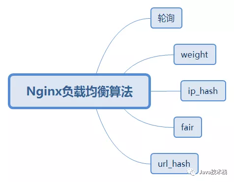
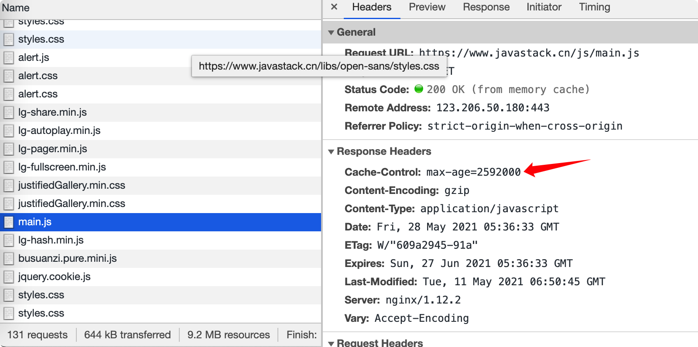
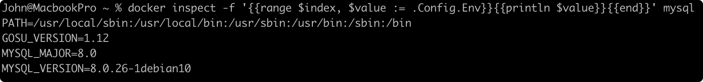

# Tomcat 22

### 1、Tomcat是什么？

Apache Tomcat，简称为**Tomcat**，它是一个开源的、轻量级的Servlet容器和Web服务器。它由Apache Software Foundation维护和开发，是一个用于运行Java Servlet和Java Server Pages（JSP）的Web应用程序的容器。

简单来说，Tomcat是一个用来部署Java动态应用程序（能运行Servlet、JSP）的开源容器，它在Java开发社区中非常流行，也是事实上的Servlet容器标准。

### 2、Tomcat和Apache HTTP服务器有什么区别？

Apache Tomcat是一个Java应用程序容器，它支持动态内容的生成，只要用于运行Java Servlet和Java Server Pages（JSP）的Java Web应用程序。

Apache HTTP服务器则是一个通用的Web服务器，它不具备Java Servlet容器功能，它主要用于提供静态内容服务（静态网页、图片、CSS、JavaScript等）和反向代理功能，但也还支持动态内容服务。

### 3、Tomcat默认端口是多少？怎么修改？

Tomcat默认HTTP端口是：8080，默认HTTPS端口是：8443。

##### 修改方法：

修改tomcat/conf/server.xml配置文件：

```xml
<Connector
           connectionTimeout="20000"
           port="8080"
           portocol="HTTP/1.1"
           redirectPort="8443"
           uriEncoding="utf-8" />

<Connector
           port="8443"
           portocol="HTTP/1.1"
           maxTheads="150"
           SSLEnabled="true"
           scheme="https"
           secure="true"
           clientAuth="false"
           sslProtocol="TLS"
           keystorePass="123456"/>
```

### 4、Tomcat有哪些目录及其作用？

**/bin**：脚本和命令目录；

**/conf**：配置文件目录；

**/lib**：运行时加载的jar包目录；

**/logs**：日志目录；

**/webapps**：Web应用程序发布目录；

**/work**：存储编译后的文件目录（如JSP编译后的文件）；

### 5、Tomcat的主要配置文件有哪些？

Tomcat的主要配置文件位于tomcat/conf目录中。

**server.xml**

server.xml包含了Tomcat服务器的全局配置信息，包含连接器（Connectors）、虚拟主机（Virtual Hosts）、资源、安全设置、日志配置等。

**web.xml**

web.xml用于配置Web应用程序的通用部署描述符，包括Servlet 映射、过滤器配置、编码配置、默认的首页等。

**tomcat-users.xml**

tomcat-users.xml用于配置Tomcat的用户、角色和访问控制，这个文件定义了哪些用户可以访问Tomcat的管理界面和Web应用程序，以及他们拥有的角色和权限。

**logging.properties**

logging.properties用于配置Tomcat的日志记录行为，包括日志级别、日志文件位置等。

### 6、Tomcat中的web.xml和项目中的web.xml的区别？

##### Tomcat中的web.xml：

- Tomcat中的web.xml是全局web.xml，它位于tomcat/conf目录下；
- **全局web.xml对所有项目生效**，用于定义Tomcat的默认全局行为。

##### 项目中的web.xml：

- 项目中的web.xml位于每个Web应用程序的WEB-INF目录下；
- **项目中的web.xml只对该项目生效**，用于配置特定的行为。

**总结一下：**

当Tomcat启动时，它会首先加载全局的web.xml，然后加载每个项目中的web.xml，如果项目中存在web.xml，则项目中的web.xml配置会覆盖Tomcat的全局配置。

所以，每个项目可以有自己独特的配置，而不受全局web.xml的影响。

### 7、Tomcat的总体架构是怎样的？

> Tomcat的总体架构是怎样的？画图说明，以及介绍Server、Service、Connector、Container、Engine、Host、Context、Wrapper之间的作用和联系。

Tomcat架构图如下：


（1）Tomcat中只有一个Server；

（2）一个Server可以有多个Service，Service是对外提供服务的；

（3）一个Service只有一个Container，Container用于封装和管理Servlet，以及处理request请求；

（4）一个Service可以有多个Connector，Connector用于接受请求并将请求封装成Request和Response来处理；

（5）一个Service只能由一个Engine引擎，用来管理站点；

（6）一个Engine可以有多个Host，每个Host代表一个站点或者叫虚拟主机；

（7）一个Host可以有多个Context，每个Context代表一个Web应用程序；

（8）一个Context由多个Wrapper，每个Wrapper代表封装一个Servlet；

### 8、Tomcat有哪几种工作模式？

##### 1、独立模式（默认）

这种模式下，Servlet容器组件则是Tomcat服务器的一部分。

和其他Java应用程序一样，Tomcat也作为一个独立的Java应用程序来单独运行，运行Tomcat也需要启动一个Java虚拟机进程，由该进程来运行Tomcat服务器。

##### 2、嵌入式模式

这种模式下，Tomcat可以嵌入到Java应用程序中以嵌入式模式运行，不需要部署独立的Tomcat服务器就能运行Java应用程序。

##### 3、作为其他Web服务器的Servlet容器

这种模式下，Tomcat可以嵌入到其他Java应用服务器中，作为其Servlet容器，而不必开发自己的Servlet容器。

此时Tomcat分为以下两部分：

- Web服务器插件
- Servlet容器

Web服务器插件会在其他Web服务器进程内部（或者外部）地址空间启动一个Java虚拟机，Servlet容器组件则在这个Java虚拟机中运行。

### 9、Tomcat Connector支持哪几种运行模式？

1、BIO（blocking I/O）

传统的同步阻塞IO，性能最低。

```xml
<Connector
           prot="8080"
           protocol="HTTP/1.1"
           connectionTimeout="20000"
           redirectPort="8443" />
```

##### 2、NIO（non-blocking I/O）

JDK 1.4开始支持，同步非阻塞IO，比BIO有更好的并发性能。

修改protocol参数：

```xml
<Connector
           prot="8080"
           protocol="org.apache.coyote.http11.Http11NioProtocol"
           connectionTimeout="20000"
           redirectPort="8443" />
```

##### 3、APR（Apache Portable Runtime）

这种安装起来最困难，它是从操作系统的级别来解决异步的IO问题，以JNI的形式调用Apache HTTP服务器的核心动态链接库来处理文件读取或网络传输操作，从而大大的提高Tomcat对静态文件的处理性能。

修改protocol参数：

```xml
<Connector
           prot="8080"
           protocol="org.apache.coyote.http11.Http11AprProtocol"
           connectionTimeout="20000"
           redirectPort="8443" />
```

### 10、Tomcat默认IO模型是什么？

Tomcat8+版本中默认使用的是NIO模式，8之前的版本默认使用的是BIO。

### 11、Tomcat有哪几种部署项目的方式？

##### 1、自动部署

最简单的方式是将Web应用程序的war包压缩文件（.war）复制到tomcat/webapps目录中，Tomcat将自动检测、解压、并部署war包文件，访问根路径既是war包名称。

确保以下默认配置支持自动解压和自动部署：

```xml
<Host name="localhost" appBase="webapps" unpackWARs="true" autoDeploy="true" />
```

参数解释：

- name：虚拟主机的名称；
- appBase：应用所在根目录；
- unpackWARs：是否自动解压war包文件；
- autoDeploy：是否自动部署；

##### 2、自定义部署

另外常用的就是使用自定义部署，把解压后的项目复制到tomcat/webapps目录中，然后在Host节点配置下新增一个Context配置：

```xml
<Host name="localhost" appBase="webapps" unpackWARs="true" autoDeploy="true">
	<Context path="/test" docBase="examples" debug="0" reloadable="true"></Context>
</Host>
```

参数解释：

- path：
- docBase：
- debug：
- reloadable：

这样就可以通过/test来访问部署好的tomcat/webapps/examples项目，同时也不会影响自动部署功能。

##### 3、嵌入式部署

如果项目使用的Spring Boot框架，并打成可执行的jar包，它内部默认内嵌Tomcat容器，运行项目jar包会自动启动Tomcat容器，无需关心部署问题。

### 12、Tomcat创建Servlet类实例的流程是怎样的？

Tomcat创建Servlet类实例的过程主要依赖于Servlet规范的实现和Java的反射机制。

##### 以下是基本流程：

（1）Tomcat启动时，他会扫描Web应用程序的web.xml部署描述文件。

（2）解析web.xml文件，使用Java类加载机制加载所有注册的Servlet类。

（3）使用Java反射机制实例化所有Servlet类。

（4）调用Servlet的init方法初始化Servlet。

（5）调用Servlet的service方法处理请求。

### 13、Tomcat怎么支持https访问？

##### 1、修改配置文件

打开tomcat/conf.server.xml配置文件，把下面这段配置注释取消掉：

```xml
<Connector port="8443"
           protocol="HTTP/1.1"
           maxThreads="150"
           SSLEnabled="true"
           scheme="https"
           secure="true"
           clientAuth="false"
           sslProtocol="TLS"
           keystorePass="123456" />
```

keystorePass为证书密钥需要手动添加，创建证书时指定的。

##### 2、创建证书

使用jdk工具类里面的keytool命令来生成证书，按照提示输入响应的信息。

```shell
C:\>keytool -genkey -alias https -keyalg RSA
输入密钥库口令：
您的名字与姓氏是什么？
	[Unknown]: test
您的组织单位名称是什么？
	[Unknown]: test
您的组织名称是什么？
	[Unknown]: test
您所在的城市或区域名称是什么？
	[Unknown]: test
您所在的省/市/自治区名称是什么？
	[Unknown]: test
该单位的双字母国家/地区代码是什么？
	[Unknown]: test
CN=test, OU=test, O=test, L=test, ST=test, C=
	[否]：y
	
输入<https>的密钥口令
	（如果和密钥库口令相同，按回车）：
	再次输入新口令：
```

这里的密钥口令就是配置文件中的keystorePass配置。

##### 访问https

> 通过https://localhost:8443/your-project就能访问https项目。

这种方式只适合本地开启https测试，线上环境需要购买商业授权的证书，不过原理都是一样的。

### 14、Tomcat实现Session共享有哪些方式？

##### 1、使用Tomcat内置的Session复制功能

这种配置最简单，缺点就是当集群数量较多时，Session复制的时间会比较长，可能会影响业务。

##### 2、使用第三方来存放共享Session

目前用的较多的是使用memcached/redis来管理共享Session，借助于这些中间件的快速内存存储来进行Tomcat的Session管理。

##### 3、使用黏性session策略

这就是所谓的session sticky策略，同一个用户的session由nginx转发给同一个Tomcat来处理，处理效率高，缺点就是不适用于强会话要求的场合。

### 15、Tomcat为什么打破双亲委派模型？

> JDBC、Tomcat都打破了双亲委派模型，那它们为什么要破坏双亲委派模型呢？

##### 比如Tomcat，出于下面三类目的：

（1）对于各个webapp应用中的class和lib，各个应用、或者一个应用不同版本需要相互隔离，如果采用标准的双亲委派模型，一个应用加载类库后会影响到另一个应用不能加载。另外，对于许多应用，需要有共享的lib以便不浪费资源。

（2）与JVM一样，要考虑安全性问题，需要使用单独的ClassLoader装载Tomcat自身的类库，以免被其他程序恶意或无意的破坏。

（3）Tomcat采用了自己的类加载器来加载日志配置文件和类库，以便避免与应用程序的日志产生冲突。

总结，Tomcat通过实现自己的类加载器打破了双亲委派模型，是为了解决应用程序和Tomcat自身的类库版本冲突问题，以及提供更好的类加载机制、安全和日志机制。

### 16、Tomcat怎么调优？

##### 1、优化线程池配置

调整Tomcat的线程池配置，包括最大线程数和最小空闲线程数等，合理的线程池配置可以提高并发处理能力。

##### 2、优化JVM参数

调整JVM参数，包括堆大小、垃圾回收策略和线程池配置，以提高性能。

##### 3、启用GZIP压缩

在Tomcat的Connector配置中启用HTTP相应内容的GZIP压缩，以减小传输数据的大小，节省带宽和提高加载速度。

##### 4、启用缓存

使用Tomcat内置或反向代理服务器的缓存功能，以减轻Tomcat的负载并提高响应速度。

### 17、Tomcat中的maxConnections、acceptCount、maxThreads的区别？

参数解释：

- maxConnections：是指同一时间，Tomcat能接收和处理的最大连接数。
- acceptCount：是指达到最大连接数（maxConnections）时，Tomcat能把额外请求放入队列的最大长度。
- maxThreads：是指Tomcat线程池实际处理请求的最大线程数。
- 所以，Tomcat能够接收和处理的**最大连接数** **= maxConnections + acceptCount**，超过的就会被拒绝，而同时处理请求的个数是和**maxThreads**参数相关的。

>**这三者的区别可以举个例子**：
>
>- 餐厅只有30个（maxConnections）桌子
>- 餐厅只能接受20人（acceptCount）排队
>- 餐厅只能同时处理5桌（maxThreads）订单

### 18、Tomcat最大连接数默认是多少？怎么修改？

Tomcat最大连接数默认是**8192**个，可以通过`maxConnections`配置参数修改：

```xml
<Connector
           prot="8080"
           protocol="HTTP/1.1"
           maxConnections="500"
           connectionTimeout="20000"
           redirectPort="8443" />
```

这里修改为500个，超过限制会进入等待队列，队列也满了就会拒绝请求。

> 对于NIO/NIO2请求，如果将maxConnections值设置为-1，将禁用maxConnectins特性，也就是不限制连接数。

### 19、Tomcat最大连接队列长度默认是多少？怎么修改？

Tomcat最大连接队列长度默认是100个，可以通过`acceptCount`配置参数修改：

```xml
<Connector
          prot="8080"
          protocol="HTTP/1.1"
          maxConnections="500"
          acceptCount="200"
          connectionTimeout="20000"
          redirectPort="8443" />
```

这里修改为200个，超过最大连接数（maxConnections）限制会进入等待队列，队列也满了（达到acceptCount大小）就会拒绝请求。

### 20、Tomcat线程池默认是多大？怎么修改？

Tomcat的线程池配置：

- minSpareThreads：最小线程数，默认为**10**个；
- maxThreads：最大线程数，默认为**200**个；

配置实例如下：

```xml
<Connector
           prot="8080"
           protocol="HTTP/1.1"
           minSpareThreads="100"
           maxThreads="1000"
           connectionTimeout="20000"
           redirectPort="8443" />
```

也可以使用`executor`参数指定自定义的线程池：

```xml
<Connector
           port="8080"
           protocol="HTTP/1.1"
           minSpareThreads="100"
           maxThreads="1000"
           executor="tomcatThreadPool"
           connectionTimeout="20000"
           redirectPort="8443" />
<Executor
          name="tomcatThreadPool"
          namePrefix="cataline-exec-"
          minSpareThreads="50"
          maxThreads="500"
          maxQueueSize="100" <!--- 默认为Integer最大值 ->
/>
```

如果同时设置，Connector上面的线程池参数就会被忽略。

### 21、Tomcat线程池和Java原生线程池有什么区别？

Tomcat线程池扩展了Java原生线程池，扩展后的机制稍微有不同，下面会以Tomcat 10.1.8版本的源码为示例进行分析。

##### 1、工作流程不同

Tomcat扩展了ThreadPoolExector和LinkedBlockingQueue队列类，见Tomcat中的AbstractEndpoint#createExecutor类中的创建执行器方法：

```java
public abstract class AbstractEndpoint<S, U> {
    ...
    public void createExector () {
    	internalExecutor = true;
        TaskQueuq taskqueue = new TaskQueue();
        TaskThreadFactory tf = new TaskThreadFactory();
        executor = new ThreadPoolExecutor(getMinSpareThreads(), getMaxThreads(), 60, TimeUnit.SECONDS, taskqueue, tf);
        taskqueue.setParent((ThreaPoolExecutor) executor); 
    }
}
```

重点来看TaskQueue#offer插入队列方法：

```java
public class TaskQueue extends LinkedBlockingQueue<Runnable> {
  ...
      
      @Override
      public boolean offer(Runnable o) {
      // we can't do any checks
      if (parent == null) {
          return super.offer(o);
      }
      // we are maxed out threads, simply queue the object
      // 如果当前活跃的线程数等于最大线程数，就不能创建新线程了，直接放入队列中
      if (parent.getPoolSizeNoLock() == parent.getMaximumPoolSize()) {
          return super.offer();
      }
      // we have idle threads, just add it to the queue
      // 如果当前提交的任务数小于等于当前活跃的线程数，表示还有空闲线程，直接添加到队列，让线程去执行即可
      if (parent.getSubmittedCount() <= parent.getPoolSizeNoLock()) {
          return super.offer(o);
      } 
      // if we have less threads than maximum force creation of a new thread
      // 如果当前活跃的线程数小于最大线程数，此时返回false，表示不是放入队列，而是创建新线程
      if (parent.getPoolSizeNoLock() < parent.getMaximumPoolSize()) {
          return false;
      } 
      // if we reached here, we need to add it to the queue
      // 到这里再直接插入队列
      return super.offer(o); 
  }
    ...
}
```

如果总线程数达到了corePoolSize，Tomcat优先创建新线程，直到maxPoolSize满了才会插入队列。而不会像JDK那样直接插入队列，队列满了才去创建新线程，这样就避免了在使用无界队列时任务堆积在队列。

> 工作流程区别如下：
>
> - JDK线程池流程：corePoolSize --> queue --> maxPoolSize --> RejectedExecutionException 
> - Tomcat线程池流程：corePoolSize --> maxPoolSize --> queue --> RejectedExecutionException

##### 2、首次被拒后再次进队列

ThreadPoolExecutor#execute执行方法源码如下：

```java
public class ThreadPoolExecutor extends AbstractExecutorService {
    ...
        @Override
        public void exectue(Runnable command) {
        	submittedCount.incrementAndGet();
        try {
            executeInternal(command);
        } catch (RejectedExecutionException rx) {
            if (getQueue() instanceof TaskQueue) {
                final TaskQueue queue = (TaskQueue) getQueue();
                if (!queue.force(command)) {
                    submittedCount.decrementAndGet();
                    throw new RejectedExecutionException(sm.getString("threadPoolExecutor.queueFull"));
                }
            } else {
                submittedCount.decrementAndGet();
                throw rx;
            }
        }
    }
}
```

如果队列满了，JDK执行了拒绝策略，Tomcat会再次尝试将任务插入到队列中，如果插入失败，才最终执行拒绝策略。

### 22、一个Tomcat部署多个应用，有几个JVM？

一个Tomcat对应一个进程，**一个进程只会启动一个JVM**，里面可以部署多个应用。

在Tomcat中，每个Web应用程序都会有一个独立的ClassLoader，相互独立，这样可以避免应用程序之间的类冲突问题。

# Netty 24

### 1、Netty是什么？

Netty是目前最流行的由JBOSS提供的一个Java开源框架NIO框架，Netty提供异步的、事件驱动的网络应用程序框架和工具，用以快速开发高性能、高可靠性的网络服务器和客户端程序。

Netty的所有IO操作都是异步非阻塞的，通过Future-Listener机制，用户可以方便的主动获取或者通过通知机制获得IO操作结果。

### 2、Netty有什么优势？

Netty是完全基于NIO实现的，所以Netty也是非阻塞的。

##### 相比JDK原生NIO，Netty有以下优势：

1、API使用简单，易上手，开发门槛低；

2、功能强大，预置了多种编解码，支持多种主流协议；

3、定制能力强，可以对通信框架进行灵活地扩展；

4、性能高，Netty是所有Netty框架中综合性能最优的；

5、成熟、稳定、社区活跃，不需要再为NIO的BUG而烦恼；

### 3、Netty为什么传输那么快？

Netty为什么传输快，是因为利用了NIO的一个特性-零拷贝，他避免了没有必要的拷贝，从而加快了传输速度。

### 4、Netty和Tomcat有什么区别？

Tomcat是一个专门的Servlet容器，即基于http协议的Web服务器。

Netty则是一个异步NIO通信框架，也可以基于自定义编码和解码实现http、web socket等自定义协议。

### 5、Netty在哪些技术中有应用到？

常见的比如说有阿里的Dubbo、RocketMQ，它们主要都是基于Netty实现连接通信的。

### 6、Netty有哪些核心组件？

##### Netty有以下几个核心组件：

1、Channel（IO操作通道，处理基本的I/O操作）

2、ChannelHandler（通道处理器，用来处理各种事件）

3、ChannelPipeline（通道处理流水线，ChannelHandler的处理容器）

4、ChannelFuture、ChannelFutureListener（处理异步操作结果）

5、EventLoop（事件驱动模型）

### 7、Netty支持哪几种Reactor线程模型？

##### Netty支持以下几种Reactor线程模型：

##### 1、Reactor单线程模型

所有的IO操作都在一个线程中完成。

##### 2、Reactor多线程模型

由一个NIO线程负责监听服务端，并接收客户端的连接请求，再由另外一组NIO线程来处理IO的读写操作。

##### 3、主从Reactor多线程模型

有多个NIO线程接收客户端的连接请求，可以解决上面的单个NIO线程接收连接请求的性能问题；

可以通过配置启动参数来使用不同的线程模型。

### 8、Netty中的线程组描述一下？

##### Netty服务端有2个NioEventLoopGroup线程组：

- bossGroup老板线程组：用于处理客户端的连接请求；
- workerGroup工作线程组：用来处理IO事件；

来张网上盛传的Netty框架图：


### 9、Netty Boss线程数设置多少比较合适？

如果服务端只监听了一个端口，一般设置1个就行。

如果服务端只监听也多个端口，就需要设置成对应的端口数。

### 10、Netty线程组默认生成多少个线程？

如源码所示：

```java
private static final int DEFAULT_EVENT_LOOP_THREADS
```

如果没有指定数量，也没有指定“-Dio.netty.eventLoopThreads = x”这个JVM参数，那么这个线程组的默认线程数为CPU*2。

### 11、Netty有哪几种发送消息的方式？

Netty有两种发送消息的方式：

1、写入Channel当中，消息会从ChannelPipline的末尾开始流动，会经过所有的ChannelHandler；

2、写入与ChannelHandler所关联的ChannelHandlerContext当中，消息将从ChannelPipleline中的下一个ChanelHandler开始流动；

第2种方法会经过更少的ChannelHandler，而不是所有，除非必要，一般建议使用第2种提升性能。

### 12、Netty支持哪些超时时间设置？

##### Netty支持一下3种超时时间设置：

1、readerldleTime（读数据超时时间）

2、writerldleTime（写数据超时时间）

3、alldleTime（读或写超时时间）

### 13、Netty如何拒绝非法连接？

如果有黑、白名单列表，那么可以使用IpFilterRuleHandler类进行过滤。

如果没有，就需要再通道连接的时候进行身份验证，以拒绝非法连接。

### 14、Netty如何一直保持长连接？

一般在建立连接后，客户端需要在服务端设置的超时时间范围内，每N秒给服务器发送一次心跳，以保持长连接，否则服务器会关闭连接。

如果客户端自己掉线了，可以使用指定的重连策略进行重连操作。

### 15、Netty如何分别用户对应的通道？

一般在内存中维护一个ConcurrentHashMap<String, String>，用于绑定用户与通道之间的关系。

对应关系：userId <> Channelld

### 16、Netty如何实现集群高可用？

##### 参考方案如下：

1、利用Zookeeper临时节点特性，维护Netty的生命周期等信息；

2、提供一个WEB接口，返回当前负载最小的Netty服务器（IP/端口）；

3、客户端根据接口获取返回的Netty服务器（IP/端口）信息，再进行连接；

### 17、Netty如何保证连接的安全性？

##### 可以使用以下3种安全措施：

1、使用SSL协议；

2、使用IP地址黑名单；

3、使用安全的加密算法认证；

### 18、Netty高性能表现在哪些方面？

##### 主要表现在以下几个方面：

1、基于NIO，异步非阻塞通信；

2、支持零拷贝技术；

3、高效的Reactor线程模型；

4、高效的并发编程；

5、支持多种内存管理策略；

6、无锁串形化读写处理；

7、支持多种高性能序列化协议；

8、灵活配置TCP参数；

### 19、Netty是如何实现高效并发编程的？

##### 主要使用了以下几个技术：

1、读写锁的应用；

2、CAS及相关原子类的应用；

3、线程安全的容器的应用；

4、vilatile轻量级锁的应用；

5、不依赖于线程的优先级；

### 20、Netty无锁串形化设计是指什么？

Netty无锁串形化设计是为了提高性能，即一个消息的处理都尽量在一个县城内串行化完成，而不需要切换线程，避免了多线程并发处理下的锁竞争性能损耗。

### 21、Netty中的零拷贝体现哪些方面？

##### Netty中的零拷贝体现在以下3个方面：

1、Netty的接收和发送ByteBuffer，使用了堆外直接内存进行Socket读写；

2、Netty可以同时操作多个ByteBuffer对象，就像操作单个Buffer一样；

3、Netty中的文件传输使用了transferTo方法，它可以将文件缓冲区的数据直接发给目标Channel；

这3种情况都可以避免不必要的内存拷贝，提升传输效率。

### 22、Netty中的内存池的作用是？

因为堆外直接内存的分配和回收工作是非常耗时的，为了提高性能、节省内存，Netty提供了内存池机制，可以重用缓冲区Buffer，循环利用ByteBuffer。

### 23、Netty如何解决拆包粘包问题？

##### 1、固定长度

使用：FixedLengthFrameDecoder

##### 2、通过分隔符

使用：

- LineBasedFrameDecoder（通过换行符）
- DelimiterBasedFrameDecoder（通过指定分隔符）

##### 3、通过记录数据包的长度

使用：LengthFieldBasedFrameDecoder

##### 4、自定义拆包和粘包

通过：MessageToByteEncoder、ByteToMessageDecoder

### 24、Netty编码、解码用什么框架？

##### 主要有以下几大序列化框架：

1、JDK原生序列化（不推荐）

2、Google的Protobuf；

# Nginx 41

### 1、你怎么理解负载均衡？

负载均衡，英文名称为：Load Balance，就是将请求分配到多个服务器上运行，加强网络的数据处理能力，从而提高了应用的吞吐能力，也提高了应用的性能、高可用性、容灾能力。

最简单的理解，没有负载均衡，单机挂了怎么办？

### 2、什么是Nginx？

Nginx是一个轻量级、高性能的Web服务器/反向代理服务器，其特点是占有内存少，并发能力强，它可以非常高效的实现反向代理、负载均衡，在高并发情况下，Nginx也是Apache服务器的一个不错的替代品。

### 3、Nginx有哪些应用场景？除了负载均衡还能做什么？

##### Nginx功能很强大，主要包括以下功能：

1、HTTP服务器；

2、动静分离；

3、正向代理；

4、反向代理；

5、负载均衡；

6、资源缓存；

7、限流；

8、黑、白名单；

### 4、Nginx性能为什么这么高？

这是因为Nginx的事件处理机制：异步非阻塞事件处理机制，它使用了epoll模型，将要处理的连接都放入队列中，然后只对队列中的连接进行处理，而不需要遍历轮询所有的连接。

### 5、Nginx是单线程还是多线程？

Nginx实现了对epoll的封装，采用的是**多进程和单线程**以及多路IO复用模型。

这样不仅能提高病发率，而且进程之间是相互独立的，一个进程挂了不会影响到其他进程。

### 6、Nginx负载均衡算法有哪些？

Nginx有5种负载均衡算法：



##### 1、轮询（默认）

每个请求按时间顺序逐一分配到不同的后端服务器，如果后端服务器down掉，能自动剔除。

##### 2、权重（weight）：

指定轮询几率，weight和访问比率成正比，用于后端服务器性能不均的情况。


如图，权重设置越大，被访问的几率越大。

##### 3、ip_hash（IP绑定）


每个请求按访问IP哈希分配，同一个IP的请求转发到同一台固定服务器。

##### 4、fair（第三方）

按后端服务器的响应时间分配请求，响应时间短的优先分配。


##### 5、url_hash（第三方）

按访问url的hash结果来分配请求，是每个url定向到同一个后端服务器，后端服务器为缓存时比较有效。

例：在upstream中加入hash语句，server语句中不能写入weight等其他的参数，hash_method是使用的hash算法。


### 7、Nginx常用命令有哪些？

启动：nginx

指定配置文件启动 nginx -c /usr/local/nginx/conf/nginx.conf

停止：nginx -s stop 或 nginx -s quit

重启：nginx -s reload 或 service nginx reload

查看当前版本：nginx -v

查看命令行帮助：nginx -h

### 8、Nginx如何配置http服务？

Server模块http配置示例：


### 9、Nginx如何配置https服务？

Server模块https配置示例：


### 10、Nginx如何实现请求重定向？

如把http请求重定向至https：


### 11、Nginx如何自定义错误返回信息？

参考配置如下：


503错误自定义返回错误信息。

### 12、Nginx如何分开管理配置文件？

可以把配置分离到新的配置文件，然后引入即可：


### 13、Nginx怎么实现Session Stick？

##### 有两种做法：

（1）使用基于ip_hash的负载均衡算法，即相同IP的请求转发到同一台服务器；如果Nginx不是最前端的负载均衡的话，可能也是被分流之后的，这种方法就不推荐使用，因为不能获取准确的客户端IP。

（2）使用Nginx的扩展模块：nginx-sticky-module，用来实现基于Cookie的Session Sticky的功能，推荐使用这种方法。

### 14、Nginx master和work进程的区别？

master是Nginx的主进程，只能有一个，主要用来管理worker进程的，以及读取配置文件等其他工作。

work是Nginx的工作进程，可以有多个，但一般不要大于服务器CPU的总核心数量，尽量避免了多个worker进程抢占同一个CPU的情况。


### 15、Nginx如何隐藏响应头中的版本号？

可以配置nginx不再显示版本号：


效果如下：


nginx字样也不要显示的话，需要修改源码重新编译。

### 16、Nginx如何配置黑、白名单？

##### 白名单设置：


##### 黑名单设置：


### 17、Nginx如何实现限流？

##### Nginx提供两种限流方式：

##### （1）控制请求速率

可以使用ngx_http_req_module模块控制请求处理速率，它使用的是漏桶限流算法，具体可以参考官网文档，


##### （2）限制并发连接数

可以使用ngx_http_limit_conn_module模块限制并发连接数。

配置示例：


### 18、Nginx如何开启压缩？

Nginx可以开启gzip压缩，可以压缩网页上的css、js等静态资源，从而大大节约带宽，从而提高传输效率和网页展示速度。

##### 开启的配置如下：

在http或server模块添加以下配置：


效果如下：


### 19、Nginx如何缓存静态资源？

参考配置如下：


效果如下：



### 20、Nginx如何实现后端服务健康检查？

##### 主要有两种方式：

（1）通过Nginx的自带模块

ngx_http_proxy_module和ngx_http_upstream_module；

（2）通过nginx_upstream_check_module模块（推荐使用）

### 21、Nginx有哪些优化措施？

##### Nginx常用优化配置：

1、工作线程数配置为CPU核心数一致；

2、配置每个进程允许的最多连接数；

3、启用gzip压缩，提高页面的加载速度；

4、启用静态资源缓存，可以大幅提升性能；

5、禁用页面静态资源请求的日志记录；

6、启用HTTP2协议；

7、合理配置HTTP连接超时时间，默认是60s；

。。。

### 22、Nginx如何实现服务高可用？

一台Nginx会出现单点故障，生产环境需要实现Nginx高可用。

##### 主要实现方案：Nginx＋Keeplived

两台Nginx，一主一备，同时只有主Nginx提供服务，每台Nginx都装有Keeplived软件并启动服务。

##### 实现原理：

1、Nginx主节点不断地向备节点发送心跳，以通知备节点自己还活着；

2、当主节点发生故障时，备节点就无法收到主节点的心跳消息，于是备节点就会接管主节点的IP资源及服务；

3、当原来的主节点恢复时，备节点又会停止服务并恢复到原来的备用节点角色；

### 23、Nginx挂了一台Tomcat会怎样？

如果请求发送到这台挂了的Tomcat，会有一个连接超时时间（proxy_connect_timeout），默认超时时间时1分钟，1分钟如果没有相应，就回去连接另外一台Tomcat服务器。

另外，Nginx可以提出挂掉的Tomcat服务器，不在接收新的请求。

### 24、Nginx如何剔除挂掉的Tomcat？

Nginx有自带的健康检查功能，能剔除挂掉的Tomcat服务器以不在访问的服务器列表中。

### 25、OpenResty是什么？


如图，OpenResty是一个基于Nginx与Lua的高性能Web平台，是由国人**张亦春**发起的开源项目（也有商业产品），其内部集成了大量精良的Lua库、第三方模块，可用于方便地搭建能够处理超高并发、扩展性极高地动态Web应用、Web服务和动态网关。

OpenResty通过汇聚分钟设计精良地Nginx模块（主要由OpenResty团队自主开发），可以使用Lua脚本语言调动Nginx支持地各种C以及Lua模块，快速构造出足以胜任10K乃至1000K以上单机并发连接地高性能Web应用系统。

OpenResty地目标是让你的Web服务直接跑在Nginx服务内部，充分利用Nginx地非阻塞I/O模型，不仅仅对HTTP客户端请求，甚至于对远程后端诸如MySQL、PostgreSQL、Memcached以及Redis等都进行一致地高性能响应。

##### 目前，OpenResty主要由OpenResty软件基金会和OpenResty Inc.公司提供支持。

### 26、OpenResty和Nginx地区别？

OpenResty是对Nginx的封装，并且集成了Lua库和第三方Nginx模块，并且提供了大量组件，如：MySQL、Redis等，使得Nginx开发Web应用更方便。

### 27、OpenResty和Nginx怎么选？

如果不是深度用户，只是简单的使用Nginx负载均衡、缓存、限流，使用Nginx救助够了。

如果要使用到Nginx + Lua脚本，或者第三方模块，或者开发高性能的Web应用，使用OpenResty会更好，OpenResty现在在国内使用特别多，很多大厂都在用。

### 28、OpenResty可以代替Nginx么？

OpenResty是基于Nginx、Lua开发的，完全可以代替Nginx使用。

### 29、Tengine是什么？

Tengine即Taobao-Enging，是由淘宝网发起的Web服务器项目，与2011年开源，完全兼容Nginx，并在Nginx的基础上，针对大访问量网站的需求，添加了很多高级功能和特性。

Tengine的性能和稳定性已经在阿里的诸多大型的网站中得到了很好的检验，如淘宝网、天猫商城，另外在某些大厂也有在用Tengine的。

### 30、Tengine和Nginx怎么选？

##### 性能方面：

Tengine相比Nginx默认配置，提升200%的处理能力。

Tengine相比Nginx优化配置，提升60%的处理能力。

##### 功能方面：

##### 特性


大型公司注重优化的考虑用Tengine，中小型公司用Nginx足够了，Nginx文档和资料更丰富。

### 31、Tengine可以代替Nginx吗？

可以，Tengine完全兼容Nginx。


### 32、OpenResty和Tengine的区别是什么？

##### OpenResty和Tengine都和阿里有点关联：

- OpenResty是前淘宝工程师章亦春主导开源的项目；
- Tengine是淘宝的一个开源项目；

区别就是，它们都是基于Nginx构建的两个不同的开源版本，OpenResty最大的亮点是丰富的第三方模块及对Lua的良好支持，而Tengine则是融入了淘宝自身的一些业务带来的新特性及淘宝内部大量的优化。

### 33、Keepalibed是什么？

Keepalived最初是专为LVS负载均衡软件而设计的一个软件，用来管理并监控LVS集群系统中各个服务节点的状态。

Keepalived后来又加入了可以实现高可用的**VRRP**（）功能，即：**虚拟路由器冗余协议**，所以Keepalived还被用作其他服务（例如：Nginx、Haproxy、MySQL等）的高可用解决方案。

### 34、LVS是什么？

LVS全称：Linux Virtual Server（Linux虚拟服务器），是一个虚拟的服务器集群系统，在1998年5月由国内章文嵩博士成立的开源负载均衡项目，目前已经被集成到Linux内核模块中。

LVS集群采用IP负载均衡技术和基于内容请求分发技术，将请求均衡地转发到不同的服务器上进行执行。

LVS将一组服务器构建成一个高性能的、高可用的虚拟服务器集群，整个集群架构对客户端是透明的，而且无需修改客户端和服务器端的代码。

### 35、LVS有哪几种工作模式？

##### LVS有3种工作模式：

1、**DR模式**（直接路由模式：Director Route）

2、**TUN模式**（隧道模式：tunnel）

3、**NAT模式**（网络地址转换模式：Network address translation）

-----

其中，DR模式性能最好，用的最多。

### 36、LVS有哪些相关的IP？

##### LVS相关的几个IP：

| IP                 | 描述                                  |
| ------------------ | ------------------------------------- |
| VIP（Virtual IP）  | LVS服务器上接收外网数据报文的IP地址   |
| DIP（Director IP） | LVS服务器上发送数据报文到RS的IP地址   |
| RIP（Real IP）     | 真实服务器IP，简称为RS（Real Server） |
| CIP（Client IP）   | 客户端IP                              |

### 37、HAproxy是什么？

HAproxy是一个由C语言编写的高可用、开源的负载均衡软件，基于TCP（第四层）和HTTP（第七层）应用程序代理，是一个免费、快速并且可靠的一种负载均衡解决方案。

HAProxy实现了一种**事件驱动，单一进程**模型，此模型支持非常大的并发连接数，所以，HAProxy一般适用于那些负载稍微大一点的网站。

### 38、LVS、HAproxy、Nginx的区别？

**LVS**：基于四层的转发；

**HAproxy**：是基于四层和七层的转发，是专业的代理服务器，除了Web，还可以是MySQL等中间件的负载均衡；

**Nginx**：是WEB服务器，反向代理服务器，可以做七层的转发；

---

转发性能：LVS > HAproxy > Nginx

功能便利性：Nginx > HAproxy > LVS

### 39、LVS、HAproxy、Nginx怎么选？

LVS稳定性和性能方面都比较强，适用于千万级别流量的大型网站，中/小型网站用**HAproxy/Nginx + Keepalived**完全就够了。

##### 另外，对于一个大型网站来说，三者也可能会配合一起使用，它们分别工作在不同的层级：

- LVS工作在接入层的最前端，负责大规模流量的分发；
- HAproxy负责按域名进行分流，还能负责其他中间件（比如：MySQL）的负载均衡；
- Nginx可作为单机内多实例的转发、分流、静态资源缓存等；

### 40、F5负载均衡是什么？

F5是一款由F5 Networks公司提供的商业负载均衡设备，可以做4~7层负载均衡。


F5的优点就是处理能力要更强，并且与系统无关，功能也非常强大：

> 负载均衡、应用交换、绘画交换、状态监控、智能网络地址转换、通用持续性、响应错误处理、IPv6网关、高级路由、智能端口镜像、SSL加速、智能HTTP压缩、内容转换、连接加速、高速缓存、Cookie加密、选择性内容加密、应用攻击过滤、拒绝服务（Dos）攻击和SYN Flood保护、防火墙一包过滤、包消毒等...

F5缺点就是成本太高。

### 41、F5和Nginx负载均衡的区别？

两者没有可比性，可以结合使用，也可以独立使用。

如图：


F5是一款负载均衡硬件设备，处于网络接入的最上游，然后再把请求转发到Nginx这样的软负载均衡/反向代理服务器。

F5属于硬负载均衡器，而LVS/HAproxy/Nginx属于软负载均衡器。

##### Nginx在2019年已经被F5收购，目前仍开源。

# Docker 74

### 1、什么是虚拟化技术？

虚拟化技术可以将一台物理服务器虚拟为多台逻辑服务器，每台逻辑服务器可运行不同的操作系统，系统内的应用程序也相互隔离不受影响，从而显著提高服务器的运行效率。

### 2、常用的虚拟化技术有哪些？

**常用的虚拟化技术有**：OpenStack、KVM、VMWare

### 3、LXC是什么？

LXC是指：Linux Container，即Linux内核容器技术。

LXC利用cgroup与namespace的功能，将Linux进程进行沙盒化，使得进程之间可以相互隔离，并且能够控制各进程的资源分配。

### 4、Docker是什么？

Docker是现在最主流的开源容器，遵循Apache 2.0协议，使用GO语言进行开发，始于2013年，现已加入Linux基金会。

我们可以将Docketr理解为一个轻量级的沙盒，Docker容器完全使用沙盒机制，每个容器内都有其独立运行的环境和组件，容器之间是相互隔离互不影响的，也可以进行容器间的通信。

### 5、Docker可以代替LXC吗？

可以。

虽然Docker并不是用来替代LXC的，Docker一开始的底层就是LXC，但现在Docker已经开发了自己的直接使用核心namespaces和cgroup的工具：libcontainer。

### 6、Docker和LXC的区别？

LXC是一个系统容器，而Docker是一个应用程序容器。

Docker比LXC有更多更强的功能：

- 可移植性
- 以应用为中心
- 自动构建
- 组件重用
- 镜像共享
- 工具生态圈
- ...

### 7、k8s是什么？

k8s是kubernetes的缩写，是一个开源的容器集群管理系统，可以实现容器集群的自动化部署、自动扩缩容、维护等功能。

### 8、Docker和k8s到底是什么关系？

Docker是一个开源的应用容器引擎，kubernetes是用来管理Docker集群的，可以实现Docker容器集群的自动化部署、自动扩缩容、维护等功能。

Kubernetes不仅仅支持Docker，还支持其他容器技术。

### 9、Docker和传统虚拟机的区别？

如图所示：


具体对比如下：

| 对比项   | VM             | Docker         |
| -------- | -------------- | -------------- |
| 启动速度 | 分钟级         | 秒级           |
| 部署难度 | 复杂           | 简单           |
| 磁盘占用 | GB级           | MB级           |
| 隔离性   | 完全隔离       | 完全隔离       |
| 资源占用 | 资源多，重量级 | 资源少，轻量级 |

### 10、Docker有哪些优势？

##### Docker的优势：

1、启停非常快，以秒、毫秒为单位的；

2、隔离性好，容器之间没有任何依赖；

3、更高效的资源利用，使用成本非常低；

4、一次构建处处运行，可轻松迁移和扩展；

...

### 11、Docker是免费的吗？

Docker有社区版、企业版。社区版是开源免费的，企业版是收费的，当然也会有更牛逼的特性和服务，一般的应用社区版的足够了。

### 12、Docker的核心思想是什么？

Docker的核心思想是：“**Build once，Run anywhere**”，即：**一次构建，处处运行**，这里可以是一个操作系统，一个Web应用，或者一个数据库服务等。

### 13、Docker的应用场景有哪些？

##### Docker的应用场景有：


（1）简化配置

（2）代码流水线（Code Pipline）管理

（3）提高开发生产率

（4）隔离应用

（5）整合服务器

（6）调适能力

（7）多租户环境

（8）快速部署

### 14、Docker的架构模式是怎样的？

Docker使用客户端/服务端（C/S）架构模式，使用远程API来管理和常见Docker容器。


### 15、Docker是如何实现资源隔离的？

Docker本身就是服务器中的一个进程，Docker使用的是Linux内核和内核功能（例如cgroup和namespace）来分隔进程实现资源隔离的，通过cgroup实现资源限制，通过namespace实现资源隔离。

### 16、Docker支持非Linux操作系统吗？

Docker支持所有主流的操作系统，如：Linux/Mac/Windows，所有主流的云服务也支持Docker，所以，我们可以将应用及依赖、环境信息等打包到一个Docker容器中，可以很轻松的实现应用发布、迁移等。

### 17、Docker为什么能支持Windows系统？

Docker使用的是基于Linux上的namespace和cgroup功能，因此Docker容器理论上无法在其他操作系统上运行。

##### 那么Docker为什么能在非Linux上运行的呢？

原理就是，Docker在非Linux操作系统（Windows、macOS）中安装了一个Linux虚拟机，然后在虚拟机内运行Docker容器。

### 18、Docker为什么不适合部署MySQL？

Docker可以部署MySQL，但一般情况下不建议在Docker中部署MySQL，主要有以下几个原因：

##### 1、数据持久化问题

Docker容器的生命周期和它们存储的数据紧密相关的，当容器被删除时，所有保存在容器内部的数据也会丢失。虽然可以通过挂在外部存储卷（Volumes）到容器来实现数据持久化，但这增加了配置复杂性。

##### 2、性能问题

虽然Docker的性能开销相对较小，但在数据库这种对IO性能要求极高的应用中，即使是微小的性能损失也可能会导致问题。

##### 3、安全问题

虽然Docker提供了一定级别的隔离，但运行在容器中的数据库仍然需要仔细配置，以确保只有授权的客户端可以访问，同时也会增加配置复杂性。

### 19、Docker如何查看版本号？

安装完后使用`docker -v`命令进行可以查看Docker版本：


使用`docker version`还可以看到完整版本信息：


看到Docker版本信息表示安装成功了。

### 20、Docker镜像层是什么？

Docker镜像是由一系列自读层构建的，而每个层代表镜像Dockerfile文件中的一条指令。

### 21、Docker容器层是什么？

Docker每个容器运行时，都会有自己的一个读写层，叫做**容器层**，容器层中保存着容器运行的相关数据，所有数据变化的操作都是在这个读写层中完成，容器被删除时，容器层也会被删除。

### 22、Docker的三大核心组件是什么？

Docker三大核心组件：

（1）Docker仓库

（2）Docker镜像

（3）Docker容器

### 23、Docker仓库、镜像、容器的区别？

**仓库**是用来存放镜像的，**镜像**是一个独立且完整的文件系统，**容器**时镜像的运行时实例。

### 24、Docker仓库是什么？

仓库是集中存储Docker镜像文件的地方，分为**公开、私有**两种仓库。

最大的公开仓库是官方的Docker Hub：

> https://registry.hub.docker.com/

### 25、Docker容器是什么？

**Docker容器**是用来真正运行程序的，它是动态的，一个镜像可以实例化多个容器。

### 26、Docker镜像是什么？

Docker镜像它是一个独立且完整的文件系统（包含运行应用程序所需的代码、运行时、库、环境变量和配置文件等），它是静态的，不包含任何动态数据，其内容在构建之后也不会被改变。

### 27、Docker常用命令说几个？

##### 常用的有：

docker images 列出所有镜像

docker ps -a 列出容器

docker pull 拉取指定镜像

docker push 推送镜像至仓库

docker rmi 删除镜像

docker rm 删除容器

...

### 28、Dockerfile文件有什么用？

Dockerfile是创建Docker镜像的基本配置文件，本身是一个文本文件，也是构建Docker项目的基石。

### 29、Dockerfile最常见的指令有哪些？

##### Dockerfile最常见的指令有：

from：指定基础镜像

arg：指定参数

add：添加资源

label：为镜像指定标签

run：运行指定的命令

cmd：容器启动时要运行的命令

entrypoint：入口配置

---

示例：

```dockerfile
# 添加Java 8镜像来源
FROM java:8

# 添加参数
ARG JAR_FILE

# 添加Spring Boot包
ADD target/${JAR_FILE} app.jar

# 执行启动命令
ENTRYPOINT ["java", "-Djava.security.egd=file:/dev/./urandom", "-jar", "/app.jar"]
```

### 30、Dockerfile中copy和add的区别？

`add`和`copy`都是复制文件/文件夹。

`add`可以从网络/本地复制，`copy`仅支持从本地复制。

`copy`语义更明确，官方推荐使用`copy`。

### 31、Docker怎么检索镜像？

你可以在Docker Hub上搜索镜像：

> https://registry.hub.docker.com/


也还可以通过命令检索：

```dockerfile
docker search mysql
```

结果如下：


### 32、Docker怎么下载镜像？

下载命令为：

> docker pull 镜像名:tag

其中`tag`为版本，可选的，默认不写为`latest`。

下载示例：

```dockerfile
docker pull mysql
```


### 33、Docker镜像定义是哪个文件？

Docker镜像使用的是Dockerfile文件进行定义。

### 34、Docker怎么构建镜像？

Docker通过build命令来构建镜像：

> docker build -t jartto-docker-demo

表示基于当前目录的Dockerfile来构建镜像，-t指定镜像名。

### 35、Docker构建镜像有哪些需要注意的？

构建镜像的几个原则：

（1）选择最精简的基础镜像；

（2）清理镜像构建的中间产物；

（3）减少镜像的层数；

（4）充分利用镜像构建缓存；

（5）优化网络请求；

...

### 36、Docker镜像怎么加速？

推荐几个国内的镜像加速服务：

| 名称     | 地址                                               |
| -------- | -------------------------------------------------- |
| 官方中国 | https://registry.docker-cn.com                     |
| 科大     | https://docker.mirrors.ustc.edu.cn/                |
| 阿里云   | https://help.aliyun.com/document_detail/60750.html |
| 网易     | https://hub-mirror.c.163.com/                      |
| 七牛云   | https://reg-mirror.qiniu.com                       |

### 37、Docker怎么获取镜像列表？

使用命令：

> docker images


RESPOSITORY：镜像名

TAG：为镜像版本，`least`表示最新版本

IMAGE_ID：镜像ID

CREATED：为该镜像创建时间

SIZE：镜像大小

### 38、Docker怎么删除指定镜像？

删除指定镜像：

> docker rmi image-id

### 39、Docker如何导出所有镜像？

逐个导出：

```shell
#!/bin/bash
IMAGES_LIST=($(docker images | sed '1d' | awk '{print $1}'))
IMAGES_NM_LIST=($(docker images | sed '1d' | awk '{print $1"-"$2}' | awk -F/ '{print $NF}'))
IMAGES_NUM=${#IMAGES_LIST[*]}
for((i=0;i<$IMAGES_NUM;i++))
do
	docker save "${IMAGES_LIST[$i]}" -o "${IMAGES_NM_LIST[$i]}".tar.gz
done
```

导出为压缩包：

```shell\
#!/bin/bash
IMAGES_LIST=($(docker images | sed '1d' | awk '{print $1":"$2}'))
docker save ${IMAGES_LIST[*]} -O all-images.tar.gz
```

### 40、Docker如何查看镜像内的环境变量？

参考命令：

> docker inspect -f '{{range $index, $value:=.Config.Env}}{{println $value}}{{end}}'



### 41、Docker如何导入镜像？

参考命令：

> docker load < IMAGE NAME

逐个导入镜像：

```shell
cd ..
for image_name in $(ls ./)
do
	docker load < ${image_name}
done
```

### 42、Docker怎么设置镜像标签？

参考命令：

> docker tag IMAGE ID IMAGE NAME:TAG

使用示例：

> docker tag 350b08e1d774 spring-boot:1.1

### 43、Docker中的虚悬镜像是什么？

如图查询虚悬镜像：

> docker images -f dangling=true


在列表中展示为`<none>`的没有仓库名或没有标签的镜像就是虚悬镜像。

### 44、Docker虚悬镜像是怎么产生的？

在构建镜像时如果打了一个已经存在的标签，这时，Docker会移除旧镜像上面的标签，将该标签应用在新的镜像之上，此时旧镜像就没有标签了，就成了**虚悬镜像**了。

### 45、Docker中的虚悬镜像怎么删除？

##### 1、使用docker rmi删除虚悬镜像

> docker rmi $(docker images -q -f dangling=true)

##### 2、使用docker images prune命令删除虚悬镜像

删除所有无用的镜像，不包括正在使用的镜像：

> docker images prune

删除所有无用的镜像，包括正在使用的镜像：

> docker images prune --all

删除创建时间超过24小时的无用镜像：

> docker images prune --filter "unitil=24h"

### 46、Docker怎么删除所有镜像？

删除所有镜像：

> docker rmi $(docker images -q)

### 47、Docker如何进行镜像分析？

##### 可以使用镜像分析工具：

（1）docker自带的docker image history命令；

（2）镜像分析工具dive；

### 48、Docker如何判断镜像是否需要瘦身？

可以使用比较流行的镜像分析工具：dive，它可以分析出容器镜像有效率、镜像空间浪费率等指标。

如果分析镜像有效率过低，这种情况显然就需要瘦身。

### 49、Docker如何进行镜像瘦身？

可以有以下几种方法：

（1）多阶段构建

（2）减少镜像分层

（3）减少容器中不必要的包

### 50、Docker如何新增一个容器并运行？

新建容器、运行容器都是通过这条命令一次完成的：

> docker run -d -p 80:80 docker/getting-started

这样就等同于镜像新建容器、再运行该容器。

简单解释下各个参数的意思：


也可以缩简成：

```dockerfile
docker run -dp 80:80 docker/getting-started
```

示例：

```shell
docker run -dp 80:80 docker101tutorial
9df38488adcc2a53dad65691854ffc603e1fb3e25954183b83200809805b0d93
```

启动成功会输出该容器的ID。

### 51、Docker怎么启动已停止运行的容器？

参考命令：

```dockerfile
docker start container-name/container-id
```

默认在后台运行。

### 52、Docker容器有哪几种状态？

##### Docker容器的几种状态：

created：已创建，但还没有被启动

running：运行中

paused：容器进程被暂停了

restarting：容器进程正在重启中

exited：容器退出运行了

destroyed：容器已被删除

### 53、Docker如何查看所用容器？

通过`docker ps -a`命令可以查看所有容器。


### 54、Docker如何查看所有运行中的容器？

通过`dockers ps`命令可以查看所有正在运行中的容器：

```bash
$ docker ps 
CONTAINER ID  IMAGE              COMMAND                  CREATED        STATUS        PORTS  NAMES
9df38488adcc  docker101tutorial  "/docker-entrypoint..."  3 minutes ago  Up 3 minutes  0.0.0.0:80->80/tcp  hopeful_gauss
```

### 55、Docker怎么查看容器端口映射？

参考命令：

> docker port container-id

如果返回空，代表没有端口映射。

##  56、Docker怎么查看容器日志？

参考命令：

> docker logs container-id/container-name


### 57、Docker怎么进入运行中的容器？

参考命令：

> docker container exec -it CONTAINER ID /bin/bash

### 58、Docker怎么可交互式运行容器？

方法1：

> docker run -it IMAGE

方法2：

> docker start -i CONTAINER ID

### 59、Docker如何获取运行中的容器进程ID？

方法1：

> docker top CONTAINER ID 


方法2：

> docker inspect --format "{{.State.Pid}}" CONTAINER ID


### 60、Docker如何停止所用运行中的容器？

停止所有运行中的容器：

> docker stop ${docker ps -q}

### 61、Docker如何停止某个运行中的容器？

停止单个运行中的容器：

> docker stop container-name/container-id

### 62、Docker怎么删除所有容器？

删除所有容器：

> docker rm ${docker pa -qa}

包括所有运行中的、未运行的。

### 63、Docker怎么删除某个容器？

删除单个容器：

> docker rm container-id

### 64、Docker如何导入容器？

参考命令1：

> docker import -slq:1.0

参考命令2：

> docker import https://www.slq.com/slq.tar repo

### 65、Docker如何导出容器？

参考命令：

> docker export CONTAINER ID > xx.tar

### 66、Docker如何退出交互式容器终端？

方法1：

> Ctrl + p 然后 Ctrl + q

方法2：

> Ctrl + c

注意：方法2会终止进程，方法1不会！

### 67、Docker容器关闭后数据会丢失吗？

关闭容器，数据不会丢失。

删除容器，数据会丢失。

### 68、docker save和docker export的区别？

docker save保存的是镜像（image）

docker export保存的是容器（container）

### 69、Docker镜像和容器文件的存储位置？

存储位置取决于操作系统：

| 系统    | 目录                                               |
| ------- | -------------------------------------------------- |
| Linux   | /var/lib/docker/                                   |
| Windows | C:\ProgramData\DockerDesktop                       |
| MacOS   | ~/Library/Containers/com.docker.docker/Data/vms/0/ |

### 70、Docker如何清理系统中的无用数据？

清理所有停止的容器、无用的网络、临时镜像及构建缓存：

> docker system prune


更彻底的清理：

> docker system prune -a


### 71、Docker如何查看磁盘占用情况？

使用命令：

> docker system df


### 72、Docker Machine是什么？

Docker Machine是一个Docker官方管理工具，通过`docker-machine`命令进行管理，使用`docker-machine`命令能够启动、检测、停止和重启被管理的主机，升级Dockers客户端和进程，也可以配置Dockers客户端与主机通信。


### 73、Docker Compose是什么？

Docker Compose它是一个用于定义和运行多容器的Docker官方工具，使用Docker Compose可以轻松、高效的管理容器。

### 74、Docker Swarm是什么？

Docker Swarm是Dockers的集群管理工具，它将Docker主机池转变为单个虚拟Docker主机。

Docker Swarm提供了标准的Docker API，所有任何已经与Docker守护程序通信的工具都可以使用Swarm轻松地扩展到多个主机。

