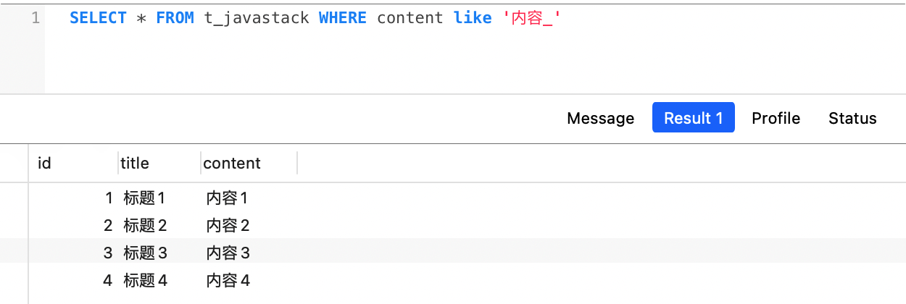
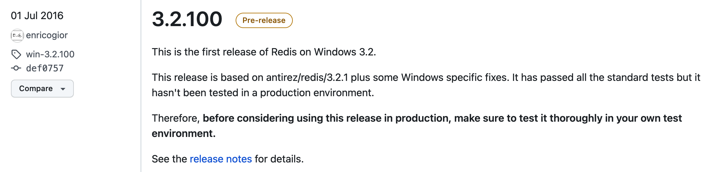
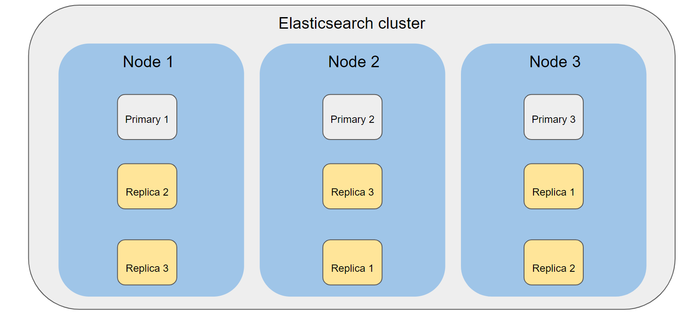
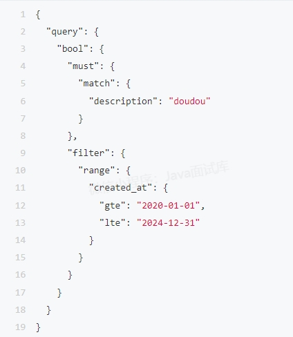

# MySQL 170

### 1、主键、外键有什么区别？

**主键**：用来表示一条记录的唯一标识，不能有重复的，不允许为空，默认为聚集索引，用来保证数据完整性。

**外键**：表的某列是另一表的主键，外键可以有重复的，可以是空值，用来和其他表建立关联用的。

### 2、什么是范式化？

所谓**范式化**，就是一系列设计数据库模型的规范，范式化的目的是减少数据冗余，提高数据完整性。

### 3、什么是反范式化？

所谓**反范式化**，是一种对范式化设计的数据库的性能优化策略，通过在表中增加冗余或重复的数据来提高数据库的读取性能。

没有冗余的数据库不一定是最好的数据库，有时为了提高查询效率，就必须降低范式化标准，适当保留冗余数据。具体操作就是在一个表中增加另一个表的冗余字段，减少了两个表查询时的关联，从而提高查询效率。

### 4、三范式分别是指哪三个？

三范式（3NF）是关系数据库设计中的一种规范化形式，用于帮助减少冗余并提高数据库结构的性能和可维护性。三范式定义了三个规则，数据库表必须满足这些规则才能被视为符合三范式。

这三个规则分别是：

##### 第一范式（1NF）

表中的每一列都包含不可再分的原子数据，即每个数据单元都是不可再分的。

##### 第二范式（2NF）

在满足第一范式的基础上，还要求表中的每条数据是可唯一标示的，并且要求表中的非主键列必须完全依赖于整个主键，而不是仅依赖于部分主键。

如果存在不完全依赖，就需要将表分解成更小的表，以满足第二范式。

##### 第三范式（3NF）

在满足第二范式的基础上，要求表中的非主键列之间不应该存在传递依赖关系，即数据表中的每一个非主键字段都和主键字段直接相关，任何非主键列都不应该依赖于其他非主键列。

如果存在非主键列之间的传递依赖，需要进一步分解表以满足第三范式。

### 5、范式化有什么优缺点？

##### 范式的优点：

（1）数据库更新起来更加快；

（2）可以只修改更少的数据；

（3）更少的distimct/group by语句；

（4）表更小，可以在内存中执行；

##### 范式的缺点：

范式化没有冗余数据，查询会产生较多关联，并且不能创建符合索引，所以查询性能会大大降低。

### 6、反范式化有什么优缺点？

##### 反范式化的优点：

（1）可以避免关联查询；

（2）可以设计有效的索引；

（3）可以提高查询速度；

##### 反范式的缺点：

表内如果有冗余字段，删除被冗余表的数据时候会造成冗余表有些有用的信息丢失。

### 7、数据库设计时怎么使用范式？

在设计数据库时，不一定强制要求使用标准范式化设计，可以进行一定的调整。

一般的设计是混用范式化和反范式化，适度进行数据冗余，以提高查询性能。

### 8、什么是事务？

事务是指一系列的数据库操作，是数据库应用的基本逻辑单位，如果事务中的任何一个语句操作失败，那么整个事务中的操作就失败，所有操作就会回滚到操作前状态。

事务就是为了保证要么全部执行成功，要么全部执行失败。

### 9、事务有哪几个特性？

数据库事务正确执行的4个特性：**ACID**，包含：原子性（Atomicity）、一致性（Consistency）、隔离性（Isolation）、持久性（Durability）。

一个支持事务（Transaction）的数据库，必须要具有这四种特性，否则在事务过程（Transaction processing）当中无法保证数据的正确性，交易过程极可能达不到交易方的要求。

##### 1、原子性

事务要么全部被执行，要么就全部不被执行。

##### 2、一致性

事务必须始终保持系统处于一致的状态，不管在任何给定的时间**并发**事务有多少。

##### 3、持久性

在事务完成以后，该事务对数据库所作的更改便持久的保存在数据库之中，并不会被回滚。

### 10、什么是脏读、幻读、不可重复读？

幻读是指一个事务内，同一条SQL语句的多次查询的记录条数不一致。

隔离级别与脏读、幻读、不可重复读的关系

| 隔离级别                    | 脏读   | 不可重复读 | 幻读   |
| --------------------------- | ------ | ---------- | ------ |
| READ UNCOMMITED（读未提交） | 允许   | 允许       | 允许   |
| READ COMMITED（读已提交）   | 不允许 | 允许       | 允许   |
| REPEATABLE READ（可重复读） | 不允许 | 不允许     | 允许   |
| SERIALIZABLE（串行化）      | 不允许 | 不允许     | 不允许 |

### 11、MySQL有哪些事务隔离级别？

##### MySQL支持四种隔离级别：

##### （1）读未提交（READ UNCOMMITTED）

允许脏读，也就是可能读取到其他会话中未提交事务修改的数据。

##### （2）读已提交（READ COMMITTED）

只能读取到已经提交的数据，Oracle等多数数据库默认都是这个级别。

##### （3）可重复读（REPEATABLE READ）

可重复读，指在同一个事务内的查询都是事务开始时刻一致的，MySQL InnoDB的默认级别。

在SQL标准中，该隔离级别消除了不可重复读，但是还存在幻像读。

##### （4）串行化（SERIALIZABLE）

完全串行化的读，每次读都需要获得表级共享锁，读写相互都会阻塞。

| 隔离级别                    | 脏读   | 不可重复读 | 幻读   |
| --------------------------- | ------ | ---------- | ------ |
| READ UNCOMMITED（读未提交） | 允许   | 允许       | 允许   |
| READ COMMITED（读已提交）   | 不允许 | 允许       | 允许   |
| REPEATABLE READ（可重复读） | 不允许 | 不允许     | 允许   |
| SERIALIZABLE（串行化）      | 不允许 | 不允许     | 不允许 |

### 12、MySQL默认的事务隔离级别是？

MySQL默认的隔离级别为：**可重复读**。

### 13、MySQL事务默认提交模式是？

MySQL事务默认是**AUTO COMMIT**模式，即“**自动提交**”模式。

如果不显示的开启一个事务，每条SQL就会默认当作一个事务进行自动提交。

### 14、MySQL事务如何开启、禁用自动提交？

查看当前是否自动提交事务模式：


设置自动提交事务模式：


1：自动提交事务

0：不自动提交事务

### 15、MySQL中哪些存储引擎支持事务？

MySQL中只有**InnoDB**和**NDB Cluster**存储引擎支持事务处理。

### 16、MySQL切换数据库用什么命令？

使用`use`命令：


### 17、MySQL查看所有数据库有什么命令？

使用`show databases`命令：


### 18、MySQL查看当前库所有表用什么命令？

使用`show tables`命令：


### 19、MySQL有哪些整数数据类型？

MySQL提供了5中整形数据类型：

| 类型        | 字节 |                              | 范围（有符号）     |
| ----------- | ---- | ---------------------------- | ------------------ |
| `TINYINT`   | 1    | （-128， 127）               | （0， 255）        |
| `SMALLINT`  | 2    | （-32768， 32767）           | （0， 65535）      |
| `MEDIUMINT` | 3    | （-8388608， 8388607）       | （0， 16777215）   |
| `INT`       | 4    | （-2147483648， 2147483647） | （0， 4294967295） |
| `BIGINT`    | 8    | （-2^63，2^63 - 1）          | （0， 2^64 - 1）   |

### 20、MySQL中的`init(1)`和`int(10)`的区别？

一般int后面的数字（N），如果不配合zerofill一起使用就没有什么区别。

-----

如果配合zerofill一起使用，不足N位则前面补0，如：

```sql
order_no int(10) zerofill NOT NULL
```

如果插入数据：2024001，只有7位，则实际查询出来会显示：000202401

此时的N则表示要展示的字符宽度，和存储大小、范围没关系，实际存储还是202401

### 21、MySQL有哪些浮点型数据类型？

MySQL提供了2种浮点型数据类型：

| 类型   | 字节 | 说明   |
| ------ | ---- | ------ |
| FLOAT  | 4    | 单精度 |
| DOUBLE | 8    | 双精度 |

### 22、MySQL浮点型会丢失精度吗？

**浮点型（float、double）会存在精度丢失问题**，即存取数据不一定插入数据库时的精确值，而是近似值。

> 对应精度要求比较高的，比如：金额，建议使用定点型：**decimal**

### 23、MySQL中的decimal和float，double的区别？

（1）decimal是定点型数据类型，float/double是浮点型数据类型；

（2）decimal是以字符串形式进行保存，float/double存储的是近似值（丢失精度）；

（3）当不指定精度时，decimal默认为decimal(10, 0)，float/double默认为实际精度。

### 24、MySQL中的decimal和numeric的区别？

这两个都是定点型数据类型，用来存储精确的数据（如货币）。

两者的区别如官网描述：

> In MySQL, `NUMERIC` is implemented as `DECIMAL`, so the following remarks about `DECIMAL` apply equally to `NUMERIC`.

即：numeric和decimal同义。

### 25、MySQL中的unsigned关键字有什么用？

unsigned为”无符号“的意思，表示”非负数“，即不允许插入负数。

unsigned可用来增长数据的长度，例如：

> tinyint 有符号范围（-128， 127），最大值是127
>
> tinyint 无符号（unsigned）范围（0， 255），最大值就可以达到255

### 26、MySQL支持Bit数据类型吗？

支持的，MySQL中的Bit(M)用来存储Bit值，如`b'111'`and`b'10000000'`表示数字7和128。

M表示1~64个长度，如果制定了Bit(M)，插入数据的长度不够M位会自动补0。

### 27、MySQL支持哪几种时间类型？

MySQL中常见的时间类型有三种：

| Type      | 范围                                              | Remark             |
| --------- | ------------------------------------------------- | ------------------ |
| DATE      | 1000-01-01 ~ 9999-12-31                           | 只有日期，没有时间 |
| DATETIME  | 1000-01-01 00:00:00 ~ 9999-12-31 23:59:59         | 日期 + 时间        |
| TIMESTAMP | 1970-01-01 00:00:01 UTC ~ 2038-01-19 03:14:07 UTC | 日期 + 时间        |

### 28、MySQL DATETIME和TIMESTAMP怎么选？

一般用DATETIME，但想根据时区自动显示对应时间的选择TIMESTAMP，但要注意这个时间范围：

> 1970-01-01 00:00:01 UTC ~ 2038-01-19 03:14:07 UTC

### 29、MySQL DATETIME和TIMESTAMP的区别？

1、时间范围不一样，TIMESTAMP要小很多；

> ​	DATETIME 1000-01-01 00:00:00 ~ 9999-12-31 23:59:59
>
> TIMESTAMP 1970-01-01 00:00:01 UTC ~ 2038-01-19 03:14:07 UTC

2、DATETIME原样存储和返回，TIMESTAMP具有时区属性，以UTC格式存储，能自动检索当前时区并进行转换；

3、DATETIME占用8字节，TIMESTAMP占用4字节；

4、DATETIME默认值为null，TIMESTAMP默认值为系统当前时间（current_timestamp）。

### 30、MySQL的自增ID如果用完了，会怎么样？

如果主键自增使用的是INT UNSINGED，则最大值为：4294967295，**如果用完了，即达到了上限，得到的值保持不变（还是最大值：4294967295，再次插入则会报主键冲突错误。**一般INT UNSINGED够用了（上亿了）），数据量特别大的可以考虑使用BIGINT UNSIGNED。

### 31、MySQL的自增ID一定是连续的吗？

MySQL自增主键并不一定是连续的值，在某些情况下可能存在间隔或不连续的情况。

##### 比如以下几个场景：

----

##### 1、删除记录

如果从表中删除了一些记录，即使是中间的记录，下一次插入的新记录的自增主键值也不会填补已删除记录的空缺，自增主键只会基于最大的已存在值进行递增，所以此时删除的记录就会造成不连续了。

##### 2、回滚操作

如果执行了一个事务，并在事务回滚之后重新执行该事务，但是之前已经生成的自增主键值将会被跳过，不会被重新使用。

##### 3、批量插入

当使用批量插入语句`INSERT INTO ... VALUES (), (), ()...`插入多个记录时，自增主键的值将递增，但它们之间可能存在间隔。

##### 4、主键冲突

如果插入记录时发生了主键冲突（比如username重复），数据库下次插入会继续递增，从而跳过了已生成的值。

### 32、MySQL是否支持序列？

**MySQL不支持序列，Oracle才有序列的概念，但是，MySQL可以通过实现一个自定义函数来实现序列。**

MySQL是使用自增主键来生成唯一的标识符的，自增主键通过使用``属性来实现，可以在插入新记录时自动递增，如以下示例：

```sql
CREATE TABLE user (
	id INT AUTO_INCRMENT PRIMARY KEY,
    name VARCHAR(50)
)
```

### 33、什么是索引？

在关系数据库中，索引是一种单独的、物理的对数据库表中一列或多列的值进行排序的一种存储结构，索引的作用相当于图书的目录，可以根据目录中的页码快速找到所需的内容。

数据库使用索引可以使SQL语句执行得更快，可快速访问数据库表中的特定数据。

### 34、索引有什么用？

##### 优点：

（1）可以大大加快数据的检索速度，这也是创建索引的最主要的原因；

（2）通过创建唯一性索引，可以保证数据库表中每一行数据的唯一性；

（3）可以加速表和表之间的连接， 特别是在实现数据的参考完整性方面特别有意义；

##### 缺点：

（1）索引需要占用物理空间，除了数据表占数据空间之外，每一个索引还要占一定的物理空间，如果要建立聚簇索引，那么需要的空间就会更大；

（2）创建索引和维护索引要耗费时间，这种时间随着数据量的增加而增加；

（3）当对表中的数据进行增加、删除和修改的时候，索引也要动态的维护，这样就降低了数据的维护速度；

### 35、索引为什么能提高查询效率？

（1）索引数据的存储是有序的；

（2）因为有序，通过索引查询数据是无需遍历所有记录的；

（3）极端情况下，数据索引的查询效率为二分查询效率，趋近于log2(N)

### 36、索引的设计有哪些原则？

（1）对于经常查询的字段，建议创建索引。

（2）索引不是越多越好，一个表如果有大量索引，不仅占用磁盘空间，而且会影响INSERT，DELETE，UPDATE等语句的性能。

（3）避免对经常更新的表进行过多的索引，因为当表中数据更改的同时，索引也会进行调整和更新，十分消耗系统资源。

（4）数据量小的表建议不要创建索引，数据量小时索引不仅起不到明显的优化效果，对于索引结构的维护反而消耗系统资源。

（5）不要在区分度低的字段建立索引。比如性别字段，只有“男”和“女“，建索引完全起不到优化效果。

（6）当唯一性是某字段本身的特征时，指定唯一索引能提高查询速度。

（7）在频繁进行排列分组（即进行group by或order by操作）的列上建立索引，如果待排序有多个，可以在这些列上建立组合索引。

### 37、索引对数据库有什么负面影响？

##### 索引建立是有开销的：

1、创建索引和维护索引需要耗费时间，这个时间随着数据量的增加而增加；

2、不光是数据库表需要占用数据空间，每个索引也都需要占用额外物理空间；

3、当对表进行增、删、改时，索引也要动态维护，减低了数据的维护速度；

### 38、什么情况下应不建或少建索引？

##### 以下几种情况不适合建立索引：

（1）表中数据太少；

（２）经常插入、删除、修改的表；

（３）表数据重复且分布平均的表字段；

等等。。。

### 39、MySQL索引的种类有哪些？

MySQL的索引有两种分类方式：**逻辑分类和物理分类**。

##### 1、按照逻辑分类，索引可分为：

- **普通索引**，仅加速查询（MySQL中基本索引类型，没有什么限制，允许在定义索引的列中插入重复值和空值，纯粹为了查询数据更快一点。）
- **唯一索引**：加速查询 + 列值唯一（可以有null）
- **主键索引**：加速查询 + 列值唯一（不可以有null） + 表中只有一个。
- **复合索引**：多个列组成一个索引，用于多个字段组合搜索。
- **全文索引**：目前只能在MyISAM、InnoDB引擎上才能使用，只能在CHAR，VARCHAR，TEXT类型字段上使用全文索引，可以通过每个关键字找到该字段所属的记录行。

##### 2、按照物理分类，索引可分为：

- **聚集索引**：也叫聚簇索引，是指数据行的物理顺序与列值（）的逻辑顺序相同，一个表中只能拥有一个聚簇索引。**MySQL中一般默认主键为聚集索引**。
- **非聚集索引**：该索引中索引的逻辑顺序与磁盘上行的物理存储顺序不同，一个表中可以拥有多个非聚集索引。其实按照定义，除了聚集索引以外的索引都是非聚集索引，只是人们想细分一下非聚集索引，分成普通索引，唯一索引，全文索引。

| 动作描述           | 使用聚集索引 | 使用非聚集索引 |
| ------------------ | ------------ | -------------- |
| 列经常被分组排序   | 应           | 应             |
| 返回某范围内的数据 | 应           | 不应           |
| 一个或极少不同值   | 不应         | 不应           |
| 小数目的不同值     | 应           | 不应           |
| 大数目的不同值     | 不应         | 应             |
| 频繁更新的列       | 不应         | 应             |
| 外键列             | 应           | 应             |
| 主键列             | 应           | 应             |
| 频繁修改索引列     | 不应         | 应             |

### 40、MySQL索引命名有什么规范？

##### 一般命名规则如下：

##### 1、主键索引（primary）

pk_字段名，如：pk_id;

##### 2、唯一索引（unique）

uk_字段名，如：uk_idcard;

##### 3、普通索引（index）

idx_字段名，如：idx_name_age;

### 41、MySQL二级索引是什么？

二级索引即非聚集索引，聚集索引之外的其他索引都属于**二级索引**，也叫辅助索引。

比如：唯一索引、普通索引、前缀索引等都是二级索引。

### 42、MySQL有了聚簇索引为啥还要二级索引？

因为聚簇索引的叶子节点存储的是一行完整的数据，而二级索引只存储了主键值，所以相比于聚簇索引，二级索引占用的空间要少很多。

如果全部都是聚簇索引，那将占用大量的空间，所以在MySQL InnoDB引擎中，只有主键建立的索引才是聚簇索引，其他的都是非聚簇索引。

### 43、MySQL索引最左匹配原则怎么理解？

**索引最左匹配原则**：就是指在MySQL复合索引中从最左边开始匹配的原则，如果你的SQL语句中用到了复合索引中的做左边的索引，那么这条SQL语句就可以利用这个联合索引进行匹配。

**如：建立abc三个字段的复合索引，就相当于建立了索引：（a），（a, b），（a, b, c）**

索引字段可以任意顺序，MySQL的查询优化器会帮你优化成索引可以识别的形式。

值得注意的是，当遇到范围查询（>、<、between、like）就会停止匹配，如：


另外，（a, c）只会用到a索引。

### 44、MySQL中的隐藏索引是什么？

MySQL 8.0虽然发布很久了，但可能大家都停留在5.7x，甚至更老，其实MySQL 8.0新增了许多重磅新特性，比如“**隐藏索引**”或者“**不可见索引**”。

隐藏索引 字面意思就是把索引进行隐藏，即不可见，它不是用来查询优化的，所以它不会被优化器使用到。隐藏索引适用于除主键索引（显示或者隐式设置）之外的索引，意味着主键索引是不能通过任何方式隐藏的。

MySQL数据库默认创建的索引都是可见的，要显式控制一个索引的可见性，可以在CEREATE TABLE，CREATE INDEX或ALTER TABLE的索引定义命令中使用`VISIBLE`或`INVISIBLE`关键字。

如下面示例所示：

```SQL
CREATE TABLE user (
 age INT, 
 weight INT,
 tall INT,
 INDEX age_idx (age) INVISIBLE
) ENGINE = InnoDB;
CREATE INDEX weight_idx on user (weight) INVISIBLE;
ALTER TABLE user ADD INDEX tall_idx (tall) INVISIBLE;
```

要变更现有索引的可见性，可以在ALTER TABLE  ....  ALTER INDEX命令中使用`VISIBLE`或`INVISIBLE`关键字。

##### 年龄索引变更为不可见（隐藏）：

```sql
ALTER TABLE user ALTER INDEX age_idx VISIBLE;
```

怎么知道一个表中的索引可见还是不可见，可以从INFORMATION_SCHEMA.STATUSTCS表，或者SHOW INDEX命令输出中获得。例如：


##### 隐藏索引有什么用？

从上面隐藏索引介绍我们知道，隐藏索引可以不被优化器所使用，那么我们可以把某个表的某个索引设置隐藏，然后再测试SQL语句的查询性能。

即可以利用隐藏索引快速测试删除索引后对SQL查询性能的影响，而无需进行索引删除、重建操作，如果需要该索引，再设置可见就好了，这在大表测试中无疑非常有用，因为对于大表索引的删除和重新添加很耗性能，甚至影响表的正常工作。

##### 隐藏所以设置

如果一个索引被设置成隐藏了，但实际上又需要被优化器所使用，有几种表索引情况缺失对查询造成的影响：

（1）SQL查询语句中包含了索引提示指向不可见索引会发生错误；

（2）性能模式数据中显示了受影响SQL查询语句的负载增高；

（3）SQL查询语句进行EXPLIAN时出现了不同的执行计划；

（4）SQL查询语句出现在了慢查询日志中（之前没有出现）；

系统变量optimizer_switch的**use_inbisible_indexes**标志的值，控制了优化器执行计划构建时是否使用隐藏索引。

如果use_inbisible_indexes值设置为**off**关闭状态（默认值），优化器默认会忽略隐藏索引，即和加入该参数之前的效果一样。

如果use_inbisible_indexes值设置为**on**打开状态，隐藏索引仍然保持不可见，但优化器会把隐藏索引加入到执行计划的构建中。

如果想要在某条单个SQL查询语句上启用隐藏索引，可以使用SET_VAR优化器提示来临时更新optimizer_switch的值，如下所示：


索引的可见性不会影响索引的自身维护，例如，不管索引是可见还是不可见，每次表数据行的更改索引都会更新，并且唯一索引也可防止插入重复数据。

没有显式主键的表如果在NOT NULL列上有任何一个唯一索引，则仍可能成为有效的隐式主键。在这种情况下，第一个这样的索引会对表数据行施加与显式主键相同的约束，并且该索引不能设置为不可见。

如以下表定义：

```sql
CREATE TABLE user (
	age INT NOT NULL,
    weight INT NOT NULL,
    UNIQUE weight_idx (weight)
) ENGINE = InnoDB;
```

该表定义不包含任何显式主键，但是weight列为NOT NULL，在该列上创建的唯一索引在数据行上与主键具有相同的约束，并且不能使其不可见：

```
mysql > ALTER TABLE user ALTER INDEX weight_idx INVISIBLE;
ERROR 3522 (HY000): A primary key index cannot be invisible.
```

假设现在我们将一个显式主键添加到表中：

```sql
ALTER TABLE user ADD PRIMARY KEY (age);
```

显式主键不能设置为不可见，此时，weight列上的唯一索引不在充当隐式主键，因此可以使其设置不可见。

```
mysql > ALTER TABLE user ALTER INDEX weight_idx INVISIBLE;
Query OK,0 rows affected (0.03sec)
```

##### 总结

本文介绍了MySQL 8.0中的新特性：隐藏（不可见）索引，这个索引并不是新加的索引类型，而是可以控制索引是否加入到执行计划的构建之中。

在实际生产中也可以利用隐藏索引进行SQL语句的性能测试，或者对索引进行逻辑删除，以及索引的灰度发布测试等，用处还是蛮大的。

### 45、MySQL索引实现是什么数据结构？

MySQL不同的索引对于索引有不同的支持。

InnoDB和MyISAM索引使用的是B + Tree，而Memory索引使用的是Hash。

### 46、MySQL一个表最多创建多少个索引？

A：8

B：16

C：64

D：无限制

----

答案可参考MySQL 8.0文档说明：


### 47、MySQL索引最多包含多少个列？

A：8

B：16

C：64

D：无限制

-----

答案可参考MySQL 8.0文档：


### 48、MySQL支持哈希索引吗？InnoDB引擎呢？

MySQL支持哈希索引，不过**只有MEMORY数据库引擎支持哈希索引**，MySQL绝大多数都是B+树索引，比如：**PRIMARY KEY、UNIQUE、INDEX和FULLTEXT**，它们都是B+树索引存储的。

MySQL的InnoDB引擎不支持哈希索引，如官方文档：

> https://dev.mysql.com/doc/refman/8.0/en/innodb-introduction.html


虽然InnoDB引擎不支持主动创建哈希索引，但InnoDB引擎为了提升热点数据的等值查询效率，其内部使用了哈希表实现了自适应哈希索引功能。

### 49、MySQL中的自适应哈希索引是什么？

MySQL中的自适应哈希索引，英文全称为：**Adaptive Hash Index**，它是MySQL InnoDB存储引擎**优化热点数据查询性能**的一种策略，它通过动态地根据查询模式创建哈希索引来**提高等值查询的速度**，特别是一些热点数据的等值查询。

##### 使用场景：

自适应哈希索引主要适用于具有频繁等值查询的热点数据，对于范围查询和排序等操作不适用，这些操作适用于B+树索引。

##### 工作原理：

MySQL自适应哈希索引底层使用的是**哈希表**来存储数据的，当某个表的某一列的等值查询非常频繁时，InnoDB会自动创建自适应哈希索引，并将这个值及其相关的行添加到哈希索引中。

自适应哈希索引会根据查询模式的变化进行动态调整，如果某个值的查询频率减少，哈希索引可能会相应地缩小。反之，如果某个值的查询频率增加，哈希索引可能会扩大。

> ##### 需要注意的是：
>
> 自适应哈希索引的创建、使用、更新和删除等操作是由MySQL InnoDB自身内部决定的，用户是无法主动干预/进行这些操作。

自适应哈希索引在InnoDB存储引擎中默认是开启的，但是可以通过`innodb_adaptive_hash_index`配置参数进行控制关闭，也可以通过服务端启动时添加`--skip-innodb-adaptive-hash-index`参数进行关闭。

### 50、MySQL索引为什么选用B + Tree作为数据结构？为什么不是其他？

MySQL选择使用B + Tree作为索引的数据结构，主要是因为B + Tree在数据库索引的应用场景中提供了一系列的优势。

下面是一些B + Tree相比于其他数据结构的优点：

##### 1、查询效率高

B + Tree是一种平衡多路查找树，它可以保证每个叶子节点的高度相同，所有的查询操作都能在O（log n）时间复杂度内完成。

##### 2、支持范围查询

由于B + Tree的叶子节点之间是相互链接的，所以它非常适合顺序访问，以及执行范围查询操作。

##### 3、磁盘I/O性能优化

B + Tree的设计考虑到了磁盘I/O操作的成本，通过减少磁盘访问次数来提高性能。节点的大小通常与磁盘页的大小相匹配，这样可以最大化地利用磁盘预读特性。

##### 4、动态数据维护

B + Tree支持高效地数据插入、删除操作，同时可以保持树地平衡。

----

相比之下， 其他数据结构如二叉搜索树、红黑树等虽然在理论上也可以用于索引，但它们在数据库索引的应用场景中存在一些局限性：

- 普通的二叉搜索树在最坏情况下会退化成链表，导致查询效率大幅下降；
- 红黑树虽然是平衡的，但其节点存储的键值较少，不适合磁盘页的大小，会增加磁盘I/O操作；
- 哈希表虽然在最佳情况下可以提供常数时间的查询效率，但它不支持范围查询和顺序访问，且在处理大量冲突时性能会下降。

所以，B + Tree成为了MySQL索引的首选数据结构。

### 51、MySQL B + 树索引和哈希索引的区别？

##### 主要有以下4点区别：

（1）哈希索引适合等值查询，但是无法进行范围查询；

（2）哈希索引无法利用索引完成排序；

（3）哈希索引不支持多列联合索引的最左匹配规则；

（4）如果有大量重复键值的情况，就可能存在哈希碰撞问题，哈希索引的效率会很低；

所以说，B + 树索引绝对适用于大多数场景，用B + 树索引就可以了。

### 52、MySQL B + 树的一个节点为多大？

一页，页是MySQL自定义的单位，MySQL的InnoDB引擎一页的默认大小是：16K，存取数据的时候都是这样一页一页的获取索引文件中节点数据的。

### 53、MySQL索引在哪些情况下会失效？

##### MySQL索引失效常见的场景：

1、不符合索引最左匹配原则，详情见另外一道题；

2、like模糊查询以%开头，如%张；

3、索引列上使用了函数、表达式计算；

4、数据类型出现隐式转化，即查询条件索引列类型和查询值数据类型不一致；

5、JOIN条件中索引列数据类型不一致；

6、条件存在NULL值，如：name is not null；

7、使用了!=、<>、IN、NOT IN判断条件；

8、查询条件使用了or，要想索引生效，or中的每个列都加上索引；

...

### 54、where 1=1是什么意思？

来看这个SQL：

```sql
select * from test
where 1 = 1
and type = "微信小程序"
and name = "Java面试题"
```

如果后面两个条件（and）是根据值动态拼接的，如果条件type不成立，没有 1 = 1 会是这样：

```sql
select * from test
where
and name = "java面试题"
```

即前面的条件不成立，后面的条件就会成为第一个条件，然而多了一个and就会报错，1 = 1 的写法就是为了避免这种情况，不管后面哪个参数不成立都不会说多一个and报错。

### 55、where 1 = 1 会导致索引失效吗？

MySQL中的 where 1 = 1 是不会影响索引的正常命中的，反正这种无意义的条件会被优化掉。

但是，最好别这么写，如果存在过多的where 1 = 1 也可能会有效率影响，毕竟优化也是需要消耗资源的。

### 56、一定要写where 1 = 1吗？有没有其他方案？

where 1 = 1当然不是必须的，在MyBatis中至少有两种方案：

（1）使用where标签

（2）使用trim标签

如果实在Java代码中，也有很多方法来判断，只不过没有where 1 = 1方便了。

### 57、MySQL中的IN和NOT IN会走索引吗？

##### 答案：不一定。

IN正常是走索引的，但如果IN（）范围过大会导致索引失效。

NOT IN也不一定，走不走索引，也有很多前提条件，MySQL查询优化器会根据当前表的情况选择最优方案。

### 58、MySQL中为什么要尽量避免使用IN和NOT IN？

主要有以下几个原因：

（1）如果条件范围过大，则会导致索引失效而全表扫描；

（2）容易出现问题，或者查询结果和预期不一致（如数据字段存在NULL值，则结果可能有误）；

### 59、MySQL中的IN和NOT IN有什么替代方案？

（1）使用EXISTS或NOT EXISTS代替；

（2）使用JOIN连接代替；

### 60、MySQL统计count(*)，count(字段)，count(1)，推荐用哪个？

MySQL中建议直接使用count(*)，它并不会把全部字段取出来统计，因为底层已经对count(*)做了深度优化了。

它们的性能可以这样排序：

> count(*) > count(1) > count(主键) > count(字段)

### 61、MySQL中的distinct和group by那个性能更好？

##### 1、语义相同，有索引的情况

如果都能使用索引，使用distinct和group by性能近乎相同。

##### 2、语义相同，无索引的情况

这时需要看MySQL的版本：

- **MySQL 8.0之前**：distinct的性能要高于group by，因为虽然distinct和group by都会进行分组操作，但在MySQL 8.0之前，group by会进行隐式排序，所以会导致SQL效率低下。
- **MySQL 8.0+**：distinct和group by的性能是近乎相同的，MySQL 8.0+中删除了group by中的隐式排序。

### 62、MySQL如果删除主键，会发生什么？

如果MySQL表删除了主键，或者没有创建主键，也没有非空唯一索引（如果有，则为主键），MySQL会生成一个长度为6位字节的默认主键（rowid）。

如果表有创建主键的话，rowid就是该主键ID。

### 63、MySQL默认最大的连接数是多少？

MySQL 5.5，5.6，5.7：默认的最大连接数都是151，上限为：100000。


### 64、MySQL数据库引擎怎么选择？

##### MySQL的四种存储引擎对比：

| 功能 |      |      |      |
| ---- | ---- | ---- | ---- |
|      |      |      |      |
|      |      |      |      |
|      |      |      |      |
|      |      |      |      |
|      |      |      |      |
|      |      |      |      |
|      |      |      |      |

### 65、MySQL默认数据库引擎是什么？

MySQL 5.5之前默认的事务型引擎是：

**MyISAM**

MySQL 5.5开始默认的事务型引擎修改为：

**InnoDB**

### 66、MySQL引擎MyISAM和InnoDB的区别？

##### 主要区别：

1、MyISAM不支持事务，InnoDB支持事务；

2、MySIAM只支持表级锁，InnoDB支持表锁和行级锁；

3、MyISAM不支持外键，InnoDB支持；

4、MyISAM允许没有任何索引和主键，InnoDB必须要有；

5、MyISAM表和索引分两个文件存储，InnoDB表和索引都保存在同一个数据文件中；

### 67、MySQL InnoDB引擎的物理存储文件？

##### MySQL InnoDB引擎在磁盘上存储了两个文件：

##### 1、.frm

存储与表相关的元数据信息，包括表结构的定义信息等；

##### 2、.idb

存储InnoDB所有表数据和索引；

----

注意：MySQL 8.0+ 没有.frm了，元数据都存储在系统表空间里。

### 68、MySQL MyISAM引擎的物理存储文件？

##### MySQL MyISAM引擎在磁盘上存储了三个文件：

##### 1、.frm

存储与表相关的元数据信息，包括表结构的定义信息等；

##### 2、.myd

存储MyISAM引擎的表数据；

##### 3、.myi文件

存储MyISAM引擎的表索引相关数据；

### 69、MySQL中char和varchar的区别？

##### 1、char是固定长度的，而varchar是可变长度的

字段b：类型char(10)，值为：abc，存储为：abc（abc + 7个空格）

字段d：类型varchar(10)，值为：abc，存储为：abc（自动变为3个的长度）

2、char最多可以存放255个字符，varchar的最大长度为65535个字节

### 70、MySQL支持JSON数据类型吗？

MySQL 5.7+可以支持JSON类型，包括以下两种类型：

- JSON对象
- JSON数组

JSON类型的好处就是无需创建预留字段，可以灵活扩展字段信息，建议用在不怎么更新的静态数据字段上。

### 71、MySQL怎么存储用户画像比较好？

用户画像即用户标签，比如：

- 80后
- 本科
- 爱网购
- 宅男
- 程序员
- 单身
- 。。。

##### MySQL有以下几种方案：

- 单独建表存储（占用过多资源）
- 使用一个字符型字段存储，用某个分隔符分开（不利于搜索）
- 使用JSON数组类型存储（**利于搜索，推荐使用**）

### 72、常用的SQL JSON连接及区别？

##### SQL JOINS连接大全图：


##### 常用的有以下几种：

INNER JOIN：两个表中记录匹配时才返回匹配的行。

LEFT JOIN：以左表为参考匹配，返回左表中的所有行，右表中如果有匹配行则返回，没有匹配项则返回null。

RIGHT JOIN：以右表为参考匹配，返回右表中的所有行，左表中如有匹配行则返回，没有匹配项则返回null。

FULL JOIN：它结合了LEFT JOIN和RIGHT JOIN的所有记录。

### 73、MySQL驱动表和被驱动表的区别？

驱动表，即总是先读取的表，被驱动表反之。

### 74、MySQL驱动表和被驱动表怎么区分？

| 连接方式      | 驱动表     | 被驱动表   |
| ------------- | ---------- | ---------- |
| left join     | 左表       | 右表       |
| right join    | 右表       | 左表       |
| join          | 优化器决定 | 优化器决定 |
| straight_join | 左表       | 右表       |

### 75、MySQL连表查询时，用哪个表作驱动表？

##### 小表驱动大表！！！

总是应该用**小表**作为驱动表，即参与过滤后的总数据量较小的表。

### 76、MySQL到底能不能使用连表查询（join）？

有的公司 的DBA禁止使用join，其实这是不正确的。

##### 用不用join得分情况！！！

在使用join之前可以使用explain命令分析下SQL语句，看看Extra上使用到的join算法信息：

- Index  Nested Loop Join：这个表示被驱动表上了索引，是可以正常使用join的。
- Block Nested Loop Join：这个表被驱动表没有用到索引，会导致全表扫描，大量占用系统资源，所以性能会非常差，不建议使用join。

### 77、为什么有的公司禁止使用join？

**用的不好会严重影响MySQL的性能及系统资源。**

### 78、MySQL连表查询（join）有什么要注意的？

（1）超过3个表最好不要使用join；

（2）需要join的字段，数据类型保持绝对一致，保证join字段用上索引；

（3）使用explain分析表索引、SQL的性能，再决定是否用join；

### 79、MySQL连表查询（join）有什么优化措施？

以下几点供你参考：

（1）总是以小表驱动大表；

（2）参与join的字段必须用上索引，如被驱动表索引，可以考虑先过滤到临时表再join；

（3）Block Nested-Loop Join算法改为Batched Key Access算法

> set
>
> optimizer_switch='mrr=on, mrr_cost_based=off, batched_key_access=on';

### 80、MySQL中的straight_join是什么？

STRAIGHT_JOIN与JOIN类似，表示固定让左边的表驱动右边的表，即左表始终在右表之前读取，能改变优化器对于连表查询的执行顺序。

使用示例：

```sql
select * from t1 straight_join t2 t1.id = t2.tid;
```

这样会固定使用左表t1作为驱动表。

### 81、MySQL中的straight_join和join的区别？

假如有表t1，t2：

如果直接使用join，则t1，t2都有可能会被优化器选作驱动表。

如果使用straight_join，则固定指定左边的t1为驱动表。

### 82、MySQL中的straight_join适用哪些表连接？

MySQL中的straight_join只能用于内连接，因为left/right join这种连接方式明确指定了连接的驱动表。

### 83、MySQL中的straight_join怎么用比较合适？

一般有以下几个用途：

（1）一般连表查询的话，建议是小表放在左边， 以驱动大表。所以如果你事先知道哪个表的连表查询数据量较小的话，可以使用straight_join这种连接方式固定左表为驱动表，以此进行SQL优化。

不建议使用，防止乱用出错，另外，优化器往往比人要聪明，除非优化器选择错误，可以手动指定。

（2）可以用来进行SQL语句的性能测试、调优等。

### 84、SQL中的笛卡尔积是什么？

笛卡尔积又叫笛卡尔乘积，是一个叫笛卡尔的人提出来的，是在多表进行联合查询的时候会出现的一种情况，返回一张表乘以另一张表的结果， 很少用到。

比如下面查询两张表：

```sql
select student_name, class_name from student,class
```

如果student表有10条记录，class表有5条记录，即每个学生都对应了每个课程，那么查询结果就是10 * 5 = 50条记录了，这样就会出现笛卡尔积。

MySQL中使用CARTESIAN JOIN连接方式就是笛卡尔积。

### 85、如何避免SQL出现笛卡尔积？

##### 如何避免SQL笛卡尔积：

1、使用查询条件、连接时是唯一关联字段；

2、如果关联字段不唯一，先使用DISTINCT去重再连接；

### 86、union和union all的区别？

**union**：对两个查询结果集进行合并，不包括重复行，会进行默认排序；

**union all**：对两个查询结果集进行合并，包括重复行，不会进行排序；

### 87、为什么不建议用union而用union all？

因为**union**会进行数据驱虫过滤操作，另外还会进行默认排序，所以性能很慢。

除非必要，一般要使用**union all**来进行结果合并操作。

### 88、什么是存储过程？

我们平时写的SQL语句都是一条一条的，而存储过程则是一组特定功能的SQL语句。储存过程可以理解为是一个函数，可以有输入、输出值，它可以像写代码一样完成一系列的逻辑。

MySQL创建存储过程语法参考：

> create procedure 存储过程名（参数列表）
>
> begin
>
> // ...存储过程体
>
> end;

### 89、为什么要有存储过程？有什么优势？

##### 使用存储过程的好处：

（1）存储过程可以在数据库端实现一个特定的、复杂的功能；

（2）存储过程可以重复使用，减少冗余；

（3）一次编译，永久有效，减少了与服务器连接交互的次数（减少了编译次数和成本）；

（4）存储过程SQL参数化，可以有效预防SQL注入攻击；

### 90、存储过程需要编译吗？每次执行时编译还是？

SQL是每次执行都会进行编译，而存储过程只需要一次编译，预先编译， 可多次执行。

### 91、阿里巴巴禁止使用存储过程，为什么？

阿里巴巴禁止使用存储过程，这是阿里巴巴的Java开发手册中规定的。

##### 原因主要有以下几点：

（1）难以调试和扩展；

（2）一致性较差；

### 92、什么是触发器？

触发器也是数据库表有关的数据库对象，当满足预设的条件时触发，并执行触发器中定义的语句集合。

举个例子：

> 当删除A表的某条数据时，如果有触发器，就会触发删除B表的某条数据。

### 93、MySQL中都有哪些触发器？

MySQL中有6种触发器：

（1）Before Insert

（2）After Insert

（3）Before Update

（4）After Update

（5）Before Delete

（6）After Delete

### 94、为什么不建议使用触发器？

触发器现在基本很少使用了，尽量少使用触发器，也不建议使用。

##### 原因主要有以下几点：

（1）太消耗资源；

（2）难以调试和扩展；

（3）移植性较差；

（4）用的不好还会造成难以排查的问题；

### 95、MySQL的drop、delete、truncate的区别？

**drop** 是删除表的数据及表结构，以及被依赖的约束（constrain）、触发器（trigger）、索引（index）。

**truncate** 是清空物理文件，同时清空表中的所有内容，但不删除表结构。

**delete** 是逻辑删除数据，按行删除，而且可以通过where语句选择要删除的行。

速度上，**drop > truncate > delete**。

### 96、MySQL怎么实现分页查询？

##### MySQL分页查询语法：

> SELETE * FROM table LIMIT [offset,] rows | rows OFFSET offset

LIMIT子句可以被用于强制SELECT语句返回指定的记录数。

LIMIT接受一个或两个数字参数，参数必须是一个整数常量。如果给定两个参数，第一个参数指定第一个返回记录行的偏移量，第二个参数指定返回记录行的最大数目。

初始记录行的偏移量是0（而不是1）：为了与PostgreSQL兼容，MySQL也支持语法：LIMIT # OFFSET #。

查询第5 ~ 29行记录示例：

> select * from table limit 4, 16

4代表偏移量，16代表要返回的记录条数。

### 97、MySQL的高可用方案有哪些？

##### 常用的解决方案如下：

1、主从复制

2、MySQL Cluster

3、MySQL + MMM

4、MySQL + MHA（成熟，常用）

### 98、如何分析一条SQL语句的执行计划和性能？

在MySQL中使用explain命令，如：

> explain select * from test where ...


##### 通过explain语句可以知道如下内容：

（1）表的读取顺序。（对应id）

（2）数据读取操作的操作类型。（对应select_type）

（3）哪些索引可以使用。（对应passible_keys）

（4）哪些索引被实际使用。（对应key）

（5）表直接的引用。（对应ref）

（6）每张表有多少行被优化器查询，但对于InnoDB来说只是个预估数值，不一定精确。（对应rows）

。。。

### 99、MySQL查询优化有哪些方法？

##### 比如以下10个：

（1）不要在索引列上使用表达式计算；

（2）不要在索引列上使用IS NULL和IS NOT NULL

（3）避免子查询，用EXISTS替代IN、用NOT EXISTS替代NOT IN；

（4）尽量避免全表扫描，首先应考虑在where及order by涉及的列上建立索引；

（5）不要select *；

（6）尽量别使用外键；

（7）索引字段不要使用范围查询（>、<、between、like）；

（8）尽量避免大事务操作，提高系统并发能力；

（9）where判断null影响效率，尽量给字段一个默认值；

（10）学会用explain命令进行分析；

。。。

### 100、MySQL为什么不建议默认null值？

##### 主要有以下几个原因：

（1）值比较复杂

（2）索引的效率会下降很多，因为它们使得索引、索引的统计信息以及比较运算更加发杂

（3）NOT IN、!= 等负向条件查询在有NULL值的情况下返回永远为空结果，查询容易出错

更多查询的坑~~

### 101、MySQL为什么尽量选择最小数据类型？

因为最小的数据类型会占用更小的磁盘、内存、CPU缓存和周期，所以也会更快

### 102、MySQL模糊查询会导致索引失效吗？

用like模糊查询时，%和_通配符放在前面会导致索引失效：


通配符放到后面不会影响索引：


### 103、MySQL模糊查询怎么匹配一个字符？

使用_下划线通配符可以匹配单个字符，如：



只能匹配一个，不能是0或者多个。

### 104、MySQL模糊查询怎么匹配多个字符？

使用%百分号通配符可以匹配多个字符，如：


可以匹配0个或者多个字符，但不能匹配NULL值。

### 105、MySQL怎么记录慢查询语句？

可以在MySQL中开启慢查询日志：

```conf
# 开启慢查询
slow_query_log=1

# 指定记录慢查询语句的日志文件
slow_query_log_file=slow_query.log

# 指定慢查询阈值，超过这个值将记录日志，默认10s
long_query_time=10
```

### 106、MySQL支持查询结果缓存吗？

可以的，开启了缓存的情况下，当查询同一条语句时，如果命中缓存，MySQL会跳过解析、优化和执行，立刻返回结果，并且缓存结果是被所有会话共享的。

##### 不过，MySQL 8.0已经废除了该功能：


这个功能也不太建议使用，建议还是在应用层使用Redis之类的缓存。

### 107、MySQL如何解决单表数据量过大，查询变慢的问题？

MySQL数据库表中的数据越来越多，查询变慢，新增操作也会变慢，如何解决呢？

##### 1、表分区

表分区可以在区间内查询指定的数据，降低查询范围，并且对索引分区也可以进一步提高命中率，提升查询效率。

##### 2、分库分表

分库分表后的数据可以分摊到不同的MySQL数据库、表，这样就可以更彻底的解决MySQL单表容量产生的问题。

##### 3、冷热归档

其实就是分表的另外一种用法，比如以下场景：

> 某些业务可能只需要查最近一个月、一个季度、一年的数据，它们称为热数据，而之前的历史数据（冷数据）不会提供给终端查询。

这时就可以把历史数据（冷数据）归档到其他的表中，然后删除原始数据，提升热数据的查询效率。

### 108、怎么理解数据库中的乐观锁？

##### 乐观锁

乐观锁相当于Java的CAS算法，所以多条数据同时过来的时候，不用等待，可以立即进行返回。

乐观锁可以采用版本号的方式，及当前版本号如果对应上了就可以写入数据，如果判断当前版本号不一致，那么就不会更新成功，比如：

```sql
update table set column = value where version = ${version} and otherKey = ${otherKey}
```

相对悲观锁，乐观锁更适用于谢少读多的情景，如果同时写比较多，循环次数比较多会造成数据库性能下降。

### 109、怎么理解数据库中的悲观锁？

##### 悲观锁

悲观锁相当于Java的synchronized，reentrantLock锁等，大量数据过来的时候，一条数据同时只用一个事务可以更新，其他的数据需要等待，执行完成后下一条数据可以继续。

悲观锁实现的机制一般是在执行更新语句的时候采用for update方式，比如：

```sql
update table set column = 'value' for update
```

这种情况where条件一定要涉及到数据库对应的索引字段，这样才会是行级锁，否则会是表锁，这样执行速度会变慢。

相对乐观锁，悲观锁更适用于写多读少的情景。

### 110、MySQL中的for update锁的是什么？

##### 开启事务：

**如果是主键或者索引字段**：for update会锁住主键、索引字段对应行的数据；

**如果是普通字段**：for update会锁住整张表，所以说要注意使用索引。

比如，如果一条语句A使用了`FOR UPDATE`，那么就会锁住相应的数据；

- 其他事务不能修改A语句锁定的数据；
- 如果查询语句B也使用了`FOR UPDATE`，语句B会被阻塞，知道语句A释放相应的锁；
- 如果查询语句C没有使用`FOR UPDATE`，语句C可以正常查询。

----

##### 未开启事务：

for update不会锁任何数据。

### 101、MySQL中的MVCC是指什么？

MVCC全称：Nutil-Version Concurrency COntrol，即多版本并发控制。

MVCC是一种并发控制的方法，一般在数据库管理系统中，实现对数据库的并发访问。

MVCC可以认为是行级锁的一个变种，它可以在很多情况下避免加锁操作，因此开销更低。

MVCC的实现大都都实现了非阻塞的读操作，写操作也只锁定必要的行。

### 112、MySQL InnoDB的MVCC实现机制？

InnoDB的MVCC实现是通过保存数据在某个时间点的快照来实现的。

一个事务，不管其执行多长时间，其内部看到的数据是一致的，也就是事务在执行的过程中不会相互影响。

**通过在每行记录后面保存两个隐藏的列来实现：**

一个保存了行的创建时间，一个保存行的过期时间（删除时间），当然，这里的时间并不是时间戳，而是系统版本号，每开始一个新的事务，系统版本号就会递增。

### 113、MySQL中的MVCC支持哪些事务隔离级别？

| 事务隔离级别 | MVCC   |
| ------------ | ------ |
| 读未提交     | 不支持 |
| 读已提交     | 支持   |
| 可重复读     | 支持   |
| 串行化       | 不支持 |

读未提交每次读取的是最新数据行，而不是读取符合当前事务版本的数据行。

串行化则会对所有读取的行加锁，所以也不存在事务版本。

### 114、MySQL锁的种类有哪些？


### 115、MySQL支持哪三种级别的锁？

MySQL的锁级别有以下三种：行级锁、表级锁、页级锁。

| 类型   | 开销 | 加锁速度 | 死锁 | 锁定粒度 | 锁冲突概率 | 并发读 |
| ------ | ---- | -------- | ---- | -------- | ---------- | ------ |
| 行级锁 | 大   | 慢       | 会   | 最小     | 最低       | 最高   |
| 表级锁 | 小   | 快       | 不会 | 最大     | 最大       | 最低   |
| 页级锁 | 适中 | 适中     | 会   | 适中     | 适中       | 适中   |

### 116、MySQL InnoDB支持什么锁？

MySQL InnoDB引擎支持以下锁：

- Shared and Exclusive Locks（共享/排他锁）
- Intention Locks（意向锁）
- Record Locks（记录锁）
- Gap Locks（间隙锁）
- Next-Key Locks（临键锁）
- Insert Intention Locks（插入意向锁）
- AUTO-INC Locks（自增锁）
- Predicate Locks for Spatial Indexs（空间索引的谓词锁）

### 117、MySQL中的共享锁是什么？

共享锁，全称为：**Shared Locks**，又可称为[**读锁**]、[**S锁**]，多个事务可以同时对同一数据持有共享锁，持有共享锁的事务只能读取数据，不能修改数据。

共享锁可以防止其他事务修改数据，其他事务只有等数据行上的共享锁释放后，才能修改数据。比如当某个事务进行数据的读操作时，可以通过`SELECT ... LOCK IN SHARE MODE`的方式对数据加上共享锁，示例如下：

```sql
-- 开启事务
START TRANSACTION;

-- 添加共享锁
SELECT * FROM t_order WHERE id = 1 LOCK IN SHARE MODE;
```

这样，其他事务可以正常读取数据，但如果想要修改这行数据，则会进入阻塞状态，直到数据行上的共享锁释放或锁超时。

### 118、MySQL中的独占锁是什么？

独占锁，全称为：**Exclusive Locks**，又可称为[**排他锁**]、[**写锁**]、[**X锁**]，独占锁只能有一个，当事务对数据添加独占锁后，其他事务不能再添加任何锁，它与独占锁和共享锁都是互斥的。

比如当某个事务对数据进行写操作（INSERT、UPDATE、DELETE）时，MySQL默认会给相关数据添加独占锁，但SELECT语句默认不会添加，可以使用`SELECT ... FOR UPDATE`主动添加独占锁，示例如下：

```sql
-- 开启事务
START TRANSACTION;

-- 添加独占锁
SELECT * FROM t_order WHERE id = 1 FOR UPDATE;
```

这样，其他事务就不能通过`LOCK IN SHARE MODE`和`FOR UPDATE`的方式获取数据，否则则会进入阻塞状态，直到独占锁释放或锁超时。

需要注意的是，其他事务可以通过`SELECT * FROM`直接查询数据，因为普通查询没有任何锁机制。

### 119、MySQL中的表锁是什么？

表锁，即锁定整个表，分为**表读锁**和**表写锁**。

| 锁类型        | 自己可读 | 自己可写 | 自己可操作其他表 | 他人可读 | 他人可写 |
| ------------- | -------- | -------- | ---------------- | -------- | -------- |
| 表读锁（S锁） | 是       | 否       | 否               | 是       | 否       |
| 表写锁（X锁） | 是       | 是       | 否               | 否       | 否       |

使用语句如下：

```sql
LOCK {TABLE | TABLES}
	tb1_name [[AS] alias] lock_type]...
	[, tb1_name [[AS] alias] lock_type]...
	
lock_type: {
	READ [LOCAL] | [LOW_PRIORITY] WEITE
}	
        
UNLOCK {TABLE | TABLES}
```

使用示例如下：

```sql
-- 对表上读锁
lock table t_user read;

-- 对表上读锁
lock table t_user write;

-- 查看上锁的表
show open tables where in_use > 0;

-- 释放表锁
unlock tables;
```

### 120、MySQL中的表锁有哪些？

表级锁有以下几种：

- 表锁
- 元数据锁
- 意向锁
- 自增锁

### 121、MySQL中的元素据锁是什么？

元数据锁，全称为：**Metadate Locking**，简称[]锁，属于[**MDL**]锁，MySQL使用[**表级**]定来管理对数据库对象的并发访问并确保数据一致性；

> **举个例子：**
>
> 如果一条SQL正在查询数据，另外又有人再改变表结构，比如删除了表中的一个列，这样就会导致查询出问题，所以，元数据锁的机制就是为了保证数据一致性的。

具体实现机制，当MySQL执行DML、DDL语句时都会申请元素据锁，DML操作需要申请元素据读锁，DDL操作需要申请元素据写锁。多个DML操作之间不会阻塞，可以并发执行，但DML操作之间不会阻塞，多个DDL操作也会互相阻塞。

另外，元数据锁是MySQL底层自动控制的，用户无法直接干预。

### 122、MySQL中的意向锁是什么？

意向锁（Intention Locks）是MySQL InnoDB引擎中的一种表级锁，它是一种允许表锁和行锁共存的一种锁，用于协调事务间的加锁机制，以避免冲突和死锁问题。

当一个事务在需要获取资源的锁定时，如果该资源已经被排他锁占用，则数据库会自动给该事务申请一个该表的意向锁。

如果自己需要一个共享锁定，就申请一个**意向共享锁**。如果需要的是某行（或者某些行）的排他锁定，则申请一个**意向排他锁**。

**比如**：事务A锁住表中的**一行（行锁）**，事务B锁住**整个表（表锁）**。

没有意向锁就会互相产生冲突，有了意向锁之后，事务A在申请行锁（写锁）之前，会自动先给事务A申请表的意向排他锁，当事务B去申请表的写锁时就会失败，因为表上有意向排他锁之后事务B申请表的写锁时会被阻塞。

> 需要注意的是：
>
> 意向锁是MySQL自行维护的一种协调事务加锁的机制，用户并不能直接使用，他在事务创建行锁和表锁时创建，在事务提交或回滚之后自动释放。

### 123、MySQL中的意向锁的分类？

意向锁包括：

##### 1、意向共享锁（IS锁）

全称为：**Intention Shared Locks**，事务打算给数据行共享锁，事务在请求某些行的共享锁（S锁）前，要先获得表的IS锁。

##### 2、意向排他锁（IX锁）

全称为：**Intention Exclusive Locks**，事务打算给数据行加排他锁，事务在请求某些行的排他锁（X锁）前，要先获得表的IX锁。

| 请求锁模式/是否兼容/当前锁模式 | X    | IX   | S    | IS   |
| ------------------------------ | ---- | ---- | ---- | ---- |
| X                              | 冲突 | 兼容 | 冲突 | 冲突 |
| IX                             | 冲突 | 兼容 | 冲突 | 兼容 |
| S                              | 冲突 | 冲突 | 兼容 | 兼容 |
| IS                             | 冲突 | 兼容 | 兼容 | 兼容 |

### 124、MySQL中的意向锁是表锁还是行锁？

MySQL中的意向锁（Intention Lock）是表锁（Table Lock）。

意向锁用于协调事务对表的锁定操作，是为了支持事务并发控制而引入的概念，当一个事务要对某个表中的行进行操作时，可以先获取该表的意向共享锁（IS锁）或意向排他锁（IX锁），以表示该事务将对表中的某些行进行读取或写入操作，以实现更好的并发控制和性能。

### 125、MySQL中的自增锁是什么？

自增锁是一种特殊的表锁，由插入具有`AUTO_INCREMENT`列的表的事务获取，如果表中存在自增字段，MySQL便会自动维护一个自增锁，该锁会在INSERT结束后立即释放。

简单的流程如下：

- 在执行插入语句时，在表上加一个自增锁；
- 为每条待插入记录的自增列分配递增的值；
- 在该语句执行结束后，再把自增锁释放掉。

如果一个事务持有了自增锁，其他事务的插入语句则会被阻塞，直到持有锁的事务释放了自增锁，这样可以保证一个自增列分配的值是递增连续的。

MySQL有一个`innodb_autoinc_lock_mode`变量，用于控制用于自增锁的算法，它允许我们选择如何在可预测的自动增量值序列和插入操作的最大并发度之间进行权衡。

### 126、MySQL中的行锁有哪些？

MySQL中的行级锁包括：

- 记录锁
- 间隙锁
- 临键锁
- 插入意向锁

### 127、MySQL中的全局锁是什么？

全局锁就是对整个数据库整个实例进行加锁，全局锁的典型使用场景是，对整个数据库进行逻辑备份，就是把数据库中所有表中的数据都读取出来，进行备份。

加表锁命令为：

> FLUSH TABLES WITH READ LOCK;

加锁后，数据库处于只读状态，以下三类语句将会被阻塞：

- 所有DML语句；
- 所有DDL语句；
- 更新操作的事务提交语句；

释放全局锁的命令如下：

> UNLOCK TABLES;

### 128、MySQL中的记录锁是什么？

MySQL中的记录锁，全称为：**Record Locks**，俗称**行锁**。

比如我们常用以下SQL语句：

> select * from t_user where uid = 1 for update;

它会在查询的记录上加上记录锁，其他事务的插入、更新、删除操作都会被阻塞，直到事务结束并释放记录锁或事务超时。

### 129、MySQL中的间隙锁是什么？

间隙锁全称为：**Gap Locks**，它基于非唯一索引，锁定的是一个范围，用于防止其他事务在某个范围内插入数据，这样可以避免[**幻读**]问题的出现。

比如以下示例：

> select * from t_user where age between 10 and 15 for update;

由于索引是基于B+树的结构存储，所以会存在一个索引区间，如果，表中存在范围为(10, 15]的间隙锁，则在10 ~ 15之间的插入数据（11，12，13，14）操作就会被阻塞，但是10和15本身并不会被锁。

间隙锁只作用于可重复读隔离（RR）事务隔离级别，它的存在是为了解决该级别下的幻读问题，因此，多个间隙之间并不互斥，是兼容的关系。

### 130、MySQL中的临键锁是什么？

临键锁全称为：Next-Key Locks，它是记录锁和间隙锁的组合，不仅能锁定范围内的所有索引记录（左开右闭区间，不锁左边，只锁右边），还能锁定一个范围不能插入数据。

比如以下示例：

> select * from t_user where age between 10 and 15 for update;

如果，表中存在范围为(10, 15]的临键锁，则在10 ~ 15之间的插入数据(11，12，13，14)操作就会被阻塞，同时15这条记录也被锁住了。

### 131、MySQL中的插入意向锁是什么？

插入意向锁，全称为：Insert Intention Locks，它是一种在INSERT操作之前设置的一种间隙锁。

插入意向锁表示的是一种插入意图，即当多个不同的事务，同时往同一个索引的同一个间隙中的不同位置插入数据的时候，它们互相之间无需等待，即不会阻塞。

假设有值为4和7的索引记录，现在有两个事务，分别尝试插入值为5和6的记录，在获得插入行的排他锁之前，每个事务使用插入意向锁锁定4和7之间的间隙，但是这两个事务不会相互阻塞，因为行是不冲突的。

> 简单理解，虽然插入意向锁锁定了索引之间的间隙，但是插入意向锁之间并不会互相阻塞。

-----

##### 如以下示例：

客户端A创建一个包含两条索引记录（90和102）的表，然后启动一个事务，对ID大于100的索引记录设置排他锁，排他锁包括了记录102之前的间隙锁：


此时，上面的事务还没提交，然后客户端B开始事务，并以将记录101插入到间隙中：

```sql
mysql> START TRANSACTION;
mysql> INSERT INTO child (id) VALUES (101);
```

然后使用`SHOW ENGINE INNODB STATUS`命令，或者在InnoDB监视器中会看到以下内容：


事务在等待获取排他锁时获取了插入意向锁，因为插入意向锁和排他锁是互斥的，但多个插入意向锁之间并不互斥。

### 132、MySQL行锁是锁的是什么？

MySQL的行锁并不是直接锁记录，而是**锁索引**。

如果一条SQL语句用到了主键索引，MySQL会锁住键索引，如果一条语句操作了非主键索引，MySQL会先锁住非主键索引，再锁定主键索引。

### 133、MySQL行锁实现的几种算法？

##### Record Lock：单个记录上的锁

锁住索引记录，锁住的是key，如果InnoDB存储引擎在建立的时候没有设置任何一个索引，那么这时InnoDB会使用隐式的主键进行锁定。

##### Gap Lock：间隙锁，锁定一个范围，但不包含记录本身

锁定索引记录间隙，确保索引记录的间隙不变，防止其他事务的插入操作，以此防止幻读。

##### Next-Key Lock：Gap Lock + Record Lock，锁定一个范围，并且锁定记录本身

在Next-Key Lock算法下，InnoDB对于行的查询都是采用这种锁定的算法，可以有效的防止幻读。

当查询的索引含有唯一属性时，InnoDB存储引擎会对Next-Key Lock进行优化，将其降级为Record Lock，即仅锁住索引本身，而不是范围。

当查询的索引为辅助索引时，默认使用Next-Key Locking技术进行加锁，锁定范围是前一个索引到后一个索引之间范围。

### 134、MySQL什么情况会发生死锁？

两个或两个以上事务在执行过程中因争抢锁资源而造成的互相等待就是**死锁**。


### 135、MySQL产生死锁有哪些必要条件？

##### 产生死锁的四个必要条件：

##### （1）互斥条件

一个资源每次只能被一个进程使用；

##### （2）请求与保持条件

一个进程因请求资源而阻塞时，对已获得的资源保持不放；

##### （3）不剥夺条件

进程已获得的资源，在未使用完之前，不能前行剥夺；

##### （4）循环等待条件

若干进程之间形成一种头尾相接的循环等待资源关系；

### 136、MySQL死锁怎么排查？

##### （1）查看当前事务中是否有锁信息

```sql
select trx_id, trx_state, trx_started, trx_requested_lock_id, trx_weight from information_schema.innodb_trx;
```

##### （2）查看锁信息（表锁or行锁，锁的那张表）

```sql
select lock_id, lock_trx_id, lock_mode, lock_type, lock_table, lock_index from information_schema.innodb_locks;
```

##### （3）查看锁在等待哪些事务

```sql
select * from information_schema.innodb_lock_waits;
```

### 137、MySQL如何解决死锁？

##### MySQL有两种死锁处理方式：

**1、超时等待**（innodb_lock_wait_timeout=50s）

**2、死锁检测**，主动回滚一条事务，让其他事务继续执行（innodb_deadlock_detect=on）

由于性能问题，一般推荐使用死锁检测来进行处理死锁。

##### 死锁检测

死锁检测的原理是构建一个以事务为顶点、锁为边的有向图，判断有向图是否存在环，存在既有死锁。

##### 回滚

检测到死锁之后，选择插入更新或者删除的行数最少的事务回滚，基于INFORMATION_SCHEMA.INNODB_TRX表中的trx_weight字段来判断。

### 138、MySQL如何避免死锁？

##### 1、按顺序加锁

如：

Transaction 1：更新表A -> 更新表B

Transaction 2：更新表B -> 更新表A

这类问题要从程序上避免，所有的更新需要按照一定的顺序。

##### 2、添加合理的索引

如果SQL不走索引将会为表的每一行记录添加上锁，死锁的概率大大增加。

##### 3、减少持有锁的时间

保证没有长事务，尽量早提交事务，锁就越早释放。

等待。。。

### 139、MySQL和MariaDB的区别？

MariaDB数据库治理体系是MySQL的一个分支，主要由开源社区在维护，采纳GPL授权许可。

开发这个分支的缘故原由之一是：甲骨文公司收购了MySQL后，有将MySQL闭源的潜在风险，是以社区采纳分支的方式来避开这个风险。

MariaDB的目标是完全兼容MySQL，使之能轻松成为MySQL的取代品。

### 140、MySQL有哪些类型的日志？

| 名称           | 描述         |
| -------------- | ------------ |
| general log    | 一般查询日志 |
| slow query log | 慢查询日志   |
| binlog         | 二进制日志   |
| errorlog       | 错误日志     |
| relay log      | 中继日志     |
| redo log       | 重做日志     |
| undo log       | 回滚日志     |

### 141、MySQL中的binlog日志是什么？

binlog日志也叫归档日志，是一种以二进制形式（binary）存储的日志，它记录了MySQL中所有的DDL和DML日志，只记录数据库的更改操作，select / show 等无影响的命令除外。

### 142、MySQL中的binlog日志有什么用？

##### binlog日志的主要用途：

##### 1、主从同步：

Master记录binlog日志，并传递给Slaves以保持主从数据同步；

##### 2、数据恢复：

可以使用mysqlbinlog工具恢复数据；

### 143、MySQL中的relay log日志是什么？

relay log和binlog差不多，它是主从同步时用到的一种中继日志。

从服务器的IO线程读取到主服务器的binlog日志，然后写入到自己的relay log日志文件中，后续再由SQL线程读取并解析relay log日志进行数据复制。

### 144、MySQL日志undo和redo的区别？

undo log主要记录的是数据的逻辑变化，为了在发生错误时回滚之前的操作，需要将之前的操作都记录下来，然后在发生错误时才可以回滚；

redo log主要记录的是物理层面的数据页、偏移量，MySQL异常宕机后，可以将没来得及提交的事物数据重做出来，用来保证事务的持久性，即事务ACID中的D；

### 145、MySQL中的Change Buffer是什么？

**MySQL的Change Buffer是一种在内存中的缓存机制，可用于优化插入、更新和删除操作，提升数据写入性能。**

MySQL  5.6.2+中的Change Buffer大小可以通过配置参数innodb_change_buffer_max_size进行配置，该参数默认值为25%的缓冲池大小，最大可设置为50%的缓冲池大小。

> Change Buffer实现原理如下：
>
> 当执行一个插入、更新或删除操作时，MySQL会将数据的变更记录到Change Buffer中，而不是直接写入磁盘，之后再通过一定的策略将这些变更写入到磁盘上的数据文件中，这样可以避免频繁地更新磁盘数据，提高写入性能；

-----

Change Buffer适用于如下情况：

- **大量的插入、更新和删除操作**：如果一个表包含大量的插入、更新和删除操作，使用Change Buffer可以减少磁盘I/O操作，提高数据修改的性能。
- **磁盘性能较差的情况**：如果磁盘的随机读写性能较差，使用Change Buffer可以避免频繁的磁盘I/O操作，提高数据修改的性能。

-----

Change Buffer也有一些限制和缺点：

- **Change Buffer的大小是有限的**：Change Buffer的大小是有限的，当缓存区满时，MySQL会将记录直接写入磁盘，这样会影响插入、更新和删除的性能。
- **Change Buffer只能用于非唯一索引**：Change Buffer只能用于非唯一索引，不能用于唯一索引，因为唯一索引需要进行校验和重复检查。

### 146、MySQL中的Buff Pool是什么？

MySQL中的Buff Pool是一个内存缓存区，用于缓存MySQL中的数据，可以显著提高MySQL的查询性能，特别是在高并发、大数据量的情况下。

当执行查询操作时，MySQL会先从Buff Pool中读取数据，如果Buff Pool中存在相应的数据，则直接返回结果。否则，MySQL会从磁盘中读取数据，并将其写入Buff Pool中。

Buff Pool的大小可以通过配置参数`innodb_buffer_pool_size`来进行设置，默认是128MB，一般情况下，建议将Buff Pool的大小设置为系统可用内存的50%~80%左右，但不能超过可用的物理内存。

> 需要注意的是：
>
> （1）Buff Pool中的数据是不稳定的，如果MySQL异常退出或者关闭，buffer pool中的数据会丢失。因此，在使用Buff Pool缓存数据时，需要定期备份数据以防止数据丢失。
>
> （2）如果Buff Pool的大小设置过大，会占用过多的内存资源，影响系统的性能。因此，在使用Buff Pool时，需要根据实际情况进行配置和调整，以达到最优的性能和效率。

### 147、MySQL中的Change Buffer和Buff Pool区别？

MySQL中的Change Buffer和Buffer Pool是两个不同的概念，**它们分别用于优化MySQL的数据修改（Change Buffer）操作和优化数据查询操作（Buffer Pool）**，它们优化的目标操作不一样。

MySQL通过合理的配置和使用Change Buffer和Buffer Pool，可以进一步提高MySQL的读写性能。

### 148、MySQL中的Log Buffer是什么？

Log Buffer，即：日志缓冲区，它是要写入到磁盘上日志文件的数据的一块内存区域，日志缓冲区的内容会定期刷新到磁盘。

##### Log Buffer的几个相关参数：

| 参数名                         | 作用 |
| ------------------------------ | ---- |
| innodb_log_buffer_size         |      |
| innodb_flush_log_at_trx_commit |      |
| innodb_flush_log_at_timeout    |      |

大型日志缓冲区允许大事务运行，而无需在事务提交之前将redo日志数据写入磁盘，所以，如果有更新、插入或删除大量数据行的事务，则可以增加日志缓冲区的大小以提升磁盘的I/O效率。

### 149、MySQL支持哪几种数据复制方式？

##### 1、异步复制

最简单，也是性能最好的，但是主备之间数据不一致的概率很大。

##### 2、全同步复制

全同步复制牺牲了一定的性能，保证数据安全，不丢失数据。

##### 3、半同步复制（MySQL 5.5+）

性能和数据安全按行都介于异步和全同步复制之间

##### 4、组复制（MySQL 5.7+）

数据一致性和系统可用性更高。

### 150、MySQL默认的数据复制方式是什么？

MySQL默认的数据复制方式是：**异步复制**。

### 151、MySQL中的异步复制你怎么理解？

MySQL的异步复制原理，主要是依靠数据库的二进制日志（Binlog）文件进行数据复制的。


##### 大概过程如下：

1、Master进行数据更新；

2、Master将当前事务Binlog事件写入到Binlog文件中；

3、Master的Dump线程通知Slave有新的事务并发送Binlog；

4、Slave的IO线程接收到Binlog并写入到自己的relay log文件中；

5、Slave的SQL线程再写入到本地数据库完成数据同步；

### 152、MySQL异步复制丢失数据吗？

异步复制会出现数据丢失的情况。

因为主库事务是不管数据有没有同步到从库都会提交的，主库只是将事务Binlog事件写入到Binlog文件中，并由另外一个Dump线程进行发送Binlog日志，然后主库继续处理提交操作，并不保证这些Binlog是否会成功传到任何一个从库节点上。

所以，如果主库出现故障，主库已经提交的事务如果没有及时同步到从库上，就会导致数据丢失。

### 153、MySQL中的半同步复制你怎么理解？

如图，相比全同步复制，半同步复制不需要等所有Slave节点完成接收、提交等操作，而只需要任意一个Slave完成即可，然后Master再确认提交，最后再返回客户端。


所以这种同步方式性能和数据安全性都介于异步和全同步复制之间。

### 154、MySQL中的全同步复制你怎么理解？

全同步复制即组复制，如图，相比异步复制，全同步复制需要所有Slave节点完成接收、提交等操作后，然后Master再确认提交，最后再返回客户端。


所以这种同步方式可以保证数据不会丢失，但性能也会受很大影响。

### 155、MySQL中的组复制你怎么理解？

**组复制**（也叫：**全同步复制**），即MGR架构（MySQL Group Replication），是MySQL 5.7.17提供的高可用、高扩展、高可靠的集群方案，它是通过Paxos算法来保证集群数据的高可用性的，是一种全同步复制解决方案。


具体的算法是，基于原生的主从复制，然后将个节点归入到一个组中，添加一个一致性层，提交事务之前发送集群广播（Paxos算法），只有获得一致性层同意之后才能提交事务。

### 156、MySQL数据库如何全量备份？

##### 1、加全局锁备份

使用全局锁，然后通过官方自带的逻辑备份`mysqldump`命令备份数据，完成后释放全局锁。

使用示例如下：

```sql
FLUSH TABLES WITH READ LOCK;
mysqldump -u root -p 123456 test > test.sql
UNLOCK TABLES;
```


全局锁很方便，但缺陷挺大的：

- 如对主库使用全局锁进行备份，大概率会导致业务停滞；
- 对从库使用全局锁进行备份，又会有主从延迟的问题；

因此，我们需要一个更好的方案。

##### 2、不加锁备份

不加全局锁，使用`mysqldump`命令并添加`single-transaction`参数，使用示例如下：

```sql
mysqldump -u root -p 123456 --single-transaction test > test.sql
```

在导数据之前就会启动一个事务，并在事务中读取数据，其导出过程中读到的数据是一个快照，以确保在备份过程中始终处于一致的状态。

这种方案对生产环境影响较小，它可以避免在备份大型数据库时出现长时间的阻塞，并且在备份过程中还不影响其他事务的数据更新操作。

> 需要注意的是：
>
> 备份的数据库引擎必须支持事务，必须使用事务隔离级别，比如：，如果使用的是等不支持事务的引擎，该选项将被忽略。

### 157、MySQL数据库如何增量备份？

全量备份在数据量较大时，备份时间会比较长，如果增量备份可以解决问题，可以考虑增量备份，增量备份一般只备份最近一次全量备份之后的变动数据，因此备份数据量会比较小，备份时间也不会也会可控。

##### 1、使用mysqlbinglog命令

使用MySQL自带的二进制日志文件读取工具：mysqlbinlog，它可以用来查看和备份二进制日志文件，使用示例如下：

> mysqlbinlog  mysql-bin.000001  >  backup_file.sql

##### 2、使用xtrabackup工具

Xtrabackup是由Percona团队免费开源的一款MySQL备份工具，支持在线热备份，不锁表，备份速度快，占用磁盘空间小，是目前普遍使用的MySQL备份工具。

### 158、MySQL单表的最大记录数是多少？

MySQL存储架构并没有对单表最大记录数进行限制，这个数值取决于操作系统对单个文件的限制。

### 159、什么是表分区？

表分区，是指根据一定规则，将数据库中的一张表分解成多个更小的，容易管理的部分。

从逻辑上看，分区只有一张表，但是底层却是有多个物理分区组成。

### 160、表分区有什么好处？

（1）存储更多数据；

（2）优化查询性能；

（3）更容易维护；

（4）避免表扩展瓶颈；

等等。。

### 161、表分区与分表的区别？

**分表**：指的是通过一定规则，将一张表分解成多张不同的表，比如将用户订单记录根据时间成多个表。

**分表与分区的区别在于**：分区从逻辑上来讲只有一张表，而分表则是将一张表分解成多张表。

### 162、MySQL支持的分区类型有哪些？

##### （1）RANGE分区

这种模式允许将数据划分不同范围。

例如可以将一个表通过年份划分成若干个分区。

##### （2）LIST分区

这种模式允许系统通过预定义的列表的值来对数据进行分割。

按照 List 中的值分区，与 RANGE 的区别是RANGE分区的区间范围值是连续的。

##### （3）HASH分区

这种模式允许通过对表的一个或多个列的HashKey 进行计算，最后通过这个 Hash 码不同数值对应的数据区域进行分区。

例如可以建立一个对表主键进行分区的表。

##### （4）KEY分区

是 Hash 模式的一种延伸，这里的 Hash Key 是MySQL 产生的。

### 163、MySQL分区表有哪些限制因素？

1、一个表最多只能有1024个分区。

2、MySQL5.1中，分区表达式必须是整数，或者返回整数的表达式，在MySQL5.5中提供了非整数表达式分区的支持。

3、如果分区字段中有主键或者唯一索引的列，那么所有主键列和唯一索引列都必须包含进来即：分区字段要么不包含主键或者索引列，要么包含全部主键和索引列。

4、分区表中无法使用外键约束

5、MySQL 的分区适用于一个表的所有数据和索引，不能只对表数据分区而不对索引分区，也不能只对索引分区而不对表分区，也不能只对表的一部分数据分区。

### 164、MySQL批量插入，如何不插入重复数据？

##### 1、insert ignore into

插入数据出现错误时（如重复数据），将不返回错误，而是返回警告，所以要注意SQL本身语法问题。


##### 2、on dplicate key update

当主键或者唯一约束重复时执行update语句，否则执行insert语句。


##### 3、insert ... select ... where not exist

根据select条件判断是否插入，如：


##### 4、replace into

如果存在主键或者唯一约束相同的记录，则先删除再插入新记录。

### 165、MySQL中为什么不建议使用UTF-8？

因为MySQL中的“UTF-8”实际上不是真正的UTF-8。

MySQL中的“**utf8mb4**”才是真正意义上的“UTF-8”，所以永远不要再使用“UTF-8”。

### 166、MySQL为什么不建议用UUID做主键？

##### 主要有以下几点原因：

（1）MySQL InnoDB使用的是B+树索引，所以数据必须是有序的，如果无序就会导致page（页）产生分裂、合并操作，这样就会大大影响数据插入的性能，这是主要原因；

（2）UUID一般为36位字符串，比数字要长很多，占用空间比较大，从而下降数据库IO性能；

（3）UUID不像数字那样有序，不是顺序增长，就会导致B+树索引在写的时候有过多的随机写操作，随机IO很严重；

### 167、MySQL提高并发可以调整哪些参数？

##### max_connections

最大连接数量，默认为151；

##### back_log

积压请求栈的大小，默认为151；

##### table_open_cache

打开表缓存的数量，默认为4000；

##### thread_cache_size

数据库端连接池的大小，默认为9；

##### innodb_lock_wait_timeout

行锁的等待超时时间，默认为50s；

> 版本：8.0.22

### 168、MySQL日期NOW和SYSDATE的区别？

NOW()在语句执行时就确定好了，不会改变，而SYSDATE是实时获取的。


如图，等待3秒后，SYSDATE值大了3秒，而NOW值没有变化。

### 169、MySQL怎么查看当前数据库版本？


### 170、MySQL常用的客户端有哪些？

##### 常用的主流的有以下几款：

1、MySQL WorkBench（官方）

2、Navicat

3、DBeaver

4、SQLyog

5、Toad

6、DataGrip

个人觉得用的最多的，最好用的还是Navicat

# Redis 120

### 1、Redis是什么？

Redis（**Remote Dictonary Server**），即远程字典服务，是一个开源的使用ANSI C语言编写、支持网络、可基于内存亦可持久化的日志型、Key-Value非关系型数据库，并提供多种语言的API。
Redis支持多种类型的数据结构，如字符串（strings）、列表（lists）、集合（sets）、有序集合（sotred sets）、哈希表（hashes）、位图（bitmaps）、超日志（hyperlogs）以及地理空间（geospatial）索引等，使得它不仅可以用作简单的键值存储，还能支持复杂的数据结构操作，满足多种不同的应用场景。
Redis的出现，很大程度补偿了Memcached这类Key-Value存储的不足，在部分场合可以对关系数据库起到很好的补充作用，它提供了Java，C/C++，C#，PHP，JavaScript，Perl，Object-C，Python，Erlang等客户端，使用很方便。

### 2、Redis有哪些应用场景？
##### 1、缓存

缓存现在几乎是所有中大型网站都在用的必杀技，合理的利用缓存不仅能够提升网站访问速度，还能打打降低数据库的压力。Redis提供了键过期功能，也提供了灵活的键淘汰策略，所以，现在Redis用在缓存的场合非常多。

##### 2、排行榜

很多网站都有排行榜应用的，如京东的月度销量榜单、商品按时间的上新排行榜等。Redis提供的有序集合数据类构能实现各种复杂的排行榜应用。

##### 3、计数器

什么是计数器，如电商网站商品的浏览量、视频网站视频的播放量等。为了保证数据实时效，每次浏览都得给+1，并发量高时如果每次都请求数据库操作无疑是种挑战和压力。Redis提供的incr命令来实现计数器功能，内存操作，性能非常好，非常适用于这些计数场景。

##### 4、分布式会话

集群模式下，在应用不多的情况下一般使用容器自带的session复制功能就能满足，当应用增多相对复杂的系统中，一般都会搭建以Redis等内存数据库为中心的session服务，session不再由容器管理，而是由session服务及内存数据库管理。

##### 5、分布式锁

在很多互联网公司中都使用了分布式技术，分布式技术带来的技术挑战是对同一个资源的并发访问，如全局ID、减库存、秒杀等场景，并发量不大的场景可以使用数据库的悲观锁、乐观锁来实现，但在并发量高的长河中，利用数据库锁来控制资源的并发访问是不太理想的，大大影响了数据库的性能。可以利用Redis的setnx功能来编写分布式的锁，如果设置返回1说明获取锁成功，否则获取锁失败，实际应用中要考虑的细节要更多。

##### 6、社交网络

点赞、踩、关注/被关注、共同好友等是社交网站的基本功能，社交网站的访问量通常来说比较大，而且传统的关系数据库类型不适合存储这种类型的数据，Redis提供的哈希、集合等数据结构能很方便的实现这些功能。

##### 7、最新列表

Redis列表结构，LPUSH可以在列表头部插入一个内容ID作为关键字，LTRIM可用来限制列表的数量，这样列表永远为N个ID，无需查询最新的列表，直接根据ID去到对应的内容页即可。

##### 8、消息系统

消息队列是大型网站必用中间件，如ActiveMQ、RabbitMQ、Kafka等流行的消息队列中间件，主要用于业务解耦、流量削峰及异步处理实时性低的业务。Redis提供了发布/订阅及阻塞队列功能，能实现一个简单的消息队列系统。另外，这个不能和专业的消息中间件相比。

### 3、Redis有什么优势？

##### 1、性能高，速度快

Redis命令执行速度非常快，官方给出的读写性能可以达到10W/秒。

为什么会如此之快呢？由以下几个因素：

- 数据存储在内存中，直接与内存连接。
- 由相对底层的C语言实现，离操作系统更近。
- 实现源码很精湛，仅仅几万行代码，简单稳定。
- 使用了单线程模型，无多线程竞争、锁等问题。

##### 2、丰富的数据结构

Redis与其他的内存数据库不同的是，Redis拥有丰富的数据类型，如字符串、哈希、列表、集合、有序集合等。正是因为Redis丰富的数据类型，所有它能应用的场景非常多。

##### 3、丰富的特性

除了支持丰富的数据结果外，还支持以下高级功能：

- 支持建过期功能，可以用来实现定时缓存。
- 支持发布/订阅功能，可以用来实现消息队列。
- 支持事务功能，可以保证多条命令的事务型。
- 支持管道功能，能够批量处理命令。
- 支持Luau脚本功能。
- 支持集群分片和数据复制功能。
- 支持内存数据持久化硬盘功能。

##### 4、丰富的客户端

> 官方索引：http://www.redis.cn/clients.html

从官网给出的客户端列表可以看出，各种各样的语言都能接入到Redis，接入包括了所有的主流开发语言。

目前使用Redis的公司非常多，国内外都有很多重量级的公司在用。所以，现在学习Redis是大势所趋，学好Redis能为自己在日后的工作谋生中增加一个强有利的竞争手段。

### 4、Redis为什么这么快？

##### 1、基于内存的存储

Redis将所有数据存储在内存中，内存的访问速度远远超过任何类型的磁盘存储。这种设计使得数据的读写非常快，几乎可以达到微秒级别的延迟。

##### 2、高效的数据结构

Redis使用高效的数据结构来存储和访问数据，如字符串、列表、集合、哈希表等，这些数据结构经过优化，以支持快速的数据操作和访问。

##### 3、单线程模型

Redis的操作大多数是单线程的，单线程也使得Redis的设计更简单，减少了锁的开销，避免了多线程环境中的上下文切换和竞争条件。

##### 4、非阻塞I/O

Redis使用非阻塞I/O和多路复用技术，者允许Redis在单线程中高效地处理多个客户端的连接和请求，而不会因为IO操作而阻塞。

### 5、Redis主要消耗什么物理资源？

Redis是内存数据库，所以主要消耗的肯定是内存，当然还包括CPU、网络、磁盘等资源。

##### 1、内存

Redis是一种基于内存的数据结构的服务器，它将所有数据存储在内存中以实现高速访问，所以，内存是Redis最主要的资源消耗。

##### 2、CPU

Redis是单线程模型，它使用单个CPU核心来处理命令。虽然Redis的CPU使用率通常不会很高，但在处理大量命令或执行复杂操作时，CPU可能会成为性能瓶颈。

##### 3、网络

Redis通过网络与客户端进行通信，处理大量的并发连接和数据传输，因此，网络带宽和延迟也会影响Redis的性能。

##### 4、磁盘

虽然Redis主要在内存中操作数据，但它也提供了持久化功能，将数据保存到磁盘上。这样做的目的是为了在服务器重启后能够恢复数据。

### 6、Redis为什么把所有数据放到内存中？

因为Redis的定位就是一个内存数据库。

**内存的读取速度是最快的**，如果放到硬盘，磁盘IO的速度势必会严重影响Redis的性能，那就和一般的关系数据库相比没什么优势可言，而且随着现在内存硬件成本的降低，内存已经不是问题，性能才是关键，现在硬盘只是成为了一种持久化方案而已。

### 7、Redis命令是原子性的吗？

Redis中的大多数命令**是原子性的**，因为Redis是单线程的，一个操作要么执行，要么不执行，不会被其他线程打断，可以保证在多线程或多进程环境下的并发访问安全性。

但是，也有一些命令不是原子性的，比如，**WATCH**命令和事务相关的命令（如**MULIT**、**EXEC**、**DISCARD**等）都不是原子性的，因为它们需要与其他命令配合使用，以提供事务功能和乐观锁功能。

### 8、Redis磁盘快照操作是原子的吗？

是的，Redis任何命令在内存中是原子操作的，在磁盘快照里同样也是原子的，在快照过程中，Redis能够保证生成的RDB文件在任何时刻都是数据一致性的快照，即使在快照进行时还有新的写入操作发生。

> 需要注意的是：
>
> 虽然快照操作本身是原子的，但是如果在快照生成过程中Redis服务器发生崩溃，那么正在生成的快照文件可能会不完整，因此在使用RDB持久化时，还需要考虑适当的备份和故障恢复策略。

### 9、Redis怎么测试连通性？

先连接上Redis，再使用ping指令。

示例如下：

> $ redis-cli -h 127.0.0.1 -p 679 -a 123456
>
> 127.0.0.1:6379 > ping 
>
> PONG
>
> 127.0.0.1:6379 >

### 10、Redis到底是单线程还是多线程？

Redis是单线程模型，指的是执行Redis命令的核心模块是单线程的，而不是整个Redis实例就一个线程，Redis其他模块还有各自模块的线程的。

##### Redis不仅仅只是单线程。

其实，Redis 4.0开始就有多线程的概念了，比如Redis通过多线程方式在后台删除对象、以及通过Redis模块实现的阻塞命令等：


Redis 6中也有一个被说了很久的多线程IO：


这个Theaded IO指的是**在网络IO处理方面上了多线程，如网络数据的读写和协议解析等**，需要注意的是，执行命令的核心模块还是单线程的。

##### 为什么网络处理要引入多线程？

一般来说，Redis的瓶颈并不在CPU，而在内存和网络。

内存不够的话，可以加内存或者做数据结构优化和其他优化等，但网络的性能优化才是大头，网络IO的读写在Redis整个执行期间占用了大部分的CPU时间，如果把网络处理这部分作成多线程处理方式，那对整个Redis的性能会有很大的提升。

### 11、Redis和Memcache有什么区别？

最主要的几个区别：

##### 1、存储方式

Redis支持数据持久性， 可以持久化数据到硬盘上。

Memecache把数据全部存在内存之中，断电后会挂掉，数据不能超过内存大小。

##### 2、数据类型

Redis有丰富的数据结构，Memecache只支持简单的字符串类型。

##### 3、数据大小

Redis单个value的最大限制是512MB，

Memecache最大限制是1MB。

但是Memecache在存储100K以上的数据，性能稍微好一点。

### 12、分布式缓存为什么要用Redis，而不是用Map或Guava本地缓存？

#### 1、分布式环境

##### Redis：

Redis是一个基于内存的键值存储系统，非常适合于分布式系统，它可以被多个应用实例共享，支持跨多个服务器的数据分片、共享和同步。

##### Map或Guava：

Java的Map或Guava本地缓存通常只限于单个JVM实例，在分布式应用中，每个实例的缓存是独立的，不能在多个服务器之间共享状态。

#### 2、持久化能力

##### Redis：

Redis支持数据持久化，可以将内存中的数据保存到硬盘中，即使系统重启数据也不会丢失。

##### Map或Guava：

标准的Map或Guava缓存不提供持久化功能，如果应用程序停止或服务器重启，所有存储在本地缓存中的数据都会丢失。

#### 3、内存管理

##### Redis：

Redis作为一个独立的服务运行，具有高效的内存管理机制。它允许配置最大内存使用量，并可以通过LRU等算法自动淘汰老旧数据，能够有效防止内存泄露和内存满载问题。

##### Map或Guava：

Map或Guava缓存使用的是JVM的内存，需要开发者自行管理内存使用和数据的有效期，容易出现内存溢出的风险，并且缓存大小不易控制，过多使用本地缓存可能会影响应用程序的其他部分。

#### 4、高级数据结构和功能

##### Redis：

Redis提供了丰富的数据结构，如字符串、哈希、列表、集合、有序集合等，以及这些数据结构上的各种原子操作，非常适合解决复杂的缓存和消息传递问题。

##### Map或Guava：

Java的Map接口较为简单，主要支持基本的键值存储。Guava提供了一些扩展的集合功能，如多值映射、双向映射等，但与Redis相比仍较为有限。

##### 5、其他能力

Redis是专业的缓存系统，相比Map或Guava更加强大和专业，此处，还提供了丰富的API和高级功能，比如：过期时间设置，事务等等，并且性能也非常强悍，可以满足高并发场景下各种复杂业务问题的处理。

### 13、Redis支持哪些数据类型？

Redis支持多种数据类型，使得它能够用于各种不同的应用场景。

以下是Redis支持的主要数据类型：

##### 1、字符串（String）

字符串是Redis最基本的数据类型，可以存储任何形式的字符串，包括文本数据或二进制数据，如JPEG图像的内容。

##### 2、列表（List）

列表是简单的字符串链表，适用于存储一系列的元素，可用于实现队列（）或栈（）等数据结构。列表中的元素可以在列表的头部或尾部添加，并且可以从列表中检索元素。

##### 3、集合（Set）

集合是字符串的无序收集，并且保证集合中没有重复的元素。它支持添加、删除和测试元素是否存在等操作，集合之间进行并集、交集和差集等集合运算。

##### 4、有序集合（Sotred Set）

有序集合也叫ZSet，它与集合类似，但是每个元素都会关联一个浮点数的分数（），Redis根据分数来为集合中的成员进行从小到大的排序。

有序集合适用于需要按照范围和排序检索元素的场景，比如排行榜。

##### 5、哈希（Hash）

哈希是键值对的集合，适合存储对象，每个哈希可以存储多个键值对，这些键值对都是字符串类型。

##### 6、位图（Bitmap）

位图适合进行大规模、底层级的布尔值存储，位图本质上是字符串，但是可以对字符串的位进行操作，比如计算位值为1的数量、设置位值等。

##### 7、HyperLogLog

HyperLogLog是一种概率性数据结构，可以用很小的内存空间估计非常大的数据集的基数（不同元素的数量），比如统计网站访问中的独立IP数。

##### 8、地理空间（Geospatial）

Redis的地理空间数据类型允许将地理位置信息（经度和纬度）存储在集合中，并对这些信息进行查询，如计算两个地点之间的距离、查找给定区域内的地点等。

##### 9、Streams

Redis 5.0版本引入了Streams数据类型，这是一个由多个条目组成的日志数据结构，条目是包含一组键值对的数据。Streams主要用于消息队列和日志应用，支持消费者组和消息持久化等功能。

-----

从Redis 4.0版本开始，通过模块系统，开发者可以扩展Redis的功能，如可以自定义数据类型，比如RedisJSON模块可以用来存储和操作JSON对象，而RedisGraph模块提供了图数据库的特性。

### 14、Redis支持JSON数据类型吗？为什么？

在Redis的原生数据类型中，没有专门用于存储JSON的数据类型。

你可以将JSON字符串作为普通的字符串存储在Redis中，**但Redis不会理解这个字符串的JSON结构，也无法对JSON数据进行结构化的查询和操作。**

然而，从Redis 4.0版本开始，Redis引入了模块系统，它允许开发者使用C语言编写扩展模块，增强Redis的功能。借助这个特性，Redis社区开发了一些模块来支持JSON数据类型，如RedisJSON。

模块名：**RedisJSON**

模块地址：https://oss.redis.com/redisjson/


RedisJSON是一个Redis模块，它为Redis提供了完整的JSON支持。通过RedisJSON，你可以将JSON文档存储在Redis中，并且可以对JSON文档进行结构化的查询和操作，比如获取或修改JSON文档的某个字段，或者对JSON数组进行添加、删除等操作。

为什么Redis原生不支持JSON数据类型，这当然是为了Redis的简洁性、性能考虑。

### 15、Redis模块系统有什么用？

Redis中的模块系统：**Redis Modules System**，是Redis 4.0中的重大改进，它允许开发者使用C语言编写扩展模块，增强Redis的功能。

通过模块系统，我们可以对Redis的功能进行动态扩展，如果官方不支持的功能，我们可以开发一个模块进行支持，还可以自定义数据类型、命令，甚至改变Redis的行为。

### 16、Redis支持对象映射模型吗？

Redis重磅官宣：RedisOM发布，即：**Object Mapping**，支持对象映射，像操作对象一样操作Redis! !

当然，Redis OM的横空出世不仅仅是对象映射它更多的是提供一个高级的抽象类库，目标就是让开发人员更简单、方便的使用 Redis 数据。

Redis OM 支持的第一个抽象就是：**对象映射**，支持基于对象的Redis 数据持久化、流式查询操作。

目前只支持4种开发语言：

- Redis OM for Spring （Java）
- Redis OM for Node.js
- Redis OM for Python

相信后续会支持更多语言。

### 17、Redis默认支持多少个数据库？怎么修改？

Redis默认支持16个数据库，可以通过修改Redis配置文件redis.conf中的databases一值进行变更。

如修改为20个：

```
databases 20
```

Redis不会限制最大的数据库数量，但是会限制最小数据库数量为1个。

默认的数据库是0，可以通过SELECT命令来切换，如：

> SELECT  12

### 18、Redis SET命令可以代替SETNX吗？

##### 答案：看版本，目前的版本肯定可以了。

从2.6.12版本开始，Redis为SET命令增加了一系列选项：

- `EX`seconds - 设置键key的过期时间，单位：秒；
- `PX` milliseconds - 设置键key的过期时间，单位：毫秒；
- `NX` - 只有键key不存在的时候才会设置key的值；
- `XX` - 只有键key存在的时候才会设置key的值；

SET命令加上这些选项，已经可以完全取代**SETNX，SETEX，PSETEX**的功能。

这样做的好处是`SET`命令提供了更多的灵活性，你可以在同一个命令种设置过期时间和其他选项，而`SETNX`命令则只提供了基本的设置功能。

所以在将来的版本中，Redis可能不推荐使用这些命令了，并且最终抛弃这几个命令。

### 19、Redis单个实例最多能存放多少个键？

Redis最大可以存放**2^32**个键值，即如果没有设置最大内存，Redis存储极限是服务器最大可用内存值。

### 20、Redis单个Set，List最多能存放多少个元素？

单个List、Set、Sotred Set都可以放2^32个元素。

### 21、Redis最大key大小？

据官方文档介绍：

> The maximum allowed key size is 512MB.

Redis的key最大可以是**512MB**。

虽然我们可以使用非常长的字符串作为key，但在实际应用中，**建议使用更短的key，因为过长的key会消耗更多的内存，也可能影响Redis的性能**。

此外，虽然Redis支持很长的key，但在设计key的时候应该考虑到可读性和管理的便捷性。

### 22、Redis String值最大存储多少？

A value can't be bigger than **512MB**.

根据Redis的官方文档，每个String值最大可以存储512MB的数据，这个限制是为了确保性能和内存管理的可行性，因为Redis是一个内存存储系统，设计之初也就是为了能快速读写。

### 23、Redis String底层是怎么设计的？

Redis的String类型最基本的数据类型，它能够存储任何二进制数据。

Redis的String类型底层实现是基于一个名为**SDS（Simple Dynamic String，简单动态字符串）**的数据结构。SDS提供了对动态字符串的操作，他的设计目标是能够高效地处理字符串，同时尽可能地降低内存重新分配地次数。

下面是SDS地头部结构代码：

```java
typedef char *sds;

struct sdshdr {
    
    // 已用长度
    int len;
    
    // 可用长度
    int free;
    
    // 保存字符串地字节数组
    char buf[];
};
```

SDS地数据结构如下：


包含以下几个部分：

- free：表示字符串地可用长度，也就是字符串中可以增加地字符数量，而不需要进行内存重新分配。
- len：表示字符串地占用长度，也就是字符串中实际字符地数量。
- buf：是一个字节数组，用于存储实际地字符串。这个数组的长度len + free + 1，多出来的1是为了存储字符串的结束符'\0'，用于兼容部分C语言标准库的函数。

### 24、Redis为什么要把字符串设计成SDS？

Redis是使用C语言编写的，但是Redis中的字符串并没有使用C语言中的char*字符数组来实现，反而使用自己重新设计的SDS来实现，主要是为了解决C语言原生字符串在某些场景下的局限性。

##### 1、二进制安全

C语言的字符串是以'\0'作为结束标志的，中间不能包含'\0'字符，所以它只能保存文本数据，不能保存二进制数据。

SDS记录了字符串的实际长度，可以包含任何二级制数据，包括'\0'。

##### 2、避免缓冲区溢出

C语言的字符串不记录自身长度，如果执行拼接字符串时，长度又不够，就会导致缓冲区溢出等安全性问题。

SDS通过维护长度信息，可以在执行操作时进行安全检查，避免溢出。

##### 3、减少修改字符串时的内存重新分配次数

在C语言中，每当需要增加或减少字符串的长度时，都必须手动对字符串所占用的内存进行重新分配，不然就可能导致内存泄漏问题。

SDS使用预分配和惰性释放的策略来优化内存的使用：

- 当SDS增长时，他会分配额外的未使用空间，这样在未来的增长中就可以不用重新分配内存；
- 当SDS缩短时，它不会立即释放内存，而是保留这部分内存以便将来使用。

##### 4、快速获取字符串长度

C语言的字符串需要遍历整个字符串来确定长度，时间复杂度为O(n)。

SDS由于存储了长度信息，获取长度的操作时间复杂度为O(1)，性能更好。

### 25、Redis中List的底层实现是？

Redis再不同版本的迭代中，对List的底层实现做了一些调整，以提高性能和内存利用效率。

以下是Redis中List的底层实现在不同版本的演变：

##### Redis早期版本：双向链表（Linked List）

在Redis早期版本中，List类型纯粹是由[**双向链表（Linked List）**]实现的。

每个List元素都是链表中的一个节点，这种实现方式使得在列表两端进行push和pop操作非常高效。但这种实现在内存使用上不够高效，特别是当存储许多小的List时，指针的开销会变得很大。

##### Redis 2.2版本：压缩列表（ziplist）

为了减少内存使用，在Redis 2.2版本引入了[**压缩列表（ziplist）**]作为List的底层数据结构。

ziplist是一种紧凑的顺序数据结构，这种结构适用于存储较小的元素和较短的列表，它将多个元素压缩存储在连续的内存区域。

##### Redis 3.2版本：快速列表（quicklist）

考虑到ziplist在列表较大或元素较大时的性能问题，Redis 3.2版本引入了[**快速列表（quicklist）**]作为List的底层实现。

quicklist是**双向链表和压缩列表**的结合体，它维护多个ziplist，每个ziplist作为链表的一个节点。这样，quicklist结合了ziplist的内存高效性和双向链表在元素访问上的灵活性。

##### Redis 7.0版本：快速列表（quicklist）

由于quicklist在不同场景下都能提供良好的性能和内存效率，它一直被保留作为List的底层实现，所以，**在Redis的最新版本中，List类型的实现仍然是quicklist。**

只不过在Redis 7.0版本之后，**List的底层实现quicklist发生了变化，主要的改进是将之前的ziplist替换为了listpack。**

listpack是ziplist的一个改进版本，用于解决ziplist的连锁更新问题，还有在某些场景下的性能问题。

### 26、Redis中的quicklist是什么？

> 在Redis中，quicklist是List数据类型的底层实现。
>
> quicklist专门为提高Redis列表操作的性能和内存使用效率而设计的，也可以最大程度上避免[连锁更新]的问题。

quicklist在不同的版本也有不同的实现，Quicklist通过优化存储方式，使得列表操作既快速又节省内存，特别适用于执行大量列表操作的场景。

### 27、Redis中的quicklist的底层实现是？

这要分不同版本：

- 在Redis 3.2+版本中，quicklist是ziplist和Linked List的结合。
- 在Redis 7.0+版本中，quicklist的内部ziplist被替换为了listpack。

所以，quicklist其实就是一个链表，链表中的每个元素就是一个ziplist，或者是一个listpack。以Redis 7.0版本为示例，quicklist底层数据结构图如下：


quicklist的结构部分源码：

```
typedef struct quicklist {

	// 链表头
	quicklistNode *head;
	
	// 链表尾
	quicklistNode *tail;
	
	// 总元素数量
	unsigned long count;
	
	// quicklistNode节点数量
	unsigned long len;
	
	...
}quicklist;
typedef struct quicklistNode {

	// 前一个quicklistNode节点
	struct quicklistNode *prev;
	
	// 后一个quicklistNode节点
	struct quicklistNode *next;
	
	// listpack
	unsigned char *entry;
	
	// listpack的总字节长度
	size_sz;
	
	// listpack包含的元素个数
	unsigned int count : 16;
	
	...
} quicklistNode;
```

源码说明：

- **QuickList**：主要是一个双向链表。
- **quickListNode**：这是链表中的每个节点，每个节点内都包含一个listpack，这些节点通过指针相互连接，构成了一个双向链表，每个节点可以快速访问前一个节点和后一个节点。
- **listpack**：存储在每个quickListNode中，用于存储实际的List元素。

quicklist通过将数据分散在多个listpack中，每个listpack可以独立地内存管理，这样就可以在保持高性能地同时，减少了内存地占用。

对于List的头部或尾部操作，quicklist由于其链表的特性，可以快速地进行插入和删除操作，即使是对于较大的List，quicklist也能保持相对较好的性能。

### 28、Redis中的ziplist是什么？

Redis中的压缩列表，即ziplist，它是Redis为节约内存而开发的一个新的数据结构，它可以以更加紧凑的方式来存储Hash、ZSet元素。

所以，ziplist是[]和[]底层实现之一：

- 当一个列表键只包含少量[列表项]时，并且每个列表都是小整数值，或者是长度比较短的字符串，那么Redis就会使用[ziplist]作为[**列表键**]的底层实现。
- 当一个哈希键只包含少量[键值对]时，并且每个键值对的键和值都是小整数值，或者是长度较短的字符串，那么Redis就会使用[ziplist]作为[**哈希键**]的底层实现。

因为ziplist的查找的时间复杂度是**O(N)**，并且插入新数据需要重新分配内存，且它还存在[**锁更新**]的问题，所以它只适用于[**小数据量**]的存储。

> ziplist在Redis 7中已经被淘汰。

### 29、Redis中的ziplist的底层实现是？

ziplist的底层数据结构如图所示：


ziplist是由一系列特殊编码的连续内存块组成的顺序数据结构，一个压缩列表可以包含多个entry节点，每个节点可以存储一个整数值或者一个字节数组。

### 30、Redis中的listpack是什么？

在Redis中，listpack是一种用于内部存储的紧凑序列数据结构，它是为了替代ziplist而设计的，listpack的设计目标是在保持ziplist的内存效率的同时，提供更好的性能和更高的灵活性。 

> 由于ziplist在每个元素中包含了指向前一个元素长度的信息，当一个元素被修改导致长度发生变化时，就需要更新后续元素中存储的前置元素长度信息。
>
> 这种设计容易导致连锁更新问题，特别是当发生在ziplist中间位置的修改操作时，它可能会触发多个元素的更新，影响性能。
>
> 相比之下，listpack摒弃了这种前后元素之间的长度依赖关系。

listpack主要用于Redis的内部实现， 在Redis7.0版本更新中，**listpack替换了ziplist成为了QuickList（用于实现List数据类型）中的存储结构**，这是它最主要的应用场景。

### 31、Redis中listpack的底层实现是？

listpack是用来代替ziplist的，索引它们的数据结构很相似：


结构说明：

- listpack移除了ziplist到尾部节点entryN的偏移量，并移除了每个元素中前一个元素的长度，同时保留了其他属性。
- encoding表示content的编码，encoding表示元素存储的内容，length表示每个entry的长度。

在listpack中，每个元素独立存储，不包含指向前一个元素长度的属性。这种设计减少了元素间的耦合，从而当一个元素发生变化时，不会影响到其他元素的存储结构，避免了连锁更新的问题，提高了操作效率。

在listpack中，尽管没有直接指向尾部节点的偏移，但仍能快速定位到尾部节点。这是通过使用listpack的总字节长度属性来快速找到尾部，再依据尾部entry的长度属性反向定位到其起始地址实现的。

### 32、Redis中的连锁更新问题是什么？怎么产生的？

Redis中的[连续更新]问题，一般是指ziplist压缩列表在特殊情况下，产生的连续多次扩展内存空间的操作。

##### 这个问题具体是怎么产生的？

不得不说到ziplist中的entry节点的`previous_entry_length`属性，这个属性记录了前一个节点的长度：

- 如果前一节点的长度 < 254字节，那么`previous_entry_length`属性需要用1个字节的空间来保存这个长度值。
- 如果前一节点的长度 >= 254字节，那么`previous_entry_length`属性需要用5个字节的空间来保存这个长度值。

而这个[连锁更新]问题正是由`previous_entry_length`属性造成的，


##### 举个例子：

比如有一个压缩列表，它有多个连续的，长度介于250~253字节之间的节点，所以它们的`previous_entry_length`属性均为1个字节。

如果现在将一个长度 > 254字节的节点entry10插入到第一个节点entry1前面，所以会导致后面的entry1的`previous_entry_length`值就变为5字节，这样扩展后，enrty1的长度就必须会超过254字节，从而导致后面所有节点都要扩展，这便是[**连锁更新**]问题。

从上面例子可以看到，在最坏的情况下，连锁更新问题会对ziplist执行N次空间重分配，而每次空间重分配的最坏复杂度为O(N)，所以连锁更新的最坏复杂度为O(N^2)。

### 33、Redis是怎么解决连锁更新问题的？

为了解决Redis中的ziplist压缩列表[Redis 7.0+是listpack]问题，Redis开始引入了quicklist，当quicklist进行数据更新时，通过控制QuickListNode结构里的ziplist（Redis 7.0+是listpack）的大小或者元素个数，避免了所有元素的连锁更新，连锁更新只会发生在单个节点上了。

所以，即使这样，quicklist并没有完全解决[连锁更新]问题，所以，Redis 7有引入了listpack，代替ziplist彻底解决了[连锁更新]的问题。

### 34、Redis中的ZSet是什么数据类型？

Redis中的**ZSet**，即**Sorted set**，即有序不重复集合，它是一种可以存储有序的、不重复字符串集合的数据结构，类似于Java中的TreeSet集合。

ZSet和Set不同的是，ZSet中的每个元素有一个**排序权重值（score）**,然后通过权重值来为集合中的元素进行从小到大的排序。

ZSet中的元素是唯一、不重复的，但权重值可以重复。

### 35、Redis中ZSet的底层实现是？

Redis ZSet的底层实现还是比较复杂的，Redis为了达追求内存和性能的平衡，不同的Redis版本其ZSet的数据结构也有所不同：

- Redis 7.0之前使用的ziplist和skiplist、dict；
- Redis7.0+ 使用的listpack和skiplist、dict；

数据结构解释：

- ziplist：压缩列表
- skiplist：跳跃表
- dict：字典

ziplist会出现[**连锁更新**]现象，所以，Redis 7引入了**listpack**，取代**ziplist**来解决这个问题。

以Redis 7为例，当ZSet同时满足以下两个条件时，会使用**listpack**作为底层数据结构：

- 元素个数小于`zset_max_listpack_entries`的值，默认值为128
- 元素值小于`zset_max_listpack_value`的值，默认值为64

否则使用**skiplist**作为底层数据结构，以提升效率。

### 36、Redis哪里使用到了跳表？

Redis中使用跳表的地方：

##### 1、有序集合（ZSet）

跳表是有序集合（ZSet）的底层实现之一，用来存储有序的元素列表。

##### 2、集群节点

在集群节点中，Redis使用了[跳表]作为其内部数据结构。

### 37、Redis为什么用跳表而不用平衡树？

Redis使用跳表（skiplist）而不用平衡树（B树）的原因：

##### 1、跳表的实现比较简单

跳表相比平衡树而言， 代码实现难度要小很多，也不需要考虑平衡问题。

##### 2、跳表有更好的写入性能

跳表的插入和删除操作比平衡树快，只需要修改相邻节点的指针。而平衡树则需要从根节点开始遍历到叶子节点，才能找到正确的位置进行插入或删除操作。

所以，在进行频繁插入和删除操作时，跳跃表的性能要比平衡树要更好。

##### 3、跳表占用的内存空间比较小

因为跳表的节点数目和层数都是随机生成的，而不像平衡树那样记录所有子节点的指针，所以，在存储相同数量的元素时，跳表所占用的内存比平衡树要更少。

### 38、Redis中的BitMap是怎么实现的？

**Redis中的BitMap通过字符串类型来实现**，每个字节可以表示8个二进制位，因此一个字符串最多可以表示8倍字符串的位数，比如，长度为10的字符串需要80位表示。

以下是Redis中BitMap的实现细节：

##### BitMap的存储：

Redis使用字符串类型来存储BitMap，每个二进制位可以通过字符串中的一个字节来表示。

> 例如，字符串“abc”的BitMap表示为“011000010110001001100011”。

##### BitMap的设置：

可以使用SETBIT命令将某一位设置为0或1。

> 例如，SETBIT mybitmap 0 1 表示将mybitmap中的第0位设置为1。

##### BitMap的查询：

可以使用GETBIT命令查询某一位的值。

> 例如，GETBIT mybitmap 0表示查询mybitmap中第0位的值。

BitMap的计数：

可以使用BITCOUNT命令计算BitMap中值为1的位的数量。

> 例如，BITCOUNT mybatimap表示计算mybitmap中值为1的位的数量。

##### BitMap的操作：

可以使用BITOP命令对多个BitMap进行位运算。

> 例如，BITOP AND myresult mybitmap1  mybitmap2表示将mybitmap1和mybitmap2进行按位与操作，并将结果存储到myresult中。

需要注意的是，BitMap在Redis中的存储空间占用较小、计算速度较快，但是其最大的缺点是支持删除操作，如果需要删除BitMap中的某一位，只能将其设置为0。

**因此，在使用BitMap时需要仔细考虑是否需要支持删除操作。**

### 39、Redis中的BitMap的应用场景？

Redis中BitMap的应用场景：

##### 1、统计网站访问量

可以使用一个BitMap来表示一段时间内网站的访问情况，其中每一位表示每一秒钟的访问情况。

当用户访问网站时，可以通过SETBIT命令将对应的位设置为1，然后通过BITCOUNT命令计算访问量。

##### 2、存储用户在线状态

可以使用一个BitMap来表示每个用户的在线状态，其中每一位表示一个用户是否在线。当用户登录或退出时，可以通过SETBIT命令将对应的位设置为1或0，然后通过BITCOUNT命令计算在线用户数。

### 40、Redis使用BitMap会有哪些问题？如何解决？

在使用Redis BitMap时需要注意以下几个问题：

##### 1、存储空间

BitMap需要存储大量的二进制位，因此需要考虑存储空间的问题。

> 可以通过使用Redis的压缩存储方式来减少存储空间的占用， 例如使用HyperLogLog算法对BitMap进行近似统计。

##### 2、不支持删除操作

BitMap不支持删除操作，在使用BitMap时需要仔细考虑是否需要支持删除操作。

> 如果需要删除操作，可以使用其他数据结构来代替BitMap。

##### 3、并发安全问题

由于BitMap中的每个二进制位都需要进行单独的读写操作，因此在多线程或者多进程并发操作时，需要注意线程安全的问题。

> 可以使用Redis的事务，或者乐观锁来解决并发操作问题。

### 41、Redis中的Hash表的扩容机制？

在Redis中，Hash数据类型采用了**链表和散列表**的结合方式，也就是**哈希表**，当一个Hash中的键值对数量过多时，Redis会自动对其进行扩容，以提高数据的存储效率和查询性能。

Redis中Hash表的扩容机制采用的是：**渐进式rehash算法**。

### 42、Redis渐进式rehash是指什么？

哈希表一般是在元素个数达到一定阈值时才扩容的，如果扩容是rehash的操作一次性移动太多数据，可能导致服务器停顿的问题，所以，Redis引入了渐进式rehash策略，它是一种哈希表渐进式扩容方式。

渐进式rehash可以有以下好处：

- 渐进式rehash不会一次性移动太多数据，**可以避免扩容导致服务器停顿的问题，还可以降低CPU负载，减少数据迁移时间；**
- 渐进式rehash不会一次性分配过多的内存，**可以减少内存碎片的产生，提高内存利用率。**

### 43、Redis渐进式rehash过程是怎样的？

渐进式rehash过程分为两个阶段：

##### 1、迁移数据：

在这个阶段，Redis会新建一个更大的哈希表，然后将原哈希表中的数据迁移到新哈希表中。

在迁移数据的过程中，Redis会每次将原哈希表中的一小部分数据迁移到新哈希表中，每次迁移的数据量不会过大，可以控制在一定范围内，从而避免服务器停顿的问题。

##### 2、释放空间

在所有数据迁移完成后，Redis会释放原哈希表所占用的空间，并将新哈希表设置为当前哈希表，此时扩容操作完成。

> 需要注意的是：
>
> （1）渐进式rehash可能会导致新旧哈希表同时存在一段时间，因此在查询时需要同时查询新旧哈希表。
>
> （2）渐进式rehash在扩容时可能会消耗一定的CPU资源，因此需要根据实际情况综合考虑哈希表大小、CPU资源等因素来进行设置。

### 44、Redis中的HyperLogLog是什么？

Redis中的HyperLogLog是一种基数统计算法，以非常小的内存空间内存储海量数据，并且空间占用量是固定的，也用于快速、高效地估算一个集合的基数（即不重复元素的数量），适用于大数据量的基数统计问题。

HyperLogLog算法的实现原理是利用哈希函数将输入的数据转换为一个数字，然后利用位运算和取最大值等方法对这些数字进行处理，从而得到一个估计值，该估计值与输入数据的基数呈正相关关系。

HyperLogLog算法的优点在于，在处理大数据量的基数统计问题时，空间占用量很小，性能非常高，误差范围可以接受。

> ##### 需要注意的是：
>
> （1）HyperLogLog只能处理不重复元素的基数问题。
>
> （2）HyperLogLog可能会存在一定的误差（可以满足大多数实际场景中的需求），可以通过增加位数组的长度来降低误差率，但这也会增加空间占用量。

### 45、Redis中的HyperLogLog应用场景？

HyperLogLog主要应用于以下场景：

##### 1、统计独立用户访问量

可以使用HyperLogLog统计网站或应用程序的独立用户访问量，即统计不重复的用户数量。每当有一个用户访问时，将其唯一标识加入到HyperLogLog中，然后通过计算HyperLogLog的基数来估算独立用户访问量。

##### 2、统计在线用户数量

可以使用HyperLogLog统计在线用户数量，每当一个用户上线时，将其唯一标识加入到HyperLogLog中，然后通过计算HyperLogLog的基数来估算在线用户数量。

等等。。。

### 46、Redis如何实现计数器功能？

Redis可以通过使用INCRBY、DECRBY命令实现计数器的功能，具体实现方式如下。

##### 1、初始化计数器

首先需要创建一个Redis字符串类型的key，并将其对应的值初始化为0，表示计数器的初始值位0。

示例代码：

> SET counter 0

##### 2、对计数器进行自增

可以使用INCRBY命令对计数器进行自增操作，从而实现计数器的递增。

该命令可以将指定Key对应的值加上指定的增量，如果key不存在，则会先将其初始化为0，然后再进行自增操作。

示例代码：

> INCRBY counter 1

##### 3、对计数器进行自减

可以使用DECRBY命令对计数器进行自减操作，从而实现计数器的递减。

该命令可以将指定key对应的值减去指定的减量，如果key不存在，则会先将其初始化为0，然后再进行自减操作。

示例代码：

> DECRBY counter 1

##### 4、获取计数器的值

可以使用GET命令获取指定key对应的值，从而获取计数器的值。

示例代码：

> GET counter

除了使用字符串类型来实现计数器之外，还可以使用HyperLogLog、Lua脚本等方式来实现分布式计数器的功能。

### 47、Redis如何统计独立用户访问量？

在Redis中统计独立用户访问量可以采用HyperLogLog算法来实现，这是一种基数统计算法，可以在较小的内存空间内快速地计算一个集合地基数，适合处理海量数据地基数统计问题。

具体实现步骤如下：

##### 1、创建一个HyperLogLog

> PFADD key user_id

其中，Key表示HyperLogLog地键名，user_id表示用户唯一标识。

##### 2、统计HyperLogLog中元素的个数

> PFCOUNT key

PFCOUNT命令会返回HyperLogLog中元素的基数（cardimality），也就是独立用户访问量的近似值。

### 48、Redis中INCR和INCRBY命令的区别？

INCR和INCRBY命令都是Redis中用于对指定键的整数值进行递增操作的命令，它们都是原子性操作命令，区别在于递增的步长不同。

INCR命令用于将指定键的整数值 + 1，语法如下：

> INCR key

如果指定的键不存在，将创建一个新的键，并将其值初始化为0。

INCRBY命令用于将指定键的整数值增加指定的步长，语法如下：

> INCRBY key increment

其中，increment是递增的步长，可以是负数。

> ##### 总结一下：
>
> 如果步长是固定的1，则使用INCR更为简便；
>
> 如果步长是可变的，则使用INCRBY更加灵活。

### 49、Redis事务有什么用？

Redis中的事务是一个单独的隔离操作，事务中的所有命令都会序列化、按顺序地执行，事务在执行的过程中，不会被其他客户端发送来地命令请求所打断。

和关系数据库中地事务不同，Redis中地事务只是一组命令集合，不能保证关系数据库ACID所有特性，Redis事务中的命令**要么全部执行或者部分执行，不保证命令全不能执行成功。**

### 50、Redis事务相关的命令有哪几个？

Redis的事务功能主要由几个命令提供：

##### 1、MULTI

MULTI命令用于开启一个事务，它标记一个事务块的开始，之后的所有命令都会被顺序地加入到队列中。

> MULTI

##### 2、EXEC

EXEC命令用于执行所有在MULTI之后加入到队列的命令，如果事务块内的所有命令都被成功执行，那么EXEC返回事务块内所有命令的返回值。

> EXEC

##### 3、DISCARD

DISCARD命令用于取消事务，放弃执行事务块内的所有命令。

> DISCARD

##### 4、WATCH

WATCH命令用于监视一个或多个键，如果在事务执行之前这个键被其他命令改动了，那么事务将被打断。WATCH命令可以被用于实现乐观锁。

> WATCH key1 [key2 ...]

##### 5、UNWATCH

UNWATCH命令用于取消WATCH对所有键的监视。如果在执行WATCH命令之后，执行了MULTI命令之前，执行了UNWATCH命令，那么之前的WATCH命令就会被取消。

### 51、Redis事务是原子性的吗？

**Redis事务不是原子性的，且事务不支持回滚。**

1、EXEC命令执行之前的错误，如：各种语法错误，Redis会自动放弃事务，所有命令都不会执行。

2、调用EXEC命令执行失败后的错误，如：事务中的命令和处理了不支持的键，此时，除了出错的命令之外，事务中的其他命令仍会执行。

### 52、Redis持久化有什么用？

因为Redis是内存数据库，持久化的主要作用就是将内存中的数据保存到磁盘上，以防止因为系统故障、重启或其他原因导致的数据丢失，保证数据安全性。

### 53、Redis有哪几种持久化方式？

Redis支持两种不同的持久化方式：

##### 1、RDB持久化（默认）

RDB即Redis DataBase File，它是Redis的默认持久化方式，它可以定期或手动生成Redis数据库的快照，快照是一个二进制文件，包含了Redis数据库在某个时间点的所有数据，默认产生的数据文件为dump.rdb。

RDB持久化机制的实现原理是将Redis内存中的数据按照一定的格式写入到磁盘文件中，因此可以快速恢复数据，但可能会有一定的数据丢失。

##### 优点：

- RDB文件是一个非常紧凑的单个文件，非常适合于备份、灾难恢复以及提高大数据集的冷启动速度。
- RDB可以创建非常快速的数据快照，尤其是在数据集很大时，相比AOF的持续写操作，对性能的影响较小。

##### 缺点：

- 在发生故障时，可能会丢失最后一次快照之后的所有数据。
- RDB在报仇呢快照时可能需要较高的内存，因为在快照过程中要维持现有连接和操作，同时还要复制整个数据集。

##### 2、AOF持久化

AOF，即：Append Only File，它是Redis的另一种持久化方式，它将所有对Redis数据库进行的写操作记录下来，然后将这些操作以追加的方式写入到一个磁盘文件中，默认产生的数据文件为appendonly.aof。

AOF持久化机制的实现原理是在每次写操作完成后，将相应的写命令以追加的方式写入到AOF文件中，将相应的写命令以追加的方式写入到AOF文件中，因此可以保证数据的完整性和持久性，但可能会导致AOF文件多大。

##### 优点：

AOF持久化记录了所有写操作的命令，确保即使在发生故障时，也不会丢失数据；

##### 缺点：

AOF文件保存了每个写操作的命令，因此相比于RDB文件，AOF文件通常会更大。在长时间运行的Redis实例上，AOF文件可能会变得非常庞大，增加了备份和恢复的成本。

### 54、Redis持久化方式如何选择？

下面是一些常见的选择标准：

##### 数据重要性：

如果数据重要性较高，需要保证数据的完整性和可靠性，可以选择AOF持久化方式。

AOF方式可以在每次写操作完成后将相应的写命令以追加的方式写入到AOF文件中，以保证数据的完整性和持久性。

##### 空间占用：

如果空间占用是一个关键因素，可以选择RDB持久化方式。

RDB方式可以定期会根据条件生成Redis数据库的快照，快照是一个二进制文件，可以快速恢复数据，而且占用的空间相对较小。

##### 数据恢复速度：

如果需要快速恢复数据，可以选择RDB持久化方式。

RDB文件可以快速地恢复数据，因为它是一个二进制文件，恢复速度相对较快。而AOF文件由于是文本文件，恢复速度相对较慢。

##### 写入频率：

如果写入频率较高，可以选择AOF持久化方式。

AOF方式可以在每次写操作完成后将相应地写命令以追加的方式写入到AOF文件中，因此可以保证数据的完整性和持久性。

##### 性能要求：

如果对性能要求较高，可以选择关闭持久化功能，只使用Redis的内存数据库。当然，这种方式可能会导致数据丢失，因此需要根据实际需求来综合考虑。

> 需要注意的是：
>
> Redis支持RDB和AOF持久化方式的混合使用，可以在需要时同时使用两种持久化方式，以充分发挥它们各自的优势。
>
> 选择Redis持久化方式需要根据**应用场景、数据量、性能要求**等实际需求和场景综合因素来考虑，不能一概而论。

### 55、Redis RDB持久化的原理？

RDB自动持久化使用的是**bgsave**方式，它不会阻塞Redis主进程，而是会fork出一个子进程来进行快照操作，Redis主进程可以继续处理客户端的请求。

##### Redis创建快照文件的原理：

- Redis会fork出一个子进程来进行快照操作，子进程和主进程共享内存空间；
- 子进程将整个数据集写入新的RDB文件；
- 子进程写入完成后，使用新的RDB文件替换旧的RDB文件。

主进程在写入过程中使用了写时复制技术（Copy-On-Write），所以主进程对数据库的修改不会影响子进程的操作。

### 56、Redis AOF持久化的原理？

AOF持久化的工作原理：

##### 1、命令追回

每次执行写命令（如SET，DEL，HSET等）时，Redis将命令追加到AOF缓冲区（buffer）中。

##### 2、数据同步

按照一定的策略（根据appendfsyne配置），再从缓冲区同步到硬盘上的AOF文件中。

##### 3、AOF重写

当AOF的文件达到指定策略配置的阈值时，Redis会对AOF日志文件进行重写。

### 57、Redis中的AOF重写机制是什么？

随着时间的推移，AOF文件可能会变得非常大，因为每个被修改过的命令都被记录下来了，为了**优化AOF文件大小，Redis提供了AOF重写的机制。**

##### 重写原理：

AOF重写不是通过简单地复制原始AOF文件来实现的，而是在后台创建一个新的、更紧凑的AOF文件，该文件只包含达到当前数据库状态所需的最少命令集，重写操作不会影响现有的AOF日志记录。

##### 重写流程：

- Redis主进程会fork出一个子进程来进行AOF文件的重写；
- 子进程将当前数据库状态所需的最少命令集写入新的AOF文件；
- 子进程重写完毕后，主进程会把子进程重写期间产生的写请求追加到新的AOF文件中；
- 主进程最终替换旧的AOF文件。

在AOF重写过程中，主进程可以继续处理客户端请求，它使用了写时复制技术（Copy-On-Write），确保不会影响子进程的重写过程数据不变。

##### 重写是如何缩减文件大小的？

- 只保留最终状态对应的命令，去除过期和无效的命令；
- 重新构造命令，优化存储结构，使用更高效的命令来减小文件大小；

### 58、Redis中的混合持久化是什么？如何实现的？

Redis中现有持久化的缺陷：

- RDB持久化虽然快，但是会丢失快照之后的数据，不能保证数据完整性；
- AOF持久化虽然能保证数据完整性，但是性能不佳，日志文件也过大。

所以，Redis 4.0开始，引入了混合持久化模式。

**混合持久化结合了RDB和AOF两种持久化方案**，旨在利用两者的优点，达到**既能快速启动并恢复数据、又能保证数据完整性**的效果，以实现更优化的持久化解决方案。

##### 混合持久化实现原理：

在进行AOF重写的时候，Redis不仅仅重写AOF文件，而是先写入一个当前内存状态的RDB快照，之后的写操作则在RDB快照之后写入，所以新的AOF文件在前部都会包含一个完整的数据快照（RDB格式），在后部包含了增量更新的命令（AOF格式）。

开启混合持久化：

```
# 开启AOF（必须项）
appendonly  yes

# 开启混合持久化
aof-use-rdb-preamble  yes
```

注意，Redis 5.0以后默认会开启混合持久化功能。

### 59、Redis持久化触发的时机有哪些？

Redis的持久化触发时机取决于所使用的持久化方法，主要包括RDB和AOF两种机制，每种方法的触发时机有所不同，下面会分别说明。

##### RDB持久化触发时机

---

RDB持久化会创建数据集的快照，这种快照可以在以下几种情况下自动或手动触发：

##### 1、定时触发

可以在Redis配置文件中设置具体的间隔规则，如每隔多少分钟和发生多少次写操作后触发，如以下配置：

```
# 如果至少有1000个键被修改，则每900秒自动保存一次
save  900 1000
```

##### 2、手动触发

参考面试题：Redis命令save和bigsave的区别？

##### 3、自动触发

当执行如`SHUTDOWN`关闭Redis正常关闭命令时，如果没有开启AOF持久化，或者AOF重写不在进行中，Redis会自动进行一次RDB持久化。

> 客户端可以通过命令判断RDB持久化是否执行成功，他返回最后一次成功执行RDB快照的UNIX时间戳，这个命令在管理和监控Redis实例时非常有用，特别是当你需要确认数据的最后保存时间或者验证持久化操作是否按预期执行了。

##### AOF持久化触发时机

AOF持久化通过记录每一个写操作命令来工作，AOF的触发主要是基于以下配置：

##### 1、实时更新

每个写命令都会被追加到AOF文件的末尾。

为了保证数据安全性，可以通过配置文件设置AOF的刷新频率：

| appendfsync参数值 |      |
| ----------------- | ---- |
| always            |      |
| everysec          |      |
| no                |      |

##### 2、手动触发

使用`BGREWRITEAOF`命令可以触发AOF文件的重写操作。

##### 3、自动触发

AOF文件大小超过一定阈值时，Redis会自动触发AOF重写操作，这个阈值可以通过配置文件的以下参数配置进行设置。

| 参数                        | 默认值 | 说明 |
| --------------------------- | ------ | ---- |
| auto-aof-rewrite-percentage | 100    |      |
| auto-aof-rewrite-min-size   | 64MB   |      |

### 60、Redis重启是如何恢复持久化数据的？

Redis重启时恢复持久化数据的过程依赖于它使用的持久化机制，包括RDB和AOF，以及是否开启了混合持久化模式，以下是主要恢复数据流程。


具体恢复流程如下：

##### 1、判断AOF持久化设置

在启动时，Redis首先检查是否启用了AOF持久化，如果没有启用，系统将自动转到使用RDB文件的数据恢复流程。

##### 2、定位并读取AOF文件

若发现AOF持久化已开启，Redis会寻找并读取对应的AOF文件。

##### 3、分析AOF文件头部

在读取AOF文件时，系统会分析文件的头部，如果头部以RDB格式的数据开始，Redis首先加载这部分RDB数据，然后继续加载AOF文件中的剩余AOF命令日志。

##### 4、纯AOF数据恢复

如果AOF文件的头部并不包含RDB数据，Redis将整个文件按照AOF日志的格式直接加载，逐条执行命令以恢复数据。

##### 5、完成数据恢复一旦所有日志文件完全加载并执行，数据恢复过程即完成。

### 61、Redis命令save和bigsave的区别？

因为Redis中的RDB持久化是某个时间点的数据快照，而不是实时的数据持久化，如果想要手动进行一次持久化，可以使用`save`或者`bgsave`命令。

##### save

----

基本命令：

> redis 127.0.0.1:6379 > save

save命令会阻塞Redis主进程，直到快照生成为止，在Redis主进程阻塞期间，Redis主进程不能处理客户端的任何请求。

##### bgsave

-----

基本命令：

> 127.0.0.1:637 > bgsave

bgsave命令执行后会立即返回OK，并不会阻塞Redis主进程，然后再fork出一个子进程来进行快照操作，Redis主进程可以继续处理客户端的请求。

> Redis RDB自动持久化方式使用的是bgsave。

### 62、如何保证Redis中的数据都是热点数据？

比如，现在MySQL数据库里有2000万数据，Redis中只能存20万数据，如何保证Redis中的数据都是热点数据呢？

----

其实考察的是Redis的淘汰策略，参见面试题：`Redis有哪些淘汰策略？`

所以，首先计算以下20万数据大概占用的内存大小，然后设置一下Redis的最大内存容量大小，并将淘汰策略为**LRU**（根据访问时间淘汰）或者**LFU**（根据访问频率淘汰）中的一种，Redis会根据自身数据执行淘汰策略，最后留下来的都是热数据。

### 63、Redisn欸村碎片是什么？怎么产生的？

Redis内存碎片是指内存空间被频繁地分配和释放，导致内存空间出现不连续的情况。

##### Redis内存碎片可能产生的原因：

- 频繁地进行内存分配和释放操作，如果内存分配和释放不当，就会产生大量地内存碎片；
- 存储数据时，向操作系统申请地内存空间，大于数据实际需要的存储空间；

内存碎片会影响Redis的性能和稳定性，例如增加内存的占用率、降低内存利用率、导致内存溢出等问题。

### 64、Redis内存碎片如何查看？

可以通过执行info memory命令查看Redis内存信息，其中包括内存使用情况和碎片情况；

| 指标 | 描述 |
| ---- | ---- |
|      |      |
|      |      |
|      |      |
|      |      |
|      |      |
|      |      |
|      |      |
|      |      |
|      |      |
|      |      |
|      |      |

主要关注这两个参数：

- allocator_frag_ratio
- allocator_frag_bytes

如果allocator_frag_ratio参数的值越大，代表内存碎片率越严重。

### 65、Redis内存碎片率过高有什么影响？

当Redis实例的内存碎片率过高时，可能会出现以下影响：

##### 1、内存使用率上升

由于内存碎片会浪费一定的内存空间，因此当Redis实例的内存碎片率过高时，实例占用的内存空间也会相应地增加，从而可能导致Redis实例占用的内存空间超过物理内存大小，引发内存溢出问题。

##### 2、Redis性能下降

内存碎片会导致Redis实例的内存分配和回收变得不规律，从而影响Redis的读写效率和响应速度。

此外，当Redis实例的内存碎片率过高时，可能会导致Redis实例出现频繁的内存分配和回收，从而引发CPU使用率上升、响应时间延长等问题，影响Redis的性能表现。

### 66、Redis内存碎片率超过50%会怎样？

当Redis实例的内存碎片率超过50%时，Redis会根据配置文件中的**maxmemory-fragmentation-ratio**参数进行处理：

- 如果该参数的值 < 1.0：即内存碎片率有限制，超过该值后，Redis会拒绝进行新的写入操作，直到内存碎片率下降到设定的阈值以下。
- 如果该参数的值 = 默认值1.0：即内存碎片率无限制，超过该值后，Redis会继续运行，但可能会因为内存碎片过多而导致性能下降。

### 67、Redis内存碎片如果清理？

Redis的内存碎片清理方法：

##### 1、定期重启Redis

通过定期重启Redis，可以释放内存碎片，从而减小内存碎片的影响。这种方式会中断Redis的服务，可能会影响业务运行，需要根据具体情况来选择重启时间。

##### 2、内存压缩机制

Redis提供了内存压缩机制来减小内存碎片的影响，该机制可以对Redis中的内存空间进行整理和压缩，从而消除内存碎片，提高内存利用率。

##### 3、内存分配器

Redis使用jemalloc作为默认的内存分配器，jemalloc采用了一些优化策略，如内存分配池、预分配内存、计算分配空间的大小等方式，它在很大程度上避免了内存碎片问题。

可以通过一些配置参数来调整内存分配器的行为，以减小内存碎片的影响，比如可以通过**maxmemory-fragmentation-ratio**参数来控制内存分配和释放的比率。

##### 4、活跃内存碎片整理（Active-Defragmentation）

这是一种在线清理内存碎片的方式，不需要停止Redis服务，可以在Redis运行期间进行。该方法通过周期性地对Redis中的活跃内存碎片进行整列和压缩，从而减小内存碎片的影响。

要启用Redis的活跃内存碎片的整理功能，需要在Redis配置文件中设置以下参数：


> **需要注意的是：**
>
> 启用活跃内存碎片整理功能会消耗一定的CPU资源，可能会影响Redis的性能。

### 68、Redis内存满了怎么办？

如果达到设置的上限，默认淘汰策略下，Redis的写命令会返回错误信息，但是读命令还可以正常返回。

一般要配置合适的淘汰机制，当Redis内存满了时，即达到了配置的`maxmemory`限制，Redis会根据预设的内存淘汰策略来处理新的写入操作。

### 69、Redis怎么配置最大内存容量？

打开Redis的配置文件：


找到并放开`maxmemory`配置项注释，单位为：字节。

比如，如果你希望设置最大内存容量为100MB，你可以这样设置：`maxmemory 104857600`，然后保存并重启Redis服务器。

如果你不希望重启Redis服务器，你也可以在运行时使用``命令来修改最大内存容量：

> CONFIG SET maxmemory 104857600

### 70、Redis有哪些淘汰策略？

Redis目前有8种淘汰策略：

| 淘汰策略        | 描述                                           |
| --------------- | ---------------------------------------------- |
| moevivtion      | 默认淘汰策略，无法进行写入                     |
| alleys-lru      | 从所有键中淘汰最久未被访问的键                 |
| volatile-lru    | 从设置了过期时间的键中淘汰最久未被访问的键     |
| allkeys-lfu     | 从所有键中淘汰最近访问频率最低的键             |
| volatile-lfu    | 从设置了过期时间的键种淘汰最近访问频率最低的键 |
| allkeys-random  | 从所有键中随机淘汰键                           |
| volatile-random | 从设置了过期时间的键种随机淘汰键               |
| volatile-ttl    | 从设置了过期时间的键种淘汰最早过期的键         |

Redis 4.0开始支持基于LFU算法的淘汰策略。

### 71、Redis为什么新增了LFU淘汰策略？

##### 为什么Redis 4.0有了LFU？

因为Redis中的LRU时抽样式LRU算法，**仅关注数据的访问时间，而忽略了访问次数的重要性**，可能淘汰热点键，所以，LFU比LRU淘汰更精确，有助于提升Redis的缓存命中率。

比如Redis中的一个键，之前一直都没有被访问过，最近突然被访问了一次。

使用LRU淘汰策略就很难被淘汰，因为LRU会把它定义为热键，会很晚淘汰。而使用LFU淘汰策略就可能很快被淘汰，因为LRU优先淘汰最近未被使用的，而LFU优先淘汰最近访问频率最低的。

### 72、Redis淘汰策略LRU和LFU的区别？

##### 1、实现复杂度

LRU实现更简单，仅采用哈希表实现，而LFU可以采用哈希表 + 最小堆相结合的方式实现。

LFU更加复杂，需要维护每个数据的访问频率，因此相对于LRU来说，实现起来更加困难。

##### 2、淘汰策略

LRU根据数据最近被访问的时间进行淘汰，即淘汰最久未被访问的数据，因此它可以更好地适应访问时间比较稳定的场景。

LFU淘汰策略是Redis 4.0开始支持的，这种策略是基于键的访问频率进行淘汰，访问频率更低的键将更容易被淘汰，因此它可以更好地适应访问频率变化的场景。

##### 3、时间敏感性

LRU对事件敏感，最近访问的数据被认为是热点数据，而LFU对时间不敏感，它关注的是访问次数。

### 73、Redis LRU算法怎么实现的？有什么优缺点？

Redis为了在高性能和资源利用之间取得平衡，Redis实现LRU（Least Recently Used）缓存淘汰算法的机制，但它并不是传统意义上的精确LRU算法，而是一种**近似的、抽样式的LRU算法**。

因为不需要对所有键进行筛选淘汰，所以，Redis并没有没有像标准的LRU算法一样使用Hash表 + 双向链表来维护所有键的访问记录，所以其内部**只使用了Hash表，并没有创建双向链表**。

每个键都有一个[**LRU时间戳**]字段，记录了最后一次访问时间。当内存达到限制并需要淘汰一些键时，Redis会随机采样一定数量的键，并检查它们的**LRU时间戳**，淘汰其中[**LRU时间戳**]最小的键。

##### 这样实现方式的好处：

##### 1、实现简单

相比于精确的LRU实现，Redis中的LRU算法实现更简单。

##### 2、性能更好

因为Redis中的LRU算法每次只对一小部分键进行抽样，从而它能快速做出淘汰决策，避免了为每次键访问更新状态的高昂成本。

这样的实现，使得Redis能够在保持高性能的同时实现近似的LRU功能，让整个淘汰过程非常高效。

##### 3、内存占用小

由于不需要存储所有键的访问记录，所以内存空间占用较小，使得Redis可以更有效地利用可用内存存储更多的数据。

##### 这种实现方式的缺点：

Redis中的LRU算法，每次会随机选取一批数据进行淘汰，而不是所有的数据，所以，会牺牲部分准确率（可能会淘汰热点数据），但提升了LRU算法的性能。

### 74、Redis LFU算法怎么实现的？有什么优缺点？

因为Redis LRU算法的弊端，所以Redis 4.0中新增了LFU算法的缓存淘汰策略，它也是采用了数据抽样机制，然后依据数据的频率值排序，淘汰掉频率值较小的数据。

Redis的LFU实现不是维护一个全局的频率列表，而是为每个键维护一个计数器，这个计数器表示该键被访问的频率，**每个键都有一个8位（bit）的计数器，最多可以表示255的访问次数**，所以只是记录相对频率，而不是记录总访问次数。

这里的关键在于如何在有限的空间内有效地跟踪频率，以及如何处理计数器的增长和衰减。

##### 计数器增加逻辑：

为了避免频繁访问导致计数器快速溢出，Redis使用了一个概率算法来决定是否增加计数器的值，它有一个递增衰减因子参数：

**Ifu_log_factor**，默认为10，值越大，计数器递增的概率越低。

简单来说就是，当一个键访问时，其计数器不是每次都增加，而是会参考递增衰减因子的值，随着计数器的值增大，增加计数器的概率就会逐渐减小，当数值达到255时，就不再计算递增逻辑了。

##### 计数器衰减逻辑：

为了处理长时间运行的系统中计数器的自然增长，Redis引入了衰减逻辑，它有一个时间衰减因子参数：**Ifu_delay_time**，默认为1分钟，值越小，计数器衰减的概率会更快。

通过定期运行一个衰减过程，逐渐减少所有键的计数器值，这样可以确保及时某些键在开始时被频繁访问，如果随后很少被访问，它们的计数器值也会逐渐降低，反映出它们的真实使用频率。

---

##### 优点：

1、虽然比LRU实现更复杂一点，但和LRU一样，在性能和内存占用方面也有不错的表现。

2、可以根据间的使用热度进行淘汰，不会像LRU一样可能会淘汰热点数据。

##### 缺点：

1、由于采用概率算法和有限的计数器大小，Redis的LFU实现也不能精确反映每个键的实际访问频率。

2、新加入的键会有一个低的频率基数，这可能导致它们在一开始就被淘汰，尤其是在缓存空间紧张时。

### 75、Redis怎么配置淘汰策略？

修改Redis配置文件：


默认为**noeviction**，对于写请求不再提供服务，直接返回错误。

配置淘汰策略为”**allkeys-lru**“

```
maxmemory-policy allkeys-lru
```

另外，还可以通过以下命令配置：

> config set maxmemory-police allkeys-lru

### 76、Redis过期键的删除策略有哪些？

Redis过期键的删除策略有3种：

##### 1、定时删除

设置键的过期时间时，同时创建一个定时器，当键达到过期时间时，让定时器执行键的删除操作。

##### 2、惰性删除

这种策略不会定时、主动去删除过期的键，每次从键空间获取键时，首先检查该键是否过期，如果过期则主动删除该键，否则直接返回。

##### 3、定期删除

程序每隔一段时间会取出一定数量的随机键进行检查，然后删除所有过期的键。

### 77、Redis如何提高多核CPU利用率？

Redis是一个单线程模型的内存数据库，其网络请求和键值对读写操作默认都是在一个线程中处理的，它无法直接利用多核CPU的优势来提高并发处理能力。

不过，有几种方法可以间接提高Redis在多核CPU上的利用率：

##### 1、使用Redis集群

通过搭建Redis集群，可以在多个核心上运行多个Redis实例，每个实例处理不同的数据分片。这样，客户端请求可以分布到多个实例上并行处理，从而提高了多核CPU的利用率。

##### 2、使用多个Redis进程

在同一台机器上启动多个Redis服务进程，每个进程监听不同的端口，这样，每个Redis进程可以绑定到不同的CPU核心上，实现并行处理。

##### 3、使用多线程I/O

从Redis 6开始，Redis引入了多线程I/O处理，允许Redis在处理网络请求的读写操作时使用多个线程，这样可以在一定程度上提高多核CPU的利用率。

### 78、Redis如何实现大量数据插入？

##### 1、批量插入命令

Redis提供了一些批量插入命令：

- `MSET`：一次设置多个键值对
- `LPUSH`：一次向列表插入多个值
- `SADD`：一次向集合添加多个成员

等等，这些命令可以一次性执行多个操作，减少网络开销和命令解析的开销。

例如，使用`MSET`命令插入1000个键值对：

> MSET key1 value1  key2 value2   ... key1000 value1000

##### 2、管道（Pipelining）

Redis支持管道技术，可以一次发送多个命令，然后再一次接收所有命令的返回结果。这样可以减少网络延迟的影响，提高数据插入的速度。

##### 3、使用Lua脚本

Redis支持使用Lua脚本来执行一系列命令，这样可以将多个命令打包成一个脚本在服务器端一次性执行，避免了多次的网络往返开销。

### 79、Redis的回收进程如何工作的？

Redis的回收过程：

- 客户端发送命令给Redis服务器，请求写入新的数据。
- Redis在执行命令前会检查当前内存使用量，如果内存使用量已经达到或者超过了`maxmemory`设置的上限，Redis将触发内存淘汰机制。
- 根据配置的套题策略，Redis会决定哪些数据项被移除以释放内存。比如，如果配置的是`allkeys-lru`策略，Redis会移除最近最少使用的键。
- 一旦内存被回收到`maxmemory`限制以下，Redis就可以继续执行新的命令。

这样，Redis通过不断监控内存使用情况，并在达到内存限制时进行数据淘汰，来维持内存使用在一个可控的范围内。

这个过程是动态的，随着新命令的执行和旧数据的淘汰，Redis的内存使用会在`maxmemory`的阈值附近波动。

### 80、Redis怎么尽量降低内存使用？

为了尽量降低Redis的内存使用，可以采取以下一些策略和优化措施：

1、使用合适的数据结构。

2、优化键和值。

3、使用合适的内存淘汰策略。

4、定期删除不需要的键。

### 81、Redis为什么要避免使用合并操作？

Redis避免使用合并操作，如多个命令的自动合并或批处理执行，主要原因是为了保持其高性能和间接性。

##### 1、单线程模型

Redis使用单线程模型来处理命令，使得Redis能够避免多线程编程中的锁、竟态条件等复杂问题，从而保持高性能。如果Redis自动合并多个命令为一个更复杂的操作，可能会增加单个命令的执行时间，从而影响到其他命令的响应时间。

##### 2、简洁性

Redis的设计哲学倾向于保持操作的简洁性，每个Redis命令都被设计为执行一个明确的操作，自动合并操作可能会引入额外的复杂性，使得性能优化和故障排查变得更加困难。

##### 3、网络延迟优化

Redis提供了管道（pipelining）功能，允许客户端一次性发送多个命令到服务器，然后批量读取这些命令的响应。这种方式可以显著减少网络延迟的影响，而不需要在服务器端合并操作，客户端可以根据自己的需求决定是否使用管道，以及如何组织这些命令。

### 82、Redis中的管道有什么用？

Redis中的管道技术是指：**Redis Pipelining**，用于提高Redis服务的功能。

管道技术可以在服务端还未响应时，客户端仍然可以继续向服务端发送请求，即客户端可以发送多个命令到服务端，而不用等待服务器的响应，客户端会在最后一次性读取所有服务端的响应。

### 83、Redis有哪些高可用方案？

Redis提供了多种用于构建高可用性和可扩展性的分布式架构的解决方案，同时也有一些第三方案可以帮助更好地部署Redis。

#### Redis官方方案

##### 1、Redis主从复制

Redis主从复制是一种简单的复制方案，通过将一个Redis实例配置为主服务器（master）和多个实例配置为从服务器（slave），从服务器可以实时同步主服务器的数据，以保持数据一致性。

##### 适用场景：

- **简单高可用性**：适用于需要简单复制以实现高可用性，但不需要自动故障转移的场景。
- **读写分离**：可以配置从服务器来处理只读操作，以减轻主服务器的负担，适合需要将读写分开处理的应用。
- **小规模部署**：适合小规模部署，设置简单，操作直接，但需要手动管理故障转移。

##### 2、Redis Sentinel（哨兵）

Redis Sentinel是Redis官方提供的高可用性解决方案，用于监控Redis服务器的状态、自动故障转移、报警以及配置管理。

##### 适用场景：

- **自动故障转移**：适用于需要自动故障转移以确保系统高可用性的场景。
- **实时监控**：适合需要持续监控Redis实例状态，并在故障时提供报警或修复方案的场景。
- **中小规模部署**：适用于中小规模Redis集群，提供有效的监控和自动化管理。

##### 3、Redis Cluster（集群）

Redis Cluster提供了内置的数据分片和高可用性功能，数据通过哈希槽（）分配到不同的节点上，每个槽的主节点都有一个或多个从节点备份。

##### 使用场景：

- **高扩展性**：适用于需要扩展以处理大量数据存储和请求的场景。
- **数据分片**：适合需要自动数据分片，将数据分散到不同节点，以减少单一节点负担的场景。
- **高可用性**：适合需要多层级高可用性，包括主从架构、自动故障转移和节点监控的场景。
- **大规模部署**：适合大规模Redis部署，可以在多节点置键进行负载分配。

##### 第三方解决方案

##### 1、Codis

Codis是一个开源的Redis分布式代理系统，用于分片Redis数据，使多个Redis实例组成一个大的逻辑Redis。

Codis提供了透明代理层，可以自动分配请求到不同的Redis实例，并支持在线数据迁移。

##### 2、Twemproxy

Twemproxy是一个开源的Redis和Memcached代理，主要用于分片和读写操作的负载均衡。

Twemproxy可以将Redis请求路由到不同的实例，使应用程序无需感知底层分片细节。

### 84、Redis集群的目的是什么？

以下是Redis集群的主要目标：

##### 1、数据分片

通过将数据分布在多个Redis节点上，Redis集群可以存储和处理的数据量远超单个Redis实例的内存限制，这使得Redis集群可以应对大数据量的场景，满足更大规模的应用需求。

##### 2、高可用性

Redis集群通过主从复制和哨兵机制，提供了高可用性，当主节点出现故障时，集群会自动将对应的从节点提升为新的主节点，保证服务的连续可用。

##### 3、分布式处理

在Redis集群中，客户端请求会被自动路由到正确的节点，这样可以在多个节点上并行处理命令，提高了整体的吞吐量和处理能力。

### 85、Redis集群如何选择数据库？

在Redis集群模式下，是不支持使用多个数据库的，这与单实例的Redis使用SELECT命令来切换数据库不同。Redis集群将数据自动分片到不同的节点上，每个节点都是一个独立的Redis实例，但它们指使用默认的数据库0。

所以，Redis集群目前无法做数据库选择，默认在0号数据库。

### 86、Redis集群为什么不支持多数据库？

Redis集群不支持多数据库的设计决策主要基于以下几个原因：

##### 1、简化集群管理

Redis集群支持多数据库会增加集群的管理复杂性，包括数据分片、复制、故障转移等方面，还需要确保所有数据库之间的数据一致性，限制为单一数据库可以简化这些操作，使集群管理更加高效。

##### 2、提高性能

Redis集群如果要支持多个数据库，每个数据库都需要进行数据分片和路由，这会增加额外的计算和管理开销，从而可能影响到整体性能。

##### 3、更好的数据模型设计

Redis的多数据库功能在单实例模式下主要用于逻辑上隔离不同的数据集。但在分布式环境下，通过键名前缀或其他命名约定来组织数据，可以达到类似的效果，同时还能保持数据模型的清晰和一致。

### 87、Redis集群怎么保证高可用？

Redis集群使用了**主从复制模型**，即每个节点都可以多个复制品。

比如集群有这三个主节点：

> A, B, C

如果其中一个挂了，集群就不可用了，所以现在为每个节点分配一个从节点：

> A1, B1, C1

这样，如果A挂了，A1就会顶上来，集群继续正常工作。

### 88、Redis集群最少需要几个主节点？

Redis集群**至少需要3个主节点**来构建一个稳定运行的集群环境。

这是因为Redis集群使用了一种叫做投票的机制来处理故障转移和决定哪个节点是不可用的，在一个拥有至少3个主节点的集群中，即使一个主节点发生故障，集群中的其他节点仍然可以**通过多数投票的方式**来决定如何进行故障转移，从而保证集群的高可用性。

如果集群中只有1个或2个主节点，那么在发生节点故障时，集群将无法进行有效的多数投票来决定故障转移，这会影响到集群的可用性和数据的一致性。

因此，为了确保Redis集群的高可用性和稳定性，建议至少部署3个主节点。此外，为了提供数据冗余和故障恢复能力，每个主节点还可以配置一个或多个从节点。

### 89、Redis集群主从复制的原理是？

Redis集群主从复制采用的是异步复制机制。比如，现在有以下节点：

> A -> A1,A2, A3
>
> B -> B1, B2, B3
>
> C -> C1, C2, C3

具体的复制流程如下：

> （1）客户端向主节点C写数据
>
> （2）主节点C回复该命令状态
>
> （3）主节点C再向其他从节点（C1，C2，C3）复制数据

### 90、Redis集群是怎么做数据分片的？

Redis集群没有使用一致性hash算法，而是引入了哈希槽的概念。

Redis集群有16384个哈希槽，每个key通过CRC16校验后对16384取模来决定放置哪个槽，集群的每个节点复制一部分hash槽。

举个例子，比如当前集群有3个节点，那么：

- 节点A包含0到5500号哈希槽
- 节点B包含5501到11000号哈希槽
- 节点C包含11001到16383号哈希槽

当一个客户端发送一个命令到Redis集群时，集群首先会根据键值来确定键属于哪个哈希槽。然后，集群将命令路由到复制该哈希槽的节点上进行处理。

这种哈希槽的数据分片繁时确保了数据存储的均衡和高可用性。如果一个节点宕机，集群会自动将故障节点负责的哈希槽重新分配到其余节点上，保证数据的可用性。

### 91、Redis集群会不会出现写丢失？

Redis集群不是强一致性，它是最终一致的，会出现丢失写操作数据的情况，以下是可能导致写丢失的几种情况。

##### 1、网络分区

如果集群中的某个主节点与其从节点置键发生网络分区，而再这种情况下客户端仍然向主节点写入数据，这时如果主节点失效，而从节点因为网络分区没有接收到最新的写入，那么当从节点被提升为新的主节点时，这部分数据就会丢失。

##### 2、异步复制

因为再主从复制模式下，数据的写入首先发生在主节点上，然后异步复制到从节点，如果再数据复制到从节点之前主节点发生故障，那么：

- 这些尚未复制的数据可能会丢失；
- 如果客户端从从节点读取数据，可能读到的是还未更新的数据。

这就造成了数据一致性问题。

##### 3、故障转移时的窗口期

在主节点故障后，集群会进行故障转移操作，选举出新的主节点。在这个过程中，有一个短暂的窗口期，在这个窗口期内，写入到故障主节点的数据可能会丢失。

##### 4、配置不当

如果Redis集群的配置不当，比如没有足够的从节点或者没有正确配置持久化，也可能增加数据丢失的风险。

### 92、Redis中的哨兵系统是什么？

Redis Sentinel：哨兵，放哨，看中文名字就知道它是一种Redis高可用解决方案，主要是针对Redis主从模式实现主从节点监控、故障自动切换。

没有Redis Sentinel架构之前，如果主节点挂了，需要运维人员手动进行主从切换，然后更新所有用到的Redis IP地址参数再重新启动系统，所有恢复操作都需要认为干预，如果半夜挂了，如果系统很多，如果某个操作搞错了，等等，这对运维人员来说键值就是噩梦。

有了Redis Sentinel，主从节点故障都是自动换切换，应用程序参数什么也不用改，对于客户端来说都是透明无缝切换的，运维人员再也不用担惊受怕了。

如一个1主3从的Redis架构如下：


加入Redis哨兵之后的架构如下：


为了保证Redis Sentinel架构自身的高可用性，自身也不能单点，一般也要由3个或以上Sentinel节点组成，一起负责监控主从节点，当大部分Sentinel节点认为主节点不可用时，会选一个Sentinel节点进行故障切换。

> 需要注意的是：
>
> Redis中的Sentinel和Spring Cloud Alibaba中的Sentinel组件是两码事，两者没有任何关联。

### 93、Redis哨兵系统的工作原理是什么？

Redis哨兵（）的工作原理分为下面三个步骤：

##### 1、监控

在监控阶段，哨兵对Redis的主节点和从节点进行持续的健康检查，定期发送PING命令来检查节点是否响应。

如果主节点在配置的超时时间内没有响应哨兵的PING请求，哨兵会将该主节点标记为主观下线。

##### 2、通知

当哨兵将一个主节点标记为[主观下线]后，它会与其他哨兵节点进行通信，如果多数哨兵都认为该主节点不可达，那么该节点会被标记为客观下线。

##### 3、故障转移

一旦主节点被标记为[客观下线]，哨兵会自动开始故障转移过程。

首先，哨兵会从现有的从节点中选举出一个新的主节点，选举出新的主节点后，哨兵会通知其他从节点更新它们的复制配置，使它们成为新主节点的从节点。

故障转移过程完成后，哨兵会继续监控新的主节点和从节点，确保系统的稳定运行。

### 94、Redis可以保证数据强一致性吗？

Redis只能保证数据的最终一致性，它不能保证数据的强一致性。

> **举个例子：**
>
> 如果使用Redis的主从复制特性，数据首先会在主节点上写入，然后异步复制到其他多个从节点上，在复制过程中，如果主节点或者网络发生异常，而从节点还没有接收到最新的数据，那么从节点就会出现数据丢失，从而导致系统可能会出现数据不一致的情况。

尽管Redis可以通过某些配置来强化数据的一致性保证，但是在分布式部署和网络分区的情况下，Redis无法保证强一致性，同时也会牺牲性能和可用性。

回到CAP原理，即当发生网络分区（P）时，不能同时满足一致性（C）和可用性（A）。

### 95、Redis支持的Java客户端有哪些？

常用的Redis的Java客户端有以下几个：

##### 1、Jedis

Jedis是Redis的一个轻量级Java客户端，他提供了简单直接的API来操作Redis。Jedis支持几乎所有的Redis命令，并且可以通过连接池来管理连接资源。

##### 2、Lettuce

Lettuce是一个可伸缩的线程安全的Redis客户端，支持同步、异步和响应式模式。Lettuce基于Netty，它的连接是非阻塞的，可以在多个线程间共享单个连接。

##### 3、Redisson（官方推荐）

Redisson是一个在Redis的基础上实现的Java分布式可伸缩的Java数据结构。除了提供对基本操作的支持外，Redisson还提供了许多高级功能，如分布式锁、集合、映射、发布/订阅、流、时间序列等。

##### 4、Spring Data Redis

Spring Data Redis是Spring框架提供的一个模块，它提供了对Redis的高级抽象，使得在Spring应用中使用Redis变得更加方便。Spring Data Redis支持Jedis和Lettuce作为底层连接库。

### 96、Redisson是什么框架？

Redisson是Redis官方推荐的一个高级的分布式协调Redis客户端。

Redisson在基于NIO的Netty框架上，充分的利用了Redis键值数据库提供的一系列优势，在Java使用工具保重常用接口的基础上，为使用者提供了一些列具有分布式特性的常用工具类。

使得原本作为协调单机多线程并发程序的工具包获得了协调分布式多机多线程并发系统的能力，大大降低了设计和研发大规模分布式系统的难度，同时结合各富特色的分布式服务，更进一步简化了分布式环境中程序相互之间的协作。

### 97、Redis和Redisson有什么关系？

Redisson是一个在Redis基础上构建的Java客户端库，它不仅提供了对Redis基本操作的封装，还提供了一系列高级功能，如分布式数据结构、分布式服务、分布式锁和同步器、以及其他各种各样的实用工具。

Redisson旨在为Java应用程序提供易于使用的、高级的、可扩展的Redis客户端。

### 98、jedis和Redisson对比有什么优缺点？

jedis是Redis的Java实现的客户端，其API提供了比较全面的Redis命令的支持。

Redisson实现了分布式和可扩展的Java数据结构，和Jedis相比，功能较为简单，不支持字符串操作，不支持排序、事务、管道、分区等Redis特性。

Redisson的宗旨是促进使用者对Redis的关注分离，从而让使用者能够将精力更集中地放在处理业务逻辑上。

### 99、Redis为什么不提供Windows版本？

以下是一些具体原因：

##### 1、兼容和性能问题

Windows和UNIX操作系统在系统调用层面有很大的不同，Redis使用了很多UNIX系统特有的系统调用，这些在Windows上没有直接对应的实现，或者性能表现不佳。

##### 2、开发和维护成本

Redis团队的资源有限，支持Windows需要额外的开发和维护工作。

##### 3、社区和市场需求

因此，社区和市场对于Windows版本的需求相对较小，因为大多数使用Redis的开发者和公司都在Linux操作系统上，这些系统通常用于服务器和生产环境。

### 100、Redis怎么在Windows下使用？

官方没有提供Windows版本，不过，微软提供了开源的Windows版本：

> https://github.com/MicrosoftArchive/redis/releases



 Windows版本基于Redis 3.2.1，好几年没有更新了，所以我也不建议大家在Windows下使用Redis，在Windows下装个Docker再跑Redis也是个不错的方案。

### 101、Redis如何设置密码访问？

##### 命令设置密码

这种方式是临时的，重启后需要重新设置。

> config set requirepass 123456

##### 配置设置密码

redis.conf中添加配置：

> requirepass 123456

##### 授权密码：

有两种方式：

> auth  123456

> $ redis-cli -h 127.0.0.1 -p 6379 -a 79695859

### 102、Redis如何分析慢查询操作？

##### 什么是慢查询

和MySQL的慢SQL日志分析一样，Redis也有类似的功能，来帮助定位一些慢查询操作。

Redis slowlog是Redis用来记录查询执行时间的日志系统。

查询执行时间指的是不包括像客户端响应（talking）、发送回复等IO操作，而单单是执行一个查询命令所耗费的时间。

另外，slow log保存在内存里面，读写速度非常快，因此你可以放心地使用它，不必担心因为开启slow log而损害Redis的速度。

##### 慢查询参数

首先来关注下慢日志分析对应的两个参数：

1、**slowlog-log-slower-than**：预设阈值，即记录超过多少时间的记录，默认为10000微秒，即10毫秒。

2、slowlog-max-len：记录慢查询的条数，默认为128条，当超过设置的条数时最早进入队列的将被移除。线上建议增大数值，如：1000，这样可减少队列移除的频率。


可以用config set对这两个参数进行调整，或者在配置文件中设置。


##### 慢查询命令

> 语法：slowlog subcommand [argument]

如，进行查询慢查询、获取慢查询记录的数量、重置慢查询日志等操作：


### 103、什么是缓存预热？

缓存预热是指在系统在上线之前，将常用的缓存数据提前加载到缓存系统中，这样可以确保用户请求时能够直接从缓存中获取数据，避免了查询数据库然后再缓存数据的过程。

### 104、为什么需要缓存预热？

1、应对流量峰值

系统上线初期通常会面临流量高峰，通过预热缓存，可以有效应对大量请求并发而不会冲击数据库。

##### 2、减轻数据库压力

如果没有预热，Redis在初始状态下没有缓存数据，系统上线初期的所有请求都会直接访问数据库，对应高并发的流量，这会给数据库带来巨大的压力，甚至导致性能下降或服务中断。

##### 3、提高响应速度

缓存预热可以缩短请求的响应时间，避免用户等待数据库查询的延迟，提高整体用户体验。

### 105、缓存预热怎么实现？

##### 1、系统上线前加载

系统上线前，可以提前手动编写脚本，或者定时任务，将需要的数据加载到缓存中，以确保在系统上线后直接可用。

##### 2、系统启动时加载

可以在系统启动时运行一个后台线程，自动将重要数据预加载到缓存中，这种适合缓存数据量不大的情况下，加载数据量过大会影响应用程序的正常运行。

### 106、什么是缓存热备？

缓存热备是一种可用性策略，用于确保缓存服务的稳定性和数据的持续可用性，在这种策略中，会同时运行两个或多个缓存系统：

- 一个作为主要的活动的缓存系统；
- 另一个或多个作为热备份系统；

##### 缓存热备的目的：

1、多个缓存系统之间会实时同步数据，确保它们的数据状态保持一致，也可以降低因单点故障导致数据丢失的风险。

2、如果主缓存系统发生故障，可以迅速切换到热备系统，减少系统的停机时间，提高服务的可用性。

### 107、缓存热备怎么实现？

在Redis中可以通过主从复制（Master-Slave-Replication）和哨兵（Sentinel）系统来实现缓存热备。

##### 1、主从复制（Master-Slave Replication）

在Redis中，可以设置一个主节点（Master）和一个或多个从节点（Slave）。

主节点负责处理所有的写操作，从节点则复制主节点的数据，并负责所有的读请求，当主节点发生故障时，可以手动将一个从节点提升为新的主节点。

##### 2、哨兵系统（Sentinel）

Redis哨兵系统是用于管理多个Redis服务器的系统，它提供了监控、通知、自动故障转移和服务发现等功能。哨兵可以用来自动完成主从切换，提供更加自动化的缓存热备方案。

### 108、什么是缓存雪崩？

缓存雪崩指的是，在高并发情况下，由于缓存的原因，即Redis停机，或者缓存在某个时刻大规模失效，导致大量请求到达后端数据库，从而导致数据库崩溃。

### 109、如何解决缓存雪崩？

##### 1、设置随机过期时间

对于缓存的过期时间，可以设置一个随机的时间范围，避免大量缓存同时失效，这样可以分散缓存失效时的请求，减轻数据库负载。

##### 2、热点数据不设置过期时间

如果某些热点数据确实访问量很多，可以不用设置过期时间。

##### 3、限流降级

给系统设置限流降级方案，比如当流量达到一定的阈值时，就不让请求达到后端服务了，直接返回系统繁忙之类的提示或错误页面，这样至少能保证正常访问量的用户请求，多余的请求多尝试刷新几次就好了。

### 110、什么是缓存穿透？

缓存穿透指的是，在高并发场景下，如果某个键在缓存中未被命中时，这些请求会试图从数据库中获取相应数据，如果该键所对应的数据本身就是空的，这会导致数据库执行大量不必要的查询操作，进而对后端数据库造成巨大的冲击和压力。

### 111、如何解决缓存穿透？

##### 1、缓存空对象

对查询结果为空的对象也进行缓存，如果是集合，可以缓存一个空的集合（非null），如果是缓存单个对象，可以通过字段标识类区分。这样避免请求穿透到后端数据库。

同时，也需要保证缓存数据的时效性。这种方式实现起来成本较低，比较适合命中不高，但可能被频繁更新的数据。

##### 2、单独过滤处理

使用布隆过滤器（Bloom Filter）存储所有数据，布隆过滤器可以判断元素**可能存在**和元素**一定不存在**两种情况，**但不能判断元素一定存在**，所以在查询缓存前先查询布隆过滤器，不存在就直接返回，不让请求到达缓存以造成缓存穿透。


### 112、什么是缓存击穿？

缓存击穿是缓存雪崩的一个特例，缓存击穿与缓存雪崩的区别在于，缓存击穿是针对某个特定的[**热点数据**]失效的，而雪崩是大规模或者全部数据。

当某个[热点数据]的缓存到达失效时间时，此时如果有大量的请求到达应用系统，由于没有了缓存层的保护，这些请求同样的会到达DB从而可能引起故障。

### 113、如何解决缓存击穿？

##### 1、使用二级缓存

在缓存失效的情况下，可以考虑使用二级缓存，即备用缓存，用于存储在主缓存失效期间的数据。

##### 2、使用互斥锁/分布式锁

在缓存失效的时候，可以使用互斥锁，确保只有一个请求能够重新加载缓存，其他请求需要等待缓存加载完成。这样可以避免多个请求同时穿透到后端。

如果系统是分布式的，可以考虑使用分布式锁来保护缓存的加载操作，确保只有一个节点进行加载，其他节点等待。

##### 3、设置随机过期时间

对于缓存的过期时间，可以设置一个随机的时间范围，避免大量缓存同时失效。这样可以分散缓存失效时的请求，减轻数据库负载。

##### 4、热点数据不设置过期时间

如果某些热点数据确实访问量很多，可以不用设置过期时间。

### 114、什么是缓存抖动？

缓存抖动是指高并发的情况下，缓存项频繁地被置换出缓存的现象，一般发生在缓存空间有限，访问又非常活跃且分布不均匀的情况下。

比如，当一些热点数据不断地被替换出缓存，然后又因为访问需求而被重新加载到缓存中，这种频繁的置换操作会导致缓存命中率下降，增加了会后端数据库的访问压力，进而影响整体的系统性能。

### 115、如何解决缓存抖动？

##### 1、增加缓存容量

确保缓存有足够的容量来存储需要频繁访问的数据，减少因容量限制导致的频繁置换。

##### 2、优化缓存淘汰策略

使用更合适的缓存淘汰算法，如最不经常使用（LFU）算法，可以减少热点数据被置换出缓存的概率。

##### 3、热点数据分离

对于访问频率极高的热点数据，可以将它们单独存储，避免与其他数据竞争缓存空间。

##### 4、设置合理的过期时间

对于不同的数据设置合理的过期时间，避免大量数据同时过期导致缓存抖动。

##### 5、使用缓存层级

通过构建多级缓存架构，即使一级缓存发生抖动，二级缓存仍然可以提供支持。

### 116、什么是缓存无底洞？

Facebook在2010年左右遇到了一个挑战，他们的Memcached节点数量已经达到了3000个，用于缓存数千GB的内容。

##### 在这个规模下，Facebook的工程师们发现了一个问题：

> 随着Memcached连接频率的增加，系统的效率开始下降，为了解决这个问题，他们尝试增加更多的Mecached节点，但是问题并没有得到解决，效率问题依旧存在，这个现象被称为缓存无底洞。

因为在现代的数据库、缓存、NoSQL和搜索中间件等技术中，分片技术被广泛支持，以满足高性能、高并发、高可用和可扩展性的需求。每一次操作都可能与不同的节点进行网络通信以完成任务，节点的数量越多，网络通信的开销就越大，对性能的影响也就越明显。

缓存无底洞现象并不是一个常见的问题，在大多数公司中可能永远都不会遇到这种情况。

### 117、如何解决和缓存无底洞？

可以从以下几个方面避免和优化：

##### 1、不同的数据分布方式

有些业务数据可能适合Hash分布，而有些业务适合采用范围分布，这样能够从一定程度避免网络IO的开销。

##### 2、IO优化

可以充分利用连接池、NIO等技术来尽可能降低连接开销，增强并发连接能力。

##### 3、一次性获取大的数据集

一次性获取大的数据集，会比分多次获取小数据集的网络IO开销更小。

### 118、如何解决Redis和数据库双写一致性问题？

解决Redis和数据库双写一致性问题是一个复杂的问题，涉及到数据同步、更新顺序、网络延迟等多个因素。

以下是常见的解决策略：

##### 1、读写分离策略

所有的写操作都先写数据库，然后再更新缓存，所有的读操作先读缓存，如果缓存中没有，再读数据库并将数据写入缓存。

##### 2、延迟双删策略

在更新数据时，先更新数据库，然后删除缓存，最后再次删除缓存。

第二次删除缓存是为了处理在第一次删除缓存和更新数据库之间，有其他请求将旧数据加载到缓存的情况。

第二次删除缓存的操作可以延迟一段时间执行，比如几百毫秒，以确保在这段时间内，数据库的数据已经更新，即使有其他请求查询数据并加载到缓存，也是最新的数据。

### 119、Redis有哪些危险命令？如何防范？

##### 还有哪些危险命令？

Redis的危险命令主要有以下几个：

- keys

客户端可查询出所有存在的键。

- **flushdb**

> Delete all the keys of the currently selected DB. This command never fails.

删除Redis中当前所在数据库中的所有记录，并且此命令从不会执行失败。

- **flushall**

> Delete all the keys of all the existing databases, not just the currently selected one. This command never fails.

删除Redis中所有数据库中的所有记录，不只是当前所在数据库，并且此命令从不会执行失败。

- **config**

客户端可以修改Redis配置。

##### 怎么禁用或重命名危险命令？

看下`redis.conf`默认配置文件，找到`SECURITY`区域，如以下所示。


看说明，添加``配置即可达到安全目的。

##### （1）禁用命令


##### （2）重命名命令


上面的XX可以定义新命令名称， 或者用随机字符代替。

经过以上的设置之后，微信命令就不会被客户端执行了。

### 120、你们的Redis开发规范是怎样的？

这个不同的公司有不同的约定，这里以阿里云为例说几个阿里云的Key设计规范：

- 设计合理的Key中Value的大小，推荐小于10KB。
- 设计合理的Key名称与长度。
- 对于支持子Key的复杂数据结构，应避免一个Key中包含过多的子Key（推荐低于1000）。
- 推荐使用串行化方法将Value转变为可读的结构。


# Elasticsearch 105

### 1、什么是全文搜索引擎？

一般的数据分为两种，**结构化数据**和**非结构化数据**。

结构化数据是只有固定类型、格式、有限长度的数据，如存储在关系数据库中的常规类型的数据；

非结构化数据是指没有固定类型、格式、长度的数据，也叫全文数据，如文本、HTML、Word文档、图片等；

-----

结构化数据可以通过数据库引擎进行存储、建立索引快速搜索，**对于非结构数据（全文数据）的存储和搜索则需要全文搜索引擎。**

### 2、对于全文数据，有哪些搜索方法？

对全文数据的搜索主要有两种方法：

##### 1、顺序搜索

从头到尾按顺序进行全文搜索，效率太低。

##### 2、全文搜索

将全文数据中的一部分关键信息提取出来，然后重新组织成结构化的数据，然后再对有结构的数据进行搜索就会更快，这就是全文搜索的思路（全文索引）。

### 3、为什么需要全文搜索引擎？

虽然一般传统的关系数据库也支持全文搜索，但都很鸡肋，性能较差，也会影响整个数据库的性能和维护，所以需要一个专业的全文搜索引擎进行数据的存储、搜索。

全文搜索引擎如**Elasticsearch、Solr**等支持复杂的查询语法，可以进行模糊查询、近义词查询、布尔查询等多种形式的搜索。

另外，全文搜索引擎通常还包括**文本分析功能**，如分词、过滤停用词、词干提取等，这些功能可以帮助改进查询结果的相关性，提供更加精准的搜索体验。

全文搜索引擎通过其高效的数据处理能力、复杂的查询支持、可扩展的架构和用户友好的接口，极大地增强了数据检索的能力，为用户提供了快速、准确、灵活的搜索解决方案，这些特性使得全文搜索引擎成为处理现代大数据应用中不可或缺的工具。

### 4、什么时候建议使用全文搜索引擎？

##### 以下场合可以考虑使用全文搜索引擎：

1、要搜索的数据大多是非结构化数据；

2、要存储、分析、搜索的数据量非常巨大；

3、需要支持非常实时、可靠的全文搜索查询；

### 5、常用的搜索引擎有哪些？

常用的搜索引擎有以下三个：

1、Lucene

2、Solr（基于Lucene）

3、Elasticsearch（基于Lucene）----市场主流

### 6、Elasticsearch是什么？

Elasticsearch是Apache开源的，建立在Apache Lucene基础上的一个分布式、基于RESTFul风格的**数据分析和搜索引擎**，由Java语言开发，它拥有很方便的搜索、分析和探索数据的能力，**能够达到准实时搜索，稳定、可靠、快速，安装使用方便，能使数据在生产环境变得更有价值**。

**Elasticsearch是目前最受企业欢迎的搜索引擎**，其次是Apache Solr，也是基于Lucene。

### 7、Elasticsearch、Solr、Lucene的区别？

Lucene它是Apache开源的全文检索引擎工具包（包含了索引结构、读写索引工具、相关性工具、排序等功能），它不是一个完整的全文检索引擎，而是一个全文检索引擎架构。

Solr和Elasticsearch两个都是基于Lucene的开源全文搜索引擎，在Lucene其基础上进行了封装并提供了丰富的功能，它们都是完整的搜索引擎。

---

企业一般是直接使用Solr或者Elasticsearch，而不是Lucene！

### Elasticsearch和Solr怎么选？


其实选哪个都没问题，两个都是十分优秀的搜索引擎，只是现在Elasticsearch更火吧，用Elasticsearch也足够了，如果你正在用Solr，那么请继续，不受影响。

### 9、Elasticsearch的应用场景有哪些？

主要应用场景：

1、全文检索、高亮搜索、搜索推荐；

2、非结构化数据的分布式存储；

3、对海量数据进行近实时的分析、处理；

### 10、Elasticsearch为什么被称为近实时搜索引擎？

Elasticsearch被称为**近实时搜索引擎**，或者**准实时搜索引擎**，这是因为它不是实时搜索的。

新数据在被添加到ES后，需要一段短暂的时间才能被搜索到，这个时间一般在1秒左右，即它不会马上写入磁盘，会先存储在内存中，再定时写入到磁盘中，这就是为什么Elasticsearch被称为[**近实时搜索引擎**]的原因。

这种设计是为了提高系统的写入性能，因为频繁地将数据写入磁盘会消耗大量的I/O资源，而内存的写入速度要远远快于磁盘。

所以这种设计也带来了一个副作用，**那就是新添加的文档不能立即被搜索到，需要等待下一次刷新操作。**

总的来说，Elasticsearch的准实时特性是其内部设计的一种权衡，旨在在写入性能和搜索实时性之间找到一个平衡。

### 11、Elasticsearch近实时搜索的实现原理？

Elasticsearch写入数据时，它不会马上写入磁盘，在磁盘之外还有两个内存区域：

- **Memory Buffer**：内存缓存区，它是Elasticsearch中用于暂存索引操作的内存区域。
- **File System Cache**：文件系统缓存，它是操作系统提供的一种缓存机制，它可以将磁盘IO操作暂存到内存中，从而提高读写性能。

具体实现原理和流程如下：


##### 1、写入内存缓存区

当新的文档被索引到Elasticsearch时，它们首先被写入到Memory Buffer，同时添加事务日志（translog），用于防止意外情况导致数据丢失从而恢复数据。

> 此时，写入的数据还不能被搜索到。

##### 2、写入页面高速缓存

默认情况下，Elasticsearch会每隔1秒将Memory Buffer中的新索引写入到一个新的段（segment）中，并刷新（refresh）到File System Cache中，然后清空Memeory Buffer中的数据。

> 此时，写入的数据可以被搜索到了。因为每个段（segment）文件其实就是一些[倒排索引]的集合，索引只有经过refresh操作后才能被搜索到。

##### 3、写入磁盘

File System Cache也是缓存数据，最终还是要写入磁盘的，默认情况下，Elasticsearch会将File System Cache中的数据同步写入（flush）到磁盘中，然后再清空事务日志文件（translog）。

flush操作主要通过以下参数控制：

| 参数                                  | 说明                                  | 默认值 |
| ------------------------------------- | ------------------------------------- | ------ |
| index.translog.flush_threshold_period | 每个多长时间执行一次flush             | 30分钟 |
| index.translog.flush_threshoe_size    | 事务日志文件达到预设大小执行一次flush | 512M   |

### 12、Elasticsearch如何做到实时搜索？

可以通过手动执行refresh操作，将Memory Buffer中的数据立即写入到File System Cache中去。

一般有以下两种方式：

##### 1、写入文档后立即执行refresh操作

> PUT /test/_doc/1?refresh
>
> {"test": "test"}
>
> PUT /test/_doc/2?refresh=true
>
> {"test": "test"}

##### 2、整个/单个索引执行refresh操作

> PUT /test/_doc/1?refresh
>
> POST /test/_refresh

> 需要注意的是：
>
> 频繁执行refresh操作会消耗大量的IO资源，可能会影响Elasticsearch的性能。
>
> 所以，除非有特殊的需求，否则我们不需要手动执行refresh操作，而是让Elasticsearch按照默认的频率自动执行refresh操作。

### 13、Elasticsearch写入的数据什么时候才可以搜索到？

Elasticsearch写入的数据只有经过**refresh**操作后，存储到文件系统缓存（File System Cache）中才能被搜索到。

### 14、Elasticsearch总体架构描述一下？

总体架构图如下：


从下往上依次是：

| 模块                         | 说明             |
| ---------------------------- | ---------------- |
| Gateway                      | 文件系统         |
| Distributed Lucene Directory | 分布式Lucene目录 |
| Index Moudle                 | 索引模块         |
| Search Moudle                | 搜索模块         |
| Mapping                      | 映射             |
| River                        | 数据源           |
| Discovery                    | 节点发现模块     |
| Scripting                    | 脚本语言         |
| 3rd plugins                  | 第三方插件       |
| Transport                    | 内部交互节点     |
| JMX                          | 监控             |
| Java（Netty）                | 通信框架         |
| RESTful Style API            | 前端请求API      |

### 15、Elasticsearch如何选择硬件配置？

为确保Elasticsearch集群的高效运行，关注一下几个核心硬件配置是非常关键的：

##### CPU

推荐至少使用8核心的CPU，以支持Elasticsearch的并行处理需求，特别是在执行复杂查询和聚合操作时。

##### 内存

1、建议为Elasticsearch分配尽可能多的内存，可以根据实际数据量，确保服务器具有足够的物理内存，以支持除JVM堆外的文件系统缓存，这对提升索引和查询性能至关重要。

2、建议将服务器总内存的50%分配给JVM堆，但不超过32GB，已利用JVM的压缩指针优化。因为超过32GB会导致JVM使用更大的指针，减低内存利用率。

##### 磁盘

1、推荐使用SSD固态硬盘，因为SSD在处理IO密集型操作时，读写速度优于传统的机械硬盘。

2、根据数据的预期来选择适当的磁盘容量，考虑到索引数据、原始数据及日志文件的存储需求。

### 16、Elasticsearch的交互方式是怎样的？

可以使用**RESTful API**通过端口**9200**和Elasticsearch进行通信，除了可以使用web客户端访问Elasticsearch，你甚至可以使用`curl`命令来和Elasticsearch交互。

Elasticsearch支持的客户端有这些：


### 17、Elasticsearch怎么关闭？

先查找进程ID：

> jps| grep Elasticsearch

得到PID再使用：

> kill -9 xxx

### 18、Elasticsearch怎么启动？

使用命令：

> ./bin/elasticsearch  -d  -p  pid

-d：表示以守护线程运行（可选）

-p：在日志文件中记录进程ID（可选）

### 19、Elasticsearch怎么测试是否启动成功？

直接访问：

> http://localhost:9200


或者使用命令：

> curl  'http://localhost:9200/?pretty'

会得到以下响应：


### 20、Elasticsearch集群的启动过程？

Elasticsearch集群大概启动过程如下：

##### 1、节点发现

当启动Elasticsearch节点时，首先会通过[**单播**]的方式来发现同一个集群里的其他节点，**这一过程是通过在配置文件中提供一部分节点的地址来实现的**，节点启动后会尝试与这些地址建立连接，从而发现集群中的其他节点。

##### 2、选举主节点

在节点发现完成后，**集群中的节点会选举出一个主节点**，主节点的主要职责是负责管理集群的全局状态，包括创建和删除索引，以及分配分片等。

主节点的选举基于一个简单的多数投票机制，**需要参选投票节点数过半，且最终得票数过半。**

##### 3、分配分片

主节点选举完成后，主节点会开始检查所有的索引分片，并决定哪些分片将被用作主分片，**当所有的主分片都被正确地分配后，集群会进入[黄色]状态。**

在此状态下，尽管还有一些副本分片没有被分配，但是集群已经可以处理查询请求了。

##### 4、分配副本

主节点会继续寻找可用地节点，并将剩余的副本分片分配到这些节点上，**当所有的主分片和副本分片都被正确地分配后，集群会进入绿色（Green）状态。**

在此状态下，集群已经完全可用了，可以正常处理所有的读写请求。

### 21、Elasticsearch脑裂问题是什么情况？

脑裂问题是指，由于某些节点之间的网络通信出现问题， 或者Master节点负载过大停止响应，导致一些节点以为Master节点已经挂了，**所以又重新选举了新的Master节点，从而同时出现两个Master**，导致集群信息混乱，这样就会造成数据不一致的问题。

### 22、Elasticsearch如何避免出现脑裂问题？

##### 1、网络问题：

修复网络，重启集群。

##### 2、主节点负载过大：

（1）设置3台以上的节点作为Master节点，这些节点只负责成为主节点；

（2）根据数据量设置一批Data节点，只负责存储数据；

（3）设置一批Client节点，只负责处理用户请求；

（4）还有两个参数的修改可以减少脑裂问题的出现；

- **discovery.zen.ping_timeout**：如果一个节点发现master节点在3秒（默认）之内没有响应，那么会认为Master挂了，可以增大这个值，从一定程度上会减少误判；
- **discovery.zen.minimum_master_nodes**：形成一个有效集群所需的最小主节点数，官方的推荐值是(N/2)+1，其中N是具有Master资格的节点的数量。

### 23、Elasticsearch中的分析器是什么？

分析器是指文档在加入倒排索引之前，Elasticsearch需要经过一系列的分析处理操作，比如：

- 字符过滤（字符过滤器）
- 文本切分为分词（分词器）
- 分词过滤（分词过滤器）
- 分词索引

所以分析器其中又有字符过滤器、分词器、分词过滤器等。

### 24、Elasticsearch中的分词器是什么？

分词器负责将文本字符串切分成一个个小块，即分词（token）。

比如标准分词器可以根据空格将文本切成一个个分词。

文本字符串为：

> I love java questions forever

切分后的分词为：

- I
- love
- java
- questions
- forever

### 25、Elasticsearch中的分词多滤器是什么？

文本被切成为一个个分词后，Elasticsearch就会对每个分词再进行过滤，即---**分词过滤器**。

分词过滤器可以对分词进行一定的修改、或者删除，比如常见的小写分词过滤器，它可以把分词转换为小写，如把“Java”转换为“java”，我在搜索“java”的时候就可以搜索到“Java”的文档。

### 26、Elasticsearch内置的分析器有哪些？

Elasticsearch内置的分析器有8个：

| 分析器               | 名称               | 说明 |
| -------------------- | ------------------ | ---- |
| Standard Analyzer    | 标准分析器（默认） |      |
| Simple Analyzer      | 简单分析器         |      |
| stop Analyzer        | 停用词空白分析器   |      |
| whitespace Analyzer  | 空白分析器         |      |
| keyword Analyzer     | 关键词分析器       |      |
| pattern Analyzer     | 模式分析器         |      |
| Language Analyzers   | 多语言分析器       |      |
| Fingerprint Analyzer | 雪球分析器         |      |

### 27、Elasticsearch内置的分词器有哪些？

Elasticsearch内置的分词器：

| 分词器               | 名称       | description |
| -------------------- | ---------- | ----------- |
| Standrad Tokenizer   | 标准分词器 |             |
| Letter Tokenizer     | 字母分词器 |             |
| Lowercase Tokenizer  | 小写分词器 |             |
| Whitespace Tokenizer | 空白分词器 |             |
| ...                  | ...        | ...         |

> Elasticsearch 7.x一共有15种分词器


### 28、Elasticsearch在分析之前首先用到了什么？

Elasticsearch在分析之前，首先用到了**字符过滤器**。

### 29、Elasticsearch中的字符过滤器是什么？

字符过滤器负责将特定的字符序列转换为其他的字符序列，比如：

- I love u => I love you
- I love u 2 => I love you too
- & => and 
- ...

### 30、Elasticsearch一个分析器有多少个分词器？

Elasticsearch一个分析器中的分词器只能是1个。

### 31、Elasticsearch一个分析器有多少个分词过滤器？

Elasticsearch一个分析器中分词过滤器可以是0个或者多个。

### 32、Elasticsearch一个分析器有多少个字符过滤器？

Elasticsearch一个分析器中的字符过滤器可以是0个或者多个。

### 33、Elasticsearch数据逻辑结构是怎样的？

Elasticsearch数据逻辑结构为：

> Index（索引）/ Type（类型） / Docuement（文档）

可以与关系数据库的对比理解下：


Type已经被弃用，后续的版本即将废除。

### 34、Elasticsearch中的索引是指什么？

Elasticsearch中的一个**索引（名词）**相当于MySQL中的一个**数据库**，是一个存储关系型文档的地方。索引（index）的复数词为indices或indexes。

**索引（动词）**一个文档就是指存储一个文档到一个索引中，类似于SQL语句中的`INSERT`关键词。

### 35、Elasticsearch索引是可变的吗？为什么？

Elasticsearch中的索引是不可变的，索引的结构一旦创建，就不能改变。

##### 主要还是为了提升性能：

（1）不能修改就不需要对索引加锁；

（2）已经查询出来的数据就可以一直保存在缓存中；

（3）可以节省CPU和IO开销；

### 36、Elasticsearch使用的是什么索引结构？

Elasticsearch使用一种称为**倒排索引**d额结构，它适用于快速的全文搜索。

### 37、Elasticsearch中的倒排索引是什么？

##### 通俗易懂的理解：

如果说**正排索引**是根据文档找所有关键字所在的内容，那么**倒排索引**即是根据关键字内容反向找对应所在的所有文档。

**正排索引**：document -> words

**倒排索引**：word -> documents

-----

Elasticsearch使用的就是**倒排索引**的结构，相当于MySQL中的B树（B-tree）索引，以便于快速检索数据。

### 38、Elasticsearch倒排索引结构是怎样的？

一个**倒排索引**由文档中所有不重复的列表构成，对于其中每个词，有一个包含它的文档列表。

比如现在有两个文档，每个文档的`content`包含如下内容：

1. The quick brown fox jumped over the lazy dog
2. Quick brown foxes leap over lazy dogs in summer

根据每个单独的词创建倒排索引：


现在搜索`quick brown`，我们只需要查找包含每个词条的文档：


### 39、Elasticsearch倒排索引的底层实现是？

倒排索引的底层实现是基于[FST (Finite State Transducer)]的数据结构。

##### FST有两个优点：

##### 1、空间占用小

FST通过**共享前缀和后缀来压缩存储空间**，这使得它在存储大量的字符串时，能够节省大量的存储空间。这对于倒排索引这种需要存储大量词项的应用来说，是非常重要的。

##### 2、查询速度快

FST查询时间复杂度仅有**O（len(term)）**，在倒排索引中，我们需要快速找到一个词项对应的文档列表，FST能够提供这样的快速查询。

### 40、Elasticsearch怎么删除一个索引？

参考命令：

> curl  -X  DELETE  "localhost:9200/java"

返回结果：

```json
{"acknowledged": true}
```

### 41、Elasticsearch怎么删除全部索引？

参考命令：

> curl  -X  DELETE  "localhost:9200/_all"

命令很危险，会删除所有索引和文档，可以在Elasticsearch配置文件中设置禁用_all操作和通配符操作。


### 42、Elasticsearch怎么关闭一个索引？

关闭索引后就不能读写文档了，但不至于数据被删除，所以需要用到的时候可以再次打开它。

##### 关闭索引命令：

> curl  -X  POST  "localhost:9200/java/_close"

返回结果：

```json
{"acknowledged": true, "shards_acknowledged": true, "indices":{"closed": true}}
```

##### 打开索引命令：

> surl  -X  POST  "localhost:9200/java/_open"

返回结果：

```json
{"acknowledged": true, "shards_acknowledged": true}
```

### 43、Elasticsearch支持多少个Type？

Type已经准备移除了！！！

Elasticsearch 6.0只能支持一个index一个type了，7.0版本新增了一个参数`include_type_name`，默认是`true`，用来兼容老的数据映射类型，到8.0的时候，可能会默认改成`false`，也就是不包含type信息了，这个是type用于移除的一个开关。

### 44、Elasticsearch为什么要启用Type？

在关系型数据库中，Table是独立存储的，但在Elasticsearch中，同一个Index，不同的Type是存储同一个Lucene的索引文件中的。

这就有一个问题，如果两个Type有同一个字段（married），两个Type里的married字段就必须是一样的字段定义，存储仅有小部分字段相同或者全部字段都不相同的文档，这将会导致数据稀疏，影响数据压缩的能力。

### 45、Elasticsearch中的文档是指什么？

Elasticsearch中的数据是**面向文档**的，一个文档代表关系数据库中的一行数据，它是对文档进行索引、检索、排序和过滤，而不是对行、或者列数据，而**JSON**则是作为文档序列化格式。

下面这个JSON文档代表了一个user对象：


### 46、Elasticsearch文档是可变的吗？为什么？

在Elasticsearch中文档是**不可变**的，不能修改它们。

因为Elasticsearch是基于Lucene的，Lucene为了实现高索引速度，而使用段架构，一堆文件保留在一个段中，其中每个段是磁盘中的单个文件，由于写入文件之间的工作非常繁重，因此将一个段设为不可变的，以便所有后续写入都转到新的段。

比如，如果更新一个现有的文档，ES会把旧版本的文档被标记删除，然后把新版本的文档存储到一个新的段中，多个版本的文档可能都会被一个查询匹配到，但被删除的旧版本的文档在返回结构集之前会被剔除掉。

### 47、Elasticsearch根据什么来确认唯一文档？

Elasticsearch数据逻辑结构是怎样的？

### 48、Elasticsearch文档有哪些元数据？

| 元数据   | 说明             |
| -------- | ---------------- |
| _index   | 文档索引         |
| _type    | 文档类型         |
| _id      | 文档ID           |
| _version | 文档版本号       |
| _source  | 文档原始JSON数据 |
| _score   | 文档打分         |

### 49、Elasticsearch怎么索引一个文档？

参考命令：


返回结果：


### 50、Elasticsearch文档怎么自动生成ID？

使用POST方式，同时文档ID处进行省略：


结果返回：


ID自动生成了。

### 51、Elasticsearch中的`_uid`和`_id`的区别？

Elasticsearch内部是使用_uid进行存储和索引的。

`_id`和`_type`都是一种抽象的概念，所以_id通常是从`_uid`中提取出来的，但是`_type`必须单独建立索引，以便在搜索特定类型的文档时能够根据类型轻松地过滤文档。

### 52、Elasticsearch修改文档的方式及原理？

前面说了Elasticsearch中的文档是不可改变的，不能修改它们。

##### 修改文档有两种方式：

##### 1、全部替换

先把原来的文档标记为逻辑删除：deleted，又重新创建一个新文档。

##### 2、部分替换

先查询出原有文档，并替换部分字段的值，再把原来的文档标记为逻辑删除：deleted，再重新创建一个新文档。

> 标记为deleted的文档，随着数据的增多，ES会在后台彻底删除掉。

### 53、Elasticsearch删除文档的方式及原理？

前面说了Elasticsearch中的文档是**不可改变**的，不能修改它们。

##### 删除文档有两种方式：

（1）先把原来的文档标记为逻辑删除：deleted，不再被搜索返回；

（2）标记为delted的文档，随着数据的增多，ES会在后台彻底删除掉；

### 54、Elasticsearch中的评分怎么理解？

Elasticsearch有个评分机制，它根据不同的因素来确定文档的得分，得分越高表示文档的相关性越高，相关性越高的文档会排在前面优先返回。


### 55、Elasticsearch评分模型有哪些？

Elasticsearch最常用的评分模型是：

- TF-IDF：向量空间模型（Elasticsearch 5.0之前默认）
- BM25：概率模型（Elasticsearch 5.0+默认）

### 56、Elasticsearch中的TF-IDF算法怎么理解？

##### TF：term frequency，词频算法。

一个分词在index的某个文档中出现的次数越多，则权重越高。

##### IDF：inverse document frequency，逆文本频率指数算法。

一个分词在index的不同文档中出现越多的次数，则权重越低。

### 57、Elasticsearch中的BM25算法怎么理解？

##### BM25全称为：Okapi BM25。

BM25基于TF-IDF算法做了改进，是一种基于概率模型的文档检索算法，是Elasticsearch 5.0+默认的评分算法。

BM25算法中有两个可调节的参数，可以进行一些特殊搜索场景的调优。


### 58、Elasticsearch的搜索过程简述一下？

Elasticsearch的搜索过程可以分为**Query + fetch** 两个阶段。

##### Query：

1、数据分散在不同的分片中，所以需要每个分片在本地执行搜索；

2、分片搜索完，会将结果数据（ID、排序）放到各自的优先队列中；

3、分片再将各自优先队列的数据发给协调节点（接收客户端请求的节点），协调节点再进行最终排序（比如：10个分片 * 查询前10条数据 = 100条数据，最后生成最终排序后的前10条数据）；

##### Fetch：

协调节点根据文档ID向相应的分片发送获取所有文档的请求，获取完之后最终返回给客户端。

### 59、Elasticsearch怎么根据ID检索文档？

参考命令：

> curl  -X  GET  "localhost:9200/java/user/1?pretty"

返回结果：


### 60、Elasticsearch怎么根据某个字段检索文档？

如检查last_name为'Smith'的文档：

> curl  -X  GET  "localhost:9200/java/user/_search?q=last_name:Smith&pretty"

或者是这种用法：


### 61、Elasticsearch怎么多条件检索文档？

参考命令：

使用bool查询，支持must/must_not/should/filter


### 62、Elasticsearch搜索结果怎么按年龄排序？

参考命令：


如上，查找18岁以上的所有人员并按年龄倒序展示。

### 63、Elasticsearch怎么进行短语检索？

使用**match**搜索“**Yue Yang**”的用户：


这样就会把”**Yue Yang**“、”**Hen Yang**“、”**Yi Yang**“等相关的用户全部查出来。

-------

怎么只查来自”**Yue Yang**“的呢？

查考命令：


使用**match_phrase**进行短语检索。

### 64、Elasticsearch怎么进行高亮检索？

参考命令：


加入`highlight`条件即可。


返回结果多了一个`highlight`部分。这个部分包含了`from`属性匹配的文本片段，并以HTML标签`<em></em>`封装。

### 65、Elasticsearch怎么检索爱好打球的用户？

参考命令：


interests在文档中是个数组，这时候会返回所有打球的用户，包括以下爱好的用户：

- 打球（优先级最高，排最前面）
- 打羽毛球
- 打篮球

### 66、Elasticsearch怎么检索爱好钓鱼的用户？

参考命令：


intersts在文档中是个数组。

### 67、Elasticsearch检索怎么返回指定的字段？

参考命令：


用`\_source`参数指定包含、排除即可。

### 68、Elasticsearch怎么更新部分文档？

参考命令：


POST + _update + doc即可。

### 69、Elasticsearch怎么更新整个文档？

参考命令：


PUT/POST时带上ID，如果文档已经存在就会更新整个文档。

### 70、Elasticsearch怎么删除一个文档？

参考命令：

> curl  -X  DELETE  "localhost:9200/java/user/4?pretty"

返回结果：


### 71、Elasticsearch并发更新文档冲突怎么办？

在使用Elasticsearch进行数据更新时，可能会遇到并发更新导致的版本冲突问题，这种情况通常发生在多个进程或用户同时尝试更新同一文档时。

可以在更新时，通过设置参数

`retry_on_conflict`来自动完成重试操作：

> POST  /test/1/_update?retry_on_conflict=3

这里设置了冲突时重试3次，不设置不会重试。在应用层面，你也可以捕获版本冲突的异常，并根据业务需求决定是否重试更新操作。

### 72、Elasticsearch并发控制是怎么实现的？

Elasticsearch支持并发控制特性，每个文档都会有一个版本号（_version）


每次索引、更新文档成功后版本号都会+1，并且每次修改文档的时候会和当前的版本号作比较，版本号一致才进行更新，不一致就更新失败，**其实这就是一种乐观锁的实现。**

----

你可以在更新操作中指定期望的版本号，Elasticsearch会检查当前文档的版本号是否与指定的版本号匹配：

- 如果匹配，更新操作会成功，并且版本号递增。
- 如果不匹配，表示文档已被其他操作更新，Elasticsearch将拒绝当前更新操作并返回版本冲突错误。

示例代码：


### 73、Elasticsearch集群、节点、分片和副本的关系？

##### 关系总结：

- **集群**是多个节点的集合。
- **节点**是运行Elasticsearch实例的服务器，每个节点可包含多个分片。
- **分片**是数据的实际物理分割，每个索引由多个分片组成。
- **副本**是分片的拷贝，用于数据的冗余和查询性能的提升。

如图所示：



一个集群有3个节点，3个主分片，每个主分片各自有2个副本。

为了防止单点故障，每个节点会有其他节点的副本，主分片和副本不会出现在同一个节点上。

### 74、Elasticsearch中的节点是指什么？

Elasticsearch集群有多个节点组成，组成一个分布式集群。节点就是一个Elasticsearch实例，即一个Java进程，每台机器都可以启动多个节点，但生产环境中建议一台机器只启动一个。

### 75、Elasticsearch有哪些节点类型及作用？

Elasticsearch集群中有多种类型的节点，每种节点都有其特定的职责和功能。

##### 1、主节点

主节点负责集群的管理和协调，包括创建或删除索引，跟踪哪些节点是集群的一部分，以及决定哪些分片分配给哪些节点。

> 主节点对于集群的健康和稳定至关重要。

##### 2、数据节点

数据节点存储数据，执行数据相关的CRUD操作和搜索聚合等。

##### 3、协调节点

协调节点主要负责将客户端请求路由到正确的节点，并将这些节点的响应汇总返回给客户端。

> 任何节点都可以充当协调节点。

以上是最主要的3种节点，另外还有像摄取节点、机器学习节点、跨集群复制节点等等。

### 76、Elasticsearch节点怎么分配比较合适？

##### 在生产集群环境中，建议可以对节点职责进行划分：

（1）设置3台以上的节点作为Master节点，这些节点只负责成为主节点；

（2）根据数据量设置一批Data节点，只负责存储数据；

（3）设置一批Client节点，只负责处理用户请求；

### 77、Elasticsearch主节点选举是怎样进行的？

前置条件：

1、只有是候选主节点才能参与选举成为主节点。

2、防止脑裂，需要设置最小主节点数。

##### 选举流程大概如下：

1、检查并确认候选主节点数是否达标。

2、对所有候选主节点根据nodeId字典进行排序，每次选举每个节点都把自己所知道节点排一次序，然后选出第一个节点投票为master节点。

3、如果对某个节点达到投票数：候选主节点数n/2 +1，并且该节点也投了自己，那么这个节点就选举为master节点了，否则会重新选举直到满足条件。

### 78、Elasticsearch节点发现采用的是什么通信机制？

在Elasticsearch的节点发现过程中，主要使用的是[**单播**]的方式。

几种通信方式说明：

- **单播**：一对一的通信方式。
- **多播**：一对多的通信方式。
- **广播**：一对所有的通信方式。

虽然单播在节点发现的过程种可能会比多播更慢一些，但是由于其在**兼容性、安全性、控制性和稳定性**等方面的优势，所以Elasticsearch选择了[**单播**]作为主要的节点发现机制。

### 79、Elasticsearch的请求必须发送到主节点吗？

##### 不对，Elasticsearch的请求并不必须发送到主节点。

在Elasticsearch种，任何节点都可以接收来自客户端的请求，当一个节点接收到请求时，它会扮演协调节点的角色，协调节点会根据集群的状态和请求的类型，将请求路由到适当的节点上去执行。

比如有以下请求：

- 如果是一个搜索请求，协调节点会将请求路由到存储有相关数据的数据节点上去执行，并将结果返回给客户端。
- 如果是一个创建索引的请求，协调节点会将请求路由到主节点去执行。

所以，客户端可以将请求发送到集群中的任何节点，而不仅仅是主节点。

这种设计使得Elasticsearch具有很高的可伸缩性和容错性，因为即使某个节点出现故障，客户端仍然可以通过其他节点来访问和操作集群。

### 80、Elasticsearch中的最大节点数怎么计算？

> 最大节点数 = 分片数 * （副本数 + 1）

比如有10个分片，每个分片有2个副本，那最大节点数是10 * （2 + 1） = 30。

### 81、Elasticsearch中的分片和副本是指什么？

在Elasticsearch中，分片（Shard）和副本（Replica）是Elasticsearch实现数据分布和冗余备份的基础，**分片用来解决数据水平扩展问题，副本是分主片的拷贝，用来解决高可用问题。**

##### 1、分片（Shard）

分片是Elasticsearch进行数据分布的最小单位。当你创建一个索引时，你可以定义这个索引包含多少个分片。每个分片本质上是一个独立的“索引”，它可以承载部分数据，可以被单独查询，可以在Elasticsearch集群中的节点间迁移。

分片有两种类型：**主分片（Primary Shard）和副本分片（Replica Shard）**。

> 主分片在创建索引时就已经确定，用于存储数据，一个索引的主分片数量在创建后不能更改。

##### 2、副本（Replica）

副本是主分片的复制品，副本不仅可以在主分片出现问题时提供冗余备份，保证数据的安全，还可以提高查询的性能，因为查询可以在所有可用的主分片和副本分片上并行执行。

> 一个索引的副本数量可以在创建后动态更改，每个主分片可以有零个或多个副本，副本分片永远不会和它的主分片放在同一个节点上。

### 82、Elasticsearch索引的默认分片数是多少？

这个要分不同版本来回答：

- 在**Elasticsearch 6.x**及之前的版本中，创建新索引时，**默认会创建5个主分片和1个副本分片。**
- 从**Elasticsearch 7.x**开始，这个默认值已经被改为**1个主分片和1个副本分片**。

这个默认设置可以通过修改Elasticsearch的配置文件或者在创建索引时指定`number_of_shards`和`number_of_replicas`参数来进行更改。

> 需要注意的是：
>
> 一旦索引创建后，主分片的数量就不能在改变，而副本分片的数量则可以在后续进行调整。所以在创建索引时，需要根据数据量和查询负载等因素，合理设置主分片的数量。

### 83、Elasticsearch中的过度分配怎么理解？有什么影响？

在Elasticsearch中，过度分配（Overallocation）是指为了提高系统的容错能力和查询性能，故意创建比实际需要更多的分片。**每个索引都可以被分为多个分片，每个分片都可以有一个或多个副本。**

##### 过度分配有什么好处？

1、如果一个节点失败，那么该节点上的分片副本可以在其他节点上提供服务，从而保证系统的可用性。

2、由于查询可以在多个分片上并行执行，所以增加分片数量可以提高查询性能。

##### 过度分配有什么影响？

1、每个分片都需要消耗一定的系统资源，如CPU、内存和磁盘空间，所以，过度分配可能会导致系统资源的浪费，降低系统的整体性能。

2、过多的分片会增加集群的管理复杂性，比如分片的路由、平衡和恢复等。如果集群中的分片数量过多，可能会导致集群状态变得不稳定。

3、虽然更多的分片可以提高查询性能，但是如果分片数量过多，反而可能会降低索引和查询的性能。因为每次索引或查询操作都需要在所有相关的分片上执行，分片数量过多会增加协调和网络传输的开销。

所以，我们在设计Elasticsearch系统时，需要根据实际需求和资源情况，合理地设置分片数量，避免过度分配。

### 84、Elasticsearch分片算法地原理？

Elasticsearch分片算法原理，即路由计算，用于确定文档应该存储在哪个分片上。

每当向Elasticsearch索引一个文档时，Elasticsearch都会使用一个特定的算法来计算这个文档应该被分配到哪个分片。

这个过程确保了数据地均匀分布性，以及在执行搜索查询时，也可以快速定位到包含相关文档地分片。

路由计算地基本原理：

##### 1、默认路由

如果没有指定路由值，Elasticsearch默认使用文档的`_id`作为路由值，这保证了具有相同`_id`地文档总是被路由到同一个分片，这对于更新和删除操作至关重要，因为这些操作需要定位到文档地确切位置。

##### 2、路由值到分片的映射

Elasticsearch使用简单的哈希函数对路由值进行哈希计算，然后将得到的哈希值与分片总数进行模运算（取余数），以确定目标分片的索引。

分片索引计算公式为：

> shard = hash(routing) % number_of_primary_shards

参数解释：

- shard：分片索引。
- routing：路由值，默认是文档的_id，可以配置。
- number_of_primary_shards：主分片的数量。

然后所有核心的文档操作API都能接受一个routing路由参数，在进行API操作时可以根据这个路由参数到指定的分片进行操作。

如以下示例：

> PUT /user/_doc/1?routing=user
>
> {
>
> ​	"name": "Jhon",
>
> ​	...
>
> }

当使用路由参数时，具有相同路由值的所有文档将被索引到相同的分片中。

这种方法在处理相关联的文档时非常有用，比如，你可以将同一用户的所有数据，全部都存储在同一个分片中，这样可以优化查询性能。

### 85、Elasticsearch有个索引有50个分片，搜索流程是怎样的？

当一个Elasticsearch索引配置了50个分片时，意味着这个索引的数据被水平分割成了50个部分，每个部分都可以独立存储、管理和搜索。

在处理搜索请求时，Elasticsearch会采取以下步骤来确保高效和准确的数据检索。

##### 1、请求分发

当客户端向Elasticsearch发送搜索请求时，请求首先被路由到集群中的一个节点。这个节点被称为协调节点，协调节点的职责是接收客户端请求，然后根据集群的当前状态决定如何处理这个请求。

##### 2、查询分片

协调节点会将这个查询广播到这个索引的每个分片上，每个分片执行搜索请求并返回结果到协调节点。

##### 3、结果汇总

协调节点对所有分片返回的结果进行汇总、排序等操作，以生成最终的搜索结果。

### 86、Elasticsearch默认在哪个分片执行操作？

##### 读操作

----

默认情况下，Elasticsearch的查询并不会在固定某个特定的分片上执行操作，**而是在可用的主分片和副本之间进行负载均衡，选择最佳的分片来处理查询请求。**

> 假设我们有一个包含3个主分片有1个副本的索引。
>
> 查询请求发送时，Elasticsearch会评估所有6个分片（3个主分片 + 3副本分片）的当前状态和负载，然后选择一个最佳的分片来处理查询请求。

这种选择机制基于多个因素，如分片的当前负载、响应时间等，目的是优化查询的性能和响应速度，同时也避免了某个节点或分片过载。

##### 写操作

Elasticsearch的写请求，如索引和更新，**这些写操作只能由主分片处理**， 每个写操作后，数据会被复制到副本分片，确保数据的持久化和冗余。

### 87、Elasticsearch分片和副本是如何保证数据一致性的？

当一个写请求发送到Elasticsearch某个协调节点时：

##### 1、请求路由

协调节点根据文档的ID通过哈希算法决定该文档属于哪一个主分片，然后将写入请求会被路由到对应的主分片。 

##### 2、写入主分片

数据首先被写入到指定的主分片，主分片在处理完写入操作后，会将同样的写入请求并行发送到所有对应的副本本分片。

##### 3、同步到副本

所有的副本分片接收到来自主分片的数据后，会依次进行相同的写入操作，这个过程是并行的，以提高效率。

##### 4、确认响应

只有当所有指定活跃数量的副本分片都成功写入数据后，主分片才会向客户端发送成功响应，有一个`wait_for_active_shards`参数配置，它决定了多少副本分片必须成功写入数据后，操作才被视为成功。

如果任何副本写入失败，主分片重试，直到成功或达到重试限制。

### 88、Elasticsearch支持哪几种搜索类型？

在Elasticsearch中，``参数用于指定搜索的执行方式，这可以影响搜索操作的性能和结果的准确性。

在最新的Elasticsearch 7.x中，只支持以下两种搜索类型：


它们分别是：

- query_then_fetch（默认）
- dfs_query_then_fetch

如果更关注响应速度和资源效率，特别是在数据分布相对均匀的环境中，用``足够了，除非对查询结果的准确性和全局一致性有较高要求的应用场景。

##### 在Elasticsearch早期版本中还支持以下两种类型：

- query_and_fetch（7.x已废除）
- dfs_query_fetch（5.3已废除）

### 89、Elasticsearch中的query_then_fetch怎么理解？有什么优缺点？

Elasticsearch中的`query_then_fetch`搜索类型，它提供了一个在查询效率和结果准确性之间较好的平衡，适用于大多数标准搜索场景。

查询主要分为以下两个阶段：

##### 阶段1：查询阶段

- 查询被发送到所有相关的分片；
- 每个分片在本地执行查询，并找到匹配的文档；
- 每个分片计算每个匹配文档的相关性得分；
- 每个分片返回文档的ID和得分的一个子集给协调节点；

##### 阶段2：获取阶段

- 协调节点收到所有分片返回的文档ID和得分；
- 协调节点再进行全局排序，并选出最终的顶部文档；
- 协调节点根据文档ID从各个分片获取完整文档并返回；

---

##### 优点：

1、**可以确保全局最准确的文档**，因为协调节点再第二阶段，会对所有分片返回的结果进行全局排序。

2、**减少了网络传输的数据量**，因为只有最终确定为最相关的文档才会被完整地从分片检索并传输到协调节点。

##### 缺点：

1、**可能会导致查询延迟**，因为需要两个阶段来完成查询，特别是再文档数量很大或分片很多的情况下。

2、**在大规模集群中可能有性能瓶颈**，因为协调节点需要处理来自所有分片的得分和文档ID，进行排序和数据合并。

### 90、Elasticsearch中的dfs_query_fetch怎么理解？有什么优缺点？

从名称上看，**dfs_query_then_fetch**比**query_then_fetch**其实就是多了一个[**DFS**]步骤。

##### 阶段1：DFS

DFS即**Distributed Frequency Search**，它首先在所有相关的分片上进行一次分布式词频统计，然后收集全局的词项频率和文档频率。

> 这些统计信息可以帮助系统更准确地评估词项的重要性，因为它们考虑了整个索引的数据，而不仅仅是单个分片上的数据。

##### 阶段2：查询和获取

这里也就是执行标准的**query_then_fetch**流程。

---

##### 优点：

最大的优点就是可以获得更高的查询准确性，因为通过使用全局的词项频率，它可以更准确地计算文档的相关性得分，特别是在数据分布不均匀的分片环境中。

##### 缺点：

最大的缺点就是性能和资源开销较大，因为在执行实际的查询之前，还要进行一次额外的全局统计信息收集工作，这显著增加了查询的延迟和处理时间。

----

总的来说，`dfs_query_then_fetch`提供了一种高精度的查询方式，特别适合于哪些对查询结果的准确性和全局一致性有较高要求的应用场景。

但是，由于其较高的资源和性能开销，请慎重使用，一般只在确实需要时才使用此搜索类型。

### 91、Elasticsearch中的query_and_fetch怎么理解？有什么优缺点？

在`query_and_fetch`搜索类型中，查询执行的过程较为直接：

- 查询被发送到所有相关的分片；
- 每个分片独立执行查询，并在本地计算每个文档的相关性得分；
- 每个分片立即返回完整的文档数据，而不仅仅是文档ID和得分；

由于每个分片已经返回了完整的文档数据，所以不再像`query_then_fetch`需要额外的获取阶段，协调节点只需要对所有返回的文档进行合并和排序即可。

---

##### 优点：

1、**响应比较快**，因为省略了单独的获取阶段，特别是在查询结果较少时的情况下。

2、**整个查询过程较为简单**，因为每个分片直接返回了完整的文档数据，减少了协调节点的处理工作。

##### 缺点：

1、**资源消耗和网络负载较高**，因为每个分片返回的都是完整的文档数据，如果是匹配的文档数量较多时，会导致大量的数据在网络中传输，每个分片和协调节点的资源消耗也会更高。

2、**缺乏全局排序准确性**，因为每个分片独立进行排序，协调节点只是简单地合并这些结果，这可能导致返回的结果在全局上不是最相关（准确）的。

> **注意**：由于全局排序准确性、网络负载问题，**query_and_fetch搜索类型在Elasticsearch 7.x中已废除**，推荐使用**query_then_fetch**搜索类型。

### 92、Elasticsearch中的dfs_query_and_fetch怎么理解？有什么优缺点？

和**dfs_query_then_fetch**一样，**dfs_query_and_fetch**比**query_and_fetch**其实就是多了一个[DFS]步骤，即DFS + query_and_fetch的组合。

> 详细原理可参考dfs_query_then_fetch搜索类型。
>
> **注意**：由于全局排序准确性、网络负载和性能开销问题，**dfs_query_and_fetch搜索类型在Elasticsearch 5.3中已废除**，推荐使用**dfs_query_then_fetch**搜索类型。

### 93、Elasticsearch搜索Query和Filter的区别及适用场景？哪个更快？

##### Query（查询）

Query查询主要用于执行全文搜索，它不仅检查数据是否匹配，还能计算匹配的相关性或得分（score），查询结果是根据相关性得分排序的，最相关的文档排在最前面。

所以，Query查询适用于需要评估和排序文档相关性的场景，如：全文搜索。

##### Filter（过滤）

Filter过滤用于快速确定哪些文档符合指定的条件，但它不计算任何相关性得分，适用于结构化的数据，因为Elasticsearch会缓存过滤的结果，它可以非常快速地执行。

所以，Filter过滤适用于需要快速、精确查找符合特定条件的文档的场景，如：精确搜索、范围搜索，状态搜索。

----

##### 哪个更快？

由于Query需要计算得分，而Filter无需计算得分还能将结果缓存，所以，**Filter通常比Query要更快，更节省资源。**

----

##### 结合使用

在实际应用中，经常会将查询和过滤结合使用，已利用各自的优势。

比如，可以使用查询来找到与搜索词相关的文档，同时使用过滤来限制结果必须符合某些固定条件，如日期范围、用户权限等。

示例代码：



### 94、Elasticsearch查询执行偏好有哪些？

Elasticsearch支持多种查询执行偏好（），可以更细致地控制查询的执行方式，比如从特定的分片去读取数据，优先从某个分片读取数据等等。

以下是一些常见的查询执行偏好及其描述：

| 执行偏好       | 描述                                                         |
| -------------- | ------------------------------------------------------------ |
| _primary       | 只从主分片上执行查询                                         |
| _primary_first | 优先从主分片执行查询，主分片不可用则从副本分片查询           |
| _replica       | 只从副本分片执行查询                                         |
| _replica_first | 优先从副本分片执行查询，副本分片不可用则从主分片查询         |
| _only_nodes    | 仅在指定的节点上执行查询，需要指定节点的ID或者节点名称的一部分 |
| _prefer_nodes  | 优先在指定的节点上执行查询，指定节点不可用，查询可以在其他节点上执行 |
| _shards        | 直接指定查询应该在哪个分片上执行，通过分片ID指定             |
| _local         | 优先在本地节点上执行查询，本地节点不持有所需的分片，则在其他节点上执行 |
| _only_local    | 仅在本地节点上执行查询，本地节点不持有所需的分片，则查询失败 |
| 自定义字符串   | 使用任意字符串作为偏好值，确保相同字符串的查询在同一个分片上执行。 |

示例代码：


### 95、Elasticsearch负载均衡算法的原理？

在Elasticsearch中，**负载均衡算法针对的是读操作，即查询请求**，主要涉及如何在集群中的节点和分片之间高效、均匀地分配查询请求。

##### 主要步骤如下：

1、当一个查询请求到达Elasticsearch集群时，首先根据负载情况路由到一个协调节点。

2、协调节点负责解析查询请求，确定所有相关的主分片和副本分片。

3、协调节点根据分片负载情况，选择一个最佳的分片来执行查询。

4、协调节点返回分片所查询到的数据。

### 96、Elasticsearch中的索引段是什么？

Elasticsearch基于Lucene构建，Lucene中的索引是由多个[**段（segment）**]组成的，因此每个Elasticsearch的段实际上是由一个或多个Lucene索引文件组成的。

每个段本身是一个完整的倒排索引，被存储在磁盘上，它是构成Elasticsearch索引的基本单位。

**段（segment）是不可变的**，一旦一个段被写入磁盘，它的内容就不能被修改，即所有的更新操作都会创建新的段，同时删除旧的段。

### 97、Elasticsearch中的段合并的过程及作用？

##### 段合并的过程：

1、在进行段合并操作时，Elasticsearch会选择若干个较小的段作为合并的对象。

2、在这个过程中，Lucene会从这些小段中筛选出有效数据（即未被标记为删除的数据），并将这些数据保存到一个全新的段中。

3、段合并完成后，原有的那些小段会被从硬盘上物理删除，以释放存储空间。

> 段合并过程中，并不会影响正常的索引和搜索，段合并完，老的段被删除，新的段再被代开用来搜索。

----

##### 段合并的所用：

1、通过合并小的段来形成更大的段，可以减少必须查询的段的数量，从而优化查询性能。

2、合并过程还包括清理那些被标记为删除的文档，有助于减少磁盘空间的使用，进一步提高查询效率。

3、合并后可以优化索引结构，提高索引和查询的性能。

### 98、Elasticsearch怎么进行段合并？

##### 1、自动段合并

Elasticsearch有一个后台线程持续监控索引的情况，根据配置的合并策略（如段大小、数量等），当达到一定条件时，Elasticsearch会自动触发段合并过程。

这个过程是不断进行的，以确保索引保持在最优状态。

##### 2、手动触发段合并

除了自动合并外，Elasticsearch也提供了API允许手动触发段合并，这对于特定的维护场景非常有用，比如在大量数据删除后手动触发合并以释放空间。

##### 比如可以在业务低峰期（如每天凌晨），定时对索引做多合并操作，以释放空间。

示例代码：

> POST  /test/_forcemerge?max_num_segments=5

上面的命令会将索引`test`的段数强制合并到5个，其中`max_num_segments`参数用于指定合并后的目标段数。

> ##### 需要注意的是：
>
> 段合并是一个资源密集型的操作，特别是在CPU和I/O方面的消耗相当显著。
>
> 此外，由于Elasticsearch的自动刷新机制通常每秒会创建一个新的段，这可能会在短时间内导致段的数量急剧增加。
>
> 所以，合理控制段合并的频率和执行时机就显得尤为重要，以避免对Elasticsearch集群的性能造成不利影响。

### 99、Elasticsearch事务日志的作用？

如图所示：


由于内存缓冲区（Memory Buffer）和文件系统缓存（File System Cache）都是**基于内存的存储机制**，它们在服务器宕机的情况下无法保持数据的持久性，即数据可能会丢失。

所以，**为了确保数据的可靠性，Elasticsearch加了个translog事务日志文件**，当数据被写入内存缓冲区时，有时又会写入到磁盘的translog事务日志文件中。

这样，当机器发生宕机或者其他异常时，**Elasticsearch重启时会读取translog事务日志文件，并将这些数据恢复到内存缓冲区和文件系统缓存中去**，从而保证了数据在崩溃后的完整性和一致性。

### 100、Elasticsearch支持哪几种类型的缓存？

Elasticsearch使用多种缓存机制来提高搜索和索引性能，这些缓存帮助重复计算和数据读取的需要，从而加快响应时间。

Elasticsearch支持的3种缓存机制：

##### 1、节点请求缓存（Node Query Cache）

节点请求缓存，是节点级别的，它是针对每个节点上的所有分片查询结果的缓存，被所有分片共享。

##### 2、分片请求缓存（Shard Request Cache）

分片请求缓存，是分片级别的，它特别针对单个分片的请求结果进行缓存。

##### 3、字段数据缓存（FieId Data Cache）

字段数据缓存用于存储聚合操作中用到的字段数据。

### 101、Elasticsearch如何做性能调优？


### 102、Elasticsearch如何提高写入速度？

Elasticsearch针对搜索的性能要求不太高，但写入速度是许多使用场景中的关键需求，特别是在日志分析、实时数据处理等领域。

常用的写入性能的优化策略：

##### 1、批量操作

使用Elasticsearch的Bulk API来执行批量写入操作，它通过将多个写入操作（）组合到单个API调用中，可以显著减少网络开销和减少多次单独写入操作的处理时间。

另外，调整线程池的大小和对立容量可以确保批量操作得到高效处理，防止线程池饱和或过多任务排队等待，从而优化整体写入性能。

##### 2、增加索引刷新间隔

在大量数据写入时，可以将索引的刷新间隔设置得更长一些，这样可以减少索引操作的开销。

增加索引的刷新间隔意味着生成segment合并的次数，这有助于降低由于合并操作引起的CPU和I/O负载。

##### 3、增加Translog刷新间隔

默认情况下，Translog会定期被刷新到磁盘上，以保证数据的持久性。通过增加这个刷新（flush）间隔，可以减少磁盘写入操作的频率，从而降低IOPS（每秒输入输出操作次数）和减少因频繁写入导致的性能阻塞。

### 103、Elasticsearch内存优化管理如何做？

在管理Elasticsearch集群时，合理配置和监控内存使用是确保系统性能和稳定性的关键。

以下是一些易于理解的关键策略：

##### 1、倒排索引的内存管理

倒排索引是Elasticsearch快速搜索的核心，它必须常驻内存以确保搜索效率。这部分内存不会被JVM的垃圾回收管理，因此，监控数据节点上的段内存（segment memory）增长趋势是必须的，以预防内存溢出。

##### 2、缓存大小设置

Elasticsearch提供了多种缓存机制，这些缓存的大小需要根据实际使用情况合理设置。

##### 3、优化大数据量的处理

避免执行返回大量结果集的搜索和聚合查询，这类操作会占用大量内存并增加系统负担。

对于需要处理大量数据的场景，建议使用scan & scroll API，它可以分批次安全地拉取数据，减少对内存的一次性需求。

##### 4、集群内存无法水平扩展的管理

Elasticsearch的某些统计数据（如cluster stats）占用的内存无法通过添加更多节点来水平扩展，对于超大规模的集群，可以考虑将其分拆成多个小集群，并通过CSS（Cross-Cluster Search）跨集群搜索功能来管理这些集群。

##### 5、持续监控内存使用

要确保有足够的堆内存对业务需求，必须结合实际应用场景对集群的堆内存使用情况进行持续监控。这包括定期检查各种缓存的使用情况和倒排索引的内存占用，以及调整配置以优化内存使用。

### 104、Elasticsearch冷热数据分离怎么做？

可以将热数据存储到SSD，以提高检索效率，然后将冷数据定期进行Shrink操作，即减少冷数据所占用的分片数量，从而降低资源消耗。

区分冷热节点：

- **热节点**：一般要配备高IOPS的SSD，以支持高速数据读写和访问，这些节点可能还会有较大的内存以支持大量的并发查询和缓存需求。
- **冷节点**：一般使用容量更大、成本更低的HDD，由于这些数据的访问频率低，所以可以接受较长的访问延迟。

然后借助ES中的ILM策略，它可以为每种数据类型定义生命周期策略，包括何时从热节点移动到冷节点，自动管理数据以实现在不同节点之间的迁移。

> ILM的全称是**Index Lifecycle Management**，即**索引生命周期管理**。
>
> ILM是Elasticsearch提供的一种功能，用于帮助用户自动管理索引从创建到最终删除的整个生命周期。通过定义不同的策略，可以控制索引在其生命周期的不同阶段应执行的操作，如优化、迁移、删除等，以此来优化存储和提高查询效率。

# 105、Elasticsearch怎么从MySQL同步数据？

##### 主要有以下三种方案：

1、官方数据收集和同步组件：logstash

2、阿里开源的canal

3、go-mysql-elasticsearch