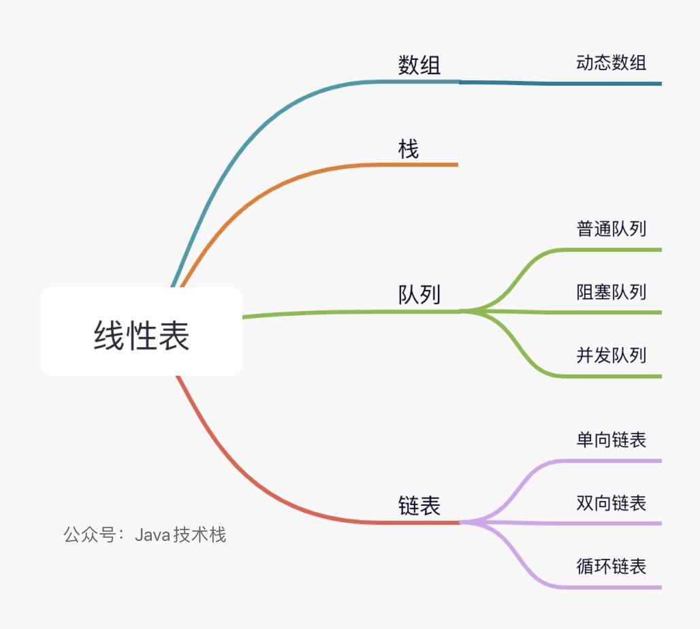
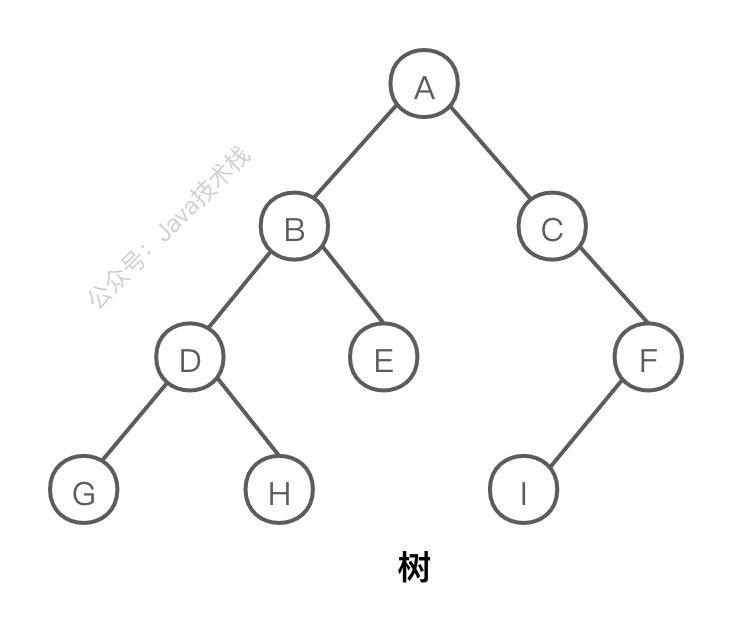
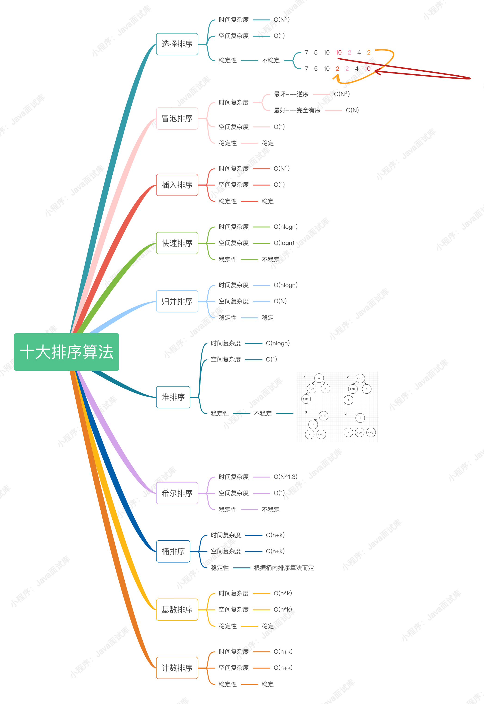
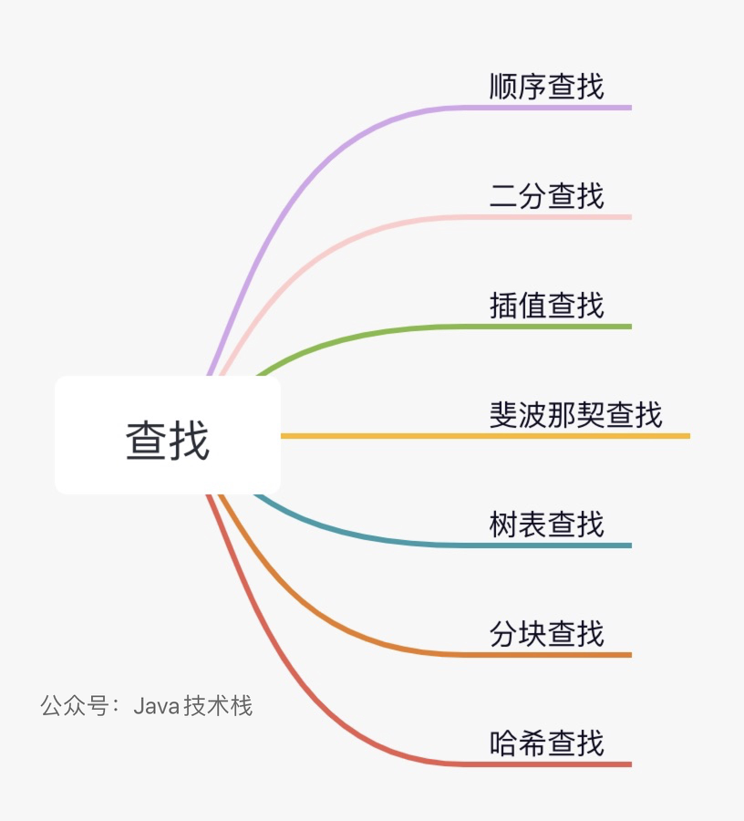
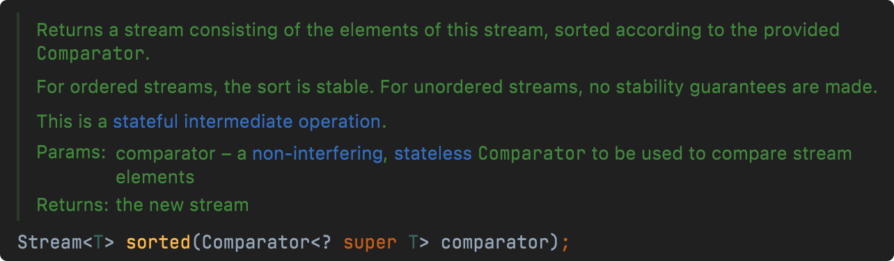
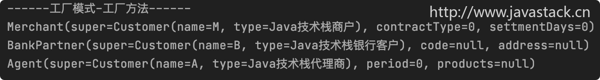
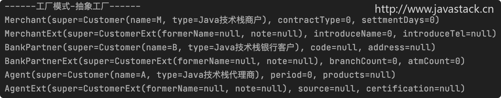
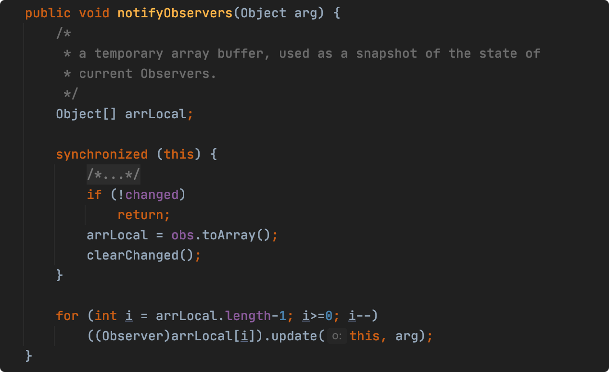

# 数据结构和算法 142

### 1、为什么要学习数据结构和算法？

个人觉得有以下几点：

1）面试必备：编程基本功，进大厂基本是必问的，可能现场考算法题；

2）训练思维逻辑，形成时间复杂度、空间复杂度思维，能帮你写出性能更好、更优的代码，也能提升看问题的角度及深度；

3）提升个人的核心竞争力，不要只会写CRUD 代码，工资上不去；

### 2、什么是数据结构？

数据结构是计算机系统存储、组织数据的方式。

数据结构是指一种或多种特定关系的数据元素的集合，即带“结构”的数据元素的集合，结构就是指数据元素之间的关系。

### 3、数据结构有什么用？

使用恰当的数据结构可以提升程序运行效率、存储效率。

比如：

1）JDK不同的集合就使用了数组、队列、链表、树等不同的数据结构。

2）MySQL 数据库中的索引就使用了“**树**”这种数据结构，用于提升IO 存储效率和查询效率。

等等。。

### 4、数据结构按逻辑结构分为几大类？

逻辑结构是指：**数据元素之间的逻辑关系**，主要分为 **线性结构** 和 **非线性结构** 两大类。

##### 也有这种分法：

##### 1、集合结构

集合结构中的元素之间是“同属一个集合”的关系，别无其他关系。

##### 2、线性结构

线性结构中的元素是一对一的相互关系。

##### 3、树形结构

树形结构中的元素是一对多的相互关系。

##### 4、图形结构

图形结构中的元素是多对多的相互关系。

### 5、数据结构按物理结构分为几大类？

物理结构是指：**数据在计算机中的存储形式**，具体可分为以下几类：

- 顺序存储
- 链式存储
- 索引存储
- 散列存储

一种数据结构可表示一种或多种物理结构。

### 6、常用的数据结构有哪些？

##### 常用的数据结构有：

- 数组（Array)
- 栈(Stack)
- 队列(Queue)
- 链表( Linked List)
- 散列表 (Hash)
- 树(Tree)
- 堆(Heap)
- 图(Graph)

### 7、JDK中都用到了哪些数据结构？


**Vector**：数组

**Stack**：栈，底层是数组

**ArrayList**：数组

**LinkedList**：双向链表

**HashSet**：数组+链表

**HashMap**：数组+链表/红黑树

**ConcurrentHashMap**：数组+链表/红黑树

**TreeMap**：红黑树

**Queue**：队列

等等。。

### 8、常用的线性数据结构有哪些？

常用的线性数据结构有：线性表，栈，队列，循环队列，一维数组等。

### 9、常用的非线性数据结构有哪些？

常用的非线性数据结构有：二维数组、多维数组、广义表、树、图等。

### 10、什么是数组？

数组（Array）是一个有序的元素序列，是一组连续的内存空间，数组是用于储存多个相同类型数据的集合，可以有一维、二维以及多维等表现形式。


数组可以有不同的定义类型，如：整型数组、字符串数组、浮点型数组、引用数组等，数组中的元素可以重复。

### 11、数组的优缺点？

##### 优点：

查找速度快 (包括随机查找)

##### 缺点：

1）大小固定，可能浪费空间，不方便扩展；

2）需要连续内存空间，对内存要求高；

3）修改、删除效率慢；

### 12、数组为什么都是从0开始编号，而不是从1呢？

比如有以下 4个元素的数组：

> int[] arr = new int[4];

计算机会在内存中随机分配一个首地址，后面再连续分配16个字节，每个数组元素占4个字节：

> 第一个数组元素 a[0] 起始地址：首地址+偏移地址 0*4 字节；*
>
> *第二个数组元素 a[1] 起始地址：首地址+偏移地址 1*4 字节；
>
> 第三个数组元素 a[2] 起始地址：首地址+偏移地址 2*4字节；*
>
> *第四个数组元素 a[3] 起始地址：首地址+偏移地址 3*4 字节；

如果数组从1开始：

> 第一个数组元素 a[1] 起始地址：首地址+（1-1）*4字节；*
>
> *第二个数组元素 a[2] 起始地址：首地址+（2-1）*4字节；
>
> 第三个数组元素 a[3] 起始地址：首地址+（3-1）*4字节；*
>
> *第四个数组元素 a[4] 起始地址：首地址+（4-1）*4字节；

从 1开始总要多一步减法运算，所以从0 开始更高效，数组从 0 开始是C 语言设计的，现在的高级语言也都保持了C 语言数组从0 开始的习惯。

### 13、什么是栈？

栈是一种受限的线性表，只能在表的固定一端进行插入和删除操作，称为栈顶，另外一端则称为栈底。

栈是按照先进后出（First In Last Out）FILO 的原则存储数据的，数据按进入顺序依次被压入栈底，最后进入的数据在栈顶，所以越晚进入栈的数据就越先从栈中出来。


从栈中插入新数据叫：进栈、入栈或压栈，从栈中删除数据叫：出栈。

### 14、什么是链表？

链表是一种按照链式存储结构进行存储数据元素的数据结构。

链表中的每个节点不但包含数据本身，还包含下一个数据元素的指针，数据元素在物理空间上可能是非连续的，逻辑顺序是通过链表中的指针链接顺序来实现的。


链表中的数据可能包含重复。

### 15、链表分为哪几类？

##### 链表可以分3类：


##### 1、单链表

单链表中的元素只能指向下一个元素或者指向空，元素之间不能相互指向。

##### 2、双链表

双链表中的每个元素既能指向下一个元素，又能指向上一个元素。

##### 3、循环链表

循环链表是指两种链表中的最后一个节点都指向第一个节点。


### 16、链表的优缺点？

##### 优点：

1）大小不固定，可灵活扩展；

2）内存利用率高，不会浪费内存；

3）插入、删除效率快；

##### 缺点：

随机查找效率低

### 17、数组和链表的区别？

主要有以下 3 点区别：

1）数组的长度是固定的，链表是动态增减的；

2）数组内存是定义时分配的，链表是运行时申请分配的；

3）数组中的元素顺序由下标确定，链表中的元素顺序由上下节点确定；

### 18、数组和链表怎么选？

##### 使用数组：

经常需要快速查询检索数据，很少对数据进行修改、删除，比如可以使用：ArrayList。

##### 使用链表：

经常需要修改、删除数据，很少查询检索数据，比如可以使用：LinkedList。

### 19、什么是跳表？

跳表，也叫跳跃表，全称为：**SkipList**，是一个用于有序元素序列、快速搜索的随机化的数据结构，它的每个节点通过持有多个其他节点的指针，从而能实现快速搜索节点的目的。

跳表可以在很多应用场景中替代平衡树，跳表的算法与平衡树相比，实现要更简单，并且对于小量数据存储，跳表的性能要更好，占用的内存空间也更少。

> 跳表的平均时间复杂度为：**O(logN)**，最坏复杂度为：**O(N)**，所以其性能可以与平衡树相媲美。

跳跃表主要由以下几部分构成：

| 组成部分    | 说明                             |
| ----------- | -------------------------------- |
| 表头(head)  | 负责维护跳跃表的节点指针         |
| 节点 (node) | 保存元素值，每个节点有一层或多层 |
| 层(level)   | 保存着指向该层下一个节点的指针   |
| 表尾 (tail) | 全部由 NULL 组成，表示跳跃表末尾 |

跳表是在「有序链表」的基础上发展起来的：


跳跃表由很多**「层」**组成的，每一层都是一个有序的集合，最底层的链表包含了所有的元素。跳跃表的遍历也总是从高层开始的，然后随着元素值范围的缩小，慢慢降低到低层。

### 20、什么是队列？

队列是一种受限的线性表，队列只能在表的一端（队尾）插入数据，在表的另外一端（队头）删除数据。

队列是按照先进先出（First In First Out）FIFO 的原则存储数据的，所以越早进入队列的数据就越先从队列中出来。


从队列中插入数据叫：入队，从队列中删除一个数据叫：出队。

### 21、栈和队列的区别？

##### 主要区别：

栈是先进后出（First In Last Out）FILO，队列是先进先出（First In First Out）FIFO；


栈只能在表的一端进行插入和删除，队列只能在表一端进行插入，在表另一端进行删除。

### 22、什么是线性表？

线性表则是在内存中数据的一种组织、存储的方式。

一个线性表是n个具有相同特性的数据元素的有限序列，线性表中数据元素之间是一对一的关系，除了第一个和最后一个数据元素之外，其它数据元素都是首尾相接的。

### 23、什么是顺序表？

顺序表是在计算机内存中以数组形式存储的线性表，采用顺序存储结构，将表中元素一个接一个的存入一组连续的存储单元中，线性表中的元素数据的逻辑顺序与物理顺序一致。

### 24、线性表分为哪两大类？

##### 线性表分为两大类：

##### 1、一般线性表

就是指我们通常所说的“线性表”，可以自由删除或添加节点。

##### 2、受限线性表

受限表示对节点的操作受限制，主要包括栈和队列。

### 25、线性表有哪几种存储结构？

##### 线性表有两种存储结构：

##### 顺序存储结构：

读取较快，插入删除较慢。

##### 链式存储结构：

读取较慢，插入删除较快。

### 26、常用的线性表数据结构有哪些？

常用的属于线性表的数据结构有：数组、栈、队列、链表。



### 27、线性表和链表有什么关系？

线性表是数据结构中的逻辑结构，当采用顺序存储结构时，称为 顺序表，当采用链式存储结构时，称为 链表。

所以，线性表以不同的存储形式可以包括：顺序表和链表。

### 28、数组是线性表吗？

##### 可以说是，但这两者并没有从属关系。

线性表是一种抽象的数据结构，数组是一种具体的、物理的存储数据的数据结构。

线性表即可以用数组实现，也可以用链表实现，数组既可以实现线性表，也可以实现树、图等。

### 29、什么是树？

树是一个由 n(n >= 1) 个有限节点组成的具有层次关系的集合。

为什么叫树，是因为数据结构中的每个节点有零个或多个子节点，看起来就像一棵倒挂的树，树是由根节点和若干颗子树组成的。



没有父节点的节点称为根节点，一个树有且只有一个根节点。

每一个子节点有且只有一个父节点，每一个子节点又可以分为多个不相交的子树。

### 30、常用的树数据结构有哪些？

常用的树数据结构有：


### 31、什么是二叉树？

二叉树（Binary tree）是n 个有限元素的集合，是一种树中节点的度不大于 2 的有序树（只能是0、1、2）。

如图所示：


### 32、常用的二叉树数据结构有哪些？

常用的二叉树数据结构有：


所有数据结构全系完整高清版，请关注公众号Java技术栈，在后台回复：数据结构

### 33、什么是满二叉树？

如果二叉树中最后一层无任何子节点，且其他每一层上的所有节点都有两个子节点，即每个节点的度都为 2，则此二叉树可以称为：**满二叉树**。

如图所示：


### 34、什么是完全二叉树？

完全二叉树是由满二叉树而引出来的，如果二叉树中除了最后一层外，其他各层的节点都达到最大个数2个，且最后一层的所有节点依次从左到右分布，则此二叉树被称为完全二叉树。

如图所示：


### 35、满二叉树和完全二叉树的区别？

满二叉树肯定是完全二叉树，而完全二叉树不一定是满二叉树。


### 36、什么是二叉查找树？

二叉查找树（Binary Search Tree），又叫二叉搜索树，或者二叉排序树（Binary Sort Tree）。

它是一棵空树，或者是具有下列性质的二叉树：

1）若它的左子树不空，则左子树上所有结点的值均小于它的根结点的值；

2）若它的右子树不空，则右子树上所有结点的值均大于它的根结点的值；

3）它的左、右子树也分别为二叉搜索树。

如图所示：


### 37、二叉查找树和二叉树的区别？

凡是每个节点都最多只有两个节点的树，都叫二叉树。

二叉查找树只是二叉树中的一种，主要用于搜索和动态排序。

### 38、什么是平衡二叉树？

平衡二叉树是指二叉树中任意节点的子树的高度差都不超过1，并且左右两个子树都是一棵平衡二叉树，平衡二叉树也可以是空树。

平衡二叉树也是二叉排序树，左节点要小于根结点。

如图所示：


右图右边子树高度为 2，大于1，所以不是平衡二叉树。

### 39、常用的平衡二叉树有哪些？

常用的平衡二叉树有：AVL 树、红黑树、Treap、伸展树等。

### 40、什么是AVL树？

AVL树就是指最早发明的平衡二叉树，也就是常说的平衡二叉树，取名于其发明者的名字Adelson-Velski 以及Landis，具体见平衡二叉树面试题的定义：什么是平衡二叉树？

### 41、什么是红黑树？

红黑树（R-B Tree）是每个节点都带有颜色属性的一种二叉查找树，节点的颜色为红色或黑色。


红黑树是平衡二叉树的一种变体，它的左右子树高差有可能大于1，在进行插入、删除操作时通过特定旋转操作以保持二叉查找树的平衡，从而获得较高的查找性能。

所以红黑树不是严格意义上的平衡二叉树（AVL），但对之进行平衡的代价较低，其平均统计性能要强于AVL。

##### 红黑树需要满足下列5个特性：

1、根节点是黑色的；

2、其他每个节点是红色或黑色的；

3、每个空节点是黑色的；

4、如果一个节点是红色的，则它的左右子节点都必须是黑色的，但黑色节点的子节点可以是黑色的;

5、从任意一个节点到空节点的所有路径必须包含相同数目的黑色节点；

### 42、红黑树和AVL树的区别？

红黑树和 AVL 树都是平衡二叉树。

AVL树是严格的平衡二叉树，必须满足平衡条件。执行插入、删除操作时，只要不满足上面的条件，就要通过旋转来保持平衡，而旋转是非常耗时的，所以 AVL 树适合用于插入、删除操作较少、查找较多的场景。

红黑树放弃了完全平衡，而是追求大致平衡，在与AVL树的时间复杂度相差不大的情况下，每次插入最多只需要旋转三次就能达到平衡，维持平衡的时间消耗较少，实现起来也更为简单，相对于AVL树来说，它的旋转次数少，所以红黑树适应于插入、删除操作较多的场景。

##### 总结：AVL树查找性能更快，红黑树插入、删除性能更快。

### 43、B树、B-树、B+、B*树的区别？

**B树=BTree =B-Tree**，它们是指同一种树，国内出现的不同的叫法。

**B+树（B+Tree）**，它是B树的变体，**B*树**又是B+树的变体，它们都是在前一种B树的基础上做的优化。

----

B 树是一种自平衡的树状数据结构，用于优化数据的存储和检索。

B+树解决的是B树范围查询的问题，B+树的数据只存储在叶子结点中，非叶子结点存储的只是索引。

B*树的改进旨在减少B+树的节点分裂和合并操作，减少了树的维护开销，提升了空间利用率。

### 44、什么是B树？

B树（英语：**B-tree**），也叫**B-树**，它是一种自平衡的树，一种平衡的多路查找树，B，即：**Balanced**（平衡），它能够保持数据有序，可用于支持快速的查找、插入和删除操作。

如下图所示：


一个m阶的B树具有如下几个特征：

- 它是一种多路搜索树（但不是二叉树）；
- 根节点至少有2个子节点；
- 所有叶子节点位于同一层；
- 除根节点以外的非叶子节点的子节点数为 M/2～M 个；
- 每个节点中的元素从小到大排列；

B树广泛用于数据库和文件系统等领域，以支持高效的数据存储和检索，B 树的设计目标是优化磁盘I/O 操作，使得在大规模数据集上的数据查询和修改操作更为高效。

### 45、什么是B+树？

B+树是B树的一种变种树，是对B树的改进和优化，B+树与B树基本定义相同。

如下图所示：


一个m阶的B+树具有如下几个特征：

- 所有非最下层的内层结点的关键字是对应子树上的最大关键字，最下层内部结点包含了全部关键字；
- 除根节点以外，每个节点有m/2～m个子节点；
- 非叶子结点的子树指针与关键字个数相同；
- 非叶子节点不存放数据，只存放索引信息；
- 叶子节点存放了所有信息，包括索引信息及数据信息；
- 所有叶子节点增加了一个链指针；
- 所有关键字都在叶子节点出现；

B树和B+树都是常用的数据库索引结构，用于优化数据库查询性能，但B+树要比B树应用更广泛，比如：MySQL 索引默认就是使用的B+树，因为B+树的数据结构要更方便范围查询，不用每个层级遍历每个节点。

### 46、什么是B*树？

##### B*树是B+树的变体：

- B*树在B+树的非根节点再增加指向兄弟的指针；*
- *B*树非叶子节点关键字个数至少为(2/3)*M，即最低使用率为2/3（B+树则为1/2)


B*树的改进主要旨在减少B+树的节点分裂和合并操作，从而降低了树的维护开销，提高了数据检索性能。

##### B+树的分裂：

- 当一个节点满时，分配一个新的节点，并将原节点中1/2的数据复制到新节点，最后在父节点中增加新节点的指针；
- B+树的分裂只会影响原节点和父节点，而不会影响兄弟节点，所以它不需要指向兄弟的指针;

##### B*树的分裂：

- 当一个节点满时，如果它的下一个兄弟节点未满，则先将一部分数据移到兄弟节点中，再在原节点插入关键字，最后修改父节点中兄弟节点的关键字；
- 如果兄弟也满了，则在原节点与兄弟节点之间增加新节点，并各复制 1/3 的数据到新节点，最后在父节点增加新节点的指针;

B*树分配新节点的概率比B+树要低，将节点的最低利用率从B+树的1/2 提高到了 2/3，所以B*树的空间使用率要更高。

### 47、什么是R树？

R树也是B树的扩展，它是B树向多维空间发展的另一种形式，是一种用于空间数据索引的树状数据结构。

R 树的设计目标是支持高效的空间数据存储和检索，通过将对象划分为**矩形区域**并进行组织，R树能够高效地支持空间查询操作，特别适用于**范围查询和邻近查询**等操作，广泛应用于数据库、地理信息系统（GIS）和空间数据管理等领域。

如下图所示：

R树很好地解决了高维空间搜索问题，它把B树的思想扩展到了多维空间：

- 将对象空间按范围划分；
- 每个节点都对应一个矩形区域；
- 每个节点可以包含一定数量的子节点或对象；
- 非叶节点的磁盘页中存储其所有子节点的区域范围；
- 非叶节点的所有子节点的区域都落在它的区域范围之内；
- 叶节点的磁盘页中存储其区域范围之内的所有空间对象的外接矩形；
- 添加删除操作会采用合并/分解结点的方法，保证树的平衡性。

比如，MySQL 空间数据类型的索引就采用了R树进行存储。

### 48、什么是堆？

堆是一种特殊的树形数据结构，堆是一棵完全二叉树。


堆的特点是堆中的某个节点的值总是不大于或不小于其父节点的值。

根节点最大的堆叫做最大堆或大根堆，根节点最小的堆叫做最小堆或小根堆。

### 49、栈和堆的区别？

不同于JVM 中的栈和堆，在数据结构中：

**栈**：是一种先进后出的数据结构。

**堆**：是一种特殊的树，一般堆都是指二叉堆。

### 50、常用的堆数据结构有哪些？

常用的堆数据结构有：


### 51、什么是散列表？

散列表（Hash table，也叫哈希表），是通过Key/value 形式进行存储和访问的一种数据结构。

散列表通过把key/ value 值映射到表中一个位置来进行记录访问，从而加快了记录查找的速度。这个映射函数叫做散列函数，存放记录的数组叫做散列表。

在 JDK 的底层实现中，普通的散列表就是：HashMap，线程安全的散列表是：Hashtable。

### 52、什么是图？

图（Graph）是一种非线性的具有“多对多"逻辑关系的数据结构，在图结构中，数据节点一般称为顶点，图就是一些顶点的集合。

如图所示：


顶点用圆圈表示，边就是这些圆圈之间的连线，顶点之间通过边连接。

### 53、BitMap是什么？

BitMap 是一种简单而实用的数据结构，具有占用空间小、查询速度快等优点，**它用于表示一个只有 0 和1 两个取值的序列**：


BitMap 通常采用一个数组来表示一个二进制序列，每个元素只占用1个bit，可以表示0或1两个取值。由于一个 bit只有两种取值，因此 BitMap在存储大量数据时，可以大大减少存储空间。

另外，由于 bit 运算是计算机中最基本的运算之一，因此 BitMap 可以非常高效地进行位运算，比如与、或、非等操作。

> BitMap 主要用于位运算和内存管理等场景，可以帮助我们快速判断某个元素是否存在或统计某个范围内的元素个数。

### 54、BitMap的工作流程？


1）初始化一个位数组，长度为n。

2）将待处理的元素映射为位数组中的下标，如果该元素存在，则将对应的位置设置为1，否则设置为0。

3）**判断某个元素是否存在的操作**：可以直接访问对应位置的值，如果为1则说明该元素存在，否则说明不存在。

4）**统计某个范围内的元素个数的操作**：可以对范围内的所有元素进行判断，统计值为1的元素个数即可。

5）**对于数组去重的操作**：可以对数组中的每个元素进行处理，如果该元素对应的位置为0，则说明该元素未出现过，可以将其加入结果数组中，否则说明该元素已经出现过，忽略即可。

### 55、BitMap的应用场景是？

BitMap 的应用场景包括：

##### 1）快速判断某个元素是否存在

对于一个序列中的元素，可以将每个元素的值作为下标，将对应的位置设置为1，从而实现快速判断某个元素是否存在。

##### 2）统计某个范围内的元素个数

可以使用 BitMap 统计某个范围内的元素个数，比如统计某个 IP 段内的活跃主机数量。

##### 3）数组去重

对于一个数组中的元素，可以将每个元素的值作为下标，将对应的位置设置为1，从而实现数组去重。

##### 4）内存管理

BitMap 可以用于内存管理中，表示哪些内存块已经被占用、哪些还未被占用。

##### 5）实现布隆过滤器

可以使用一个 BitMap来表示一个布隆过滤器中的多个二进制位，其中每一位表示一个哈希函数的返回值：

- 当需要将一个元素插入到布隆过滤器中时，可以将其哈希到多个二进制位上，并使用 SETBIT命令将这些二进制位设置为1。
- 当需要查询一个元素是否存在于布隆过滤器中时，可以将其哈希到多个二进制位上，并使用 GETBIT命令检查这些二进制位是否都为 1。

### 56、BitMap和布隆过滤器的区别？

##### 1）应用场景

布隆过滤器主要用于快速判断元素是否可能存在于一个集合中，而 BitMap 主要用于快速判断某个元素是否存在或统计某个范围内的元素个数。

##### 2）实现方式

布隆过滤器采用多个哈希函数将一个元素映射为多个不同的位，并将这些位在位数组中设置为1，而 BitMap 直接使用数组来表示二进制序列。

##### 3）误判率

布隆过滤器存在一定的误判率，而 BitMap 没有误判率的问题。

##### 4）复杂性

布隆过滤器需要调整参数来平衡误判率和空间占用，而 BitMap 相对简单。

### 57、布隆过滤器是什么？

布隆过滤器（**Bloom Filter**）是一种空间效率高、查询时间快的概率型数据结构，它可以判断一个元素是否属于一个集合，常用于去重、快速查询等场景。

> ##### 布隆过滤器的主要思想是：
>
> 布隆过滤器通过多个哈希函数（Hash）将一个元素映射为多个不同的位，然后将这些位在位数组中位置设置为1，表示该元素存在于集合中。当判断一个元素是否存在于集合中时，布隆过滤器将该元素通过相同的哈希函数（Hash）映射为多个位，检查这些位是否都为1，如果是，则认为该元素可能存在于集合中。

##### 布隆过滤器数据结构图：


### 58、布隆过滤器的工作流程？


##### 1）初始化布隆过滤器：

需要一个长度为 n 的数组，每个索引位初始值为 O，还要准备k个 hash 函数。

##### 2）当某个元素加入集合时：

用每个 hash 函数计算出k 个散列值，并把数组中对应的索引位置为 1。

##### 3）当判断某个key是否存在集合时：

用每个hash 函数计算出k个散列值，并查询数组中对应的索引位，如果所有的索引位置都是1，则元素可能在集合中，否则该元素肯定不在集合中。

### 59、布隆过滤器的应用场景是？

布隆过滤器的常用应用场景：

##### 1）缓存穿透

布隆过滤器可用于缓存中，防止缓存穿透问题，即当缓存中不存在某个元素时，多次查询会导致对数据库的多次查询，影响系统性能。

##### 2）黑名单过滤

布隆过滤器可以用于黑名单过滤，将黑名单中的IP 地址、URL 等存储在布隆过滤器中，快速判断一个请求是否属于黑名单。

##### 3）数据库优化

布隆过滤器可以用于数据库查询优化，将查询过程中可能不存在的数据通过布隆过滤器过滤掉，减少了数据库的查询压力。

##### 4）垃圾邮件过滤

布隆过滤器可以用于过滤垃圾邮件，将已知的垃圾邮件的特征存储在布隆过滤器中，快速判断新的邮件是否属于垃圾邮件。

### 60、布隆过滤器可以判断元素存在和不存在吗？

布隆过滤器（Bloom Filter）可以判断元素**可能存在**和元素一定不存在两种情况，**但不能判断元素一定存在**，这是由于布隆过滤器的误判率导致的，因为哈希函数可能会产生哈希冲突，导致多个元素映射到了同一个位上，从而出现误判的情况。

所以，当查询一个不存在的元素时，如果索引位置上是1，**这个1可能是别的元素占用的**，所以不能判定该元素是否一定存在，但可以判定它可能存在和一定不存在。

> 布隆过滤器可以用于过滤掉一些肯定不存在的元素，**但不能保证查询结果的准确性**，需要根据具体的应用场景来选择合适的参数，以平衡误判率和空间占用。
>
> 如果需要保证查询结果的准确性，可以考虑使用其他数据结构，比如哈希表、红黑树等。

### 61、布隆过滤器支持删除元素吗？有什么方案？

布隆过滤器本身不支持删除操作，因为布隆过滤器使用多个哈希函数将一个元素映射为多个不同的位，并将这些位在位数组中设置为1，表示该元素存在于集合中。**如果要删除一个元素，需要将其对应的位设置为0，但这会影响其他元素的判断结果，导致误判率增加**。

如果需要支持删除操作，可以考虑使用以下代替方案：

- Counting Bloom Filter（计数布隆过滤器）
- Cuckoo Filter（布谷鸟过滤器）

这些替代方案都可以支持删除操作，但相应的实现会更加复杂，需要使用更多的空间来维护计数等信息，从而降低了空间效率。

> 在实际应用中，需要根据具体的需求来选择使用哪种方案。

### 62、布隆过滤器存在什么问题？

布隆过滤器存在以下几点问题：

##### 1）误判率

由于布隆过滤器使用多个哈希函数将一个元素映射为多个不同的位，并将这些位在位数组中设置为1，表示该元素存在于集合中。当判断一个元素是否存在于集合中时，如果这些位都为1，则认为该元素可能存在于集合中，但这也可能导致误判。

> 误判率是布隆过滤器的一个重要指标，它会影响判断结果的准确性。

##### 2）空间占用

布隆过滤器需要使用一个位数组来存储元素的状态信息，因此需要占用一定的空间。当需要处理大量数据时，位数组的长度可能会很大，从而导致空间占用过高。

> 为了降低空间占用，可以通过调整哈希函数的数量和位数组的长度来平衡空间占用和误判率。

##### 3）删除困难

由于布隆过滤器使用多个哈希函数将一个元素映射为多个不同的位，并将这些位在位数组中设置为1，表示该元素存在于集合中。如果要删除一个元素，需要将其对应的位设置为0，但这会影响其他元素的判断结果，导致误判率增加。

所以，在布隆过滤器中，一般不支持删除操作。

##### 4）哈希函数的选择

布隆过滤器中的哈希函数需要具有一定的随机性，才能保证元素映射到位数组中的位置是随机的。如果哈希函数不够随机，就会导致元素映射到位数组中的位置不均匀，进而影响布隆过滤器的判断效果。

##### 5）初始容量和扩容问题

布隆过滤器在初始化时需要设置位数组的长度，这个长度需要根据预估的元素个数和期望的误判率来选择：

- 如果预估不准确或者数据量变化较大，可能会导致位数组长度过小或者过大；
- 如果位数组长度过小，就会导致误判率升高；
- 如果位数组长度过大，就会浪费空间和降低查询效率。

### 63、计数布隆过滤器是什么？

##### 计数布隆过滤器（Counting Bloom Filter）是布隆过滤器的增强版，它在布隆过滤器的基础上增加了删除操作。

计数布隆过滤器可以支持删除操作，因为它将位数组中的每个位置都改为一个计数器，而不是简单的0和1，具体逻辑如下：

- 当一个元素被插入到计数布隆过滤器中时，不仅需要将相应的位设置为1，还需要将该位对应的计数器加 1。
- 当需要删除一个元素时，可以将相应的位设置为0，并将该位对应的计数器减1。
- 当判断一个元素是否存在于集合中时，需要将所有相关的计数器值都读取出来，判断它们是否都大于0，如果都大于0，则说明该元素存在于集合中。

计数布隆过滤器相比于布隆过滤器，增加了计数器的维护，可以支持删除操作，但也带来了一些额外的空间和时间开销。

计数布隆过滤器需要使用更多的空间来维护计数器数组，同时也需要更多的时间来进行计数器的更新和查询操作。因此，在实际应用中，需要根据具体的需求来选择使用布隆过滤器还是计数布隆过滤器。

### 64、布谷鸟过滤器是什么？

布谷鸟过滤器（**Cuckoo Filter**）是一种高效的、**基于哈希表和链表的数据结构**，用于判断元素是否存在于集合中，与布隆过滤器类似，但是，**布谷鸟过滤器支持删除操作，并且不存在误判率**。

布谷鸟过滤器的工作流程如下：

##### 1）初始化

首先需要初始化布谷鸟过滤器，包括设置哈希表的大小、每个桶的大小等参数，创建哈希表并将其中的所有桶初始化为空。

##### 2）插入元素

当需要插入一个元素时，布谷鸟过滤器会使用两个哈希函数将该元素映射为两个不同的桶，然后检查这两个桶中是否已经存在该元素或者链表是否已满。如果某个桶中已经存在该元素，或者某个链表已经满了，则需要进行“踢出”操作。

##### 3）踢出元素

当发生哈希冲突时，即两个不同的元素被映射到同一个桶或者同一个链表时，布谷鸟过滤器会将已经存在的元素或者链表中的某个元素移动到另一个桶或者链表中，并将当前元素插入到被“踢出”"的位置上。如果移动后的位置上已经存在元素，就需要继续"踢出"，直到找到一个空位置为止。

##### 4）查询元素

当需要查询一个元素是否存在于集合中时，布谷鸟过滤器会使用两个哈希函数将该元素映射为两个不同的桶，然后检查这两个桶中是否存在该元素的信息。如果某个桶中存在该元素的信息，则说明该元素存在于集合中。

##### 5）删除元素

当需要删除一个元素时，可以在两个位置上都找到该元素的信息，并将其删除即可。

### 65、布隆过滤器、计数布隆过滤器和布谷鸟过滤器的区别？

##### 计数布隆过滤器和布隆过滤器相比：

- 实现方式不同
- 支持删除操作

-----

##### 布谷鸟过滤器和布隆过滤器相比：

- 实现方式不同

- 不会存在误判

- 支持删除操作

- 支持动态扩容

### 66、什么是算法？

算法（Algorithm）是计算机解决问题的一系列具体方法、步骤，算法用系统的方法描述解决问题的策略机制，算法包含清晰定义的指令用于计算函数，常用于计算、数据处理和自动推理。

解决不同的问题，需要用不同的算法。

### 67、数据结构和算法有什么关系？

数据结构是按一定的逻辑结构把数据组织起来，并以适当的存储方法把逻辑结构组织好的数据存储到计算机中。

算法的目的就是为了能更高效的处理数据，提高数据有运算效率，数据的运算是定义在数据的逻辑结构上，但运算的具体实现要在存储结构上进行。

### 68、算法的基本特征有哪些？

##### 算法的基本特征有：

##### 1、有穷性

算法必须能在有限个步骤执行之后终止。

##### 2、确切性

算法的每一步骤必须有确切的定义。

##### 3、输入项

一个算法有0个或多个输入，描述运算对象的初始条件。

##### 4、输出项

一个算法有1个或多个输出，以反映对输入数据处理后的结果。

##### 5、可行性

算法中的任何计算步骤都能被分解为基本的可执行的操作步骤，每个计算步骤都可以在有限时间内完成。

### 69、从哪些方面来评定一个算法？

##### 一个算法的评定主要有以下几个因素：

##### 1、时间复杂度

时间复杂度是指执行算法所需要的计算工作量。

##### 2、空间复杂度

空间复杂度是指算法需要消耗的内存空间。

##### 3、正确性

算法执行是否正确，是评定一个算法优劣的最重要的标准。

##### 4、可读性

可读性是指一个算法可供阅读的容易程度。

##### 5、鲁棒性

鲁棒性是指一个算法对不合理数据输入的反应能力和处理能力，也称为：**容错性**。

### 70、你怎么理解时间复杂度？

时间复杂度，不是指执行代码所消耗的具体时间，而是表示算法的运行时间随着输入规模不断增加的变化趋势。

算法的时间复杂度越小，表示算法的运行效率越高，越大则反之。

### 71、算法复杂度用什么公式表示？

一般用「大〇」来描述算法的效率，即算法复杂度。

算法复杂度表示公式为：

> O(....)， 比如: O(1)

括号里面是一个包含「n」（即输入规模）的数学表达式。

### 72、为什么需要做算法复杂度分析？

我们都知道，使用不同的算法，对于数据规模的不断增加，运行效率天差地别，使用了效率差的算法可能还会影响整个系统的吞吐量，所以对于算法复杂度分析，找出更快更合适的算法就非常有必要。

### 73、如何分析一段代码的时间复杂度？

根据常见的7种时间复杂度，关注是否有循环、循环嵌套语句，去套时间复杂度公式，算出总复杂度最大的那个。

| 时间复杂度量级     | 描述                                                         |
| ------------------ | ------------------------------------------------------------ |
| 最坏情况时间复杂度 | 代码在最坏情况下执行的时间复杂度                             |
| 最好情况时间复杂度 | 代码在最理想情况下执行的时间复杂度                           |
| 平均时间复杂度     | 代码在所有情况下执行的时间平均时间复杂度                     |
| 均摊时间复杂度     | 极少数高级别复杂度且发生具有时序关系时，可以将这几个高级别的复杂度均摊到低级别复杂度上，一般均摊结果就等于低级别复杂度 |

### 74、常见的时间复杂度有哪些？它们的算法效率如何？

##### 常见的时间复杂度有以下几种：

1、常数阶 O(1)

2、对数阶 O(log n)

3、线性阶 O(n)

4、线性对数阶 O(n log n)

5、平方阶 O(n^2)、立方阶 O(n^3)、k 次方阶 O(n^k)...

6、指数阶 O(2^n)

7、 O(n!) 阶乘阶

-----

它们的运行时间变化由小到大依次为：

> O(1) < O(log n) < O(n) < O(n log n) < O(n^2) < O(n^3) < O(n^k) < O(2^n) < O(n!)

即运行时间随着输入规模n的不断增大，时间复杂度不断增大，算法的执行效率越低。


参考: https://www.bigocheatsheet.com/

### 75、你怎么理解时间复杂度O(1)？ (请举例说明)

##### 0(1）是常数阶，表示算法的运行时间不会随着输入规模的增加而增加。

比如以下代码：

```java
public void test {
    int i = 1;
    int j = 2;
    int k = 3;
    int m = i + j + k;
}
```

它的时间复杂度是 O(1)。

一般来说，只要没有循环、递归等场景，无论执行多少行代码，一行，十行，或者几十万行，它的时间复杂度都是O(1)。

### 76、你怎么理解时间复杂度O(n)？ (请举例说明)

##### O(n)是线性阶，一般出现在循环遍历代码中。

比如以下代码：

```java
public void test {
    for (int i = 0; i < list.size; i++) {
        // ...
    }
}
```

for 循环中的代码会运行 n 遍，所以它的时间复杂度都是 O(n)。

### 77、你怎么理解时间复杂度O(log n)？ (请举例说明)

##### O(log n)是对数阶，一般出现在循环遍历代码中，循环次数成对数逐渐减少

比如以下代码：

```java
public void test {
    int i = 0;
    int n =1000;
    while(i < n) {
        // ...
        i *= 2;
    }
}
```

如果代码运行的次数为×，则：

> 2×=n
>
> x= logzn

所以它的时间复杂度是 O(log2n)。

因为有`i *= 2`这行代码，for 循环中的代码不会运行n 遍，而是会逐渐减少循环次数。

> O(log2n)、O(log5n)、O(log10n) 等时间复杂度都是用 O(log n) 表示。

### 78、你怎么理解时间复杂度O(n log n)？ (请举例说明)

##### O(n log n)是线性对数阶，可以理解为 O(n) * O(log n)

比如以下代码：

```java
public void test {
    int n = 1000;
    for (int i = θ; i(= n; i++){
        // ...
        int j = 0;
        while (j < n) {
            // ...
            j *= 2;
        }
```

O(n) 时间复杂度里面再嵌套了一个 O(log n) 时间复杂度，每个 O(log n)运行 n 遍，所以时间复杂度为 O(n log n)。

### 79、你怎么理解时间复杂度O(n^2)、O(n^3)、O(n^k)？(请举例说明)

平方阶 O(n^2)、立方阶 O(n~3)、k 次方阶 O(n^k)....可以理解为循环嵌套了多少层。

比如以下代码：

```java
public void test {
    int n = 1000;
    for (int i = e; i<n; i++) {
        // ...
        for (int j = e; j< n; j++) {
            // ...
        }
    }
}
```

这里嵌套了两个 for 循环，说明它们的执行次数是 n*n，即 n²，所以它的时间复杂度为：平方阶 O(n^2)，其他像立方阶 O(n^3)、k 次方阶O(n^k)... 都是类似。

### 80、你怎么理解空间复杂度？

空间复杂度，表示算法的存储空间随着输入规模不断增加的变化趋势，是对一个算法在运行过程中临时占用存储空间大小的度量。

### 81、常见的空间复杂度有哪些？它们的占用空间如何？

##### 常见的空间复杂度有以下几种：

1、 常数空间 O(1)；

2、 线性空间 O(n)；

3、 二维空间 O(n^2 )；

它们占用的空间由小到大依次为：

> O(1) < O(n) < O(n^2) 

### 82、你怎么理解空间复杂度0(1)？ (请举例说明)

O(1)是常数空间复杂度，表示算法执行时的空间不会随着变量的变化而变化，比如以下代码：

```java
public void test {
    int i = θ;
    int j = 1;
    int k = i + j;
}
```

### 83、你怎么理解空间复杂度O(n)？ (请举例说明)

O(n)是线性空间复杂度，表示算法执行时的空间会随着变量的变化而变化，如一维数组、链表等，来看以下代码：

```java
public void test {
    int n = 10;
    int[] arr = new int[n];
    for(int i = 0; i < n; i++) {
        // ...
    }
}
```

这个一维数组的占用空间是 n，即空间复杂度：O(n)。

### 84、你怎么理解空间复杂度O(n^2)？（请举例说明）

O(n^2)是二维空间复杂度，表示算法执行时的空间会随着变量的变化而变化，如二维数组，来看以下代码：

```java
public void test {
    int n = 10;
    int[][] arr = new int[n][n];
    for (int i = 0; i < n; i++) {
 		// ...       
    }
}
```

这个二维数组的占用空间是n*n，即空间复杂度：O(n^2)。

### 85、说说常用的数据结构操作方法，它们的时间复杂度和空间复杂度？

可参考下图：


>  参考: https://www.bigocheatsheet.com/

### 86、常见的算法基本思想有哪几种？

不同的问题，一般可以有以下算法思想去解决问题：


### 87、什么是贪心算法？

贪心算法，贪心即意味着在对问题求解时，每一步都是想得到最好、最优的选择，这就是贪心算法。

换零钱就可以用到贪心算法，比如 wikipedia上的例子，你有36 元，使用贪心算法换零钱，每一步都选择面值最大的：


>  结果：20 >10>5 >1

### 88、贪心算法的适用场景？

要求解的问题可以拆分为多个子问题，各个子问题的最优解可以推导出问题全局的最优解，这时候可以考虑使用贪心算法。

### 89、贪心算法的结果一定是最优解吗？为什么？

##### 贪心算法的结果对所有问题不一定都是最优解，但一定是接近（近似）最优解的结果。

贪心，即只顾眼前，不顾全局。贪心算法的特点是一步步进行，以当前情况为基础根据某个策略作出最优选择，它并没有考虑各种可能出现的整体情况，所以它只是局部最优解，并不一定是整体最优解。

### 90、什么是回溯算法？

回溯算法也叫试探法，类似穷举，是一种系统地搜索问题的解的方法。

在对问题求解的问题中，按搜索路径向前搜索，当发现不满足条件时，则回溯返回，再换一条路继续搜索，这就称为回溯算法。

回溯算法的典型就是八皇后问题：

> 在8×8格的国际象棋上摆放八个皇后，使其不能互相攻击，即任意两个皇后都不能处于同一行、同一列或同一斜线上，问有多少种摆法？


### 91、回溯算法解题的一般步骤是怎样的？

##### 回溯算法解题的一般步骤：

1）定义问题的解空间，它至少包含问题的一个最优解；

2）确定易于搜索的解空间结构，能用回溯法方便地搜索整个解空间；

3）以深度优先的方式搜索解空间，在搜索过程中用剪枝函数避免无效搜索；

### 92、什么是分治算法？

分治算法是一种分目标完成的算法，它将一个规模为N的问题分解为K个规模较小的子问题，如果子问题规模还是比较大，可以继续分解为规模更小的问题，所有子问题之间相互独立，且与原问题性质相同，求出所有子问题的解，就可以得到原问题的解。

### 93、分治算法的适用场景？

1）原问题可以分解为多个性质相同的子问题，且相互独立；

2）原问题在分解过程中，递归算出各个子问题的解；

3）在得到各个子问题的解后，能合并出原问题的解；

### 94、分治算法解题的一般步骤是怎样的？

##### 分治算法解题的一般步骤：


1）分解，将问题分解成若干个规模较小的子问题；

2）求解，解决所有的问题；

3）合并，把所有子问题的解合并得出原问题的解；

### 95、什么是动态规划？

动态规划是对问题求最优解的算法，动态规划算法与分治算法类似，其基本思想也是将问题分解成若干个子问题，组合子问题的最优解就能得到问题的最优解，不同的是，动态规划子问题之间往往不是互相独立的，即下一个子阶段的求解需建立在上一个子阶段的解的基础上，再进行进一步的求解。

### 96、动态规划解题的一般步骤是怎样的？

##### 动态规划解题的一般步骤：

1）定义出子问题；

2）写出子问题的递推关系；

3）确定好 DP 数组的计算顺序；

4）空间优化（可选）；

### 97、贪心算法与动态规划有什么区别？

贪心算法对每个子问题的解决方案都做出选择后，不能回退。

动态规划会保存以前的结果，并根据以前的结果对当前进行选择，可以回退。

### 98、LeetCode--动态规划常见的面试题（共30道）

斐波那契数

> https://leetcode-cn.com/problems/fibonacci-number/

爬楼梯

> https://leetcode-cn.com/problems/climbing-stairs/
>
> https://leetcode-cn.com/problems/min-cost-climbing-stairs/

整数拆分

> https://leetcode-cn.com/problems/integer-break/

分割等和子集

> https://leetcode-cn.com/problems/partition-equal-subset-sum/

完全平方数

> https://leetcode-cn.com/problems/perfect-squares/

目标和

> https://leetcode-cn.com/problems/target-sum//

一和零

> https://leetcode-cn.com/problems/ones-and-zeroes/

组合总和

> https://leetcode-cn.com/problems/combination-sum-iv/

最后一块石头的重量

> https://leetcode-cn.com/problems/last-stone-weight-i/

最长有效括号

>  https://leetcode-cn.com/problems/longest-valid-parentheses

单词拆分

> https://leetcode-cn.com/problems/word-break/

打家劫舍

> https://leetcode-cn.com/problems/house-robber/ 
>
> https://leetcode-cn.com/problems/house-robber-i/
>
> https://leetcode-cn.com/problems/house-robber-ii/

买卖股票的最佳时机

> https://leetcode-cn.com/problems/best-time-to-buy-and-sell-stock/
>
> https://leetcode-cn.com/problems/best-time-to-buy-and-sell-stock-i/
>
> https://leetcode-cn.com/problems/best-time-to-buy-and-sell-stock-ii/
>
> https://leetcode-cn.com/problems/best-time-to-buy-and-sell-stock-iv/
>
> https://leetcode-cn.com/problems/best-time-to-buy-and-sell-stock-with-cooldown/
>
> https://leetcode-cn.com/problems/best-time-to-buy-and-sell-stock-with-transaction-fee/

掷骰子的N种方法

> https:/leetcode-cn.com/problems/number-of-dice-rolls-with-target-sum

不同路径

> https://leetcode-cn.com/problems/unique-paths/
>
> https://leetcode-cn.com/problems/unique-paths-ii/

最长递增子序列

> https://leetcode-cn.com/problems/longest-increasing-subsequence/

最长连续递增序列

> https:/leetcode-cn.com/problems/longest-continuous-increasing-subsequence/

最长重复子数组

> https://leetcode-cn.com/problems/maximum-length-of-repeated-subarray/

最大子数组和

> https:/leetcode-cn.com/problems/maximum-subarray/

获取生成数组中的最大值

> https:/leetcode-cn.com/problems/get-maximum-in-generated-array

最长公共子序列

> https://leetcode-cn.com/problems/longest-common-subsequence/

判断子序列

> https://leetcode-cn.com/problems/is-subsequence/

不同的子序列

> https://leetcode-cn.com/problems/distinct-subsequences/

不相交的线

> https://leetcode-cn.com/problems/uncrossed-lines/

两个字符串的删除操作

> https://leetcode-cn.com/problems/delete-operation-for-two-strings/

回文子串

> https://leetcode-cn.com/problems/palindromic-substrings/

最长回文子序列

> https://leetcode-cn.com/problems/longest-palindromic-subsequence/

编辑距离

> https://leetcode-cn.com/problems/edit-distance/

最大矩形

> https://leetcode-cn.com/problems/maximal-rectangle

不同的二叉搜索树

>  https://leetcode-cn.com/problems/unique-binary-search-trees/

最小的必要团队

>  https://eetcode-cn.com/problems/smallest-sufficient-team

访问所有节点的最短路径

> https://leetcode-cn.com/problems/shortest-path-visiting-all-nodes

### 99、LeetCode--贪心算法常见的面试题（共20道）

分发饼干

https://leetcode-cn.com/problems/assign-cookies/

分发糖果

https://leetcode-cn.com/problems/candy/

零钱兑换

> https://leetcode-cn.com/problems/coin-change/
>
> https:/leetcode-cn.com/problems/coin-change-2/

柠檬水找零

https:/leetcode-cn.com/problems/lemonade-change/

用最少数量的箭引爆气球

https://leetcode-cn.com/problems/minimum-number-of-arrows-to-burst-balloons 

按要求补齐数组

 https://leetcode-cn.com/problems/patching-array/

盛最多水的容器

https://leetcode-cn.com/problems/container-with-most-water

摆动序列

https://leetcode-cn.com/problems//wiggle-subsequence/

最大子数组和

 https://leetcode-cn.com/problems/maximum-subarray/

加油站

 https://leetcode-cn.com/problems/gas-station//

根据身高重建队列

https://leetcode-cn.com/problems/queue-reconstruction-by-height

无重叠区间

https://leetcode-cn.com/problems/non-overlapping-intervals 

划分字母区间

https://leetcode-cn.com/problems/partition-labels

合并区间

https://leetcode-cn.com/problems/merge-intervals 

单调递增的数字

https://leetcode-cn.com/problems/monotone-increasing-digits

监控二叉树

https://leetcode-cn.com/problems/binary-tree-cameras 

跳跃游戏

https:/leetcode-cn.com/problems/jump-game 

https://leetcode-cn.com/problems/jump-game-i

最长回文串

https://leetcode-cn.com/problems/longest-palindrome

种花问题

https://leetcode-cn.com/problems/can-place-flowers

最大数

https://leetcode-cn.com/problems/largest-number

### 100、LeetCode--分治算法常见的面试题 (共16道)

最小的k个数

https:/leetcode-cn.com/problems/zui-xiao-de-kge-shu-lcof

最小的k个数

https://leetcode-cn.com/problems/zui-xiao-de-kge-shu-lcof

出现频率最高的k个数字

 https:/letcode-cn.com/problems/g5c510

连续子数组的最大和

 https://leetcode-cn.com/problems/lian-xu-zi-shu-zu-de-zui-da-he-lcof

环形子数组的最大和

 https://leetcode-cn.com/problems/maximum-sum-circular-subarray 

最接近原点的K个点

 https://leetcode-cn.com/problems/k-closest-points-to-origin

最小高度树

https://leetcode-cn.com/problems/minimum-height-tree-lcci

至少有K个重复字符的最长子串

https://leetcode-cn.com/problems/longest-substring,g-with-at-least-k-repeating-characters 

最大二叉树

https://leetcode-cn.com/problems/maximum-binary-tree 

数组中的第k大的数字

https://leetcode-cn.com/problems/xx4gT2

最大子数组和

 https://leetcode-cn.com/problems/maximum-subarray

数组中的逆序对

https://leetcode-cn.com/problems/shu-zu-zhong-de-ni-xu-dui-lcof

找出数组中的第K大整数

https://leetcode-cn.com/problems/find-the-kth-largest-integer-in-the-array

区间和的个数

 https://leetcode-cn.com/problems/count-of-range-sum

从子集的和还原数组

https://leetcode-cn.com/problems/find-array-given-subset-sums

计算右侧小于当前元素的个数

https://leetcode-cn.com/problems/count-of-smaller-numbers-after-self

### 101、LeetCode-回溯算法常见的面试题 (共22道)

随机数索引

https://leetcode-cn.com/problems/random-pick-index

组合总和

https://leetcode-cn.com/problems/combination-sum

https://leetcode-cn.com/problems/combination-sum-i

全排列

https://leetcode-cn.com/problems/permutations

https://leetcode-cn.com/problems/permutations-ii

子集

https://leetcode-cn.com/problems/subsets 

https://leetcode-cn.com/problems/subsets-ii

得分最高的单词集合

https://leetcode-cn.com/problems/maximum-score-words-formed-by-letters

所有可能的路径

https://leetcode-cn.com/problems/all-paths-from-source-to-target 

二叉树的所有路径

https://leetcode-cn.com/problems/binary-tree-paths

N次操作后的最大分数和

https://leetcode-cn.com/problems/maximize-score-after-n-operations

串联字符串的最大长度

 https://leetcode-cn.com/problems/maximum-length-of-a-concatenated-string-with-unique-characters 

完成所有工作的最短时间

https://leetcode-cn.com/problems/find-minimum-time-to-finish-alljobs

重复K次的最长子序列

https://leetcode-cn.com/problems/longest-subsequence-repeated-k-times

优美的排列

https://leetcode-cn.com/problems/beautiful-arrangement

迷路的机器人

https://leetcode-cn.com/problems/robot-in-a-grid-lcci

棋盘上有效移动组合的数目

https://leetcode-cn.com/problems/number-of-valid-move-combinations-on-chessboard 

生成匹配的括号

https://leetcode-cn.com/problems/IDBivT

删除无效的括号

https://leetcode-cn.com/problems/remove-invalid-parentheses

连续差相同的数字

https://leetcode-cn.com/problems/numbers-with-same-consecutive-differences

正方形数组的数目

https://leetcode-cn.com/problems/number-of-squareful-arrays 

划分为k个相等的子集

https://leetcode-cn.com/problems/partition-to-k-equal-sum-subsets

统计各位数字都不同的数字个数

https://leetcode-cn.com/problems/count-numbers-with-unique-digits/

电话号码的字母组合

https://leetcode-cn.com/problems/letter-combinations-of-a-phone-number

最大化一张图中的路径价值

https://leetcode-cn.com/problems/maximum-path-quality-of-a-graph

### 102、常用的排序算法主要有哪些？

如图所示：



实现代码见编程题。

### 103、说说常用的排序算法，它们的时间复杂度和空间复杂度？

可参考下图：


> 参考：https://www.bigocheatsheet.com/

### 104、常用的查找算法有哪些？

常用的查找算法有：



### 105、常用的图搜索算法有哪些？

常用的图搜索算法有：


深度优先算法（DFS）：思路是从一个节点开始往下搜索，如果发现走不通了，就往回一个节点，从那个节点继续往下走。

广度优先算法（BFS）：思路也是从一个节点开始，不同的是它会先搜索完该节点的子节点，再往下一层搜索。

### 106、常用的字符串匹配算法有哪些？

常用的字符串匹配算法有4 种：


BF（Brute Force）：是一种暴力算法，是普通的模式匹配算法。

BM（Boyer-Moore）：是一种非常高效的字符串搜索算法；

KMP：是一种改进的字符串匹配算法。

Sunday：是目前发现的最高效、容易理解的算法。

### 107、什么是对称加密算法？

所谓对称，就是采用这种加密算法的双方，即加密方和解密方，两方同时使用相同的密钥进行加密和解密，密钥是控制加密及解密过程的指令。

### 108、对称加密算法的优缺点？

##### 对称加密算法的优点是：

- 算法公开
- 计算量小
- 加密速度快
- 加密效率高

##### 对称加密算法的缺点是：

在数据传送前，发送方和接收方必须商定好密钥，然后双方都需要保存好密钥，如果一方的密钥被泄露，那么加密信息也就不安全了。

另外，每对用户每次使用对称加密算法时，都需要使用其他人不相同的唯一密钥，这会使得收、发双方所拥有的钥匙数量巨大，密钥管理成为双方的负担。

### 109、对称加密算法的应用场景有哪些？

##### 对称加密算法的应用场景有：

1、无需进行密钥交换的场景，如内部系统，事先就可以直接确定密钥；

2、常用于保存、传输像用户手机号、身份证、卡号...等数据敏感但能够被解密的信息。

### 110、常用的对称加密算法有哪些？

##### 常用的对称加密算法有：

##### DES

全称为：Data Encryption Standard，即数据加密标准，是一种使用密钥加密的块算法，1977年被美国联邦政府的国家标准局确定为联邦资料处理标准（FIPS），并授权在非密级政府通信中使用，随后该算法在国际上广泛流传开来。

##### 3DES

即：TripleDES，是 DES 向 AES 过渡的加密算法，它使用 3 条 56 位的密钥对数据进行三次加密，是 DES 的一个更安全的变形。它以 DES 为基本模块，通过组合分组方法设计出分组加密算法。

比起最初的 DES，3DES 更安全。

##### AES

全称为：Advanced Encryption Standard，在密码学中又称 Rjndael 加密法，是美国联邦政府采用的一种区块加密标准。这个标准用来替代原先的DES，已经被多方分析且广为全世界所使用。

### 111、什么是非对称加密算法？

与对称加密算法不同，非对称加密算法需要两个密钥：公钥（publickey）和私钥（privatekey）。

公开密钥与私有密钥是一对，如果用公开密钥对数据进行加密，只有用对应的私有密钥才能解密；如果用私有密钥对数据进行加密，那么只有用对应的公开密钥才能解密。因为加密和解密使用的是两个不同的密钥，所以这种算法叫作非对称加密算法。

### 112、非对称加密算法的优缺点？

##### 非对称加密算法的优点是：

非对称加密与对称加密相比，其安全性更好，非对称加密使用一对密钥，一个用来加密，一个用来解密，而且公钥是公开的，私钥是另外保存的（或者其他人持有），就算公钥被泄露，没有私钥也不能解密。

##### 非对称加密算法的缺点是：

非对称加密的缺点是加密和解密花费时间长、速度慢，只适合对少量数据进行加密。

### 113、对称加密算法的应用场景有哪些？

##### 非对称加密算法的应用场景有：

1、适用于需要密钥交换的场景，如互联网应用，无法事先约定密钥；

2、一般用于签名和认证；

### 114、常用的非对称加密算法有哪些？

##### 常用的非对称加密算法有：

##### RSA

全称为：Digital Signature Algorithm，是第一个能同时用于加密和数字签名的算法，也易于理解和操作。RSA是被研究得最广泛的公钥算法，从提出到现今的三十多年里，经历了各种攻击的考验，逐渐为人们接受，普遍认为是目前最优秀的公钥方案之

##### DSA

全称为：Digital Encryption Standard，是基于整数有限域离散对数难题的，其安全性与RSA相比差不多。DSA的一个重要特点是两个素数公开，这样，当使用别人的p 和q时，即使不知道私钥，你也能确认它们是否是随机产生的，还是作了手脚，这点 RSA 算法却做不到。

##### ECC

全称为：Elliptic Curves Cryptography，也叫椭圆加密算法，是一种公钥加密体制，其数学基础是利用椭圆曲线上的有理点构成 Abel 加法群上椭圆离散对数的计算困难性。

### 115、什么是散列算法？

在信息安全技术中，经常需要验证消息的完整性，散列（Hash）函数提供了这一服务，它可以对不同长度的输入数据，然后产生一个固定长度的输出值，该输出值就是散列值。

所以应用的时候，就可以通过散列算法对比两个数据的散列值是否一样。

### 116、散列算法的应用场景有哪些？

##### 散列算法的应用场景有：

##### 1、数据加密

用来存储用户敏感信息，如用户密码等其他不可解密的信息但能通过对比验证其正确性。

##### 2、数据校验

比较可以用来效验下载文件正确性，一般在网站上下载文件都能见到，防止下载的文件不正确。

另外还有像接口参数的签名验证，可用于验证接口参数的有效性。

##### 3、唯一标识

比如要求某XX信息不能重复，这时候可以利用散列算法生成做对比。

### 117、常用的散列算法有哪些？

##### 常用的散列算法有：

##### MD5

全称为：Message Digest Algorithm，即中文名为消息摘要算法第五版，为计算机安全领域广泛使用的一种散列函数，用以提供消息的完整性保护。

##### SHA

全称为：Secure Hash Algorithm，即安全哈希算法，主要适用于数字签名标准（Digital Signature Standard DSS）里面定义的数字签名算法（DigitalSignature Algorithm DSA) 。

SHA 系列算法有 SHA-1、SHA-224、SHA-256、SHA-384、SHA-512 这 5 种单向散列算法，其中 SHA-1已经不安全了，不推荐使用了。

##### HMAC

全称为：Hash Message Authentication Code，即散列消息鉴别码，主要是利用哈希算法，以一个密钥和一个消息为输入，生成一个消息摘要作为输出。消息鉴别码用于验证传输于两个共同享有一个密钥的单位之间的消息。

HMAC可以与任何迭代散列函数捆绑使用，HMAC还可以使用一个用于计算和确认消息鉴别值的密钥。

### 118、MD5加密算法能被破解吗？

MD5是散列加密算法，是不可逆的，理论上是不能被破解的，但各种消息称 MD5已经能被破解了，但普通人是不可能破解的。

### 119、为什么都说MD5加密不安全了？

那是因为很多人的密码都很简单，比如：123456，iloveyou，等弱密码.....

这样就可以把常用的字符串（或者把各种常见的字符串进行排列组合）转换MD5值，再用数据库表存储起来，称为彩虹表，然后直接反查彩虹表进行对比，这样弱密码就暴露无疑了。。

另外，MD5据说被某软件小组破解了，早在 2010年，美国软件工程学会也认为MD5 算法已被破解，不再适用了。

所以，MD5已经不是安全的加密算法了，不建议使用了，一定要使用，必须加盐使用。

### 120、何加强散列算法的安全性？

MD5 和 SHA 1都能被破解了，一般建议使用：SHA 256 及之上的散列加密算法。

除些之外，还需要加盐（salt）加密处理，比如：

String password = "123456"; 

String salt = "slq1893.github.io"; 

一般正确的做法是：SHA256（password + salt）

密码+盐一起加密形成密文，这样就算密码是弱密码，一起组成就是复杂的密码了。

### 121、Base64是什么？

Base64 是一种基于 64个可打印字符来表示二进制数据的方法，如下图所示：


Base64编码是把二进制转换为可打印字符，Base64 编码具有不可读性,需要解码后才能阅读。

### 122、Base64的优缺点？

##### Base64 编码的优点：

1、可以将二进制数据转换成可打印字符，方便数据传输；

2、可以对数据进行简单的加密，肉眼传输安全；

##### Base64 编码的缺点：

1、数据编码后的体积会变大，占用空间；

2、编码和解码过程需要额外的工作量；

### 123、Base64是加密算法吗？

Base64是一种编码方式，**不是加密算法**，Base64 是没有可读性，但不代表这个编码就是加密的。加密需要保证没有密钥的人无法解密信息，更无法从密文中破解任何明文信息，但 Base64 可以很轻松的反编码。

另外，Base64 编码也显然没有用到密钥，不具有加密算法的安全性，所以，这个误区大家要纠正过来。

### 124、Base64的应用场景有哪些？

##### Base64的应用场景有：

1、传输一些稍微敏感的信息，可不用加密，使用Base64 简单编码，肉眼安全；

2、有些传输不支持不可见字符的时候，可用 Base64 转换成可打印字符来传递；

3、可用于存储图片，但占用空间比较大，一般不建议使用。

### 125、Base64可以在Url中传输吗？

标准的Base64 不适合直接放在 URL 里传输，因为 Base64 字符里面含有字符（+,/，=)，URL 编码器会变成 **%xx** 的形式，这样经过 Url 传递后解码可能会出错。

所以，要在 Url 中传输 Base64 的值，就必须将字符（+,/,=）替换掉。

### 126、编程输出九九乘法表

用 Java 编程打印出九九乘法表：


-----------------

示例代码：

```java
/**
* 九九乘法表
*/
public class Haskell {
    public static void main(string[] args) {
        for (int i = 1; i <= 9; i++) {
            for (int j = 1; j <= i; j++) {
                System.out.print(j + "=" + (i * j)+"\t");
            }
            System.out.println();
        }
    }
}
```

### 127、编程输出100以内所有的素数

用 Java 编程输出 100 以内所有的素数个数，并输出所有的素数。

> 素数：又称为质数，它指的是只能被1和被自己整除的整数，其中，1不是素数。

-----

示例代码：

```java
/**
* 输出1000以内所有的素数
*/
public class PrimeNumber {
    public static void main(string[] args) {
        int count = 0;
        for (int i = 2; i < 100; i++) {
            boolean isprime = true;
            for (int j = 2 j< i; j++) {
                if (i % j == 0) {
                    isprime = false;
                    break;
                }
            }
            if (isprime) {
                count++;
                System.out.print(i);
                System.out.print("");
            }
        }
        System.out.println();
        System.out.println("1ee 以内的素数个数是：" + count);
    }
}
```

##### 输出结果：

2 3 5 7 11 13 17 19 23 29 31 37 41 43 47 53 59 61 67 7173 79 83 89 97

100以内的素数个数是:25

### 128、编程输出1000以内所有的水仙花数

用Java 编程输出 1000 以内所有的水仙花数个数，并输出所有的水仙花数。

> 水仙花数：是指一个n 位数（n>=3），它的每个位上的数字的n 次幂之和等于它本身。
>
> 例如153 是一个水仙花数，1^3+5^3+3^3=153

--------------

##### 示例代码：

```java
/**
* 输出1088以内所有的水仙花故
*/
public class NarcissisticNumber {
     public static void main(string[] args) {
         int ge, shi, bai;
         int count = ;
         for (int i = 100; i < 100; i++) {
             ge = i % 10;
             shi = i / 10 % 10;
             bai = i / 100;
             int result = (int) (Math.pow(ge, 3) + Math.pow(shi, 3) + Math.pow(bai, 3));
             if (i == result) {
				System.out.print(i);
                 System.out.print(" ");
                 count++;
             }
         }
         System.out.println();
         System.out.println("1eee 以内的水仙花数个数是："+count);
     }
}
```

##### 输出结果：

153 370 371 407

1000以内的水仙花数个数是：4

### 129、编程统计出不同类型的字符个数

给定一行字符，用Java 编程，分别统计并输出其中英文字母、数字、空格、其它字符的个数。

--------------

##### 示例代码：

```java
/**
* 字符个数统计
*/
public class Charstastics {
     public static void main(string[] args) {
         String str = "19ds$^sljd 2341@06qdj8^&*Q e0sdcka2385 -1!~er,s92";
         char[] chars = str.tocharArray();
         
         int englishcount = 0;
         int spacecount = 0;
         int digitcount = 0;
         int othercount = 0;
         
         for (int i = 0; i < str.length(); i++) {
             if (character.isletter(chars[i])) {
                 englishcount++;
                 continue;
             }
             if (Character.isDigit(chars[i])) {
                 digitcount++;
                 continue;
             }
             if (character.isspacechar(chars[i])) {
                 spacecount++;
                 continue;
             }
             otherCount++;
         }
         
         System.out.println("英语字母个数为："+englishcount);
         System.out.println("数字个数为：" + digitcount);
         System.out.printin("空格个数为："+ spacecount);
         System.out.println("其他字符个数为："+ othercount);
     }
}
```

##### 输出结果：

英语字母个数为：19

数字个数为：17

空格个数为：3

其他字符个数为：10

### 130、编程计算出1-100之间的和

用 Java 编程，以及递归算法，计算出1-100之间的和。

-------------

##### 示例代码：

```java
/**
* 递归求和
*/
public class Recursionsum {
    public static void main(string[] args) {
        System.out.println("1-100 递归求和结果为: " + sum(1e8)); 
    }
    
    public static int sum(int num) {
        f (num == 1) {
            return 1;
        }
        return num + sum(num - 1);
    }
}
```

##### 输出结果：

1-100 递归求和结果为：5050

### 131、编程输出只出现过一次的数

给定一个整型数组，用Java 编程，计算并输出其中只出现过一次的数。

-----

##### 示例代码：

```java
/**
* 只出现过一次的数
*/
public class oneNumber {
    public static void main(string[] args) {
        int[] arr = new int[]{1, 39, 2, 39, 2, 1, 2, 9, 3, 33, 13, 33};
        for (int i = e; i < arr.length; i++) {
        	int num = 0;
            for (int j = 0; j< arr.length; j++) {
                if (arr[i] == arr[j]l) {
                    num++;
                }
            }
            if (num == 1) {
                System.out.printin("这个数只出现了一次："+arr[i]);
            }
        }
    }
}
```

##### 输出结果：

这个数只出现了一次：9

这个数只出现了一次：3

这个数只出现了一次：13

### 132、编程实现数组排序（冒泡排序）

给定一个整形数组，用 Java 编程实现冒泡排序升序排列。

> ##### 冒泡排序：
>
> 依次比较两个相邻的数字，若发现逆序则交换，越小的数字经过不慢交换会慢慢“浮”到数组的顶端（升序），就如同水底的气泡往上冒一样，最终会上浮到顶端，故名：“冒泡排序"。

-------------

##### 示例代码：

```java
/**
* 冒泡排序
*/
public class Bubblesort {
    public static void main(string[] args) {
        int[] arr ={28, 21, 3,1, 6, 66, 5, 33, 2, 19 };
        
        //排序前输出
        System.out.println("排序前为:");
        for (int i = 0; i < arr.length; i++) {
            System.out.print(arr[i] + "\t");
        }
        
        //输出排序过程 
        System.out.println();
        System.out.println("正在排序...");
        bubblesort(arr);
        
        //排序后输出结果
        System.out.println("排序后为: ");
        for (int i = 0; i < arr.length; i++) {
            System.out.print(arr[i] + "\t");
        }
    }
    
    private static void bubblesort(int[] arr) {
        int temp;
        for (int i = 0; i < arr.length - 1; i++) {
            for (int j = 0; j< arr.length - 1 - i; j++) {
                if (arr[j] > arr[j + 1]) {
                    temp = arr[j];
                    arr[j] = arr[j + 1];
                    arr[j + 1] = temps
                }
            }
            
            for (int k = 0; k < arr.length; k++) {
                System.out.print(arr[k] + "\t");
            }
            System.out.printin();
        }
    }
}
```

##### 输出结果：


### 133、编程实现数组排序（快速排序）

给定一个整形数组,用 Java 编程实现快速排序升序排列。

> ##### 快速排序：
>
> 快速排序是对冒泡排序的一种改进，它的基本思想是：通过一趟排序将要排序的数据分割成独立的两部分，其中一部分的所有数据都比另外一部分的所有数据都要小，然后再按此方法对这两部分数据分别进行快速排序，整个排序过程可以递归进行，以此达到整个数据变成有序序列。

------------

##### 示例代码：

```java
/**
* 快速排序
*/
 public class Quicksort {
     public static void main(string[] args) {
         int[] arr = {28, 21, 3, 1, 6, 66, 5, 33, 2, 19};
         
         //排序前输出
         System.out.println("排序前为:");
         for (int i = 0; i < arr.length; i++) {
             System.out.print(arr[i] + "\t");
         }
         
         //输出排序过程 
         System.out.println();
         System.out.println("正在排序...");
         quicksort(arr, 0, arr.length - 1);
         
         //排序后输出结果
         System.out.println("排序后为：");
         for (int i = 0; i < arr.length; i++) {
             System.out.print(arr[i] + "\t");
         }
     }
     
     public static void quicksort(int arr[], int low, int high) {
         nt pivot, pos, i, t;
         if (low <high) {
             pos = low;
             pivot = arr[pos];
             for (i = low + 1; i <= high; i++) {
                 if (arr[i] < pivot) {
                     pos++;
                     t = arr[pos]; 
                     arr[pos] = arr[i];
                     arr[i] = t;
                 }
             }
             t = arr[low];
             arr[low] = arr[pos];
             arr[pos] = t;
             
             for (int k = o; k < arr.length; k++) {
                 System.out.print(arr[k] + "\t");
             }
             System.out.println();
             
             //分而治之
             //排序左半部分
             quicksort(arr, low, pos - 1);
             
             //排序右半部分
             quicksort(arr, pos + 1, high);
         }
     }
 }
```

##### 输出结果：


### 134、编程实现数组排序（选择排序）

给定一个整形数组，用 Java 编程实现选择排序升序排列。

> ##### 选择排序：
>
> 第一次从待排序的数据中选出最小（或最大）的一个元素，存放在序列的起始位置，然后再从剩余的未排序元素中寻找到最小（大）元素，然后放到已排序的序列的末尾。以此类推，直到全部待排序的数据元素的个数为零。
>
> 选择排序是不稳定的排序方法。

----

##### 示例代码：

```java
/**
*选择排序
*/
public class selectsort {
    public static void main(string[] args) {
        int[] arr = {28, 21, 3, 1, 6, 66, 5, 33, 2, 19};
        
        //排序前输出
        System.out.println("排序前为：");
        for (int i = ; i < arr.length; i++) {
            System.out.print(arr[i] + "\t");
        }
        
        //输出排序过程 
        System.out.println();
        System.out.println("正在排序...");
        
        selectsort(arr);
        
        //排序后输出结果
        System.out.println("排序后为: ");
        for (int i = e; i < arr.length; i++) {
            System.out.print(arr[i] + "\t");
        }
    }
    
    private static void selectsort(int[] arr) {
        int temp;
        for (int j= θ; j < arr.length - 1; j++) {
            int min = arr[j];
            int minIndex = j;
            for (int k = j + 1; k < arr.length; k++) {
                f (min > arr[k]) {
                    min = arr[k];
                    minindex = k;
                }
            }
            
            temp = arr[i];
            arr[j] = arr[minindex];
            arr[minIndex] = temp;
            
            for (int k = 0; k < arr.length; k++) {
                System.out.print(arr[k] + "\t");
            }
            System.out.printin();
        }
    }
    
}
```

##### 输出结果：


### 135、编程实现数组排序（插入排序）

给定一个整形数组，用Java编程实现插入排序升序排列。

> ##### 插入排序：
>
> 插入排序是指在待排序的元素中，假设前面n-1(其中n>=2)个数已经是排好顺序的，现将第n个数插到前面已经排好的序列中，然后找到合适自己的位置，使得插入第n个数的这个序列也是排好顺序的。按照此法对所有元素进行插入，直到整个序列排为有序的过程，称为插入排序。

-----

##### 示例代码：

````java
/**
* 插入排序
*/
public class Insertionsort {
	 public static void main(string[] args) {
         int[] arr = {28, 21, 3, 1, 6, 66, 5, 33, 2, 19};
         
         //排序前输出
         System.out.printin("排序前为：");
         for (int i = 0; i < arr.length; i++) {
             System.out.print(arr[i] + "\t");
         }
         
         //输出排序过程
         System.out.println();
         System.out.println("正在排序...");
         
         insertionsort(arr);
         
         //排序后输出结果
         System.out.println("排序后为:"); 
         for (int i = 0; i < arr.length; i++) {
             System.out.print(arr[i] + "\t");
         }
     }    
    
    public static void insertionsort(int arr[]) {
        int i, j, t;
        for (i = 1; i < arr.length; i++) {
            if (arr[i] < arr[i - 1]] {
                t = arr[i];
                for (j = i - 1; j >= e && t < arr[j]; j--) {
                    arr[j + 1] = arr[j];
                }
                
                //插入到适当位置
                arr[j + 1] = t;
                
                for (int k = 0; k < arr.length; k++) {
                    System.out.print(arr[k] + "\t");
                }
                System.out.println();
            }
        }
    }
}
````

输出结果： 


### 136、编程实现数组排序（希尔排序)

给定一个整形数组，用 Java 编程实现希尔排序升序排列。

> ##### 希尔排序：
>
> 希尔排序是插入排序的一种又称缩小增量排序，是插入排序的一种更高效的改进版本，希尔排序是非稳定排序算法。希尔排序是把记录按下标的一定增量分组，对每组使用直接插入排序算法排序；随着增量逐渐减少，每组包含的关键词越来越多，当增量减至1时，整个文件恰被分成一组，算法便终止。

------

示例代码：

````java
/**
* 希尔排序
*/
public class Shellsort {
    public static void main(string[] args) {
        int[] arr = {28, 21, 3, 1, 6, 66, 5, 33, 2, 19};
    
    //排序前输出
        System.out.println("排序前为：");
        for (int i = 0; i< arr.length; i++) {
            System.out.print(arr[i] + "\t"); 
        }
        
        
        //输出排序过程
        System.out.println();
        System.out.println("正在排序..."); 
        
        shellsort(arr);
        
        //排序后输出结果
        System.out.printin("排序后为：");
        for (int i = 0; i < arr.length; i++) {
            System.out.print(arr[i] + "\t");
        }
    }
    
    public static void shellsort(int[] arr) {
        int j, temp;
        for (int incr = arr.length / 2; incr > 0; incr /= 2) {
            for (int i = incr; i < arr.length; i++) {
                temp = arr[i];
                for (j = i; j >= incr; j -= incr) {
                    if (temp < arr[j - incr]) {
                        arr[j] = arr[j - incr];
                    }else {
                        break;
                    }
                }
                arr[j] = temp;
                for (int k = 0; k < arr.length; k++) {
                    System.out.print(arr[k] + "\t");
                }
                System.out.println();
            }
        }
    }
}
````

##### 输出结果：


### 137、编程实现数组排序（二分排序）

给定一个整形数组，用 Java 编程实现二分排序升序排列。

> ##### 二分排序：
>
> 二分排序是指利用二分法的思想对插入排序进行改进的一种插入排序算法，不同于二叉排序，可以利用数组的特点快速定位指定索引的元素。
>
> 二分法插入排序是在插入第个元素时，对前面的0～i-1元素进行折半，先跟他们中间的那个元素比，如果小，则对前半再进行折半，否则对后半进行折半，直到left>right，然后再把第i个元素前1位与目标位置之间的所有元素后移，再把第i个元素放在目标位置上。

-------------

##### 示例代码：

```java
package cn.javastack.test.example.sort;
/**
* 二分排序
*/
public class Binarysort {
    public static void main(string[] args) {
        int[] arr = {28, 21, 3,1, 6, 66, 5, 33, 2,19};
        
        //排序前输出
        System.out.println("排序前为:");
        for (int i = e; i < arr.length; i++) {
            System.out.print(arr[i] + "\t");
        }
        
        //输出排序过程
        System.out.println();
        System.out.println("正在排序...");
        
        binarysort(arr);
        
        //排序后输出结果
        System.out.println("排序后为: ");
        for (int i = e; i < arr.length; i++) {
            System.out.print(arr[i] + "\t");
        }
    }
    
    private static void binarysort(int[] arr){
        for (int i = 1; i < arr.length; i++) {
            int index = binaryfind(e, i - 1, arr[i], arr);
            insert(index, i, arr[i], arr);
            
        	for (int k = e; k < arr.length; k++) {
                 System.out.print(arr[k] + "\t");
            }
            System.out.println();
        }
    }
    
    private static int binaryFind(int leftindex, int rightindex, int val, int[] arr) {
        int midindex = ((rightIndex + leftindex) / 2);
        int midval = arr[midindex];
        
        if (rightindex >= leftindex) {
            if (midval > val) {
                return binaryFind(leftindex, midindex - 1, val, arr);
            } else if (midval < val) {
                return binaryFind(midindex + 1, rightindex, val, arr);
            } else if (midval == val) {
                return midindex + 1;
            }
        }else {
            return leftindex;
        }
        return - 1;
    }
    
    private static void insert(int index, int last, int value, int[] arr) {
        int i = last - 1;
        while (index <= i) {
            arr[i + 1] = arr[i];
            i--;
        }
        arr[i + 1] = value;
    }
}
```

##### 输出结果：


### 138、编程实现数组排序（归并排序）

给定一个整形数组，用 Java 编程实现归并排序升序排列。

> ##### 归并排序：
>
> 归并排序是建立在归并操作上的一种有效，稳定的排序算法，该算法是采用分治法的一个非常典型的应用。

-------------

##### 示例代码：

````java
/**
* 归并排序
*/
 public class Mergesort {
     public static void main(string[] args) {
         int[] arr = {28, 21, 3, 1, 6, 66, 5, 33, 2, 19};
         
         //排序前输出
         System.out.printin("排序前为：");
         for (int i = 0; i < arr.length; i++) {
             System.out.print(arr[i] + "\t");
         }
         
         //输出排序过程
         System.out.println();
         System.out.println("正在排序...");
         
         mergesort(arr, 0, arr.length - 1);
         
         //排序后输出结果
         System.out.println("排序后为：");
         for (int i = 0; i < arr.length; i++) {
             System.out.print(arr[i] + "\t");
         }
     }
     
     private static void mergesort(int[] arr, int start, int end) {
         if (start < end) {
             int m = (start + end) / 2;
             
             mergesort(arr, start, m);
             mergesort(arr, m + 1, end);
             
             merge(arr, start, m, end);
             
             for (int k = 0; k < arr.length; k++) {
                 System.out.print(arr[k] + "\t");
             }
              System.out.println();
         }
     }
     
     public static void merge(int[] arr, int start, int m, int end) {
         int length = end - start + 1;
         int temp[] = new int[length];
         
         int i = start;
         int j = m + 1;
         int k = 0;
         
         while (i <= m && j <= end) {
             if (arr[i] < arr[j]) {
                 temp[k++] = arr[i++];
             } else {
                 temp[k++] = arr[j++];
             }
         }
         
         while (i <= m) {
             temp[k++] = arr[i++];
         }
         while (j <= end) {
             temp[k++] = arr[j++];
         }
         
         k = 0;
         for (int tstart; t <= end; t++) {
             arr[t] = temp[k++];
         }
     }
 }
````

##### 输出结果：


### 139、编程实现数组排序（堆排序）

给定一个整形数组，用 Java 编程实现堆排序升序排列。

> ##### 推排序：
>
> 堆排序是指利用堆这种数据结构所设计的一种排序算法。堆是一个近似完全二叉树的结构，并同时满足堆的性质：即子结点的键值或索引总是小于（或者大于）它的父节点。

----

##### 示例代码：

```java
/**
* 堆排序
*/
public class Heapsort {
	public static void main(string[] args) {
        int[] arr = {28, 21, 3, 1, 6, 66, 5, 33, 2, 19};
        
        //排序前输出
        System.out.println("排序前为:");
        for (int i = 0; i < arr.length; i++) {
            System.out.print(arr[i] + "\t");
        }
        
        //输出排序过程
        System.out.println();
        System.out.println("正在排序...");
        
        heapsort(arr);
          
        //排序后输出结果
        System.out.println("排序后为:");
        for (int i = 0; i < arr.length; i++) {
            System.out.print(arr[i] + "\t");
        }
    }    
    
    private static void heapsort(int arr[]) {
        for (int i = ; i < arr.length; i++) {
            heap(arr, arr.length - 1 - i);
            swap(arr, 0, arr.length - 1 - i);
            
            for (int k = 0; k < arr.length; k++) {
                System.out.print(arr[k] + "\t");
            }
            System.out.println();
        }
    }
    
    private static void heap(int[] data, int last) {
        for (int i = last / 2; i >= 0; i--) {
            int parent = i;
            while (2 * parent + 1 <= last) {
                int bigger = 2 * parent + 1;
                if (bigger < last) {
                    if (data[bigger] < data[bigger + 1]) {
                        bigger = bigger + 1;
                    }
                }
                if (data[parent] < data[bigger]) {
                    SWap(data, parent, bigger);
                    parent = biggery
                } else {
                    break;
                }
            }
        }
    }
    
    private static void swap(int[] data, int i, int j) {
        if (i == j) {
            return;
        }
        data[i] = data[i] + data[j];
        data[j] = data[i] - data[j];
        data[i] = data[i] - data[j];
    }
}
```

##### 输出结果：


### 140、什么是雪花算法？实现原理？

雪花算法（Snowflake）是一种用于生成唯一ID 的分布式算法，它最初由 Twitter 开发，用于在分布式系统中生成全局唯一的ID，以解决数据库自增 ID 在分布式环境中可能产生冲突的问题。

雪花算法的核心思想是，将一个 64 位的 long 型ID 分成几个部分，每部分用于表示不同的信息，一个 Snowflake ID 由以下几个部分组成：


1、**符号位**：最高位是符号位，0 表示正数，1表示负数。由于雪花算法只生成正数的唯一ID，所以将最高位固定为 0。

2、**时间戳（41位）**：表示生成ID 的时间戳，精确到毫秒级。由于使用 41位来表示时间戳，所以 Snowflake 算法可以支持的时间范围为2^41-1毫秒，大约可以支持 69 年的时间。

3、**机器ID（10位）**：表示机器的唯一ID。通过这个ID，可以将生成ID的机器数量限制在2^10台，即1024台。

4、**序列号（12位)**：表示同一毫秒内生成的序列号。由于使用12 位来表示序列号，所以每毫秒可以生成2^12个D，即 4096 个ID。

雪花算法的优点在于简单、高效，并且生成的ID 在时间上是递增的，便于数据库索引和查询。在同一毫秒内，如果有多个请求同时生成 ID,序列号部分会自增，以保证生成的ID 唯一性。

### 141、雪花算法会有哪些问题？怎么解决？

雪花算法是一种简单高效的分布式唯一ID 生成算法，但在实际应用中，也会存在一些问题，以下是雪花算法经常会遇到的两个问题以及相应的解决方法。

##### 1、时钟回拨问题

雪花算法使用了时间戳来保证生成的ID 的唯一性和有序性，但如果系统时钟发生回拨，可能导致生成的ID 重复。这种情况下，新的时间戳可能小于之前生成的时间戳，导致生成的 ID 重复。

> ##### 解决方法：
>
> 可以使用比较稳定的时钟源，例如使用NTP 服务来同步系统时间，以避免时钟回拨问题。另外，可以在时钟回拨时暂停ID 生成，等待时钟同步完成后再继续生成 ID。
>
> 另外，还需要结合实际业务场景，可考虑使用时钟回拨检测、时钟回拨补偿等机制来解决时钟回拨问题。

##### 2、机器ID 唯一性

雪花算法要求不同的机器拥有不同的机器ID，以保证生成的ID 的唯一性。如果出现机器ID冲突，可能会导致生成的ID 重复。

> ##### 解决方法：
>
> 确保在分布式环境中，每个机器的机器ID 是唯一的。比如，可以使用硬件信息、IP 地址、主机名等作为机器ID，或者通过配置文件来设置唯一的机器ID。
>
> 另外，也可以使用分布式注册中心或数据库来分配唯一的机器ID。

### 142、编程实现一个雪花算法

完整 Java 实现如下：

```java
public class SnowFlake {
    /**
    * 起始的时间戳
    */
    private final static long START_STMP = 1480166465631L;
    
    /**
    * 每一部分占用的位数
    */
    private final static long SEQuENCE_BIT = 12; //序列号占用的位数
    private final static long MACHINE_BIT = 5;//机器标识占用的位数
    private final static long DATACENTER_BIT = 5;//数据中心占用的位数
    
    /**
    * 每一部分的最大值
    */
    private final static long MAX_DATACENTER_NUM = -1l ^ (-1l << DATACENTER_BIT);
    private final static long MAX_MACHINE_NUM = -1l ^ (-1l << MACHINE_BIT);
    private final static long MAX_SEQUENCE = -1L ^ (-1L << SEQUENCE_BIT);
    
    /**
    * 每一部分向左的位移
    */
    private final static long MACHINE_LEFT = SEQUENCE_BIT;
    private final static long DATACENTER_LEFT = SEQUENCE_BIT + MACHINE_BIT;
    private final static long TIMESTMP_LEFT = DATACENTER_LEFT + DATACENTER_BIT;
    
    private long datacenterid; //数据中心
    private long machineId;//机器标识
    private long sequence = OL; //序列号
    private long laststmp = -1L;//上—次时间截
    
    public snowFlake(long datacenterid, long machineid) {
        if (datacenterId > MAX_DATACENTER_NUM I] datacenterId < 0) {
            throw new IllegalArgumentException("datacenterId can't be greater than MAX_DATACENTER_NUM or less than @");
        }
        if (machineId > MAX_MACHINE_NUM II machineId < 0) {
            throw new IllegalArgumentException("machineId can't be greater than MAX_MACHINE_NUM or less than 0");
        }
        this.datacenterid = datacenterId;
        this.machineld = machineid;
    }
    
    /**
    * 产生下一个ID
    */
    public synchronized long nextid() {
        long currstmp = getNewstmp();
        if (currstmp < laststmp){
            throw new RuntimeException("clock moved backwards. Refusing to generate id");
        }
        
        if (currstmp == laststmp) {
            //相同毫秒内，序列号自增
            sequence = (sequence + 1) & MAX_SEQUENCE;
            //同一毫秒的序列数已经达到最大
            if (sequence == 0L) {
                currstmp = getNextMill();
            }
        }else {
            //不同毫秒内，序列号置为
            sequence = 0L;
        }
        
        laststmp = currstmp;
        
        return (currStmp - START_STMP) << TIMESTMP_LEFT //时间部分
            | datacenterId << DATACENTER_LEFT  //数据中心部分
            |machineId << MACHINE_LEFT   //机器标识部分
            | sequence;    //序列号部分
    }
    
    private long getNextMill() {
        long mill = getNewstmp();
        while (mil1 <= laststmp) {
            mill = getNewstmp();
        }
        return mill;
    }
    
    private long getNewstmp() {
        return System.currentTimeMillis();
    }
    
    public static void main(string[] args) {
         SnowFlake snowFlake = new SnowFlake(2, 3);
        
        for (int i = θ; i < (1<< 12); i++) {
            System.out.println(snowFlake.nextId());
        }
    }
}
```

> 参考开源工具类：https://github.com/beyondfengyu/SnowFlake


# 开发工具 44

### 1、你们用的什么项目管理工具？

现在要么是Maven，要么是Gradle，当然老的像Ant的也有的还在用，但现在Maven明显用的更多，Gradle是未来的趋势。

### 2、什么是Code Review？怎么做？

##### 什么是Code Review?

Code Review（**代码审查**）是指在软件开发过程中，团队成员对彼此编写的代码进行检查、评估和讨论的过程。

Code Review的目的是确保代码质量、一致性和可维护性，并发现潜在的问题、错误或改进机会，以便在代码合并到主代码库之前进行必要的修正和改进。

##### 代码审查的一般步骤

代码审查的一般几个步骤：

1、**提交代码**：开发人员将自己的代码提交到版本控制系统中，准备进行审查。

2、**选择审查者**：通常由团队中的其他成员担任审查者，最好是有相关领域知识和经验的人。

3、**审查代码**：审查者仔细阅读代码，检查其结构、逻辑、命令规范、注释等，并注意潜在的错误和改进点。

4、**提供反馈**：审查者可以在代码中提出评论、问题、建议和修改请求，指出需要改进的地方。

5、**讨论和解决**：开发人员和审查者之间可能会进行讨论，澄清问题并讨论解决方案。

6、**更新代码**：开发人员根据审查者的反馈进行代码修改和改进。

7、**再次审查**（可选）：在大幅修改后，可以再次进行代码审查，确保问题得到解决。

8、**批准合并**：一旦审查者满意，代码可以合并到主代码库中。

每个公司/团队和项目做代码审查的方式都不同，但最简单和轻量级的Code Review方法可以借助GitHub的**Pull Request**功能，基本流程如下：


### 3、你知道哪些代码质量检测工具？

下面我整理了我用过的几个主流的代码质量检测工具：

##### 1、SonarQube

这是一个开源的代码质量管理平台，可以分析代码，检测代码质量问题，提供详细的报告和指导，支持多种编程语言。

##### 2、Checkstyle

这是一个开源的Java代码规范检查工具，可以检查代码是否符合特定的编码规范，如缩进、命名规则等。

##### 3、FindBugs / SpotBugs

FindBugs是一个静态代码分析工具，用于在Java代码中查找潜在的缺陷和错误。spotBugs是FindBugs的继承项目，继续对Java代码进行静态分析。

##### 4、P3C

这是阿里巴巴开源的Java代码规约扫描插件，需要遵循阿里巴巴的Java开发手册，最新版本：黄山版（2022.2.3版）。

### 4、你们数据库是怎么做版本控制的？

主流开源的数据库版本管理工具有： **Liquibase**和**Flyway**这两款。

另外，也有公司基于开源版本进行定制，或者完全使用自己开发的工具。

### 5、你知道哪些代码版本控制工具？

##### 排名从上到下有以下几个：

- Git（主流）
- SVN
- CVS（几乎没人用了）

### 6、Maven是什么？

Maven是一个项目管理工具，用来管理项目的生命周期，如项目中各个项目之间的依赖管理，项目中使用到的jar包依赖管理，还有许多项目构建的插件等。

使用Maven最大的好处就是不再需要我们手工维护项目中的各种jar包，及jar包需要依赖的其他jar包，也不再需要我们解决各种jar包之间的冲突，这一切Maven帮我们都做好了。

### 7、Maven的项目结构是怎么样的？

Maven的目录结构和传统的项目有所差别，下面是一个基本的Maven目录结构：


以下是各个目录的功能说明：

- `src/main/java`：存放Java源代码。
- `src/main/resources`：存放资源文件。
- `src/main/webapp`：存放Web资源。
- `src/test/java`：存放Java测试源代码。
- `src/test/resources`：存放测试资源文件。
- `target`：编译/打包的输出目录。

### 8、Maven的主要配置文件是？

Maven工程的核心文件就是：pom.xml文件。

每个工程在创建的时候都会有一个pom.xml配置文件，这个文件就是Maven配置依赖、插件，管理项目及构建的入口，所有的配置都会在这个文件里面。

### 9、Maven常用的命令有哪些？

##### mvn -version nvm -v

显示Maven安装版本信息

##### mvn archetype:generate

创建一个Maven普通Java项目

##### mvn clean

清理项目打包文件，即项目下的target目录

##### mvn compile

编译项目下的src/mian/java目录源代码

##### mvn package

项目打包，在项目target目录下生成编译后的jar或war等文件

##### mvn inatall

项目打包并发布到本地仓库

##### mvn deploy

项目打包并发布到远程仓库

##### mvn test

单元测试命令，执行src/test/java/下的单元测试用例

##### mvn dependency:tree

打印出项目的整个依赖关系树

##### 命令参数

- -D 传入属性参数
- -P 使用指定的profile配置
- -e 显示Maven运行时的报错信息
- -o 离线本地式执行命令，不去远程仓库更新包
- -X 显示Maven允许的debug信息
- -U 强制远程更新，否则默认每天只更新一次

### 10、Maven中有哪几种仓库？

##### 1、本地仓库

本地仓库就是开发者本地已经下载下来的或者自己打包所有jar包的依赖仓库，本地仓库路径配置在Maven对应的conf/settings.xml配置文件。

```xml
<localPepository>/path/to/local/repo</localPepository>
```

##### 2、中央仓库

中央仓库即Maven默认下载的仓库地址，是Maven维护的，默认的中央仓库地址是：

> http://repo1.maven.org/maven2

这个地址设置在Maven的源码配置文件中：


推荐查询Maven依赖的中央仓库网站地址：

http://mvnrepository.com/

http://search.maven.org/

##### 3、私有仓库

私有仓库可以理解为自己公司的仓库，也叫Nexus私库。

中央仓库、私有仓库也可以称之为远程仓库。

### 11、Maven私库下载流程是怎么样的？

##### 私库下载流程：


1、首先从本地仓库查询，本地仓库如果查到直接编译。

2、如果本地仓库查不到就根据配置去中央仓库查询还是私库查询，查询私库的时候私库如果有就直接返回，私库没有就先去中央仓库下载然后保存到私库再返回。

### 12、Maven依赖管理有哪两种方式？

1、dependencies

```xml
<dependencies>
...
</dependencies>
```

子项目默认会继承父项目的所有dependencies依赖。

##### 2、dependencyManagement

```xml
<dependencyManagement>
...
</dependencyManagement>
```

子项目默认不继承父项目的dependencyManagement任何依赖，需要主动继承。

### 13、Maven定义一个依赖都有哪些参数？

定义一个依赖的所有参数在这里：


groupId：项目组织名，必选，如com.slq

artifactId：项目唯一名称，必选

version：版本号，必选，继承时可以不用

type：项目类型，默认不填为：jar

classifier：用于扩展不同的版本，如一个包可能适配多个不同的JDK版本

scope：依赖范围

systemPath：系统本地路径

exclusions：需要排除的依赖

optional：是否可选依赖

### 14、Maven怎么定义不同JDK版本的依赖？

在依赖中使用`classifier`参数指定，如：


打包后，classifier是jar包名称中的一部分。


### 15、Maven依赖范围有哪些？

如下图所示，通过scope指定依赖范围：


依赖范围就是指定jar包在哪个阶段时才有效。

- compile - 编译依赖范围。默认的范围，可以不填，表示在所有过程中都有效，如编译期、测试过程中、运行期间等。
- provided - 已提供依赖范围。这个范围表示只提供编译和测试阶段有效，运行期间不需要，像Tomcat等容器本省已经提供的servlet-api等。
- runtime - 运行时依赖范围。这个范围表示只有在运行和测试期间才有效，编译期间不需要，像连接数据库的jdbc驱动程序等。
- test - 测试依赖范围。这个范围只有测试阶段有效，编译和运行不需要，像单元测试提供的junit包。
- system - 系统依赖范围。这个范围表示不依赖本地仓库，jar在其他的目录，需要通过systemPath指定路径，这个不建议使用。 
- import - 引用依赖范围。只能用在<dependencyManagement>中，并且导入的type为pom类型的父工程配置，一般用来解决多继承问题。

### 16、Maven怎么排除依赖？

排除B传递过来的S依赖：


排除所有间接依赖：


### 17、Maven Optional & Exclusions的区别？

Optional和Exclusions都是用来排除jar包依赖使用的，两者在使用上却是相反。

Optional定义后，该依赖只能在本项目中传递，不会传递到引用该项目的父项目中，父项目需要主动引用该依赖才行。

Exclusions则是主动排除项目传递过来的依赖。

##### 用法区别

> Project-X  ->  Project-A
>
> Project-A -> Project-B


如上X依赖A，A依赖B用的`<optional>true<optional>`，这时B只能在A中使用，而不会主动传递到X中，X需要主动引用B才有B的依赖。

如果A不用`<optional>true</optional>`引用B，则会传递到X中，X如果不需要B则需要主动排除A传递过来的B。

所以，Optional和Exclusions都是用来控制依赖的传递，可以根据实际场景灵活应用。

### 18、Maven打包怎么跳过单元测试？

##### 方法1：

> mvn package -DskipTests=true

不执行测试用例，但会编译测试用例类。

##### 方法2：

> mvn package -Dmaven.test.skip=true

不执行测试用例，也不编译测试用例类。

##### 方法3：

在POM文件中配置：

```xml
<properties>
	<skipTests>true</skipTests>
    ...
</properties>
```

无需在命令行指定，打包就会自动跳过。

##### 方法4：

IDEA中配置方法：


### 19、Maven中的profile有什么用？

Maven中的profile用于指定多套环境配置。

如项目由开发、测试、生产至少有这三个环境，所需要的配置信息肯定不一样，所以打包的时候可以指定使用profile对应的配置文件进行打包。

如指定用测试的配置打包：

> mvn package -P test

### 20、Maven和Gradle有什么区别？

##### 1、Gradle依赖更简洁

Maven


Gradle


Maven使用的是XML，而Gradle使用的是Groovy

##### 2、Gradle兼容Maven仓库，也支持Ant lvy

##### 3、Gradle是未来的趋势，Maven是现在主流的用的最多的

### 21、Git是什么工具？

Git是一款免费、开源的分布式版本控制系统，可以有效、高速的处理从很小到非常大的项目版本管理。Git的速度很快，最为出色的是它的合并跟踪的能力。

Git当初是Linus Torvalds为了帮助管理Linux内核源码替换BitKeeper而开发的一个开放源码的版本控制软件。

安装地址：

> https://git-scm.com/downloads

可以在Mac OS X， Windows，Linux，Solaris这4个平台上进行安装。

### 22、Git和SVN有什么区别？

##### Git与SVN的区别有：

1、最大的区别：Git是分布式的，不需要服务器统一管理，而SVN是集成式的，需要服务器统一管理；

2、分支管理不同，Git有很强大的分支管理功能，而SVN中的分支就是另外一个包含完整代码的目录；

3、Git内容是按元数据的方式进行存储，而SVN是按文件存储，所有内容都是按文件形式存储在.svn这个隐藏文件夹中；

4、Git没有SVN中全局版本号的概念；

### 23、Git、GitHub、GitLab之间的区别？

Git是一个开源的分布式版本控制工具。

GitHub和Gitlab都是基于Git的在线代码托管平台，提供web端支持，支持私库，除了代码托管，它们还可以实现开源项目分享、代码Review、共同协作、工作流等一些列功能。

### 24、Git   .gitignore文件的作用是？

因为我们都需要排除一些与程序代码无关的文件，如像eclipse/intellij idea等IDE工具留下来的`.settings`、`.classpath`、`.project`、`.iml`、`.idea`等各种配置文件，还有maven/gradle在项目构建后的`target`、`classes`目录下的编译文件等。

我们不能把这些本地化的无用的配置文件提交到远程仓库上面去，这样会造成别人每次都有更新的要求，也会污染别人的开发环境。

-----

`.gitignore`是Git的忽略配置文件，放在项目根目录下就行，这样在提交代码时就不会跟踪在`.gitignore`配置文件列举的文件。

另外，`.gitignore`文件本身需要被git跟踪管理，不能被忽略。

所以，如果你有时候发现不能跟踪文件了，可以使用以下命令检查是否被忽略了。

```
$ git check-ignore .git
.git
```

特殊情况，如果你想强制提交一个在忽略列表里面的文件，也可以使用以下命令。

```
git add -f slq.com
```

### 25、Git本地可以分为哪几个区域？

##### Git本地可以分为以下3个区域：

##### 1、工作区：

就是当前可以直接操作的区域，可以进行添加、修改等操作。

##### 2、暂存区：

将需要进行版本管理的文件放入暂存区域，存放在.git/index中。

##### 3、版本库：

将暂存区域的文件提交到git仓库，版本库即**.git**隐藏目录。

如图所示：


##### 通过创建一个新文件理解下：

创建slq.txt 新文件  >>> 工作区

git add slq.txt  >>> 暂存区

git commit -m '提交' >>> 版本库

### 26、Git怎么配置个人提交信息？

配置Git上个人的用户名称和电子邮件地址，用来记录提交人的信息。


**-global**：表示全局配置，配置文件用户主目录，如：C:\Users\Administrator\.gitconfig

如果没有这个选项只针对目前项目生效，配置文件为项目下的.git/config

### 27、Git开发工作流是怎样的？

##### 下面是一个标准的Git工作流：


##### 1、master分支

主分支，用于部署生产环境

##### 2、develop分支

开发分支，当前版本最新稳定代码分支

##### 3、feature分支

功能分支，每个新功能需要建立一个feature分支，从develop分支创建

##### 4、release分支

预发布分支，出现bug直接在该分支修复，测试完成合并到master和develop分支

##### 5、hotfix分支

紧急bug修复分支，修复完成合并到master和develop分支。

### 28、Git有哪些常用的仓库管理命令？

创建仓库

> git init

在当前目录执行，会生成`.git`目录文件，这个和SVN一致。

提交到仓库

> git commit -m "first commit"

-m：表示提交描述，必须要填。

添加到远端仓库

> git remote add origin https://github.com/slq1893/java

推送到远端仓库

> git push -u origin master

克隆仓库

直接从远端把代码克隆下来。

> git clone https://github.com/slq1893/java

仓库状态

> git status

仓库更新

> git pull

就等同下面。

> git fetch

### 29、Git有哪些常用的分支管理命令？

##### 添加分支

> git branch

##### 切换分支

> git checkout

##### 添加分支并切换

> git checkout -b

##### 查看所有分支

> git branch

##### 删除分支

> git branch -d

##### 合并分支

合并到主干

> git merge

##### 提交分支

> git push origin

##### 查看分支差异

> git diff <source_branch>   <target_branch>

### 30、Git有哪些常用的文件管理命令？

##### 添加文件

> git add

添加指定文件：

> git add test.txt  Test.java

添加所有文件：

> git add .

##### 取消添加文件

> git reset HEAD -filename

##### 删除文件

> git rm  [--cached]  fileName

默认会取消并删除文件，`--cached`表示不删除文件。

##### 移动/重命名文件

> git mv  filename1   filename2

该文件必须被add到仓库中才能操作。

##### 查看文件提交记录

> git log

### 31、git fetch和git pull命令的区别？

git pull = git fetch（拉取）+ git merge（合并）

##### git pull一次完成拉取和合并动作！

### 32、Git怎么给不好记的命令设置别名？

我们可以给Git命令设置对应的别名（也可以说是缩写），比如：

> $ git config --global alias.br  branch

我给`branch`设置了一个别名：`br`，我们就可以使用`git br`代替`git branch`了。

`--global`表示全局仓库，也可以使用`--global`设置成当前仓库命令别名。

```
$ git br
* master
```

另外一个查看状态的`status`命令我觉得有必要设置下别名，很容易打错，也容易与`state`混淆。

> $ git config --global alias.st status

以后只需要使用`git st`是不是就简单多了。

下面再举一个复杂点带参数的例子：

> $ git config --global alias.rhm 'reset --hard origin/master'

我把重置成远程分支的命令别名改为了：`rhm`，带参数部分需要用单引号包起来，这个命令可能平时用的不多，也不好记，关键时刻却非常有用。

> $ git rhm
>
> HEAD is now at 7e66820 1

我们再来看下git的全局配置文件`.gitconfig`内容，你会发现多了一个`alias`组：


没错，我们可以直接编辑这个配置文件，一次性设置对应的Git命令别名关系。

### 33、Git一个文件的流转是怎样的？

##### 可以分为以下三步：

1、在工作区中添加、修改文件；

2、将需要进行版本管理的文件提交到暂存区；

3、将暂存区域的文件提交到版本库。

### 34、Git中的文件有哪几种状态？

##### Git文件有以下4种状态：

1、Untracked（未跟踪）

2、Unmodify（未修改）

3、Modified（已修改）

4、Staged（已暂存）

##### 具体流转如下图所示：


### 35、Git提交说明有什么规范？

业界应用的比较广泛的是Angular Git Commit Guidelines。

具体格式为：

```xml
<type>(<scope>):<subject>
<BLANK LINE>
<body>
<BLANK LINE>
<footer>
```

- type：本地提交的类型，如feat、bugfix、test等
- scope：本次提交影响的范围
- subject：本次提交的主题
- BLANK LINE：空行
- body：详细描述本次提交的变更内容
- footer：描述本次提交所关联的issue或重大变化

具体可以参考：

> https://github.com/angular/angular.js/blob/master/DEVELOPERS.md#-git-commit-guidelines

### 36、Git支持提交空目录吗？

现在有一个空目录，用`git status`查看状态：

```
$ git status
On branch master

No commits yet

nothing to commit (create/copy files and use "git add" to track)
```

空目录无法被`git`感应，Git无法提交空目录。

### 37、Git为什么不支持提交空目录？

Git为什么不支持提交空目录，一定要放个文件才行，放个不相干的文件感觉又有点扯淡。

于是抱着怀疑的态度再次查下资料，在下面这个链接我找到解释：

> https://git.wiki.kernel.org/index.php/GitFaq#Can_l_add_empth_directories.3F
>
> 

大概就是，Git最初的设计是用来索引文件的，所以Git只关注文件，不关心文件，不关心目录。

### 38、Git怎么才能提交一个空目录？

最主流的做法是，在空目录下创建`.gitkeep`或者`.keep`空文件，或者`.gitignore`文件，这只是一个约定俗成的空目录识别文件名，其实除了占位识别空目录，其他并没有什么用。

我们再在空目录中创建一个空文件：

```
touch .gitkeep
```

然后再用`git status`查看状态：


现在可以感应到`src`目录了。

另外需要注意，在项目的`.gitignore`中不要忽略此文件。

### 39、Git本地怎么连接不同的存储库？

现在大多数公司都有GIT来管理代码版本控制了，既然用到GIT，相信大家都接触过GitHub、GitLab、Gitee这些远程仓库，或者是公司内部自行搭建的GIT仓库。

当用到SSH方式来连接GIT仓库的时候，难免会同时用到多个仓库，一般生成公私钥的默认配置文件为：

- 私钥：C:\Users\xx.ssh\id_rsa
- 公钥：C:\Users\xx.ssh\id_rsa.pub

那么问题来了，我先生成Github的，再生成GitLab的，那么后面配置的GitLab的公私钥文件会覆盖前面配置Github的，从而导致Github仓库无法连接。

这样的配置只能同时连接一种类型的仓库，如何在同一台电脑做到同时连接多个不同的仓库呢？

##### 一、生成多个仓库公私钥

1、生成Github的：

> ssh-keygen -t rsa -b 4096 -C
>
> "your_email@github.com" -f
>
> ~/.ssh/github_id_rsa

2、生成Gitlab的：

> ssh0-keygen -t rsa  -b 4096 -C
>
> "your_email@gitlab.com" -f
>
> ~/.ssh/gitlab_id_rsa

后面有多个仓库都依次类推，用`-f`来指定不同的文件名称：`xxx_id_rsa`，从而区分不同的仓库类型，而不用担心被后面默认生成的覆盖。

##### 二、将公钥添加到仓库里面

复制`xxx_id_rsa.pub`公钥文件里面的内容到对应仓库里面，以下Github示例：


##### 三、添加config配置

在`~/.ssh`目录下创建`config`文件，添加以下内容：


##### 四、测试连通性

分别测试多个仓库的连通性，验证配置是否生效。

1、测试Github：

> $ ssh -T git@github.com

2、测试Gitlab：

> $ ssh -T git@gitlab.com

以下是Github连通示例：


这样配置完，我们就能愉快的使用各种不同的仓库了~

### 40、Git怎么去掉SSH方式操作密码？

大家都使用Git管理代码吧，如果你使用的是SSH连接方式，并且配置了SSH KEY密钥，那么每次pull/push等远程操作时都会要输入这个KEY的密码，如以下所示：

> Enter passphrase for key '/c/Users/SLQ/.ssh/github_id_rsa':

每次输入密码，真烦呀， 影响开发效率，其实可以去掉密码。

##### 使用`ssh-keygen`去掉密码：

命令格式：

> $ ssh-keygen  -p  [-P  old_passphrase]  [-N  new_pawwphrase]  [-f  keyfile]

使用示例：

> $ ssh-keygen  -p -P test1234  -N ''  -f  ~/.ssh/id_rsa

这样就把密码置空了，下次pull/push等远程操作再也不需要输入密码了，提交代码那叫一个爽。

### 41、Git如何记住用户名和密码？

每次提交代码都要输入用户名密码，十分麻烦，教大家怎么让Git记住密码。

##### Https记住密码

##### 永久记住密码

```
git config --global credential.helper store
```

会在用户主目录的`.gitconfig `文件中生成下面的配置。

```
[credential]
helper = store
```

如果没有`--global`，则在当前项目下的`.git/config`文件中添加。

当然，你也可以直接复制上面生成的配置到配置文件中。

##### 临时记住密码

默认记住15分钟：

```
git config -global credential.helper cache
```

下面是自定义配置记住1小时：

```
git config credential.help 'cache -timeout=3600'
```

##### SSH记住密码

可以从一个已有的SSH KEY来记住密码，会在用户主目录下的`known_hosts`生成配置。

##### 把ssh key添加到ssh-agent

```
$ eval $(ssh-agent -s)
$ ssh-add ~/.ssh/id_rsa
```

如添加过程：


这个对当前会话有效，关闭窗口或者重启电脑又要重新设置。

### 42、Git常用的客户端工具有哪些？

##### 主流的有下面几种：

1、官方的Git命令行和可视化工具；

2、TortoiseGit

3、Source Tree

4、SmartGit

5、GitHub for Desktop

。。。

个人正在使用**Source Tree**，很好用，没有之一。

另外，一般的开发工具，像Eclipse、IDEA都自带Git功能。

### 43、ChatGPT是什么？

> 作为程序员，不能不了解ChatGPT对我们的重要性，面试官会以此评判你对新事物的接触和认知。

ChatGPT是一种人工智能技术，GPT代表“**Generative Pre-tranied Transformer**”，是一种基于Transformer架构的预训练语言模型。

ChatGPT是其中的一个应用，它专注于对话式交互。

ChatGPT它可以理解和使用自然语言（就像我们人类说话一样），它基于大量的训练数据和复杂的数学算法，学会了理解语言的含义和上下文。

ChatGPT在很多领域都有用处，可以帮助解答问题、完成任务、提供建议、提供信息等，也可以像和朋友聊天一样，不过它并没有真正的思维和感知能力，它只是根据它之前学到的知识来进行回答，所以有时候可能会有一些错误回答和误导，需要自行辨别。

### 44、工作中有用到ChatGPT吗？怎么使用的？

**对于程序员来说，ChatGPT可以自动生成代码、代码补全、代码分析、编程语言转换、写SQL、写程序等等。。。**

下面我给大家先简单演示几个可能会用到的。

##### 1、代码生成

ChatGPT可以根据程序员输入的指令和需求，自动生成代码。

例如，我们可以输入“**创建一个名为xx的类，其中包含两个属性A和B，属性A是一个整数，属性B是一个字符串**”，然后ChatGPT可以自动生成符合要求的类定义代码：


再比如，我让它用Java写一个冒泡排序算法：


##### 2、代码分析

ChatGPT可以根据代码自动生成注释，解释代码的功能和作用。


##### 3、帮你改BUG

ChatGPT还能帮你改Bug，修改有问题的代码，下面来试试。

##### 找一段有问题的代码，然后丢给ChatGPT：


##### 下面是它的回复：


以上介绍的这些功能对于提高程序员的工作效率非常有用，总之，任何问题你都可以问它，不管是不是技术问题。

我使用了一段时间，对于一些编程基础些的问题可能会比较有用。

但是，ChatGPT也会存在一定的错误率和误导性，比如，我做面试库也会用到ChatGPT辅助和提升效率，但是它经常也会胡说八道，给我提供错误的回答，毕竟它是根据海量数据计算出来的。

所以，实际工作只能参考以下，不能完全依赖它，如果要使用它，涉及专业性方面的知识，你需要有鉴别对错的能力。

# 编程题 61

### 1、编程实现删除HashMap集合中的元素

##### 假设有以下数据：

```java
public Map<string, String> initMap = new HashMap<>() {{
    put("user1", "张三");
    put("user2"，"李四");
    put("user3", "张三");
    put("user4", "李四");
    put("user5","王五");
    put("user6", "赵六");
    put("user7"，"李四");
    put("user8", “王五");
}};
```

> 一般删除 HashMap 集合中的元素，如果知道具体的 Key，并且需要根据 Key 删除元素，使用 remove 方法就可以了。
>
> ##### 但是如何根据Value删除HashMap集合中的元素呢？这才是你必须掌握的技巧！

##### 1、使用 for 循环删除

```java
/**
* 使用for循环删除
*/
@Test 
public void remove1() {
    Set<Map.Entry<String, String>> entries = new CopyonwriteArrayset<>(initMap.entryset());
    for (Map.Entry<string, String> entry : entries) {
        if ("张三".equals(entry.getvalue()) {
            initMap.remove(entry.getKey());
        }
	}
    System.out.println(initMap);
}
```

输出结果：

> {user2=李四,user7=李四,user8=王五,user5=王五,user6=赵六,user4=李四}

使用 HashMap 中实现的 entrySet 方法获取元素的集合，然后再进行循环遍历，先根据 Value 值判断要删除的元素，然后再根据Key 删除元素。增强的 for 循环底层使用的选代器 Iterator，而 HashMap 是 fail-fast 类型的错误机制， 所以遍历时删除元素会出现`java.util.ConcurrentModificationException`并发修改异常。

所以，这里使用了线程安全的 CopyOnWriteArraySet 封装了一层，避免出现并发修改异常，java.util.concurrent 包中的并发集合类都被设计为fail-safe（安全失败）类型的，比如 CopyOnWrite*、ConcerrentHashMap 集合，遍历过程中结构发生变更是安全的，不会抛出以上异常。

> ##### 需要注意的是：
>
> 虽然 CopyOnWriteArraySet 并发性能很好，但每次删除时都会复制一份同等集合，所以要考虑数据过多可能导致的内存消耗问题。

##### 2、使用forEach循环删除

```java
/**
* 使用forEach循环删除
*/
@Test
public void remove2() {
    ConcurrentHashMap<string, String> map = new ConcurrentHashMap<>(initMap);
    map.forEach((k, v) -> {
        if ("张三".equals(v)) {
            map.remove(k);
        }
    });
    System.out.println(map);
}
```

输出结果：

> {user2=李四,user7=李四,user8=王五,user5=王五,user6=赵六,user4=李四}

使用 HashMap 自带的 forEach 循环删除指定值的元素，这里为什么使用线程安全的 ConcurrentHashMap 集合包装了一层，同样是为了避免并发修改异常。ConcurrentHashMap 在各版本中都使用了最优的锁设计方案，它的并发性能也是非常优异的。

##### 3、使用Iterator 选代器删除

```java
/**
* 使用 Iterator 选代器删除
*/
@Test
public void remove3() {
    Iterator<Map.Entry<String, String>> iterator = initMap.entryset().iterator();
    while (iterator.hasNext()) {
        Map.Entry<string, String> entry = iterator.next();
        if （"张三".equals(entry.getvalue()) {
            iterator.remove();
        }
    }
    System.out.printin(initMap);
}
```

输出结果：

> {user2=李四, user7=李四,user8=王五, user5=王五, user6=赵六, user4=李四}

这种方式即正常使用迭代器遍历删除，它不会发生并发修改异常。

> ##### 需要注意的是：
>
> 这种方法虽然不会发生并发修改异常，但HashMap 并不是线程安全的，在迭代删除元素时，另一个线程可能会删除 HashMap 中的数据，这时使用迭代器删除同样会导致并发修改异常。
>
> 所以，要保证线程安全的删除，在创建选代器之前，可以先用线程安全的 ConcurrentHashMap 集合包装一层。或者使用 synchronized 关键字锁住整个Map。
>
> 如果没有多线程修改环境，可以不用考虑。

##### 4、使用 removelf 删除

```java
/**
* 使用 removeIf 删除
*/
@Test 
public void remove4() {
    initMap.entryset().removeIf(entry"张三".equals(entry.getvalue()));
    System.out.printin(initMap);
}
```

输出结果：

> {user2=李四, user7=李四, user8=王五, user5=王五, user6=赵六, user4=李四}

使用 entrySet 的 removelf 删除，它底层使用的是迭代器：

```java
default boolean removeIf(Predicate<? super E> filter) {
    Objects.requireNonNull(filter);
    boolean removed = false;
    final Iterator<E> each = iterator();
    while (each.hasNext()) {
        if (filter.test(each.next())) {
            each.remove();
            removed = true;
        }
    }
    return removed;
}
```

所以，它和方法 3是一样的，只不过把条件写成了 Predicate 函数式接口而已。

> 需要注意的是：
>
> removelf 虽然更方便了，但它仍然不是线程安全的，多线程场景参考方案同方法3。

##### 5、使用Stream 删除

```java
/**
* 使用 stream 删除
*/
@Test
public void removes() {
    Map<String, String> map = initMap.entryset().stream().filter(entry -> !"张三".equals(entry.getvalue()))
        .collect(collectors.toMap(Map.Entry::getKey, Map.Entry::getValue)); 
    System.out.println(map);
}
```

输出结果：

> {user2=李四,user7=李四, user8=王五,user5=王五, user6=赵六, user4=李四}

利用 Stream 的 filter 方法进行过滤，这个方法也十分简单，一行代码搞定。

##### 实际开发过程中，可能会使用不同的遍历方式，所以重点要考虑多线程场景，如果只是简单的删除元素，使用removelf和 Stream 过滤是最省事的。

### 2、编程实现删除List集合中的元素

用 Java 编程，删除 list 中包含"a"的元素：

```java
List<string> list1 = new Arraylist<>();
list1.add("tom");
list1.add("john");
list1.add("david");
listl.add("james");
list1.add("lily");
list1.add("san");
```

下面我提供两种常见的删除方法：

```java
public static void main(string[] args) throws Exception {
    List<string> list1 = new Arraylist<>();
    list1.add("tom");
    list1.add("john");
    list1.add("david");
    list1.add("james");
    list1.add("lily");
    list1.add("san");
    System.out.println(list1);
    
    //使用 Iterator 遍历删除
    List<string> list2 = new Arraylist<>(list1);
    for (Iterator<string> ite = list2.iterator(); ite.hasNext(); ) {
        String str = ite.next();
        if (str.contains("a")) {
            ite.remove();
        }
    }
    System.out.printin(list2);
    
    //使用 stream快速筛选功能
    List<string> list3 = new Arraylist<>(list1);
    list3 = list3.stream().filter(e -> le.contains("a")).tolist();
    System.out.println(list3);
}
```

输出结果：

> [tom, john, david, james, lily, san]
>
> [tom, john, lily]
>
> [[tom, john, lily]

### 3、编程实现删除List集合中的重复元素

假设有以下数据：

```java
 public List<string> initList = Arrays.aslist(
 "张三",
 "李四",
 "张三",
 "周一",
 "刘四",
 "李强",
 "李白",
 "张三",
 "李强",
 "王五"
 );
```

> 去除 `List<String>`中的重复元素。

##### List去重方案

-----

##### 1、for循环添加去重

```java
/**
* for环添加去重
*/
@Test
public void removel() {
    List<string> list = new ArrayList(initList);
    List<string> list2 = new Arraylist<>();
    for (string element : list) {
        if (!list2.contains(element)) {
            list2.add(element);
        }
    }
    System.out.println(list2);
}
```

这个是最基本的实现了，创建一个空的List，添加前判断一下存在不存在，不存在才添加，这样就保证了元素不重复。

输出结果：

> [张三,李四, 周一, 刘四,李强, 李白,王五]

##### 2、for双循环去重

```java
/**
* for 双循环去重
*/
@Test 
public void remove2() {
    list<string> list = new Arraylist(initlist);
    for (int i = 0; i < list.size() - 1; i++) {
        for (int j = list.size() - 1; j > i; j--) {
            if (list.get(j).equals(list.get(i))) {
                list.remove(j);
            }
        }
    }
    System.out.println(list);
}
```

利用双循环，判断是否有相等的，再进行移除。

输出结果：

> [张三,李四, 周一, 刘四, 李强,李白,王五]

##### 3、for循环重复坐标去重

```java
/**
* for循环重复坐标去重
*/
@Test 
public void remove3() {
    List<string> list = new Arraylist(initlist);
    list<string> list2 = new Arraylist(initlist);
    for (string element : list2) {
        if (list.indexof(element) l= list.lastindexof(element)) {
            list.remove(list.lastIndexof(element));
        }
    }
    System.out.println(list);
}
```

这种方式很新颖吧？

复制一个list2，再循环List2，判断 list 中的元素的首尾出现的坐标位置是否一致，如果一致，则说明没有重复的，否则重复，再删除重复的位置的元素。

输出结果：

> [张三,李四,周一,刘四,李强,李白,王五]

##### 4、Set 去重

```java
/**
* * set 去重
*/
@Test 
public void remove4() {
    List<String> list = new Arraylist(initlist);
    List<string> list2 = new Arraylist(new Hashset(list));
    System.out.println(list2);
}
```

这招也太简单了吧，一行代码搞定！

我们知道 Set 是不包含重复元素的，把 List 先装进 HashSet，然后再装回来，这样就保证了元素的不重复。

输出结果：

> [李强,李四,张三, 周一, 李白, 王五, 刘四]

结果虽然正确，但元素顺序和原始List不一致，如果要保证顺序性，可以把HashSet换成LinkedHashSet：

```java
/**
* set 去重
*/
@Test
public void remove4() {
    List<string> list = new Arraylist(initlist);
    List<string> list2 = new Arraylist(new LinkedHashset(list));
    System.out.println(list2);
}
```

输出结果：

> [张三,李四, 周一, 刘四,李强, 李白,王五]

这下顺序对了吧，LinkedHashSet 可以保证元素的顺序性！

##### 5、Stream去重

```java
/**
* stream 去重
*/
@Test 
public void remove5() {
    List<string> list = new Arraylist(initlist);
    list = list.stream().distinct().collect(collectors.tolist();
	System.out.println(list);
}
```

利用 Stream 的 distinct 方法去重，这个方法也十分简单，一行代码搞定！

### 4、编程实现对List集合中的元素进行排序

##### 传统排序

----

现在有一个 List 集合：

```java
public static List<User> LIST = new ArrayList() {
    {
        add(new User("Lisa", 23));
        add(new User("Tom", 11));
        add(new User("John", 16));
        add(new User("Jessie", 26));
        add(new User("Tony", 26));
        add(new User("Messy", 26));
        add(new User("Bob", 19));
        add(new User("Yoga", 65));
    }
}
```

jdk8 之前的排序：

```java
/**
* jdk8之前的排序
*/
private static void sortPreJdk8() {
    System.out.println("===-=jdk8 之前的排序==---");
    List<User> list = new ArrayList<>(LIST);
    
    Collections.sort(list, new Comparator<User>() {
        @Override
        public int compare(User u1, User u2) {
            return u1.getAge().compareTo(u2.getAge());
        }
    });
    
    for (User user : list) {
        System.out.println(user);
    }
    System.out.println();
}
```

在 Java 8 出来之前，排序基本上要这么写，可是Java 8都出来这么多年了，你还在这么排序那就太Low了！

##### Java8中的排序

----

本篇就直接上干货，看我怎么用Java 8 排序！

```java
@NoArgsConstructor
@AllArgsConstructor
@Data
static class User {
    private static final User USER = new User(); 
    private String name; 
    private Integer age;
    
    public static int compareAge(User u1, User u2) {
        return u1.getAge().compareTo(u2.getAge());
    }
    
    public static User getInstance() {
        return USER;
    }
    
    public int compare(User u1, User u2) {
        return u1.getAge().compareTo(u2.getAge());
    }
    
    @Override
    public String tostring() {
        return age + ": " + name;
    }
}
```

##### 1、Lambda 排序 (带参数类型)

Java 8 中的 List 接口新增了一个 sort 默认方法：


接收 Comparator 接口参数，这个接口在 Java 8 中被修饰为函数式接口：


然后我们就可以把 Comparator 接口参数改成了用 Lambda 表达式的形式，用 Lambda 表达式干掉了匿名内部类，让代码更简洁。

使用示例如下：

```java
/**
* jdk8 Lambda 排序，带参数类型
*/
private static void sortWithJdk8lambda1() {
    System.out.println("==--jdk8 lambda 排序，带参数类型=====");
    List<User> list = new ArrayList<>(LIST);

    list.sort((User u1, User u2) -> u1.getAge().compareTo(u2.getAge()));
    
    list.forEach(System.out::println);
    System.out.println();
}
```

##### 2、Lambda 排序(不带参数类型)

Lambda 表达式是可以不用带参数类型的，如下示例：

```java
/**
* jdk8Lambda 排序，不带参数类型
*/
private static void sortWithJdk8Lambda2() {
    System.out.println("===-=jdk8 lambda 排序，不带参数类型=====");
    List<User> list = new ArrayList<>(LIST);
    
    list.sort((u1, u2) -> u1.getAge().compareTo(u2.getAge()));
    
    list.forEach(System.out: :println);
    System.out.println();
}
```

代码中的 u1,u2 并没有用 User 类修饰，它会自动推断为 User 类型，因为集合本身就是一个 User 泛型。

##### 3、静态方法引用排序

除了Lambda 表达式，还可以用类的静态方法引用：

```java
/**
* jdk8静态方法引/用排序
*/
private static void sortWithJdk8staticMethodRef(）{
    System.out.println("=----jdk8 静态方法引|用排序=====");
    List<User> list = new ArrayList<>(LIST);
    
    list.sort(User::compareAge);
    
    list.forEach(System.out::println);
    System.out.println();
}
```

使用方法引用之后代码是不是更简洁了？

##### 4、实例方法引用排序

不仅可以用类的静态方法，还可以用类的实例普通方法引用：

```java
/**
* jdk8实例方法引l用排序
*/
private static void sortWithJdk8InstanceMethodRef() {
    System.out.println("=====jdk8 实例方法引|用排序=====");
    List<User> list = new ArrayList<>(LIST);
    
    list.sort(User.getInstance()::compare);
    
    list.forEach(System.out::println);
    System.out.println();
}
```

这个 getlnstance 在这里实际上是一个单例，但和单例无关，任何类的实例都可以。

##### 5、Comparator 工具类排序 (升序)

Java 8 在 Comparator 接口中新增了 comparing 方法：


这个工具方法需要提供一个函数式接口参数，也就是要比较的哪个字段，最后还是返回Comparator 接口实例。

使用示例如下：

```java
/**
* jdk8 升序排序，Comparator 提供的静态方法
*/
private static void sortWithJdk8comparatorAsc(）{
    System.out.println("==-=jdk8 升序排序===-=");
    List<User> list = new ArrayList<>(LIST);
    
    list.sort(Comparator.comparing(User::getAge));
    
    list.forEach(System.out::println);
    System.out.println();
}
```

既然是函数式接口，所以又可以用Lambda、方法引用形式作为参数传入。

##### 6、Comparator 工具类排序（降序)

还可以使用 Comparator.reversed/ reversedOrder 方法进行降序：

```java
/**
* jdk8 Comparator 工具类排序（降序)
*/
private static void sortwithJdk8comparatorDesc(）{
    System.out.println("---jdk8 降序降序=====");
    List<User> list = new ArrayList<>(LIST);
    
    list.sort(Comparator.comparing(User: :getAge) .reversed());
    
    list.forEach(System.out::println);
    System.out.println();
}
```

Comparator.reversed 和 reversedOrder 的区别在于，reversedOrder 适用于基本数据类型的集合的自然排序，而 reversed 是对 Comparator 自身的封装，适用于对象的自定义排序。

##### 7、组合排序

如果要先按用户的年龄排序，年龄相同的再按姓名排序，可以使用 Comparator 接口中的 thenComparing 默认方法：

```java
private static void sortGroupWithJdk8() {
    System.out.println("=====jdk8 组合排序=====");
    List<User> list = new Arraylist<>(LIST);
                list.sort(Comparator.comparing(User::getAge).thenComparing(User::getName));
    list.forEach(System.out::println);
    System.out.println();
}
```

输出结果：

> =====jdk8 组合排序=====
>
> 11: Tom
>
> 16: John
>
> 19: Bob
>
> 23: Lisa
>
> 26: Jessie
>
> 26: Messy
>
> 26: Tony
>
> 65:Yoga

注意年龄 26 岁的人又按姓名按自然顺序排序了。

##### 8、Stream 排序

还可以把 List 集合转换为 Stream，然后使用其 sorted 方法：



sorted 方法也是接收 Comparator 接口参数，所以我们也可以使用 Lambda、方法引用、Comparator 接口自身提供的工具方法对其调用：

```java
/**
* jdk8 Stream 排序
*/
private static void sortwithJdk8stream() {
    System.out.println("=====jdk8 Stream 排序====");
    List<User> list = new ArrayList<>(LIST);
    
    list = list.stream() .sorted(User::compareAge).collect(Collectors.tolist());
    
    list.forEach(System.out::println);
    System.out.println();
}
```

所以使用 Stream 也可以扩展多种排序方法，见注释部分，这里就不展开了。

##### 9、并行 Stream 排序

有 Stream 排序，那就并行 Stream（parallelStream）排序：

```java
/**
* jdk8 并行 Stream 排序
*/
private static void sortWithJdk8parallelStream() {
    System.out.println("=====jdk8 Stream 排序=====");
    List<User> list = new Arraylist<>(LIST);
    
    list = list.parallelStream() .sorted(User::compareAge).collect(Collectors.tolist());
    
    list.forEach(System.out::println);
    System.out.println();
}
```

##### 10、Collections 排序

既然在 Java 8 中，Comparator 接口被定义成了函数式接口，那么我们传统的 Collections 工具类就可以改变了，我们也可以使用Lambda、方法引用、Comparator 接口自身提供的工具方法对其调用：

```java
/**
* jdk8 CoLLections 排序
*/
private static void sortwithcollections() {
    System.out.println("=----jdk8 Collections 排序===");
    List<User> list = new ArrayList<>(LIST);
    
    Collections.sort(list, User::compareAge);
    
    list.forEach(System.out::println); 
    System.out.println();
}
```

### 5、编程实现成员变量可见性的例子

```java
public class Test {
    private static volatile int n1 = 0;
    
    public static void main(String[] args) throws InterruptedException {
        test1();
    }
    
    private static void test1() {
        new Thread(() -> {
            try {
                Thread.sleep(1000);
            } catch (InterruptedException e) {
                e.printStackTrace();
            }
            n1 = 1;
        }).start();
        
        while (n1 == θ) {
            
        }
        System.out.println("stop");
    }
}
```

这个例子加了volatil，所以程序正确退出输出 stop。

##### 示例2：

```java
public class Test {
    
    private static int n2 = 0;
    
    public static void main(String[] args) throws InterruptedException {
        test2();
    }
    
    private static void test2() {
        new Thread(() -> {
            try {
                Thread.sleep(100e);
            } catch (InterruptedException e) {
                e.printStackTrace();
            }
            n2 = 1;
        }).start();
        
        while (n2 == θ) {
            System.out.println(n2);
        }
        System.out.println("stop");
    }
}
```

这个例子没有加volatile，程序也正常退出，输出一堆O并也正常输出了 stop，这是为什么呢？

##### 没有加volatile为什么也有可见性？

看起来是很诡异的问题，问题是在 while 里面加了一行 System. 输出问题，打开 println 方法源码看一下：


这个 println 方法里面加了 synchronized 同步块，正是因为这个 synchronized 同步块，因为它具有可见性所以保证了里面变量×的可见性，这个诡异的问题也就解开了。

> 而如果去掉 while 循环里面加 System..输出语句，线程对变量 n2 的修改对主线程就不可见了，程序普会一直循环，不会输出任何结果。

### 6、编程实现一个守护线程的例子

如下面的示例：

```java
public class Test {
    public static void execute() {
        for (int i = θ;  i++) {
            try {
                Thread.sleep(1000);
            } catch (InterruptedException ex) {
                
            }
            System.out.println(i);
        }
    }
    
    public static void main(String[] args) throws IoException {
        Thread thread = new Thread(() -> execute());
        thread.setDaemon(true);
        thread.start();
        
        System.in.read();
    }
}
```

##### 代码说明：

1）这里的用户线程是指 main 方法当前的主线程，主线程通过 System.in.read( 来阻塞程序，只有在用户输入任何一个字符回车后，主线程才会退出；

2）创建一个简单的线程，把一个线程设置 daemon 为 true 即表示守护线程，守护线程每隔一秒打印i的值，守护线程守护的是用户主线程，直到主线程输入任何一个字符退出后，守护线程也就会跟就退出不再打印。

运行上面的程序，随便输入一个字符回车，因为用户线程退出了，所以守护线程也就跟着退出了，守护线程停止打印，如下图所示：


> ##### 需要注意的是：
>
> setDaemon方法必须设置在线程 start 方法启动之前，不然会抛出异常。

### 7、编程实现让3个线程按顺序执行

用 Java 编程实现让 3 个线程按顺序执行。

> 创建T1、T2、T3 三个线程，让 3个线程按顺序执行，T2 在 T1执行完后执行，T3 在T2 执行完后执行。

-----

示例代码：

```java
public class Executeorderly {
    
    public static void main(String[] args) throws InterruptedException {
        Thread t1 = new Thread(() -> {
            try {
                Thread.sleep(2000);
            } catch (InterruptedException e) {
                e.printstackTrace();
            }
            System.out.println("T1 执行完成...");
        });
        
        Thread t2 = new Thread(() -> {
            try {
                Thread.sleep(1e00);
            } catch (InterruptedException e) {
                e.printStackTrace();
            }
            System.out.println("T2 执行完成...");
        });
        
        Thread t3 = new Thread(() -> {
            System.out.println("T3 执行完成...");
        });
        
        t1.start();
        t1.join();
        
        t2.start();
        t2.join();
        
        t3.start();
    }
}
```

##### 输出结果：


原理就是使用线程的join()方法进行阻塞，具体原理请看并发编程中的《join 方法有什么用？什么原理？》面试题。

### 8、编程实现一个线程join等待的例子

如以下示例代码：

```java
public static void main(String[] args) throws Exception {
    System.out.println("start");
    
    Thread t = new Thread(() -> {
        for （int i = θ; i< 5; i++){
            System.out.println(i);
            try {
                Thread.sleep(500);
            } catch (InterruptedException e) {
                e.printstackTrace();
            }
        }
    });
    
    t.start();
    t.join();
    
    System.out.println("end");
}
```

结果输出：

> start
>
> 0
>
> 1
>
> 2
>
> 3
>
> 4
>
> end

线程 t 开始后，接着加入 t.join()方法，t 线程里面程序在主线程 end 输出之前全部执行完了，说明 t.join()阻塞了主线程直到t 线程执行完毕，如果没有 t.join()，end 可能会在 0～5 之间输出。

### 9、编程实现一个线程谦让（yield）的例子

下面是一个线程谦让（yield）的使用示例：

```java
public static void main(String[] args) {
    Runnable runnable = () -> {
        for (int i = ; i <= 100; i++) { 
            System.out.println(Thread.currentThread().getName() + "----" + i);
            if (i % 20 == 0) {
                Thread.yield();
            }
        }
    };
    
    new Thread(runnable, "R哥").start();
    new Thread(runnable,"小蜜").start();
}
```

这个示例每当执行完20个之后就让出CPU，每次谦让后就会马上获取到调度权继续执行。

##### 运行以上程序，可以有以下两种结果。

结果1：R哥让出了 CPU 资源，小蜜成功上位。

> R哥-29
>
> R哥-30
>
> 小蜜-26
>
> R哥-31

结果2：R哥让出了 CPU 资源，R哥继续运行。

> R哥-28
>
> R哥-29
>
> R哥-30
>
> R哥-31

而如果我们把两个线程加上线程优先级，那输出的结果又不一样。

```java
thread1.setPriority(Thread.MIN_PRIORITY);
thread2.setPriority(Thread.MAX_PRIORITY);
```

因为给小蜜加了最高优先权，R哥加了最低优先权，即使R哥先启动，那小蜜还是有很大的概率比R哥先会输出完的，大家可以试一下。

### 10、编程实现一个线程中断的例子

我们来实例演示下线程中断如何用！

##### 示例1 (中断失败)

```java
private static void test1() {
    Thread thread = new Thread(() -> {
        while (true) {
            Thread.yield();
        }
    });
    thread.start();
    thread.interrupt();
}
```

请问示例1中的线程会被中断吗？答案：不会，因为虽然给线程发出了中断信号，但程序中并没有响应中断信号的逻辑，所以程序不会有任何反应。

##### 示例2： (中断成功)

```java
private static void test2() {
    Thread thread = new Thread(() -> {
        while (true) {
            Thread.yield();
            
            //响应中断
            if (Thread.currentThread().isInterrupted()) {
                System.out.println("Java技术栈线程被中断， 程序退出。 ");
                return;
            }
        }
    });
    thread.start();
    thread.interrupt();
}
```

我们给示例2加上了响应中断的逻辑，程序接收到中断信号打印出信息后返回退出。

##### 示例3 (中断失败)

```java
private static void test3() throws InterruptedException {
    Thread thread = new Thread() -> {
        while (true) {
            //购应中断
            if (Thread.currentThread().isinterrupted()) {
                System.out,println("Java技术栈线程被中断， 程序退出。 "); 
                return;
            }
            try {
                Thread.sleep(3000);
            } catch (InterruptedException e) {
                System.out.println("Java技术栈线程休眠被中断，程序退出。");
            }
        }
    });
    thread.start();
    Thread.sleep(2000);
    thread.interrupt();
}
```

示例3 sleep()方法被中断，并输出了`Java技术栈线程休眠被中断，程序退出。`程序继续运行....为什么呢？

来看 sleep 的源码：


可以看出 sleepO 方法被中断后会清除中断标记，所以循环会继续运行。。

##### 示例4 (中断成功)

```java
private static void test4() throws InterruptedException {
    Thread thread = new Thread(() -> {
        while (true) {
            //购应中断
            if (Thread.currentThread().isInterrupted()) {
                System.out,println("Java技术栈线程被中断， 程序退出。 "); 
                return;
            }
            try {
                Thread.sleep(3006);
            } catch (Interruptedexception e) {
                System.out.println("Java技术栈线程休眠被中断，程序退出。");
                Thread.currentthread().interrupt();
            }
        }
    });
    thread.start();
    Thread.sleep(2000);
    thread.interrupt();
}
```

示例4全部信息输出并正常退出，只是在sleep()方法被中断并清除标记后手动重新中断当前线程，然后程序接收中断信号返回退出。

### 11、编程实现一个线程分组的例子

如下面的示例代码：

```java
ublic static void main(string[] args) {
    Runnable runnable = () -> {
        System.out.println("Java技术栈线程线程组名称:" + Thread.currentThread().getThreadGroup());
        System.out.println("Java技术栈线程线程名称：" + Thread.currentThread() .getName());
        try {
            Thread.sleep(3000);
        } catch (InterruptedException e) {
            e.printstackTrace();
        }
    };
    
    ThreadGroup userGroup = new ThreadGroup("user");
    userGroup.setMaxPriority(Thread.MIN_PRIORITY);
    
    Thread userTaskl = new Thread(userGroup, runnable, "user-taski");
    Thread userTask2 = new Thread(userGroup, runnable, "user-task2");
    
    userTaskl.start();
    userTask2.start();
    
    System.out.println("Java技术栈线程线程组活跃线程数：" + userGroup.activecount());
    userGroup.list();
}
```

程序输出以下结果：

> Java技术栈线程线程组名称：java.lang.ThreadGroup[name=user,maxpri=1]
>
> Java技术栈线程线程名称：user-task1
>
> Java技术栈线程线程组活跃线程数：2
>
> Java技术栈线程线程组名称：java.lang.ThreadGroup[name=user,maxpri=1]
>
> Java技术栈线程线程名称：user-task2
>
> java.lang.ThreadGroup[name=user,maxpri=1]
>
> Thread[user-task1,1,user]
>
> Thread[user-task2,1,user]

### 12、编程实现一个线程wait等待的例子

如下面的使用示例：

```java
public static void main(string[] args) {
    Object lock = new Object();
    Thread t1 = new Thread(() -> {
        synchronized (lock) {
            for (int i = 0; i < 20; i++) {
                System.out.print(i);
                if (i == 10) {
                    try {
                        lock.wait();
                    } catch (Interruptedexception e) {
                        e.printstackTrace();
                    }
                }
            }
        }
    });
    
    Thread t2 = new Thread(() -> {
        synchronized (lock) {
            try {
                Thread.sleep(50e0);
            } catch (InterruptedException e) {
                e.printstackTrace();
            }
            System.out.print("Java技术栈");
            lock.notifyAll();
        }
    });
    
    t1.start();
    t2.start();
}
```

上面的例子结合 wait/ notifyAll 来演示了它们的相互作用，线程 t1 首先输出`012345678910`，5秒后继续输出`Java技术栈111213141516171819`。

### 13、编程实现一个多线程死锁的例子

用 Java 编程实现一个多线程死锁的例子。

----

下面是一个多线程死锁的例子：

```java
public class Test {
    private static object lockl = new object(); 
    private static object lock2 = new object();
    
     public static void main(string[] args) {
         new Thread(() -> {
             synchronized (lock1) {
                 System.out.println("thread1 get lockl");
                 try {
                     Thread.sleep(100e);
                 } catch (Interruptedexception e) {
                     e.printstackTrace();
                 }
                 synchronized (lock2) {
                     System.out.printin("thread1 get lock2");
                 }
                 System.out.println("thread1 end");
             }
         }).start();
         
         new Thread(() -> {
             synchronized (lock2) {
                 System.out.println("thread2 get lock2");
                 try {
                     Thread.sleep(1000);
                 } catch (Interruptedexception e) {
                     e.printstacktrace();
                 }
                 synchronized (lock1) {
                      System.out.println("thread2 get lock1");
                 }
                 System.out.println("thread2 end");
             }
         }).start();
     }
}
```

##### 输出结果：

thread1 get lock1

thread2 get lock2

两个线程相互得到锁1，锁2，然后线程1等待线程2释放锁2，线程2等待线程1释放锁1，两个线程互相等待对方释放锁，这样形成死锁。

### 14、编程：使用LongAccumulator实现一个LongAdder

> 用 LongAccumulator 来实现 LongAdder 同样的功能。

##### 定义一个累加规则的 LongAccumulator：

```java
private static LongAccumulator longAcumulatorAdd = new LongAccumulator((left, right) -> left + right, e);
```

##### 使用 LongAccumulator 进行累加：

```java
private static finalint MAX_P0OL_SIZE = 10;

7 private static void add(LongAccumulator longAccumulator, long number) throws InterruptedException {
    long start = System.currentTimeMillis();
    ExecutorService es = Executors.newFixedThreadPool(MAX_POOL_SIzE);
    for (int i = 0; i < MAx_POOL_SIZE; i++) {
        es.execute(() -> {
            for (int j = e; j< MAx_LOOP_SIZE; j++) {
                longAccumulator.accumulate(number);
            }
        });
    }
    
    es.shutdown();
    es.awaitTermination(5, TimeUnit.MINUTES);
    System.out.printf("LongAccumulator %s*%s +%s 结果: %s, 耗时: %sms.\n",
                     MAX_POOL_SIZE,
                     MAX_LOOP_SIZE,
                     number,
                     longAccumulator.get(),
                     (System.currentTimeMillis() - start));
    longAccumulator.reset();
}
```

##### 测试一下：

```java
 public static void main(string[] args) throws InterruptedException {
     // 和LongAdder一致
     add(longAccumulatorAdd, 1);
     
     // 每次累加2
     add(longAccumulatorAdd, 2);
 }
```

第一次调用方法实现了和 LongAdder一样的功能，第二次调用方法是每次累加 2，这个是LongAdder 所办不到的。

##### 输出结果：


### 15、编程：使用LongAccumulator实现求最大值

> 实现一个自定义规则的运算，求所有值的最大值。

##### 定义一个取最大值规则的LongAccumulator：

```java
private static LongAccumulator longAccumulatorMax = new LongAccumulator(Long::max, 50);
```

这里使用了方法引引用，这也是Java 8引进的新语法。

##### 使用LongAccumulator进行取最大值：

```java
private static final int MAx_pool_sIzE = 10;

private static void max(LongAccumulator longAccumulator) throws InterruptedException {
    long start = System.currentTimeMillis();
     ExecutorService es = Executors.newFixedThreadPool(MAx_PooL_SIZE);
    for (int i = O; i< MAX_POoL_SIZE; i++) {
        int finall = i;
        es.execute(() -> {
            longAccumulator.accumulate(finall * 10);
        });
    }
    
    es.shutdown();
     es.awaitTermination(5, TimeUnit.MINUTES);
    System.out.printf(“LongAccumulator 求最大值结果： %s， 耗时： %sms.\n",
                      longAccumulator.get(),
                      (System.currentTimeMillis() - start));
    longAccumulator.reset();
}
```

##### 测试一下：

```java
public static void main(string[] args) throws InterruptedException {
    //和LongAdder一致
    add(longAccumulatorAdd, 1);
    
    //每次累加2
    add(longAcumulatorAdd, 2);

    //求最大值
    max(longAccumulatorMax);
}
```

初始值为 50，循环中的最大值应该是9＊10=90，来看下测试结果：


没毛病，结果输出正常。

当然，求最大值远远不会用到这个类，这里只是演示下这个自定义规则而已，你可以求乘积，更复杂的判断运算等其他自定义规则的运算，有了自定义规则，那它所能实现的功能远比LongAdder要强大，并且其性能也是旗鼓相当的。

### 16、编程实现使用ForkJoin框架的例子

实现一个Fork/Join小例子，从1+2+.10亿，每个任务只能处理1000个数相加，超过1000个的自动分解成小任务并行处理；并展示了通过不使用Fork/小oin和使用时的时间损耗对比。

-----

如下面的示例代码：

```java
import java.util.concurrent.ForkjoinPool;
import java.util.concurrent.RecursiveTask;

 public class ForkJoinTask extends RecursiveTask<Long> {
     private static final long MAx = 1000000000l;
     private static final long THRESHoLD = 1000L;
     private long start;private long end;
     
     public ForkjoinTask(long start, long end) {
         this.start = start;
         this.end = end;
     }
     
     public static void main(string[] args) {
         test();
         System.out.println("---------");
         testForkJoin();
     }
     
     private static void test() {
          System.out.printin("test");
         long start = System.currentTimeMillis();
         Long sum = oL;
         for (long i = OL; i<= MAx; i++) {
             sum += i;
         }
         System.out.println(sum);
         System.out.println(system.currentTimeMillis() - start + "ms");
     }
     
     private static void testforkjoin() {
         System.out.println("testForkJoin");
         long start = System.currentTimeMillis();
         ForkJoinPool forkJoinPool = new ForkJoinPool();
         Long sum = forkJoinPool.invoke(new ForkJoinTask(1, MAx));
         System.out.println(sum);
         System.out.printin(System.currentTimeMillis() - start + "ms");
     }
     
     @override
     protected Long compute() {
         long sum = 0;
         if (end - start <= THRESHOLD) {
             for (long i = start; i <= end; i++) {
                 sum += i;
             }
             return sum;
         } else {
             long mid = (start + end) / 2;
             
             ForkjoinTask taskl = new ForkjoinTask(start, mid);
             task1.fork();
             
             ForkJoinTask task2 = new ForkjoinTask(mid + 1, end);
             task2.fork();
             
             return taski.join() + task2.join();
         }
     }
 }
```

这里需要计算结果，所以任务继承的是 RecursiveTask 类。

ForkJoinTask 需要实现 compute 方法，在这个方法里首先需要判断任务是否小于等于阈值 1000，如果是就直接执行任务。否则分割成两个子任务，每个子任务在调用fork 方法时，又会进入compute 方法，看看当前子任务是否需要继续分割成孙任务，如果不需要继续分割，则执行当前子任务并返回结果。

使用join方法会阻塞并等待子任务执行完并得到其结果。

程序输出：

> test
>
> 50000000050000000
>
> 4992ms
>
> --------
>
> testForkJoin
>
> 500000000500000000
>
> 508ms

从结果看出，并行的时间损耗明显要少于串行的，这就是并行任务的好处。

### 17、编程实现ThreadLocal的使用例子

> 使用 ThreadLocal 编程示例，变量类型为 User，并初始化为 tom,12 岁，启动 3 个线程，每个线程循环 3 次，休眠 1秒，主线程再输出。

参考实现示例如下：

```java
public class Test {
    
    @Data
    @AllArgsconstructor
    static class user {
        private string username;
        private int age;
    }
    
    private static Threadlocal<User> tl = ThreadLocal.withinitial(() -> new User("tom", 12));
    
     static class Testthread extends Thread {
         @Override
         public void run() {
             for (int i = 0; i < 3; i++) {
                 User user = tl.get();
                 user.setUsername(Thread.currentThread() -getName());
                 user.setAge(i):
                 tl.set(user);
                  System.out.println(tl.get());
             }
         }
     }
    
     public static void main(string[] args) throws InterruptedException {
         for (int i = 0; i < 3; i++) {
             new Testthread().start();
             Thread.sleep(1000);
             System.out.printin(Thread.currentThread()-getName() + tl.get());
         }
     }
}
```

输出结果如下：

> Test.User(username=Thread-0, age=0)
>
> Test.User(username=Thread-0, age=1)
>
>  Test.User(username=Thread-0, age=2) 
>
> mainTest.User(username=tom, age=12)
>
> Test.User(username=Thread-1, age=0)
>
> Test.User(username=Thread-1, age=1) 
>
> Test.User(username=Thread-1, age=2) 
>
> mainTest.User(username=tom, age=12)
>
> Test.User(username=Thread-2, age=0)
>
> Test.User(username=Thread-2, age=1)
>
> Test.User(username=Thread-2, age=2) 
>
> mainTest.User(username=tom, age=12)

从结果可见每个线程使用的是各自线程的变量副本，并没有影响其他线程和主线程，实现了线程隔离的效果。

### 18、编程实现一个CountDownLatch的使用示例

##### 比如有下面一道题：

> 阻塞N个线程执行完后，主线再往下执行，并统计所有线程的总耗时。

当然我们可以通过join 的形式完成这道题，但如果我说统计 100 个、1000 个线程呢？难道要写 1000 个join 等待吗？这显然是不现实的，这时可以使用 CountDownLatch 类来实现。

废话少说，我们来做一个例子看看上面的题怎么实现：

```java
public class Test {
    public static void main(string[] args) throws InterruptedException {
         CountDownLatch cdl = new CountDownLatch(100);
        long start = System.currentTimeMillis();
        for (int i = e; i < 100; i++) {
            new Thread(() -> {
                try {
                    Thread.sleep(500);
                } catch (Interruptedexception e) {
                    e.printstackTrace();
                } finally {
                    cd1.countDown();
                }
            }).start();
        }
        
        cdl.await();
        System.out.println(cdl.getcount());
        System.out.println(string.format("耗时: %sms", System.currentTimeMillis() - start));
    }
}
```

输出结果：

> 0
>
> 耗时：521ms


首先通过 new CountDownLatch(10o) 约定了倒计时器的数量，在这里也是线程的数量，每个线程执行完后再对倒计时器－1。countDown 方法即是对倒计时器－1，这个方法需要放在 finally 中，一定要保证在每个线程中得到释放，不然子线程如果因为某种原因报错倒计时器永远不会清0，则会导报主线程会一直等待。

await方法即是主线程阻塞等待倒计器归0后再继续往下执行，当然 await 方法也可以带时间进去，等待多久时间后不管倒计时器有没有归0 主线程继续往下执行。

如上面的例子所示，我们输出了倒计时器最后的数字0，表示倒计时器归0了，也输出了从开始到结束所花费的时间。从这个例子可以完全理解倒计时器的含义，这个工具类在实际开发经常有用到，也很好用。

### 19、编程实现一个CyclicBarrier的使用示例

##### 比如有下面一道题：

> 让5个线程同时执行，当每个线程都执行了某段代码后再继续往下执行，如果5个线程有一个线程还未执行该段代码，否则其他线程一直等待。

从上面的题目，我们来看下面的例子：

```java
public class Test {
     public static void main(string[] args) {
         long start = System.currentTimeMillis();
         CyclicBarrier cyclicBarrier = new CyclicBarrier(5, () -> {
             System.out.println(string.format("毛: %sms", System.currentTimeMillis() - start));
             System.out.println("cyclicBarrier finished.");
         });
         
         for (int i = e; i < 10; i++) {
             new Thread(() -> {
                 try {
                     Thread.sleep(3000);
                     cyclicBarrier.await();
                     System.out.printin(Thread.currentThread().getName());
                 } catch (Exception e) {
                     e.printstackTrace();
                 }
             }).start();
         }
     }
}
```

输出结果：

> 耗时:3015ms 
>
> CyclicBarrie finished.
>
> Thread-2
>
> 耗时:3021ms
>
> CyclicBarrier finished.
>
> Thread-9
>
> Thread-0
>
> Thread-1
>
> Thread-4
>
> Thread-3
>
> Thread-7
>
> Thread-5
>
> Thread-8
>
> Thread-6


首先 CyclicBarrier 构造方法接受 5 个线程数和线程聚齐时的回调线程，就是当 5 个线程都调用了 await 方法，这 5 个线程才继续往下执行，执行前先运行到齐时的回调线程。

从例子输出的结果可以看出 CyclicBarrier finished.先运行的，说明 5 个线程都执行完后运行了回调线程，再输出了每个线程名称，我们控制 10 个线程来阻塞等待，而循环栅栏只有5个，说明它是可以循环利用的，每到齐5个线程阻塞的线程就继续执行。

> ##### 需要注意的是，await 方法会抛出异常：
>
> - 一个是中断异常InterruptedException，即其他线程中断了这个线程;
> - 一个是BrokenBarrierException，如果1个线程被打断出现InterruptedException，其他等待在循环栅栏外面的线程就会出现BrokenBarrierException。因为一个线程被打断了，即打破了循环栅栏的完整性，导致线程不能到齐其他线程永远不能继续执行，这个异常也就避免了线程永远等待的情况。

### 20、编程实现一个Semaphore的使用示例

如下面的示例：

```java
public class Test {
    public static void main(string[] args) {
        Semaphore semaphore = new Semaphore(2);
        long start = System.currentTimeMillis();
        for (int i = e; i < 5; i++) {
            new Thread(() -> {
                try {
                    semaphore.acquire();
                    System.out.println(Thread.currentThread()·getName() +"获取许可耗时： " + (System.currentTimeMillis() - start));
                    TimeUnit.SEcoNDs.sleep(3);
                } catch (Interruptedexception e) {
                    e.printstacktrace();
                } finally {
                    System.out.printin(Thread.currentThread()·getName() + " 释放许可");
                    semaphore.release();
                }
            }).start();
        }
    }
}
```

通过Semaphore 构造了 2个许可线程，然后开启了5个线程同时执行，然后每个线程需要获取 Semaphore 许可才能执行，执行时休眠 3秒模拟阻塞获取许可的场景，每个线程执行完后需要在 finally主动释放许可，不然会造成其他线程一直阻塞，除非被中断。

输出结果：

> Thread-0获取许可耗时：6
>
> Thread-1获取许可耗时：6
>
> Thread-0 释放许可
>
> Thread-1释放许可
>
> Thread-2获取许可耗时：3034
>
> Thread-3获取许可耗时：3034
>
> Thread-3 释放许可
>
> Thread-2 释放许可
>
> Thread-4获取许可耗时：6037
>
> Thread-4 释放许可

从输出结果可以看到是有序执行的，释放两个许可，才能继续执行后续两个线程。

### 21、编程实现两个线程彼此交换数据的例子

##### 简单数据交换

来一个两个线程正常数据交换的简单示例：

```java
private static void test1() {
    Exchanger exchanger = new Exchanger();
    	try {
            object data="-公众号Java技术栈AAA";
            System.out.println(Thread.currentThread().getName() + data);
            
            // 开始交换数据
            data = exchanger.exchange(data);
            System.out.println(Thread.currentThread().getName() + data);
        } catch (InterruptedException e) {
            e.printstackTrace();
        }
	}).start();

    new Thread(() -> {
		try {
            object data =："-公众号Java技术栈BBB";
            System.out.println(Thread.currentThread() .getName() + data);
            
            // 开始交换数据
            data = exchanger.exchange(data):
            System.out.println(Thread.currentThread() .getName() + data) ;
        } catch (InterruptedException e) {
            e.printstackTrace();
        }     
    }).start();
}
```

##### 这段代码的逻辑：

1、创建并启动两个线程；

2、进行数据交换前先打印出自己线程的数据；

3、进行数据交换；

4、打印数据交换之后的数据；

##### 输出结果：


从结果可以看出，线程0、1分别先打印出 A、B，数据交换之后，打印出了 B、A，数据交换正常！

##### 超时数据交换

上面演示了两个线程的正常交换，下面再来一个带超时的示例：

```java
private static void test2() {
    Exchanger exchanger = new Exchanger();
    
    new Thread(() -> {
        try {
            Object data="-公众号Java技术栈AAA";
            System.out.println(Thread.currentThread().getName() + data);
            
            // 开始交换数据
            data = exchanger.exchange(data, 3000L, TimeUnit.MILLIsEcoNDS);
            System.out.println(Thread.currentThread().getName() + data);
        } catch (Exception e) {
            e.printstackTrace();
        }
    }).start();
}
```

现在只启动了一个线程，并且设置了超时时间 3秒。

##### 输出结果：


首先线程输出了自己的数据，然后3秒后，并没有其他线程和它交换数据，所以抛出了超时异常，最后线程结束运行。

##### 中断数据交换

线程开始交换数据后，会一直阻塞直到其他任意线程和它交换数据，或者被中断、超时，上面演示了超时，下面这个示例演示一下中断。

```java
private static void test3() {
     Exchanger exchanger = new Exchanger();
    
    new Thread(() -> {
        try {
            object data ="-公众号Java技术栈AAA"; 
            System.out.println(Thread.currentThread().getName() + data);
            
            // 开始交换数据
            data = exchanger.exchange(data);
            System.out.println(Thread.currentThread().getName() + data);
        } catch (Exception e) {
            e.printstackTrace();
        }
    }).start();
}
```

结果输出：


默认情况下不带超时设置会一直阻塞运行中....

现在我再加入一段中断的逻辑：

```java
private static void test3() throws InterruptedException {
    Exchanger exchanger = new Exchanger();
    
    Thread thread = new Thread(() -> {
        try {
            Object data ="-公众号Java技术栈AAA";
            System.out.printin(Thread.currentThread()-getName() + data);
            
            // 开始交换数据
            data = exchanger.exchange(data);
            System.out.println(Thread.currentThread().getName() + data) ;
        } catch (Exception e) f
            e.printstackTrace();
        }
    });
    
    thread.start();
    
    //线程中断
    Thread.sleep(3000L);
    thread.interrupt();
}
```

主线程休眠 3 秒后，中断该线程。

输出结果：


输出结果3秒后，线程被中断了，抛出了中断异常，线程也停止阻塞，最后线程结束运行。

##### 两两数据交换

另外需要知道是，Exchanger 只能用于两个线程之间的数据交换，一个线程开启数据交换之后，会阻塞直到其他任意线程同样开启数据交换达到交换点。

最后来个示例，开启 10个线程，看它们是怎么两两交换的：

```java
private static void test4() {
     Exchanger exchanger = new Exchanger();
    
    for (int i = 1; i <= 10; i++) {
        Integer data = i;
        new Thread(() -> {
            try {
                 Object exchange = exchanger.exchange(data);
                 System.out.println(Thread.currentThread().getName() +"-" + exchange);
            } catch (InterruptedException e) {
                e.printstackTrace();
            }
        }, "Java技术栈" + i).start();
    }
}
```

输出结果：


可以看到，10个线程，都两两交换彼此的数据了。

> 这篇介绍了线程之间的数据交换器 Exchanger 类的使用，Exchanger 只能用于多个线程中的两个线程两两交换数据，如果没有对应的线程交换就会一直阻塞，可设置超时，可以中断。

### 22、编程实现一个LockSupport阻塞唤醒线程的使用示例

如下面的使用示例：

```java
public class Test {
    
    public static void main(string[] args) {
        Thread thread1 = new Thread(() -> {
            System.out.println("thread1 start...");
            Locksupport.park();
            System.out.println("thread1 end...");
        });
        thread1.start();
        
        Thread thread2 = new Thread(() -> {
            System.out.println("thread2 start...");
            try {
                TimeUnit.SECONDSs.sleep(3):
            } catch (InterruptedException e) {
                throw new RuntimeException(e);
            }
            Locksupport.unpark(thread1);
            System.out.println("thread2 唤醒了 thread1"); 
        });
        thread2.start();
    }
}
```

输出结果：

> thread1 star...
>
> thread2 start..
>
> thread2 唤醒了 thread1
>
> thread1 end...

thread1阻塞后，在 thread2 休眠3 秒后再唤醒 thread1后才继续执行。

### 23、编程：基于Externalizable序列化和反序列化一个对象

##### 1、类实现 Externalizable 序列化接口

要基于 Externalizable 接口序列化一个对象，这个对象所在类就必须实现 Java 序列化的接口：

>  java.io.Externalizable

```java
 public class User implements Externalizable {
     private static final long serialversionuID = 1L;
     
     public User() {
         
     }
     
     private string username;
     
     private transient string id;
     
     public String getusername() {
         return username;
     }
     
      public void setusername(string username) {
          this.username = username;
      }
     
     public string getid() {
         return id;
     }
     
     public void setid(string id) {
        this.id = id; 
     }
     
     @Override
     public void writeExternal(objectoutput objectoutput) throws IoException {
       objectoutput.writeobject(id) ;  
     }
     
     @Override
      public void readExternal(objectInput objectInput) throws IOException, ClassNotFoundException {
          id = (String) objectinput.readobject();
      }
 }
```

##### 2、序列化/反序列化

```java
public class ExternalizableTest {
    public static void main(string[] args) throws Exception {
        User user = new User();
        user.setusername("Java技术栈");
        user.setid("javastack");
        objectoutput objectoutput = new objectoutputstream(new Fileoutputstream(new File("javastack")));
        objectoutput.writeobject(user);
        
        objectInput objectinput :: new objectInputstream(new FileInputstream(new File("javastack")));
        user = (User) objectinput.readobject();
        
        System.out.println(user.getusername();
        System.out.printin(user.getId());
        objectoutput.close();
        objectInput.close();
    }
}
```

##### 输出结果：

> null
>
> javastack

因为 User 类只手动序列化了 id，usermame 没有序列化所以为 null。

> ##### User中的id被transient修饰了，为什么还能序列化出来？
>
> 那是因为 User 实现了接口 Extermalizable，而不是 Serializable， transient 只作用于 Serializable 接口。

### 24、编程：基于Serializable序列化和反序列化一个对象

##### 1、类实现Serializable序列化接口

要基于 Serializable 接口序列化一个对象，这个对象所在类就必须实现 Java 序列化的接口：

>  java.io.Serializable 

```java
public class User implements Serializable {
    
    private static final long serialversionuID = -8475669200846811112L;
    
    private string username;
    
    private string address;
    
    public String getusername() {
        return username;
    }
    
    public void setusername(string username) {
        this.username = username;
    }
    
    public String getAddress() {
        return address;
    }
    
    public void setAddress(string address) {
        this.address = address;
    }
    
    @Override
    public string tostring() {
        return "user{" + 
            "username='" + username + '\'' + 
            ", address='" + address + '\'' + 
            '}';
    }
}
```

##### 2、序列化/反序列化

可以借助commons-lang3工具包里面的类实现对象的序列化及反序列化，你没有必要自己写。

```java
public class Test {
    public static void main(string[] args) {
        User user = new User();
        user.setusername("Java");
        user.setAddress("china");
        byte[] bytes = Serializationutils.serialize(user);
        
        User u = Serializationutils.deserialize(bytes);
        System.out.printin(u);
    }
}
```

输出：

> User{username='Java', address='china'}

上例通过序列化对象字节到内存然后反序列化，当然里面也提供了序列化磁盘然后再反序列化的方法，原理都是一样的，只是目标地不一样。

----

SerializationUtils 工具类序列化/反序列化方法源码如下：

```java
public static byte[] serialize(final sSerializable obj) {
    final ByteArrayoutputstream baos = new ByteArrayoutputstream(512);
    serialize(obj, baos);
    return baos.toByteArray();
}

public static void serialize(final serializable obj, final outputstream outputstream) {
    Validate.notNull(outputstream, "outputstream");
    try (objectoutputstream out = new objectoutputstream(outputstream)) {
        out.writeobject(obj);
    } catch (final IOException ex) {
        throw new SerializationException(ex);
    }
    
}

public static <T> I deserialize(final byte[] objectData) {
    Validate.notNull(objectData, "objectData");
    return deserialize(new ByteArrayInputstream(objectData));
}

public static <T> I deserialize(final Inputstream inputstream) {
    Validate.notNull(inputstream, "inputstream"); 
    try (objectinputstream in = new objectinputstream(inputstream)) {
        @suppressWarnings("unchecked")
        final T obj = (T) in.readobject();
        return obj;
    } catch (final ClassNotFoundException | IoException ex) {
        throw new SerializationException(ex);
    }
}
```

让你知道，如果不用工具类，序列化和反序列化就得这么写。

### 25、编程实现一个序列化对象部分数据的例子

> 给定一个用户类，只有用户名和 ID 成员变量，要求只序列化和反序列化用户名，ID 不需要序列化。

只序列化部分对象数据，关键是使用 transient 关键字修饰不需要序列化的成员变量。

要序列化的用户类：

```java
 public class User implements serializable {
     private static final long serialversionuID = 1L;
     
     private string username; 
     private transient string id;
     
     public String getusername() {
         return username;
     }
     
     public void setusername(string username) {
         this.username = username;
     }
     
     public string getid() {
         return id;
     }
     
     public void setid(string id) {
         this.id = id;
     }
 }
```

测试程序：

```java
public class TransientTest {
    public static void main(string[] args) throws Exception {
        User user = new User();
        user.setUsername("Java技术栈");
        user.setid("javastack");
        
        System.out.printin("\n序列化之前");
        System.out.printin("username: " + user.getusername());
        System.out.println("id: " + user.getid());
        
        Objectoutputstream os = new objectoutputstream(new Fileoutputstream("d:/user.txt"));
        os.writeobject(user);
        os.flush();
        os.close();
        
        ObjectInputstream is = new objectInputstream(new FileInputstream("d:/user.txt");
        user = (User) is.readobject();
        is.close();
                                                     
		System.out.println("\n序列化之后");
		System.out.println("username: " + user.getusername());
		System.out.printin("id: "+ user.getid());
    }
}
```

输出结果：

> 序列化之前 
>
> username: Java技术栈
>
> id: javastack
>
> 序列化之后 
>
> username: Java技术栈
>
> id: null

上面的示例在 id 字段上加了 transient 关键字修饰，反序列化出来之后值为 null，说明了被 transient 修饰的变量不能被序列化。

### 26、编程实现一个读写文件的示例

在 Java 中，可以使用IO 包中的类读写文件。

如下面的示例，读取文件并将其内容写入另一个文件中：

```java
public class Test {
    public static void main(string[] args) {
        String fileName = "java.txt";
        String content = "小程序: Java面试库"; 
        
        //写文件
        try (Filewriter filewriter = new Filewriter(fileName)) {
            Bufferedwriter bufferedwriter = new Bufferedwriter(filewriter);
            bufferedwriter.write(content);
            bufferedwriter.flush();
        } catch (Exception e) {
            System.out.println("写文件出错");
        }
        
        //读取文件
        StringBuilder filecontent = new StringBuilder();
        try (FileReader fileReader = new FileReader(fileName)) {
            BufferedReader bufferedReader = new BufferedReader(fileReader);
            String line;
            while ((line = bufferedReader.readline()) l= null) {
                filecontent.append(line);
                filecontent.append("\n");
            }
        } catch (Exception e) {
            System.out.println("读取文件出错");
        }
        
        System.out.println("文件内容：" + filecontent);
    }
}
```

输出结果：


### 27、编程实现一个复制文件的示例

如下面的示例，使用 BufferedReader 和 BufferedWriter 来实现文件的复制。

```java
public class Test {
    public static void main(string[] args) {
        String sourceFile = "java.txt"; 
        String targetFile = "java2.txt";
        
        try (BufferedReader br = new BufferedReader(new FileReader(sourceFile));
             Bufferedwriter bw = new Bufferedwriter(new FileWriter(targetFile))) {
            String line;
            while ((line = br.readline()) != null) {
                bw.write(line);
                bw.newLine();
            }
        } catch (IoException e) {
            e.printstackTrace();
        }
    }
}
```

也可以使用 apache/ commons-io 工具包中的 IOutils.copy* 方法快速复制。

### 28、编程比较两个文件的内容是否相等

示例代码如下：

```java
public class Test {
    public static void main(string[] args) throws Exception {
        // JDK 原生实现
        byte[] file1 = Files.readAlleytes(Paths.get("java.txt"));
        byte[] file2 = Files.readAllBytes(Paths.get("java2.txt"));
        boolean isequals1 = Arrays.equals(file1, file2);
        System.out.printf("两个文件内容是否相等：%s\n"，isEquals1);
        
        // 使用IoutiLs工具类
        boolean isEquals2 = Ioutils.contentEquals(new FileInputstream("java.txt"), new FileInputstream("java2.txt"));
        System.out.printf("两个文件内客是否相等：%s"， isEquals2);
    }
}
```

### 29、编程实现一个读写直接内存的示例

如下面的示例，从直接内存读写一个字符串：

```java
public class Test {
    public static void main(string[] args) throws Exception {
        //分配直接内存
        ByteBuffer buffer = ByteBuffer.allocateDirect(1024);
        
        //获取直接内存的地址
        long address = ((DirectBuffer) buffer).address();
        
        //写入数据
        buffer.put("小程序: Java面试库".getBytes(Standardcharsets.UTF_8));
        
        //从直接内存中读取数据
        buffer.flip();
        byte[] bytes = new byte[buffer.remaining()];
        buffer.get(bytes);
        System.out.printin(new String(bytes));
        
        //释放直接内存
        Cleaner cleaner = ((DirectBuffer) buffer).cleaner();
        if (cleaner != null) {
            cleaner.clean();
        }
    }
}
```

输出结果：


### 30、编程输出当前类加载器及所有父类加载器

来看下面的例子：

```java
public static void main(string[] args) throws Exception {
    ClassLoader C = ClassLoader.getSystemClassLoader();
    System.out.printin(c);
    while ((c = c.getParent()) != null) {
        system.out.printin(c);
    }
}
```

输出结果：


程序首先输出了程序默认的类加载器AppClassLoader，然后再输出了其父类加载器ExtClassLoader。

### 31、编程实现一个自定义的类加载器

> 编程实现一个自定义的类加载器，加载自定义目录下 c:/test/com/testjdk/Key.class 这个类。

读取自定义目录的类：

```java
@Tostring
public class Key {
    private string key ="111111";
}
```

自定义 ClassLoader：

```java
public class Customclassloader extends ClassLoader {
    
    private String classPath;
    
    public CustomclassLoader(String classPath) {
        this.classpath = classPath;
    }
    
    @Override
    protected Class<?> findclass(string name) throws ClassNotFoundException {
        try {
            String fileName = name.replaceAll("\.", "/");
            File file = new File(classpath + fileName + ".class");
            if (!file.exists()) {
                return super.findclass(name);
            }
            byte[] bytes = Files.readAlleytes(file.toPath());
            return defineclass(name, bytes, e, bytes.length);
        } catch (IoException e) {
            throw new ClassNotFoundexception(name, e);
        }
    }
    
     public static void main(string[] args) throws Exception {
         String classpath = "c:/test/";
         CustomClassLoader loader = new CustomclassLoader(classPath);
         Class<?> clazz = loader.loadclass("cn.javastack.test.Key");
         Key key = (Key) clazz.newinstance();
         System.out.printin(key);
     }
}
```

自定义类加载器正常加载到类，程序最后输出：11111

### 32、编程实现一个hash冲突的例子

下面使用 **HashMap** 来编程实现一个 hash 冲突的例子：

```java
public class Test {
    public static class Innerclass {
        public int id;
        
        public int getid() {
            return id;
        }
        
        public Innerclass(int id) {
            this.id = id;
        }
        
        @Override
        public boolean equals(object obj) {
            return ((Innerclass) obj).getid() == this.getid();
        }
        
        @Override
        public int hashcode() {
            return 1;
        }
    }
    
    public static void main(string[] args) throws Exception {
        Map<Innerclass, Integer> map = new HashMap<>();
        for (int i = 0; i < 20; ++i) {
            Innerclass innerclass = new Innerclass(i);
            map.put(innerclass, i);
        }
    }
}
```

InnerClass 类重写了 equals 和 hashCode 方法，但是使用的是同一个 hash 值 1，以模拟 hash 冲突的场景，然后循环创建作为 key 放入到HashMap 中，调试结果如下：


当 for 循环 8 次 put 后，数组实际元素长度为 8，但 hash 始终为 1，即 hash 冲突了。

此时链表长度达到8，数组默认容量为16，因为数组容量<64 时只会扩容，所以此时还不会转红黑树，链表一旦达到8就会继续扩容直到数组容量>= 64：

> 链表长度-数组容量的变化： 8-16,9 －32,10－ 64

然后继续调试，当链表达到了10，此时数组长度>=64位长度，此时链表会转换为红黑树：


### 33、编程比较两个对象的内容是否相等

> 比如有两个 User 对象，如何比较它们的内容是否相等？

比较两个对象内容是否相等，需要重写 User 类的 equals 方法和 hashCode 方法，下面是示例代码。

```java
public class User {
    private string name;
    private int age;
    
    public user(string name, int age) {
        this.name = name;
        this.age = age;
    }
    
    @Override
    public boolean equals(object obj) {
        if (obj == this) {
            return true;
        }
        if (!(obj instanceof User)) {
            return false;
        }
        
        User user = (user) obj;
        return objects.equals(this.name, user.name) && objects.equals(this.age, user.age);
    }
    
    @Override
    public int hashcode() {
        return objects.hash(this.name, this.age);
    }
}
```

两个对象在比较时，可以使用 equals 方法，或者是 Objects.equals 方法。

### 34、编程实现一个自定义函数式接口，并运用该函数式接口

##### 1、自定义一个函数式接口

```java
@FunctionalInterface
public interface Calcinterface<N, V> {
    V operation(N n1, N n2);
}
```

这里只有一个抽象方法，按规范`@FunctionalInterface`注解可以不用写。

##### 2、新建一个引用函数式接口的类

```java
 public static class Numberoperation<N extends Number, V extends Number> {
     private N nl;
     private N n2;
     
     public Numberoperation(N nl, N n2) {
         this.n1 = nl;
         this.n2 = n2;
     }
     
     public V calc(calcinterface<N, V> ci) {
         V v = ci.operation(nl, n2);
         return v;
     }
 }
```

##### 3、测试函数式接口

```java
public static void main(string[] args) {
    Numberoperation<Integer, Integer> np = new Numberoperation(13, 10);
    
    Calcinterface<Integer, Integer> addoperl = (n1, n2) -> n1 + n2;
    CalcInterface<Integer, Integer> multioperl = (nl, n2) -> n1 * n2;
    
 	System.out.printin(np.calc(addoperl));
    System.out.println(np.calc(multioper1);
                       
	System.out.printin(np.calc((n1, n2) -> n1 + n2));
	System.out.printin(np.calc((n1, n2) -> n1 * n2);
}
```

最后输出：

> 23
>
> 130
>
> 23
>
> 130

### 35、编程实现简单工厂模式(真实应用案例)

比如XX 公司是做支付的，公司有几大类的客户：电商商户、银行客户、代理商....

创建这些客户的时候我们可以用简单工厂模式来实现看看。

##### 新建客户基类：

可以把所有客户公共的信息放到一个客户基类中，比如：客户名、客户类型等，所有的客户继承这个抽象基类。

```java
/**
* 客户
*/
@Data 
@NoArgsconstructor 
@AllArgsconstructor 
public abstract class Customer {
    /**
    * 客户名称
    */
    private String name;
    
    /**
    * 客户类型
    */
    private String type;
}
```

##### 新建电商商户类：

```java
/**
* 商户
*/
@Data
@Tostring(callsuper = true) 
public class Merchant extends Customer {
    
    /**
    * 合同类型
    */
    private int contracttype;
    
    /**
    * 结算周期(天)
    */
    private int settmentDays;
    
    public Merchant(string name, String type) {
        super(name, type);
    }
}
```

##### 新建银行客户类：

```java
/**
* 银行客户
*/
@Data
@Tostring(callsuper = true) 
public class BankPartner extends Customer {
    
    /**
    * 银行编码
    */
    private string code;
    
    /**
    * 银行地址
    */
    private String address;
    
    public Bankpartner(string name, String type) {
        super(name, type);
    }
}
```

##### 新建代理商类：

```java
/**
* 代理商
*/
@Data
@Tostring(callsuper= true) 
public class Agent extends Customer {
    
    /**
    * 代理周期
    */
    private int period;
    
    /**
    * 代理产品
    */
    private int[] products;
    
    public Agent(string name, String type) {
        super(name, type);
    }
}
```

##### 新增简单工厂类：

新建一个简单工厂，提供一个公共静态方法，根据不同的客户类型创建不同的客户。

```java
/**
* 客户简单工厂
*/
public class CustomerFactory {
    private static Merchant createMerchant(string type, String name) {
        return new Merchant(type, name);
    }
    
    private static BankPartner createBankPartner(String type, String name) {
        return new Bankpartner(type, name);
    }
    
    private static Agent createAgent(string type, String name) {
        return new Agent(type, name);
    }
    
    public static Customer create(string type, string name) {
        if ("M".equals(type)) {
            return createMerchant(type, name);
        } else if ("B".equals(type)) {
            return createBankPartner(type, name);
        } else if ("A".equals(type)) {
            return createAgent(type, name);
        }
        return null;
    }
}
```

##### 新建测试类：

```java
 public class Test {
     public static void main(string[] args) {
        Customer merchant = CustomerFactory.create("M", "Java技术栈商户");
        System.out.println(merchant);
         
        Customer bankPartner = CustomerFactory.create("B"， "Java技术栈银行客户");
        System.out.printin(bankPartner);
         
        Customer agent = CustomerFactory.create("A", "Java技术栈代理商");
		System.out.printin(agent);
     }
 }
```

##### 输出结果：


可以看出简单工厂的使用很简单，就是耦合性太高了。

第一，对象和基类之间是基于继承的。

第二，工厂类耦合了不同对象的创建，如果对象类型不是固定或者经常变动的，就要频繁修改工厂类，比如我现在要再加一种客户，就必须要改动工厂类，不符开闭原则。

所以，简单工厂只适用于固定类型对象的创建。

### 36、编程实现工厂方式模式 (真实应用案例)

工厂方法就是为某类产品提供一个工厂接口，然后为每个产品提供一个工厂实现类。

废话少说，我们将简单工厂的示例用工厂方法再改造一下。

##### 新建工厂方法接口：

```java
/**
* 工厂方法客户接口
*/
public interface CustomerFactory {
    Customer create(string type, String name);
}
```

##### 新建商户工厂实现类：

```java
/**
* 工厂方法客户接口
*/
public class MerchantFactory implements CustomerFactory {
    
    @Override
    public Customer create(string type, String name) {
        return new Merchant(type, name);
    }
}
```

##### 新建银行客户工厂实现类：

```java
/**
* 银行客户工厂
*/
public class BankPartnerFactory implements CustomerFactory {
    @Override
     public Customer create(string type, String name) {
         return new Bankpartner(type, name);
     }
}
```

##### 新建代理商工厂实现类：

```java
/**
* 代理商工厂
*/
public class AgentFactory implements CustomerFactory {
    @Override
     public Customer create(string type, String name) {
         return new Agent(type, name);
     }
}
```

##### 新建测试类：

```java
public class Test {
    public static void main(string[] args) {
        System.out.println("---.----工厂模式-工厂方法--·");
        
        CustomerFactory merchantFactory = new MerchantFactory();
        Customer merchant = merchantFactory.create("M", "Java技术栈商户");
        System.out.println(merchant);
        
        CustomerFactory bankPartnerFactory = new BankpartnerFactory();
        Customer bankPartner = bankPartnerFactory.create("B", "Java技术栈银行客户");
        System.out.printin(bankpartner);
        
        CustomerFactory agentFactory= new AgentFactory();
        Customer agent = agentFactory.create("A", "Java技术栈代理商");
        System.out.printin(agent);
    }
}
```

##### 输出结果：



可以看出，工厂方法也是挺简单易用的，耦合性问题也解决了，每增加一个产品就新增一个产品工厂实现类就行了，扩展性非常好。

但也有一个问题，如果产品非常多，那势必会造成工厂实现类泛滥，另外一种可怕的场景就是，如果涉及到工厂接口变更，工厂实现类的维护简直就是一种恶梦。

### 37、编程实现抽象工厂模式 (真实应用案例)

工厂方法中一个工厂只能创建一个对象，如果现在每次创建客户的时候都需要同时创建一份客户扩展资料，那就可以考虑使用抽象工厂。

##### 新建客户扩展基类：

可以把所有客户公共的扩展信息放到一个客户扩展基类中，比如：客户曾用名、客户扩展说明等，所有的客户继承这个扩展抽象基类。

```java
/**
* 客户扩展
*/
@Data
@NoArgsconstructor
public abstract class CustomerExt {
    
    /**
    * 客户曾用名
    */
    private String formerName;
    
    /**
    * 客户扩展说明
    */
    private String note;
}
```

##### 新建商户扩展类：

```java
/**
* 商户
*/
@Data
@Tostring(callsuper= true) 
public class MerchantExt extends CustomerExt {
    
    /**
    * 介绍人
    */
    private int introduceName;
    
    /**
    * 介绍人电话
    */
    private String introduceTel;
}
```

##### 新建银行客户扩展类：

```java
/**
* 银行客户扩展
*/
@Data
@Tostring(callsuper = true) 
public class BankPartnerExt extends CustomerExt {
    /**
    * 分行个数
    */
     private int branchcount;
    
    /**
    * ATM个数
    */
    private int atmcount;
}
```

##### 新建代理商扩展类：

```java
/**
* 商户
*/
@Data
@Tostring(callsuper = true) 
public class AgentExt extends CustomerExt {
    /**
    * 来源
    */
    private string source;
    
    
    /**
    * 资质
    */
    private string certification;
}
```

新建抽象工厂接口：

```java
/**
* 抽象工厂窖户接口
*/
 public interface CustomerFactory {
     Customer createcustomer(string type, String name);
     
     CustomerExt createcustomerExt();
 }
```

##### 新建商户工厂实现类：

```java
/**
* 商户工厂
*/
public class MerchantFactory implements CustomerFactory {
    @Override
    public Customer createcustomer(string type, String name) {
        return new Merchant(type, name);
    }
    
    @Override
    public CustomerExt createcustomerExt() {
        return new MerchantExt();
    }
}
```

##### 新建银行客户工厂实现类：

```java
/**
* 银行客户工厂
*/
public class BankPartnerFactory implements CustomerFactory {
    @Override
    public Customer createcustomer(string type, string name) {
        return new BankPartner(type, name);
    }
    
    @Override
    public CustomerExt createcustomerExt() {
        return new BankPartnerExt();
    }
}
```

##### 新建代理商工厂实现类：

```java
/**
* 代理商工厂
*/
public class AgentFactory implements CustomerFactory {
    @Override
    public Customer createcustomer(string type, String name) {
        return new Agent(type, name);
    }
    
    @Override
    public CustomerExt createcustomerExt() {
        return new AgentExt();
    }
}
```

##### 新建测试类：

```java
public class Test {
	public static void main(string[] args) {
        System.out.println("------工厂模式-抽象工厂----------");
        
        CustomerFactory merchantFactory = new MerchantFactory();
        Customer merchant = merchantFactory.createCustomer("M", "Java技术栈商户");
        CustomerExt merchantExt = merchantFactory.createcustomerExt();
        System.out.println(merchant);
        System.out.println(merchantExt);
        
        CustomerFactory bankPartnerFactory = new BankPartnerFactory();
        Customer bankPartner = bankPartnerFactory.createCustomer("B", "Java技术栈银行客户");
        CustomerExt bankPartnerExt = bankPartnerFactory.createcustomerExt();
        system.out.println(bankpartner);
        System.out.println(bankpartnerExt);
        
        CustomerFactory agentFactory = new AgentFactory();
        Customer agent = agentFactory.createcustomer("A", "Java技术栈代理商");
        pCustomerExt agentExt = agentFactory.createcustomerExt();
        System.out.println(agent);
        System.out.println(agentExt);
    }     
}
```

##### 输出结果：



可以看出，抽象工厂和工厂方法十分类似，只不过工厂方法里面只生产一个对象，而抽象工厂可以生产多个对象。

抽象工厂缺点也很明显，第一就是和工厂方法一样工厂类非常多，第二就是扩展非常麻烦，比如我现在要为每个客户类型再加一份客户特殊资料，那所有涉及到抽象工厂的工厂类都要改，是不是要疯了。。

### 38、编程实现静态代理 (真实应用案例)

##### 举例说明：

如我们想保存用户信息之前打印用户信息，或者保存用户信息之后把这些信息缓存下来，即在运行方法前后插入执行一个别的操作，下面是一个简单的示例。

##### 用户接口：

```java
public interface UserInterface {
    boolean saveuser(user user);
}
```

##### 用户接口实现：

```java
public class UserInterfaceImpl implements UserInterface {
    @override
    public boolean saveuser(User user) {
        System.out.println("保存用户：" + user.getName());
        return true;
    }
}
```

##### 静态代理类：

```java
public class StaticProxy implements UserInterface {
    
    private final Userinterface userinterface;
    
    public StaticProxy(Userinterface userInterface) {
		this.userinterface = userinterface;
    }
    
    @Override
    public boolean saveuser(User user) {
        System,out.println("静态代理-开始保存用户");
        boolean result = userinterface.saveuser(user);
        System.out.printIn("静态代理-保存用户结果："+result);
        System.out.printin();
        return result;
    } 
}
```

##### 测试类：

```java
public class ProxyTest {
    
    /**
    * 测试静态代理
    */
    @Test
    public void teststaticproxy(）{
        User user = new User();
        user.setName("tom");
        new StaticProxy(new userInterfaceImpl()).saveuser(user);
    }
}
```

##### 输出结果：

> 静态代理-开始保存用户
>
> 保存用户：tom
>
> 静态代理-保存用户结果：true

通过代码实战的方法学习设计模式，是不是觉得静态代理很简单了？

### 39、编程：用JDK实现动态代理(真实应用案例)

把静态代理中的示例用动态代理改编下：

##### 用户接口：

```java
public interface UserInterface {
	boolean saveuser(user user);
}
```

##### 用户接口实现：

```java
public class UserInterfaceImpl implements UserInterface {
	@Override
    public boolean saveuser(user user) {
        System.out.println("保存用户: " + user.getName());
        return true;
    }
}
```

##### JDK动态代理类：

```java
public class JdkDynamicProxy {
    private static final InvocationHandler UsER_HANDLE = (proxy, method, args) -> {
        System.out,printIn("JDk接口动态代理-开始保存用户：“"); 
        Object result = method.invoke(new UserinterfaceImpl(), args);
        System,out.println("JDk接口动态代理-保存用户结果："+ result);
        System.out.println();
        return result; 
    };
    
    public static UserInterface getuserProxy() {
        return (UserInterface) Proxy.newProxyInstance(JdkDynamicProxy.class.getclassLoader(),new Class[]{UserInterface.class}, USER_HANDLE);
    }
}
```

##### 测试类：

```java
public class ProxyTest {
    /**
    * 测试 JDK 动态代理
    */
    @Test
    public void testJDKProxy() {
        User user = new User();
        user.setName("tom");
        JdkDynamicProxy.getuserProxy().saveUser(user);
    }
}
```

##### 结果输出：

> JDK接口动态代理-开始保存用户：
>
> 保存用户：tom
>
> JDK接口动态代理-保存用户结果：true 

### 40、编程：用CGLib实现动态代理（真实应用案例)

把静态代理中的示例用动态代理改编下：

##### 用户接口：

```java
public interface UserInterface {
    boolean saveuser(User user);
}
```

##### 用户接口实现：

```java
 public class UserInterfaceImpl implements UserInterface {
     @Override
     public boolean saveuser(user user) {
         System.out.println("保存用户: " + user.getName()); 
         return true;
     }
 }
```

##### Cglib 基于接口动态代理类实现：

```java
import org.springframework.cglib.proxy.InvocationHandler;
import org.springframework.cglib.proxy.Proxy;

public class CglibDynamicProxy {
    /**
    * CGLIB基于接口实现动态代理
    */
	private static final InvocationHandler INTERFACE_UsER_HANDLE = (proxy, method, args) -> {
        System.out.println("Cglib接口动态代理-开始保存用户");
        Object result = method.invoke(new UserInterfaceImpl(), args);
        System.out.println("Cglib接口动态代理-保存用户结果："+result);
        System.out.println();
        return result;
    };
    
    public static UserInterface getUserProxy() {
        return (UserInterface) Proxy.newProxyInstance(CglibDynamicProxy.class.getclassLoader(), new Class[]{UserInterface.class}, INTERFACE_USER_HANDLE);
    }
}
```

##### Cglib基于类动态代理类实现：

```java
import org.springframework.cglib.proxy.Enhancer;
import org.springframework.cglib.proxy.MethodInterceptor;

public class CglibDynamicProxy {
    /**
    * CGLIB 基于类实现动态代理
    */
    private static final MethodInterceptor CLASS_USER_HANDLE = (obj, method, args, proxy) -> {
        System.out.println("cglib类动态代理-开始保存用户");
        Object result = proxy.invokesuper(obj, args);
        System.out.println("cglib类动态代理-保存用户结果："+result);
        System.out.println();
        return result;
    }
    
    public static Object getUserProxy(Object target) {
        Enhancer enhancer = new Enhancer();
        enhancer.setSuperclass(target.getclass());
        enhancer.setCallback(CLASS_USER_HANDLE);
        return enhancer.create();
    }
}
```

##### 测试类：

```java
public class ProxyTest {
    /**
    * 测试CGLIB 基于接口的动态代理
    */
    @Test
    public void testCglibInterfaceProxy() {
        User user = new User();
        user.setName("tom"); 
        CglibDynamicProxy.getUserProxy().saveUser(user);
    }
    
    /**
    * 测试CGLIB基于类的动态代理
    */
    @Test
    public void testcglibclassProxy(）{
        User user = new User();
        user.setName("tom");
        UserInterfaceImpl userImpl = (UserInterfaceImpl) CglibDynamicProxy.getUserProxy(new UserInterfaceImpl());
        userImpl.saveUser(user);
    }
}
```

##### 输出结果：

> Cglib接口动态代理-开始保存用户
>
> 保存用户：tom
>
> Cglib接口动态代理-保存用户结果：true 
>
> Cglib类动态代理-开始保存用户
>
> 保存用户：tom
>
> Cglib类动态代理-保存用户结果：true

### 41、编程实现观察者模式 (真实应用案例)

现在就来实现一个简单的观察者模式的应用场景，模拟公众号文章推送，观察目标是R哥我，观察者是你们大家，我在公众号Java技术栈推一篇文章，你们都能接收到更新通知并能阅读。

##### 新增观察目标类：

```java
import lombok.Getter;
import java.util.0bservable;
@Getter
public class JavaStackobservable extends Observable {
    private String article;
    
    /**
    * 发表文章
    */
    public void publish(String article){
        //发表文章
        this.article = article;
        
        //改变状态
        this.setchanged();
        
        //通知所有观察者
        this.notifyobservers();
    }
}
```

观察目标的逻辑是先发表文章，再改变观察目标的状态，再通知所有观察者。

我们来重点看 notifyObservers 方法的源码：



先获取同步锁，判断状态是否更新，如已更新则清空观察目标状态，然后再使用for循环遍历所有观察者，一一调用观察者的更新方法通知观察者更新。

##### 新增观察者类：

```java
import lombok.NonNull;
import lombok.RequiredArgsconstructor;

import java.util.observable;
import java.util.observer;

@RequiredArgsConstructor
public class Readerobserver implements observer {
    @NonNul
    private String name;
    
    private String article;
    
    @Override
    public void update(observable o, Object arg) {
        //更新文章
        updateArticle(o);
    }
    
    private void updateArticle(observable o) {
        Javastackobservable javastackobservable = (Javastackobservable) o;
        this.article = javastackobservable.getArticle();
        System.out.printf("我是读者: %s, 文章已更新为: %s\n", this.name, this.article);
    }
    
}
```

观察者的逻辑是获取到观察者目标实例对象，然后再用观察目标对象的文章信息更新为自己的文章信息，最后输出某某某的文章已更新。

观察者只要实现Observer 这个接口的update 方法即可，用于观察目标进行调用通知。

##### 观察目标和观察者类结构图如下：


##### 新增测试类：

```java
public class ObserverTest {
    public static void main(string[] args) {
        //创建一个观察目标
        Javastackobservable javastackobservable = new Javastackobservable();
        
        //添加观察者
        javastackobservable.addobserver(new Readerobserver("小B月"));
        javastackobservable.addobserver(new Readerobserver("小张"));
        javastackobservable.addobserver(new Readerobserver("小爱"));
        
        //发表文章
        javastackobservable.publish("什么是观察者模式？");
    }
}
```

观察目标、观察者的创建并没有先后顺序要求，重点是发表文章通知观察者之前，观察目标要添加观察者列表这一步不能少。

输出结果：


通过这个简单的文章推送实践，大家应该对观察者模式有一个基本的认知了，在实际工作当中也可以有很多场景拿去用，就一对多的依赖关系都可以考虑使用观察者模式。

##### 总结

----

不容易啊，陆陆续续又肝了大半天，你学会观察者模式了吗？

观察者模式的优点是为了给观察目标和观察者解耦，而缺点也很明显，从上面的例子也可以看出，如果观察者对象太多的话，有可能会造成内存泄露。

另外，从性能上面考虑，所有观察者的更新都是在一个循环中排队进行的，所以观察者的更新操作可以考虑做成线程异步（或者可以使用线程池）的方式，以提升整体效率。

本节教程所有实战源码已上传到这个仓库：

> https://github.com/javastacks/javastack

### 42、编程实现策略模式(真实应用案例)

举个实际的例子，XX 公司是做支付的，根据不同的客户类型会有不同的支付方式和支付产品，比如：信用卡、本地支付，而本地支付在中国又有微信支付、支付宝、云闪付、等更多其他第三方支付公司，这时候策略模式就派上用场了。

传统的if/else/ switch 等判断写法大家都会写，这里就不贴代码了，直接看策略模式怎么搞！

#### 1、定义策略接口

定义一个策略接口，所有支付方式的接口。

##### 策略接口：

```java
/**
* 支付接口
*/
public interface IPayment {
    /**
    * 支付
    */
    PayResult pay(order order);
}
```

##### 订单信息类：

```java
/**
* 订单信息
*/
@Data
public class order {
    /**
    * 金额
    */
     private int amount;
    
    /**
    * 支付类型
    */
     private String paymentType;
}
```

##### 返回结果类：

```java
@Data
@AllArgsConstructor 
public class PayResult {
    
    /**
    * 支付结果
    */
    private string result;
}
```

#### 2、定义各种策略

定义各种支付策略，微信支付、支付宝、云闪付等支付实现类都实现这个接口。

##### 微信支付实现：

```java
/**
* 微信支付
*/
@Service("WechatPay")
public class WechatPay implements IPayment {
    @Override 
    public PayResult pay(order order) {
        return new PayResult("微信支付成功");
    }
}
```

##### 支付宝实现：

```java
/**
* 支付宝
*/
@Service("Alipay") public class Alipay implements IPayment {
    @Override 
    public PayResult pay(order order) {
        return new PayResuit("支付宝支付成功");
    }
}
```

##### 云闪付实现：

```java
/**
*
*/
@Service("unionPay") 
public class UnionPay implements IPayment {
    @Override
    public PayResult pay(order order) {
        return new PayResult("云闪付支付成功");
    }
}
```

这里我把所有支付方式类都用 @Service 注解生成 Bean 放入 Spring Bean 容器中了，在使用策略的时候就不用 new 支付对象了，可以直接使用Bean，这样更贴近业务。

#### 3、使用策略

有的文章使用了枚举、HashMap 的方式来根据策略名称映射策略实现类，这样是没有问题，但在使用了 Spring 框架的项目还是有点多此一举，完全可以发挥 Spring 框架的优势，使用 Bean 名称就能找到对应的策略实现类了。

参考示例代码如下：

```java
/**
* 支付服务
*/
@Restcontroller 
public class Payservice {
    @Autowired
    private Applicationcontext applicationcontext;
    
    /**
    *
    */
    @RequestMapping("/pay") 
    public PayResult pay(eRequestParam("amount") int amount, @Requestparam("paymentType") String paymentType) {
        Order order = new order();
        order.setAmount(amount);
        order.setPaymentType(paymentType);
        
        //根据支付类型获取对应的策路bean
        IPayment payment = applicationContext.getBean(order.getPaymentType(), IPayment.class);
        
        //开始支付
        PayResult payResult = payment.pay(order);
        return payResult;
    }
}
```

看示例代码，我并没有像策略模式结构图中那样新建一个Context 类持有策略接口，那是标准的策略模式，其实道理是一样的，关键是怎么施放策略。

#### 4、测试一下

> http://localhost:8080/pay?amount=8800&paymentType=WechatPay


测试OK，传入不同的支付方式会调用不同的策略。

### 43、编程实现模板方法模式(真实应用案例）

我们来把策略模式的案例再用模板方法模式加强一下，，做成模板方法，把支付流程按实现步骤一步步提取出去，抽象类只保留通用的支付步骤，然后和支付类型相关的步骤留给具体的支付子类去实现。

##### 定义抽象类

定义一个包含模板方法的抽象类，并定义一些固定的支付步骤：

```java
/**
* 模板方法模式-抽象支付类
*/
public abstract class AbstractPayment implements IPayment {
	/**
	* 支付方法 (模板方法)
	*/
    @Override
    public PayResult pay(order order) {
        //校验支付参数
        CheckPaymentData(order);
        
        //风控检查
        checkRiskcontrol(order);
        
        //准备支付渠道数据（子类实现）
        preparePaymentchanneldata(order);
        
        //调用支付渠道接口（子类实现） 
        PayResult payResult = callpaymentchannel(order);
        
        //校验支付结果(子类实现)
        checkPaymentResult(payResult);
        
        //发送支付结果通知消息 
        sendPaymentResultNotification(payResult);
        
        return payResult;
    }
    
    /**
    * 校验支付参故
    */
    protected final void checkPaymentData(order order) {
        System.out.println("支付参数校验已通过！");
    }
    
    /**
    * 风控检查
    */
    protected final void checkRiskcontrol(order order) {
        System.out.printin("风控检查已通过！");
    }
    
    /**
    * 准备支付渠道数据（子类实现）
    */
    protected abstract void preparePaymentchannelData(order order);
    
    /**
    * 调用支付渠道接口（子类实现）
    */
    protected abstract PayResult callpaymentchannel(order order);
    
    /**
    * 校验支付结果(子类实现)
    */
    protected abstract void checkPaymentResult(PayResult payResult);
    
    /**
    * 发送支付结果通知消息
    */
    protected final void sendpaymentResultNotification(PayResult payResult) {
        System,out.println("支付结果通知消息已发送！"); 
    }
}
```

在这个抽象类中，模板方法包含了一系列的步骤，有几个抽象方法是需要支付子类去实现的。

##### 支付子类

如微信支付子类，继承抽象类：

```java
/**
* 微信支付
*/
 public class Wechatpay extends Abstractpayment {
     @Override 
     protected void preparePaymentchannelData(order order) {
         System.out.println("准备微信支付数据");
     }
     
     @Override
     protected PayResult callpaymentchannel(order order) {
         System.out.printin("调用微信支付接口");
         return null;
     }
     
     @Override
     protected void checkpaymentResult(PayResult payResult) {
         System.out.,printin("检查微信支付结果");
     }
}
```

然后实现微信支付具体的支付子步骤即可，其他支付类型也是同样的逻辑，略。

##### 测试一下

写一个测试类测试一下：

```java
/**
* 支付服务
*/
@SpringBootTest 
public class PaymentTest {
    @Test
    public void tesWechatpay() {
        order order = new order();
        order.setAmount(89);
        order.setPaymentType("wx");
        
        //微信支付
        IPayment wechatPay = new WechatPay();
        Wechatpay.pay(order);
    }
    
    @Test
    public void tesAlipay() {
        Order order = new order();
        order.setAmount(89);
        order.setPaymentType("alipay");
        //支付宝支付
        IPayment alipay = new Alipay();
        alipay.pay(order);
    }
}
```

微信支付输出结果：

> 付参数校验已通过！
>
> 风控检查已通过！
>
> 准备微信支付数据
>
> 调用微信支付接口
>
> 检查微信支付结果
>
> 支付结果通知消息已发送！

支付宝支付结果：

> 付参数校验已通过！
>
> 风控检查已通过！
>
> 准备支付宝支付数据
>
> 调用支付宝支付接口
>
> 检查支付宝支付结果
>
> 支付结果通知消息已发送！

可以看到，模板方法模式最大的好处就是定义固定步骤，复用公共逻辑代码，其他子类只需要实现自己的特定步骤即可，模板方法模式也可以很好的与一些常用的设计模式结合使用。

### 44、编程实现责任链模式（真实应用案例）

举个实际的例子，XX 公司是做支付的，根据不同的客户类型会有不同的支付方式和支付产品，比如：信用卡、本地支付，而本地支付在中国又有微信支付、支付宝、云闪付、等更多其他第三方支付公司。

之前我们用「策略模式」实现过，这里我以微信、支付宝、信用卡举例来演示，看看用责任链模式怎么来实现。

#### 1、定义支付请求类

这个支付包含所有支付参数，包括支付类型 type，其他略。

```java
@Data 
@RequiredArgsconstructor 
public class PaymentRequest {
    /**
    * 支付类型，1- WechatPay. 2- ALipay. 3 - Creditcard
    */
    final int type;
}
```

#### 2、定义处理器抽象类

定义一个处理器抽象类，包含处理器公共逻辑，以及一个抽象方法 process，抽象方法每个处理器实现类负责实现，这里其实也是模板设计模式的简单应用。

```java
/**
*
*/
@Data
@RequiredArgsconstructor 
public abstract class PaymentHandler {
    /**
    * 支付类型
    */
    private final int type;
    
    /**
    * 下一个支付处理器
    */
    private PaymentHandler nextHandler;
    
    /**
    * 处理支付请求(模板方法)
    */
    public final void handleRequest(PaymentRequest paymentRequest) {
        if (paymentRequest.getType() == this.type) {
            System.out.println("找到对应的支付处理器");
            process(paymentRequest);
        } else { 
            if (this.nextHandler != null) {
            System.out.println("没找到对应的支付处理器，转发给下一个支付处理器");
            this.nextHandler.handleRequest(paymentRequest);
            } else {
                System.out.printin("支付链处理完成。");
            }
        }
    }
    
    /**
    * 处理器实现类具体处理逻辑
    */
    protected abstract void process(PaymentRequest paymentRequest);
}
```

#### 3、定义各种处理器实现类

##### 微信支付处理器：

```java
/**
* 微信支付处理器
*/
public class WechatPayHandler extends PaymentHandler { 
    public WechatPayHandler() {
        super(1);
    }
    
    @Override 
    protected void process(PaymentRequest request) {
        System.out.println("正在处理微信支付");
        //支付处理逻辑
    }
}
```

##### 支付宝处理器：

```java
/**
* 支付宝处理器
*/
ublic class AlipayHandler extends PaymentHandler { 
    public AlipayHandler() {
        super(2);
    }
    
    @Override 
    protected void process(PaymentRequest request) {
        System,out.println("正在处理支付宝支付");
        //支付处理逻辑
    }
}
```

##### 信用卡处理器：

```java
/**
* 信用卡处理器
*/
public class CreditcardHandler extends PaymentHandler {
   public CreditcardHandler() {
       super(3);
   }
    
    @Override
    protected void process(PaymentRequest request) {
        System.out.println("正在处理信用卡支付");
        //支付处理逻辑
    }
}
```

##### 4、支付客户端

以下仅为测试客户端，实际业务中会有一个类来封装责任链关系。

```java
/**
* 支付客户端
*/
public class Paymentclient {
    public static void main(string[] args) {
        //创建责任链处理器 
        PaymentHandler wechatPayPaymentHandler = new WechatPayHandler();
        AliPayHandler aliPayPaymentHandler = neW AliPayHandler();
        PaymentHandler creditcardHandler == new CreditcardHandler();
        
        //设置支付责任链
        WechatPayPaymentHandler.setNextHandler(aliPayPaymentHandler);
        alipayPaymentHandler.setNextHandler(creditcardHandler);
        
        //模拟支付宝支付请求
        System.out.println("开始支付宝支付请求");
        WechatPayPaymentHandler.handleRequest(new PaymentRequest(2));
        System.out.println("-----------");
        
        //模拟微信支付请求
        System.out.println("开始微信支付请求");
        wechatPayPaymentHandler.handleRequest(new PaymentRequest(1));
        System.out.println("-------");
        
        //模拟信用卡支付请求
        System.out.println("开始信用卡支付请求");
        wechatPayPaymentHandler.handleRequest(new PaymentRequest(3));
    }
}
```

##### 5、测试一下

运行支付客户端，结果输出如下：

> 始支付宝支付请求
>
> 没找到对应的支付处理器，转发给下一个支付处理器
>
> 找到对应的支付处理器
>
> 正在处理支付宝支付
>
> -----------
>
> 开始微信支付请求
>
> 找到对应的支付处理器
>
> 正在处理微信支付
>
> --------
>
> 开始信用卡支付请求
>
> 没找到对应的支付处理器，转发给下一个支付处理器
>
> 没找到对应的支付处理器，转发给下一个支付处理器
>
> 找到对应的支付处理器
>
> 正在处理信用卡支付

责任链的顺序是：**微信->支付宝->信用卡**

可以看到，当我们发起多个不同的支付请求时，它总会从第一个支付处理器开始走，如果不匹配就转发给它的下一个支付处理器，直到找到匹配的支付处理器为止。

### 45、编程实现装饰器模式（真实应用案例）

##### 装饰器模式实战

----

我们把上面的装修的案例用装饰器模式实现一下。

##### 组件接口类：

```java
/**
* 墙面装修接口
*/
 public interface WallBeautify {
     /**
     * 装修操作
     */
     void operation();
 }
```

##### 组件接口的基本实现类：

```java
/**
* 墙面装修基本实现(清理墙面)
*/
 public class WallBeautifyclean implements WallBeautify {
     @Override
     public void operation() {
         System,out.println("开始清理墙面");
     }
 }
```

##### 装饰器角色类：

这是一个抽象类，实现并持有一个Component 对象实例，这里使用的是聚合，而不是继承，这也是装饰器模式的要点所在。

```java
/**
* 墙面装修装饰器角色
*/
public abstract class WallBeautifyDecorator implements WallBeautify {
    
    /**
    * 持有一个component 对象实例
    */
    private WallBeautify wallBeautify;
    
    public WallBeautifyDecorator(wallBeautify wallBeautify) {
        this.wallBeautify = wallBeautify;
    }
    
    @Override
    public void operation() {
        WallBeautify.operation();
        decoration();
    }

    /**
    * 装饰器实现类自定义实现方法
    */
    public abstractt void decoration();
}
```

覆写原操作方法，在原操作之后再进行装饰，所以需要提供一个抽象的 decoration 方法供不同的装饰器的实现类去实现。

##### 装饰器的实现类：

这里定义了 3 个装修过程：

> 刮腻子>涂油漆>挂壁画

所以各自去继承 **装饰器角色类** 并实现其装饰方法：

```java
/**
* 墙面装修装饰器角色实现(刮腻子)
*/
 public class WallBeautifyPutty extends WallBeautifyDecorator {
     public WallBeautifyPutty(WallBeautify WallBeautify) {
         super(wallBeautify);
     }
     
     @Override
     public void decoration() {
         System.out.printin("开始刮腻子");
     }
 }
```

```java
/**
* ：墙面装修装饰器角色实现(涂油漆)
*/
 public class WallBeautifypaint extends WallBeautifyDecorator {
     public WallBeautifyPaint(WallBeautify WallBeautify) {
         super(wallBeautify);
     }
     
     @Override
     public void decoration() {
         System.out.println("开始涂油漆");
     }
 }
```

```java
/**
* 墙面装修装饰器角色实现(挂壁画)
*/
public class WallBeautifyHang extends WallBeautifyDecorator {
    public WallBeautifyHang(WallBeautify wallBeautify) {
        super(wallBeautify);
    }
    
    @Override
    public void decoration() {
        System.out.println("开始挂壁画");
    }
}
```

##### 测试一下：

```java
/**
* 装饰器模式测试类
*/
public class DecoratorTest {
    public static void main(string[] args) {
        //清理墙面
        WallBeautify wallBeautifyclean :new WallBeautifyclean();
        WallBeautifyclean.operation();
        System.out.printin("-------------");
        
        //刮腻子
        WallBeautify wallBeautifyPutty = new WallBeautifyPutty(wallBeautifyclean);
        WallBeautifyPutty.operation();
        System.out.printin("-------------");
        
        //涂油漆
        WallBeautify wallBeautifyPaint = new WallBeautifyPaint(wallBeautifyPutty);
        WallBeautifyPaint.operation();
        System.out.printin("-------------");
        
        //挂壁画 
        WallBeautify wallBeautifyHang = new WallBeautifyHang(wallBeautifyPaint);
        WallBeautifyHang.operation();
        System.out.printin("-------------");
        
        //多层嵌套
        WallBeautify wbh = new WallBeautifyHang(new WallBeautifypaint(
            new WallBeautifyPutty(new WallBeautifyclean());
            wbh.operation();
            System.out.printin("-------------");
    }
}
```

本节教程所有实战源码已上传到这个仓库：

>  https://github.com/javastacks/javastack 

输出结果：

> 开始清理墙面
>
> ------
>
> 开始清理墙面
>
> 开始刮腻子
>
> -------
>
> 开始清理墙面
>
> 开始刮腻子
>
> 开始涂油漆
>
> -----
>
> 开始清理墙面
>
> 开始刮腻子
>
> 开始涂油漆
>
> 开始挂壁画
>
> -------
>
> 开始清理墙面
>
> 开始刮腻子
>
> 开始涂油漆
>
> 开始挂壁画
>
> ------

结果输出正常！

可以看到，装饰器模式的使用还是相对比较简单的，使用装饰器模式可以达到不同的装饰效果，这样即满足了不同客户的需求，而又不用改动原有的代码，还是挺香的。

### 46、编程：使用SpringAOP实现一个切面编程功能

> 有一个数字计算服务，要求使用 Spring AOP &Aspect实现该计算服务的切面编程。

> 本示例代码基于 Spring Boot 3.x

##### 1、添加 Spring AOP 依赖：

```xml
<dependency>
    <groupId>org.springframework.boot</groupid>
    <artifactId>spring-boot-starter-aop</artifactId>
</dependency>
```

##### 2、创建计算服务接口和实现类：

```java
/**
* 计算服务接口
*/
public interface Calcservice {
	int divide(int x, int y);
}
```

```java
/**
* 计算服务实现
*/
@service 
public class CalcserviceImpl implements Calcservice {
    @override
    public int divide(int x, int y) {
        System.out.println("===--== Calcservice 被调用了");
        int result = x / y;
        System.out.println("-Calcservice 调用成功");
        return result;
    }
}
```

##### 3、创建一个切面类

使用Aspect 注解定义切点和通知：

```java
/**
* 计算切面
*/
@Aspect
@Component
public class CalcAspect {
    @Pointcut("execution(* cn.javastack.springboot.aop.service.CalcService.*(..))")
    private void pointcut() {}
    
    @Before("pointcut()")
    public void before() {
        System.out.println("************@Before 前置通知");
    }
    
    @After("pointcut()")
    public void after() {
        System.out.println("*********@After 后置通知")；
    }
    
    @AfterReturning("pointcut()")
    public void afterReturning() {
        System.out.println("*******@AfterReturning 返回通知");
    }
    
    @AfterThrowing("pointcut()")
    public void afterThrowing() {
        System.out.println("********@AfterThrowing 异常通知");
    }
    
    @Around("pointcut()")
    public Object around(ProceedingJoinPoint proceedingJoinPoint) throws Throwable {
        Object result;
        System.out.println("环绕通知之前");
        result = proceedingJoinPoint.proceed();
        System.out.println("环绕通知之后");
        return result;
    }
}
```

在切面类中，使用 @Aspect 注解标识这是一个切面类，使用 @Pointcut 注解定义切点，使用 @Before、@AfterReturning、@AfterThrowing、@After、@Around 注解定义通知。

##### 4、创建一个测试接口

写一个接口测试下：

```java
@RequiredArgsConstructor
@RestController
public class CalcController {
    private final Calcservice calcService;
    
    @GetMapping("/calc/divide")
    public int divide(@RequestParam("param1") int param1, 
                      @RequestParam("param2") int param2) {
        return calcservice.divide(paraml, param2);
    }
}
```

##### 访问接口（正常返回）：

> http://localhost:8080/calc/divide?param1=30&param2=3

输出结果：

> `环绕通知之前`
>
> `*******@Before 前置通知`
>
> `========CalcService 被调用了`
>
> `========CalcService 调用成功`
>
> `*******@AfterReturning 返回通知`
>
> `*******@After后置通知`
>
> `环绕通知之后`

##### 访问接口（发生异常）：

> http://ocalhost:8080/calc/divide?param1=30&param2=0

> `环绕通知之前`
>
> `******@Before 前置通知`
>
> `=====CalcService 被调用了`
>
> `******@AfterThrowing 异常通知`
>
> `******@After 后置通知`
>
> 异常信息。。

### 47、编程输出九九乘法表

用 Java 编程打印出九九乘法表：


-----

##### 示例代码：

```java
/**
* 九九乘法表
*/
public class Haskell {
    public static void main(string[] args) {
        for (int i = 1; i <= 9; i++) {
            for (int j = 1; j <= i; j++) {
                System.out.print(j + "*" + i + "=" + (i * j) + "\t");
            }
            System.out.println();
        }
    }
}
```

### 48、编程输出100以内所有的素数

用 Java 编程输出 100 以内所有的素数个数，并输出所有的素数。

> 素数：又称为质数，它指的是只能被1和被自己整除的整数，其中，1不是素数。

----

##### 示例代码：

```java
/**
*
*/
public class PrimeNumber {
    public static void main(string[] args) {
        int count = 0;
        for (int i = 2; i < 100; i++) {
            boolean isPrime = true;
            for （int j = 2; j< i; j++）{
                if (i % j == θ) {
                    isPrime = false;
                    break;
                }
            }
            if (isPrime）{
                count++;
                System.out.print(i);
                System.out.print(" ");
            }
        }
		System.out.println();
		System.out.println("108 以内的素数个数是："+count);
    }
}
```

##### 输出结果：

2 3 5 7 11 13 17 19 23 29 3137 41 43 47 53 59 61 67 7173 79 83 89 97

100 以内的素数个数是：25

### 49、编程输出1000以内所有的水仙花数

用 Java 编程输出 1000 以内所有的水仙花数个数，并输出所有的水仙花数。

> 水仙花数：是指一个 n 位数（n>=3），它的每个位上的数字的 n 次幂之和等于它本身。
>
> 例如153是一个水仙花数，1^3+5^3+3^3=153

---

##### 示例代码：

```java
/**
* 输出1000以内所有的水仙花数
*/
public class NarcissisticNumber {
    public static void main(String[] args) {
        int ge, shi, bai;
        int count = 0;
        for (int i = 100; i < 1000; i++) {
            ge = i % 10;
            shi = i / 10 % 10;
            bai =i / 100;
            int result = (int) (Math.pow(ge, 3) + Math.pow(shi, 3) + Math.pow(bai, 3));
            if (i == result) {
                System.out.print(i);
                System.out.print(" ");
                count++;
            }
        }
        System.out.println();
        System.out.println("1eee 以内的水仙花数个数是："+count);
    }
}
```

##### 输出结果：

153 370 371 407

1000 以内的水仙花数个数是：4

### 50、编程统计出不同类型的字符个数

给定一行字符，用Java 编程，分别统计并输出其中英文字母、数字、空格、其它字符的个数。

----

##### 示例代码：

```java
/**
*
*/
public class Charstastics {
    public static void main(String[] args) {
        String str = "19ds$^sljd 2341@06qdj8^&*Q e0sdcka2385 -1!~er,s92";
        char[] chars = str.toCharArray();
        
        int englishcount = 0;
        int spaceCount = 0;
        int digitcount = 0;
        int otherCount = 0;
        
        for (int i = 0; i < str.length(); i++) {
            if (Character.isletter(chars[i])) {
                englishcount++;
                continue;
            }
            if (Character.isDigit(chars[i])) {
                digitcount++;
                continue;
            }
            if（(Character.isSpaceChar(chars[i])) {
                spaceCount++;
                continue;
            }
            otherCount++;
        }
        
        System.out.println("英语字母个数为："+ englishcount);
        System.out.println("数字个数为："+ digitcount);
        System.out.println("空格个数为："+ spaceCount);
        System.out.println("其他字符个数为："+otherCount);
    }
}
```

##### 输出结果：

英语字母个数为：19

数字个数为：17

空格个数为：3

其他字符个数为：10

### 51、编程计算出1-100之间的和

用 Java 编程，以及递归算法，计算出1-100之间的和。

----

##### 示例代码：

```java
/**
* 递归求和
*/
public class RecursionSum {
    public static void main(string[] args) {
        System.out.println("1-100 递归求和结果为：“+ sum(1ee));
    }
                           
                           public static int sum(int num) {
                               if (num == 1) {
                                   return 1;
                               }
                               return num + sum(num - 1);
                           }
}
```

##### 输出结果：

1-100 递归求和结果为：5050

### 52、编程输出只出现过一次的数

给定一个整型数组，用 Java 编程，计算并输出其中只出现过一次的数。

---

##### 示例代码：

```java
/**
* 只出现过一次的数
*/
public class OneNumber {
    public static void main(String[] args) {
        int[] arr = new int[]{1, 39, 2, 39, 2, 1, 2, 9, 3, 33, 13, 33};
        for (int i = 0; i < arr.length; i++) {
            int num = 0;
            for (int j = 0; j < arr.length; j++) {
                if (arr[i] == arr[j]) {
                    num++;
                } 
            }
            if (num == 1) {
                System.out.println("这个数只出现了一次："+arr[i]);
            }
        }
    }
}
```

##### 输出结果：

这个数只出现了一次：9

这个数只出现了一次：3

这个数只出现了一次：13

### 53、编程实现数组排序（冒泡排序）

给定一个整形数组，用 Java 编程实现冒泡排序升序排列。

> ##### 冒泡排序：
>
> 依次比较两个相邻的数字，若发现逆序则交换，越小的数字经过不慢交换会慢慢“浮"到数组的顶端（升序），就如同水底的气泡往上冒一样，最终会上浮到顶端，故名：“冒泡排序"。

-----

##### 示例代码：

```java
/**
* 冒泡排序
*/
public class BubbleSort {
    public static void main(String[] args) {
        int[] arr = { 28, 21, 3, 1, 6, 66, 5, 33, 2, 19 };
        //排序前输出
        System.out.println("排序前为：");
        for (int i = 0; i < arr.length; i++) {
            System.out.print(arr[i] + "\t");
        }
        
        //输出排序过程
        System.out.println();
        System.out.println("正在排序...");
        bubbleSort(arr);
        
        //排序后输出结果
        System.out.println("排序后为：");
        for (int i = 0; i < arr.length; i++) {
            System.out.print(arr[i] + "\t");
        }
    }
    
    
    private static void bubblesort(int[] arr) {
        int temp;
        for (int i = 0; i < arr.length - 1; i++) {
            for (int j = 0; j< arr.length - 1 - i; j++) {
                if (arr[j] >arr[j + 1]) {
                    temp = arr[j];
                    arr[j] = arr[j + 1];
                    arr[j + 1] = temp;
                }
            }
            
            for (int k = 0; k < arr.length; k++) {
                System.out.print(arr[k] + "\t");
            }
             System.out.println();
        }
    }
    
}
```

##### 输出结果：


### 54、编程实现数组排序 (快速排序)

给定一个整形数组，用 Java 编程实现快速排序升序排列。

> ##### 快速排序：
>
> 快速排序是对冒泡排序的一种改进，它的基本思想是：通过一趟排序将要排序的数据分割成独立的两部分，其中一部分的所有数据都比另外一部分的所有数据都要小，然后再按此方法对这两部分数据分别进行快速排序，整个排序过程可以递归进行，以此达到整个数据变成有序序列。

---

##### 示例代码：

```java
/**
* 快速排序
*/
public class Quicksort {
    public static void main(String[] args) {
        int[] arr = {28, 21, 3, 1, 6, 66, 5, 33, 2, 19};
        
        //排序前输出
        System.out.println("排序前为：");
        for (int i = 0; i < arr.length; i++) {
            System.out.print(arr[i] + "\t");
        }
        
        //输出排序过程
        System.out.println();
        System.out.println("正在排序...");
        quicksort(arr, 0, arr.length - 1);
        
        //排序后输出结果
        System.out.println("排序后为：");
        for (int i = 0; i < arr.length; i++) {
            System.out.print(arr[i] + "\t");
        }
    }
    
    public static void quicksort(int arr[], int low, int high) {
        int pivot, pos, i, t;
        if (low < high）{
            pos = low;
            pivot = arr[pos];
            for (i = low + 1; i <= high; i++) {
                if (arr[i]< pivot) {
                    pos++;
                    t = arr[pos];
                    arr[pos] = arr[i];
                    arr[i] = t;
                }
            }
            t = arr[low];
            arr[low] = arr[pos];
            arr[pos] = t;
            
            for (int k = 0; k < arr.length; k++) {
                System.out.print(arr[k] + "\t");
            }
            System.out.println();
            
            //分而治之
            //排序左半部分
            quicksort(arr, low, pos - 1);
            
            //排序右半部分
            quicksort(arr, pos + 1, high);
        }
    }
}
```

##### 输出结果：


### 55、编程实现数组排序（选择排序）

给定一个整形数组，用 Java 编程实现选择排序升序排列。

> ##### 选择排序：
>
> 第一次从待排序的数据中选出最小（或最大）的一个元素，存放在序列的起始位置，然后再从剩余的未排序元素中寻找到最小（大）元素，然后放到已排序的序列的末尾。以此类推，直到全部待排序的数据元素的个数为零。
>
> 选择排序是不稳定的排序方法。

-----

##### 示例代码：

```java
/**
* 选择排序
*/
public class Selectsort {
    public static void main(String[] args) {
        int[] arr = {28, 21, 3, 1, 6, 66, 5, 33, 2, 19};
        
        //排序前输出
        System.out.println("排序前为:");
        for (int i = 0; i < arr.length; i++）{
            System.out.print(arr[i] + "\t");
        }
             
		//输出排序过程
		System.out.println();
		System.out.println("正在排序...");
             
         selectSort(arr);
             
         //排序后输出结果
         System.out.println("排序后为：");
         for (int i = 0; i < arr.length; i++) {
             System.out.print(arr[i] + "\t")
         }
    }
             
         private static void selectsort(int[] arr) {
             int temp;
             for (int j = 0; j < arr.length - 1; j++) {
                 int min = arr[j];
                 int minIndex = j;
                 for (int k = j + 1; k < arr.length; k++) {
                     if (min > arr[k]) {
                         min = arr[k];
                         minIndex = k;
                     }
                 }
                 temp = arr[j];
                 arr[j] = arr[minIndex];
                 arr[minIndex] = temp;
                 
                 for (int k = 0; k < arr.length; k++) {
                     System.out.print(arr[k] + "\t");
                 }
                 System.out.println();
             }
         }
}
```

##### 输出结果：


### 56、编程实现数组排序 (插入排序)

给定一个整形数组，用Java 编程实现插入排序升序排列。

> ##### 插入排序：
>
> 插入排序是指在待排序的元素中，假设前面n-1(其中n>=2)个数已经是排好顺序的，现将第n个数插到前面已经排好的序列中，然后找到合适自己的位置，使得插入第n个数的这个序列也是排好顺序的。按照此法对所有元素进行插入，直到整个序列排为有序的过程，称为插入排序。

----

##### 示例代码：

```java
/**
* 插入排序
*/
public class Insertionsort {
    public static void main(String[] args) {
        int[] arr = {28, 21, 3, 1, 6, 66, 5, 33, 2, 19};
        
        //排序前输出
        System.out.println("排序前为：");
        for (int i = 0; i < arr.length; i++) {
            System.out.print(arr[i] + "\t");
        }
        
        //输出排序过程
        System.out.println();
        System.out.println("正在排序...");
        
        insertionsort(arr);
        
        //排序后输出结果
        System.out.println("排序后为：");
        for (int i = 0; i < arr.length; i++) {
            System.out.print(arr[i] + "\t");
        }
    }
    
    public static void insertionsort(int arr[]) {
        int i, j, t;
        for (i = 1; i < arr.length; i++) {
            if (arr[i] < arr[i - 1]) {
                t = arr[i];
                for (j = i - 1; j >= θ & t<arr[j]; j--) {
                    arr[j + 1] = arr[j];
                }
                
                //插入到适当位置
                arr[j + 1] = t;
                
                for (int k = O; k < arr.length; k++) {
                    System.out.print(arr[k] + "\t");
                }
                System.out.println();
            }
        }
    }
}
```

##### 输出结果：


### 57、编程实现数组排序 (希尔排序)

给定一个整形数组，用 Java 编程实现希尔排序升序排列。

> ##### 希尔排序：
>
> 希尔排序是插入排序的一种又称缩小增量排序，是插入排序的一种更高效的改进版本，希尔排序是非稳定排序算法。
>
> 希尔排序是把记录按下标的一定增量分组，对每组使用直接插入排序算法排序；随着增量逐渐减少，每组包含的关键词越来越多，当增量减至1时，整个文件恰被分成一组，算法便终止。

-----

##### 示例代码：

```java
/**
* 希尔排序
*/
public class Shellsort {
    public static void main(String[] args) {
        int[] arr = {28, 21, 3, 1, 6, 66, 5, 33, 2, 19};
        
        //排序前输出
        System.out.println("排序前为：");
        for (int i = 0; i < arr.length; i++) {
            System.out.print(arr[i] + "\t");
        }
        
        //输出排序过程
        System.out.println();
        System.out.println("正在排序...");
        
        shellsort(arr);
        
        //排序后输出结果
        System.out.println("排序后为：");
        for (int i = 0; i < arr.length; i++) {
            System.out.print(arr[i] + "\t");
        }
    }
    
    public static void shellsort(int[] arr) {
        int j, temp;
        for (int incr = arr.length / 2; incr > 0; incr /= 2) {
            for (int i = incr; i < arr.length; i++) {
                temp = arr[i];
                for (j = i; j >= incr; j -= incr) {
                    if (temp < arr[j - incr]) {
                        arr[j] = arr[j - incr];
                    } else {
                        break;
                    }
                }
                arr[j] = temp;
                for (int k = 0; k< arr.length; k++) {
                    System.out.print(arr[k] + "\t");
                }
                System.out.println();
            }
        }
    }
}
```

##### 输出结果：


### 58、编程实现数组排序(二分排序)

给定一个整形数组，用 Java 编程实现二分排序升序排列。

> ##### 二分排序：
>
> 二分排序是指利用二分法的思想对插入排序进行改进的一种插入排序算法，不同于二叉排序，可以利用数组的特点快速定位指定索引的元素。
>
> 二分法插入排序是在插入第i个元素时，对前面的0～i-1元素进行折半，先跟他们中间的那个元素比，如果小，则对前半再进行折半，否则对后半进行折半，直到eft>right，然后再把第i个元素前1位与目标位置之间的所有元素后移，再把第i个元素放在目标位置上。

-----

##### 示例代码：

```java
package cn.javastack.test.example.sort;
/**
* 二分排序
*/
public class Binarysort {
    public static void main(String[] args) {
        int[] arr = {28, 21, 3, 1, 6, 66, 5, 33, 2, 19};
        
        //排序前输出
        System.out.println("排序前为：");
        for (int i = 0; i < arr.length; i++) {
             System.out.print(arr[i] + "\t");
        }
        
        //输出排序过程
        System.out.println();
        System.out.println("正在排序...");
        
        binarySort(arr);
        
        //排序后输出结果
        System.out.println("排序后为：");
        for (int i = 0; i < arr.length; i++) {
            System.out.print(arr[i] + "\t");
        }
    }
    
    private static void binarysort(int[] arr){
        for (int i = 1; i < arr.length; i++) {
            int index = binaryFind(o, i - 1, arr[i], arr);
            insert(index, i, arr[i], arr);
            
            for (int k = 0; k < arr.length; k++) {
                System.out.print(arr[k] + "\t");
            }
            System.out.println();
        }
    }
    
    private static int binaryFind(int leftIndex, int rightIndex, int val, int[] arr) {
        int midIndex = ((rightIndex + leftIndex) / 2);
        int midval = arr[midIndex];
        
        if (rightIndex >= leftIndex) {
            if (midval > val) {
                return binaryFind(leftIndex, midIndex - 1, val, arr);
            } else if (midval < val) {
                return binaryFind(midIndex + 1, rightIndex, val, arr);
            } else if (midval == val) {
                return midIndex + 1;
            }
        } else {
            return leftIndex;
        }
        return -1;
    }
    
    private static void insert(int index, int last, int value, int[] arr) {
        int i = last - 1;
        while (index <= i){
            arr[i + 1] = arr[i];
            i--;
        }
        arr[i + 1] = value;
    }
}
```

##### 输出结果：


### 59、编程实现数组排序 (归并排序)

给定一个整形数组，用 Java 编程实现归并排序升序排列。

> ##### 归并排序：
>
> 归并排序是建立在归并操作上的一种有效，稳定的排序算法，该算法是采用分治法的一个非常典型的应用。

----

##### 示例代码：

```java
/**
* 归并排序
*/
public class MergeSort {
    public static void main(String[] args) {
        int[] arr = {28, 21, 3, 1, 6, 66, 5, 33, 2, 19};
        
        //排序前输出
        System.out.println("排序前为：");
        for (int i = 0; i < arr.length; i++) {
            System.out.print(arr[i] + "\t");
        }
        
        //输出排序过程
        System.out.println();
        System.out.println("正在排序...");
        
        mergesort(arr, 0, arr.length - 1);
        
        //排序后输出结果
        System.out.println("排序后为：");
        for (int i = 0; i < arr.length; i++) {
            System.out.print(arr[i] + "\t");
        }
    }
    
    private static void mergesort(int[] arr, int start, int end) {
        if (start<end）{
            int m = (start + end) / 2;
            
            mergeSort(arr, start, m);
            mergeSort(arr, m + 1, end);
            
            merge(arr, start, m, end);
            
            for (int k = 0; k < arr.length; k++) {
                System.out.print(arr[k] + "\t");
            }
            System.out.println();
        }
    }
            
            public static void merge(int[] arr, int start, int m, int end) {
                int length = end - start + 1;
                int temp[] = new int[length];
                
                int i = start;
                int j = m + 1;
                int k =0;
                
                while (i <= m && j <= end) {
                    if (arr[i] < arr[j]) {
                        temp[k++] = arr[i++];
                    } else {
                        temp[k++] = arr[j++];
                    }
                }
                
                while (i <= m) {
                    temp[k++] = arr[i++];
                }
                
                while (j <= end) {
                    temp[k++] = arr[j++];
                }
                
                k = 0;
                for (int t = start; t <= end; t++) {
                    arr[t] = temp[k++];
                }
            }
}
```

##### 输出结果：


### 60、编程实现数组排序 (堆排序)

给定一个整形数组，用Java 编程实现堆排序升序排列。

> ##### 推排序：
>
> 堆排序是指利用堆这种数据结构所设计的一种排序算法。堆是一个近似完全二叉树的结构，并同时满足堆的性质：即子结点的键值或索引总是小于（或者大于）它的父节点。

----

##### 示例代码：

```java
/**
* 堆排序
*/
public class Heapsort {
    public static void main(String[] args) {
        int[] arr = {28, 21, 3, 1, 6, 66, 5, 33, 2, 19};
        
        //排序前输出
        System.out.println("排序前为：");
        for (int i = 0; i < arr.length; i++) {
            System.out.print(arr[i] + "\t");
        }
        
        //输出排序过程
        System.out.println();
        System.out.println("正在排序...");
        
        heapsort(arr);
        
        //排序后输出结果
        System.out.println("排序后为：");
        for (int i = 0; i < arr.length; i++) {
            System.out.print(arr[i] + "\t");
        }
    }
    
    private static void heapsort(int arr[]) {
        for (int i = 0; i < arr.length; i++) {
            heap(arr, arr.length - 1 - i);
            Swap(arr, 0, arr.length - 1 - i);
            
            for (int k = 0; k < arr.length; k++) {
                System.out.print(arr[k] + "\t");
            }
            System.out.println();
        }
    }
    
    private static void heap(int[] data, int last) {
        for (int i = last / 2; i >= 0; i--) {
            int parent = i;
            while (2 * parent + 1 <= last) {
                int bigger = 2 * parent + 1;
                if (bigger < last){
                    if (data[bigger] < data[bigger + 1]) {
                        bigger = bigger + 1;
                    }
                }
                if (data[parent] < data[bigger]) {
                    Swap(data, parent, bigger);
                    parent = bigger;
                }else {
                    break;
                }
            }
        }
    }
    
    private static void swap(int[] data, int i, int j) {
        if (i == j) {
            return;
        }
        data[i] = data[i] + data[j];
        data[j] = data[i] - data[j];
        data[i] = data[i] - data[j];
    }
}
```

##### 输出结果：


### 61、编程实现一个雪花算法

完整 Java 实现如下：

```java
public class SnowFlake {
    /**
    * 起始的时间戳
    */
    private final static long START_STMP = 1480166465631L;
    
    /**
    * 每一部分占用的位数
    */
    private final static long SEQUENCE_BIT = 12; //序列号占用的位数
    private final static long MACHINE_BIT = 5;//机器标识占用的位数
    private final static long DATACENTER_BIT = 5;//数据中心占用的位数
    
    /**
    * 每一部分的最大值
    */
    private final static long MAX_DATACENTER_NUM = -1L ^ (-1l << DATACENTER_BIT);
    private final static long MAX_MACHINE_NUM = -1L ^ (-1L << MACHINE_BIT);
    private final static long MAX_SEQUENCE = -1L ^(-1L << SEQUENCE_BIT);
    
    /**
    * 每一部分向左的位移
    */
    private final static long MACHINE_LEFT = SEQUENCE_BIT;
    private final static long DATACENTER_LEFT = SEQUENCE_BIT + MACHINE_BIT;
    private final static long TIMESTMP_LEFT = DATACENTER_LEFT + DATACENTER_BIT;
    
    private long datacenterId;//数据中心
    private long machineId;//机器标识
    private long sequence = 0L;//序列号
    private long lastStmp = -1L;//上—次时间戳
    
    public SnowFlake(long datacenterId, long machineId) {
        if (datacenterId > MAX_DATACENTER_NUM II datacenterId < 0) {
            throw new IllegalArgumentException("datacenterId can't be greater than MAX_DATACENTER_NUM or less than 0");
        }
        if (machineId > MAX_MACHINE_NUM Il machineId < O) {
            throw new IllegalArgumentException("machineId can't be greater than MAx_MAcHINE_NUM or less than 0");
        }
        this.datacenterId = datacenterId;
        this.machineId = machineId;
    }
    
    /**
    * 产生下一个ID
    */
    public synchronized long nextId() {
        long currStmp = getNewstmp();
        if (currStmp <laststmp) {
            throw new RuntimeException("clock moved backwards. Refusing to generate id");
        }
        if (currstmp == laststmp) {
            //相同毫秒内，序列号自增
            sequence = (sequence + 1) & MAX_SEQUENCE;
            //同一毫秒的序列数已经达到最大
            if (sequence == 0L) {
                currStmp = getNextMill();
            }
        } else {
            //不同毫秒内，序列号置为0
            sequence = 0L;
        }
        
        laststmp = currStmp;
        
        return（currStmp－START_STMP）<< TIMESTMP_LEFT
            //时间戳部分
            | datacenterId << DATACENTER_LEFT  //数据中心部分
            | machineId << MACHINE_LEFT        //机器标识部分
            sequence;                          //序列号部分
    }
    
    private long getNextMill() {
        long mill = getNewstmp();
        while (mill <= lastStmp) {
            mill = getNewstmp();
        }
        return mill;
    }
    
    private long getNewstmp() {
        return System.currentTimeMillis();
    }
    
    public static void main(String[] args) {
        SnowFlake snowFlake = new SnowFlake(2, 3);
        
        for (int i = 0; i < (1 << 12); i++) {
             System.out.println(snowFlake.nextId());
        }
    }
}
```

> 参考开源工具类:https://github.com/beyondfengyu/SnowFlake

# 非技术面 44

### 1、请简单自我介绍一下你自己

不要仅仅只介绍你自己的个人信息，这个简历上面都有。

作为程序员，最重要的是介绍自己的工作履历，比如：

- 个人主要的成就
- 做过的（重大）项目
- 个人擅长、突出的技术
- 学习、新技术的上手能力
- 缺点、不足（主动说会觉得你更真诚）
- ....

总之，可以根据面试的岗位，重点突出自己的优势，让面试官内心提升你的岗位匹配程度。

### 2、请用三个词概括一下你自己

仅供参考：

1、认真负责

2、团队精神

3、代码洁癖

....

可以展开解释。

### 3、你认为自己有哪些优点？

仅供参考：

- 性格活泼开朗
- 喜欢沟通和交朋友
- 做事认真负责
- 乐于助人
- 有团队精神
- 适应能力强
- 学习能力强
- 上手能力强
- ....

### 4、你最大的缺点是什么？

仅供参考：

- 做事比较粗心、毛躁 (慎讲)
- 脾气不好，暴躁 (慎讲)
- 工作效率低 (慎讲)
- 性格比较内向，不太爱说话
- 遇到问题喜欢钻牛角尖
- 过于追求完美 (代码洁癖、强迫症)
- ...

### 5、你有什么业余爱好？

##### 建议说一些普遍的爱好：

- 看书、参加技术讲座、峰值等个人提升类；
- 篮球、足球、羽毛球等球类；
- 跑步、爬山、骑行等户外类；
- KTV、打台球、看电影等娱乐类...

##### 不建议说的爱好：

- 性别男爱好女 (可能认为你不严肃)
- 打游戏 (可能认为你沉迷游戏)
- 打牌、打麻将 (可能认为你沉迷赌博)
- 泡吧 (可能认为你心思不正)

### 6、你为什么会成为一名程序员？

做一行爱一行，最好的方式建议是表达自己对程序员及IT行业的热爱，喜欢写代码，每完成一个巨大的项目，都会让你有成就感。

---

不要说被生活所迫，混品饭吃，没办法之类的....这样会显得你工作态度很消极。

### 7、为什么要离职？离职原因是？

也就是问离职原因，这个问题回答干万要慎重！！！

-----

千万不要说前公司的任何坏话，以及任何负面的事情，很多人都有过现实惨痛的教训。

1、体现你的正能量，谁都不喜欢负能量的人，人品很重要；

2、如果你说前任公司的坏话，会让面试官觉得你以后离职也会说他们的的坏话；

即使前任再差，你也得忍着，这个就像交女朋友一样，干万不要说前任的任何坏话。

建议尽量将原因放在自己身上，比如，**家里有重要事情需要离职回家处理**，一定要说公司，可以是，**公司倒闭、发不出工资、批量裁员**等被动原因。

### 8、你说你被裁员了，能具体说说吗？

##### 这里给大家几个参考建议：

1、你可以简单说下被裁员的原因，比如**公司重组、经济下滑导致的裁员、项目取消**等。

2、即使被裁员，**也不要说任何前公司的坏话及负面评价**，这样会让面试官感觉你是个负能量的人。

3、**尽量不要谈裁员比例及细节**，比如裁员5%，这么小的比例都被裁了，不就明摆着说明自己表现不好被裁了吗？

4、**重要的是保持积极态度**，强调你从这次经历中学到了什么，是如何提升自己的专业能力的。

### 9、你目前是一个人住还是？

这个问题就等于间接问你：是否单身！！

### 10、你目前住在哪里？

这是面试官了解你住的地方离公司上班的远近，考虑以后加班、临时处理事情等是否方便，也在看你是不是有决心来公司入职。

你可以说：

> 还挺方便的，坐XX 公交、地铁XX 分钟就可以直达了。

如果你真的住的挺远的话，你可以说：

> 我住的稍微有点远，到这里可能要转车，我不太喜欢赶车，为了上班方便，一般入职后我都会搬到公司不远的地方去住。

### 11、你目前是单身还是？

单不单身关面试官什么事。。好吧，既然问了，就要硬抗了！

如果是单身就直接说了呗，单身无罪。

如果有对象，没结婚，就要慎重回答了，如果你说你的女朋友在异地，面试官就会考虑你的稳定性，你可以说你女朋友一直和你在 XX城市，关系一直很稳定，你目前以工作为重。

----

不要说让面试官觉得你可能不稳定的话。

### 12、你擅长的技术（方向）是什么？

最好能有自己擅长的技术（方向），比如：

- 熟练掌握各种多线程编程，解决各种并发问题
- 熟练掌握JVM 调优，能解决各种系统疑难杂症
- 熟练运用 Spring 全家桶，了解其设计模式，看过底层源码
- 深入研究过Kafka，有 XX 年 XX 平台实战经验
- ...

不能说不出来，或者都只会简单运用，那样显示不出自己的亮点。

### 13、给自己一个技术标签，对自己未来的技术追求是怎么样？

当面试官要求你给自己一个技术标签并谈论你未来的技术追求时，这是一个机会来突出你的技能和职业目标。

可以从以下几个方面回答这个问题：

##### 1、选择技术标签

选择一个技术标签，需要与你的技能和兴趣相关，可以是编程语言、框架、架构、开源项目、领域，如全栈开发、微服务、云原生等等。

##### 2、关联职业目标

选择完自己的技术标签后，需要说明你对所选择的技术或领域有浓厚的兴趣。

再说明你愿意在这个领域不断学习和成长，会（已）制定出可落实的详细规划，并希望在XX 年内成为这个领域的专家，或开发/负责/参与xx开源项目，或者其他职业目标。

##### 3、服务于公司需要

结合以上两点，可以将技术标签、职业目标和要应聘的公司的技术需求匹配起来，证明你的技能和职业目标与公司的发展方向相吻合。

再说明你会将这些技术和目标融入到公司的实际项目当中，协助公司项目以应对时代的发展需求，并说明技术标签是可以再扩展的，会根据公司的需求适时调整技术标签，以提升自己的综合能力，以服务公司的需要。

### 14、你对加班怎么看？你能接受加班吗？

即使该公司不会高强度加班，有时候也是为了考验你的工作态度。

你可以说，这个可以遵守公司的相关加班规章制度，自己平时会按时按质量去完成每项任务，完成不了的也会主动加班完成，如果有其他工作需要，你也会义不容辞的加班。

-----

所以，即使你不想加班，你也不要太直接说你不愿意加班，这样可能会觉得你太懒，不肯干，没有吃苦的精神，你可能连进去的机会的都没有。

### 15、你都遇到过什么问题？都是怎么解决的？

建议面试前准备几个工作中遇到的问题，及解决思路，现场回忆一般效果都不怎么好。

比如：

1、系统运行一段时间就卡死，你通过JVM 调优，解决了这个问题；

2、发现了分布式锁的一个 bug，你解决了一个线上多线程安全问题；

3、使用了XX 设计模式，解决了 XX 模块耦合高的问题；

....

### 16、你和同事发生过争执吗？怎样解决的？

这又是一个坑！！

争执我觉得是正常的，关键是你怎么调和同事关系的，怎么化解矛盾的，后面也没有影响同事之间的关系。

千万不要一畏的说前同事的不好或者他的过错，此处也不适合展示你的负能量。

### 17、6天的任务领导要你3天完成，怎么办？

仅供参考：

1、首先分析该任务的工作量，在加班加点的情况下是否可完成；

2、如果不能完成，我会向领导提出协调人手，在其他人的配合下是否能完成；

3、如果还是可能完不成，我会把完不成的理由及可能的风险告诉领导；

4、工作过程中，我会做好每天的开发计划，加班加点，尽自己最大的能力去完成，每天给领导同步进度和问题，以保证任务按时按质完成；

### 18、你怎么看待跳槽？

仅供参考：

1、跳槽是很正常的人事流动，有助于公司定期更换新鲜血液，保持活力；

2、不应该频繁跳槽，频繁跳槽不利于个人职业发展，也不利于公司管理；

### 19、你怎么理解团队精神？谈谈你的经历？

仅供参考：

团队精神即以团队为基础，互相学习、互相帮助、相互配合，共同完成团队下的任务，不能以个人私利为中心，要有大局观，为团队整体着想，一根筷子轻轻被折断，十双筷子牢牢抱成团，这就是团队的力量。

比如，我在做XX项目的时候，团队被安排了一个新项目，项目比较紧，需要人手，协调不来，我主动站出来.....

### 20、你喜欢和什么样的人一起工作？

仅供参考：

我喜欢和做事认真负责、踏实、靠谱的人一起工作，和这样的人一起工作会很省心，也会让自己工作效率更高。

### 21、你希望与什么样的上级共事？

这可能是一个陷阱，引导你说一些对上级负面的内容，也在判断你对自我要求的意识，推测你是不是好管理，好相处。

建议不要直接回答这个问题，你可以说：

> 这个没有要求，新人到公司还需要多学习，既然是我的上级，那肯定是工作能力能强的，经验要十分丰富，工作中还需要多仰仗上级的指导，尽快融入工作中去。

### 22、你难以和其他同事相处怎么办？

1、如果自己确实存在问题，首先会从自己身上找原因，认真听取领导对我的意见，也会主动找同事们指出自己的不足，并一一改正，早日得到同事们对我的信任；

2、如果自己做事没问题，只是影响了部分人的利益，我也会保持初心，以大局为重，做好自己该做的事情；

### 23、觉得领导的方法不是最好的，你会怎么做？

首先不要在公开场合开口就反驳领导的观点！！！

表示你会服从领导的安排做事，如果领导的观点还行，可以先说领导的观点很好，你也有一点自己的想法，不知道合适不合适，然后说明自己的方法。

如果领导的做法完全错误了，你会坚持的提出，或者和领导私下反馈，不让公司、项目受影响。

### 24、转正前觉得你不是很适合，你会怎么做？

1、如果自己确实热爱这个行业，对它充满自信，可以说自己可以花比其他同事更多的时间去学习公司的业务、技术，争取在短时间内让自已跟上公司的节奏。

2、如果自己确实不喜欢这个行业，或者公司、岗位不符合自己的定位，可以选择尽早的离开，去找一个适合自己的行业、公司和岗位，早发现，早解决，这样对自己和公司都有好处。

### 25、你怎么看待失败？

仅供参考：

冰冻三尺非一日之寒，失败是成功之母，所有巨大的成功都是在一次次的失败中走过来的，所以失败没什么，如果觉得自己一定行,那就坚持下去，直到成功。

### 26、你如何看待领导的批评？

仅供参考：

我会虚心接收领导的批评，居安思危，冷静反思，总结教训，是人都犯错误的，所以不会自暴自弃，做到在同一个问题上不犯两次以上。

### 27、你是怎么知道我们公司的？

仅供参考：

- 众所周知的、行业龙头企业
- 招聘网站、APP
- 某同学、同事推荐
- ......

### 28、你对于我们公司了解多少？

去XX公司面试前，最好先在网上了解下该公司的行业及业务，以及自己对该行业的理解，以显示自己对XX公司的重视程度，有助于面试加分。

### 29、你为什么会选择我们公司？

匹配程度非常高；

1、公司的企业文化比较认可；

2、公司的平台不错，有足够的的发展空间；

3、公司的行业是自己比较热爱的；

4、公司所招聘的技术栈很吸引我；

5、公司行业和技术栈匹配程度非常高；

6、希望能进入一家一起成长的公司；

.....

这样可以显示出你对该公司已经做了一些调查，也可以说明你是一个有规划，对自己有要求的人。

### 30、你来我们公司有什么期望？

谈谈自己的期望，以下仅供参考：

最大的期望是希望得到成长，个人能学到更多的东西，能有质的进步，担任更有挑战的岗位，承担各大的责任，同时也期望给公司创造更多的价值。

### 31、你能为我们公司带来什么呢？

仅供参考：

1、给公司技术团队带来更好的解决方案；

2、提升技术团队的代码质量、工作效率；

3、优化公司现有的系统架构和性能；

....

### 32、你会在我们公司干多久？

这个问题也真是奇葩，既然他要问你就要回答好。

你可以说：看贵公司的氛围和工作环境还是挺不错的，工作起来肯定也是十分开心的，所以只要贵公司有需要，我会一直努力提升自己的能力，陪公司一起成长。

-----

双方开心就好，不需要认真

### 33、如果我司和腾讯同时招你，你去哪家？

仅供参考：

能得到这两家公司的offer，要感谢两家公司对我的认可，两家公司都是十分优秀的公司，我会根据岗位要求，以及自己的专业能力判断哪个会更适合我，然后选择其中一家公司，再拒绝另外一家公司并表示感谢和致以歉意。

### 34、如果我们录用你，你怎么快速融入团队？

仅供参考：

1、在公开场合，我会多发言，让大家有认识我的机会；

2、以最短的时间学习公司的业务，和同事共同完成任务；

3、遇到问题，会主动虚心请教身边的同事；

4、给大家点个下午茶，带点特产什么(这个融入最快，一般人我不告诉他。。)

总之要多说话，多展现自己..

### 35、如果因失误给公司造成损失，你会怎么做？

仅供参考：

1、第一时间要想办法尽量挽回损失，减少损失；

2、主动承担责任，按公司规章制度接受处罚，以儆效尤；

3、吸取教训，总结经验，举一反三，下次不再犯；

### 36、你还应聘了哪些公司？通过了几个？

这也经常被问，和当前面试有啥关系呢？？

有的HR 可能就想了解下你的通过率，从侧面掌握下你的能力。

可以说这是第一家，但切记不要说面试了很多，不然就说明你不是有目的的面试，而是滥面，存在很大的不确定性。给自己一点底气，可以象征性的说一两家，并且已给了 Ofer，正在考虑去不去，这样也让 HR 觉得你是个人才。

### 37、如果我们录用你，你会来吗？

这又是比较坑的问题！！

如果你说“会"，面试官可能会觉得你很缺这份工作，后续就可能会压你的薪资。

如果你说“不会"，那还聊啥。。

-----

参考方案：

如果他这样问，你可以说会“优先考虑”的，这样当然也建立在面试官对你印象很好、面试情况很不错的情况，当然，如果是你心目中的理想公司，你也可以毫不犹豫的说：会，即使可能会被压点工资，但也一定要进入的那种。

### 38、对这个岗位，你觉得会有哪些困难？

不建议直接说具体的困难，不然会让面试官觉得你还没来公司就开始说困难，会影响他对你是否能胜任的判断，建议委婉的绕过，比如：

> 任何工作和岗位都是有困难的，有困难才有会挑战，有创新，我学习能力和上手能力都不错，在我的努力下，我相信任何困难都是可以克服的。

### 39、你认为你面试的这个岗位还欠缺什么？

面试官这是在间接问你的弱点，看你是否能胜任这个岗位。

你可以说公司的XX 模式之前还没了解过，可能还需要一点时间先了解，但不会太长，你学习能力和动手能力强，肯定能快速进入工作状态，快速融入团队。

----

所以，干万不要乱说，过分暴露自己的短板，以免让面试官觉得你没有能力胜任这个岗位。

### 40、你最近有看什么书么？

不管有没有看，这个必须得说上来，不然显得你不爱学习。

你可以说你最近学的技术，以及相关的书籍，比如：Redis、Docker、Spring Cloud...以及你从中学到的知识点，及给公司带来的优化或者革新，这样学以用之，更能体现你的亮点。

另外，也可以说下技术之外的书籍，即使是以前看的，也可以说出来装下B，以突出好学、求学的精神。

### 41、你的职业规划是？

个人觉得你可以根据目前的定位来讲：

> 初级程序员〉中高级程序员〉架构师|项目经理〉技术总监

重要的是，不能只有空规划而没有落地计划。

比如说你近 3 年规划就是成为一个名架构师，同时也得说说如何在3 年后成为架构师的落地计划，比如说工作中会多多接受有挑战性的任务，尽量参与有架构之类的任务，和公司的架构师学习，业余时间也会参加架构师训练营，多看架构书籍，学习架构思维和知识等，这样一步步离架构师更近。

### 42、你对薪资有什么要求？

##### 这个肯定要根据你的面试情况和公司整体水平而定：

你可以先反问面试官，比如说让面试官可以参考公司的整体水平，以及结合自己的情况，能给到你多少。

如果他还是让你说，那你就根据自己上家公司的薪资，以及当前公司岗位的薪资水平范围给出心里的预期，一般建议不要比岗位薪资范围过低，也不要太高，太低会显得你没能力没见识，太高会觉得自己太强势，公司受用不起。

-----

如果你面试过程非常差劲，你要多少面试官都不会要你，问你薪资也只是走个过程。

### 43、你什么时候可以到职？

一般最多是1个月，因为离职一般要提前一个月，超过一个月，建议和公司沟通是否能接受。

如果你已经离职，也不建议说马上入职、随时可以入职之类的，这样显得你可能很急迫需要这份工作。你可以说大概要需要一周左右，你需要处理一些事情，比如说换租房、回家一趟之类的，这样也可以给自己一个缓冲的时间（万一另外一家更心仪的公司打电话过来了呢，，，这个经常发生）。

### 44、你有什么问题要问我的吗？

这个问题很多程序员会说“**没有了**”，其实这样并不是十分明智的回答，这样回答会显得你很随意，没有自己的想法和主见。

##### 以下问题也不建议问：

- 当场问面试情况，能不能通过 (很尴尬)
- 与面试无关的话题
- 公司的福利政策
- 公司的敏感信息(如财务状态、离职率等)
- 公司的负面信息
- ....

-----

##### 参考回答1：

> 如果我有幸进入贵公司，您觉得我还有哪些要提前准备或者提前学习的吗？

##### 参考回答2：

> 您希望我应聘的这个岗位对于团队或公司，能产生怎样的价值，或者能起到什么样的作用？

##### 参考回答3：

> 相比您接触下来其他的优秀人选，您觉得哪些能力物质是最重要的？我有哪些方面是需要向他们学习和提升的？

等等，还可以问公司的对新员工有什么培训计划，XX 岗位的竞争通道有哪些，这样会显得你是一个积极进取的人。