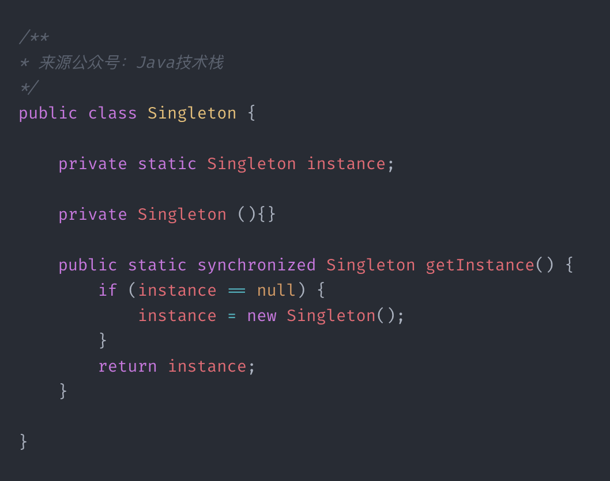
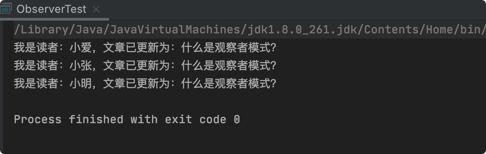
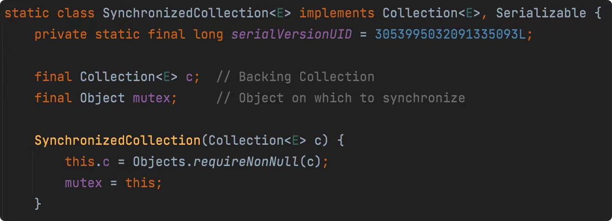
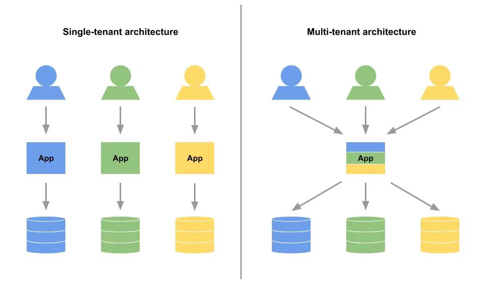

# 分布式 65

### 1、什么是CAP原则？

CAP 原则又称 CAP 定理，在一个分布式系统中包含三个部分，Consistency（**一致性**）、Availability（**可用性**）、Partition tolerance（**分区容错性**）。

##### 一致性（C）：

同一时刻，分布式系统中所有节点的数据都是相同的。

##### 可用性（A）：

在合理时间范围内，系统是否能够正常响应客户端的读写请求。

##### 分区容错性（P）：

当分布式系统集群中的一部分节点或者网络分区故障后，系统是否仍能正常提供服务。

### 2、CAP原则可以同时满足几个？

CAP 原则不能同时满足，最多只能满足两个，这也是分布式理论的基础。

| CAP  | 说明                                                         |
| ---- | ------------------------------------------------------------ |
| CA   | 放弃P（分区容错性），意味着不能进行网络分区，放弃了系统的可扩展性。 |
| CP   | 放弃 A(可用性)，系统如遇到网络故障，那么受到影响的服务需要等待一定的时间，系统在该时段不可用。 |
| AP   | 放弃C（一致性），放弃数据的强一致性，但可以实现数据的最终一致性。 |

实际工作中，一般要保证P（分区容错性），在C（一致性）/A（可用性）中作出选择，涉及到金钱的要保证（C）强一致性。

### 3、CAP原则为什么不能同时满足？

**C**onsistency（**一致性**）

**A**vailability（**可用性**）

**P**artition tolerance（**分区容错性**）

-----

如果要保证CAP三个都满足，即发生网络分区（P）后：

1）要保证合理时间内正常提供服务（A），这时候数据库可能都断开了，没有同步，某些节点的数据可能不是最新的了，显然就不能保证所有节点的数据一致性了（C）；**----AP**

2）要保证数据一致性（C），那就要等网络恢复并完成数据同步后才能正常提供服务，这样就不能保证可用性（A）了，即不能在合理时间内正常提供服务；**------CP**

-----

所以，CAP 不能同时满足，要在 AP/ CP/ CA 之间作出选择。

### 4、什么是BASE原则？

##### BASE原则是指：

- Basically Available (基本可用)
- Soft state (软状态)
- Eventually consistent (最终一致性)

BASE是对CAP中一致性和可用性的一个权衡，即使无法做到强一致性，但每个应用都可以根据自身的业务特点，采用适当的方式来使得系统达到最终一致性。

### 5、什么是RMI？

**RMl**，全称：Remote Method Invocation，即：“**远程方法调用**"，是JDK1.2 中实现的，用于在分布式系统中实现远程调用，它允许Java 应用程序中的一个对象调用另一个 Java 应用程序中的对象的方法，就像调用本地对象的方法一样，RMIl大大增强了Java 开发分布式应用的能力。

> ##### RMI的基本思想是：
>
> 将 Java 对象视为可以在网络上传输的对象，并使用Java 序列化来在客户端和服务器之间传递这些对象。通过 RMI，开发人员可以将应用程序拆分成可复用的组件，这些组件可以在网络上进行调用，从而构建分布式系统。

RMI的核心组件包括：

- **远程接口（RemoteInterface）**：定义了客户端和服务器之间可以调用的方法。
- **远程对象（RemoteObject）**：实现了远程接口，并且能够在远程服务器上调用。
- **远程存根（RemoteStub）**：在客户端代表远程对象的代理，使得客户端可以像调用本地对象一样调用远程对象的方法。
- **RMI注册表（RMI Registry）**：提供了远程对象的注册和查找服务。

RMII 还提供了一些高级特性，如远程异常处理、动态代理、对象传输等，使得它更加适合于构建基于Java 的分布式系统。通过使用 RMI，Java 开发人员可以轻松地构建分布式应用程序，而无需担心底层的网络通信和远程调用细节。

### 6、什么是RPC？

**RPC**，全称：Remote Procedure Call，即：“**远程过程调用**"，它是一种通过网络从远程计算机程序上请求服务，而不需要了解底层网络通信的规范或协议，可以理解为一台计算机程序远程调用另外一台计算机的子程序，而不用关心底层网络通信。

> ##### 一个通俗的描述是：
>
> 客户端在不知道调用细节的情况下，调用存在于远程计算机上的某个对象，就像调用本地应用程序中的对象一样。

### 7、RMI和RPC有什么区别？

RMI（远程方法调用）和 RPC（远程过程调用）是两种用于实现分布式系统中远程调用的技术，它们的使用需要看具体的应用场景和需求。

它们之间的主要区别包括：

##### 编程语言和平台

RMl 基于 Java 编程语言，只能用于 Java 应用程序之间的通信，而 RPC 是一种通用的远程调用机制，可以用于不同的编程语言和平台之间的通信。

##### 通信协议

RMI 使用 JaVa 远程方法协议（JRMP）作为通信协议，而 RPC 使用各种通信协议，如 HTTP、TCP、UDP 等来实现远程调用。

##### 编程模型

RMI采用了面向对象的编程模型，将远程调用看作是一种方法调用，使得远程调用和本地调用非常类似。而RPC采用了过程式编程模型，将远程调用看作是一种过程调用，也类似于本地调用。

##### 实现复杂度

RMI 相对来说比较简单，因为它是基于 Java 编程语言和 JRMP 通信协议实现的，可以轻松地在 Java 平台上使用。而 RPC 的实现则比较复杂，因为它需要解决跨语言、跨平台、网络传输等多种问题。

##### 功能特性

RMI提供了一些高级特性，如远程异常处理和对象传输等，使得它更加适合于构建基于 Java 的分布式系统。而 RPC 的实现则相对简单，它的主要功能是在不同语言和平台之间进行通信。

### 8、什么是SOA？

**SOA：面向服务的架构**，是一种软件设计和开发的方法论，旨在实现应用程序中的模块化、松耦合、可重用和可维护性。在SOA中，应用程序被视为一组相互独立的服务，这些服务可通过网络互相通信并相互协作，从而实现特定的业务功能。

> ##### SOA的核心思想是：
>
> 将应用程序拆分成独立的、自治的服务，并通过标准化的接口，使它们可被其他服务和应用程序调用。

SOA 可以提高应用程序的灵活性、可重用性和可维护性，因为它们可以在不影响整个应用程序的情况下进行单独部署、测试、更新和替换。

SOA也支持跨组织、跨平台和跨技术栈的集成，使不同的应用程序和服务可以共同工作，并促进了企业内部和企业间的合作。

##### ### 9、你怎么理解分布式系统？

##### 分布式系统背景

说分布式系统必须要说集中式系统，集中式系统中整个项目就是一个独立的应用，整个应用也就是整个项目，所有的东西都在一个应用里面。

如下图所示：


如一个网站就是一个应用，最后是多个增加多台服务器或者多个容器来达到负载均衡的避免单点故障的目的，当然，数据库是可以分开部署的。

集中式很明显的优点就是开发测试运维会比较方便，不用为考虑复杂的分布式环境。

集中式很明显的弊端就是不易扩展，每次更新都必须更新所有的应用。而且，一个有问题意味着所有的应用都有问题。当系统越来越大，集中式将是系统最大的瓶颈。

##### 什么是分布式系统？

> 分布式系统是若干独立计算机的集合，这计算机对用户来说就像单个相关系统。

以上定义摘自<<分布式系统原理与范型>>一书。

也就是说分布式系统背后是由一系列的计算机组成的，但用户感知不到背后的逻辑，就像访问单个计算机一样。

说的有点绕，我们可以来简单看下分布式系统图。


### 10、使用分布式系统有什么优缺点？

##### 分布式系统的优点：

1、应用可以按业务类型拆分成多个应用，再按结构分成接口层、服务层；我们也可以按访问入口分，如移动端、PC 端等定义不同的接口应用；

2、数据库可以按业务类型拆分成多个实例，还可以对单表进行分库分表；

3、增加分布式缓存、搜索、文件、消息队列、非关系型数据库等中间件；

很明显，分布式系统可以解决集中式不便扩展的弊端，我们可以很方便的在任何一个环节扩展应用，就算一个应用出现问题也不会影响到别的应用。

随着微服务 Spring Cloud & Docker 的大热，及国内开源分布式 Dubbo 框架的重生，分布式技术发展非常迅速。

##### 分布式系统的缺点：

分布式系统虽好，也带来了系统的复杂性，如：分布式事务、分布式锁、分布式 session、数据一致性等都是现在分布式系统中需要解决的难题。

虽然已经有很多成熟的方案，但都不完美。

分布式系统也增加了开发测试运维成本，工作量增加，分布式系统管理不好反而会变成一种负担。

### 11、分布式系统下会遇到哪些问题？

分布式系统会遇到的问题：

- 网络延迟和不可靠性
- 节点故障
- 多系统维护问题
- 一致性问题
- 性能问题
- 安全问题
- 通信问题
- 分布式应用问题（比如：分布式锁、分布式唯一ID、分布式事务、分布式 Session 共享、分布式任务调度、分布式日志收集，等等。。）
- ...

### 12、什么是分布式定时任务？

分布式定时任务就是把单机定时任务分散到分布式的、多台机器中执行，同一个任务、不同的机器可以分别执行不同的数据，大大提升任务效率。

### 13、为什么需要分布式定时任务？

##### 分布式定时任务的优势：

1、多机部署，按一定的规则进行分片，提高任务效率；

2、出现故障可以自动转移到正常的机器执行，防止单点故障，提高系统可用性；

3、伸缩性好，可以灵活调整任务的机器数，并发能力强；

4、分布式定时任务框架都带有可视化页面，可以手动操作控制任务，查看历史任务等；

### 14、分布式定时任务有哪些解决方案？

##### 主流的分布式定时任务框架有：

1、**quartz** (主流开源调度框架，支持分布式)

2、**elastic-job**（当当网开源，目前已进入Apache 开源项目)

3、**xxl-job**（许雪里个人开源的项目)

----

单机 quartz 用的多，分布式的后两个用的比较多。

### 15、什么是Session共享？

Session 是服务器用来保存用户操作的一系列会话信息，由 Web 容器进行管理，在单机系统中，Session 是保存在单机的，不存在共享。

在分布式系统中，系统是部署在不同的机器上的，即多个 Tomcat，**Session 共享就是Session 复制（Tomcat自带Session复制机制），在多个Tomcat中共享同一个会话。**

### 16、为什么需要Session共享？

分布式系统中，如果不进行 Session 共享，可能会出现请求落到不同的机器而出现要重复登录、会话失效的情况，

##### 比如，系统部署在A/B/C三台机器上：

1）用户首次登录访问的是 B 机器上的系统；

2）用户点击某个页面，如果使用的是随机负载均衡，请求可能到了 A 机器，A机器没有Session，所以需要重新登录.....

### 17、Session共享有哪些实现方案？

一般来说解决Session共享有以下几种方案。

##### 1、session复制

session复制是早期的企业级的使用比较多的一种服务器集群session管理机制。应用服务器开启web容器的session复制功能，在集群中的几台服务器之间同步session对象，使得每台服务器上都保存所有的session信息，这样任何一台宕机都不会导致session的数据丢失，服务器使用session时，直接从本地获取。

这种方式在应用集群达到数干台的时候，就会出现瓶颈，每台都需要备份session，出现内存不够用的情况。

> 此外，如果单台 Tomcat 会话数量过多，也可能会影响 Tomcat 的垃圾回收机制，导致垃圾回收时间变长,从而导致应用程序响应变慢。

##### 2、session绑定

利用hash算法，比如nginx的ip_hash,使得同一个lp的请求分发到同一台服务器上。

这种方式不符合对系统的高可用要求，因为一旦某台服务器宕机，那么该机器上的session也就不复存在了，用户请求切换到其他机器后么有session，无法完成业务处理。

##### 3、利用cookie记录session

session记录在客户端，每次请求服务器的时候，将session放在请求中发送给服务器，服务器处理完请求后再将修改后的session响应给客户端。这里的客户端就是cookie。

利用cookie记录session的也有缺点，比如受cookie大小的限制，能记录的信息有限；每次请求响应都需要传递cookie，影响性能，如果用户关闭cookie，访问就不正常。但是由于cookie，影响性能，如果用户关闭cookie，访问就不正常。但是由于cookie的简单易用，可用性高，支持应用服务器的线性伸缩，而大部分要记录的session信息比较小，因此事实上，许多网站或多或少的在使用cookie记录session。

##### 4、session服务器

session服务器可以解决上面的所有的问题，利用独立部署的session服务器（集群）统一管理session，服务器每次读写session时，都访问session服务器。

这种解决方案事实上是应用服务器的状态分离，分为无状态的应用服务器和有状态的session服务器，然后针对这两种服务器的不同特性分别设计架构。

对于有状态的session服务器，一种比较简单的方法是利用分布式缓存（memcached),数据库等。在这些产品的基础上进行包装，使其符合session的存储和访问要求。

如果业务场景对session管理有比较高的要求，比如利用session服务基层单点登录（sso),用户服务器等功能，需要开发专门的session服务管理平台。

### 18、为什么需要分布式唯一ID？

##### 主要有以下几个原因：

1、分库分表后，每个表都按一定的规则进行ID 自增就可能会重复；

2、不便于数据迁移，比如在 A 表的一条记录 ID 是 10，迁移到B 表，B表已经有了 10，这时候就会出现冲突；

### 19、分布式唯一ID应该具备哪些条件？

##### 一个分布式ID有下面几个要素：

1）**唯一性**：确保生成的ID 是全网唯一的；

2）**有序递增性**：确保生成的ID 是对于某个用户或者业务是按一定的数字有序递增的；

3）**高可用性**：确保任何时候都能正确的生成ID；

4）**带时间**：ID 里面包含时间，一眼扫过去就知道哪天的交易；

### 20、分布式唯一ID有哪些实现方案？

##### 系统时间毫秒数

我们可以使用当前系统时间精确到毫秒数+业务属性+用户属性+随机数+..等参数组合形式来确保ID的唯一性，缺点是ID的有序性难以保证，要保证有序性就要依赖数据库或者其他中间存储媒介。

##### UUID

Java自带的生成UUID的方式就能生成一串唯一随机32位长度数据，而且够我们用N亿年，保证唯一性肯定是不用说的了，但缺点是它不包含时间、业务数据可读性太差了，而且也不能D的有序递增。

这是一种简单的生成方式，简单，高效，但在一般业务系统中我还没见过有这种生成方式。

##### 数据库自增ID

我们都知道为数据库主键设置自增序号，以一定的趋势自增，以保证主键ID的唯一性。

这个方案很简单，但最主要的问题在于依赖数据库本身，这就无形增加了对数据库的访问压力和依赖，一旦对单库进行分库分表或者数据迁移就尴尬了。

所以，这也不是合适的ID生成方法。

##### 批量生成ID

一次按需批量生成多个ID，每次生成都需要访问数据库，将数据库修改为最大的ID值，并在内存中记录当前值及最大值。这样就避免了每次生成D都要访问数据库并带来压力。

这种方案服务就是单点了，如果服务重启势必会造成D丢失不连续的情况，而且这种方式也不利于水平扩展。

##### 中间件

Redis的所有命令操作都是单线程的，本身提供像incr这样的自增命令，所以能保证生成的ID肯定是唯一有序的。这种方式不依赖关系数据库，而且速度快。但系统要引I入Redis这一中间件，增加维护成本，而且编码和配置工作量比较大。即使已经有了Redis组件，但生成ID的高频率访问对单线程的Redis性能势必也会造成影响。

还可以利用像Zookeeper中的znode数据版本来生成序列号，及MongoDB的Objectld等，这种利用中间件的做法不是很推荐。

##### snowflake算法

##### 

如上图的所示，Twitter的snowflake算法下面几部分组成：

- 41位的时间序列，精确到毫秒，可以使用69年
- 10位的机器标识，最多支持部署1024个节点
- 12位的序列号，支持每个节点每毫秒产生4096个ID序号，最高位是符号位始终为0。

这种方案性能好，在单机上是递增的，但是由于涉及到分布式环境，每台机器上的时钟不可能完全同步，也许有时候也会出现不是全局递增的情况。

而且这个项目在2010就停止维护了，但这个设计思路还是应用于其他各个ID生成器及变种。

##### UidGenerator

UidGenerator是百度开源的分布式lD生成器，基于于snowflake算法的实现，看起来感觉还行。不过，国内开源的项目维护性真是担忧。

大家可以参考具体使用：

> https://github.com/baidu/uid-generator/blob/master/README.zh_cn.md

##### Leaf

Leaf是美团开源的分布式ID生成器，能保证全局唯一性、趋势递增、单调递增、信息安全，里面也提到了几种分布式方案的对比，但也需要依赖关系数据库、Zookeeper等中间件。

具体可以参考官网说明：

> https://tech.meituan.com/MT_Leaf.html

好了，就这么多了，不同的方案应用的场景和系统也是不同的。

### 21、为什么需要分布式锁？

##### 我们都知道，Java提供的synchronized/lock锁只能作用在单个JVM中的单个应用中。

##### 来看这两个场景：

- 单个应用进行集群部署，负载均衡就可能把请求分配到不同的机器上；
- 多个不同的分布式应用，多个应用需要同时锁定同一个资源；

基于以上的情况，单机锁就会失效，就需要一种全局应用锁代替单机锁，即：**分布式锁**。

#### ### 22、分布式锁应该具备哪些条件？

##### 分布式锁具备的条件（特点）：

1）在分布式系统中，一个方法（代码）在同一时间只能被一个线程执行；

2）获取锁与释放锁要具备高可用、高性能；

3）具备可重入特性，同一个线程可以反复获取锁；

4）具备锁失效机制，防止死锁、锁失效问题；

5）具备非阻塞锁特性，获取锁失败立即返回；

### 23、分布式锁都有哪些主流实现方案？

##### 分布式锁的几种主流实现方案：

1、关系数据库

2、Redis

3、Zookeeper

### 24、分布式锁选用哪种方案最合适？

##### 可以从以下3方面进行考虑：

**性能**：Redis >Zookeeper >数据库

**可靠性**：Zookeeper>Redis >数据库

**复杂性**：Zookeeper>Redis >数据库

-----

所以：

1）简单的非高并发应用场景，也没有用到 Redis/ Zookeeper 等中间件，可以考虑用数据库锁；

2）高并发场景下，考虑使用 Redis/ Zookeeper 等中间件去实现；

-----

没有100%完美的解决方案，只有根据不同的应用场景选择最适合的方案才是王道。

### 25、关系数据库如何实现分布式锁？

关系数据库也能实现分布式锁，这个会影响数据库性能，高并发、数据库压力较大的场景不推荐使用。

##### 参考方案1：

> 新增一张分布式锁数据库表，谁能成功插入数据（唯一锁ID），就代表谁能获取锁，删除数据即代表释放锁。

这是一种利用关系数据库的唯一索引特性实现分布式锁，不可能出现重复数据。

##### 参考方案2：

> 在对应数据库表中新增一个版本号字段，每次修改数据时和之前的版本号作对比，谁能修改成功（同时版本号+1），就代表谁能获取锁，修改失败的不断重试。

这是一种乐观锁，不断重试会影响数据库性能。

##### 参考方案3：

> 使用 select ... from ... where ... for update

这是一种悲观锁，会锁住对应的索引行。

### 26、分布式锁Redis&Zookeeper怎么选？

纠结怎么选？看下表：

| 选项           | Redis | ZK   |
| -------------- | ----- | ---- |
| 性能要求较高   | x     |      |
| 可靠性要求较高 |       | x    |
| 需要读写锁     |       | x    |
| 需要公平锁     |       | x    |
| 需要非公平锁   | x     |      |

如果允许偶然的锁失效情况，不影响系统正常使用，建议采用Redis 锁，性能最好；

如果要求高可靠性，建议采用 Zookeeper 锁，它不依靠超时时间释放锁，可靠性比 Redis 要高；

### 27、Redis如何实现分布式锁？

##### Redis可以使用set命令：

> set (key, 1, 30, NX)

##### 应用的原理就是：

当key不存在时才进行保存，谁能成功保存数据，就代表谁能获取锁，获取失败则隔一段时间重试（单位：毫秒），删除 key代表释放锁。

### 28、Redis分布式锁有哪些问题？如何解决？

##### 1、死锁

setnx 不支持超时设置，如果 setnx 和 expire 命令组合使用设置超时，因为两个命令不是原子性操作，所以可能会出现死锁问题。

##### 解决方案：

Redis 2.6.12 开始可以使用 **set** 代替解决这个问题了。

##### 2、锁提前释放

比如，线路A 获取到了锁，并默认持有锁 30 秒，如果A执行了 35秒，锁在 30秒的时候释放了，线程B又获取到了锁，这时候锁就出现问题了。

##### 解决方案：

1）获取锁之后开辟一个守护线程，在守护线程中每隔一段时间延长过期时间；

2）使用 Redisson 框架提供的看门狗特性，可以在锁失效前不断延长过期时间；

##### 3、主节点挂了

通过 Redis 加锁都是在某一个 Redis 集群节点上进行的，如果线程 A 在 Master 节点获取到锁后，在 Master节点未完成数据同步的情况下发生了故障转移，此时其他线程依然可以获取到锁，这时候锁就出现问题了。

##### 解决方案：

可以通过 Redisson 框架提供的 RedLock 算法实现分布式锁来解决。

### 29、Zookeeper如何实现分布式锁？

利用 Zookeeper 的临时有序节点来实现分布式锁。

##### ZooKeeper实现分布式锁的步骤如下：

1）客户端连接 ZooKeeper

2）客户端在/lock 下创建一个临时有序子节点，如：/lock/lock-10000000001，以此类推

3）客户端获取/lock 下的子节点列表

4）判断自己创建的子节点是否为当前子节点列表中序号最小的子节点，如果是，则表示成功获得锁，否则监听自己前一位的子节点的删除消息，获得子节点变更通知后重复此步骤直至获得锁

5）执行业务流程代码6）完成业务流程后，删除对应的子节点表示释放锁

### 30、ZK分布式锁有哪些问题？如何解决？

##### 1、锁提前释放

如果获取到分布式锁的客户端发生了 GC 停顿，就可能导致 Zookeeper 检测不到客户端的心跳，Zookeeper就认为客户端已经过期，并自动删除该临时节点所在的锁，如果另外一个客户端此时来获取锁，分布式锁就出现问题了。。

##### 解决方案：

可以通过JVM 调优尽量避免 GC 停顿问题，但不能完全避免。

### 31、什么是分布式事务？

分布式事务是指涉及多个独立系统或服务的事务处理，在分布式系统中，不同的服务或应用程序可能被部署在不同的服务器上，这些服务需要协同工作来完成一个事务。**事务的每个操作步骤都位于不同的节点上，需要保证事务的AICD特性**。

在传统的单机环境下，事务处理通常由单一的事务管理器（Transaction Manager）来管理，保证事务的原子性、一致性、隔离性和持久性（ACID），但在分布式系统中，由于存在网络延迟、节点故障等问题，事务处理变得更加困难。

### 32、分布式事务的解决方案有哪些？

##### 一般有以下几种解决方案：

1、两阶段提交 (2PC)

2、三阶段提交(3PC)

3、补偿事务(TCC)

4、本地消息表 (最终一致性)

5、MQ 消息事务 (最终一致性)

6、最大努力通知 (最终一致性)

##### 7、Seata(支持4种事务模式)

### 33、哪些场景会产生分布式事务？

##### 1、跨数据库实例

比如有以下两个场景：

1）单体系统下，同一个系统使用了多个数据源连接不同的数据库；

2）分布式、微服务系统，各系统服务使用不同的数据库；

##### 2、跨JVM进程

比如有以下场景：

1）分布式、微服务系统，各系统服务使用不同的数据库（或者同一个数据库），都会产生分布式事务；

### 34、单体系统会产生分布式事务问题吗？

##### 答案：会。

如果一个单体系统使用了多个数据源连接不同的数据库，也会产生分布式事务问题。

### 35、如何解决单体系统中的分布式事务问题？

推荐使用开源的分布式事务解决方案：**Atomikos**。

在 Spring Boot 中可以使用 spring-boot-starter-jta-atomikos 进行集成：


### 36、只有一个库，会产生分布式事务问题吗？

##### 答案：会。

分布式、微服务系统，各系统服务使用不同的数据库，**或者是同一个数据库**，都会产生分布式事务，因为它们使用的是不同的数据库连接和事务管理器。

### 37、怎么理解本地消息表分布式事务？

本地消息表实现分布式事务，据说是eBay的解决方案，核心思想是新增一张消息表记录信息的发送状态，将分布式事务变成一种本地事务进行处理。

> 需要额外一张消息表，会影响高并发场景下的性能。

##### 举个下单改库存的例子：

1）用户下单后，订单系统新增一笔订单记录，同时在消息表添加一样消息，这两步在同一个事务中完成；

2）订单系统使用定时任务查询消息表中未处理的消息记录，然后发送到MQ，发送失败就一直重试发送；

3）库存系统收到MQ 消息后，修改对应的产品库存，为了避免重复消息发送，需要保证幂等性操作；

4）如果库存系统修改成功，调用订单系统接口，修改消息表中的记录状态为已完成，或者删除该记录；

5）如果库存系统修改失败，回到第 2 步，等待再次发送消息重试修改；

### 38、怎么理解MQ消息分布式事务？

MQ消息事务的原理是将**两个事务通过消息中间件进行异步解耦**，需要依赖消息中间件的消息事务功能，比如支付消息事务的 RocketMQ。

> 这种方案不会用到本地消息表中的数据库表，适合高并发场景。

##### 举个下单改库存的例子：

1）用户下单后，订单系统新增一笔订单记录，同时发送一条 Prepare 消息到 MQ，这两步在同一个事务中完成；

2）如果订单系统事务执行成功，消息中间件将这条 Prepare 消息下发至库存系统；

3）如果订单系统事务执行失败，消息中间件将这条 Prepare 消息删除；

4）库存系统收到MQ 消息后，修改对应的产品库存，如果修改失败，则不断重试；

具体可以参考 RocketMQ 实现分布式事务的案例。

### 39、怎么理解最大努力通知分布式事务？

最大努力通知的方案实现比较简单，**适用于最终一致性要求较低的业务**，比如：支付结果通知、受理结果通知等，一般用在内部平台和外部平台的处理。

##### 举个支付的例子：

1）某电商平台对接了某第三方支付平台，用户在电商平台下单后跳到支付平台进行支付；

2）支付平台支付成功/失败后，都需要将最终结果通知给电商平台，尽最大努力通知，比如：按一定的频率最多通知 5 次；

3）不管通知成功与否，达到最大N次通知之后都不再通知，电商平台可以主动调用支付平台提供的接口查询支付结果；

### 40、分布式事务模式都有哪些？怎么选？

##### 常用的分布式事务模式及对比：

| 分布式事务模式 | 介绍                                                         |
| -------------- | ------------------------------------------------------------ |
| AT 模式        | 无侵入的解决方案，适用于不想对业务改造的场景                 |
| TCC 模式       | 高性能的解决方案，适用于核心系统等对性能有很高要求的场景     |
| Saga 模式      | 长事务的解决方案，适用于业务流程长且需要保证事务最终一致性的业务系统 |
| XA 模式        | 强一致性的解决方案，**性能低**，很少使用                     |

### 41、什么是XA分布式事务？

XA（eXtended Architecture）是由 X/Open 组织提出的分布式事务处理的规范、或称为协议，各大关系数据库厂家都提供了对XA 的支持。

XA协议采用**两阶段提交方式**来管理分布式事务，主要包含以下四部分：

- AP (应用程序)
- TM(事务管理器)
- RM(资源管理器，指数据库)
- CRM（通信资源管理器）

XA 提供了 TM 与 RM 之间通信的标准接口。

### 42、XA和TCC分布式事务的区别？

XA 的两、三阶段提交（2PC、3PC）都是基于资源层面的，而 TCC 是基于应用层面、2PC的一个变种。

### 43、什么是二阶段提交（2PC）分布式事务？

##### XA定义了分布式事务规范，2PC、3PC就是其具体的实现。

2PC 就是指分布式事务将事务分为两步进行提交，包含以下组件：

- 协调者：事务管理器（TM)

- 参与者：资源管理器（RM)

-----

##### 第一阶段（投票阶段）：

协调者向参与者发送 prepare 信息，询问参与者是否可以提交事务；

参与者收到 prepare 信息后，进行本地事务的预处理，但还没有提交，最后返回处理结果；

##### 第二阶段（执行阶段）：

如果协调者收到了任意一个参与者的失败消息，则向每个参与者发送 rollback 消息进行事务回滚，否则，则向每个参与者发送提交 commit 消息进行事务提交；


### 44、二阶段提交（2PC）分布式事务的端？

##### 1、同步阻塞

事务执行过程中的所有参与者都是阻塞的，第三方参与者访问参与者占有的资源时会被阻塞，严重影响性能；

##### 2、单点故障

协调者一旦发生故障，参与者会被阻塞，尤其在执行阶段，所有参与者都处于锁定资源状态中，无法完成事务操作；

##### 3、数据不一致

提交阶段协调者向参与者发送commit 信息，如果发生网络故障，可能会导致部分参与者不能收到commit 信息无法提交事务而出现数据不一致现象；

### 45、什么是三阶段提交（3PC）分布式事务？

3PC 是对 2PC 的改进，在协调者和参与者中都引I入超时机制，并且把 2PC 中的的第一个阶段拆再分成了两步：询问，然后再锁资源，最后真正提交。

-----

##### 1、canCommit(新增)

协调者询问参与者，是否具备执行事务的条件，参与者进行自身事务必要条件的检查；

##### 2、 preCommit

协调者通知参与者进行事务的预提交，并返回处理结果；

##### 3、doCommit

协调者根据参与者的处理结果，通知所有参与者是否进行事务提交或者回滚；


### 46、三阶段提交分布式事务有什么弊端？

##### 1、实现相比2PC较复杂

##### 2、需要更多的通讯次数

##### 3、依然存在数据不一致性问题

如协调者向所有参与者都发送了回滚命令，因为网络问题，有了超时机制，部分参与者没有收到从而进行了事务提交操作。

### 47、三阶段和二阶段提交分布式事务的区别？

1、3PC分为**CanCommit（新增）**、**PreCommit**、**DoCommit**三个阶段完成事务提交；

2、3PC同时在协调者和参与者中引I入了**超时机制**，如果超时，参与者就会默认提交，减少 2PC 的**同步阻塞**时间，但不能完全避免，也避免 2PC 中的**单点故障**问题；

### 48、什么是JTA分布式事务？

JTA 全称：**Java Transaction APl**，即：Java 事务APl。


JTA 定义了事务管理器和分布式事务系统中涉及的各个组件(资源管理器、应用程序服务器、事务应用程序)之间的标准 Java 接口。

JTA 是基于XA 实现的，也就是说资源管理器（RM）需要支持XA。

### 49、JTA分布式事务一般怎么实现？

##### JTA只提供了接口，具体的实现有以下两种：

- 依赖于 J2EE 容器提供的 JTA 实现；
- 独立于 J2EE 容器的JTA 实现，比如：Atomikos；

### 50、什么是TCC分布式事务？

TCC 是指：**Try、Confirm、Cancel**。

##### Try（资源预留）：

对业务进行数据检查和资源预留；

##### Confirm（提交）：

执行业务的提交操作；

##### Cancel（回滚）：

对业务的执行操作进行回滚；

TCC 的核心思想就是校验、资源锁定、补偿，根据（Try）操作的结果来确认是进行确认（Confirm）还是取消(cancel）操作。

### 51、TCC分布式事务的应用场景？

TCC比较适合的场景：

TCC比较适合一些特别核心的业务场景，比如常见的：**支付、交易、转账**之类的资金相关操作场景，因为这些操作需要严格保证分布式事务强一致性，**要么全部成功，要么全部失败自动回滚，严格保证资金的正确性**。

比如：A向 B 银行转账，A扣钱，B 加钱，这两步肯定是要同时、尽快完成的。

### 52、TCC分布式事务有什么弊端？

1、每个分布式事务的服务都必须实现 try、confirm、cancel 方法；

2、代码侵入性比较强，开发成本和维护成本都比较高；

2、为了满足事务的一致性的要求，try、confirm、cancel 方法必须实现等幂性操作；

### 53、常用的TCC分布式事务框架有哪些？

##### 常用的TCC分布式事务框架有：

- tcc-transaction
- ByteTCC
- spring-cloud-rest-tcc
- Himly
- ....

### 54、什么是Saga分布式事务？

Saga是一种分布式事务模式，它通过将**一个大事务分解为多个小事务来实现分布式事务的执行**。在Saga 模式中，每个小事务都可以独立执行，并且可以通过某种协调机制来保证整个事务的一致性。

Saga 模式中的每个小事务都被组织成一个有向无环图（DAG）结构，其中每个节点表示一个局部事务，每条边表示局部事务之间的依赖关系。当某个局部事务执行成功时，它会向 Saga 事务引擎发送通知，以便 Saga事务引擎可以继续执行下一个局部事务。当局部事务执行失败时，它会向 Saga 事务引擎发送通知，并执行回滚操作。

Saga 模式的好处在于，它可以将大事务分解为多个小事务，从而降低了分布式事务的复杂性。此外，Saga 模式还支持异步执行，可以提高分布式事务的性能和可伸缩性。

### 55、Saga分布式事务有哪些实现方式？

##### 最流行的两种SAGE事务实现方式是：

##### 1）事件编排

参与者通过交换事件沟通，进行分配决策和排序；

##### 2）命令协调

中央协调器负责集中处理事件的决策和业务逻辑顺序；

### 56、Saga和TCC分布式事务的区别？

Saga 和 TCC 有些类似，都是补偿型事务，与TCC 不同的是，**Saga 不需要 Try，而是直接进行 confirm,cancel操作。**

### 57、GTS是一种什么技术解决方案？

全局事务服务**（Global Transaction Service，简称 GTS）**是阿里云上的一款高性能、高可靠、接入简单的分布式事务中间件，用于解决分布式事务问题。

2019 年在 GTS 的基础上，阿里又开源了 Seata，GTS 和 Seata 定义的分布式事务框架是完全一致的，现在GTS 已经实现与 Seata 的协议兼容，支持使用 Seata 的应用无缝迁移到云上。


### 58、Seata是一种什么技术解决方案？

Seata 是一款开源的**分布式事务解决方案**，由阿里 2019 年开源，致力于在微服务架构下提供高性能和简单易用的分布式事务服务。


### 59、Seata都支持什么RPC框架？

##### Seata目前已支持以下几种主流RPC框架：

- Dubbo
- Spring Cloud
- Sofa-RPC
- Motan
- gRPC

其他框架持续集成中，具体可以查看官网。

### 60、Seata都支持哪几种分布式事务模式？

##### Seata提供了以下4种事务模式：

- AT
- TCC
- Saga
- XA

Seata 致力于打造一站式的分布式解决方案。

### 61、说说Seata中的AT事务模式？

AT 是一种 Seata 事务模式，它是一种基于**数据库**的事务模式，它利用数据库的 **ACID** 属性来保证事务的一致性。

##### 前提

-----

1）基于支持本地 ACID 事务的关系型数据库。

2）Java 应用，通过 JDBC 访问数据库。

##### 整体机制

----

它是两阶段提交协议的演变：

##### 1）一阶段

业务数据和回滚日志记录在同一个本地事务中提交，释放本地锁和连接资源。

##### 2）二阶段：

- 提交异步化，非常快速地完成。
- 回滚通过一阶段的回滚日志进行反向补偿。

> 详细可以参考官方文档：
>
> https://seata.io/zh-cn/docs/dev/mode/at-mode.html

### 62、说说Seata中的TCC事务模式？

一个分布式的全局事务，整体是**两阶段提交**的模型，而全局事务是由若干分支事务组成的，分支事务要满足**两阶段提交**的模型要求，即需要每个分支事务都具备自己的：

- 一阶段 prepare 行为
- 二阶段 commit 或 rollback 行为


Seata 根据两阶段行为模式的不同，将分支事务划分为：

- AT 模式 - Automatic (Branch) Transaction Mode
- TCC 模式 - TCC (Branch) Transaction Mode

AT模式是基于**支持本地ACID事务**和**关系型数据库**：

- 一阶段 prepare 行为：在本地事务中，一并提交业务数据更新和相应回滚日志记录。
- 二阶段 commit 行为：马上成功结束，**自动**异步批量清理回滚日志。
- 二阶段 rollback 行为：通过回滚日志，**自动** 生成补偿操作，完成数据回滚。

TCC模式则**不依赖于底层数据资源的事务支持**：

- 一阶段 prepare 行为：调用**自定义**的 prepare 逻辑。
- 二阶段 commit 行为：调用**自定义**的commit 逻辑。
- 二阶段 rollback 行为：调用**自定义**的 rollback 逻辑。

所谓 TCC 模式，是指支持把 **自定义** 的分支事务纳入到全局事务的管理中。

### 63、说说Seata中的Saga事务模式？

Saga 模式是 Seata 提供的长事务解决方案，在 Saga 模式中，业务流程中每个参与者都提交本地事务，当出现某一个参与者失败时，则补偿前面已经成功的参与者，一阶段正向服务和二阶段补偿服务都由业务开发实现。


##### 适用场景：

- 业务流程长、业务流程多
- 参与者包含其它公司或遗留系统服务，无法提供TCC模式要求的三个接口

##### 优势：

- 一阶段提交本地事务，无锁，高性能
- 事件驱动架构，参与者可异步执行，高吞吐
- 补偿服务易于实现

##### 缺点：

- 不保证隔离性

> ##### 详细可以参考官方文档：
>
> https://seata.io/zh-cn/docs/user/saga.html

### 64、说说Seata中的XA事务模式？

XA 事务模式是在 Seata 定义的分布式事务框架内，利用事务资源（数据库、消息服务等）对XA 协议的支持，以XA 协议的机制来管理分支事务的一种事务模式。

##### 前提

-----

1）支持 XA 事务的数据库。

2）Java 应用，通过 JDBC 访问数据库。

##### 整体机制

-----


##### 1）执行阶段：

- 可回滚：业务 SQL 操作放在 XA 分支中进行，由资源对 XA 协议的支持来保证可回滚。
- 持久化：XA 分支完成后，执行×A prepare，同样，由资源对XA 协议的支持来保证 持久化（即，之后任何意外都不会造成无法回滚的情况)

##### 2）完成阶段：

- 分支提交：执行XA 分支的 commit
- 分支回滚：执行XA 分支的rollback

> ##### 详细可以参考官方文档：
>
> https://seata.io/zh-cn/docs/dev/mode/xa-mode.html

### 65、Seata目前可以用于生产环境吗？

**Seata0.4.2+**版本就可以用于生产环境了。

# 设计模式 66

### 1、什么是设计模式？

设计模式（Design pattern）是大神们经过相当长的一段时间沉淀出来的一套代码编写和设计的最佳实践总结。

设计模式就像工人们盖房子一样，如果有一套成熟的建造模式，工人们只要按那个模式盖就好了，能保证整体质量和可靠性。如果每个工人都按自己的思路盖，那盖出来的房子必定是七扭八歪的。开发人员开发软件亦是如此!

### 2、为什么要使用设计模式？

设计模式是软件工程开发的基石，它可以帮助我们最大化的复用代码，减少代码冗余，使代码变得更有层次感，更容易被开发人员理解，也保证了代码的质量和可靠性。

### 3、总共有多少种设计模式？

1995年，GoF（Gang ofFour，四人组/四人帮）合作出版了**《设计模式：可复用面向对象软件的基础》**书，书中共收录了 23种设计模式，所以公认的权威的设计模式有 23 种。


### 4、设计模式有哪些分类？

##### 设计模式一般分为三大类：

| 分类       | 设计模式                                                     |
| ---------- | ------------------------------------------------------------ |
| 创建型模式 | 工厂模式 （Factory Pattern)、抽象工厂模式（Abstract Factory Pattern)、单例模式(Singleton Pattern)、建造者模式 (Builder Pattern)、原型模式（Prototype Pattern) |
| 结构型模式 | 代理模式 (Proxy Pattern)、适配器模式（Adapter Pattern)、桥接模式 (Bridge Pattern)、组合模式（Composite Pattern）、装饰器模式(Decorator Pattern)、外观模式 (Facade Pattern)、享元模式 （Flyweight Pattern) |
| 行为型模式 | 责任链模式 (Chain of Responsibility Pattern)、命令模式（Command Pattern)、解释器模式（Interpreter Pattern）、选代器模式（Iterator Pattern)、中介者模式 (Mediator Pattern)、备忘录模式 (Memento Pattern)、观察者模式（Observer Pattern)、状态模式 (State Pattern)、策略模式(Strategy Pattern)、模板模式 (Template Pattern)、访问者模式 (Visitor Pattern) |

### 5、你都用过哪些设计模式？

##### 最常用的几种要说上来：

1）工厂模式

2）单例模式

3）策略模式

4）代理模式

5）适配器模式

6）模板模式

7）观察者模式

8）装饰器模式

9）责任链模式

最好结合自己的业务运用这些设计模式，面试不慌。

### 6、JDK中都用了哪些设计模式？

很多，比如以几下种：

1）Runtime、Calendar 等一些工具类中使用了单例模式

2）工厂模式，存在各种*Factory 工厂类中*

3）IO 库中使用了装饰器模式*

4）IO 库中使用了适配器模式*

5）JDK提供了动态代理模式实现方式*

6）JDK 提供了观察者模式实现方式*

7）模板模式，存在各种 Abstract*抽象类中

8）原型模式：Object#clone()

9）策略模式：如线程池中的各种拒绝策略

面试也不可能说全，举例说明就好。

### 7、Spring框架用到了哪些设计模式？

##### 1、工厂模式

Spring 中的 BeanFactory 和 FactoryBean 就是工厂模式的实现。

##### 2、单例模式

Spring 容器中的 bean 默认就是单例模式的，保证一个类在 Spring 容器中仅有一个实例。

##### 3、观察者模式

Spring 中的事件监听机制就是观察者模式的实现。

##### 4、代理模式

Spring 中的 AOP 就是代理模式的实现，包括 JDK 和 CGLIB 动态代理。

##### 5、策略模式

Spring 在实例化对象的时候就用到了策略模式，策略接口：InstantiationStrategy。

##### 6、模板模式

Spring 中 JdbcTemplate、HibernateTemplate 等就用到模板模式，共用了一个模板。

##### 7、装饰器模式

Spring 中的 TransactionAwareCacheDecorator 类就是装饰器模式中的抽象装饰角色，主要用来处理事务缓存。

##### 8、适配器模式

Spring MVC 中的 DispatcherServlet 就使用了适配器模式，HandlerAdapter 为适配器接口，每一种Controller 都有一种对应的适配器实现类。

### 8、什么是高内聚、低耦合？

##### 高内聚：

通俗点说就是，相关度比较高的部分尽可能的放在一起，尽量集中，不要分散。

比如：用户模块，可以把用户信息、用户收藏、用户足迹等相关的信息放到一个模块。

##### 低耦合：

通俗点说就是，不同模块之间的内容尽可能的少去依赖对方，减少相互依赖。

比如：用户下完订单后，需要向用户发邮件，不能由订单系统自主发送，而是要由邮件系统去发送，订单系统（或者其他业务系统）只需要发一个消息指令给邮件系统即可，这就是利用消息队列来进行解耦。

### 9、设计模式的六大原则是？


### 10、你怎么理解单一职责原则？

##### 单一职责原则（SRP），The SingleResponsibilityPrinciple

> ##### 定义
>
> 一个类的修改只能有一个被修改的原因。

通俗地讲，就是一个类只能负责一个职责，修改一个类不能影响到别的功能，也就是说只有一个导致该类被修改的原因。我们写代码的都知道尽量要做到低耦合、高内聚的特性，单一职责原则正是保证了类与类之间的低耦合性。一个类如果承担过多的职责，就会有很多原因来导致这个类的被修改，就有很大可能性影响到别的功能。

单一职责原则看起来是一个非常简单的原则，但真正实践起来也并非易事，因为职责的联合在实际当中是经常遇到的事，也不能随便地去拆分类去适配单一职责模式，所以如何从这些联合的职责中合理地把职责分隔出来更合适的遵守单一职责原则要好好考虑。

##### 看看下面这这个接口是否符合单一职责原则呢？


这是一个用户接口，提供四个方法：保存用户、获取用户、更新用户余额、获取用户余额，很显然用户个人信息与用户的账户余额是两回事，这样设计在一起耦合非常高，不利于扩展，也不符合单一职责原则。我们可以把它折分成两个，一个为用户信息接口，一个账户接口，如下

##### Userlnterface：


##### Accountlnterface：


这样分开来，是不是就符合了单一职责原则，类的复杂性和耦合性也降低了，即使用户接口或账户接口加减接口也不影响别的接口实现类。

##### 所以，单一职责原则可以总结为以下优势：

1、低耦合性，影响范围小。

2、类复杂度降低，职责分明，提高了可读性。

3、职责单一，利于维护。

### 11、你怎么理解开闭原则？

##### 开放封闭原则（OcP），TheOpenClosedPrinciple

> ##### 定义
>
> 一个软件的实体，包括类、方法、模块、应该对扩展开放，对修改关闭。

也就是说一个软件的实体应该通过扩展的方式来修改变化，而不是修改已有实体源代码。

开放封闭原则也是最基本需要遵守的原则，我们应该尽量保证系统的稳定性，我们在实现另外一个功能的时候不能修改之前已有的代码以免造成之前的功能出现BUG，带来不必要的麻烦，所以开放封闭原则正是引导我们去设计一个稳定、方便扩展的系统。

##### 在实际应用中我们一般会有以下几种做法保证开放封闭原则：

1、抽象出一个接口或者抽象类，定义公共的方法，达到扩展的目的；

2、参数类型和引用类型使用接口或者抽象类，不能依赖实现类；

3、接口和抽象类不能修改，可以使用继承接口或者抽象父类的形式达到扩展的目的；

这些应用看起来也并不复杂，无非是合理地定义接口和抽象类，不同的业务功能采用不同的实现类达到扩展，像设计模式中的策略模式、模板方式模式等都是开放封闭的原则。

##### 总结一下，开放封闭原则具有以下几个优点：

1、方便扩展，提高了可维护性。

2、不影响已有功能，提高了系统稳定性和减少了重复测试。

3、扩展之前的逻辑，提高了代码复用性。

### 12、你怎么理解迪米特原则？

##### 迪米特原则（LoD），TheLawOfDemeter，也称为最少知识原则

> ##### 定义
>
> 一个对象应该对其他对象有最少的了解。

也就是说一个类耦合和调用一个类应该知道的最少，它只关心被耦合和调用的类的公共方法，而被耦合和调用的类如何复杂它并不关心。这在另一程度也说明类方法的最小权限性，不要随意定义public公开方法，你只公开你需要公开的。

#### 迪米特原则对类的低耦合度提出了以下几点要求：

##### 1、只和朋友类交流

类与类之间的交流无需知道内部结构，其内部与其他陌生类打交道我并不关心。

##### 2、朋友类之间的距离

一个类公开的属性和方法越多，其被修改的可能性也会更大，所以在设计一个的时候要权衡利弊，把范围定义在合理的范围内。

所以，迪米特很明显的优点是低耦合度，提高了系统的可维护性和可扩展性。但另一方面，为了满足这些特性而又不得不增加很多包装的类或方法，这在一定程度上也就提高了类的复杂性。

### 13、你怎么理解依赖倒置原则？

##### 依赖倒置原则（DiP），TheDependencyInversionPrinciple

> ##### 定义
>
> 1、高层模块不应该依赖低层模块，两都应该依赖于抽象。
>
> 2、抽象不依赖于具体细节。
>
> 3、具体细节应该依赖于抽象。

抽象就是指接口或者抽象类，细节是指实现接口或者抽象类的具体实现类。

也就是说模块之间的依赖通过接口或抽象发生的，两个实现细节之间不能直接发生依赖，接口不能依赖实现，实现应该依赖抽象。

我们在进行分布式系统开发时，比如常用的dubbo框架，各个系统的连接都是通过接口发生的，只要依赖对方的接口就行了，而不需要知道对方的实现，更不可能依赖对方的实现类，在实际开发中只要其他模块的人把接口定义好就行了，先按接口提供的参数开发，等真正实现类都开发完了再一起联调。其他两条就更好理解了，依赖都只能依赖其抽象，而不是具体实现类。

所以，采用依赖倒置原则最大的特点是减少了类与类之间的耦合性，良好的支持各个模块并行开发互不影响，也提高了系统的可读性、可维护性和可扩展性。

### 14、你怎么理解接口隔离原则？

##### 接口隔离原则（ISP），The Interface Segregation Principle

> ##### 定义
>
> 客户端不需要强迫依赖那些它们不需要的接口。

类与接口的依赖应该建议在最小的接口上，也就是说接口应该最小化，不能建立在一个庞大的接口之上，接口合理地按功能职能分成更细的几个单一的子接口。

如果一个接口定义并公布过多的方法，会导致所有的实现类必须要实现接口的方法，可能不同的业务场景不需要实现，所以接口隔离的原则就是只实现他们需要的接口。

像 Spring 中的 BeanFactory 定义了 bean 的各种最基本的操作的方法，而 BeanFactory 下面又有3个扩展的子接口，扩展的子接口拥有父接口的全部方法并且拥有自己的独特的方法，我们可以按需要直接实现父接口或者实现子接口，这样就达到了接口隔离的原则，使接口最小化。


看起来，接口隔离原则是不怎么难实现的原则，只要具备一点业务抽象能力的都可以做到，接口隔离原则在一方面也满足了单一职责原则。

### 15、你怎么理解里氏替换原则？

##### 里氏替换原则（LSP），TheLiskovSubstitutionPrinciple

> ##### 定义
>
> 所有引用基类的地方必须能透明地引用其子类的对象，即子类可以拓展父类的功能，但不能修改父类已有的功能。

也就是说在父类出现的地方子类也可以出现，并且替换为子类也不会报错，引用者根本不需要知道引用的是父类还是子类，但是反过来就行不通了，子类出现的地方父类就不一定能出现并代替子类。

##### 里氏替换原则的特点：

1、子类可以拓展父类的功能，但不能修改父类已有的功能，如果修改了父类已有的功能，可能导致父类定义的功能在子类覆盖后不适用。

2、重载父类的方法时，子类的方法形参应该比父类更宽松。

3、实现父类的抽象方法时，子类的方法输出结果应该比父类更加严格。

4、子类可以有自己独特的私有方法，但是需要注意的是，如果子类不能完全实现父类的方法，或者父类的某-些方法在子类中已经不适用，这种情况则建议断开父子关系，使用组合等方式代替继承出现。

##### 里氏替换原则的优缺点：

1、合理得用类的继承关系，提高了代码的复用性，但也增强了类与类之间的耦合性。

2、通过建立抽象，运行过程中具体实现取代抽象，保证了系统的可拓展性。

3、只要继承父类就拥有父类的全部属性和方法，这样减少了代码重复创建量共享了代码但也约束了子类的行为，降低了系统灵活性。

我们平时开发中可能没考虑这么多，乱覆盖父类的方法，没有多少联系的继承等很多打破了里氏替换的原则，这样不顾后果的后果就是我们写的程序存在着潜在的漏洞，而且出问题的机率也会显著提升。

### 16、Java设计原则中，为什么组合要优先于继承？

在《阿里巴巴Java开发手册》中有一条规定：

> 谨慎使用继承的方式进行扩展，优先使用组合的方式实现。


1）因为Java 只支持单继承，耦合性强，不利于扩展；

2）如果继承层次过深继承关系过于复杂，代码可读性和可维护性较差；

使用组合的方式，可以面向接口编程，也可以解决以上问题。

> 只是优先推荐组合，常并不说明继承不能用了，根据实际业务和需求来。

### 17、什么是工厂模式？

顾名思义，工厂模式中的“工厂”指的是创建对象的工厂，它提供了一种创建对象的最佳方式，也就是工厂模式。

工厂模式的好处是这些对象不需要暴露自身的创建过程，统一由工厂模式进行创建和提供，隐藏了创建细节，避免了错误的创建对象的形式，也减少了重复创建冗余代码。

### 18、工厂模式分为哪几类？

##### 一般情况下，工厂模式可以细分为三类：

- 简单工厂模式
- 工厂方法模式

不过在设计模式权威书籍**《设计模式：可复用面向对象软件的基础》**一书中，简单工厂模式只是工厂方法模式的一个特例而已。

所以，从权威的角度说，工厂模式只分为：**工厂模式**和**抽象工厂模式**两大类。

### 19、工厂模式中简单工厂和工厂方法的区别？

##### 简单工厂模式与工厂方法模式区别：

| 简单工厂模式                           | 工厂方法模式                                 |
| -------------------------------------- | -------------------------------------------- |
| 面向**多个产品**                       | 面向**1个产品**                              |
| 工厂类可以创建**多个**具体产品类的实例 | 工厂类可以只能创建 **1 个** 具体产品类的实例 |

### 20、工厂模式中工厂方法和抽象工厂的区别？

##### 工厂方法模式与抽象工厂模式区别：

| 工厂方法模式                          | 抽象工厂模式                           |
| ------------------------------------- | -------------------------------------- |
| 面向**1个产品**                       | 面向**多个产品**                       |
| 只有**1**个抽象产品类                 | 可以有**多个**抽象产品类               |
| 工厂类只能创建**1**个具体产品类的实例 | 工厂类可以创建**多个**具体产品类的实例 |

### 21、编程实现简单工厂模式 (真实应用案例)

比如XX公司是做支付的，公司有几大类的客户：电商商户、银行客户、代理商...

创建这些客户的时候我们可以用简单工厂模式来实现看看。

新建客户基类：

可以把所有客户公共的信息放到一个客户基类中，比如：客户名、客户类型等，所有的客户继承这个抽象基类。

```java
/**
* 客户
*/
@Data 
@NoArgsConstructor
@AllArgsConstructor
public abstract class Customer {
    /**
    * 客户名称
    */
    private String name;
    
    /**
    * 客户类型
    */
    private String type;
}
```

##### 新建电商商户类：

```java
/**
* 商户
*/
@Data
@ToString(callsuper = true)
public class Merchant extends Customer {
    /**
    * 合同类型
    */
     private int contractType;
    
    /**
    *结算周期 (天)
    */
    private int settmentDays;
    
    public Merchant(String name, String type) {
        super(name, type);
    }
}

```

##### 新建银行客户类：

```java
/**
* 银行客户
*/
@Data
@ToString(callsuper = true) 
public class BankPartner extends Customer {
    /**
    * 银行编码
    */
    private String code;
    
    /**
    * 银行地址
    */
     private String address;
    
    public BankPartner(String name, String type) {
        super(name, type);
    }
}
```

##### 新建代理商类：

```java
/**
* 代理商
*/
@Data
@ToString(callsuper = true)
public class Agent extends Customer {
    /**
    * 代理周期
    */
    private int period;
    
    /** 
    * 代理产品
    */
    private int[] products;
    
    public Agent(String name, String type) {
        super(name, type);
    }
} 
```

##### 新增简单工厂类：

新建一个简单工厂，提供一个公共静态方法，根据不同的客户类型创建不同的客户。

```java
/**
*
*/
public class CustomerFactory {
    private static Merchant createMerchant(String type, String name) {
        return new Merchant(type, name);
    }
    
    private static BankPartner createBankPartner(String type, String name) {
        return new BankPartner(type, name);
    }
    
    private static Agent createAgent(String type, String name) {
        return new Agent(type, name);
    }
    
    public static Customer create(String type, String name) {
        if ("M".equals(type)) {
            return createMerchant(type, name);
        } else if ("B".equals(type)) {
            return createBankPartner(type, name);
        } else if ("A".equals(type)) {
            return createAgent(type, name);
        }
        return null;
    }
}
```

##### 新建测试类：

```java
public class Test {
    public static void main(String[] args) {
        Customer merchant = CustomerFactory.create("M", "Java技术栈商户"); 
        System.out.println(merchant);
        
        Customer bankPartner = CustomerFactory.create("B", "Java技术栈银行客户");
        System.out.println(bankPartner);
        
        Customer agent = CustomerFactory.create("A", "Java技术栈代理商");
        System.out.println(agent);
    }
}
```

##### 输出结果：


可以看出简单工厂的使用很简单，就是耦合性太高了。

第一，对象和基类之间是基于继承的。

第二，工厂类耦合了不同对象的创建，如果对象类型不是固定或者经常变动的，就要频繁修改工厂类，比如我现在要再加一种客户，就必须要改动工厂类，不符开闭原则。

所以，简单工厂只适用于固定类型对象的创建。

### 22、编程实现工厂方式模式(真实应用案例)

工厂方法就是为某类产品提供一个工厂接口，然后为每个产品提供一个工厂实现类。

废话少说，我们将简单工厂的示例用工厂方法再改造一下。

##### 新建工厂方法接口：

```java
/**
* 工厂方法客户接口
*/
public interface CustomerFactory {
    Customer create(String type, String name);
}
```

##### 新建商户工厂实现类：

```java
/**
* 商户工厂
*/
public class MerchantFactory implements CustomerFactory {
    
    @Override
    public Customer create(String type, String name) {
        return new Merchant(type, name);
    }
}
```

##### 新建银行客户工厂实现类：

```java
/**
* 银行客户工厂
*/
public class BankPartnerFactory implements CustomerFactory {
    
    @override
    public Customer create(String type, String name) {
        return new BankPartner(type, name);
    }
}
```

##### 新建代理商工厂实现类：

```java
/**
* 代理商工厂
*/
public class AgentFactory implements CustomerFactory {
    @Override
    public Customer create(String type, String name) {
        return new Agent(type, name);
    }
}
```

##### 新建测试类：

```java
public class Test {
    public static void main(String[] args) {
        System.out.println("------工厂模式-工厂方法-----");
        CustomerFactory merchantFactory = new MerchantFactory();
        Customer merchant = merchantFactory.create("M", "Java技术栈商户"); 
        System.out.println(merchant);
        CustomerFactory bankPartnerFactory = new BankPartnerFactory();
        Customer bankPartner = bankPartnerFactory.create("B", "Java技术栈银行客户");
        System.out.println(bankPartner);
        CustomerFactory agentFactoryy = new AgentFactory();
        Customer agent = agentFactory.create("A"，"Java技术栈代理商");
        System.out.println(agent);
    }
}
```

##### 输出结果：


可以看出，工厂方法也是挺简单易用的，耦合性问题也解决了，每增加一个产品就新增一个产品工厂实现类就行了，扩展性非常好。

但也有一个问题，如果产品非常多，那势必会造成工厂实现类泛滥，另外一种可怕的场景就是，如果涉及到工厂接口变更，工厂实现类的维护简直就是一种恶梦。

### 23、编程实现抽象工厂模式 (真实应用案例)

工厂方法中一个工厂只能创建一个对象，如果现在每次创建客户的时候都需要同时创建一份客户扩展资料,那就可以考虑使用抽象工厂。

##### 新建客户扩展基类：

可以把所有客户公共的扩展信息放到一个客户扩展基类中，比如：客户曾用名、客户扩展说明等，所有的客户继承这个扩展抽象基类。

```java
/**
* 客户扩展
*/
@Data 
@NoArgsConstructor
public abstract class CustomerExt {
	/**
	* 客户曾用名
	*/
	private String formerName;
    
    /**
    * 客户扩展说明
    */
    private String note;
    
}
```

##### 新建商户扩展类：

```java
/**
* 商户
*/
@Data
@ToString(callsuper = true)
public class MerchantExt extends CustomerExt {
    /**
    * 介绍人
    */
    private int introduceName;
    
    /**
    * 介绍人电话
    */
    private String introduceTel;
}
```

##### 新建银行客户扩展类：

```java
/**
* 银行客户扩展
*/
@Data
@ToString(callsuper = true) 
public class BankPartnerExt extends CustomerExt {
	/**
	* 分行个数
	*/
    private int branchcount;
    
    /**
    * ATM个数
    */
     private int atmCount;
}
```

##### 新建代理商扩展类：

```java
/**
* 商户
*/
@Data
@ToString(callsuper = true)
public class AgentExt extends CustomerExt {
    
    /**
    * 来源
    */
    private String source;
    
    /**
    * 资质
    */
    private String certification;
}
```

##### 新建抽象工厂接口：

```java
/**
* 抽象工厂客户接口
*/
public interface CustomerFactory {
    
    Customer createCustomer(String type, String name);

	CustomerExt createCustomerExt();
}
```

##### 新建商户工厂实现类：

```java
/**
* 商户工厂
*/
public class MerchantFactory implements CustomerFactory {
    
    @Override
    public Customer createCustomer(String type, String name) {
        return new Merchant(type, name);
    }
    
    @override14public CustomerExt createCustomerExt() {
        return new MerchantExt();
    }
}
```

##### 新建银行客户工厂实现类：

```java
/**
* 银行客户工厂
*/
public class BankPartnerFactory implements CustomerFactory {
    
    @override
    public Customer createCustomer(String type, String name) {
        return new BankPartner(type, name);
    }
    
    @Override
    public CustomerExt createCustomerExt() { 
        return new BankPartnerExt();
    }
}
```

##### 新建代理商工厂实现类：

```java
/**
* 代理商工厂
*/
public class AgentFactory implements CustomerFactory {
    
    @Override 
    public Customer createcustomer(String type, String name) {
        return new Agent(type, name);
    }
    
    @Override
    public CustomerExt createCustomerExt() {
        return new AgentExt();
    }
}
```

##### 新建测试类：

```java
public class Test {
    public static void main(String[] args) {
        System.out.println("------工厂模式-抽象工厂------");
        
        CustomerFactory merchantFactory = new MerchantFactory();
        Customer merchant = merchantFactory.createCustomer("M", "Java技术栈商户");
        CustomerExt merchantExt = merchantFactory.createCustomerExt();
        System.out.println(merchant):
        System.out.println(merchantExt);
        
        CustomerFactory bankPartnerFactory = new BankPartnerFactory();
        Customer bankPartner = bankPartnerFactory.createCustomer("B"，"Java技术栈银行客户");
        CustomerExt bankPartnerExt = bankPartnerFactory.createCustomerExt();
        System.out.println(bankPartner);
        System.out.println(bankPartnerExt);
        
        CustomerFactory agentFactory = new AgentFactory();
        Customer agent = agentFactory.createCustomer("A", "Java技术栈代理商");
        CustomerExt agentExt = agentFactory.createCustomerExt();
        System.out.println(agent);
        System.out.println(agentExt);
    }
}
```

##### 输出结果：


可以看出，抽象工厂和工厂方法十分类似，只不过工厂方法里面只生产一个对象，而抽象工厂可以生产多个对象。

抽象工厂缺点也很明显，第一就是和工厂方法一样工厂类非常多，第二就是扩展非常麻烦，比如我现在要为每个客户类型再加一份客户特殊资料，那所有涉及到抽象工厂的工厂类都要改，是不是要疯了。生

### 24、什么是单例模式？

**单例模式（Singleton Pattern）**：即一个JVM 内存中只能存在一个类的对象实例，所以叫做：单例。

### 25、单例模式有哪几种实现方式？

#### 分类

-----

##### 1、懒汉式

使用的时候才创建实例

##### 2、饿汉式

类加载的时候就创建实例


##### 懒汉式

----

##### 1）示例1


线程不安全，不可用。

##### 2)示例2



同步方法，线程安全，效率低，不推荐。

##### 3)示例3


线程不安全，会产生多个实例，不可用。

##### 饿汉式

---

无线程安全问题，不能延迟加载，影响系统性能。

##### 4)示例1


##### 5)示例2


##### 6）双重校验锁


双重校验锁，线程安全，推荐使用。

##### 7）静态内部类


静态内部类，线程安全，主动调用时才实例化，延迟加载效率高，推荐使用。

##### 8) 枚举


枚举类型，无线程安全问题，避免反序列华创建新的实例，很少使用。

### 26、单例模式有哪些应用场景？

##### 单例模式常用的应用场景：

1、工具类型的类，如下面是单例模式在JDK 的应用：


2、创建频繁或又耗时耗资源且又经常用到的对象，如 Spring 中的 bean 就是默认单例的；

### 27、如何保证一个类一定是单例？

##### 通过一下措施解决：

1）把类构造器设置为私有，类的实例化在本类中进行；

2）在方法中创建类实例时，需要使用同步锁；

3）如果类可序列化，反序列化返回单个实例：


### 28、SpringBean是什么类型单例？

Spring 容器中的实例默认是 **饿汉式** 单例类型的，即容器启动时就实例化 bean 到容器中。

当然也可以设置懒汉式，设置bean 的lazy =“true”为延迟实例化，用到时再实例化。

### 29、什么是代理模式？

##### 举个例子：

比如，你想向某个美女表白，你不好意思自己去，但是可以通过中介、或者一个代理人帮你去完成这件事件，你只需要提供礼物，代理人可以帮你送礼物，还可以在送礼物之前、之后帮你再做一点其他事情，比如送礼物之前先表白，送完礼物后再送她回家。

代理模式亦是如此，代理模式即是一个类代另外一个类完成这个类的功能，并且可以在这个类的前、后再插入一段逻辑，比如在执行前打印日志，在方法执行完统计耗时等。

##### 代理模式类结构图：


### 30、代理模式分为哪两类？

根据代理类创建时期，代理模式可以分为：**静态代理**和**动态代理**。

### 31、什么叫静态代理？

静态代理其实在程序编译期间就已经创建代理类了，即需要通过 java 文件手动编译到.class 文件中。

代理类和实现类都实现相同的接口，然后通过代理类来调用实现类的方法。

### 32、编程实现静态代理(真实应用案例）

##### 举例说明：

如我们想保存用户信息之前打印用户信息，或者保存用户信息之后把这些信息缓存下来，即在运行方法前后插入执行一个别的操作，下面是一个简单的示例。

##### 用户接口：

```java
public interface UserInterface {
    boolean saveUser(User user);
}
```

##### 用户接口实现：

```java
public class UserInterfaceImpl implements UserInterface {
    @Overrid
    epublic boolean saveUser(User user) {
        System.out.println("保存用户：" + user.getName());
        return true;
    }
}
```

##### 静态代理类：

```java
public class StaticProxy implements UserInterface {
    
    private final UserInterface userInterface;
    public StaticProxy(UserInterface userInterface) {
        this.userInterface = userInterface;
    }
    
    @Override
    public boolean saveUser(User user) {
        System.out.println("静态代理-开始保存用户");
        boolean result = userInterface.saveUser(user);
        System.out.println("静态代理-保存用户结果："+result);
        System.out.println();
        return result;
    }
}
```

##### 测试类：

```java
public class ProxyTest {
    // 测试静态代理
    @Test public void teststaticProxy() {
        User user = new User();
        user.setName("tom");
        new StaticProxy(new UserInterfaceImpl()).saveUser(user);
    }
}
```

##### 输出结果：

> 静态代理-开始保存用户
>
> 保存用户：tom
>
> 静态代理-保存用户结果：true

通过代码实战的方法学习设计模式，是不是觉得静态代理很简单了？

### 33、什么叫动态代理？

在程序运行期才创建代理对象的方式叫做动态代理，而不是通过在Java源文件中手动创建代理类。

在生成代理对象期间，目标对象始终不变，代理对象只是目标对象类的子类对象重写后的增强方法。

### 34、静态代理和动态代理的区别？

**静态代理**：在程序编译期间，就已经创建代理类了，即需要通过 java 文件手动编译到.class 文件中；

**动态代理**：程序编译期间（.class 文件中）没有创建任何代理类，而是在程序运行期间，利用反射机制动态创建代理类；

动态代理与静态代理最主要的区别在于，静态代理是编译期间就确定好的代理关系，而动态代理是运行期间由 JVM 通过反射等技术生成的代理对象，不存在于.class 文件中。

### 35、实现动态代理有哪几种方式？

##### 有两种方式实现：

1）JDK 中的动态代理，只能基于接口实现；

2）CGLib 中的动态代理，可以基于接口和类实现；

### 36、JDK是怎么实现动态代理的？

在 JDK 中提供了动态代理的创建方式，但是只能通过接口进行代理。

##### JDK动态代理结构图：


Proxy 类主要用来获取动态代理对象，InvocationHandler 接口用来实现代理逻辑。

##### ### 37、编程：用JDK实现动态代理（真实应用案例）

把静态代理中的示例用动态代理改编下：

##### 用户接口：

```java
public interface UserInterface {
    boolean saveUser(User user);
}
```

##### 用户接口实现：

```java
public class UserInterfaceImpl implements UserInterface {
    @Override 
    public boolean saveUser(User user) {
        System.out.println("保存用户:"+ user.getName());
        return true;
    }
}
```

##### JDK动态代理类：

```java
public class JdkDynamicProxy {
    private static final InvocationHandler USER_HANDLE = (proxy, method, args) -> {
        System.out.println("JDk接口动态代理-开始保存用户：");
        Object result = method.invoke(new UserInterfaceImpl(), args);
        System.out.println("JDk接口动态代理-保存用户结果：" + result);
        System.out.println();
        return result;
    };
    
    public static UserInterface getUserProxy() {
        return (UserInterface) Proxy.newProxyInstance(JdkDynamicProxy.class.getClassLoader(), new Class[]{UserInterface.class}, USER_HANDLE);
    }
}
```

##### 测试类：

```java
public class ProxyTest {
    
    @Test
    public void testJDKProxy() {
        User user = new User();
        user.setName("tom");
        JdkDynamicProxy.getUserProxy() .saveUser(user);
    }
}
```

##### 结果输出：

> JDK接口动态代理-开始保存用户：
>
> 保存用户：tom
>
> JDK接口动态代理-保存用户结果：true

### 38、为什么JDK动态代理必须基于接口？

1）生成的代理类已经继承了 java.lang.reflect.Proxy 类，因为 Java 是单继承，所以代理目标只能是接口；


2）从设计的理念讲，接口优于继承，符合基于接口编码的规范毕竟单继承是Java 的瓶颈；

### 39、什么是CGLib？

CGLib(Code Generation Library)是一个强大的字节码处理框架，它可以在程序运行期扩展Java 类与实现Java 接口。

CGLib 底层使用了字节码处理框架 ASM 来转换字节码并生成新的代理类。

CGLib 比 Java 的java.lang.reflect.Proxy 类更强的在于，它不仅可以代理接口类的方法，甚至还可以代理普通类的方法。

### 40、编程：用CGLib实现动态代理（真实应用案例)

把静态代理中的示例用动态代理改编下：

##### 用户接口：

```java
public interface UserInterface {
    boolean saveUser(User user);
}
```

##### 用户接口实现：

```java
 public class UserInterfaceImpl implements UserInterface {

	@Override
    public boolean saveUser(User user) {
    	System.out.println("保存用户：" + user.getName());
        return true;
    }
}
```

##### Cglib基于接口动态代理类实现：

```java
import org.springframework.cglib.proxy.InvocationHandler;
import org.springframework.cglib.proxy.Proxy;

public class CglibDynamicProxy {
    
    /**
    * 基于接口实现动态代理
    */
    private static final InvocationHandler INTERFACE_USER_HANDLE = (proxy, method, args) -> {
        System.out.println("Cglib接口动态代理-开始保存用户"); 
        Object result = method.invoke(new UserInterfaceImpl(), args);
        System.out.println("cglib接口动态代理-保存用户结果：" + result);
        System.out.println();
        return result;
    }
    
    public static UserInterface getUserProxy() {
        return (UserInterface) Proxy.newProxyInstance(CglibDynamicProxy.class.getclassLoader(), new Class[]{UserInterface.class}, INTERFACE_USER_HANDLE);
    }
}
```

##### Cglib基于类动态代理类实现：

```java
import org.springframework.cglib.proxy.Enhancer;
import org.springframework.cglib.proxy.MethodInterceptor;

public class CglibDynamicProxy {
    
    /**
    * CGLIB基于类实现动态代理
    */
    private static final MethodInterceptor CLASS_USER_HANDLE = (obj, method, args, proxy) -> {
        System.out.println("cglib类动态代理-开始保存用户");
        Object result = proxy.invokeSuper(obj, args);
        System.out.println("cglib类动态代理-保存用户结果：" + result);
        System.out.println();
        return result;
    }
    
    public static Object getUserProxy(object target) {
        Enhancer enhancer = new Enhancer();
        enhancer.setsuperclass(target.getclass());
        enhancer.setCallback(CLASS_USER_HANDLE);
        return enhancer.create();
    }
}
```

##### 测试类：

```java
public class ProxyTest {
    /**
    * 测试CGLIB基于接口的动态代理
    */
    @Test
    public void testCglibInterfaceProxy() {
        User user = new User();
        user.setName("tom");
        CglibDynamicProxy.getUserProxy().saveUser(user);
    }
    
    /**
    * 测试CGLIB基于类的动态代理
    */
    @Test
    public void testcglibclassProxy() {
        User user = new User();
        user.setName("tom");
        UserInterfaceImpl userImpl = (UserInterfaceImpl) CglibDynamicProxy.getUserProxy(new UserInterfaceImpl());
        userImpl.saveUser(user);
    }
}
```

##### 输出结果：

> Cglib接口动态代理-开始保存用户
>
> 保存用户：tom
>
> Cglib接口动态代理-保存用户结果：true
>
> Cglib类动态代理-开始保存用户
>
> 保存用户：tom
>
> Cglib类动态代理-保存用户结果： true

### 41、什么是观察者模式？

**观察者模式（ObserverPattern）**定义了对象间的一种一对多的依赖关系，这样只要一个对象的状态发生改变，其依赖的所有相关对象都会得到通知并自动更新。

##### 观察者模式类结构图：


在观察者模式中，发生改变的对象叫做 **观察目标**，而被通知更新的对象称为 **观察者**，一个观察目标对应多个观察者，观察者一般是一个列表集合，可以根据需要动态增加和删除，易于扩展。

### 42、观察者模式有什么优缺点？

##### 观察者模式优点：

1、观察目标和观察者之间是抽象松耦合关系，降低了两者之间的耦合关系；

2、触发机制,代码更优雅；

##### 观察者模式缺点：

1、如果观察者对象太多的话，有可能会造成内存泄露；

2、从性能上面考虑，所有观察者的更新都是在一个循环中排队进行的，要将所有的观察者都通知到会花费很多时间，所以观察者的更新操作可以考虑做成线程异步（或者可以使用线程池）的方式，以提升整体效率；

3、如果观察者和观察目标之间存在循环调用，可能导致系统直接崩溃；

### 43、观察者模式和发布订阅模式的区别？

观察者模式很多地方也叫 **发布－订阅**模式（Publish/Subscribe），其实也可以这么理解，不过两者之间还是略有不同。

观察者模式中的观察者是直接绑定观察目标，观察目标要维护一套观察者列表，两者是有一个基于接口的组合依赖关系的，所以说观察者模式虽然是松耦合的，但并不是完全解耦的。

而 **发布－订阅**模式中的发布者和订阅者两者并没有任何联系，发布者通过中间方发布一个主题（Topic），订阅者通过中间方（调度中心）订阅一个主题（Topic），发布者状态的变更也并不会直接通知订阅者，而要通过中间方进行通知，或者订阅者自行从中间方拉取，所以说 **发布－订阅**模式是完全解耦的。

##### 一图搞懂它们的关系：


从图片看两者是有差别的，统一都叫观察者模式，也没毛病。

### 44、JDK是怎么实现观察者模式的？

因观察者模式应用比较广泛，所以JDK 工具包从 1.0 版本里面自带了观察者模式模板套装，我们根据其模板很方便就能实现观察者模式，不需要再重复造轮子了。

##### 观察者目标类：

> java.util.Observable

里面两个最重要的变量：

- **changed**：观察目标状态是否变更，默认为：false；
- **obs**：观察者列表（observers），一个线程安全的列表集合：Vector，默认为空集合；

里面的重要的方法都是和观察目标状态和观察者相关的，一看就清楚，这里就不介绍了。

##### 观察者接口：

> java.util.Observer

```java
public interface Observer {
    void update(Observable o, Object arg);
}
```

观察者接口只有一个 update 方法，用来通知观察者自己更新。

### 45、编程实现观察者模式（真实应用案例）

现在就来实现一个简单的观察者模式的应用场景，模拟公众号文章推送，观察目标是R哥我，观察者是你们大家，我在公众号Java技术栈推一篇文章，你们都能接收到更新通知并能阅读。

##### 新增观察目标类：

```java
import lombok.Getter;
import java.util.Observable;

@Getter
public class JavaStackobservable extends Observable {
    
    private String article;
    
    public void publish(String article){
        // 发表文章
        this.article = article;
        
        // 改变状态
        this.setchanged();
        
        // 通知所有观察者
        this.notifyobservers();
    }
}
```

观察目标的逻辑是先发表文章，再改变观察目标的状态，再通知所有观察者。

我们来重点看 notifyObservers 方法的源码：


先获取同步锁，判断状态是否更新，如已更新则清空观察目标状态，然后再使用for 循环遍历所有观察者，一一调用观察者的更新方法通知观察者更新。

##### 新增观察者类：

```java
import lombok.NonNull;
import lombok.RequiredArgsConstructor;

import java.util.Observable;
import java.util.Observer;

@RequiredArgsConstructor
public class Readerobserver implements Observer {
    
    @NonNull
    private String name;
    
    private String article;
    
    @Override
    public void update(Observable o, Object arg) {
       // 更新文章
       updateArticle(o);
    }
    
    private void updateArticle(observable o) {
        JavaStackobservable javaStackobservable = (JavaStackobservable) 0;
        this.article = javaStackobservable.getArticle();
        System.out.printf("我是读者：%s，文章已更新为：%s\n"，this.name，this.article);
    }
}
```

观察者的逻辑是获取到观察者目标实例对象，然后再用观察目标对象的文章信息更新为自己的文章信息，最后输出某某某的文章已更新。

观察者只要实现 Observer 这个接口的update 方法即可，用于观察目标进行调用通知。

##### 观察目标和观察者类结构图如下：


##### 新增测试类： 

```java
public class ObserverTest {
    public static void main(String[] args) {
        //创建一个观察目标 
        JavaStackobservable javaStackobservable = new Javastackobservable();
        //添加观察者
        javaStackobservable.addobserver(new Readerobserver("小明"));
        javaStackobservable.addobserver(new Readerobserver("小张"));
        javaStackobservable.addobserver(new ReaderObserver("小爱"));
        //发表文章
        javaStackobservable.publish("什么是观察者模式？");
    }
}
```

观察目标、观察者的创建并没有先后顺序要求，重点是发表文章通知观察者之前，观察目标要添加观察者列表这一步不能少。

输出结果：



通过这个简单的文章推送实践，大家应该对观察者模式有一个基本的认知了，在实际工作当中也可以有很多场景拿去用，就一对多的依赖关系都可以考虑使用观察者模式。

##### 总结

-----

不容易啊，陆陆续续又肝了大半天，你学会观察者模式了吗？

观察者模式的优点是为了给观察目标和观察者解耦，而缺点也很明显，从上面的例子也可以看出，如果观察者对象太多的话，有可能会造成内存泄露。

另外，从性能上面考虑，所有观察者的更新都是在一个循环中排队进行的，所以观察者的更新操作可以考虑做成线程异步（或者可以使用线程池）的方式，以提升整体效率。

本节教程所有实战源码已上传到这个仓库：

> https://github.com/javastacks/javastack

### 46、Spring如何实现观察者模式？

实现原理可以参考 Spring 面试题中的事件机制：Spring 中的事件监听机制是什么？

下面是具体实战。

##### 新增观察者目标类

```java
import lombok.Getter;
import org.springframework.context.ApplicationEvent;

@Getter
public class JavaStackEvent extends ApplicationEvent {
    public JavaStackEvent(object source) {
        super(source);
    }
}
```

实现 Spring 框架中的 ApplicationEvent 应用程序事件接口，相当于是一个观察者目标。

##### 新增观察者类

```java
import lombok.NonNull;
import lombok.RequiredArgsConstructor;
import org.springframework.context.ApplicationListener;
import org.springframework.scheduling.annotation.Async;

@RequiredArgsConstructor
public class Readerlistener implements Applicationlistener<JavaStackEvent> {
    
    @NonNull
    private String name;
    
    private String article;
    
    @Async
    @Override
    public void onApplicationEvent(JavaStackEvent event) {
        //更新文章
        updateArticle(event);
    }
    
    private void updateArticle(JavaStackEvent event) {
        this.article = (String) event.getSource();
        System.out.printf("我是读者：%s，文章已更新为：%s\n"，this.name，this.article);
    }
}
```

实现 Spring 框架中的 ApplicationListener 应用监听接口，相当于是观察者。

##### 观察目标和观察者类结构图如下：


##### 新增测试配置类

```java
import lombok.extern.slf4j.slf4j;
import org.springframework.boot.CommandLineRunner;
import org.springframework.context.Applicationcontext; 
import org.springframework.context.annotation.Bean;
import org.springframework.context.annotation.Configuration;

@Slf4j
@Configuration
public class ObserverConfiguration {
    
    @Bean
    public CommandLineRunner commandLineRunner(ApplicationContext context) {
        return (args) ->{
            log.info("发布事件：什么是观察者模式？");
            context.publishEvent(new JavaStackEvent("什么是观察者模式？"));
        }
    }
    
    @Bean
    public ReaderListener readerListener1(){
        return new ReaderListener("小明");
    }
    
    @Bean
    public ReaderListener readerListener2(){
        return new ReaderListener("小张");
    }
    
    @Bean
    public ReaderListener readerListener3(){
        return new ReaderListener("小爱");
    }
}
```

在 Spring 配置中创建了三个读者 Bean，在 Spring Boot 启动后发布一个观察者模式事件，然后这三个 Bean就会收到通知。

输出结果：


这里每个读者创建一个 Bean 可能不太合适，因为要模仿上一个观察者模式的应用。

实际中的观察者模式应用应该是指具体业务，举例说一个电商支付场景，在用户支付完后可以发布一个支付事件，然后会有扣减积分，短信通知、赠送优惠券等一系列后续的事件监听器观察者，这样可以实现业务解耦，这是一种很典型的应用场景。

如果大家有用到消息中间件，其实也是观察者模式中发布订阅模式的概念。

##### 总结

---

利用 Spring 中的事件监听机制也可以轻松实现观察者模式，观察目标也不需要维护观察者列表了，相当于发布-订阅模式，它们之间是完全解耦的，但每个观察者需要创建一个Bean。

### 47、什么是策略模式？

比如说对象的某个行为，在不同场景中有不同的实现方式，这样就可以将这些实现方式定义成一组策略，每个实现类对应一个策略，在不同的场景就使用不同的实现类，并且可以自由切换策略。

策略模式结构图如下：


策略模式需要一个策略接口，不同的策略实现不同的实现类，在具体业务环境中仅持有该策略接口，根据不同的场景使用不同的实现类即可。

面向接口编程，而不是面向实现。

### 48、策略模式有什么优缺点？

##### 策略模式的优点：

1、干掉繁琐的 if、switch 判断逻辑；

2、代码优雅、可复用、亨可读性好；

3、符合开闭原则，扩展性好、便于维护；

##### 策略模式的缺点：

1、策略如果很多的话，会造成策略类膨胀；

2、使用者必须清楚所有的策略类及其用途；

### 49、策略模式在JDK中的应用有哪些？

我们再看看 JDK 哪些地方运用了策略模式呢。

##### 1、线程池中的拒绝策略

线程池的构造中有一个拒绝策略参数，默认是默认拒绝策略：


其实这就是一个策略接口：


下面有几种拒绝策略的实现：


在创建 线程池的时候，就可以传入不同的拒绝策略，这就是JDK 中策略模式的经典实现了。

##### 2、比较器

JDK 中大量使用了 Comparator 这个策略接口：


策略接口有了，但策略需要开发人员自己定。

集合排序我们比较熟悉的了，不同的排序规则其实就是不同的策略：


这个策略模式使用了函数式编程接口，比较规则使用匿名内部类或者Lambda 表达式就搞定了，不需要每个规则定义一个实现类，这样就大量省略策略类了。

这个策略模式可能藏的比较深，但也是JDK 中经典的策略模式的应用了。

不限于这两个，其实还有更多，你还知道别的么？

所以说，策略模式就在你身边，你一直都在用，但可能没有发觉。。

### 50、编程实现策略模式（真实应用案例）

举个实际的例子，XX公司是做支付的，根据不同的客户类型会有不同的支付方式和支付产品，比如：信用卡、本地支付，而本地支付在中国又有微信支付、支付宝、云闪付、等更多其他第三方支付公司，这时候策略模式就派上用场了。

传统的 if/else/ switch 等判断写法大家都会写，这里就不贴代码了，直接看策略模式怎么搞！

##### 1、定义策略接口

定义一个策略接口，所有支付方式的接口。

##### 策略接口：

```java
/**
* 支付接口
*/
public interface IPayment {
    /**
    * 支付
    */
    PayResult pay(Order order);
}
```

##### 订单信息类：

```java
/**
* 订单信息
*/
@Data
public class Order {
    /**
    * 金额
    */
    private int amount;
    
    /**
    * 支付类型
    */
    private String paymentType;
}
```

##### 返回结果类：

```java
@Data
@AllArgsConstructor 
public class PayResult {
    /**
    * 支付结果
    */
    private String result;
}
```

##### 2、定义各种策略

定义各种支付策略，微信支付、支付宝、云闪付等支付实现类都实现这个接口。

##### 微信支付实现：

```java
/**
* 微信支付
*/
@Service("WechatPay") 
public class WechatPay implements IPayment {
    
    @override
    public PayResult pay(Order order) {
        return new PayResult("微信支付成功");
    }
}
```

##### 支付宝实现：

```java
/**
* 支付宝
*/
@Service("Alipay") 
public class Alipay implements IPayment {
    @Override
    public PayResult pay(Order order) {
        return new PayResult("支付宝支付成功");
    }
}
```

##### 云闪付实现：

```java
/**
* 银联云闪付
*/
@Service("UnionPay")
public class UnionPay implements IPayment {
    
    @override
    public PayResult pay(Order order) {
        return new PayResult("云闪付支付成功");
    }
}
```

这里我把所有支付方式类都用 @Service 注解生成 Bean 放入 Spring Bean 容器中了，在使用策略的时候就不用 new 支付对象了，何以直接使用 Bean，这样更贴近业务。

##### 3、使用策略

有的文章使用了枚举、HashMap 的方式来根据策略名称映射策略实现类，这样是没有问题，但在使用了Spring 框架的项目还是有点多此一举，完全可以发挥 Spring 框架的优势，使用 Bean 名称就能找到对应的策略实现类了。

参考示例代码如下：

```java
/**
* 支付服务
*/
@RestController 
public class Payservice {
    
    @Autowired
    private ApplicationContext applicationContext;
    
    /**
    * 支付接口
    */
    @RequestMapping("/pay")
    public PayResult pay(@RequestParam("amount") int amount, @RequestParam("paymentType") String paymentType) {
        Order order = new Order();
        order.setAmount(amount);
        order.setPaymentType(paymentType);
        
        // 根据支付类型获取对应的策略bean
         IPayment payment = applicationContext.getBean(order.getPaymentType(), IPayment.class);
        
        // 开始支付
         PayResult payResult = payment.pay(order);
        
        return payResult;
    }
}
```

看示例代码，我并没有像策略模式结构图中那样新建一个Context 类持有策略接口，那是标准的策略模式其实道理是一样的，关键是怎么施放策略。

##### 4、测试一下

> http://localhost:8080/pay?amount=8800&paymentType=WechatPay


测试 OK，传入不同的支付方式会调用不同的策略。

### 51、什么是模板方法模式？

模板方法模式是一种行为型设计模式，**它定义了一个包含一系列操作的模板方法，把模板中特定的操作留给子类来实现**，并允许子类在不改变模板总体结构的情况下重新定义模板中的某些步骤。

模板设计模式有两个非常重要的概念：

##### 1、模板方法

模板设计模式有一个抽象类，该抽象类定义了一个模板方法，它包含了一系列的基本操作方法，其中有一些子方法是抽象的，具体的实现留给子类来完成。

##### 2、具体实现

子类继承抽象类，并重写模板方法中调用的的抽象方法，这样如果我们业务有多个实现类，业务流程相同，但某些实现细节不同，我们只需要继承模板抽象类并实现特定的抽象方法即可。

责任链模式结构图如下：


模板方法中有多个步骤，如果这里只有 step2、step3 是抽象方法，那子类只需要实现这两个抽象方法即可，其他继承抽象类。

### 52、模板方法模式有什么优缺点？

#### 模板方法模式的优点：

##### 1、代码复用

模板方法模式最大的好处就是代码复用，子类通过继承抽象类来复用父类的代码，自己仅需要实现特定的步骤方法，大大减少了代码的重复性。

##### 2、可扩展性

模板方法模式提供了一种骨架，可以把许多通用的步骤提取出去，剩下的通过抽象方法留给各种子类来实现，这样做提高了代码的可扩展性。

-----

#### 模板方法模式的缺点：

##### 1、限制了灵活性

由于模板方法模式在抽象类中已经定义了一系列操作的模板骨架，这就限制了子类的行为，子类在继承时就必须遵循这个骨架，一旦抽象类有变动就会违反开闭原则。

##### 2、违反开闭原则

如果某个子类不完全符合骨架，可能就需要打破模板骨架，或者重新修改抽象类的骨架，这就可能导致需要修改已有的实现类，从而违反了开闭原则。

##### 3、导致类的数量增多

模板方法模式中，每一个不同的实现都需要一个新的子类，这可能会导致类的数量急剧增加，也就是类膨胀，增加了系统的复杂性。

### 53、模板方法模式在JDK中的应用有哪些？

##### 1、集合

-------

比如 AbstractList、AbstractSet、AbstractMap 这些集合抽象类，这些抽象类中的方法定义了操作的算法骨架，例如迭代元素、添加元素或删除元素的基本步骤，具体的实现细节则留给了继承这些抽象类的具体实现类，如 ArrayList、HashSet、HashMap 等。

比如 **AbstractList** 抽象类的 **add** 模板方法：

```java
public abstract class Abstractlist<E> extends Abstractcollection<E> implements List<E> {
    // ...
    public boolean add(E e) {
        add(size(), e);
        return true;
    }
    
    public void add(int index, E element) {
        throw new UnsupportedoperationException();
    }
    // ... 
}
```

它调用的方法直接抛出异常，这是需要子类去实现的，比如：ArrayList、LinkedList，等等，因为它添加元素的算法是不同的。

##### 2、Servlet

------

大家都知道，HttpServlet 类在 Java 中用于创建 Servlet 请求，它提供了完整的处理 HTTP 请求的方法，如 doGet、doPost 等，而这些方法也都是模板方法中的一个步骤。

真正的模板方法是`Httpservlet`中的`service`方法，它定义了处理 HTTP 请求的模板，它根据请求类型调用相应的 doGet、doPost 等方法，而这些方法都是需要我们在创建 Servlet 时自定义实现的。

如源码所示：

```java
 public abstract class Httpservlet extends Genericservlet {
     
     protected void service(HttpservletRequest req, HttpservletResponse resp)throws servletException, IoException {
         String method = req.getMethod();
         
         if (method.equals(METHOD_GET)) {
             long lastModified = getlastModified(req);
             if (lastModified == -1) {
                 doGet(req, resp);
             } else {
                 long ifModifiedsince;
                 try {
                    ifModifiedSince = req·getDateHeader(HEADER_IFMODSINCE);
                 } catch (IllegalArgumentException iae) {
                    ifModifiedsince = -1;
                 }
                 if (ifModifiedsince < (lastModified / 1000 * 1000)) {
                     maybesetlastModified(resp, lastModified);
                     doGet(req, resp);
                 } else {
                          resp.setStatus(HttpServletResponse.SC_NOT_MODIFIED);
                 }
             }
         } else if (method.equals(METHOD_HEAD)) {
             long lastModified = getlastModified(req);
             maybesetlastModified(resp, lastModified);
             doHead(req, resp);
         } else if (method.equals(METHOD_POST)) {
             dopost(req, resp);
         } else if (method.equals(METHOD_PUT)) {
             doput(req, resp);
         } else if (method.equals(METHOD_DELETE)) {
         	 doDelete(req,resp);
         } else if (method.equals(METHOD_oPTIONS)) {
             dooptions(req,resp);
         } else if (method.equals(METHOD_TRACE)) {
             dotrace(req,resp):
         }else {
             
             String errMsg = Istrings.getstring("http.method_not_implemented");
             Object[] errArgs = new object[1];
             errArgs[0] = method;errMsg = MessageFormat.format(errMsg, errArgs);
             
             resp.sendError(HttpservletResponse.SC_NOT_IMPLEMENTED, errMsg);
         }
     }
     
 // ...            
 }
```

### 54、模板方法模式在Spring 中的应用有哪些？

##### 1、事务管理器

-----

Spring中的事务管理器抽象类是一个经典的模板方法设计模式，如源码所示：

```java
public abstract class AbstractplatformTransactionManager implements PlatformTransactionManager,  ConfigurableTransactionManager, Serializable { 
    public final Transactionstatus getTransaction(@Nullable TransactionDefinition definition) throws TransactionException {
        TransactionDefinition def = definition l= null ? definition : TransactionDefinition.withDefaults();
        object transaction = this.doGetTransaction();
        boolean debugenabled = this.logger.isDebugEnabled();
        if (this.isExistingTransaction(transaction)) {
            return this.handleexistingTransaction(def, transaction, debugEnabled);
        }else if (def.getTimeout()<-1){
            throw new InvalidTimeoutException("Invalid transaction timeout", def.getTimeout());
        } else if (def.getropagationBehavior() == 2) {
            throw new IllegalTransactionstateException("No existing transaction found for titransaction marked with propagation 'mandatory'");
        } else if (def.getPropagationBehavior() l= 0 && def.getPropagationBehavior() l= 3 && def.getPropagationBehavior() l= 6) {
            if (def.getIsolationlevel() l= -1 && this.logger.isWarnEnabled()) {
                this.logger.warn("custom isolation level specified but no actual transaction initiated; isolation level will effectively be ignored: "+ def);
            }
            boolean newsynchronization = this.getTransactionsynchronization() = 0;
            return this.prepareTransactionstatus(def, (object)null, true, newSynchronization, debugEnabled, (object)null);
        }else {
            SuspendedResourcesHolder suspendedResources = this.suspend((object)null);
            if (debugenabled) {
                log var1e = this.logger;
                String varleoe1 = def.getName();
                varl0000.debug("creating new transaction with name [" + varleeo1 + "]: " + def);
            }
            try {
                return this.startTransaction(def, transaction, false, debugEnabled, suspendedResources);
            } catch (Error | RuntimeException var7) {
                this.resume((object)null, suspendedResources);
                throw var7;
            }
        }
    }
    
    protected abstract object doGetTransaction() throws TransactionException;
// ...
}
```

抽象类是 AbstractPlatformTransactionManager， 模板方法有 getTransaction、startTransaction 等，比如具体的事务处理是通过子类去实现 doGetTransaction 抽象方法的，实现类包括 RabbitTransactionManager、MongoTransactionManager、JpaTransactionManager 等等。

##### 2、模板工具类

---

如 JdbcTemplate，它是 Spring 提供的一个用于简化数据库交互的模板类，它封装了数据库连接的获取、执行查询、更新操作、处理异常和资源清理等标准流程。

如 execute 方法源码所示


这是一个典型的模型方法，包含多个步骤，有些步骤是特定的 SQL 操作实现的，但 Spring 并没有使用继承的方式，而是使用方法传参的方式实现的。

Spring 类似的还有 RestTemplate、TransactionTemplate 等等各种模板工具类，它们都是这样设计的。

### 55、编程实现模板方法模式(真实应用案例)

我们来把策略模式的案例再用模板方法模式加强一下，，做成模板方法，把支付流程按实现步骤一步步提取出去，抽象类只保留通用的支付步骤，然后和支付类型相关的步骤留给具体的支付子类去实现。

##### 定义抽象类

定义一个包含模板方法的抽象类，并定义一些固定的支付步骤：

```java
/**
* 模板方法模式-抽象支付类
*/
public abstract class AbstractPayment implements IPayment {
    
    /**
    * 支付方法 (模板方法)
    */
    @Override
    public PayResult pay(Order order) {
        // 校验支付参数
        checkPaymentData(order);
        
        // 风控检查 
        checkRiskControl(order);
        
        // 准备支付渠道数据(子类实现)
        preparePaymentchannelData(order);
        
        // 校验支付结果(子类实现) 
        checkPaymentResult(payResult);
        
        // 发送支付结果通知消息
        sendPaymentResultNotification(payResult);
        
        return payResult;
    }
    
    /**
    * 校验支付参数
    */
    protected final void checkPaymentData(Order order) {
        System.out.println("支付参数校验已通过！");
    }
    
    /**
    * 风控检查
    */
    protected final void checkRiskControl(Order order) {
        System.out.println("风控检查已通过！");
    }
    
    /**
    * 准备支付渠道数据（子类实现)
    */
    protected abstract void preparePaymentchannelData(Order order);
    
    /**
    * 调用支付渠道接口 (子类实现)
    */
    protected abstract PayResult callPaymentchannel(Order order);
    
    
    /**
    * 校验支付结果 (子类实现)
    */
    protected abstract void checkPaymentResult(PayResult payResult);
    
    /**
    * 发送支付结果通知消息
    */
    protected final void sendPaymentResultNotification(PayResult payResult) {
        System.out.println("支付结果通知消息已发送！");
    }
}
```

在这个抽象类中，模板方法包含了一系列的步骤，有几个抽象方法是需要支付子类去实现的。

##### 支付子类

如微信支付子类，继承抽象类：

```java
public class WechatPay extends AbstractPayment {
    
    @Override 
    protected void preparePaymentChannelData(Order order) {
        System.out.println("准备微信支付数据");
    }
    
    @Override
    protected PayResult callPaymentChannel(Order order) {
        System.out.println("调用微信支付接口");
        return null;
    }
    
    @Override
    protected void checkPaymentResult(PayResult payResult) {
        System.out.println("检查微信支付结果");
    }
}
```

然后实现微信支付具体的支付子步骤即可，其他支付类型也是同样的逻辑，略。

##### 测试一下

写一个测试类测试一下：

```java
/**
* 支付服务
*/
@SpringBootTest
public class PaymentTest {
    
    @Test
    public void tesWechatPay() {
        Order order = new Order();
        order.setAmount(89);
        order.setPaymentType("wx");
        
        // 微信支付
        IPayment wechatPay = new WechatPay();
        wechatPay.pay(order);
    }
    
    
    @Test
    public void tesAlipay() {
        Order order = new Order();
        order.setAmount(89);
        order.setPaymentType("alipay");
        
        // 支付宝支付
        IPayment alipay = new Alipay();
        alipay.pay(order);
    }
}
```

微信支付输出结果：

> 支付参数校验已通过！
>
> 风控检查已通过！
>
> 准备微信支付数据
>
> 调用微信支付接口
>
> 检查微信支付结果
>
> 支付结果通知消息已发送！

支付宝支付结果：

> 支付参数校验已通过！
>
> 风控检查已通过！
>
> 准备支付宝支付数据
>
> 调用支付宝支付接口
>
> 检查支付宝支付结果
>
> 支付结果通知消息已发送！

可以看到，模板方法模式最大的好处就是定义固定步骤，复用公共逻辑代码，其他子类只需要实现自己的特定步骤即可，模板方法模式也可以很好的与一些常用的设计模式结合使用。

### 56、什么是责任链模式？

责任链模式是一种**行为设计模式**，用于在多个处理器对象链中传递请求，多个处理器对象都有机会处理请求，直到某个处理器对象能处理该请求为止，从而规避了请求发送者和接收者之间的耦合。

责任链模式通常用于实现不同的处理逻辑，其中每个处理器对象都决定自己能否处理当前请求，如果能，则处理请求并返回，如果不能，则将请求继续传递给处理链中的下一个处理器对象，如果还不能，就继续传递，直到能处理为止，所以它就叫责任链模式。

> 在 Java 开发中，责任链模式也会有不同的变体，有的责任链中的所有处理器都会执行一遍，比如过滤器责任链，只要有一个过滤器通过，剩下的过滤器都会执行一遍，如果有一个过滤器不通过，后面的也不会再执行。

责任链模式结构图如下：


##### 客户端（Client）：

使用责任链模式的客户端，客户端通常会创建处理器链，并启动请求的处理过程。

客户端不需要知道责任链中具体的处理逻辑和处理顺序，它不关心处理链传递过程，它只需要将请求发送到链中的第一个处理器即可，传递过程设置在每个具体的处理器实现类中。

##### 处理器（Handler）：

处理器包括**一个处理器抽象类和多个处理器实现类**。

处理器抽象类负责维护处理器链上的公共逻辑，比如，判断是否能处理请求、设置下一个处理器实现类，以及处理器实现类需要具体实现的「请求处理」抽象方法。

不同的处理器实现类继承处理器抽象类，会继承公共逻辑，只需要再实现「请求处理」抽象方法即可。

### 57、责任链模式有什么优缺点？

#### 责任链模式的优点：

##### 1、降低耦合度

责任链模式可以让发送者和接收者解耦，只需要发给第一个接收者，请求会沿着链传递，直到有对象处理它为止，最终是谁处理请求，发送者并不关心。

##### 2、灵活性、可扩展性、可维护性

责任链模式可以动态改变责任链内的处理器，比如调整它们的处理顺序，增加或删除处理器，这样就能给系统设计带来很大的灵活性、可扩展性，以及可维护性。

-------

#### 责任链模式的缺点：

##### 1、性能影响

一个请求可能需要遍历整个责任链，才能被某个处理器对象处理，特别是在责任链比较长的情况下，这必然会带来影响性能，甚至会导致系统出现不确定的状态或错误。

##### 2、调试困难

由于责任链的动态特性，特别是在责任链的结构在运行时可能发生变化的情况下星调试可能会比较复杂。

### 58、责任链模式怎么避免超长链问题？

避免责任链模式出现超长链问题，可以采取以下策略。

##### 1、限制链的长度

这也是最简单的做法，在设计时就明确限制责任链的最大长度，当链的长度接近或达到这个限制时，重新考虑链的设计，看是否有必要重新组织或优化。

##### 2、处理器职责划分明确

合理地分解和定义每个处理器的职责，减少链中的环节数量，避免让不必要的处理器堆积在链上。

##### 3、动态管理链中元素

可以根据当前的业务需求，动态地添加或删除责任链中的处理器，以保证链始终保持在最优的长度，只包含那些确实需要的处理器。

### 59、责任链模式如何确保请求最终被处理？

在责任链模式中，除了最后一个处理器，每个处理器都会持有下一个处理器的引用，但如果所有的处理器都不满足条件，这样就会导致请求没有被处理。

##### 这个情况，可以有以下两种处理方式：

- 通过在链的末端添加一个默认处理器来实现；
- 根据返回的特定结果（比如：null），再去用默认的处理器执行。

也就是说，这个默认的处理器负责兜底，它能够处理所有类型的请求。

但是否能设置默认处理器，这个要根据实际业务来处理。

### 60、责任链模式在JDK中的应用有哪些？

##### 1、Java Servlet 过滤器

---

最经典的应用就是在JavaEE应用程序中，**过滤器（Filter）就使用到了责任链模式**。

过滤器用于在 Servlet 处理请求之前或响应客户端之后，再执行一些预处理/后处理操作，比如处理字符编码、检查是否登录，检查是否有处理权限等等。

它有一个 FilterChain 过滤器链接口，允许多个过滤器按顺序应用于一个请求或响应，每个过滤器都有机会处理请求/响应，然后决定是否将控制权传递给链中的下一个过滤器。

在 Tomcat 中，相关的实现细节位于如 ApplicationFilterChain 等内部类中，这个类实现了 FilterChain 接口,并贯穿了整个过滤器逻辑的执行。

##### 2、Java 日志 API

------

Java 中的日志 APl 就是使用责任链模式来传递日志消息的，其日志记录器（Logger）有多个处理器（Handler），比如：ConsoleHandler、FileHandler 等，每个处理器负责将日志消息传递到一个特定的目的地。

Logger 类中的 addHandler 和 removeHandler 方法用于添加和移除 Handler 对象，而 log 方法则用于创建日志记录并将其传递给所有注册的Handler 对象进行处理。

### 61、责任链模式在Spring中的应用有哪些？

##### 1、Spring MVC 拦截器

----

Spring MVC 中的 Handlerlnterceptor 拦截器接口，它里面有 **preHandle、postHandle,afterCompletion**几个拦截方法，分别在不同的请求处理阶段处理一些逻辑。Handlerlnterceptor 在责任链模式中充当处理器的角色，**HandlerExecutionChain** 则充当客户端的角色，它可以添加拦截器，并发起责任链调用。

##### 2、Spring Security 安全过滤器链

-----

Spring Security的过滤器链中，每个具体的过滤器都可以视作一个处理器，比如：

- **UsernamePasswordAuthenticationFilter**：用于处理基于表单的登录请求；
- **BasicAuthenticationFilter**：处理基本的HTTP认证。

这些过滤器承担着责任链中处理器的角色，负责处理特定类型的安全相关任务。

关键类是FilterChainProxy，它负责管理和协调多个安全过滤器，让这些过滤器按照特定的顺序执行，如果一个过滤器不能处理请求，它会将请求传递给链中的下一个过滤器。

### 62、编程实现责任链模式（真实应用案例）

举个实际的例子，XX公司是做支付的，根据不同的客户类型会有不同的支付方式和支付产品，比如：信用卡、本地支付，而本地支付在中国又有微信支付、支付宝、云闪付、等更多其他第三方支付公司。

之前我们用「策略模式」实现过，这里我以微信、支付宝、信用卡举例来演示，看看用责任链模式怎么来实现。

##### 1、定义支付请求类

这个支付包含所有支付参数，包括支付类型 type，其他略。

```java
/**
* 支付请求
*/
@Data
@RequiredArgsConstructor 
public class PaymentRequest {
    /**
    * 支付类型，1 －WechatPay、2 － ALipay、3 －CreditCard
    */
    final int type;
}
```

##### 2、定义处理器抽象类

定义一个处理器抽象类，包含处理器公共逻辑，以及一个抽象方法 process，抽象方法 每个处理器实现类负责实现，这里其实也是模板设计模式的简单应用。

```java
/**
* 支付处理器抽象类
*/
@Data
@RequiredArgsConstructor
public abstract class PaymentHandler {
    /**
    * 支付类型
    */
    private final int type;
    
    /**
    * 下一个支付处理器
    */
    private PaymentHandler nextHandler;
    
    /**
    * 处理支付请求 (模板方法)
    */
    public final void handleRequest(PaymentRequest paymentRequest){
        if (paymentRequest.getType() == this.type) {
            System.out.println("找到对应的支付处理器");
            process(paymentRequest);
        }else {
            if (this.nextHandler != null) {
                System.out.println("没找到对应的支付处理器，转发给下一个支付处理器");
                this.nextHandler.handleRequest(paymentRequest);
            } else {
                System.out.println("支付链处理完成。");
            }
        }
    }
    
    /**
    * 处理器实现类具体处理逻辑
    */
    protected abstract void process(PaymentRequest paymentRequest);
}
```

##### 3、定义各种处理器实现类

##### 微信支付处理器：

```java
/**
* 微信支付处理器
*/
public class WechatPayHandler extends PaymentHandler {
    
    public WechatPayHandler(） {
        super(1);
    }
                            
     @Override
     protected void process(PaymentRequest request) {
         System.out.println("正在处理微信支付"); 
         // 支付处理逻辑
     }                       
}
```

##### 支付宝处理器：

```java
/**
* 支付宝处理器
*/
public class AliPayHandler extends PaymentHandler {
    public AliPayHandler() {
        super(2);
    }
    
    @Override
    protected void process(PaymentRequest request) {
        System.out.println("正在处理支付宝支付");
        // 支付处理逻辑
    }
}
```

##### 信用卡处理器：

```java
/**
* 信用卡处理器
*/
public class CreditCardHandler extends PaymentHandler {
    public CreditCardHandler() {
        super(3);
    }
    
    @Override
    protected void process(PaymentRequest request) {
        System.out.println("正在处理信用卡支付");
        // 支付处理逻辑
    }
}
```

##### 4、支付客户端

以下仅为测试客户端，实际业务中会有一个类来封装责任链关系。

```java
/**
* 支付客户端
*/
public class Paymentclient {
    public static void main(String[] args) {
       // 创建责任链处理器 
        PaymentHandler wechatPayPaymentHandler = new WechatPayHandler();
        AliPayHandler aliPayPaymentHandler = new AliPayHandler();
        PaymentHandler creditCardHandler = new CreditCardHandler(); 
        
        // 设置支付责任链
        wechatPayPaymentHandler.setNextHandler(aliPayPaymentHandler);
        aliPayPaymentHandler.setNextHandler(creditCardHandler);
        
        // 模拟支付宝支付请求
        System.out.println("开始支付宝支付请求");
        wechatPayPaymentHandler.handleRequest(new PaymentRequest(2));
        System.out.println("---------");
        
        // 模拟微信支付请求
        System.out.println("开始微信支付请求"); 
        wechatPayPaymentHandler.handleRequest(new PaymentRequest(1));
        System.out.println("---------");
        
        // 模拟信用卡支付请求
        System.out.println("开始信用卡支付请求");
        wechatPayPaymentHandler.handleRequest(new PaymentRequest(3));
    }
}
```

##### 5、测试一下

运行支付客户端，结果输出如下：

> 开始支付宝支付请求
>
> 没找到对应的支付处理器，转发给下一个支付处理器
>
> 找到对应的支付处理器
>
> 正在处理支付宝支付
>
> ----
>
> 开始微信支付请求
>
> 找到对应的支付处理器
>
> 正在处理微信支付
>
> -----
>
> 开始信用卡支付请求
>
> 没找到对应的支付处理器，转发给下一个支付处理器
>
> 没找到对应的支付处理器，转发给下一个支付处理器
>
> 找到对应的支付处理器
>
> 正在处理信用卡支付

责任链的顺序是：**微信->支付宝->信用卡**

可以看到，当我们发起多个不同的支付请求时，它总会从第一个支付处理器开始走，如果不匹配就转发给它的下一个支付处理器，直到找到匹配的支付处理器为止。

### 63、什么是装饰器模式？

装饰器模式，从字面上理解，顾名思义，就是一种装饰模式，它可以在不改动原有代码的情况下，对现有的对象、行为进行新的层次的包装、装饰，增强原有的基本功能以提供更丰富的能力。

举个简单的装修的小例子：

> 清理〉刮腻子〉涂油漆〉挂壁画

也可以是：

> 清理〉刮腻子〉贴大理石〉挂电视

或者可以是：

> 清理〉刮腻子〉贴墙纸

这是一步步的简单装修墙面过程（哈哈，大概如此，我不是专业的），这就是装饰器模式，装饰的每个步骤互不干涉，但后面的步骤需要依赖前一个步骤的完成，后面的步骤可以不断在前一个的装饰基础上进行增加。

##### 装饰器模式结构图如下：


##### 装饰器模式类结构如下：

- Component：组件接口类，定义被装饰类的基本功能
- ConcreteComponent：组件接口的基本实现类
- Decorator：装饰器角色类，实现并持有一个 Component 对象实例
- ConcreteDecorator：装饰器的实现类

### 64、装饰器模式有什么优缺点？

##### 装饰器模式的优点：

1、不改动原有代码，动态增加功能；

2、对象之间不会相互依赖，松耦合，够优雅；

3、符合开闭原则，扩展性好、便于维护；

##### 装饰器模式的缺点：

1、装饰环节如果很多的话，会造成装饰器类膨胀；

2、装饰器层层嵌套比较复杂，使用者必须清楚所有的装饰器类及其用途；

### 65、装饰器模式在JDK中的应用有哪些？

我们再看看JDK 哪些地方运用了装饰器模式呢。

#### 1、IO流

最经典的装饰器模式应用莫过于 JDK 中的 IO 流了 （InputStream/ OutputStream）

##### 常用的InputStream类结构类如下：


InputStream 和 FilelnputStream 是基本的组件接口和实现。

FilterlnputStream 就是一个实现组件接口并持有实例引l用的装饰器角色：


BufferedlnputStream、DatalnputStream 都是不同的 FilterlnputStream 的装饰实现。

OutputStream 也是同样的原理。

##### 2、同步集合

要对非线程安全的集合（如：List、Set）简单提供线程安全的功能，使用装饰器模式也能轻松实现。

来看同步集合工具类方法：

> java.util.Collections#synchronizedList(List)
>
> java.util.Collections#synchronizedSet(Set)


它们都是 SynchronizedCollection 的装饰器实现类：


SynchronizedCollection 是装饰器角色：



SynchronizedCollection 实现了集合组件接口并持有集合实例引引用，而 Collection(List)和 ArrayList 是基本的组件接口和实现。

### 66、编程实现装饰器模式(真实应用案例)

##### 装饰器模式实战

----

我们把上面的装修的案例用装饰器模式实现一下。

##### 组件接口类：

```java
/**
* 墙面装修接口
*/
public interface WallBeautify {
    /**
    * 装修操作
    */
    void operation();
}
```

##### 组件接口的基本实现类：

```java
/**
* 墙面装修基本实现 (清理墙面)
*/
public class WallBeautifyClean implements WallBeautify {
    @Override
    public void operation() {
        System.out.println("开始清理墙面");
    }
        
}
```

##### 装饰器角色类：

这是一个抽象类，实现并持有一个Component 对象实例，这里使用的是聚合，而不是继承，这也是装饰器模式的要点所在。

```java
/**
* 墙面装修装饰器角色
*/
public abstract class WallBeautifyDecorator implements WallBeautify {
    
    /**
    * 持有一个Component对象实例
    */
    private WallBeautify wallBeautify;
    
    
    public WallBeautifyDecorator(WallBeautify wallBeautify) {
        this.wallBeautify = wallBeautify;
    }
    
    @Override
    public void operation() {
        wallBeautify.operation();
        decoration();
    }
    
    /**
    * 装饰器实现类自定义实现方法
    */
    public abstract void decoration();
}
```

覆写原操作方法，在原操作之后再进行装饰，所以需要提供一个抽象的 decoration 方法供不同的装饰器的实现类去实现。

##### 装饰器的实现类：

这里定义了 3 个装修过程：

> 刮腻子〉涂油漆〉挂壁画

所以各自去继承 **装饰器角色类** 并实现其装饰方法：

```java
/**
* 墙面装修装饰器角色实现(刮腻子)
*/
public class WallBeautifyPutty extends WallBeautifyDecorator {
    
    public WallBeautifyPutty(WallBeautify wallBeautify) {
        super(wallBeautify);
    }
    
    @Override
    public void decoration(） {
        System.out.println("开始刮腻子");
    }
}
```

```java
/**
* 墙面装修装饰器角色实现(涂油漆)
*/
public class WallBeautifyPaint extends WallBeautifyDecorator {
    public WallBeautifyPaint(WallBeautify wallBeautify) {
        super(wallBeautify);
    }
    
    @Override
    public void decoration() {
        System.out.println("开始涂油漆");
    }
}
```

```java
/**
* 墙面装修装饰器角色实现 (挂壁画)
*/
public class WallBeautifyHang extends WallBeautifyDecorator {
    public WallBeautifyHang(WallBeautify wallBeautify) {
        super(wallBeautify);
    }
    
    @Override
    public void decoration() {
        System.out.println("开始挂壁画");
    }
}
```

##### 测试一下：

```java
/**
*
*/
public class DecoratorTest { 
    public static void main(String[] args) {
        // 清理墙面
        WallBeautify wallBeautifyclean = new WallBeautifyClean();
        wallBeautifyclean.operation();
        System.out.println("--------");
        
        // 刮腻子
        WallBeautify wallBeautifyPutty = new WallBeautifyPutty(wallBeautifyClean);
        wallBeautifyPutty.operation();
        System.out.println("--------");
        
        // 涂油漆
        WallBeautify wallBeautifyPaint = new WallBeautifyPaint(wallBeautifyPutty);
        wallBeautifyPaint.operation();
        System.out.println("--------");
        
        // 挂壁画
        WallBeautify wallBeautifyHang = new WallBeautifyHang(wallBeautifyPaint);
        wallBeautifyHang.operation();
        System.out.println("--------");
        
        // 多层嵌套
        WallBeautify wbh = new WallBeautifyHang(new WallBeautifyPaint(
            new WallBeautifyPutty(new WallBeautifyClean())));
        wbh.operation();
        System.out.println("--------");
    }
}
```

本节教程所有实战源码已上传到这个仓库：

> https://github.com/javastacks/javastack

> 开始清理墙面
>
> --------
>
> 开始清理墙面
>
> 开始刮腻子
>
> --------
>
> 开始清理墙面
>
> 开始刮腻子
>
> 开始涂油漆
>
> --------
>
> 开始清理墙面
>
> 开始刮腻子
>
> 开始涂油漆
>
> 开始挂壁画
>
> --------
>
> 开始清理墙面
>
> 开始刮腻子
>
> 开始涂油漆
>
> 开始挂壁画
>
> --------

结果输出正常！

可以看到，装饰器模式的使用还是相对比较简单的，使用装饰器模式可以达到不同的装饰效果，这样即满足了不同客户的需求，而又不用改动原有的代码，还是挺香的。

# 架构设计 105

### 1、你怎么理解系统架构师？


这张图从架构师的综合能力、岗位认识、岗位职责等方面，清楚的画出了作为一个架构的基本准则。人人都想成为架构师，可作为架构你达到了上面的要求了吗?系统架构师是个神奇的岗位。为什么这么说，在一个人数不多的小公司，你可能什么都需要做，身体力行，做总监兼架构师或者是主管/高级开发兼架构师；在大公司，你可能只负责某个平台的架构，某些中间件的架构，你就是某一类的架构师。

无论怎么分，作为一个架构师，你必须具备以下几个特性。

- ##### 技术能力

技术能力，不用置疑肯定是最重要的。技术能力弱的架构不是一个好架构。所以，你需要知道所有主流技术的基本原理、应用场景，及快速解决问题的能力。

所以，架构师必须要有见识，所需知识面肯定是要不断拓展的。你需要清楚在什么样的场景用什么样的技术比较合适，并知道可能存在什么样的风险。来了需求，你脑袋是空的，不知道用什么技术这是最可怕的。

- ##### 架构能力

这个可以表现为抽象能力、整体规划能力、及设计能力。你需要照在业务的角度进行系统分解、技术选型、架构搭建，以及规范制定。架构出来了至少可以满足近几年的发展，或者可以很方便对现有架构进行扩容。

有人说架构不需要懂业务，我面试过的就有明确表示不做业务架构。当然有方面的架构师，如中间件架构师，运维基础设施架构师等。但一般的后端架构师都是需要了解业务，不理解业务你如果进行系统分解，服务划分，及根据不同业务作出不同的架构？

技术都是为业务服务的，不站在业务的角度设计架构，那架构就是空谈。

- ##### 沟通能力

这个看起来不是最重要的，其实也非常重要。作为一个优秀的架构师，你需要清楚的知道客户的需求，需要不断和需求人员进行沟通，以达到客户真正的目的。不论是不是架构师，任何一个职场人，提高自己的沟通表达能力无疑是不可或缺的。有一句话怎么说的，领导就喜欢拍马屁的。做领导的大多不是技术特别牛的，但沟通能力肯定是一流的。

这 3 点肯定是架构师的核心，但不一定是每个架构师的标准。

国内做程序员，30 岁左右就得转型，不然就会被嫌弃。不管是不是如此，大环境就是这样，程序员你能干到35已见天花板。

所以，程序员必须转型，管理职位数量有限，对性格、沟通表达能力有要求。所以转型架构师是首选，大家一起加油吧。

### 2、什么是C-S架构？

C/S 架构：即客户端（**C**lient）和服务器（**S**erver）架构模式，用户通过客户端和服务器进行交互。

这里的客户端可以是电脑应用软件、手机/平板 APP、浏览器等等，B/S 架构其实就是一种特殊的 C/S 架构。

### 3、什么是B-S架构？

B/S 架构：即浏览器（**B**rowser）和服务器（**S**erver）架构模式，用户通过浏览器和服务器进行交互。

### 4、什么是前后端分离架构？

##### 前后端分离是指：

指将一个 Web 系统的动态内容和静态内容进行分离，包括其开发、部署等。

比如传统的 MVC 架构，HTML/JS/ CSS...等前端代码和 Java/ Spring/Mybatis..等后端代码是在同一个项目中进行开发、部署的，前后端分离后，就可以分多个项目进行开发、部署，多个前端、多个后端，通过 http restful api 接口的形式进行交互。

### 5、前后端分离架构有什么好处？

前后端分离架构有几个好处：

1、前端和后端互不影响，实现高内聚低耦合，提升工作效率；

2、静态资源不占用后端的资源，可维护性、扩展性更好；

3、静态资源可以缓存到代理服务器上（Nginx），加速响应；

4、静态资源可以部署到CDN，用户可以就近访问，提升用户的访问速度和体验；

............

### 6、什么是三层架构？

##### 三层架构是指：

- 界面层 (User Interface layer)
- 业务逻辑层（Business Logic Layer)
- 数据访问层(Data Access Layer)

三层架构的区分层次的目的是为了符合“**高内聚，低耦合**”，各层之间采用接口形式访问，并通过对象模型的实体类（Model）作为数据传递的载体。

### 7、三层架构和MVC的区别？

##### 三层架构是指：

- Ul：界面层（User Interface layer）
- BLL：业务逻辑层（Business Logic Layer）
- DAL：数据访问层（Data Access Layer）

##### MVC 是指：

- M：业务模型（Model）
- V：用户界面（View）
- C：控制器（Controller）

-----

##### 两者区别：

1、两者不是同一个东西，三层架构是一个分层式的软件体系架构设计，是针对整个软件系统的解耦，各层之间通过接口进行交互；而 MVC 是一个软件设计模式，是针对 Web 系统的解耦。

2、MVC 是应用在三层架构基础之上的，MVC 中的 V/C 相当于三层架构中的 UI 界面层，而 M 相当于三层架构中的 BLL/ DAL 层。

### 8、RESTful API是什么？

RESTful API 是一种灵活、可扩展和易于使用的 Web 服务接口设计风格，通过 HTTP 协议实现对 Web 资源的访问和操作，可以创建出高效、可维护和易于扩展的Web 服务。

RESTfuIl API 支持多种 HTTP 请求方法，例如 GET、POST、PUT、DELETE 等，每个 HTTP 请求方法都对应一个特定的操作，例如获取资源、创建资源、更新资源和删除资源等。

### 9、RESTful API为什么这么流行？

因为 RESTful API 具有许多优点：

##### 1、易于使用

RESTful API 使用 HTTP 作为通信协议，使用广泛，并且易用。

##### 2、兼容性

由于 RESTful API 使用 HTTP 协议，所以可以支持跨平台、跨编程语言。

##### 3、可扩展性

RESTful API 具有很好的可扩展性，它可以添加新的资源和方法，而不会破坏现有的 APl。

##### 4、易于测试

RESTful API 易于测试，因为是基于 HTTP 应用级协议，有很多成熟的工具可以进行测试。

### 10、RESTful API设计原则有哪些？

RESTful API 的设计原则主要包括以下几点：

##### 1、资源定位

每个 Web 资源都应该通过一个唯一的 URI 来标识，URI 应该反映资源的层次结构。

##### 2、统一接口

RESTfuI API应该使用统一的接口，包括 HTTP 方法（不同的请求类型要使用相对应的请求方法等（比如：获取数据使用 GET，提交数据时使用 POST 等）、URI格式和数据格式（比如：JSON/XML）等。

##### 3、无状态

RESTful API 应该是无状态的，每个请求都应该包含足够的信息来处理该请求，服务器不应该保存客户端的状态。

等等。。欢迎补充！

### 11、RESTful API中的URI 如何设计？

RESTful API 中的 URI 应该反映资源的层次结构，URI 应该简单明了，并且易于理解，URI 的设计应该遵循以下原则。

##### 1、使用名词而不是动词

URl 应该使用名词来标识资源，而不是使用动词来描述操作。例如，使用“**/users/123**"来表示用户资源，而不是使用“**/get-users/123**"来表示获取书籍资源的操作。

##### 2、使用复数形式

URI 应该使用复数形式来表示集合资源，例如，使用"**/users**”来表示所有用户资源。

##### 3、避免使用空格和特殊字符

URI 应该避免使用空格和特殊字符，以避免 URL 编码的复杂性。

##### 4、使用连字符而不是下划线

URl 应该使用连字符而不是下划线来分隔单词。例如，使用“**/user-reviews**"来表示用户评论资源，而不是使用"**/user_reviews**"。

##### 5、使用小写

URI 应该统一使用小写形式，避免使用大小写混合，增加复杂度。

### 12、RESTful API多版本控制怎么做？

RESTful API 版本控制一般有以下两种方案。

##### 1、URI中指定版本号

可以通过在 URl 路径中添加版本号来实现，例如"**/api/v1/users**"表示 API 的第一个版本的用户资源。

> **这种方案的优点**：版本号在 API 中，用户很清晰的知道要调用的 API 版本。
>
> **这种方案的缺点**：当版本变化时，URI会发生变化，所以导致客户端的代码也要更改。

##### 2、使用 HTTP Header 来指定版本号

比如，在请求头中使用“**Accept-Version**"头来指定APl 的版本号。

> **这种方案的优点**：URI 不会发生变化，客户端不需要任何更改。
>
> **这种方案的缺点**：实现比较复杂，需要服务器端和客户端配合。

一般使用第一种方案比较多。

### 13、RESTful API怎么做认证和授权？

RESTful API 认证和授权一般有以下三种方案。

##### 1、HTTP 认证

使用 HTTP 自带的认证方式，比如 Basic Auth、Bearer Token 等。


##### 2、OAuth

使用OAuth 协议来进行认证和授权，客户端通过 OAuth 协议获取访问令牌，然后使用访问令牌来访问受保护的资源。

##### 3、JWT

使用JSONWeb Token（JWT）来进行认证和授权。JWT是一种开放标准，可以在网络上安全地传输信息，客户端在请求中包含JWT令牌，服务器验证令牌是否有效。

> HTTP 认证是最简单的方式，OAuth 和JWT 则更强大、更安全，可扩展性也更好。

### 14、谈谈你对重构的理解？

##### 重构，即：重新构造

意思是在不改变原有系统功能的前提下，对系统原有代码进行重新构造，包括但不限于：

- 改变系统内部整体架构
- 更换所有、部分核心技术
- 使用更好的设计模式
- 代码逻辑、性能优化
- ......

### 15、为什么要重构？

重构的目的是为了改进系统的代码设计，以满足系统的需求、可维护性和可扩展性。

比如：

> 一家公司用了 10几年的 SSM 架构，所有代码都写在一个系统里面，对于前后端开发人员的独立开发非常不方便，现在要使用前后端分离架构，前后端开发人员各自开发各自的互不影响，就不得不对系统进行重构。

又或者：

> 个开发人员把某个功能点的所有的代码都写在一个类里面，类非常庞大，不好理解，也非常难维护，就不得不对这个功能点进行重构。

### 16、谈谈你工作中是怎么重构的？

以下几点供参考：

1）代码过长的类、方法抽取子类、子方法；

2）复复的代码逻辑抽取公共方法、工具类等；

3）参数过多的方法使用对象接收，或者使用 Builder 模式；

4）更换过时的、有漏洞的组件；

5）合理使用各种设计模式；

......

### 17、怎么优化项目中大量的if-else语句？

项目中有很多 if-else 语句，很不优雅，你知道有哪些优化方案吗？

##### 1、三元表达式

一些简单的逻辑就没有必要写 if-else 了，用三元表达式更优雅，比如：

```java
String value = param == 0 ? 'xxi' : 'xx2';
```

##### 2、枚举

如果条件逻辑涉及到一组固定值的处理，比如：月份、星期、状态、类型等，可以使用枚举类型，每个枚举值可以包含一组数据，而不用写 if-else 来处理。

具体参考《什么是枚举类型？》面试题。

##### 3、设计模式

比如使用 策略模式，策略模式可以将不同的策略（即不同的条件逻辑）封装在不同的策略类中，在要执行条件逻辑时，通过策略名选择合适的策略来执行相应的操作。

具体实现见《编程实现策略模式（真实应用案例）》面试题。

##### 4、映射

可以将条件逻辑（类名、方法名、或是其他）映射到数据结构中，如使用HashMap、或者数据库表，这样可以根据键值和相关手段（比如：反射）来执行相应的操作。

##### 5、链式调用

如果一系列条件是相互排斥的（即不是 if-else 的关系，是多个不同 if的关系），可以使用链式调用，将每个条件逻辑抽取成独立的方法来调用，这样可以使代码更优雅，也更具有可读性。

##### 6、Optional#map

有的时候一个值藏在许多子对象中，比如下面的if语句：

```java
if(xxxorder != null){
    if(xxxorder.getxxxshippingInfo() l= null){
        if(xxxorder.getxxxshippingInfo()-getxxxshipmentDetails() != null){
            if(xxxorder.getxxxshippingInfo().getxxxshipmentDetails().getxxxTrackingInfo() != null){
                // ...
            }
        }
    }
}
```

获取一个订单物流信息要依次判断对象是否为 null，这样一大堆的 if-else 也太不优雅了，这时候可以直接把就用**Java 8 中的 Optional#map** 方法来优雅实现：

```java
private String[] getFulfillments(xxxorder xxxorder) {
    return optional.ofNullable(xxxorder)
        .map((o) -> o.getxxxshippingInfo())
        .map((si) -> si.getxxxShipmentDetails())
        .map((sd) -> sd.getxxxTrackingInfo())
        .map((t) -> new String[]ft.getTrackingNumber(), t.getTrackingLink()})
        .orElse(null);
}
```

这样是不是优雅多了？

来看下 **Optional#map**方法的实现源码：

```java
public<U> Optional<U> map(Function<? super I, ? extends U> mapper) {
    // 函数式接口不能为nuLL
    objects.requireNonNull(mapper);
    
    //如果当前没有值。返回一个空的optionaL
    if (!isPresent())
        return empty();
    else {
        // 如果当前有值，返回一个函数式处理该值的结果optionaL
        return Optional.ofNullable(mapper.apply(value));
    }
    
    // 判断 optionaL VaLue 有没有值
    public boolean ispresent() {
        return value I= null;
    }
    
    //创建一个 optional，可以为空
    public static <T> Optional<T> ofNullable(T value) {
        return value == null ? empty() : of(value);
    }
}
```

所以回到这段程序：

```java
// 根对象为空就创建一个空optionaL，否则就创建一个根对象的optionaL
0ptional.ofNullable(xxxorder)
    // 根对象为空就直接返回空optional，否则返回这个值的OptionaL
    .map((o) -> o.getxxxshippingInfo())
    // 下面依次类推...
    .map((si) -> si.getxxxshipmentDetails())
    .map((sd) -> sd.getxxxTrackingInfo())
    .map((t) -> new String[]ft.getTrackingNumber(), t.getTrackingLink()})
    // 取不到值就返回nuLL
    .orElse(null);
}
```

这个的关键核心在于，调用 map 时，如果 Optional 没有值就直接返回空的 Optional，而不会调用函数式接口，所以就不会出现空指针。所以只要有一个为空，后面就取不到物流信息。

程序使用了 .xx.xx.xx 这样的链式调用，调用 map 方法就必须是 Optional， 而 map 的返回结果就是 Optional。

##### 7、规则引擎

规则引引擎（Rule Engine）是一个用于执行基于规则逻辑的引引擎，它提供了一种声明性的方式来定义和管理业务规则，以便自动化决策和执行复杂的业务逻辑。规则引擎通过规则管理器来管理和存储规则，规则执行引擎负责根据规则的定义和条件执行规则，并产生相应的结果。

规则编辑器通常提供了一种可视化的界面，使业务人员可以直观地定义和编辑规则，而不需要编写复杂的代码。

> 参考分类 **架构设计－规则引擎**相关的面试题。

### 18、设计一个秒杀系统要考虑哪些技术点？

##### 参考的技术要点：

1、尽量将请求拦截在前端，避免后端的压力，比如：

- 前端随机拒绝请求
- 按钮没开始置灰
- 按钮点完置灰
- 避免重复请求

2、静态页面加速，比如：

- 页面静态化
- 静态资源缓存
- 部署到CDN

3、防止刷单 (秒杀开始前才生成秒杀接口地址，接口地址动态化)

4、后端启用缓存 (尽量减少数据库的请求)

5、服务降级（暂停非核心的服务）

6、后端启用 IP 限流 (超过拒绝连接)

7、服务独立部署 (不影响核心的业务)

8、服务扩容 (临时扩展一定的机器保证秒杀)

9、考虑秒杀时的带宽

10、达到上限后端拒绝 (秒杀结束)

### 19、长链接转短链接，说说你的实现方案？

##### 通过长链接转短链接，通过短链接可以跳到长链接。

比如：

> https://wwwjavastack.cn/article/2021/intellj-idea-2021.2-released/

转为短链接：

> https://t.xx.com/xDM6x1

##### 技术参考要点：

1、主要是一个映射关系，可以在数据库中存储；

2、唯一短码的生成，一般 6－8 位够用了（自增ID、随机数、Hash 算法等）

3、根据短网址域名查询短码对应的长链接，再用 301进行永久重定向；

##### 数据量和访问量大考虑使用大数据、缓存等方案。

### 20、一个安全的登录流程要考虑哪些？

##### 总结一下：

- 使用https协议进行传输，虽然麻烦，但是很强的保护措施。
- 强制用户使用有一定强度且复杂的密码，必须要有大小写加数字，长度在8位以上，杜绝像123456之类的弱密码。
- 密码不要明文保存到数据库，CSDN当年使用明文存储密码导致用户密码被完全暴露，这个事件影响十分严重。所以造成不要使用明文存储密码，要使用像MD5之类的散列算法加密存储，加密之前密码同时还要加上一个不固定的salt值一起拼接加密，一般md5(md5(password)+ salt)就可以了，这个salt是盐，一起加密增加密码的长度也增加了破解的难度，盐一般设计为64位随机生成的字符串，最好分开存放，假如用户信息库被攻击了黑客也拿不到盐的库。不能使用可逆的算法，如果可逆，那如何保存密钥是个非常棘手的问题，一般使用明文加密与数据库中的密文对比就能确定密码正确与否，我们不需要知道用户的明文是什么，如果用户忘了可以通过重置或者密码保护问题修改密码，这也比总明文存储要好一万倍。
- MD5现在已经不是十分安全了，最好使sha256，sha512之类安全强度更高的散列加密算法。
- 用户名密码错误不要单方面提示，如果密码错误提示用户说密码错误这样攻击者就知道用户名是对的，下次攻击密码，所以不管是用户名还是密码错误都给出同样的提示：用户名或密码错误，或者别的不具体的提示的错误都可以。
- 前端禁止用户输入导致sql注入的字符，后台也要做sql注入的防护。
- 保存历史密码，一段时间没登录的用户再次登录时提示要修改密码才能登录，这时新密码不能和历史密码一样，苹果就是这么做的。
- 保存每次的登录信息日志，如果登录的IP与以往有很大差别，要引导用户重置密码方可登录。
- 不要在cookie中保留用户密码，如果一定要使用cookie实现自动登录，切记不要使用简单的用户名+密码MD5保存到cookie，要把用户ID、用户名、过期时间、IP、不固定的salt等一起考虑进去，这个当然要可逆，服务端要进行解密才能难是否用户自动登录有效。另外，cookie要设置为http only,这样就不能通过脚本访问cookie，保证cookie的安全性。
- 不要让浏览器记住密码，虽然记住密码很方便，但也不安全，所以前端最好做控制。
- 一段时间类的尝试登录失败次数达到某个值，要锁定用户登录，如失败5次锁定24小时。或者间隔性锁定，如失败3次后锁定半小时，再失败1次锁定1小时，再失败1次锁定24小时。
- 设置会话有效期，比如登录后10分钟不操作就失效，要重新登录。
- 验证码使用，加上干扰线，防止计算机能够轻易识别，这样也可以防止黑客以程序的方式来尝试登录。
- 手机登录的一般使用短信验证码的，控制验证码的时效性，即验证码一次有效，一分钟内只能发送一次。

- 有必要的要采用单点登陆，如果允许用户多处登录的要给用户安全提醒。
- 重置密码最好通过邮箱发送一定时间内生效的重置链接，或者手机短信验证码，或者两者相结合的方法。像一般的大公司都有设计一个动态密码的东西，手机即一切，所以也要妥善保管自己的动态加密的APP，最好加上指纹或手势。
- 设置用户可以登录的IP，即IP白名单。像比如财务系统，限制财务人员只能在办公室登录系统。

先总结到这，没有真正安全的登录机制，正所谓道高一尺魔高一丈，我们要做到与时俱进。

### 21、常用的接口限流框架有哪些？

##### 常用的接口限流框架有：

- Guava
- Hystrix
- Sentinel
- netflix-concurrency-limits

### 22、给你两个文件a和b，各存放50亿个URL，怎么找出共同的URL？

每个URL占64个字节，内存只有4G。

我们来预算下 50 亿 URL 所需要的内存：

> 5000000000 * 64 = 5G * 64 = 320G

320G〉4G，所以是不可能全部加载到内存中进行查找的，可以使用分治算法，即把大文件拆分成小文件，搜索所有小文件相同的URL，最后再合并结果。

参考方案如下：

1）分别遍历 a,b 两上大文件，一行行读取到内存。

2）把读取的 URL 进行 hash 取模拆分到小文件中：

> hash(URL) % 1000

这样你就能得到 1000 对小文件(a0, al, a2, , a999） 和(b0, b1, b2, ., b999)

这样每个文件的大小约为：

> 320G / 1000 = 300M 左右

3）遍历每对小文件

URL 相同的，hash 取模后肯定在相同的索引坐标文件中（比如：a0 vs b0, al vs b1.），不成对的说明不可能有相同的 URL（比如：a22 没有对应的 b22 文件，那a22 里面的 URL 就全是唯一的）。

比如把 a0 文件所有 URL 放到 HashSet 中，再遍历 b0 文件，判断是否在 Set 中，如果在说明是相同的，然后再存储结果文件 r0 中。

遍历每对文件可以使用线程池多线程异步处理，但要考虑线程池数量，避免内存溢出。

4）所有相同 URL 的文件就存储到了 r0,r1,.….文件中了，然后再依次遍历合并写入到总结果文件中。

### 23、给你10个1G的日志文件，每行存放的是页面URL，怎么按URL访问频次排序？

##### 参考方案一：

从题目我们得知，页面的URL 是肯定有限的，只是大部分都是重复的访问日志，假设内存是大于1G 的，所以我们可以按顺序把文件内容先全部加载到内存，然后建个 TreeMap(URL,count)进行存储排序就好了。

##### 参考方案二：

1）分别遍历每个日志文件，一行行读取到内存。

2）把读取的 URL 进行 hash 取模拆分：

> hash(URL) % 10 

这样你就能得到 10 个文件（f0,f1, f2,., f9），访问日志相同的URL 会落在同一个日志文件中。

3）遍历每个日志文件，一行行读取并存储到 TreeMap(URL,count) 进行排序，然后再将排序结果存储到对应的 r0, r1,..文件中。

4）读取所有排序好的文件内容，再使用归并排序即可。

### 24、给你一个10G的文件，内存只有4G，怎么读取而不内存溢出？

传统的JavaIO 读取文件，一次读取超过内存限制的大文件肯定会内存溢出。

##### 以下有几个参考方案：

1）使用`java.util.Scanner`读取文件，可以一行一行连续地读取到内存中。

2）使用 BufferedReaderreadLine 方法，它不会一次性将整个文件加载到内存中，它每次只读取文件的一小部分到预设的缓冲区中。

3）使用 NIO 的 ByteBuffer+ CharBuffer 来读取大文件，它也不会一次将整个文件加载到内存中，而是可以将文件的一部分加载到一个预设的缓冲区中。

4）使用 Apache commons-io 工具包中的方法：

```java
LineIterator it = Fileutils.lineIterator(file, "UTF-8");
try {
    while (it.hasNext()) {
        String line = it.nextline();
    	// ...
    }finally {
        LineIterator.closeQuietly(it);
    }
}
```

### 25、为什么要分库分表？

##### 1）为了提升查询效率。

当一张 MySQL 的表数据达到几干万或以上时，查询的时间会变得越来越久，分库分表能大大减小单个数据库表的压力。

##### 2）为了能方便表扩展。

可以按照一定的规则把数据分摊到不同的 MySQL 数据库上。

### 26、分库分表会产生哪些问题？

1）分库分表维度的问题；

2）联合查询的问题；

3）引发分布式事务问题；

4）跨表查询统计问题；

等等。

### 27、分库分表常用的工具有哪些？

1) Mycat 

2) sharding-sphere

3) TDDL

等等。。。。

### 28、MySQL达到什么量需要分库分表？

根据阿里开发规范：

单表行数超过 500 万行或者单表容量超过 2GB，才推荐进行分库分表。

如果预计三年后的数据量根本达不到这个级别，请不要在创建表时就分库分表。

### 29、分库分表有哪两种分法？

##### 1、水平分库分表

以**字段**为依据，按照一定策略，将一个**数据库表**中的数据拆分到多个**数据库表**中，每个表的表结构一样。

##### 2、垂直分库分表

以**字段**为依据，按照字段的重要性，将**一个数据库表**中的字段拆到不同的**数据库表**中，如：主表和扩展表，每个表的表结构不一样。

### 30、水平分库分表和垂直分库分表的区别？

##### 区别如下：

| 对比项   | 水平分库分表 | 垂直分库分表 |
| -------- | ------------ | ------------ |
| 表结构   | 一样         | 不一样       |
| 数据交集 | 没有         | 主键         |
| 数据条数 | 一条         | 多条         |

### 31、水平分库分表有哪些常用的方案？

##### 1、范围法

范围法则是使用数据区间的方式进行划分。

> 比如:1~500W, 500~1000W, 1000W~,

##### 2、哈希法

哈希法则是使用主键取模的方式进行划分。

> 比如：用户表使用 UID 分库分表，要分 100 个表，则可以使用 UID 对 100 对模（UID % 100），会得到 0～ 99。

### 32、按UID分库分表，按用户名如何查询？

##### 1、遍历所有表（不可取）

按用户 ID 分库分表后，如果按用户名查询就要查询所有的表，这大大影响效率，这种方法不可取。

##### 2、索引表法

建立一个索引表，映射用户 ID 和用户名之间的一对一关系。

> 如: t_user_uid_name (uid, user_name)

先根据用户名查询对应的 UID，就能定位到具体的用户表。

##### 3、索引缓存法

查索引表会影响数据库影响，可以把映射关系放到缓存（如：Redis）中，并且永不淘汰（除非销户）。

如果缓存未命中，则需要遍历一次所有表，再把映射关系放到缓存中。

##### 4、基因法

基因法，则是不需要查数据、查缓存，根据用户名设计一个 UID 生成方法策略。

> 如：32 位用户名 = 29 位唯— ID + 3 位基因

如果根据UID后3 位分库分表，先根据用户名算出 3 位基因，就能定位到具体的用户表。

### 33、如何同时按用户ID和订单号分库分表？

##### 面试官：

> 分库分表只能对一个字段进行，现在有一个订单表，如何同时按订单号、用户ID 进行分库分表呢？

##### 参考方案：

在我们的水平分库分表面试题中，有一个基因法，可以解答这个问题。

1）先按用户ID 分库分表，比如：我们分 64 个表，即UID % 64，表落在 0～ 63 之间；

2）订单号中加入用户 ID 的基因：

- 用户ID 转化为二进制，比如：186(十进制) =10111010(二进制)
- 只取二进制中的后6位（**10111010**），因为只有64个表，**111111的十进制为63**
- 把6位二进制数融入到订单号中，比如：XXXXXXXXXX..**111010**

##### 演示：

假设现在是用户ID（186）下单：

> 186 % 64 = 58
>
> 把订单号后6位111010转化为二进制为：58，58%64=58

成功，根据订单号、用户 ID 都能定位到具体的表。

> 注意：这种基因法融入了二进制，分表数也是必要是二制制的倍数，如：16、32、64、128、256..
>
> 如：要分 100个左右的表，根据二进制基因法可以选128

问题来了，我只要分100个表，怎么分库分表？

> 100 个表会落在 00～99 之间，根据基因法，同样可以把它融入到订单号中
>
> 如：XXXXXXXXXX..58

### 34、分库分表后如何做查询统计？

##### 参考方案：

每次统计要遍历所有表是不可取的。

新建一个统计库，及新建对应的统计表，如：小时报表、日报表、周报表、月报表等，在数据入库成功之后，起一个线程，把数据传入并重新计算一下本小时报表,再用定时任务每天凌晨生成日报表、月报表等。

查询统计时就可以直接查统计库对应的表，而不需要遍历所有库表。

### 35、垂查分库分表有什么好处？

##### 垂直分库分表有以下几点好处：

1、主表可以存储更多的数据，减轻主表的容量压力；

2、数据库缓冲池可以缓冲更多的数据，提升查询效率；

3、按某种规则进行表拓展，方便信息的维护；

### 36、垂直分库分表怎么分比较好？

##### 常见的拆分依据：

**1、主表：存储一些关键、核心的、内容较短、访问频率较高的数据**，比如：用户名、性别、年龄、电话等...

**2、扩展表：存储一些不重要的、内容较长、访问频率较低的数据**，比如：用户的爱好、教育、备用地址信息等..

### 37、什么是读写分离技术？

在 MySQL 主从同步架构中，传统的只有“主"数据库才提供读写操作服务，“从"数据库只作为备用。

##### 读写分离则是把“读”操作分离出去，由“从”数据库承担读操作服务，主数据库提供写操作服务。

### 38、为什么需要读写分离？

在主数据库中，如果读操作比较多，势必会影响写操作的吞吐量，给数据库带来性能瓶颈，**读写分离就是为了提升读写的性能，充分利用主、从数据库的资源。**

### 39、读写分离有哪些解决方案？

##### 主要有以下两种方案：

1、应用程序自己做负载均衡，程序自己选择该读哪个数据库，可以通过Spring动态数据源或者MyBatis Plus 拦截的方式配置insert/update/delete操作走主库，而select 操作走从库；

2、放在代理层做，比如：MySQL-Proxy，应用程序的连接是透明的;

### 40、读写分离常用的中间件有哪些？

##### 常用的有以下几个：

1、MySQL Proxy (官方推荐)

2、MyCat

3、Sharding JDBC

4、TDDL

5、Atlas

.....

### 41、读写分离可能导致什么问题？

读写分离最大的问题就是，主从同步如果发生延迟，从库读取的数据就是脏数据，就会造成**数据一致性问题**。

### 42、读写分离如何保证数据一致性？

一般的主从同步都是秒级的，但也可能出现延迟导致的数据一致性问题。

所以，强一致性的业务，或者出现从库如果查不到的情况，可以选择性强制读主库，这是最简单的方案，当然主库也可以等待从库同步完成之后主库才写成功，但是这样就是牺牲了性能而保证了数据一致性。

### 43、什么是微服务？

微服务是一种架构模式或者说是一种架构风格，它提倡将单一应用程序划分成一组小的服务，每个服务运行在其独立的自己的环境中，可以单独构建和部署，服务之间互相协调，互相配合，各项服务在工作（和出现故障）时不会相互影响。

服务之间采用轻量级的通信机制互相沟通，通常是基于 HTTP 的 RESTfuI API。


### 44、微服务架构有什么优势？

##### 可扩展性

在增加业务功能时，单一应用架构需要在原先架构的代码基础上做比较大的调整，而微服务架构只需要增加新的微服务节点，并调整与之有关联的微服务节点即可。在增加业务响应能力时，单一架构需要进行整体扩容，而微服务架构仅需要扩容响应能力不足的微服务节点。

##### 容错性

在系统发生故障时，单一应用架构需要进行整个系统的修复，涉及到代码的变更和应用的启停，而微服务架构仅仅需要针对有问题的服务进行代码的变更和服务的启停。其他服务可通过重试、熔断等机制实现应用层面的容错。

##### 技术选型灵活

微服务架构下，每个微服务节点可以根据完成需求功能的不同，自由选择最适合的技术栈，即使对单一的微服务节点进行重构，成本也非常低。

##### 开发运维效率更高

每个微服务节点都是一个单一进程，都专注于单一功能，并通过定义良好的接口清晰表述服务边界。由于体积小、复杂度低，每个微服务可由一个小规模团队或者个人完全掌控，易于保持高可维护性和开发效率。

### 45、微服务架构有什么缺点？

- 开发人员要处理分布式系统的复杂性
- 多服务运维难度,随着服务的增加,运维的压力也在增大
- 系统部署依赖
- 服务间通信成本
- 数据一致性
- 系统集成测试
- 性能监控
- .....

### 46、SOA和微服务架构有什么区别？

| 功能     | SOA                  | 微服务                       |
| -------- | -------------------- | ---------------------------- |
| 组件大小 | 大块业务逻辑         | 单独任务或小块业务逻辑       |
| 耦合     | 通常松耦合           | 总是松耦合                   |
| 公司架构 | 任何类型             | 小型、专注于功能交叉的团队   |
| 管理     | 着重中央管理         | 着重分散管理                 |
| 目标     | 确保应用能够交互操作 | 执行新功能，快速拓展开发团队 |

### 47、什么是服务治理？

服务治理主要用于对分布式系统中大量微服务进行有效控制管理。

### 48、什么是服务注册？

服务注册就是把微服务注册到注册中心，由注册中心统一维护管理，微服务会不定时发送心跳，注册中心会不定时检测并维护健康的服务实例，清除失效的实例。有了注册中心，这样就不需要写死服务地址了，也不需要我们自己维护服务的有效性了，保证我们获取的服务实例都是有效、正在运行中的健康实例。

### 49、注册中心有哪些实现方案？

##### 主流的注册中心有：

- Eureka (官方)
- Nacos (推荐)
- Consul
- CoreDNS
- Zookeeper
- ...

### 50、什么是配置中心？

一个系统中包含有各种各样的配置信息，如一个日志文件需要配置以下几个信息。

- 日志文件生成主目录
- 日志文件名称，不同的日志级别对应不同的文件
- 当前日志级别

还有其他各种业务参数、系统参数等，大多单一系统是直接把这些配置写死在配置文件中，当部署到测试、生产环境就再修改下配置文件，这样很容易出错，也不能灵活修改。还有就是系统变成分布式系统后，子系统越来越多，你要维护这些配置就变得越来越困难。

##### 配置中心能解决以下问题：

1）能在线灵活修改配置

2）能动态刷新配置

3）能根据不同环境配置

4）能统一管理维护配置

### 51、配置中心有哪些实现方案？

##### 主流的配置中心有：

- ##### Spring Cloud Config（官方）

- Apollo（携程开源的）

- Nacos （阿里开源的）

| 功能点       | Spring Cloud Config                                   | Apollo                                    | Nacos                              |
| ------------ | ----------------------------------------------------- | ----------------------------------------- | ---------------------------------- |
| 开源时间     | 2014.9                                                | 2016.5                                    | 2018.6                             |
| 配置实时推送 | 支持(Spring Cloud Bus)                                | 支持 (HTTP长轮询1S内)                     | 支持 (HTTP长轮询1S内)              |
| 版本管理     | 支持 (Git)                                            | 支持                                      | 支持                               |
| 配置回滚     | 支持 (Git)                                            | 支持                                      | 支持                               |
| 灰度发布     | 支持                                                  | 支持                                      | 待支持                             |
| 权限管理     | 支持                                                  | 支持                                      | 待支持                             |
| 多集群       | 支持                                                  | 支持                                      | 支持                               |
| 多环境       | 支持                                                  | 支持                                      | 支持                               |
| 监听查询     | 支持                                                  | 支持                                      | 支持                               |
| 多语言       | 只支持java                                            | Go、C++、java、Python、PHP、.net、OpenAPI | Python、Java、Node.js、OpenAPI     |
| 单机部署     | Config-server+Git+Spring Cloud Bus (支持配置实时推送) | Apollo-quikstart+MySQL                    | Nacos单节点                        |
| 分布式部署   | Config-server+Git+MQ(部署复杂)                        | Config+Admin+Portal+MySQL(部署复杂)       | NacoS+MySQL(部署简单)              |
| 配置格式校验 | 不支持                                                | 支持                                      | 支持                               |
| 通信协议     | HTTP和AMQP                                            | HTTP                                      | HTTP                               |
| 数据一致性   | Git保证数据一致性，Config-server从Git读数据           | 数据库模拟消息队列，Apollo定时读消息      | HTTP异步通知                       |
| 单机读       | 7 (限流所致)                                          | 9000                                      | 15000                              |
| 单机写       | 5 (限流所致)                                          | 1100                                      | 1800                               |
| 3节点读      | 21 (限流所致)                                         | 27000                                     | 45000                              |
| 3节点写      | 5(限流所致)                                           | 3300                                      | 5600                               |
| 文档         | 详细                                                  | 详细                                      | 有待完善(目前只有java开发相关文档) |

### 52、什么是服务容错？

因为系统在拆分成微服务后，各个服务就需要通过HTTP／RCP 形式交互，这样势必就会存在各种问题，比如网络故障、服务宕机、服务大量异常等，服务出现问题的情况下如果还继续涌入大量请求，以致大量请求堆积，这样就可能会造成微服务整体的不可用，这就是服务雪崩效应。


所以服务需要有一定容错的能力，就是服务能有尽最大可能容纳错误情况发生的能力，在一定程度上保护好自己，也是保护好整体服务。

### 53、服务容错的方式有哪些？

##### 常用的服务容错有以下几种方式：

- 限流
- 熔断
- 降级
- 超时
- 重试
- 隔离

一般可以一起配合使用达到合适的效果。

### 54、服务容错有哪些技术组件？

常见的开源容错组件：

##### 1、Hystrix

Hystrix 是由 Netflix开源的容错组件，目前已经停止维护。

##### 2、 Sentinel

Sentinel 是阿里巴巴开源的，也是 Spring Cloud Alibaba 微服务技术栈中的官方容错组件，本身在阿里内部已经被大规模采用，非常稳定。

##### 3、Resilience4J

Resilicence4J是一个轻量级的容错库，也是 Spring Cloud 官方推荐的 Hystrix 替代产品，包含在 Spring Cloud CircuitBreaker 项目实现中。

### 55、什么是服务限流？

限流就是对服务进行流量控制，避免同时进入大量请求压垮服务，这也是最基本的防控手段，因为资源（最大连接线程数）是有限的，一旦占满系统就无法处理新的请求，服务不可用时就会连累其他服务。

限流后就能保证服务的正常运行，也能对后续超限流量进行有针对性的处理。

### 56、什么是服务超时？

服务超时即不要让服务一直等待，需要对每个服务设置超时时间，当达到超时时间还没响应时就自动断开连接，这样可以释放被调用服务的连接线程数，以防止大量线程阻塞而导致服务不可用。

### 57、什么是服务重试？

服务重试即对服务中的某些操作设置重试，当调用服务失败后可以自动重试下一个正常实例，以避免瞬间的网络故障而返回错误，提升整体用户体验。

### 58、什么是服务熔断？

服务熔断的作用类似于我们家用的保险丝，当某服务出现不可用或响应超时的情况时，为了防止整个系统出现雪崩，暂时停止对该服务的调用。

熔断机制是应对服务雪崩效应的一种微服务链路保护机制，扇出链路的某个微服务不可用或者响应时间太长时，会进行服务的降级，进而熔断该节点微服务的调用快速返回"错误"的响应信息，当检测到该节点微服务响应正常后恢复调用链路。

### 59、什么是服务降级？

**服务降级**：就是对不怎么重要的服务进行低优先级的处理。

说白了，就是尽可能的把系统资源让给优先级高的服务。资源有限，而请求是无限的。如果在并发高峰期，不做服务降级处理，一方面肯定会影响整体服务的性能，严重的话可能会导致宕机某些重要的服务不可用。所以，一般在高峰期，为了保证网站核心功能服务的可用性，都要对某些服务降级处理。

### 60、服务降级有哪些实现方案？

##### 1、拒绝服务

判断应用来源，高峰时段拒绝低优先级应用的服务请求，保证核心应用正常工作。也可以随机拒绝请求，直接返回服务器繁忙，避免同时涌入过多的请求，这在电商秒杀时用的特别多。

##### 2、关闭服务

既然是高峰期，那么可以关闭一些冷门的或者边缘不重要的服务，给核心服务让出资源。如淘宝每年双11时候都会关闭如评价、确定收货等一些与下单核心业务无关的服务，以保证用户下单支付正常，当然肯定也会使用拒绝服务，0点高峰期很多用户看到的基本是服务器繁忙。

### 61、什么是服务隔离？

隔离是指将系统/服务垂直拆分成不同的功能模块，模块之间不产生相互强依赖，即使某个模块出现故障也不会影响其他服务，把风险限制在某个服务之内，从而保障整体服务的稳定性。

### 62、服务隔离的方式有哪些？

常见的隔离方式有线程池隔离和信号量隔离。

##### 1）线程池隔离：

使用不同的线程池隔离服务中的接口（或者功能），不同的接口使用不同的线程池，从而不用担心一个接口故障影响整体服务；

##### 2）信号量隔离（较少使用）：

每次请求需要获取信号量，不超过最大线程数则信号量+1，信号量用完需要排队阻塞，获取失败则拒绝服务；

### 63、什么是服务雪崩？

多个微服务之间调用的时候，假设微服务A调用微服务B和微服务C，微服务B和微服务C有调用其他的微服务，这就是所谓的"扇出"，如扇出的链路上某个微服务的调用响应式过长或者不可用，对微服务A的调用就会占用越来越多的系统资源，进而引起系统雪崩，所谓的"雪崩效应"。

### 64、什么是服务网关？

在微服务中，服务网关可以做到跨所有服务的路由转发、过滤和公共处理、统一接入、流量管控、安全防护、业务隔离等功能。

##### 下面是服务网关的大概作用图：


看完这张图，或许你已经明白了服务网关的作用，及使用服务网关带来的诸多好处。

所以，既然服务网关有这么多作用，也是现在微服务套件中的必用组件，你还有什么理由不用服务网关呢？

##### 下图是Spring Cloud服务网关的套件图：


Spring Cloud 使用了 Zuul/ Gateway 作为服务网关组件，图中 Open Service 即是服务网关，Service A,B 是内部实际的业务服务，通过 Open Service 对外进行内部服务的请求的路由、过滤等操作。

### 65、什么是灰度发布？

什么是灰度发布？

灰度发布，又名金丝雀发布，或者灰度测试，是指在黑与白之间能够平滑过渡的一种发布方式。在其上可以进行A/B testing，即让一部分用户继续用产品特性A，部分用户开始用产品特性B，如果用户对B没有什么反对意见，那么逐步扩大范围，把所有用户都迁移到B上面来。

灰度发布是对某一产品的发布逐步扩大使用群体范围，也叫灰度放量。灰度发布可以保证整体系统的稳定，在初始灰度的时候就可以发现、调整问题，以保证其影响度。

灰度期：灰度发布开始到结束期间的这一段时间，称为灰度期。

灰度发布的意义

灰度发布能及早获得用户的意见反馈，完善产品功能，提升产品质量，让用户参与产品测试，加强与用户互动，降低产品升级所影响的用户范围。

灰度发布步骤

1、定义目标

2、选定策略：包括用户规模、发布频率、功能覆盖度、回滚策略、运营策略、新旧系统部署策略等

3、筛选用户：包括用户特征、用户数量、用户常用功能、用户范围等

4、部署系统：部署新系统、部署用户行为分析系统（web analytics）、设定分流规则、运营数据分析、分流规则微调

5、发布总结：用户行为分析报告、用户问卷调查、社会化媒体意见收集、形成产品功能改进列表

6、产品完善

7、新一轮灰度发布或完整发布

### 66、你怎么理解laaS？

##### laaS

-----

Infrastructure as a Service，基础设施即服务。

假如你现在要做一个网站，你肯定要有一台服务器或者虚拟机，要么自己搭建，要么买服务器运营商的。

说白了，laaS 就是解决企业硬件问题的，包括服务器、存储设备、网络设备等基础设施。基础设施有了，你就可以搭建环境了。

### 67、你怎么理解SaaS？

##### SaaS

-----

Software as a Service，软件即服务。

你现在想做一个网站，你不会做，你只要购买别人的成熟软件，配置几下就能使用了。

说白了就是租售软件的，你不用租用服务，开发软件等费时间的工作，你直接购买别人的软件通过互联网就能使用，也不需要本地安装，也就是软件即服务的意思，你出钱，别人出软件服务。

### 68、你怎么理解PaaS？

##### PaaS

----

 Platform as a Service， 平台即服务。

假如你现在要做一个网站，你不想自己买服务器搭环境，你就直接购买别人的PaaS服务。

PaaS一般会为企业解决硬件的租赁问题，以及操作系统的选装，开发测试环境的搭建，及各种编程语言的选装等，提供一个运行的直接用的软件平台。有了PaaS 你就可以在上面做开发工作了，当然，一些别的程序及软件还得你自己安装配置。

### 69、Iaas, PaaS, SaaS 的区别?

如图所示：


### 70、你怎么理解FaaS？

##### FaaS

-----

Function as a Service，功能/函数即服务。

FaaS 是无状态的，每个函数就是一个服务，这样就可以让各个模块/函数间进行充分解耦，这也就是架构设计原则中的单一职责原则，它部署在云端，也是 Serverless 架构中的一种。

以电商为例，可以将用户、商品、下单等拆分成微服务，FaaS 就可以看作是比微服务更细小的单元，比如：减库存操作，就可以包装成一个函数部署到云端。

具体可以看这个面试题中的示例： Spring Cloud Function 是什么?

### 71、你怎么理解BaaS？

##### BaaS

----

一般有以下两种说法：

##### Backend as a Service，后端即服务

即为移动/Web 应用提供后端云服务，可以理解为 PaaS 和 SaaS 之间的一种服务，它也是 Serverless 架构中的一种。

##### Blockchain as a Service，区块链即服务

即区块链+云计算打造的区块链云服务。

### 72、你怎么理解Serverless？

Serverless：即无服务器，是目前正在发力的一种云原生架构模式。

它并不是指不需要服务器，而是指用户无需关心底层资源，只需要关注业务即可，它具有资源编排、自动伸缩、事件驱动等能力，覆盖编码-调试-测试-部署等全生命周期，减少维护基础设施的成本和风险，利用云的能力可以更迅速的扩展。

目前最常见的 Serverless 实现方案为:

> FaaS（函数即服务）+BaaS（后端即服务）

### 73、Serverless和FaaS、BaaS的区别？

Serverless 是一种架构模式，FaaS 和 BaaS 都属于 Serverless 架构不同的表现形式，也可以说 FaaS 和 BaaS 是 Serverless 架构，它们是相辅相成的。

### 74、POJO, DO, DTO, DAO, BO, VO都是什么？

POJO、PO、DTO、DAO、BO、VO这些概念作为Java开发来说应该全部或者部分遇到过，作为架构师的你想必更是清楚这些概念在不同场景的应用。

下面我逐一介绍一下，想必你会更深刻。

##### POJO

全称为：Plain Ordinary Java Object，即简单普通的 Java 对象，包括只有 setter/getter/toString 的简单类，包括DO/ DTO/ BO/VO 等等。

##### DO

全称为：Data Object，即数据对象，与数据库表结构一一对应，通过 DAO 层向上传输数据源对象。

##### DTO

全称为：Data Transfer Object，即数据传输对象。

一般用于向数据层外围提供仅需的数据，如查询一个表有50个字段，界面或服务只需要用到其中的某些字段，DTO就包装出去的对象。可用于隐藏数据层字段定义，也可以提高系统性能，减少不必要字段的传输损耗。

##### DAO

全称为：Data Access Object，即数据访问对象。

就是一般所说的 DAO 层，用于连接数据库与外层之间的桥梁，并且持久化数据层对象。

##### BO

全称为：Business Object，即业务对象。

一般用在业务层，当业务比较复杂，用到比较多的业务对象时，可用BO类组合封装所有的对象一并传递。

##### VO

全称为：Value Object，有的也称为 View Object，即值对象或页面对象。

一般用于web层向view层封装并提供需要展现的数据。

### 75、DO与DTO之间怎么互相转换？

常用的做法有以下几种：

- get/set
- 构造器
- BeanUtils 工具类
- Builder 模式
- MapStruct 框架 (带 IDEA 插件)

### 76、什么是SLA？

**SLA**：服务等级协议（简称：SLA，全称：service level agreement），是在一定开销下为保障服务的性能和可用性，SLA的概念，对互联网公司来说就是对提供的服务可用性的一个标准、保证。

我们平常经常看到互联网公司喊口号，我们今年一定要做到 3 个9、4个9，即：99.9%、99.99%，甚至还有5个9，即 99.999%，这就是指 SLA。

### 77、怎么理解SLA中的99.9%、99.99%？

##### 这么多9是怎么计算的呢？

全年拿365天做计算吧，看看几个9要停机多久时间做能才能达到！

> 1年 =365天= 8760小时
>
> 99.9 = 8760 * 0.1% = 8760 * 0.001 = 8.76小时
>
> 99.99 = 8760 * 0.0001 = 0.876小时 = 0.876 * 60 = 52.6分钟
>
> 99.999 = 8760 * 0.00001 = 0.0876小时 = 0.0876 * 60 = 5.26分钟

从以上看来，全年停机 5.26 分钟才能做到 99.999%，即5个 9。依此类推，要达到6个 9及更多 9，可说是非常难了吧。

##### 怎么做到更多的 9

每个公司对几个9的定义都不一样，互联网公司至少都是99.99 吧。像一些政府网站，如社保公积金等，经常故障服务不可用，能做到 99.9 就不错了。

如果我们提供的服务可用性越低，意味着造成的损失也越大，别的不说，如果是特别重要的时刻，或许就在某一分钟，你可能就会因服务不可用而丢掉一笔大的订单，这都是始料未及的。所以，只要尽可能的提升 SLA 可用性才能最大化的提高企业生产力。

要做到更多的9，就要不断的监控自己的服务，服务挂掉能及时恢复服务。就像开车出远门，首先得检查轮胎，同时还得准备一个备胎一样的道理。

### 78、什么是重复请求？怎么产生的？

重复请求是指在某个时间段内，**服务端同时接收到了两个以上的相同请求**，如果不妥善处理，就会导致数据的不一致性，甚至会造成一些安全风险。

常见的重复请求产生原因包括以下几种：

##### 1）网络问题

调用方有重试机制，当网络不稳定、超时或延迟较高时，如果请求没有收到正确的响应，调用方可能会重试发送。

##### 2）用户重复点击

如果前端页面提交按钮未做重复点击处理，可能造成用户多次点击。

##### 3）系统设计问题

比如一个分布式定时任务系统，部署了多台服务器，如果多台服务器未做正确的分片处理，造成多台服务器同时处理同一个任务，就会造成任务重复执行，导致重复请求。

### 79、怎么处理重复请求？有哪些方案？

处理重复请求的常见方案：

##### 1、分布式锁

使用某个ID 作为分布式锁，哪个请求能获取到锁就正确处理业务逻辑，否则拦截请求。

##### 2、前端防止重复提交

用户在第一次发送请求时，及时禁用提交按钮，可防止用户连续多次点击提交按钮。

##### 3、后端去重

后端在处理请求时，可以使用数据库、BitMap 等方案来存储已处理请求的标识，从而实现去重。

##### 4、幂等性处理

实现被调用方的幂等性，多次重复请求，返回同样的结果。

### 80、什么是幂等性？

**一个幂等性操作的特点是**：一般是指服务、接口的调用，相同的参数任意多次执行，所产生的影响均与一次执行的影响相同。

> ##### 举个接口回调的例子：
>
> 微信支付成功后，把支付结果通知给商户，如果通知多次，商户应该只处理一次，并且每次返回的结果一样，不然就会造成数据不一致问题。

### 81、怎么保证接口幂等性？有哪些方案？

实现接口 幂等性 的常用方案：

##### 1、唯一约束

如果是数据新增操作，数据库侧一般都会设置唯一约束，多次请求只会插入一条数据，多余的请求会报错，如果报错则返回之前请求的结果。

> 不建议使用，多次请求会频繁引发数据库端的错误。

##### 2、数据比对

接口在处理数据时，检查数据是否存在，或者要更新的数据是否和当前数据完全一致，如果匹配，则返回已有的数据结果，否则插入/更新数据。

> 需要结合分布式锁或者其他方案来实现，防止并发重复请求。

##### 3、数据库乐观锁

在请求接口时，传递一个版本号，在更新数据的 SQL 中，直接用版本号作为 where 条件，如果版本号匹配就能更新成功并返回 1，如果返回 O说明更新不成功，则返回已有的数据结果。

### 82、怎么优化接口的性能？有哪些方案？

##### 1、异步处理

比如无需返回结果的请求，可以使用异步处理，直接返回。

比如业务逻辑中涉及与同步结果无关的逻辑，如：消息通知、记录日志等，这些逻辑可以放到异步执行，比如新起一个线程异步执行，或者发送消息到消息队列MQ中。

##### 2、批量处理

即合并多次请求，一次处理多次请求的数据。

##### 3、优化程序及组件

比如优化程序的锁、JVM 的性能，避免大事务锁及频繁垃圾回收。比如把热点数据放到缓存中，避免多次查询数据库。

##### 4、优化数据库

比如大表查询需要创建索引、使用分页查询。

比如只读的请求可以使用只读事务等。

更多.....

> 真正的优化措施，需要找到接口真正慢的原因再进行针对性优化。

### 83、什么是Session Stick？

**Session Stick** 也叫会话粘滞、粘性会话，或者会话保持，即负载均衡（比如：Nginx）始终将同一个客户端的请求都转发到同一台服务器（比如：Tomcat）。

如图所示：


### 84、Session Stick有什么缺点？

Session Stick的一个缺点就是，如果客户端在请求过程中对应的服务器挂了，服务器 Session 又没有做持久化机制，那么会话数据可能就挂失了，就像单机 Session一样，如果服务器挂了，那登录都登录不了了。

如果有分布式系统，最好就是采用分布式 Session。

### 85、什么是页面静态化技术？

页面静态化技术是指 **将原本是动态内容的网页提前生成静态页面**，比如之前是：

> http://ww.javastack.cn/topic/java?id=10

页面静态化之后：

> http://wwwjavastack.cn/topic/java10.html 

生成静态页面可以加速页面的访问，提升用户体验，但只适用于不怎么变化的页面（如：秒杀页面），生成的数据量、页面数量不宜过大，不然会影响性能。

### 86、如何实现页面静态化？

常用的页面静态化技术是：**FreeMarker**，根据其模板引擎生成静态页面。

### 87、什么是规则引擎？

规则引引擎（Rule Engine）是一个用于执行基于规则逻辑的引擎，它提供了一种声明性的方式来定义和管理业务规则，以便自动化决策和执行复杂的业务逻辑。

规则引引擎通过规则管理器来管理和存储规则，规则执行引擎负责根据规则的定义和条件执行规则，并产生相应的结果。

规则编辑器通常提供了一种可视化的界面，使业务人员可以直观地定义和编辑规则，而不需要编写复杂的代码。

### 88、为什么要用规则引擎？

我们在开发复杂的业务代码时，应用程序的条件规则和业务逻辑代码互相嵌套在一起，十分错综复杂，比如以下示例：


if条件过多，代码很不优雅，当然可以用策略模式解决，但是如果条件非常多又非常复杂，策略模式也会非常臃肿。

另外，如果要改变一个规则的话，需要修改代码，同时需要重新发布，对于应用程序来说就是个灾难，维护成本级高，可拓展性极差，所以需要规则引擎。

规则引引擎的主要目的是将应用程序的**规则代码**与**业务逻辑代码**相分离，业务人员可以以可视化的方式定义和修改规则，而无需修改应用程序代码，这样就可以实现更灵活、可维护和可配置的业务规则管理。

##### 说下规则的引擎的优点：

1、业务规则和业务逻辑代码相分离，十分优雅，更方便扩展。

2、业务人员和开发人员可以各司其职，业务人员修改规则，开发人员不用改代码，不用重新发布系统，迭代速度更快。

### 89、规则引擎的应用场景有哪些？

下面举几个规则引引擎的应用场景例子：

##### 1、促销活动规则

> 比如有一个电子商务平台，需要根据促销活动的不同规则来计算商品的折扣价格。

使用规则引引擎可以将促销规则与业务逻辑分离，并实现灵活的促销策略

##### 2、大数据杀熟

> 比如我们常见的一个大数据杀熟问题，不同的地域、不同年龄段的人群、不同的手机设备、不同的消费习惯等，同一个商品不同用户看到不同的价格

使用规则引擎可以将定价规则与应用程序解耦，实现更灵活的定价管理。

##### 3、客户评级规则

> 比如有一个客户评级系统，根据客户的交易金额、交易次数和信用评估等指标，为客户进行评级。

使用规则引擎可以将评级规则与应用程序解耦，使评级规则的管理和调整更加灵活。

### 90、常用的规则引擎系统有哪些？

Java 常用的规则引|擎系统有：

- ##### Drools (开源，使用最广泛)

- Easy Rules (开源)

- QLExpress （阿里巴巴开源)

- URule (部分开源+商业)

### 91、什么是多租户架构？

多租户架构（Multi-Tenant Architecture）是一种软件架构模式，它允许单个软件实例同时为多个租户（Tenant）提供服务。



> 租户可以是组织、企业、用户群或任何需要独立环境和数据隔离的实体。

在多租户架构中，所有租户共享同一个软件实例，但每个租户都拥有自己独立的数据、配置和用户界面，租户之间的数据和操作被严格隔离，一个租户无法访问或干扰其他租户的数据。通过这种方式，多租户架构实现了资源的共享和效率提升。

### 92、多租户架构的应用场景？

多租户架构适用于在同一个应用程序下需要将不同实体或组织的数据和操作隔离的场景，它提供了资源共享、简化维护和灵活性等优势，适合许多应用领域，尤其是在云计算和共享服务的环境中。

多租户架构适用的应用场景举例：

##### 1、软件即服务 (SaaS)

多租户架构是SaaS 应用程序的核心，允许供应商通过单个软件实例为多个客户提供服务。

> 每个客户被视为一个租户，并且他们的数据和配置在逻辑上是相互隔离的。

##### 2、企业应用程序

多租户架构可用于构建企业级应用程序，以支持不同部门、分公司或业务单位之间的数据隔离和定制需求。

> 每个部门或业务单位可以被视为一个租户，共享相同的软件实例。

##### 3、教育管理系统

多租户架构适用于教育管理系统，允许学校、大学或培训机构在同一个平台上管理学生信息、课程和成绩，但保持彼此之间的数据隔离。

......

### 93、多租户架构怎么实现？说说方案

多租户架构根据不同的需求涉及多个方面，主要包括数据隔离、租户识别、权限控制等，另外，多租户架构可能还需要解决配置管理、拓展性、性能、多租户的管理维护等方面的问题。

#### 1、数据隔离

----

##### 1.1数据库级别隔离

解决方案：

- 为每个租户创建独立的数据库实例；
- 在应用程序中使用不同的数据库连接配置来连接到相应的租户数据库；
- 确保每个租户只能访问自己的数据库，防止跨租户的数据访问；

这个可以使用 Spring 中的动态数据源实现，或者采用第三方数据源项目。

##### 1.2 模式（Schema）级别隔离

解决方案：

- 在单个数据库中为每个租户创建独立的模式；
- 使用数据库连接时，在连接字符串中指定不同的模式，以区分租户；
- 确保应用程序只能访问当前租户对应的模式，实现数据隔离；

这个可以使用 Spring 中的动态数据源实现，或者采用第三方数据源项目。

##### 1.3行级别隔离

解决方案：

- 在数据库中的每个表中添加租户ID 列，标识每条数据所属的租户；
- 在查询中始终包含租户 ID 的条件，以限制查询结果仅包含当前租户的数据；
- 确保应用程序对每个查询都应用正确的租户过滤器，防止跨租户的数据泄漏；

可以使用 MyBatis-Plus 的多租户插件，它提供了Tenantld 行级处理租户的功能：


TenantLineHandler 接口定义了一些获取租户ID、获取租户字段名、忽略表的一些方法，然后需要自己去实现这个接口。

##### 2、租户识别

----

解决方案：

对于每个请求，确定当前租户的标识符，可以是在请求头或参数中传递租户标识，并在后续操作中使用该标识进行数据隔离和权限控制。

##### 3、权限控制

----

解决方案：

- 实施细粒度的权限控制，确保每个租户只能访问其拥有权限的资源和功能；
- 根据租户标识和权限配置，在应用程序中进行权限检查和访问控制；

可以使用 ThreadLocal 存储不同租户的标识符，然后使用 Spring Security 对租户进行权限控制

### 94、什么是中台？

中台最早是由阿里在 2015 年提出的“**大中台、小前台**"概念，灵感来源于芬兰的一家游戏公司 Supercell，该公司开创了中台的玩法。


中台就是介于**前台和后台**之间的平台，主要是为**前台**而生的，能服务前台规模化的创新。

### 95、中台可以分为哪些层面的中台？

##### 1、业务中台

业务中台就是将系统中的核心业务（如电商中的商品、客户、支付、物流..）组成一个服务，供其他业务使用。

##### 2、数据中台

数据中台则是与业务中台相辅相成，提供对数据的收集、处理、分析、报表、治理等。

##### 3、技术中台

技术中台是面向底层的技术基础服务，如：安全、权限、认证、消息通知等。

### 96、为什么要建立中台？

以往的架构，前台是与后台直接交互，如果要拓展新的前台，就可能要大量改动后台，不利于后台的稳定性。

中台就是解决这个问题的，中台充当前台和后台的对接层，**将核心的业务全部归集到中台**，在中台实现高效敏捷的管理，解决了因为前端渠道的增加而带来的各种后端适配问题，也打通了企业的数据、业务、服务，将不同的业务、不同渠道的数据者统一管理，避免了重复工作量，提高系统效率。

**中台的作用总结**：敏捷、解耦、利用。

### 97、什么样的公司适合建中台？

这要看公司有否有多条不同的业务线或产品，其产品只是面向的用户群体或场景不同而已，而底层的业务逻辑是一样的，这样的公司就适合建立中台。

##### 总结：中台一般适用于有多条业务线的中大型公司，小公司不太建议，因为建中台也得烧不少钱，别折腾！

> 大公司上中台，钱没了.
>
> 小公司上中台，公司没了。。

### 98、什么是DDD？

DDD 全称：Domain Driven Design，即领域驱动设计。

DDD 不是指具体架构，而是一种架构设计方法论，或者一种软件开发方法，是一种处理高度复杂领域的设计思想，它通过业务边界划分将复杂业务领域问题简单化,划分出清晰的业务领域和应用边界，从而可以很容易地实现微服务的架构演进。

### 99、什么是云计算？

云计算就是指提供计算服务，包括**服务器、存储、数据库、网络、软件**等服务，通过云的方式可快速提供及弹性伸缩等。

云计算服务通常只需要按量付费，从而帮助企业降低运营成本，使基础设施更有效地运行，并可以根据自身业务需求的变化，灵活调整对云计算服务的使用。

### 100、云计算有哪几种部署方式？

##### 部署云计算资源有三种不同的方式：

1、公共云

2、私有云

3、混合云

### 101、云计算有哪几种服务类型？

##### 云计算服务类型：

1、基础设施即服务 (laaS)

2、平台即服务(PaaS)

3、软件即服务(SaaS)

具体可以参考这个面试题：《你怎么理解 SaaS,PaaS,laaS?》

### 102、什么是云原生？

##### 云原生：Cloud Native

> Cloud：表示应用运行在云环境中；
>
> Native：表示应用为云环境设计而生；

云原生是以 **容器、微服务、服务网络** 等技术为基础建立的一套云技术架构体系，使用云原生技术后，我们就不需考虑底层的技术实现，可以充分发挥云平台的弹性和分布式优势，实现快速部署、按需伸缩、不停机交付等。

以云环境设计的应用就是云原生应用。

### 103、云原生都包含哪些技术要点？

云原生基金会：

> https://www.cncf.io/

##### 云原生最新技术要点：

- 容器
- 服务网络
- 微服务
- 固定基础设施
- 申明式 API

### 104、云原生都涉及到哪些具体的技术？

##### 云原生包含的核心技术：

- 容器（Docker)
- 服务网络 (Ilstio、Consoul等)
- 微服务 (Spring Cloud、Dubbo、Kong 等)
- 固定基础设施(laaS、PaaS、SaaS、Kubernates)
- 申明式 API

### 105、云原生和云计算有什么关系？

云原生本质上也是一种与云计算相同的计算方式，云原生技术可以充分利用云计算的优势在公有云、私有云和混合云等新型动态环境中构建和运行可弹性扩展的应用。

所以说，**云原生是云计算的更上一层的理念**，云原生技术和应用的发展同时也推动了云计算相关服务的发展。