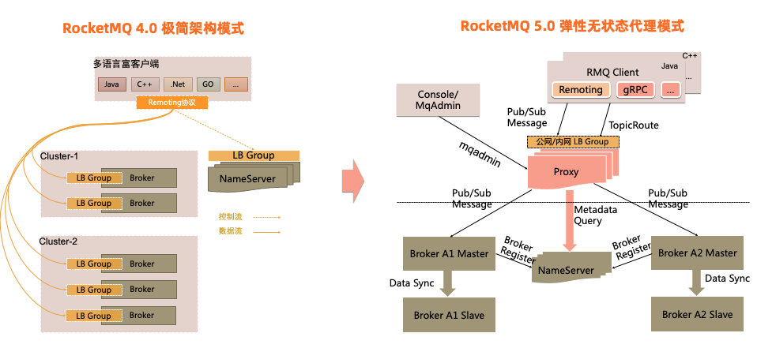
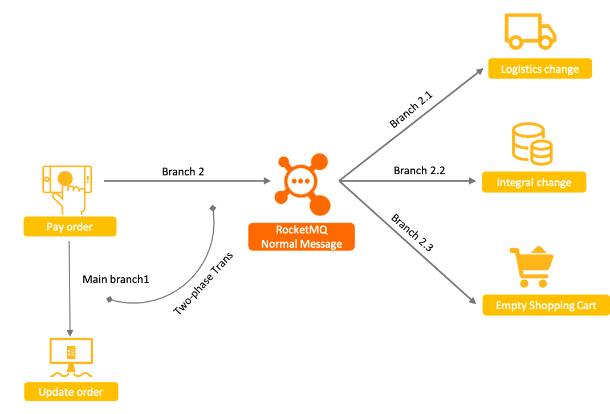

# 消息队列 22

### 1、消息队列有什么用？

MQ全称为Message Queue，即消息队列（MQ），它是一种应用程序对应用程序的通信方法，通过MQ实现的松耦合架构设计可以提高系统可用性以及可扩展性，是适用于现代应用的最佳设计方案。

消息传递指的是程序之间通过在消息中发送数据进行通信，而不是通过直接调用彼此来通信，直接调用通常是用于诸如远程过程调用的技术。

排队指的是应用程序通过队列来通信，队列的使用除去了接收和发送应用程序同时执行的要求。

### 2、消息队列有哪些应用场景？

消息队列比较核心的应用场景：**解耦、异步和削峰**。

### 3、消息队列有什么优缺点？

**优点：**

异步、解耦、削峰

**缺点：**

会给系统带来可用性、复杂性、一致性等问题，比如要考虑消息重复消费、消息丢失、顺序消费等问题。

### 4、消息队列怎么选型？

主流开源的消息中间件有：Kafka、ActiveMQ、RabbitMQ、RocketMQ。

下面是对比，仅供参考：

| 对比内容       |           RabbitMQ           |      ActiveMQ      |  RocketMQ  |       Kafka        |
| -------------- | :--------------------------: | :----------------: | :--------: | :----------------: |
| 所属机构/公司  |          GoPivotal           |       Apache       |  Alibaba   |       Apache       |
| 是否开源       |             开源             |        开源        |    开源    |        开源        |
| 技术文档完备   |              高              |         高         |     高     |         高         |
| 快速入门       |             提供             |        提供        |    提供    |        提供        |
| 成熟度         |             成熟             |        成熟        |    成熟    |        成熟        |
| 数据可靠性     |             可靠             |        可靠        |    可靠    |        可靠        |
| 集群           |             支持             |        支持        |    支持    |        支持        |
| 负载均衡       |             支持             |        支持        |    支持    |        支持        |
| 部署方式       |             独立             |        独立        |    独立    |        独立        |
| 开发语言       |            ErLang            |        Java        |    Java    |   Scala && Java    |
| 批量操作       |            不支持            |        支持        |    支持    |        支持        |
| 有序性支持     |         单客户端有序         |        支持        |    支持    |        支持        |
| 管理界面       |             较好             |        一般        | 命令行界面 |     命令行界面     |
| 消息延时       |            微秒级            |       微秒级       |   毫秒级   |       毫秒级       |
| 事务支持       |            不支持            |        支持        |    支持    |       不支持       |
| 客户端支持语言 |             多种             |        多种        |    Java    |        多种        |
| 社区活跃度     |              高              |         高         |     中     |         高         |
| 商业支持       |              无              |         无         |   阿里云   |         无         |
| 协议支持       |          AMQP等多种          |     AMQP等多种     | 自定义协议 |   自有协议，HTTP   |
| 消息丢失概率   |              低              |         低         |     无     |         无         |
| 可用性         |             主从             |        主从        |   分布式   |       分布式       |
| 单机吞吐量     |             万级             |        万级        |   十万级   |       十万级       |
| 部署难度       |              低              |         低         |     低     |         中         |
| 持久化         | 内存、文件，数据堆积影响效率 | 内存、文件、数据库 |    磁盘    | 磁盘，无限数据堆积 |
| 推拉方式       |          push/pull           |     push/pull      | push/pull  |     push/pull      |

### 5、有了多线程，为什么还要消息队列？

##### （1）业务解耦

使用多线程，所有业务代码都混在一起，耦合性太强，消息队列可以很方便进行解耦。

##### （2）扩展限制

使用多线程，资源消耗还是在本机器上，而消息队列可以转移到消费者的服务器上，可以很方便进行扩展。

##### （3）语言限制

多线程限定在具体的编程语言，解决的是编程层面的问题，而消息队列不限定编程语言，解决的是架构层面的问题。

消息队列的优势远不止上面三点。

### 6、消息队列和多线程应该怎么选择呢？

##### 考虑使用多线程：

1、可靠性要求不高；

2、不会过多占用资源；

3、不一定要进行解耦；

4、简单的异步任务；

##### 考虑使用消息队列：

1、可靠性要求较高；

2、不着急知道结果；

3、对架构进行解耦；

4、过多占用系统资源；

仅供参考，一句话总结就是，消息队列更适合复杂的系统架构，要求可靠性，能应对高并发，有灵活扩展性，如果简单的系统，不考虑其他，多线程就可以搞定。

### 7、使用消息队列会遇到哪些问题？

1、消息丢失；

2、消息重复消费；

3、消息积压；

4、消息顺序；

5、消息事务；

等等。。

### 8、消息队列为什么会产生消息重复消费？

MQ中的消息被成功消费后，消费者都会发送一个成功消费标志给MQ，MQ收到成功标志就表示消息已经成功消费了，但是如果由于网络问题成功标志没有被成功送到MQ，MQ就认为这个消息没有被成功消费，就会再次发送给其他消费者，这不就造成了消息重复消费了。

### 9、消息队列如何处理消息重复消费问题？

解决这个问题，就要保证消费端的**幂等性**，即同样的参数多次重复的请求操作，其产生的结果应该是一样的，这样即使有重复消息业务也不会重复消费。

### 10、消息队列为什么会产生消息丢失？

##### 1、消息队列丢失数据

MQ本身可能也会丢失消息，一般开启MQ的持久化到磁盘配置就能解决这个问题。

##### 2、生产者丢失数据

生产者往MQ发送消息的时候可能因为网络或者异常原因导致消息丢失了，其实主流的MQ都支持消息确认机制或消息事务机制，开启即可确保生产者将消息准确送到MQ。

##### 3、消费者丢失数据

一般是因为消费者采用了消息自动确认模式，当MQ收到确认消息后会删除消息，如果这时消费者发生异常了，那消息也没了，但业务还没处理完成，修改为消息手动确认模式就能解决这个问题。

### 11、消息队列为什么需要顺序消息？

电商的下单操作就是一个顺序消息的场景：

（1）下单后先减库存

（2）然后再生成订单

如果这两个操作是由两个服务完成，就可能是两个消息，此时就需要保证消息按业务顺序执行，不然可能出现库存不足等问题。

### 12、消息队列如何保证消息顺序消费？

具体操作流程如下：

（1）MQ生产者需要保证消息入队的顺序；

（2）一般的MQ都能保证内部队列是先进先出的，但只是针对一个队列，所以我们可以通过Hash取模的方式将同一个操作的所有消息发送到同一个队列里面，这样就能保证消息出队时也是顺序的了；

（3）消费者也需要注意，不能多个消费者同时消费一个队列，不然也会出现顺序错乱的情况。

### 13、消息延迟推送有哪些应用场景？

常见的互联网应用都有消息的延迟推送的场景，例如：

##### 1、电商七天后自动确认收货

我们签收快递后，物流系统会立即发送一个延时消息给支付系统，通知支付系统延迟七天后自动确认收费，并打款给商家，这个过程会持续七天。

##### 2、12306自动取消未支付订单

我们都知道，购票订单在30分钟内不支付的话会被自动取消，其实在下完购票订单后，系统就会发送一个延时消息给订单系统，通知订单系统延时30分钟取消订单，如果我们在30分钟内支付了，则可以忽略收到的消息。

### 14、消息队列有哪两种常见的模式？

##### 主要分为以下两种模式：

1、推模式（push）

2、拉模式（pull）

### 15、什么是推模式？

> 我们在谈论推拉模式的时候，一般指的是消费者（Consumer）和服务端（Broker）之间的交互。
>
> 生产者（Producer）与服务端（Broker）之间都是使用推的方式，即Producer将消息推送给Broker，而不是Broker主动去拉取消息。

推模式是由服务端（Broker）主动将消息送到消费者（Consumer），而不是由消费者自己去拉取。

### 16、什么是拉模式？

与推模式相反，拉模式是由消费者主动发起获取信息的。

在拉模式中， 消息不是主动推送给消息消费者的，而是要由消息消费者从队列中主动请求获取的，如果没有消费者监听队列，消息将保留在队列中，直至消息消费者连接到队列为止。

### 17、推模式有什么优缺点？

##### 推模式的主要优点：

1、消息实时性强，能及时向客户端推送最新的消息

##### 推模式的缺点：

1、不能确保发送成功

推模式采用的是广播方式，只有服务端和客户端在同一个频道上推模式才能发送成功。

2、不能跟踪发送状态

推模式采用了开环控制技术，消息推送后的状态无从得知，并且推送的消息可能不满足客户端的需求，针对性较差。

### 18、拉模式有什么优缺点？

##### 拉模式的主要优点：

1、针对性较强，能满足客户端的个性化需求；

2、服务器端压力小，服务器端只是被动接收请求；

##### 拉模式的缺点：

1、实时性较差，无法及时收到服务器端实时更新的消息；

### 19、什么是消息持久化？

消息持久化是把消息保存到物理介质上，以防止消息的丢失。

### 20、消息持久化有什么缺点？

消息持久化的缺点是**很消耗性能**，因为写入硬盘要比写入内存的性能低很多，从而降低了消息队列服务器的吞吐量。

可以使用固态硬盘来提高读写速度，以优化消息持久化的速度。

### 21、什么是JMS？

JMS，全称：**Java Messaging Service**，即：Java消息服务，是Java平台上有关面向消息中间件的技术规范，用于在两个应用程序之间，或分布式系统中发送消息进行异步通信。

Java消息服务是一个与具体平台无关的API，绝大多数提供商都支持JMS规范，JMS最主流的开源技术是Apache ActiveMQ、RocketMQ。

### 22、JMS支持哪几种消息模型？

**JMS规范目前支持2种消息模型：**

1、点对点模式（不可重复消费）

2、发布/订阅模式（可以重复消费）

# RabbitMQ 27

### 1、RabbitMQ是什么？

RabbitMQ是实现了高级消息队列协议（AMQP）的开源消息代理软件（面向消息的中间件）。

RabbitMQ服务器是用ErLang语言编写的，而集群和故障转移是构建在开放电信平台框架上的，所有主要的编程语言均有与代理接口通讯的客户端库。

### 2、RabbitMQ有哪些优点？

##### 1、可靠性好

RabbitMQ支持消息持久化，保证了消息的稳定可靠性；

##### 2、支持高并发

RabbitMQ使用了Erlang开发语言，天生支持高并发、高可用特性；

##### 3、集群部署简单

RabbitMQ使用了Erlang开发语言，Erlang使RabbitMQ集群部署变得非常简单；

##### 4、社区活跃度高

因为RabbitMQ应用比较广泛，所以社区的活跃度也很高；

因为社区活跃，所以学习资料比较多，解决问题的成本也很低；

##### 5、支持多种语言

主流的编程语言都支持，如Java、.NET、PHP、Python、JavaScript、Ruby、Go等；

### 3、RabbitMQ有哪些重要的组件？

RabbitMQ包含的重要组件有：

- ConnectionFactory（连接管理器）：用于应用程序与RabbitMQ之间建立连接的管理器；
- Channel（信道）：消息推送时使用的通道；
- Exchange（交换器）：用于分发消息；
- Queue（队列）：用于存储生产者写入的消息；
- RoutingKey（路由键）：用于交换器把生成者的消息写入到不同的队列；
- BindingKey（绑定键）：用于将交换器绑定到不同的队列；

### 4、RabbitMQ有哪些重要的角色？

##### RabbitMQ有3个重要的角色：

###### 1、生产者

消息的创建者，负责创建和推送数据到消息服务器；

###### 2、消费者

消息的接收方，用于处理数据和确认消息；

###### 3、代理

就是RabbitMQ本身，本身不生产消息，只是扮演投递的角色。

### 5、RabbitMQ交换器类型有哪些？

RabbitMQ交换器（Exchange）模式：

- **direct（默认）**：路由模式，发送消息时指定不同的Routing Key，交换机会根据不同的Routing Key将消息写入到不同的队列中；
- **fanout**：广播模式，交换器会将消息发送到它绑定的所有队列中，也是性能最好、使用最多的模式；
- **headers**：交换器使用消息内容中的headers属性进行匹配，性能较差，几乎不用；
- **topic**：匹配模式，和路由模式差不多，但可以允许使用通配符匹配来分发消息；

### 6、RabbitMQ消息基于什么传输？

RabbitMQ是基于信道Channel的方式来传输数据，排除了使用TCP链接来进行数据的传输，因为TCP链接创建和销毁对于系统性能的开销比较大，且并发能力受系统资源的限制，这样很容易造成RabbitMQ的性能瓶颈。

消费者链接RabbitMQ其实就是一个TCP链接，一但链接创建成功之后，就会基于链接创建Channel，每个线程把持一个Channel，Channel复用TCP链接，减少了系统创建和销毁链接的消耗，提高了性能。

### 7、RabbitMQ怎么避免消息丢失？

##### 可以采取以下几个措施：

1、消息持久化

2、消息手动确认机制

3、消息事务机制

4、设置集群镜像模式

5、消息补偿机制

### 8、RabbitMQ怎么保证消息的稳定性？

可以使用以下设置：

（1）消息事务机制

（2）消息确认机制

### 9、RabbitMQ支持消息顺序性吗？

RabbitMQ**不支持**消息顺序性。

### 10、RabbitMQ如何保证消息的顺序性？

RabbitMQ本身不支持消息的顺序性，但可以通过单线程发送、单线程消费，并且采用延迟队列、优先级队列等一些高级功能整体配合才能实现消息的顺序性。

### 11、RabbitMQ支持消息幂等性吗？

RabbitMQ**不支持**消息幂等性。

### 12、RabbitMQ支持事务消息吗？

支持，主要是对信道（Channel）的设置。

主要方法有以下三个：

1、声明启动事务模式：channel.txSelect

2、提交事务：channel.txCommit

3、回滚事务：channel.txRollback

### 13、RabbitMQ事务消息在什么情况下无效？

RabbitMQ如果是消息自动确认模式（autoAck=true），RabbitMQ会直接把消息从队列中移除，即使后面事务回滚也不能起到任何作用，**所以事务在自动消费确认的时候是无效的**。

### 14、RabbitMQ接收到消息之后必须消费吗？

RabbitMQ接收到消息后可以不消费，在消息确认消费之前可以做两件事：

##### 1、拒绝消息消费

使用channel.basicReject方法，消息可以被分配给其他消费者。

##### 2、设置为死信队列

死信队列可用于存放被拒绝的消息队列。

### 15、RabbitMQ如何确认消息已被消费？

RabbitMQ可以使用ack消息确认的方式确认消息被消费了，可根据自己的实际业务，选择channel.basicAck()方法手动确认消息被消费。

### 16、RabbitMQ消息持久化的条件？

RabbitMQ消息持久化，必须满足4个条件：

##### 1、队列必须开启消息持久化

> channel.queueDeclare(x, **true**, false, false, null)

第二个参数设置durable为true，表示开启队列持久化。

##### 2、消息推送投递模式必须开启持久化

> channel.basicPublish(x, x, MessageProperties.PERSISTENTTEXTPLAIN, x)

在三个参数设置投递模式deliveryMode为2，表示以纯文本存储到磁盘。

##### 3、消息已经送达持久化交换器

##### 4、消息已经送达持久化的队列

### 17、RabbitMQ的持久化包括几部分？

##### RabbitMQ持久化包括三部分：

1、交换器（Exchange）持久化

2、队列（Queue）持久化

3、消息（Message）持久化

### 18、RabbitMQ什么情况消息会变成死信？

##### 发生死信的情况有：

- 消息被拒绝
- 消息的存活时间（TTL）已过期
- 队列已满，无法添加新消息

### 19、RabbitMQ死信消息还能被处理吗？

**如果RabbitMQ配置了死信队列**，当消息变成死信后，就会将消息重新投递到另一个死信交换器，由该死信交换器再重定向到一个死信队列，后续再重新处理该消息。

如果RabbitMQ没有配置死信队列，则该消息将会被丢弃。

### 20、RabbitMQ中的死信队列是什么？

**死信：Dead Letter**，就是指无法被消费的消息，死信队列则是暂存死信消息的队列。

### 21、RabbitMQ死信队列有什么用？

避免消息没有被正确消费而被丢弃，在比较重要的业务中建议使用。

通过配置RabbitMQ死信队列，可以让未正确消费的消息暂存到另一个死信队列中，待排查清楚问题后再来处理这些死信消息。

### 22、RabbitMQ如何处理死信队列中的消息？

##### 处理死信队列的方式：

1、通过编写代码等其他方式人工处理

2、系统恢复正常后，把死信队列中的消息移到正常队列中去处理。

### 23、RabbitMQ队列中的消息是否有数量限制？

可以认为是无限制，因为取决于服务器的内存，但是消息过多会导致消息处理效率下降或者消息积压。

### 24、RabbitMQ支持优先队列吗？

**RabbitMQ支持优先队列。**

### 25、RabbitMQ支持延迟队列吗？

**RabbitMQ支持延迟队列。**

### 26、RabbitMQ怎么实现消息延迟推送？

RabbitMQ 3.6.x之前，一般采用死信队列 + TTL 过期时间来实现延迟队列。

RabbitMQ 3.6.x开始，RabbitMQ官方提供了延迟队列的插件，可以下载到RabbitMQ根目录下的plugins目录下使用。

### 27、RabbitMQ消息是推模式，还是拉模式？

RabbitMQ支持推、拉两个模式，即支持客户端主动拉取消息、以及服务端推送消息两种模式。

# Kafka 86

### 1、Kafka是什么？

官方解释：

> Apache Kafka is an open-source distributed event streaming platform used by thousands of companies for high-performance data pipelines, streaming analytics, data pipelines, streaming analytics, data integration, and mission-critical applications.

Kafka是一个开源的分布式事件流处理平台，现在被数千家公司用于高性能数据管道、流分析、数据集成和一些关键的应用程序。

其实Kafka除了是一个开源的分布式流处理平台，还是一个开源的消息引擎系统，即：MQ，也可以作为分布式存储系统使用。

Kafka最初由Linkedin公司开发，后来捐献给了Apache软件基金会成为顶级项目。

### 2、Kafka有哪些优势？

##### Kafka的核心能力有：

##### 1、高吞吐量

可以在延迟低至2毫秒的机器集群，以网络有限的吞吐量传递消息。

##### 2、高可扩展

可在生产集群扩展多达上千个broker、每天处理数万亿条消息、PB级数据、数十万个分区，弹性扩展和收缩存储和处理。

##### 3、持久化

可以将数据流安全地存储在分布式、持久、容错的集群中。

##### 4、高可用性

可以在可用的分区上有效的扩展集群，还可以跨地理区域连接不同的分散集群。

### 3、Kafka使用的是什么通信协议？

Kafka的Producer、Broker和Consumer之间采用的是Kafka自行设计的一套简单、高性能、支持多语言基于TCP层的协议。

### 4、Kafka支持哪几种消息模型？

##### Kafka支持2种消息模型：

1、点对点模式（不可重复消费）

2、发布/订阅模式（可以重复消费）

### 5、Kafka的服务端和客户端分别指什么？

服务端：Brokers

客户端：Producer（生产者）、Consumer（消费者）

### 6、Kafka有哪些核心的组件？

##### 1、Topic

即：主题，是消息发布的对象，每一类别的消息可以分为一个Topic（主题），实际开发中可以用来区分不同的业务系统。

##### 2、Producer

即：生产者，是指向某Topic（主题）发布消息的客户端。

##### 3、Consumer

即：消费者，是指订阅某些Topic（主题）的消息并进行消费的客户端。

##### 4、Brokers

Broker是指Kafka的服务端，Kafka集群由多个Broker组成，负责接收和处理客户端的请求，以及消息的持久化。

消费者可以订阅1个或多个Topic（主题），并从Broker拉取已发布的消息进行消费。

### 7、Kafka有哪几个核心的API？

##### Kafka有4个核心的API：

##### 1、Producer API（生产者API）

生产者可以发布消息到1个或多个topic主题中。

##### 2、Consumer API（消费者API）

消费者可以订阅1个或多个topic主题，并处理消息。

##### 3、Streams API（流API）

应用程序作为流处理器，从1个或多个topic主题中 消费输入流，然后生产1个输出流到1个或多个topic中，可以有效地将输入流转换输出流。

##### 4、Connector API（连接器API）

可以构建并运行可以重用的生产者或消费者，并将topic主题连接到现有的应用程序或数据系统。

例如：可以连接到一个关系数据库，捕获表（table）的所有变更。

### 8、Kafka有哪些核心功能？

##### Kafka的核心功能：

1、构建实时的流数据管道，可以在系统和应用程序之间的可靠地获取数据，即：MQ消息队列。

2、构建实时流的应用程序，可以对数据流进行转换或影响，即：流处理。

### 9、Kafka有哪些应用场景？

##### Kafka的应用场景有：

1、消息队列（MQ）

2、流处理

3、日志收集

4、用户活动跟踪

5、指标

### 10、Kafka为什么那么快？

##### 主要有以下几点原因：

1、顺序读写磁盘，避免了随机读写的性能问题；

2、利用了操作系统分页存储Page Cache来使用内存提高I/O效率。

3、利用了Linux的零拷贝技术，避免了昂贵的内核态数据拷贝；

4、对Topic分区，可以实现多台机器并行处理；

5、使用了批处理、压缩等优化手段传输数据，降低了网络IO开销；

### 11、Kafka主要消耗什么资源？

##### 主要有以下三个资源方面的考量：

1、磁盘，因为Kafka需要用来存储消息；

2、内存，因为需要缓存磁盘上的部分数据；

3、带宽，因为需要通过网络传输大量数据；

### 12、Kafka是有什么语言编写的？

Kafka是由Scala和Java语言编写的，它们都是JVM系语言，所以Kafka编译后的源代码就是.class文件。

### 13、Kafka都有哪些发行版？如何选择？

目前主流的Kafka发行版本有以下几个：

##### 1、Apache Kafka（官方开源版本）

它是最早由Apache官方开源的社区版Kafka，是最正宗的、用的最多的Kafka版本，它是其他所有Kafka发行版的基础。

##### 2、Cloudera/Hortnworks Kafka

它是一个集成了Kafka的大数据平台，全界面操作，十分友好，在安装部署、管理和监控方面要更加方便，省去了复杂的Kafka命令，但同时也降低了对Kafka的深度掌控。

##### 3、Confluent Kafka

他是一个专注于提供基于Kafka的企业级流处理的解决方案，目前分为免费版和企业版两种，它在社区版的基础上提供了如跨数据中心备份、Schema注册中心等一系列高级特性。

一般的，用官方Apache Kafka就够了，也可以根据需要选择其他第三方版本。

### 14、Kafka消息是推模式，还是拉模式？

Kafka采用的是**拉模式（Pull）**,有客户端主动拉取消息消费。

### 15、Kafka中Zookeeper的作用？

1、Zookeeper存储了Kafka集群中的所有元数据信息，如Broker状态、Topic、分区数据等；

2、Kafka中的Leader选举、扩容机制等也都靠Zookeeper完成；

### 16、Kafka已经移除Zookeeper了吗？

是的，Kafka 2.8.0版本已经移除了对Zookeeper的早期替换：

但目前还没有彻底移除，默认还是使用Zookeeper，但同时还可以使用最新的KRaft来管理Kafka集群，并且新增一个`@metadata`的内部Topic主题来存储元数据信息。

相信在后续的版本中，Kafka会彻底移除对Zookeeper的依赖。

### 17、Kafka为什么要移除Zookeeper？

1、主要的原因是Kafka需要维护另外一个中间件，完全没有必要，还需要额外的运维成本；

2、另外，依赖Zookeeper会使得Kafka比较笨重，去Zookeeper可以完成自己的更轻量化、更优的性能；

### 18、Kafka服务端实现高可用有哪些机制？

1、在不同的服务器上部署多个Brokers；

2、备份机制，把数据备份到多台服务器上；

3、分区机制，对每个Topic拆分成多个分区；

### 19、Kafka Server是什么网络模式？

Kafka中的SocketServer是基于Java NIO开发的，采用的是Reactor模式。

包括一个Acceptor线程和网络线程池，Acceptor线程主要负责接收客户端的请求，并使用轮询的方式分发到网络线程池中去处理。

### 20、Kafka中的控制器是什么？

Kafka中的控制器组件（Controller）也叫Leader Broker，它是Kafka Broker集群中的一个Broker，主要负责Kafka集群的管理和协调。

Kafka同时只能有一个Controller，如果当前Controller挂了会重新选举一个Controller。

### 21、Kafka中的控制器的作用有哪些？

##### Kafka控制器的作用有：

1、集群Broker管理，新增Broker、主动关闭Broker等；

2、Topic管理，包括Topic的创建和删除，以及增加分区、分区重分配等；

3、Preferred领导者选举；

4、向集群其他Broker提供数据服务；

### 22、Kafka中的控制器是怎样产生的？

Kafka Broker集群启动时，会通过选举机制选出其中一个Broker作为控制器，它们在启动时会尝试创建一个`/controller`的Zookeeper节点并写入自身信息，第一个完成节点创建的Broker就会被当选为当前Kafka集群的控制器。

### 23、Kafka控制器是通过什么实现的？

Kafka控制器是通过在Zookeeper中创建一个`/controller`临时节点实现的。

### 24、Kafka控制器中保存了哪些数据？

##### Kafka控制器中的一些重要数据：

1、所有Broker信息，包括当前运行中的Broker、正在关闭中的Broker等；

2、所有Topic信息，包括具体分区信息、领导者副本信息、ISR集合副本信息等；

3、当前进行中的Preferred领导者选举以及分区重分配的分区列表等。

### 25、Kafka中的ISR是指什么？

ISR：In-sync-Replicas，即副本同步集合。

**ISR里面放的是领导者副本，以及所有与领导者副本保持同步的追随者副本**，是否同步是根据Broker端replica.lag.time.max.ms参数值来确定的，如果追随者副本同步领导者副本的事件不超过这个值，就说明这个副本是保持同步到，否则就是不同步的。

并且，ISR中的副本集合是会根据副本同步情况动态更新的。

### 26、Kafka副本长时间不在ISR中说明什么？

这说明追随者副本不能及时同步领导者副本的进度，并且也不能参与正常的领导者选举，需要进行以下检查：

1、检查追随者副本所在的Broker与领导者副本的连接是否正常；

2、检查追随者副本所在的Broker的状态和负载情况是否正常；

### 27、Kafka副本同步机制是怎样的？

Kafka多个副本中，追随者副本会定期、异步地同步领导者副本上的消息数据。

### 28、Kafka领导者副本挂了会怎样？

Kafka领导者副本挂了会马上进行下一轮的Leader选举，从所有追随者副本中选出一个作为领导者副本。之前的领导者副本恢复后，就不再是领导者副本了，而是作为新领导者副本的追随者副本。

### 29、Kafka中的Unclean选举是？

正常情况下，ISR中的副本集合不应该是空的，选举应该从ISR集合中的副本中进行。但如果ISR副本集合为空，就只能从ISR副本集合之外的追随者副本中进行领导者副本选举，而这些副本可能远远落后于领导者副本，是不干净的副本，这就是Unclean选举。

Unclean选举可以保证一直有领导者副本提供服务，但很大可能会造成数据丢失，所以不建议使用，建议使用其他高可用的替代方案。

### 30、Kafka能避免消费者组重平衡吗？

计划性的增加Consumer（消费者）可以不用避免。

但非自行的导致Consumer（消费者）减少的情况可以通过设置合理的超时参数进行避免，比如Consumer（消费者）被误认为已停止而被踢出消费者组：

1、没有及时发送心跳；

2、消费时间太长；

### 31、Kafka中的分区是指什么？

Kafka中的分区是指对Topic（主题）进行分区，把一个主题拆分成多个分区。

分区从0开始，生产的消息只能被写到其中一个分区中，每个分区都是有序且顺序不可变的记录集，并且可以持续追加，分区中的每条消息记录都会有一个唯一的offset（偏移量）进行区分。

### 32、Kafka为什么要进行分区？

##### 对Topic分区的好处是：

每个Topic可以不受单台服务器的限制，扩展性非常好，实现负载均衡，支持消费者并行消费， 提高吞吐量以处理更多的消息。

### 33、Kafka分区策略有哪些？

常用的有以下3中分区策略：

##### 1、轮询策略

每条消息按顺序轮询写到0~N个分区。

##### 2、随即策略

每条消息随机写到0~N个分区。

##### 3、KEY策略

KEY相同的每条消息写到同一分区。

### 34、Kafka分区策略默认是哪个？

如果消息指定了KEY，则使用**KEY策略**，KEY相同的消息写到同一个分区。

如果消息没有指定KEY，则默认使用**轮询策略**（最新版本）。

### 35、Kafka数据备份副本分为哪几类？

##### Kafka中的数据副本有2类：

1、领导者副本（Leader Replica），一个分区只有一个

2、追随者副本（Follower Replica），一个分区有0个或者多个

### 36、Kafka副本和分区的关系是？

每个Topic（主题）可以建立多个分区，而副本是对分区的拷贝，每个分区可以建立多个副本，可以有多个追随者副本（Follower Replica），但只能有一个领导者副本（Leader Replica）。

### 37、Kafka数据副本都可以提供服务吗？

Kafka中的数据副本只有**领导者副本（Leader Replica）**才能提供服务：

- 生产者向领导者副本（Leader Replica）写消息
- 消费者从领导者副本（Leader Replica）读消息

追随者副本（Follower Replica）不能提供服务，它只与领导者副本（Leader Replica）进行数据同步。

### 38、Kafka支持读写分离吗？为什么？

Kafka不支持读写分离，所有读写操作只能在领导者副本上进行。

主要是因为副本消息如果同步不及时，可能导致数据不一致性问题。

### 39、Kafka创建Topic是否有数量限制？

Kafka创建Topic的数量和Topic总分区数、每个Topic的分区数是有关的，Kafka实例对Topic总分区数设置了上限，当达到上限后，会导致用户无法继续创建Topic。

### 40、Kafka创建Topic分区是否有数量限制？

Kafka创建Topic分区有数量限制，当分区数达到上限后就无法再创建Topic。

因为分区过多会导致消息生产、存储、消费都碎片化，影响性能和稳定性。

### 41、Kafka可以减少Topic分区数吗？

Kafka不支持减少Topic分区数，不然会导致数据丢失。

但可以通过删除原来的Topic，然后创建新的Topic方式重新调整分区数。

### 42、Kafka消费者与分区的对应关系是？

一个消费者可以消费多个分区的消息，但一个分区只能被一个消费者组中的一个消费者进行消费。

另外，如果一个Topic（主题）只有一个分区，那么就只能有一个消费者进行消费。

### 43、Kafka生产者是线程安全的吗？

Kafka中的KafkaProducer生产者是线程安全的，多个线程可以共享一个KafkaProducer实例。

### 44、Kafka消费者是单线程的吗？

Kafka 0.10.1.0版本之前，Java Consumer是单线程的设计。

Kafka 0.10.1.0+ 使用的是多线程设计，包括：

- 用户主线程：负责启动Consumer应用程序的主线程；
- 心跳线程：负责定期给对应的Broker机器发送心跳请求维持存活的线程；

但是获取消息仍是单线程的。

### 45、Kafka消费者是线程安全的吗？

Kafka中的KafkaConsumer消费者类不是线程安全的，不能在多线程中处理同一个KafkaConsuer实例，否则会抛出ConcurrentModificationException异常。

### 46、Kafka会出现重复消费问题吗？

##### 可能会，有以下几种情况：

1、最主要的原因：消费时间过长，导致超过了Kafka的session timeout时间，那么此时就会触发重平衡，此时offset可能还没提交，会导致重平衡后重复消费。

2、强行kill消费者线程，导致消费后的数据offset没有提交（消费进行系统宕机、重启等）。

3、设置offset为自动提交，如果关闭Kafka在close之前，调用consumer.unsubscribe()则有可能部分offset没提交，下次重启会导致重复消费。

### 47、Kafka怎么避免重复消费问题？

1、尽量提高消费者端的消息处理能力，避免长时间处理超时而导致重平衡，如考虑采用异步、多线程的方式；

2、消费者端业务上使用幂等操作，避免消息重复处理；

### 48、Kafka如何监控消费者的消费进度？

##### 主要有以下3种方法：

##### 1、使用Kafka中的JMX监控指标（推荐）；

2、使用Kafka中的kafka-consumer-groups命令行工具脚本；

3、使用Kafka Java Consumer API实现程序自动化监控；

### 49、Kafka如何保证消费者线程安全性？

1、限制每个线程只能管理一个KafkaConsumer实例；

2、处理消息可以交给多个线程（线程池）去处理；

### 50、Kafka消费者组是什么？

##### 消费者组是Kafka特有的概念。

消费者组是由多个消费者组成的一个组，消费者组可以消费订阅的一组Topic（主题 ），即该组Topic（主题）中的消息只能被该消费者组中的一个消费者进行消费，消费者组之外的其他消费者不能消费。

如图：

Kafka集群有两个Broker服务器，每个服务器都有两个分区，它们都属于同一个Topic（主题），分区中的消息由该消费者组进行瓜分。

### 51、Kafka为什么引入消费者组？

##### Kafka通过消费者组：

1、可以提高消费者端的消费能力；

2、可以同时支持点对点模式和发布订阅模式；

### 52、Kafka消费者组如何分配消费者数量？

如图所示：

消费者数量最好设置成所有Topic的总分区的数量，或者总分区数是消费者数的倍数。

1、如果上图有6个消费者，超过数量的2个消费者不会分配分区。

2、如果上图有3个消费者，那就只有2个消费者会分配分区，另外一个消费者不会进行分配。

### 53、Kafka中的重平衡是指什么？

Kafka中的重平衡（Rebalance）机制是建立在消费者组之上的，它规定了如何让消费者组内的消费者分配Topic中的每一个分区。

##### 比如：

一个主题有100个分区，一个消费者组有10个消费者，重平衡就是如何让这10个消费者各自分配到10个分区的过程，并且，如果其中一个消费者中途挂了，Kafka会自动检测，并重新把失败的分区分配给其他正常的消费者。

### 54、Kafka什么时候会触发重平衡？

##### 有以下3种情况：

##### 1、消费者组内成员发生变更，包括消费者的增加和减少（大部分是这种情况）；

2、订阅的Topic主题发生变更，如：新建了对应订阅规则的主题；

3、对应的Topic主题分区数发生变更，如：增加了分区；

### 55、Kafka中的重平衡有什么弊端吗？

Kafka中的重平衡有性能影响，对TPS的影响非常大，所以应该尽量避免发生重平衡。

1、重平衡过程中**Kafka基本处于不可用状态**，这个时段消费者是无法消费消息的；

2、如果消费者组中的消费者很多，那重平衡会很慢，甚至几个小时之久。。

### 56、Kafka中的偏移量有什么用？

##### Kafka中的偏移量有两种概念：

1、用来区分分区中的每条消息记录，它是唯一、顺序增长的。

2、每个消费者会保存消费的偏移量值，用来标识它消费的位置，当消费消息的时候，偏移量会进行线性的增加，偏移量由消费者进行控制的，所以消费者可以将偏移量重置到之前的位置以重新消费消息，也可以跳过一些消息消费。

### 57、Kafka中的Lag指标是指什么？

在Kafka中，Lag是**“滞后”、“延迟”**的意思，Lag的值为**正数、负数、0**分别代表着不同的指标，需要监控消费者的消费进度，以免业务受影响。

##### 正数：

正数则表示生产者消息堆积、积压，数字越大，说明消费者远远跟不上生产者的速度，这样就可能导致性能问题。

##### 负数：

负数则表示消费者的消费速度很快，远远超过了生产者的速度，供小于求。

##### 0：

0表示生产者和消费者的速率都处于正常水平，说明生产者和消费者都工作正常。

### 58、Kafka支持消息顺序性？

Kafka只支持Topic下单个分区的消息顺序性。

### 59、Kafka支持优先队列吗？

Apache Kafka**不支持**优先队列。

### 60、Kafka支持死信队列吗？

Apache Kafka**不支持**死信队列。

### 61、Kafka支持延迟队列吗？

Apache Kafka**不支持**延迟队列。

### 62、Kafka消息堆积了怎么办？

可以在Kafka监控平台（Kafka Manager）上找出该消息堆积的消费者组，如果该消费者组有消费者在消费，则想办法加快消费者的消费效率，如果没有，可以考虑移除不使用的消费者组。

### 63、Kafka如何保证消息的顺序性？

##### 一版有以下两种做法：

1、设置需要顺序消费的Topic只分一个区（分一个区影响吞吐量，这种不推荐）；

2、设置需要顺序消费的消息按KEY策略保存到一个分区，然后消费者数等于分区数，每个消费者消费一个分区，保证了消息的顺序性；

### 64、Kafka生产消息的最大长度是多少？

Kafka生产消息的最大长度为：10MB。

### 65、Kafka中的高水位是指什么？

Kafka中的高水位（**High Watermark**），缩写：**HW**，它是一个用消息位移来表示的位置信息标记，比如某个副本中HW=10，就表明这个副本的高水位在offset=10这个位置。

### 66、Kafka中的高水位有什么用？

##### Kafka中的高水位的作用主要有：

1、用来标识分区下的消息哪些是可以被消费的，高水位以下的消息是已提交消息，高水位以上（>=）的是未提交消息（不能被消费）；

2、完成副本同步；

### 67、Kafka中的高水位会带来什么问题？

Kafka是使用高水位值（HW）来决定副本备份的进度，而HW值往往需要通过额外一轮FETCH RPC才能完成更新，所以HW值的是有延迟的，可能会引起以下问题：

- 备份数据丢失
- 备份数据不一致

### 68、Kafka是如何解决高水位引起的问题的？

Kafka 0.11开始引入了一种**Leader Epoch**机制来取代高水位。

##### Leader Epoch信息包含一对值：

- epoch：表示的是Leader副本版本号，从0开始，每次Leader变更+1；
- offset：表示的是该Epoch版本的Leader副本写入第一条消息的位移；

有了Leader Epoch信息，就可以避免高水位导致的数据丢失及不一致的情况。

### 69、Kafka可以读取失败的事务消息吗？

可以，因为Consumer（消费者）默认是读取**read_uncommitted**级别的消息，即可以读取任何消息。

可以将Consumer（消费者）设置为**read_committed**，只读取成功事务的消息和其他所有非事务的消息。

### 70、Kafka支持事务消息吗？

Kafka从0.11版本开始，Producer可以支持事务消息，当Producer开启事务后，写入一批消息，要么全部成功，要么全部失败。

### 71、Kafka支持消息幂等性吗？

Kafka支持单个生产者、单个分区、单个会话的消息幂等性。

### 72、Kafka中的Producer是幂等性的吗？

Kafka中的Producer（生产者）默认不是幂等性的，但可以通过参数`enable.idempotenct=true`设置成幂等性。

### 73、Kafka会丢失消息吗？

有可能，Broker、生产者、消费者都有可能丢失数据。

比如：网络异常、客户端异常、Leader副本异常、缓冲区满了。

### 74、Kafka怎么解决消息重复发送问题？

我们可以将Producer（生产者）设置成幂等性，这样Kafka就可以自动帮我们去除重复发送的消息。

> 注意：这个设置仅限于单个分区、以及所在的会话，不能跨分区、跨会话实现幂等性去重。

### 75、Kafka中的消息是永久存储的吗？

不是，Kafka不会一直保留数据，也不会等到消息被消费之后才删除消息，Kafka可以为每个主题配置了数据保留策略，达到指定的策略就会删除数据。

### 76、Kafka有哪几种数据保留的策略？

Kafka有以下两种数据保存策略：

1、按照设置的消息的过期时间保留；

2、按照设置的存储的消息大小保留；

### 77、Kafka消息压缩、解压的过程？

Kafka的消息压缩主要用在**Producer（生产者）**端，用来提高网络IO的传输效率。

正常情况下，Broker不会重新解压再重新压缩，除非Producer使用了和Broker不同的压缩算法（以Broker的为准），或者Broker端需要做消息格式转换以兼容保存多种格式的消息。

**Consumer（消费者）端**消费消息时，需要根据消息集合中保存的压缩算法进行解压。

### 78、Kafka支持哪几种压缩算法？

##### Kafka目前支持以下几种压缩算法：

- GZIP
- Snappy
- LZ4
- Zstandard/或者zstd（Kafka 2.1.0+）

来看zstd给出的性能测试：

| Compressor name          | Ratio | Compression | Decompress |
| ------------------------ | ----- | ----------- | ---------- |
| zstd 1.4.5 - 1           | 2.884 | 500MB/s     | 1660MB/s   |
| zlib 1.2.11 - 1          | 2.743 | 90MB/s      | 400MB/s    |
| brotli 1.0.7 - 0         | 2.703 | 400MB/s     | 450MB/s    |
| **zstd 1.4.5 -- fast=1** | 2.434 | 570MB/s     | 2200MB/s   |
| **zstd 1.4.5 -- fast=3** | 2.312 | 640MB/s     | 2300MB/s   |
| quicklz 1.5.0 - 1        | 2.238 | 560MB/s     | 710MB/s    |
| **zstd 1.4.5 -- fast=5** | 2.178 | 700MB/s     | 2420MB/s   |
| lzo1x 2.10 - 1           | 2.106 | 690MB/s     | 820MB/s    |
| lz4 1.9.2                | 2.101 | 740MB/s     | 4530MB/s   |
| **zstd 1.4.5 -- fast=7** | 2.096 | 750MB/s     | 2480MB/s   |
| lzf 3.6 - 1              | 2.077 | 410MB/s     | 860MB/s    |
| snappy 1.1.8             | 2.073 | 560MB/s     | 1790MB/s   |

zstd压缩能力最强，lz4解压能力最强。

### 79、Kafka集群管理工具使用的哪个？

目前用的最多的是Yahoo开源的Kafka Manager，它是一个基于Web的管理工具。可能怕误认为是Kafka的官方工具，现在已经改名叫：CMAK（Cluster Manager for Apache Kafka）。

> https://github.com/yahoo/CMAK

### 80、Kafka如何选择合适的磁盘？

Kafka使用普通的机械硬盘就可以了。

因为Kafka使用的是磁盘顺序IO读写，不需要用到随机IO读写，所以虽然SSD在随机IO读写性能比较好，但在Kafka上面完全没有必要。

当然，有钱任性，使用SSD肯定是更好的，但一般情况下没有必要。

### 81、Kafka如何设置堆的大小？

一般情况下设置6G~8G左右就够了，也可以查看GC日志，在Full GC后，设置为存活对象总大小的1.5到2倍。

### 82、Kafka如何选择合适的GC回收器？

建议使用G1垃圾回收器，G1的优化难度要比CMS收集器小很多，G1从JDK9开始就已经成为JVM中的默认垃圾回收器了。

### 83、Kafka Streams是什么？

Kafka Streams是用于构建分布式应用程序和微服务的Java客户端库，其中输入和输出数据存储在Kafka集群中。

##### Kafka Streams的特性：

- 高弹性、高扩展性、容错性
- 部署到容器、虚拟机、裸机、云端
- 支持小型、中型和大型应用
- 与Kafka安全、无缝集成
- 编写标准的Java和Scala应用程序
- 一次处理语义
- 不需要单独的处理集群

### 84、什么是流处理平台？

先了解什么是**数据流**，它也叫事件流，是无边界数据集的抽象表示，随着时间的推移，性的数据记录会不断加入进来，所以无边界意味着数据是无限和持续增长的。

流式处理平台，则是指持续的从一个无边界的数据集读取数据，然后对它们进行处理并生成结果。

### 85、流处理平台有哪些功能特性？

##### 流处理平台有以下三种特性：

1、可以发布和订阅流式记录，类似于消息队列系统；

2、可以存储流式数据记录，并且有较好的容错性；

3、可以在流式数据记录产生时就进行处理；

### 86、如何搭建一个实时流处理平台？

##### 可以使用以下技术栈：

1、Flume + Kafka + Flink；

2、Kafka COnnect + Kafka Core + Kafka Streams；

# RocketMQ 87

### 1、RocketMQ是什么？

Apache RocketMQ是阿里巴巴开源的一款消息中间件，现在已成为Apache顶级项目。它同时也是一个分布式消息和流媒体平台，具有低延迟、高性能和可靠性、万亿级容量和灵活的可扩展性。

官方网站：

> https://rocketmq.apache.org/

其作为Spring Cloud Alibaba中的一员，经过历年淘宝双11历练，稳定性、性能方面都是很出色的，使用也简单。

##### 它具有以下特点：

- 消息发送和消费的严格顺序
- 丰富的消息拉取模式
- 消费者的横向可扩展性
- 实时消息订阅
- 亿级消息积累能力

### 2、为什么选择RocketMQ？

在阿里系统中，ActiceMQ随着队列和虚拟主题使用的增加，IO模块会达到一个瓶颈，Kafka也不符合阿里要求，所以阿里发明了一个全新的消息系统RocketMQ，覆盖从传统的pub/sub场景到高容量的实时零误差的交易系统。

RocketMQ自诞生以来，因其架构简单、业务功能丰富、具备极强可扩展性等特点被广泛采用，历经十余年的大规模场景打磨，RocketMQ已经成为业内共识的金融级可靠业务消息首选方案，被广泛应用于互联网、大数据、移动互联网、物联网等领域的业务场景。

### 3、RocketMQ的架构介绍一下？

以下是RocketMQ 4.0 vs 5.0 的架构模式对比：

RocketMQ自诞生以来就一直坚持简洁架构，比如元数据采用最终一致性设计，只引入了几百行代码的无状态NameSrv组件。

RocketMQ 5.0 引入了全新的弹性无状态代理模式，将当前的Broker职责进行拆分，新增了Proxy独立无状态的代理角色，对于客户端协议适配、权限管理、消费管理等计算逻辑进行抽离，Broker则继续专注于存储能力的持续优化。

RocketMQ 5.0 全新模式可以更好地实现在云环境的资源弹性调度，和4.0的极简架构模式是相容相通的，5.0的代理架构完全可以以 Local 模式运行，实现与 4.0 架构完全一致的效果。

### 4、RocketMQ的领域模型介绍下？

Apache RocketMQ 中消息的生命周期主要分为以下三部分：

- 消息生产
- 消息存储
- 消息消费

生产者负责生产消息并发送至RocketMQ服务端，消息被存储在服务端的主题中，消费者通过订阅主题消费消息。

不建议在生产环境中通过频繁修改订阅关系来实现业务逻辑的变更，这样可能会导致客户端一直处于负载均衡调整和变更的过程，从而影响消息接收。

### 5、RocketMQ支持的消息传输模型？

 RocketMQ使用的传输模型为**发布/订阅**模型。

 

（1）生产者发送消息到Apache  RocketMQ服务端；

（2）消息按照到达Apache RocketMQ服务端的顺序存储到主题的队列中；

（3）消费者按照指定的订阅关系从Apache RocketMQ服务端中获取消息并消费。

同一个主题内的消息可以被多个消费者处理，每个订阅的消费者都可以拿到全量消息。

### 6、RocketMQ 5.0 有哪些改变或新特性？

RocketMQ 5.0 新特性一览：

- 全新的架构，Broker角色拆分成Broker + Proxy；
- 重新设计了轻量API和多语言SDK；
- 支持消息的流式处理和轻计算；

### 7、RocketMQ的主题拆分设计，应遵循那些原则？

RocketMQ的主题拆分设计应遵循**大类统一原则**，即将相同业务域内同一功能属性的消息划分为同一个主题，可以从以下角度考虑拆分粒度：

##### 1、消息类型是否一致

不同类型的消息使用不同的主题，如顺序消息和普通消息需要使用不同的主题。

##### 2、消息业务有是否关联

业务没有直接关联需要使用不同的消息主题，如淘宝交易消息和盒马物流消息没有业务交集，他们需要使用不同的主题。

##### 3、消息量级是否一样

数量级不同或时效性不同的业务消息建议使用不同的主题，例如某些业务消息量很小但是时效性要求很强，如果跟某些万亿级消息量的业务使用同一个主题，会增加消息的等待时长。

### 8、一个线上商品购买场景，RocketMQ主题该怎么设计比较好？

**如果是线上商品购买场景，RocketMQ主题可以这么设计：**

- 订单交易（创建、支付、取消等流程）的消息使用一个主题；
- 物流相关消息使用一个主题；
- 积分管理相关的消息再使用一个主题；

### 9、RocketMQ主题拆分不合理会有什么后果？

##### RocketMQ主题拆分不合理的后果：

##### 1、拆分粒度过粗

会导致业务隔离性差，不利于独立运维和故障处理。

> 错误示例：
>
> 将所有交易消息和物流消息都共用一个主题，将会混乱不堪。

##### 2、拆分粒度过细

会消耗大量主题资源，造成系统负载过重。

> 错误示例：
>
> 按照用户ID区分，每个用户ID使用一个主题，如果用户量一多...

### 10、RocketMQ怎么避免产生大量垃圾主题？

RocketMQ支持自动创建主题，但是建议仅在测试环境使用，请勿在生产环境使用，否则会产生大量垃圾主题，无法管理和回收并浪费系统资源。因为创建和管理主题会占用一定的系统资源，因此生产环境需要严格管理主题资源，请勿随意进行增、删、改、查操作。

### 11、RocketMQ中的主题和队列的关系是？消息存储在哪个位置？

主题是RocketMQ消息传输和存储的分组容器，队列是RocketMQ消息传输和存储的实际单元容器。

RocketMQ中的主题是一个逻辑概念，并不是实际的消息容器，主题内部由多个队列组成，消息的存储和水平扩展实际上是通过主题内的队列实现的。

RocketMQ队列模型和Kafka的分区（Partition）模型类似，队列属于主题的一部分，虽然所有的消息资源以主题粒度管理，但实际的操作实现是面向队列。例如，生产者指定某个主题，向主题内发送消息，但实际消息发送到该主题下的某个队列中。

### 12、RocketMQ主题的队列数可以更改吗？

Apache RocketMQ的队列数可在创建主题或变更主题时设置修改，队列数量的设置应遵循少用够用原则，避免随意增加队列数量。

### 13、RocketMQ中的主题，什么场景下需要增加队列数？

##### 常见队列增加场景：

##### 1、需要增加队列实现物理节点负载均衡

Apache RocketMQ每个主题的多个队列可以分布在不同的服务节点上，在集群水平扩容增加节点后，为了保证集群流量的负载均衡，建议在新的服务节点上新增队列，或将旧的队列迁移到新的服务节点上。

##### 2、需要增加队列实现顺序消息性能扩展

在Apache RocketMQ服务端4.x版本中，顺序消息的顺序性在队列内生效的，因此顺序消息的并发度会在一定程度上受队列数量的影响，因此建议仅在系统性能瓶颈时再增加队列。

### 14、RocketMQ主题内的队列数过多，可能会导致什么问题？

主题内队列数过多可能导致如下问题：

##### 1、集群元数据膨胀

Apache RocketMQ会以队列粒度采集指标和监控数据，队列过多容易造成管控元数据膨胀。

##### 2、客户端压力过大

Apache RocketMQ的消息读写都是针对队列进行操作，队列过多容易产生空轮询请求，增加系统负荷。

### 15、RocketMQ中的消息最小存储单元是？

RocketMQ中消息存储和传输的实际容器是**队列**，它也是RocketMQ消息的最小存储单元。RocketMQ中的所有主题都是可以有多个队列组成的，以此实现队列数量的水平拆分和队列内部的流式存储。

### 16、RocketMQ中的最小传输单元是？

Apache RocketMQ中的最小传输单元是：**消息**，生产者将业务数据的负载和拓展属性包装成消息发送到Apache RocketMQ服务器，服务端按照相关语义将消息投递到消费端进行消费。

### 17、RocketMQ支持哪些消息类型？

RocketMQ支持的消息类型：

- 普通消息
- 顺序消息（FIFO）
- 定时/延时消息（Delay）
- 事务消息（Transaction）

### 18、RocketMQ队列中的消息是顺序存储的吗？

RocketMQ中的队列天然具备顺序性，即消息按照进入队列的顺序写入存储，同一队列间的消息天然存在顺序关系，队列头部为最早写入的消息，队列尾部为最新写入的消息。消息在队列中的位置和消息之间的顺序通过位点（Offset）进行标记管理。

### 19、RocketMQ中的顺序消息是什么？

顺序消息是RocketMQ提供的一种高级消息类型，支持消费者按照发送消息的先后顺序获取消息，从而实现业务场景中的顺序处理。相比其他类型消息，顺序消息在发送、存储和投递的处理过程中，更多强调多条消息间的先后顺序关系。

RocketMQ顺序消息的顺序关系通过消息组（MessageGroup）判定和识别，发送顺序消息时需要为每条消息设置归属的消息组，相同消息组的多条消息之间遵循先进先出的顺序关系，不同消息组、无消息组的消息之间不涉及顺序性。

基于消息组的顺序判定逻辑，支持按照业务逻辑做细粒度拆分，可以在满足业务局部顺序的前提下提高系统的并行度和吞吐能力。

> 示例场景：
>
> 一个订单下单后需要发送三条优惠券消息，需要按顺序发送和消费，但是不同订单之间是可以并行消费的。

### 20、RocketMQ中的顺序消息分为哪几种？

顺序消息分为全局顺序和分区顺序两种。

##### 全局顺序

对于指定的一个Topic，所有消息按照严格的先入先出（FIFO）的顺序进行发布和消费。

> 适用场景：
>
> 性能要求不高，所有的消息严格按照FIFO原则进行消费发布和消费的场景

##### 分区顺序

对于指定的一个Topic，所有消息根据`Sharding key`进行区块分区，同一个分区内的消息按照严格的FIFO顺序进行发布和消费，`Sharding key`是顺序消费中用来区分不同分区的关键字段，和普通消息的Key是完全不同的概念。

> 适用场景：
>
> 性能要求高，以sharding key作为分区字段，在同一个区块中严格的按照FIFO原则进行消息发布和消费的场景。

### 21、RocketMQ中的消息的顺序性分为两部分？

RocketMQ的消息的顺序性分为两部分：

- **生产顺序性**：通过生产者和服务端的协议保障单个生产者串行地发送消息，并按序存储和持久化；
- **消费顺序性**：通过消费者和服务端的协议保障消息消费严格按照存储的先后顺序来处理；

如果消息需要严格按照先进先出（FIFO）的原则处理，即先发送的先消费、后发送的后消费，则必须要同时满足生产顺序性和消费顺序性。

### 22、RocketMQ使用顺序消息有什么要注意的吗？

##### 1、使用串行消费，避免使用批量消费导致乱序

消息消费建议串行处理，避免一次消费多条消息，否则可能出现乱序情况。

> 错误示例：
>
> 比如发送顺序为：1 -> 2 -> 3 -> 4，消费时批量消费，消费顺序为1 -> 23（批量处理，失败）-> 23（重试处理）-> 4，此时可能由于消息3的失败导致消息2被重复处理，最后导致消费乱序。

##### 2、消息组尽可能打散，避免集中导致热点

RocketMQ保证相同消息组的消息存储在同一个队列中，如果不同业务场景的消息都集中在少量或一个消息组中，则这些消息存储压力都会集中到服务端的少量队列或一个队列中，容易导致性能热点，且不利于扩展。一般建议消息组采用订单ID、用户ID作为顺序参考，即同一个终端用户的消息保证顺序，不同用户的消息无需保证顺序。

因此建议将业务以消息组粒度进行拆分，例如，将订单ID、用户ID作为消息组关键字，可实现同意终端用户的消息按照顺序处理，不同用户的消息无需保证顺序。

### 23、RocketMQ中的延时消息是什么？

RocketMQ中的定时/延时消息指的是，通过指定延时时间控制消息生产后不要立即投递，而是在延时间隔后才对消费者可见，即消息被发送至服务端后，在指定时间后才能被消费者消费。

> 在电商系统里很常见的一个取消订单的应用场景：
>
> 用户提交一个订单后，可以发送一个延时消息，30分钟（可配置）后再去检查这个订单的状态，如果还是未付款状态就取消该订单释放库存。

### 24、RocketMQ延时消息的实现原理是怎样的？

除了主动设置延时消息，消息消费失败也会进入延时消息队列，所以消息发送时间与设置的延时等级和重试次数有关。

延时消息不会马上写入到实际的Topic，而是先暂存到`SCHEDULE_TOPIC_XXXX`Topic中，相同等级的延时消息会存储到相同的队列以保证其顺序性，然后再由Broker检查`SCHEDULE_TOPIC_XXXX`中的消息是否到期，到期则写入到真实的Topic让消费者消费。

### 25、RocketMQ延时消息可以设置任意时间吗？

RocketMQ暂不支持任意时间的消息延时，需要设置几个固定的延时等级，从1s到2小时，分别对应着等级1到18，如下所示：

> [1s  5s  10s  30s  1m  2m  3m  4m  5m  6m  7m  8m  9m  10m  20m  30m  1h  2h]

### 26、RocketMQ使用延时消息有什么要注意的吗？

需要注意的一点是，**避免创建大量相同定时时刻的消息**。

如果将大量延时消息设置为同一时间段，则系统需要在同一时间处理大量消息，这就会造成系统巨大的压力，导致消息分发延迟，影响定时精度等问题。

### 27、RocketMQ中的事务消息是什么？

事务消息是RocketMQ提供的一种高级消息类型，支持在分布式场景下保障消息生产和本地事务的最终一致性。

RocketMQ支持分布式事务消息，支持应用数据库更新和消息调用的事务一致性保障，它在普通消息基础上，支持二阶段的提交能力，将二阶段提交和本地事务绑定，实现全局提交结果的一致性。

### 28、RocketMQ使用事务消息有什么要注意的吗？

##### 1、避免大量未决事务导致超时

RocketMQ支持在事务提交阶段异常的情况下发起事务回查，保证事务一致性，但生产者应该尽量避免本地事务返回未知结果，大量的事务检查会导致系统性能受损，容易导致事务处理延迟。

##### 2、正确处理进行中的事务

消息回查时，对于正在进行中的事务不要返回Rollback或Commit结果，应继续保持Unknown的状态。一般出现消息回查时事务正在处理的原因为事务执行较慢，消息回查太快。解决方案如下：

- 将第一次事务回查时间设置较大一些，但可能导致依赖回查的事务提交延迟较大；
- 程序能正确识别正在进行中的事务；

### 29、RocketMQ中的消息是可变的吗？

RocketMQ中的消息具备不可变性，在消息初始化发送和完成存储后即不可变。

消息本质上是已经产生并确定的事件，一旦产生后，消息的内容不会发生改变，即使经过传输链路的控制也不会发生变化，消费端获取的消息都是只读消息视图。

### 30、RocketMQ中的消息有没有大小限制？

##### 系统默认的消息最大限制如下：

- 普通和顺序消息：4MB；
- 事务和定时或延时消息：64KB；

Apache RocketMQ中的消息大小不得超过其类型所对应的限制，否则消息会发送失败。建议单个原子消息事件的数据大小做好严格控制，如果单条消息过大容易造成网络传输层压力，不利于异常重试和流量控制。

生产环境中如果需要传输超大负载，建议按照固定大小做报文拆分，或者结合文件存储等方法进行传输。

### 31、RocketMQ支持消息持久化吗？

支持的， Apache RocketMQ默认提供消息可靠存储机制，对消息进行持久化，即所有发送成功的消息都被持久化存储到队列中，然后存储到Apache RocketMQ服务端的存储文件中，保证消息的可回溯性和系统故障场景下的可恢复性。

### 32、RocketMQ中的消息队列是无限存储的吗？

Apache RocketMQ中的消息队列逻辑上都是无限存储的，即消息位点会从0到Long.MAX无限增加，但服务端物理节点的存储空间是有限的，Apache RocketMQ会滚动删除队列中存储最早的消息。

### 33、RocketMQ中的消息是永久存储的吗？

不是，在实际部署场景中，服务端节点的物理存储空间是有限的，消息无法做到永久存储。

Apache RocketMQ提供一种消息存储和清理机制，使用存储时长作为消息存储的依据，即每个节点对外承诺消息的存储时长。在存储时长范围内的消息都会被保留，无论消息是否被消费，超过时长限制的消息则会被清理掉。

### 34、RocketMQ中的消息存储多长时间比较适合？

这要看存储成本，只要存储成本可控，就尽可能地延长消息存储时间，时间越长越好。延长消息存储时长，可以为紧急故障恢复、应急问题排查和消息回溯带来更多的可操作空间。

### 35、RocketMQ中的消息被消费后，会被立即清理吗？

不会立即清理，Apache RocketMQ按存储时长统一控制消息是否保留，只要在存储时长范围内的消息都会被保留，无论消息是否被消费，超过时长限制的消息才会被清理掉。

### 36、RocketMQ怎么定位一条消息？使用了什么索引？

RocketMQ会为每个消息创建哈希索引，应用可以通过topic、key来定位（查询）这条消息内容，以及消息被谁消费，由于是哈希索引，为了避免哈希冲突，所以要保证key必须唯一。

### 37、RocketMQ可以避免消息重复吗？如何处理？

RocketMQ无法避免消息重复，如果业务对消费重复非常敏感，务必要在业务层面进行去重处理。

##### 去重处理方式：

可以借助关系数据库进行去重，首先确定消息的唯一标识，在消费之前判断消息唯一标识是否在关系数据库中存在，如果不存在则插入、并消费，否则跳过。另外还要考虑原子性问题，如果插入报主键冲突，则插入失败，直接跳过。

### 38、RocketMQ消费者每次消费成功后，如何确保不会再重复处理该消息？

Apache RocketMQ会基于每个消费者分组维护一份消费记录，该记录指定消费者分组消费某一个队列时，消费过的最新一条消息的位点，即消费位点，以此可以避免重复处理消息。

### 39、RocketMQ怎么保证消息不丢失？

可以使用重试策略，可以在一定程度上保证了消息可以发送成功。

如果业务要求消息发送不能丢，需要对可能出现的异常做兜底，比如调用send同步方法发送失败时，则尝试将消息存储到DB，然后有后台线程定时重试，确保消息一定到达Broker。

### 40、RocketMQ消息处理慢怎么处理？

##### RocketMQ消息处理慢的处理方式：

1、提高消费并行度；

2、批量方式消费；

3、重置位点跳过非重要消息；

4、优化每条消息消费过程；

### 41、RocketMQ怎么合理设置消费并行度？

绝大部分消息消费行为都属于IO密集型，即可能是操作数据库，或者调用RPC，这类消费行为的消费速度在于后端数据库或者外系统的吞吐量，通过增加消费并行度，可以提高总的消费吞吐量，但是并行度增加到一定程度，反而会下降。

##### 所以，应用必须要设置合理的并行度。

如下有几种修改消费并行度的方法：

- 同一个ConsumerGroup下通过增加Consumer实例数量来提高并行度，可以通过加机器，或者在已有机器启动多个进程的方式；
- 提高单个Consumer的消费并行线程；

### 42、RocketMQ中的keys的使用场景是？

RocketMQ建议每条消息映射到业务层面的一个**唯一标识**，设置keys字段，方便后续定位消息丢失问题，常见的设置策略比如有使用订单ID、用户ID、请求ID等比较离散的唯一标识来处理。

### 43、RocketMQ中的tags的使用场景是？

RocketMQ推荐的做法是**一个应用尽可能用一个Topic**，而消息子类型则可以用**tags**来标识，如生产者在发送消息时指定tags，然后消费者在订阅消息时可以通过tags做消息过滤。

### 44、RocketMQ消息过滤有哪些实现方式？

Apache RocketMQ支持Tag标签过滤和SQL属性过滤，这两种过滤方式对比如下：

| 对比项   | Tag标签过滤                      | SLQ属性过滤                                                  |
| -------- | -------------------------------- | ------------------------------------------------------------ |
| 过滤目标 | 消息的Tag标签。                  | 消息的属性，包括用户自定义属性以及系统属性（Tag是一种系统属性）。 |
| 过滤能力 | 精准匹配。                       | SQL语法匹配。                                                |
| 适用场景 | 简单过滤场景，计算逻辑简单轻量。 | 复杂过滤场景，计算逻辑较复杂。                               |

### 45、RocketMQ消息过滤的实现原理是什么？

消息过滤实现原理图如下：

消息过滤主要通过以下几个关键流程实现：

- **生产者**：生产者在初始化消息时预先为消息设置一些属性和标签，用于后续消费时指定过滤目标。
- **消费者**：消费者在初始化及后续消费流程中通过调用订阅关系注册接口，向服务端上报需要订阅指定主题的哪些消息，即过滤条件。
- **服务端**：消费者获取消息时会触发服务端的动态过滤计算，Apache RocketMQ服务端根据消费者上报的过滤条件的表达式进行匹配，并将符合条件的消息投递给消费者。

### 46、RocketMQ消息过滤的作用是什么？

消费者订阅了某个主题后，Apache RocketMQ会将该主题中的所有消息投递给消费者。若消费者只需要关注部分消息，可通过设置过滤条件在Apache RocketMQ服务端进行过滤，只获取到需要关注的消息子集。避免接收到大量无效的消息。

使用Apache RocketMQ的消息过滤功能，可以帮助消费者更高效地过滤自己需要的消息集合，避免大量无效投递给消费者，降低下游系统处理压力。

### 47、RocketMQ中的消息可以从任意位置读取任意数量的消息吗？

可以的，RocketMQ基于队列的存储模型，可以确保消息从任意位点、读取任意数量的消息，以此实现类似聚合读取、回溯读取等特性，这些特性是RabbitMQ、ActiveMQ等非队列存储模型不具备的。

### RocketMQ中的生产者和主题的关系是？

Apache RocketMQ的生产者和主题是**多对多**的关系，支持同一个生产者向多个主题发送消息。

##### 1、不建议单一进程创建大量生产者

对于生产者的创建和初始化，建议遵循够用即可、最大化复用原则，如果有需要发送消息到多个主题的场景，无需为每个主题都创建一个生产者。

##### 2、不建议频繁创建和销毁生产者

Apache RocketMQ的生产者是可以重复利用的底层资源，类似数据库的连接池。因此不需要在每次发送消息时动态创建生产者，且在发送结束后销毁生产者。这样频繁的创建销毁会在服务端产生大量短连接请求，严重影响系统性能。

### RocketMQ中的生产者必须要配置生产者组吗？

从Apache RocketMQ 5.x版本开始，生产者是匿名的，无需配置和管理生产者分组（ProducerGroup），而对于历史版本服务端3.x和4.x版本，已经使用的生产者组可以废弃无需再设置，且不会对当前业务产生影响。

### 50、RocketMQ消息是推模式，还是拉模式？

RocketMQ采用的是**拉模式（Pull）**，由客户端主动拉取消息消费。

### 51、RocketMQ支持哪几种消费者类型？

Apache RocketMQ支持以下三种类型的消费者：

- PushConsumer
- SimpleConsumer
- PullConsumer

具体区别如下：

| 对比项       | PushConsumer                                                 | SimpleConsumer                                       | PullConsumer                             |
| ------------ | ------------------------------------------------------------ | ---------------------------------------------------- | ---------------------------------------- |
| 接口方式     | 使用监听器回调接口返回消费结果，消费者仅允许在监听器范围内处理消费逻辑。 | 业务方自行实现消息处理，并主动调用接口返回消费结果。 |                                          |
| 消费并发管理 | 由SDK管理消费并发度。                                        | 由业务方消费逻辑自行管理消费线程。                   | 由业务方消费逻辑自行管理消费线程。       |
| 负载均衡粒度 | 5.0 SDK是消息粒度，更均衡，早期版本是队列维度                | 消息粒度，更均衡                                     | 队列粒度，吞吐攒批性能更好，但容易不均衡 |
| 接口灵活度   | 高度封装，不够灵活。                                         | 原子接口，可灵活自定义。                             | 原子接口，可灵活自定义。                 |
| 适用场景     | 适用于无自定义流程的业务消息开发场景。                       | 适用于需要高度自定义业务流程的业务开发场景。         | 仅推荐在流处理框架场景下集成使用         |

在实际使用场景中，PullConsumer仅推荐在流处理框架中集成使用，大多数消息收发场景使用PushConsumer和SimpleConsumer就可以满足需求。

> 危险！！！
>
> 生产环境中相同的ConsumerGroup下严禁混用PullConsumer和其他两种消费者，否则会导致消息消费异常。

### 52、RocketMQ中的消费者和主题的关系是？

Apache RocketMQ的消费者和主题是**多对多**的关系，一个消费者可以同时消费多个主题中的消息，一个主题也可以同时被多个消费者消费。

### 53、RocketMQ中的消费者分组和消费者之间的关系？

Apache RocketMQ中的消费者（Consumer）是消费消息的运行实体，消费者分组（ConsumerGroup）则是统一管理底层运行的多个消费者（Consumer）。

消息订阅是以消费者组（ConsumerGroup）为粒度进行管理的，消费者组（ConsumerGroup）它并不是运行实体，而是一个逻辑资源。消费者（Consumer）必须被指定到某一个消费组（ConsumerGroup）中，同一个消费组（ConsumerGroup）的多个消费者（Consumer）必须保持消费逻辑和配置一致，共同分担该消费组（ConsumerGroup）订阅的消息，实现消费能力的水平扩展。

Apache RocketMQ要求同一分组下的所有消费者一下消费行为保持一致：

- 投递顺序；
- 消费重试策略；

### 54、RocketMQ的消费者拆分设计，应遵循那些原则？

对于消费者分组的拆分设计，建议遵循以下原则：

##### 1、消费者的投递顺序一致

同一消费者分组下所有消费者的消费投递顺序是相同的，同意都是顺序投递或并发投递，不同业务场景不能混用消费者分组。

##### 2、消费者业务类型一致

一般消费者分组和主题对应，不同业务域对消息消费的要求不同，例如消息过滤属性、消费重试策略不同。因此，不同业务域主题的消费建议使用不同的消费者分组，避免一个消费者分组消费超过10个主题。

Apache RocketMQ虽然提供了自动创建消费者分组的功能，但是建议仅在测试环境使用，生产环境请勿打开，避免产生大量消费者分组，无法管理和回收，且浪费系统资源。

### 55、RocketMQ消费者启动后从哪里开始消费消息？

Apache RocketMQ会基于每个消费者分组维护一份消费记录，即消费位点，从服务端最新消息又再次重新上线时，会严格按照服务端保存的历史位点进度继续处理消息，如果服务端保存的历史位点信息已过期被删除，此时消费位点向前移动至服务端存储的最小位点。

### 56、RocketMQ消息位点和消费位点的区别？

##### 消息位点（Offset）

消息是按到达服务端的先后顺序存储在指定主题的多个队列中，每条消息在队列中都有一个唯一的Long类型坐标，这个坐标被定义为消息位点。任意一个消息队列在逻辑上都是无限存储，即消息位点会从0到Long.MAX无限增加。通过主题、队列和位点就可以定位任意一条消息的位置。

Apache RocketMQ定义队列中最早的一条消息的位点为最小消息位点（MinOffset），最新一条消息的位点为最大消息位点（MaxOffset），如下图所示：

虽然消息队列逻辑上是无限存储，但由于服务端物理节点的存储空间有限，Apache RocketMQ会滚动删除队列中存储最早的消息。因此，消息的最小消息位点和最大消息位点会一直递增变化。

##### 消费位点（ConsumerOffset）

Apache RocketMQ是通过消费位点管理消息的消费进度的，每条消息被某个消费者消费完成后不会立即在队列中删除，Apache RocketMQ会基于每个消费者分组维护一份消费记录，该记录指定消费者分组消费某一个队列时，消费过的最新一条消息的位点，即消费位点。

队列中的消息位点 MinOffset、MaxOffset 和每个消费者分组的消费位点ConsumerOffset的关系图如下：

### 57、RocketMQ什么场景下需要重置消费位点？

若消费者分组的初始消费位点或当前消费位点不符合业务预期时，可以通过重置消费位点调整消费进度，比如以下场景：

- 初始消费位点不符合需求；
- 消费堆积时，快速丢弃清理；
- 业务回溯，纠正处理；

重置消费位点会给系统带来额外处理压力，可能会影响消息的读写性能，请在适用场景下谨慎执行，并提前做好合理性和必要性评估。

### 58、RocketMQ消费者负载均衡策略是指什么？

消费者内共享消费场景下，消费者分组内多个消费者共同分担消息，消息按照哪种逻辑分配给哪个消费者，就是由消费者负载均衡策略所决定的。

消费者从Apache RocketMQ获取消息消费时，通过消费者负载均衡策略，可将主题内的消息分配给指定消费者分组中的多个消费者共同分担，提高消费并发能力和消费者的水平扩展能力。

### 59、RocketMQ什么时候会触发重新负载均衡？会带来什么问题？

RocketMQ在消费者上线或下线、服务端扩缩容等场景下，都会触发短暂的重新负载均衡动作。此时可能会存在短暂的负载不一致情况，出现少量消息重复的现象。

**因此，需要在下游消费逻辑中做好消息幂等去重处理。**

### 60、RocketMQ消费者负载均衡策略有哪几种模式？

根据消费者类型的不同，消费者负载均衡策略分为以下两种模式：

- **消息粒度负载均衡**：PushConsumer和SimpleConsumer的默认负载策略；
- **队列粒度负载均衡**：PullConsumer的默认负载策略；

### 61、RocketMQ消费者建议打印日志吗？

这个要看线上环境的消息量：

- 如果消息量较少（TPS不高），建议在消费入口方法打印消息，消费耗时等，方便后续排查问题；
- 如果消息量较多（TPS很高），则不建议打印日志，避免日志太多影响性能；

### 62、RocketMQ消息发送重试机制有什么用？

Apache RocketMQ客户端连接服务端发起消息发送请求时，可能会因为网络故障、服务异常等原因导致调用失败。

为保证消息的可靠性，Apache RocketMQ在客户端SDK中内置请求重试逻辑，尝试通过重试发送达到最终调用成功的效果。同步发送和异步发送模式均支持消息发送重试。

### 63、RocketMQ在什么情况下触发消息发送重试？

##### 触发消息发送重试机制的条件如下：

- 客户端消息发送请求调用失败或请求超时
- 网络异常造成连接失败或请求超时。
- 服务端节点处于重启或下线等状态造成连接失败。
- 服务端运行慢造成请求超时。
- 服务端返回失败错误码
  - 系统逻辑错误：因运行逻辑不正确造成的错误。
  - 系统流控错误：因容量超限造成的流控错误。

### 64、RocketMQ消息发送重试的流程是怎样的？

生产者在初始化时设置消息发送最大重试次数，当出现上述触发条件的场景时，生产者客户端会按照设置的重试次数一直重试发送消息，直到消息发送成功或达到最大重试次数重试结束，并在最后一次重试失败后返回错误响应。

### 65、RocketMQ消息发送重试是否会阻塞业务调用？

这要看不同的发送类型：

- **同步发送**：调用线程**会一直阻塞**，直到某次重试成功或最终重试失败，抛出错误码和异常；
- **异步发送**：调用线程**不会阻塞**，但调用结果会通过异常事件或者成功事件返回；

### 66、RocketMQ消息发送重试有什么不足？

RocketMQ消息重试不足的是，对于事务消息，只会进行透明重试（transparent retries），网络超时或异常等场景不会进行重试。

### 67、RocketMQ消费重试的作用是什么？

消费重试指的是，消费者在消费某条消息失败后，Apache RocketMQ服务端会根据重试策略重新消费该消息，超过一次定数后若还未消费成功，则该消息将不再继续重试，直接被发送到死信队列中。

### 68、RocketMQ消费重试的应用场景是？

Apache RocketMQ的消费重试主要解决的是业务处理逻辑失败的消费完整性问题，是一种为业务兜底的策略，不应该被用作业务流程控制，消息重试适用业务处理失败且当前消费为小概率事件的场景，不适合连续性失败的场景下使用，例如消费限流场景。

##### 建议、推荐以下消费失败场景使用重试机制：

- 业务处理失败，且失败原因跟当前的消息内容相关，比如该消息对应的事务状态还未获取到，预期一段时间后可执行成功；
- 消费失败的原因不会导致连续性，即当前消息消费失败是一个小概率事件，不是常态化的失败，后面的消息大概率会消费成功。此时可以对当前消息进行重试，避免进程阻塞。

### 69、RocketMQ在什么情况下会触发消费重试？

##### 消费重试的触发条件如下：

- 消费失败，包括消费者返回消息失败状态标识或抛出非预期异常；
- 消息处理超时，包括在PushConsumer中排队超时。

### 70、RocketMQ怎么避免无限消费重试？

Apache RocketMQ支持自定义消费重试次数，建议通过减少重试次数 + 延长重试间隔来降低系统压力，避免出现无限重试或大量重试的情况。

### 71、RocketMQ如果出现异常需要需要故障恢复，已消费的消息是否被重新消费？

不会，因为消费位点的保存和恢复是基于Apache RocketMQ服务端的存储实现的，和任何消费者无关。因此Apache RocketMQ支持跨消费者的消费进度恢复。

### 72、RocketMQ消息流控是指什么？

消息流控指的是系统容量或水位过高，Apache RocketMQ服务端会通过快速失败返回流控错误来避免底层资源承受过高压力。

### 73、RocketMQ触发流控时客户端行为是什么？

当系统触发消息发送流控时，客户端会收到系统限流错误和异常，错误码信息如下：

- reply-code：530
- reply-text：TOO_MANY_REQUESTS

客户端收到系统流控错误码后，会根据指数退避策略进行消息发送重试。

### 74、RocketMQ在什么情况下会触发流控？

Apache RocketMQ的消息流控触发条件如下：

##### 1、存储压力大

参考消费进度管理的原理机制，消费者分组的初始消费位点为当前队列的最大消费位点。若某些场景例如业务上新等需要回溯到指定时刻前开始消费，此时队列的存储压力会瞬间飙升，触发消息流控。

##### 2、服务端请求任务排队溢出

若消费者消费能力不足，导致队列中有大量堆积消息，当堆积消息超过一定数量后会触发消息流控，减少下游消费系统压力。

### 75、RocketMQ应该如何避免触发流控？

触发限流的根本原因是系统容量或水位过高，可以利用可观测性功能监控系统水位容量等，保证底层资源充足，避免触发流控机制。

### 76、RocketMQ应该如何应对突发流控？

如果因为突发原因触发消息流控，且客户端内置的重试流程实行失败，则建议业务方将请求调用临时替换到其他系统进行应急处理。

### 77、RocketMQ服务端由哪几个组件组成？

RocketMQ由以下组件组成：

- **NameServer**：主要用于Broker管理及路由管理；
- **Broker Server**：主要负责消息的存储、传递、查询等；
- **Proxy (RocketMQ 5.0+)**：主要负责客户端协议适配、权限管理、消费管理等计算逻辑；

### 78、RocketMQ需要依赖Zookeeper吗？

不需要，RocketMQ可以独立运行。

### 79、RocketMQ Broker有哪几种角色？怎么选用？

##### RocketMQ Broker角色分为以下几种：

- ASYNC_MASTER (异步主机)
- SYNC_MASTER (同步主机)
- SLAVE (从机)

##### RocketMQ Broker选用方案：

如果对消息的可靠性要求比较严格，可以采用SYNC_MASTER + SLAVE的部署方式。

如果对消息可靠性要求不高，可以采用ASYNC_MASTER + SLAVE的部署方式。

如果只是测试方便，则可以选择仅ASYNC_MASTER或仅SYNC_MASTER的部署方式。

### 80、RocketMQ Broker如果崩溃了会有什么影响？

##### （1）Master节点崩溃

消息不能发送到这个代理集群，但是如果你有另一个可用的代理集群，消息仍然可以在有主题的情况下发送。仍然可以从Slave节点消费消息。

##### （2）部分Slave节点挂了

只要有另一个工作的Slave，发送消息不受影响。消费消息也不受影响，除非消费者组设置有先从这个Slave消费。默认情况下，消费者组从Master消费。

##### （3）所有Slave节点崩溃

向Master发送消息无效。然而，如果Master是SYNC_MASTER，Producer会得到一个SLAVE_NOT_AVAILABLE，表明消息没有被发送到任何Slave。消费消息也不受影响，除非消费者组设置优先从Slave消费。默认情况下，消费者组从Master消费。

### 81、RocketMQ如果部分节点发生异常，是否影响消息发送？

不会影响，因为Apache RocketMQ在客户端中内置请求重试逻辑，尝试通过重试发送达到最终调用成功的效果。

### 82、RocketMQ支持哪几种部署方式？

Apache RocketMQ 5.0+版本包括NameServer、Broker、Proxy组件，Proxy和Broker可以根据需要分为Local模式和Cluster模式，一般情况下如果没有特殊需求，可以选用Local模式。

- **Local模式**：Broker和Proxy同进程部署，只是在原有Broker的配置基础上新增Proxy的简易配置就可以运行。
- **Cluster模式**：Broker和Proxy分别部署，即在原有的集群基础上再额外部署Proxy即可。

### 83、RocketMQ怎么替换原生的副本存储机制？

RocketMQ部署时可以根据需要选择使用**DLeger**来替换原生的副本存储机制，DLedger是一套基于Raft协议的分布式日志存储组件，基于DLedger可以快速构建和部署可以自动容灾切换的RocketMQ集群。

### 84、RocketMQ怎么优化JVM性能？

（1）推荐使用最新的JDK版本，并设置相同的Xms和Xmx值，以防止JVM调整推大小影响性能。

（2）Broker建议配置足够大内存，避免使用小内存机器部署，因为Broker是重度依赖内存PageCache做性能优化的，内存过小可能造成性能不稳定。当JVM是默认8字节对齐，简易配置最大堆内存不要超过32G，否则会影响JVM的指针压缩技术，浪费内存。

（3）如果不关心RocketMQ Broker的启动时间，可以通过“预触摸”Java堆以确保在JVM初始化期间每个页面都将被分配。

### 85、RocketMQ在线运维使用什么工具？

可以使用官方的RocketMQ Dashboard，它是RocketMQ的管控利器，为用户提供客户端和应用程序的各种事件、性能的统计信息，支持以可视化工具代替Topic配置、Broker管理等命令行操作。

### 86、RocketMQ Connect是什么？

RocketMQ Connect是一个独立的分布式，可伸缩，容错的系统，它主要为RocketMQ提供与各种外部系统的数据的流入流出能力，用户不需要要编程，只需要简单的配置即可使用RocketMQ Connect。

> 例如：
>
> 从MySQL同步数据到RocketMQ，只需要配置同步所需的MySQL的账号密码，链接地址，和需要同步的数据库，表名就可以了。

### 87、RocketMQ Streams是什么？

RocketMQ Streams是基于RocketMQ的轻量级流计算引擎，它能以SDK的方式集成到应用中，无须部署复杂的流计算服务端即可获得流计算能力。

因此，RocketMQ Streams具有资源消耗少、扩展性好、支持流计算算子丰富的特点。

整体架构图如下：

