# 操作系统 51

### 1、操作系统是什么？

操作系统（Operating System，简称OS）是计算机系统中的核心软件，本质上也是一个软件，它负责**管理和协调计算机硬件和软件资源**，以提供用户和应用程序所需的服务和接口。

操作系统使开发者能够专注于应用程序的开发，而不用和底层硬件打交道。

### 2、操作系统主要有哪几个特征？

操作系统的四个主要特征：

##### 1、并发

操作系统能够同时管理多个任务的执行，是多个进程或线程可以在同一台计算机上并行运行，包括多任务处理、多进程和多线程支持，并发性特征使计算机可以高效地共享和利用系统资源。

##### 2、共享

操作系统允许多个用户和应用程序共享计算机系统的硬件资源，如CPU、内存、磁盘和网络连接，他管理资源分配以确保公平性和高效性，并通过各种方式（如时间片轮转）进行资源共享。

##### 3、虚拟

操作系统允许将物理资源抽象成虚拟资源，从而使多个应用程序以为他们独占了资源，包括虚拟内存、虚拟文件系统和虚拟机技术，它们提供了更高的隔离和安全性。

##### 4、异步

操作系统可以让任务异步执行，而无需阻塞等待一个操作完成在进行另外一个操作，可以在并行处理多个任务的同时提升程序效率。

### 3、操作系统的主要功能有哪些？

操作系统的主要功能包括：

##### 1、资源管理

操作系统的一个主要任务是有效管理计算机的硬件资源，包括中央处理器（CPU）、内存、磁盘存储、输入设备（键盘、鼠标）和输出设备（显示器、打印机），操作系统通过分配和控制这些资源，确保它们能够被多个应用程序共享，并按钮需提供。

##### 2、进程管理

操作系统支持多任务处理，允许多个应用程序或进程同时运行。操作系统管理进程的创建、调度、暂停和终止，以确保它们能够有效地共享CPU时间。

##### 3、内存管理

操作系统负责管理计算机的内存，包括内存分配、回收和虚拟内存管理，确保应用程序能够访问所需的内存空间，并通过虚拟内存机制将物理内存和磁盘存储结合使用。

##### 4、文件系统管理

操作系统管理文件和文件夹，包括文件的创建、读取、写入、删除以及权限控制，为用户和应用程序提供文件存储和组织的接口。

##### 5、用户界面

操作系统为用户提供与计算机交互的方式，可以是命令行界面（CLI）或图形用户界面（GUI），用户可以通过这些界面执行命令、启动应用程序、管理文件等。

##### 6、设备驱动程序

操作系统支持设备驱动程序，使计算机能够与各种硬件设备通信，设备驱动程序允许操作系统和硬件设备之间的互操作。

##### 7、网络和通信

操作系统提供网络功能，允许计算机连接到局域网或互联网，并进行数据通信，它管理网络连接和数据传输。

##### 8、安全管理

操作系统实施安全性控制和权限管理，以确保只有经过授权的用户可以访问和修改系统资源。这包括用户身份验证、文件权限和网络安全。

### 4、操作系统有哪些分类？

操作系统的主要分类如下：

##### 1、桌面操作系统

这些操作系统设计用于个人计算机，提供图形用户界面（GUI），以便用户可以通过鼠标和键盘与计算机交互。

一些常见的桌面操作系统包括：

- Microsoft Windows （微软）
- MacOS（苹果电脑的系统）
- Linux发行版（如：Ubuntu、Fedora）

##### 2、服务器操作系统

这些操作系统专门设计用于服务器环境，以支持网络服务、应用程序和数据库，他们通常具有更高的性能、稳定性和安全性特征。

一些常见的服务器操作系统包括：

- Windows Server
- Linux发行版（如：Red Hat Enterprise Linux、CentOS）
- Unix操作系统（如：AIX、Solaris）

##### 3、嵌入式操作系统

这些操作系统用于嵌入式系统，如智能手机、嵌入式控制器、家电和汽车，它们通常需要小的存储空间和资源，并具有实时性能。

一些嵌入式操作系统包括：

- Android
- iOS
- FreeRTOS
- QNX

...

这些是操作系统的一些主要分类，根据用途和特性的不同，其实还可以细分更多。

### 5、操作系统的体系结构是怎样的？

操作系统的体系结构大致如下：

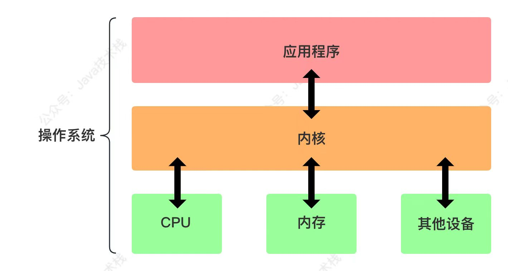

##### 1、应用程序层

这一层包括应用程序和软件，这些应用程序依赖于操作系统提供的服务和资源，完成各种任务。

##### 2、内核层

内核是操作系统的核心部分，它直接与硬件交互并管理各种系统资源。

##### 3、硬件层

这是操作系统底层的物理硬件层，包括中央处理器（CPU）、内存、外部设备（如磁盘、键盘、显示器、鼠标等）、总线和通信接口，操作系统必须管理和控制这些硬件资源以提供高效的计算环境。

### 6、什么是实时操作系统？

实时操作系统（）是一种专门设计用于满足实时性要求的操作系统。

实时性指的是：**在特定时间限制内对事件或任务做出相应的能力**，实时操作系统旨在确保在严格的时间限制内执行任务，不会有较高的延时，以满足特定应用程序或系统的实时性需求。

实时操作系统广泛应用于自动控制系统、嵌入式系统、工业自动化、航空航天、医疗设备、交通控制、通信设备、机器人技术和多媒体处理等领域，不同类型的实时操作系统适用于不同的应用，因为它们对于响应时间和可靠性的要求有所不同。

### 7、软件与硬件交互的方式有哪些？

软件与硬件交互的方式多种多样，取决于应用程序、硬件设备和操作系统的特性。

以下是软件与硬件交互的主要方式：

##### 1、系统调用

操作系统提供一组系统调用，允许应用程序通过操作系统间接访问硬件资源，这些系统调用包括文件操作、网络通信、进程控制等。

##### 2、驱动程序

硬件设备通常需要特定的驱动程序，它们是操作系统的组成部分，用于为应用程序提供硬件访问接口，驱动程序充当硬件和操作系统之间的中间层。

##### 3、直接内存访问（DMA）

一些高性能硬件设备支持DMA，这允许硬件设备绕过CPU直接访问系统内存，以提高数据传输速度。

##### 4、I/O端口：

一些计算机系统使用I/O端口来访问硬件设备，应用程序可以通过读写特定的端口来与硬件设备通信。

等等。。。

### 8、为什么Linux应用程序不能直接在Windows下运行？

以下是一些主要原因：

##### 1、内核不同

Linux和Windows使用不同的操作系统内核，这两个内核的设计、架构和系统调用接口都不同，因为两者无法兼容。

##### 2、二进制格式不同

Linux应用程序通常以ELF（Executable and Linkable Format）格式编译，而Windows应用程序以PE（Portable Executable）格式编译，这两种格式不兼容。

##### 3、库依赖性

Linux和Windows的应用程序通常依赖于特定的库和共享对象文件，所以它们只能在自己的平台使用。

##### 4、系统调用和API

Linux和Windows拥有不同的系统调用和应用程序接口（API），所以两者不能兼容。

总之，Linux和Windows是两个不同的操作系统，它们的设计、架构和应用程序生态系统都不同，因此不能直接运行对方的应用程序。

### 9、什么是内核？

内核（Kernel）是操作系统的核心组成部分，他是一个运行在计算机内存中的管理和控制程序，主要负责管理计算机硬件资源、执行任务调度、提供系统服务、处理中断和异常等核心操作。

### 10、什么是内核态和用户态？

内核态和用户态是指操作系统运行中不同特权级别的两种执行环境，用于区分操作系统内核和用户应用程序之间的权限和访问级别，这两种模式具有不同的特征和访问权限。

##### 内核态

- 内核态是操作系统内核运行的特权级别，具有最高的系统权限，操作系统内核可以执行任何指令，访问所有的硬件资源和内存，包括保护和敏感的系统资源。
- 内核态允许操作系统执行关键任务，如管理硬件设备、执行系统调用、调度进程、分配内存、处理中断和异常等。

##### 用户态

- 用户态是应用程序运行的特权级别，具有较低的系统权限，应用程序只能执行受限的指令，无法直接访问大部分硬件资源和系统数据结构。
- 用户态允许应用程序执行普通任务，如数据处理、图形界面交互、文件操作等，而不能直接执行敏感操作或访问系统资源，必须通过系统调用（系统服务）来请求内核执行特定任务，系统调用是用户态和内核态之间的接口。

操作系统的内核代码运行在内核态，而用户程序的代码运行在用户态。

### 11、为什么要分内核态和用户态？

内核态和用户态分离的好处：

- 内核代码在内核态下运行，可以执行高风险和关键的任务；
- 应用程序代码在用户态下运行，不会对系统的稳定性产生直接影响；

所以，这种分离有助于维护操作系统的稳定性、安全性和可靠性，避免应用程序的错误和恶意行为对整个系统造成损害。

### 12、用户态和内核态如何切换？

用户态只能执行用户代码，而当应用程序需要处理关键任务时，比如：从硬盘读取数据、和外部设备交互等，这些都是内核态的权限，所以就必须切换到内核态（也叫做：**陷入内核**），内核态处理完再切换回用户态。

用户态和内核态切换的几种方式：

##### 1、系统调用

用户态程序可以通过系统调用请求内核执行特定的操作。

系统调用是一种显式的用户态到内核态切换，用户程序通过特定的系统调用指令请求内核执行相应的任务，比如文件读写、网络通信、进程创建等。

##### 2、异常处理

当用户态程序执行时发生错误或违反了特定的规则时（比如访问未分配内存或执行非法指令），就会引发异常，这会导致处理器从用户态切换到内核态，以处理异常情况。

##### 3、硬件中断

内核态和用户态之间的切换可以通过硬件中断触发，比如，时钟中断、硬件设备中断、网络数据包到达等事件，可以引发内核进入内核态执行相关中断处理程序，然后再返回用户态。

### 13、什么是进程？

进程是操作系统中的基本概念，进程（Process）是计算机程序的执行实例，它代表了计算机中正在运行的程序，用于管理和调度程序的执行，操作系统通过进程管理实现了**资源的分配、并发执行、通信和协作**，从而实现了多任务处理。

进程的主要特性如下：

##### 1、独立实例

进程是应用程序的执行实例，一个程序可以被多个进程同时执行，每个进程拥有自己的内存空间、寄存器状态、栈和其他资源。

每个进程都有一个唯一的标识符，即进程ID（PID），用于操作系统识别和管理进程。进程之间是独立的，他们互相隔离，一个进程的错误或崩溃不会影响其他进程的正常运行。

##### 2、并发执行

操作系统可以同时运行多个进程，实现多任务并发执行，操作系统会分配处理器时间片，轮流执行各个进程。

##### 3、资源分配

进程是资源分配额最小单位，操作系统分配和管理进程所需的资源，包括内存、CPU时间、文件描述符、网络连接等。

##### 4、状态管理

进程可以处于不同的状态，包括就绪状态、运行状态、等待状态和终止状态，操作系统管理进程的状态转换和调度。

##### 5、通信和同步

进程之间可以通过进程间通信（Inter-Process Communication, IPC）机制进行数据交换和协作，IPC包括管道、共享管道、共享内存、消息队列、套接字等。

##### 6、父子进程

进程可以创建其他进程，创建进程的进程称为父进程，被创建的进程成为子进程，父进程可以监控和控制子进程。

### 14、进程由哪些部分组成？

进程由以下几个关键部分组成：

##### 1、进程控制块（PCB）：

PCB是操作系统中用于管理进程的数据结构，它包含了进程的状态、标识符（如进程ID）、调度信息、资源占用信息、打开文件表等，PCB使操作系统能够对进程进行管理和调度。

#### 2、程序代码

进程包含执行的程序代码，即程序的指令集合，这些指令定义了进程的操作和行为。

##### 3、数据

进程需要使用数据来执行任务，包括程序的变量、常量、数据结构等，数据存储在进程的内存空间中。

### 15、进程有哪几个状态？怎么流转的？

进程的几个状态是：

| 进程状态               | 描述 |
| ---------------------- | ---- |
| 创建状态（Created）    |      |
| 就绪状态（Ready）      |      |
| 运行状态（Running）    |      |
| 阻塞状态（Blocked）    |      |
| 终止状态（Terminated） |      |

进程状态之间的流转通常如下：

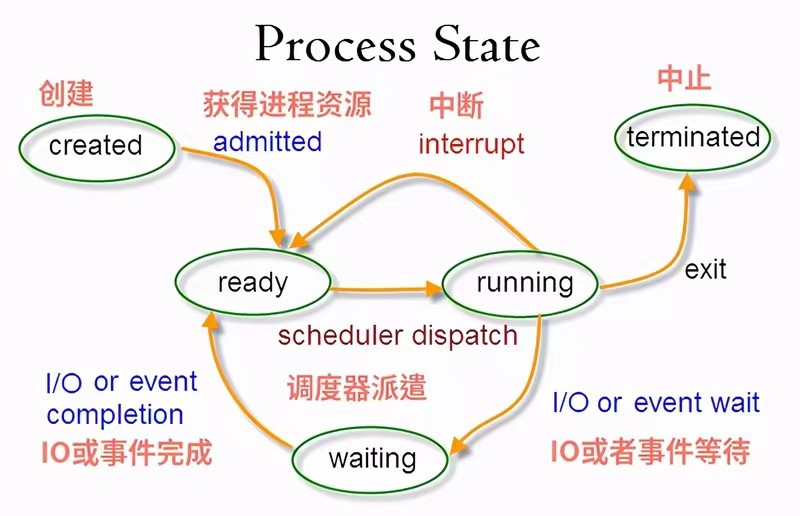

- **创建状态 -> 就绪状态**：当进程被初始化并准备好运行时，它从创建状态切换到就绪状态；
- **就绪状态 -> 运行状态**：操作系统的调度程序选择就绪状态的进程，并将其切换到运行状态，开始执行；
- **运行状态 -> 阻塞状态**：进程在等待某个事件发生时，会从运行状态切换到阻塞状态；
- **阻塞状态 -> 就绪状态**：一旦阻塞状态的进程等待的事件发生，它将切换回就绪状态，等待操作系统的调度；
- **运行状态 -> 终止状态**：当进程执行结束时，它从运行状态切换到终止状态。

### 16、进程的基本操作有哪些？

进程的基本操作如下：

| 操作           | 描述 |
| -------------- | ---- |
| 创建进程       |      |
| 等待进程       |      |
| 切换进程       |      |
| 修改进程优先级 |      |
| 分配和回收资源 |      |
| 挂起和恢复进程 |      |
| 终止进程       |      |

### 17、什么是进程表？

进程表是操作系统用于管理和维护系统中所有正在运行的进程信息，以便进行进程调度、资源分配、进程间通信等操作，操作系统可以确保多个进程能够同时运行，而不会发生冲突或混乱。

进程表是一个PCB数组，每个进程表项对应一个进程，包含该进程的各种信息：

| 属性             | 描述 |
| ---------------- | ---- |
| 进程ID（PID）    |      |
| 进程状态         |      |
| 程序计数器（PC） |      |
| 寄存器值         |      |
| 执行时间和优先级 |      |
| 父进程ID         |      |
| 打开文件列表     |      |
| 资源使用情况     |      |
| 等待队列         |      |
| 各种状态标志     |      |

### 18、什么是守护进程？

守护进程是操作系统中以后台方式运行的一种特殊类型的进程，守护进程通常在系统启动时启动，并在系统运行期间持续存在，以执行一些特定的任务或服务。

守护进程以无交互的方式运行，不予用户直接交互，而是在后台默默地执行任务。

典型的守护进程包括以下几个：

- 系统日志守护进程（syslogd）
- 网络服务守护进程（如：HTTP服务器、数据库服务器）
- 定时任务守护进程（cron）
- 硬件设备守护进程等。

### 19、什么是孤儿进程？

孤儿进程是指当**一个父进程提前终止或意外终止时，其子进程继续在系统中执行**，它们在处于没有父进程控制的情况下而存在，这些子进程被称为**孤儿进程**。

操作系统的**init**进程会接管孤儿进程，成为它们的新的父进程，**init**进程负责处理这些孤儿进程的终止，以释放它们占用的系统资源。

### 20、什么是僵尸进程？

僵尸进程指的是一个子进程已经终止了，**但其父进程还没有处理子进程的终止状态**，此时，**其退出状态信息仍然保留在系统中**，等待父进程获取，如果父进程未及时处理子进程的退出状态，操作系统的**init**进程会自动接管这些僵尸进程，以便清理它们的资源信息。

虽然僵尸进程不会再执行代码，但它们仍然存在于进程表中，占用极少的系统资源，一般不会导致系统性能下降。

### 21、什么是线程？

线程（Thread）时计算程序执行的最小单元，它是进程的一部分，用于执行程序的实际指令。在一个进程内，可以包含多个线程，这些线程共享相同的内存空间和资源，但可以单独执行不同的任务。

线程的主要特性如下：

##### 1、轻量级执行单元

线程是轻量级的执行单元，相比整个进程，线程的创建、销毁和切换开销较小，因此可以更高效地支持多任务并发执行。

##### 2、共享资源与通信

在同一进程中的线程共享相同的内存空间和资源，这使得线程之间可以相互通信和共享数据。

##### 3、并发执行

多个线程可以并发执行，它们在不同的CPU核心上或在同一核心上交替执行，提高了程序的响应速度和资源利用率。

##### 4、同步与互斥

线程之间的并发执行可能导致竟态条件和数据访问冲突。因此，线程需要使用同步机制（如互斥锁、信号量、条件变量）来协调堆共享资源的访问。

##### 5、优先级

操作系统调度器独立地调度线程的执行，不同线程可以具有不同的优先级，操作系统会根据优先级来决定现成的执行顺序。

##### 6、线程状态

线程可以处于不同的状态，包括就绪状态、运行状态、等待状态和终止状态，操作系统管理线程的状态转换和调度。

##### 7、用户态与内核态切换

线程可以在用户态和内核态之间切换，当线程需要执行特权操作（如系统调用）时，会从用户态切换到内核态。

### 22、线程可以分为哪两种？

##### 1、用户级线程：

- 用户级线程完全在用户空间中管理，操作系统内核不会参与它们的调度和管理；
- 由于用户级线程管理不需要内核模式的切换，所以具有更低的开销；
- 由于用户级线程没有内核参与，所以并发效率没有内核级线程高；

##### 2、内核级线程：

- 内核级线程有操作系统内核进行管理和调度；
- 由于内核级线程管理需要切换内核态，所以增加了一定的开销；
- 由于内核可以将不同内核级线程更好地分配到不同的CPU上，所以并发效率要更高；

在现代操作系统中，通常会使用组合方式实现多线程，即用户级线程完全在用户空间中创建，并且一个应用程序中的多个用户级线程可以被映射到一些内核级线程上，以实现更优的性能。

### 23、什么是上下文？

上下文（Context）是指进程（或线程）的运行环境，它描述了一个线程或进程当前执行状态和环境的一组信息，包括了程序运行所需的寄存器状态、内存分配、变量值、CPU指令执行位置等，以便系统可以在需要时暂停、恢复或切换执行。

上下文大概包括以下内容：

- 寄存器状态：包括通用寄存器、程序计数器（PC）等，这些寄存器保存了程序的运行状态和执行位置；
- 内存映射：描述了程序或进程的内存分配，包括代码段、数据段、堆栈等；
- 变量值：包括程序中的各种变量、数据结构和内容以及执行过程中的临时数据；
- 堆栈信息：描述了函数调用栈，包括当前函数的参数、局部变量和返回地址；
- 打开文件和网络连接：描述了程序打开的文件、套接字连接以及其他I/O资源；

### 24、什么是上下文切换？

因为一个CPU核心在任意时刻只能被一个线程使用，而CPU的资源是有限的，并发执行的线程数可能远远超过CPU核心数，所以，为了让这些线程都能得到有效执行，**有时需要将CPU资源从一个进程（线程）切换到另一个进程（线程），这便是上下文切换（Context Switching）**。

当进行上下文切换时，操作系统会将当前执行的进程（线程）状态保存起来，并恢复另一个进程（线程）的状态，以实现多进程（线程）之间的切换执行，用于确保多个进程（线程）可以共享处理器的时间，以实现并发执行。

上下文切换一般分为线程切换和进程切换，两者的差异主要体现在资源消耗上，进程上下文切换无疑要更高，另外，上下文切换会消耗大量的CPU时间和内存操作，所以要尽量避免减少上下文切换，以提高系统的性能和响应速度。

### 25、怎么查看上下文切换情况？

##### 1、vmstat

使用vmstat命令可以查看系统总体的上下文切换情况：

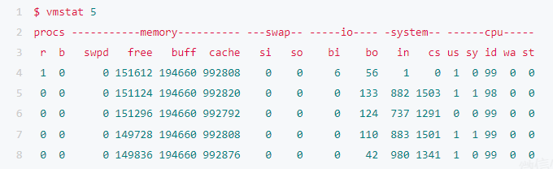

参数解释：

| 列名 | 含义 |
| ---- | ---- |
|      |      |
|      |      |
|      |      |
|      |      |
|      |      |
|      |      |
|      |      |
|      |      |
|      |      |
|      |      |
|      |      |
|      |      |
|      |      |
|      |      |
|      |      |
|      |      |
|      |      |
|      |      |

##### 2、pidstat

vmstat命令只能看到系统总体的上下文切换情况，如果要查看每个进程的纤细情况，可以使用**pidstat**命令，pidstat是著名的采集软件**sysstat**的组件之一，用于监控全部或指定进程的CPU、内存、线程、设备IO等系统资源的占用情况。

首先安装sysstat

> $ sudo yum install sysstat

然后使用pidstat -w命令查看：

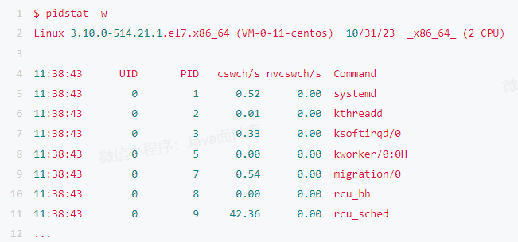

参数解释：

- **cswch（voluntary context switches）**：

  表示每秒**自愿上下文切换**的次数，即进程无法获取所需资源时所导致的上下文切换次数。

- **nvcswch （non voluntary context switches）**：

  表示每秒**非自愿上下文切换**的次数，即进程由于时间片已到等原因，被系统强制进行的上下文切换次数。

### 26、如何避免上下文切换？

上下文切换是操作系统中的必要操作，不能完全避免，但是可以尽量避免。

下面一些常见的优化技巧：

##### 1、调整线程数量

建议将系统的线程数调整到合适的水平，过多的线程会消耗更多CPU资源，增加上下文切换的概率。相反，如果线程过少，也无法充分利用CPU资源，造成资源浪费。

##### 2、使用线程池

使用线程池来管理线程的创建和销毁，减少线程的频繁创建和销毁。

##### 3、使用非阻塞IO

使用非阻塞IO操作，例如异步IO或事件驱动编程，可以减少在IO操作中的等待时间。

##### 4、合理调度

使用合适的调度算法，确保高优先级任务能够及时执行。

##### 5、减少锁竞争

少使用同步锁，或者使用无锁数据结构来减少多线程之间的锁争用。

### 27、为什么进程上下文切换比线程上下文切换代价高？

##### 不同内存空间：

- **进程**：每个进程有自己的独立的虚拟内存空间，进程上下文切换会改变内存空间的映射，另外也需要保存和恢复更多的状态信息；
- **线程**：线程是进程内的轻量级执行单元，共享相同的内存空间，线程上下文切换不需要改变内存空间的映射，因此，线程的内存空间依然是相同的，涉及的状态信息也要更少。

##### 内核介入程度：

- **进程**：进程上下文切换涉及更多的操作系统内核级操作；
- **线程**：线程上下文切换更轻量级，尤其是用户线程，可能完全不需要内核的介入。

##### 缓存和局部性：

- **进程**：因为不同进程的数据和代码位于不同的内存区域，进程上下文切换可能导致缓存和TLB失效；
- **线程**：线程上下文切换由于仍在同一进程内部，所以更可能保持缓存和TLB的有效性。

### 28、什么是临界资源和临界区？3

##### 临界资源：

临界资源是指一次仅允许一个进程使用的共享资源，多个进程必须互斥对它进行访问，如某进程占用了临界资源，其他进程就会被阻塞直到临界资源被释放。

临界资源包括硬件临界资源和软件临界资源，如：**共享内存区域、文件和数据库连接、硬件设备、系统资源和服务**等。

##### 临界区：

临界区是指每个进程中访问临界资源的那段代码。

### 29、系统调用与库函数的区别？

系统调用和库函数，它们是用于访问操作系统和执行特定任务的两种不同方式。

##### 系统调用：

系统调用是应用程序与操作系统之间的接口，用于请求操作系统执行特权操作，例如文件操作、进程管理、网络通信等。系统调用允许应用程序访问底层的系统资源和功能，如内核态。

##### 库函数：

库函数是由编程语言或第三方库提供的函数，用于执行特定任务，如字符串操作、数学计算、图形处理等。库函数通常是在用户态运行的，它们是使用高级语言编写的常规函数。

-----

它们的区别如下：

##### 权限控制：

- **系统调用**：系统调用通常涉及特权操作，需要进行用户态到内核态的切换。因此，系统调用需要操作系统的授权，并受到操作系统的权限控制；
- **库函数**：库函数通常在用户态运行，不需要特权访问，可以直接由应用程序调用，它们不会引发用户态到内核态的切换，因此不涉及操作系统的权限控制。

##### 调用性能：

- **系统调用**：由于系统调用涉及内核态和用户态之间的切换，所以会比库函数更影响性能；
- **库函数**：库函数通常在用户态运行，因此调用它们通常比系统调用更快速，并且更轻量级。

##### 使用场景：

- **系统调用**：通常用于访问操作系统提供的底层功能，如文件操作、进程管理、网络通信等，它们通常用于实现高级功能或解决操作系统级别的问题；
- **库函数**：用于执行通用任务，如数据处理、算法实现、用户界面开发等，它们通常用于构建应用程序的核心功能。

### 30、静态链接库与动态链接库的区别？

##### 链接时机：

- 静态链接库在程序编译时，将静态链接库的全部指令直接链接入可执行文件中，程序包含了它所需的所有代码；
- 动态链接库只有在程序运行时才被加载，可执行文件仅包含对动态库函数的引用，而不是函数的实际代码。

##### 相互包含：

- 静态链接库中不能包含动态链接库或静态链接库；
- 动态库中还可以再包含其他动态链接库和静态链接库。

##### 文件体积：

- 静态链接库被编译进可执行文件中，所以可能会导致程序文件体积较大；
- 动态链接库的库文件是分开存储的，并且在需要时有多个程序共享，所以不会导致程序文件体积太大。

##### 更新和维护：

- 更新静态链接库，所有使用该库的程序都需要重新编译和链接；
- 更新动态链接库更加灵活，只需替换库文件本身，使用给库的程序再下次运行时会加载新的库版本。

##### 依赖和分发：

- 静态链接库生成的可执行文件不依赖于外部库文件， 编译分发和运行；
- 动态链接库的程序需要确保运行环境中由正确版本的库文件，如果缺少，程序可能无法运行。

##### 运行时性能：

- 静态链接库再编译时就已经和程序代码一起优化，性能通常比动态链接库要好；
- 动态库可能在加载时稍微慢一些，但对于系统资源的总体占用来说可能更高效。

### 31、什么是信号？

在操作系统中，信号是一种轻量级的进程间通信机制，用于向进程发送异步通知或中断。

信号通常用于处理异步事件，如用户输入、硬件异常、系统状态变换等，操作系统和其他进程可以向目标进程发送信号，以触发特定的动作或通知进程发生了某种事件。

比如在Linux系统中，kill命令就可以向进程发送信号，并可指定信号类型，用于终止或管理正在运行的进程。

### 32、什么是时钟？

时钟又称为计时器，主要负责维护时间。

操作系统中的时钟通常有两种主要类型，操作系统会利用这两种时钟来管理时间，以确保计算机系统正常运行并提供时间相关的服务。

##### 1、系统时钟

系统时钟是操作系统内部使用的时钟，它用于测量时间和协调系统内部的活动。

- 时间管理：系统时钟用于跟踪系统的时间，记录时间戳、计算时间间隔等。
- 电源管理：系统时钟也在电源管理中发挥作用，帮助操作系统管理计算机调的节能模式和唤醒机制。
- 时钟中断：系统时钟周期性地触发时钟中断，操作系统会捕获这个中断并执行相应的处理程序。

##### 2、硬件时钟

硬件时钟是一种物理设备，通常是计算机主板上的一个独立芯片，它用于持久性地跟踪实时的日期和时间，即使计算机关闭也能保持准确。

硬件时钟通常用于操作系统启动时初始化系统时间，并在需要时提供准确的时间信息。

### 33、什么是中断？

中断时操作系统中的一种事件，它是由硬件设备、外部信号或软件请求引发的，用于打破正常的程序执行流程，以通知操作系统或处理器需要采取某种特殊的处理动作。

中断的目的时允许计算机系统对外部事件进行响应，例如处理硬件设备的输入/输出、处理异常条件、进行系统调度等，等这些特殊事件处理完之后再回去执行之前的程序。

中断通常可以分为两种主要类型：

- 硬件中断：由外部硬件设备生成的中断，例如时间中断、键盘中断、磁盘中断等；
- 软件中断：由正在运行的程序或操作系统内部生成的中断，包括系统调用和异常处理。

中断允许计算机系统在不同的上下文之间切换，以处理紧急事件或执行特殊任务，然后再返回到原始的执行上下文，这种切换可以确保系统能够有效地管理多个任务并响应外部事件，使计算机系统更加灵活和高效。

### 34、中断和异常的区别？

中断和异常都是系统在执行过程中，对特殊情况的响应机制。

##### 中断：

中断时操作系统中的一种事件，它是由硬件设备、外部信号或软件请求引发的，用于打破正常的程序执行流程，以通知操作系统或处理器需要采取某种特殊的处理动作。

##### 异常：

异常则一般是由程序执行过程中的错误或特殊情况引起的，比如数组越界、内存溢出等异常，需要由操作系统或程序本身来处理。

### 35、什么是时间片？

时间片用于划分CPU时间，即**CPU分配给每个进程或线程的固定时间段**，即每个进程或线程在执行时最多可以占用CPU时间片的时长，然后必须让出CPU资源，以便多个任务能轮流执行，从而实现并发执行，确保了系统的响应性和公平性。

如果进程（线程）在时间片结束后还在运行，或者在时间片过期前阻塞或终止了，CPU都会让出资源。

### 36、进程调度的时机有哪些？ 

进程调度的时机一版有以下几种：

##### 1、进程创建

当一个新进程被创建时，操作系统需要决定何时将其放入就绪队列以等待CPU执行，这是一个初始的进程调度时机。

##### 2、进程终止

当一个进程完成它的任务或发生错误而终止时，操作系统需要选择一个要运行的进程。

##### 3、时间片用尽

在使用时间片轮转调度算法时，一个进程再分配的时间片用尽后，会被挂起并放回就绪队列。此时，调度程序需要选择下一个要运行的进程。

##### 4、阻塞/唤醒

- 当一个进程执行IO操作或等待某些事件发生时，它会从运行状态切换到阻塞状态，操作系统需要选择一个新的就绪进城来执行；
- 当一个被阻塞的进程等待的事件发生，它将从阻塞状态转换为就绪状态，等待进一步调度。

##### 5、抢占条件

在抢占性调度中，操作系统可以选择中断当前运行的进程，将CPU分配给更高优先级的进程。

### 37、常见的调度算法都有哪些？

下表是一些常见的调度算法：

| 调度算法               | 类型            | 特点 |
| ---------------------- | --------------- | ---- |
| 先来先服务调度算法     | 非抢占式        |      |
| 最短作业优先调度算法   | 非抢占式        |      |
| 最短剩余时间调度算法   | 抢占式          |      |
| 高响应比优先级调度算法 | 抢占式          |      |
| 时间片轮转调度算法     | 抢占式          |      |
| 多级反馈队列调度算法   | 抢占式          |      |
| 最高优先级优先调度算法 | 非抢占式/抢占式 |      |

### 38、怎么理解抢占式和非抢占式？

**”抢占式“**和**”非抢占式“**是操作系统中两种不同的进程调度策略，它们决定了在多个就绪进程之间如何分配CPU时间，这两种策略的核心在于弄清楚何时一个正在执行的进程可以被中断，以便其他进程有机会执行。

##### 抢占式：

- 抢占式调度允许操作系统随时中断正在执行的进程，将CPU分配给其他高优先级进程。
- 抢占式调度常用于多任务操作系统，以确保及时响应高优先级任务，同时防止低优先级任务长时间占用CPU。

##### 非抢占式：

- 非抢占式调度不会在进程执行期间中断它，而是等待进程主动放弃CPU控制权，或等待发生阻塞事件。
- 非抢占式调度常用于实时操作系统，其中任务有确定的执行时间，确保任务执行的确定性。

### 39、影响进程调度算法的指标有哪些？

下表是影响进程调度算法的主要指标：

| 指标      | 描述                           |
| --------- | ------------------------------ |
| CPU利用率 | CPU执行任务所占的时间百分比    |
| 吞吐量    | 单位时间内CPU完成进程的数量    |
| 等待时间  | 进程处于等待处理机状态的总时间 |
| 周转时间  | 进程提交最终完成执行的总时间   |
| 响应时间  | 用户提交请求到获得响应的总时间 |

### 40、不能进行进程的调度与切换的情况有哪些？

一般有以下三种情况：

##### 1、当操作系统处理中断时

中断通常代表着紧急事件或硬件状态的改变，系统必须尽快响应，这个过程设计复杂的任务，所以，不能进行进程的调度与切换，以确保系统的正常运行。

##### 2、当进程位于操作系统的内核程序临界区时

此时进程可能正在访问一些共享资源，这些资源需要保存一致性，所以，不能进行进程的调度与切换，以确保对共享资源的独占性访问。

##### 3、在原子操作过程中

原子操作是一种不可分割的操作，它要么完全执行，要么完全不执行，没有中间状态，所以，不能进行进程的调度与切换，必须一气呵成，以保持数据的可靠性。

### 41、什么是优先级反转问题？如何解决？

优先级反转：低优先级的线程优先于高优先级的线程先执行，具体来说，当多线程在共享资源时，导致高优先级线程迟迟得不到调度，反而使其他低等优先级的线程却能抢到CPU资源而先执行。

以下是两种解决方案：

##### 1、优先级继承

当一个低优先级线程占用了一个高优先级线程需要的共享资源时，系统会将低优先级线程的优先级提高到与高优先级线程相同或更高的级别，以确保高优先级线程能够及时完成。一旦低优先级线程释放了资源，它的优先级将被还原到原始值。

##### 2、优先级天花板

当线程使用共享资源时，不管该线程是否阻塞了高优先级的线程，把该线程的优先级提升到可访问这个资源的所有线程中的最高优先级，即该资源的优先级天花板。

### 42、什么是虚拟内存？

虚拟内存是计算机操作系统中的一个管理和扩展物理内存的技术，它通过将**物理内存和磁盘空间结合使用**，用磁盘来模拟内存空间，即将内存中使用较少的数据移动到外部磁盘存储器中，以释放其内存空间供其他程序使用，当物理内存不足时，系统可以从虚拟内存中读取数据，并将其写回虚拟内存以腾出更多空间。

虚拟内存的主要目的是**提高系统的稳定性和多任务处理能力**，为每个进程提供了一种具有更大连续内存碎片，还有部分暂时存储在外部磁盘存储器上，在需要时进行数据交换。

### 43、物理地址和虚拟地址的区别？

物理地址和虚拟地址是计算机内存管理中不同的两个概念。

##### 物理地址：

物理地址是实际存在于计算机硬件内存芯片上的唯一地址，它可以直接访问硬件中的存储单元。

物理地址是固定的，并且受到物理内存大小的限制。

##### 虚拟地址：

虚拟地址是进程或程序所使用的地址，它是逻辑地址，不能直接访问硬件中的存储单元。虚拟地址是任意的，不受物理内存大小的限制。

操作系统可以使用内存管理单元（）将虚拟地址映射到物理地址，当程序访问虚拟地址时，实际上访问的是物理地址。

### 44、虚拟内存实现有哪几种方式？

虚拟内存实现主要有以下几种方式：

##### 1、分页

物理内存和虚拟内存被分成固定大小的页（），进程的虚拟内存空间也被划分成相同大小的页面，操作系统通过页表来跟踪哪些页在物理内存中，哪些页在磁盘上，当进程访问虚拟内存中的某一页时，操作系统将相应调的物理页加载到内存中。

##### 2、分段

它将程序的不同部分（如函数、数组等）划分为逻辑上的段（Segment），每个段都可以有不同的大小，分段皆在使程序和数据的组织更加符合其逻辑结构，从而提高效率。

##### 3、段页式

这种方式结合了分段和分页的特点，虚拟内存空间首先被划分成固定大小的页，这种方式允许更灵活地管理不同类型的数据，同时提供了粒度更细的地址映射。

### 45、虚拟内存是越大越好吗？

虚拟内存的大小并不一定是约到越好，而是需要根据具体的应用场景和系统需求来合理配置。

过大的虚拟内存可能会导致性能下降，因为虚拟内存是通过外部磁盘来模拟内存空间的，而磁盘的读写速度远比内存要慢得多，所以，**当虚拟内存过大时，就会导致操作系统频繁地与磁盘交换数据，从而影响性能。**

### 46、内部碎片与外部碎片的分别？怎么解决？

内部碎片和外部碎片都是与内存分配和管理相关的概念，通常出现在操作系统和内存管理系统中，这些内存碎片会降低内存的有效利用率，有效地管理内存碎片对于确保内存的高效使用和系统性能至关重要。

##### 内部碎片

----

内部碎片，指的是分配给进程的内存块中存在但未被使用的内存部分。

这种浪费的内存是由于进程所请求的内存大小通常以固定的块或页面为单位分配，而进程实际需要的内存可能小于分配的块大小。所以，未被使用的部分构成了内部碎片。

> 比如，如果一个进程请求了1MB的内存，但实际只使用了900KB，那么有100KB的内部碎片。

解决内部碎片的方法通常包括内存分配策略，如使用动态分区分配或首次适应算法等，以更好地匹配进程的内存需求。

##### 外部碎片

----

外部碎片，指的是在物理内存中存在但无法分配给任何进程的内存块或碎片。

外部碎片通常是由于内存分配和释放的不规则性或动态性而产生的，即使总的可用内存足够，但由于内存块之间存在零散的未使用内存，导致无法满足某些进程的内存需求。

> 比如，如果物理内存中有大量散落的未使用内存块，但它们都太小以至于无法满足某个大型进程的内存请求，这就导致了外部碎片。

解决外部碎片的方法包括内存紧缩、内存合并或使用虚拟内存等技术，以优化可用内存块的分配。

### 47、什么是页面置换？

页面置换算法是用于虚拟内存管理中的一种策略，虚拟内存允许操作系统在物理内存不足的情况下运行更多的进程，但由于物理物理内存是有限的，操作系统不可能将所有进程的所有页面都加载到内存中。

所以，当一个进程访问了一个未加载到内存中的页面，并且内存已经满了时，**操作系统需要从内存中替换一个页出去，并从磁盘加载一个新页面**，这便是页面置换。

### 48、常见的页面置换算法有哪些？

常见的页面置换算法：

##### 1、先进先出页面置换算法（FIFO）

先进先出，即置换最早进入内存中的页面。

这种算法实现简单，缺点就是置换出去的页面也能是经常要被访问的。

##### 2、最近最少使用页面置换算法（LRU）

最近最少使用，即置换最近最久未被访问的页面。

这种算法需要维护一个页面访问历史记录，实现稍微要复杂一点，但性能较好。

##### 3、最不常用页面置换算法（LFU）

最不常用，即置换访问次数最少的页面。

这种算法需要维护页面的访问计数，缺点就是开销较大，另外，前期访问较多后期没有访问的页面很难被置换。

### 49、什么是写时复制？

写时复制是一种内存管理技术，其核心思想是在某个进程需要修改共享资源时，才进行实际的复制，而在只读或未修改的情况下则不用复制，继续使用共享资源，旨在提高资源的利用效率和减少复制数据的开销。

写时复制通常用于共享数据结构，例如字符串、列表、树等，当多个进程需要访问相同的数据时，写时复制可以提供高效的共享和修改保护，确保数据的一致性和安全性。

##### 写时复制的工作原理：

- 初始阶段，多个进程或线程共享一个资源；
- 当有一个进程需要修改这个共享资源时，不会直接进行修改，而是首先创建该资源的一份副本，即复制一份独立的资源；
- 原始资源和副本资源不再共享相同的内存区域，修改操作只应用于副本资源；
- 其他进程继续使用共享资源，而不受影响。

写时复制的好处包括：

- **节省内存**：在资源被修改之前，多个进程可以共享相同的资源，无需复制多份相同的数据；
- **高效性**：只有在需要修改资源时才进行复制，减少了复制的开销；
- **数据一致性**：资源的修改不会影响其他进程对相同资源的访问，因为它们访问的是不同的副本；

### 50、什么是按需分页？

进程是以页为单位加载到内存中的，操作系统不会一开始将进程的所有页面加载到物理内存中，只有在进程实际需要访问某个页面时，才将该页面加载到物理内存中。

这种方式减少了初始加载的开销，提高了内存利用率，但可能会导致性能开销，因为每次页面错误都需要访问磁盘。

### 51、什么是懒分配？

操作系统在分配内存时不会立即分配物理内存页，只有在进程实际访问这些分配时，才分配物理内存页。

这种方式减少了初始内存分配的开销，特别是对于大型数据结构，提高了内存分配的效率，但可能会在访问分配时引发页面错误，需要额外的处理。

# Linux 121

### 1、Linux是什么？

Linux全称：GNU/Linux，是一种自由和开放源码的类Unix操作系统。

Linux继承了Unix以网络为核心的设计思想，是一个性能稳定的多用户网络操作系统。

### 2、Linux和Unix的区别？

##### 1、开源情况

Unix是商业不开源的，核心并不公开；

Linux是免费开源的，源代码公开自由使用。

##### 2、硬件适用

在硬件方面，Linux要求比Unix要低，没有Unix那么苛刻，Linux安装比Unix更容易。

Unix系统大多是与硬件配套的，也就是说，大多数Unix系统如AIX、HP-UX等是无法安装在x86服务器和个人计算机上的，而Linux则可以运行在多种硬件平台上。

### 3、Linux系统有哪些优势？

##### Linux系统有以下6个优势：

1、跨平台的硬件支持

2、丰富的软件支持

3、多用户多任务

4、可靠的安全性

5、良好的稳定性

6、完善的网络功能

7、支持良好的界面

### 4、Linux怎么查看内核版本？

##### 1、cat /proc/version

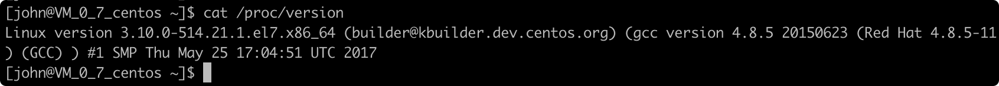

##### 2、uname -a

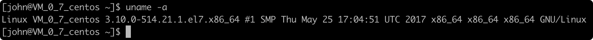

### 5、RedHat、CentOS、Ubuntu有什么区别？

CentOS是RedHat的重编译、修复后的免费版本，两者使用同样的源代码，RedHat是商业版本，需要付费使用，而CentOS则是免费使用。

CentOS并不包含封闭源代码软件，追求稳定，娱乐性不多，适合服务器、老手使用。

Ubuntu是一个以桌面应用为主的Linux开源操作系统，属于Debian系，软件管理deb，apt-get，更新频繁，软件多，有自带商店，可以从商店里直接下载，界面友好，适合新手入门。

### 6、Linux的体系结构是怎样的？

如图：


Linux的体系结构可以分为两大块：

##### 1、用户空间（User Space）

用户空间又包括：

- 用户的应用程序（User Applications）
- C库（C Library）。

##### 2、内核空间（Kernel Space）

内核空间又包括：

- 系统调用接口（System Call Interface）
- 内核（Kernel）
- 平台架构相关的代码（Architecture-Dependent Kernel Code）

### 7、Linux内核是指什么？主要功能是？

如图所示：

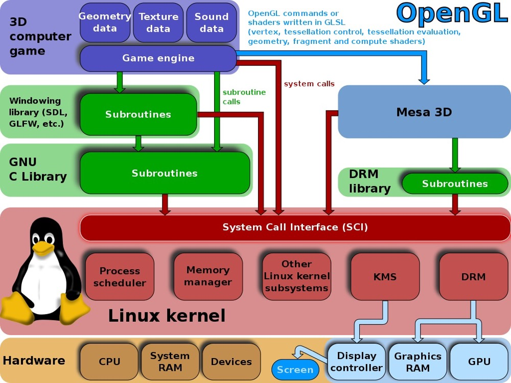

**Linux内核是指：Linux Kernel**，它是Linux操作系统的主要组件，也是计算机硬件与其进程之间的核心接口，它负责两者之间的通信，还要尽可能高效地管理资源。

##### Linux内核有4个主要功能：

- 内存管理
- 进程管理
- 设备驱动程序
- 系统调用和安全防护

### 8、Linux和Windows正反斜杠的区别？

Windows：

> "/"是表示参数，"\"是表示本地路径

Linux：

> "/"表示路径，"\"表示转义。

### 9、Linux环境变量配置有哪几种方式？

环境变量配置文件

| 用户       | 环境变量配置文件                                   |
| ---------- | -------------------------------------------------- |
| 所有用户   | /etc/profile/<br/>/etc/bashrc<br/>/etc/environment |
| root       | /.bashrc/.bash-profile                             |
| 非root用户 | /home/非root用户名/.bashrc                         |

更新环境变量

> source /etc/profile
>
> or 
>
> .  /etc/profile

### 10、Linux如何查看、修改hosts？

文件路径：/etc/hosts

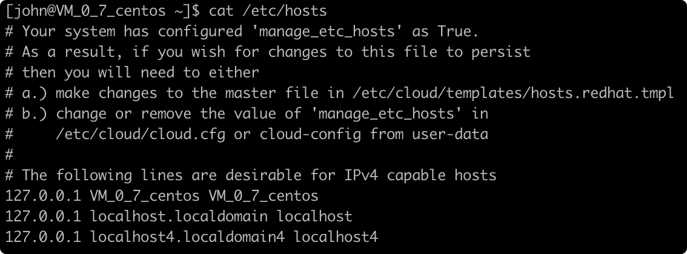

### 11、Linux怎么查看、修改主机名？

查看主机名：

> $ hostname
>
> iZwz9a0zvcp4lincq62kekZ

修改主机名：

> $ sudo vim /etc/hostname

修改后需要重启生效：

> $ sudo reboot

### 12、Linux怎么查看当前系统时间？

使用`date`命令。

### 13、Linux安装软件有哪几种方式？

##### Linux系统下安装软件一般有3种方法：

##### （1）rpm工具

redhat package manager，手动安装，难点在于包的依赖关系。

rpm包类似于Windows下的.exe文件，安装路径和文件名基本都是固定的。

> rpm -ivh [rpm完整包名]

##### （2）yum工具

Python开发出来的工具，操作对象rpm包，能自动解决软件包的依赖关系，是最常用的方式。

> yum install -y [包名简称]

##### （3）源码包

需要通过编译器把该源码包编译成可执行的文件，安装难度大。

> ./configure----> make--->make install

### 14、Linux怎么查看某个命令的全路径？

使用`which`命令，比如：

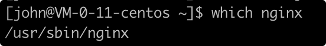

也可以使用`whereis`命令。

### 15、Linux怎么查看一个命令的使用手册？

使用`man`命令：

> man nginx

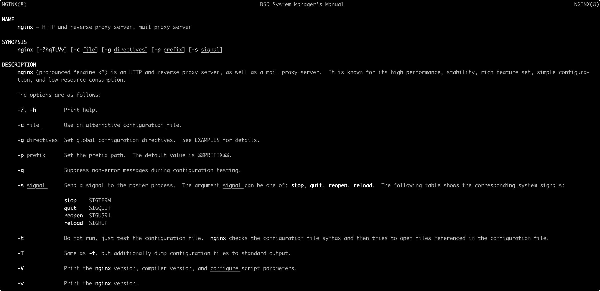

或者也可以使用`--help`，比如：

> ls --help

### 16、Linux怎么查看某个命令的相关文件全路径？

使用`whereis`命令：

> whereis nginx

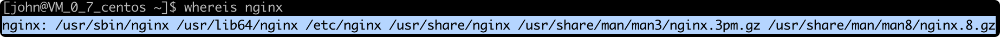

### 17、Linux普通用户怎么以管理员身份执行？

Linux中的sudo命令以系统管理者的身份执行指令，也就是说，经由sudo所执行的指令就好像是root亲自执行。

##### 天骄sudo权限：

> vim /etc/sudoers

```    
### Allow root run any commands anywhere
root   ALL=(ALL)    ALL
slq    ALL=(ALL)    ALL
# sudo  不用输入密码
# slq  ALL=(ALL)  NOPASSWD: ALL
```

使用的时候在命令前面加上sudo即可。

### 18、Linux命令su和sudo的区别？

su是用来切换用户的，需要输入目标用户的密码。

sudo则可以通过root的身份执行命令，只需要输入自己的密码，而不需要root的密码，可以用来保护root密码不被公开。

### 19、Linux的root和home目录有什么不同？

##### /root：

系统管理员的主目录

##### /home：

普通用户的主目录，比如普通用户R的主目录就是：/home/R

### 20、Linux系统root和普通用户的区别？

root属于独一无二的超级管理员，root用户拥有所有的系统权限；

普通用户则有很大的权限限制，很多操作都需要以root的身份执行。

### 21、Linux怎么区分root和普通用户？

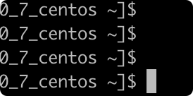

$：表示普通用户

#：表示root用户

### 22、Linux怎么切换用户？

1、切换用户的命令为：su username

2、从普通用户切换到root用户，还可以使用命令：sudo  su

### 23、Linux怎么修改用户密码？

使用passwd命令，如修改当前用户密码：

> $ passwd

修改指定用户密码（使用sudo或者切换到root用户才行）：

> $ sudo passwd  username

### 24、Linux中的bash是什么？

bash是Bourne Again Shell的缩写，是Linux默认的标准shell，也是大家常说的系统内核。

bash也是Unix/Linux上常见的Shell脚本解释器，既然bash是标准的shell，那么就有非标准的sh，csh，ksh等等，我们常说有多少种Shell，其实说的是Shell脚本解释器，Shell是一种脚本语言，那么，就必须有解释器来执行这些脚本，bash是基于Bourne Shell创建的，并且吸收了C Shell和Korn Shell的一些特性，而且bash完全兼容sh，也就是说，用sh写的脚本可以不加修改的在bash中执行。

### 25、Linux中的Shell是什么？

Shell是一个用C语言编写的程序，它是用户使用Linux的桥梁。

Shell既是一种脚本语言，又是一种程序设计语言，一般称为：Shell脚本，用来在Linux系统中处理任务。

### 26、Linux常用的文件目录都有哪些？

如表所示：

| 目录   | 描述                           |
| ------ | ------------------------------ |
| /      | 表示root文件系统顶级目录       |
| /bin   | 包含用户的可执行文件           |
| /boot  | 包含启动Linux系统所需信息      |
| /dev   | 连接系统的硬件设备文件目录     |
| /etc   | 本地系统配置文件目录           |
| /home  | 用户主目录所在顶级目录         |
| /lib   | 包含启动系统所需要的共享库文件 |
| /media | 挂载外部可移动设备             |
| /mnt   | 普通文件系统的临时挂载         |
| /opt   | 可选文件目录                   |
| /root  | 表示root用户的主目录           |
| /sbin  | 系统二进制文件                 |
| /tmp   | 临时目录                       |
| /usr   | 用户可共享的文件目录           |
| /var   | 可变数据文件存储目录           |

### 27、Linux中的文件系统怎么理解？

在Linux系统中，可以把一切资源都看作是一种**文件**，比如：网络接口卡、磁盘驱动器、打印机、输入输出设备、普通文件或是目录等，它们都被看作是一个文件。

Linux文件系统是一种树状结构：


顶层目录是：/

### 28、Linux怎么显示目录下的文件？

##### 使用`ls`命令：

> ls  [选项]   目录名称

##### 常用选项有：

-a：显示全部的文件

-l：列出文件和目录信息

-t：以时间排序

### 29、Linux中ll和ls命令的区别？

ll：列出当前文件或目录的详细信息，含有时间、读写权限、大小、时间等信息。

ls：仅列出当前文件名或目录名

##### ll是”ls -l“的别名，可以理解为ll和ls -l的功能是相同的。

### 30、Linux怎么以树形结构展示目录内容？

使用`tree`命令，如果没有则需要安装：

> yum -y install tree

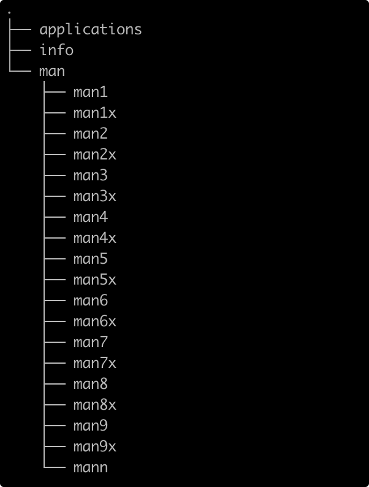

### 31、Linux怎么挂载一个cdrom？

将光盘插入cdrom，Linux并不会自动挂载，必须使用mount命令来完成挂载，mount用于挂载Linux系统外的文件。

```
mkdir  -p  /mnt/cdrom
# o auto、-o  noauto：打开/关闭自动挂上模式
mount -o auto /dev/cdrom/   /mnt/cdrom
ll   /mnt/cdrom
```

创建目录--->开始挂载--->查看内容。

### 32、Linux怎么创建文件？

可以使用`touch`命令：

> touch   文件名

也可以使用`vim`命令：

> vim   文件名

然后保存退出即可。

### 33、Linux怎么创建目录？

##### mkdir命令的基本格式为：

> mkdir   [-mp]   目录名

**-m**：用于手动配置所创建目录的权限，而不适用默认权限。

**-p**：递归创建所有目录，如可以一次性创建/home/slq/java这个三级目录。

### 34、Linux怎么切换目录？

使用cd命令，如：

> cd  /usr/local

### 35、Linux怎么进入含有空格的目录？

如果有Spring和Spring Boot两个目录，输入`cd  Spring Boot`优先会进入Spring目录（第一个目录）。

##### 有以下几种解决方法：

##### 1、使用转义符

> cd Spring\ Boot

##### 2、使用单引号

> cd 'Spring Boot'

##### 3、使用*匹配符

> cd Spring *Boot

### 36、Linux怎么切换到上N级目录？

返回上一级目录：cd ...

返回上两级目录：cd .../...

以此类推。。。

### 37、Linux怎么切换到之前所在的目录？

使用`cd -`命令。

### 38、Linux怎么切换到当前用户主目录？

有两种方法：

- cd
- cd ~

### 39、Linux怎么查看当前目录所在路径？

使用`pwd`命令，如：

```
$ pwd
/usr/local
```

### 40、Linux怎么拷贝整个目录？

如拷贝整个test目录：

> cp  -rf  test   test2

-r：递归复制目录下的所有目录和文件

-f：强制复制

### 41、Linux怎么拷贝文件？

使用`cp`命令（copy）：

> cp  test.txt    test2.txt

复制test.txt为test2.txt，目录中会存在两份文件。

### 42、Linux怎么重命名文件？

使用`mv`命令，mv不但可以移动文件位置，目标是“文件”类型时还能改名：

> mv  test.txt   test2.txt

把test.txt重命名为test2.txt。

或者使用`rename`命令：

> rename  from to  file 

### 43、Linux怎么移动文件位置？

使用`mv`命令（move）：

> mv   1.txt   .../

把1.txt文件移动到上一层目录下。

### 44、Linux怎么删除整个目录及所有文件？

如删除test整个目录：

> rm -rf  test

-r：递归删除目录下的所有目录和文件

-f：强制删除

### 45、Linux怎么删除指定的文件？

使用rm命令（remove）：

> rm  -i  test.log

-i：删除前需要确认

### 46、Linux怎么查看目录大小？

使用du命令（du = disk usage）

- -h：--human-readable 以可读方式打印容量大小；
- -s：--summarize显示总大小；

1、查看当前目录大小

> $ du -sh

2、查看当前目录下所有子目录的大小

> $ du -sh * 

3、查看指定目录大小

> $ du -sh  ./images

### 47、Linux怎么查看文件的大小？

使用ll命令，会显示当前目录所有文件及大小：

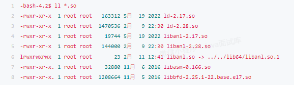

不过显示的是字节数，不方便计算具体大小。

如果要以更友好的方式显示，自动以**KB/MB**方式显示文件的大小，可以使用**ls -lh**或者**ll -lh**命令，使用示例如下：

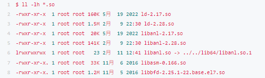

后面的文件名可以省略，就会显示当前目录所有文件。

### 48、Linux如何查找指定名称的文件？

如查找文件名为wx.log的文件：

> find  -iname wx.log

-name：表示按名称查找。

-i：表示忽略大小写。

### 49、Linux如何查找超过10M的文件？

如查找当前目前大小10M的文件：

> find  ./ -type f -size +10M

##### -type：指定文件类型

- f -----普通文件
- l -----符号连接
- d -----目录
- c -----字符设备
- b -----块设备
- s -----套接字
- p -----Fifo

##### -size：指定文件的大小

- b -----块（512字节）
- c -----字节
- w -----字（2字节）
- k -----千字节
- M -----兆字节
- G -----吉字节

### 50、Linux怎么在文件夹中查找指定内容？

在一个文件夹中递归查找包含指定字符串的文件，比如在当前目录查找所有包含”github“的文件：

> grep  github  -r .

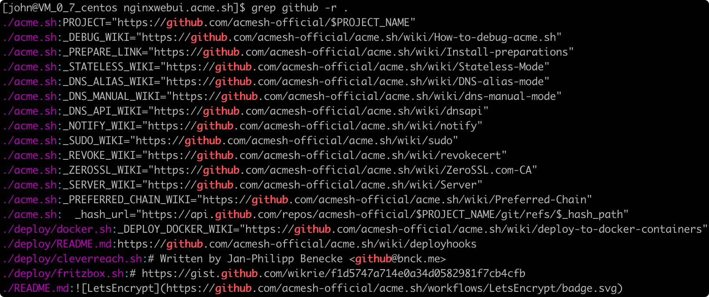

### 51、Linux怎么在文件中查找指定内容？

使用grep命令，比如在文件中搜索所有包含”avatar“的内容：

> grep avatar README.md

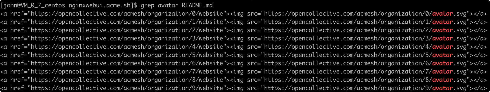

### 52、Linux怎么显示文件内容？

使用`cat`命令：

> cat slq.txt

带行号显示：

> cat -n slq.txt

显示多个文件：

> cat  -n slq.txt slq2.txt

### 53、Linux怎么分页查看文件内容？

使用`more`命令，如每页显示10行：

> more  -10  slq.log

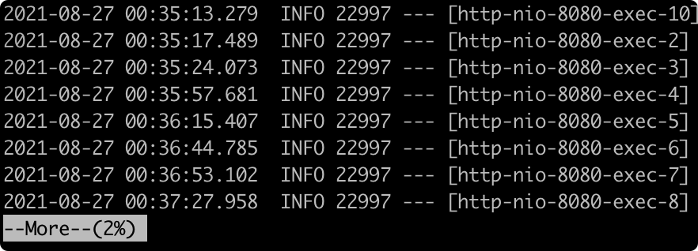

按**Space**键：显示下一页内容。

按**Enier**键：显示下一行内容。

按**B**键：显示上一屏内容。

按**Q**键：推出命令。

-----

也可以使用less命令，功能和用法类似。

### 54、Linux中的more和less命令的区别？

两个都可以用来分页浏览文件内容，功能类似。不同的是more会显示百分比：


而less命令不会显示百分比：

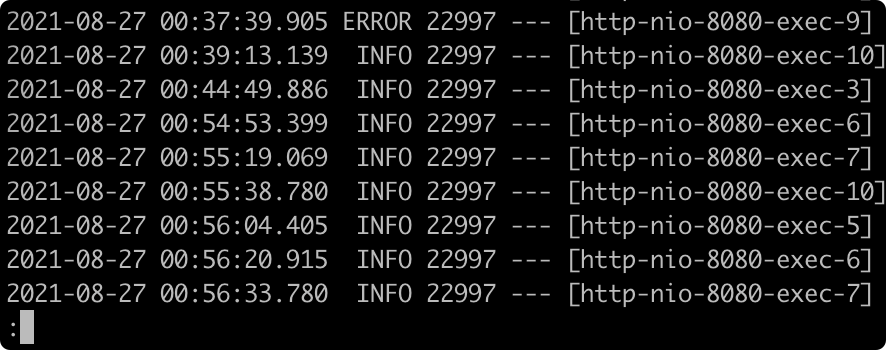

less命令可以用上下方向键进行控制。

### 55、Linux怎么查看文件最后5行 内容？

使用`tail`命令：

> tail  -n 5 slq.txt

不用-n参数，默认显示最后10行。

### 56、Linux怎么查看文件实时内容？

使用tail -f命令实现显示追加内容：

> tail  -f slq.log

查看日志后5行，并实时显示追加内容：

> tail  -f  -n  5 slq.log

### 57、Linux怎么查看文件类型？

使用`file`命令：

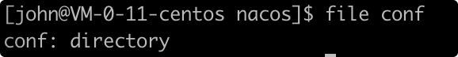

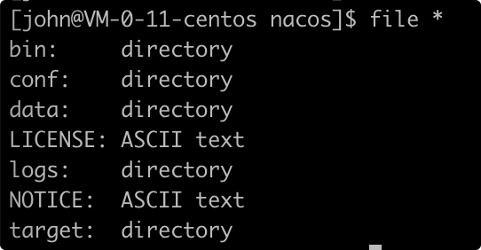

### 58、Linux怎么计算和验证文件的MD5值？

生成MD5：

> md5sum  slq.txt  > slq.md5

验证MD5：

> md5sum  -c  slq.md5

如果slq.txt文件内容发生变化则会提示验证失败。

### 59、Linux怎么压缩、解压？

##### 一、tar

tar压缩：

> tar  -zcvf  slq.tar  ./slq

tar解压缩：

> tar -zxvf  slq.tar  -C  /tmp

-C指定解压缩目录，不是必须的。

##### 二、zip

zip压缩：

> zip -r  slq.zip  ./slq

-r表示目前下的所有子目录和文件

unzip解压缩：

> unzip -d  /test  slq.zip

-d指定解压的目录，默认不指定为当前目录

##### 三、gzip

gzip压缩：

> gzip *.java

gzip不能用来压缩目录。

gunzip解压缩：

> gunzip test.gz

### 60、Linux vim和vi命令的区别？

它们都是多模式编辑器，不同的是vim是vi的升级版本，它不仅兼容vi的所有指令，而且还有一些新的特性在里面。

### 61、Linux vim命令怎么使用？

Vim是Linux一个文本编辑器。

##### 常用选项：

- i切换到输入模式，以输入字符
- x删除当前光标所在处的字符
- :切换到底线命令模式，以在最底一行输入命令
- :q退出文件
- :q!不保存数据，强制退出
- :wq保存退出文件

### 62、Linux中的vim命令有哪几种模式？

vim命令有三种模式：

（1）普通模式（模式）

（2）编辑模式（按 i 键进入）

（3）命令模式（按 : 输入命令）

### 63、Linux中的链接有哪几种形式？

##### Linux系统中的链接分两种：

- 硬链接（Hard Link）
- 符号链接/软链接（Symbolic Link）

### 64、Linux中的硬链接怎么理解？

硬链接相当于文件的另一个形态，硬链接文件和源文件都指向同一个文件实体，只能同时删除源文件和所有的硬链接文件，源文件才会真正删除。

可以给重要的文件设置硬链接，防止该文件被误删除。

### 65、Linux中的软连接怎么理解？

软链接相当于Windows系统中快捷方式，即源文件的一个引用，如果删除源文件，软链接文件则无法正常访问。

### 66、Linux如何查看链接指向的源文件？

一般指的是查看软链接指向的真实源文件，使用`readlink`命令：

```
$ readlink  -f test
/home/slq/test.txt
```

### 67、Linux中的两种链接的区别？

总结如下：


### 68、Linux怎么创建硬链接？

##### 创建硬链接：

建立hello.java的硬链接hello

```
ln hello.java hello
```

ln不带参数表示创建的是硬链接。

### 69、Linux怎么创建软链接？

##### 创建软链接：

创建hello.java的软链接hello

```
ln -s  hello.java hello
```

### 70、Linux系统应用的日志存在哪？

Linux系统应用的日志都在`/var/log`目录下，比如有：

| 日志              | 说明           |
| ----------------- | -------------- |
| /var/log/boot.log | 开启或重启日志 |
| /var/log/cron     | 任务调度日志   |
| /var/log/maillog  | 邮件日志       |
| /var/log/messages | 系统整体日志   |
| /var/log/secure   | 验证和授权日志 |

等等。。。

### 71、Linux下的权限有哪几种？

##### Linux有3种权限：

- 读取：用户可以读取文件或列出目录
- 写入：用户可以写入新文件到目录的文件
- 执行：用户可以运行文件或查找特定文件一个目录

### 72、Linux文件调用权限分为哪3级？

##### Linux/Uniux的文件调用权限分为三级：

- 文件所有者（Owner）
- 用户组（Group）
- 其他用户（Other Users）

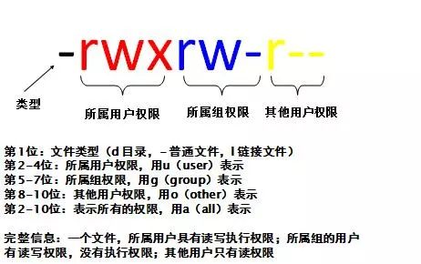

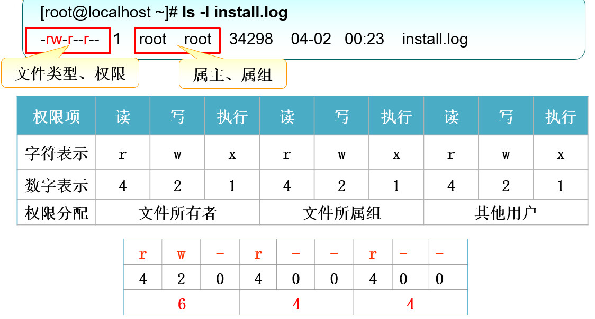

### 73、Linux怎么修改文件权限？

##### chmod改变文件权限

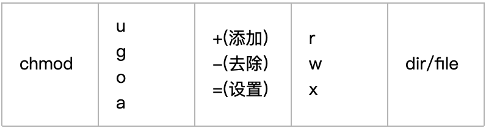

##### chmod常见写法：

将档案file1.txt设为所有人皆可读取：

```
chmod ugo+r file1.txt
```

将档案file1.txt设为所有人皆可读取：

```
chmod a+r file1.txt
```

将档案file1.txt与file2.txt设为该档案拥有者，与其所属同一个群体者写入，但其他以外的人则不可写入：

```
chmod ug+w,o-w fiel1.txt file2.txt
```

将ex1.py设定为只有该档案拥有者可以执行：

```
chmod u+x ex1.py
```

将目前目录下的所有档案与子目录皆设为任何人可读取；

```
chmod -R a+r *
```

数字写法

chmod 755 [fileName] #所有者读写执行，用户组和其他，只有读和执行权限

chmod 777 [fileName] #所有人都有读写和执行权限

### 74、Linux怎么修改文件所有者和所属组？

使用`chown`命令

##### 语法：

> $ chown [-cfhvR] [--help] [--version] 
>
> user[:group]  file...

##### 参数：

- user：新的文件拥有者的使用者ID
- group：新的文件拥有者的使用者组（group）
- -c：显示更改的部分的信息
- -f：忽略错误信息
- -h：修复符号链接
- -v：显示详细的处理信息
- -R：处理指定目录以及其子目录的所有文件
- --help：显示辅助说明
- --version：显示版本

##### 实例：

把/home/slq/test.txt的所有者设置为john用户和组：

> $ chown  john:john  /home/slq/test.txt

### 75、Linux怎么查看磁盘的使用情况？

使用`df`命令查看磁盘占用的空间。

使用语法：

> df [选项] ...  [FILE]...

一般使用df -h组合命令，即以使用人类可读的格式展示。


### 76、Linux怎么查看内存的使用情况？

使用`free`命令。

使用语法：

```
free  [-bkmotV]  [-s <间隔秒数>]
```

##### 单位参数说明：

- -b：Byte
- -k：KB
- -m：MB
- -h：以合适的但闻显示内存使用情况，自动计算对应的单位值

### 77、Linux怎么让进程在后台运行？

##### 一般使用nohup...&命令：

> nohup java -jar slq.jar > /dev/null 2 > &1
>
> &

`nohup` no hang up，表示不挂断，永远运行`>/dev/null 2>&1`其中0表示键盘输入，1表示标准输出（屏幕），2表示错误输出，先把标准错误输出（2）重定向到标准输出（1），然后扔到/dev/null文件中，一般项目中有自定义的日志文件，所以这里表示禁止输入任何内容。

`&`表示在后台运行。

### 78、Linux怎么查看资源消耗最多的进程？

使用**top**命令，常用的选项按键有：

N - 以PID的大小的顺序排列表示进程列表

P - 以CPU占用率大小的顺序排列进程列表

M - 以内存占用率大小的顺序排列进程列表

q - 退出top

### 79、Linux如何查看系统都开放了哪些端口？

常用命令：

> netstat -lntp

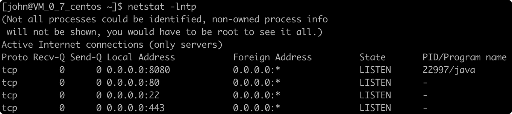

### 80、Linux怎么看端口被哪个进程占用？

常用命令：

> netstat -lnpt | grep 8080


### 81、Linux怎么对外开放端口？

下面是常用的CentOS系统的命令！

##### 查看所有已经开放的端口列表：

> sudo firewall-cmd --list-all

##### 比如开放MySQL的3306端口：

> sudo firewall-cmd --add-port=3306/tcp --permanent

##### 重新加载配置让起生效：

> sudo firewall-cmd --reload

### 82、Linux进程间的通信方式有哪些？

##### 主要有以下6种方式：

（1）管道（pipe）

（2）信号（signal）

（3）消息队列

（4）共享内存

（5）信号量

（6）套接字（socket）

### 83、Linux怎么查找某个进程？

使用`ps`命令可以查看进程信息。

##### 常见的选项：

a：显示当前终端下的所有进程信息，包括其他用户的进程。

u：使用以用户为主的格式输出进程信息。

x：显示当前用户在所有终端下的进程。

-e：显示系统内的所有进程信息。

-l：使用长（long）格式显示进程信息。

-f：使用完整的（full）格式显示进程信息。

查找某个进程可以配合grep命令使用，如查询Java进程：

> ps  -ef  | grep  java

### 84、Linux怎么查找Java进程？

常用的方法有两种：

1、使用Linux的ps命令：

> ps  -ef | grep java

2、使用jdk的jps命令：

> jps -vml

主要参数说明：

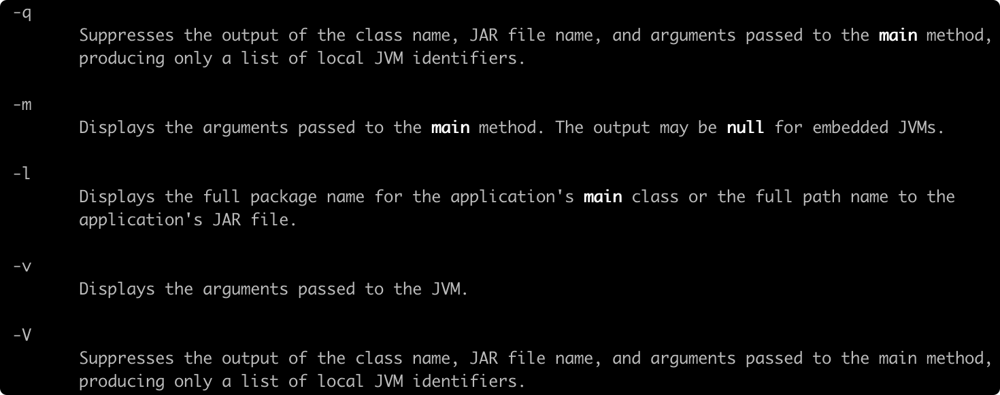

### 85、Linux怎么结束某个进程？

使用`kill -9 进程ID`命令，使用示例：

> kill -9 888

### 86、Linux怎么查看机器负载情况？

##### 1、使用top命令：

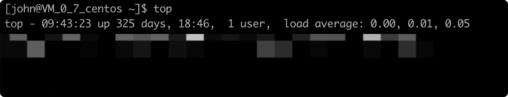

第一排就是负载信息。

##### 2、使用uptime命令：

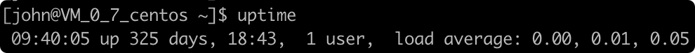

----

##### 以上信息依次为：

- 系统当前时间
- 系统已运行时间
- 登录用户数
- 系统在过去的1分钟、5分钟和15分钟内的平均负载

### 87、Linux如何查询系统连接数？

参考命令：

> netstat -an | grep ESTABLISHED | wc -l

### 88、Linux怎么检测主机之间的连通性？

使用ping命令：

> ping -c 5 www.slq.com

**-c**：表示检测的次数，不写会一直检测

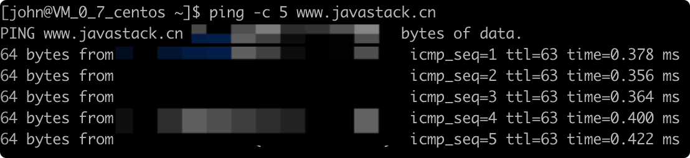

### 89、Linux怎么查看本机网络接口信息？

使用**ifconfig**命令：

> ifconfig -a

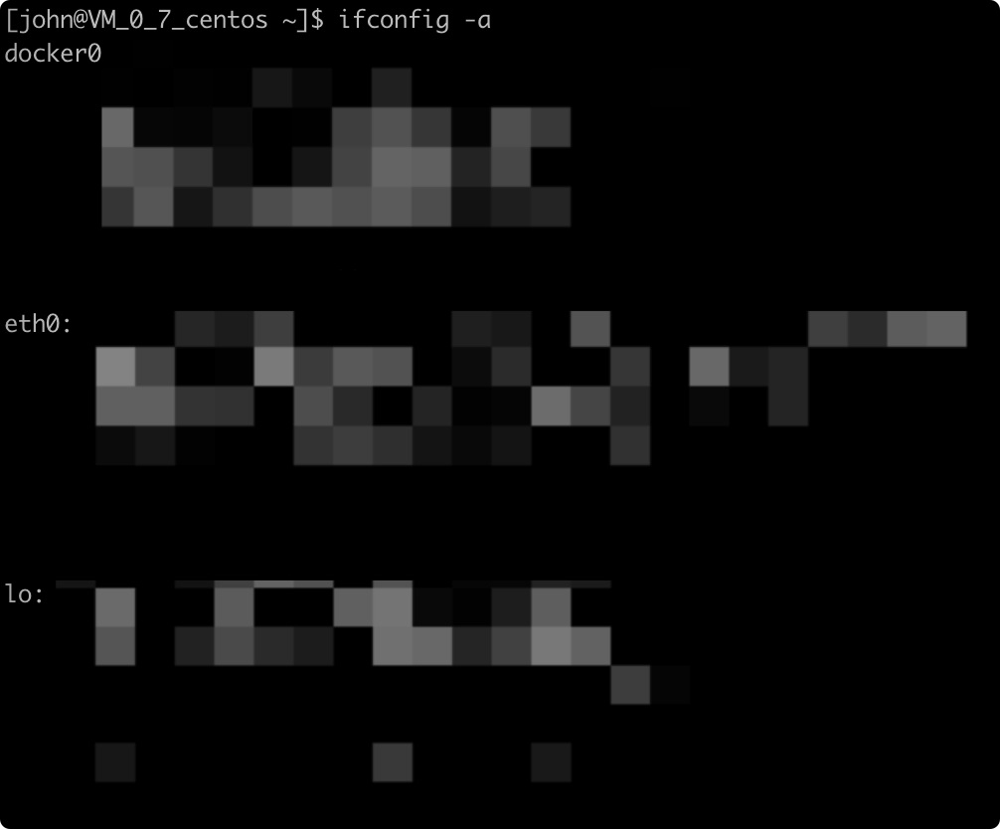

### 90、Linux怎么查看本机公网IP？

参考方法：

> curl cip.cc

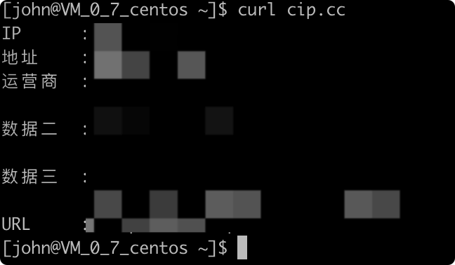

### 91、Linux怎么发送网络请求？

使用curl命令：

> curl  https://www.slq.com

还可以携带cookie：

> curl https://www.slq.com --cookie "user=root;pass=1234556"

还有更多用法。

### 92、Linux怎么从网络下载文件？

使用**wget**命令：

> wget https://www.slq.com/mst/


使用-O指定文件名称保存：

> wget -O mst.txt https://www.slq.com/mst/

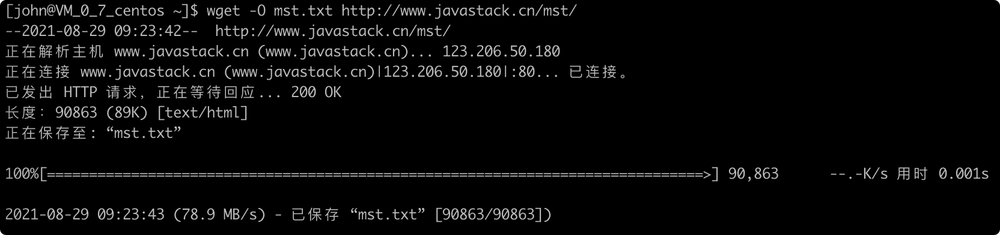

### 93、Linux怎么远程传输文件？

有以下几种方法：

（1）使用`rz`命令上传文件；

（2）使用FTP客户端工具；

（3）使用`scp`命令传输文件；

（4）使用第三方的开源命令工具，比如：rsync，可支持增量同步

### 94、Linux如何保证登录安全性？

##### 建议的参考方案：

1、禁用root远程登录，使用非root用户登录；

2、禁用密码形式远程登录，使用证书登录；

3、用户密码使用高强度、复杂的密码；

4、密码设置有效期，定期修改密码；

5、控制台N秒不操作自动等出；

6、设置远程连接IP黑白名单；

7、修改SSH端口号；

8、...

### 95、Linux都有哪些安全配置？

1、禁用ping请求；

2、删除不需要的用户和组；

3、只开发必要的端口；

4、控制服务远程访问权限；

5、禁止Ctrl+Alt+Delete重启系统；

6、及时扫描、修复服务器上的系统漏洞；

考虑使用云服务器上的各种安全产品；

8、...

### 96、Linux防火墙的命令怎么用？

##### 使用Linux的iptables命令。

比如开放8080端口：

> iptables -A INPUT -p tcp --dport 80 -j ACCEP
>
> iptables save

比如拒绝某个IP访问8080端口：

> iptables -I INPUT -s 180.22.13.121 -p tcp --dport 8080 -j REJECT
>
> iptables save

### 97、Linux怎么登录远程服务器？

使用ssh命令：

> ssh root@121.16.150.10

然后输入密码即可，然后也可以通过其他客户端工具登录。

### 98、Linux中的ssh和sshd的区别？

ssh_config和sshd_config都是ssh服务器的配置文件，区别在于：

**ssh_config**是针对客户端的配置文件，

**sshd_config**则是针对服务端的配置文件。

### 99、Linux怎么修改ssh端口号？

修改配置文件：

> sudo vim /etc/ssh/sshd_config

修改端口配置：

> Port 22

重新启动

> service sshd restart

也可以使用semanage命令：

```
semanage port -a -t ssh_port_t -p tcp 
#PORTNUMBER
```

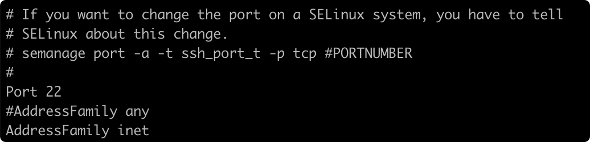

### 100、Linux服务器如何禁止被ping？

临时禁用配置：

> echo 1 > /proc/sys/net/ipv4/icmp_echo_ignore_all

永久禁用配置：

> echo net.ipv4.icmp_echo_ignore_all=1 >> /etc/sysctl.conf

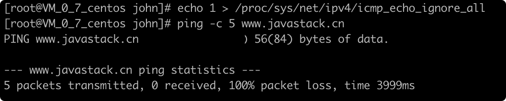

临时启用配置：

> echo 0 > /proc/sys/net/ipv4/icmp_echo_ignore_all

永久启用配置：

> echo net.ipv4.icmp_echo_ignore_all=0 >> /etc/sysctl.conf

### 101、Linux怎么禁止root远程登录？

修改配置文件：

> vim   /etc/ssh/sshd_config

##### 把PermitRootLogin值改为no。

重新启动：

> service sshd restart

### 102、Linux怎么设置用户密码有效期？

##### 针对未创建新用户

修改配置文件：

> vim /etc/login.defs

```
PASS_MAX_DAYS    90
PASS_MIN_DAYS    0
PASS_MIN_LEN     8
PASS_WARN_AGE    7
```

针对已有用户：

使用chage命令：

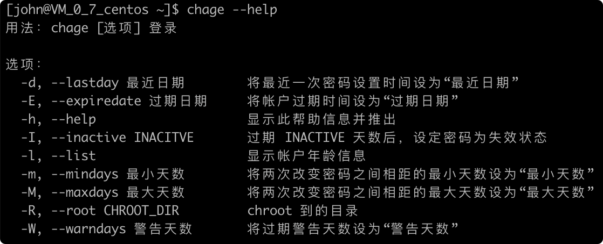

设置有效天数（90天）：

> sudo chage -M 90 slq

查看用户密码设置：

> sudo chage -I slq

### 103、Linux怎么禁止密码形式远程登录？

修改配置文件：

> vim  /etc/ssh/sshd_config

##### 把PasswordAuthentication值改为no。

重新启动：

> service  sshd  restart

### 104、Linux怎么以非root用户 + 证书登录？

使用root用户登录。

##### 创建用户

创建一个用户：

> adduser slq

修改密码：

> passwd slq

添加sudo权限：

> vim  /etc/sudoers

```\
root    ALL=(ALL)    ALL
slq     ALL=(ALL)    ALL
# sudo 不用输入密码
# slq ALL=(ALL)  NOPASSWD: ALL
```

##### 配置证书

生成RSA证书，并把公钥内容复制到authorized_keys文件：

```
su slq
cd ~
mkdir .ssh  # 如没有该目录则创建
chmod 700 .ssh
cd ~/.ssh
ssh-keygen -t rsa
cat id_rsa.pub >> authorized_keys
chmod 644 authorized_keys
sudo yum install lrzsz # 安装下载工具
sz id_rsa id_rsa.pub
rm id_rsa id_rsa.pub
```

开启证书登录：

> sudo  vim  /etc/ssh/sshd_config

修改以下值：

```txt
RSAAuthentication yes # 如没有此项则忽略
PubkeyAuthentication yes
AuthorizedKeysFile  .ssh/authorized_keys

PermitRootLogin no
PasswordAuthentication no
```

> sudo service sshd restart

##### 客户端证书登录

客户端终端登录参考：

修改文件（用户主目录/.ssh/config）：

```
# 解决Mac Ventura 新版本的问题
HostkeyAlgorithms +ssh-rsa
PubkeyAcceptedAlgorithms +ssh-tsa

Host tt
Hostname 118.112.223.10
Port 22
User slq
IdentityFile ~/.ssh/id_rsa
```

打开终端，输入：

> ssh tt

登录成功。

使用工具登录略。

### 105、Linux怎么控制远程访问权限？

修改这两个文件：

- /etc/hosts.allow（允许服务）
- /etc/hosts.deny（拒绝服务）

-----

比如配置只允许某个IP段才能访问SSHD服务：允许配置：

```
sshd:172.90.180.*
sshd:173.88.66.*
```

拒绝配置：

```
sshd:all
```

> 两个一起配置，当配置冲突时，以hosts.allow配置为准。

配置生效：

> service xinetd restart

### 106、Linux怎么禁用ctrl-alt-del重启？

1、备份配置文件：

> cp  /usr/lib/systemd/system/ctrl-alt-del.target
>
> /usr/lib/systemd/system/ctrl-alt-del.target.bak

2、删除原配置文件

> rm  -rf  /usr/lib/systemd/system/ctrl-alt-del.target

3、重新加载配置文件

> init q

### 107、Linux如何查看尝试登录失败记录？

使用`lastb`命令：

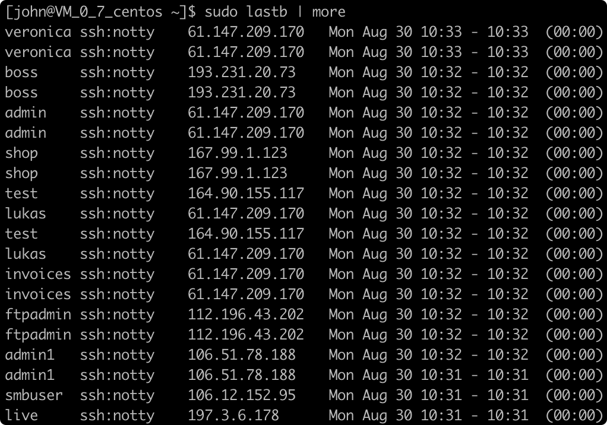

##### 根据IP统计次数：

> sudo lastb | awk '{print $3}' | sort | uniq -c | sort -n | more

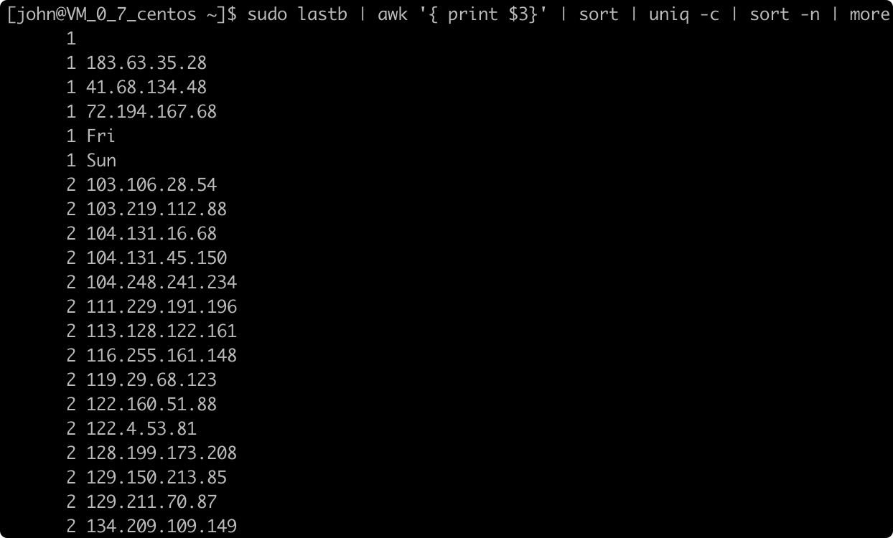

### 108、Linux如何查看历史登录主机记录？

使用`last`命令：

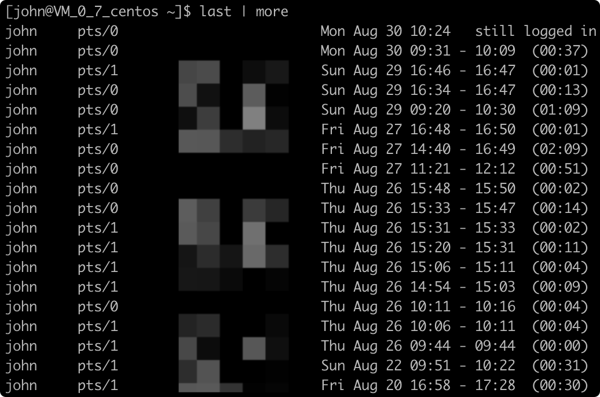

### 109、Linux控制台怎么设置超时自动注销？

##### 针对某个用户

编辑配置文件：

> ~/.bash_profile

添加/修改参数：

> export TMOUT=30

表示该用户30秒自动登出。

生效：

> source ~/.bash_profile

##### 针对所有用户

编辑配置文件：

> vim  /etc/profile

添加/修改参数：

> export TMOUT=1800

表示该用户30分钟自动登出。

生效：

> source /etc/profile

### 110、Linux系统的任务调度有哪几类？

##### Linux下的任务调度分为两类：

1、系统任务调度（/etc/crontab）

2、用户任务调度（/var/spool/cron）

### 111、Linux怎么创建一个任务调度？

新增/编辑/删除调度命令：

> crontab  -e 

输入以下内容并保存：

> */1 * * * * echo 'hi, java面试题1' >> ~/task1.txt
>
> */1 * * * * echo 'hi, java面试题2' >> ~/task2.txt

该任务调度为每分钟向文件中输出内容。

cron表达式说明：

> minute hour day month week command 
>
> 顺序：分 时 日 月 周 命令

查看任务调度：

> crontab -l

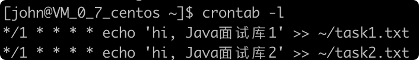

验证结果：

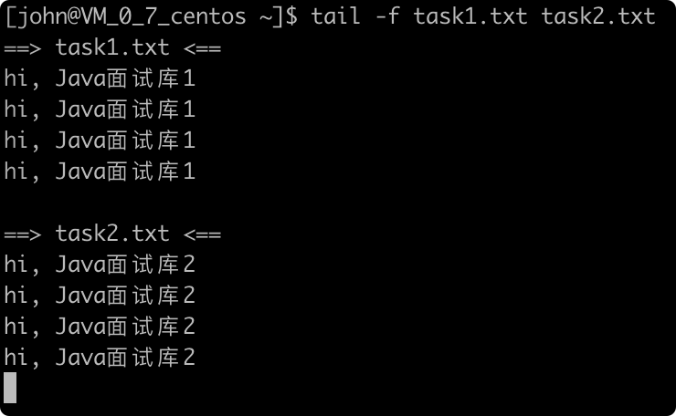

### 112、Linux中的零拷贝是指什么？

##### 零拷贝（zero-copy）：

在内核驱动程序如网络堆栈或者磁盘存储驱动程序处理I/O数据的时候，零拷贝技术可以在某种程度上减少甚至完全避免不必要CPU数据拷贝操作，大大提高了数据传输的速度和性能。

### 113、Linux有哪几种IO模型？

Linux系统有5种IO模型，它们分别是：

- 阻塞IO
- 非阻塞IO
- IO多路复用
- 信号驱动IO
- 异步IO

除了异步IO，其余都属于同步IO模型。

### 114、Linux有哪几种IO多路复用机制？

Linux IO多路复用的机制有3种：

- select
- poll
- epoll

### 115、Linux下select，poll，epoll的区别？

在Linux中，`select`、`poll`、和`epoll`都是用于处理I/O多路复用的机制，用于监视多个文件描述符的状态，以便在有数据可读或可写时进行相应的操作。

它们在不同的情况下具有不同的特点和使用方式：

| 特点 | select | poll | epoll |
| ---- | ------ | ---- | ----- |
|      |        |      |       |
|      |        |      |       |
|      |        |      |       |
|      |        |      |       |
|      |        |      |       |
|      |        |      |       |
|      |        |      |       |
|      |        |      |       |
|      |        |      |       |

需要注意的是，`select`在早期的系统中得到广泛使用，但由于其可扩展性和效率上的限制，后来逐渐被`poll`和`epoll`所取代。在处理大规模并发连接的场景下，`epoll`是最常用的选择，因为它能够以更高效的方式处理大量的连接并实现更好的性能。

### 116、Linux中的buffer和cache的区别？

buffer和cache都是内存中的一块区域：

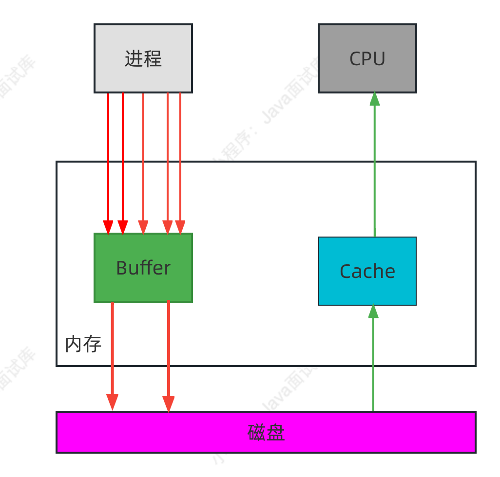

##### buffer：

buffer（缓冲）是为了提高内存和硬盘（或其他I/O设备）之间的数据交换的速度而设计的。

由于磁盘写入速度慢，当CPU需要写数据到磁盘时，可以把数据先存入Buffer，然后CPU就可以去干别的事情了，Buffer中的数据会定期写入磁盘。

##### cache：

从CPU角度考虑，cache是为了提高CPU和内存之间的数据交换速度而设计的，比如：一级缓存、二级缓存、三级缓存。

从内存与磁盘读取角度考虑，cache是操作系统为了提高数据读取效率而设计的，要访问到的数据可以提前放到cache中以提高访问速度。

### 117、Linux怎么在屏幕输出显示信息？

使用`echo`命令，比如：


不换行的话不需要`-e`进行解析。

### 118、Linux怎么清屏？

使用`clear`命令。

### 119、Linux怎么注销退出当前登录用户？

有以下三种常用的方法：

（1）使用`exit`命令；

（2）使用`logout`命令；

（1）使用`ctrl + d`快捷键；

### 120、Linux系统怎么重启？

系统重启1：

> shutdown -r now

系统重启2：

> reboot

### 121、Linux系统怎么关机？

立即关机：

> shutdown -h now

10分钟后关机：

> shutdown -h +10

10:00关机：

> shutdown -h 10:00

# 计算机网络 46

### 1、宽带和带宽的区别？

宽带：

名词，指接入到互联网的线路，一般为电信光纤接入。

----

带宽：

量词，指接入宽带的网速大小（比如：500Mbps），带宽又分上行（入网）带宽和下行（出网）带宽。

### 云服务器入网带宽和出网带宽的区别？

##### 入网（上行）带宽：

从公网流入云服务器的带宽，这个一般是云服务商统一分配。

来看看腾讯云的分配：

- 用户购买的带宽大于10Mbps时，腾讯云会分配与购买的带宽相等的外网入方向带宽。
- 用户购买的带宽小于等于10Mbps时，腾讯云会分配10Mbps外网入方向带宽。

---

##### 出网（下行）带宽：

从云服务器流出的带宽，也就是平常所说的1M、2M，一般为1~5M。

腾讯云最大可配置1000Mbps：

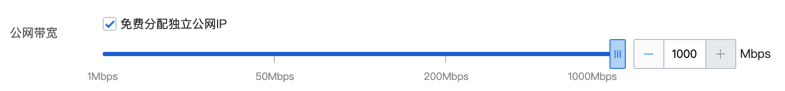

### 3、云服务器带宽2M怎么理解？

在购买云服务器时可以配置**公网带宽**

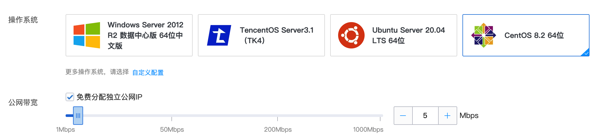

公网带宽是从云服务器流出的带宽，即出网带宽，用户可以自行选择配置。

### 4、云服务器带宽2M下载速度大概多少？

理论上的下载速度公式为：

> 带宽 * 1024 / 8


| 带宽  | 下载速度 |
| ----- | -------- |
| 1Mbps | 128k/s   |
| 2Mbps | 256k/s   |
| 5Mbps | 640k/s   |

### 5、云服务器带宽1M&2M的区别？怎么选？

从云服务器流出的带宽，也就是平常所说的1M、2M，一般为1~5M。

----

##### 有什么区别？

那肯定是快和慢的区别，带宽越大，服务器流出数据的速度越快。

----

##### 怎么选？

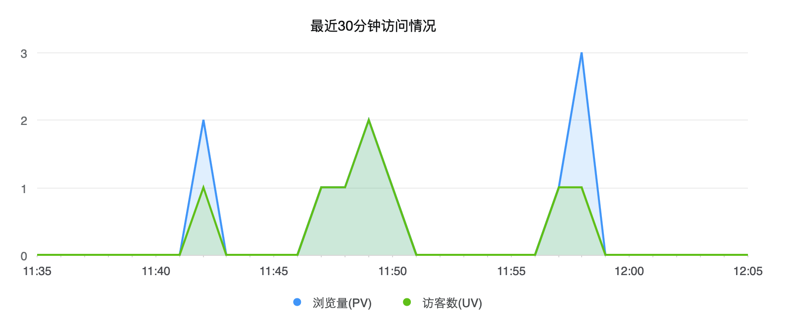

根据访问PV情况，像这种1~2M完全够用了。

如果一个页面的大小为200k，需要一个用户在一秒内打开，那就需要2Mbps的带宽，这个要根据并发数、可接受的响应时间选择相应的带宽。

### 6、宽带和光纤的关系？

宽带是一种互联网通信技术，而光纤则是实现宽带数据传输的承载介质。

### 7、光纤宽带和普通宽带的区别？

普通宽带是用铜质的电话线制作的，光纤是以玻璃或有机玻璃等介质制作的。

光纤以光脉冲的形式来传输信号，传输速度要比普通宽带快太多了。

现在带宽基本上都是光纤接入了。

### 8、什么是网络专线？

网络专线指的是独立的网络线路，相当于一个独立的局域网，目的是为了保证数据传输的安全行，缺点就是维护成本高，且需要专业人员进行管理。

### 9、专线和一般宽带的区别？

专线和一般宽带的主要区别：

| 对比项   | 专线             | 一般宽带            |
| -------- | ---------------- | ------------------- |
| 安全性   | 高               | 低                  |
| 费用成本 | 高               | 低                  |
| 维护成本 | 高               | 低                  |
| 速度     | 山下行速度一致   | 上行速度 < 下行速度 |
| IP       | 固定             | 不固定              |
| 带宽     | 独享、连接无限制 | 共享、连接有限制    |

### 10、OSI的七层模型都有哪些？

- 物理层：利用传输介质为数据链路层提供物理连接，实现比特流的透明传输。
- 数据链路层：负责建立和管理节点间的链路。
- 网络层：通过路由选择算法，为报文或分组通过通信子网选择最适当的路径。
- 传输层：向用户提供可靠的端到端的差错和流量控制，保证报文的正确传输。
- 会话层：向两个实体的表示层提供建立和使用连接的方法。
- 表示层：处理用户信息的表示问题，如编码、数据格式转换和加密解密等。
- 应用层：直接向用户提供服务，完成用户希望在网络上完成的各种工作。

### 11、常见的应用层协议都有哪些？

##### 常见的应用层协议有：

- HTTP：超文本传输协议
- HTTPS：安全的HTTP协议
- DNS：域名系统
- SOAP：简单对象访问协议
- DHCP：动态主机配置协议
- SMTP：简单邮件传输协议
- POP3：邮局协议版本3
- SNMP：简单网络管理协议
- SSH：安全外壳协议
- FTP：文件传输协议
- SFTP：SSH文件传输协议
- Telnet：远程终端协议
- ...

### 12、你怎么理解HTTP协议？

HTTP，全称：Hyper Text Transfer Protocol ，即：超文本传输协议。

HTTP是应用层协议，运行在TCP协议之上，是服务器端传输超文本到本地浏览器的标准传输协议。

HTTP是互联网的基础协议，我们可以通过HTTP协议进行服务端和客户端应用的数据传输和通信。

### 13、TCP、UDP、HTTP、Socket之间的区别？

IP：网络层协议

TCP：传输控制协议，属于传输层协议

UCP：用户数据报协议，属于传输层协议

HTTP：建议在TCP协议之上，属于应用层协议

Socket：是方便使用TCP、UDP协议的套接字

### 14、TCP和UDP协议的区别？

TCP和UDP是OSI模型中的传输层中的协议。

TCP提供可靠的通信传输，而UDP则常被用于让广播和细节控制交给应用的通信传输。

##### 两者的区别大致如下：

- TCP面向连接，UDP面向非连接即发送数据前不需要建立连接；
- TCP提供可靠的服务（数据传输），UDP无法保证；
- TCP面向字节流，UDP面向报文；
- TCP数据传输慢，UDP数据传输快；

### 15、Socket和WebSocket的区别？

Socket并不是一个协议，他工作在会话层，Socket是为了能方便、直接地使用更底层协议（即：TCP和UDP协议）地套接字。

WebSocket则是一个完整地双向通信协议，它工作在应用层，包含一套标准地API。

### 16、TCP协议有哪几种标识符？

##### TCP协议有6种标识符：

- SYN（synchronous）：建立连接
- ACK（acknowledgement）：确认
- PSH（push）：传输
- FIN（finish）：结束
- RST（reset）：重置
- URG（urgent）：紧急

### 17、TCP中的拆包和粘包是指什么？

##### 操作系统在发送TCP数据的时候，底层会有一个缓冲区：

##### 拆包：

一次发送的数据如果超过缓冲区大小，那么一个完整的数据包可能就被拆分成多个子包进行发送；

##### 粘包：

一次发送的数据如果达不到缓冲区大小，那么多个子数据包可能就被封装成一个大的数据包进行发送；

### 18、TCP协议有几次握手、几次挥手？全过程是怎样的？


##### 1、建立连接（三处握手）

（1）客户端发送一个带SYN报文到服务器端，用来建立连接

（2）服务器端回复客户端一个带ACK和SYN标志的报文

（3）客户端必须再发一个ACK报文确认

##### 2、关闭连接（四次挥手）

（1）客户端发送一个FIN报文，用来关闭客户到服务器端的连接

（2）服务器端收到后，发送一个ACK报文

（3）服务器端关闭客户端的连接，并发送一个FIN报文

（4）客户端必须在发一个ACK报文确认

---

下面的示例可能更形象一点吧：

##### 三次握手：

A：你好，听见没？

B：我听见了，你呢？

A：好，我也听见了

-----

##### 四次挥手：

A：我说完了

B：...

B：我也说完了，可以挂电话了...

A：好，拜拜...

### 19、TCP协议为什么是三次握手、四次挥手？

这是因为TCP建立连接时，服务端处理LISTEN状态下，当收到建立连接的SYN报文的请求后，它可以把ACK和SYN同时放在一个报文里（即ACK+SYN）来一起发送给客户端。

而关闭连接时，当收到对方的FIN报文通知时，它仅仅表示对方没有数据发送给你了，但未必你所有的数据都全部发送给对方了，你可能还需要发送一些数据给对方，再发送FIN报文给对方，表示你现在通义关闭连接了，而此时ACK报文和FIN报文是分开发送的，所以挥手就多了一步。

### 20、TCP为什么要三次握手，两次不行吗？

如果采用两次握手，那么只要服务器发出确认数据包就会建立连接，但由于客户端此时并未响应服务器端的请求，那此时服务器端就会一直在等待客户端，这样服务器端就白白浪费了一定的资源。若采用三次握手，服务器端没有收到来自客户端的再次确认，则就会知道客户端并没有要求建立请求，就不会浪费服务器的资源。

### 21、HTTP和HTTPS的区别？

1、HTTP的连接很简单，是无状态的；HTTPS协议是由SSL+HTTP协议构建的可进行加密传输、身份认证的网络协议，比HTTP协议要安全。

2、HTTP和HTTPS使用的端口也不一样，前者是80，后者是443。

### 22、HTTP的请求方法有哪些？

##### HTTP 1.0：

GET：向服务检索资源

POST：向服务器发送数据

HEAD：向服务检索资源，只响应起始行和标头，可用于检查链接的有效性。

----

##### HTTP 1.1新增：

PUT：向服务器上传指定资源最新内容

DELETE：从服务器删除资源

TRACE：跟踪服务器路径

OPTIONS：允许客户端查看服务器的性能

CONNECT：将连接改为管道方式的代理服务器

PATCH：向服务器更新部分资源

### 23、HTTP预检请求是什么？

这是某程序员在字节一面时遇到的一道面试题：

> post为什么会发送两次请求？

这道题主要问的是HTTP预检请求！！！

HTTP中的**OPTIONS**请求即：预检请求，用于检测服务器是否允许的HTTP方法。

预检请求一般是在跨域请求之前发送的一种HTTP OPTIONS请求，即在真正发送跨域请求之前，浏览器会先发送一次预检请求，CORS允许服务器在安全的情况下处理跨域请求，以确保数据的保护和完整性。

在百度随便搜索一下，会产生一个预检请求：

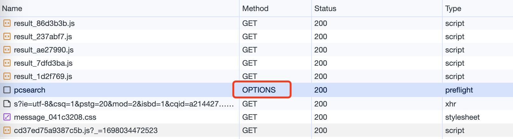

这说明百度搜索可能产生了跨域请求。

### 24、什么时候会发送HTTP预检请求？

HTTP预检请求是由浏览器自动发起的，以确保请求的安全性和合法性，一下情况下会触发预检请求。

##### 1、非简单HTTP请求方法

如果HTTP请求方法是不安全的方法，浏览器会自动发送预检请求。

简单HTTP请求方法包括：GET、HEAD、POST，非简单HTTP请求方法包括但不限于：

- PUT
- DELETE
- PATCH
- ...

##### 2、跨域

预检请求主要用于跨域请求，即当前网页所在的域与请求的目标资源所在的域不一致，即发生跨域，浏览器将自动发送预检请求。

##### 3、自定义请求头部

使用了自定义请求头部，比如在JS代码中使用了`setRequestHeader`设置了自定义头部，浏览器将自动发送预检请求。

### 25、HTTP常见的Content-Type有哪些？

##### HTTP常见的Content-Type有：

- text/plain：纯文本格式
- text/html：HTML文本格式
- text/xml：XML文本格式
- image/jpeg：jpg图片格式
- image/png：png图片格式
- image/gif：gif图片格式
- application/xhtml+xml：XHTML格式
- application/xml：XML数据格式
- application/json：JSON数据格式
- application/pdf：PDF文档格式
- application/msword：Word文档格式
- application/octet-stream：二进制流数据格式，如：文件下载
- application/x-www-form-urlencoded：表单提交格式
- multipart/form-data：表单中文件上传格式

### 26、HTTP GET和POST的区别？

##### 有4个最主要的区别：

（1）定义和作用不一样，GET是获取资源请求，POST是提交数据请求；

（2）POST比GET更安全，因为GET所有参数都在URL地址栏，而POST参数在请求体body中；

（3）GET提交的参数在URL地址栏，受URL长度限制（2048个字符），而POST无限制；

（4）GET提交的参数在URL地址栏，有编码限制（只能ASCII字符），特殊字符需要编码，而POST则不需要；

### 27、HTTP请求报文包含哪几部分？

##### 请求报文包含四部分：

- 请求行：包含请求方法、URI、HTTP协议版本信息
- 请求头
- 空行
- 请求内容实体

### 28、HTTP响应报文包含哪几部分？

##### 响应报文包含四部分：

- 状态行：包含HTTP协议版本、状态码等信息
- 响应头
- 空行
- 响应内容实体

### 29、HTTP常见的请求头有哪些？

常见的请求头，随便请求一个网站，看它的请求便知。

如访问：www.huawei.com/cn


### 30、HTTP常见的响应头有哪些？

常见的响应头，随便请求一个网站，看它的响应便知。

如访问：www.huawei.com/cn


### 31、HTTP常见的响应状态码有哪些？

##### HTTP常见的响应状态码有：

- 200：请求正常
- 301：永久性重定向
- 302：临时性重定向
- 400：请求信息有误，服务器无法处理
- 401：请求需要认证
- 403：请求的资源被禁止访问
- 404：服务器找不到对应的资源
- 500：服务器内部错误
- 503：服务器正忙

### 32、HTTP 301和302的区别？

301：请求永久性重定向

302：请求临时性重定向

### 33、HTTP 1.0、1.1、2.0有什么区别？

##### HTTP 1.0：

仅支持保持短暂TCP连接

----

##### HTTP 1.1

支持长连接

管道机制

分块传输编码

增加了更多的请求头和响应头

----

##### HTTP 2.0

二进制报头

支持多路复用

报头压缩，降低开销

服务器推送，减少请求延迟

### 34、HTTP协议为什么是无状态的？

HTTP协议是无状态的。

因为服务器不会保留每次HTTP请求的状态，每次请求也是完全独立的，请求之间没有任何联系，如果当前请求需要得到上个请求的处理状态或数据，是没法获取到的，所以每次请求都需要传输一次完整的处理数据。

### 35、HTTP协议如何做才能有状态？

主流的方式有两种：

##### （1）Cookie

Cookie一般是由服务器端生成，发送给客户端进行保存，客户端每次请求需要带上Cookie，这样服务器就能区分是哪个客户端的请求，这样就维持了状态。

##### （2）Session

会话机制，这个是由服务器端生成、服务端保存，然后需要在客户端中保存一个名叫JSESSIONID的Cookie，用来识别和区分客户端。

### 36、URI和URL的区别？

URI，全称：uniform resource identifier，即：统一资源标识符，表示的是一种可用的资源，如HTML、图片、视频等，都由一个URI进行标识的。

URL，全称：uniform resource locator，即：统一资源定位符，URL是URI的子集，它不仅能标识资源，而且还能定位和访问该资源，这是URI和URL最主要的区别。

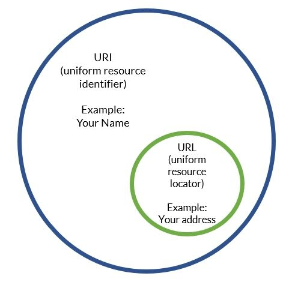

### 37、什么是正向代理？

比如说你现在要访问www.huawei.com/cn，如果本机网络不能访问该网站，或者又不想暴露自己的IP请求，就可能通过一个代理服务器去访问。

代理服务器就是客户端和目标服务器之间的跳板，代理服务器接收客户端的请求并发送到目标服务器，同时接收目标服务器的应答结果并返回给客户端，起到一个中转的作用，这就是所谓的正向代理，我们可以通过在客户端设置网络代理即可，一般的软件都会提供代理设置。

### 38、什么是反向代理？

再拿www.huawei.com/cn这个网站举例。

如果背后是一堆的服务器在支撑这个网站，如：10.1.2.30，10.1.2.31，10.1.2.32，等等...

当我们访问这个网站的时候，我们不能确定能访问到哪台服务器，可能是这些IP所在的服务器之一，这个过程是网站内部的反向转发，客户端是看不到的。

整个过程我们不需要做任何设置，直接访问域名获取数据，获取数据可能是背后的任何一台服务器，这就是反向代理，Nginx就是现在最主流的反向代理中间件。

### 39、正向代理和单项代理的区别？

下面通过一张图来看清楚正向代理和反向代理的区别：

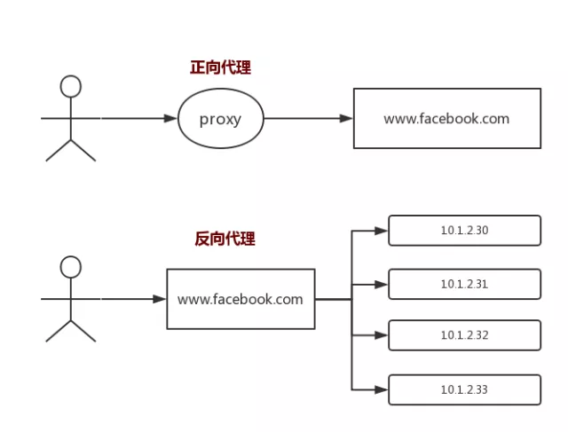

1、正向代理需要设置代理服务器信息，反向代理不需要任何配置；

2、正向代理指向目标IP地址，而反向代理则不一定；

3、正向代理是客户端到服务器端的转发代理，反向代理是网站内部负载均衡做的集群请求转发；

4、正向代理一般用于提供网站代理访问，反向代理是将防火墙后面的服务器作为服务提供给外面的客户端访问；

5、正向代理客户端知道连的代理服务器，反向代理后面的服务器对客户端来说是完全透明的，客户端不知道自己连的具体是哪台服务器；

6、正向代理可以隐藏原始客户端，反向代理可以隐藏原始服务器。

### 40、常见的域名解析方式有哪几种？

##### 常见的域名解析方式有：

##### 1、A记录

IP地址解析，就是域名域IP地址绑定，一个域名只能绑定一个IP地址，但一个IP地址可以被多个域名绑定。

##### 2、AAAA记录

即IPV６地址解析。

##### 3、CNAME记录

别名解析，比如：www.huawei.com/cn的别名叫blog.huawei.com/cn，然后我们可以把blog.huawei.com/cn域名CNAME解析到www.huawei.com/cn，这样做的好处就是不管www.huawei.com/cn的IP地址怎么更换解析，都不会影响blog.huawei.com/cn的解析。

##### 4、MX记录

Mail Exchange解析，邮件服务器地址，即xx@huawei.com/cn的路由会发到MX记录的绑定记录服务器。

##### 5、NS记录

指定解析DNS服务器地址，即这个域名由哪个IP地址的DNS服务器解析。

##### 6、TXT记录

为域名设置说明，用命令解析的时候就能看到这个域名的说明。

在设置域名解析的时候还有一个TTL值，即DNS服务器缓存域名解析结果的时间，超过这个时间才会重新解析，否则返回已经解析的缓存的解析结果，这个一般设置为1小时，即3600秒。

### 41、什么是DOS&DDOS攻击？

DOS攻击全称为：**Denial of service**，即拒绝服务，其主要攻击目的是使计算机硬件或网络宽带资源耗尽从而造成服务器无法提供正常服务。

DDOS工具全称为：**Distributed denial of service**，即分布式的拒绝服务攻击，攻击者利用多台服务器资源对同一个目标服务器发起攻击，从而使目的服务器快速陷入崩溃。

不管是DOS还是DDOS，它们的本质都是通过各种手段消耗目标服务器资源，从而使目标服务器瘫痪不能接受用户的服务。

### 42、怎么防御DOS&DDOS攻击？

##### 常见的防御方法有：

1、定期检查服务器漏洞；

2、隐藏服务器真实IP；

3、关闭不用的服务、端口；

4、限制SYN/ICMP流量；

5、购买第三方安全服务；

一般的公司都没有能力自己真正防止的，一般都是运维会服务器的基本安全配置，另外再购买第三方的安全服务的。

### 43、什么是DNS？

DNS，全称：Domain Name System，即域名系统。

DNS是怎么来的，我们知道要访问一个服务器的资源可以通过IP的形式访问，但IP地址比较难记，也不方便读，所以有了DNS的存在，DNS通过解析域名并与实际的远程服务器主机建立连接。

即我们访问www.huawei.com/cn的时候，通过DNS服务器解析出实际的IP地址去连接并返回给客户端。

### 44、什么是DNS攻击？

##### DNS攻击包括由DNS劫持和DNS污染。

DNS劫持即通过某种手段控制DNS服务器，篡改域名真实的解析结果，并返回攻击者的IP地址，从而跳到了攻击者的页面。

像我们快带快到期了或者有什么推广信息，电信总会弹出一个营销界面提示我们快带快到期了或者什么活动的，这其实就是运营商DNS劫持搞的鬼。

像在我们本地，也经常会配置host文件以开发测试联调，或者访问那些访问不了你又想访问的网址。

DNS污染发生在请求DNS解析前第一步，直接在协议上对DNS解析请求进行干扰，因为DNS查询是基于不可靠无连接的UDP协议，它是没有经过认证的，很容易被篡改，所以攻击者通过在UDP的53端口进行DNS查询检测，并返回攻击者错误的解析结果给用户，这就是DNS污染。

### 45、怎么防御DNS攻击？

防止DNS劫持可以用国外知名的DNS服务器，像Googlede的8.8.8.8，或者准备两个域名，一个被劫持了引导用户去访问另一个。

DNS污染可以通过自己搭建DNS服务器，采用TCP加密的形式，但可能延迟比较大。

### 46、什么是CDN？

CDN，全称为：**Content Delivery Network**，即内容分发网络。

器基本思路是尽可能避开互联网上有可能影像数据传输速度和稳定性的瓶颈和环节，使内容传输的更快、更稳定。

通过在网络各处放置节点服务器所构成的现有的互联网基础之上的一层只能虚拟网络，CDN系统能够实时地根据网络流量和各节点的连接，负载状况以及到用户的距离和响应时间等综合信息将用户的请求重新导向离用户最近的服务节点上。

其目的是使用户可就近取得所需内容，解决Internet网络拥挤的状况，提高用户访问网站的响应速度。

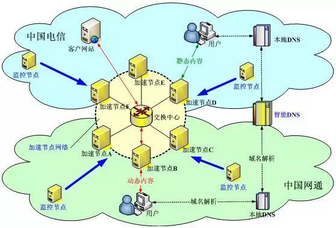

现在CDN一般都以缓存网站的静态内容为主，比如静态网页页面、JS、CSS、图片等静态文件。

如用户访问一个动态网站，首先从服务器请求到动态数据，再从CDN上请求下载动态数据的，因为CDN能就近网络取材，从而减少了下载静态数据的时间，加快了网页的显示速度。

##### CDN优点

1、可扩展性，能应对激增的大量用户请求的扩展能力。

2、安全性，CDN可以减少DDOS攻击及其他恶意攻击行为，避免对网站业务造成中断。

3、可靠性，CDN通过负载均衡能及时提供网络的容错机制能力。