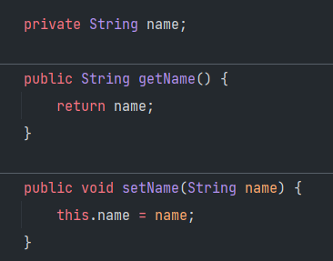
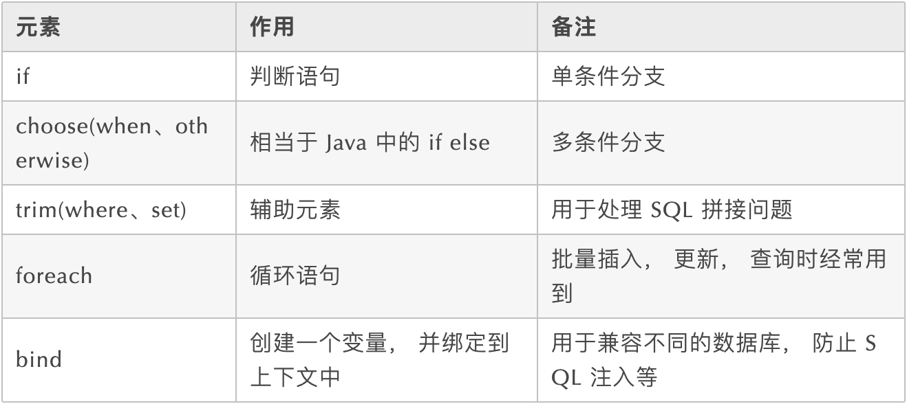
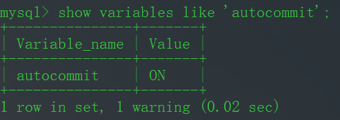
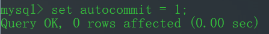
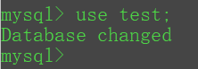
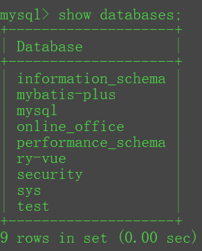
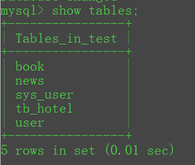
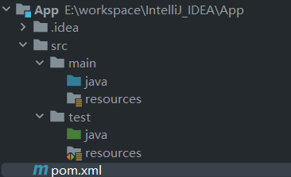
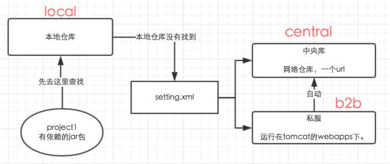
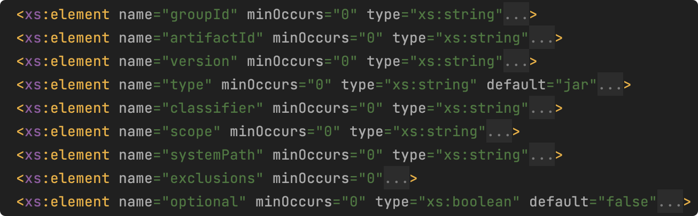

# 基础

### 1、面向对象编程有哪些特征？

##### 1、封装（Encapsulation）

封装就是指隐藏对象的属性和实现细节，控制成员属性的访问和修改权限，通过特定公开的方法暴露给外面访问。

比如：



name属性被private封装起来，外面只能通过对象的getName才能访问。

##### 2、继承（Inheritance）

继承就是指子类继承父类的成员和方法，使得子类也能具有父类相同的行为。

##### 3、多态（Polymorphism）

多态是指同一个行为具有多个不同的表现形式或形态，如一个类的方法在不同的情况有不同表现形式。

比如：方法重载，同一个方法名可以有不同参数的表现形式。

### 2、JDK与JRE的区别是什么？

##### JDK

JDK全称：Java Development Kit，是整个Java的核心，包含了Java运行环境（JRE）和一系列Java开发工具完整的包。

##### JRE

JRE全称：Java Runtime Environment，是Java程序的运行环境，包含JVM、Java核心类库等。

JRE自能用来运行Java应用程序，不能用于编译开发，它是JDK的子集。


安装完JDK后，就会有JRE目录，JRE属于JDK的子集。

### 3、如何编译和运行Java文件？

1、使用javac命令来编译.java文件

> javac Test.java

运行之后会生成Test.class文件

2、使用java命令来运行

> java Test

### 4、Java中的关键字有哪些？


### 5、Java标识符命名规则是怎样的？

##### Java标识符命名规则：

1、标识符只能由字母（a-z，A-Z）、数字（0-9）、下划线（_）和美元符号（$）组成；

2、标识符不能以数字开头；

3、标识符不能使用Java关键字；

4、标识符区分大小写；

### 6、Java类命名规范是怎样的？

##### 类命名规范：

类名首字母大写，后面每个单词首字母大写，符合**UpperCamelCase大驼峰式风格**，如：

- Order
- OrderDetail
- OrderMonthSummary

但一般这种众所周知的缩写例外：DO、BO、DTO、VO、AO、PO、UID等。

### 7、Java方法命名规范是怎样的？

##### 方法命名规范：

方法名首字母小写，后面每个单词首字母大写，符合**小驼峰式**，如：

- printIn
- indexOf
- saveOrderInfo

### 8、Java变量命名规范是怎样的？

##### 变量命名规范：

变量包括方法参数名、成员变量、局部变量。

变量首字母小写，后面每个单词首字母大写，符合**lowerCamelCase小驼峰式风格**，如：

- amount
- orderPrice
- orderStockInfo

### 9、Java常量命名规范是怎样的？

##### 常量命名规范:

常量名全部大写，单词间用下划线（_）隔开，如：

- MAX_LIMIT
- MAX_LOOP_COUNT
- ALIPAY_PAY_URL

### 10、Java常量和变量的区别？

##### Java常量和变量的主要区别在于：

常量是一个固定的值，赋值后是不能被改变的，变量是一个不固定的值，赋值后是可以随时被改变的。

### 11、Java怎么定义一个常量？

Java使用`final`关键字来定义一个常量，如：

```Java
final int MAX_COUNT = 100;
```

可以加修饰范围，以及静态关键字。

# 集合


# 多线程


# IO


# JVM


# 进阶


# WEB


# 互联网


# 设计模式


# 分布式


# 架构设计


# 消息队列


# Spring


# Spring MVC


# Spring Boot


# Spring Cloud & Alibaba


# MyBatis

### 1、MyBatis是什么框架？

MyBatis本是Apache的一个开源项目iBatis，2010年这个项目由Apache software foundation迁移到了google code，并且改名为MyBatis，2013年11月迁移到Github。

MyBatis是一款优秀的持久层框架，它支持自定义SQL、存储过程以及高级映射。

MyBatis免除了几乎所有的JDBC代码以及设置参数和获取结果集的工作。

MyBatis可以通过简单的XML或注解来配置和映射原始类型、接口和 Java POJO（Plain Old Java Objects，普通老式Java对象）为数据中的记录。

### 2、MyBatis和ORM的区别？

MyBatis属于半自动ORM框架，因为SQL语句需要手动编写。

MyBatis并没有将Java对象与数据库关联起来，而是将java方法与SQL语句关联起来。

### 3、MyBatis为什么是半自动ORM映射？

Hibernate查询关联对象或者关联集合对象时，可以根据对象关系模型直接获取，它是自动ORM映射的。

MyBatis在查询关联对象或者关联集合对象时，需要手动编写SQL来完成，所以是半自动ORM映射。

### 4、MyBatis框架的应用场景？

（1）专注于SQL本身，MyBatis是一个足够灵活的DAO层解决方案；

（2）对性能的要求很高，或者需求变化较多的项目，如互联网项目，MyBatis是不错的选择；

### 5、MyBatis有哪些优点？

##### MyBatis的优点：

（1）基于SQL语句编程，相当灵活，不会对应用程序或者数据库的现有设计造成任何影响，SQL写在XML里，解除SQL与程序代码的耦合，便于统一管理；

（2）提供XML标签，支持编写动态SQL语句，并可重用；

（3）提供映射标签，支持对象与数据库的orm字段关系映射；

（4）提供对象关系映射标签，支持对象关系组建维护；

（5）与JDBC相比，减少了50%以上的代码量，消除了JDBC大量荣誉的代码，不需要手动开关连接；

（6）MyBatis使用JDBC来连接数据库，所以很好的与各种数据库兼容；

（7）MyBatis能够与Spring很好的集成；

### 6、MyBatis有哪些缺点？

##### MyBatis的缺点：

（1）SQL语句的编写工作量非常巨大；

（2）SQL语句依赖于具体数据库，所以移植性非常差；

（3）SQL写在XML中，调试比较困难；

### 7、JDBC是什么？

JDBC全称：`Java Database Connectivity`，即：Java数据库连接，是Java语言规范应用程序访问数据库的应用程序接口，而不需要关心底层特定数据库的细节，提供了如查询、更新、删除数据库数据等方法。

### 8、JdbcTemplate和JDBC的区别？

JdbcTemplate是Spring框架提供的JDBC模板，可以直接注入JdbcTemplate使用，它在JDBC的基础上做了深度封装，简化了使用JDBC的复杂操作，还有助于避免常见的错误。

### 9、MyBatis和JDBC的区别？

MyBatis是对JDBC的封装，他消除了几乎所有的JDBC代码和参数的手工设置。

MyBatis的优势如下：

1、优化连接的频繁获取和释放

2、SQL统一配置管理

3、支持对结果集进行对象映射

4、更灵活的动态SQL处理

5、SQL移植性较好

### 10、MyBatis和JdbcTemplate怎么选？

两者都是手动编写SQL，但JdbcTemplate是写在Java代码中，修改需要重新编译，而MyBatis是配置在xml文件中，修改无需重新编译，所以一般都会使用MyBatis。

另外，使用Spring JdbcTemplate的开发效率要比MyBatis高，如果是小型、简单的系统也可以考虑使用JdbcTemplate。

### 11、JPA是什么框架？

JPA不是指一种框架，它是`Java Persistence API`的简称，即Java持久化API，它是为POJO提供持久化的标准规范。

### 12、Spring Data JPA和JPA的区别？

Spring Data JPA框架的底层用的是Hibernate，可以理解为Hibernate更上一层的封装，他的目的就是为了更容易的使用JPA。

### 13、Hibernate和JPA的区别？

JPA是持久化规范，而`Hibernate`、`TopLink`、`OpenJPA`等都是JPA这种规范的标准实现。

### 14、MyBatis和JPA的区别？

JPA是一个全自动的ORM框架的规范，提供对象与数据库的自动映射，Hibernate是这种规范的标准实现。

而MyBatis是一个半自动的ORM框架，需要手动编写SQL，提供数据库与结果集的映射，和JPA没有什么关系。

### 15、MyBatis和JPA怎么选？

国内一般用MyBatis，主要是SQL编写灵活，易于调试，如果是CRUD业务简单的系统也可以考虑使用JPA（即标准实现：Hibernate）。

### 16、MyBatis和Hibernate的区别？

区别主要在以下几个方面体现：

#### 1、开发速度

MyBatis学习相比Hibernate更简单，支持原生SQL。

HIbernate的学习难度更大，开发速度差距不大。

MyBatis要维护DAO层数据库字段和bean属性映射，Hibernate要在bean中添加字段映射。

#### 2、运行效率

MyBatis支持原生SQL自定义查询字段更加灵活，基本属于JDBC操作。

HIbernate是对JDBC更复杂的封装，每次查询需要完整的映射，对待复杂的查询通过HQL语句生成的SQL语句效率不能保证，所以MyBatis会比Hibernate稍快。

#### 3、映射方式

MyBatis的对象关系映射配置灵活，Hibernate则需要配置完整的对象关系映射，对象关系维护的更好。

业务表的关联太多，建议使用MyBatis。

#### 4、优化性能调优

MyBatis原生SQL性能优化，有时候相比Hibernate自动生成的SQL好太多。

#### 5、数据库移植

MyBatis的数据移植方面，没有Hibernate好，Hibernate自动生成SQL能适应更多的数据库，并且能反向生成表。

#### 6、后期维护

MyBatis后期维护比Hibernate更方便。

#### 一句话总结：

MyBatis：小巧、方便、高效、简单、直接、半自动化

Hibernate：强大、方便、高效、复杂、间接、全自动化

### 17、MyBatis有哪几种SQL编写形式？

（1）通过在接口的方法上面加上`@Select`、`@Update`等注解里面编写SQL语句，SQL语句比较简单，推荐使用注解；

（2）通过在xml里面来编写SQL，SQL语句比较复杂的时候，推荐使用xml；

### 18、MyBatis支持哪些传参数的方法？

##### （1）顺序传参法

```java
public User selectUser(String name, int deptId);

<select id="selectUser" resultMap="UserResultMap">
	select * from user
	where user_name = #{0} and dept_id = #{1}
</select>
```

`#{}`里面的数字代表你传入参数的顺序。

这种方法不建议使用，sql层表达不直观，且一旦顺序调整容易出错。

##### （2）@Param注解传参法

```java
public User selectUser(@Param("userName") String name, @Param("deptId") int deptId);

<select id="selectUser" resultMap="UserResultMap">
	select * from user where user_name = #{userName} and dept_id = #{deptId}
</select>
```

`#{}`里面的名称对应的是注解`@Param`括号里面修饰的名称。

这种方法在参数不多的情况还是比较直观的，推荐使用。

##### （3）Map传参法

```java
public User selectUser(Map<String, Object> params);

<select id="selectUser" parameterType="java.util.Map" resultMap="UserResultMap">
	select * from user
	where user_name = #{userName} and dept_id = #{deptId}
<select>
```

`#{}`里面的名称对应的是`Map`里面的key名称。

这种方法适合传参多个参数，且参数其变能灵活传参的情况。

##### （4）Java Bean传参法

```java
public User selectUser(User user);

<select id="selectUser" parameterType="com.test.User" resultMap="UserResultMap">
   select * from user
   where user_name = #{userName} and dept_id = #{deptId}
</select>
```

`#{}`里面的名称对应的是User类里面的成员属性。

这种方法很直观，但需要建一个实体类，扩展不容易，需要加属性，看情况使用。

### 19、MyBatis的`##  和`#`传参的区别？

`#{}`是预编译处理，MyBatis在处理`#{}`时会将SQL中的`#{}`替换为？，然后调用`PreparedStatement`的set方法来赋值，传入字符串后，会在值两边加上单引号，如值`"hi，java"`就会变成`" ' hi，java' "`;

`${}`是字符串替换，MyBatis在处理`${}`时会将SQL中的`${}`替换为变量的值，传入的数据不会在两边加上单引号，所以使用`${}`会导致SQL注入，不利于系统的安全性！

推荐使用`#{}`方式传参！

### 20、MyBatis可以映射到枚举类吗？

可以的，MyBatis中自带了两个枚举类型的相互转换类：

- org.apache.ibatis.type.EnumTypeHandler
- org.apache.ibatis.type.EnumOrdinalTypeHandler

映射枚举如下：

```xml
<result column="sex" property="sex" javaType="cn.enums.SexTypeEnum"/>
```

### 21、MyBatis怎么封装动态SQL？

目前，动态SQL支持以下几种标签：



### 22、MyBatis`<trim>`标签有什么用？

MyBatis的`trim`标签可以用于去除SQL语句中多余的`and`关键字，逗号，或者给SQL语句前拼接`where`、`set`以及`values（`等前缀，或者添加`）`等后缀，可用于选择性插入、更新、删除或者条件查询等操作。

以下是`trim`标签中涉及到的属性：

|      属性       |                描述                 |
| :-------------: | :---------------------------------: |
|     prefix      |         给SQL语句拼接的前缀         |
|     suffix      |         给SQL语句拼接的后缀         |
| prefixOverrides | 去除SQL语句前面指定的关键字或者字符 |
| suffixOverrides | 去除SQL语句后面指定的关键字或者字符 |

使用示例：

```xml
<select id="xx" resultMap="xx">
    select * from test
    <trim prefix="where" prefixOverrides="and">
        <if test="type != null and type != ''">
            and type = #{type}
        </if>
        <if test="name != null and name != ''">
            and name #={name}
        </if>
    </trim>      
</select>
```

这里使用了`prefixOverrides`，会自动去除where 条件前面无用的`and`。

### 23、MyBatis`<where>`标签有什么用？

MyBatis中的`<where>`标签用来动态生成`where`关键字及条件：

```xml
<select id="xx" parameterType="xx" resultType="java.lang.Integer">
    select * from test t
    <where>
        <if test="type != null and type != ''">
            type = #{type}
        </if>
        <if test="name != null and name != ''">
        	and name = #{name}
        </if>
    </where>
</select>    
```

如果至少有一个条件，`<where>`标签会自动插入一个`where`关键字，并删除前面多余的`and`，`or`关键字。

> PS：不要再写`1 = 1`了

### 24、MyBatis怎么实现分页？

（1）使用`RowBounds`对象针对`ResultSet`结果集执行内存分页；

（2）使用MyBatis的插件`PageHelper`分页；

### 25、MyBatis流式查询有什么用？

`流式查询`指的是查询成功后不是返回一个集合而是返回一个迭代器，应用程序每次从迭代器取一条查询结果。

流式查询的过程当中，数据库连接是保持打开状态的，因此要注意的是：执行一个流式查询后，数据库访问框架就不负责关闭数据库连接了，需要应用在取完数据后自己关闭。

流式查询的好处是能够降低内存使用。

### 26、MyBatis模糊查询`like`语句怎么写？
推荐在Java代码中添加SQL通配符：
```java
String name = "%yaya%";
List cats = mapper.selectLike(name);
```
SQL：
```xml
<select id="selectLike">
	select * from cats where name like #{value}
</select>
```

### 27、MyBatis配置文件中的SQL id是否能重复？
只有一种情况可以重复，那就是不同XML映射文件，如果配置了namespace，id就可以重复，否则id就不能重复。

### 28、MyBatis如何防止SQL注入？
1、不要使用`+`号拼接SQL；
2、使用`#{}`传参数，不要使用`${}`；
3、in条件中的多个值使用<foreach>循环语法；
4、后端程序应该做好参数检查，防范潜在的攻击；

### 29、MyBatis如何获取自动生成的主键id？
MySQL：Mapper文件insert语句设置：
```xml
<insert useGeneratedKeys="true" keyProperty="id" ...>
...
</insert>
```
Order：Mapper文件insert语句增加：
```xml
<selectKey keyproperty="id" order="BEFORE" resultType="Integer">
	select xxx_SEQ.nextval from dual
</selectKey>
```

### 30、MyBatis使用了哪些设计模式？

1、Builder模式，例如SqlSessionFactoryBuilder、XMLConfigBuilder、XMLMapperBuilder、XMLStatementBuilder、CacheBuilder；

2、工厂模式，例如SqlSessionFactory、ObjectFactory、MapperProxyFactory;

3、单例模式，例如ErrorContext和LogFactory；

4、代理模式，MyBatis实现的核心，比如MapperProxy、ConnectionLogger，用的jdk的动态代理；还有executor.loader包使用了cglib或者javassist达到延迟加载的效果；

5、组合模式，例如SqlNode和各个子类ChooseSqlNode等；

6、模板方法模式，例如BaseExecutor和SimpleExecutor，还有BaseTypeHandler和所有的子类例如IntegerTypeHandler；

7、适配器模式，例如Log的MyBatis接口和它对jdbc、log4j等各种日志框架的适配实现；

8、装饰着模式，例如Cache包中的cache.decorators子包中等各个装饰者的实现；

9、迭代器模式，例如迭代器模式PropertyTokenizer；


### 31、MyBatis中的缓存机制有什么用？
MyBatis的缓存分为两级：一级缓存、二级缓存，用于减轻数据库压力，提高数据库性能。

### 32、MyBatis一级缓存和二级缓存的区别？
**一级缓存**是SqlSession级别的缓存，一级缓存缓存的是对象，当SqlSession提交、关闭以及其他的更新数据库的操作发生后，一级缓存就会清空。
**二级缓存**是SqlSessionFactory级别的缓存，同一个SqlSessionFactory产生的SqlSession都共享一个二级缓存，二级缓存中存储的是数据，当命中二级缓存时，通过存储的数据构造对象返回。
查询数据的时候，查询的流程是：`二级缓存` > `一级缓存` > `数据库`

### 33、MyBatis-Plus是什么框架？
MyBatis-Plus，简称MP，它是一个MyBatis的增强工具，在MyBatis的基础上只做增强不做改变，为简化开发、提高效率而生。
愿景就是成为MyBatis最好的搭档，就像魂斗罗中的1P、2P，基友搭配，效率翻倍。


# MySQL

### 1、主键、外键有什么区别？
**主键**：用来表示一条记录的唯一标识，不能有重复的，不允许为空，默认为`聚集索引`，用来保证数据完整性。

**外键**：表的某列是另一表的主键，外键可以有重复的，可以是空值，用来和其他表建立关联用的。

### 2、什么是范式化？
所谓`范式化`，就是一系列设计数据库模型的规范，范式化的目的是减少数据冗余，提高数据完整性。

### 3、什么是反范式化？
所谓`反范式化`，是一种对范式化设计的数据库的性能优化策略，通过在表中增加冗余或重复的数据来提高数据库的读取性能。
没有冗余的数据库不一定是最好的数据库，有时为了提高查询效率，就必须降低范式标准，适当保留冗余数据。具体操作就是在一个表中增加另一个表的冗余字段，减少了两个表查询时的关联，从而提高查询效率。

### 4、三范式分别是指哪三个？
`第一范式`：是对属性的原子性约束，要求属性具有原子性，不可再分解。
`第二范式`：是对记录的唯一性约束，要求记录有唯一标识，即实体的唯一性。
`第三范式`：是对字段冗余性的约束，即任何字段不能由其他字段派生出来，它要求字段没有冗余。

### 5、范式化有什么优缺点？
##### 范式的优点：
（1）数据库更新起来更加快；
（2）可以只修改更少的数据；
（3）更少的`distnct` / `group by`语句；
（4）表更小，可以在内存中执行；
##### 范式的缺点：
范式化没有冗余数据，查询会产生较多关联，并且不能创建复合索引，所以查询性能会大大降低。

### 6、反范式化有什么优缺点？

##### 反范式化的优点：

（1）可以避免关联查询；

（2）可以设计有效的索引；

（3）可以提高查询速度；

##### 反范式的缺点：

表内如果有冗余字段，删除被冗余表的数据时候会造成冗余表有些有用的信息丢失。

### 7、数据库设计时怎么使用范式？

在设计数据库时，不一定强制要求使用标准范式化设计，可以进行一定的调整。

一般的设计是混用范式化和反范式化，适度进行数据冗余，以提高查询性能。

### 8、什么是事务？

事务是指一系列的数据库操作，是数据库应用的基本逻辑单位，如果事务中的任何一个语句操作失败，那么整个事务中的操作就失败，所有操作就会回滚到操作前状态。

事务就是为了保证要么全部执行成功，要么全部不执行失败。

### 9、事务有哪几个特性？

数据库事务正确执行的4个特性：`ACID`，包含：原子性（Atomicity）、一致性（Consistency）、隔离性（Isolation）、持久性（Durability）。

一个支持事务（Transaction）的数据库，必须要具有这四种特性，否则在事务过程（Transaction processing）当中无法保证数据的正确性，交易过程极可能达不到交易方的要求。

##### 1、原子性

事务要么全部被执行，要么就全部不被执行。

##### 2、一致性

事务必须始终保持系统处于一致的状态，不管在任何给定的时间`并发`事务有多少。

##### 3、隔离性

在事务正确提交之前，不允许把该事务对数据的任何改变提供给任何其他事务。

##### 4、持久性

在事务完成以后，该事务对数据库所作的更改便持久的保存在数据库之中，并不会被回滚。

### 10、什么是脏读、幻读、不可重复读？

#### 脏读：

脏读是指一个事务读取到了其他事务没有提交的数据，如果其他事务失败回滚了，那就是读到脏数据了。

#### 幻读：

幻读是指一个事务内，同一条SQL语句的多次查询的记录条数不一致。

#### 不可重复读：

不可重复读是指在同一个事务内，同一条SQL语句的多次查询的同一条记录的值不一致。

可重复读即相反。

隔离级别与脏读、幻读、不可重复读的关系

|          隔离级别           |  脏读  | 不可重复读 |  幻读  |
| :-------------------------: | :----: | :--------: | :----: |
| READ UNCOMMITED（读未提交） |  允许  |    允许    |  允许  |
|   READ COMMITED（读提交）   | 不允许 |    允许    |  允许  |
| REPEATABLE READ（可重复读） | 不允许 |   不允许   |  允许  |
|   SERIALIZABLE（串行化）    | 不允许 |   不允许   | 不允许 |

### 11、MySQL有哪些事务隔离级别？

MySQL支持四种隔离级别：

#### （1）读未提交（READ UNCOMMITTED）

允许脏读，也就是可能读取到其他会话中未提交事务修改的数据。

#### （2）读已提交（READ COMMITTED）

只能读取到已经提交的数据，Oracle等多数数据库默认都是这个级别。

#### （3）可重复读（REPEATABLE READ）

可重复读，指在同一个事务内的查询都是事务开始时刻一致的，MySQL InnoDB的默认级别。

在SQL标准中，该隔离级别消除了不可重复读，但是还存在幻象读。

#### （4）串行化（SERIALZABLE）

完全串行化的读，每次读都需要获得表级共享锁，读写相互都会阻塞。

|          隔离级别           |  脏读  | 不可重复读 |  幻读  |
| :-------------------------: | :----: | :--------: | :----: |
| READ UNCOMMITED（读未提交） |  允许  |    允许    |  允许  |
|   READ COMMITED（读提交）   | 不允许 |    允许    |  允许  |
| REPEATABLE READ（可重复读） | 不允许 |   不允许   |  允许  |
|   SERIALIZABLE（串行化）    | 不允许 |   不允许   | 不允许 |

### 12、MySQL默认的事务隔离级别是？

MySQL默认的隔离级别为：**可重复读**。

### 13、MySQL事务默认提交模式是？

MySQL事务默认是**AUTO COMMIT**模式，即**自动提交**模式。

如果不显示的开启一个事务，每条SQL就会默认当作一个事务进行自动提交。

### 14、MySQL事务如何开启、禁用自动提交？

查看当前是否自动提交事务模式：



设置自动提交事务模式：



1：自动提交事务

0：不自动提交事务

### 15、MySQL中哪些存储引擎支持事务？

MySQL中只有**InnoDB**和**NDB Cluster**存储引擎支持事务处理。

### 16、MySQL切换数据库用什么命令？

使用**use**命令：




### 17、MySQL查看所有数据库用什么命令？

使用**show databases**命令：




### 18、MySQL查看当前库所有表用什么命令？

使用**show tables**命令：




### 19、MySQL有哪些整数数据类型？

MySQL提供了5种整型数据类型：

|    类型     | 字节 |        范围（有符号）        |   范围（无符号）   |
| :---------: | :--: | :--------------------------: | :----------------: |
|  `TINYINT`  |  1   |        （-128， 127）        |    （0， 255）     |
| `SMALLINT`  |  2   |      （-32768， 32767）      |   （0， 65535）    |
| `MEDIUMINT` |  3   |    （-8388608，8388607）     |  （0， 16777215）  |
|    `INT`    |  4   | （-2147483648， 2147483647） | （0， 4294967295） |
|  `BIGINT`   |  8   |     （-2^63， 2^63 - 1）     |  （0， 2^64 - 1）  |

### 20、MySQL中的`int(1)`和`int(10)`的区别？

一般`int`后面的数字（N）,如果不配合`zerofill`一起使用就没有什么区别。

如果配合`zerofill`一起使用，不足N位则前面补0，如：

```sql
order_no int(10) zerofill NOT NULL
```

如果插入数据：2022001，只有7位，则实际查询出来会显示：0002022001

此时的N则表示要展示的字符宽度，和存储大小、范围没关系，实际存储还是2022001

### 21、MySQL有哪些浮点型数据类型？

MySQL提供了2种浮点型数据类型：

|  类型  | 字节 |  说明  |
| :----: | :--: | :----: |
| FLOAT  |  4   | 单精度 |
| DOUBLE |  8   | 双精度 |

### 22、MySQL浮点型会丢失精度吗？

浮点型（float、double）会存在精度丢失问题，即存取数据不一定是插入数据库时的精确值，而是近似值。

> 对于精度要求比较高的，比如：金额，建议使用定点型：decimal

### 23、MySQL中的`decimal`和`float`，`double`的区别？

（1）`decimal`是定点型数据类型，`float / double`是浮点型数据类型；

（2）`decimal`是以字符串形式进行保存，`float / double`存储的是近似值（丢失精度）；

（3）当不指定精度时，`decimal`默认为`decimal(10，0)`，`float / double`默认为实际精度。

### 24、MySQL中的`decimal`和`numeric`的区别？

这两个都是定点型数据类型，用来存储精确的数据（如货币）。

两者的区别如官网描述：

> In MySQL, `NUMERIC` is implemented as `DECIMAL`, so the following remarks about `DECIMAL` apply equally to `NUMERIC`.

即：numeric和decimal同义。

### 25、MySQL中的`unsigned`关键字有什么用？

`unsigned`为“无符号”的意思，表示“非负数”，即不允许插入负数。

`unsigned`可用来增长数据的长度，例如：

> tinyint有符号范围（-128， 127），最大值是127，tinyint无符号（unsigned）范围（0， 255），最大值就可以达到255

### 26、MySQL支持`Bit`数据类型吗？

支持的，MySQL中的Bit(M)用来存储Bit值，如`b'111'` and `b'10000000'`表示数字7和128。

M表示1-64个长度，如果指定了Bit(M)，插入数据的长度不够M位会自动补0。

### 27、MySQL支持哪几种时间类型？

MySQL中常见的时间类型有三种：

### 28、MySQL `DATEETIME` 和 `TIMESTAMP`怎么选？

一般用DATATIME，但想根据时区自动显示对应时间的选择TIMESTAMP，但要注意这个时间范围：

> 1970-01-01 00:00:01 UTC ~ 2038-01-19 03:14:07 UTC

### 29、MySQL `DATETIME`和`TIMESTAMP`的区别？

1、时间范围不一样，`TIMESTAMP`要小很多；

> DATETIME 1000-01-01 00:00:00 ~ 9999-12-31 23:59:59
>
> TIMESTAMP 1970-01-01 00:00:01 UTC ~ 2038-01-19 03:14:07 UTC

2、`DATETIME`原样存储和返回，`TIMESTAMP`具有时区属性，以`UTC`格式存储，能自动检索当前时区并进行转换；

3、`DATETIME`占用8字节，`TIMESTAMP`占用4字节；

4、`DATETIME`默认值为null，`TIMESTAMP`默认值为系统当前时间（current_timestamp）；


### 30、MySQL的自增ID如果用完了，会怎么样？

如果主键自增使用的是`INT UNSINGED`，则最大值为：4294967295，**如果用完了，即达到上限，得到的值保值不变（还是最大值：4294967295），再次插入则会报主键冲突错误。**

一般`INT UNSINGED`够用了（上亿了），数据量特别大的可以考虑使用`BIGINT UNSIGNED`。


# Redis


# Nacos


# Netty


# Dubbo


# Zookeeper


# Elasticsearch


# Kafka


# Nginx


# Docker


# Linux


# JavaScript


# 后端技术


# 数据结构和算法


# 开发工具

### 1、你们用的什么项目管理工具？

现在要么是Maven，要么是Gradle，当然老的像Ant的也有的还在用，但现在Maven明显用的更多，Gradle是未来的趋势。

### 2、你们数据库是怎么做版本控制的？

主流开源的数据库版本管理工具有：`Liquibase`和`Flyway`这两款。

另外，也有公司基于开源版本进行定制，或者完全使用自己开发的工具。

### 3、你知道哪些代码版本控制工具？

排名从上到下有以下几个：

- Git（主流）
- SVN
- CVS

### 4、Maven是什么？

Maven是一个项目管理工具，用来管理项目的生命周期，如项目中各个项目之间的依赖管理，项目中使用到的jar包依赖管理，还有许多项目构建的插件等。

使用Maven最大的好处就是不再需要我们手动维护项目中的各种jar包，及jar包需要依赖的其他jar包，也不再需要我们解决各种jar包之间的冲突，这一切Maven帮我们都做好了。

### 5、Maven的项目结构是怎样的？

Maven的目录结构和传统的项目有所差别，下面是一个基本的Maven目录结构：



src/main/java：源代码目录

src/main/resources：资源文件目录

src/test/java：测试代码目录

src/test/resources：测试资源文件目录

### 6、Maven的主要配置文件是？

Maven工程的核心文件就是：pom.xml文件。

每个工程在创建的时候都会有一个pom.xml配置文件，这个文件就是Maven配置依赖、插件，管理项目构建的入口，所有的配置都会在这个文件里面。

### 7、Maven常用的命令有哪些？

- mvn -version          mvn -v

  显示Maven安装版本信息

- mvn archetype:generate

  创建一个Maven普通Java项目

- mvn clean

  清理项目打包文件，即项目下的target目录

- mvn conpile

  编译项目下的src/main/java目录源代码

- mvn package

  项目打包，在项目target目录下生成编译后的jar或war等文件

- mvn install

  项目打包并发布到本地仓库

- mvn deploy

  项目打包并发布到远程仓库

- mvn test

  单元测试命令，执行src/test/java/下的单元测试用例

- mvn dependency:tree

  打印出项目的整个依赖关系树

##### 命令参数

- -D：传入属性参数
- -p：使用指定的profile配置
- -e：显示Maven运行时的报错信息
- -o：离线本地式执行命令，不去远程仓库更新包
- -X：显示Maven允许的debug信息
- -U：强制远程更新，否则默认每天只更新一次

### 8、Maven中有哪几种仓库？

##### 1、本地仓库

本地仓库就是开发者本地已经下载下来的或者自己打包所有jar包的依赖仓库，本地仓库路径配置在Maven对应的conf/settings.xml配置文件。

```xml
<localRepository>/path/to/local/repo</localRepository>
```

##### 2、中央仓库

中央仓库即Maven默认下载的仓库地址，是Maven维护的，默认的中央仓库地址是：

> http://repo1.maven.org/maven2

这个地址设置在Maven的源码配置文件中：

推荐查询Maven依赖的中央仓库网站地址：

> http://mvnrepository.com/
>
> http://search.maven.org/

##### 3、私有仓库

私有仓库可以理解为自己公司的仓库，也叫Nexus私库。

中央仓库、私有仓库也可以称之为远程仓库。

### 9、Maven私库下载流程是怎样的？

私库下载流程：



1、首先从本地仓库查询，本地仓库如果查到直接编译。

2、如果本地仓库查不到就根据配置去中央仓库查询还是私库查询，查询私库的时候私库如果有就直接返回，私库没有就先去中央仓库下载然后保存到私库在返回。

### 10、Maven依赖管理有哪两种方式？

1、dependencies

```xml
<dependencies>
	...
</dependencies>
```

子项目默认会继承父项目的所有dependencies依赖。

2、dependencyManagement

```xml
<dependencyManagement>
	...
</dependencyManagement>
```

子项目默认不继承父项目的dependencyManagement任何依赖，需要主动继承。

### 11、Maven定义一个依赖都有哪些参数？

定义一个依赖的所有参数在这里：



groupId：项目组织名，必选，如：cn.slq

artifactId：项目唯一名称，洗选

version：版本号，必选，继承时可以不用

type：项目类型，默认不填为：jar

classifier：用于扩展不同的版本，如一个包可能适配多个不同的JDK版本

scope：依赖范围

systemPath：系统本地路径

exclusions：需要排除的依赖

optional：是否可选依赖


# 非技术面