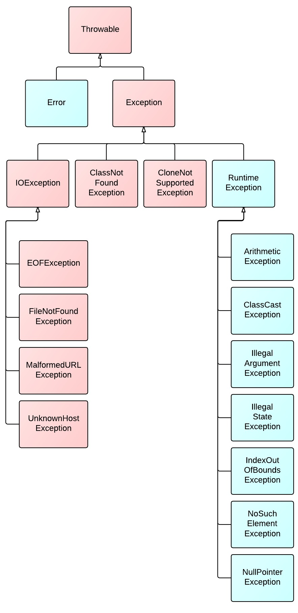
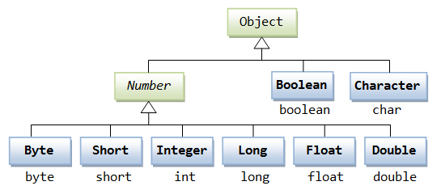
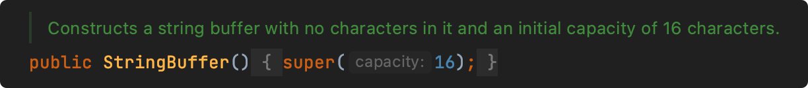
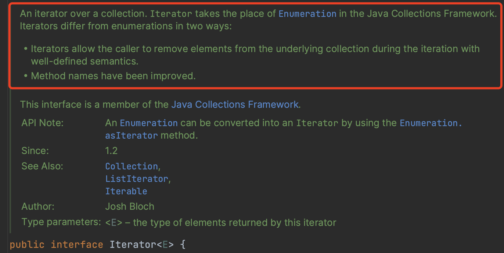
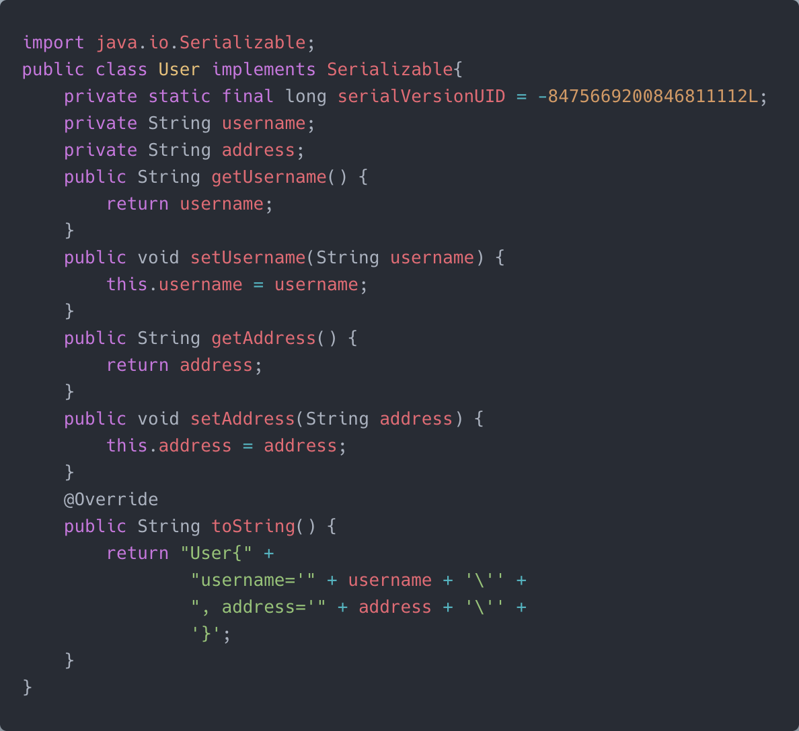

# 基础

### 1、面向对象编程有哪些特征？

##### 1、抽象（Abstract）

抽象就是对同一个目标的共有的属性（特征）和方法（功能/行为）进行抽取、归纳、总结。所以抽象不是了解和解决全部问题，而是选择公共的部分，忽略一个主题中与当前目标无关的那些方面。

##### 2、封装（Encapsulation）

封装就是指隐藏对象的属性和实现细节，控制成员属性的访问和修改权限，通过特定公开的方法暴露给外面访问。

比如以下代码：

```java
private String name = "java面试题";

public String getName() {
    return name;
}
```

name属性被`private`封装起来，外面只能通过对象的getName才能访问。

##### 3、继承（Inheritance）

继承就是指子类继承父类的成员和方法，使得子类也能具有父类相同的行为。

> Java类之间只能实现单继承，接口之间可以多继承。

##### 4、多态（Polymorphism）

多态是指同一个行为具有多个不同的表现形式或形态，如一个类的方法在不同的情况有不同表现形式。

>  比如方法重写（Method Overriding）：子类可以重写（覆盖）父类的方法，通过父类引用变量调用该方法时，根据实际对象的类型，会调用子类中的方法。

### 2、JDK与JRE的区别是什么？

##### JDK

JDK全称：`Java Development Kit`，是整个Java的核心，包含了Java运行环境（JRE）和一系列Java开发工具完整的包。

##### JRE

JRE全称：`Java Runtime Environment`，是Java程序的运行环境，包含JVM、Java核心类库等。

JRE只能用来运行Java应用程序，不能用于编译开发，它是JDK的子集。


安装完JDK后，就会有JRE目录，JRE属于JDK的子集。

### 3、如何编译和运行Java文件？

1、使用`javac`命令来编译.java文件

> javac Test.java

运行之后会生成Test.class文件

2、使用`java`命令来运行

> java Test

### 4、Java中的关键字有哪些？

|    关键字    |              含义              |
| :----------: | :----------------------------: |
|   package    |            指定包名            |
|    import    |             引用类             |
|    class     |             定义类             |
|  interface   |            定义接口            |
|   abstract   |        抽象类或抽象方法        |
|     new      |            创建对象            |
|     this     |            实例本身            |
|    super     |            引用父类            |
|     void     |             无返回             |
|     byte     |             字节型             |
|     char     |             字符型             |
|     int      |              整型              |
|    short     |             短整型             |
|     long     |             长整型             |
|    float     |          单精度浮点数          |
|    double    |          双精度浮点数          |
|   boolean    |             布尔型             |
|     enum     |             枚举型             |
|   strictfp   |            精确浮点            |
|   extends    |             继承类             |
|  implements  |            实现接口            |
|   private    |      私有权限，本类中可用      |
|  protected   |    保护权限，本包、本类和子类可用    |
|    public    |       公开权限，可跨包用       |
|    final     | 类不可继承，方法不可重写，常量 |
|    static    |            静态属性            |
| synchronized |            线程同步            |
|      if      |              如果              |
|     else     |              或者              |
|     for      |            for循环             |
|      do      |          do while循环          |
|    while     |          do while循环          |
|    switch    |        switch case分支         |
|     case     |        switch case分支         |
|   default    |        switch case分支         |
|    break     |            结束循环            |
|   continue   |            继续循环            |
|    return    |              返回              |
|     try      |          异常代码捕获          |
|    catch     |            异常处理            |
|   finally    |            最后处理            |
|    throw     |        手动抛出一个异常        |
|    throws    |        声明要抛出的异常        |
|  instanceof  |       判断是否XX类的实例       |
|   volatile   |            线程可见            |
|  transient   |           不用序列化           |
|    native    |         非Java实现方法         |
|    assert    |              断言              |
|     var      |      任何类型，JDK10增加       |

| 保留关键字 |      |
| :--------: | :--: |
|    goto    | 跳转 |
|   const    | 常量 |

| 特殊关键字 |      |
| :--------: | :--: |
|    true    |  真  |
|   false    |  假  |
|    null    | 空值 |

### 5、Java标识符命名规则是怎样的？

1、标识符只能由字母（a-z，A-Z）、数字（0-9）、下划线（_）和美元符号（$）组成；

2、标识符不能以数字开头；

3、标识符不能使用Java关键字；

4、标识符区分大小写；

### 6、Java类命名规范是怎样的？

类名首字母大写，后面每个单词首字母大写，符合**UpperCamelCase大驼峰式风格**，如：

- Order
- OrderDetail
- OrderMonthSummary

但一般像这种众所周知的缩写例外：DO、BO、DTO、VO、AO、PO、UID等。

### 7、Java方法命名规范是怎样的？

方法名首字母小写，后面每个单词首字母大写，符合**小驼峰式**，如：

- printIn
- indexOf
- saveOrderInfo

### 8、Java变量命名规范是怎样的？

变量包括方法参数名、成员变量、局部变量。

变量首字母小写，后面每个单词首字母大写，符合**lowerCamelCase小驼峰式风格**，如：

- amount
- orderPrice
- orderStockInfo

### 9、Java常量命名规范是怎样的？

常量名全部大写，单词间用下划线（_）隔开，如：

- MAX_LIMIT
- MAX_LOOP_COUNT
- ALIPAY_PAY_URL

### 10、Java常量和变量的区别？

##### Java常量和变量的主要区别在于：

常量是一个固定的值，赋值后是不能被改变的；

变量是一个不固定的值，赋值后是可以随时被改变的。

### 11、Java怎么定义一个常量？

Java使用`final`关键字来定义一个常量，如：

```Java
final int MAX_COUNT = 100;
```

也可以加修饰范围，以及静态关键字，如：

```java
private static final int MAX_COUNT = 100;
```

### 12、Java常量有几种类型？

##### Java常量有三种类型：

１、静态常量（类中）

２、成员常量（类中）

３、局部常量（类方法中）

### 13、Java有哪几种基本数据类型？

##### Java有4类8种数据类型，他们分别是：

###### 1、整型

`byte`、`short`、`int`、`long`

###### 2、浮点型

`float`、`double`

###### 3、字符型

`char`

###### 3、布尔型

`boolean`

### 14、`==`和`equals`比较有什么区别？

**==** ：

如果比较的对象是基本数据类型，则比较的是数值是否相同；

如果比较的是引用数据类型，则比较的是对象的地址是否相同。

**equals** ：

equals是Object类提供的方法，接收Object参数类型，如源码所示：

```java
public boolean equals(Object obj) {
    return (this == obj);
}
```

即用来比较两个对象是否相等，默认比较的是对象的地址，不能用于比较基本数据类型，但可以是包装类型，所以，如果要比较两个对象的值是否相等，一般需要重写equals和hashCode方法。

比如常用的`String`、`Date`、`Integer`等类都重写了equals和hashCode方法，使其比较的是存储对象的内容是否相等，而不是堆内存地址。

### 15、字符串比较是用`equals`还是`==`？为什么？

如String类源码所示，它已经重写了equals方法：


String中的equals方法是先用==比较是否是同一个对象，然后再比较内容是否相同。
**所以如果要比较字符串对象的内容是否相等就用equals方法，而要比较字符串的内存地址是否相等就用==比较，不过实际情况都是比较字符串内容而不会是比较内存地址。**

如下面的示例：

```java
public static void main(String[] args) {
    String str1 = new String("java面试题");
    String str1 = new String("java面试题");

    // 两个不同字符串对象 == 比较，返回false
    System.out.println(str1 == str2);
    
    // 两个字符串内容相同 equals 比较，返回true
    System.out.println(str1.equals(str2));
}
```

输出结果：

```
false
true
```

### 16、Java支持`xx ≠ null`不等于写法吗？

不支持，正常的不等于写法是：`!=`

如果你见过这种写法是开发工具里面的特效，只是一种字体显示而已。

### 17、`public`、`private`、`protected`、`default`的区别？


类的成员不写访问修饰时默认为default，默认对于同一个包中的其他类相当于公开（public），对于不是同一个包中的其他类相当于私有（private）。

受保护（protected）对子类相当于公开，对不是同一包中的没有父子关系的类相当于私有。

Java中，外部类的修饰符只能是public或默认，类的成员（包括内部类）的修饰符可以是以上四种。

### 18、`this`和`super`有什么区别？

##### this：代表当前对象本身；

this(...)：调用本类的构造方法；

this.成员变量：调用当前对象的成员变量，包括从父类继承的；

this.成员方法(...)：调用当前对象的成员方法，包括从父类继承的；

##### super：代表当前对象的父类；

super(...)：调用父类的构造方法；

super.成员变量：调用父类的成员变量；

super.成员方法(...)：调用父类的成员方法；

### 19、Java中的运算符都有哪些？

Java中的运算符有以下几类：

|   运算符   |                      示例                      |
| :--------: | :--------------------------------------------: |
| 算术运算符 |              +   -  *  %  ++   --              |
| 关系运算符 |           ==    !=   >   <   >=   <=           |
|  位运算符  |             &  ^  ~  >>   <<  >>>              |
| 逻辑运算符 |                  &&  \|\|  !                   |
| 赋值运算符 | =  +=  -=  *=  /=  (%)=  <<=  >>=  &=  ^=  \|= |
| 三目运算符 |                      ? :                       |

优先级从高到低排列：

|   类别   |                                                 |  关联性  |
| :------: | :---------------------------------------------: | :------: |
|   后缀   |                     () [] .                     |  左到右  |
|   一元   |                     i++ i-                      | 从左到右 |
|   一元   |              ++i  --i  +  -  ~  !               | 从右到左 |
|   乘性   |                     *  /  %                     |  左到右  |
|   加性   |                      +  -                       |  左到右  |
|   移位   |                   >>  >>>  <<                   |  左到右  |
|   关系   |                   >  >= < <=                    |  左到右  |
|   相等   |                     ==  !=                      |  左到右  |
|  按位与  |                        &                        |  左到右  |
| 按位异或 |                        ^                        |  左到右  |
|  按位或  |                       \|                        |  左到右  |
|  逻辑与  |                       &&                        |  左到右  |
|  逻辑或  |                      \|\|                       |  左到右  |
|   条件   |                       ? :                       | 从右到左 |
|   赋值   | =  +=  -=  *=  /=   %=   >>=  <<=  &=  ^=   \|= | 从右到左 |
|   逗号   |                       ，                        |  左到右  |

### 20、`s1 = s1 + 1` 和 `s1 += 1` 的区别？

如果`s1`原有数据类型小于int类型，如：short s1 = 10，则s1 = s1 + 1会发生编译异常。因为s1为short类型，而数字1默认为int类型，索引计算的结果则为int类型，它不能自动转换为比它更小的类型，所以会发生编译异常。

使用s1 += 1则不会有任何问题，因为s1 += 1 有`隐式强制类型转换`，涉及到表达式类型自动提升，会自动提升为计算结果的数据类型。

### 21、`short s1 = 1;` `s1 += 1;`有错吗？

没错，可以正常编译，如下图所示：


因为s1 +=1;相当于s1 = (short) (s1 + 1)，其中有隐式强制类型转换。

### 22、`short s1 = 1;` `s1 = s1 + 1;` 有错吗？

有错，如下图所示：


因为1是int类型，因此s1 + 1运算结果也是int类型，需要强制转换类型才能赋值给short型。


### 23、`float n = 1.8` 有错吗？

有错！！！
数字1.8默认是双精度数（double），将双精度型（double）赋值给单精度型浮点型（float）属于向下转型（down-casting，也称为窄化），会产生编译错误，因此需要强制类型转换：

>float n = (float) 1.8;

或者写成这种形式：

> float f = 1.8F;

F即表示float类型。

### 24、`i++`和`++i`的区别？

i++是先取值后再自增，++i是先自增后再取值。

```java
public static void main(String[] args) throws Exception {
    int i = 1;
    int j = i++ + 1;
    System.out.println(j); // j =2
    
    i = 1;
    int k = ++i + 1;
    System.out.println(k); // k = 3
}
```

程序解读：

- i++先取值再自增，所以j = 1 + 1 = 2
- ++i先自增再取值，所以k = 2 + 1 = 3

### 25、`while`和`do while`有什么区别？

while和do while都是循环语句，不同的是，while是先判断条件再执行循环，而do while是先执行循环再判断条件：

```java
public static void main(String[] args){
    int i = 0;
    while(i < 5){
        System.out.println("i =" + ++i);
    }
    i = 0;
    do{
        System.out.println("i =" + ++i);
    }while(i < 5);
}
```

所以说，在同样条件下，如果初始条件不成立，do while是会多执行一次的。

### 26、如何跳出Java中的循环？

##### 可以使用以下关键字：

|   关键字   |          说明          |
| :--------: | :--------------------: |
| `continue` |    跳出当前本次循环    |
|  `break`   |      跳出整个循环      |
|  `return`  | 跳出整个循环及当前方法 |

### 27、如何跳出Java中的多层嵌套循环？

可以在最外面的循环语句前定义一个标号，然后在最里层循环体中使用break标号语句跳出嵌套循环，如以下程序所示：

```java
public static void main(String[] args){
    test:
    for(int i = 0; i < 100; i++){
        for(int j = 0; j < 100; j++){
            System.out.println("i =" + i + ", j = " + j);
            if(j == 66){
                break test;
            }
        }
    }
}
```

输出结果如下：


可以看到，i只输出到0，证明多层循环被全部跳出了。

### 28、`&`和`&&`的区别？

> 逻辑判断推荐使用&&，位运算则需要使用&

`&`和`&&`都可以用作逻辑与的运算符，表示逻辑与（and），当运算符两边的表达式的结果都为true时，整个运算结果才为true，否则，只要有一方为false，则结果为false。

`&&`还具有短路的功能，即如果第一个表达式为false，则不再计算第二个表达式。

`&`还可以用作位运算符，当`&`操作符两边的表达式不是boolean类型时，&表示按位与操作，我们通常使用0x0f来与一个整数进行&运算，来获取该整数的最低4个bit位，例如，0x31 & 0x0f的结果为0x01。

### 29、Java怎么进行数组初始化？

方法一：

```java
// 一维数组
int[] arr = new int[5];

// 二维数组
int[][] arr = new int[3][4];
```

方法二：

```java
// 一维数组
int[] arr = {1, 2, 3, 4, 5};
```

### 30、数组有没有`length`方法？`String`呢？

数组没有`length()`方法，但是有`length`属性，String有`length()`方法。

使用示例如下：

```java
public static void main(String[] args) {
    String str = "java";
    String[] languages = new String[]{"java", "php", "go"};
    System.out.println(str.length());
    System.out.println(languages.length);
}
```

结果输出：

```
4
3
```


### 31、怎么理解值传递和引用传递？

**值传递**：传递的是基本类型参数的字面量值的拷贝，方法对参数的修改不会影响之前参数的值。

**引用传递**：传递的是该参量所引用的对象在堆中的地址值的拷贝，而不是拷贝整个对象本身，方法对参数的修改会直接影响参数之前的值。
> 严格来说，Java只有值传递，看传递的对象是基本数据类型，还是引用类型，理解这一点，怎么个说法并不重要。

### 32、Java到底是值传递还是引用传递？

Java中方法参数严格来说是按`值传递`的。

如果参数是`基本类型`：传递的是基本类型的字面量值的拷贝。

如果参数是`引用类型`：传递的是该参量所引用的对象在堆中地址值的拷贝。

### 33、Java中的注释有哪些写法？

1、单行注释：

```java
private int id; // 单行注释
```

2、块注释：

```java
private int id; /*块注释*/
```

3、文档注释：

```java
/**
* 文档注释
*/
private int id;
```

### 34、Java中的构造方法是什么？

构造方法是构造类的主要方法，Java中的每个类都必须要有构造方法，构造方法名和类名相同，没有返回类型，new 一个对象的时候就会调用指定的构造方法；

```java
java class Test{
    private int id;
    
    public Test(){
        this.id = 1000;
    }
}
```

如果只有一个默认的构造方法，不需要赋值初始化，则可以省略，比如：

```java
public class Test{
    private int id;
    
    public int getId(){
        return id;
    }
    
    public void setId(int id){
        this.id = id;
    }
}
```

### 35、Java一个类可以有多少个构造方法？

一个类`至少要有一个`构造方法，也可以`有多个`构造方法，即构造方法重载，方法参数数量或者类型不同，如代码所示：

```java
public class Test{
    private int id;
    public Test(){
        this.id = 100;
    }
    
    public Test(String sid){
        this.id = Integer.parseInt(sod);
    }
}
```

如果没有显式地创建构造方法，Java编译器也会为该类提供一个默认的构造方法。

### 36、`static`关键字有什么用？

`static`代表`“静态”`的意思，可以用来修饰内部类、类的成员方法、类的成员变量，以及static静态代码块。

- 静态内部类（静态内部类可以不依赖外部类实例对象而被实例化，而内部类需要在外部类实例化后才能被实例化）
- 静态方法（静态方法属于类方法，不需要实例化对象就能调用）
- 静态变量（静态变量属于类，不需要实例化对象就能调用）
- 静态代码块（静态代码块只会在类被加载时执行且执行一次）

使用实例如下：

```java 
public class Test {
    static {
        System.out.println("静态代码块");
    }
    static class Test2 {
        
    }
    private static int id = 0;
    
    public static void staticMethod() {
        
    }
}
```


### 37、`static`变量和普通变量的区别？

##### 1、所属目标不同

静态变量属于类的变量，普通变量属于对象的变量。

##### 2、存储区域不同

静态变量存储在方法区的静态区，普通变量存储在堆区。

> 另外：JDK7及以上，静态变量存储在其对应的Class对象中，而Class对象和其他普通对象一样，都存储在堆中的。

##### 3、加载时间不同

静态变量是随着类的加载而加载，随着类的消失而消失；

普通变量随着对象的加载而加载，随着对象的消失而消失。

##### 4、调用方式不同

静态变量只能通过类名、对象调用，普通变量只能通过对象调用。

### 38、`static`可以修饰局部变量吗？

`static`不能修饰局部变量，可以是内部类、全局成员变量、方法、代码块。

### 39、在static方法中可不可以使用this或super，为什么？

在static方法中不可以使用this和super关键字：

```java
public static void main(String[] args) throws Exception {
    this.wait();
    super,hashCode();
}
```

因为this和super代表的是实例化后的操作对象，而static属于类级别，无法指向任何实例。

### 40、final关键字有哪些用法？

| 修饰类型 |                      说明                      |
| :------: | :--------------------------------------------: |
|  修饰类  |               表示该类不能被继承               |
| 修饰方法 |              表示该方法不能被重写              |
| 修饰变量 | 表示该变量是一个常量，只能赋值一次，不能被修改 |

### 41、final、finally、finalize有什么区别？

`final`

final是修饰符：

- 如果修饰类，此类不能被继承；
- 如果修饰方法，此方法不能被重写；
- 如果修饰变量，此变量就不能在被改变。

`finally`

finally是try-catch-finally最后的一部分，表示不论发生任何情况都会执行的部分，finally部分可以省略，但如果finally部分存在，则一定会执行finally里面的代码（发生Error错误等非程序性异常除外）。

`finalize`

finalize是Object类的一个方法，在垃圾收集器执行的时候会自动调用被回收对象的此方法，一般不建议主动使用。

### 42、Java支持多继承吗？

Java类与类之间不支持多继承，只能单继承：


Java接口与接口之间支持多继承：


### 43、Java类可以实现多个接口吗？

可以的，一个类可以实现多个接口：


### 44、重载和重写有什么区别？

##### 方法重写

是父类与子类之间多态性的一种表现，即子类可以覆盖从父类继承的方法，重写的方法一般使用@Override标识，比如以下实例：

```java
@Override
public String toString() {
    return this.getName() + ......
}
```

这里是重写了Object祖先类的toString方法。

##### 方法重载

是一个类中方法多态性的一种表现，即一个类中可以有多个同名的方法，方法的参数类型不同，或者参数个数不同，放回类型可以相同也可以不同，比如以下实例：

```java
public Connection connection(String host) {
    ...
}
public Connection connection(String host, int port) {
    ...
}
```

同一个方法名，可以有多个不同的连接参数创建连接，这是很常见的方法重载方式。

##### 重载（Overload）：

在一个类中，具有相同的方法名，但是方法的参数不同，返回值类型可以相同也可以不同。

- 被重载的方法必须改变参数里表（参数个数或类型不一样）；
- 被重载的方法可以改变返回类型；
- 被重载的方法可以改变返回类型；
- 被重载的方法可以生命新的或更广的检查异常；
- 方法能够在同一个类中或者在一个子类中被重载；
- 无法以返回值类型作为重载函数的区分标准。

##### 重写（Override）：

一般都是表示子类和父类之间的关系，其主要的特征是：方法名相同，参数相同，但是具体的实现不同。

- 参数列表与被重写方法的参数列表必须完全相同；
- 返回类型与被重写方法的返回类型可以不相同，但是必须是父类返回值的派生类（Java5及更早版本返回类型要一样，Java7及更高版本可以不同）；
- 访问权限不能比父类中被重写的方法的访问权限更低。例如：如果父类的一个方法被声明为`public`，那么再子类中重写该方法就不能声明为`protected`；
- 父类的成员方法只能被他的子类重写；
- 声明为`final`的方法不能被重写；
- 声明为`static`的方法不能被重写，但是能够被再次声明；
- 子类和父类不在同一个包中，那么子类只能够重写父类的声明为public和protected的非final的方法；
- 重写的方法能够抛出任何强制异常，无论被重写的方法是否抛出异常。但是，重写的方法不能抛出新的强制性异常，或者比被重写方法声明的更广泛的强制性异常，反之则可以。
- 构造方法不能被重写；
- 如果不能继承一个类，则不能重写该类的方法。

### 45、构造器可以被重写和重载吗？

一个类的构造器只属于当前类，它不能被继承，所以它不能被重写。

一个类里面可以有多个构造器，所以它可以被重载。

### 46、私有方法能被重载或者重写吗？

##### 使用private修饰的私有方法，只可以重载，不能被子类重写。

因为private该作用域就只能在当前类中可见，子类见都见不到，别谈重写，重写至少需要protected及以上的作用域。

### 47、静态方法能被重载或者重写吗？

**静态方法可以被重载**，一个类可以存在多给同名但不同参数的static方法。

**静态方法不可以被重写**，如果子类也定义了相同的，会被子类同名的静态变量，静态方法所隐藏。

### 48、静态方法可以被继承吗？

（1）父类的静态属性、静态方法可以被子类继承；

（2）如果子类也定义了相同的静态属性、方法，那父类中的定义就会被子类同名的静态变量，静态方法所隐藏。

### 49、Java异常有哪些分类？

下面是Java异常类的组织结构，红色区域的异常类表示是程序需要显示捕捉或者抛出的。

 

##### Throwable

Throwable是Java异常的顶级类，所有的异常都继承于这个类。

Error，Exception是异常类的两个大分类。

##### Error

Error是非程序异常，即程序不能捕获的异常，一般是编译或者系统性的错误，如OutOfMeorry内存溢出异常等。

##### Exception

Exception是程序异常类，由程序内部产生。Exception又分为运行时异常、非运行时异常。

##### 运行时异常

运行时异常的特点是Java编译器不会检查它，也就是说，当程序中可能出现这类异常，即使没有用try-catch语句捕获它，也没有用throws子句声明抛出它，也会编译通过，运行时异常可处理或者不处理。

常见的运行时异常如NullPointException、ArrayIndexOutOfBoundsException等。

##### 非运行时异常

非运行时异常是程序必须处理的异常，捕获或者抛出，如果不处理程序就不能编译通过。如常见的IOException、ClassNotFoundException等。

### 50、Error和Exception有什么区别？

Error和Exception都属于异常总父类Throwble的子类：


**Error** ：表示系统级的错误和程序不必处理的异常，它是一种严重的非程序性的错误，比如内存溢出错误，他不能由程序控制和处理。

**Exception** ：表示程序性异常，可以由程序进行定义，控制和处理。

### 51、Java中常见的异常有哪些？

##### 1、NullPointerException

空指针异常，操作一个null对象的方法或属性时会抛出这个异常。

##### 2、OutOfMemoryError

内存异常，这不是程序能控制的，是指要分配的对象的内存超出了当前最大的堆内存，需要调整堆内存大小（-Xmx）以及优化程序。

##### 3、IOException

IO，即input，output，我们在读写磁盘文件、网络内容的时候经常会发生的一种异常，这种异常是受检查异常，需要进行手工捕获。

如文件读写会抛出IOException：

```java
public int read() throws IOException
public void write(int b) throws IOException
```

##### 4、FileNotFoundException

文件找不到异常，如果文件不存在就会抛出这种异常。

如定义输入输出文件流，文件不存在会报错：

```java
public FileInputStream(File file) throws FileNotFoundException
public FileOutputStream(File file) throws FileNotFoundException
```

##### 5、ClassNotFoundException

类找不到异常，Java开发中经常遇到，是不是很绝望？这是在加载类的时候抛出来的，即在类路径下不能加载指定的类。

实例：

```java
public static <T> Class<T> getExistingClass(ClassLoader classLoader, String className) {
    try {
        return (Class<T>) Class.forName(className, true, classLoader);
    } catch (ClassNotFoundException e) {
        return null;
    }
}
```

他是受检查异常，需要进行手工捕获。

##### 6、ClassCastException

类转换异常，将一个不是该类的实例转换成这个类就会抛出这个异常。

如将一个数字强制转换成字符串就会报这个异常：

```java
Object x = new Integer(0);
System.out.println((String)x);
```

这是运行时异常，不需要手工捕获。

##### 7、NoSuchMethodException

没有这个方法异常，一般发生在反射调用方法的时候，如：

```java
public Method getMethod(String name, Class<?>... parameterTypes) throws NoSuchMethodException, SecurityException {
    checkMemberAccess(Member.PUBLIC, Reflection.getCallerClass(), true);
    Method method = getMethod0(name, parameterTypes, true);
    if(method == null) {
        throw new NoSuchMethodException(getName() + "." + name + argumentTypesToString(parameterTypes));
    }
    return method;
}
```

它是受检查异常，需要进行手工捕获。

##### 8、IndexOutOfBoundsException

索引越界异常，当操作一个字符串或者数组的时候经常遇到的异常。


如图所示，它是运行时异常，不需要手工捕获。

##### 9、ArithmeticException

算术异常，发生在数字的算术运算时的异常，如一个数字除以0就会报这个错。

```java
double n = 3 / 0;
```

这个异常虽然是运行时异常，可以手工捕获抛出自定义的异常，如：

```java
public static TimeStamp from(Instant instant) {
    try {
        Timestamp stamp = new Timestamp(instant,getEpochSecond() * MILLIS_PER_SECOND);
        stamp.nanos = instant.getNano();
        return stamp;
    } catch (ArithmeticException ex) {
        throw new IllegalArgumentException(ex);
    }
}
```

##### 10、SQLException

SQL异常，发生在操作数据库时的异常。

如下面的获取连接：

```java
public Connection getConnection() throws SQLException {
    if (getUser() == null) {
        return DriverManager.getConnection(url);
    } else {
        return DriverManager.getConnection(url, getUser(), getPassword());
    }
}
```

又或者是获取下一条记录的时候：

```java
boolean next() throws SQLException;
```

它是受检查异常，需要进行手工捕获。

### 52、Java中常见的运行时异常有哪些？

常见的运行时异常（RuntimeException）主要有：

|           异常            |       说明       |
| :-----------------------: | :--------------: |
|   NullPointerException    |    空指针异常    |
| IndexOutOfBoundsException |   数组越界异常   |
|    ClassCastException     | 类型强制转换异常 |
|    ArithmeticException    |     算术异常     |
|     SecurityException     | 违背安全原则异常 |

更多可以查看RuntimeException运行时异常类的子异常。

### 53、运行时异常与受检查异常有什么区别？

##### 运行时异常

指RuntimeException异常类及其子类，表示在程序运行时才可能发生的异常，编译器编译时不用检查，方法可以不用主动catch，也可以不用throws声明抛出运行时异常。

##### 受检查异常

指非RuntimeException类型的异常，即编译器在编译时就会检查的异常，方法需要主动catch或者用throws生命所有的受检查异常，不然会出现编译错误。

----

空指针异常是运行时异常： 


在程序中可以不用声明，也不用捕获。

IO异常是受检查异常：


在程序中必须声明或者捕获。

### 54、什么时候会发生空指针异常？

当一个变量的值为null时，在Java里面表示一个不存在的空对象，没有实际内容，没有给它分配内存，null也是对象成员变量的默认值。

所以，一个对象如果没有进行初始化操作，这时候，如果你调用这个对象的方法或者变量，就会出现空指针异常。如下面实例会发生空指针异常：

```java
Object object = null;
String string = object.toString();
```


从类结构图来看，空指针它是属于运行时异常RuntimeException的子类，他不是捕获型的，只有在程序运行时才可能报出来，而且会造成程序中断。

### 55、你知道有哪些避免空指针的方法？

下面说几个空指针的几个最常见的案例及解决之道。

##### 1、字符串比较，常量放前面

```java
if(status.equals(SUCCESS)) {
    
}
```

这个时候status可能为null造成空指针异常，应该把常量放前面，就能避免空指针异常。

```java
if(SUCCESS.equals(status)) {
    
}
```

这个应该在各种开发规范里面都会提到，也是最基础的。

##### 2、初始化默认值

在对象初始化的时候给它一个默认值或者默认构造实现，如：

```java
User user = new User();
String name = StringUtils.EMPTY;
```

##### 3、返回空集合

在返回一个集合的话，默认会是null，统一规范返回一个空集合。

举个List例子，如：

```java
public List getUserList() {
    List list = userMapper.getUserList();
    return list == null ? new ArrayList() : list;
}
```

这样接收方就不用担心空指针异常了，也不会影响业务。

4、断言

断言是用来检查程序的安全性的，在使用之前进行检查条件，如果不符合条件就报异常，符合就继续。

Java中自带的断言关键字：assert，如：

```java
assert name == null : "名称不能为空";
```

输出：

```java
Exception in thread "main" java.lang.AssertionError
```

不过默认是不启动断言检查的，需要带上JVM参数：-enableassertions才能生效。

Java中这个用的很少，建议使用Spring中的，更强大，更方便好用。

Spring中的用法：

```java
Assert.notNull(name, "名称不能为空");
```

##### 5、Optional

Optional是JDK8新增特性，再也不用!=null来判断了，这个在一个对象里面的多个子对象连续判断的时候非常有用。

> 这里大概介绍5种，其实还有更多，如何避免空指针，一是要注意代码编写规范，二是要提高代码素养。

### 56、throw和throws的区别？

throw用在方法中，用来主动抛出一个异常。

throws则是用在方法声明中，声明方法可能会抛出的异常。

来看Object#wait方法的使用示例：


两个不一定要同时使用，如果方法中抛出的是RuntimeException及其子异常，则方法可以不用throws声明，否则需要强制声明，比如下面的示例：


test1方法正常编译，而test2方法抛出的不是RuntimeException类型，又没有使用throws声明抛出，所以会报编译错误：

正确修改后：

```java
public void test1() {
    throw new RuntimeException("小程序Java面试库，发生异常");
}

public void test2() thorows Exception {
    throw new Exception("小程序Java面试库，发生异常");
}
```

### 57、try-catch-finally中哪个部分可以省略？

try-catch-finally其中catch和finally都可以被省略，但是不能同时省略，也就是说有try的时候，必须后面跟一个catch或者finally。

如果是资源处理类型，并且实现了AutoCloseable接口，把定义他放在try(...)中，然后方法上再加上throws异常，是可以省略catch和finally的，只需要try即可，比如：

```java
private void test() throws Exception {
    try (InputStream is = new FileInputStream("")) {
        ...
    }
}
```

### 58、Java可以一次catch多个异常吗？

Java7开始可以一次catch多个异常，比如：

```java 
public static void main(String[] args) throws Exception {
    try {
        System.out.println("小程序，Java面试库");
    } catch (SecurityException | NullPointerException | NoClassDefFoundError e) {
        
    }
}
```

### 59、使用try-catch会影响性能吗？

一般情况下，try-catch块的执行时间很短，它不会对性能产生显著的影响。

但是在极端情况下，try-catch块的使用可能会对性能产生影响。比如在代码中频繁地抛出和捕获异常，尤其是在高并发的情况下，try-catch块的性能可能会成为瓶颈。在这种情况下，可以使用其他方式处理异常，如：条件判断，以提高代码的性能。

来自阿里巴巴《Java开发手册》中的异常规范：

> 异常设计的初衷是解决程序运行中的各种意外情况，且异常的处理效率比条件判断方式要低很多，所以：
>
> （1）可以通过预检查的放过是规避异常，而不是依赖try-catch来处理。
>
> （2）异常捕获后不要用来做流程控制，条件控制。

### 60、int和Integer有什么区别？

最主要的几点区别：

（1）int是一种基本数据类型，Integer则是int的包装类型。

（2）int的默认值是0，而Integer属于Java类，所以他的默认值是null。

（3）int可以直接使用，而Integer属于Java类，所以它需要经过实例化才能使用。

（4）Integer属于Java类，所以他的使用范围更广，比如泛型，int则不行。

### 61、什么是包装类型？有什么用？

Java设计当初就提供了8种基本数据类型及对应的8种包装数据类型。我们知道Java是一种面向对象编程的高级语言，所以包装类型正是为了解决基本数据类型无法面向对象编程所提供的。

下面是基本数据类型与对应的包装类型。

| 基本数据类型 | 包装类型  |
| :----------: | :-------: |
|     byte     |   Byte    |
|   boolean    |  Boolean  |
|    short     |   Short   |
|     char     | Character |
|     int      |  Integer  |
|     long     |   Long    |
|    float     |   Float   |
|    double    |  Double   |

下面是包装类型的继承结构图。




从以上图表可以对基本类型和包装类型有一个全面的了解。

##### 包装类应用场景

###### 1、集合类泛型只能是包装类；

```java
// 编译报错
List<int> list1 = new ArrayList<>();

// 正常
List<Integer> list2 = new ArrayList<>();
```

###### 2、成员变量不能有默认值；

```java
private int status;
```

基本数据类型的成员变量都有默认值，如以上代码status默认值为0，如果定义中0代表失败，那样就会有问题，这样只能使用包装类Integer，它的默认值为null，所以就不会有默认值影响。

###### 3、方法参数允许定义空值；

```java
private static void test1(int status) {
    System.out.println(status);
}
```

看以上代码，方法参数定义的是基本数据类型int，所以必须得传一个数字过来，不能传null，很多场合我们希望是能传递null的，所以这种场合用包装类比较合适。

### 62、什么是自动装箱、拆箱？

##### 自动装箱、拆箱

Java5增加了自动装箱、拆箱机制，提供基本数据类型和包装类型的相互转换操作。

###### 自动装箱

自动装箱即自动将基本数据类型转换成包装类型，在Java5之前，要将基本数据类型转换成包装类型只能这样做，看下面的代码：

```java
public static void main(String[] args) {
    Integer i1 = new Integer(8); // 此种方式，Java9+已标识废除
    Integer i2 = Integer.valueOf(8);
    
    // 自动装箱
    Integer i3 = 8;
}
```

第3种方法也正是自动装箱功能，其实自动装箱的原理就是调用包装类的valueOf方法，如第2个方法中的Integer.valueOf方法。

> 另外，第一种构造器方法也不推荐使用了，已经标示废弃了。

###### 自动拆箱

自动拆箱即自动将包装类型转换成基本数据类型，与自动装箱相反，有装就有拆，很好理解，看下面的例子：

```java
public static void main(String[] args) {
    Integer i1 = new Integer(8);
    Integer i2 = Integer.valueOf(8);
    
    // 自动装箱
    Integer i3 = 8;
    
    // 自动拆箱
    int i4 = i3;
    int i5 = i3.intValue();
}
```

把i3赋值给i4就是实现的自动拆箱功能，自动拆箱的原理就是调用包装类的xxValue方法，如i5中的Integer的intValue方法。

> 自动装箱、拆箱不只是体现在以上的例子，在方法接收参数，对象设置参数是都能自动装箱、拆箱。

### 63、你怎么理解Java中的强制类型转换？

强制类型转换即强制显示的把一个数据类型转换为另外一种数据类型。

如以下示例：

```java
short s= 199;
int i = s;   // 199

double d = 10.24;
long ll = (long)d; // 10
```

以上的转换结果都在我们的预期之内，属于正常的转换和丢失精度的情况，下面的例子就一样属于数据溢出的情况：

```java
int ii = 300;
byte b = (byte)ii;
```

300已经超出了byte类型表示的范围，所以会转换成一个毫无意义的数字。

### 64、你怎么理解Java中的自动类型转换？

**自动类型转换**：是指数字表示范围小的数据类型可以自动转换成范围大的数据类型。

如：

```java
long l = 100;

int i = 200;
long ll = i;
```

具体自动转换如下如图所示。


实线表示自动转换时不会造成数据丢失，虚线则可能会出现数据丢失问题。

自动转换也要小心数据溢出问题，看下面的例子。

```java
int count = 100000000;
int price = 1999;
long totalPrice = count * price;
```

编译没任何问题，但结果却输出的是负数，这是因为两个int相乘得到的结果是int，相乘的结果超出了int的代表范围。这种情况，一般把第一个数据转换成范围大的疏忽类型再和其他的数据进行运算。

```java
int count = 100000000;
int price = 1999;
long totalPrice = (long)count * price;
```

另外，向下转换时可以直接将int常量字面量赋值给byte、short、char等数据类型，而不需要强制转换，只要该常量值不超过该类型的表示范围都能自动转换。

### 65、你怎么理解Java中的类型提升？

所谓类型提升就是指在多种不同数据类型的表达式中，类型会自动向范围表示大的值得数据类型提升。

如下面的示例：

```java
long count = 10000000;
int price = 1999;
long totalPrice = price * count;
```

price为int型，count为long型，运算结果自动向上提升为long型，运算结果正常，没有出现溢出的情况。

### 66、怎么理解Java中的多态机制？

多态，即“多种状态”的意思，在Java中有以下几种情形。

##### 一、方法多态

- **方法重写**：是父类与子类之间多态性的一种变现，即子类可以覆盖从父类继承的方法；
- **方法重载**：是一个类中方法多态性的一种表现，即一个类中可以有多个同名的方法，方法的参数类型不同，或者参数个数不同，返回类型可以相同也可以不同；

##### 二、对象多态

- **接口和实现类**：接口可以有多种不同的实现形式；
- **抽象类和实现类**：抽象类和实现类可以有多种不同的形式；

### 67、Java如何获取用户的输入？

可以通过Scanner类来获取用户的输入，即：java.util.Scanner。

基本语法：

> Scanner s = new Scanner(System.in);

然后通过next()或者nextLine()方法获取输入的字符串，比如以下实例：

```java
public static void main(String[] args) {
    Scanner scanner = new Scanner(System.in);
    String text = scanner.nextLine();
    System.out.println(text);
}
```

### 68、switch是否能用在long上？

长整型（long）在目前所有的版本中都是不支持的：


在开发工具中会出现编译错误，并提示可用的类型。

### 69、switch是否能用在String上？

从Java7开始，是可以用在字符串（String）上的，来看使用示例：

```java
public static void main(String[] args) {
    String str = "Java";
    switch(str) {
        case "C++":
            System.out.println(0);
            break;
        case "Java":
            System.out.println(1);
            break;
        default:
            System.out.prinln(2);
    }
}
```

程序输出：1

### 70、switch case支持哪几种数据类型？

Java中switch case语句用来判断一个变量与一系列值中某个值是否相等，每个值称为一个分支。

语法格式如下：

```java
switch(expression) {
    case value :
        // 语句
        break; // 可选
    case value :
        // 语句
        break; // 可选
    // 你可以有任意数量的case语句
    default : // 可选
        // 语句
}
```

这里的`expression`都支持哪些类型呢？

- 基本数据类型：byte、short、char、int
- 包装数据类型：Byte、Short、Character、Integer
- 枚举类型：Enum
- 字符串类型：String（JDK 7+ 开始支持）

基本数据类型和字符串很简单不用说，下面举一个使用包装类型和枚举的，其实也不难，注意只能用在switch块里面。

```java
// 使用包装类型
Integer value = 5;
switch (value) {
    case 3:
        System.out.println("3");
        break;    
    case 5:
        System.out.println("5");
        break;
    default:
        System.out.println("default");
}

// 使用枚举类型
Status status = Status.PROCESSING;
switch (status) {
    case OPEN:
        System.out.println("open");
        break;
    case PROCESSING:
        System.out.println("processing");
        break;
    case CLOSE:
        System.out.println("close");
        break;
    default:
        System.out.println("default");
}
```

以下为官网的介绍文档。

> https://docs.oracle.com/javase/tutotial/java/nutsandbolts/switch.html

使用switch case语句也有以下几点需要注意。

1、case里面必须跟break，不然程序会一个个case执行下去，直到最后一个break的case或者default出现；

2、case条件里面只能是常量或者字面常量；

3、default语句可有可无，最多只能有一个；

### 71、String属于基础的数据类型吗？

String是字符串类，属于Java中的“类”，它不属于基础数据类型。


### 72、String类的常用方法都有哪些？

String类常用的方法有：

| 方法        | 说明                     |
| ----------- | ------------------------ |
| equals      | 比较值是否相同           |
| indexOf     | 返回指定字符的索引       |
| charAt      | 返回指定索引处的字符     |
| replace     | 字符串替换               |
| trim        | 去除字符串两端空白       |
| split       | 分割字符串成数组         |
| getBytes    | 获取字符串的byte类型数组 |
| length      | 获取字符串长度           |
| toLowerCase | 转成小写字母             |
| toUpperCase | 转成大写字母             |
| substring   | 截取字符串               |


### 73、String字符串如何进行反转？

（1）最快的方法是借助StringBuilder或者StringBuffer中的reverse方法。

（2）借助字符串的charAt方法，从后到前遍历字符串，然后填充起来。

（3）借助Collections.reverse(List ...)方法，先把字符串转为List然后再反转。

（4）借助其他第三方工具类，比如CollectionUtils工具类等。

### 74、String字符串如何实现编码转换？

先通过getBytes方法获取字节数组，再使用带编码的String构造器。

如代码所示，把字符串转换成UTF-8：

```java
public static void main(String args) throws Exception {
    String text1 = "java面试题";
    String text2 = new String(text1.getBytes(), "UTF-8");
    System.out.println(text1);
    System.out.println(text2);
}
```

### 75、String与byte[]之间如何转换？

String > byte[]通过String类的getBytes方法；

byte[] > String通过new String(byte[])构造器。

### 76、String.trim()方法有什么用？

String.trim()用于去掉字符串**首尾**的空白字符（它不能去除中间的空白字符）。

### 77、字符串分割有哪些方式？

（1）使用字符串自身的split方法；

（2）使用JDK的StringTOkenizer工具类；

（3）使用Spring/Apache commons-lang等工具包中的工具类；

（4）自己可以利用indexOf方法写一个分割工具类。

###  78、字符串工具类isEmpty和isBlank的区别？

isEmpty和isBlank到底有啥区别？

##### （1）isEmpty

判断字符串是否为空字符串，只要有一个任意字符（包括空白字符）就不为空。

来看isEmpty的方法源码：

```java 
public static boolean isEmpty(CharSequence cs) {
    return cs = null || cs.length() == 0;
}
```

看见没，这个方法值判断了是否为null或者长度为0。

意味着，如果用户输入“ ”等空白字符，这个方法就不通过了，结果就是不为空了。

如验证输入以下内容：

| 输入内容     | 是否为空 |
| ------------ | -------- |
| “       ”    | 否       |
| “”           | 是       |
| “Java面试题” | 否       |

##### 2、isBlank

判断字符串是否为空字符串，全部空白字符也为空。

来看isBlank的方法源码：

```java
public static boolean inBlank() {
    int strLen = length(cs);
    if(strLen == 0) {
        return true;
    } else {
        for(int i = 0; i < strLen; ++i) {
            if(!Character.isWhitespace(cs.charAt(i))) {
                return false;
            }
        }
        return true;
    }
}
```

看见没，第7行，只要有一个字符不为空白字符就返回false，也就是说，如果全部都为空白字符就返回true，也就是全部空白字符也为空。


| 输入内容     | 是否为空 |
| ------------ | -------- |
| “       ”    | 是       |
| “”           | 是       |
| “Java面试题” | 否       |

这时候，如果用户输入“   ”等空白字符，这个方法也返回空了，这也是大部分业务场景下我们期望出现的结果。

##### isEmpty和isBlank怎么选？

很明显，我们要判断一个字符串为空，绝大部分情况下“空白字符”也要为空的，严谨来说肯定要用isBlank，虽然isEmpty也可以，但如果再最前端的就扣不被拦截掉，请求到了后端的服务、数据库，就可能会造成压力，甚至是系统异常，这是完全可以避免的。

但万事也没有绝对，如果你的程序可以接受任意字符，包括“空白字符”，那就要选择isEmpty，isBlank会拦截所有空白字符，就达不到要求。

与之相对应的一般还有isNotEmpty和isNotBlank，这都是对工具类的封装。

### 79、StringBuffer和StringBuilder的区别？

先看看StringBuffer和StringBuilder的类结构吧：


其实很简单，就是继承了一个抽象的字符串父类：AbstractStringBuilder。下面我们再来看看它们的三个区别。

##### 区别一：线程安全

StringBuffer：线程安全，StringBuilder：线程不安全。因为StringBuffer的所有公开方法都是synchronized修饰的，而StringBuilder并没有synchronized修饰。

StringBuffer代码片段：

```java
@Override
public synchronized StringBuffer append(String str) {
    toStringCache = null;
    super.append(str);
    return this;
}
```

##### 区别二：缓冲区

StringBuffer代码片段：

```java
private transient char[] toStringCache;

@Override
public synchronized String toString() {
    if(toStringCache == null) {
        toStringCache = Arrays.copyOfRange(value, 0, count);
    }
    return new String(toStringCache, true);
}
```

StringBuilder代码片段：

```java
@Override
public String toString() {
    return new String(value, 0, count);
}
```

可以看出，StringBuffer每次获取toString都会直接使用缓冲区的toStringCache值来构造一个字符串。

而StringBuilder则每次都需要复制一次字符数组，在构造一个字符串。

所以，缓存冲这也是对StringBUffer的一个优化吧，不过StringBuffer的这个toString方法仍然是同步的。

##### 区别三：性能

既然StringBuffer是线程安全的，它的所有公开方法都是同步的，StringBuilder是没有对方法加锁同步的，所以毫无疑问，StringBuilder的性能要远大于StringBuffer。

#### 总结

所以，StringBuffer适用于再多线程操作同一个StringBuffer的场景，如果是单线程场合StringBuilder更适合。

### 80、StringBuilder、StringBuffer默认容量大小？




默认都是16个字符。


扩容大小都是为原来的2倍 + 2个字符。

### 81、Java中的main方法有什么用？

main方法是Java程序的入口方法，在执行Java应用程序的时候会首先查找main方法，比如启动一个Spring Boot应用程序，就必须要有一个包含main方法的主类，如下所示：

```java
public static main(String[] args) {
    SpringApplication.run(Application.class, args);
}
```

### 82、怎么向main方法传递参数？

通过一个String数组：

```java
public static void main(String[] args) {
    for(int i = 0; i < args.length; i++) {
        System.out.println("args[" + i + "] = " + args[i]);
    }
}
```

命令传递方式：

> java   Test java   面试题    666

在开发工具中也可以传递：


### 83、不用main方法如何运行一个类？

不行，没有main方法不能运行Java类，main方法是Java程序的入口。

> Java 7之前，可以通过使用静态初始化运行Java类，Java 7+ 就行不通了。

### 84、Java所有类的祖先类是哪个？

Java所有类的祖先类是**java.lang.Object**类，Java中每个类都是由它拓展而来，也会继承它的所有方法。

### 85、Object类有哪些常用的方法？

Object类所有方法如下：


### 86、普通类和抽象类有什么区别？

##### 普通类和抽象类有什么区别：

（1）抽象类必须用abstract关键字标识，普通类则不用；

（2）抽象类可以包含abstract标识的抽象方法，抽象方法不用在抽象类中实现，普通类则不能包含抽象方法；

（3）抽象类是设计子类继承用的，不能直接通过new实例化，只能通过子类继承来实例化，或者通过匿名内部类进行实例化，普通类可以直接new实例化。

----

抽象类实例代码：

```java
public abstract class AbstractAccessLog {
    protected abstract void log(Log log)；
}
```

### 87、静态内部类和普通内部类有什么区别？

先来看下面的示例程序，Test类中分别创建一个静态内部类和普通内部类：

```java
public class Test {
    public static class StaticInnerClass {
        
    }
    
    public class InnerClass {
        
    }
}
```

然后在其它类中进行实例化：

```java
class InnerClassTest {
    public void test() {
        // 静态内部类
        Test.StaticInnerClass staticInnerClass = new Test.StaticInnerClass();
        
        // 普通内部类
        Test.InnerClass innerClass1 = new Test.InnerClass();
        Test.InnerClass innerClass2 = new Test().new InnerClass();
    }
}
```

编译结果出来：


所以，静态内部类可以不依赖外部类实例被实例化，而普通的内部类需要在外部实例化后才能实例化。

### 88、静态方法可以直接调用非静态方法吗？

静态方法不可以直接调用非静态方法，静态方法调用非静态方法，需要先将对象实例化才能调用。

来看下面的示例：

```java
public static void main(String[] args) throws Exception {
    test();
}

public void test()｛
｝
```

修改后：

```java
public static void main(String[] args) throws Exception {
    new Test().test();
}
```

### 89、静态变量和实例变量有什么区别？

**静态变量**，即被static修饰的变量，它属于类，但不属于类的任何一个对象，一个类不管创建多少个对象，静态变量在内存中有且仅有一个拷贝，静态变量可以实现让多个对象共享内存。

**实例变量**，它属于某一对象实例，需要通过一个类的对象实例才能访问它。

```java
// 实例变量
private int id = 100;

// 静态变量
private static long maxId = 999;
```

### 90、内部类可以访问其外部类的成员吗？

可以的，内部类可以访问创建它的外部类对象的成员，包括私有成员，来看下面的程序：

```java
public class Test {
    private int id = 100;
    public class InnerClass {
        /**
        * 访问外部类的私有成员id
        */
        private void print() {
            System.out.println(id);
        }
    }
    
    public static void main(String[] args) {
        Test.InnerClass innerClass = new Test().new InnerClass();
        innerClass.print();
    }
        
}
```

结果输出：100

### 91、接口和抽象类有什么区别？

区别1：

首先抽象类是一个“类”，而接口只是一个“接口”，两者的概念和应用场景不一样，这也是抽象类和接口的主要区别。

区别2：

即使在Java8中接口也能写实现方法了，但却不能写构造方法，而在抽象类是可以写构造方法的，意味着抽象类参与类的实例化过程的，而接口则不是。

区别3：

抽象类可以有自己的各种成员变量，并且可以通过自己的非抽象方法进行改变，而接口中的变量默认全是`public static final`修饰的，意味着都是常量，并且不能被自己和外部修改。

区别4：

接口可以实现多继承，而抽象类只能单继承。

下面我举两个例子：

```java
public classHashMap<K, V> extends AbstractMap<K, V> implements Map<K, V>, Cloneable, Serializable {
    ...
}
```

```java
public interface Connection extends Wrapper, AutoCloseable {
    ...
}
```

类与类只能单继承，而类与接口、接口与接口可以多继承。


Java8中的接口和抽象类的区别除了接口中可以写实现方法之外这点变化，其他的还是保持不变的。

既然接口可以写方法实现了，那么抽象的存在貌似是弱化了，因为类只能单继承，耦合性不好，而接口可以多实现，可以灵活拓展，也不会增加类的耦合性。

### 92、抽象类必须要有抽象方法吗？

不需要，抽象类不一定非要有抽象方法，如以下示例代码：

```java
public abstract class User {
    public String getUsername() {
        return "java面试题";
    }
}
```

抽象类没有抽象方法也可以正常运行。

### 93、抽象类能使用final修饰吗？

abstract不能和final一起使用。

定义抽象类就是让其它类继承的，如果把一个类定义为final则表示该类就不能被继承，这样彼此就会产生矛盾，所以final不能修饰抽象类。

抽象方法也是一样的道理，抽象方法也不能和final一起使用。

### 94、抽象类是否可以继承具体类？

抽象类可以继承普通类，也可以继承抽象类，来看Spring中的应用。

抽象类继承抽象类：

```java 
public abstract class AbstractBeanFactoryAwareAdvisingPostProcessor extends AbstractAdvisingBeanPostProcessor implements BeanFactoryAware {
    ...
}
```

抽象类继承普通类：

```java 
public abstract AbstractAutoProxyCreator extends ProxyProcessorSupport implements SmartInstantiationAwareBeanPostProcessor, BeanFactoryAware {
    ...
}
```

### 95、抽象类是否可以实现接口？

抽象类可以实现接口，来看一个Spring中的应用：

```java
public abstract class Abstract/beanFactoryAwareAdvisingPostProcessor extends AbstractAdisingBeanPostProcessor implements BeanFactoryAware {
    ...
}
```

### 96、如何判断一个对象是某类、接口的实例？

使用**instanceOf**关键字，比如有以下测试类：

> User:   用户基类
>
> PrivateUser:  私人用户子类，继承User类

判断方式如下：

```java
public static viod main(String[] args) {
    PrivateUser privateUser = new PrivateUser();
    
    // true
    boolean result1 = privateUser instanceof PrivateUser;
    
    // true
    boolean result2 = privateUser instanceof user;
}
```

### 97、如何判断两个类或者接口之间的派生关系？

使用类的**isAssignableFrom**方法，如果当前类与指定类是否相同，或者当前类是指定类的基类或接口，则返回true，否则返回false。

比如有以下测试类：

> User：用户基类
>
> PrivateUser：私人用户子类，继承User类

判断方式如下：

```java
public static void main（String[] args） {
    // true
    boolean result1 = User.class.isAssignableFrom(PrivateUser.class);
    
    // PrivateUser
    boolean result2 = PrivateUser.class.isAssignableFrom(User.class);
}
```

User是PrivateUser的父类，所以返回true，反过来则是false。

### 98、Java创建对象，除了new关键字，你还知道哪些？

> 这里介绍创建对象的6种方式

假设有个女朋友类：

```java
@Data
@NoArgsConstructor
@AllArgsConstructor
class GirlFriend {
    private String name;
}
```

注解使用的是Lombok框架注解，方便快速开发。

##### 方法一：new一个对象

没对象就new一个吧，没错，使用new关键字，这也是Java创建对象最简单直接的方式了。实例代码：

```java
@Test
public void girlFriend1() {
    GirlFriend firlFriend = new GirlFriend("new一个对象");
    System.out.println(girlFriend);
}
```

输出结果：

> GirlFriend（name = new一个对象）

##### 方法二：克隆一个对象

朋友有女朋友，你没有，如果可以，把别人的女朋友克隆一个吧？

让女朋友类先实现Cloneable接口，并且实现其clone()方法：

```java
@Data
@NoArgsConstrcutor
@AllArgsConstrcutor
class GirlFriend implements Cloneable {
    private String name;
    
    @Override
    protected Object clone() throws CloneNotSupportedException {
        return super.clone();
    }
}
```

> 注意：这里演示默认使用的是浅拷贝，即只可隆基本类型的字段，引用类型的需要再重写clone()方法手动赋下引用字段的值。
>
> 现在克隆一个对象，示例代码：

```java
@Test
public void girlFriend2() throws CloneNotSupportedException {
    GirlFriend girlFriend1 = new GirlFriend("克隆一个对象");
    GirlFriend girlFriend2 = (GirlFriend) girlFriend1.clone();
    System.out.println(girlFriend2);
}
```

输出结果：

> GirlFriend（name = 克隆一个对象）

使用克隆的好处就是可以快速创建一个和原对象一样的对象，对象的字段值一样，但是两个不同的引用。

##### 方法三：类派发一个对象（反射）

直接使用女朋友类派发一个吧：

```java
@Test
public void girlFriend3() throws InstantiationException {
    GirlFriend girlFriend = GirlFriend.class.newInstance();
    girlFriend.setName("类派发一个对象");
    System.out.println(girlFriend);
}
```

输出结果：

> GirlFriend（name = 对象）

##### 方法四：动态加载一个对象（反射）

知道女朋友类在哪里（类全路径），但却没有被加载，那就反射一个对象吧：

```java
@Test
public void girlFriend4() throws InstantiationException {
    GirlFriend girlFriend = (FirlFriend) Class.forName("com.slq.GirlFriend").newInstance();
    girlFriend.setName("反射一个对象");
    System.out.println(girlFriend);
}
```

输出结果：

> GirlFriend（name = 反射一个对象）

##### 方法五：构造一个对象（反射）

知道女朋友类的构造，就可以调用构造器构造一个对象：

```java
@Test
public void girlFriend() throws NoSuchMethodException {
    GirlFriend girlFriend = GirlFriend.class.getConstructor().newInstance();
    girlFriend.setName("构造一个对象");
    System.out.println(girlFriend);
}
```

输出结果：

> GirlFriend（name = 构造一个对象）

这里也可以同时结合类全路径构造一个对象。

##### 方法六：反序列化一个对象

这个和克隆的作用类似，假如以前序列化（保存）了一个女朋友在磁盘上，现在就可以反序列化出来。

首先让女朋友可以序列化，实现Serializable接口：

```java
@Data
@NoArgsConstrcutor
@AllArgsConstrcutor
class GirlFriend implements Cloneable, Serializable {
    private static final long serialVersionUID = 1L;
    
    private String name;
    
    @Override
    protected Object clone() throws CloneNotSupportedException {
        return super.clone();
    }
}
```

序列化/反序列化对象示例代码：

```java
@Test
public void girlFriend6() throws IOException, ClassNotFoundException {
    GirlFriend girlFriend1 = new GirlFriend("反序列化一个对象");
    
    // 序列化一个女朋友
    ObjectOutputStream objectOutputStream = new ObjectOutputStream(new FileOutputStream("gf.obj"));
    objectOutputStream.writeObject(girlFriend1);
    objectOutputStream.close();
    
    // 反序列化出来
    ObjectInputStream objectInputStream = new ObjectInputStream(new FileOutputStream("gf.obj"));
    GirlFriend girlFriend2 = (GirlFriend) objectInputStream.readObject();
    objectInputStream.close();
    
    System.out.println(girlFriend2);
}
```

输出结果：

> GirlFriend（name = 反序列化一个对象）

### 99、Java怎么生成随机数？

##### Java提供了3种生成随机数的方式：

1、Math.random

2、java.util.Random

3、java.util.concurrent.ThreadLocalRandom

### 100、equals和hashCode的区别和联系？

##### 关于hashCode和equals方法是有一些常规协定：

１、两个对象用euqals()比较返回true，那么两个对象的hashCode()方法必须返回相同的结果。所以，如果重写equals()方法，则必须重写hashCode()方法。

2、两个对象用equals()比较返回false，不要求hashCode()方法也一定返回不同的值，但是最好返回不同值，以提高哈希表性能。

### 101、两个对象的equals方法相等，hashCode方法也会相等吗？

答案：不一定，但是，严格意义上必须相等！！！

> ##### 根据Java通用约定：
>
> 两个对象equals相等，则它们的hashCode必须相等，反过来则不需要相同。

也就是说，重写了一个类的equals方法之后，必须要重写其hashCode方法，不然会出现各种潜在的问题或危害。

### 102、两个对象的hashCode方法相等，equals方法也会相等吗？

答案：不一定。

> ##### 根据Java通用约定：
>
> 两个对象equals相等，则它们的hashCode必须相等，反过来则不需要相同。

因为对象的hashCode可能存在冲突的情况，即多个对象对应同一个hashCode，这在Java规范中是允许的，但是如果重写了euqals方法，比较的则是对象的值，这时两个对象equals比较就可能不相同。

### 103、为什么重写equals就要重写hashCode？

**如果只重写了对象的euqals方法而没有重写hashCode方法的话，就会造成对象equals相等而hashCode不相等。**

而Hash*相关的集合都是基于Hash表来实现的，比如HashMap的底层数据结构就是以数组 + 链表为基础的，其中的关键是数组索引下标的处理，数组的索引下标是根据传入的元素hashCode方法来决定的。

##### 在hashCode相等的情况下：

- 如果数组索引位置上已经有值了，值相等则进行覆盖，若不相等则加入到对应的链表中：
- 如果数组索引位置上没有值，则直接插入；

所以，如果多个equals相等的对象，而他们的hashCode不相等，他们就会不断插入到数组中，而不会进行覆盖，由此会带来Hash*相关的集合不能正常工作。

> ##### 注意事项：
>
> 重写equals就要重写hashCode是Java编程的共识和规范。

### 104、Math.round(1.5)等于多少？


答案：2。

因为在数轴上取值时，中间值（0.5）向右取整，所以正0.5是往上取整。

### 105、Math.round(-1.5)等于多少？


答案：-1。

因为在数轴上取值时，中间值（0.5）向右取整，所以正0.5是往上取整，负0.5是直接舍弃。

### 106、什么是泛型？

JDK1.5开始引入泛型，泛型提供了编译时类型安全检测机制，可以在编译时检测到非法的类型。泛型的本质就是参数化类型，可以用在类、接口和方法的创建中，分别称为泛型类、泛型接口、泛型方法。

如：集合类支持泛型，如果添加不符合的元素类型则会编译报错：


如上代码指定了泛型为String类型，添加其他类型的就会编译报错。

### 107、Java泛型中的T、R、K、V、E是什么？

常用的泛型含义如下表所示：

| 泛型 | 说明               |
| ---- | ------------------ |
| T    | Type（类型）       |
| R    | Result（结果）     |
| K    | Key（键）          |
| V    | Value（值）        |
| E    | Element（元素）    |
| N    | Number（数字）     |
| ？   | 通配符，不确定类型 |

### 108、Java有没有goto关键字？

goto是Java中的保留字，在目前版本的Java中还没有被使用，保留关键字不能用作任何标识符。


### 109、Java中有没有指针的概念？

Java中并没有指针的概念，指针是C和C++里面的概念，在Java中，指针已经被其他语法所取代，学习起来更加轻松。

> 如果不是面试C语言相关的岗位，Java面试也不会问指针。

### 110、Java中的classpath环境变量作用？

class = class + path，即Java源文件编译后的.class文件的路径。

设置classpath环境变量的作用是用于指定类的搜索路径，JVM在运行时就是通过classpath环境变量来寻找.class类文件，所以一般建议把当前应用程序的目录（.）设置为classpath环境变量。

### 111、怎么设置classpath环境变量？

Linux设置CLASSPATH环境变量：

> export CLASSPATH=.

查看classpath：

> echo $CLASSPATH

一般使用命令行编译运行需要制定classpath，在开发工具中classpath不用自己指定，有工具指定编译后的目录，它会自动搜索，如在IDEA中指定：


## 112、判断两个数字是否相等？


以上代码的输出结果是？

答案如下：

>true
>
>false

## 113、Java怎么统计一段代码的耗时？

1、使用**System.currentTimeMillis()**方法获取当前时间，前后再相减就是总耗时：

```java
@Test
public void jdkWasteTime() throws InterruptedException {
    long start = System.currentTimeMillis();
    Threaed.sleep(3000);
    System.out.println("耗时：%d ms", System.currentTimeMillis() - start);
}
```

2、使用StopWatch工具类，这个在Spring/Apache commons-lang3包中都有定义，来看一个简单的使用commons-lang3包中的StopWatch使用例子：

```java
// 创建一个StopWatch实例并开始计时
StopWatch sw = StopWatch.createStarted();

// 休眠1秒
Thread，sleep(1000);

// 1002 ms 
System.out.prinln("耗时：%d ms", sw.getTime());
```

# 集合

### 1、说说常见的集合有哪些？

**Java所有集合框架的顶级接口有两大类：**

**Collection接口和Map接口。**

Collection接口的子接口包括List接口和Set接口；

- List接口的实现类主要有：ArrayList、LinkedList、Stack、Vector...
- Set接口的实现类主要有：HashSet、TreeSet、LinkedHashSet...

Map接口的实现类主要有：

- HashMap
- TreeMap
- Hashtable
- ConcurrentHashMap
- ...

### 2、常用的并发集合有哪些？

常用的并发集合有：

- ConcurrentHashMap

- ConcurrentLinkedQueue

- ConcurrentLinkedDeque

- CopyOnWriteArrayList

- CopyOnWriteArraySet

- ...

  并发集合位于java.util.concurrent包下，JDK1.5之后才有的。

### 3、哪些集合类可对元素随机访问？

随机访问接口：java.util.RandomAccess


它是List集合使用的标记接口，表示它们可以支持快速的随机访问，该接口的主要目的是允许算法随机或顺序访问列表时改变其行为，以提供良好的性能。

实现了该接口的常用List集合如类结构图所示：


如ArrayList源码所示：


实现了该接口的集合，推荐使用`for (int = 0, n = list.size(); i < n; i++)`方式替代`for (Iterator i = list.iterator(); i.hasNext();)`，前者要比后者遍历快。

### 4、Comparable和Comparator接口的区别？

Comparable是排序接口，若类实现了Comparable接口，并实现其排序方法，就表示该类支持排序，相当于是一个内部排序器。

假如User类实现了Comparable接口：

```java
Collections.sort(userList);
```

Comparator是比较器接口，可以新建多个Comparator接口的实现来实现自定义排序，相当于一个外部排序器。

```java
Collections.sort(userList, new Comparator<User> {
    ...
});
```

### 5、Collection和Collections的区别？

Collection是一个集合接口，是Set、List集合类的一个顶级接口：


Collection则是集合类的一个工具类，提供了一系列静态方法，用于对集合中元素进行排序、搜索以及线程安全等各种操作。

### 6、Enumeration和Iterator接口的区别？

##### Enumeration和iterator接口的区别：

（1）Enumeration只能读取集合的数据，而不能删除，Iterator可以读取、删除数据，如它们的方法所示：


（2）Iterator支持fail-fast错误机制，而enumeration不支持；

（3）在Java集合框架中，Iterator接口已经取代了Enumeration接口：



### 7、集合使用泛型有什么优点？

##### 集合使用泛型的几个优点：

1、强制集合只能容纳指定类型的对象，避免了在运行时出现ClassCastException类转换异常，因为添加了不是指定类型的元素时，在编译期间就会报错；

2、代码更整洁，使用时不需要显式转换和instanceOf操作符，取出来的就是指定类型的对象；

3、优化了JVM运行时环境，因为它不会产生类型检查的字节码指令。

### 8、List、Set、Map之间的区别是什么？

List、Set、Map的区别主要体现在数据结构、元素是否有序、元素是否可重复、键值是否为null等。

三个接口的区别如下面思维导图所示：


### 9、描述一下常用的Collection集合的类结构？

如下图所示，我列出了常用的Collection集合接口和实现类：


### 10、描述一下常用的Map集合的类结构？

如下图所示，我列出了常用的Map集合接口和实现类：


### 11、为什么Map接口不继承Collection接口？

因为Map继承Collection毫无意义，Collection集合中定义的是一组对象，而Map提供的是包含key-value键值对形式的集合，而不是“**一组对象**”的概念，所以它不适用Collection的定义。

### 12、常用的线程安全的Map有哪些？

下面来总结下线程安全的Map。

##### 1、Hashtable

> private Map<String, Object> map = new Hashtable<>();

来看看Hashtable的源码：


hashtable中的所有关键方法都被synchronized关键字修饰，说明它们是方法级别阻塞的，它们占用共享资源锁，所以导致同时只能一个线程操作，不能同时执行，所以这种同步的集合效率非常低，一般不建议使用这个集合。

##### 2、SynchronizedMap

> private Map<String, Object> map = Collections.synchronizedMap(new HashMap<String, Object>());

这种是直接使用工具类里面的方法创建SynchronizedMap，把传入进去的HashMap对象进行了包装同步而已，来看看它的源码：


这个同步方式实现也比较简单，看出SynchronizedMap的实现方式是加了个对象锁，每次对HashMap的操作都要先获取这个mntex的对象锁才能进入，所以性能也不会比hashtable好到哪里去，也不建议使用。

##### 3、ConcurrentHashMap - 推荐

> private Map<String, Object> map = new ConcurrentHashMap<>();

### 13、HashMap与Hashtable的区别？

##### 1、线程安全

Hashtable是线程安全的，HashMap不是线程安全的。

为什么说Hashtable是线程安全的？

来看下Hashtable的源码，Hashtable所有的元素操作都是synchronized修饰的，而HashMap并没有。

> public synchronized V put(K key, V value);
>
> public synchronized V get(Object key);
>
> ...

##### 2、性能优劣

既然Hashtable是线程安全的，每个方法都要阻塞其他线程，所以Hashtable性能较差，HashMap性能较好，使用更广。

如果要线程安全又要保证性能，建议使用JUC包下的ConcurrentHashMap。

##### 3、NULL

Hashtable是不允许键或值为null的，HashMap的键值则都可以为null。

那么问题来了，为什么hashtable是不允许KEY和VALUE为null，而HashMap则可以？

###### Hashtable put方法逻辑：

```java
public synchronized V put(K key, V value) {
    if (value == null) {
        throw new NullPointerException();
    }
    
    Entry<?, ?> tab[] = table;
    int hash = key.hashCode();
    ...
}
```

HashMap hash方法逻辑：

```java
static final int hash(Object key) {
    int h;
    return (key == null) ? 0 : (h = key.hashCode()) ^ (h >>> 16);
}
```

可以看出Hashtable key为null会直接抛出空指针异常，value为null手动抛出空指针异常，而HashMap的逻辑对null作了特殊处理。

##### 4、实现方式

Hashtable的继承源码：

```java
public class Hashtable<K, V> extends Dictionary<K, V> implements Map<K, V>, Cloneable, java.io.Serializable
```

HashMap的继承源码：

```java
public class HashMap<K, V> extends AbstractMap<K, V> implements Map<K, V>, Cloneable, Serializable
```

可以看出两者继承的类不一样，Hashtable继承了Ditionary类，而HashMap继承的是AbstractMap类。

Dictionary是JDK1.0添加的，貌似没人用过这个。

##### 5、容量扩容


### 14、HashMap和TreeMap怎么选？

对于一般的K-V键值对存储和操作，HashMap是Map接口最优的选择。

如果需要对Map中的K-V进行排序，TreeMap则是最优的选择，因为hashMap本身不能支持排序。

### 15、HashMap的数据结构是什么？


JDK1.7：数组 + 链表

JDK1.8：数组 + 链表 + 红黑树

### 16、HashMap键可以使用对象吗？

HashMap键是可以使用对象的，如源码所示：


K-V是泛型，所以，它们可以是任意类型。

使用对象作为Key时，需要重写equals和hashCode方法，这是正确使用HashMap的基础，避免因hashCode问题导致集合出现混乱等问题，具体见hashCode相关的面试题。

### 17、HashMap键可以使用可变对象吗？

可以，但需要保证该对象的属性发生改变时，不会改变对象的hashCode值，如果hashCode的值发生了改变，可能HashMap再也匹配不到之前那个原始对象了。

### 18、HashMap在JDK8中有哪些改变？

##### HashMap在JDK8中的改变：

（1）在JDK8中，如果某个链表的长度 > 8，并且数组容量 >= 64，那么链表将转换为红黑树。（桶的数量必须 >= 64，小于64的时候只会扩容）

（2）当发生hash碰撞时，JDK7会在链表的头部插入，而JDK8会在链表的尾部插入；

（3）在JDK8中，Entry类被Node类替代：


### 19、JDK 8 HashMap为啥要引入红黑树？

当HashMap的key冲突过多时，比如我们使用了不好的hash算法，导致key冲突率极高，我们都知道链表的查找性能很差，所以引入红黑树就是为了优化HashMap集合的查询性能。


### 20、JDK 8 HashMap为什么引入红黑树，而不是**AVL树**？

> 在JDK1.8中，HashMap内部使用了**红黑树来优化哈希桶中链表过长**的情况。

为什么没有选择AVL树？这是因为红黑树相对于AVL树，具有以下几个优点：

##### 1、红黑树插入和删除性能相对较好

红黑树的插入和删除操作相对于AVL树而言，红黑树的平衡调整次数较少，能够更快地完成旋转操作，相对于AVL树而言，性能更优。

但是在查询操作比较频繁的情况下，AVL树的查询性能更好，因为AVL树是更加严格的平衡树，所以查询时需要比较的次数更少。

##### 2、红黑树实现更加简单

相对于AVL树而言，红黑树的实现更加简单，不需要维护节点的平衡因子，代码实现也更加简洁。

##### 3、红黑树占用空间更少

由于AVL树需要维护节点的平衡因子，高度差会比较小，这会导致空间浪费，而红黑树不需要维护节点的平衡因子，所以高度差相对较小，占用的空间也更少。

### 21、JDK 8 HashMap什么情况会用红黑树？


##### 如果HashMap某个链表的长度 > 8，并且扩容后的数组长度 >= 64，就会将链表转换为红黑树，如源码所示：

```java
static final int UNTREEIFY_THRESHOLD = 6;

static final int MIN_TREEIFY_CAPACITY = 64;

final V putVal(int hash, K key, V value, boolean onlyIfAbsent,
                   boolean evict) {
        Node<K,V>[] tab; Node<K,V> p; int n, i;
        if ((tab = table) == null || (n = tab.length) == 0)
            n = (tab = resize()).length;
        if ((p = tab[i = (n - 1) & hash]) == null)
            tab[i] = newNode(hash, key, value, null);
        else {
            Node<K,V> e; K k;
            if (p.hash == hash &&
                ((k = p.key) == key || (key != null && key.equals(k))))
                e = p;
            else if (p instanceof TreeNode)
                e = ((TreeNode<K,V>)p).putTreeVal(this, tab, hash, key, value);
            else {
                for (int binCount = 0; ; ++binCount) {
                    if ((e = p.next) == null) {
                        // 最后一个节点为null时插入新元素
                        p.next = newNode(hash, key, value, null);
                        // 此时转红黑树（链表 > 8）
                        if (binCount >= TREEIFY_THRESHOLD - 1) // -1 for 1st
                            treeifyBin(tab, hash);
                        break;
                    }
                    if (e.hash == hash &&
                        ((k = e.key) == key || (key != null && key.equals(k))))
                        break;
                    p = e;
                }
            }
            if (e != null) { // existing mapping for key
                V oldValue = e.value;
                if (!onlyIfAbsent || oldValue == null)
                    e.value = value;
                afterNodeAccess(e);
                return oldValue;
            }
        }
        ++modCount;
        if (++size > threshold)
            resize();
        afterNodeInsertion(evict);
        return null;
    }

final void treeifyBin(Node<K,V>[] tab, int hash) {
        int n, index; Node<K,V> e;
    	// 数组 < 64，扩容，else if >= 64 转红黑树
        if (tab == null || (n = tab.length) < MIN_TREEIFY_CAPACITY)
            resize();
        else if ((e = tab[index = (n - 1) & hash]) != null) {
            TreeNode<K,V> hd = null, tl = null;
            do {
                TreeNode<K,V> p = replacementTreeNode(e, null);
                if (tl == null)
                    hd = p;
                else {
                    p.prev = tl;
                    tl.next = p;
                }
                tl = p;
            } while ((e = e.next) != null);
            if ((tab[index] = hd) != null)
                hd.treeify(tab);
        }
    }
```

TREEIFY_THRESHOLD为什么要 -1，因为binCount索引是从0开始的，所以当binCount = 7时转红黑树，因为binCount从0开始，所以此时链表的彻底应该是8个？

不对，因为，当遍历到最后一个元素的下个节点为null时，又通过`p.next = newNode(...`插入了一个新元素，所以此时链接的真实长度是9，所以是 > 8才转的红黑树。

确实是8，另外，如源码所示，tab.length指的是HashMap数组容量大小，而不是实际存储的元素长度，所以当某个链表长度达到8，然后：

- 数组长度（容量）达到64，则会转红黑树；
- 数组长度（容量）< 64，则只会扩容，而不会转红黑树。

如果HashMap某个链表的长度 <= 6，又会将红黑树转换为链表，如源码所示：

```java
static final int UNTREEIFY_THRESHOLD = 6;

final void split(HashMap<K,V> map, Node<K,V>[] tab, int index, int bit) {
            ...

            if (loHead != null) {
                // 链表长度 <= 64 取消红黑树
                if (lc <= UNTREEIFY_THRESHOLD)
                    tab[index] = loHead.untreeify(map);
                else {
                    tab[index] = loHead;
                    if (hiHead != null) // (else is already treeified)
                        loHead.treeify(tab);
                }
            }
            if (hiHead != null) {
                // 链表长度 <= 64 取消红黑树
                if (hc <= UNTREEIFY_THRESHOLD)
                    tab[index + bit] = hiHead.untreeify(map);
                else {
                    tab[index + bit] = hiHead;
                    if (loHead != null)
                        hiHead.treeify(tab);
                }
            }
        }
```

### 22、JDK 8 HashMap链表转红黑树，为啥是链表长度达到8才转？为什么是8？

来看HashMap源码注释：


理想情况下，链表长度符合泊松分布，链表长度很难达到8，树节点很少使用。

为什么是8，是根据概率统计而选择的，当长度为8的时候，概率仅为0.00000006，这是一个小于千万分之一的概率，此时的链表性能已经很差了。

所以在这种比较极端罕见的情况下，才会把链表转变为红黑树，因为链表转为红黑树也是需消耗时间、空间的，为了保证查询的性能。


# 多线程


# IO

### 1、什么是IO？

Java中的I/O操作主要是指使用Java进行输入，输出操作。

Java中的I/O是以流为基础进行输入输出的，所有数据被串行化写入输出流，或者从输入流读入。

Java的核心库java.io提供了全面的IO接口，包括：文件读写、标准设备输出等。

### 2、常用的IO类有哪些？

Java提供的所有流类位于java.io包中，都分别继承自以下抽象流类：

`InputStream`：继承自InputStream的流都是用于像程序中输入数据的，且数据单位都是字节（8位）。

`OutputStream`：继承自OutputStream的流都是程序用于向外输出数据的，且数据单位都是字节（8位）。

`Reader`：继承自Reader的流都是用于向程序中输入数据的，且数据单位都是字符（16位）。

`Writer`：继承自Writer的流都是程序用于向外输出数据的，且数据单位都是字符（16位）。


3、你怎么理解`IO`、`BIO`、`NIO`、`AIO`？

##### IO/BIO

BIO就是指IO，及传统的Blocking IO，即同步并阻塞的IO，这也是jdk1.4之前的唯一选择，依赖于ServerSocket实现，即一个请求对应一个线程，如果线程数不够连接则会等待空余线程或者拒绝连接。所以用这种方式，在高并发情况下效率是很低的，也不可靠，一般只应用于连接数比较小且固定架构的应用，但api也比较容易使用。

##### NIO

新的IO，即New IO 或者Non-Blocking IO，即同步不阻塞的IO，jdk1.4之后提供了一系列的方法来操作流，定义在java.nio包下面。相比于传统的BIO，NIO提供了高速的面向快的I/O，它加入了Buffer、Chanel、Selector等概念。它是基于事件驱动的，采用了Reactor模式，它使用一个线程管理所有的socket通道，即客户端发送的连接请求都会注册到多路复用器上，多路复用器轮询到连接有I/O请求时才启动一个线程进行处理。他的特点是要不断主动的去询问数据有没有处理完，一般子适用于连接数目较大但连接时间短的应用，如聊天应用等。

##### AIO

新的IO2.0，即NIO2.0，jdk1.7开始应用，叫做异步不阻塞的IO。AIO引入异步通道的概念，采用了Proactor模式，简化了程序编写，一个有效的请求才启动一个线程，他的特点是先由操作系统完成后才通知服务端程序启动线程去处理，一般适用于连接数较多且连接时间长的应用。

几种IO的综合对比：


### 4、什么是比特（Bit）、字节（Byte）、字符（Char）？

`Bit`：是最小的二进制单位，是计算机的操作部分，取值0或者1

`Byte`：是计算机操作数据的最小单位由8位bit组成，取值（-128~127）

`Char`：使用户的可读写的最小单位，在Java里面由16位bit组成，取值（0~65535）

### 5、Java有哪几种类型的流？

##### 按流向分：

输入流：程序可以从中读取数据的流。

输出流：程序能向其中写入数据的流。

##### 按数据传输单位分：

字节流：以字节为单位传输数据的流

字符流：以字符为单位传输数据的流

##### 按功能分：

节点流：用于直接操作目标设备的流

过滤流：是对一个已存在的流的链接和封装，通过对数据进行处理为程序提供功能强大、灵活的去写功能。

### 6、字节流和字符流的区别？

##### 字节流：

1、字节流在操作的时候不会用到缓冲区（也就是内存）

2、字节流可用于任何类型的对象，包括二进制对象

3、字节流处理单元为1个字节，操作字节和字节数组

Input Stream是所有字节输入流的祖先，而Output Stream是所有字节输出流的祖先。

##### 字符流：

1、而字符流在操作的时候会用到缓冲区

2、而字符流只能处理字符或者字符串

3、字符流处理的单元为2个字节的Unicode字符，操作字符、字符数组或字符串

Reader是所有读取字符串输入流的祖先，而Writer是所用输出字符串的祖先。

在硬盘上的所有文件都是以字节形式存在的（图片、声音、视频），而字符值在内存中才会形成。所以字符流是由Java虚拟机将字节转化为2个字节的Unicode字符为单位的字符而成的。

### 7、Java序列化是什么？

我们的对象并不只是存在内存中，还需要传输网络， 或者保存起来下次再加载出来用，所以需要Java序列化技术。

Java序列化技术是将对象转变成一串由二进制字节组成的数组，可以通过将二进制数据保存到磁盘或者传输网络，磁盘或者网络接收者可以在对象的属类的模板上来反序列化类的对象，达到对象持久化的目的。

### 8、怎么序列化一个对象？

要序列化一个对象，这个对象所在类就必须实现Java序列化的接口：java.io.Serializable。

##### 1、类添加序列化接口



##### 2、序列化/反序列化

可以借助commons-lang3工具包里面的类实现对象的序列化及反序列化，你没有必要自己写。


输出：

```java
User{username='Java', address='China'}
```

上例通过序列化对象字节到内存然后反序列化，当然里面也提供了序列化磁盘然后在反序列化的方法，原理都是一样的，只是目标地不一样。

##### 序列化注意事项

- 序列化对象必须实现序列化接口。
- 序列化对象里面的属性是对象的话也要实现序列化接口。
- 类的对象序列化后，类的序列化ID不能轻易修改，不然反序列化会失败。
- 类的对象序列化后，类的属性有增加或者删除不会影响序列化，只是值会丢失。
- 如果父类序列化了，子类会继承父类的序列化，子类无需添加序列化接口。
- 如果父类没有序列化，子类序列化了，子类中的属性能正常序列化，但父类的属性会丢失，不能序列化。
- 用Java序列化的二进制字节数据只能由Java反序列化，不能被其他语言反序列化。如果要进行前后端或者不同语言之间的交互一般需要将对象转变成json/xml通用格式的数据，再恢复原来的对象。


### 10、怎么控制类中的某些变量不被序列化？

实现`Serializable`接口，用`transient`修饰的变量不会被序列化。

如下面的示例：

> private transient String address;


### 12、静态变量能不能被序列化？


输出结果：


以上例子中把username改为了public static，并在反序列化出来之前改变了静态变量的值，结果可以看出序列化之后的值并非序列化进去的值。

由以上结果分析可知，静态变量不能被序列化，上例读取出来的是username在JVM内存中存储的值。

### 13、Java有哪几种文件拷贝的方式？

##### 主要有以下几种方式：

1、利用java.io库，通过FileInputStream的read读取文件，FileOutputStream的write写入文件；

2、利用java.io库，通过FileChannel的transferTo/transferFrom写入文件。

3、使用Java自带的工具类：


4、可以使用Apache的IO工具包下的IOUtils工具类。

### 14、为什么不建议使用Java原生NIO？

##### 主要有以下几点：

1、Java NIO 类库设计很复杂，非常难用，学习成本很高；

2、需要熟练掌握Java多线程和网络编程，才能编写高质量的NIO应用；

3、Java NIO可能还存在着性能bug...

##### 主要还是因为Netty的出现，要比Java原生NIO要更好用、更易用、高性能。


# JVM


# 进阶


# WEB


# 互联网


# 设计模式


# 分布式


# 架构设计


# 消息队列


# Spring


# Spring MVC


# Spring Boot


# Spring Cloud & Alibaba


# MyBatis

### 1、MyBatis是什么框架？

MyBatis本是Apache的一个开源项目iBatis，2010年这个项目由Apache software foundation迁移到了google code，并且改名为MyBatis，2013年11月迁移到Github。

MyBatis是一款优秀的持久层框架，它支持自定义SQL、存储过程以及高级映射。

MyBatis免除了几乎所有的JDBC代码以及设置参数和获取结果集的工作。

MyBatis可以通过简单的XML或注解来配置和映射原始类型、接口和 Java POJO（Plain Old Java Objects，普通老式Java对象）为数据中的记录。

### 2、MyBatis和ORM的区别？

MyBatis属于半自动ORM框架，因为SQL语句需要手动编写。

MyBatis并没有将Java对象与数据库关联起来，而是将java方法与SQL语句关联起来。

### 3、MyBatis为什么是半自动ORM映射？

Hibernate查询关联对象或者关联集合对象时，可以根据对象关系模型直接获取，它是自动ORM映射的。

MyBatis在查询关联对象或者关联集合对象时，需要手动编写SQL来完成，所以是半自动ORM映射。

### 4、MyBatis框架的应用场景？

（1）专注于SQL本身，MyBatis是一个足够灵活的DAO层解决方案；

（2）对性能的要求很高，或者需求变化较多的项目，如互联网项目，MyBatis是不错的选择；

### 5、MyBatis有哪些优点？

##### MyBatis的优点：

（1）基于SQL语句编程，相当灵活，不会对应用程序或者数据库的现有设计造成任何影响，SQL写在XML里，解除SQL与程序代码的耦合，便于统一管理；

（2）提供XML标签，支持编写动态SQL语句，并可重用；

（3）提供映射标签，支持对象与数据库的orm字段关系映射；

（4）提供对象关系映射标签，支持对象关系组建维护；

（5）与JDBC相比，减少了50%以上的代码量，消除了JDBC大量荣誉的代码，不需要手动开关连接；

（6）MyBatis使用JDBC来连接数据库，所以很好的与各种数据库兼容；

（7）MyBatis能够与Spring很好的集成；

### 6、MyBatis有哪些缺点？

##### MyBatis的缺点：

（1）SQL语句的编写工作量非常巨大；

（2）SQL语句依赖于具体数据库，所以移植性非常差；

（3）SQL写在XML中，调试比较困难；

### 7、JDBC是什么？

JDBC全称：`Java Database Connectivity`，即：Java数据库连接，是Java语言规范应用程序访问数据库的应用程序接口，而不需要关心底层特定数据库的细节，提供了如查询、更新、删除数据库数据等方法。

### 8、JdbcTemplate和JDBC的区别？

JdbcTemplate是Spring框架提供的JDBC模板，可以直接注入JdbcTemplate使用，它在JDBC的基础上做了深度封装，简化了使用JDBC的复杂操作，还有助于避免常见的错误。

### 9、MyBatis和JDBC的区别？

MyBatis是对JDBC的封装，他消除了几乎所有的JDBC代码和参数的手工设置。

MyBatis的优势如下：

1、优化连接的频繁获取和释放

2、SQL统一配置管理

3、支持对结果集进行对象映射

4、更灵活的动态SQL处理

5、SQL移植性较好

### 10、MyBatis和JdbcTemplate怎么选？

两者都是手动编写SQL，但JdbcTemplate是写在Java代码中，修改需要重新编译，而MyBatis是配置在xml文件中，修改无需重新编译，所以一般都会使用MyBatis。

另外，使用Spring JdbcTemplate的开发效率要比MyBatis高，如果是小型、简单的系统也可以考虑使用JdbcTemplate。

### 11、JPA是什么框架？

JPA不是指一种框架，它是`Java Persistence API`的简称，即Java持久化API，它是为POJO提供持久化的标准规范。

### 12、Spring Data JPA和JPA的区别？

Spring Data JPA框架的底层用的是Hibernate，可以理解为Hibernate更上一层的封装，他的目的就是为了更容易的使用JPA。

### 13、Hibernate和JPA的区别？

JPA是持久化规范，而`Hibernate`、`TopLink`、`OpenJPA`等都是JPA这种规范的标准实现。

### 14、MyBatis和JPA的区别？

JPA是一个全自动的ORM框架的规范，提供对象与数据库的自动映射，Hibernate是这种规范的标准实现。

而MyBatis是一个半自动的ORM框架，需要手动编写SQL，提供数据库与结果集的映射，和JPA没有什么关系。

### 15、MyBatis和JPA怎么选？

国内一般用MyBatis，主要是SQL编写灵活，易于调试，如果是CRUD业务简单的系统也可以考虑使用JPA（即标准实现：Hibernate）。

### 16、MyBatis和Hibernate的区别？

区别主要在以下几个方面体现：

#### 1、开发速度

MyBatis学习相比Hibernate更简单，支持原生SQL。

HIbernate的学习难度更大，开发速度差距不大。

MyBatis要维护DAO层数据库字段和bean属性映射，Hibernate要在bean中添加字段映射。

#### 2、运行效率

MyBatis支持原生SQL自定义查询字段更加灵活，基本属于JDBC操作。

HIbernate是对JDBC更复杂的封装，每次查询需要完整的映射，对待复杂的查询通过HQL语句生成的SQL语句效率不能保证，所以MyBatis会比Hibernate稍快。

#### 3、映射方式

MyBatis的对象关系映射配置灵活，Hibernate则需要配置完整的对象关系映射，对象关系维护的更好。

业务表的关联太多，建议使用MyBatis。

#### 4、优化性能调优

MyBatis原生SQL性能优化，有时候相比Hibernate自动生成的SQL好太多。

#### 5、数据库移植

MyBatis的数据移植方面，没有Hibernate好，Hibernate自动生成SQL能适应更多的数据库，并且能反向生成表。

#### 6、后期维护

MyBatis后期维护比Hibernate更方便。

#### 一句话总结：

MyBatis：小巧、方便、高效、简单、直接、半自动化

Hibernate：强大、方便、高效、复杂、间接、全自动化

### 17、MyBatis有哪几种SQL编写形式？

（1）通过在接口的方法上面加上`@Select`、`@Update`等注解里面编写SQL语句，SQL语句比较简单，推荐使用注解；

（2）通过在xml里面来编写SQL，SQL语句比较复杂的时候，推荐使用xml；

### 18、MyBatis支持哪些传参数的方法？

##### （1）顺序传参法

```java
public User selectUser(String name, int deptId);

<select id="selectUser" resultMap="UserResultMap">
	select * from user
	where user_name = #{0} and dept_id = #{1}
</select>
```

`#{}`里面的数字代表你传入参数的顺序。

这种方法不建议使用，sql层表达不直观，且一旦顺序调整容易出错。

##### （2）@Param注解传参法

```java
public User selectUser(@Param("userName") String name, @Param("deptId") int deptId);

<select id="selectUser" resultMap="UserResultMap">
	select * from user where user_name = #{userName} and dept_id = #{deptId}
</select>
```

`#{}`里面的名称对应的是注解`@Param`括号里面修饰的名称。

这种方法在参数不多的情况还是比较直观的，推荐使用。

##### （3）Map传参法

```java
public User selectUser(Map<String, Object> params);

<select id="selectUser" parameterType="java.util.Map" resultMap="UserResultMap">
	select * from user
	where user_name = #{userName} and dept_id = #{deptId}
<select>
```

`#{}`里面的名称对应的是`Map`里面的key名称。

这种方法适合传参多个参数，且参数其变能灵活传参的情况。

##### （4）Java Bean传参法

```java
public User selectUser(User user);

<select id="selectUser" parameterType="com.test.User" resultMap="UserResultMap">
   select * from user
   where user_name = #{userName} and dept_id = #{deptId}
</select>
```

`#{}`里面的名称对应的是User类里面的成员属性。

这种方法很直观，但需要建一个实体类，扩展不容易，需要加属性，看情况使用。

### 19、MyBatis的`##  和`#`传参的区别？

`#{}`是预编译处理，MyBatis在处理`#{}`时会将SQL中的`#{}`替换为？，然后调用`PreparedStatement`的set方法来赋值，传入字符串后，会在值两边加上单引号，如值`"hi，java"`就会变成`" ' hi，java' "`;

`${}`是字符串替换，MyBatis在处理`${}`时会将SQL中的`${}`替换为变量的值，传入的数据不会在两边加上单引号，所以使用`${}`会导致SQL注入，不利于系统的安全性！

推荐使用`#{}`方式传参！

### 20、MyBatis可以映射到枚举类吗？

可以的，MyBatis中自带了两个枚举类型的相互转换类：

- org.apache.ibatis.type.EnumTypeHandler
- org.apache.ibatis.type.EnumOrdinalTypeHandler

映射枚举如下：

```xml
<result column="sex" property="sex" javaType="cn.enums.SexTypeEnum"/>
```

### 21、MyBatis怎么封装动态SQL？

目前，动态SQL支持以下几种标签：


### 22、MyBatis`<trim>`标签有什么用？

MyBatis的`trim`标签可以用于去除SQL语句中多余的`and`关键字，逗号，或者给SQL语句前拼接`where`、`set`以及`values（`等前缀，或者添加`）`等后缀，可用于选择性插入、更新、删除或者条件查询等操作。

以下是`trim`标签中涉及到的属性：

|      属性       |                描述                 |
| :-------------: | :---------------------------------: |
|     prefix      |         给SQL语句拼接的前缀         |
|     suffix      |         给SQL语句拼接的后缀         |
| prefixOverrides | 去除SQL语句前面指定的关键字或者字符 |
| suffixOverrides | 去除SQL语句后面指定的关键字或者字符 |

使用示例：

```xml
<select id="xx" resultMap="xx">
    select * from test
    <trim prefix="where" prefixOverrides="and">
        <if test="type != null and type != ''">
            and type = #{type}
        </if>
        <if test="name != null and name != ''">
            and name #={name}
        </if>
    </trim>      
</select>
```

这里使用了`prefixOverrides`，会自动去除where 条件前面无用的`and`。

### 23、MyBatis`<where>`标签有什么用？

MyBatis中的`<where>`标签用来动态生成`where`关键字及条件：

```xml
<select id="xx" parameterType="xx" resultType="java.lang.Integer">
    select * from test t
    <where>
        <if test="type != null and type != ''">
            type = #{type}
        </if>
        <if test="name != null and name != ''">
        	and name = #{name}
        </if>
    </where>
</select>    
```

如果至少有一个条件，`<where>`标签会自动插入一个`where`关键字，并删除前面多余的`and`，`or`关键字。

> PS：不要再写`1 = 1`了

### 24、MyBatis怎么实现分页？

（1）使用`RowBounds`对象针对`ResultSet`结果集执行内存分页；

（2）使用MyBatis的插件`PageHelper`分页；

### 25、MyBatis流式查询有什么用？

`流式查询`指的是查询成功后不是返回一个集合而是返回一个迭代器，应用程序每次从迭代器取一条查询结果。

流式查询的过程当中，数据库连接是保持打开状态的，因此要注意的是：执行一个流式查询后，数据库访问框架就不负责关闭数据库连接了，需要应用在取完数据后自己关闭。

流式查询的好处是能够降低内存使用。

### 26、MyBatis模糊查询`like`语句怎么写？
推荐在Java代码中添加SQL通配符：
```java
String name = "%yaya%";
List cats = mapper.selectLike(name);
```
SQL：
```xml
<select id="selectLike">
	select * from cats where name like #{value}
</select>
```

### 27、MyBatis配置文件中的SQL id是否能重复？
只有一种情况可以重复，那就是不同XML映射文件，如果配置了namespace，id就可以重复，否则id就不能重复。

### 28、MyBatis如何防止SQL注入？
1、不要使用`+`号拼接SQL；
2、使用`#{}`传参数，不要使用`${}`；
3、in条件中的多个值使用<foreach>循环语法；
4、后端程序应该做好参数检查，防范潜在的攻击；

### 29、MyBatis如何获取自动生成的主键id？
MySQL：Mapper文件insert语句设置：
```xml
<insert useGeneratedKeys="true" keyProperty="id" ...>
...
</insert>
```
Order：Mapper文件insert语句增加：
```xml
<selectKey keyproperty="id" order="BEFORE" resultType="Integer">
	select xxx_SEQ.nextval from dual
</selectKey>
```

### 30、MyBatis使用了哪些设计模式？

1、Builder模式，例如SqlSessionFactoryBuilder、XMLConfigBuilder、XMLMapperBuilder、XMLStatementBuilder、CacheBuilder；

2、工厂模式，例如SqlSessionFactory、ObjectFactory、MapperProxyFactory;

3、单例模式，例如ErrorContext和LogFactory；

4、代理模式，MyBatis实现的核心，比如MapperProxy、ConnectionLogger，用的jdk的动态代理；还有executor.loader包使用了cglib或者javassist达到延迟加载的效果；

5、组合模式，例如SqlNode和各个子类ChooseSqlNode等；

6、模板方法模式，例如BaseExecutor和SimpleExecutor，还有BaseTypeHandler和所有的子类例如IntegerTypeHandler；

7、适配器模式，例如Log的MyBatis接口和它对jdbc、log4j等各种日志框架的适配实现；

8、装饰着模式，例如Cache包中的cache.decorators子包中等各个装饰者的实现；

9、迭代器模式，例如迭代器模式PropertyTokenizer；


### 31、MyBatis中的缓存机制有什么用？
MyBatis的缓存分为两级：一级缓存、二级缓存，用于减轻数据库压力，提高数据库性能。

### 32、MyBatis一级缓存和二级缓存的区别？
**一级缓存**是SqlSession级别的缓存，一级缓存缓存的是对象，当SqlSession提交、关闭以及其他的更新数据库的操作发生后，一级缓存就会清空。
**二级缓存**是SqlSessionFactory级别的缓存，同一个SqlSessionFactory产生的SqlSession都共享一个二级缓存，二级缓存中存储的是数据，当命中二级缓存时，通过存储的数据构造对象返回。
查询数据的时候，查询的流程是：`二级缓存` > `一级缓存` > `数据库`

### 33、MyBatis-Plus是什么框架？
MyBatis-Plus，简称MP，它是一个MyBatis的增强工具，在MyBatis的基础上只做增强不做改变，为简化开发、提高效率而生。
愿景就是成为MyBatis最好的搭档，就像魂斗罗中的1P、2P，基友搭配，效率翻倍。


# MySQL

### 1、主键、外键有什么区别？
**主键**：用来表示一条记录的唯一标识，不能有重复的，不允许为空，默认为`聚集索引`，用来保证数据完整性。

**外键**：表的某列是另一表的主键，外键可以有重复的，可以是空值，用来和其他表建立关联用的。

### 2、什么是范式化？
所谓`范式化`，就是一系列设计数据库模型的规范，范式化的目的是减少数据冗余，提高数据完整性。

### 3、什么是反范式化？
所谓`反范式化`，是一种对范式化设计的数据库的性能优化策略，通过在表中增加冗余或重复的数据来提高数据库的读取性能。
没有冗余的数据库不一定是最好的数据库，有时为了提高查询效率，就必须降低范式标准，适当保留冗余数据。具体操作就是在一个表中增加另一个表的冗余字段，减少了两个表查询时的关联，从而提高查询效率。

### 4、三范式分别是指哪三个？
`第一范式`：是对属性的原子性约束，要求属性具有原子性，不可再分解。
`第二范式`：是对记录的唯一性约束，要求记录有唯一标识，即实体的唯一性。
`第三范式`：是对字段冗余性的约束，即任何字段不能由其他字段派生出来，它要求字段没有冗余。

### 5、范式化有什么优缺点？
##### 范式的优点：
（1）数据库更新起来更加快；
（2）可以只修改更少的数据；
（3）更少的`distnct` / `group by`语句；
（4）表更小，可以在内存中执行；
##### 范式的缺点：
范式化没有冗余数据，查询会产生较多关联，并且不能创建复合索引，所以查询性能会大大降低。

### 6、反范式化有什么优缺点？

##### 反范式化的优点：

（1）可以避免关联查询；

（2）可以设计有效的索引；

（3）可以提高查询速度；

##### 反范式的缺点：

表内如果有冗余字段，删除被冗余表的数据时候会造成冗余表有些有用的信息丢失。

### 7、数据库设计时怎么使用范式？

在设计数据库时，不一定强制要求使用标准范式化设计，可以进行一定的调整。

一般的设计是混用范式化和反范式化，适度进行数据冗余，以提高查询性能。

### 8、什么是事务？

事务是指一系列的数据库操作，是数据库应用的基本逻辑单位，如果事务中的任何一个语句操作失败，那么整个事务中的操作就失败，所有操作就会回滚到操作前状态。

事务就是为了保证要么全部执行成功，要么全部不执行失败。

### 9、事务有哪几个特性？

数据库事务正确执行的4个特性：`ACID`，包含：原子性（Atomicity）、一致性（Consistency）、隔离性（Isolation）、持久性（Durability）。

一个支持事务（Transaction）的数据库，必须要具有这四种特性，否则在事务过程（Transaction processing）当中无法保证数据的正确性，交易过程极可能达不到交易方的要求。

##### 1、原子性

事务要么全部被执行，要么就全部不被执行。

##### 2、一致性

事务必须始终保持系统处于一致的状态，不管在任何给定的时间`并发`事务有多少。

##### 3、隔离性

在事务正确提交之前，不允许把该事务对数据的任何改变提供给任何其他事务。

##### 4、持久性

在事务完成以后，该事务对数据库所作的更改便持久的保存在数据库之中，并不会被回滚。

### 10、什么是脏读、幻读、不可重复读？

#### 脏读：

脏读是指一个事务读取到了其他事务没有提交的数据，如果其他事务失败回滚了，那就是读到脏数据了。

#### 幻读：

幻读是指一个事务内，同一条SQL语句的多次查询的记录条数不一致。

#### 不可重复读：

不可重复读是指在同一个事务内，同一条SQL语句的多次查询的同一条记录的值不一致。

可重复读即相反。

隔离级别与脏读、幻读、不可重复读的关系

|          隔离级别           |  脏读  | 不可重复读 |  幻读  |
| :-------------------------: | :----: | :--------: | :----: |
| READ UNCOMMITED（读未提交） |  允许  |    允许    |  允许  |
|   READ COMMITED（读提交）   | 不允许 |    允许    |  允许  |
| REPEATABLE READ（可重复读） | 不允许 |   不允许   |  允许  |
|   SERIALIZABLE（串行化）    | 不允许 |   不允许   | 不允许 |

### 11、MySQL有哪些事务隔离级别？

MySQL支持四种隔离级别：

#### （1）读未提交（READ UNCOMMITTED）

允许脏读，也就是可能读取到其他会话中未提交事务修改的数据。

#### （2）读已提交（READ COMMITTED）

只能读取到已经提交的数据，Oracle等多数数据库默认都是这个级别。

#### （3）可重复读（REPEATABLE READ）

可重复读，指在同一个事务内的查询都是事务开始时刻一致的，MySQL InnoDB的默认级别。

在SQL标准中，该隔离级别消除了不可重复读，但是还存在幻象读。

#### （4）串行化（SERIALZABLE）

完全串行化的读，每次读都需要获得表级共享锁，读写相互都会阻塞。

|          隔离级别           |  脏读  | 不可重复读 |  幻读  |
| :-------------------------: | :----: | :--------: | :----: |
| READ UNCOMMITED（读未提交） |  允许  |    允许    |  允许  |
|   READ COMMITED（读提交）   | 不允许 |    允许    |  允许  |
| REPEATABLE READ（可重复读） | 不允许 |   不允许   |  允许  |
|   SERIALIZABLE（串行化）    | 不允许 |   不允许   | 不允许 |

### 12、MySQL默认的事务隔离级别是？

MySQL默认的隔离级别为：**可重复读**。

### 13、MySQL事务默认提交模式是？

MySQL事务默认是**AUTO COMMIT**模式，即**自动提交**模式。

如果不显示的开启一个事务，每条SQL就会默认当作一个事务进行自动提交。

### 14、MySQL事务如何开启、禁用自动提交？

查看当前是否自动提交事务模式：


设置自动提交事务模式：


1：自动提交事务

0：不自动提交事务

### 15、MySQL中哪些存储引擎支持事务？

MySQL中只有**InnoDB**和**NDB Cluster**存储引擎支持事务处理。

### 16、MySQL切换数据库用什么命令？

使用**use**命令：


### 17、MySQL查看所有数据库用什么命令？

使用**show databases**命令：


### 18、MySQL查看当前库所有表用什么命令？

使用**show tables**命令：


### 19、MySQL有哪些整数数据类型？

MySQL提供了5种整型数据类型：

|    类型     | 字节 |        范围（有符号）        |   范围（无符号）   |
| :---------: | :--: | :--------------------------: | :----------------: |
|  `TINYINT`  |  1   |        （-128， 127）        |    （0， 255）     |
| `SMALLINT`  |  2   |      （-32768， 32767）      |   （0， 65535）    |
| `MEDIUMINT` |  3   |    （-8388608，8388607）     |  （0， 16777215）  |
|    `INT`    |  4   | （-2147483648， 2147483647） | （0， 4294967295） |
|  `BIGINT`   |  8   |     （-2^63， 2^63 - 1）     |  （0， 2^64 - 1）  |

### 20、MySQL中的`int(1)`和`int(10)`的区别？

一般`int`后面的数字（N）,如果不配合`zerofill`一起使用就没有什么区别。

如果配合`zerofill`一起使用，不足N位则前面补0，如：

```sql
order_no int(10) zerofill NOT NULL
```

如果插入数据：2022001，只有7位，则实际查询出来会显示：0002022001

此时的N则表示要展示的字符宽度，和存储大小、范围没关系，实际存储还是2022001

### 21、MySQL有哪些浮点型数据类型？

MySQL提供了2种浮点型数据类型：

|  类型  | 字节 |  说明  |
| :----: | :--: | :----: |
| FLOAT  |  4   | 单精度 |
| DOUBLE |  8   | 双精度 |

### 22、MySQL浮点型会丢失精度吗？

浮点型（float、double）会存在精度丢失问题，即存取数据不一定是插入数据库时的精确值，而是近似值。

> 对于精度要求比较高的，比如：金额，建议使用定点型：decimal

### 23、MySQL中的`decimal`和`float`，`double`的区别？

（1）`decimal`是定点型数据类型，`float / double`是浮点型数据类型；

（2）`decimal`是以字符串形式进行保存，`float / double`存储的是近似值（丢失精度）；

（3）当不指定精度时，`decimal`默认为`decimal(10，0)`，`float / double`默认为实际精度。

### 24、MySQL中的`decimal`和`numeric`的区别？

这两个都是定点型数据类型，用来存储精确的数据（如货币）。

两者的区别如官网描述：

> In MySQL, `NUMERIC` is implemented as `DECIMAL`, so the following remarks about `DECIMAL` apply equally to `NUMERIC`.

即：numeric和decimal同义。

### 25、MySQL中的`unsigned`关键字有什么用？

`unsigned`为“无符号”的意思，表示“非负数”，即不允许插入负数。

`unsigned`可用来增长数据的长度，例如：

> tinyint有符号范围（-128， 127），最大值是127，tinyint无符号（unsigned）范围（0， 255），最大值就可以达到255

### 26、MySQL支持`Bit`数据类型吗？

支持的，MySQL中的Bit(M)用来存储Bit值，如`b'111'` and `b'10000000'`表示数字7和128。

M表示1-64个长度，如果指定了Bit(M)，插入数据的长度不够M位会自动补0。

### 27、MySQL支持哪几种时间类型？

MySQL中常见的时间类型有三种：

### 28、MySQL `DATEETIME` 和 `TIMESTAMP`怎么选？

一般用DATATIME，但想根据时区自动显示对应时间的选择TIMESTAMP，但要注意这个时间范围：

> 1970-01-01 00:00:01 UTC ~ 2038-01-19 03:14:07 UTC

### 29、MySQL `DATETIME`和`TIMESTAMP`的区别？

1、时间范围不一样，`TIMESTAMP`要小很多；

> DATETIME 1000-01-01 00:00:00 ~ 9999-12-31 23:59:59
>
> TIMESTAMP 1970-01-01 00:00:01 UTC ~ 2038-01-19 03:14:07 UTC

2、`DATETIME`原样存储和返回，`TIMESTAMP`具有时区属性，以`UTC`格式存储，能自动检索当前时区并进行转换；

3、`DATETIME`占用8字节，`TIMESTAMP`占用4字节；

4、`DATETIME`默认值为null，`TIMESTAMP`默认值为系统当前时间（current_timestamp）；


### 30、MySQL的自增ID如果用完了，会怎么样？

如果主键自增使用的是`INT UNSINGED`，则最大值为：4294967295，**如果用完了，即达到上限，得到的值保值不变（还是最大值：4294967295），再次插入则会报主键冲突错误。**

一般`INT UNSINGED`够用了（上亿了），数据量特别大的可以考虑使用`BIGINT UNSIGNED`。


# Redis


# Nacos


# Netty


# Dubbo


# Zookeeper


# Elasticsearch


# Kafka


# RocketMQ


# Nginx


# Docker

### 1、什么是虚拟化技术？

虚拟化技术可以将一台物理服务器虚拟为多台逻辑服务器，每台逻辑服务器可运行不同的操作系统，系统内的应用程序也相互隔离不受影响，从而显著提高服务器的运行效率。

### 2、常用的虚拟化技术有哪些？

##### 常用的虚拟化技术有：`OpenStack`、`KVM`、`VMWare`

### 3、LXC是什么？

LXC是指：Linux Container，即Linux内核容器技术。

LXC利用cgroup与namespace的功能，将Linux进程进行沙盒化，使得进程之间可以相互隔离，并且能够控制各进程的资源分配。

#### 4、Docker是什么？

Docker是现在最主流的开源容器，遵循Apache2.0协议，使用Go语言进行开发，始于2013年，现已加入Linux基金会。

我们可以将Docker理解为一个轻量级的沙盒，Docker容器完全使用沙盒机制，每个容器内都有其独立运行的环境和组件，容器之间是相互隔离互不影响的，也可以进行容器间的通信。

### 5、Docker可以代替LXC吗？

可以。

虽然Docker并不是用来替代LXC的，Docker一开始的底层就是LXC，但现在Docker已经开发了自己的直接使用核心namespaces和cgroup的工具：libcontainer。

### 6、Docker和LXC的区别？

LXC是一个系统容器，而Docker是一个应用容器。

Docker比LXC有更多更强的功能：

- 可移植性
- 以应用为中心
- 自动构建
- 版本控制
- 组件重用
- 镜像共享
- 工具生态圈
- ......

### 7、`k8s`是什么？

`k8s`是`kubernetes`的缩写，是一个开源的容器集群管理系统，可以实现容器集群的自动化部署、自动扩缩容、维护等功能。

### 8、`Docker`和`k8s`到底是什么关系？

Docker是一个开源的应用容器引擎，kubernetes是用来管理Docker集群的，可以实现Docker容器集群的自动化部署、自动扩缩容、维护等功能。

kubernetes不仅仅支持Docker，还支持其他容器技术。

### 9、Docker和传统虚拟机的区别？

如图所示：


具体对比如下：

|  对比项  |       VM       |     Docker     |
| :------: | :------------: | :------------: |
| 启动速度 |     分钟级     |      秒级      |
| 部署难度 |      复杂      |      简单      |
| 磁盘占用 |      GB级      |      MB级      |
|  隔离性  |    完全隔离    |    完全隔离    |
| 资源占用 | 资源多，重量级 | 资源少，轻量级 |

### 10、Docker有哪些优势？

##### Docker的优势：

1、启动非常快，以秒、毫秒为单位的；

2、隔离性好，容器之间没有任何依赖；

3、更高效的资源利用，使用成本非常低；

4、一次构建处处运行，可轻松迁移和扩展；

......

### 11、Docker是免费的吗？

Docker有社区版、企业版。社区版是开源免费的，企业版是收费的，当然也会有跟牛逼的特性和服务，一般的应用社区版的足够了。

### 12、Docker的核心思想是什么？

Docker的核心思想是：`Build once, Run anywhere`，即：**一次构建，处处运行**，这里可以是一个操作系统，yigeWeb应用，或者一个数据库服务等。


# Linux


# JavaScript


# 后端技术

### 1、你怎么理解对象池？

对象池是一种系统优化技术，将频繁使用到的对象放到一个池中（比如说放到数组、集合中），避免反复创建影响系统性能。

##### 常见的对象池有：

- 数据库连接池；
- 线程池；

### 2、什么是连接池？

连接池维护一个数据库连接的集合，当系统需要访问数据库时，不需要额外创建连接，只需要从连接池中获取连接使用即可，使用完之后再归回给连接池。

### 3、为什么要使用连接池？

连接池是一种性能优化技术，因为数据库连接的创建和销毁都是十分消耗系统资源的，如果不使用连接池，频繁进行连接的创建和销毁操作，势必给系统带来性能影响。

### 4、常见的连接池技术有哪些？

##### 常用的连接池技术有：

- Druid（阿里开源）
- HikariCP
- DBCP
- Proxool
- C3P0

后面两个用的比较少了。

### 5、连接池常用的参数有哪些？

常用的参数拿Druid连接池举例：

- name
- url
- username
- password
- driverClassName
- initialSize
- maxActive
- maxIdle
- minIdle
- maxWait
- testOnBorrow
- testOnReturn
- testWhileIdle

### 6、连接池如何避免获取到已失效的连接？

一般的连接池都会有类似`testOnBorrow`的参数，即在申请连接时，检测连接是否有效，但这个配置会降低系统性能。

如在Druid连接池中：


Druid建议打开`testWhileIdle`参数，不影响系统性能，还能保证安全性。

### 7、常见的本地缓存框架有哪些？

常用的有以下三种：

- Guava Cache
- Ehcache
- **Caffeine（推荐，Spring 5+默认支持）**

### 8、常用的日志门面都有哪些？

##### 常用的日志门面有：

- SLF4J（简单日志门面：Simple Logging Facade For Java）
- Apache Commons-Logging

建议使用SLF4J，目前主流日志门面，能很方便切换到其他主流日志框架。

### 9、常用的日志框架都有哪些？

##### 常用的日志框架有：

- Apache Log4j 1.x（已停止维护）
- **Apache Log4j 2.x**
- **Logback**
- JUL（即：java.util.logging，JDK 1.4+自带）
- System Logger（JDK 1.9+自带）

目前用的最多的是 **Log4j 2.x（性能最好）**和 **Logback （Spring Boot默认日志框架）** 。

### 10、SLF4J，Logback，Log4j有什么区别和联系？

SLF4J是日志门面，是一种日志接口规范，Logback和Log4j，Log4j2是具体的日志实现框架。

Logback是SLF4J原生实现，Log4j2则不是，所以，如果需要SLF4J + Log4j2一起用，则需要一个桥接包。

**SLF4J + Log4j2需要的包：**

- slf4j-api
- log4j-api
- log4j-core
- log4j-slf4j-impl（桥接包）

----

如果是Logback，因为是原生SLF4J实现，则不需要桥接包。

**SLF4J + Logback需要的包：**

- slf4j-api
- logback-core
- logback-classic（集成包）

### 11、可以直接使用Log4j中的API吗？为什么？

##### 不可以，不建议，需要用到日志门面

如阿里Java开发手册中的日志定义：


面对接口编程，方便日后想换其他日志框架。


# 数据结构和算法


# 开发工具

### 1、你们用的什么项目管理工具？

现在要么是Maven，要么是Gradle，当然老的像Ant的也有的还在用，但现在Maven明显用的更多，Gradle是未来的趋势。

### 2、你们数据库是怎么做版本控制的？

主流开源的数据库版本管理工具有：`Liquibase`和`Flyway`这两款。

另外，也有公司基于开源版本进行定制，或者完全使用自己开发的工具。

### 3、你知道哪些代码版本控制工具？

##### 排名从上到下有以下几个：

- Git（主流）
- SVN
- CVS（几乎没人用了）

### 4、Maven是什么？

Maven是一个项目管理工具，用来管理项目的生命周期，如项目中各个项目之间的依赖管理，项目中使用到的jar包依赖管理，还有许多项目构建的插件等。

使用Maven最大的好处就是不再需要我们手工维护项目中的各种jar包，及jar包需要依赖的其他jar包，也不再需要我们解决各种jar包之间的冲突，这一切Maven帮我们都做好了。

### 5、Maven的项目结构是怎样的？

Maven的目录结构和传统的项目有所差别，下面是一个基本的Maven目录结构：


src/main/java：源代码目录

src/main/resources：资源文件目录

src/test/java：测试代码目录

src/test/resources：测试资源文件目录

### 6、Maven的主要配置文件是？

Maven工程的核心文件就是：pom.xml文件。

每个工程在创建的时候都会有一个pom.xml配置文件，这个文件就是Maven配置依赖、插件，管理项目及构建的入口，所有的配置都会在这个文件里面。

### 7、Maven常用的命令有哪些？

- mvn -version          mvn -v

  显示Maven安装版本信息

- mvn archetype:generate

  创建一个Maven普通Java项目

- mvn clean

  清理项目打包文件，即项目下的target目录

- mvn compile

  编译项目下的src/main/java目录源代码

- mvn package

  项目打包，在项目target目录下生成编译后的jar或war等文件

- mvn install

  项目打包并发布到本地仓库

- mvn deploy

  项目打包并发布到远程仓库

- mvn test

  单元测试命令，执行src/test/java/下的单元测试用例

- mvn dependency:tree

  打印出项目的整个依赖关系树

##### 命令参数

- -D：传入属性参数
- -P：使用指定的profile配置
- -e：显示Maven运行时的报错信息
- -o：离线本地式执行命令，不去远程仓库更新包
- -X：显示Maven允许的debug信息
- -U：强制远程更新，否则默认每天只更新一次

### 8、Maven中有哪几种仓库？

##### 1、本地仓库

本地仓库就是开发者本地已经下载下来的或者自己打包所有jar包的依赖仓库，本地仓库路径配置在Maven对应的conf/settings.xml配置文件。

```xml
<localRepository>/path/to/local/repo</localRepository>
```

##### 2、中央仓库

中央仓库即Maven默认下载的仓库地址，是Maven维护的，默认的中央仓库地址是：

> http://repo1.maven.org/maven2

这个地址设置在Maven的源码配置文件中：


推荐查询Maven依赖的中央仓库网站地址：

> http://mvnrepository.com/
>
> http://search.maven.org/

##### 3、私有仓库

私有仓库可以理解为自己公司的仓库，也叫Nexus私库。

中央仓库、私有仓库也可以称之为远程仓库。

### 9、Maven私库下载流程是怎样的？

私库下载流程：


1、首先从本地仓库查询，本地仓库如果查到直接编译。

2、如果本地仓库查不到就根据配置去中央仓库查询还是私库查询，查询私库的时候私库如果有就直接返回，私库没有就先去中央仓库下载然后保存到私库在返回。

### 10、Maven依赖管理有哪两种方式？

1、dependencies

```xml
<dependencies>
	...
</dependencies>
```

子项目默认会继承父项目的所有dependencies依赖。

2、dependencyManagement

```xml
<dependencyManagement>
	...
</dependencyManagement>
```

子项目默认不继承父项目的dependencyManagement任何依赖，需要主动继承。

### 11、Maven定义一个依赖都有哪些参数？

定义一个依赖的所有参数在这里：


groupId：项目组织名，必选，如：cn.slq

artifactId：项目唯一名称，必选

version：版本号，必选，继承时可以不用

type：项目类型，默认不填为：jar

classifier：用于扩展不同的版本，如一个包可能适配多个不同的JDK版本

scope：依赖范围

systemPath：系统本地路径

exclusions：需要排除的依赖

optional：是否可选依赖

### 12、Maven怎么定义不同JDK版本的依赖？

在依赖中使用classifier参数定义，如：

```xml
<dependency>
    <groupId>net.sf.json-lib</groupId>
    <artifactId>json-lib</artifactId>
    <version>2.4</version>
    <classifier>jdk15</classifier>
</dependency>
```

打包后，classifier是jar包名称中的一部分。


### 13、Maven依赖范围有哪些？

如下图所示，通过scope指定依赖范围：

```xml
<dependency>
	<groupId>org.springframework</groupId>
    <artifactId>spring-web</artifactId>
    <version>4.2.5.RELEASE</version>
    <scope>compile</scope>
</dependency>
```

依赖范围就是指定jar包在哪个阶段时才有效。

- `compile` - 编译依赖范围。默认的范围，可以不填，表示在所有过程中都有效，如编译期、测试过程中、运行期间等。
- `provided` - 已提供依赖范围。这个范围表示只提供编译和测试阶段有效，运行期间不需要，像Tomcat等容器本身已提供的servlet-api等。
- `runtime` - 运行时依赖范围。这个范围表示只有在运行和测试期间才有效，编译期间不需要，像连接数据库的jdbc驱动程序等。
- `test` - 测试依赖范围。这个范围只有测试阶段有效，编译和运行不需要，像单元测试提供的junit包。
- `system` - 系统依赖范围。这个范围表示不依赖本地仓库，jar在其他的目录，需要通过systemPath指定路径，这个不建议使用。
- `import` - 引用依赖范围。只能用在<dependencyManagement>中，并且导入的type为pom类型的父工程配置，一般用来解决多继承问题。

### 14、Maven怎么排除依赖？

排除B传递过来的S依赖：


排除所有间接依赖：


### 15、Maven Optional & Exclusions的区别?

`Optional`和`Exclusions`都是用来排除jar包依赖使用的，两者在使用上却是相反。

Optional定义后，该依赖只能在本项目中传递，不会传递到引用该项目的父项目中，父项目需要主动引用该依赖才行。

Exclusions则是主动排除子项目传递过来的依赖。

##### 用法区别

> Project-X -> Project-A
>
> Project-A -> Project-B


如上X依赖A，A依赖B用的<optioanal>true</optional>，这时B只能在A中使用，而不会主动传递到X中，X需要主动引用B才有B的依赖。

如果A不用<optional>true</optional>引用B，则会传递到X中，X如果不需要B则需要主动排除A传递过来的B。


所以，Optional和Exclusions都是用来控制以来的传递，可以根据实际场景灵活应用。

### 16、Maven打包怎么跳过单元测试？

#### 方法一：

> mvn package -DskipTests=true

不执行测试用例，但会编译测试用例类。

#### 方法二：

> mvn package _maven.test.skip=true

不执行测试用例，一部编译测试用例类。

#### 方法三：

在POM文件中配置：

```xml
<properties>
	<skipTests></skipTests>
</properties>
```

无需在命令行指定，打包就会自动跳过。

#### 方法四：

IDEA中配置方法：


### 17、Maven中的profile有什么用？

Maven中的profile用于指定多套环境配置。如项目有开发、测试、生产至少有这三个环境，所需要的配置信息肯定不一样，所以打包的时候可以指定使用profile对应的配置文件进行打包。

如指定用测试的配置打包：

> mvn package -P test

### 18、Maven和Gradle有什么区别？

1、Gradle依赖更简洁

Maven：


Gradle：


Maven使用的是XML，而Gradle使用的是Groovy

2、Gradle兼容Maven仓库，也支持Ant lvy

3、Gradle是未来的趋势，Maven是现在主流的用的最多的

### 19、Git是什么工具？


Git是一款免费、开源的分布式版本控制系统，可以有效、高速的处理很小到非常大的项目版本管理。Git的速度很快，最为出色的是它的合并跟踪的能力。

Git当初是Linus Torvalds为了帮助管理Linux内核源码替换BitKeeper而开发的一个开放源码的版本控制软件。

##### Git安装

安装地址：

>https://git-scm.com/downloads

可以在Mac OS X，Windows，Linux，Solaris这4个平台上进行安装。

### 20、Git和SVN有什么区别？

Git与SVN的区别有：

1、最大的区别：Git是分布式的，不需要服务器统一管理，而SVN是集成中式的，需要服务器统一管理；

2、分支管理不同，Git有很强大的分支管理功能，而SVN中额分支就是另外一个包含完整代码的目录；

3、Git内容是按元数据的方式进行存储，而SVN是按文件存储，所有内容都是按文件形式存储在.svn这个隐藏文件夹中；

4、Git没有SVN中全局版本号的概念；

### 21、Git、GitHub、GitLab之间的区别？

Git是一个开源的分布式版本控制工具。

GitHub和GitLab都是居于Git的在线代码托管平台，提供web端支持，支持私库，除了代码托管，它们还可以实现开源项目分享、代码Review、共同协作、工作流一系列功能。

### 22、Git  .gitignore文件的作用是？

以为我们都需要排除一些与程序代码无关的文件，如像eclipse/intellij idea等工具留下来的`.settings`、`.classpath`、`.project`、`.iml`、`.idea`等各种配置文件，还有maven/gradle在项目构建后的`target`、`classes`目录下的编译文件等。

我们不能把这些本地化的无用的配置文件提交到远程仓库上面去，这样会造成别人每次都有更新的要求，也会污染别人的开发环境。

--------

`.gitignore`是Git的忽略配置文件，放在项目根目录下就行，这样在提交代码时就不会跟踪在`.gitignore`配置文件列举的文件。

另外，`.gitignore`文件本身需要被git跟踪管理，不能被忽略。

所以，如果你有时候发现不能跟踪文件了，可以使用以下命令检查是否被忽略了。

```bash
$ git check-ignore .git
.git
```

特殊情况，如果你想强制提交一个在忽略列表里面的文件，也可以使用以下命令。

```bash
git add -f java.cn
```


# 非技术面