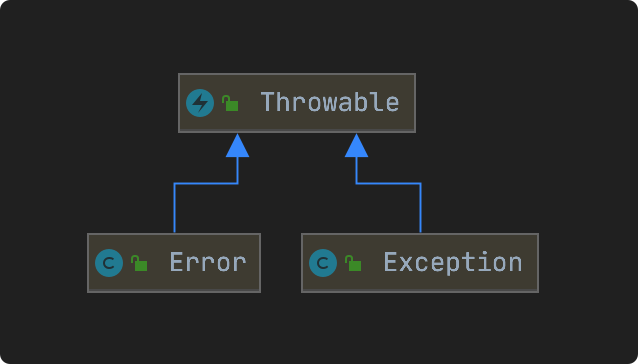
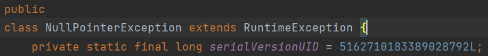
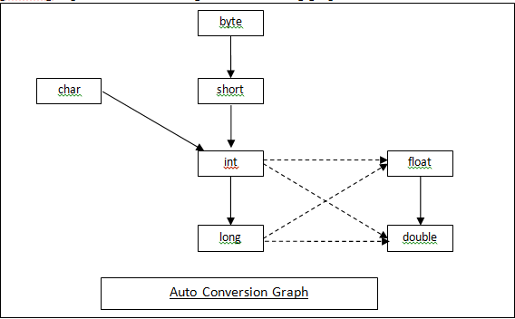
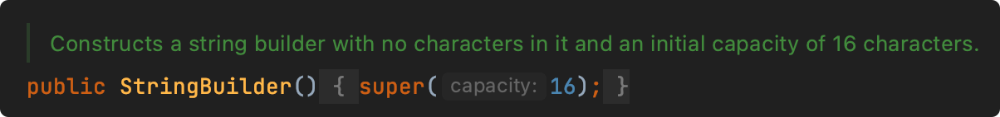

# 基础 118

### 1、面向对象编程有哪些特征？

##### 1、抽象

抽象就是对同一个目标的共有的属性（特征）和方法（功能/行为）进行抽取、归纳、总结。所以抽象不是了解和解决全部问题，而是选择公共的部分，忽略一个主题中与当前目标无关的那些方面。

##### 2、封装（Encapsulation）

封装就是指隐藏对象的属性和实现细节，控制成员属性的访问和修改权限，通过特定公开的方法暴露给外面访问。

比如以下代码：

```java
private String name = "Java面试题";

public String getName() {
    return name;
}
```

name属性被private封装起来，外面只能通过对象的getName才能访问。

##### 3、继承（Inheritance）

继承就是指子类继承父类的成员和方法，使得子类也能具有父类相同的行为。

> Java类之间只能实现单继承，接口之间可以多继承。

##### 4、多态（Polymorphism）

多态是指同一个行为具有多个不同的表现形式或形态，如一个类的方法在不同的情况下有不同表现形式。

> 比如方法重写（Method Overriding）：子类可以重写（覆盖）父类的方法，通过父类引用变量调用该方法时，根据实际对象的类型，会调用子类中的方法。

### 2、JDK与JRE的区别是什么？

#### JDK

JDK全称：Java Development Kit，是整个Java的核心，包含了Java运行环境（JRE）和一系列Java开发工具完整的包。

#### JRE

JRE全称：Java Runtime Environment，是Java程序的运行环境，包含JVM、Java核心类库等。

JRE只能用来运行Java应用程序，不能用于编译开发，它是JDK的子集。


安装完JDK后，就会有JRE目录，JRE属于JDK的子集。

### 3、如何编译和运行Java文件？

1、使用**javac**命令来编译.java文件

> javac Test.java

运行之后会生成Test.class文件

2、使用java命令来运行

> java Test

### 4、Java中的关键字有哪些？

##### Java中的关键字：

| 关键字       | 含义                           |
| ------------ | ------------------------------ |
| package      | 指定包名                       |
| import       | 引用类                         |
| class        | 定义类                         |
| interface    | 定义接口                       |
| abstract     | 抽象类或者抽象方法             |
| new          | 创建对象                       |
| this         | 实例本身                       |
| super        | 引用父类                       |
| void         | 无返回                         |
| byte         | 字节型                         |
| char         | 字符型                         |
| int          | 整型                           |
| short        | 短整型                         |
| long         | 长整型                         |
| float        | 单精度浮点数                   |
| double       | 双精度浮点数                   |
| boolean      | 布尔型                         |
| enum         | 枚举型                         |
| strictfp     | 精确浮点                       |
| extends      | 继承类                         |
| implements   | 实现接口                       |
| private      | 私有权限，本类中可用           |
| protected    | 保护权限，本包、本类和子类可用 |
| public       | 公开权限，可挎包用             |
| final        | 类不可继承，方法不可重写、常量 |
| static       | 静态属性                       |
| synchronized | 线程同步                       |
| if           | 如果                           |
| else         | 或者                           |
| for          | for循环                        |
| do           | do while循环                   |
| while        | do while循环                   |
| switch       | switch case分支                |
| case         | switch case分支                |
| default      | switch case分支                |
| break        | 结束循环                       |
| continue     | 继续循环                       |
| return       | 返回                           |
| try          | 异常代码捕获                   |
| catch        | 异常处理                       |
| finally      | 最后处理                       |
| throw        | 手动抛出一个异常               |
| throws       | 声明要抛出的异常               |
| instanceof   | 判断是否xx类的实例             |
| volatile     | 线程可见                       |
| transient    | 不用序列化                     |
| native       | 非Java实现方法                 |
| assert       | 断言                           |
| var          | 任意类型，JDK10增加            |

| 保留关键字 |     |
| ----- | --- |
| goto  | 跳转  |
| const | 常量  |

| 特殊关键字 |     |
| ----- | --- |
| true  | 真   |
| false | 假   |
| null  | 空值  |

### 5、Java标识符命名规则是怎样的？

（1）标识符只能由字母（a-z, A-Z）、数字（0-9）、下划线（_）和美元符号（$）组成；

（2）标识符不能以数字开头；

（3）标识符不能使用Java关键字；

（4）标识符区分大小写；

### 6、Java类命名规范是怎样的？

类名首字母大写，后面每个单词首字母大写，符合**UpperCamelCase**大驼峰式风格，如：

- Order
- OrderDetail
- OrderMonthSummary

但一般像这种众所周知的缩写例外：DO、BO、DTO、VO、AO、PO、UID等。

### 7、Java方法命名规范是怎样的？

方法名首字母小写，后面每个单词首字母大写，符合**小驼峰式**，如：

- println
- indexOf
- saveOrderInfo

### 8、Java变量命名规范是怎样的？

变量包括方法参数名、成员变量、局部变量。

变量首字母小写，后面每个单词首字母大写，符合LowerCamelCase小驼峰式风格，如：

- amount
- orderPrice
- orderStockInfo

### 9、Java常量命名规范是怎样的？

常量名全部大写，单词间用下划线（_）隔开，如：

- MAX_LIMIT
- MAX_LOOP_COUNT
- ALIPAY_PAY_URL

### 10、Java常量和变量的区别？

##### Java常量和变量的主要区别在于：

常量是一个固定的值，赋值后是不能被改变的；

变量是一个不固定的值，赋值后是可以随时被改变的；

### 11、Java怎么定义一个常量？

Java使用`final`关键字来定义一个常量，如：

```java
final int MAX_COUNT = 100;
```

也可以加修饰范围，以及静态关键字，如：

```java
private static final int MAX_COUNT = 100;
```

### 12、Java常量有几种类型？

##### Java常量有三种类型：

1、静态常量（类中）

2、成员常量（类中）

3、局部常量（类方法中）

### 13、Java有哪几种基本数据类型？

##### Java有4类8种数据类型，它们分别是：

###### 1、整型

byte、short、int、long

###### 2、浮点型

float、double

###### 3、字符型

char

###### 4、布尔型

boolean

### 14、什么是枚举类型？

Java中的枚举是一种特殊的数据类型，用于定义一组常量，枚举使用`enum`进行定义，并且可以包含零个或多个枚举常量，多个用逗号分开。

枚举常量实际上是枚举类的静态实例，编译器会为每个枚举常量生成一个私有构造函数，用于创建枚举常量的实例。枚举常量在内存中只有一个实例，确保唯一性。

> 枚举类型可以用来表示一组固定的值，例如星期几、月份、颜色等，它提供了一种更简洁、可读性更高的方式来表示一组相关的常量。

以下是一个使用枚举的示例，表示一周的星期几：

```java
enum Day {
    MONDAY,
    TUESDAY,
    WEDNESDAY,
    THURSDAY,
    FRIDAY,
    SATURDAY,
    SUNDAY
}
```

上面`Day`就是一个枚举类，它定义了七个枚举常量，分别代表一周的每一天。

每个常量还可以添加多个字段，比如我添加一个中文名称字段：

```java
public class Test {

    public static void main(String[] args) {
        Day today = Day.MONDAY;
        System.out.println("Today is " + today);
        System.out.println("Today is " + today.getChineseName());
    }

    enum Day {
        MONDAY("星期一"),
        TUESDAY("星期二"),
        WEDNESDAY("星期三"),
        THURSDAY("星期四"),
        FRIDAY("星期五"),
        SATURDAY("星期六"),
        SUNDAY("星期日");

        private String chineseName;

        Day(String chineseName) {
            this.chineseName = chineseName;
        }

        public String getChineseName() {
            return chineseName;
        }
    }
}
```

输出结果：

```
Today is MONDAY
Today is 星期一
```

### 15、枚举和类的区别？

Java中枚举和类之间的区别：

|      | 枚举              | 类                      |
| ---- | --------------- | ---------------------- |
| 定义方式 | 使用`enum`关键字进行声明 | 使用`class`关键字进行声明       |
| 继承关系 | 不能继承            | 可以继承其他类                |
| 实例化  | 枚举常量是枚举类型的实例    | 可以创建类的实例对象             |
| 可修改性 | 枚举常量是不可修改的      | 类的属性和状态可以被修改           |
| 字段   | 可以有自己的字段        | 可以有自己的字段               |
| 方法   | 可以有自己的方法        | 可以有自己的方法               |
| 唯一性  | 每个枚举常量是唯一的      | 可以创建多个类的实例对象           |
| 比较   | 使用“==”进行比较      | 可以通过重写`equals()`方法进行比较 |
| 用途   | 表示一组相关的常量       | 封装数据和行为，实现复杂的功能        |

### 16、枚举可以修改吗？

枚举中的常量是不可以修改的，一旦枚举常量被定义，它们的值就是固定的，不能在运行时进行修改，枚举常量是在编译时就确定了的。

比如下面的枚举类型：

```java
enum Day {
        MONDAY("星期一"),
        TUESDAY("星期二"),
        WEDNESDAY("星期三"),
        THURSDAY("星期四"),
        FRIDAY("星期五"),
        SATURDAY("星期六"),
        SUNDAY("星期日");

        private String chineseName;

        Day(String chineseName) {
            this.chineseName = chineseName;
        }

        public String getChineseName() {
            return chineseName;
        }
    }
```

在程序运行期间，这些枚举常量不能删除，也不能添加新的枚举常量，它们的值也不能修改。

但是，枚举常量的字段的值是可以修改的，比如上面的枚举中的chineseName字段，添加一个set方法：

```java
public void setChineseName(String chineseName) {
    this.chineseName = chineseName;
}
```

测试一下：

```java
public static void main(String[] args) {
    Day today = Day.MONDAY;
    Day.MONDAY.setChineseName("礼拜一");
    System.out.println("Today is " + today);
    System.out.println("Today is " + today.getChineseName());
}
```

输出结果：

```
Today is MONDAY
TOday is 礼拜一
```

但是在开发中不建议这样做，一般建议把字段定义为`final`类型，这样就不能修改了。

### 17、枚举命名规范是怎样的？

枚举就是特殊的常量类，命名和类一样。

##### 阿里开发手册推荐：

- 枚举以*Enum命名；
- 枚举字段名称全大写，单词之间使用下划线分隔；

命名示例：

> 状态枚举：StatusEnum
> 
> 枚举字段：SUCCESS / FAILED / PROCESS...

### 18、==和equals比较有什么区别？

**==**

（1）如果比较的对象是基本数据类型，则比较的是数值是否相同；

（2）如果比较的对象是引用数据类型，则比较的是对象的地址是否相同。

**equals**

equals是Object类提供的方法，接收Object参数类型，如源码所示：

```java
public boolean equals(Object obj) {
    return (this == obj);
}
```

即用来比较两个对象是否相等，默认比较的是对象的地址，不能用于比较基本数据类型，但可以是包装类型，所以，如果要比较两个对象的值是否相等，一般需要重写equals和hashCode方法。

比如常用的String、Date、Integer等类都重写了equals和hashCode方法，使其比较的是存储对象的内容是否相等，而不是堆内存地址。

### 19、字符串比较是用equals还是==？为什么？

如String类源码所示，它已经重写了equals方法：


String中的equals方法是先用==比较是否同一个对象，然后再比较内容是否相同。

**所以如果要比较字符串对象的内容是否相等就用equals方法，而要比较字符串的内存地址是否相等就用==比较，不过实际情况都是比较字符串内容而不会是比较内存地址。**

如下面的示例：

```java
public static void main(String[] args) {
    String str1 = new String("java面试题");
    String str2 = new String("java面试题");

    // 两个不同字符串对象==比较，返回false
    System.out.println(str1 == str2);

    // 两个字符串内容相同equals比较，返回true
    System.out.println(str1.equals(str2));
}
```

输出结果：

```
false
true
```

### 20、Java支持xx≠null不等于写法吗？

不支持，正常的不等于写法是：`!=`

### 21、public、private、protected、默认的区别？

具体区别如下表所示：

| 作用域       | 当前类 | 当前包 | 子孙类 | 其他包 |
| --------- | --- | --- | --- | --- |
| public    | √   | √   | √   | √   |
| protected | √   | √   | √   |     |
| 默认（不写）    | √   | √   |     |     |
| private   | √   |     |     |     |

不写为默认作用域，比如以下用来修饰成员变量：

```java
public class User {
    String name;
}
```

这个默认没有关键字，不用写。

### 22、this和super有什么区别？

##### this：代表当前对象本身：

- this(...)：调用本类的构造方法；
- this.成员变量：调用当前对象的成员变量，包括从父类继承的；
- this.成员方法(...)：调用当前对象的成员方法，包括从父类继承的；

##### super：代表当前对象的父类：

- super(...)：调用父类的构造方法；
- super.成员变量：调用父类的成员变量；
- super.成员方法(...)：调用父类的成员方法；

### 23、Java中的运算符都有那些？

Java中运算符有以下几类：

| 运算符   | 示例                                                       |
| ----- | -------------------------------------------------------- |
| 算术运算符 | +   -   *   /   %   ++   -                               |
| 关系运算符 | ==   !=   >   <   >=   <=                                |
| 位运算符  | &   ^   ~ >>   <<   >>>                                  |
| 逻辑运算符 | &&   \|\|   !                                            |
| 赋值运算符 | =   +=   -=   *=   /=   (%)=   <<=   >>=   &=   ^=   \|= |
| 三目运算符 | ? :                                                      |

优先级从高到低排列：

| 类别   | 操作符                                                    | 关联性  |
| ---- | ------------------------------------------------------ | ---- |
| 后缀   | ()   []   .                                            | 左到右  |
| 一元   | i++   i-                                               | 从左到右 |
| 一元   | ++i   --i   +   -   ~   !                              | 从右到左 |
| 乘性   | *   /   %                                              | 左到右  |
| 加性   | +   -                                                  | 左到右  |
| 移位   | >>   >>>   <<                                          | 左到右  |
| 关系   | >   >=   <   <=                                        | 左到右  |
| 相等   | ==   !=                                                | 左到右  |
| 按位与  | &                                                      | 左到右  |
| 按位异或 | ^                                                      | 左到右  |
| 按位或  | \|                                                     | 左到右  |
| 逻辑与  | &&                                                     | 左到右  |
| 逻辑或  | \|\|                                                   | 左到右  |
| 条件   | ? :                                                    | 从右到左 |
| 赋值   | =   +=   -=   *=   /=   %=   >>=   <<=   &=   ^=   \|= | 从右到左 |
| 逗号   | ,                                                      | 左到右  |

### 24、`s1 = s1 + 1`和`s1 += 1`的区别？

如果s1原有数据类型小于int类型，则s1 = s1 + 1会发生编译异常，如下面的程序所示：


因为s1为short类型，而数字1默认为int类型，所以计算的结果则为int类型，它不能自动转换为比它更小的类型，所以会发生编译异常。

解决办法就是使用类型强制转换：

```java
public static void main(String[] args) throws Exception {
    short s1 = 1;
    s1 = (short) (s1 + 1);
    System.out.println(s1);    // s1 = 2
}
```

使用s1 += 1则不会有任何问题，因为s1 += 1支持`隐式强制类型转换`，涉及到表达式类型自动提升，会自动提升为计算结果的数据类型，如以下程序：

```java
public static void main(String[] args) throws Exception {
    short s1 = 1;
    s1 += 1;
    System.out.println(s1);   // s1 = 2
}
```

### 25、`short s1 = 1; s1 += 1;`有错吗？

没错，可以正常编译，如下图所示：


因为s1 += 1;相当于s1 = (short) (s1 + 1)，其中有隐式强制类型转换。

### 26、`short s1 = 1; s1 = s1 + 1;`有错吗？

有错，如下图所示：


因为1是int类型，因此s1 + 1运算结果也是int类型，需要强制转换类型才能赋值给short型。


### 27、`float n = 1.8`有错吗？

答案：**有错！！！**

数字1.8默认是双精度数（double），将双精度型（double）赋值给单精度型浮点型（float）属于向下转型（down-casting），会产生编译错误：


因此，需要强制类型转换：

> float n = (float) 1.8;

或者写成这种形式：

> float f = 1.8F;

F即表示float类型。

### 28、`i++`和`++i`的区别？

`i++`是先取值后再自增，`++i`是先自增后再取值，来看下面这段程序就明白了：

```java
public static void main(String[] args) {
    int i = 1;
    int j = i++ + 1;
    System.out.println(j);   // j = 2

    i = 1;
    int k = ++i + 1;
    System.out.println(k);    // k =3
}
```

程序解读：

- i++先取值再自增，所以 j = 1 + 1 = 2
- ++i先自增再取值，所以 k = 2 +1 = 3

### 29、`while`和`do while`有啥区别？

`while`和`do while`都是循环语句，不同的是，`while`是先判断条件再执行循环，而`do while`是先执行循环再判断条件：

```java
public static void main(String[] args) {
    int i = 0;
    while (i < 5) {
        System.out.println("i = " + ++i);
    }

    i = 0;
    do {
        System.out.println("i = " + ++i);
    } while (i < 5);
}
```

所以说，在同样条件下，如果初始条件不成立，do while是会多执行一次的。

### 30、如何跳出Java中的循环？

###### 可以使用以下关键字：

| 关键字      | 说明          |
| -------- | ----------- |
| continue | 跳出当前本次循环    |
| break    | 跳出整个循环      |
| return   | 跳出整个循环及当前方法 |

### 31、如何跳出Java中的多层嵌套循环？

可以在最外面的循环语句前定义一个标号，然后在最里层循环体中使用`break`标号语句跳出嵌套循环。

如以下程序所示：

```java
public static void main(String[] args) {
    breakPrint:
    for (int i = 0; i < 100; i++) {
        for (int j = 0; j < 100; j++) {
            System.out.println("i=" + i + ", j=" + j);
            if (j == 66) {
                break breakPrint;
            }
        }
    }
}
```

输出结果如下：


可以看到，i只输出到0，证明多层循环被全部跳出了。

### 32、`&`和`&&`的区别？

> 逻辑判断推荐使用&&，位运算则需要使用&

&和&&都可以用作逻辑与的运算符，表示逻辑与（and），当运算符两边的表达式的结果都为true时，整个运算结果才为true，否则，只要有一方为false，则结果为false。

&&还具有短路的功能，即如果第一个表达式为false，则不再计算第二个表达式。

&还可以用作位运算符，当&操作符两边的表达式不是boolean类型时，&表示按位与操作，我们通常使用0x0f来与一个整数进行&运算，来获取该整数的最低4个bit位，例如，0x31 & 0x0f 的结果为0x01。

### 33、Java怎么进行数组初始化？

方法一：

```java
// 一维数组
int[] arr = new int[5];

// 二维数组
int[][] arr = new int[3][4];
```

方法二：

```java
// 一维数组
int[] arr = {1, 2, 3, 4, 5};
```

方法三：

```java
int[] arr = new int[]{1, 2, 3, 4, 5};
```

### 34、数组有没有length方法？Sring呢？

数组没有length()方法，但是有length属性，String有length()方法。

使用示例如下：

```java
public static void main(String[] args) {
    String str = "Java";
    String[] languages = new String[]{"java", "PHP", "GO"};
    System.out.println(str.length());
    System.out.println(languages.length);
}
```

结果输出：


### 35、怎么理解值传递和引用传递？

**值传递**：传递的是基本类型参数的字面量值的拷贝，方法对参数的修改不会影响之前参数的值。

**引用传递**：传递的是该引用的对象在堆中地址值的拷贝，而不是拷贝整个对象本身，方法对参数的修改会直接影响参数之前的值。

### 36、Java到底是值传递还是引用传递？

网上很多争议，这里解读下：

> **Java中只有值传递：**
>
> - ****对于基本数据类型，传递的是它们的实际值的副本；
> - 对于引用类型，传递的是对象的引用的值的副本，即对象的内存地址，而不是对象本身。
>
> 值传递传递的是数据的拷贝，而不是数据本身，引用类型的传递虽然可以修改引用对象的内容，但不能修改引用本身（引用类型和内存地址），所以，引用传递其实就是值传递的一种形式。

所以，严格来说，Java中只有值传递。

### 37、Java中的注释有哪些写法？

1、单行注释

```java
private int id;   // 这是ID
```

2、块注释

```java
private int id;  /* 这是ID */
```

3、文档注释

```java
/**
* 这是ID
*/
private int id;
```

### 38、Java中的构造方法是什么？

构造方法是构造类的主要方法，Java中的每个类都必须要有构造方法，构造方法名和类名相同，没有返回类型， new一个对象的时候就会调用指定的构造方法，如图：

```java
public class Test {
    private int id;

    public Test() {
        this.id = 100;
    }
}
```

如果只有一个默认的构造方法，不需要赋值初始化，则可以省略，比如：

```java
public class Test {
    
    private int id;

    public int getId() {
        return id;
    }

    public void setId(int id) {
        this.id = id;
    }
}
```

### 39、Java一个类可以有多少个构造方法？

一个类**至少要有一个**构造方法，也可以**有多个**构造方法，即构造方法重载，方法参数数量或者类型不同，如代码所示：

```java
public class Test {
    
    private int id;

    public Test() {
        this.id = 100;
    }

    public Test(int id) {
        this.id = id;
    }
}
```

如果没有显式地创建构造方法，Java编译器也会为该类提供一个默认构造方法。

### 40、`static`关键字有什么用？

static代表“**静态**”的意思，可以用来修饰：

- 静态内部类（静态内部类可以不依赖外部类实例对象而被实例化，而内部类需要在外部类实例化后才能被实例化）
- 静态方法（静态方法属于类方法，不需要实例化对象就能调用）
- 静态变量（静态变量属于类，不需要实例化对象就能调用）
- 静态代码块（静态代码块只会在类被加载时执行且执行一次）

使用实例如下：

```java
public class Test {
    static {
        System.out.println("静态代码块");
    }

    // 静态内部类
    static class Test2 {

    }

    // 静态变量
    private static int id = 0;

    // 静态方法
    public static void staticMethod() {

    }
}
```

### 41、`static`变量和普通变量地区别？

##### 1、所属目标不同

静态变量属于类的变量，普通变量属于对象的变量。

##### 2、存储区域不同

静态变量存储在方法区地静态区，普通变量存储在堆区。

> 另外：JDK7及以上，静态变量存储在其对应的Class对象中，而Class对象和其他普通对象一样，都存储在堆中的。

##### 3、加载时间不同

静态变量是随着类的加载而加载，随着类的消失而消失；

普通变量随着对象的加载而加载，随着对象的消失而消失。

##### 4、调用方式不同

静态变量只能通过类名、对象调用，普通变量只能通过对象调用。

### 42、`static`可以修饰局部变量吗？

static不能修饰局部变量，可以是内部类、全局成员变量、方法、代码块。

### 43、在`static`方法中可不可使用`this`或`super`，为什么？

在`static`方法中不可以使用`this`和`super`关键字：


因为this和super代表的是实例化后的操作对象，而static属于类级别，无法指向任何实例。

### 44、final关键字有哪些用法？

final关键字的用法如下表：

| 修饰类型 | 说明                 |
| ---- | ------------------ |
| 修饰类  | 表示该类不能被继承          |
| 修饰方法 | 表示该方法不能被重写         |
| 修饰变量 | 表示常量，只能复赋值一次，不能被修改 |

### 45、final、finally、finalize有什么区别？

#### final

final是修饰符：

- 如果修饰类，此类就不能被继承；
- 如果修饰方法，此方法就不能被重写；
- 如果修饰变量，此变量就不能再被改变；

#### finally

finally是try-catch-finally最后的一部分，表示不论发生任何情况都会执行的部分，finally部分可以省略，但如果finally部分存在，则一定会执行finally里面的代码（发生Error错误等非程序性异常除外）。

#### finalize

finalize是Object类的一个方法，在垃圾收集器执行的时候会自动调用被回收对象的此方法，一般不建议主动使用。

### 46、Java支持多继承吗？

Java类与类之间不支持多继承，只能单继承：


Java接口与接口之间支持多继承：


### 47、Java类可以实现多个接口吗？

可以的，一个类可以实现多个接口：


### 48、重载和重写有什么区别？

##### 方法重写

是父类与子类之间多态性的一种表现，即子类可以覆盖从父类继承的方法，重写的方法一般使用@Override标识，比如以下示例：

```java
@Override
public String toString() {
    return this.getName() + ...
}
```

这里是重写了Object祖先类的toString方法。

##### 方法重载

是一个类中方法多态性的一种表现，即一个类中可以有多个同名的方法，方法的参数类型不同，或者参数个数不同，返回类型可以相同也可以不同，比如以下实例：

```java
public Connection connection(String host) {
    ...
}

public Connection connection(String host, int port) {
    ...
}
```

同一个方法名，可以有多个不同的连接参数创建连接，这是很常见的方法重载方式。

### 49、构造器可以被重写和重载吗？

一个类的构造器只属于当前类，它不能被继承，所以它不能被重写。

一个类里面可以有多个构造器，所以它可以被重载。

### 50、私有方法能被重载或者重写吗？

##### 使用private修饰的私有方法，只可以重载，不能被子类重写。

因为private该作用域就只能在当前类中可见，子类见都见不到，别谈重写，重写至少需要protected及以上的作用域。

### 51、静态方法能被重载或者重写吗？

**静态方法可以被重载**，一个类可以存在多个同名但不同参数的static方法。

**静态方法不可以被重写**，如果子类也定义了相同的，会被子类同名的静态变量，静态方法所隐藏。

### 52、静态方法可以被继承吗？

（1）父类的静态属性、静态方法可以被子类继承；

（2）如果子类也定义了相同的静态属性、方法，那父类中的定义就会被子类同名的静态变量，静态方法所隐藏。

### 53、Java异常有哪些分类？

下面是Java异常类的组织结构，红色区域的异常类表示是程序需要显示捕捉或者抛出的。


##### Throwable

Throwable是Java异常的顶级类，所有的异常都继承于这个类。

Error，Exception是异常类的两个大分类。

##### Error

Error是非程序异常，即程序不能捕获的异常，一般是编译或者系统性的错误，如OutOfMemorry内存溢出异常等。

##### Exception

Exception是程序异常类，由程序内部产生，Exception又分为运行时异常、非运行时异常。

##### 运行时异常

运行时异常的特点是Java编译器不会检查它，也就是说，当程序中可能出现这类异常，即使没有用try-catch语句捕获它，也没有用throws子句声明抛出它，也会编译通过，运行时异常可处理或者不处理。

常见的运行时异常如NullPointException、ArrayIndexOutOfBoundsException等。

##### 非运行时异常

非运行时异常是程序必须进行处理的异常，捕获或者抛出，如果不处理程序就不能编译通过。如常见的IOException、ClassNotFoundException等。

### 54、`Error`和`Exception`有什么区别？

`Error`和`Exception`都属于异常总父类Throwable的子类：



**Error**表示系统级的错误和程序不必处理的异常，它是一种严重的非程序性的错误，比如内存溢出错误，它不能由程序控制和处理。

**Exception**则表示程序性异常，可以由程序进行定义、控制和处理。

### 55、Java中常见的异常有哪些？

##### 1、NullPointerException

空指针异常，操作一个null对象的方法或属性时会抛出这个异常。

##### 2、OutOfMemoryError

内存溢出异常，这不是程序能控制的，是指要分配的对象的内存超出了当前最大的堆内存，需要调整堆内存大小（-Xmx）以及优化程序。

##### 3、IOException

IO，即：input，output，我们在读写磁盘文件、网络内容的时候经常会发生的一种异常，这种异常是受检查异常，需要进行手工捕获。

如文件读写会抛出IOException：

```JAVA
public int read() throws IOException
public void write(int b) throws IOException
```

##### 4、FileNotFoundException

文件找不到异常，如果文件不存在就会抛出这种异常。

如定义输入输出文件流，文件不存在会报错：

```java
public FileInputStream(File file) throws FileNotFoundException
public FileOutputstream(File file) throws FileNotFoundException
```

FileNotFoundException其实是IOException的子类，同样是受检查异常，需要进行手工捕获。

##### 5、ClassNotFoundException

类找不到异常，这是在加载类的时候抛出来的，即在类路径下不能加载指定的类。

看一个示例：

```java
public static <T> Class<T> getExistingClass(ClassLoader classLoader, String className) {
    try {
        return (Class<T>) Class.forName(className, true, classLoader);
    } catch (ClassNotFoundException e) {
        return null;
    }
}
```

它是受检查异常，需要进行手工捕获。

##### 6、ClassCastException

类转换异常，将一个不是该类的实例转换成这个类就会抛出这个异常。

如将一个数字强制转换成字符串就会报这个异常：

```java
Object x = new Integer(0);
System.out.println((String)x);
```

这是运行时异常，不需要手工捕获。

##### 7、NoSuchMethodException

没有这个方法异常，一般发生在反射调用方法的时候，如：

```java
public Method getMethod(String name, Class<?>...parameterTypes) throws NoSuchMethodException, SecurityException {
    checkMemberAccess(Member.PUBLIC, Reflection.getCallerClass(), true);
    Method method = getMethod0(name, parameterTypes, true);
    if (method == null) {
        throw new NoSuchMethodException(getName() + "." + name + argumentTypesToString(parameterTypes));
    }
    return method;
}
```

它是受检查异常，需要进行手工捕获。

##### 8、IndexOutOfBoundsException

索引越界异常，当操作一个字符串或者数组的时候经常遇到的异常。


如图所示，它是运行时异常，不需要手工捕获。

##### 9、ArithmeticException

算术异常，发生在数字的算术运算时的异常，如一个数字除以0就会报这个错。

```java
double n = 3 / 0;
```

这个异常虽然是运行时异常，可以手工捕获抛出自定义的异常，如：

```java
public static TimeStamp from(Instant instant) {
    try {
        TimeStamp stamp = new TimeStamp(instant.getEpochSecond() * MILLIS_PER_SECOND);
        stamp.nanos = instant.getNano();
        return stamp;
    } catch (ArithmeticException ex) {
        throw new IllegaArgumentException(ex);
    }
}
```

##### 10、SQLException

SQL异常，发生在操作数据库时的异常。

如下面的获取连接：

```java
public Connection getConnection() throws SQLException {
    if (getUser() == null) {
        return DriverManager.getConnection(url);
    } else {
        return DriverManager.getConnection(url, getUser(), getPassword());
    }
}
```

又或者时获取下一条记录的时候：

```java
boolean next() throws SQLException;
```

它是受检查异常，需要进行手工捕获。

### 56、Java中常见的运行时异常有哪些？

常见的运行时异常（RuntimeException）主要有：

| 异常                        | 说明       |
| ------------------------- | -------- |
| NullPointerException      | 空指针异常    |
| IndexOutOfBoundsException | 数组越界异常   |
| ClassCastException        | 类型强制转换异常 |
| ArithmeticException       | 算术异常     |
| SecurityException         | 违背安全原则异常 |

更多可以查看RuntimeException运行时异常类的子异常。

### 57、运行时异常与受检查异常有什么区别？

##### 运行时异常

指RuntimeException异常类及其子类，表示在程序运行时才可能发生的异常，编译器编译时不用检查，方法可以不用主动catch，也可以不用throws声明抛出运行时异常。

##### 受检查异常

指非RuntimeException类型的异常，即编译器在编译时就会检查的异常，方法需要主动catch或者用throws声明所用的受检查异常，不然会出现编译错误。

----

空指针异常是运行时异常：



在程序中可以不用声明，也不用捕获。

IO异常是受检查异常：


在程序中必须声明或者捕获。

### 58、什么时候会发生空指针异常？

当一个变量的值为null时，在Java里面表示一个不存在的空对象，没有实际内容，没有给它分配内存，null也是对象成员变量的默认值。

所以，一个对象如果没有进行初始化操作，这时候，如果你调用这个对象的方法或者变量，就会出现空指针异常。如下面示例会发生空指针异常：

```java
Object object = null;
String string = object.toString();
```


从类结构图来看，空指针它是属于运行时异常`RuntimeException`的子类，他不是捕获型的，只有在程序运行时才可能报出来，而且会造成程序中断。

### 59、你知道有哪些避免空指针的方法？

下面说几个空指针的几个最常见的案例及解决之道。

##### 1、字符串比较，常量放前面

```java
if(status.equals(SUCCESS)) {

}
```

这个时候status可能为null造成空指针异常，应该把常量放前面，就能避免空指针异常。

```java
if(SUCCESS.equals(status)) {

}
```

这个应该在各种开发规范里面都会提到，也是最基础的。

##### 2、初始化默认值

在对象初始化的时候给它一个默认值或者默认构造实现，如：

```java
User user = new User();
String name = StringUtils.EMPTY;
```

##### 3、返回空集合

在返回一个集合的话，默认会是null，统一规范返回一个空集合。

举个List例子，如：

```java
public List getUserList() {
    List list = userMapper.getUserList();
    return list == null ? new ArrayList() : list;
}
```

这样接收方就不用担心空指针异常了，也不会影响业务。

##### 4、断言

断言是用来检查程序的安全性的，在使用之前进行检查条件，如果不符合条件就报异常，符合就继续。

Java中自带的断言关键字，assert，如：

```java
assert name == null : "名称不能为空";
```

输出：

```java
Exception in thread "main" java.lang.AssertionError: 名称不正确
```

不过默认是不启动断言检查的，需要带上JVM参数：-enableassertions才能生效。

Java中这个用的很少，建议使用Spring中的，更强大，更方便好用。

Spring中的用法：

```java
Assert.notNull(name, "名称不能为空");
```

##### 5、Optional

Optional是JDK 8 新增的新特性，再也不用 `!=null`来判断了，这个在一个对象里面的多个子对象连续判断的时候非常有用。

> 这里大概介绍5种，其实还有更多，如何避免空指针，一是要注意代码编写规范，二是要提高代码素养。

### 60、`throw`和`throws`的区别？

`throw`用在方法中，用来主动抛出一个异常，`throws`则是用在方法声明中，声明方法可能会抛出的异常。

来看Object#wait方法的使用示例：

 

两个不一定要同时使用，如果方法中抛出的是RuntimeException及其子异常，则方法可以不用throws声明，否则需要强制声明，比如下面的示例：


test1方法正常编译，而test2方法抛出的不是RuntimeException类型，又没有使用throws声明抛出，所以会报编译错误：

正确修改后：

```java
public void test1() {
    throw new RuntimeException("发生异常");
}

public void test2() throws Exception {
    throw new Exception("发生异常");
}
```

### 61、`try-catch-finally`中哪个部分可以省略？

`try-catch-finally`其中`catch`和`finally`都可以被省略，但是不能同时省略，也就是说有`try`的时候，必须后面跟一个`catch`或者`finally`。

如果是资源处理类型，并且实现了AutoCloseable接口，把定义它放在try(...)中，然后方法上再加上throws异常，是可以省略catch和finally的，只需要try即可，比如：

```java
private void test() throws Exception {
    try (InputStream is = new FileInputStream("")) {
        ...
    }
}
```

### 62、Java可以一次`catch`多个异常吗？

Java 7开始可以一次catch多个异常，比如：

```java
public static void mian(String[] args) throws Exception {
    try {
        System.out.println("java面试题");
    } catch (SecurityException | NullPointerException | NoClassDefFoundError e) {

    }
}
```

### 63、使用`try-catch`会影响性能吗？

一般情况下，`try-catch`块的执行时间很短，它不会对性能产生显著的影响，但是在极端情况下，try-catch块的使用可能会对性能产生影响。比如在代码中频繁地抛出和捕获异常，尤其是在高并发的情况下，`try-catch`块的性能可能会成为瓶颈。在这种情况下，可以使用其他方式处理异常，如：**条件判断**，以提高代码的性能。

来自阿里巴巴《Java开发手册》中的异常规范：

> 异常设计的初衷是解决程序运行中的各种意外情况，且异常的处理效率比条件判断方式要低很多，所以：
> 
> （1）可以通过预检查的方式规避异常，而不是依赖try-catch来处理。
> 
> （2）异常捕获后不要用来做流程控制，条件控制。

### 64、`int`和`Integer`有什么区别？

##### 最主要的几点区别：

（1）int是一种基本数据类型，Integer则是int的包装类型。

（2）int的默认值是0，而Integer属于Java类，所以它的默认值是null。

（3）int可以直接使用，而Integer属于Java类，所以它需要经过实例化才能使用。

（4）Integer属于Java类，所以它的使用范围更广，比如泛型，int则不行。

### 65、什么是包装类型？有什么用？

#### 什么是包装类型

Java设计当初就提供了8种基本数据类型及对应的8种包装数据类型。我们知道Java是一种面向对象编程的高级语言，所以包装类型正是为了解决基本数据类型无法面向对象编程所提供的。

下面是基本数据类型与对应的包装类型。

| 基本数据类型  | 包装类型      |
| ------- | --------- |
| byte    | Byte      |
| boolean | Boolean   |
| short   | Short     |
| char    | Character |
| int     | Integer   |
| long    | Long      |
| float   | Float     |
| double  | Double    |

下面是包装类型的继承结构图。


从以上图表可以对基本类型和包装类型有一个全面的了解。

##### 包装类应用场景

###### 1、集合类泛型只能是包装类；

```java
// 编译报错
List<int> list1 = new ArrayList<>();

// 正常
List<Integer> list2 = new ArrayList<>();
```

###### 2、成员变量不能有默认值；

```java
private int status;
```

基本数据类型的成员变量都有默认值，如以上代码status默认值为0，如果定义中0代表失败，那样就会有问题，这样只能使用包装类Integer，它的默认值为null，所以就不会有默认值影响。

###### 3、方法参数允许定义空值；

```java
private static void test1(int status) {
    System.out.println(status);
}
```

看以上代码，方法参数定义的是基本数据类型int，所以必须得传一个数字过来，不能传null，很多场合我们希望是能传递null的，所以这种场合包装类比较合适。

### 66、什么是自动装箱、拆箱？

##### 自动装箱、拆箱

Java 5增加了自动装箱、拆箱机制，提供基本数据类型和包装类型的相互转换操作。

##### 自动装箱

自动装箱即自动将基本数据类型转换成包装类型，在Java 5之前，要将基本数据类型转换成包装类型只能这样做，看下面的代码：

```java
public static void main(String[] args) {
    Integer i1 = new Integer(8);   // 此种方式，Java9已标识废除
    Integer i2 = Integer.valueOf(8);

    // 自动装箱
    Integer i3 = 8;
}
```

第3种方法也正是自动装箱功能，其实自动装箱的原理就是调用包装类的`valueOf`方法，如第2个方法中的Integer.valueOf()方法。

> 另外，第一种构造器方法也不推荐使用了，已经标为废弃了。

##### 自动拆箱

自动拆箱即自动将包装类型转换成基本数据类型，与自动装箱相反，有装就有拆，很好理解，看下面的例子，

```java
public static void main(String[] args) {
    Integer i1 = new Integer(8);
    Integer i2 = Integer.valueOf(8);

    // 自动装箱
    Integer i3 = 8;

    // 自动拆箱
    int i4 = i3;
    int i5 = i3.intValue();
}
```

把i3赋值给i4就是实现的自动拆箱功能，自动拆箱的原理就是调用包装类的`xxValue`方法，如i5中的Integer的`intValue`方法。

> 自动装箱、拆箱不只是体现在以上的例子，在方法接收参数、对象设置参数时都能自动装箱拆箱。

### 67、你怎么理解Java中的强制类型转换？

强制类型转换我们再清楚不过了，即强制显示的把一个数据类型转换为另外一种数据类型。

如以下示例：

```java
short s = 199;
int i = s;   // 199

double d = 10.24;
long l1 = (long)d; // 10
```

以上的转换结果都在我们的预期之内，属于正常的转换和丢失精度的情况，下面的例子就一样属于数据溢出的情况：

```java
int ii = 300;
byte b = (byte)ii;
```

300已经超出了byte类型表示的范围，所以会转换成一个毫无意义的数字。

### 68、你怎么理解Java中的自动类型转换？

**自动类型转换**：是指数字表示范围小的数据类型可以自动转换成范围大的数据类型。

如：

```java
long l = 100;

int i = 200;
long ll = i;
```

具体自动转换如下图所示。

 

实线表示自动转换时不会造成数据丢失，虚线则可能会出现数据丢失问题。

**自动转换也要小心数据溢出问题，看下面的例子。**

```java
int count = 100000000;
int price = 1999;
long totalPrice = count * price;
```

编译没任何问题，但结果却输出的是负数，这是因为两个int相乘得到的结果是int，相乘的结果超出了int的代表范围。这种情况，一般把第一个数据转换成范围大的数据类型再和其他的数据进行运算。

```java
int count = 100000000;
int price = 1999;
long totalPrice = (long)count * price;
```

另外，向下转换时可以直接将int常量字面量赋值给byte、short、char等数据类型，而不需要强制转换，只要该常量值不超过该类型的表示范围都能自动转换。

### 69、你怎么理解Java中的类型提升？

##### 类型提升

所谓类型提升就是指在多种不同数据类型的表达式中，类型会自动向范围表示大的值的数据类型提升。

如下面的示例：

```java
long count = 100000000;
int price = 1999;
long totalPrice = price * count;
```

price为int型，count为long型，运算结果自动向上提升为long型，运算结果正常，没有出现溢出的情况。

### 70、怎么理解Java中的多态机制？

多态，即”**多种状态**“的意思，在Java中有以下几种情形。

##### 一、方法多态

- **方法重写**：是父类与子类之间多态性的一种表现，即子类可以覆盖从父类继承的方法；
- **方法重载**：是一个类中方法多态性的一种表现，即一个类中可以有多个同名的方法，方法的参数类型不同，或者参数个数不同，返回类型可以相同也可以不同。

##### 二、对象多态

- **接口和实现类**：接口可以有多种不同的实现形式；
- **抽象类和实现类**：抽象类和实现类可以有多种不同的形式；

### 71、Java如何获取用户的输入？

可以通过Scanner类来获取用户的输入，即：

java.util.Scanner。

基本语法：

```java
Scanner sc = new Scanner(System.in);
```

然后通过next()或者nextLine()方法获取输入的字符串，比如以下示例：

```java
public static void main(String[] args) {
    Scanner scanner = new Scanner(System.in);
    String text = scanner.nextLine();
    System.out.println(text);
}
```


先输入一行文字再换行，结果正常输出。

### 72、`switch`是否能用在`long`上？

长整型（long）在目前所有的版本中都是不支持的：


在开发工具中会出现编译错误，并提示可用的类型。

### 73、`switch`是否能用在`String`上？

从Java 7开始，是可以用在字符串（String）上的，来看使用示例：

```java
public static void mian(String[] args) {
    String str = "Java";
    switch (str) {
        case "C++":
            System.out.println(0);
            break;
        case "Java":
            System.out.println(1);
            break;
        default:
            System.out.println(2);
    }
}
```

程序输出：1

### 74、`switch case`支持哪几种数据类型？

java中`switch case`语句用来判断一个变量与一系列值中某个值是否相等，每个值称为一个分支。

##### 语法格式如下：

```java
switch(expression) {
    case value:
        // 语句
        break;  // 可选
    case value:
        // 语句
        break;  // 可选
    // 你可以有任意数量的case语句
    default:   // 可选
        // 语句
}
```

###### 这里的`expression`都支持那些类型呢？

- 基本数据类型：byte、short、char、int
- 包装数据类型：Byte、Short、Character、Integer
- 枚举类型：Enum
- 字符串类型：String（JDK 7+开始支持）

基本数据类型和字符串很简单不用说，下面举一个使用包装类型和枚举的，其实也不难，注意只能用在switch块里面。

```java
// 使用包装类型
Integer value = 5;
switch (value) {
    case 3:
        System.out.println("3");
        break;
    case 5:
        System.out.println("5");
        break;
    default:
        System.out.println("default");
}

// 使用枚举类型
Status status = Status.PROCESSING;
switch (status) {
    case OPEN:
        System.out.println("open");
        break;
    case PROCESSING:
        System.out.println("processing");
        break;
    case CLOSE:
        System.out.println("close");
        break;
    default:
        System.out.println("default");
}
```

以下为官网的介绍文档。

> https://docs.oracle.com/javase/tutorial/java/nutsandbolts/switch.html

**使用switch case语句也有以下几点需要注意。**

1、case里面必须跟break，不然程序会一个个case执行下去，直到最后一个break的case或者default出现；

2、case条件里面只能是常量或者字面常量；

3、default语句可有可无，最多只能有一个；

### 75、String属于基础的数据类型吗？

String是字符串类，属于Java中的“**类**”，它不属于基础数据类型。


### 76、String类的常用方法都有哪些？

String类常用的方法有：
| 方法       | 说明                           |
| ------------ | ------------------------------ |
| equals      | 比较值是否相同                       |
| indexOf       | 返回指定字符的索引                         |
| charAt        | 返回指定索引处的字符                         |
| replace    | 字符串替换                       |
| trim     | 去除字符串两端空白             |
| split          | 分割字符串成数组                       |
| getBytes         | 获取字符串的byte类型数组                       |
| length        | 获取字符串长度                       |
| toLowerCase         | 转成小写字母                         |
| toUpperCase         | 转成大写字母                         |
| subString         | 截取字符串                         |

### 77、String字符串如何进行反转？

（1）最快的方法是借助StringBuilder或者StringBuffer中的reverse方法。

（2）借助字符串的charAt方法，从后到前遍历字符串，然后填充起来。

（3）借助Collections.reverse(List...)方法，先把字符串转为List然后再反转。

（4）借助其他第三方工具类，比如CollectionUtils工具类等。

### 78、String字符串如何实现编码转换？

先通过getBytes方法获取字节数组，再使用带编码的String构造器。

如代码所示，把字符串转换成UTF-8：

```java
public static void main(String[] args) throws UnsupportedEncodingException {
        String text1 = "java面试题";
        String text2 = new String(text1.getBytes(), "UTF-8");
        System.out.println(text1);
        System.out.println(text2);
    }
```

结果输出：

>java面试题
>
>java面试题

### 79、String与byte[]之间如何转换？

String > byte[]通过String类的getBytes方法：


byte[] > String通过各种String构造器：


### 80、String.trim()方法有什么用？

String.trim()用于去掉字符串**首尾**的空白字符，如下面的示例程序：

```java
public static void main(String[] args) {
        String text = "   java面试题   ";
        System.out.println(text.trim());
    }
```

输出结果：

 

它不能去除中间的空白字符。

### 81、字符串分割有哪些方式？

（1）使用字符串自身的split方法；

（2）使用JDK的StringTokenizer工具类；

（3）使用Spring/Apache commons-long等工具包中的工具类；

（4）自己可以利用indexOf方法写一个分割工具类；

### 82、字符串工具类isEmpty和isBlank的区别？

isEmpty和isBlank到底有啥区别？

##### 1、isEmpty

判断字符串是否为空字符串，只要有一个任意字符（包括空白字符）就不为空。

来看isEmpty的方法源码：

```java
public static boolean isEmpty(CharSequence cs) {
    return cs == null || cs.length() == 0;
}
```

看到没，这个方法只判断了是为null或者长度为0。

意味着，如果用户输入“ ”等空白字符，这个方法就不通过了，结果就是不为空了。

如验证输入以下内容：

| 输入内容     | 是否为空 |
| ------------ | -------- |
| "  "         | 否       |
| ""           | 是       |
| "Java面试题" | 否       |

##### 2、isBlank

判断字符串是否为空字符串，全部空字符也为空。

来看isBlank的方法源码：

```java
public static boolean isBlank(CharSequence cs) {
    int strLen = length(cs);
    if (strLen == 0) {
        return true;
    } else {
        for(int i = 0; i < strLen; ++i) {
            if (!Charracter.isWhitespace(cs.charAt(i))) {
                return false;
            }
        }
        return true;
    }
}
```

第7行，只要有一个字符不为空字符就返回false，也就是说，如果全部都为空白字符就返回true，也就是全部空白字符也为空。

如验证输入以下内容：

| 输入内容     | 是否为空 |
| ------------ | -------- |
| "   "        | 是       |
| ""           | 是       |
| "java面试题" | 否       |

这时候，如果用户输入"   "等空白字符，这个方法也返回空了，这也是大部分业务场景下我们期望出现的结果。

##### isEmpty和isBlank怎么选？

-------

很明显，我们要判断一个字符串为空，绝大部分情况下“空白字符”也要为空的，严谨来说肯定要用isBlank，虽然isEmpty也可以，但如果在最前端的接口不被拦截掉，请求到了后端的服务、数据库，就可能会造成压力，甚至是系统异常，这是完全可以避免的。

但万事也没有绝对，如果你的程序可以接受任意字符，包括“空白字符”，那就要选择isEmpty，isBlank会拦截所有空白字符，就达不到要求。

与之相对应的一般还有isNotEmpty和isNotBlank，这都是对工具类的封装。

### 83、StringBuffer 和 StringBuilder的区别？

先看看StringBuffer和StringBuilder的类结构吧：

 

其实很简单，就是继承了一个抽象的字符串父类：`AbstractStringBuilder`。下面我们再来看看它们的三个区别。

##### 区别1：线程安全

StringBuffer：线程安全，StringBuilder：线程不安全。因为StringBuffer的所有公开方法都是synchronized修饰的，而StringBuilder并没有synchronized修饰。

###### StringBuffer代码片段：

```java
@Override
public synchronized StringBuffer append(String str) {
    toStringCache = null;
    super.append(str);
    return this;
}
```

##### 区别2：缓冲区

###### StringBuffer代码片段：

```java
private transient char[] toStringCache;

@Override
public syncronized String toString() {
    if (toStringCache == null) {
        toStringCache == Arrays.copyOfRange(value, 0, count);
    }
    return new String(toStringCache, true);
}
```

###### StringBuilder代码片段：

```java 
@Override
public String toString() {
    // Create a copy, don't share the array
    return new String(value, 0, count);
}
```

可以看出，StringBuffer每次获取toString都会直接使用缓存区的toStringCache值来构造一个字符串。

而StringBuilder则每次都需要复制一次字符数组，再构造一个字符串。

所以，缓冲区也是对StringBuffer的一个优化吧，不过StringBuffer的这个toString方法仍然是同步的。

##### 区别3：性能

既然StringBuffer是线程安全的，他的所有公开方法都是同步的，StringBuilder是没有方法加锁同步的，所以毫无疑问，StringBuilder的性能要远大于StringBuffer。

#### 总结

----

所以，StringBuffer适用于在多线程操作同一个StringBuffer的场景，如果是单线程场合StringBuilder更适合。

### 84、StringBuilder，StringBuffer默认容量大小？

 

 

默认都是16个字符。

 

扩容大小都是为原来的2倍 + 2个字符。

### 85、Java中的main方法有什么用？

main方法是Java程序的入口方法，在执行Java应用程序的时候会首先查找main方法，比如启动一个Spring Boot应用程序，就必须要有一个包含main方法的主类，如下所示：

```java
public static void main(String[] args) {
    SpringApplication.run(Application.class, args);
}
```

### 86、怎么向main方法传递参数？

通过一个String数组：

```java
public static main(String[] args) {
    for (int i = 0; i < args.length; i++) {
        System.out.println("args[" + i + "]=" + args[i]);
    }
}
```

命令传递方式：

> java         面试题        酷酷酷酷

在开发工具中也可以传递：

 

输出结果：

> args[0]=java
> args[1]=面试题
> args[2]=酷酷酷酷

### 87、不用main方法如何运行一个类？

不行，没有main方法不能运行Java类，main方法是Java程序的入口。

> java 7之前，可以通过使用静态初始化运行Java类，Java7+就行不通了。

### 88、Java所有类的祖先类是哪个？

Java所有类的祖先类是**java.lang.Object**类，Java中每个类都是由它拓展而来，也会继承它的所有方法。

### 89、Object类有哪些常用的方法？

Object类所有方法如下：

 

### 90、普通类和抽象类有什么区别？

##### 普通类和抽象类有什么区别：

（1）抽象类必须用abstract关键字标识，普通类则不用；

（2）抽象类可以包含abstract标识的抽象方法，抽象方法不用在抽象类中实现，普通类则不能包含抽象方法；

（3）抽象类是设计子类继承用的，不能直接通过new实例化，只能通过子类继承来实例化，或者通过匿名内部类进行实例化，普通类可以直接new实例化。

----

抽象类示例代码：

```java
public abstract class AbstractAccessLog {
    protected abstract void log(Log log) {
        
    }
}
```

### 91、静态内部类和普通内部类有什么区别？

先来看下面的示例程序，Test类中分别创建一个静态内部类和普通内部类：

```java
public class Test {
    public static class StaticInnerClass {
        
    }
    
    public class InnerClass {
        
    }
}
```

然后在其它类中进行实例化：

```java
class InnerClassTest {
    public void test() {
        // 静态内部类
        Test.StaticInnerClass staticInnerClass = new Test.StaticInnerClass();
        
        // 普通内部类
        Test.InnerClass innerClass1 = new Test.InnerClass();
        Test.InnerClass innerClass2 = new Test().new InnerClass();
    }
}
```

编译结果出来：


所以，静态内部类可以不依赖于外部类实例被实例化，而普通的内部类需要在外部类实例化后才能实例化。

### 92、静态方法可以直接调用非静态方法吗？

静态方法不可以直接调用非静态方法，静态方法调用非静态方法，需要先将对象实例化才能调用。

来看下面的示例：

```java
public static void main(String[] args) throws Exception {
    test();
}

public void test() {
    
}
```

 

修改后：

```java
public static void main(String[] args) throws Exception {
    new Test().test();
}
```

### 93、静态变量和实例变量有什么区别？

**静态变量**，即被static修饰的变量，它属于类，但不属于类的任何一个对象，一个类不管创建多少个对象，静态变量在内存中有且仅有一个拷贝，静态变量可以实现让多个对象共享内存。

**实例变量**，它属于某一对象实例，需要通过一个类的对象实例才能访问它。

```java
// 实例变量
private int id = 100;

// 静态变量
private static long maxId = 999;
```

### 94、内部类可以访问其他外部类的成员吗？

可以的，内部类可以访问创建它的外部类对象的成员，包括私有成员，来看下面的程序：

```java
public class Test {
    private int id = 100;
    
    public class InnerClass {
        /**
        * 访问外部类的私有成员
        */
        private void print() {
            System.out.println(id);
        }
        
        public static void main(String[] args) {
            Test.InnerClass innerClass = new Test().new InnerClass();
            innerClass.print();
        }
    }
}
```

结果输出：100

### 95、接口和抽象类有什么区别？

##### 区别1：

首先抽象类是一个“类”，而接口只是一个“接口”，两者的概念和应用场景不一样，这也是抽象类和接口的主要区别。

##### 区别2：

即使在Java 8中接口也能实现方法了，但却不能写构造方法，而在抽象类是可以写构造方法的，意味着抽象类是参与类的实例化过程的，而接口则不是。

##### 区别3：

抽象类可以有自己的各种成员变量，并且可以通过自己的非抽象方法进行改变，而接口中的变量默认全是`public static final`修饰的，意味着都是常量，并且不能被自己和外部修改。

##### 区别4：

接口可以实现多继承，而抽象类只能单继承。

下面我举两个例子：

```java
public class HashMap<K, V> extends AbstractMap<K, V> implements Map<K, V>, Cloneable, Serializable {
    ...
}
```

```java
public interface Connection extends Wrapper, AutoCloseable {
    ...
}
```

类与类只能单继承，而类与接口，接口与接口可以多继承。

 

Java8中的接口和抽象类的区别除了接口中可以写实现方法之外这点变化，其他的还是保持不变的。

既然接口可以写方法实现了，那么抽象类的存在貌似弱化了，因为类只能是单继承，耦合性不好，而接口可以多实现，可以灵活扩展，也不会增加类的耦合性。

### 96、抽象类必须要有抽象方法吗？

不需要，抽象类不一定非要有抽象方法，如以下示例代码：

```java
public abstract class User {
    public String getUserName () {
        return "java面试题";
    }
}
```

抽象类没有抽象方法也可以正常运行。

### 97、抽象类能使用final修饰吗？

**abstract**不能和**final**一起使用。

定义抽象类就是让其它类继承的，如果把一个类定义为final则表示该类就不能被继承，这样彼此就会产生矛盾，所以final不能修饰抽象类。

如果这样定义，在开发工具中也会提示编译错误：

 

抽象方法也是一样的道理，抽象方法也不能和final一起使用。

### 98、抽象类是否可以继承具体类？

抽象类可以继承普通类，也可以继承抽象类，来看Spring中的应用。

抽象类继承抽象类：

```java
public abstract class AbstractBeanFactoryAwareAdvisingPostProcessor extends AbstractAdvisingBeanPostProcessor implements BeanFactoryAware {
    ...
}
```

抽象类继承普通类：

```java
public abstract class AbstractAutoProxyCreator extends ProxyProcessorSupport implements SmartInstantiationAwareBeanPostProcessor, BeanFactoryAware {
    ...
}
```

### 99、抽象类是否可以实现接口？

抽象类可以实现接口，来看一个Spring中的应用：

```java
public abstract class AbstractBeanFactoryAwareAdvisingPostProcessor extends AbstractAdvisingBeanPostProcessor implements BeanFactoryAware {
    ...
}
```

### 100、如何判断一个对象是某类、接口的实例？

使用**instanceOf**关键字，比如有以下测试类：

> User：用户基类
>
> PrivateUser：私人用户子类，继承User类

判断方式如下：

```java
public static void main(String[] args) {
    PrivateUser privateUser = new PrivateUser();
    
    // true
    boolean result1 = privateUser instanceOf PrivateUser;
    
    // false
    boolean result2 = privateUser instanceOf User;
}
```

### 101、如何判断两个类或者接口之间的派生关系？

使用类的**isAssignableFrom**方法，如果当前类与指定类是否相同，或者当前类是指定类的基类或接口，则返回true，否则返回false。

比如有以下测试类：

> User：用户基类
>
> PrivateUser：私人用户子类，继承User类

判断方式如下：

```java
public static void main(String[] args) {
    // true
    boolean result1 = User.class.isAssignableFrom(PrivateUser.class);
    
    // false 
    boolean result1 = PrivateUser.class.isAssignableFrom(User.class);
}
```

User是PrivateUser的父类，所以返回true，反过来则是false。

### 102、Java创建对象，除了new关键字，你还知道哪些？

> 这里介绍创建对象的6种方式

假设有个女朋友类：

```java
@Data
@NoArgsConstructor
@AllArgsConstructor
class GirlFriend {
    private String name;
}
```

注解使用的是Lombok框架注解，方便快速开发。

##### 方法1：new一个对象

没对象就new一个吧，没错，使用new关键字，这也是Java创建对象最简单直接的方式了。

示例代码：

```java
@Test
public void girlFriend1() {
    GirlFriend girlFriend = new GirlFriend("new一个对象");
    System.out.println(girlFriend);
}
```

输出结果：

> GirlFriend(name=new一个对象)

##### 方法2：克隆一个对象

朋友有女朋友，你没有，如果可以，把别人的女朋友克隆一个吧？

让女朋友类先实现Cloneable接口，并且实现其clone()方法：

```java
@Data
@NoArgsConstructor
@AllArgsConstructor
class GirlFriend implements Cloneable {
    private String name;
    
    @Override
    protected Object clone() throws CloneNotSupportedException {
        return super.clone();
    }
}
```

> 注意：这里演示默认使用的是浅拷贝，即只可隆基本类型的字段，引用类型的需要再重写clone()方法手动赋下引用字段的值。

现在克隆一个对象，示例代码：

```java
@Test
public void girlFriend2() throws CloneNotSupportedException {
    GirlFriend girlFriend1 = new GirlFriend("克隆一个对象");
    GirlFriend girlFriend2 = （GirlFriend）girlFriend1.clone();
    System.out.println(girlFriend2);
}
```

> GirlFriend(name=克隆一个对象)

使用克隆的好处就是可以快速创建一个和原对象值一样的对象，对象的字段值一样，但是两个不同的引用。

##### 方法3：类派发一个对象（反射）

直接使用女朋友类派发一个吧：

```java
@Test
public void girlFriend3() throws InstantiationException {
    GirlFriend girlFriend = GirlFriend.class.newInstance();
    girlFriend.setName("类派发一个对象");
    System.out.println(girlFriend);
}
```

输出结果：

> GirlFriend(name=类派发一个对象)

##### 方法4：动态加载一个对象（反射）

知道女朋友类在哪里（类全路径），但却没有被加载，那就反射一个对象吧：

```java
@Test
public void girlFriend4() throws InstantiationException {
    GirlFriend girlFriend = (GirlFriend) Class.forName("cn.com.slq.GirlFriend").newInstance();
    girlFriend.setName("反射一个对象");
    System.out.println(girlFriend);
}
```

输出结果：

> GirlFriend(name=反射一个对象)

##### 方法5：构造一个对象（反射）

知道女朋友类的构造，就可以调用构造器构造一个对象：

```java
@Test
public void girlFriend5() throws NoSuchMethodException {
    GirlFriend girlFriend = GirlFriend.class.getConstructor().newInstance();
    girlFriend.setName("构造一个对象");
    System.out.println(girlFriend);
    
}
```

输出结果：

> GirlFriend(name=构造一个对象)

##### 方法6：反序列化一个对象

这个和克隆的作用类似，加入以前序列化（保存）了一个女朋友在磁盘上，现在就可以反序列化出来。

首先让女朋友可序列化，实现Serializable接口：

```java
@Data
@NoArgsConstructor
@AllArgsCOnstructor
class GirlFriend implements Cloneable, Serializable {
    private static final long serialVersionUID = 1L;
    
    private String name;
    
    @Override
    protected Object clone() throws CloneNotSupportedException {
        return super.clone();
    }
}
```

序列化/反序列化对象示例代码：

```java 
@Test
public void girlFriend6() throws IOException, ClassNotFoundException {
    GirlFriend girlFriend1 = new GirlFriend("反序列化一个对象");
    
    //序列化一个女朋友
    ObjectOutputStream objectOutputStream = new ObjectOutputStream(new FileOutputStream("gf.obj"));
    ObjectOutputStream.writeObject(girlFriend1);
    ObjectOutputStream.close();
    
    // 反序列化出来
    ObjectInputStream objectInputStream = new ObjectInputStream(new FileInputStream("gf.obj"));
    GirlFriend girlFriend2 = (GirlFriend) objectInputStream.readObject();
    ObjectInputStream.close();
    
    System.out.println(girlFriend2);
}
```

输出结果：

> GirlFriend(name=反序列化一个对象)

### 103、Java怎么生成随机数？

##### 1、Math.random

它只能生成伪随机浮点数（double），需要进行转换才能生成其他类型的随机数，它是线程安全的。

##### 2、java.util.Random

它提供了许多随机数生成选项，包括不同类型的随机数和种子设置，线程安全，但是多线程并发使用同一个实例性能不佳，它适用于并发量不高的或者单线程环境。

##### 3、java.util.concurrent.ThreadLocalRandom

它也提供了各种随机数生成选项，是多线程环境下的首选，每个线程都有自己的生成器，无需同步操作。

----

另外，推荐使用一些第三方开源工具包，没有必要重复造轮子，比如Apache的commons-lang3开发工具包中的两个工具类：

- RandomUtils
- RandomStringUtils

### 104、equals和hashCode的区别和联系？

关于**hashCode**和**equals**方法是有一些常规协定：

1、两个对象用equals()比较返回true，那么两个对象的hashCode()方法必须返回相同的结果。所以，如果重写equals()方法，则必须重写hashCode()方法，如果不重写，在Java中（比如：HashMap）会产生逻辑错误。

2、两个对象用equals()比较返回false，不要求hashCode()方法也一定返回不同的值，避免hash冲突，以提高哈希表性能。

举个例子：

> 可以把`equals`比喻为判断两本书的内容是否完全相同，而`hashCOde`就像是每本书的ISBN号。

如果两本书内容完全一样（`equals`返回`true`），那么它们的ISBN（`hashCode`的值）也应该是一样的。这样，在图书馆（类似HashMap）中就能根据ISBN快速找到相应的书。

如果两本书内容不完全一样（`equals`返回false），理论上它们的ISBN（`hashCode`的值）应该是不一样的，如果ISBN一样（`hashCode`的值），说明冲突了（`hashCode`冲突），但不影响根据ISBN来找书，只是会慢一点。

### 105、两个对象的equals方法相等，hashCode方法也会相等吗？

答案：**不一定，但是，严格意义上必须相等！！！**

> 根据Java通用约定：
>
> 两个对象equals相等，则它们的hashCode必须相等，反过来则不需要相同。

也就是说，重写了一个类的equals方法之后，必须要重写其hashCode方法，不然会出现各种潜在的问题或危害。

### 106、两个对象的hashCode方法相等，equals方法也会相等吗？

答案：**不一定。**

> 根据Java通用约定：
>
> 两个对象equals相等，则它们的hashCode必须相等，反过来则不需要相同。

因为对象的hashCode可能存在冲突的情况，即多个对象对应同一个hashCode，这在Java规范中是允许的，但是如果重写了equals方法，比较的则是对象的值，这时两个对象equals比较就可能不相同。

### 107、为什么重写equals就要重写hashCode？

**如果只重写了对象的equals方法而没有重写hashCode方法的话，就会造成对象equals相等而hashCode不相等。**

而Hash*相关的集合都是基于Hash表来实现的，比如HashMap的底层数据结构就是以数组+链表为基础的，其中的关键是数组索引下标的处理，数组的索引下标是根据传入的元素hashCode方法来决定的

**在hashCode相等的情况下：**

- 如果数组索引位置上已经有值了，值相等则进行覆盖，若不相等则加入到对应的链表中；
- 如果数组索引位置上没有值，则直接插入；

所以，如果多个equals相等的对象，而它们的hashCode不相等，它们就会不断插入到数组中，而不会进行覆盖，由此会带来Hash*相关的集合不能正常工作。

> 注意事项：
>
> 重写equals就要重写hashCode是Java编程的共识和规范。

### 108、Math.round(1.5)等于多少？


答案：2。

因为在数轴上取值时，中间值（0.5）向右取整，所以正0.5是往上取整。

### 109、Math.round(-1.5)等于多少？


答案：-1。

因为在数轴上取值时，中间值（0.5）向右取整，所以正0.5是往上取整，负0.5是直接舍弃。

### 110、什么是泛型？

JDK1.5开始引入泛型，泛型提供了编译时类型安全检测机制，可以在编译时检测到非法的类型。

泛型的本质就是参数化类型，可以用在类、接口和方法的创建中，分别称为泛型类、泛型接口、泛型方法。

如：集合类支持泛型，如果添加不符合的元素类型则会编译报错：

 

如上代码指定了泛型为String类型，添加其他类型的就会编译报错。

### 111、Java泛型中的T、R、K、V、E是什么？

常用的泛型含义如下表所示：

| 泛型 | 说明               |
| ---- | ------------------ |
| T    | Type（类型）       |
| R    | Result（结果）     |
| K    | Key（键）          |
| V    | Value（值）        |
| E    | Element（元素）    |
| N    | Number（数字）     |
| ?    | 通配符，不确定类型 |

### 112、Java有没有goto关键字？

goto是Java中的保留字，在目前版本的Java中还没有被使用，保留关键字不能用作任何标识符。

 

### 113、Java中有没有指针的概念？

Java中并没有指针的概念，指针是C和C++里面的概念，在Java中，指针已经被其他语法所取代，学习起来更加轻松。

### 114、Java中的classpath环境变量作用？

class = class + path，即Java源文件编译后的.class文件的路径。

设置classpath环境变量的作用是用于指定类的搜索路径，JVM在运行时就是通过classpath环境变量来寻找.class类文件，所以一般建议把当前应用程序的目录（.）设置为classpath环境变量。

### 115、怎么设置classpath环境变量？

Linux设置CLASSPATH环境变量：

> export CLASSPATH = .

查看classpath：

> echo $CLASSPATH

一般使用命令行编译运行需要指定classpath，在开发工具中classpath不用自己指定，由工具指定编译后的目录，它会自动搜索，如在IDEA中指定：

 

### 116、判断两个数字是否相等

以下代码的输出结果是？

```java
public class Test {
    public static void main(String[] args) {
        Integer n1 = 123;
        Integer n2 = 123;
        System.out.println(n1 == n2);
        
        Integer n3 = 128;
        Integer n4 = 128;
        System.out.println(n3 == n4);
    }
}
```

答案如下：

> true
>
> false

### 117、Java怎么获取当前系统时间戳？

在Java中可以使用以下方式来获取系统时间戳。

##### 1、使用System类（最常用）

```java
long timestamp = System.currentTimeMillis();
```

这也是最常用的获取时间戳的方法。

##### 2、使用Date类

```java
Date date = new Date();
long timestamp = date.getTime();
```

##### 3、使用Calendar类

```java
Calendar calendar = Calendar.getInstance();
long timestamp = calendar.getTimeInMillis();
```

##### 4、使用Instant类（Java8+）

这是在Java8+版本中引入的新的日期时间API，这个`Instant.now()`方法返回当前的时间戳，然后使用`toEpochMilli()`方法将时间戳转换为毫秒数。

> 以上几种方法都可以得到当前系统的时间戳，大家可以根据需要选择合适的方式来获取时间戳。
>
> 推荐使用第1、4种方法，第一种无疑是最常用的，如果是Java8+，也可以考虑使用第四种Instant类，它可以获得比第一种更强大的时间单位转换等功能。

### 118、Java怎么统计一段代码的耗时？

1、使用System.currentTimeMillis()方法获取当前时间，前后再相减就是总耗时：

```java
@Test
public void jdkWasteTime() throws InterruptedException {
    long start System.currentTimeMillis();
    Thread.sleep(3000);
    System.out.println("耗时：%dms."， System.currentTimeMillis() - start);
}
```

2、使用**StopWatch**工具类，这个在Spring/Apache commons-lang3包中都有定义，来看一个简单的使用commons-lang3包中的StopWatch使用例子：

```java
// 创建一个StopWatch实例并开始计时
StopWatch sw = StopWatch.createStarted();

 // 休眠1秒
Thread.sleep(1000);

// 1002ms
System.out.println("耗时：%dms.\n", sw.getTime());
```

# 集合 87

### 1、说说常见的集合有哪些？

**Java所有集合框架的顶级接口有两大类：**

**Collection接口和Map接口。**

Collection接口的子接口包括List接口和Set接口；

- List接口的实现类主要有：ArrayList、LinkedList、Stack、Vector...
- Set接口的实现类主要有：HashSet、TreeSet、LinkedHashSet...

Map接口的实现类主要有：

- HashMap
- TreeMap
- HashTable
- ConcurrentHashMap
- ...

### 2、常用的并发集合有哪些？

常用的并发集合有：

- ConcurrentHashMap
- ConcurrentLinkedQueue
- ConcurrentLinkedDeque
- CopyOnWriteArrayList
- CopyOnWriteArraySet
- ...

并发集合位于java.util.concurrent包下，JDK1.5之后才有的。

### 3、那些集合类可对元素随机访问？

随机访问接口：java.util.RandomAccess

 

它是List集合使用的标记接口，表示它们可以支持快速的随机访问，该接口的主要目的是允许算法在随机或顺序访问列表是改变其行为，已提供良好的性能。

实现了该接口的常用List集合如类结构图所示：

 

如ArrayList源码所示：

 

实现了该接口的集合，推荐使用`for (int i = 0, n = list.size(); i < n; i++)`方式替代`for (Iterator i = list.iterator(); i.hasNext();)`，前者要比后者遍历快。

### 4、Comparable和Comparator接口的区别？

Comparable是排序接口，如类实现了Comparable接口，并实现其排序方法，就表示该类支持排序，相当于是一个内部排序器。

假如User类实现了Comparable接口：

```java
Collections.sort(userList);
```

Comparator是比较器接口，可以新建多个Comparator接口的实现类实现自定义排序，相当于一个外部排序器。

```java
Collections.sort(userList, new Comparator<User>() {
    ...
})
```

### 5、Collection和Collections的区别？

Collection是一个集合接口，是Set、List集合类的一个顶级接口：


Collection则是集合类的一个工具类，提供了一系列静态方法，用于对集合中元素进行排序、搜索以及线程安全等各种操作。 

### 6、Enumeration和Iterator接口的区别？

##### Enumeration和Iterator接口的区别：

（1）Enumeration只能读取集合的数据，而不能删除，Iterator可以读取、删除数据，如它们的方法所示：


（2）Iterator支持fail-fast错误机制，而Enumeration不支持；

（3）在Java集合框架中，Iterator接口已经取代了Enumeration接口：


### 7、集合使用泛型有什么优点？

##### 集合使用泛型的几个优点：

1、强制集合只能容纳指定类型的对象，避免了在运行时出现ClassCastException类转换异常，因为添加了不是指定类型的元素时，在编译期间就会报错；

2、代码更整洁，使用时不需要显式转换和instanceOf操作符，取出来的就是指定类型的对象；

3、优化了JVM运行时环境，因为它不会产生类型检查的字节码指令；

### 8、List、Set、Map之间的区别是什么？

List、Set、Map的区别主要体现在数据结构、元素是否有序、元素是否可重复、键值是否为null等。

三个接口的区别如下面思维导图所示：


### 9、描述一下常用的Collection集合的类结构？

如下图所示，我列出了常用的Collection集合接口和实现类：


### 10、描述一下常用的Map集合的类结构？

如下图所示，我列出了常用的Map集合和实现类：


### 11、为什么Map接口不继承Collection接口？

因为Map继承Collection毫无意义，Collection集合中定义的是一组对象，而Map提供的是包含key-value键值对形式的集合，而不是”**一组对象**“的概念，所以它不适用Collection的定义。

### 12、常用的线程安全的Map有哪些？

下面来总结下线程安全的Map。

##### 1、Hashtable

> private Map<String, Object> map = new Hashtable<>();

来看看Hashtable的源码


Hashtable中的所有关键方法都被synchronized关键字修饰，说明它们是方法级别阻塞的，它们占用共享资源锁，所以导致同时只能一个线程操作，不能同时执行，所以这种同步的集合效率非常低，一般不建议使用这个集合。

##### 2、SynchronizedMap

> private Map<String, Object> map = Collections.synchronizedMap(new HashMap<String, Object>());

这种是直接使用工具类里面的方法创建SynchronizedMap，把传入进行的HashMap对象进行了包装同步而已，来看看它的源码：


这个同步方式实现也比较简单，看出SynchronizedMap的实现方式是加了个对象锁，每次对HashMap的操作都要先获取这个mutex的对象锁才能进入，所以性能也不会比Hashtable好到哪里去，也不建议使用。

##### 3、ConcurrentHashMap - 推荐

> private Map<String, Object> map = new ConcurrentHashMap<>();

### 13、HashMap与Hashtable的区别？

HashMap和Hashtable是Java开发程序员必须要掌握的。

##### 1、线程安全

Hashtable是线程安全的，HashMap不是线程安全的。

来看下Hashtable的源码，Hashtable所有的元素操作都是synchronized修饰的，而HashMap并没有。

```java
public synchronized V put(K key, V value);
public synchronized V get(Object key);
```

##### 2、性能优劣

既然Hashtable是线程安全的，每个方法都要阻塞其他线程，所以Hashtable性能较差，HashMap性能较好，使用更广。

如果要线程安全又要保证性能，建议使用JUC包下的ConcurrentHashMap。

##### 3、NULL

Hashtable是不允许键或值为null的，HashMap的键值则都可以为null。

为什么Hashtable是不允许KEY和VALUE为null，而HashMap则可以？

##### Hashtable put方法逻辑：

```java
public synchronized V put(K key, V value) {
    // Make sure the value is not null
    if (value == null) {
        throw new NullPointerException();
    }
    
    // Makes sure the key is not already in the hashtable.
    Entry<?, ?> tab[] = table;
    int hash = key.hashCode();
    ...
}
```

HashMap hash方法逻辑：

```java
static final int hash(Object key) {
    int h;
    return (key == null) ? 0 : (h = key.hashCode()) ^ (h >>> 16);
}
```

可以看出Hashtable key为null会直接抛出空指针异常，value为null手动抛出空指针异常，而HashMap的逻辑对null作了特殊处理。

##### 4、实现方式

Hashtable的继承源码：

```java
public class Hashtable<K, V> extends Dictionary<K, V> implements Map<K, V>, Cloneable, java.io.Serializable
```

HashMap的继承源码：

```java
public class HashMap<K, V> extends AbstractMap<K, V> implements Map<K, V>, Cloneable, Serializable
```

可以看出两者继承的类不一样，Hashtable继承了Dictionary类，而HashMap继承的是AbstractMap类。

Dictionary是JDK1.0添加的，貌似没人用过这个。

##### 5、容量扩容

HashMap的初始容量为：16，Hashtable初始容量为：11，两者的负载因子默认都是：0.75。

```java

```

当现有容量大于容量 * 负载因子时，HashMap扩容规则为当前容量翻倍，Hashtable扩容规则为当前容量翻倍 + 1。

##### 6、迭代器

HashMap中的Iterator迭代器是fail-fast的，而Hashtable的Enumerator不是fail-fast的。

所以，当其他线程改变了HashMap的结构，如：增加、删除元素，将会抛出ConcurrentModificationException异常，而Hashtable则不会。

###### 可以来看下这个区别的演示：

```java
public static void main(String[] args) {
    Map<String, String> hashtable = new Hashtable<>();
    hashtable.put("t1", "1");
    hashtable.put("t2", "2");
    hashtable.put("t3", "3");
    
    Enumeration<Map.Entry<String, String>> iterator1 = (Enumeration<Map.Entry<String, String>>) hashtable.entrySet().iterator();
    hashtable.remove(iterator1.nextElement().getKey());
    while (iterator1.hasMoreElements()) {
        System.out.println(iterator1.nextElement());
    }
    
    Map<String, String> hashMap = new HashMap<>();
    hashMap.put("h1", "1");
    hashMap.put("h2", "2");
    hashMap.put("h3", "3");
    
    Iterator<Map.Entry<String, String>> iterator2 = hashMap.entrySet().iterator();
    hashMap.remove(iterator2.next().getKey());
    while (iterator2.hasNext()) {
        System.out.println(iterator2.next());
    }
}
```

输出信息：

```
t2=2
t1=1
Exception in rhread "main" java.util.ConcurrentModificationException
at java.util.HashMap$HashIterator.nextNode(HashMap.java:1442)
at java.util.HashMap$EntryIterator.next(HashMap.java:1476)
at java.util.HashMap$EntryIterator.next(HashMap.java:1474)
at cn.javastack.Test.main(Test.java:37)
```

### 14、HashMap和TreeMap怎么选？

对于一般的K-V键值对存储和操作，HashMap是Map接口最优的选择。

如果需要对Map中的K-V进行排序，TreeMap则是最优的选择，因为HashMap本身不能支持排序。

### 15、HashMap的数据结构是什么？


JDK 1.7：数组 + 链表

JDK 1.8：数组 + 链表 + 红黑树

### 16、HashMap键可以使用对象吗？

HashMap键是可以使用对象的，如源码所示：


K-V是泛型，所以，它们可以是任意类型。

使用对象作为Key时，需要重写equals和hashCode方法，这是正确使用HashMap的基础，避免因hashCode问题导致集合出现混乱等问题。

### 17、HashMap键可以使用可变对象吗？

可以，但需要保证该对象的属性发生改变时，不会改变对象的hashCode值，如果hashCode的值发生了改变，可能HashMap再也匹配不到之前那个原始对象了。。。

### 18、HashMap在JDK 8中有哪些改变？

##### HashMap在JDK8中的改变：

（1）在JDK8中，如果某个链表的长度 >= 8，并且数组容量 >= 64，那么链表将转换为红黑树。（桶的数量必须 >= 64，小于64的时候只会扩容）

（2）当发生hash碰撞时，JDK7会在链表的头部插入，而JDK8会在链表的尾部插入；

（3）在JDK8中，Entry类被Node类替代：


### 19、JDK 8 HashMap为啥要引入红黑树？

当HashMap的key冲突过多时，比如我们使用了不好的hash算法，导致key冲突率极高，我们都知道链表的查找性能很差，**所以引入红黑树就是为了优化HashMap集合的查询性能。**


### 20、JDK 8 HashMap为什么引入红黑树，而不是AVL树？

> 在JDK 1.8中，HashMap内部使用了**红黑树来优化哈希桶中链表过长**的情况。

为什么没有选择AVL树？这是因为红黑树相对于AVL树，具有以下几个优点。

##### 1、红黑树插入和删除性能相对较好

红黑树的插入和删除操作相对于AVL树而言，红黑树的平衡调整次数较少，能够更快地完成旋转操作，相对于AVL树而言，性能更优。

但是在查询操作比较频繁地情况下，AVL树的查询性能更好，因为AVL树是更加严格的平衡树，所以查询时需要比较的次数更少。

##### 2、红黑树实现更加简单

相对于AVL树而言，红黑树的实现更加简单，不需要维护节点的平衡因子，代码实现也更加简洁。

##### 3、红黑树占用空间更少

由于AVL树需要维护节点的平衡因子，高度差会比较小，这会导致空间浪费，而红黑树不需要维护节点的平衡因子，所以高度差相对较小，占用的空间也更少。

### 21、JDK 8 HashMap什么情况会用红黑树？


如果HashMap某个链表的长度 >= 8，并且扩容后的数组长度 >= 64，就会将链表转换为红黑树，如源码所示：

```java

```


# 多线程 165

# IO 67

# JVM 131

# 进阶 123

# Spring 87

### 1、Spring框架是什么？

Spring框架是一个开源的Java EE框架，它是目前最流行的企业级开发框架之一。

Spring框架是由Rod Johnson于2002年创建的，皆在提供一种简单、灵活、易于扩展的开发模式，帮助开发人员快速搭建企业级应用。

Spring使用基本的Java Bean来完成以前只可能由EJB完成的事情，Spring的用途不仅限于服务器端的开发，从简单性、可测试性和松耦合的角度而言，任何Java应用都可以从Spring中受益。

### 2、Spring常用的注解有哪些？

Spring中常用的注解如下表所示：

| 注解              | 作用                                                     |
| ----------------- | -------------------------------------------------------- |
| @Autowired        | 自动装配Bean对象，可以用在字段、方法和构造函数上。       |
| @Component        | 将类定义为Spring Bean，并由Spring托管。                  |
| @Controller       | 声明类为Spring MVC控制器。                               |
| @Service          | 声明类为业务逻辑组件。                                   |
| @Repository       | 声明类为数据访问组件。                                   |
| @Configuration    | 声明类为Spring配置类，用于定义Bean。                     |
| @Bean             | 在Spring配置类中定义Bean。                               |
| @Value            | 注入属性值或外部配置文件中的值。                         |
| @Qualifier        | 当存在多个相同类型的Bean时，使用该注解指定要注入的Bean。 |
| @Scope            | 指定Bean的作用域。                                       |
| @PostConstruct    | 在Bean的初始化方法中执行。                               |
| @PreDestroy       | 在Bean的销毁方法中执行。                                 |
| @RequestMapping   | 映射URL到控制器方法。                                    |
| @PathVariable     | 将URL中的占位符映射到方法参数中。                        |
| @RequestParam     | 将自定义的请求参数映射到方法参数中。                     |
| @ResponseBody     | 在HTTP Body中输出数据。                                  |
| @ExceptionHandler | 定义异常处理方法。                                       |

等等。。。

### 3、Spring框架的好处有哪些？

Spring框架的优点如下：

##### 1、轻量级

Spring框架设计得非常轻量，而且模块化的设计方式让开发人员可以根据自己的需求选择需要的模块，避免了不必要的冗余和复杂性。

##### 2、IOC容器

Spring框架通过IOC容器管理Bean，可以将Bean的创建和依赖关系的管理交由Spring容器负责，从而简化了开发人员的工作。

##### 3、面向切面编程（AOP）

Spring框架提供了AOP支持，可以在程序运行期间动态地对方法进行增强，实现了横切关注点的解耦，从而提高了代码的可维护性和可扩展性。

##### 4、事务管理

Spring框架提供了强大的事务管理支持，可以通过声明式事务管理和编程式事务管理来实现，让开发人员可以轻松地管理事务。

##### 5、高度集成性

Spring框架可以与其他框架无缝集成，例如Struts、Hibernate、MyBatis等，让开发人员可以更加方便地使用这些框架，提高开发效率和应用程序的可扩展性。

##### 6、松耦合

Spring框架采用松耦合的设计方式，使得应用程序中的各个模块可以独立开发、测试和部署，提高了系统的可维护性和可扩展性。

##### 7、易于测试

Spring框架采用面向接口的编程方式，可以很方便地进行单元测试和集成测试，提高了测试的效率和质量。

### 4、Spring由哪些主要模块组成？

Spring框架是一个轻量级的集成式开发框架，可以和任何一种框架集成在一起使用，可以说是一个大的全家桶。

Spring从 1.x 发展到现在的 6.x 可以说是越来越强大，下面来看看Spring都包含哪些核心的模块吧。


Spring框架由多个模块组成，每个模块都提供了不同的功能，开发人员可以根据自己的需要选择使用。

##### 以下是Spring框架的主要模块：

##### 1、Spring Core：

Spring Core模块时Spring框架的核心，提供了IOC（Inversion of Control，控制反转）和DI（Dependency Injection，依赖注入）功能。

Spring Core可以将Bean的创建和依赖关系的管理交由Spring容器负责，从而简化了开发工作。

##### 2、Spring AOP：

Spring AOP（Aspect-Orented Programming，面向切面编程）模块时Spring框架的AOP实现，提供了面向编程的支持，让开发人员可以将与业务逻辑无关的横切关注点进行封装和复用，从而提高了代码的可维护性和扩展性。

##### 3、Spring MVC：

Spring MVC模块是Spring框架的Web框架，提供了基于MVC设计模式的支持，让开发人员可以轻松地开发Web应用程序。

##### 4、Spring DAO：

Spring DAO（Data Access Object，数据访问对象）模块是Spring框架的数据访问模块，提供了对JDBC、ORM（Object-Relational Mapping，对象关系映射）等技术的支持，让开发人员可以方便地进行数据访问。

**5、Spring ORM：**

Spring ORM模块是Spring框架地ORM模块，提供了对Hibernate、JPA（Java Persistence API）、MyBatis等ORM框架的支持，让开发人员可以方便地进行对象关系映射操作。

##### 6、Spring Test：

Spring Test模块是Spring框架的测试模块，提供了对JUnit、TestNG等测试框架的支持，让开发人员可以方便地进行单元测试和集成测试。

------

除了以上主要模块外，Spring还提供了很多其他的模块，例如Spring Security（安全模块）、Spring Integration（集成模块）、Spring Batch（批处理模块）等，大家可以根据具体的需求选择需要的模块。

### 5、Spring IOC容器是什么？

##### Spring IOC（Inversion of Control）即控制反转：

指的是将创建对象的控制权进行转移，由Spring IOC进行负责创建对象，装配对象，配置对象，管理对象（通过依赖注入DI）之间的依赖关系，并且管理这些对象的整个生命周期。

### 6、Spring IOC的好处有哪些？

使用IOC的一些好处如下：

##### （1）降低组件之间的耦合度

Spring IOC通过将组件之间的依赖关系交给容器管理，从而减少组件之间的耦合度，是的组件更加独立、可重用和可维护。

##### （2）管理对象的生命周期

Spring IOC容器负责管理应用中的对象生命周期，包括对象的创建、初始化、销毁等过程，使得对象的生命周期更加可控，也更加符合业务需求。

##### （3）提高代码的可测试性

通过Spring IOC，我们可以轻松地将对象替换成Mock对象或者其他测试用的对象，从而提高了代码的可测试性。

##### （4）提高代码的可维护性

Spring IOC使得应用程序的组件之间的依赖关系变得清楚明了，容易理解和维护，降低了代码的复杂度。

##### （5）方便实现切面编程

Spring AOP基于Spring IOC实现，使得切面逻辑可以很方便的插入到应用程序中的各个位置，从而实现代码的解耦和功能的复用。

### 7、Spring中的BeanFactory是什么？

BeanFactory是Spring框架中最基本的接口，也是Spring容器的底层接口之一，负责管理Bean的生命周期、配置元信息、依赖关系、AOP、事件等，它是Spring的核心组件之一。

##### BeanFactory的主要作用如下：

- 加载Bean的定义文件，并创建Bean实例；
- 负责Bean的生命周期，包括初始化、装配、销毁等操作；
- 实现依赖注入和AOP等高级功能；
- 提供基础的事件和异常处理机制；

### 8、Spring中的ApplicationContext是什么？

Spring中的ApplicationContext是Spring框架的核心容器，是管理Bean的高级容器。他可以读取配置文件、管理Bean的生命周期、装配Bean之间的关系，并提供了许多企业级应用所需要的服务，如JNDI、EJB集成、远程访问等。

ApplicationContext提供了许多高级特性，如：事件传播、国际化支持、Bean生命周期的控制等。

##### 具体定义可以参考官网定义：

> The `ApplicationContext` is the central interface within a Spring application for providing configurationinformation to the application. It is read-only at run time, but can be reloaded if necessary and supported by the application. A number of classes implement the `ApplicationContext` interface, allowing for a variety of configuration options and types of applications.

The `ApplicationContext` provides:

- Bean factory methods for accessing application components.
- The ability to load file resources in a generic fashion.
- The ability to publish events to registered listeners.
- The ability to resolve messages to support internationalization.
- Inheritance from a parent context.

### 9、Spring常用的ApplicationContext有哪些？

Spring中常用的ApplicationContext有以下几种：

| ApplicationContext                 | 描述                                                         |
| ---------------------------------- | ------------------------------------------------------------ |
| ClassPathXmlApplicationContext     | 从类路径下的XML文件中加载上下文                              |
| FileSystemXmlApplicationCOntext    | 从文件系统中的XML文件中加载上下文                            |
| AnnotationConfigApplicationContext | 根据注解创建上下文                                           |
| WebApplicationContext              | 用于Web应用程序的上下文                                      |
| XmlWebApplicationContext           | 用于Web应用程序的XML上下文                                   |
| StaticApplicationContext           | 不依赖于外部资源的ApplicationContext实现                     |
| GenericApplicationContext          | 可以集成任何BeanFactory或ApplicationContext实现              |
| GenericXmlApplicationContext       | 从XML你文件中加载上下文定义，并可以集成任何BeanFactory或ApplicationContext实现 |

。。。

### 10、Spring中的BeanFactory和ApplicationContext的区别？

BeanFactory和ApplicationContext都是Spring容器的核心接口，但是在实现和功能上有所不同同。

- BeanFactory是Spring的基础Bean工厂，是Spring框架中最基本的接口，提供了最简单的容器的实现，是Spring框架的底层容器，负责创建Bean、装配Bean、管理Bean的生命周期等基本功能。
- ApplicationContext是BeanFactory的子接口，提供了更多的企业级功能，如：国际化支持、Bean生命周期控制、事件传播、AOP等高级功能。在加载配置文件时，ApplicationContext会预先实例化所有单例Bean，提供更快的访问和响应速度。

与ApplicationContext相比，BeanFactory是一种更加基础的容器实现，它提供了最基本的IOC功能，而ApplicationContext则提供了更多的企业级高级功能。

| BeanFactory                | ApplicationContext       |
| -------------------------- | ------------------------ |
| 它使用懒加载               | 它使用即时加载           |
| 它使用语法显示提供资源对象 | 它自己创建和管理资源对象 |
| 不支持国际化               | 支持国际化               |
| 不支持基于依赖的注解       | 支持基于依赖的注解       |

### 11、Spring获取ApplicationContext的方法？

##### 1、直接注入

```java
@Resource
private ApplicationContext ctx;
```

##### 2、实现ApplicationContextAware接口（推荐）

```java
@Component
public class SpringContextHolder implements ApplicationContextAware {
    
}
```


# Spring MVC 62

# Spring Boot 66

# Spring Cloud 62

# MyBatis 68

# Nacos 66

# Sentinel 66

# Dubbo 45

# Zookeeper 41

# 后端技术 31


# MySQL 170

# Redis 97

# Elasticsearch 73

# 分布式 65

# 设计模式 54

# 架构设计 105

# 消息队列 22

### 1、消息队列有什么用？

MQ全称为Message Queue，即消息队列（MQ），它是一种应用程序对应用程序的通信方法，通过MQ实现的松耦合架构设计可以提高系统可用性以及可扩展性，是适用于现代应用的最佳设计方案。

消息传递指的是程序之间通过在消息中发送数据进行通信，而不是通过直接调用彼此来通信，直接调用通常是用于诸如远程过程调用的技术。

排队指的是应用程序通过队列来通信，队列的使用除去了接收和发送应用程序同时执行的要求。

### 2、消息队列有哪些应用场景？

消息队列比较核心的应用场景：**解耦、异步和削峰**。

### 3、消息队列有什么优缺点？

**优点：**

异步、解耦、削峰

**缺点：**

会给系统带来可用性、复杂性、一致性等问题，比如要考虑消息重复消费、消息丢失、顺序消费等问题。

### 4、消息队列怎么选型？

主流开源的消息中间件有：Kafka、ActiveMQ、RabbitMQ、RocketMQ。

下面是对比，仅供参考：

| 对比内容       |           RabbitMQ           |      ActiveMQ      |  RocketMQ  |       Kafka        |
| -------------- | :--------------------------: | :----------------: | :--------: | :----------------: |
| 所属机构/公司  |          GoPivotal           |       Apache       |  Alibaba   |       Apache       |
| 是否开源       |             开源             |        开源        |    开源    |        开源        |
| 技术文档完备   |              高              |         高         |     高     |         高         |
| 快速入门       |             提供             |        提供        |    提供    |        提供        |
| 成熟度         |             成熟             |        成熟        |    成熟    |        成熟        |
| 数据可靠性     |             可靠             |        可靠        |    可靠    |        可靠        |
| 集群           |             支持             |        支持        |    支持    |        支持        |
| 负载均衡       |             支持             |        支持        |    支持    |        支持        |
| 部署方式       |             独立             |        独立        |    独立    |        独立        |
| 开发语言       |            ErLang            |        Java        |    Java    |   Scala && Java    |
| 批量操作       |            不支持            |        支持        |    支持    |        支持        |
| 有序性支持     |         单客户端有序         |        支持        |    支持    |        支持        |
| 管理界面       |             较好             |        一般        | 命令行界面 |     命令行界面     |
| 消息延时       |            微秒级            |       微秒级       |   毫秒级   |       毫秒级       |
| 事务支持       |            不支持            |        支持        |    支持    |       不支持       |
| 客户端支持语言 |             多种             |        多种        |    Java    |        多种        |
| 社区活跃度     |              高              |         高         |     中     |         高         |
| 商业支持       |              无              |         无         |   阿里云   |         无         |
| 协议支持       |          AMQP等多种          |     AMQP等多种     | 自定义协议 |   自有协议，HTTP   |
| 消息丢失概率   |              低              |         低         |     无     |         无         |
| 可用性         |             主从             |        主从        |   分布式   |       分布式       |
| 单机吞吐量     |             万级             |        万级        |   十万级   |       十万级       |
| 部署难度       |              低              |         低         |     低     |         中         |
| 持久化         | 内存、文件，数据堆积影响效率 | 内存、文件、数据库 |    磁盘    | 磁盘，无限数据堆积 |
| 推拉方式       |          push/pull           |     push/pull      | push/pull  |     push/pull      |

### 5、有了多线程，为什么还要消息队列？

##### （1）业务解耦

使用多线程，所有业务代码都混在一起，耦合性太强，消息队列可以很方便进行解耦。

##### （2）扩展限制

使用多线程，资源消耗还是在本机器上，而消息队列可以转移到消费者的服务器上，可以很方便进行扩展。

##### （3）语言限制

多线程限定在具体的编程语言，解决的是编程层面的问题，而消息队列不限定编程语言，解决的是架构层面的问题。

消息队列的优势远不止上面三点。

### 6、消息队列和多线程应该怎么选择呢？

##### 考虑使用多线程：

1、可靠性要求不高；

2、不会过多占用资源；

3、不一定要进行解耦；

4、简单的异步任务；

##### 考虑使用消息队列：

1、可靠性要求较高；

2、不着急知道结果；

3、对架构进行解耦；

4、过多占用系统资源；

仅供参考，一句话总结就是，消息队列更适合复杂的系统架构，要求可靠性，能应对高并发，有灵活扩展性，如果简单的系统，不考虑其他，多线程就可以搞定。

### 7、使用消息队列会遇到哪些问题？

1、消息丢失；

2、消息重复消费；

3、消息积压；

4、消息顺序；

5、消息事务；

等等。。

### 8、消息队列为什么会产生消息重复消费？

MQ中的消息被成功消费后，消费者都会发送一个成功消费标志给MQ，MQ收到成功标志就表示消息已经成功消费了，但是如果由于网络问题成功标志没有被成功送到MQ，MQ就认为这个消息没有被成功消费，就会再次发送给其他消费者，这不就造成了消息重复消费了。

### 9、消息队列如何处理消息重复消费问题？

解决这个问题，就要保证消费端的**幂等性**，即同样的参数多次重复的请求操作，其产生的结果应该是一样的，这样即使有重复消息业务也不会重复消费。

### 10、消息队列为什么会产生消息丢失？

##### 1、消息队列丢失数据

MQ本身可能也会丢失消息，一般开启MQ的持久化到磁盘配置就能解决这个问题。

##### 2、生产者丢失数据

生产者往MQ发送消息的时候可能因为网络或者异常原因导致消息丢失了，其实主流的MQ都支持消息确认机制或消息事务机制，开启即可确保生产者将消息准确送到MQ。

##### 3、消费者丢失数据

一般是因为消费者采用了消息自动确认模式，当MQ收到确认消息后会删除消息，如果这时消费者发生异常了，那消息也没了，但业务还没处理完成，修改为消息手动确认模式就能解决这个问题。

### 11、消息队列为什么需要顺序消息？

电商的下单操作就是一个顺序消息的场景：

（1）下单后先减库存

（2）然后再生成订单

如果这两个操作是由两个服务完成，就可能是两个消息，此时就需要保证消息按业务顺序执行，不然可能出现库存不足等问题。

### 12、消息队列如何保证消息顺序消费？

具体操作流程如下：

（1）MQ生产者需要保证消息入队的顺序；

（2）一般的MQ都能保证内部队列是先进先出的，但只是针对一个队列，所以我们可以通过Hash取模的方式将同一个操作的所有消息发送到同一个队列里面，这样就能保证消息出队时也是顺序的了；

（3）消费者也需要注意，不能多个消费者同时消费一个队列，不然也会出现顺序错乱的情况。

### 13、消息延迟推送有哪些应用场景？

常见的互联网应用都有消息的延迟推送的场景，例如：

##### 1、电商七天后自动确认收货

我们签收快递后，物流系统会立即发送一个延时消息给支付系统，通知支付系统延迟七天后自动确认收费，并打款给商家，这个过程会持续七天。

##### 2、12306自动取消未支付订单

我们都知道，购票订单在30分钟内不支付的话会被自动取消，其实在下完购票订单后，系统就会发送一个延时消息给订单系统，通知订单系统延时30分钟取消订单，如果我们在30分钟内支付了，则可以忽略收到的消息。

### 14、消息队列有哪两种常见的模式？

##### 主要分为以下两种模式：

1、推模式（push）

2、拉模式（pull）

### 15、什么是推模式？

> 我们在谈论推拉模式的时候，一般指的是消费者（Consumer）和服务端（Broker）之间的交互。
>
> 生产者（Producer）与服务端（Broker）之间都是使用推的方式，即Producer将消息推送给Broker，而不是Broker主动去拉取消息。

推模式是由服务端（Broker）主动将消息送到消费者（Consumer），而不是由消费者自己去拉取。

### 16、什么是拉模式？

与推模式相反，拉模式是由消费者主动发起获取信息的。

在拉模式中， 消息不是主动推送给消息消费者的，而是要由消息消费者从队列中主动请求获取的，如果没有消费者监听队列，消息将保留在队列中，直至消息消费者连接到队列为止。

### 17、推模式有什么优缺点？

##### 推模式的主要优点：

1、消息实时性强，能及时向客户端推送最新的消息

##### 推模式的缺点：

1、不能确保发送成功

推模式采用的是广播方式，只有服务端和客户端在同一个频道上推模式才能发送成功。

2、不能跟踪发送状态

推模式采用了开环控制技术，消息推送后的状态无从得知，并且推送的消息可能不满足客户端的需求，针对性较差。

### 18、拉模式有什么优缺点？

##### 拉模式的主要优点：

1、针对性较强，能满足客户端的个性化需求；

2、服务器端压力小，服务器端只是被动接收请求；

##### 拉模式的缺点：

1、实时性较差，无法及时收到服务器端实时更新的消息；

### 19、什么是消息持久化？

消息持久化是把消息保存到物理介质上，以防止消息的丢失。

### 20、消息持久化有什么缺点？

消息持久化的缺点是**很消耗性能**，因为写入硬盘要比写入内存的性能低很多，从而降低了消息队列服务器的吞吐量。

可以使用固态硬盘来提高读写速度，以优化消息持久化的速度。

### 21、什么是JMS？

JMS，全称：**Java Messaging Service**，即：Java消息服务，是Java平台上有关面向消息中间件的技术规范，用于在两个应用程序之间，或分布式系统中发送消息进行异步通信。

Java消息服务是一个与具体平台无关的API，绝大多数提供商都支持JMS规范，JMS最主流的开源技术是Apache ActiveMQ、RocketMQ。

### 22、JMS支持哪几种消息模型？

**JMS规范目前支持2种消息模型：**

1、点对点模式（不可重复消费）

2、发布/订阅模式（可以重复消费）

# RabbitMQ 27

### 1、RabbitMQ是什么？

RabbitMQ是实现了高级消息队列协议（AMQP）的开源消息代理软件（面向消息的中间件）。

RabbitMQ服务器是用ErLang语言编写的，而集群和故障转移是构建在开放电信平台框架上的，所有主要的编程语言均有与代理接口通讯的客户端库。

### 2、RabbitMQ有哪些优点？

##### 1、可靠性好

RabbitMQ支持消息持久化，保证了消息的稳定可靠性；

##### 2、支持高并发

RabbitMQ使用了Erlang开发语言，天生支持高并发、高可用特性；

##### 3、集群部署简单

RabbitMQ使用了Erlang开发语言，Erlang使RabbitMQ集群部署变得非常简单；

##### 4、社区活跃度高

因为RabbitMQ应用比较广泛，所以社区的活跃度也很高；

因为社区活跃，所以学习资料比较多，解决问题的成本也很低；

##### 5、支持多种语言

主流的编程语言都支持，如Java、.NET、PHP、Python、JavaScript、Ruby、Go等；

### 3、RabbitMQ有哪些重要的组件？

RabbitMQ包含的重要组件有：

- ConnectionFactory（连接管理器）：用于应用程序与RabbitMQ之间建立连接的管理器；
- Channel（信道）：消息推送时使用的通道；
- Exchange（交换器）：用于分发消息；
- Queue（队列）：用于存储生产者写入的消息；
- RoutingKey（路由键）：用于交换器把生成者的消息写入到不同的队列；
- BindingKey（绑定键）：用于将交换器绑定到不同的队列；

### 4、RabbitMQ有哪些重要的角色？

##### RabbitMQ有3个重要的角色：

###### 1、生产者

消息的创建者，负责创建和推送数据到消息服务器；

###### 2、消费者

消息的接收方，用于处理数据和确认消息；

###### 3、代理

就是RabbitMQ本身，本身不生产消息，只是扮演投递的角色。

### 5、RabbitMQ交换器类型有哪些？

RabbitMQ交换器（Exchange）模式：

- **direct（默认）**：路由模式，发送消息时指定不同的Routing Key，交换机会根据不同的Routing Key将消息写入到不同的队列中；
- **fanout**：广播模式，交换器会将消息发送到它绑定的所有队列中，也是性能最好、使用最多的模式；
- **headers**：交换器使用消息内容中的headers属性进行匹配，性能较差，几乎不用；
- **topic**：匹配模式，和路由模式差不多，但可以允许使用通配符匹配来分发消息；

### 6、RabbitMQ消息基于什么传输？

RabbitMQ是基于信道Channel的方式来传输数据，排除了使用TCP链接来进行数据的传输，因为TCP链接创建和销毁对于系统性能的开销比较大，且并发能力受系统资源的限制，这样很容易造成RabbitMQ的性能瓶颈。

消费者链接RabbitMQ其实就是一个TCP链接，一但链接创建成功之后，就会基于链接创建Channel，每个线程把持一个Channel，Channel复用TCP链接，减少了系统创建和销毁链接的消耗，提高了性能。

### 7、RabbitMQ怎么避免消息丢失？

##### 可以采取以下几个措施：

1、消息持久化

2、消息手动确认机制

3、消息事务机制

4、设置集群镜像模式

5、消息补偿机制

### 8、RabbitMQ怎么保证消息的稳定性？

可以使用以下设置：

（1）消息事务机制

（2）消息确认机制

### 9、RabbitMQ支持消息顺序性吗？

RabbitMQ**不支持**消息顺序性。

### 10、RabbitMQ如何保证消息的顺序性？

RabbitMQ本身不支持消息的顺序性，但可以通过单线程发送、单线程消费，并且采用延迟队列、优先级队列等一些高级功能整体配合才能实现消息的顺序性。

### 11、RabbitMQ支持消息幂等性吗？

RabbitMQ**不支持**消息幂等性。

### 12、RabbitMQ支持事务消息吗？

支持，主要是对信道（Channel）的设置。

主要方法有以下三个：

1、声明启动事务模式：channel.txSelect

2、提交事务：channel.txCommit

3、回滚事务：channel.txRollback

### 13、RabbitMQ事务消息在什么情况下无效？

RabbitMQ如果是消息自动确认模式（autoAck=true），RabbitMQ会直接把消息从队列中移除，即使后面事务回滚也不能起到任何作用，**所以事务在自动消费确认的时候是无效的**。

### 14、RabbitMQ接收到消息之后必须消费吗？

RabbitMQ接收到消息后可以不消费，在消息确认消费之前可以做两件事：

##### 1、拒绝消息消费

使用channel.basicReject方法，消息可以被分配给其他消费者。

##### 2、设置为死信队列

死信队列可用于存放被拒绝的消息队列。

### 15、RabbitMQ如何确认消息已被消费？

RabbitMQ可以使用ack消息确认的方式确认消息被消费了，可根据自己的实际业务，选择channel.basicAck()方法手动确认消息被消费。

### 16、RabbitMQ消息持久化的条件？

RabbitMQ消息持久化，必须满足4个条件：

##### 1、队列必须开启消息持久化

> channel.queueDeclare(x, **true**, false, false, null)

第二个参数设置durable为true，表示开启队列持久化。

##### 2、消息推送投递模式必须开启持久化

> channel.basicPublish(x, x, MessageProperties.PERSISTENTTEXTPLAIN, x)

在三个参数设置投递模式deliveryMode为2，表示以纯文本存储到磁盘。

##### 3、消息已经送达持久化交换器

##### 4、消息已经送达持久化的队列

### 17、RabbitMQ的持久化包括几部分？

##### RabbitMQ持久化包括三部分：

1、交换器（Exchange）持久化

2、队列（Queue）持久化

3、消息（Message）持久化

### 18、RabbitMQ什么情况消息会变成死信？

##### 发生死信的情况有：

- 消息被拒绝
- 消息的存活时间（TTL）已过期
- 队列已满，无法添加新消息

### 19、RabbitMQ死信消息还能被处理吗？

**如果RabbitMQ配置了死信队列**，当消息变成死信后，就会将消息重新投递到另一个死信交换器，由该死信交换器再重定向到一个死信队列，后续再重新处理该消息。

如果RabbitMQ没有配置死信队列，则该消息将会被丢弃。

### 20、RabbitMQ中的死信队列是什么？

**死信：Dead Letter**，就是指无法被消费的消息，死信队列则是暂存死信消息的队列。

### 21、RabbitMQ死信队列有什么用？

避免消息没有被正确消费而被丢弃，在比较重要的业务中建议使用。

通过配置RabbitMQ死信队列，可以让未正确消费的消息暂存到另一个死信队列中，待排查清楚问题后再来处理这些死信消息。

### 22、RabbitMQ如何处理死信队列中的消息？

##### 处理死信队列的方式：

1、通过编写代码等其他方式人工处理

2、系统恢复正常后，把死信队列中的消息移到正常队列中去处理。

### 23、RabbitMQ队列中的消息是否有数量限制？

可以认为是无限制，因为取决于服务器的内存，但是消息过多会导致消息处理效率下降或者消息积压。

### 24、RabbitMQ支持优先队列吗？

**RabbitMQ支持优先队列。**

### 25、RabbitMQ支持延迟队列吗？

**RabbitMQ支持延迟队列。**

### 26、RabbitMQ怎么实现消息延迟推送？

RabbitMQ 3.6.x之前，一般采用死信队列 + TTL 过期时间来实现延迟队列。

RabbitMQ 3.6.x开始，RabbitMQ官方提供了延迟队列的插件，可以下载到RabbitMQ根目录下的plugins目录下使用。

### 27、RabbitMQ消息是推模式，还是拉模式？

RabbitMQ支持推、拉两个模式，即支持客户端主动拉取消息、以及服务端推送消息两种模式。

# Kafka 86


# RocketMQ 87

### 1、RocketMQ是什么？

Apache RocketMQ是阿里巴巴开源的一款消息中间件，现在已成为Apache顶级项目。它同时也是一个分布式消息和流媒体平台，具有低延迟、高性能和可靠性、万亿级容量和灵活的可扩展性。

官方网站：

> https://rocketmq.apache.org/

其作为Spring Cloud Alibaba中的一员，经过历年淘宝双11历练，稳定性、性能方面都是很出色的，使用也简单。

##### 它具有以下特点：

- 消息发送和消费的严格顺序
- 丰富的消息拉取模式
- 消费者的横向可扩展性
- 实时消息订阅
- 亿级消息积累能力

### 2、为什么选择RocketMQ？

在阿里系统中，ActiceMQ随着队列和虚拟主题使用的增加，IO模块会达到一个瓶颈，Kafka也不符合阿里要求，所以阿里发明了一个全新的消息系统RocketMQ，覆盖从传统的pub/sub场景到高容量的实时零误差的交易系统。

RocketMQ自诞生以来，因其架构简单、业务功能丰富、具备极强可扩展性等特点被广泛采用，历经十余年的大规模场景打磨，RocketMQ已经成为业内共识的金融级可靠业务消息首选方案，被广泛应用于互联网、大数据、移动互联网、物联网等领域的业务场景。

### 3、RocketMQ的架构介绍一下？

以下是RocketMQ 4.0 vs 5.0 的架构模式对比：


RocketMQ自诞生以来就一直坚持简洁架构，比如元数据采用最终一致性设计，只引入了几百行代码的无状态NameSrv组件。

RocketMQ 5.0 引入了全新的弹性无状态代理模式，将当前的Broker职责进行拆分，新增了Proxy独立无状态的代理角色，对于客户端协议适配、权限管理、消费管理等计算逻辑进行抽离，Broker则继续专注于存储能力的持续优化。

RocketMQ 5.0 全新模式可以更好地实现在云环境的资源弹性调度，和4.0的极简架构模式是相容相通的，5.0的代理架构完全可以以 Local 模式运行，实现与 4.0 架构完全一致的效果。

### 4、RocketMQ的领域模型介绍下？


Apache RocketMQ 中消息的生命周期主要分为以下三部分：

- 消息生产
- 消息存储
- 消息消费

生产者负责生产消息并发送至RocketMQ服务端，消息被存储在服务端的主题中，消费者通过订阅主题消费消息。

不建议在生产环境中通过频繁修改订阅关系来实现业务逻辑的变更，这样可能会导致客户端一直处于负载均衡调整和变更的过程，从而影响消息接收。

### 5、RocketMQ支持的消息传输模型？

 RocketMQ使用的传输模型为**发布/订阅**模型。

 

（1）生产者发送消息到Apache  RocketMQ服务端；

（2）消息按照到达Apache RocketMQ服务端的顺序存储到主题的队列中；

（3）消费者按照指定的订阅关系从Apache RocketMQ服务端中获取消息并消费。

同一个主题内的消息可以被多个消费者处理，每个订阅的消费者都可以拿到全量消息。

### 6、RocketMQ 5.0 有哪些改变或新特性？

RocketMQ 5.0 新特性一览：

- 全新的架构，Broker角色拆分成Broker + Proxy；
- 重新设计了轻量API和多语言SDK；
- 支持消息的流式处理和轻计算；

### 7、RocketMQ的主题拆分设计，应遵循那些原则？

RocketMQ的主题拆分设计应遵循**大类统一原则**，即将相同业务域内同一功能属性的消息划分为同一个主题，可以从以下角度考虑拆分粒度：

##### 1、消息类型是否一致

不同类型的消息使用不同的主题，如顺序消息和普通消息需要使用不同的主题。

##### 2、消息业务有是否关联

业务没有直接关联需要使用不同的消息主题，如淘宝交易消息和盒马物流消息没有业务交集，他们需要使用不同的主题。

##### 3、消息量级是否一样

数量级不同或时效性不同的业务消息建议使用不同的主题，例如某些业务消息量很小但是时效性要求很强，如果跟某些万亿级消息量的业务使用同一个主题，会增加消息的等待时长。

### 8、一个线上商品购买场景，RocketMQ主题该怎么设计比较好？

**如果是线上商品购买场景，RocketMQ主题可以这么设计：**

- 订单交易（创建、支付、取消等流程）的消息使用一个主题；
- 物流相关消息使用一个主题；
- 积分管理相关的消息再使用一个主题；

### 9、RocketMQ主题拆分不合理会有什么后果？

##### RocketMQ主题拆分不合理的后果：

##### 1、拆分粒度过粗

会导致业务隔离性差，不利于独立运维和故障处理。

> 错误示例：
>
> 将所有交易消息和物流消息都共用一个主题，将会混乱不堪。

##### 2、拆分粒度过细

会消耗大量主题资源，造成系统负载过重。

> 错误示例：
>
> 按照用户ID区分，每个用户ID使用一个主题，如果用户量一多...

### 10、RocketMQ怎么避免产生大量垃圾主题？

RocketMQ支持自动创建主题，但是建议仅在测试环境使用，请勿在生产环境使用，否则会产生大量垃圾主题，无法管理和回收并浪费系统资源。因为创建和管理主题会占用一定的系统资源，因此生产环境需要严格管理主题资源，请勿随意进行增、删、改、查操作。

### 11、RocketMQ中的主题和队列的关系是？消息存储在哪个位置？

主题是RocketMQ消息传输和存储的分组容器，队列是RocketMQ消息传输和存储的实际单元容器。

RocketMQ中的主题是一个逻辑概念，并不是实际的消息容器，主题内部由多个队列组成，消息的存储和水平扩展实际上是通过主题内的队列实现的。


RocketMQ队列模型和Kafka的分区（Partition）模型类似，队列属于主题的一部分，虽然所有的消息资源以主题粒度管理，但实际的操作实现是面向队列。例如，生产者指定某个主题，向主题内发送消息，但实际消息发送到该主题下的某个队列中。

### 12、RocketMQ主题的队列数可以更改吗？

Apache RocketMQ的队列数可在创建主题或变更主题时设置修改，队列数量的设置应遵循少用够用原则，避免随意增加队列数量。

### 13、RocketMQ中的主题，什么场景下需要增加队列数？

##### 常见队列增加场景：

##### 1、需要增加队列实现物理节点负载均衡

Apache RocketMQ每个主题的多个队列可以分布在不同的服务节点上，在集群水平扩容增加节点后，为了保证集群流量的负载均衡，建议在新的服务节点上新增队列，或将旧的队列迁移到新的服务节点上。

##### 2、需要增加队列实现顺序消息性能扩展

在Apache RocketMQ服务端4.x版本中，顺序消息的顺序性在队列内生效的，因此顺序消息的并发度会在一定程度上受队列数量的影响，因此建议仅在系统性能瓶颈时再增加队列。

### 14、RocketMQ主题内的队列数过多，可能会导致什么问题？

主题内队列数过多可能导致如下问题：

##### 1、集群元数据膨胀

Apache RocketMQ会以队列粒度采集指标和监控数据，队列过多容易造成管控元数据膨胀。

##### 2、客户端压力过大

Apache RocketMQ的消息读写都是针对队列进行操作，队列过多容易产生空轮询请求，增加系统负荷。

### 15、RocketMQ中的消息最小存储单元是？

RocketMQ中消息存储和传输的实际容器是**队列**，它也是RocketMQ消息的最小存储单元。RocketMQ中的所有主题都是可以有多个队列组成的，以此实现队列数量的水平拆分和队列内部的流式存储。

### 16、RocketMQ中的最小传输单元是？

Apache RocketMQ中的最小传输单元是：**消息**，生产者将业务数据的负载和拓展属性包装成消息发送到Apache RocketMQ服务器，服务端按照相关语义将消息投递到消费端进行消费。

### 17、RocketMQ支持哪些消息类型？

RocketMQ支持的消息类型：

- 普通消息
- 顺序消息（FIFO）
- 定时/延时消息（Delay）
- 事务消息（Transaction）

### 18、RocketMQ队列中的消息是顺序存储的吗？

RocketMQ中的队列天然具备顺序性，即消息按照进入队列的顺序写入存储，同一队列间的消息天然存在顺序关系，队列头部为最早写入的消息，队列尾部为最新写入的消息。消息在队列中的位置和消息之间的顺序通过位点（Offset）进行标记管理。

### 19、RocketMQ中的顺序消息是什么？

顺序消息是RocketMQ提供的一种高级消息类型，支持消费者按照发送消息的先后顺序获取消息，从而实现业务场景中的顺序处理。相比其他类型消息，顺序消息在发送、存储和投递的处理过程中，更多强调多条消息间的先后顺序关系。

RocketMQ顺序消息的顺序关系通过消息组（MessageGroup）判定和识别，发送顺序消息时需要为每条消息设置归属的消息组，相同消息组的多条消息之间遵循先进先出的顺序关系，不同消息组、无消息组的消息之间不涉及顺序性。

基于消息组的顺序判定逻辑，支持按照业务逻辑做细粒度拆分，可以在满足业务局部顺序的前提下提高系统的并行度和吞吐能力。

> 示例场景：
>
> 一个订单下单后需要发送三条优惠券消息，需要按顺序发送和消费，但是不同订单之间是可以并行消费的。

### 20、RocketMQ中的顺序消息分为哪几种？

顺序消息分为全局顺序和分区顺序两种。

##### 全局顺序

对于指定的一个Topic，所有消息按照严格的先入先出（FIFO）的顺序进行发布和消费。

> 适用场景：
>
> 性能要求不高，所有的消息严格按照FIFO原则进行消费发布和消费的场景

##### 分区顺序

对于指定的一个Topic，所有消息根据`Sharding key`进行区块分区，同一个分区内的消息按照严格的FIFO顺序进行发布和消费，`Sharding key`是顺序消费中用来区分不同分区的关键字段，和普通消息的Key是完全不同的概念。

> 适用场景：
>
> 性能要求高，以sharding key作为分区字段，在同一个区块中严格的按照FIFO原则进行消息发布和消费的场景。

### 21、RocketMQ中的消息的顺序性分为两部分？

RocketMQ的消息的顺序性分为两部分：

- **生产顺序性**：通过生产者和服务端的协议保障单个生产者串行地发送消息，并按序存储和持久化；
- **消费顺序性**：通过消费者和服务端的协议保障消息消费严格按照存储的先后顺序来处理；

如果消息需要严格按照先进先出（FIFO）的原则处理，即先发送的先消费、后发送的后消费，则必须要同时满足生产顺序性和消费顺序性。

### 22、RocketMQ使用顺序消息有什么要注意的吗？

##### 1、使用串行消费，避免使用批量消费导致乱序

消息消费建议串行处理，避免一次消费多条消息，否则可能出现乱序情况。

> 错误示例：
>
> 比如发送顺序为：1 -> 2 -> 3 -> 4，消费时批量消费，消费顺序为1 -> 23（批量处理，失败）-> 23（重试处理）-> 4，此时可能由于消息3的失败导致消息2被重复处理，最后导致消费乱序。

##### 2、消息组尽可能打散，避免集中导致热点

RocketMQ保证相同消息组的消息存储在同一个队列中，如果不同业务场景的消息都集中在少量或一个消息组中，则这些消息存储压力都会集中到服务端的少量队列或一个队列中，容易导致性能热点，且不利于扩展。一般建议消息组采用订单ID、用户ID作为顺序参考，即同一个终端用户的消息保证顺序，不同用户的消息无需保证顺序。

因此建议将业务以消息组粒度进行拆分，例如，将订单ID、用户ID作为消息组关键字，可实现同意终端用户的消息按照顺序处理，不同用户的消息无需保证顺序。

### 23、RocketMQ中的延时消息是什么？

RocketMQ中的定时/延时消息指的是，通过指定延时时间控制消息生产后不要立即投递，而是在延时间隔后才对消费者可见，即消息被发送至服务端后，在指定时间后才能被消费者消费。

> 在电商系统里很常见的一个取消订单的应用场景：
>
> 用户提交一个订单后，可以发送一个延时消息，30分钟（可配置）后再去检查这个订单的状态，如果还是未付款状态就取消该订单释放库存。

### 24、RocketMQ延时消息的实现原理是怎样的？

除了主动设置延时消息，消息消费失败也会进入延时消息队列，所以消息发送时间与设置的延时等级和重试次数有关。

延时消息不会马上写入到实际的Topic，而是先暂存到`SCHEDULE_TOPIC_XXXX`Topic中，相同等级的延时消息会存储到相同的队列以保证其顺序性，然后再由Broker检查`SCHEDULE_TOPIC_XXXX`中的消息是否到期，到期则写入到真实的Topic让消费者消费。

### 25、RocketMQ延时消息可以设置任意时间吗？

RocketMQ暂不支持任意时间的消息延时，需要设置几个固定的延时等级，从1s到2小时，分别对应着等级1到18，如下所示：

> [1s  5s  10s  30s  1m  2m  3m  4m  5m  6m  7m  8m  9m  10m  20m  30m  1h  2h]

### 26、RocketMQ使用延时消息有什么要注意的吗？

需要注意的一点是，**避免创建大量相同定时时刻的消息**。

如果将大量延时消息设置为同一时间段，则系统需要在同一时间处理大量消息，这就会造成系统巨大的压力，导致消息分发延迟，影响定时精度等问题。

### 27、RocketMQ中的事务消息是什么？

事务消息是RocketMQ提供的一种高级消息类型，支持在分布式场景下保障消息生产和本地事务的最终一致性。

RocketMQ支持分布式事务消息，支持应用数据库更新和消息调用的事务一致性保障，它在普通消息基础上，支持二阶段的提交能力，将二阶段提交和本地事务绑定，实现全局提交结果的一致性。


### 28、RocketMQ使用事务消息有什么要注意的吗？

##### 1、避免大量未决事务导致超时

RocketMQ支持在事务提交阶段异常的情况下发起事务回查，保证事务一致性，但生产者应该尽量避免本地事务返回未知结果，大量的事务检查会导致系统性能受损，容易导致事务处理延迟。

##### 2、正确处理进行中的事务

消息回查时，对于正在进行中的事务不要返回Rollback或Commit结果，应继续保持Unknown的状态。一般出现消息回查时事务正在处理的原因为事务执行较慢，消息回查太快。解决方案如下：

- 将第一次事务回查时间设置较大一些，但可能导致依赖回查的事务提交延迟较大；
- 程序能正确识别正在进行中的事务；

### 29、RocketMQ中的消息是可变的吗？

RocketMQ中的消息具备不可变性，在消息初始化发送和完成存储后即不可变。

消息本质上是已经产生并确定的事件，一旦产生后，消息的内容不会发生改变，即使经过传输链路的控制也不会发生变化，消费端获取的消息都是只读消息视图。

### 30、RocketMQ中的消息有没有大小限制？

##### 系统默认的消息最大限制如下：

- 普通和顺序消息：4MB；
- 事务和定时或延时消息：64KB；

Apache RocketMQ中的消息大小不得超过其类型所对应的限制，否则消息会发送失败。建议单个原子消息事件的数据大小做好严格控制，如果单条消息过大容易造成网络传输层压力，不利于异常重试和流量控制。

生产环境中如果需要传输超大负载，建议按照固定大小做报文拆分，或者结合文件存储等方法进行传输。

### 31、RocketMQ支持消息持久化吗？

支持的， Apache RocketMQ默认提供消息可靠存储机制，对消息进行持久化，即所有发送成功的消息都被持久化存储到队列中，然后存储到Apache RocketMQ服务端的存储文件中，保证消息的可回溯性和系统故障场景下的可恢复性。

### 32、RocketMQ中的消息队列是无限存储的吗？

Apache RocketMQ中的消息队列逻辑上都是无限存储的，即消息位点会从0到Long.MAX无限增加，但服务端物理节点的存储空间是有限的，Apache RocketMQ会滚动删除队列中存储最早的消息。

### 33、RocketMQ中的消息是永久存储的吗？

不是，在实际部署场景中，服务端节点的物理存储空间是有限的，消息无法做到永久存储。

Apache RocketMQ提供一种消息存储和清理机制，使用存储时长作为消息存储的依据，即每个节点对外承诺消息的存储时长。在存储时长范围内的消息都会被保留，无论消息是否被消费，超过时长限制的消息则会被清理掉。

### 34、RocketMQ中的消息存储多长时间比较适合？

这要看存储成本，只要存储成本可控，就尽可能地延长消息存储时间，时间越长越好。延长消息存储时长，可以为紧急故障恢复、应急问题排查和消息回溯带来更多的可操作空间。

### 35、RocketMQ中的消息被消费后，会被立即清理吗？

不会立即清理，Apache RocketMQ按存储时长统一控制消息是否保留，只要在存储时长范围内的消息都会被保留，无论消息是否被消费，超过时长限制的消息才会被清理掉。

### 36、RocketMQ怎么定位一条消息？使用了什么索引？

RocketMQ会为每个消息创建哈希索引，应用可以通过topic、key来定位（查询）这条消息内容，以及消息被谁消费，由于是哈希索引，为了避免哈希冲突，所以要保证key必须唯一。

### 37、RocketMQ可以避免消息重复吗？如何处理？

RocketMQ无法避免消息重复，如果业务对消费重复非常敏感，务必要在业务层面进行去重处理。

##### 去重处理方式：

可以借助关系数据库进行去重，首先确定消息的唯一标识，在消费之前判断消息唯一标识是否在关系数据库中存在，如果不存在则插入、并消费，否则跳过。另外还要考虑原子性问题，如果插入报主键冲突，则插入失败，直接跳过。

### 38、RocketMQ消费者每次消费成功后，如何确保不会再重复处理该消息？

Apache RocketMQ会基于每个消费者分组维护一份消费记录，该记录指定消费者分组消费某一个队列时，消费过的最新一条消息的位点，即消费位点，以此可以避免重复处理消息。

### 39、RocketMQ怎么保证消息不丢失？

可以使用重试策略，可以在一定程度上保证了消息可以发送成功。

如果业务要求消息发送不能丢，需要对可能出现的异常做兜底，比如调用send同步方法发送失败时，则尝试将消息存储到DB，然后有后台线程定时重试，确保消息一定到达Broker。

### 40、RocketMQ消息处理慢怎么处理？

##### RocketMQ消息处理慢的处理方式：

1、提高消费并行度；

2、批量方式消费；

3、重置位点跳过非重要消息；

4、优化每条消息消费过程；

### 41、RocketMQ怎么合理设置消费并行度？

绝大部分消息消费行为都属于IO密集型，即可能是操作数据库，或者调用RPC，这类消费行为的消费速度在于后端数据库或者外系统的吞吐量，通过增加消费并行度，可以提高总的消费吞吐量，但是并行度增加到一定程度，反而会下降。

##### 所以，应用必须要设置合理的并行度。

如下有几种修改消费并行度的方法：

- 同一个ConsumerGroup下通过增加Consumer实例数量来提高并行度，可以通过加机器，或者在已有机器启动多个进程的方式；
- 提高单个Consumer的消费并行线程；

### 42、RocketMQ中的keys的使用场景是？

RocketMQ建议每条消息映射到业务层面的一个**唯一标识**，设置keys字段，方便后续定位消息丢失问题，常见的设置策略比如有使用订单ID、用户ID、请求ID等比较离散的唯一标识来处理。

### 43、RocketMQ中的tags的使用场景是？

RocketMQ推荐的做法是**一个应用尽可能用一个Topic**，而消息子类型则可以用**tags**来标识，如生产者在发送消息时指定tags，然后消费者在订阅消息时可以通过tags做消息过滤。

### 44、RocketMQ消息过滤有哪些实现方式？

Apache RocketMQ支持Tag标签过滤和SQL属性过滤，这两种过滤方式对比如下：

| 对比项   | Tag标签过滤                      | SLQ属性过滤                                                  |
| -------- | -------------------------------- | ------------------------------------------------------------ |
| 过滤目标 | 消息的Tag标签。                  | 消息的属性，包括用户自定义属性以及系统属性（Tag是一种系统属性）。 |
| 过滤能力 | 精准匹配。                       | SQL语法匹配。                                                |
| 适用场景 | 简单过滤场景，计算逻辑简单轻量。 | 复杂过滤场景，计算逻辑较复杂。                               |

### 45、RocketMQ消息过滤的实现原理是什么？

消息过滤实现原理图如下：


消息过滤主要通过以下几个关键流程实现：

- **生产者**：生产者在初始化消息时预先为消息设置一些属性和标签，用于后续消费时指定过滤目标。
- **消费者**：消费者在初始化及后续消费流程中通过调用订阅关系注册接口，向服务端上报需要订阅指定主题的哪些消息，即过滤条件。
- **服务端**：消费者获取消息时会触发服务端的动态过滤计算，Apache RocketMQ服务端根据消费者上报的过滤条件的表达式进行匹配，并将符合条件的消息投递给消费者。

### 46、RocketMQ消息过滤的作用是什么？

消费者订阅了某个主题后，Apache RocketMQ会将该主题中的所有消息投递给消费者。若消费者只需要关注部分消息，可通过设置过滤条件在Apache RocketMQ服务端进行过滤，只获取到需要关注的消息子集。避免接收到大量无效的消息。

使用Apache RocketMQ的消息过滤功能，可以帮助消费者更高效地过滤自己需要的消息集合，避免大量无效投递给消费者，降低下游系统处理压力。

### 47、RocketMQ中的消息可以从任意位置读取任意数量的消息吗？

可以的，RocketMQ基于队列的存储模型，可以确保消息从任意位点、读取任意数量的消息，以此实现类似聚合读取、回溯读取等特性，这些特性是RabbitMQ、ActiveMQ等非队列存储模型不具备的。

### RocketMQ中的生产者和主题的关系是？

Apache RocketMQ的生产者和主题是**多对多**的关系，支持同一个生产者向多个主题发送消息。

##### 1、不建议单一进程创建大量生产者

对于生产者的创建和初始化，建议遵循够用即可、最大化复用原则，如果有需要发送消息到多个主题的场景，无需为每个主题都创建一个生产者。

##### 2、不建议频繁创建和销毁生产者

Apache RocketMQ的生产者是可以重复利用的底层资源，类似数据库的连接池。因此不需要在每次发送消息时动态创建生产者，且在发送结束后销毁生产者。这样频繁的创建销毁会在服务端产生大量短连接请求，严重影响系统性能。

### RocketMQ中的生产者必须要配置生产者组吗？

从Apache RocketMQ 5.x版本开始，生产者是匿名的，无需配置和管理生产者分组（ProducerGroup），而对于历史版本服务端3.x和4.x版本，已经使用的生产者组可以废弃无需再设置，且不会对当前业务产生影响。

### 50、RocketMQ消息是推模式，还是拉模式？

RocketMQ采用的是**拉模式（Pull）**，由客户端主动拉取消息消费。

### 51、RocketMQ支持哪几种消费者类型？

Apache RocketMQ支持以下三种类型的消费者：

- PushConsumer
- SimpleConsumer
- PullConsumer

具体区别如下：

| 对比项       | PushConsumer                                                 | SimpleConsumer                                       | PullConsumer                             |
| ------------ | ------------------------------------------------------------ | ---------------------------------------------------- | ---------------------------------------- |
| 接口方式     | 使用监听器回调接口返回消费结果，消费者仅允许在监听器范围内处理消费逻辑。 | 业务方自行实现消息处理，并主动调用接口返回消费结果。 |                                          |
| 消费并发管理 | 由SDK管理消费并发度。                                        | 由业务方消费逻辑自行管理消费线程。                   | 由业务方消费逻辑自行管理消费线程。       |
| 负载均衡粒度 | 5.0 SDK是消息粒度，更均衡，早期版本是队列维度                | 消息粒度，更均衡                                     | 队列粒度，吞吐攒批性能更好，但容易不均衡 |
| 接口灵活度   | 高度封装，不够灵活。                                         | 原子接口，可灵活自定义。                             | 原子接口，可灵活自定义。                 |
| 适用场景     | 适用于无自定义流程的业务消息开发场景。                       | 适用于需要高度自定义业务流程的业务开发场景。         | 仅推荐在流处理框架场景下集成使用         |

在实际使用场景中，PullConsumer仅推荐在流处理框架中集成使用，大多数消息收发场景使用PushConsumer和SimpleConsumer就可以满足需求。

> 危险！！！
>
> 生产环境中相同的ConsumerGroup下严禁混用PullConsumer和其他两种消费者，否则会导致消息消费异常。

### 52、RocketMQ中的消费者和主题的关系是？

Apache RocketMQ的消费者和主题是**多对多**的关系，一个消费者可以同时消费多个主题中的消息，一个主题也可以同时被多个消费者消费。

### 53、RocketMQ中的消费者分组和消费者之间的关系？

Apache RocketMQ中的消费者（Consumer）是消费消息的运行实体，消费者分组（ConsumerGroup）则是统一管理底层运行的多个消费者（Consumer）。

消息订阅是以消费者组（ConsumerGroup）为粒度进行管理的，消费者组（ConsumerGroup）它并不是运行实体，而是一个逻辑资源。消费者（Consumer）必须被指定到某一个消费组（ConsumerGroup）中，同一个消费组（ConsumerGroup）的多个消费者（Consumer）必须保持消费逻辑和配置一致，共同分担该消费组（ConsumerGroup）订阅的消息，实现消费能力的水平扩展。

Apache RocketMQ要求同一分组下的所有消费者一下消费行为保持一致：

- 投递顺序；
- 消费重试策略；

### 54、RocketMQ的消费者拆分设计，应遵循那些原则？

对于消费者分组的拆分设计，建议遵循以下原则：

##### 1、消费者的投递顺序一致

同一消费者分组下所有消费者的消费投递顺序是相同的，同意都是顺序投递或并发投递，不同业务场景不能混用消费者分组。

##### 2、消费者业务类型一致

一般消费者分组和主题对应，不同业务域对消息消费的要求不同，例如消息过滤属性、消费重试策略不同。因此，不同业务域主题的消费建议使用不同的消费者分组，避免一个消费者分组消费超过10个主题。

Apache RocketMQ虽然提供了自动创建消费者分组的功能，但是建议仅在测试环境使用，生产环境请勿打开，避免产生大量消费者分组，无法管理和回收，且浪费系统资源。

### 55、RocketMQ消费者启动后从哪里开始消费消息？

Apache RocketMQ会基于每个消费者分组维护一份消费记录，即消费位点，从服务端最新消息又再次重新上线时，会严格按照服务端保存的历史位点进度继续处理消息，如果服务端保存的历史位点信息已过期被删除，此时消费位点向前移动至服务端存储的最小位点。

### 56、RocketMQ消息位点和消费位点的区别？

##### 消息位点（Offset）

消息是按到达服务端的先后顺序存储在指定主题的多个队列中，每条消息在队列中都有一个唯一的Long类型坐标，这个坐标被定义为消息位点。任意一个消息队列在逻辑上都是无限存储，即消息位点会从0到Long.MAX无限增加。通过主题、队列和位点就可以定位任意一条消息的位置。

Apache RocketMQ定义队列中最早的一条消息的位点为最小消息位点（MinOffset），最新一条消息的位点为最大消息位点（MaxOffset），如下图所示：


虽然消息队列逻辑上是无限存储，但由于服务端物理节点的存储空间有限，Apache RocketMQ会滚动删除队列中存储最早的消息。因此，消息的最小消息位点和最大消息位点会一直递增变化。

##### 消费位点（ConsumerOffset）

Apache RocketMQ是通过消费位点管理消息的消费进度的，每条消息被某个消费者消费完成后不会立即在队列中删除，Apache RocketMQ会基于每个消费者分组维护一份消费记录，该记录指定消费者分组消费某一个队列时，消费过的最新一条消息的位点，即消费位点。

队列中的消息位点 MinOffset、MaxOffset 和每个消费者分组的消费位点ConsumerOffset的关系图如下：


### 57、RocketMQ什么场景下需要重置消费位点？

若消费者分组的初始消费位点或当前消费位点不符合业务预期时，可以通过重置消费位点调整消费进度，比如以下场景：

- 初始消费位点不符合需求；
- 消费堆积时，快速丢弃清理；
- 业务回溯，纠正处理；

重置消费位点会给系统带来额外处理压力，可能会影响消息的读写性能，请在适用场景下谨慎执行，并提前做好合理性和必要性评估。

### 58、RocketMQ消费者负载均衡策略是指什么？

消费者内共享消费场景下，消费者分组内多个消费者共同分担消息，消息按照哪种逻辑分配给哪个消费者，就是由消费者负载均衡策略所决定的。

消费者从Apache RocketMQ获取消息消费时，通过消费者负载均衡策略，可将主题内的消息分配给指定消费者分组中的多个消费者共同分担，提高消费并发能力和消费者的水平扩展能力。

### 59、RocketMQ什么时候会触发重新负载均衡？会带来什么问题？

RocketMQ在消费者上线或下线、服务端扩缩容等场景下，都会触发短暂的重新负载均衡动作。此时可能会存在短暂的负载不一致情况，出现少量消息重复的现象。

**因此，需要在下游消费逻辑中做好消息幂等去重处理。**

### 60、RocketMQ消费者负载均衡策略有哪几种模式？

根据消费者类型的不同，消费者负载均衡策略分为以下两种模式：

- **消息粒度负载均衡**：PushConsumer和SimpleConsumer的默认负载策略；
- **队列粒度负载均衡**：PullConsumer的默认负载策略；

### 61、RocketMQ消费者建议打印日志吗？

这个要看线上环境的消息量：

- 如果消息量较少（TPS不高），建议在消费入口方法打印消息，消费耗时等，方便后续排查问题；
- 如果消息量较多（TPS很高），则不建议打印日志，避免日志太多影响性能；

### 62、RocketMQ消息发送重试机制有什么用？

Apache RocketMQ客户端连接服务端发起消息发送请求时，可能会因为网络故障、服务异常等原因导致调用失败。

为保证消息的可靠性，Apache RocketMQ在客户端SDK中内置请求重试逻辑，尝试通过重试发送达到最终调用成功的效果。同步发送和异步发送模式均支持消息发送重试。

### 63、RocketMQ在什么情况下触发消息发送重试？

##### 触发消息发送重试机制的条件如下：

- 客户端消息发送请求调用失败或请求超时
- 网络异常造成连接失败或请求超时。
- 服务端节点处于重启或下线等状态造成连接失败。
- 服务端运行慢造成请求超时。
- 服务端返回失败错误码
  - 系统逻辑错误：因运行逻辑不正确造成的错误。
  - 系统流控错误：因容量超限造成的流控错误。

### 64、RocketMQ消息发送重试的流程是怎样的？

生产者在初始化时设置消息发送最大重试次数，当出现上述触发条件的场景时，生产者客户端会按照设置的重试次数一直重试发送消息，直到消息发送成功或达到最大重试次数重试结束，并在最后一次重试失败后返回错误响应。

### 65、RocketMQ消息发送重试是否会阻塞业务调用？

这要看不同的发送类型：

- **同步发送**：调用线程**会一直阻塞**，直到某次重试成功或最终重试失败，抛出错误码和异常；
- **异步发送**：调用线程**不会阻塞**，但调用结果会通过异常事件或者成功事件返回；

### 66、RocketMQ消息发送重试有什么不足？

RocketMQ消息重试不足的是，对于事务消息，只会进行透明重试（transparent retries），网络超时或异常等场景不会进行重试。

### 67、RocketMQ消费重试的作用是什么？

消费重试指的是，消费者在消费某条消息失败后，Apache RocketMQ服务端会根据重试策略重新消费该消息，超过一次定数后若还未消费成功，则该消息将不再继续重试，直接被发送到死信队列中。

### 68、RocketMQ消费重试的应用场景是？

Apache RocketMQ的消费重试主要解决的是业务处理逻辑失败的消费完整性问题，是一种为业务兜底的策略，不应该被用作业务流程控制，消息重试适用业务处理失败且当前消费为小概率事件的场景，不适合连续性失败的场景下使用，例如消费限流场景。

##### 建议、推荐以下消费失败场景使用重试机制：

- 业务处理失败，且失败原因跟当前的消息内容相关，比如该消息对应的事务状态还未获取到，预期一段时间后可执行成功；
- 消费失败的原因不会导致连续性，即当前消息消费失败是一个小概率事件，不是常态化的失败，后面的消息大概率会消费成功。此时可以对当前消息进行重试，避免进程阻塞。

### 69、RocketMQ在什么情况下会触发消费重试？

##### 消费重试的触发条件如下：

- 消费失败，包括消费者返回消息失败状态标识或抛出非预期异常；
- 消息处理超时，包括在PushConsumer中排队超时。

### 70、RocketMQ怎么避免无限消费重试？

Apache RocketMQ支持自定义消费重试次数，建议通过减少重试次数 + 延长重试间隔来降低系统压力，避免出现无限重试或大量重试的情况。

### 71、RocketMQ如果出现异常需要需要故障恢复，已消费的消息是否被重新消费？

不会，因为消费位点的保存和恢复是基于Apache RocketMQ服务端的存储实现的，和任何消费者无关。因此Apache RocketMQ支持跨消费者的消费进度恢复。

### 72、RocketMQ消息流控是指什么？

消息流控指的是系统容量或水位过高，Apache RocketMQ服务端会通过快速失败返回流控错误来避免底层资源承受过高压力。

### 73、RocketMQ触发流控时客户端行为是什么？

当系统触发消息发送流控时，客户端会收到系统限流错误和异常，错误码信息如下：

- reply-code：530
- reply-text：TOO_MANY_REQUESTS

客户端收到系统流控错误码后，会根据指数退避策略进行消息发送重试。

### 74、RocketMQ在什么情况下会触发流控？

Apache RocketMQ的消息流控触发条件如下：

##### 1、存储压力大

参考消费进度管理的原理机制，消费者分组的初始消费位点为当前队列的最大消费位点。若某些场景例如业务上新等需要回溯到指定时刻前开始消费，此时队列的存储压力会瞬间飙升，触发消息流控。

##### 2、服务端请求任务排队溢出

若消费者消费能力不足，导致队列中有大量堆积消息，当堆积消息超过一定数量后会触发消息流控，减少下游消费系统压力。

### 75、RocketMQ应该如何避免触发流控？

触发限流的根本原因是系统容量或水位过高，可以利用可观测性功能监控系统水位容量等，保证底层资源充足，避免触发流控机制。

### 76、RocketMQ应该如何应对突发流控？

如果因为突发原因触发消息流控，且客户端内置的重试流程实行失败，则建议业务方将请求调用临时替换到其他系统进行应急处理。

### 77、RocketMQ服务端由哪几个组件组成？

RocketMQ由以下组件组成：

- **NameServer**：主要用于Broker管理及路由管理；
- **Broker Server**：主要负责消息的存储、传递、查询等；
- **Proxy (RocketMQ 5.0+)**：主要负责客户端协议适配、权限管理、消费管理等计算逻辑；

### 78、RocketMQ需要依赖Zookeeper吗？

不需要，RocketMQ可以独立运行。

### 79、RocketMQ Broker有哪几种角色？怎么选用？

##### RocketMQ Broker角色分为以下几种：

- ASYNC_MASTER (异步主机)
- SYNC_MASTER (同步主机)
- SLAVE (从机)

##### RocketMQ Broker选用方案：

如果对消息的可靠性要求比较严格，可以采用SYNC_MASTER + SLAVE的部署方式。

如果对消息可靠性要求不高，可以采用ASYNC_MASTER + SLAVE的部署方式。

如果只是测试方便，则可以选择仅ASYNC_MASTER或仅SYNC_MASTER的部署方式。

### 80、RocketMQ Broker如果崩溃了会有什么影响？

##### （1）Master节点崩溃

消息不能发送到这个代理集群，但是如果你有另一个可用的代理集群，消息仍然可以在有主题的情况下发送。仍然可以从Slave节点消费消息。

##### （2）部分Slave节点挂了

只要有另一个工作的Slave，发送消息不受影响。消费消息也不受影响，除非消费者组设置有先从这个Slave消费。默认情况下，消费者组从Master消费。

##### （3）所有Slave节点崩溃

向Master发送消息无效。然而，如果Master是SYNC_MASTER，Producer会得到一个SLAVE_NOT_AVAILABLE，表明消息没有被发送到任何Slave。消费消息也不受影响，除非消费者组设置优先从Slave消费。默认情况下，消费者组从Master消费。

### 81、RocketMQ如果部分节点发生异常，是否影响消息发送？

不会影响，因为Apache RocketMQ在客户端中内置请求重试逻辑，尝试通过重试发送达到最终调用成功的效果。

### 82、RocketMQ支持哪几种部署方式？

Apache RocketMQ 5.0+版本包括NameServer、Broker、Proxy组件，Proxy和Broker可以根据需要分为Local模式和Cluster模式，一般情况下如果没有特殊需求，可以选用Local模式。

- **Local模式**：Broker和Proxy同进程部署，只是在原有Broker的配置基础上新增Proxy的简易配置就可以运行。
- **Cluster模式**：Broker和Proxy分别部署，即在原有的集群基础上再额外部署Proxy即可。

### 83、RocketMQ怎么替换原生的副本存储机制？

RocketMQ部署时可以根据需要选择使用**DLeger**来替换原生的副本存储机制，DLedger是一套基于Raft协议的分布式日志存储组件，基于DLedger可以快速构建和部署可以自动容灾切换的RocketMQ集群。

### 84、RocketMQ怎么优化JVM性能？

（1）推荐使用最新的JDK版本，并设置相同的Xms和Xmx值，以防止JVM调整推大小影响性能。

（2）Broker建议配置足够大内存，避免使用小内存机器部署，因为Broker是重度依赖内存PageCache做性能优化的，内存过小可能造成性能不稳定。当JVM是默认8字节对齐，简易配置最大堆内存不要超过32G，否则会影响JVM的指针压缩技术，浪费内存。

（3）如果不关心RocketMQ Broker的启动时间，可以通过“预触摸”Java堆以确保在JVM初始化期间每个页面都将被分配。

### 85、RocketMQ在线运维使用什么工具？

可以使用官方的RocketMQ Dashboard，它是RocketMQ的管控利器，为用户提供客户端和应用程序的各种事件、性能的统计信息，支持以可视化工具代替Topic配置、Broker管理等命令行操作。


### 86、RocketMQ Connect是什么？

RocketMQ Connect是一个独立的分布式，可伸缩，容错的系统，它主要为RocketMQ提供与各种外部系统的数据的流入流出能力，用户不需要要编程，只需要简单的配置即可使用RocketMQ Connect。

> 例如：
>
> 从MySQL同步数据到RocketMQ，只需要配置同步所需的MySQL的账号密码，链接地址，和需要同步的数据库，表名就可以了。

### 87、RocketMQ Streams是什么？

RocketMQ Streams是基于RocketMQ的轻量级流计算引擎，它能以SDK的方式集成到应用中，无须部署复杂的流计算服务端即可获得流计算能力。

因此，RocketMQ Streams具有资源消耗少、扩展性好、支持流计算算子丰富的特点。

整体架构图如下：


# Tomcat 22

### 1、Tomcat是什么？

Apache Tomcat，简称为Tomcat，它是一个开源的、轻量级的Servlet容器和Web服务器。它由Apache Software Foundation维护和开发，是一个用于运行Java Servlet和JavaServer Pages（JSP）的Web应用程序的容器。

简单来说，Tomcat是一个用来部署Java动态应用程序（能运行Servlet、JSP）的开源容器，他在Java开发社区中非常流行，也是事实上的Servlet容器标准。

### 86、RocketMQ Connect是什么？

RocketMQ Connect是一个独立的分布式，可伸缩，容错的系统，它主要为RocketMQ提供与各种外部系统的数据的流入流出能力，用户不需要编程，只需要简单的配置即可使用RocketMQ Connect。

> 例如：
>
> 从MySQL同步数据到RocketMQ，只需要配置同步所需的MySQL的账号密码，链接地址，和需要同步的数据库，表名就可以了。

### 87、RocketMQ Streams是什么？

RocketMQ streams是基于RocketMQ的轻量级流计算引擎，它能以SDK的方式集成到应用中，无须部署复杂的流计算服务端即可获得流计算能力。

因此，RocketMQ Streams具有资源消耗少、扩展性好、支持流计算算子丰富的特点。

整体架构图如下：


# Tomcat 22

### 1、Tomcat是什么？

Apache Tomcat，简称为**Tomcat**，它是一个开源的、轻量级的Servlet容器和Web服务器。它由Apache Software Foundation维护和开发，是一个用于运行Java Servlet和javaServer Pages（JSP）的Web应用程序的容器。

简单来说，Tomcat是一个用来部署Java动态应用程序（能运行Servlet、JSP）的开源容器，它在Java开发社区中非常流行，也是事实上的Servlet容器标准。

### 2、Tomcat和Apache HTTP服务器有什么区别？

Apache Tomcat是一个Java应用程序容器，它支持动态内容的生成，只要用于运行Java Servlet和JavaServer Pages（JSP）的Java Web应用程序。

Apache HTTP服务器则是一个通用的Web服务器，它不具备Java Servlet容器功能，它主要用于提供静态内容服务（静态网页、图片、CSS、JavaScript等）和反向代理功能，但也还支持动态内容服务。

### 3、Tomcat默认端口是多少？怎么修改？

Tomcat默认HTTP端口是：8080，默认HTTPS端口是：8443。

##### 修改方法：

修改tomcat/conf/server.xml配置文件：

```xml
<Connector
           connectionTimeout="20000"
           port="8080"
           portocol="HTTP/1.1"
           redirectPort="8443"
           uriEncoding="utf-8" />

<Connector
           port="8443"
           portocol="HTTP/1.1"
           maxTheads="150"
           SSLEnabled="true"
           scheme="https"
           secure="true"
           clientAuth="false"
           sslProtocol="TLS"
           keystorePass="123456"/>
```

### 4、Tomcat有哪些目录及其作用？

**/bin**：脚本和命令目录；

**/conf**：配置文件目录；

**/lib**：运行时加载的jar包目录；

**/logs**：日志目录；

**/webapps**：Web应用程序发布目录；

**/work**：存储编译后的文件目录（如JSP编译后的文件）；

### 5、Tomcat的主要配置文件有哪些？

Tomcat的主要配置文件位于tomcat/conf目录中。

**server.xml**

server.xml包含了Tomcat服务器的全局配置信息，包含连接器（Connectors）、虚拟主机（Virtual Hosts）、资源、安全设置、日志配置等。

**web.xml**

web.xml用于配置Web应用程序的通用部署描述符，包括Servlet 映射、过滤器配置、编码配置、默认的首页等。

**tomcat-users.xml**

tomcat-users.xml用于配置Tomcat的用户、角色和访问控制，这个文件定义了哪些用户可以访问Tomcat的管理界面和Web应用程序，以及他们拥有的角色和权限。

**logging.properties**

logging.properties用于配置Tomcat的日志记录行为，包括日志级别、日志文件位置等。

### 6、Tomcat中的web.xml和项目中的web.xml的区别？

Tomcat中的web.xml：

- Tomcat中的web.xml是全局web.xml，它位于tomcat/conf目录下；
- 全局web.xml对所有项目生效，用于定义Tomcat的默认全局行为。

项目中的web.xml：

- 项目中的web.xml位于每个Web应用程序的WEB-INF目录下；
- 项目中的web.xml只对该项目生效，用于配置特定的行为。

总结一下：

当Tomcat启动时，它会首先加载全局的web.xml，然后加载每个项目中的web.xml，如果项目中存在web.xml，则项目中的web.xml配置会覆盖Tomcat的全局配置。

所以，每个项目可以有自己独特的配置，而不受全局web.xml的影响。

### 7、Tomcat的总体架构是怎样的？

> Tomcat的总体架构是怎样的？画图说明，以及介绍Server、Service、Connector、Container、Engine、Host、Context、Wrapper之间的作用和联系。

Tomcat架构图如下：


# Netty 24

# Nginx 41

# Docker 73

# 操作系统 51

### 1、操作系统是什么？

操作系统（Operating System，简称OS）是计算机系统中的核心软件，本质上也是一个软件，它负责**管理和协调计算机硬件和软件资源**，以提供用户和应用程序所需的服务和接口。

操作系统使开发者能够专注于应用程序的开发，而不用和底层硬件打交道。

### 2、操作系统主要有哪几个特征？

操作系统的四个主要特征：

##### 1、并发

操作系统能够同时管理多个任务的执行，是多个进程或线程可以在同一台计算机上并行运行，包括多任务处理、多进程和多线程支持，并发性特征使计算机可以高效地共享和利用系统资源。

##### 2、共享

操作系统允许多个用户和应用程序共享计算机系统的硬件资源，如CPU、内存、磁盘和网络连接，他管理资源分配以确保公平性和高效性，并通过各种方式（如时间片轮转）进行资源共享。

##### 3、虚拟

操作系统允许将物理资源抽象成虚拟资源，从而使多个应用程序以为他们独占了资源，包括虚拟内存、虚拟文件系统和虚拟机技术，它们提供了更高的隔离和安全性。

##### 4、异步

操作系统可以让任务异步执行，而无需阻塞等待一个操作完成在进行另外一个操作，可以在并行处理多个任务的同时提升程序效率。

### 3、操作系统的主要功能有哪些？

操作系统的主要功能包括：

##### 1、资源管理

操作系统的一个主要任务是有效管理计算机的硬件资源，包括中央处理器（CPU）、内存、磁盘存储、输入设备（键盘、鼠标）和输出设备（显示器、打印机），操作系统通过分配和控制这些资源，确保它们能够被多个应用程序共享，并按钮需提供。

##### 2、进程管理

操作系统支持多任务处理，允许多个应用程序或进程同时运行。操作系统管理进程的创建、调度、暂停和终止，以确保它们能够有效地共享CPU时间。

##### 3、内存管理

操作系统负责管理计算机的内存，包括内存分配、回收和虚拟内存管理，确保应用程序能够访问所需的内存空间，并通过虚拟内存机制将物理内存和磁盘存储结合使用。

##### 4、文件系统管理

操作系统管理文件和文件夹，包括文件的创建、读取、写入、删除以及权限控制，为用户和应用程序提供文件存储和组织的接口。

##### 5、用户界面

操作系统为用户提供与计算机交互的方式，可以是命令行界面（CLI）或图形用户界面（GUI），用户可以通过这些界面执行命令、启动应用程序、管理文件等。

##### 6、设备驱动程序

操作系统支持设备驱动程序，使计算机能够与各种硬件设备通信，设备驱动程序允许操作系统和硬件设备之间的互操作。

##### 7、网络和通信

操作系统提供网络功能，允许计算机连接到局域网或互联网，并进行数据通信，它管理网络连接和数据传输。

##### 8、安全管理

操作系统实施安全性控制和权限管理，以确保只有经过授权的用户可以访问和修改系统资源。这包括用户身份验证、文件权限和网络安全。

### 4、操作系统有哪些分类？

操作系统的主要分类如下：

##### 1、桌面操作系统

这些操作系统设计用于个人计算机，提供图形用户界面（GUI），以便用户可以通过鼠标和键盘与计算机交互。

一些常见的桌面操作系统包括：

- Microsoft Windows （微软）
- MacOS（苹果电脑的系统）
- Linux发行版（如：Ubuntu、Fedora）

##### 2、服务器操作系统

这些操作系统专门设计用于服务器环境，以支持网络服务、应用程序和数据库，他们通常具有更高的性能、稳定性和安全性特征。

一些常见的服务器操作系统包括：

- Windows Server
- Linux发行版（如：Red Hat Enterprise Linux、CentOS）
- Unix操作系统（如：AIX、Solaris）

##### 3、嵌入式操作系统

这些操作系统用于嵌入式系统，如智能手机、嵌入式控制器、家电和汽车，它们通常需要小的存储空间和资源，并具有实时性能。

一些嵌入式操作系统包括：

- Android
- iOS
- FreeRTOS
- QNX

...

这些是操作系统的一些主要分类

# Linux 121

# 计算机网络 46

# WEB 44

# JavaScript 56

# 数据结构和算法 142

# 开发工具 44

# 编程题 59

# 非技术面 43
